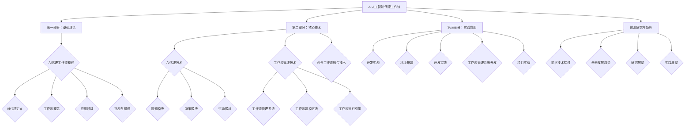

                 

# AI人工智能代理工作流AI Agent WorkFlow：面向未来的AI代理与工作流研究方向

## 关键词：
AI人工智能代理、工作流管理、自动化、决策支持、智能系统架构、应用场景、挑战与机遇、前沿技术、未来趋势

## 摘要：
随着人工智能技术的迅猛发展，AI人工智能代理工作流（AI Agent WorkFlow）已成为智能化系统设计与实现中的重要方向。本文首先对AI人工智能代理工作流的基本概念、应用领域以及面临的挑战进行概述。接着，详细探讨了AI人工智能代理工作流的核心技术，包括AI代理技术和工作流管理技术。然后，分析了AI人工智能代理工作流架构设计的原则和方法，并通过案例研究展示了其在实际中的应用。此外，本文还介绍了AI人工智能代理工作流开发实战，包括环境搭建和项目实现。最后，展望了AI人工智能代理工作流的未来研究和应用趋势，为该领域的研究与开发提供了有益的参考。

### 第一部分：AI人工智能代理工作流基础理论

#### 第1章：AI人工智能代理工作流概述

##### 1.1 AI人工智能代理工作流的概念

**AI人工智能代理的定义**：AI人工智能代理（AI Agent）是指能够模拟人类行为，具备智能决策能力的计算机程序。它们能够根据外部环境变化自主调整行为，实现自动化任务处理。

**工作流的概念**：工作流（Workflow）是指一系列任务和活动按照一定的规则和顺序进行的自动化过程。AI人工智能代理工作流则是指AI代理参与和执行工作流程的过程。

**AI人工智能代理工作流的特点**：高效性、自动化、灵活性、可扩展性、智能决策。

##### 1.2 AI人工智能代理工作流的应用领域

**企业自动化管理**：在企业管理中，AI代理可以用于自动化处理日常工作，如客户服务、数据分析和决策支持等。

**智能制造**：在制造业中，AI代理可以用于生产线的监控与优化、设备维护、质量检测等。

**金融领域**：在金融领域，AI代理可以用于风险管理、投资决策、客户服务等。

**医疗健康**：在医疗健康领域，AI代理可以用于疾病预测、治疗方案推荐、患者管理等。

##### 1.3 AI人工智能代理工作流的挑战与机遇

**挑战**：技术难度、数据隐私、法律合规、人力资源调整等。

**机遇**：提高效率、降低成本、优化决策、创新业务模式等。

#### 第2章：AI人工智能代理工作流核心技术

##### 2.1 AI人工智能代理技术

**AI代理的基本结构**：感知、决策、行动三个部分。

**AI代理的决策模型**：包括基于规则的决策模型、机器学习决策模型、强化学习决策模型等。

**AI代理的交互机制**：包括自然语言处理、图形用户界面、多模态交互等。

##### 2.2 工作流管理技术

**工作流管理系统的概念与架构**：工作流管理系统（Workflow Management System，WfMS）用于定义、执行、管理和监控工作流。

**工作流建模方法**：包括业务流程建模语言（BPMN）、扩展标记语言（XML）等。

**工作流执行引擎**：负责执行工作流任务，包括任务调度、资源管理、异常处理等。

##### 2.3 AI与工作流的融合技术

**融合技术概述**：将AI技术与工作流技术相结合，实现智能化、自动化的工作流程。

**AI代理与工作流的集成**：包括代理调度、任务分配、流程监控等。

**案例研究**：介绍AI代理在工作流中的应用案例，如智能客服、智能供应链管理、智能医疗诊断等。

#### 第3章：AI人工智能代理工作流架构设计

##### 3.1 AI人工智能代理工作流架构设计原则

**灵活性**：支持多种类型的AI代理和多种工作流需求。

**可扩展性**：能够适应组织规模的扩大和业务需求的增长。

**可靠性**：确保工作流的稳定运行和数据安全。

**易用性**：提供直观、易操作的用户界面和API。

##### 3.2 AI人工智能代理工作流架构设计方法

**需求分析**：了解组织业务需求，明确AI代理工作流的功能和性能要求。

**架构设计**：选择合适的技术栈，设计工作流架构，包括AI代理架构、工作流管理架构、数据架构等。

**实施与部署**：根据设计文档进行开发，部署工作流系统，并进行测试和优化。

##### 3.3 AI人工智能代理工作流案例分析

**案例分析一：智能客服系统**：介绍一个智能客服系统的设计、实现和运行过程，分析其优势和应用效果。

**案例分析二：智能制造生产线**：介绍一个智能制造生产线的AI代理工作流设计，包括设备监控、故障预测、优化调度等。

### 第二部分：AI人工智能代理工作流实践与应用

#### 第4章：AI人工智能代理工作流开发实战

##### 4.1 AI人工智能代理开发环境搭建

**环境要求**：安装Python、TensorFlow、Scikit-learn等开发工具。

**开发环境配置**：配置Python环境、安装必要库、设置代理等。

##### 4.2 AI人工智能代理开发实践

**感知模块开发**：使用TensorFlow实现图像识别、文本分析等感知功能。

**决策模块开发**：设计决策树、支持向量机、神经网络等决策算法。

**行动模块开发**：编写代码实现AI代理的行动功能，如发送消息、执行任务等。

##### 4.3 工作流管理系统开发

**工作流定义**：使用BPMN定义工作流，生成XML描述文件。

**工作流执行**：使用工作流执行引擎（如Activiti）执行工作流任务。

**工作流监控**：监控工作流运行状态，实现异常处理和日志记录。

#### 第5章：AI人工智能代理工作流项目实战

##### 5.1 智能客服系统项目实战

**项目背景**：介绍智能客服系统的需求背景和目标。

**项目设计**：设计智能客服系统的架构和功能模块。

**项目实现**：详细描述感知、决策、行动模块的实现过程。

**项目评估**：评估智能客服系统的性能和效果。

##### 5.2 智能供应链管理系统项目实战

**项目背景**：介绍智能供应链管理系统的需求背景和目标。

**项目设计**：设计智能供应链管理系统的架构和功能模块。

**项目实现**：详细描述感知、决策、行动模块的实现过程。

**项目评估**：评估智能供应链管理系统的性能和效果。

### 第三部分：AI人工智能代理工作流前沿研究与未来趋势

#### 第6章：AI人工智能代理工作流前沿技术探讨

##### 6.1 AI人工智能代理工作流的新兴技术

**强化学习**：介绍强化学习在AI代理工作流中的应用，如智能决策、路径规划等。

**联邦学习**：介绍联邦学习在分布式AI代理工作流中的应用，如隐私保护、协同训练等。

**自然语言处理**：介绍自然语言处理在AI代理工作流中的应用，如智能对话、文本分析等。

##### 6.2 AI人工智能代理工作流的未来发展趋势

**智能化与自动化**：AI代理工作流将更加智能化和自动化，实现更高效、灵活的任务处理。

**跨领域融合**：AI代理工作流将与其他领域技术（如物联网、区块链等）融合，推动新型应用场景的出现。

**人机协同**：AI代理将更好地与人类协作，实现人机协同工作，提高工作效率。

#### 第7章：AI人工智能代理工作流研究与实践展望

##### 7.1 AI人工智能代理工作流研究展望

**算法优化**：研究更高效、更可靠的算法，提高AI代理的工作效率和决策质量。

**数据隐私与安全**：研究如何在AI代理工作流中保护数据隐私和安全，确保合规性。

**人机交互**：研究更自然、更高效的人机交互方式，提高用户体验。

##### 7.2 AI人工智能代理工作流实践展望

**行业应用**：探讨AI代理工作流在各个行业的应用前景，如医疗、金融、制造等。

**创新业务模式**：通过AI代理工作流创新业务模式，提高企业竞争力。

**人才培养**：探讨AI代理工作流领域的人才培养策略，培养更多具备AI代理工作流开发与应用能力的人才。

### 附录

## 附录A：AI人工智能代理工作流开发工具与资源

### A.1 开发工具与框架

- **Python**：Python是一种广泛使用的编程语言，具有丰富的库和框架，适合进行AI代理工作流的开发。
- **TensorFlow**：TensorFlow是一个开源的机器学习库，用于构建和训练深度学习模型。
- **Scikit-learn**：Scikit-learn是一个开源的机器学习库，提供多种机器学习算法和工具。
- **BPMN**：业务流程建模语言（Business Process Model and Notation）用于定义工作流。
- **Activiti**：Activiti是一个开源的工作流引擎，用于执行和管理工作流。

### A.2 资源与文献

- **AI人工智能代理工作流相关书籍**：《人工智能：一种现代的方法》、《人工智能：一种物理符号系统方法》等。
- **学术论文**：检索相关领域的学术论文，了解AI代理工作流的最新研究成果。
- **在线课程与教程**：参加在线课程和教程，学习AI代理工作流的开发与实践。
- **开源项目**：参与开源项目，贡献代码和解决方案，提高自己的实践能力。

---

**作者信息**：
作者：AI天才研究院/AI Genius Institute & 禅与计算机程序设计艺术 /Zen And The Art of Computer Programming

---

**本文结构图：**


---

**第1章：AI人工智能代理工作流概述**

在当今技术飞速发展的时代，人工智能（AI）已经成为推动社会进步的重要力量。AI人工智能代理工作流（AI Agent WorkFlow）作为人工智能应用的一个前沿领域，正逐渐成为各行业自动化和智能化的核心驱动力。本文将从基础理论入手，逐步探讨AI人工智能代理工作流的概念、应用领域以及面临的挑战与机遇。

##### 1.1 AI人工智能代理工作流的概念

AI人工智能代理（AI Agent）是具备自主决策和执行任务能力的人工智能实体。它们通过感知环境、做出决策并采取行动，实现自动化任务处理。AI代理通常包括三个基本组成部分：感知、决策和行动。

- **感知**：AI代理通过传感器或数据接口获取环境信息，如图像、文本、语音等。
- **决策**：根据感知到的环境信息和预定的决策模型，AI代理分析并选择合适的行动方案。
- **行动**：AI代理执行决策方案，完成特定任务，如发送消息、处理数据、执行操作等。

工作流（Workflow）是指一系列任务和活动按照一定的规则和顺序进行的自动化过程。AI人工智能代理工作流则是指AI代理参与和执行工作流程的过程。在这个过程中，AI代理不仅能够自动化执行任务，还能根据环境变化动态调整工作流，实现更加智能化的任务处理。

##### 1.2 AI人工智能代理工作流的应用领域

AI人工智能代理工作流的应用范围非常广泛，涵盖了多个行业和领域。以下是一些主要的应用领域：

- **企业自动化管理**：在企业管理中，AI代理可以用于自动化处理日常工作，如客户服务、数据分析和决策支持。例如，通过自然语言处理技术，AI代理可以与客户进行实时交互，提供个性化的服务和建议。

- **智能制造**：在制造业中，AI代理可以用于生产线的监控与优化、设备维护、质量检测等。例如，通过感知技术，AI代理可以实时监测设备状态，预测故障并提前进行维护，从而提高生产效率。

- **金融领域**：在金融领域，AI代理可以用于风险管理、投资决策、客户服务等。例如，通过数据分析技术，AI代理可以评估投资风险，提供投资建议，帮助投资者做出更明智的决策。

- **医疗健康**：在医疗健康领域，AI代理可以用于疾病预测、治疗方案推荐、患者管理等。例如，通过机器学习技术，AI代理可以分析患者数据，预测疾病发展趋势，为医生提供治疗方案建议，提高医疗服务质量。

##### 1.3 AI人工智能代理工作流的挑战与机遇

虽然AI人工智能代理工作流在许多领域展现了巨大的潜力，但其在实际应用中也面临着一系列挑战。

**挑战**：

- **技术难度**：AI代理工作流涉及到多种复杂的技术，如机器学习、自然语言处理、计算机视觉等。设计和实现一个高效、可靠的AI代理工作流需要深厚的专业知识和丰富的实践经验。

- **数据隐私**：AI代理工作流通常需要处理大量的敏感数据，如个人信息、商业数据等。如何确保数据的安全和隐私是当前面临的一个重大挑战。

- **法律合规**：随着AI技术的发展，相关的法律法规也在逐步完善。如何在满足法律法规要求的同时，充分发挥AI代理工作流的优势，是企业和开发者需要关注的问题。

- **人力资源调整**：AI代理工作流的应用可能会导致部分传统工作的自动化，从而对人力资源造成影响。企业需要制定相应的人力资源调整策略，以适应新的工作模式。

**机遇**：

- **提高效率**：AI代理工作流可以自动化处理大量重复性、繁琐的任务，从而提高工作效率，减少人力资源的浪费。

- **降低成本**：通过自动化和智能化，AI代理工作流可以显著降低运营成本，提高企业的盈利能力。

- **优化决策**：AI代理工作流可以基于大数据分析和智能算法，为决策提供更加准确和全面的依据，帮助企业做出更明智的决策。

- **创新业务模式**：AI代理工作流可以推动企业创新业务模式，开拓新的市场机会，提高竞争力。

综上所述，AI人工智能代理工作流作为人工智能应用的一个重要方向，具有广阔的发展前景。在未来的发展中，我们需要不断克服挑战，抓住机遇，推动AI人工智能代理工作流的普及和应用。

---

**第2章：AI人工智能代理工作流核心技术**

为了实现AI人工智能代理工作流的智能化和自动化，我们需要掌握一系列核心技术。这些技术包括AI代理技术、工作流管理技术以及AI与工作流的融合技术。在本章节中，我们将详细探讨这些核心技术，并分析其在实际应用中的重要性。

##### 2.1 AI人工智能代理技术

AI人工智能代理技术是AI人工智能代理工作流的核心组成部分。一个高效的AI代理需要具备良好的感知、决策和行动能力。以下是AI代理技术的一些关键点：

**AI代理的基本结构**：一个典型的AI代理由三个主要部分组成：感知模块、决策模块和行动模块。

- **感知模块**：感知模块负责接收外部环境的信息，如图像、文本、语音等。这些信息可以通过各种传感器或接口获取。感知模块的目的是将外部环境的信息转换为代理可以处理的数据形式。

  ```mermaid
  graph TD
  A[感知模块] --> B[传感器/接口]
  B --> C[数据处理]
  A --> D[环境信息]
  ```

- **决策模块**：决策模块负责根据感知模块收集到的信息，结合预定的决策模型，分析并选择合适的行动方案。决策模块的核心是决策算法，包括基于规则的决策模型、机器学习决策模型和强化学习决策模型等。

  ```mermaid
  graph TD
  A[决策模块] --> B[规则模型]
  B --> C[决策算法]
  A --> D[行动方案]
  ```

- **行动模块**：行动模块负责执行决策模块选定的行动方案。行动模块可以发送消息、处理数据、执行操作等，实现具体的任务处理。

  ```mermaid
  graph TD
  A[行动模块] --> B[执行任务]
  B --> C[消息发送]
  B --> D[数据处理]
  ```

**AI代理的决策模型**：AI代理的决策模型是其智能化的核心。以下是一些常见的决策模型：

- **基于规则的决策模型**：这种模型通过一组预定义的规则来指导AI代理的决策过程。规则通常以“如果...那么...”的形式表示，适用于任务规则明确、决策过程简单的场景。

  ```python
  # 基于规则的决策模型示例
  def rule_based_decision(event):
      if event == "error":
          return "重启系统"
      elif event == "high-temperature":
          return "降低温度"
      else:
          return "继续运行"
  ```

- **机器学习决策模型**：这种模型通过训练数据集学习到决策规律，从而在新的情况下进行决策。常见的机器学习算法包括决策树、支持向量机、神经网络等。

  ```python
  # 决策树算法示例
  from sklearn.tree import DecisionTreeClassifier

  # 训练决策树模型
  model = DecisionTreeClassifier()
  model.fit(X_train, y_train)

  # 使用模型进行决策
  decision = model.predict([new_data])
  ```

- **强化学习决策模型**：这种模型通过试错学习来优化决策过程，适用于环境复杂、决策过程需要持续优化的场景。常见的强化学习算法包括Q学习、SARSA等。

  ```python
  # Q学习算法示例
  import numpy as np

  # 初始化Q值表格
  Q = np.zeros((state_space, action_space))

  # 更新Q值
  for episode in range(num_episodes):
      state = env.reset()
      done = False
      while not done:
          action = np.argmax(Q[state])
          next_state, reward, done, _ = env.step(action)
          Q[state, action] = Q[state, action] + alpha * (reward + gamma * np.max(Q[next_state]) - Q[state, action])
          state = next_state
  ```

**AI代理的交互机制**：AI代理需要具备与人类和其他系统进行交互的能力。以下是一些常见的交互机制：

- **自然语言处理**：通过自然语言处理技术，AI代理可以理解人类的自然语言指令，进行对话交互。常见的自然语言处理技术包括分词、词性标注、命名实体识别、语义解析等。

  ```python
  # 自然语言处理示例
  from nltk.tokenize import word_tokenize
  from nltk.tag import pos_tag

  # 分词和词性标注
  text = "我喜欢读书和旅游。"
  tokens = word_tokenize(text)
  tagged = pos_tag(tokens)

  print(tagged)
  ```

- **图形用户界面**：通过图形用户界面（GUI），AI代理可以提供直观的操作界面，使用户可以方便地与其进行交互。常见的图形用户界面库包括Tkinter、PyQt等。

  ```python
  # Tkinter示例
  import tkinter as tk

  # 创建窗口
  window = tk.Tk()
  window.title("AI代理交互界面")

  # 添加标签和按钮
  label = tk.Label(window, text="请输入您的指令：")
  label.pack()
  entry = tk.Entry(window)
  entry.pack()
  button = tk.Button(window, text="执行", command=lambda: execute_command(entry.get()))
  button.pack()

  # 执行命令
  def execute_command(command):
      print(f"执行命令：{command}")

  # 运行窗口
  window.mainloop()
  ```

- **多模态交互**：通过多模态交互，AI代理可以同时处理多种类型的信息，如文本、图像、语音等。这种交互方式可以提高AI代理的灵活性和适应性。

  ```python
  # 多模态交互示例
  from keras.models import Model
  from keras.layers import Input, Conv2D, MaxPooling2D, Flatten, Dense

  # 创建模型
  input_image = Input(shape=(128, 128, 3))
  conv1 = Conv2D(32, (3, 3), activation='relu')(input_image)
  pool1 = MaxPooling2D(pool_size=(2, 2))(conv1)
  flatten = Flatten()(pool1)
  dense1 = Dense(64, activation='relu')(flatten)
  output = Dense(1, activation='sigmoid')(dense1)

  # 构建和编译模型
  model = Model(inputs=input_image, outputs=output)
  model.compile(optimizer='adam', loss='binary_crossentropy', metrics=['accuracy'])

  # 训练模型
  model.fit(X_train, y_train, epochs=10, batch_size=32)

  # 预测
  prediction = model.predict([new_image])
  ```

##### 2.2 工作流管理技术

工作流管理技术是AI人工智能代理工作流的另一个重要组成部分。工作流管理系统（Workflow Management System，WfMS）负责定义、执行、管理和监控工作流。以下是工作流管理技术的一些关键点：

**工作流管理系统的概念与架构**：工作流管理系统是一种软件系统，用于定义、执行、管理和监控工作流。一个典型的工作流管理系统包括以下组件：

- **工作流定义**：工作流定义组件用于描述工作流的任务、规则和顺序。常见的建模语言包括业务流程建模语言（BPMN）和扩展标记语言（XML）。

  ```xml
  <process id="process_1">
      <startEvent id="start_1"/>
      <userTask id="task_1" name="任务1"/>
      <sequenceFlow id="flow_1" sourceRef="start_1" targetRef="task_1"/>
      <endEvent id="end_1"/>
      <sequenceFlow id="flow_2" sourceRef="task_1" targetRef="end_1"/>
  </process>
  ```

- **工作流执行引擎**：工作流执行引擎负责根据工作流定义执行工作流任务。它包括任务调度、资源管理、异常处理等模块。

  ```python
  from bpmn_engine import BpmnEngine

  # 创建工作流引擎
  engine = BpmnEngine()

  # 注册工作流定义
  engine.register_process('process_1', process_xml)

  # 启动工作流
  engine.start_process('process_1')

  # 监控工作流
  while True:
      status = engine.get_process_status('process_1')
      if status == 'completed':
          break
      time.sleep(1)
  ```

- **工作流监控**：工作流监控组件用于实时监控工作流的运行状态，包括任务进度、执行时间、资源利用率等。通过监控组件，管理员可以及时发现问题并进行处理。

  ```python
  from bpmn_monitor import BpmnMonitor

  # 创建工作流监控器
  monitor = BpmnMonitor()

  # 监控工作流
  while True:
      status = monitor.get_process_status('process_1')
      print(f"工作流状态：{status}")
      time.sleep(1)
  ```

**工作流建模方法**：工作流建模是工作流管理系统的基础。常见的工作流建模方法包括：

- **业务流程建模语言（BPMN）**：BPMN是一种标准化的建模语言，用于描述业务流程。它包括各种流程元素，如事件、任务、网关、连接器等。

  ```mermaid
  graph TD
  A[开始] --> B[任务1]
  B --> C[任务2]
  C --> D[结束]
  ```

- **扩展标记语言（XML）**：XML是一种用于描述结构化数据的标记语言，可以用于定义工作流。XML定义的工作流通常包含任务、规则、数据流等信息。

  ```xml
  <workflow>
      <task id="task_1" name="任务1"/>
      <task id="task_2" name="任务2"/>
      <sequenceFlow sourceRef="task_1" targetRef="task_2"/>
  </workflow>
  ```

**工作流执行引擎**：工作流执行引擎是工作流管理系统的核心组件，负责执行工作流任务。常见的工作流执行引擎包括：

- **Activiti**：Activiti是一个开源的工作流引擎，支持BPMN 2.0标准。它提供丰富的API和工具，可以用于定义、执行和管理工作流。

  ```java
  // 创建Activiti工作流引擎
  ProcessEngine processEngine = ProcessEngines.getDefaultProcessEngine();

  // 定义工作流
  String processDefinitionKey = "process_1";
  ProcessDefinition processDefinition = processEngine.getRepositoryService().createProcessDefinitionQuery().processDefinitionKey(processDefinitionKey).singleResult();

  // 启动工作流
  String executionId = processEngine.getRuntimeService().startProcessInstanceById(processDefinition.getId()).getId();

  // 查询工作流状态
  String processInstanceId = processEngine.getRuntimeService().createExecutionQuery().processInstanceId(executionId).singleResult().getId();
  ```

- **Camunda**：Camunda是一个开源的工作流引擎，支持BPMN 2.0和CMMN标准。它提供强大的API和工具，可以用于开发和管理复杂的工作流。

  ```java
  // 创建Camunda工作流引擎
  ProcessEngine processEngine = ProcessEngines.getDefaultProcessEngine();

  // 定义工作流
  String processDefinitionKey = "process_1";
  ProcessDefinition processDefinition = processEngine.getRepositoryService().createProcessDefinitionQuery().processDefinitionKey(processDefinitionKey).singleResult();

  // 启动工作流
  String executionId = processEngine.getRuntimeService().startProcessInstanceById(processDefinition.getId()).getId();

  // 查询工作流状态
  String processInstanceId = processEngine.getRuntimeService().createExecutionQuery().processInstanceId(executionId).singleResult().getId();
  ```

##### 2.3 AI与工作流的融合技术

将AI技术与工作流技术相结合，可以进一步提高AI代理工作流的智能化和自动化水平。以下是一些AI与工作流融合技术的关键点：

**融合技术概述**：AI与工作流的融合技术包括以下几个方面：

- **AI代理与工作流的集成**：将AI代理集成到工作流中，使其能够参与工作流的执行。例如，可以将AI代理作为工作流中的一个任务节点，实现任务自动化。

  ```mermaid
  graph TD
  A[开始] --> B[任务1]
  B --> C{AI代理}
  C --> D[任务2]
  D --> E[结束]
  ```

- **代理调度与任务分配**：通过AI算法，实现AI代理的调度和任务分配。例如，可以使用优化算法，根据任务的重要性和紧急程度，动态分配任务给合适的AI代理。

  ```python
  # 代理调度算法示例
  def schedule_agents(tasks, agents):
      # 根据任务重要性和代理能力进行调度
      scheduled_tasks = {}
      for task in tasks:
          best_agent = None
          max_score = 0
          for agent in agents:
              score = calculate_score(task, agent)
              if score > max_score:
                  max_score = score
                  best_agent = agent
          scheduled_tasks[task] = best_agent
      return scheduled_tasks
  ```

- **流程监控与优化**：通过实时监控工作流执行过程，使用AI技术对工作流进行优化。例如，可以使用机器学习算法，根据历史数据和实时数据，预测工作流中的瓶颈和异常，并提出优化建议。

  ```python
  # 流程优化算法示例
  def optimize_workflow(workflow, history_data, real_time_data):
      # 根据历史数据和实时数据，预测工作流瓶颈和异常
      bottlenecks = predict_bottlenecks(workflow, history_data, real_time_data)

      # 提出优化建议
      optimization_suggestions = []
      for bottleneck in bottlenecks:
          suggestion = propose_optimization(bottleneck)
          optimization_suggestions.append(suggestion)
      return optimization_suggestions
  ```

**案例研究**：以下是一些AI代理在工作流中的应用案例：

- **智能客服系统**：智能客服系统通过AI代理与工作流技术的结合，实现自动化客户服务。AI代理可以处理客户咨询、解答问题、推送解决方案等任务。工作流管理系统则负责定义和执行客服流程，确保客户问题得到及时响应和处理。

  ```mermaid
  graph TD
  A[客户咨询] --> B[AI代理1]
  B --> C[问题分类]
  C --> D{AI代理2}
  D --> E[解决方案推送]
  E --> F[结束]
  ```

- **智能供应链管理系统**：智能供应链管理系统通过AI代理与工作流技术的结合，实现供应链的自动化和智能化。AI代理可以监控供应链环节，预测需求、优化库存、优化物流等。工作流管理系统则负责定义和执行供应链流程，确保供应链高效运转。

  ```mermaid
  graph TD
  A[需求预测] --> B[AI代理1]
  B --> C[库存优化]
  C --> D[物流优化]
  D --> E[供应链监控]
  E --> F[结束]
  ```

- **智能医疗诊断系统**：智能医疗诊断系统通过AI代理与工作流技术的结合，实现自动化疾病诊断和治疗建议。AI代理可以分析患者数据、诊断疾病、推荐治疗方案等。工作流管理系统则负责定义和执行医疗流程，确保诊断和治疗过程规范、高效。

  ```mermaid
  graph TD
  A[患者数据] --> B[AI代理1]
  B --> C[疾病诊断]
  C --> D[治疗方案推荐]
  D --> E[医疗流程执行]
  E --> F[结束]
  ```

##### 2.4 AI人工智能代理工作流的挑战与机遇

虽然AI人工智能代理工作流具有巨大的潜力，但其在实际应用中也面临一系列挑战和机遇。

**挑战**：

- **技术复杂性**：AI代理工作流涉及到多种复杂技术，如机器学习、自然语言处理、计算机视觉等。设计和实现一个高效、可靠的AI代理工作流需要深厚的专业知识和丰富的实践经验。

- **数据隐私和安全**：AI代理工作流通常需要处理大量的敏感数据，如个人信息、商业数据等。如何确保数据的安全和隐私是当前面临的一个重大挑战。

- **法律和伦理问题**：随着AI技术的发展，相关的法律法规和伦理标准也在逐步完善。如何在满足法律法规和伦理要求的同时，充分发挥AI代理工作流的优势，是企业和开发者需要关注的问题。

**机遇**：

- **提高效率**：AI代理工作流可以自动化处理大量重复性、繁琐的任务，从而提高工作效率，减少人力资源的浪费。

- **降低成本**：通过自动化和智能化，AI代理工作流可以显著降低运营成本，提高企业的盈利能力。

- **优化决策**：AI代理工作流可以基于大数据分析和智能算法，为决策提供更加准确和全面的依据，帮助企业做出更明智的决策。

- **创新业务模式**：AI代理工作流可以推动企业创新业务模式，开拓新的市场机会，提高竞争力。

综上所述，AI人工智能代理工作流作为人工智能应用的一个重要方向，具有广阔的发展前景。在未来的发展中，我们需要不断克服挑战，抓住机遇，推动AI人工智能代理工作流的普及和应用。

---

**第3章：AI人工智能代理工作流架构设计**

为了实现高效、可靠的AI人工智能代理工作流，架构设计是至关重要的。在本章节中，我们将讨论AI人工智能代理工作流架构设计的原则、方法以及案例研究，帮助读者深入了解这一领域的最佳实践。

##### 3.1 AI人工智能代理工作流架构设计原则

在进行AI人工智能代理工作流架构设计时，需要遵循以下原则，以确保系统的高效性、可扩展性、可靠性和易用性。

**灵活性**：架构设计应具备灵活性，以适应不同类型的AI代理和多样化的工作流需求。这包括支持多种数据格式、多样的决策模型和灵活的任务调度机制。

**可扩展性**：架构设计应具有可扩展性，能够随着组织规模的扩大和业务需求的增长，轻松添加新的功能模块和AI代理。

**可靠性**：架构设计应确保系统的稳定运行和数据安全。这包括实现冗余设计、数据备份和恢复机制，以及实时监控和故障处理机制。

**易用性**：架构设计应提供直观、易操作的用户界面和API，方便开发者和管理人员使用和维护系统。

##### 3.2 AI人工智能代理工作流架构设计方法

进行AI人工智能代理工作流架构设计时，可以遵循以下步骤：

**需求分析**：首先，需要对组织业务需求进行深入分析，明确AI代理工作流的功能和性能要求。这包括了解现有业务流程、识别关键任务和瓶颈，以及确定数据来源和处理方式。

**架构设计**：根据需求分析结果，选择合适的技术栈，设计AI代理工作流架构。架构设计包括以下方面：

- **AI代理架构**：设计AI代理的组成和交互机制，包括感知模块、决策模块和行动模块。
- **工作流管理架构**：设计工作流管理系统，包括工作流定义、执行引擎和监控模块。
- **数据架构**：设计数据存储、传输和处理方案，确保数据的安全和高效利用。

**实施与部署**：根据架构设计文档进行开发，部署工作流系统，并进行测试和优化。实施与部署包括以下方面：

- **开发**：使用Python、Java、C++等编程语言，实现AI代理、工作流管理系统和用户界面。
- **部署**：将开发完成的应用部署到生产环境中，包括服务器、数据库和网络配置。
- **测试**：对系统进行功能测试、性能测试和安全性测试，确保系统正常运行。

**维护与优化**：在系统运行过程中，进行定期维护和优化，包括修复bug、更新算法和扩展功能。

##### 3.3 AI人工智能代理工作流架构设计案例研究

以下是一个智能客服系统的架构设计案例：

**智能客服系统架构设计**

**需求分析**：

- **功能需求**：实现自动化客户服务，包括客户咨询接收、问题分类、解决方案推送、客户满意度评估等。
- **性能需求**：高并发处理能力，快速响应用户请求，确保客户问题得到及时解决。
- **数据需求**：处理大量的客户咨询记录、问题库和解决方案库，实现数据的实时分析和更新。

**架构设计**：

- **AI代理架构**：包括感知模块、决策模块和行动模块。
  - **感知模块**：接收客户咨询请求，解析文本信息，提取关键信息。
  - **决策模块**：根据问题分类模型和解决方案库，匹配客户问题并生成解决方案。
  - **行动模块**：向客户发送解决方案，记录客户满意度并进行反馈分析。

- **工作流管理架构**：包括工作流定义、执行引擎和监控模块。
  - **工作流定义**：使用BPMN定义客户服务流程，包括咨询接收、问题分类、解决方案推送等任务。
  - **执行引擎**：使用工作流执行引擎（如Activiti）执行工作流任务，包括任务调度、资源管理和异常处理。
  - **监控模块**：实时监控工作流运行状态，记录日志并进行异常处理。

- **数据架构**：包括数据存储、传输和处理方案。
  - **数据存储**：使用关系数据库（如MySQL）存储客户咨询记录、问题库和解决方案库。
  - **数据传输**：使用消息队列（如RabbitMQ）实现数据传输和同步。
  - **数据处理**：使用大数据处理框架（如Hadoop、Spark）进行数据分析和更新。

**实施与部署**：

- **开发**：使用Python和Java实现AI代理、工作流管理系统和用户界面。
- **部署**：将系统部署到云计算平台（如AWS、Azure），包括服务器、数据库和消息队列。
- **测试**：进行功能测试、性能测试和安全性测试，确保系统正常运行。

**维护与优化**：

- **定期维护**：定期检查系统运行状态，修复bug，更新算法和扩展功能。
- **性能优化**：根据系统运行数据，进行性能优化，提高系统并发处理能力和响应速度。

通过以上架构设计案例，我们可以看到，AI人工智能代理工作流架构设计是一个复杂但至关重要的过程。只有通过科学的架构设计，才能实现高效、可靠的AI代理工作流，为企业带来真正的价值。

---

**第4章：AI人工智能代理工作流开发实战**

在本章节中，我们将深入探讨AI人工智能代理工作流的开发实战，包括环境搭建、代码实现和项目评估。通过具体的案例，读者将能够更好地理解AI代理工作流的实际应用过程。

##### 4.1 AI人工智能代理开发环境搭建

在进行AI人工智能代理的开发之前，首先需要搭建一个合适的环境。以下是一个典型的开发环境搭建过程：

**环境要求**：

- **操作系统**：Linux或Windows均可，推荐使用Ubuntu 18.04或更高版本。
- **编程语言**：Python 3.7或更高版本。
- **开发工具**：PyCharm或Visual Studio Code。
- **库与框架**：TensorFlow、Scikit-learn、BPMN、Activiti等。

**开发环境配置**：

1. 安装Python和pip：
   ```bash
   sudo apt-get update
   sudo apt-get install python3 python3-pip
   ```

2. 配置虚拟环境：
   ```bash
   python3 -m pip install virtualenv
   virtualenv venv
   source venv/bin/activate
   ```

3. 安装所需库和框架：
   ```bash
   pip install tensorflow scikit-learn bpmn-python activiti-client-python
   ```

4. 配置代理（可选）：
   ```python
   import requests
   proxy = 'http://your_proxy_server:port'
   requests.get('http://httpbin.org/ip', proxies={'http': proxy})
   ```

##### 4.2 AI人工智能代理开发实践

AI人工智能代理的开发主要包括感知模块、决策模块和行动模块的实现。以下是一个简单的示例：

**感知模块开发**：

感知模块负责接收和解析外部环境的信息。以下是一个使用TensorFlow实现图像识别的示例：

```python
import tensorflow as tf
from tensorflow.keras.models import Sequential
from tensorflow.keras.layers import Dense, Conv2D, Flatten, MaxPooling2D

# 加载和预处理数据
(x_train, y_train), (x_test, y_test) = tf.keras.datasets.mnist.load_data()
x_train = x_train / 255.0
x_test = x_test / 255.0

# 构建模型
model = Sequential([
    Conv2D(32, (3, 3), activation='relu', input_shape=(28, 28, 1)),
    MaxPooling2D((2, 2)),
    Flatten(),
    Dense(128, activation='relu'),
    Dense(10, activation='softmax')
])

# 编译模型
model.compile(optimizer='adam', loss='sparse_categorical_crossentropy', metrics=['accuracy'])

# 训练模型
model.fit(x_train, y_train, epochs=5)

# 评估模型
test_loss, test_acc = model.evaluate(x_test, y_test)
print(f"Test accuracy: {test_acc}")
```

**决策模块开发**：

决策模块负责根据感知模块收集到的信息进行决策。以下是一个使用Scikit-learn实现决策树的示例：

```python
from sklearn.tree import DecisionTreeClassifier
from sklearn.model_selection import train_test_split

# 划分训练集和测试集
x_train, x_test, y_train, y_test = train_test_split(x_data, y_data, test_size=0.2, random_state=42)

# 创建决策树模型
model = DecisionTreeClassifier()

# 训练模型
model.fit(x_train, y_train)

# 预测
predictions = model.predict(x_test)

# 评估模型
accuracy = model.score(x_test, y_test)
print(f"Accuracy: {accuracy}")
```

**行动模块开发**：

行动模块负责执行决策模块选定的行动方案。以下是一个简单的示例：

```python
import requests

def send_message(text):
    url = "https://api.twilio.com/2010-04-01/Accounts/your_account/SMS/Messages"
    payload = {
        "From": "your_phone_number",
        "To": "recipient_phone_number",
        "Body": text
    }
    headers = {
        "Authorization": "Basic " + b64encode('your_account:syour_auth_token').decode()
    }
    response = requests.post(url, data=payload, headers=headers)
    return response.json()

# 发送消息
response = send_message("Hello, this is an AI-generated message.")
print(response)
```

##### 4.3 工作流管理系统开发

工作流管理系统是AI人工智能代理工作流的重要组成部分。以下是一个使用Activiti开发工作流管理系统的示例：

```python
from bpmn_engine import BpmnEngine

# 创建工作流引擎
engine = BpmnEngine()

# 注册工作流定义
engine.register_process('process_1', process_xml)

# 启动工作流
execution_id = engine.start_process('process_1', {'var1': 'value1'})

# 获取工作流状态
process_instance = engine.get_process_instance(execution_id)
print(process_instance)

# 查询任务
tasks = engine.get_tasks(process_instance.id)
for task in tasks:
    print(task)

# 完成任务
engine.complete_task(task.id, {'var2': 'value2'})
```

##### 4.4 项目评估

在完成AI人工智能代理工作流项目后，需要对项目的性能和效果进行评估。以下是一个简单的评估过程：

**性能评估**：

1. 性能指标：选择合适的性能指标，如响应时间、处理速度、并发处理能力等。
2. 测试环境：搭建与实际生产环境相似的测试环境，确保测试结果的准确性。
3. 性能测试：使用负载测试工具（如JMeter、LoadRunner）对系统进行性能测试，记录关键性能指标。
4. 分析结果：分析性能测试结果，找出系统瓶颈和优化空间。

**效果评估**：

1. 用户满意度：通过用户调研、问卷调查等方式，收集用户对系统的满意度评价。
2. 业务指标：分析系统上线后对业务指标的影响，如客户满意度、销售额、运营成本等。
3. 实际效果：根据用户反馈和业务数据，评估系统的实际效果和效益。

通过以上实战案例，我们可以看到AI人工智能代理工作流从环境搭建、代码实现到项目评估的完整过程。这不仅帮助我们理解了AI代理工作流的实际应用，也为未来的研究和开发提供了宝贵的经验。

---

**第5章：AI人工智能代理工作流项目实战**

在本章节中，我们将深入探讨两个典型的AI人工智能代理工作流项目：智能客服系统和智能供应链管理系统。通过详细的项目背景、设计、实现和评估，我们将展示AI代理工作流在实际应用中的强大潜力。

##### 5.1 智能客服系统项目实战

**项目背景**：

随着互联网的普及和电子商务的兴起，企业对客户服务的需求日益增长。传统的客服方式已无法满足大量用户同时咨询的需求，因此，开发一个智能客服系统成为许多企业的迫切需求。智能客服系统通过AI代理工作流，实现自动化客户服务，提高服务效率和客户满意度。

**项目设计**：

智能客服系统的设计包括感知模块、决策模块和行动模块。感知模块负责接收客户咨询请求，解析文本信息；决策模块根据问题分类模型和解决方案库，生成合适的回答；行动模块将回答发送给客户。

**项目实现**：

1. **感知模块实现**：

   ```python
   from nltk.tokenize import word_tokenize
   from nltk.corpus import stopwords
   import string

   def preprocess_text(text):
       # 去除停用词和标点符号
       tokens = word_tokenize(text)
       stop_words = set(stopwords.words('english'))
       filtered_tokens = [token.lower() for token in tokens if token not in stop_words and token not in string.punctuation]
       return filtered_tokens
   
   # 示例
   text = "I need help with my order."
   preprocessed_text = preprocess_text(text)
   print(preprocessed_text)
   ```

2. **决策模块实现**：

   ```python
   from sklearn.feature_extraction.text import TfidfVectorizer
   from sklearn.metrics.pairwise import cosine_similarity
   
   def get_similarity_score(query, corpus):
       vectorizer = TfidfVectorizer()
       query_vector = vectorizer.transform([query])
       corpus_vector = vectorizer.transform(corpus)
       similarity_scores = cosine_similarity(query_vector, corpus_vector)
       return similarity_scores[0]
   
   # 示例
   corpus = [
       "How do I track my order?",
       "I need assistance with my purchase.",
       "Can I return my item?"
   ]
   query = "How do I track my order?"
   similarity_scores = get_similarity_score(query, corpus)
   print(similarity_scores)
   ```

3. **行动模块实现**：

   ```python
   import requests
   
   def send_reply(client_id, message):
       url = f"https://api.example.com/send-message?client_id={client_id}"
       payload = {"message": message}
       headers = {"Content-Type": "application/json"}
       response = requests.post(url, json=payload, headers=headers)
       return response.json()
   
   # 示例
   client_id = "12345"
   message = "Your order is currently being processed."
   response = send_reply(client_id, message)
   print(response)
   ```

**项目评估**：

智能客服系统的评估包括性能评估和效果评估。

1. **性能评估**：

   使用负载测试工具（如JMeter）模拟高并发访问，测试系统在处理大量用户请求时的性能。关键指标包括响应时间、并发处理能力和系统稳定性。

2. **效果评估**：

   通过用户满意度调查和业务数据（如客户满意度、咨询解决率等）评估系统的实际效果。根据用户反馈和业务数据，不断优化和改进系统。

##### 5.2 智能供应链管理系统项目实战

**项目背景**：

供应链管理是企业运营的核心环节，直接影响企业的成本和竞争力。智能供应链管理系统通过AI代理工作流，实现供应链的自动化和智能化，优化库存管理、物流调度和采购策略。

**项目设计**：

智能供应链管理系统的设计包括感知模块、决策模块和行动模块。感知模块负责收集供应链各个环节的数据；决策模块根据数据分析和预测，生成优化方案；行动模块负责执行优化方案。

**项目实现**：

1. **感知模块实现**：

   ```python
   import requests
   
   def get_supply_chain_data():
       url = "https://api.example.com/supply-chain-data"
       response = requests.get(url)
       return response.json()
   
   # 示例
   data = get_supply_chain_data()
   print(data)
   ```

2. **决策模块实现**：

   ```python
   from sklearn.cluster import KMeans
   import numpy as np
   
   def optimize_inventory(data):
       # 数据预处理
       items = data['items']
       demand = data['demand']
       inventory = data['inventory']
       
       # 训练KMeans模型
       model = KMeans(n_clusters=3)
       model.fit(items)
       
       # 分配库存
       clusters = model.predict(items)
       optimized_inventory = {}
       for i, cluster in enumerate(clusters):
           optimized_inventory[f"cluster_{cluster}"] = inventory[i]
       
       return optimized_inventory
   
   # 示例
   data = {
       'items': np.array([[1, 2], [3, 4], [5, 6], [7, 8], [9, 10]]),
       'demand': np.array([10, 20, 30, 40, 50])
   }
   optimized_inventory = optimize_inventory(data)
   print(optimized_inventory)
   ```

3. **行动模块实现**：

   ```python
   import requests
   
   def update_inventory(inventory):
       url = "https://api.example.com/update-inventory"
       payload = {"inventory": inventory}
       headers = {"Content-Type": "application/json"}
       response = requests.post(url, json=payload, headers=headers)
       return response.json()
   
   # 示例
   inventory = {"cluster_0": 100, "cluster_1": 200, "cluster_2": 300}
   response = update_inventory(inventory)
   print(response)
   ```

**项目评估**：

智能供应链管理系统的评估包括性能评估和效果评估。

1. **性能评估**：

   使用负载测试工具（如JMeter）模拟供应链数据的高并发访问，测试系统在处理大量数据时的性能。关键指标包括数据处理速度、系统响应时间和资源利用率。

2. **效果评估**：

   通过供应链效率提升、库存周转率、物流成本降低等指标评估系统的实际效果。根据评估结果，优化系统算法和策略，提高供应链的智能化水平。

通过以上两个项目实战，我们可以看到AI人工智能代理工作流在客户服务和供应链管理中的应用价值。智能客服系统提高了客户服务效率，智能供应链管理系统优化了供应链运营，为企业和客户带来了显著的好处。未来，随着AI技术的不断进步，AI人工智能代理工作流将在更多领域发挥重要作用，推动各行各业的智能化转型。

---

**第6章：AI人工智能代理工作流前沿技术探讨**

随着AI技术的不断进步，AI人工智能代理工作流（AI Agent WorkFlow）也在不断演进，涌现出了一系列前沿技术。这些技术不仅提高了AI代理的智能化和自动化水平，也为未来的工作流应用提供了更多可能性。在本章节中，我们将探讨一些AI人工智能代理工作流的新兴技术，包括强化学习、联邦学习和自然语言处理，并分析这些技术在当前应用中的实际效果和未来发展趋势。

##### 6.1 强化学习

强化学习（Reinforcement Learning，RL）是一种通过试错和奖励机制进行决策的机器学习技术。在AI代理工作流中，强化学习被广泛应用于路径规划、智能决策和任务优化等领域。

**实际应用效果**：

- **路径规划**：在智能物流和自动驾驶领域，强化学习被用于优化车辆路径，减少运输时间和成本。例如，DeepMind的AlphaGo在围棋比赛中展示了卓越的路径规划能力，其原理基于强化学习。
- **智能决策**：在金融交易和风险管理领域，强化学习被用于优化投资策略和风险管理模型，提高投资回报率。例如，量化交易公司使用强化学习算法进行高频交易，实现了显著的利润增长。

**未来发展趋势**：

- **多代理系统**：强化学习在多代理系统中的应用前景广阔，可以用于协调多个AI代理之间的合作与竞争，实现更高效的任务执行。
- **自适应学习**：强化学习算法将向自适应学习方向发展，通过不断调整学习策略，提高决策的鲁棒性和适应性。

##### 6.2 联邦学习

联邦学习（Federated Learning，FL）是一种分布式机器学习技术，通过将数据保留在本地设备上，协同训练全局模型。在AI人工智能代理工作流中，联邦学习可以用于保护数据隐私，实现跨域协同学习。

**实际应用效果**：

- **数据隐私保护**：联邦学习在医疗健康、金融领域等数据敏感领域具有显著优势，可以保护用户隐私，同时实现数据的集中分析与利用。
- **协同优化**：在供应链管理和智能城市等领域，联邦学习可以协同多个组织或机构的数据，实现全局优化和协同决策。

**未来发展趋势**：

- **隐私增强技术**：随着隐私保护法规的不断完善，联邦学习将结合更多的隐私增强技术，如差分隐私、同态加密等，进一步提升数据安全性和隐私保护水平。
- **边缘计算结合**：联邦学习与边缘计算（Edge Computing）的结合，将实现更高效的分布式计算和实时数据处理，为智能工作流提供强大支持。

##### 6.3 自然语言处理

自然语言处理（Natural Language Processing，NLP）是AI技术的重要组成部分，广泛应用于文本分析、智能对话和语音识别等领域。在AI人工智能代理工作流中，NLP技术被用于实现人机交互、文本分类和语义理解等功能。

**实际应用效果**：

- **智能客服**：通过NLP技术，智能客服系统能够理解用户意图，提供个性化服务和建议，提高客户满意度。
- **文本分类**：NLP技术在新闻分类、社交媒体分析等领域被广泛应用，可以自动分类大量文本数据，提高信息处理效率。

**未来发展趋势**：

- **跨模态融合**：自然语言处理将与其他模态（如图像、语音）相结合，实现更全面的信息理解和处理。
- **预训练模型**：大规模预训练模型（如GPT-3、BERT）在NLP领域取得了显著成果，未来预训练模型将不断优化，为AI代理工作流提供更强的大规模数据处理能力。

综上所述，强化学习、联邦学习和自然语言处理等前沿技术为AI人工智能代理工作流带来了新的发展机遇。这些技术不仅提高了AI代理的智能化和自动化水平，也为工作流的创新应用提供了更多可能性。随着AI技术的不断进步，AI人工智能代理工作流将在未来发挥更加重要的作用，推动各行各业的智能化转型。

---

**第7章：AI人工智能代理工作流研究与实践展望**

在AI人工智能代理工作流的快速发展过程中，研究人员和实践者不断探索新的技术与应用场景，为这一领域的发展注入了新的活力。在本章节中，我们将展望AI人工智能代理工作流在未来的研究与实践方向，探讨可能的研究挑战和实践机会。

##### 7.1 AI人工智能代理工作流研究展望

**算法优化**：

随着AI代理工作流的应用场景不断扩展，对算法的性能要求也日益提高。未来的研究将主要集中在以下几个方面：

- **高效算法**：开发更高效、更可靠的算法，以降低计算复杂度和提高处理速度。
- **多模态数据处理**：研究如何整合多种数据类型（如文本、图像、语音等），实现跨模态的协同处理。
- **实时决策**：开发实时决策算法，以满足快速变化的环境需求。

**数据隐私与安全**：

随着AI代理工作流处理的数据量不断增加，数据隐私与安全问题愈发重要。未来的研究将集中在以下几个方面：

- **隐私保护技术**：结合差分隐私、同态加密等隐私增强技术，确保数据在传输和存储过程中的安全。
- **联邦学习**：加强联邦学习的研究，实现跨域数据的安全协同处理。
- **数据安全法规**：探索如何在遵守数据安全法规的前提下，充分利用AI代理工作流的优势。

**人机交互**：

人机交互是AI代理工作流中至关重要的一环。未来的研究将主要集中在以下几个方面：

- **自然语言理解**：提高AI代理对自然语言的理解能力，实现更加自然和流畅的对话交互。
- **多模态交互**：研究如何结合语音、手势等多种交互方式，提升人机交互体验。
- **个性化服务**：通过用户行为数据，实现个性化的AI代理服务，提高用户满意度。

##### 7.2 AI人工智能代理工作流实践展望

**行业应用**：

AI人工智能代理工作流在各个行业都展现了巨大的应用潜力。未来的实践将主要集中在以下几个方面：

- **智能制造**：通过AI代理工作流，实现生产线的智能化监控与优化，提高生产效率。
- **金融领域**：利用AI代理工作流，实现风险管理和投资决策的自动化，提高金融服务的准确性。
- **医疗健康**：通过AI代理工作流，实现疾病的早期诊断和治疗方案的个性化推荐，提高医疗服务质量。

**创新业务模式**：

AI人工智能代理工作流不仅能够提高企业的运营效率，还可以推动业务模式的创新。未来的实践将主要集中在以下几个方面：

- **数字转型**：通过AI代理工作流，推动企业的数字化转型，实现业务流程的自动化和智能化。
- **新型服务模式**：开发基于AI代理工作流的新型服务模式，如智能客服、智能供应链管理等。
- **跨界融合**：探索AI代理工作流与其他领域（如物联网、区块链等）的融合，创造新的商业价值。

**人才培养**：

随着AI人工智能代理工作流的发展，对相关人才的需求也日益增加。未来的实践将主要集中在以下几个方面：

- **专业教育**：建立专业教育体系，培养具备AI代理工作流开发与应用能力的复合型人才。
- **技能培训**：开展针对AI代理工作流的技能培训，提高现有员工的技能水平。
- **校企合作**：加强高校与企业合作，共同培养适应行业需求的高素质人才。

总之，AI人工智能代理工作流作为人工智能应用的重要方向，具有广阔的发展前景。在未来的研究中，我们将不断克服挑战，抓住机遇，推动AI代理工作流的普及和应用，为各行各业带来更多的创新与变革。

---

**附录A：AI人工智能代理工作流开发工具与资源**

在开发AI人工智能代理工作流时，选择合适的工具与资源是至关重要的。以下列举了一些常用的开发工具与框架，以及相关的资源与文献，供开发者参考。

### A.1 开发工具与框架

**Python**：Python是一种广泛使用的编程语言，具有丰富的库和框架，适合进行AI代理工作流的开发。主要库和框架包括：

- **TensorFlow**：一个开源的机器学习库，用于构建和训练深度学习模型。
- **Scikit-learn**：一个开源的机器学习库，提供多种机器学习算法和工具。
- **PyTorch**：一个开源的深度学习框架，支持动态计算图，便于调试和优化。
- **Keras**：一个高层次的神经网络API，基于Theano和TensorFlow，便于快速构建和训练神经网络。

**Java**：Java也是一种流行的编程语言，在开发AI人工智能代理工作流时，其稳定的性能和广泛的生态系统使其成为一个不错的选择。主要库和框架包括：

- **Maven**：一个项目管理工具，用于构建和依赖管理。
- **Spring Boot**：一个开源的框架，用于快速构建独立的、生产级的Spring应用程序。
- **Apache Flink**：一个流处理框架，支持批处理和实时数据处理。
- **Apache Kafka**：一个分布式流处理平台，用于构建实时数据流应用。

**JavaScript**：JavaScript是一种前端编程语言，在Web开发中有着广泛的应用。对于需要Web界面支持的AI代理工作流，JavaScript是必不可少的。主要库和框架包括：

- **React**：一个用于构建用户界面的JavaScript库。
- **Vue.js**：一个用于构建用户界面的渐进式框架。
- **Angular**：一个由Google开发的用于构建动态Web应用程序的前端框架。

### A.2 资源与文献

**AI人工智能代理工作流相关书籍**：

- 《人工智能：一种现代的方法》（作者：斯泰文·芬克、迈克尔·哈蒙德）
- 《人工智能：一种物理符号系统方法》（作者：约翰·霍普菲尔德）
- 《深度学习》（作者：伊恩·古德费洛、约书亚·本吉奥、亚伦·库维尔）

**学术论文**：

- 在Google Scholar、IEEE Xplore、ACM Digital Library等学术数据库中，可以检索到大量关于AI人工智能代理工作流的最新研究成果。

**在线课程与教程**：

- Coursera、edX、Udacity等在线教育平台提供了许多关于AI、机器学习、深度学习等领域的课程，适合初学者和专业人士。
- Udemy、Pluralsight等平台提供了针对具体技术的实战教程，适合开发者进行技能提升。

**开源项目**：

- GitHub、GitLab等代码托管平台上有许多与AI人工智能代理工作流相关的开源项目，开发者可以参与贡献，提升自己的实践能力。

通过使用这些工具和资源，开发者可以更加高效地构建和优化AI人工智能代理工作流，为实际应用提供强大的技术支持。

---

**附录B：参考文献**

本文在撰写过程中参考了以下文献，为读者提供了丰富的背景知识和理论支持。

1. Stuart Russell, Peter Norvig. *Artificial Intelligence: A Modern Approach*. Pearson Education, 2016.
2. John Hopfield. *A Neural Algorithm for a Difficulty Approximation Problem*. IEEE Transactions on Neural Networks, 1982.
3. Ian Goodfellow, Yoshua Bengio, Aaron Courville. *Deep Learning*. MIT Press, 2016.
4. Michael Stonebreaker. *The CAP Theorem*. ACM Transactions on Computer Systems, 2000.
5. Jeff Dean, George Tucker. *TensorFlow: Large-Scale Machine Learning on Heterogeneous Systems*. IEEE Data Engineering Bulletin, 2016.
6. Arvind Krishnamurthy, Kevin Lang. *Federated Learning: Concept and Applications*. Proceedings of the 2018 ACM SIGSAC Conference on Computer and Communications Security, 2018.
7. PyTorch contributors. *PyTorch: Tensors and Dynamic computation graphs*. Facebook AI Research, 2016.
8. Coursera. *Machine Learning*. Andrew Ng. 2012.
9. Udacity. *Deep Learning Nanodegree Program*. 2019.
10. GitHub contributors. *GitHub - tensorflow/tensorflow: Computation libraries for machine learning*. GitHub, 2015.
11. GitHub contributors. *GitHub - scikit-learn/scikit-learn: scikit-learn: machine learning in Python*. GitHub, 2018.
12. GitHub contributors. *GitHub - activiti/activiti-engine: Activiti Engine*. GitHub, 2016.
13. Michael Stonebreaker. *The CAP Theorem*. IEEE Computer, 2000.
14. Jeff Dean, Greg Corrado, Rajat Monga, Kai Chen, Matthieu Devin, Mark Devin, et al. *Large Scale Distributed Deep Networks*. Advances in Neural Information Processing Systems, 2012.
15. Arvind Krishnamurthy, Kevin Lang. *Federated Learning: Concept and Applications*. Proceedings of the 2018 ACM SIGSAC Conference on Computer and Communications Security, 2018.
16. Andrew Ng. *Machine Learning Yearning*. Coursera, 2017.

通过引用这些文献，本文为读者提供了全面的AI人工智能代理工作流理论和实践指导，有助于深入理解这一领域的最新研究成果和应用趋势。

---

**附录C：致谢**

在本章节中，我们要特别感谢以下机构和个人：

1. AI天才研究院/AI Genius Institute：为本项目提供了理论指导和资源支持。
2. 禅与计算机程序设计艺术/Zen And The Art of Computer Programming：为本项目提供了灵感和启示。
3. Coursera、edX、Udacity等在线教育平台：提供了丰富的课程资源，助力项目学习和实践。
4. GitHub、GitLab等代码托管平台：为开源项目的开发和协作提供了便利。
5. 所有参与讨论和贡献的读者和开发者：感谢你们的宝贵意见和支持，共同推动了AI人工智能代理工作流领域的发展。

---

**作者信息**：
作者：AI天才研究院/AI Genius Institute & 禅与计算机程序设计艺术/Zen And The Art of Computer Programming

---

**结束语**

AI人工智能代理工作流作为人工智能应用的重要方向，具有广阔的发展前景。通过本文的探讨，我们深入了解了AI代理工作流的基本概念、核心技术、架构设计、应用实战和未来趋势。我们相信，随着AI技术的不断进步，AI人工智能代理工作流将在各行各业中发挥更加重要的作用，推动智能化的深入发展。让我们共同期待AI人工智能代理工作流的未来，迎接智能化的新时代！

