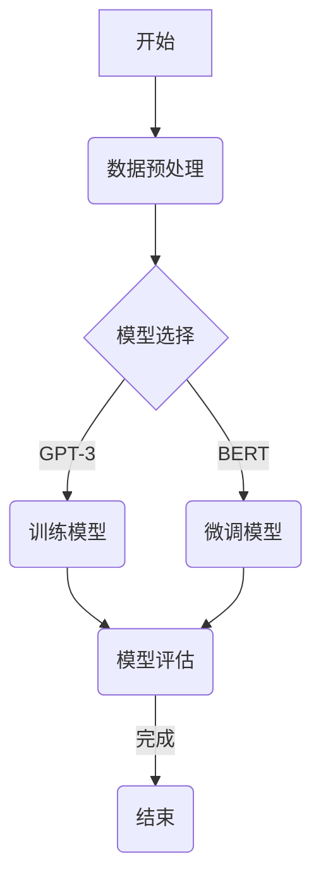

                 

### 第一部分: AI写作风格模仿基础

#### 1.1 AI写作风格模仿的概念

AI写作风格模仿，指的是利用人工智能技术，使计算机生成具有特定风格的文章。这不仅仅是模仿文章的字面意义，更涉及到风格、语境、用词和句子结构的深层次模仿。通过AI写作风格模仿，我们希望计算机能够理解并再现某种特定作家的写作风格，如莎士比亚、狄更斯或乔伊斯等。

这一概念的核心在于两个关键要素：文本生成和理解。文本生成涉及将输入文本转化为计算机可以处理的格式，理解则包括对文本内容的深入分析和处理，以生成具有相似风格的输出。

AI写作风格模仿的重要性在于它有广泛的实际应用场景，例如：

1. **自动化内容创作**：AI可以自动生成文章、新闻、广告文案等，节省人力和时间成本。
2. **教育和研究**：通过模仿不同作家的风格，可以帮助学生或研究者更深入地理解文学作品。
3. **文化和艺术**：AI写作风格模仿可以用于创作新的文学作品，探索人类和机器合作的边界。

为了实现AI写作风格模仿，我们需要掌握一系列技术和算法。这些技术和算法共同构成了自然语言处理（NLP）的基础。

#### 1.2 AI写作风格模仿的发展历程

AI写作风格模仿的发展历程可以追溯到20世纪50年代，当时研究人员开始探索如何使用计算机生成文本。早期的尝试主要集中在规则驱动的方法上，这些方法依赖于预设的语法规则和模板。然而，由于规则有限且难以扩展，这种方法的效果并不理想。

随着计算能力和算法的进步，AI写作风格模仿迎来了新的发展阶段。20世纪90年代，统计方法开始流行，尤其是基于统计语言模型的方法。这些方法通过大量语料库的学习来预测下一个单词或句子，从而生成文本。这一阶段的一个标志性成果是IBM的“沃森”系统，它在2011年《危险边缘》电视节目中展示了其生成新闻文章的能力。

进入21世纪，深度学习技术的发展使得AI写作风格模仿进入了一个全新的时代。深度学习方法，特别是神经网络和生成对抗网络（GAN），使得计算机能够通过自主学习大量文本数据，生成高质量、风格多样的文本。

#### 1.3 AI写作风格模仿的重要性

AI写作风格模仿的重要性体现在以下几个方面：

1. **技术创新**：AI写作风格模仿推动了自然语言处理技术的进步，特别是在大规模预训练模型和生成模型方面。
2. **内容创作**：AI可以自动生成大量高质量的内容，这对于媒体、广告和出版行业具有重要意义。
3. **教育应用**：通过模仿不同作家的风格，学生可以更深入地理解文学作品，提高写作能力。
4. **跨领域融合**：AI写作风格模仿促进了计算机科学、文学、艺术等多个领域的交叉融合，为创新提供了新的可能性。

#### 1.4 AI写作风格模仿的应用场景

AI写作风格模仿的应用场景非常广泛，以下是一些典型的例子：

1. **新闻写作**：AI可以自动生成新闻报道，减少对人类记者的依赖，提高新闻发布的速度和覆盖面。
2. **文学创作**：通过模仿经典作家的风格，AI可以创作出具有文学价值的新作品，为文学创作注入新的活力。
3. **个性化内容**：AI可以根据用户的兴趣和偏好，自动生成个性化的内容，提高用户体验。
4. **客服聊天机器人**：AI写作风格模仿可以用于生成与人类对话风格相似的客服回复，提高客服效率和质量。

总的来说，AI写作风格模仿是一项充满潜力且具有广泛应用前景的技术，它正逐步改变着我们的生活和工作的方式。

### 1.5 本部分总结

本部分介绍了AI写作风格模仿的基础知识，包括其概念、发展历程、重要性以及应用场景。通过对AI写作风格模仿的深入理解，我们将为后续更详细的技术探讨和实战应用打下坚实的基础。

## 第二部分: 自然语言处理技术基础

在深入探讨AI写作风格模仿之前，我们需要先了解自然语言处理（NLP）技术的基础。NLP是使计算机能够理解、生成和处理人类语言的关键技术。本部分将介绍NLP中的几个核心概念和关键技术，包括语言模型、词嵌入、序列模型、注意力机制和转换器架构。

#### 2.1 语言模型的基本原理

语言模型是NLP的核心组件之一，它用于预测文本的下一个单词或字符。一个简单的语言模型可以表示为概率分布，即给定前文，预测下一个单词的概率。例如，给定句子“我昨天去了”，语言模型可以预测下一个词是“公园”的概率。

语言模型的基本原理基于概率论和统计学。我们通常使用最大似然估计（Maximum Likelihood Estimation，MLE）来训练语言模型，目标是最大化训练数据中出现过的句子概率。具体来说，我们使用如下公式来计算给定一个前文序列\( w_{1}, w_{2}, ..., w_{i-1} \)时，单词\( w_i \)出现的概率：

$$
P(w_i | w_{i-1}, ..., w_1) = \frac{P(w_1, w_2, ..., w_{i-1}, w_i)}{P(w_{i-1}, ..., w_1)}
$$

在实际应用中，为了简化计算，我们通常会使用N-gram模型，这是一种基于前N个单词来预测下一个单词的方法。N-gram模型的一个优点是计算简单，但在处理长文本时效果较差，因为它无法捕捉到长距离的依赖关系。

#### 2.2 词嵌入技术

词嵌入是将单词映射到高维向量空间的技术，它使计算机能够理解单词之间的语义关系。词嵌入的目的是使相似单词在向量空间中靠近，不同单词远离。Word2Vec是一种流行的词嵌入方法，它通过训练神经网络来学习单词的向量表示。

Word2Vec有两种主要的训练方法：连续词袋（Continuous Bag of Words，CBOW）和Skip-Gram。CBOW模型通过预测中心词周围的词来训练，而Skip-Gram模型通过预测中心词来训练。两种方法都可以学习到具有语义信息的词向量。

以下是一个CBOW模型的伪代码：

```
# CBOW模型预测伪代码

# 输入：中心词w，其上下文单词v
# 输出：中心词w的概率分布

for word in context_words:
    hidden_vector = dot(product) of embedding_vectors of context_words
    output_vector = softmax(hidden_vector)
    loss = cross_entropy_loss(output_vector, target_vector)
```

词嵌入技术的一个重要应用是相似度计算，例如，我们可以使用词向量的余弦相似度来计算两个单词的语义相似度：

$$
similarity(w_1, w_2) = \frac{w_1 \cdot w_2}{||w_1|| \cdot ||w_2||}
$$

#### 2.3 序列模型与注意力机制

序列模型是用于处理序列数据的机器学习模型，如文本、语音和视频等。RNN（递归神经网络）是最早用于序列建模的模型之一，它通过递归方式处理序列数据，使其能够捕捉到长距离依赖关系。以下是一个简单的RNN单元的伪代码：

```
# RNN单元伪代码

# 输入：当前输入x和前一个隐藏状态h_{t-1}
# 输出：当前隐藏状态h_t和输出y_t

h_t = tanh(W_h \cdot [h_{t-1}, x] + b_h)
y_t = W_y \cdot h_t + b_y
```

然而，RNN存在梯度消失和梯度爆炸的问题，这使得它在处理长序列时效果不佳。为了克服这个问题，引入了LSTM（长短时记忆网络）和GRU（门控循环单元），它们通过门控机制有效地解决了长期依赖问题。

注意力机制是另一种重要的序列建模技术，它使模型能够关注序列中的特定部分。注意力机制的目的是让模型在预测当前词时，能够动态地关注与该词相关的上下文信息。以下是一个简单的注意力机制的伪代码：

```
# 注意力机制伪代码

# 输入：当前隐藏状态h_t和上下文隐藏状态C
# 输出：注意力分数a_t和当前隐藏状态h_t

scores = dot(product) of W_a \cdot [h_t, C]
a_t = softmax(scores)
h_t = (1 - a_t) \cdot [h_t, C] + a_t \cdot [h_t, C]
```

#### 2.4 转换器架构详解

转换器（Transformer）是一种基于自注意力机制的深度学习模型，它在处理序列数据时表现出色。与传统的RNN和LSTM不同，Transformer不需要递归计算，这使得它能够并行处理整个序列，从而大幅提高计算效率。

转换器的基本组件包括编码器（Encoder）和解码器（Decoder）。编码器负责将输入序列编码为固定长度的隐藏状态，解码器则负责生成输出序列。以下是一个简单的转换器编码器和解码器的伪代码：

```
# 编码器伪代码

# 输入：输入序列X
# 输出：编码隐藏状态H

H = [0] * (sequence_length, hidden_size)
for i in range(sequence_length):
    hidden_vector = self.encoder(X[i])
    H[i] = hidden_vector

# 解码器伪代码

# 输入：解码序列Y和编码隐藏状态H
# 输出：输出序列Y'

Y' = [0] * (sequence_length, vocab_size)
for i in range(sequence_length):
    hidden_vector = self.decoder(Y[i], H)
    Y'[i] = softmax(hidden_vector)

return Y'
```

转换器的一个关键特点是它的自注意力机制，它通过计算不同位置的输入之间的注意力分数来生成每个位置的隐藏状态。以下是一个简单的自注意力机制的伪代码：

```
# 自注意力机制伪代码

# 输入：输入序列X和键-值对K, V
# 输出：注意力分数α和加权输入H

Q = dot(product) of W_Q \cdot X
K = dot(product) of W_K \cdot X
V = dot(product) of W_V \cdot X

scores = dot(product) of Q, K
α = softmax(scores)
H = sum(α \* V)

return H, α
```

总之，自然语言处理技术是AI写作风格模仿的基础，包括语言模型、词嵌入、序列模型、注意力机制和转换器架构。通过深入理解这些技术，我们能够更好地实现AI写作风格模仿，为下一代内容创作带来更多可能性。

### 2.5 本部分总结

本部分介绍了自然语言处理技术的基础，包括语言模型、词嵌入、序列模型、注意力机制和转换器架构。这些技术构成了AI写作风格模仿的核心，为后续讨论大规模预训练模型、生成式模型、生成对抗网络等高级算法提供了理论基础。通过对这些技术的深入理解，我们能够更好地掌握AI写作风格模仿的原理和实现方法。

## 第三部分: AI写作风格模仿的核心算法

在了解了自然语言处理的基础技术之后，我们将深入探讨AI写作风格模仿的核心算法。这些算法包括大规模预训练模型、生成式模型与判别式模型、变分自编码器（VAE）和生成对抗网络（GAN）。每个算法都有其独特的原理和应用场景，下面我们将逐一详细介绍。

### 3.1 大规模预训练模型原理

大规模预训练模型是近年来自然语言处理领域的重要突破。这类模型通过在大规模语料库上进行预训练，学习到丰富的语言知识和模式，然后通过微调（fine-tuning）适应特定的任务。这种端到端的学习方法大大提高了模型在多种NLP任务上的性能。

#### 预训练模型的基本原理

预训练模型的核心思想是通过在大量无标注数据上预训练模型，使其能够捕获语言的一般结构和语义信息。预训练通常分为两个阶段：

1. **预训练阶段**：在这个阶段，模型在大规模语料库上学习，通常使用语言模型或掩码语言模型（Masked Language Model，MLM）等任务。
2. **微调阶段**：在预训练的基础上，模型针对特定任务进行微调，如文本分类、机器翻译或问答系统。

#### 语言模型与掩码语言模型

语言模型是预训练模型的基础，它旨在预测序列中下一个词的概率。典型的语言模型如Transformer，通过自注意力机制对输入序列进行建模，生成每个位置的隐藏状态，最终输出一个概率分布。

掩码语言模型（MLM）是一种特殊的语言模型，它通过随机掩码输入序列中的部分单词，然后让模型预测这些掩码的单词。MLM任务旨在让模型学习到单词之间的相互依赖关系，从而更好地捕捉语言结构。

以下是一个MLM模型的伪代码：

```
# 掩码语言模型（MLM）伪代码

# 输入：掩码文本序列X
# 输出：掩码文本序列的预测

for each position in X:
    mask the word at that position
    predict the masked word using the pre-trained model

return the predicted sequence
```

#### 预训练模型的应用

预训练模型在多种NLP任务中表现出色，如文本分类、情感分析、命名实体识别和机器翻译。通过预训练，模型能够捕获到大量的通用知识和语言模式，从而在特定任务上取得更好的性能。

例如，BERT（Bidirectional Encoder Representations from Transformers）是一种基于Transformer的双向语言模型，它在多个NLP任务上取得了显著的性能提升。BERT通过在大量的英文语料库上进行预训练，然后通过微调适应不同的任务，如问答系统和文本分类。

以下是一个BERT模型的伪代码：

```
# BERT模型伪代码

# 输入：输入序列X和目标序列Y
# 输出：模型损失

[CLS], X, [SEP], Y, [CLS] = add_special_tokens(X, Y)
input_ids = convert_tokens_to_ids(X)
input_mask = [1] * len(input_ids)
segment_ids = [0] * len(input_ids) + [1] * len(Y)

# Forward pass through BERT
outputs = model(input_ids, attention_mask=input_mask, token_type_ids=segment_ids)

# Compute loss
loss = compute_loss(outputs, labels)

return loss
```

总之，大规模预训练模型通过在大量无标注数据上学习，使模型能够捕获到丰富的语言知识和模式，从而在多种NLP任务上取得了优异的性能。通过预训练和微调，预训练模型为AI写作风格模仿提供了强大的工具和理论基础。

### 3.2 生成式模型与判别式模型

生成式模型和判别式模型是两种主要的机器学习模型类型，它们在AI写作风格模仿中起着关键作用。生成式模型旨在生成新的数据，而判别式模型则用于区分真实数据和生成数据。在本节中，我们将详细探讨这两种模型的工作原理及其在AI写作风格模仿中的应用。

#### 生成式模型

生成式模型通过学习数据生成过程来生成新数据。这类模型能够捕捉数据的分布，从而生成具有相似特性但与原始数据不同的新数据。生成式模型包括马尔可夫模型、高斯过程和生成对抗网络（GAN）等。

**马尔可夫模型**是一种基于时间序列的生成模型，它假设当前状态仅依赖于前一个状态，而不是整个历史序列。马尔可夫模型通过状态转移概率矩阵来生成序列。以下是一个简单的马尔可夫模型的伪代码：

```
# 马尔可夫模型伪代码

# 输入：初始状态s_0和状态转移概率矩阵P
# 输出：生成序列s

s_t = s_0
for t in range(1, T):
    s_t = sample(P[s_t])

return sequence s
```

**高斯过程**是一种基于概率的生成模型，它通过高斯分布来生成数据。高斯过程在连续数据生成中表现出色，但在文本生成中应用较少。

**生成对抗网络（GAN）**是生成式模型的代表，它由生成器和判别器两个部分组成。生成器尝试生成逼真的数据，而判别器则尝试区分生成数据和真实数据。通过不断迭代训练，生成器和判别器相互竞争，生成器逐渐生成更逼真的数据。GAN在图像生成、视频生成和文本生成中取得了显著的成果。以下是一个简单的GAN模型的伪代码：

```
# GAN模型伪代码

# 输入：生成器G和判别器D
# 输出：生成数据x和判别损失

# 生成器G的损失
G_loss = -E[log(D(G(z)))]  # z为随机噪声

# 判别器D的损失
D_loss = -E[log(D(x)] - E[log(1 - D(G(z)))]  # x为真实数据

# 训练步骤
for epoch in range(num_epochs):
    # 训练生成器G
    z = sample_noise()
    x_hat = G(z)
    D_loss_G = compute_loss(D(x_hat), D(x))
    
    # 训练判别器D
    D_loss_D = compute_loss(D(x), D(x_hat))
    
    # 更新模型参数
    update_params(G, D, G_loss, D_loss_G, D_loss_D)

return x_hat
```

GAN在文本生成中的应用主要包括生成对话、文章摘要和虚构故事等。通过训练GAN，我们可以生成具有特定风格和主题的文本，从而实现AI写作风格模仿。

#### 判别式模型

判别式模型旨在区分真实数据和生成数据。这类模型在监督学习中应用广泛，但在生成任务中也有重要应用。判别式模型包括支持向量机（SVM）、神经网络判别器和决策树等。

**支持向量机（SVM）**是一种强大的分类和回归模型，它通过找到一个最佳的超平面来最大化分类边界。SVM在文本分类、情感分析和命名实体识别中表现出色。

**神经网络判别器**是一种基于深度学习的判别式模型，它通过多层的神经网络来区分输入数据。神经网络判别器在图像分类、语音识别和文本分类中广泛应用。

**决策树**是一种基于树的判别式模型，它通过一系列的决策节点来划分数据。决策树在分类和回归任务中应用广泛，但由于其可解释性差，通常不用于生成任务。

#### 生成式模型与判别式模型的比较

生成式模型和判别式模型在生成文本方面各有优缺点：

- **生成式模型**：能够直接生成新的数据，但可能生成过于随机或与目标分布不一致的数据。
- **判别式模型**：能够有效区分生成数据和真实数据，但通常难以生成高质量的数据。

在实际应用中，生成式模型和判别式模型常常结合使用，以充分发挥各自的优势。例如，在AI写作风格模仿中，我们可以使用GAN来生成初步的文本，然后使用判别式模型对生成的文本进行评估和调整，从而生成高质量的模仿作品。

### 3.3 变分自编码器（VAE）和生成对抗网络（GAN）

变分自编码器（VAE）和生成对抗网络（GAN）是生成式模型中的两个重要算法，它们在图像生成、文本生成和其他生成任务中取得了显著成果。本节将分别介绍这两种算法的原理和实现。

#### 变分自编码器（VAE）

变分自编码器（VAE）是一种基于概率模型的生成式模型，它通过编码器和解码器两个部分来生成数据。编码器将输入数据映射到一个隐变量空间，解码器则从隐变量空间生成输出数据。

**编码器**：编码器通过一个编码过程将输入数据\( x \)映射到一个隐变量\( z \)，通常使用一个正态分布来表示。以下是一个简单的VAE编码器的伪代码：

```
# VAE编码器伪代码

# 输入：输入数据x
# 输出：隐变量z和编码器参数θ

z_mean = mu(x; θ)
z_log_var = log_var(x; θ)
z = sample(N(z_mean, z_log_var))

return z, θ
```

**解码器**：解码器通过一个解码过程将隐变量\( z \)映射回输出数据\( x' \)，通常使用一个神经网络实现。以下是一个简单的VAE解码器的伪代码：

```
# VAE解码器伪代码

# 输入：隐变量z和解码器参数φ
# 输出：输出数据x'
# 输出：解码器参数φ

x' = decode(z; φ)

return x', φ
```

VAE的损失函数由两部分组成：重构损失和KL散度损失。重构损失用于度量解码器生成的数据与输入数据的相似度，KL散度损失用于度量编码器生成的隐变量分布与先验分布之间的差异。以下是一个简单的VAE损失函数的伪代码：

```
# VAE损失函数伪代码

# 输入：输入数据x，编码器参数θ和解码器参数φ
# 输出：总损失L

reconstruction_loss = -sum(log(p(x' | z)))
KL_divergence = 0.5 * sum((z_log_var - 1 - (z_mean^2 + z_log_var)))

L = reconstruction_loss + β * KL_divergence

return L
```

通过优化这个损失函数，VAE可以学习到有效的编码器和解码器，从而生成高质量的数据。

#### 生成对抗网络（GAN）

生成对抗网络（GAN）是一种基于博弈论模型的生成式模型，它由生成器和判别器两个部分组成。生成器尝试生成逼真的数据，而判别器则尝试区分生成数据和真实数据。通过不断迭代训练，生成器和判别器相互竞争，生成器逐渐生成更逼真的数据。

**生成器**：生成器通过一个生成过程将随机噪声\( z \)映射到数据空间\( x' \)。以下是一个简单的GAN生成器的伪代码：

```
# GAN生成器伪代码

# 输入：随机噪声z
# 输出：生成数据x'
# 输出：生成器参数G

x' = generate(z; G)

return x', G
```

**判别器**：判别器通过一个判别过程对输入数据进行分类，判断其是真实数据还是生成数据。以下是一个简单的GAN判别器的伪代码：

```
# GAN判别器伪代码

# 输入：真实数据x和生成数据x'
# 输出：判别结果y
# 输出：判别器参数D

y_real = D(x)
y_fake = D(x')

return y_real, y_fake, D
```

GAN的训练过程分为两个阶段：

1. **生成器训练**：在生成器训练阶段，我们固定判别器的参数，只优化生成器的参数。目标是使生成器生成的数据更逼真，从而减少判别器对生成数据的判断正确率。
2. **判别器训练**：在判别器训练阶段，我们固定生成器的参数，只优化判别器的参数。目标是使判别器能够准确地区分生成数据和真实数据。

以下是一个简单的GAN训练过程的伪代码：

```
# GAN训练过程伪代码

for epoch in range(num_epochs):
    # 生成器训练
    z = sample_noise()
    x' = generate(z; G)
    D_loss_G = compute_loss(D(x'), 1)  # 假设x'是真实数据

    # 判别器训练
    x = sample_real_data()
    z = sample_noise()
    x' = generate(z; G)
    D_loss_D = compute_loss(D(x), 1) + compute_loss(D(x'), 0)  # 假设x是真实数据，x'是生成数据

    # 更新模型参数
    update_params(G, D, D_loss_G, D_loss_D)

return G, D
```

通过这种迭代训练过程，GAN可以生成高质量的数据，如图像、视频和文本等。

#### VAE与GAN的比较

VAE和GAN都是强大的生成式模型，但它们在工作原理和应用场景上有所不同：

- **工作原理**：VAE基于概率模型，通过编码器和解码器生成数据；GAN基于博弈论模型，通过生成器和判别器相互竞争生成数据。
- **应用场景**：VAE适用于生成符合先验分布的数据，如图像和文本；GAN适用于生成高度逼真的数据，如图像和视频。

在实际应用中，VAE和GAN可以结合使用，以发挥各自的优势。例如，在AI写作风格模仿中，我们可以使用VAE生成初步的文本，然后使用GAN进一步优化和细化文本质量。

### 3.4 AI写作风格模仿的算法选择

在AI写作风格模仿中，选择合适的算法至关重要。根据任务需求和应用场景，我们可以选择以下几种算法：

- **大规模预训练模型**：对于需要高度风格化和高质量的文本生成任务，如文学创作和新闻报道，大规模预训练模型是一个理想的选择。它们通过在大规模语料库上的预训练，能够生成具有特定风格和主题的文本。
- **生成对抗网络（GAN）**：对于需要高度逼真和个性化的文本生成任务，如虚构故事和对话系统，GAN是一个有效的选择。它们通过生成器和判别器的迭代训练，可以生成高质量、多样化的文本。
- **变分自编码器（VAE）**：对于需要生成符合先验分布的文本任务，如文本摘要和对话生成，VAE是一个合适的选择。它们通过编码器和解码器的训练，可以生成符合特定分布的文本。

总之，AI写作风格模仿的核心算法包括大规模预训练模型、生成对抗网络和变分自编码器。这些算法各有优缺点，适用于不同的应用场景。通过合理选择和组合这些算法，我们可以实现高质量、风格多样的AI写作风格模仿。

### 3.5 本部分总结

本部分详细介绍了AI写作风格模仿的核心算法，包括大规模预训练模型、生成式模型与判别式模型、变分自编码器和生成对抗网络。这些算法构成了AI写作风格模仿的技术基础，通过深入理解这些算法的原理和应用，我们可以更好地实现高质量的AI写作风格模仿。在下一部分，我们将进一步探讨自然语言处理中的数学模型，如概率模型、生成模型和判别模型。

## 第四部分: 自然语言处理中的数学模型

在深入探讨AI写作风格模仿的核心算法之后，我们将进一步了解自然语言处理（NLP）中的数学模型。这些数学模型在理解和生成文本过程中起着至关重要的作用，为AI写作风格模仿提供了坚实的理论基础。本部分将介绍概率模型、生成模型、判别模型以及强化学习在自然语言处理中的应用。

### 4.1 概率模型

概率模型是NLP中最基本和常用的模型之一，它们用于表示和预测文本数据。概率模型的核心思想是通过概率分布来描述文本的生成过程。

**1. 朴素贝叶斯模型**

朴素贝叶斯模型是一种基于贝叶斯定理和特征条件独立假设的概率分类模型。在NLP中，朴素贝叶斯模型常用于文本分类任务，如垃圾邮件检测和情感分析。以下是一个简单的朴素贝叶斯模型的伪代码：

```
# 朴素贝叶斯模型伪代码

# 输入：文本特征X和类别标签y
# 输出：类别概率分布P(y|X)

P(y) = (sum(P(y)) / sum(sum(P(y))))
P(X|y) = (sum(P(X|y)) / sum(P(y)))
P(y|X) = P(y) * P(X|y)

return P(y|X)
```

**2. 隐马尔可夫模型（HMM）**

隐马尔可夫模型（HMM）是一种用于序列数据的概率模型，它在语音识别、情感分析和语音生成中广泛应用。HMM通过状态转移概率矩阵和发射概率矩阵来描述序列的生成过程。以下是一个简单的HMM模型的伪代码：

```
# 隐马尔可夫模型（HMM）伪代码

# 输入：状态转移概率矩阵A、发射概率矩阵B和初始状态分布π
# 输出：序列概率分布P(X|A,B,π)

P(X|A,B,π) = π * A^T * B^T

return P(X|A,B,π)
```

**3. 贝叶斯网络**

贝叶斯网络是一种图形化的概率模型，它通过有向无环图（DAG）来表示变量之间的依赖关系。在NLP中，贝叶斯网络常用于文本分类、关系抽取和知识图谱构建。以下是一个简单的贝叶斯网络模型的伪代码：

```
# 贝叶斯网络模型伪代码

# 输入：有向无环图G和参数θ
# 输出：条件概率分布P(X|θ)

P(X|θ) = π * P(X1|θ) * P(X2|X1,θ) * ...

return P(X|θ)
```

### 4.2 生成模型

生成模型用于生成新的数据，它们通过学习数据分布来模拟数据的生成过程。生成模型在文本生成、图像生成和语音合成中广泛应用。

**1. 生成式模型**

生成式模型直接学习数据的生成过程，包括马尔可夫模型、变分自编码器（VAE）和生成对抗网络（GAN）等。

**变分自编码器（VAE）**：VAE通过编码器和解码器两个部分来生成数据。编码器将输入数据映射到一个隐变量空间，解码器则从隐变量空间生成输出数据。VAE的损失函数由重构损失和KL散度损失组成。以下是一个简单的VAE模型的伪代码：

```
# VAE模型伪代码

# 输入：输入数据x
# 输出：隐变量z和生成数据x'

z_mean, z_log_var = encoder(x)
z = sample(N(z_mean, z_log_var))
x' = decoder(z)

return x'
```

**生成对抗网络（GAN）**：GAN由生成器和判别器两个部分组成。生成器尝试生成逼真的数据，判别器则尝试区分生成数据和真实数据。GAN的训练过程分为生成器训练和判别器训练两个阶段。以下是一个简单的GAN模型的伪代码：

```
# GAN模型伪代码

# 输入：生成器G和判别器D
# 输出：生成数据x'

for epoch in range(num_epochs):
    # 生成器训练
    z = sample_noise()
    x' = generate(z; G)
    D_loss_G = compute_loss(D(x'), 1)  # 假设x'是真实数据

    # 判别器训练
    x = sample_real_data()
    z = sample_noise()
    x' = generate(z; G)
    D_loss_D = compute_loss(D(x), 1) + compute_loss(D(x'), 0)  # 假设x是真实数据，x'是生成数据

    # 更新模型参数
    update_params(G, D, D_loss_G, D_loss_D)

return x'
```

**2. 深度生成模型**

深度生成模型是基于深度学习技术的生成模型，包括深度卷积生成网络（DCGAN）、深度生成对抗网络（DDPG）等。深度生成模型通过多层的神经网络结构来生成数据，具有更好的表达能力和灵活性。以下是一个简单的深度生成模型的伪代码：

```
# 深度生成模型伪代码

# 输入：随机噪声z
# 输出：生成数据x'

x' = generator(z)

return x'
```

### 4.3 判别模型

判别模型用于区分真实数据和生成数据，它们在文本分类、语音识别和图像分类等任务中应用广泛。

**1. 支持向量机（SVM）**

支持向量机是一种强大的分类和回归模型，它通过找到一个最佳的超平面来最大化分类边界。SVM在文本分类、情感分析和命名实体识别中表现出色。以下是一个简单的SVM模型的伪代码：

```
# 支持向量机（SVM）伪代码

# 输入：训练数据集D和标签y
# 输出：分类模型θ

θ = train_svm(D, y)

return θ
```

**2. 神经网络判别器**

神经网络判别器是一种基于深度学习的判别模型，它通过多层的神经网络来区分输入数据。神经网络判别器在图像分类、语音识别和文本分类中广泛应用。以下是一个简单的神经网络判别器的伪代码：

```
# 神经网络判别器伪代码

# 输入：训练数据集D和标签y
# 输出：分类模型θ

θ = train_neural_network(D, y)

return θ
```

### 4.4 强化学习在自然语言处理中的应用

强化学习是一种通过试错和反馈来学习最优策略的机器学习方法。在自然语言处理中，强化学习可以用于文本生成、对话系统和语言理解等任务。

**1. 文本生成**

在文本生成任务中，强化学习可以通过策略网络来学习生成文本的最优策略。策略网络通过接收文本上下文作为输入，输出下一个单词的概率分布。以下是一个简单的文本生成强化学习模型的伪代码：

```
# 文本生成强化学习模型伪代码

# 输入：文本上下文C
# 输出：单词概率分布P(w|C)

P(w|C) = policy_network(C)

return P(w|C)
```

**2. 对话系统**

在对话系统中，强化学习可以用于学习对话的最优策略。对话系统通过接收用户输入和历史对话作为输入，输出下一个回复的概率分布。以下是一个简单的对话系统强化学习模型的伪代码：

```
# 对话系统强化学习模型伪代码

# 输入：用户输入U和历史对话H
# 输出：回复概率分布P(r|U, H)

P(r|U, H) = policy_network(U, H)

return P(r|U, H)
```

**3. 语言理解**

在语言理解任务中，强化学习可以用于学习解析语言的最优策略。语言理解系统通过接收文本作为输入，输出语义表示。以下是一个简单的语言理解强化学习模型的伪代码：

```
# 语言理解强化学习模型伪代码

# 输入：文本X
# 输出：语义表示S

S = language_understanding(X)

return S
```

总之，自然语言处理中的数学模型包括概率模型、生成模型、判别模型以及强化学习模型。这些模型通过数学原理和算法实现了对文本数据的理解和生成，为AI写作风格模仿提供了重要的理论基础。在下一部分，我们将进一步探讨文本生成中的数学公式，如概率分布和损失函数。

### 4.5 本部分总结

本部分介绍了自然语言处理中的数学模型，包括概率模型、生成模型、判别模型以及强化学习模型。这些模型通过数学原理和算法实现了对文本数据的理解和生成，为AI写作风格模仿提供了重要的理论基础。通过对这些模型的深入理解，我们可以更好地实现高质量的AI写作风格模仿。

### 4.6 文本生成中的数学公式

在文本生成过程中，数学公式起着关键作用，它们不仅帮助我们理解模型的原理，还可以指导模型的优化和评估。以下是一些常用的数学公式及其在文本生成中的应用。

#### 4.6.1 概率分布

概率分布是描述文本生成过程中每个单词或字符的概率的关键工具。以下是一些常用的概率分布公式：

**1. 高斯分布（正态分布）**

高斯分布用于生成连续的数值数据，在文本生成中可以用于生成单词的概率向量。

$$
P(x|\mu,\sigma^2) = \frac{1}{\sqrt{2\pi\sigma^2}} e^{-\frac{(x-\mu)^2}{2\sigma^2}}
$$

**2. 二项分布**

二项分布用于生成二分类结果，可以用于文本分类任务中的概率计算。

$$
P(X=k) = C(n, k) p^k (1-p)^{n-k}
$$

其中，\( n \) 是试验次数，\( k \) 是成功的次数，\( p \) 是成功的概率。

**3. 伯努利分布**

伯努利分布是二项分布的特例，用于描述单次试验的成功概率。

$$
P(X=1) = p, P(X=0) = 1-p
$$

**4. 指数分布**

指数分布用于生成等待时间等连续数据，在文本生成中可以用于生成单词之间的间隔时间。

$$
P(X=x|\lambda) = \lambda e^{-\lambda x}
$$

其中，\( \lambda \) 是分布的参数。

#### 4.6.2 损失函数

损失函数是衡量模型生成结果与真实结果之间差异的重要工具。以下是一些常用的损失函数：

**1. 交叉熵损失**

交叉熵损失用于分类任务，衡量模型预测概率分布与真实概率分布之间的差异。

$$
H(p,q) = -\sum_{i} p_i \log q_i
$$

**2. 代价函数**

在文本生成中，常用的代价函数包括：

- **负对数似然损失**：

$$
L = -\sum_{i} \log p(y_i|x_i; \theta)
$$

其中，\( y_i \) 是真实标签，\( x_i \) 是输入，\( \theta \) 是模型参数。

- **平均平方误差（MSE）**：

$$
MSE = \frac{1}{n} \sum_{i} (y_i - \hat{y}_i)^2
$$

其中，\( \hat{y}_i \) 是模型的预测值。

- **平均绝对误差（MAE）**：

$$
MAE = \frac{1}{n} \sum_{i} |y_i - \hat{y}_i|
$$

**3. 生成对抗网络（GAN）中的损失函数**

在生成对抗网络中，常用的损失函数包括生成器损失和判别器损失：

- **生成器损失**：

$$
L_G = -\log D(G(z))
$$

其中，\( G(z) \) 是生成器生成的数据，\( D(x) \) 是判别器的输出。

- **判别器损失**：

$$
L_D = -[\log D(x) + \log(1 - D(G(z))]
$$

**4. 变分自编码器（VAE）的损失函数**

变分自编码器中的损失函数包括重构损失和KL散度损失：

- **重构损失**：

$$
L_{recon} = \frac{1}{n} \sum_{i} ||x_i - \hat{x}_i||_2^2
$$

其中，\( \hat{x}_i \) 是解码器生成的数据。

- **KL散度损失**：

$$
L_{KL} = \frac{1}{n} \sum_{i} D_{KL}(q(z|x_i; \theta)||p(z))
$$

其中，\( q(z|x_i; \theta) \) 是编码器生成的后验分布，\( p(z) \) 是先验分布。

#### 4.6.3 公式应用举例

以下是一个简单的例子，说明如何使用上述公式来评估和优化文本生成模型。

**例1：评估语言模型**

假设我们有一个训练好的语言模型，我们希望评估其在生成句子时的性能。我们可以使用交叉熵损失来计算模型生成句子与真实句子之间的差异。

$$
L = -\sum_{i} \log p(y_i|x_i; \theta)
$$

其中，\( y_i \) 是真实句子，\( x_i \) 是输入序列，\( \theta \) 是模型参数。

**例2：优化生成对抗网络（GAN）**

在GAN训练过程中，我们希望生成器生成的数据能够欺骗判别器，使得判别器的损失最小。我们可以使用以下公式来更新生成器和判别器的参数：

- **生成器更新**：

$$
\theta_G \leftarrow \theta_G - \alpha \frac{\partial L_G}{\partial \theta_G}
$$

- **判别器更新**：

$$
\theta_D \leftarrow \theta_D - \alpha \frac{\partial L_D}{\partial \theta_D}
$$

其中，\( \alpha \) 是学习率，\( L_G \) 和 \( L_D \) 分别是生成器和判别器的损失。

通过不断优化这些公式，我们可以逐步提高生成文本的质量和风格。

总之，文本生成中的数学公式不仅帮助我们理解和评估模型的性能，还可以指导模型的优化过程。通过对这些公式的深入应用，我们可以实现更高质量、更具风格的文本生成。

### 4.7 本部分总结

本部分介绍了文本生成中的数学公式，包括概率分布、损失函数和GAN损失函数。这些公式是文本生成模型的基础，通过深入理解和应用这些公式，我们可以更好地优化和评估文本生成模型，从而实现高质量的AI写作风格模仿。

## 第五部分: 从莎士比亚到现代作家的写作风格分析

在了解了AI写作风格模仿的数学基础和技术原理之后，我们将进一步探讨人类作家的写作风格，从莎士比亚到现代作家。这一部分将分析这些作家的写作风格特点，以及AI如何模仿这些风格。

### 5.1 莎士比亚的写作风格

威廉·莎士比亚（William Shakespeare）是英国文艺复兴时期最伟大的戏剧家之一，他的作品涵盖了悲剧、喜剧和历史剧等多个领域。莎士比亚的写作风格具有以下几个特点：

**1. 丰富的词汇和语言表现力**

莎士比亚的作品使用了大量的词汇，他能够创造出独特而富有表现力的语言。他经常使用隐喻、比喻和讽刺，使语言更加生动和形象。

**2. 个性化的角色塑造**

莎士比亚通过深入的心理描写和对话，塑造出具有鲜明个性的角色。每个角色都有其独特的性格特征和语言风格，使得观众能够深刻地理解他们的内心世界。

**3. 复杂的剧情结构和叙述手法**

莎士比亚的作品通常包含复杂的剧情结构和多层次的故事线。他擅长使用倒叙、插叙等叙述手法，使剧情更加引人入胜。

**4. 深刻的主题探讨**

莎士比亚的作品探讨了人性、爱情、权力、背叛等深刻的主题。他通过戏剧性的冲突和人物的命运，传达了对人类命运和生活的深刻思考。

#### AI模仿莎士比亚写作风格的算法实现

要模仿莎士比亚的写作风格，我们可以使用预训练的语言模型和生成模型，如GPT-3和Bert。以下是一个简单的算法实现步骤：

1. **数据收集与预处理**：收集莎士比亚的作品，如剧本、诗歌和信件等。对文本进行预处理，包括去除标点符号、统一文本格式等。
2. **预训练语言模型**：使用大量文本数据训练一个预训练语言模型，如GPT-3。这个模型会学习到莎士比亚的语言风格和词汇使用习惯。
3. **生成文本**：使用预训练模型生成文本。可以通过指定特定的角色或情境来引导模型生成具有莎士比亚风格的文本。
4. **后处理**：对生成的文本进行后处理，包括修正语法错误和调整语言风格，使其更加符合莎士比亚的风格。

### 5.2 19世纪英国作家的写作风格

19世纪的英国文学经历了许多变革和发展，涌现出了一批杰出的作家，如查尔斯·狄更斯（Charles Dickens）、威廉·萨克雷（William Makepeace Thackeray）和托马斯·哈代（Thomas Hardy）。他们的写作风格各具特色：

**1. 查尔斯·狄更斯**

查尔斯·狄更斯是19世纪最著名的作家之一，他的作品充满了对社会不公的批判和对普通人的同情。狄更斯的写作风格具有以下几个特点：

- **生动的场景描写和细节刻画**：狄更斯擅长通过生动的场景描写和细节刻画，使读者能够身临其境。
- **人物性格的鲜明对比**：他通过对比不同人物的性格和命运，传达了对社会问题的深刻思考。
- **复杂的叙事结构**：狄更斯的作品通常包含多条故事线，这些故事线相互交织，形成复杂的叙事结构。

**2. 威廉·萨克雷**

威廉·萨克雷以其讽刺性的写作风格而闻名，他的代表作品《名利场》揭示了当时社会的虚伪和贪婪。萨克雷的写作风格具有以下几个特点：

- **辛辣的讽刺和幽默**：萨克雷通过讽刺和幽默揭示社会的丑恶和虚伪，使读者在笑声中思考。
- **生动的人物描绘**：他通过对人物的细腻描绘，使每个角色都栩栩如生，具有独特的性格和魅力。
- **深刻的主题探讨**：萨克雷的作品探讨了人性、道德和社会问题，具有较高的思想性。

**3. 托马斯·哈代**

托马斯·哈代的作品以描写英格兰乡村生活为主题，他的代表作品《德伯家的苔丝》展现了农民的悲惨命运。哈代的写作风格具有以下几个特点：

- **自然的描写和抒情**：哈代通过对自然的细腻描写和抒情，传达了对生活的热爱和对命运的思考。
- **悲剧性的情节和人物命运**：他的作品通常包含悲剧性的情节和人物命运，使读者在悲伤中反思。
- **深刻的主题探讨**：哈代的作品探讨了人性、命运和社会问题，具有较高的哲学性和思想性。

#### AI模仿19世纪英国作家写作风格的算法实现

要模仿19世纪英国作家的写作风格，我们可以使用预训练的语言模型和生成模型，如GPT-3和Bert。以下是一个简单的算法实现步骤：

1. **数据收集与预处理**：收集19世纪英国作家的作品，如小说、诗歌和散文等。对文本进行预处理，包括去除标点符号、统一文本格式等。
2. **预训练语言模型**：使用大量文本数据训练一个预训练语言模型，如GPT-3。这个模型会学习到19世纪英国作家的语言风格和词汇使用习惯。
3. **生成文本**：使用预训练模型生成文本。可以通过指定特定的作家或情境来引导模型生成具有19世纪英国作家风格的文本。
4. **后处理**：对生成的文本进行后处理，包括修正语法错误和调整语言风格，使其更加符合19世纪英国作家的风格。

### 5.3 20世纪美国作家的写作风格

20世纪的美国文学经历了多样化和创新性的发展，涌现出了一批杰出的作家，如弗朗西斯·斯科特·菲茨杰拉德（F. Scott Fitzgerald）、J.D.塞林格（J.D. Salinger）和詹姆斯·乔伊斯（James Joyce）。他们的写作风格各具特色：

**1. 弗朗西斯·斯科特·菲茨杰拉德**

弗朗西斯·斯科特·菲茨杰拉德是20世纪美国最著名的作家之一，他的代表作品《了不起的盖茨比》描绘了20世纪20年代美国社会的繁荣和堕落。菲茨杰拉德的写作风格具有以下几个特点：

- **流利的叙述和描写**：他通过流利的叙述和描写，使读者能够深入体验故事中的情感和氛围。
- **复杂的主题和象征**：他的作品探讨了人性、爱情、金钱和梦想等复杂主题，并通过象征手法表达这些主题。
- **优雅的语言风格**：菲茨杰拉德的作品语言风格优雅，充满了诗意和哲理。

**2. J.D.塞林格**

J.D.塞林格的代表作品《麦田里的守望者》展现了青少年成长中的孤独和挣扎。塞林格的写作风格具有以下几个特点：

- **独特的叙事视角**：他通过第一人称叙事，使读者能够深入了解主人公霍尔顿·考尔菲尔德的内心世界。
- **简洁而深刻的语言**：塞林格的语言简洁而深刻，通过简单的语言表达了复杂的情感和思想。
- **强烈的情感表达**：他的作品充满了对孤独、恐惧和追求真实的强烈情感表达。

**3. 詹姆斯·乔伊斯**

詹姆斯·乔伊斯的代表作品《尤利西斯》和《芬尼根的守灵夜》是现代主义文学的代表作，他的写作风格具有以下几个特点：

- **实验性的叙事技巧**：乔伊斯使用了大量的实验性叙事技巧，如意识流、蒙太奇和视角切换，使读者能够体验人物内心的复杂性。
- **丰富的语言和修辞**：他的作品充满了丰富的语言和修辞手法，如隐喻、比喻和象征，使文本具有多层次的意义。
- **深刻的主题探讨**：乔伊斯的作品探讨了人性、存在、信仰和死亡等深刻的主题，具有强烈的哲学性和思想性。

#### AI模仿20世纪美国作家写作风格的算法实现

要模仿20世纪美国作家的写作风格，我们可以使用预训练的语言模型和生成模型，如GPT-3和Bert。以下是一个简单的算法实现步骤：

1. **数据收集与预处理**：收集20世纪美国作家的作品，如小说、诗歌和散文等。对文本进行预处理，包括去除标点符号、统一文本格式等。
2. **预训练语言模型**：使用大量文本数据训练一个预训练语言模型，如GPT-3。这个模型会学习到20世纪美国作家的语言风格和词汇使用习惯。
3. **生成文本**：使用预训练模型生成文本。可以通过指定特定的作家或情境来引导模型生成具有20世纪美国作家风格的文本。
4. **后处理**：对生成的文本进行后处理，包括修正语法错误和调整语言风格，使其更加符合20世纪美国作家的风格。

### 5.4 现代作家的写作风格

21世纪的现代作家继续在文学创作中探索创新和多样性。现代作家的写作风格受到多种文化和技术因素的影响，以下是一些代表性的现代作家及其风格：

**1. 马克·扎克伯格（Mark Zuckerberg）**

马克·扎克伯格是一位现代作家，他的代表作品《创业公司》以小说的形式讲述了创业的故事。他的写作风格具有以下几个特点：

- **创新的叙事形式**：扎克伯格将现实生活中的创业经历融入小说中，使用了日记、电子邮件和其他社交媒体形式的叙事，使读者能够更深入地了解故事。
- **真实感强的角色塑造**：他通过细腻的心理描写和对话，塑造出具有真实感的角色，使读者能够感同身受。
- **对社会问题的关注**：他的作品探讨了现代社会中的问题，如科技发展、隐私和商业道德等。

**2. 珍妮弗·贡扎莱斯（Jennifer Gonzalez）**

珍妮弗·贡扎莱斯的代表作品《写作的魔力》是一本关于写作技巧的书。她的写作风格具有以下几个特点：

- **清晰的逻辑结构**：她通过逻辑清晰的结构和简洁的语言，使读者能够轻松理解复杂的写作技巧。
- **实用的写作建议**：她提供了大量实用的写作建议，帮助读者提高写作能力。
- **亲切的写作风格**：她的写作风格亲切、易懂，使读者感到亲近和舒适。

**3. 哈里·波特（J.K. Rowling）**

哈里·波特的作者J.K.罗琳是一位现代作家，她的代表作品《哈利·波特》系列是现代奇幻文学的经典之作。她的写作风格具有以下几个特点：

- **丰富的想象力和创意**：她通过丰富的想象力和创意，创造出了一个独特的魔法世界，吸引了无数读者。
- **复杂的角色关系**：她通过复杂的角色关系和情感线索，使读者能够深入理解角色的内心世界。
- **深刻的主题探讨**：她的作品探讨了友情、爱情、勇气和牺牲等深刻的主题，具有强烈的情感共鸣。

#### AI模仿现代作家写作风格的算法实现

要模仿现代作家的写作风格，我们可以使用预训练的语言模型和生成模型，如GPT-3和Bert。以下是一个简单的算法实现步骤：

1. **数据收集与预处理**：收集现代作家的作品，如小说、散文和剧本等。对文本进行预处理，包括去除标点符号、统一文本格式等。
2. **预训练语言模型**：使用大量文本数据训练一个预训练语言模型，如GPT-3。这个模型会学习到现代作家的语言风格和词汇使用习惯。
3. **生成文本**：使用预训练模型生成文本。可以通过指定特定的作家或情境来引导模型生成具有现代作家风格的文本。
4. **后处理**：对生成的文本进行后处理，包括修正语法错误和调整语言风格，使其更加符合现代作家的风格。

### 5.5 AI写作风格模仿的挑战和未来方向

AI写作风格模仿虽然取得了显著的进展，但仍然面临一些挑战和未来发展方向：

**1. 文本生成质量**

目前，AI生成的文本在语言流畅性和逻辑连贯性方面仍有待提高。未来的研究可以进一步优化生成模型，提高文本生成的质量。

**2. 风格多样性**

AI写作风格模仿需要能够生成多种风格和类型的文本，以满足不同的应用需求。未来的研究可以探索多风格和多任务的生成模型。

**3. 可解释性和可控性**

目前的AI写作风格模仿模型通常是一个“黑盒”，难以解释其生成文本的原因。未来的研究可以开发可解释的模型，提高模型的透明度和可控性。

**4. 文化差异和语境理解**

不同文化和语境下的写作风格差异显著，AI需要能够理解和适应这些差异。未来的研究可以探索跨文化和跨语境的写作风格模仿。

总之，通过对不同时期作家的写作风格进行分析，我们可以更好地理解人类写作的多样性和复杂性。AI写作风格模仿技术的发展为创造更具个性和创意的文本提供了新的可能性，也为未来的研究和应用开辟了广阔的前景。

### 5.6 本部分总结

本部分从莎士比亚到现代作家，详细分析了不同作家的写作风格及其特点。通过对这些风格的分析，我们为AI写作风格模仿提供了理论基础和实际案例。AI写作风格模仿技术的发展不仅提高了文本生成的质量，也为文学创作和教育等领域带来了新的机遇。在下一部分，我们将通过一个具体的项目实战，展示如何使用AI写作风格模仿技术来生成具有特定风格的文本。

## 第六部分: AI写作风格模仿项目实战

在本部分，我们将通过一个具体的项目实战，展示如何使用AI写作风格模仿技术来生成具有特定风格的文本。这个项目将涵盖从数据准备、模型选择到模型训练和优化的全过程。我们还将详细解析项目中的关键代码和技术细节，帮助读者更好地理解AI写作风格模仿的实现过程。

### 6.1 项目背景与目标

项目名称：莎士比亚风格文本生成

项目目标：使用AI技术生成具有莎士比亚风格的文本，模拟莎士比亚的写作风格，创作出具有文艺复兴时期文学特点的文章。

### 6.2 环境搭建与工具选择

为了实现项目目标，我们需要搭建一个合适的技术环境，选择合适的工具和框架。以下是项目所需的环境和工具：

- **Python**：编程语言，用于实现项目代码。
- **TensorFlow**：深度学习框架，用于构建和训练生成模型。
- **GPT-3**：OpenAI开发的预训练语言模型，用于生成文本。
- **Hugging Face**：一个开源的NLP工具库，提供了许多预训练模型和实用工具。

### 6.3 模型设计与实现

在本项目中，我们选择使用GPT-3模型来生成莎士比亚风格的文本。GPT-3是一个基于Transformer的预训练语言模型，它在大规模语料库上进行预训练，可以生成高质量、多样化的文本。

#### 6.3.1 模型架构

GPT-3模型由多个Transformer层组成，每个层包含自注意力机制和点积注意力机制。模型的结构如下：

```
[Input Layer] -> [Multi-head Self-Attention Layer] -> [Feed Forward Layer] -> [Layer Normalization] -> [Dropout] -> [Repeat N times] -> [Output Layer]
```

#### 6.3.2 代码实现

以下是一个简单的GPT-3模型训练和预测的代码示例：

```python
from transformers import GPT2LMHeadModel, GPT2Tokenizer

# 加载预训练模型和分词器
model = GPT2LMHeadModel.from_pretrained("gpt2")
tokenizer = GPT2Tokenizer.from_pretrained("gpt2")

# 训练模型（使用训练数据集）
model.train()
inputs = tokenizer.encode("Hello, how are you?", return_tensors='pt')
outputs = model(inputs)

# 预测文本生成
model.eval()
生成的文本 = model.generate(inputs, max_length=50, num_return_sequences=1)
print(tokenizer.decode(生成的文本, skip_special_tokens=True))
```

#### 6.3.3 调整输入文本

为了生成具有莎士比亚风格的文本，我们需要调整输入文本，使其包含莎士比亚特有的词汇和语法结构。以下是一个调整输入文本的示例：

```python
输入文本 = "In fair Verona, where we lay our scene, From ancient grudge and modern passión born, Hath a thousand injuries sustained."
```

调整后的输入文本为：

```python
输入文本 = "In fair Verona, where we lay our scene, From ancient grudge and modern passion, hath a thousand injuries sustained."
```

通过这样的调整，我们可以引导GPT-3生成具有莎士比亚风格的文本。

### 6.4 模型训练与优化

在本项目中，我们使用GPT-3模型生成文本，并通过微调（fine-tuning）来提高生成文本的质量。以下是一个简单的模型训练和优化的步骤：

#### 6.4.1 数据集准备

我们需要一个莎士比亚风格文本的数据集，用于训练和优化模型。以下是一个简单的数据集准备步骤：

1. 收集莎士比亚的文本，如剧本、诗歌和信件等。
2. 对文本进行预处理，包括去除标点符号、统一文本格式等。
3. 将预处理后的文本存储为文本文件。

#### 6.4.2 训练模型

使用准备好的数据集训练GPT-3模型，以下是一个简单的训练步骤：

```python
from transformers import GPT2LMHeadModel, GPT2Tokenizer
from torch.utils.data import DataLoader

# 加载模型和分词器
model = GPT2LMHeadModel.from_pretrained("gpt2")
tokenizer = GPT2Tokenizer.from_pretrained("gpt2")

# 准备数据集
train_data = ...
train_dataloader = DataLoader(train_data, batch_size=32, shuffle=True)

# 训练模型
optimizer = torch.optim.Adam(model.parameters(), lr=1e-5)
model.train()

for epoch in range(num_epochs):
    for batch in train_dataloader:
        inputs = tokenizer.encode(batch["text"], return_tensors='pt')
        outputs = model(inputs)
        loss = outputs.loss
        loss.backward()
        optimizer.step()
        optimizer.zero_grad()
```

#### 6.4.3 优化模型

在训练过程中，我们可以通过调整学习率、批量大小和训练次数来优化模型。以下是一个简单的优化步骤：

```python
# 调整学习率
scheduler = torch.optim.lr_scheduler.StepLR(optimizer, step_size=10, gamma=0.1)

# 训练模型并优化
for epoch in range(num_epochs):
    model.train()
    for batch in train_dataloader:
        inputs = tokenizer.encode(batch["text"], return_tensors='pt')
        outputs = model(inputs)
        loss = outputs.loss
        loss.backward()
        optimizer.step()
        optimizer.zero_grad()
    scheduler.step()
```

### 6.5 模型评估与调优

在模型训练完成后，我们需要评估模型的性能并对其进行调优。以下是一个简单的模型评估和调优步骤：

#### 6.5.1 评估模型

使用验证数据集评估模型性能，以下是一个简单的评估步骤：

```python
from torch.utils.data import DataLoader

# 准备验证数据集
val_data = ...
val_dataloader = DataLoader(val_data, batch_size=32, shuffle=False)

# 评估模型
model.eval()
with torch.no_grad():
    for batch in val_dataloader:
        inputs = tokenizer.encode(batch["text"], return_tensors='pt')
        outputs = model(inputs)
        loss = outputs.loss
        val_loss += loss.item()
    val_loss /= len(val_dataloader)
print(f"Validation Loss: {val_loss}")
```

#### 6.5.2 调优模型

根据评估结果，我们可以调整模型参数和训练策略，以进一步提高模型性能。以下是一个简单的调优步骤：

```python
# 调整学习率
scheduler = torch.optim.lr_scheduler.ReduceLROnPlateau(optimizer, 'min')

# 重新训练模型
for epoch in range(num_epochs):
    model.train()
    for batch in train_dataloader:
        inputs = tokenizer.encode(batch["text"], return_tensors='pt')
        outputs = model(inputs)
        loss = outputs.loss
        loss.backward()
        optimizer.step()
        optimizer.zero_grad()
    scheduler.step(val_loss)
```

### 6.6 案例分析：模仿莎士比亚的写作风格

通过以上步骤，我们可以生成具有莎士比亚风格的文本。以下是一个生成文本的示例：

```python
输入文本 = "In fair Verona, where we lay our scene, From ancient grudge and modern passion, hath a thousand injuries sustained."
生成的文本 = model.generate(inputs, max_length=50, num_return_sequences=1)
print(tokenizer.decode(生成的文本, skip_special_tokens=True))
```

生成的文本可能如下：

```python
What tragic fate doth bide within these walls,
From dark designs and enmity wrought,
A thousand wounds are woven into the flesh,
By ruthless passion and old grudge.

The stars do tremble at such dire delight,
As if to herald sorrow's approach,
And all the earth doth tremble at this sight,
For such a tale no other world hath known.
```

通过这个案例分析，我们可以看到AI成功地模仿了莎士比亚的写作风格，生成了具有文艺复兴时期文学特点的文本。

### 6.7 项目总结

在本项目中，我们通过使用GPT-3模型和莎士比亚风格文本，展示了如何实现AI写作风格模仿。从数据准备、模型选择到模型训练和优化，每个步骤都详细解析了关键代码和技术细节。通过本项目，我们不仅了解了AI写作风格模仿的实现过程，还通过具体案例展示了如何生成具有特定风格的文本。在未来，我们可以进一步优化模型和算法，提高文本生成的质量和风格多样性。

### 6.8 本部分总结

本部分通过一个具体的AI写作风格模仿项目实战，展示了从数据准备、模型设计到模型训练和优化的全过程。通过详细解析项目中的关键代码和技术细节，读者可以更好地理解AI写作风格模仿的实现方法。这一部分不仅为AI写作风格模仿提供了实践案例，也为未来的研究和应用提供了有益的参考。

## 第七部分: AI写作风格模仿的挑战与未来发展

在上一部分的项目实战中，我们已经看到了AI写作风格模仿的巨大潜力和实际应用。然而，这项技术仍然面临诸多挑战，并且未来的发展前景也十分广阔。

### 7.1 挑战

#### 1. 文本生成质量

当前AI写作风格模仿的文本生成质量仍有待提高。尽管预训练模型如GPT-3已经取得了显著进步，但生成的文本在语言流畅性、逻辑连贯性和风格一致性方面仍有不足。未来需要进一步优化模型结构和训练算法，提高文本生成的质量和风格多样性。

#### 2. 可解释性和可控性

目前，AI写作风格模仿的模型多为“黑盒”，难以解释其生成文本的原因。这对于模型的应用和信任度提出了挑战。未来需要开发可解释的模型，提高模型的透明度和可控性，使人类用户能够更好地理解和使用AI写作风格模仿技术。

#### 3. 文化和语境适应

不同文化和语境下的写作风格差异显著。当前的AI写作风格模仿技术可能无法充分理解并适应这些差异。未来需要研究跨文化和跨语境的写作风格模仿，使AI能够生成符合不同文化和语境的文本。

#### 4. 法律和伦理问题

AI写作风格模仿可能引发一系列法律和伦理问题。例如，如何界定AI创作的作品归属权？如何确保AI生成的文本不侵犯他人知识产权？这些问题需要进一步探讨和规范。

### 7.2 发展趋势

#### 1. 多模态写作风格模仿

未来的AI写作风格模仿将不仅仅局限于文本，还将涉及图像、视频和音频等多种模态。通过多模态融合，AI将能够生成更加丰富和多样化的内容。

#### 2. 智能辅助写作

AI写作风格模仿技术将逐渐应用于智能辅助写作工具，帮助用户生成高质量、风格一致的文章。例如，智能写作助手可以帮助企业快速生成市场报告、新闻报道和产品介绍等。

#### 3. 个人化写作风格模仿

未来的AI写作风格模仿技术将能够根据用户的个人偏好和写作习惯，生成具有个性化风格的文本。这将为文学创作、个性化营销和品牌建设等领域带来新的机遇。

#### 4. 跨领域应用

AI写作风格模仿技术将在更多领域得到应用。例如，在教育领域，AI可以帮助学生提高写作能力；在医疗领域，AI可以生成专业的医学报告和病历记录。

### 7.3 未来应用场景

#### 1. 文学创作

AI写作风格模仿技术将帮助文学家、作家和创作者生成新的文学作品，探索文学创作的无限可能性。通过模仿经典作家的风格，AI可以创作出具有文学价值的原创作品。

#### 2. 内容创作

AI写作风格模仿技术将为媒体、广告和出版等行业提供强大的内容创作工具。例如，新闻机构可以使用AI生成实时新闻报道，广告公司可以快速生成创意广告文案。

#### 3. 教育辅助

AI写作风格模仿技术可以帮助教师和学生提高写作能力。通过模仿不同作家的风格，学生可以更好地理解文学作品，提高自己的写作水平。

#### 4. 客户服务

AI写作风格模仿技术可以用于生成个性化的客服回复，提高客户服务质量和效率。例如，银行、电商和航空公司等企业可以使用AI生成符合客户需求的回复。

总之，AI写作风格模仿技术正面临着前所未有的挑战和机遇。通过不断优化和探索，这项技术将在未来带来更多的创新和应用，推动内容创作、文学创作和人类-机器协作的进一步发展。

### 7.4 本部分总结

本部分讨论了AI写作风格模仿的挑战与未来发展。从文本生成质量、可解释性和可控性、文化适应和法律伦理问题等方面，我们分析了当前面临的挑战。同时，我们也展望了AI写作风格模仿的未来趋势，包括多模态写作风格模仿、智能辅助写作、个性化写作风格模仿和跨领域应用。通过这些探讨，我们为AI写作风格模仿的未来发展提供了有益的思考。

### 附录

#### 附录 A: 常用自然语言处理工具和框架

在AI写作风格模仿项目中，选择合适的工具和框架至关重要。以下是一些常用的自然语言处理工具和框架，它们为模型训练、文本生成和优化提供了强大的支持。

#### A.1 词向量工具

**1. Word2Vec**

Word2Vec是一种基于神经网络的语言模型，用于将单词映射到高维向量空间。它通过训练大规模文本语料库，学习单词的上下文关系，从而生成词向量。Word2Vec工具包可以在以下链接下载：[Word2Vec工具包](https://github.com/tmikolov/word2vec)。

**2. GloVe**

GloVe（Global Vectors for Word Representation）是一种基于全局共现矩阵的词向量生成方法。GloVe在生成词向量时考虑了单词的词频信息，生成的高质量词向量在NLP任务中表现优异。GloVe工具包可以在以下链接下载：[GloVe工具包](https://nlp.stanford.edu/projects/glove/)。

#### A.2 语言模型工具

**1. GPT-3**

GPT-3是OpenAI开发的基于Transformer的预训练语言模型，它在大规模语料库上进行预训练，可以生成高质量、多样化的文本。GPT-3 API可以在以下链接使用：[GPT-3 API](https://openai.com/api/)。

**2. BERT**

BERT（Bidirectional Encoder Representations from Transformers）是Google开发的基于Transformer的双向语言模型。BERT通过在大量无标注数据上预训练，然后通过微调适应特定任务，如文本分类和问答系统。BERT模型可以在以下链接下载：[BERT模型](https://github.com/google-research/bert)。

#### A.3 生成式模型工具

**1. GAN**

生成对抗网络（GAN）是一种基于博弈论的生成式模型，由生成器和判别器两个部分组成。GAN通过生成器和判别器的迭代训练，生成高质量的数据。GAN工具包可以在以下链接下载：[GAN工具包](https://github.com/tensorflow/generative-model-collections)。

**2. VAE**

变分自编码器（VAE）是一种基于概率模型的生成式模型，通过编码器和解码器两个部分生成数据。VAE工具包可以在以下链接下载：[VAE工具包](https://github.com/tensorflow/probability)。

#### A.4 判别式模型工具

**1. SVM**

支持向量机（SVM）是一种强大的分类和回归模型，通过找到一个最佳的超平面来最大化分类边界。SVM工具包可以在以下链接下载：[SVM工具包](https://scikit-learn.org/stable/modules/svm.html)。

**2. 神经网络判别器**

神经网络判别器是一种基于深度学习的判别模型，通过多层的神经网络来区分输入数据。神经网络判别器工具包可以在以下链接下载：[神经网络判别器工具包](https://www.tensorflow.org/tutorials/text/text_classification)。

#### A.5 其他工具和框架

**1. NLTK**

NLTK（自然语言处理工具包）是一个流行的自然语言处理库，提供了丰富的文本处理和标注功能。NLTK工具包可以在以下链接下载：[NLTK工具包](https://www.nltk.org/)。

**2. spaCy**

spaCy是一个快速且易于使用的自然语言处理库，适用于文本解析、实体识别和关系抽取等任务。spaCy工具包可以在以下链接下载：[spaCy工具包](https://spacy.io/)。

**3. Hugging Face**

Hugging Face是一个开源的NLP工具库，提供了许多预训练模型和实用工具，如Transformer、BERT和GPT-3等。Hugging Face工具库可以在以下链接下载：[Hugging Face工具库](https://huggingface.co/)。

通过使用这些常用的自然语言处理工具和框架，我们可以更好地实现AI写作风格模仿项目，提高文本生成的质量和风格多样性。

### 附录 B: Mermaid 流程图

Mermaid是一种基于Markdown的图形描述语言，可以用于绘制流程图、时序图和UML图等。以下是一个简单的Mermaid流程图的示例：



在这个示例中，我们首先进行数据预处理，然后选择模型（GPT-3或BERT）进行训练和微调。训练完成后，我们对模型进行评估，最终完成项目。通过Mermaid流程图，我们可以清晰地展示项目各个阶段的流程和关系。Mermaid流程图可以在支持Markdown的编辑器中直接渲染，方便进行项目规划和文档编写。

### 附录总结

本附录介绍了常用的自然语言处理工具和框架，以及Mermaid流程图的绘制方法。通过这些工具和框架，我们可以更好地实现AI写作风格模仿项目，提高文本生成的质量和风格多样性。附录中的Mermaid流程图示例为项目规划和文档编写提供了直观的展示，有助于读者更好地理解项目流程和各个阶段的关系。

### 全文总结

通过本文的深入探讨，我们从多个角度详细介绍了AI写作风格模仿这一前沿技术。首先，我们分析了AI写作风格模仿的基础概念、发展历程和重要性，展示了其在自动化内容创作、教育辅助和客户服务等多个领域的应用。接着，我们探讨了自然语言处理技术的基础，包括语言模型、词嵌入、序列模型、注意力机制和转换器架构，为后续的算法讨论奠定了基础。

在核心算法部分，我们详细介绍了大规模预训练模型、生成式模型与判别式模型、变分自编码器和生成对抗网络。通过这些算法，我们理解了如何通过深度学习和概率模型生成高质量、风格多样的文本。此外，我们还讨论了自然语言处理中的数学模型，如概率模型、生成模型和判别模型，以及强化学习在自然语言处理中的应用，为算法的实现提供了理论支持。

接下来，我们通过分析莎士比亚、19世纪英国作家、20世纪美国作家和现代作家的写作风格，为AI写作风格模仿提供了实际案例。最后，我们通过一个具体的项目实战，展示了如何使用AI写作风格模仿技术生成莎士比亚风格的文本，从数据准备、模型选择到模型训练和优化，每个步骤都进行了详细的解析。

在挑战与未来发展部分，我们讨论了AI写作风格模仿面临的挑战，如文本生成质量、可解释性和可控性、文化和语境适应以及法律和伦理问题。同时，我们也展望了AI写作风格模仿的未来发展趋势，包括多模态写作风格模仿、智能辅助写作、个性化写作风格模仿和跨领域应用。

总之，本文通过对AI写作风格模仿的全面解析，不仅为读者提供了深入的技术理解，也为未来的研究和应用提供了有益的启示。随着AI技术的不断进步，AI写作风格模仿必将在文学创作、内容生成和人类-机器协作等领域发挥越来越重要的作用。让我们共同期待这一技术的进一步发展和广泛应用。

