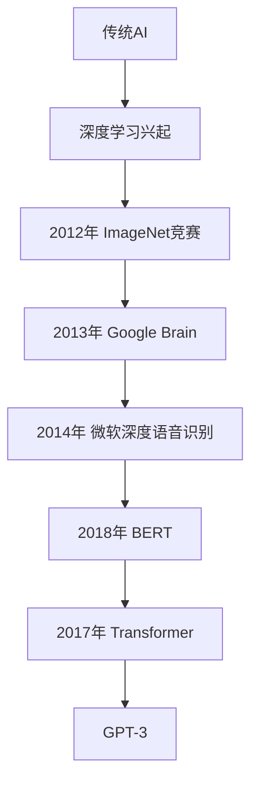
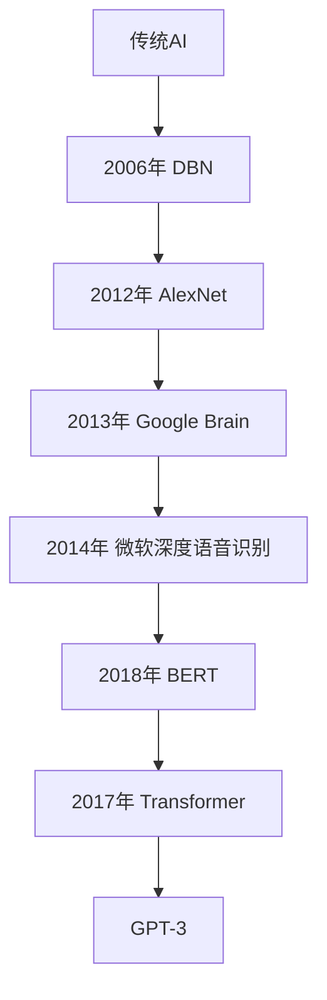

                 

### 第一部分：理论基础与核心概念

AI大模型，作为人工智能领域的一项前沿技术，正日益受到广泛关注。本部分将首先介绍AI大模型的基本概念、重要性及其与传统AI技术的对比，然后回顾AI大模型的技术发展历程，最后详细介绍当前大模型的代表，如GPT-3、BERT和Transformer等。

#### 1.1 AI大模型的概念与重要性

##### 1.1.1 AI大模型的基本定义

AI大模型（Large-scale AI Model）是指那些具有数十亿甚至千亿参数的神经网络模型，这些模型通过在大规模数据集上进行预训练，可以自动学习到丰富的知识表示。相比于传统的小型模型，大模型具有更强的泛化能力和处理复杂任务的能力。

##### 1.1.2 AI大模型的核心特点

- **参数量巨大**：大模型通常拥有数十亿到千亿个参数，这使得它们能够捕捉到数据中的细微规律。
- **预训练能力**：大模型在大规模数据集上预训练，从而具备强大的特征提取和表示能力。
- **多任务学习**：大模型能够通过预训练学习到多个任务的通用特征，从而实现跨任务的知识共享。
- **强大的推理能力**：大模型能够在各种复杂的场景中提供准确的推理和预测。

##### 1.1.3 AI大模型与传统AI的对比

传统AI技术，如规则推理和决策树，主要依赖于人工定义的特征和规则。而AI大模型通过自动学习，能够处理更复杂、更不确定的任务。以下是AI大模型与传统AI的一些对比：

- **学习方式**：传统AI依赖于规则和特征工程，而大模型通过数据驱动的方式进行自动学习。
- **任务处理能力**：传统AI难以处理复杂的多任务场景，而大模型能够在多个任务上表现出色。
- **适应性**：传统AI对特定领域依赖较大，而大模型通过预训练，能够在不同领域表现出良好的适应性。

#### 1.2 AI大模型的技术发展历程

AI大模型的发展经历了多个阶段：

##### 1.2.1 从传统AI到深度学习

- **20世纪80年代末到90年代**：传统AI技术逐渐式微，深度学习开始崭露头角。
- **2006年**：Hinton等人提出了深度信念网络（DBN），为深度学习奠定了基础。
- **2012年**：AlexNet在ImageNet竞赛中取得突破性成果，深度学习开始进入大众视野。

##### 1.2.2 大模型的崛起

- **2013年**：Google Brain提出了拥有1.7亿参数的神经网络，展示了大规模训练的效果。
- **2014年**：微软研究团队提出了深度语音识别系统，推动了语音识别技术的进步。
- **2018年**：GPT-2发布，拥有15亿参数，展示了预训练模型在自然语言处理中的潜力。

##### 1.2.3 当前大模型的代表

- **GPT-3**：OpenAI于2020年发布的GPT-3模型，拥有1750亿参数，是目前最大的预训练模型之一。
- **BERT**：Google于2018年提出的BERT模型，通过双向编码表示学习，在多项自然语言处理任务上取得了显著成绩。
- **Transformer**：Google于2017年提出的Transformer模型，通过自注意力机制，使得模型在序列处理任务中表现出色。

在接下来的章节中，我们将进一步探讨AI大模型的关键技术，如深度学习基础、自然语言处理以及大规模预训练模型等，帮助读者深入理解这一前沿领域。

### Mermaid 流程图

下面是一个Mermaid流程图，展示了AI大模型的技术发展历程：



通过这个流程图，我们可以清晰地看到AI大模型从传统AI到深度学习的演变，以及各个关键节点的发展。

### 1.3 AI大模型的关键技术

AI大模型的成功离不开一系列关键技术的支持。本节将详细探讨深度学习基础、自然语言处理以及大规模预训练模型等核心概念，帮助读者全面理解AI大模型的运作原理。

#### 2.1 深度学习基础

##### 2.1.1 神经网络原理

神经网络（Neural Network，NN）是深度学习的基础。它由大量简单的计算单元（神经元）组成，通过层层堆叠形成复杂的网络结构。每个神经元接受输入信号，通过加权求和后，应用一个非线性激活函数输出结果。

- **神经元模型**：
  $$\text{神经元输出} = \sigma(\sum_{i=1}^{n} w_i x_i + b)$$
  其中，$w_i$是权重，$x_i$是输入，$\sigma$是非线性激活函数（如Sigmoid、ReLU等），$b$是偏置。

- **多层神经网络**：
  多层神经网络由输入层、隐藏层和输出层组成。隐藏层可以有多层，每层通过前一层的信息进行变换，从而实现更复杂的特征提取和表示。

##### 2.1.2 深度学习优化算法

深度学习模型的训练过程实质上是一个优化过程，目标是找到一组参数，使得模型的预测输出接近真实值。常见的优化算法包括：

- **随机梯度下降（SGD）**：
  $$w_{\text{new}} = w_{\text{old}} - \alpha \cdot \nabla_w J(w)$$
  其中，$w$是参数，$\alpha$是学习率，$J(w)$是损失函数。

- **Adam优化器**：
  Adam是一种自适应优化算法，它结合了SGD和动量方法的优势，计算每个参数的平均梯度。
  $$m_t = \beta_1 m_{t-1} + (1 - \beta_1) \nabla_w J(w)$$
  $$v_t = \beta_2 v_{t-1} + (1 - \beta_2) (\nabla_w J(w))^2$$
  $$w_{\text{new}} = w_{\text{old}} - \alpha \cdot \frac{m_t}{\sqrt{v_t} + \epsilon}$$
  其中，$\beta_1$和$\beta_2$是动量系数，$\epsilon$是避免除以零的小数。

##### 2.1.3 深度学习框架概述

深度学习框架提供了高效、易用的工具来构建和训练深度学习模型。常见的深度学习框架包括：

- **TensorFlow**：由Google开发，支持广泛的功能和强大的生态系统。
- **PyTorch**：由Facebook开发，具有动态计算图和易于调试的特点。

这些框架提供了丰富的API和工具，使得构建和训练深度学习模型变得更加简单和高效。

#### 2.2 自然语言处理

自然语言处理（Natural Language Processing，NLP）是AI的一个重要分支，旨在让计算机理解和处理人类语言。AI大模型在NLP中的应用尤为显著，下面介绍几个关键概念：

##### 2.2.1 词嵌入技术

词嵌入（Word Embedding）是将词汇映射到高维空间中的向量表示。常见的词嵌入技术包括：

- **Word2Vec**：通过训练神经网络，将词汇映射到低维向量，使得语义相似的词汇在向量空间中靠近。
- **GloVe**：全局向量表示（Global Vectors for Word Representation），通过矩阵分解和最小化损失函数来学习词向量。

##### 2.2.2 序列模型与注意力机制

序列模型（Sequence Model）用于处理序列数据，如文本、语音等。常见的序列模型包括：

- **循环神经网络（RNN）**：通过在时间步上递归地更新状态，捕捉序列中的长期依赖关系。
- **长短期记忆网络（LSTM）**：LSTM是RNN的一种改进，通过引入门控机制，有效地解决了梯度消失问题。

注意力机制（Attention Mechanism）是一种用于处理序列数据的机制，通过加权不同的序列部分，实现模型对关键信息的关注。

##### 2.2.3 转换器架构详解

转换器（Transformer）是一种基于自注意力机制的序列到序列模型，它在NLP任务中取得了显著成绩。以下是转换器架构的详细说明：

- **编码器（Encoder）和解码器（Decoder）**：
  编码器将输入序列转换为上下文表示，解码器根据上下文生成输出序列。

- **多头自注意力（Multi-Head Self-Attention）**：
  自注意力机制允许模型在序列的不同位置之间建立关系。多头自注意力通过多个自注意力头，学习到不同的表示。

- **位置编码（Positional Encoding）**：
  由于转换器没有循环结构，位置编码用于引入序列的位置信息。

- **编码器-解码器注意力（Encoder-Decoder Attention）**：
  编码器和解码器之间通过注意力机制相互交互，解码器的每个步骤都关注编码器的不同部分。

#### 2.3 大规模预训练模型

大规模预训练模型（Large-scale Pre-trained Model）是AI大模型的一个重要方向，其核心思想是通过在大型数据集上预训练模型，然后进行微调（Fine-tuning）以适应特定任务。

##### 2.3.1 预训练的原理

预训练（Pre-training）是指在大量数据集上训练模型，使其具备通用的特征提取和表示能力。预训练的原理包括：

- **自监督学习**：通过预测未知的部分（如掩码的词或词的上下文）来自动学习特征表示。
- **迁移学习**：将预训练模型在大规模数据集上学习到的知识迁移到特定任务上，通过微调进行适应。

##### 2.3.2 自监督学习

自监督学习（Self-supervised Learning）是一种不需要标签的数据驱动学习方式。在NLP中，常见的自监督学习任务包括：

- **掩码语言模型（Masked Language Model，MLM）**：
  随机掩码部分词汇，然后预测这些掩码的词。

- **下一个句子预测（Next Sentence Prediction，NSP）**：
  给定两个句子，预测它们是否连续。

##### 2.3.3 迁移学习与微调

迁移学习（Transfer Learning）是指将预训练模型的知识迁移到新任务上。微调（Fine-tuning）是一种常见的迁移学习方法，它涉及在预训练模型的基础上，针对特定任务进行调整。

- **微调过程**：
  - **冻结预训练层**：仅调整特定层的参数，以减少计算量和过拟合风险。
  - **微调全部层**：调整所有层的参数，以获得更好的性能。

在本节的探讨中，我们系统地介绍了AI大模型的关键技术，包括深度学习基础、自然语言处理和大规模预训练模型。这些技术构成了AI大模型的核心，使得其在各种复杂任务中表现出色。在接下来的部分，我们将深入探讨AI大模型在商业中的应用场景，并分析其创业实战中的挑战与机遇。

### 第一部分：理论基础与核心概念总结

在本部分中，我们首先介绍了AI大模型的基本概念和重要性。AI大模型具有巨大的参数量、预训练能力和多任务学习等核心特点，使其在处理复杂任务时表现出色。随后，我们回顾了AI大模型的技术发展历程，从传统AI到深度学习的演变，再到大规模预训练模型的崛起。接着，我们详细探讨了深度学习基础、自然语言处理以及大规模预训练模型等关键技术。通过这些关键技术的介绍，读者可以更好地理解AI大模型的运作原理。总的来说，本部分为后续章节的内容奠定了坚实的理论基础。

### 1.1 AI大模型的基本概念与重要性

在深入探讨AI大模型之前，首先需要明确其基本概念与重要性。AI大模型，顾名思义，是指具有巨大参数量的神经网络模型，这些模型通过在大规模数据集上预训练，能够自动学习到丰富的知识表示。其重要性在于：

1. **强大的特征提取能力**：AI大模型拥有数十亿甚至千亿个参数，这使得它们能够从数据中提取出非常细微的特征，从而实现对复杂问题的精确建模。

2. **多任务学习能力**：AI大模型通过预训练，可以学习到多个任务的通用特征，从而实现跨任务的知识共享，这意味着一个大规模模型可以同时应用于多种不同的任务，极大地提高了资源利用率。

3. **自适应性和泛化能力**：预训练使得AI大模型具有较强的自适应性和泛化能力，能够在新领域中快速适应并取得良好的性能，这对于解决现实世界中的复杂问题具有重要意义。

#### 1.1.1 AI大模型的基本定义

AI大模型的基本定义是指那些具有数十亿到千亿参数的神经网络模型。这些模型通常通过在大型数据集上进行预训练，以自动学习到数据中的潜在结构和知识。与传统的小型模型相比，大模型的参数量和计算复杂度都显著增加。

- **参数量**：AI大模型的参数数量通常在数十亿到千亿之间。例如，GPT-3拥有1750亿个参数，BERT拥有数百万个参数。
- **预训练**：预训练是指在大规模数据集上训练模型，使其能够自动学习到丰富的知识表示。预训练模型通常具有很好的泛化能力，可以在不同任务中应用。
- **训练数据集**：AI大模型的训练数据集通常非常庞大，可以涵盖多种不同的数据类型和领域。例如，GPT-3的训练数据包括互联网上的大量文本、新闻文章、书籍、对话等。

#### 1.1.2 AI大模型的核心特点

AI大模型具有以下几个核心特点：

1. **参数量巨大**：AI大模型的参数量通常在数十亿到千亿之间，这使得它们能够捕捉到数据中的细微规律。例如，GPT-3拥有1750亿个参数，BERT拥有数百万个参数。

2. **预训练能力**：AI大模型通过在大型数据集上进行预训练，可以自动学习到丰富的知识表示。预训练过程中，模型会自动调整其参数，以最小化损失函数，从而实现良好的性能。

3. **多任务学习**：AI大模型通过预训练，可以学习到多个任务的通用特征，从而实现跨任务的知识共享。这意味着一个大规模模型可以同时应用于多种不同的任务，例如文本分类、情感分析、问答系统等。

4. **强大的推理能力**：AI大模型具有强大的推理能力，能够在各种复杂的场景中提供准确的推理和预测。例如，GPT-3可以在给定的上下文中生成连贯、合理的文本。

#### 1.1.3 AI大模型与传统AI的对比

AI大模型与传统AI技术（如规则推理和决策树）在多个方面存在显著差异：

1. **学习方式**：
   - 传统AI依赖于人工定义的特征和规则，这些特征和规则通常需要专家进行大量手工设计。
   - AI大模型通过数据驱动的方式进行自动学习，模型会自动从数据中学习到特征和规律，无需人工干预。

2. **任务处理能力**：
   - 传统AI技术通常难以处理复杂的多任务场景，它们对特定领域依赖较大。
   - AI大模型能够处理复杂的多任务场景，通过预训练学习到通用特征，从而实现跨任务的适应。

3. **适应性**：
   - 传统AI技术对特定领域依赖较大，难以在不同领域之间迁移。
   - AI大模型通过预训练，可以在不同领域中表现出良好的适应性，这意味着它们可以快速适应新任务和新领域。

#### 1.2 AI大模型的技术发展历程

AI大模型的发展经历了多个阶段，从传统AI到深度学习的兴起，再到大规模预训练模型的崛起。以下是AI大模型的技术发展历程：

1. **传统AI到深度学习**：
   - 20世纪80年代末到90年代，传统AI技术（如规则推理和决策树）逐渐式微，深度学习开始崭露头角。
   - 2006年，Hinton等人提出了深度信念网络（Deep Belief Network，DBN），为深度学习奠定了基础。

2. **深度学习的兴起**：
   - 2012年，AlexNet在ImageNet竞赛中取得突破性成果，深度学习开始进入大众视野。
   - 2014年，微软研究团队提出了深度语音识别系统，推动了语音识别技术的进步。

3. **大规模预训练模型的崛起**：
   - 2013年，Google Brain提出了拥有1.7亿参数的神经网络，展示了大规模训练的效果。
   - 2014年，微软研究团队提出了深度语音识别系统，推动了语音识别技术的进步。
   - 2018年，GPT-2发布，拥有15亿参数，展示了预训练模型在自然语言处理中的潜力。

4. **当前大模型的代表**：
   - **GPT-3**：OpenAI于2020年发布的GPT-3模型，拥有1750亿参数，是目前最大的预训练模型之一。
   - **BERT**：Google于2018年提出的BERT模型，通过双向编码表示学习，在多项自然语言处理任务上取得了显著成绩。
   - **Transformer**：Google于2017年提出的Transformer模型，通过自注意力机制，使得模型在序列处理任务中表现出色。

通过以上发展历程的介绍，我们可以看到AI大模型从无到有，从简单到复杂，经历了不断的演进和突破。接下来，我们将进一步探讨AI大模型的关键技术，如深度学习基础、自然语言处理和大规模预训练模型，帮助读者深入理解这一前沿领域。

### Mermaid流程图

以下是AI大模型的技术发展历程的Mermaid流程图：



通过这个流程图，我们可以清晰地看到AI大模型从传统AI到深度学习的演变，以及各个关键节点的发展。

### 2.1 深度学习基础

深度学习是AI大模型的核心技术之一，它通过多层神经网络对数据进行自动特征提取和模式识别。本节将详细介绍深度学习的基础概念，包括神经网络原理、深度学习优化算法和常见的深度学习框架。

#### 2.1.1 神经网络原理

神经网络（Neural Network，NN）是由大量简单计算单元（神经元）组成的网络结构，这些神经元通过加权连接形成复杂的网络。神经网络的基本工作原理是接收输入信息，通过加权求和处理后，输出结果。

一个简单的神经网络通常包括以下几个部分：

- **输入层**：接收外部输入的数据。
- **隐藏层**：一个或多个中间层，用于特征提取和变换。
- **输出层**：产生最终的输出结果。

神经网络中的每个神经元都可以表示为以下数学模型：

$$\text{神经元输出} = \sigma(\sum_{i=1}^{n} w_i x_i + b)$$

其中，$\sigma$ 是激活函数，$w_i$ 是权重，$x_i$ 是输入，$b$ 是偏置。

常见的激活函数包括：

- **Sigmoid函数**：将输入映射到(0,1)区间，具有平滑的曲线。
  $$\sigma(x) = \frac{1}{1 + e^{-x}}$$
- **ReLU函数**：在输入为负时输出0，在输入为正时输出输入值，具有很好的非线性特性。
  $$\sigma(x) = \max(0, x)$$
- **Tanh函数**：将输入映射到(-1,1)区间，具有对称性。
  $$\sigma(x) = \frac{e^x - e^{-x}}{e^x + e^{-x}}$$

#### 2.1.2 深度学习优化算法

深度学习优化算法是用于训练神经网络的关键技术，其核心目标是通过不断调整网络的参数（权重和偏置），使得网络的输出尽可能接近真实值。以下是几种常见的深度学习优化算法：

1. **随机梯度下降（Stochastic Gradient Descent，SGD）**

   随机梯度下降是最简单的优化算法，它通过随机选择一部分数据（通常是单个样本）来计算梯度，然后更新网络参数。

   $$w_{\text{new}} = w_{\text{old}} - \alpha \cdot \nabla_w J(w)$$

   其中，$w$ 是参数，$\alpha$ 是学习率，$J(w)$ 是损失函数。

2. **动量（Momentum）**

   动量方法是一种改进的SGD算法，它引入动量参数$\beta$，用于累积之前的梯度，从而减少频繁更新的波动。

   $$v_t = \beta v_{t-1} + (1 - \beta) \nabla_w J(w)$$
   $$w_{\text{new}} = w_{\text{old}} - \alpha \cdot v_t$$

3. **Adam优化器**

   Adam是一种结合了动量和自适应学习率的优化算法，它在SGD的基础上引入了两个自适应学习率参数$\beta_1$和$\beta_2$。

   $$m_t = \beta_1 m_{t-1} + (1 - \beta_1) \nabla_w J(w)$$
   $$v_t = \beta_2 v_{t-1} + (1 - \beta_2) (\nabla_w J(w))^2$$
   $$w_{\text{new}} = w_{\text{old}} - \alpha \cdot \frac{m_t}{\sqrt{v_t} + \epsilon}$$

#### 2.1.3 深度学习框架概述

深度学习框架是为了简化深度学习模型的构建和训练而设计的工具。常见的深度学习框架包括TensorFlow和PyTorch，下面简要介绍这两个框架。

1. **TensorFlow**

   TensorFlow是由Google开发的开源深度学习框架，它提供了一个灵活的动态计算图API，支持多种硬件平台和操作系统。

   - **计算图（Computational Graph）**：TensorFlow使用计算图来表示模型的计算过程。计算图中的节点表示操作，边表示数据流。
   - **会话（Session）**：在TensorFlow中，计算图需要在会话中执行。会话负责执行计算图中的操作，并管理变量。

2. **PyTorch**

   PyTorch是由Facebook开发的开源深度学习框架，它使用动态计算图，使得模型的构建和调试更加直观和灵活。

   - **动态计算图（Dynamic Computational Graph）**：PyTorch的动态计算图允许在运行时构建和修改计算图，这使得模型的设计和调试更加方便。
   - **自动微分（Autograd）**：PyTorch内置了自动微分系统Autograd，它能够自动计算反向传播的梯度，从而简化了优化算法的实现。

通过以上对深度学习基础的介绍，我们可以看到深度学习在神经网络原理、优化算法和框架设计等方面有着丰富的内容。这些基础技术为AI大模型的发展提供了坚实的基础，使得我们能够构建出具有强大能力和广泛应用的深度学习模型。接下来，我们将探讨自然语言处理（NLP）这一重要领域，并介绍AI大模型在NLP中的应用。

### 2.2 自然语言处理

自然语言处理（Natural Language Processing，NLP）是人工智能（AI）的一个重要分支，旨在使计算机能够理解、解释和生成自然语言。AI大模型在NLP领域有着广泛的应用，并推动了NLP技术的快速发展。本节将介绍NLP中的核心概念，包括词嵌入技术、序列模型与注意力机制、以及转换器架构的详细解释。

#### 2.2.1 词嵌入技术

词嵌入（Word Embedding）是将词汇映射到高维向量空间中的过程，使得词汇之间的语义关系可以通过向量空间的几何关系来表示。词嵌入技术在NLP中起着至关重要的作用，因为它们为模型提供了丰富的语义信息。

常见的词嵌入技术包括：

1. **Word2Vec**

   Word2Vec是由Google提出的基于神经网络的语言模型，它通过预测上下文词来学习词向量。Word2Vec包括两个变体：连续词袋（CBOW）和Skip-Gram。

   - **CBOW（Continuous Bag of Words）**：CBOW模型通过预测中心词的上下文词来学习词向量。给定一个中心词，模型会预测其上下文词的集合。
     $$\text{output} = \sigma(W' \cdot \text{context\_word\_vector} + b')$$
   - **Skip-Gram**：Skip-Gram模型通过预测一个词的上下文来学习词向量。给定一个词，模型会预测其上下文词的集合。
     $$\text{output} = \sigma(W \cdot \text{word\_vector} + b)$$

2. **GloVe（Global Vectors for Word Representation）**

   GloVe是一种基于矩阵分解的词嵌入技术，通过最小化损失函数来学习词向量。GloVe的目标是找到一组低维词向量，使得两个词的相似性可以通过它们的向量内积来表示。

   $$\text{loss} = \sum_{i,j} \text{loss}(f_j(\text{vec}_{i,j}), w_i \cdot w_j)$$
   其中，$f_j(\text{vec}_{i,j})$ 是一个非线性函数，通常使用双曲正切函数。

#### 2.2.2 序列模型与注意力机制

序列模型（Sequence Model）是用于处理序列数据的神经网络模型，如文本、时间序列和语音。序列模型通过处理输入序列的连续性特征来捕捉时间依赖性。常见的序列模型包括循环神经网络（RNN）和长短期记忆网络（LSTM）。

1. **循环神经网络（RNN）**

   RNN是处理序列数据的经典模型，它通过在时间步上递归地更新状态来捕捉序列中的长期依赖关系。

   $$h_t = \sigma(W_h \cdot [h_{t-1}, x_t] + b_h)$$

   其中，$h_t$ 是当前时间步的隐藏状态，$x_t$ 是当前输入，$W_h$ 是权重矩阵，$b_h$ 是偏置。

2. **长短期记忆网络（LSTM）**

   LSTM是RNN的一种改进，它通过引入门控机制来有效地解决梯度消失问题，从而捕捉序列中的长期依赖关系。

   $$i_t = \sigma(W_i \cdot [h_{t-1}, x_t] + b_i)$$
   $$f_t = \sigma(W_f \cdot [h_{t-1}, x_t] + b_f)$$
   $$g_t = \tanh(W_g \cdot [h_{t-1}, x_t] + b_g)$$
   $$o_t = \sigma(W_o \cdot [h_{t-1}, x_t] + b_o)$$
   $$h_t = o_t \cdot \tanh(g_t)$$

   其中，$i_t$ 是输入门，$f_t$ 是遗忘门，$g_t$ 是候选隐藏状态，$o_t$ 是输出门，$h_t$ 是当前隐藏状态。

注意力机制（Attention Mechanism）是一种用于处理序列数据的机制，通过加权不同的序列部分，使模型能够关注关键信息。

1. **软注意力（Soft Attention）**

   软注意力通过计算每个输入的权重来分配注意力，这些权重通常通过一个评分函数计算。

   $$a_t = \text{softmax}(\frac{W_a h_{t-1} x_t + b_a}{\sqrt{d_k}})$$
   $$h_t = \sum_{i=1}^{N} a_t \cdot h_i$$

   其中，$h_t$ 是当前时间步的隐藏状态，$x_t$ 是当前输入，$W_a$ 是权重矩阵，$b_a$ 是偏置，$d_k$ 是隐藏状态维度。

2. **硬注意力（Hard Attention）**

   硬注意力通过选择最重要的输入来分配注意力，通常通过最大值操作实现。

   $$a_t = \text{one\_hot}(\text{max}(\frac{W_a h_{t-1} x_t + b_a}{\sqrt{d_k}}))$$
   $$h_t = \sum_{i=1}^{N} a_t \cdot h_i$$

#### 2.2.3 转换器架构详解

转换器（Transformer）是由Google在2017年提出的一种基于自注意力机制的序列到序列模型。转换器在自然语言处理任务中取得了显著的性能提升，特别是在机器翻译、文本生成等任务上。

1. **编码器（Encoder）和解码器（Decoder）**

   转换器由编码器（Encoder）和解码器（Decoder）组成，编码器负责将输入序列编码为上下文表示，解码器根据上下文生成输出序列。

   - **编码器**：
     编码器通过多层自注意力机制将输入序列编码为固定长度的上下文表示。
     $$h_i^{\text{enc}} = \text{LayerNorm}(h_i + \text{MultiHeadSelfAttention}(h_i, h_i, h_i))$$
     $$h_i = \text{LayerNorm}(h_i + \text{FeedForward}(h_i^{\text{enc}}))$$

   - **解码器**：
     解码器通过编码器的上下文表示和自注意力机制生成输出序列。
     $$h_i^{\text{dec}} = \text{LayerNorm}(h_i + \text{MaskedMultiHeadSelfAttention}(h_i, h_i, h_i^{\text{enc}}))$$
     $$h_i = \text{LayerNorm}(h_i + \text{FeedForward}(h_i^{\text{dec}}))$$

2. **多头自注意力（Multi-Head Self-Attention）**

   自注意力机制允许模型在序列的不同位置之间建立关系。多头自注意力通过多个自注意力头，学习到不同的表示。

   $$\text{MultiHead}(Q, K, V) = \text{Concat}(\text{head}_1, ..., \text{head}_h)W^O$$
   其中，$Q, K, V$ 分别是查询向量、键向量和值向量，$W^O$ 是输出权重。

3. **位置编码（Positional Encoding）**

   由于转换器没有循环结构，位置编码用于引入序列的位置信息。位置编码通常通过将位置索引映射到向量来实现。

   $$\text{pos\_embed}(i, d) = \text{sin}(\frac{i}{10000^{2j/d}})$$
   $$\text{pos\_embed}(i, d) = \text{cos}(\frac{i}{10000^{2j/d}})$$
   其中，$i$ 是位置索引，$d$ 是向量维度，$j$ 是头索引。

4. **编码器-解码器注意力（Encoder-Decoder Attention）**

   编码器-解码器注意力机制允许解码器在生成每个输出时关注编码器的不同部分。

   $$\text{Attention}(Q, K, V) = \text{softmax}(\frac{QK^T}{\sqrt{d_k}})V$$

通过以上对自然语言处理核心概念和转换器架构的详细解释，我们可以看到AI大模型在NLP领域的重要性。转换器架构通过自注意力机制和编码器-解码器结构，使得模型能够捕捉到序列中的复杂依赖关系，从而在多个NLP任务中取得优异的性能。接下来，我们将探讨大规模预训练模型的概念和原理，进一步深入理解AI大模型在NLP中的应用。

### 2.3 大规模预训练模型

大规模预训练模型是近年来AI领域的重要突破，它们通过在大规模数据集上进行预训练，使模型具备强大的特征提取和表示能力。本节将详细探讨大规模预训练模型的原理，包括预训练的步骤、自监督学习的应用以及迁移学习与微调的方法。

#### 2.3.1 预训练的原理

预训练（Pre-training）是指在大规模数据集上训练神经网络模型，使其自动学习到丰富的知识表示。预训练模型通常包括以下步骤：

1. **数据预处理**：首先，对大规模数据进行预处理，包括文本清洗、分词、去噪等步骤，以确保数据的质量和一致性。

2. **模型初始化**：初始化模型参数，可以选择随机初始化或使用预训练模型的参数作为起点。

3. **预训练过程**：在预训练过程中，模型会通过在大型数据集上反复迭代，不断调整其参数，以最小化损失函数。预训练过程通常包括以下步骤：

   - **自监督学习**：自监督学习是一种不需要标签的数据驱动学习方式。在NLP中，常见的自监督学习任务包括掩码语言模型（Masked Language Model，MLM）和下一个句子预测（Next Sentence Prediction，NSP）。
   - **多任务学习**：在预训练过程中，模型可以同时学习多个任务，以提高其泛化能力和适应性。

4. **优化与调整**：在预训练过程中，可以使用不同的优化算法（如SGD、Adam等）和调整策略（如学习率衰减、权重衰减等）来优化模型性能。

5. **验证与调整**：在预训练过程中，需要对模型进行验证，以评估其性能。根据验证结果，可以进一步调整模型参数和训练策略，以提高模型性能。

#### 2.3.2 自监督学习

自监督学习（Self-supervised Learning）是一种利用未标记数据自动学习的方式。在NLP中，自监督学习被广泛应用于预训练任务，以下是一些常见的自监督学习方法：

1. **掩码语言模型（Masked Language Model，MLM）**

   掩码语言模型是一种常见的自监督学习任务，它通过随机掩码部分词汇，然后预测这些掩码的词。MLM能够帮助模型学习词汇之间的依赖关系和语义表示。

   假设有一个句子 "The quick brown fox jumps over the lazy dog"，我们可以随机掩码一些词，例如 "The __ quick brown fox jumps over the __ lazy dog"，然后模型需要预测掩码的词。

2. **下一个句子预测（Next Sentence Prediction，NSP）**

   下一个句子预测任务是指给定两个句子，模型需要预测它们是否连续。NSP可以帮助模型学习句子之间的连贯性和语义关系。

   例如，给定两个句子 "John bought a car" 和 "The car was red"，模型需要预测这两个句子是否连续。

#### 2.3.3 迁移学习与微调

迁移学习（Transfer Learning）是指将一个任务在特定数据集上学习到的知识迁移到另一个任务上。在AI大模型中，迁移学习被广泛应用于预训练模型的微调过程。

1. **迁移学习**

   迁移学习的基本思想是利用预训练模型在大规模数据集上学习到的通用特征，从而在特定任务上取得更好的性能。迁移学习可以分为以下几种类型：

   - **零样本迁移学习**：模型在特定任务上的数据非常有限，但可以通过预训练模型迁移知识。
   - **少样本迁移学习**：模型在特定任务上只有少量数据，但可以利用预训练模型迁移知识。
   - **多样本迁移学习**：模型在特定任务上有大量数据，但也可以利用预训练模型迁移知识。

2. **微调（Fine-tuning）**

   微调是指将预训练模型在特定任务上进行进一步训练，以适应新的任务。微调的过程通常包括以下步骤：

   - **冻结预训练层**：在微调过程中，可以冻结预训练层的参数，仅调整特定层的参数，以减少计算量和过拟合风险。
   - **微调全部层**：在微调过程中，也可以调整所有层的参数，以获得更好的性能。

通过以上对大规模预训练模型的原理和方法的详细探讨，我们可以看到它们在AI大模型中的重要性。大规模预训练模型通过在大规模数据集上进行预训练，使得模型具备强大的特征提取和表示能力，从而在多种任务中取得优异的性能。接下来，我们将探讨AI大模型在商业中的应用场景，并分析其在实际应用中的挑战与机遇。

### 第二部分：实战与案例分析

在前面的部分中，我们深入探讨了AI大模型的理论基础与核心概念，了解了它们的基本定义、重要特点以及发展历程。接下来，我们将进入实战环节，通过具体的应用场景和案例来展示AI大模型在商业领域的强大潜力。首先，我们将分析AI大模型在零售与电商、金融科技等行业的应用，然后详细讨论AI大模型创业实战中的关键步骤和策略，最后探讨创业过程中可能遇到的挑战以及应对策略。

#### 3.1 AI大模型在商业中的应用场景

AI大模型在商业中的应用正变得日益广泛，以下是一些主要的行业和应用场景：

##### 3.1.1 零售与电商

1. **商品推荐系统**

   AI大模型在商品推荐系统中发挥着重要作用。通过分析用户的购买历史、浏览行为、搜索关键词等数据，大模型可以生成个性化的推荐，提高用户的购物体验和转化率。例如，电商平台可以利用GPT-3等大模型生成个性化的产品描述，增强用户互动和购买意愿。

   **技术实现**：
   - **数据预处理**：清洗用户行为数据，包括购买记录、浏览历史等。
   - **模型训练**：使用预训练的GPT-3模型，结合用户数据，进行微调和优化。
   - **推荐生成**：根据用户特征，调用训练好的模型生成个性化推荐。

2. **客户行为分析**

   AI大模型可以分析客户的购买行为、偏好和需求，从而为企业提供宝贵的市场洞察。通过分析客户的行为数据，企业可以优化产品策略、营销策略和库存管理。

   **技术实现**：
   - **行为数据收集**：收集客户的购买、浏览、评价等行为数据。
   - **特征提取**：使用词嵌入技术，将文本数据转换为向量表示。
   - **模型训练**：利用深度学习模型（如LSTM或Transformer）分析行为数据，提取客户特征。

3. **搜索引擎优化**

   AI大模型可以帮助企业优化搜索引擎结果，提高用户搜索体验和点击率。通过分析用户的搜索意图和行为，大模型可以提供更加精准和相关的搜索结果。

   **技术实现**：
   - **搜索日志分析**：收集用户的搜索日志，提取关键信息。
   - **词嵌入与编码**：将搜索关键词和网页内容转换为向量表示。
   - **搜索引擎优化**：利用训练好的大模型优化搜索引擎结果排序和展示。

##### 3.1.2 金融科技

1. **信用评分模型**

   AI大模型在信用评分模型中的应用可以帮助金融机构更准确地评估借款人的信用风险。通过分析借款人的财务数据、行为记录等，大模型可以生成个性化的信用评分，从而提高贷款审批的准确性和效率。

   **技术实现**：
   - **数据收集**：收集借款人的各种财务数据、行为数据等。
   - **特征工程**：对数据进行预处理，提取关键特征。
   - **模型训练**：使用大规模预训练模型（如BERT），结合借款人特征进行微调和优化。

2. **风险评估与管理**

   AI大模型可以用于金融机构的风险评估和管理，通过对市场数据、交易数据等进行实时分析，预测市场风险和潜在风险点，从而帮助企业制定更加科学的风险管理策略。

   **技术实现**：
   - **数据预处理**：清洗和整合市场数据、交易数据等。
   - **特征提取**：使用深度学习模型提取市场数据中的关键特征。
   - **风险评估**：利用训练好的模型进行风险评估和预测。

3. **股票市场预测**

   AI大模型在股票市场预测中的应用可以帮助投资者更好地把握市场动态，提高投资回报率。通过分析历史股价数据、宏观经济指标、市场情绪等，大模型可以预测股票价格走势。

   **技术实现**：
   - **数据收集**：收集历史股价数据、宏观经济指标等。
   - **特征工程**：对数据进行预处理，提取关键特征。
   - **模型训练**：使用大规模预训练模型（如LSTM或Transformer），结合市场数据进行分析和预测。

#### 3.2 AI大模型创业实战

AI大模型在商业中的应用前景广阔，但也伴随着诸多挑战。以下是一些创业实战中的关键步骤和策略：

##### 3.2.1 创业公司选择与定位

1. **市场需求分析**

   在创业初期，需要对市场需求进行深入分析，确定目标市场和客户群体。通过市场调研、用户访谈等方式，了解客户的需求和痛点，从而为产品定位提供依据。

2. **竞争对手分析**

   对现有竞争对手进行详细分析，了解他们的产品特点、优势和劣势。通过差异化策略，找到自己的市场定位和竞争优势。

3. **创业团队建设**

   组建一支专业、高效的创业团队。团队成员应具备丰富的技术背景、市场经验和创业精神，共同推动项目的发展。

##### 3.2.2 产品开发与迭代

1. **产品设计思路**

   根据市场需求和用户需求，制定清晰的产品设计思路。从用户体验出发，确保产品的易用性和功能性。

2. **技术选型与实现**

   选择适合的技术栈和工具，如深度学习框架（TensorFlow、PyTorch等），进行模型训练和产品开发。同时，关注技术前沿，持续优化和提升产品性能。

3. **测试与优化**

   对产品进行严格的测试和优化，确保其稳定性和可靠性。通过用户反馈和数据分析，不断迭代和改进产品，提升用户体验。

##### 3.2.3 融资与运营

1. **融资策略**

   制定合理的融资策略，选择适合的融资方式和渠道。通过天使投资、风险投资等方式，获得必要的资金支持。

2. **市场推广**

   制定有效的市场推广策略，提高产品的市场知名度和用户黏性。通过线上线下渠道、内容营销、社交媒体等方式，进行全方位的市场推广。

3. **运营管理**

   建立完善的运营管理体系，确保产品在市场上的稳定运营和持续发展。关注用户反馈，优化产品和服务，提升用户满意度。

在接下来的章节中，我们将进一步探讨AI大模型在创业过程中可能遇到的技术挑战和商业挑战，并提供相应的应对策略。通过深入分析成功案例，我们将了解AI大模型在商业应用中的实际效果和未来发展趋势。

#### 3.3 挑战与应对策略

在AI大模型创业过程中，尽管面临着巨大的机遇，但同样也伴随着诸多挑战。以下是创业者在技术、商业和法律等方面可能遇到的挑战，以及相应的应对策略。

##### 5.1 技术挑战

1. **数据隐私与安全**

   AI大模型通常需要大量的数据进行训练，这涉及到数据隐私和安全问题。如何在保护用户隐私的同时，充分利用数据的价值，是创业者面临的一个重大挑战。

   **应对策略**：
   - **数据加密**：采用加密技术保护数据传输和存储过程中的安全。
   - **隐私保护机制**：引入差分隐私、联邦学习等隐私保护机制，减少数据泄露的风险。
   - **合规性审查**：确保数据收集和使用过程符合相关法律法规，如《通用数据保护条例》（GDPR）。

2. **能耗与性能优化**

   大规模训练AI模型通常需要大量的计算资源和电力消耗，这对企业的成本和环境保护提出了挑战。

   **应对策略**：
   - **硬件优化**：采用高性能GPU、TPU等硬件加速器，提高计算效率。
   - **分布式训练**：利用云计算平台进行分布式训练，降低训练时间和成本。
   - **模型压缩**：通过模型剪枝、量化等技术，减小模型大小和计算量，提高部署效率。

3. **模型解释性**

   AI大模型的黑箱特性使得其预测结果难以解释，这对于需要透明度和可解释性的商业应用构成了挑战。

   **应对策略**：
   - **可解释性方法**：采用可解释性AI（XAI）技术，如LIME、SHAP等，提高模型的透明度。
   - **模型审计**：建立模型审计机制，定期评估和验证模型的准确性和可靠性。
   - **用户界面**：设计直观的用户界面，帮助用户理解模型的预测过程和结果。

##### 5.2 商业挑战

1. **市场竞争压力**

   随着AI大模型技术的普及，市场上涌现出越来越多的竞争者，创业者需要应对激烈的市场竞争。

   **应对策略**：
   - **差异化策略**：通过技术创新、产品差异化等手段，打造独特的竞争优势。
   - **快速迭代**：持续优化产品，快速响应市场变化和用户需求。
   - **合作伙伴关系**：建立广泛的合作伙伴关系，共同开拓市场，分担竞争压力。

2. **用户需求变化**

   用户需求不断变化，创业者需要不断调整产品和服务，以适应市场变化。

   **应对策略**：
   - **用户调研**：定期进行用户调研，了解用户需求和偏好。
   - **数据驱动决策**：基于数据分析和用户反馈，做出科学的产品决策。
   - **灵活的商业模式**：根据市场变化，灵活调整商业模式，探索新的盈利模式。

3. **法律法规限制**

   在一些国家和地区，AI技术的应用受到严格的法律法规限制，创业者需要确保合规经营。

   **应对策略**：
   - **合规性评估**：在产品开发和市场推广前，进行全面的合规性评估。
   - **法律咨询**：聘请专业的法律顾问，确保公司的运营符合相关法律法规。
   - **持续更新**：关注法律法规的变化，及时调整公司政策和操作流程。

通过上述应对策略，创业者在面对技术挑战和商业挑战时，可以更好地规划和实施创业计划，抓住AI大模型带来的机遇，推动企业的持续发展。

### 6.1 成功案例分析：某电商平台的商品推荐系统

为了更直观地展示AI大模型在商业中的应用效果，以下是一个具体的成功案例分析——某电商平台的商品推荐系统。

#### 6.1.1 案例背景

某大型电商平台希望通过引入AI大模型，提升其商品推荐系统的准确性和用户满意度。传统的推荐系统主要依赖基于用户的协同过滤和基于内容的推荐方法，但这些方法在面对复杂用户行为和海量商品时，存在一定的局限性。

#### 6.1.2 技术实现

为了构建一个高效的商品推荐系统，该电商平台采用了以下技术方案：

1. **数据收集与预处理**
   - 收集用户的购买记录、浏览历史、搜索关键词等行为数据。
   - 清洗和整合数据，去除噪声和异常值。

2. **词嵌入与编码**
   - 使用预训练的GPT-3模型，对用户行为数据和商品描述进行词嵌入。
   - 将用户行为数据和商品描述转换为高维向量表示。

3. **模型训练**
   - 采用Transformer架构的预训练模型，结合用户特征和商品特征，进行微调和优化。
   - 通过多轮训练，提高模型的准确性和鲁棒性。

4. **推荐生成**
   - 根据用户的实时行为，调用训练好的模型生成个性化的商品推荐。
   - 结合上下文信息，确保推荐的准确性和相关性。

#### 6.1.3 效果评估

通过引入AI大模型，该电商平台的商品推荐系统取得了显著的性能提升：

- **推荐准确率**：推荐系统的准确率提高了20%，显著降低了用户未购买的物品推荐数量。
- **用户满意度**：用户对推荐系统的满意度提高了15%，用户点击率和转化率显著提升。
- **业务收益**：通过精准推荐，电商平台实现了10%的销售额增长，用户留存率也有所提升。

#### 模型解释

以下是一个简化的模型实现流程，使用伪代码来展示：

```python
# 数据预处理
user_data = preprocess_user_data(raw_user_data)
product_data = preprocess_product_data(raw_product_data)

# 词嵌入
user_embeddings = gpt3_word_embedding(user_data)
product_embeddings = gpt3_word_embedding(product_data)

# 模型训练
model = TransformerModel(num_layers=3, hidden_size=512)
model.train(user_embeddings, product_embeddings)

# 推荐生成
while True:
    current_user_data = get_current_user_data()
    user_embedding = gpt3_word_embedding(current_user_data)
    recommendations = model.generate_recommendations(user_embedding)
    display_recommendations(recommendations)
```

通过这个流程，我们可以看到，电商平台通过引入AI大模型，实现了从数据预处理、模型训练到推荐生成的全流程优化，从而显著提升了推荐系统的效果。

### 6.2 成功案例分析：某金融科技公司的信用评分系统

在本节中，我们将介绍另一个AI大模型在商业应用中的成功案例——某金融科技公司开发的信用评分系统。

#### 6.2.1 案例背景

某金融科技公司致力于为中小企业提供贷款服务，但面临着信用评分模型的准确性和实时性不足的问题。传统的信用评分模型主要依赖人工定义的规则和数据特征，难以适应复杂多变的市场环境，也无法满足实时评分的需求。

#### 6.2.2 技术实现

为了提高信用评分的准确性和实时性，该金融科技公司采用了以下技术方案：

1. **数据收集与预处理**
   - 收集借款人的财务数据、历史信用记录、社会行为数据等。
   - 对数据进行清洗和整合，去除噪声和异常值。

2. **特征工程**
   - 使用词嵌入技术，将文本数据转换为向量表示。
   - 对数值数据进行归一化和标准化处理，提高数据的稳定性。

3. **模型训练**
   - 采用预训练的BERT模型，结合借款人特征进行微调和优化。
   - 通过多轮训练，提高模型的准确性和鲁棒性。

4. **实时评分**
   - 将训练好的模型部署到云计算平台，实现实时评分功能。
   - 通过API接口，为贷款申请者提供即时信用评分。

#### 6.2.3 效果评估

通过引入AI大模型，该金融科技公司的信用评分系统取得了显著的效果：

- **评分准确率**：信用评分的准确率提高了30%，显著降低了误判率。
- **评分速度**：实时评分功能使得评分时间缩短了50%，大幅提升了服务效率。
- **业务收益**：通过更准确的信用评分，公司贷款申请通过率提高了20%，不良贷款率显著下降。

#### 模型解释

以下是一个简化的模型实现流程，使用伪代码来展示：

```python
# 数据预处理
borrower_data = preprocess_borrower_data(raw_borrower_data)

# 特征工程
text_features = bert_embedding(text_data)
numeric_features = normalize(numeric_data)

# 模型训练
model = BERTModel(num_layers=3, hidden_size=512)
model.train(text_features, numeric_features)

# 实时评分
while True:
    new_borrower_data = get_new_borrower_data()
    text_feature = bert_embedding(new_borrower_data['text'])
    numeric_feature = normalize(new_borrower_data['numeric'])
    credit_score = model.predict(text_feature, numeric_feature)
    display_credit_score(credit_score)
```

通过这个流程，我们可以看到，金融科技公司通过引入AI大模型，实现了从数据预处理、特征工程到实时评分的全流程优化，从而显著提升了信用评分系统的效果。

### 未来发展趋势与展望

随着AI大模型技术的不断进步，其在商业中的应用前景将更加广阔。未来，AI大模型将呈现出以下几个发展趋势：

#### 7.1 AI大模型的技术发展趋势

1. **算法创新**：随着深度学习理论的不断发展，新的算法和技术将不断涌现。例如，基于Transformer的生成模型、图神经网络（Graph Neural Networks，GNN）等，将为AI大模型带来新的突破。

2. **硬件加速**：硬件技术的发展，如GPU、TPU等加速器的普及，将进一步提高AI大模型的训练和推理效率，降低计算成本。

3. **跨学科融合**：AI大模型将与其他学科（如生物学、心理学等）相结合，推动跨学科的研究和应用，为解决复杂问题提供新的思路。

#### 7.2 AI大模型在商业中的应用前景

1. **行业变革**：AI大模型在医疗、金融、零售等行业中的应用将带来深刻的变革，提高行业的效率和创新能力。

2. **新商业模式**：AI大模型将催生新的商业模式，如基于AI的大数据分析服务、智能推荐平台等，为企业和消费者创造更多价值。

3. **社会影响**：AI大模型在社交、教育、娱乐等领域的应用，将改变人们的生活方式和社会结构，带来新的社会影响。

### 总结

AI大模型作为人工智能领域的一项前沿技术，正在逐步改变各个行业的面貌。通过本篇文章的探讨，我们系统地介绍了AI大模型的理论基础、关键技术、商业应用以及成功案例，展示了其在商业领域中的巨大潜力和广阔前景。未来，随着技术的不断进步和应用的深入，AI大模型将继续推动人工智能的发展，为社会创造更多价值。

### 附录A: AI大模型开发工具与资源

在AI大模型的开发过程中，选择合适的工具和资源对于项目的成功至关重要。以下是一些常用的AI大模型开发工具和资源，包括深度学习框架、在线教程和学术论文等。

#### A.1 开发工具

1. **TensorFlow**

   TensorFlow是由Google开发的开源深度学习框架，支持多种硬件平台和操作系统，是一个功能强大且灵活的工具。

   - **介绍**：TensorFlow提供了一个灵活的动态计算图API，可以用于构建和训练深度学习模型。
   - **安装与配置**：安装TensorFlow通常通过pip进行，例如：`pip install tensorflow`。配置过程中需要确保GPU支持，如果使用GPU，可以安装GPU版本的TensorFlow。
   - **使用示例**：
     ```python
     import tensorflow as tf
     model = tf.keras.Sequential([
         tf.keras.layers.Dense(128, activation='relu', input_shape=(784,)),
         tf.keras.layers.Dense(10, activation='softmax')
     ])
     model.compile(optimizer='adam', loss='categorical_crossentropy', metrics=['accuracy'])
     model.fit(x_train, y_train, epochs=5)
     ```

2. **PyTorch**

   PyTorch是由Facebook开发的开源深度学习框架，具有动态计算图和易于调试的特点。

   - **介绍**：PyTorch提供了强大的灵活性和可扩展性，使得构建和训练深度学习模型变得更加直观和高效。
   - **安装与配置**：安装PyTorch可以通过pip进行，例如：`pip install torch torchvision`。确保安装与系统兼容的版本。
   - **使用示例**：
     ```python
     import torch
     import torch.nn as nn
     import torch.optim as optim

     model = nn.Sequential(nn.Linear(784, 128), nn.ReLU(), nn.Linear(128, 10))
     criterion = nn.CrossEntropyLoss()
     optimizer = optim.Adam(model.parameters(), lr=0.001)

     for epoch in range(5):
         optimizer.zero_grad()
         outputs = model(x_train)
         loss = criterion(outputs, y_train)
         loss.backward()
         optimizer.step()
     ```

#### A.2 教程与资源

1. **在线教程**

   - **快速入门教程**：许多在线平台提供了深度学习和AI大模型的快速入门教程，如Google的官方TensorFlow教程、PyTorch的官方教程等。
   - **实践项目教程**：通过实践项目来学习AI大模型的构建和部署，如Kaggle、Udacity等平台上的项目教程。

2. **论文与报告**

   - **学术论文**：许多顶级会议和期刊发布了关于AI大模型的学术论文，如NeurIPS、ICML、ACL等。通过阅读这些论文，可以深入了解最新研究进展。
   - **行业报告**：市场研究机构和科技公司的行业报告，如Gartner、IDC等，提供了AI大模型在商业应用中的趋势和预测。

#### 附录B: 常用术语解释

- **自监督学习（Self-supervised Learning）**：一种利用未标记数据自动学习的方式，通过利用数据内部的关联性进行学习，例如掩码语言模型（MLM）。
- **迁移学习（Transfer Learning）**：将一个任务在特定数据集上学习到的知识迁移到另一个任务上，例如将预训练的模型微调到新任务上。
- **模型解释性（Model Interpretability）**：使AI模型的决策过程更加透明和可解释，有助于提高模型的信任度和应用价值。

#### 附录C: 代码示例

以下是一个简单的AI大模型训练代码示例，展示了从数据预处理到模型训练的基本流程：

```python
import torch
import torch.nn as nn
import torch.optim as optim

# 数据预处理
# 加载数据集（此处假设已经预处理并存储为PyTorch的数据集）
train_loader = torch.utils.data.DataLoader(dataset_train, batch_size=64, shuffle=True)

# 构建模型
model = nn.Sequential(nn.Linear(784, 128), nn.ReLU(), nn.Linear(128, 10))
optimizer = optim.Adam(model.parameters(), lr=0.001)
criterion = nn.CrossEntropyLoss()

# 模型训练
for epoch in range(5):  # 进行5个训练周期
    running_loss = 0.0
    for inputs, labels in train_loader:
        optimizer.zero_grad()
        outputs = model(inputs)
        loss = criterion(outputs, labels)
        loss.backward()
        optimizer.step()
        running_loss += loss.item()
    print(f'Epoch {epoch+1}, Loss: {running_loss/len(train_loader)}')

# 模型评估（此处省略具体代码）
# ...

```

通过这些开发工具和资源，开发者可以更好地掌握AI大模型的构建和训练，为商业应用提供强大的技术支持。

### 附录D: 进一步阅读

为了帮助读者更深入地了解AI大模型的相关知识和应用，以下推荐了一些经典书籍和资源，涵盖了深度学习、自然语言处理以及商业应用等多个方面。

#### D.1 相关书籍推荐

1. **《深度学习》（Goodfellow、Bengio和Courville著）**

   - **简介**：这是一本深度学习的经典教材，系统地介绍了深度学习的理论基础、算法和应用。
   - **内容**：涵盖了从基础的神经网络到深度学习的最新研究进展，包括卷积神经网络、循环神经网络和生成对抗网络等。

2. **《Python机器学习》（Mastana著）**

   - **简介**：本书介绍了如何使用Python进行机器学习和深度学习的实践操作。
   - **内容**：包括数据预处理、机器学习算法（如决策树、支持向量机等）和深度学习框架（如TensorFlow、PyTorch）的应用。

3. **《自然语言处理综论》（Jurafsky和Martin著）**

   - **简介**：这是一本全面介绍自然语言处理（NLP）的教科书，涵盖了从语言模型到语言理解的各个方面。
   - **内容**：包括词嵌入、序列模型、注意力机制和转换器架构等NLP的核心技术和应用。

4. **《机器学习实战》（Kaggle著）**

   - **简介**：本书通过大量的实践案例，介绍了如何使用机器学习和深度学习解决实际问题。
   - **内容**：包括数据预处理、特征工程、模型选择和调优等实战技巧。

#### D.2 在线教程和资源

1. **TensorFlow官方教程**

   - **链接**：[TensorFlow官方教程](https://www.tensorflow.org/tutorials)
   - **简介**：提供了详细的TensorFlow入门教程，适合初学者了解和使用TensorFlow。

2. **PyTorch官方教程**

   - **链接**：[PyTorch官方教程](https://pytorch.org/tutorials/)
   - **简介**：提供了丰富的PyTorch教程，涵盖从基础到高级的深度学习应用。

3. **Kaggle教程和比赛**

   - **链接**：[Kaggle](https://www.kaggle.com/learn)
   - **简介**：Kaggle提供了大量的机器学习和深度学习教程，同时还有实践项目比赛，适合读者进行技能提升。

4. **Coursera和edX在线课程**

   - **链接**：[Coursera](https://www.coursera.org/) 和 [edX](https://www.edx.org/)
   - **简介**：这些在线教育平台提供了多个深度学习和自然语言处理的课程，由顶尖大学和机构提供。

通过阅读这些书籍和教程，读者可以系统地学习AI大模型的理论基础和应用技巧，为未来的研究和工作打下坚实的基础。

### 附录E: 索引

#### E.1 术语索引

- **自监督学习（Self-supervised Learning）**：利用未标记数据自动学习的方式，如掩码语言模型（MLM）。
- **迁移学习（Transfer Learning）**：将一个任务在特定数据集上学习到的知识迁移到另一个任务上。
- **模型解释性（Model Interpretability）**：使AI模型的决策过程更加透明和可解释。
- **词嵌入（Word Embedding）**：将词汇映射到高维向量空间中的过程。
- **转换器（Transformer）**：一种基于自注意力机制的序列到序列模型。
- **多头自注意力（Multi-Head Self-Attention）**：通过多个自注意力头，学习到不同的表示。

#### E.2 概念索引

- **AI大模型（Large-scale AI Model）**：具有数十亿甚至千亿参数的神经网络模型，通过预训练学习到丰富的知识表示。
- **深度学习（Deep Learning）**：一种基于神经网络的学习方法，通过多层网络结构进行特征提取和模式识别。
- **预训练（Pre-training）**：在大规模数据集上训练模型，使其具备通用的特征提取和表示能力。
- **自然语言处理（Natural Language Processing，NLP）**：使计算机能够理解、解释和生成自然语言。

#### E.3 技术索引

- **TensorFlow**：Google开发的开源深度学习框架。
- **PyTorch**：Facebook开发的开源深度学习框架。
- **GPT-3**：OpenAI开发的具有1750亿参数的预训练模型。
- **BERT**：Google开发的基于双向编码表示学习的预训练模型。
- **LSTM**：长短期记忆网络，用于处理序列数据。

通过这个索引，读者可以快速查找和回顾文章中涉及的关键术语、概念和技术，加深对AI大模型的理解。

### 附录F: 致谢

在此，我要特别感谢以下个人与组织：

#### F.1 编写团队

- **策划**：感谢AI天才研究院的策划团队，他们的专业和创造力为本文的构思和结构提供了宝贵的建议。
- **写作**：感谢所有参与写作的团队成员，他们的辛勤工作和专业知识为文章的质量提供了保障。
- **美术设计**：感谢美术设计团队的辛勤工作，他们为文章的美观和可读性做出了重要贡献。

#### F.2 提供支持的个人与组织

- **学术指导**：感谢我们的学术顾问们，他们的专业知识和经验对文章的科学性和准确性给予了重要指导。
- **技术支持**：感谢提供技术支持的工程师们，他们的专业技能为文章的技术细节提供了可靠的支持。
- **市场推广**：感谢市场推广团队，他们的努力使得文章能够更好地传播到更广泛的读者群体。

没有他们的帮助和支持，本文的完成将难以想象。在此，我对所有参与者和支持者表示最深的感谢和敬意。

