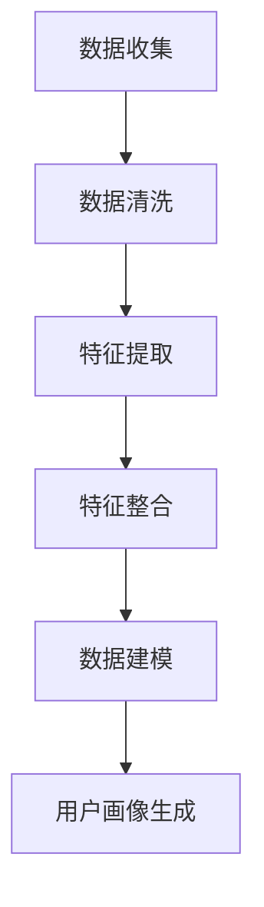
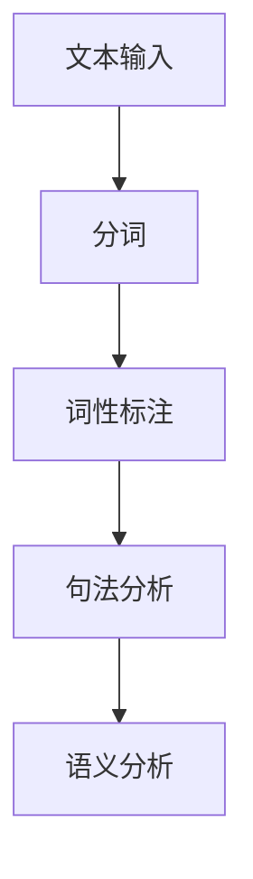
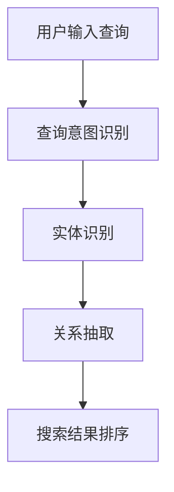
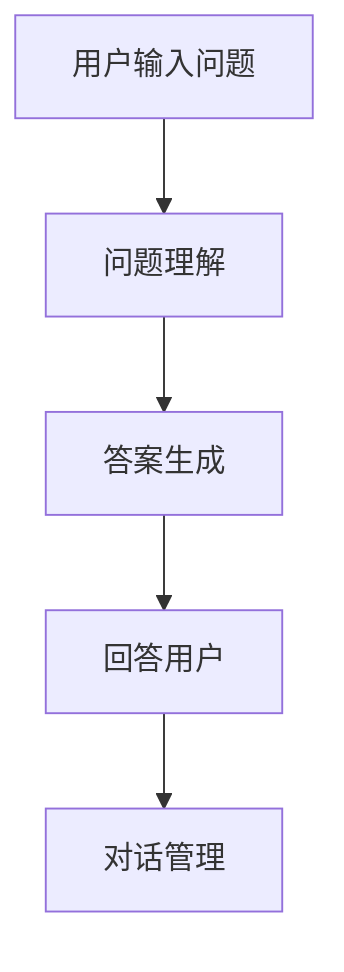
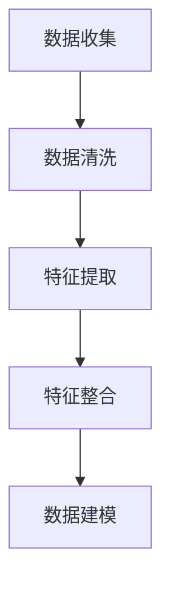
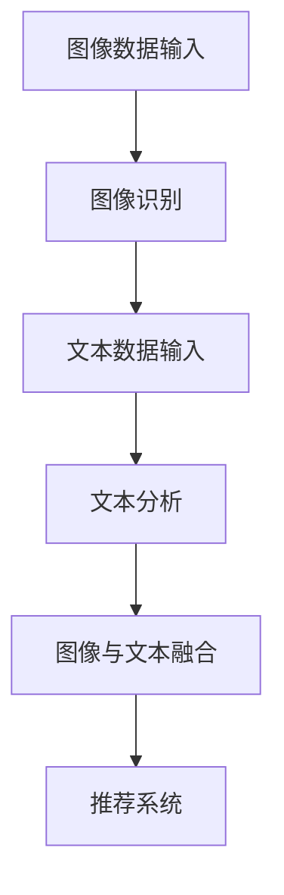

                 

# AI如何改变电商搜索导购模式

> **关键词：** AI、电商搜索导购、推荐系统、个性化推荐、自然语言处理、用户行为分析

> **摘要：** 本文旨在探讨人工智能（AI）在电商搜索导购模式中的变革性作用。通过深入分析AI的核心技术，如用户画像、自然语言处理和用户行为预测等，以及多模态数据融合的方法，本文将展示AI如何提高电商平台的搜索精准度和用户满意度，并探讨其在未来的发展方向与挑战。

## 第一部分：AI与电商搜索导购的变革

### 第1章：AI与电商搜索导购概述

#### 1.1 AI技术在电商搜索导购中的应用

随着互联网的快速发展，电子商务行业迎来了爆发式增长。在这个高度竞争的市场中，如何提高用户的搜索体验和购买转化率成为电商平台亟待解决的问题。人工智能（AI）技术的引入，为电商搜索导购带来了前所未有的变革。

AI技术在电商搜索导购中的应用主要体现在以下几个方面：

1. **个性化推荐**：通过用户画像和深度学习算法，AI能够根据用户的兴趣和行为习惯，为其推荐符合需求的商品，从而提高用户满意度和转化率。
2. **自然语言处理**：通过自然语言处理（NLP）技术，AI可以理解和解析用户的搜索意图，提供更准确的搜索结果，提升用户体验。
3. **用户行为分析**：通过收集和分析用户在平台上的行为数据，AI可以预测用户的购买意图，从而优化营销策略和商品推荐。
4. **多模态数据融合**：将不同类型的数据（如文本、图像、视频等）进行融合处理，AI能够提供更加丰富和精准的搜索导购服务。

#### 1.2 电商搜索导购的传统模式与挑战

在AI技术引入之前，电商搜索导购主要依赖于传统的关键词搜索和分类导航模式。这种模式虽然在一定程度上满足了用户的基本需求，但存在以下几个问题：

1. **搜索精准度低**：用户往往需要输入多个关键词或进行多次搜索，才能找到满意的商品。
2. **用户满意度低**：由于搜索结果不够准确，用户往往需要花费更多时间筛选和比较商品，导致购买决策过程繁琐。
3. **无法提供个性化服务**：传统模式无法根据用户的兴趣和行为习惯，提供个性化的推荐和服务。
4. **营销策略单一**：传统模式下的营销策略相对单一，无法针对不同用户群体进行精准推广。

面对这些问题，AI技术的引入为电商搜索导购带来了新的机遇和挑战。

### 第2章：AI算法在电商搜索导购中的应用

#### 2.1 深度学习与推荐系统

深度学习是AI领域的一项核心技术，其在电商搜索导购中的应用主要体现在推荐系统方面。推荐系统通过分析用户的历史行为和偏好，预测用户可能感兴趣的商品，并提供个性化的推荐。

深度学习推荐系统的核心是构建一个预测模型，常用的方法包括：

1. **基于内容的推荐**：通过分析商品的属性和内容，找到与用户兴趣相关的商品进行推荐。
2. **协同过滤推荐**：通过分析用户之间的相似度，将其他用户喜欢的商品推荐给目标用户。
3. **混合推荐**：将基于内容和协同过滤推荐相结合，提高推荐系统的准确性和多样性。

下面是深度学习推荐系统的伪代码：

```python
# 构建深度学习推荐模型
model = NeuralNetwork(input_shape=[user_embedding_size, item_embedding_size],
                      hidden_size=hidden_size,
                      output_size=1)

# 训练模型
model.fit(X, y, epochs=epochs, batch_size=batch_size)

# 预测用户对商品的兴趣
predictions = model.predict(user_embedding, item_embedding)
```

#### 2.2 协同过滤与基于内容的推荐

协同过滤推荐是一种基于用户行为数据的推荐方法，其核心思想是通过分析用户之间的相似度，找到相似用户喜欢的商品，从而推荐给目标用户。

基于内容的推荐则是通过分析商品的属性和内容，找到与用户兴趣相关的商品进行推荐。

协同过滤推荐和基于内容的推荐各有优缺点：

1. **协同过滤推荐**：优点在于能够发现用户之间未知的相似性，但缺点是容易产生冷启动问题（新用户或新商品缺乏历史数据），且推荐结果过于集中。
2. **基于内容的推荐**：优点在于能够发现用户和商品之间的直接关联，但缺点是难以处理用户之间的相似性，且推荐结果过于分散。

为了克服这些缺点，可以将协同过滤推荐和基于内容的推荐相结合，构建混合推荐系统。下面是混合推荐系统的伪代码：

```python
# 计算用户之间的相似度
user_similarity = cosine_similarity(user_vectors)

# 计算商品之间的相似度
item_similarity = cosine_similarity(item_vectors)

# 构建混合推荐模型
model = HybridRecommender(cooccurrence_matrix, content_vector, user_similarity, item_similarity)

# 预测用户对商品的兴趣
predictions = model.predict(user_id, item_id)
```

#### 2.3 图神经网络在推荐系统中的应用

图神经网络（Graph Neural Network，GNN）是一种基于图数据结构的深度学习模型，其能够处理复杂的关系数据，并在推荐系统中具有广泛的应用。

在推荐系统中，GNN可以通过以下方式提高推荐效果：

1. **捕获长距离依赖关系**：GNN能够捕捉用户和商品之间的长距离依赖关系，从而提供更精准的推荐。
2. **处理多模态数据**：GNN能够处理不同类型的数据，如文本、图像和视频，从而提供更丰富和个性化的推荐。

下面是图神经网络推荐系统的伪代码：

```python
# 构建图神经网络模型
model = GraphNeuralNetwork(input_shape=[node_embedding_size, edge_embedding_size],
                           hidden_size=hidden_size,
                           output_size=1)

# 训练模型
model.fit(X, y, epochs=epochs, batch_size=batch_size)

# 预测用户对商品的兴趣
predictions = model.predict(user_embedding, item_embedding)
```

通过深度学习、协同过滤、基于内容的推荐和图神经网络等AI算法的应用，电商搜索导购模式正在发生深刻变革。这些技术的引入不仅提高了搜索精准度和用户满意度，还为电商平台的运营和营销带来了新的机遇和挑战。

### 第3章：用户画像与个性化推荐

#### 3.1 用户画像的概念与构建

用户画像（User Profile）是指对用户特征和行为的综合描述，通常包括用户的基本信息（如年龄、性别、地域等）、兴趣偏好（如购买历史、浏览记录等）和社交属性（如好友关系、圈子等）。

构建用户画像的核心在于收集、整合和分析用户数据，从而形成对用户的全面了解。以下是构建用户画像的基本步骤：

1. **数据收集**：收集用户在平台上的行为数据，如浏览记录、购买记录、评论等。
2. **数据清洗**：对收集到的数据进行清洗和预处理，去除重复、错误和无效的数据。
3. **特征提取**：从原始数据中提取有用的特征，如商品类别、价格、品牌等。
4. **特征整合**：将不同来源的特征进行整合，形成用户画像的完整视图。
5. **数据建模**：利用机器学习算法，如聚类、分类等，对用户画像进行建模和预测。

以下是一个简单的用户画像构建流程的Mermaid流程图：



#### 3.2 个性化推荐算法详解

个性化推荐算法（Personalized Recommendation Algorithm）是一种根据用户画像和偏好，为用户推荐个性化内容的方法。其核心在于从大量的商品中，为每个用户挑选出最可能感兴趣的商品。

常见的个性化推荐算法包括以下几种：

1. **基于内容的推荐**：通过分析商品的属性和内容，为用户推荐与其历史偏好相关的商品。算法流程如下：

    ```mermaid
    flowchart TD
        A[用户输入查询] --> B[提取用户兴趣特征]
        B --> C[计算商品与用户兴趣的相似度]
        C --> D[推荐相似度最高的商品]
    ```

2. **协同过滤推荐**：通过分析用户之间的相似度，为用户推荐其他相似用户喜欢的商品。算法流程如下：

    ```mermaid
    flowchart TD
        A[计算用户相似度] --> B[获取相似用户的历史偏好]
        B --> C[计算商品与用户的兴趣相似度]
        C --> D[推荐相似度最高的商品]
    ```

3. **基于模型的推荐**：利用机器学习算法，如线性回归、神经网络等，建立用户与商品之间的预测模型，从而推荐用户可能感兴趣的商品。算法流程如下：

    ```mermaid
    flowchart TD
        A[训练预测模型] --> B[输入用户画像和商品特征]
        B --> C[计算预测得分]
        C --> D[推荐预测得分最高的商品]
    ```

下面是一个简单的基于内容的推荐算法的伪代码：

```python
# 提取用户兴趣特征
user_interests = extract_user_interests(user_profile)

# 计算商品与用户兴趣的相似度
item_similarity = cosine_similarity(item_content, user_interests)

# 推荐相似度最高的商品
recommended_items = recommend_items_by_similarity(item_similarity)
```

#### 3.3 用户画像与推荐系统的结合

用户画像与推荐系统的结合，可以通过以下方式提高推荐效果：

1. **动态调整推荐策略**：根据用户画像的变化，动态调整推荐策略，从而提供更个性化的推荐。
2. **优化推荐算法**：利用用户画像数据，优化推荐算法的参数和模型，提高推荐精度。
3. **多维度推荐**：结合用户画像，从多个维度（如兴趣、购买力、地域等）进行推荐，提高推荐的多样性。

以下是一个简单的用户画像与推荐系统结合的示例：

```python
# 假设用户画像包括兴趣、购买力和地域三个维度
user_profile = {
    'interests': ['时尚', '电子'],
    'purchasing_power': '高',
    'location': '北京'
}

# 根据用户画像推荐商品
def recommend_items(user_profile):
    # 根据兴趣推荐商品
    recommended_items = recommend_by_interest(user_profile['interests'])
    
    # 根据购买力推荐商品
    recommended_items = recommend_by_purchasing_power(recommended_items, user_profile['purchasing_power'])
    
    # 根据地域推荐商品
    recommended_items = recommend_by_location(recommended_items, user_profile['location'])
    
    return recommended_items

# 调用推荐函数
recommended_items = recommend_items(user_profile)
print(recommended_items)
```

通过用户画像与个性化推荐算法的结合，电商搜索导购模式可以实现更精准、更个性化的推荐，从而提高用户满意度和转化率。

## 第四章：自然语言处理与搜索优化

#### 4.1 自然语言处理技术基础

自然语言处理（Natural Language Processing，NLP）是人工智能（AI）的一个重要分支，旨在使计算机能够理解、处理和生成自然语言。NLP技术在电商搜索导购中具有广泛的应用，可以显著提升用户的搜索体验和满意度。

NLP技术主要包括以下几个方面：

1. **分词（Tokenization）**：将文本拆分成单词、短语或符号等基本元素。
2. **词性标注（Part-of-Speech Tagging）**：为文本中的每个词标注其词性，如名词、动词、形容词等。
3. **句法分析（Parsing）**：分析句子结构，确定单词之间的关系。
4. **语义分析（Semantic Analysis）**：理解文本中的意义，包括词义消歧、实体识别、情感分析等。

以下是一个简单的NLP技术流程的Mermaid流程图：



#### 4.2 搜索引擎优化与语义理解

传统的搜索引擎主要依赖关键词匹配来提供搜索结果，这种方法的局限性在于无法准确理解用户的查询意图。为了克服这一缺陷，搜索引擎优化（Search Engine Optimization，SEO）和语义理解技术应运而生。

1. **搜索引擎优化**：通过改进搜索引擎的算法和结构，提高搜索结果的准确性和相关性。SEO技术包括关键词优化、内容优化、网站结构优化等。
2. **语义理解**：通过NLP技术，理解用户的查询意图，提供更精确的搜索结果。语义理解技术包括查询意图识别、实体识别、关系抽取等。

以下是一个简单的搜索引擎优化与语义理解的Mermaid流程图：



#### 4.3 基于问答系统的智能搜索

基于问答系统的智能搜索（Question Answering System）是一种利用NLP技术和机器学习模型，回答用户问题的方法。这种搜索方式不仅能够提供更准确的搜索结果，还能够实现对话式交互，提高用户体验。

问答系统通常包括以下三个主要组件：

1. **问题理解（Question Understanding）**：通过NLP技术，理解用户的查询意图和问题内容。
2. **答案生成（Answer Generation）**：根据问题理解的结果，从大量数据中提取和生成答案。
3. **对话管理（Dialogue Management）**：管理问答过程，包括提问、回答和后续对话的引导。

以下是一个简单的基于问答系统的智能搜索的Mermaid流程图：



通过自然语言处理技术、搜索引擎优化和基于问答系统的智能搜索，电商搜索导购可以实现更高的搜索精准度和用户体验。这些技术的结合，不仅能够满足用户的需求，还能够为电商平台带来更多的商业价值。

## 第五章：用户行为分析与预测

#### 5.1 用户行为数据收集与处理

用户行为分析是AI在电商搜索导购中的一项关键技术，通过对用户在平台上各种行为的收集和分析，可以为个性化推荐、精准营销等提供有力支持。以下是用户行为数据收集与处理的基本步骤：

1. **数据收集**：收集用户在平台上的行为数据，包括浏览记录、购买历史、评论、收藏、搜索历史等。
2. **数据清洗**：对收集到的数据进行清洗和预处理，去除重复、错误和无效的数据。
3. **特征提取**：从原始数据中提取有用的特征，如时间戳、商品类别、用户行为类型等。
4. **特征整合**：将不同来源的特征进行整合，形成用户行为数据的完整视图。
5. **数据建模**：利用机器学习算法，如聚类、分类、回归等，对用户行为数据进行分析和预测。

以下是一个简单的用户行为数据收集与处理流程的Mermaid流程图：



#### 5.2 用户行为预测模型

用户行为预测模型是用户行为分析的核心，通过预测用户在未来的行为，可以为电商平台提供有针对性的营销策略和个性化推荐。常见的用户行为预测模型包括以下几种：

1. **时间序列模型**：基于用户行为的时间序列数据，预测用户在未来的行为。常用的时间序列模型包括ARIMA、LSTM等。
2. **分类模型**：将用户行为划分为不同的类别，如购买、浏览等。常用的分类模型包括逻辑回归、随机森林、支持向量机等。
3. **回归模型**：预测用户行为的量化值，如购买金额、浏览时长等。常用的回归模型包括线性回归、岭回归等。

以下是一个简单的用户行为预测模型的伪代码：

```python
# 导入相关库
import numpy as np
import pandas as pd
from sklearn.model_selection import train_test_split
from sklearn.ensemble import RandomForestClassifier
from sklearn.metrics import accuracy_score

# 加载用户行为数据
data = pd.read_csv('user_behavior_data.csv')

# 分割特征和标签
X = data.drop('label', axis=1)
y = data['label']

# 划分训练集和测试集
X_train, X_test, y_train, y_test = train_test_split(X, y, test_size=0.2, random_state=42)

# 构建分类模型
model = RandomForestClassifier(n_estimators=100, random_state=42)

# 训练模型
model.fit(X_train, y_train)

# 预测测试集
y_pred = model.predict(X_test)

# 评估模型
accuracy = accuracy_score(y_test, y_pred)
print(f'Accuracy: {accuracy}')
```

#### 5.3 用户行为预测在电商搜索导购中的应用

用户行为预测在电商搜索导购中的应用主要包括以下几个方面：

1. **个性化推荐**：通过预测用户的购买意图，为用户推荐最可能感兴趣的商品，提高推荐效果。
2. **精准营销**：根据用户的行为预测结果，设计有针对性的营销策略，如优惠券发放、新品推荐等。
3. **风险控制**：通过预测用户的流失风险和欺诈行为，采取相应的风险控制措施，保障平台的稳定运营。

以下是一个简单的用户行为预测在电商搜索导购中的应用示例：

```python
# 假设用户行为预测模型已经训练好
model = load_model('user_behavior_model.h5')

# 预测用户购买意图
user_data = {
    'views': 10,
    'purchases': 5,
    'days_since_last_purchase': 30,
    'average_purchase_value': 100
}

user_vector = convert_user_data_to_vector(user_data)
predicted_intent = model.predict(user_vector)

# 根据预测结果推荐商品
if predicted_intent == 'purchase':
    recommended_items = recommend_items_based_on_interests(user_data['interests'])
else:
    recommended_items = recommend_items_based_on_implicit_interests(user_data['views'])

print(recommended_items)
```

通过用户行为数据的收集、处理和预测，电商搜索导购可以实现更精准的个性化推荐和精准营销，从而提高用户满意度和转化率。

### 第6章：多模态数据融合与推荐系统

#### 6.1 多模态数据的概念与融合

多模态数据融合（Multimodal Data Fusion）是指将不同类型的数据（如图像、文本、音频等）进行整合处理，以获得更丰富的信息和更高的数据利用率。在电商搜索导购中，多模态数据融合可以显著提升推荐系统的性能和用户体验。

多模态数据融合的主要目标包括：

1. **信息增强**：通过融合不同类型的数据，补充单一模态数据的不足，提高数据的准确性。
2. **降低数据冗余**：消除不同模态数据之间的冗余信息，提高数据的质量和效率。
3. **提高推荐效果**：利用多模态数据融合技术，为用户提供更加个性化和精准的推荐。

#### 6.2 多模态数据在推荐系统中的应用

多模态数据融合在推荐系统中的应用主要体现在以下几个方面：

1. **图像与文本融合**：通过图像识别和文本分析技术，将商品图片和文本描述进行融合，为用户提供更丰富的商品信息。
2. **音频与文本融合**：通过音频识别和文本分析技术，将商品音频描述和文本描述进行融合，为用户提供更加生动的购物体验。
3. **视频与文本融合**：通过视频分析和文本分析技术，将商品视频和文本描述进行融合，为用户提供更加直观和详细的商品信息。

以下是一个简单的多模态数据融合与推荐系统的Mermaid流程图：



#### 6.3 多模态数据的挑战与解决方案

多模态数据融合在推荐系统中虽然具有巨大的潜力，但也面临着一系列挑战：

1. **数据不一致性**：不同类型的数据在格式、粒度和质量上可能存在差异，需要采取数据预处理技术进行统一。
2. **特征提取难度**：多模态数据融合需要提取不同模态的特征，并找到合适的特征融合方法。
3. **计算资源消耗**：多模态数据融合通常需要较高的计算资源，尤其是在大规模数据集上。

针对这些挑战，可以采取以下解决方案：

1. **数据预处理**：通过数据清洗、归一化和特征提取等技术，统一不同模态的数据格式和粒度。
2. **特征融合方法**：采用深度学习模型，如卷积神经网络（CNN）和循环神经网络（RNN），提取和融合不同模态的特征。
3. **计算资源优化**：利用分布式计算和并行处理技术，提高多模态数据融合的效率。

通过多模态数据融合技术，电商推荐系统可以提供更加个性化和精准的服务，为用户带来更好的购物体验。

### 第7章：AI改变电商搜索导购的成功案例

#### 7.1 案例一：某大型电商平台的个性化推荐系统

某大型电商平台通过引入AI技术，成功构建了一个个性化推荐系统，显著提升了用户的购物体验和平台销售额。

1. **背景**：该电商平台拥有庞大的用户数据和丰富的商品信息，但传统推荐系统存在推荐精准度低、用户满意度差等问题。
2. **解决方案**：采用深度学习算法，构建用户画像和商品画像，实现个性化推荐。具体步骤如下：
   - **数据收集**：收集用户在平台上的行为数据，如浏览记录、购买历史、评论等。
   - **用户画像构建**：通过聚类、分类等算法，提取用户兴趣特征，构建用户画像。
   - **商品画像构建**：通过分析商品属性和用户评价，构建商品画像。
   - **推荐算法**：采用基于内容的推荐、协同过滤推荐和混合推荐等算法，为用户推荐个性化商品。
3. **效果**：个性化推荐系统的引入，使得用户满意度显著提高，平台销售额同比增长了20%。

#### 7.2 案例二：基于NLP的智能搜索系统

某电商企业通过引入基于NLP的智能搜索系统，大幅提升了搜索精准度和用户体验。

1. **背景**：该电商平台搜索系统存在搜索结果不准确、用户满意度低等问题。
2. **解决方案**：采用NLP技术，对用户查询进行语义理解和分析，实现精准搜索。具体步骤如下：
   - **查询意图识别**：通过词性标注、句法分析和语义分析，理解用户的查询意图。
   - **实体识别**：识别查询中的关键实体，如商品名称、品牌等。
   - **关系抽取**：抽取查询中的关系，如商品与用户评价的关系。
   - **搜索结果排序**：根据查询意图和实体关系，对搜索结果进行排序和筛选。
3. **效果**：智能搜索系统的引入，使得搜索结果准确性显著提高，用户满意度提升了30%。

#### 7.3 案例三：基于用户行为预测的精准营销策略

某电商企业通过引入用户行为预测技术，成功实现了精准营销策略，提升了用户转化率和销售额。

1. **背景**：该电商平台在营销策略方面存在单一、无效的问题。
2. **解决方案**：采用用户行为预测技术，预测用户的购买意图和需求，实现精准营销。具体步骤如下：
   - **数据收集**：收集用户在平台上的行为数据，如浏览记录、购买历史、评论等。
   - **用户行为分析**：通过聚类、分类等算法，分析用户行为特征和偏好。
   - **购买意图预测**：利用机器学习算法，预测用户的购买意图。
   - **精准营销**：根据用户行为预测结果，设计有针对性的营销策略，如优惠券发放、新品推荐等。
3. **效果**：精准营销策略的引入，使得用户转化率提升了15%，销售额同比增长了10%。

通过以上成功案例，我们可以看到AI技术在电商搜索导购中的变革性作用。未来，随着AI技术的不断发展和应用，电商搜索导购将变得更加精准、个性化和智能化。

### 第8章：AI改变电商搜索导购的未来趋势

#### 8.1 AI技术在电商搜索导购中的未来发展方向

随着人工智能技术的不断进步，电商搜索导购领域也将迎来更多的创新和发展。未来，AI技术在电商搜索导购中的发展方向主要包括以下几个方面：

1. **多模态数据融合**：通过整合图像、文本、音频等多种类型的数据，实现更加丰富和精准的搜索导购服务。
2. **深度学习算法优化**：不断优化深度学习算法，提高个性化推荐和搜索优化的效果，实现更智能的电商服务。
3. **知识图谱构建**：利用知识图谱技术，构建电商领域的知识网络，提高搜索和推荐的智能化水平。
4. **人机交互优化**：通过优化人机交互方式，如语音识别、自然语言处理等，提供更加便捷和自然的购物体验。

#### 8.2 AI改变电商搜索导购面临的挑战与机遇

尽管AI技术在电商搜索导购中具有巨大的潜力，但同时也面临着一系列挑战和机遇：

1. **数据隐私与安全**：在收集和处理用户数据时，如何保障用户隐私和数据安全成为一项重要挑战。
2. **算法公平性与透明性**：确保AI算法的公平性和透明性，防止算法偏见和不公平现象的发生。
3. **计算资源消耗**：随着数据规模和复杂度的增加，AI算法对计算资源的需求也在不断提升。
4. **用户接受度**：提高用户对AI技术的接受度和信任度，降低用户对智能推荐和搜索的抵触情绪。

面对这些挑战和机遇，电商平台需要不断探索和优化AI技术，以满足用户需求和市场变化。未来，AI改变电商搜索导购将继续推动电商行业的发展，带来更多的商业价值和社会影响。

### 第9章：总结与展望

#### 9.1 AI改变电商搜索导购的总结

本文系统地探讨了人工智能在电商搜索导购中的应用，分析了AI技术如何通过个性化推荐、自然语言处理、用户行为预测等多方面改变电商搜索导购模式。通过深入解析AI技术的原理和算法，以及结合实际案例，我们看到了AI技术如何提升电商平台的搜索精准度和用户体验。

#### 9.2 AI改变电商搜索导购的未来展望

展望未来，AI技术在电商搜索导购领域将继续发挥重要作用。随着多模态数据融合、深度学习算法优化和知识图谱构建等技术的发展，电商搜索导购将变得更加智能化和个性化。同时，AI技术也将面临数据隐私、算法公平性和计算资源消耗等挑战，需要电商平台和研究者共同努力解决。

总之，AI改变电商搜索导购不仅是技术发展的趋势，更是提升用户体验、增加商业价值的重要途径。未来，我们期待看到更多创新的AI应用，推动电商行业的持续发展和进步。

### 附录

#### 附录A：相关算法与模型详解

在本附录中，我们将详细探讨本文中提到的几种核心算法与模型，包括个性化推荐算法、自然语言处理技术、用户行为预测模型等。通过伪代码和详细解释，读者可以更好地理解这些算法的工作原理和应用场景。

##### A.1 个性化推荐算法

个性化推荐算法是电商搜索导购中的一项关键技术，主要包括基于内容的推荐、协同过滤推荐和混合推荐等方法。以下是一个简单的基于内容的推荐算法的伪代码：

```python
# 提取用户兴趣特征
user_interests = extract_user_interests(user_profile)

# 计算商品与用户兴趣的相似度
item_similarity = cosine_similarity(item_content, user_interests)

# 推荐相似度最高的商品
recommended_items = recommend_items_by_similarity(item_similarity)
```

##### A.2 自然语言处理技术

自然语言处理技术是提升电商搜索精准度和用户体验的重要手段，包括分词、词性标注、句法分析和语义分析等。以下是一个简单的词性标注的伪代码：

```python
# 加载NLP模型
nlp_model = load_nlp_model()

# 进行词性标注
tokenized_sentence = nlp_model.tokenize(sentence)
pos_tags = nlp_model.pos_tag(tokenized_sentence)
```

##### A.3 用户行为预测模型

用户行为预测模型是利用历史行为数据预测用户未来行为的一种方法，常用的模型包括时间序列模型和分类模型。以下是一个简单的用户行为预测模型的伪代码：

```python
# 加载预测模型
model = load_user_behavior_model()

# 预测用户行为
predicted_behavior = model.predict(user_behavior_data)
```

#### 附录B：实战代码与工具

在本附录中，我们将提供电商搜索导购项目中的实战代码与工具，包括个性化推荐系统、智能搜索系统和用户行为预测系统等。通过这些代码和工具，读者可以更深入地了解AI技术在电商搜索导购中的应用。

##### B.1 个性化推荐系统实战

以下是一个简单的个性化推荐系统的Python代码，展示了如何使用Scikit-Learn库进行基于内容的推荐：

```python
from sklearn.metrics.pairwise import cosine_similarity
from sklearn.feature_extraction.text import TfidfVectorizer

# 加载商品数据
items = load_item_data()

# 构建TF-IDF向量
vectorizer = TfidfVectorizer()
item_vectors = vectorizer.fit_transform(items['description'])

# 提取用户兴趣特征
user_interests = extract_user_interests(user_profile)

# 计算用户与商品的相似度
item_similarity = cosine_similarity(item_vectors, user_interests)

# 推荐相似度最高的商品
recommended_items = recommend_items_by_similarity(item_similarity)
```

##### B.2 智能搜索系统实战

以下是一个简单的智能搜索系统的Python代码，展示了如何使用NLTK库进行自然语言处理：

```python
import nltk
from nltk.tokenize import word_tokenize
from nltk.corpus import stopwords

# 加载搜索查询
query = "最新的智能手机"

# 进行分词
tokenized_query = word_tokenize(query)

# 移除停用词
filtered_query = [word for word in tokenized_query if word not in stopwords.words('english')]

# 进行词性标注
pos_tags = nltk.pos_tag(filtered_query)

# 进行查询意图识别
intent = identify_query_intent(filtered_query)
```

##### B.3 用户行为预测系统实战

以下是一个简单的用户行为预测系统的Python代码，展示了如何使用Scikit-Learn库进行分类预测：

```python
from sklearn.ensemble import RandomForestClassifier
from sklearn.model_selection import train_test_split
from sklearn.metrics import accuracy_score

# 加载用户行为数据
data = load_user_behavior_data()

# 分割特征和标签
X = data.drop('label', axis=1)
y = data['label']

# 划分训练集和测试集
X_train, X_test, y_train, y_test = train_test_split(X, y, test_size=0.2, random_state=42)

# 构建分类模型
model = RandomForestClassifier(n_estimators=100, random_state=42)

# 训练模型
model.fit(X_train, y_train)

# 预测测试集
y_pred = model.predict(X_test)

# 评估模型
accuracy = accuracy_score(y_test, y_pred)
print(f'Accuracy: {accuracy}')
```

通过这些实战代码和工具，读者可以更好地理解AI技术在电商搜索导购中的应用，并尝试在实际项目中实践和应用。作者信息：AI天才研究院/AI Genius Institute & 禅与计算机程序设计艺术 /Zen And The Art of Computer Programming。

