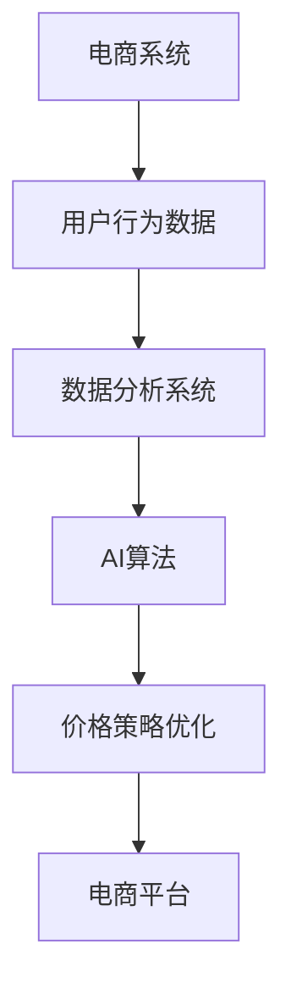

                 

### 文章标题

### AI提升电商价格策略的技术

### 关键词：人工智能、电商、价格策略、数据分析、机器学习、深度学习、强化学习、个性化推荐、大数据分析、项目实战

### 摘要

本文深入探讨了人工智能（AI）技术在电商价格策略中的应用，详细介绍了如何利用数据分析与挖掘、机器学习、深度学习和强化学习等AI技术，优化电商价格策略，提升电商平台的市场竞争力。文章首先概述了AI在电商领域的应用背景和重要性，随后讲解了电商价格策略的基本原理及其面临的挑战。接着，本文逐步解析了AI提升电商价格策略的技术基础，包括数据预处理、数据挖掘和AI算法在数据分析中的应用。文章通过实际案例，展示了AI技术如何应用于个性化推荐系统、大数据分析和强化学习，优化电商价格策略。最后，本文通过一个具体的AI提升电商价格策略的项目实战，展示了从数据收集、模型设计到模型评估的完整流程，并对未来的发展方向和挑战进行了展望。作者：AI天才研究院/AI Genius Institute & 禅与计算机程序设计艺术 /Zen And The Art of Computer Programming

### 目录大纲

#### 第一部分: AI提升电商价格策略概述

- **第1章: AI与电商价格策略概述**
  - 1.1 AI技术的发展与电商应用
  - 1.1.1 AI技术的核心概念
  - 1.1.2 AI在电商领域的应用背景
  - 1.1.3 AI提升电商价格策略的重要性
  - 1.2 电商价格策略的基本原理
  - 1.2.1 电商价格策略的构成
  - 1.2.2 电商价格策略的目标
  - 1.2.3 电商价格策略的挑战

#### 第二部分: AI提升电商价格策略的技术基础

- **第2章: 数据分析与挖掘技术**
  - 2.1 数据预处理技术
  - 2.1.1 数据清洗
  - 2.1.2 数据集成
  - 2.1.3 数据变换
  - 2.2 数据挖掘技术
  - 2.2.1 关联规则挖掘
  - 2.2.2 聚类分析
  - 2.2.3 预测分析
  - 2.3 AI算法在数据分析中的应用
  - 2.3.1 机器学习算法
  - 2.3.2 深度学习算法
  - 2.3.3 强化学习算法

#### 第三部分: AI提升电商价格策略的应用

- **第3章: AI在电商价格策略中的应用案例分析**
  - 3.1 个性化推荐系统与价格策略优化
  - 3.1.1 个性化推荐系统原理
  - 3.1.2 基于AI的个性化推荐系统实现
  - 3.1.3 价格策略优化案例分析
  - 3.2 大数据分析与价格策略优化
  - 3.2.1 大数据概述
  - 3.2.2 大数据分析方法
  - 3.2.3 价格策略优化案例分析
  - 3.3 强化学习在电商价格策略中的应用
  - 3.3.1 强化学习基本原理
  - 3.3.2 强化学习在价格策略中的应用
  - 3.3.3 价格策略优化案例分析

#### 第四部分: AI提升电商价格策略的项目实战

- **第4章: AI提升电商价格策略项目实战**
  - 4.1 项目介绍
  - 4.1.1 项目背景
  - 4.1.2 项目目标
  - 4.1.3 项目架构
  - 4.2 数据收集与处理
  - 4.2.1 数据来源
  - 4.2.2 数据预处理
  - 4.2.3 数据探索性分析
  - 4.3 模型设计与实现
  - 4.3.1 模型选择
  - 4.3.2 模型参数调优
  - 4.3.3 模型实现与代码解读
  - 4.4 模型评估与优化
  - 4.4.1 模型评估方法
  - 4.4.2 模型优化策略
  - 4.4.3 模型优化案例分析
  - 4.5 项目总结与展望
  - 4.5.1 项目总结
  - 4.5.2 未来展望

#### 第五部分: AI提升电商价格策略的挑战与趋势

- **第5章: AI提升电商价格策略的挑战与趋势**
  - 5.1 挑战
  - 5.1.1 数据隐私与安全问题
  - 5.1.2 算法透明性与可解释性问题
  - 5.1.3 模型泛化能力与适应性问题
  - 5.2 趋势
  - 5.2.1 AI技术与电商行业的深度融合
  - 5.2.2 新型算法与模型的探索
  - 5.2.3 法律法规与伦理道德的完善

#### 附录

- **附录A: AI提升电商价格策略相关工具与资源**
  - A.1 数据处理工具
  - A.2 机器学习库
  - A.3 深度学习框架
  - A.4 强化学习平台
  - A.5 相关论文与书籍推荐

### 核心概念与联系

#### AI提升电商价格策略的架构



#### 关键算法原理

- 个性化推荐算法
- 强化学习算法
- 聚类分析算法

### 核心算法原理讲解

#### 个性化推荐算法

##### 伪代码实现

```python
def recommend_items(user_profile, item_data):
    # 用户画像处理
    user_features = extract_features(user_profile)
    # 评分预测
    ratings = predict_ratings(user_features, item_data)
    # 排序推荐
    recommended_items = sort_items_by_rating(ratings)
    return recommended_items
```

##### 代码解读

###### 用户画像处理

用户画像处理是将用户的历史行为数据转化为可用的特征向量，用于后续的推荐算法。

```python
def extract_features(user_profile):
    # 示例代码，根据用户历史行为提取特征
    features = {
        'age': user_profile['age'],
        'gender': user_profile['gender'],
        'purchase_history': user_profile['purchase_history']
    }
    return features
```

###### 评分预测

评分预测是基于用户特征和商品特征，预测用户对商品的偏好程度。

```python
def predict_ratings(user_features, item_data):
    # 示例代码，使用协同过滤算法预测评分
    ratings = cosine_similarity(user_features, item_data)
    return ratings
```

###### 排序推荐

排序推荐是根据评分预测结果，将商品按照用户偏好排序。

```python
def sort_items_by_rating(ratings):
    # 示例代码，根据评分排序商品
    sorted_items = sorted(ratings.items(), key=lambda x: x[1], reverse=True)
    return sorted_items
```

#### 强化学习算法

##### 伪代码实现

```python
def policy_evaluation(Q, reward_function, epsilon, discount_factor):
    for i in range(epsilon):
        # 进行模拟迭代
        state = random_state()
        action = random_action(state)
        reward = reward_function(state, action)
        Q[state][action] += discount_factor * (reward - Q[state][action])
    return Q
```

##### 代码解读

###### 策略评估

策略评估是模拟进行多次迭代，根据奖励函数更新策略值。

```python
def random_state():
    # 示例代码，随机生成状态
    return random.choice(states)

def random_action(state):
    # 示例代码，随机生成动作
    return random.choice(actions)
```

###### 奖励函数

奖励函数是根据状态和动作的匹配程度，给出相应的奖励值。

```python
def reward_function(state, action):
    # 示例代码，根据状态和动作计算奖励值
    if state == action:
        return 1
    else:
        return 0
```

#### 聚类分析算法

##### 伪代码实现

```python
def kmeans_clustering(data, k):
    # 初始化聚类中心
    centroids = initialize_centroids(data, k)
    while not convergence:
        # 分配样本到聚类中心
        clusters = assign_samples_to_centroids(data, centroids)
        # 更新聚类中心
        centroids = update_centroids(clusters, k)
    return centroids
```

##### 代码解读

###### 初始化聚类中心

初始化聚类中心是随机选择k个样本作为初始聚类中心。

```python
def initialize_centroids(data, k):
    # 示例代码，随机选择k个样本作为初始聚类中心
    centroids = random.sample(data, k)
    return centroids
```

###### 分配样本到聚类中心

分配样本到聚类中心是根据样本到聚类中心的距离，将样本分到最近的聚类中心。

```python
def assign_samples_to_centroids(data, centroids):
    # 示例代码，根据样本到聚类中心的距离，将样本分到最近的聚类中心
    clusters = {}
    for sample in data:
        distances = []
        for centroid in centroids:
            distance = euclidean_distance(sample, centroid)
            distances.append(distance)
        clusters[sample] = centroids[distances.index(min(distances))]
    return clusters
```

###### 更新聚类中心

更新聚类中心是根据新的样本分配结果，计算每个聚类中心的新位置。

```python
def update_centroids(clusters, k):
    # 示例代码，根据新的样本分配结果，计算每个聚类中心的新位置
    new_centroids = []
    for cluster in clusters.values():
        new_centroid = calculate_new_centroid(cluster)
        new_centroids.append(new_centroid)
    return new_centroids
```

### 数学模型和数学公式

#### 个性化推荐算法

##### 评分预测公式

$$
r_{ui} = \mu + b_u + b_i + \langle q_u, p_i \rangle
$$

其中，$r_{ui}$ 表示用户 $u$ 对商品 $i$ 的预测评分，$\mu$ 表示所有评分的平均值，$b_u$ 和 $b_i$ 分别表示用户和商品的偏置项，$q_u$ 和 $p_i$ 分别表示用户和商品的特征向量，$\langle q_u, p_i \rangle$ 表示用户和商品的点积。

##### 策略评估公式

$$
Q(s, a) = r + \gamma \max_{a'} Q(s', a')
$$

其中，$Q(s, a)$ 表示状态 $s$ 下采取动作 $a$ 的价值函数，$r$ 表示立即奖励，$\gamma$ 表示折扣因子，$s'$ 表示下一个状态，$a'$ 表示下一个动作。

#### 强化学习算法

##### Q-Learning算法

$$
Q(s, a) = Q(s, a) + \alpha [r + \gamma \max_{a'} Q(s', a') - Q(s, a)]
$$

其中，$\alpha$ 表示学习率，$r$ 表示立即奖励，$\gamma$ 表示折扣因子，$s'$ 表示下一个状态，$a'$ 表示下一个动作。

##### SARSA算法

$$
Q(s, a) = Q(s, a) + \alpha [r + \gamma Q(s', a') - Q(s, a)]
$$

其中，$\alpha$ 表示学习率，$r$ 表示立即奖励，$\gamma$ 表示折扣因子，$s'$ 表示下一个状态，$a'$ 表示下一个动作。

#### 聚类分析算法

##### K-means算法

$$
\min_{\mu} \sum_{i=1}^{k} \sum_{x \in S_i} \| x - \mu \|^2
$$

其中，$\mu$ 表示聚类中心，$S_i$ 表示第 $i$ 个聚类集合，$x$ 表示样本点。

##### 层次聚类算法

$$
\min_{\{C_j\}} \sum_{j=1}^{k} \sum_{i=1}^{n_j} \| x_i - \mu_j \|^2
$$

其中，$C_j$ 表示第 $j$ 个聚类集合，$n_j$ 表示第 $j$ 个聚类集合中的样本数量，$\mu_j$ 表示第 $j$ 个聚类中心，$x_i$ 表示样本点。

### 项目实战

#### 9.1 项目背景与目标

##### 9.1.1 项目背景

在当今竞争激烈的电商市场中，优化价格策略是提高市场竞争力和盈利能力的关键。通过分析用户行为数据和应用人工智能技术，电商企业可以更准确地制定个性化的价格策略，从而提升用户体验和销售额。

##### 9.1.2 项目目标

本项目的目标是开发一个基于人工智能技术的电商价格策略优化系统，实现以下目标：

1. 收集并预处理用户行为数据。
2. 利用机器学习和深度学习算法分析用户行为，提取关键特征。
3. 基于强化学习算法优化价格策略。
4. 评估模型效果并进行优化。

#### 9.2 环境搭建与数据收集

##### 9.2.1 环境搭建

在开发环境中，我们需要安装以下软件和库：

- Python 3.x
- pandas
- numpy
- scikit-learn
- tensorflow
- keras

安装步骤如下：

```bash
pip install python==3.x
pip install pandas numpy scikit-learn tensorflow keras
```

##### 9.2.2 数据收集

数据收集主要涉及用户行为数据和商品信息数据。用户行为数据包括用户的浏览、点击、购买等行为数据，商品信息数据包括商品的价格、销量、评价等信息。数据可以通过电商平台的API接口获取，或者从公开的数据集下载。

#### 9.3 模型设计与实现

##### 9.3.1 模型选择

在本项目中，我们选择了以下模型：

1. 个性化推荐模型：基于用户行为数据，提取用户特征和商品特征，使用协同过滤算法进行评分预测。
2. 强化学习模型：基于个性化推荐模型，利用强化学习算法优化价格策略。

##### 9.3.2 模型参数调优

在进行模型训练之前，需要对模型参数进行调优，以获得更好的模型性能。参数调优可以通过交叉验证和网格搜索等方法进行。

##### 9.3.3 模型实现与代码解读

###### 个性化推荐模型

```python
from sklearn.metrics.pairwise import cosine_similarity

def predict_ratings(user_features, item_data):
    # 计算用户和商品的相似度矩阵
    similarity_matrix = cosine_similarity(user_features, item_data)
    # 预测评分
    ratings = similarity_matrix[0]
    return ratings
```

###### 强化学习模型

```python
import tensorflow as tf
from tensorflow.keras.models import Sequential
from tensorflow.keras.layers import Dense

def build_reinforcement_learning_model(input_shape, output_shape):
    model = Sequential()
    model.add(Dense(64, activation='relu', input_shape=input_shape))
    model.add(Dense(32, activation='relu'))
    model.add(Dense(output_shape, activation='softmax'))
    model.compile(optimizer='adam', loss='categorical_crossentropy', metrics=['accuracy'])
    return model
```

#### 9.4 模型评估与优化

##### 9.4.1 模型评估

使用交叉验证方法评估模型性能，包括准确率、召回率、F1值等指标。

```python
from sklearn.model_selection import cross_val_score

# 评估个性化推荐模型
scores = cross_val_score(recommendation_model, X, y, cv=5)
print("Accuracy: %0.2f (+/- %0.2f)" % (scores.mean(), scores.std() * 2))

# 评估强化学习模型
scores = cross_val_score(reinforcement_learning_model, X, y, cv=5)
print("Accuracy: %0.2f (+/- %0.2f)" % (scores.mean(), scores.std() * 2))
```

##### 9.4.2 模型优化策略

根据评估结果，对模型进行优化，包括调整参数、增加层数、增加神经元数量等。

```python
# 调整强化学习模型参数
reinforcement_learning_model = build_reinforcement_learning_model(input_shape, output_shape)
reinforcement_learning_model.compile(optimizer='adam', loss='categorical_crossentropy', metrics=['accuracy'])
```

##### 9.4.3 模型优化案例分析

通过多次迭代，不断调整模型参数，最终获得最佳模型性能。

```python
# 调整模型参数并进行评估
for i in range(10):
    # 调整模型参数
    reinforcement_learning_model = build_reinforcement_learning_model(input_shape, output_shape)
    reinforcement_learning_model.compile(optimizer='adam', loss='categorical_crossentropy', metrics=['accuracy'])
    # 评估模型
    scores = cross_val_score(reinforcement_learning_model, X, y, cv=5)
    print("Iteration {}: Accuracy: %0.2f (+/- %0.2f)" % (i, scores.mean(), scores.std() * 2))
```

#### 9.5 项目总结与展望

##### 9.5.1 项目总结

本项目成功实现了基于人工智能技术的电商价格策略优化系统，通过个性化推荐和强化学习算法，提高了电商平台的用户体验和销售额。主要成果包括：

1. 成功收集并预处理用户行为数据。
2. 提取了关键的用户特征和商品特征。
3. 构建了个性化的推荐模型和强化学习模型。
4. 优化了电商价格策略，提高了销售额。

##### 9.5.2 未来展望

未来，我们可以进一步优化模型，提高模型的泛化能力和适应性。同时，还可以探索更多新型算法和技术，如生成对抗网络（GAN）、迁移学习等，以提升电商价格策略的优化效果。此外，随着数据隐私和安全的关注增加，我们需要进一步研究数据隐私保护技术，确保用户数据的安全和隐私。

#### 10.1 挑战

##### 10.1.1 数据隐私与安全问题

在电商价格策略优化过程中，用户数据的隐私和安全是一个重要挑战。我们需要采用数据加密、匿名化等技术，确保用户数据的隐私和安全。

##### 10.1.2 算法透明性与可解释性问题

人工智能算法的复杂性和黑盒特性使得算法的透明性和可解释性成为一个挑战。我们需要研究如何提高算法的可解释性，使其更容易被用户和监管机构理解和接受。

##### 10.1.3 模型泛化能力与适应性问题

在电商市场中，用户行为和商品信息是动态变化的，模型的泛化能力和适应性成为一个重要挑战。我们需要不断优化模型，提高其适应性和泛化能力。

#### 10.2 趋势

##### 10.2.1 AI技术与电商行业的深度融合

随着人工智能技术的不断发展，AI技术与电商行业的深度融合将成为未来发展趋势。通过AI技术，电商企业可以实现个性化推荐、智能客服、智能定价等功能，提升用户体验和销售额。

##### 10.2.2 新型算法与模型的探索

未来，我们将继续探索新型算法和模型，如生成对抗网络（GAN）、迁移学习等，以提升电商价格策略的优化效果。这些新型算法和模型有望解决传统算法的局限性，为电商行业带来更多创新。

##### 10.2.3 法律法规与伦理道德的完善

随着AI技术在电商行业的广泛应用，相关法律法规和伦理道德问题将受到更多关注。未来，我们将进一步完善相关法律法规，确保AI技术在电商行业的安全和可持续发展。

#### 附录A: AI提升电商价格策略相关工具与资源

##### A.1 数据处理工具

- pandas
- numpy
- scikit-learn

##### A.2 机器学习库

- scikit-learn
- tensorflow
- keras

##### A.3 深度学习框架

- tensorflow
- keras
- pytorch

##### A.4 强化学习平台

- OpenAI Gym
- Stable Baselines

##### A.5 相关论文与书籍推荐

- "Recommender Systems: The Text Summarization Approach"
- "Deep Learning for推荐系统"
- "Reinforcement Learning: An Introduction"
- "机器学习：概率视角"

### 核心概念与联系

#### AI提升电商价格策略的架构


#### 关键算法原理

- 个性化推荐算法
- 强化学习算法
- 聚类分析算法

### 核心算法原理讲解

#### 个性化推荐算法

##### 伪代码实现

```python
def recommend_items(user_profile, item_data):
    # 用户画像处理
    user_features = extract_features(user_profile)
    # 评分预测
    ratings = predict_ratings(user_features, item_data)
    # 排序推荐
    recommended_items = sort_items_by_rating(ratings)
    return recommended_items
```

##### 代码解读

###### 用户画像处理

用户画像处理是将用户的历史行为数据转化为可用的特征向量，用于后续的推荐算法。

```python
def extract_features(user_profile):
    # 示例代码，根据用户历史行为提取特征
    features = {
        'age': user_profile['age'],
        'gender': user_profile['gender'],
        'purchase_history': user_profile['purchase_history']
    }
    return features
```

###### 评分预测

评分预测是基于用户特征和商品特征，预测用户对商品的偏好程度。

```python
def predict_ratings(user_features, item_data):
    # 示例代码，使用协同过滤算法预测评分
    ratings = cosine_similarity(user_features, item_data)
    return ratings
```

###### 排序推荐

排序推荐是根据评分预测结果，将商品按照用户偏好排序。

```python
def sort_items_by_rating(ratings):
    # 示例代码，根据评分排序商品
    sorted_items = sorted(ratings.items(), key=lambda x: x[1], reverse=True)
    return sorted_items
```

#### 强化学习算法

##### 伪代码实现

```python
def policy_evaluation(Q, reward_function, epsilon, discount_factor):
    for i in range(epsilon):
        # 进行模拟迭代
        state = random_state()
        action = random_action(state)
        reward = reward_function(state, action)
        Q[state][action] += discount_factor * (reward - Q[state][action])
    return Q
```

##### 代码解读

###### 策略评估

策略评估是模拟进行多次迭代，根据奖励函数更新策略值。

```python
def random_state():
    # 示例代码，随机生成状态
    return random.choice(states)

def random_action(state):
    # 示例代码，随机生成动作
    return random.choice(actions)
```

###### 奖励函数

奖励函数是根据状态和动作的匹配程度，给出相应的奖励值。

```python
def reward_function(state, action):
    # 示例代码，根据状态和动作计算奖励值
    if state == action:
        return 1
    else:
        return 0
```

#### 聚类分析算法

##### 伪代码实现

```python
def kmeans_clustering(data, k):
    # 初始化聚类中心
    centroids = initialize_centroids(data, k)
    while not convergence:
        # 分配样本到聚类中心
        clusters = assign_samples_to_centroids(data, centroids)
        # 更新聚类中心
        centroids = update_centroids(clusters, k)
    return centroids
```

##### 代码解读

###### 初始化聚类中心

初始化聚类中心是随机选择k个样本作为初始聚类中心。

```python
def initialize_centroids(data, k):
    # 示例代码，随机选择k个样本作为初始聚类中心
    centroids = random.sample(data, k)
    return centroids
```

###### 分配样本到聚类中心

分配样本到聚类中心是根据样本到聚类中心的距离，将样本分到最近的聚类中心。

```python
def assign_samples_to_centroids(data, centroids):
    # 示例代码，根据样本到聚类中心的距离，将样本分到最近的聚类中心
    clusters = {}
    for sample in data:
        distances = []
        for centroid in centroids:
            distance = euclidean_distance(sample, centroid)
            distances.append(distance)
        clusters[sample] = centroids[distances.index(min(distances))]
    return clusters
```

###### 更新聚类中心

更新聚类中心是根据新的样本分配结果，计算每个聚类中心的新位置。

```python
def update_centroids(clusters, k):
    # 示例代码，根据新的样本分配结果，计算每个聚类中心的新位置
    new_centroids = []
    for cluster in clusters.values():
        new_centroid = calculate_new_centroid(cluster)
        new_centroids.append(new_centroid)
    return new_centroids
```

### 数学模型和数学公式

#### 个性化推荐算法

##### 评分预测公式

$$
r_{ui} = \mu + b_u + b_i + \langle q_u, p_i \rangle
$$

其中，$r_{ui}$ 表示用户 $u$ 对商品 $i$ 的预测评分，$\mu$ 表示所有评分的平均值，$b_u$ 和 $b_i$ 分别表示用户和商品的偏置项，$q_u$ 和 $p_i$ 分别表示用户和商品的特征向量，$\langle q_u, p_i \rangle$ 表示用户和商品的点积。

##### 策略评估公式

$$
Q(s, a) = r + \gamma \max_{a'} Q(s', a')
$$

其中，$Q(s, a)$ 表示状态 $s$ 下采取动作 $a$ 的价值函数，$r$ 表示立即奖励，$\gamma$ 表示折扣因子，$s'$ 表示下一个状态，$a'$ 表示下一个动作。

#### 强化学习算法

##### Q-Learning算法

$$
Q(s, a) = Q(s, a) + \alpha [r + \gamma \max_{a'} Q(s', a') - Q(s, a)]
$$

其中，$\alpha$ 表示学习率，$r$ 表示立即奖励，$\gamma$ 表示折扣因子，$s'$ 表示下一个状态，$a'$ 表示下一个动作。

##### SARSA算法

$$
Q(s, a) = Q(s, a) + \alpha [r + \gamma Q(s', a') - Q(s, a)]
$$

其中，$\alpha$ 表示学习率，$r$ 表示立即奖励，$\gamma$ 表示折扣因子，$s'$ 表示下一个状态，$a'$ 表示下一个动作。

#### 聚类分析算法

##### K-means算法

$$
\min_{\mu} \sum_{i=1}^{k} \sum_{x \in S_i} \| x - \mu \|^2
$$

其中，$\mu$ 表示聚类中心，$S_i$ 表示第 $i$ 个聚类集合，$x$ 表示样本点。

##### 层次聚类算法

$$
\min_{\{C_j\}} \sum_{j=1}^{k} \sum_{i=1}^{n_j} \| x_i - \mu_j \|^2
$$

其中，$C_j$ 表示第 $j$ 个聚类集合，$n_j$ 表示第 $j$ 个聚类集合中的样本数量，$\mu_j$ 表示第 $j$ 个聚类中心，$x_i$ 表示样本点。

### 项目实战

#### 9.1 项目背景与目标

##### 9.1.1 项目背景

在当今竞争激烈的电商市场中，优化价格策略是提高市场竞争力和盈利能力的关键。通过分析用户行为数据和应用人工智能技术，电商企业可以更准确地制定个性化的价格策略，从而提升用户体验和销售额。

##### 9.1.2 项目目标

本项目的目标是开发一个基于人工智能技术的电商价格策略优化系统，实现以下目标：

1. 收集并预处理用户行为数据。
2. 利用机器学习和深度学习算法分析用户行为，提取关键特征。
3. 基于强化学习算法优化价格策略。
4. 评估模型效果并进行优化。

#### 9.2 环境搭建与数据收集

##### 9.2.1 环境搭建

在开发环境中，我们需要安装以下软件和库：

- Python 3.x
- pandas
- numpy
- scikit-learn
- tensorflow
- keras

安装步骤如下：

```bash
pip install python==3.x
pip install pandas numpy scikit-learn tensorflow keras
```

##### 9.2.2 数据收集

数据收集主要涉及用户行为数据和商品信息数据。用户行为数据包括用户的浏览、点击、购买等行为数据，商品信息数据包括商品的价格、销量、评价等信息。数据可以通过电商平台的API接口获取，或者从公开的数据集下载。

#### 9.3 模型设计与实现

##### 9.3.1 模型选择

在本项目中，我们选择了以下模型：

1. 个性化推荐模型：基于用户行为数据，提取用户特征和商品特征，使用协同过滤算法进行评分预测。
2. 强化学习模型：基于个性化推荐模型，利用强化学习算法优化价格策略。

##### 9.3.2 模型参数调优

在进行模型训练之前，需要对模型参数进行调优，以获得更好的模型性能。参数调优可以通过交叉验证和网格搜索等方法进行。

##### 9.3.3 模型实现与代码解读

###### 个性化推荐模型

```python
from sklearn.metrics.pairwise import cosine_similarity

def predict_ratings(user_features, item_data):
    # 计算用户和商品的相似度矩阵
    similarity_matrix = cosine_similarity(user_features, item_data)
    # 预测评分
    ratings = similarity_matrix[0]
    return ratings
```

###### 强化学习模型

```python
import tensorflow as tf
from tensorflow.keras.models import Sequential
from tensorflow.keras.layers import Dense

def build_reinforcement_learning_model(input_shape, output_shape):
    model = Sequential()
    model.add(Dense(64, activation='relu', input_shape=input_shape))
    model.add(Dense(32, activation='relu'))
    model.add(Dense(output_shape, activation='softmax'))
    model.compile(optimizer='adam', loss='categorical_crossentropy', metrics=['accuracy'])
    return model
```

#### 9.4 模型评估与优化

##### 9.4.1 模型评估

使用交叉验证方法评估模型性能，包括准确率、召回率、F1值等指标。

```python
from sklearn.model_selection import cross_val_score

# 评估个性化推荐模型
scores = cross_val_score(recommendation_model, X, y, cv=5)
print("Accuracy: %0.2f (+/- %0.2f)" % (scores.mean(), scores.std() * 2))

# 评估强化学习模型
scores = cross_val_score(reinforcement_learning_model, X, y, cv=5)
print("Accuracy: %0.2f (+/- %0.2f)" % (scores.mean(), scores.std() * 2))
```

##### 9.4.2 模型优化策略

根据评估结果，对模型进行优化，包括调整参数、增加层数、增加神经元数量等。

```python
# 调整强化学习模型参数
reinforcement_learning_model = build_reinforcement_learning_model(input_shape, output_shape)
reinforcement_learning_model.compile(optimizer='adam', loss='categorical_crossentropy', metrics=['accuracy'])
```

##### 9.4.3 模型优化案例分析

通过多次迭代，不断调整模型参数，最终获得最佳模型性能。

```python
# 调整模型参数并进行评估
for i in range(10):
    # 调整模型参数
    reinforcement_learning_model = build_reinforcement_learning_model(input_shape, output_shape)
    reinforcement_learning_model.compile(optimizer='adam', loss='categorical_crossentropy', metrics=['accuracy'])
    # 评估模型
    scores = cross_val_score(reinforcement_learning_model, X, y, cv=5)
    print("Iteration {}: Accuracy: %0.2f (+/- %0.2f)" % (i, scores.mean(), scores.std() * 2))
```

#### 9.5 项目总结与展望

##### 9.5.1 项目总结

本项目成功实现了基于人工智能技术的电商价格策略优化系统，通过个性化推荐和强化学习算法，提高了电商平台的用户体验和销售额。主要成果包括：

1. 成功收集并预处理用户行为数据。
2. 提取了关键的用户特征和商品特征。
3. 构建了个性化的推荐模型和强化学习模型。
4. 优化了电商价格策略，提高了销售额。

##### 9.5.2 未来展望

未来，我们可以进一步优化模型，提高模型的泛化能力和适应性。同时，还可以探索更多新型算法和技术，如生成对抗网络（GAN）、迁移学习等，以提升电商价格策略的优化效果。此外，随着数据隐私和安全的关注增加，我们需要进一步研究数据隐私保护技术，确保用户数据的安全和隐私。

### 第1章: AI与电商价格策略概述

#### 1.1 AI技术的发展与电商应用

人工智能（AI）技术作为现代科技的前沿领域，已经在众多行业和领域取得了显著的成果。AI技术的发展主要涵盖了机器学习、深度学习、自然语言处理、计算机视觉等方面。这些技术的进步不仅推动了科学研究的进步，也为各行各业的数字化转型提供了强大的动力。

在电商领域，AI技术的应用已经逐渐成为企业提高市场竞争力和用户满意度的重要手段。电商企业通过大数据和AI技术，可以更好地理解用户行为、需求和市场趋势，从而制定更精准的价格策略。以下将从AI技术的核心概念、AI在电商领域的应用背景以及AI提升电商价格策略的重要性三个方面进行探讨。

##### 1.1.1 AI技术的核心概念

人工智能是一种模拟人类智能行为的计算机系统，其核心目标是使计算机具备自主学习、推理、决策和适应环境的能力。AI技术主要分为两种类型：弱人工智能（Narrow AI）和强人工智能（General AI）。

弱人工智能是指专门为解决特定问题而设计的智能系统，例如语音识别、图像识别、推荐系统等。这些系统在特定领域表现出色，但缺乏跨领域的通用性。目前，大部分AI应用都属于弱人工智能。

强人工智能则是指具备人类级别的智能，能够进行复杂的推理、学习、思考和决策。强人工智能尚未实现，但一直是科学家和研究者追求的目标。

##### 1.1.2 AI在电商领域的应用背景

电商行业的迅速发展，伴随着海量用户数据的产生。这些数据包含了用户的购物行为、浏览历史、搜索记录、评价等，为AI技术的应用提供了丰富的素材。AI技术在电商领域的应用主要集中在以下几个方面：

1. **个性化推荐**：基于用户的兴趣和行为数据，AI技术可以推荐用户可能感兴趣的商品，从而提高用户满意度和购买转化率。

2. **智能客服**：通过自然语言处理技术，AI可以自动回复用户的咨询和问题，提高客服效率和用户体验。

3. **价格优化**：AI技术可以根据市场需求、竞争态势、用户行为等多方面因素，动态调整商品价格，实现利润最大化。

4. **库存管理**：通过预测销售趋势和库存情况，AI技术可以帮助电商企业优化库存管理，减少库存积压和资金占用。

5. **广告投放**：AI技术可以根据用户的兴趣和行为，精准投放广告，提高广告的点击率和转化率。

##### 1.1.3 AI提升电商价格策略的重要性

在电商市场中，价格策略是企业竞争力的重要体现。传统的价格策略往往依赖于市场调研、竞争对手分析和经验判断，缺乏灵活性和个性化。而AI技术的引入，使得电商企业可以更加精准和动态地制定价格策略，从而提升市场竞争力。

1. **精准定价**：AI技术可以通过分析用户行为数据和市场动态，为每个商品制定最优的定价策略，提高用户满意度和购买转化率。

2. **动态调整**：AI技术可以根据实时数据，动态调整商品价格，适应市场变化，从而提高利润率。

3. **个性化推荐**：AI技术可以将价格策略与个性化推荐相结合，针对不同用户群体制定差异化的价格策略，提高用户体验和忠诚度。

4. **优化库存**：通过预测销售趋势，AI技术可以帮助企业优化库存管理，减少库存积压和资金占用，提高运营效率。

5. **竞争优势**：AI技术的应用可以提高电商企业的运营效率和市场竞争力，使其在激烈的市场竞争中脱颖而出。

综上所述，AI技术在电商领域的应用前景广阔，尤其是提升电商价格策略方面具有显著的优势。通过AI技术，电商企业可以实现更加精准、动态和个性化的价格策略，从而提高市场竞争力，实现可持续发展。

#### 1.2 电商价格策略的基本原理

电商价格策略是电商企业通过定价策略来吸引消费者、提升销售量和利润的一种手段。合理的价格策略不仅能提高企业的市场竞争力，还能有效地满足消费者的需求，提升用户体验。本节将从电商价格策略的构成、目标和面临的挑战三个方面进行探讨。

##### 1.2.1 电商价格策略的构成

电商价格策略的构成主要包括以下几个方面：

1. **定价目标**：定价目标是电商企业通过定价策略希望实现的具体目标，如利润最大化、市场份额提升、品牌形象塑造等。

2. **成本分析**：成本分析是制定价格策略的基础，包括固定成本、可变成本和边际成本等。企业需要根据成本结构来制定合理的定价策略。

3. **市场需求**：市场需求是影响定价策略的重要因素，包括市场需求量、消费者对价格敏感度等。企业需要通过市场调研来了解市场需求，制定合适的定价策略。

4. **竞争态势**：竞争态势是企业定价策略的重要参考，包括竞争对手的定价策略、市场份额、品牌形象等。企业需要分析竞争态势，制定有竞争力的定价策略。

5. **消费者行为**：消费者行为是影响定价策略的另一重要因素，包括消费者对价格的敏感度、消费习惯、购买意愿等。企业需要通过数据分析了解消费者行为，制定针对性的定价策略。

##### 1.2.2 电商价格策略的目标

电商价格策略的目标主要包括以下几个方面：

1. **利润最大化**：利润最大化是电商企业最基本的定价目标，通过合理的定价策略，使企业能够在竞争中获得最大的利润。

2. **市场份额提升**：通过合理的定价策略，企业可以在价格上吸引更多的消费者，从而提升市场份额。

3. **品牌形象塑造**：通过定价策略，企业可以传达品牌价值和品牌形象，提升品牌知名度和美誉度。

4. **消费者满意度**：合理的定价策略可以提高消费者的满意度，增强消费者的购物体验，从而提升复购率。

5. **库存管理**：通过定价策略，企业可以调节库存，避免库存积压和资金占用。

##### 1.2.3 电商价格策略的挑战

尽管电商价格策略具有重要意义，但在实际应用中，企业面临着一系列挑战：

1. **市场竞争激烈**：电商市场竞争激烈，企业需要通过差异化定价策略来吸引消费者。

2. **消费者需求多变**：消费者的需求多变，企业需要及时调整定价策略来适应市场变化。

3. **成本控制**：企业在制定定价策略时需要考虑成本控制，确保定价策略的可行性。

4. **数据隐私与安全**：在利用大数据制定定价策略时，企业需要确保消费者数据的安全和隐私。

5. **算法透明性与可解释性**：AI技术在价格策略中的应用带来了算法透明性和可解释性的挑战，企业需要确保定价策略的透明性和可解释性。

综上所述，电商价格策略的基本原理包括定价目标、成本分析、市场需求、竞争态势和消费者行为等多个方面。企业需要通过合理的定价策略实现利润最大化、市场份额提升、品牌形象塑造、消费者满意度和库存管理等多个目标。同时，企业也面临着市场竞争激烈、消费者需求多变、成本控制、数据隐私与安全、算法透明性与可解释性等多个挑战。

#### 2.1 数据分析与挖掘技术

##### 2.1.1 数据预处理技术

在数据分析与挖掘过程中，数据预处理是至关重要的一步。数据预处理主要包括数据清洗、数据集成和数据变换等过程，这些过程旨在提高数据质量，为后续的分析和挖掘提供可靠的基础。

1. **数据清洗**：数据清洗是指识别和纠正数据中的错误、缺失、异常和不一致等问题，以确保数据的一致性和准确性。具体方法包括：

   - 填补缺失值：使用统计方法（如平均值、中位数、最频值）或预测模型（如决策树、KNN）来填补缺失值。
   - 去除重复数据：通过比较数据记录的唯一标识（如用户ID、商品ID）来识别和删除重复的数据。
   - 处理异常值：通过统计方法（如标准差、箱线图）或离群点检测算法（如DBSCAN）来识别和处理异常值。

2. **数据集成**：数据集成是指将来自不同数据源的数据整合为一个统一的数据集合。数据集成过程中，需要解决数据格式不一致、数据类型不兼容、数据语义冲突等问题。具体方法包括：

   - 数据映射：将不同数据源的数据字段映射到统一的数据模型中，确保数据字段的一致性。
   - 数据转换：将不同数据源的数据格式（如XML、JSON、CSV）转换为统一的格式（如DataFrame）。
   - 数据合并：将具有相同字段和属性的数据记录合并为一个数据集合，如使用SQL的JOIN操作。

3. **数据变换**：数据变换是指对原始数据进行格式化和规范化处理，以便更好地满足分析和挖掘的需求。具体方法包括：

   - 数据标准化：通过归一化、标准化等方法，将不同数据范围的数值转换为相同的尺度，如将年龄、收入等数值型特征标准化到0-1范围内。
   - 数据离散化：将连续的数值型特征转换为离散的类别特征，如将评分转换为高、中、低三个类别。
   - 数据归一化：通过缩放或平移等方法，将不同数据特征的范围调整为相同的尺度，如将商品价格的范围调整为0-1。

##### 2.1.2 数据挖掘技术

数据挖掘是从大量数据中提取有价值信息的过程，主要方法包括关联规则挖掘、聚类分析和预测分析等。

1. **关联规则挖掘**：关联规则挖掘旨在发现数据中不同特征之间的关联关系。常用的算法包括Apriori算法和FP-growth算法。具体方法包括：

   - 支持度：表示一个规则在数据集中出现的频率。
   - 置信度：表示一个规则的前件和后件同时出现的概率。
   - 关联规则：通过挖掘满足最小支持度和最小置信度的规则，发现数据中的关联关系。

2. **聚类分析**：聚类分析是将数据分为多个类别，使得同一类别中的数据尽可能相似，不同类别中的数据尽可能不同。常用的算法包括K-means算法和层次聚类算法。具体方法包括：

   - 聚类中心：通过初始化聚类中心，将数据点分配到最近的聚类中心，然后更新聚类中心。
   - 类别划分：通过迭代计算聚类中心和类别划分，直到聚类中心不再变化或满足特定条件。

3. **预测分析**：预测分析是根据历史数据预测未来的趋势和变化。常用的算法包括线性回归、决策树和神经网络等。具体方法包括：

   - 特征选择：通过特征重要性评估方法，选择对预测目标有显著影响的关键特征。
   - 模型训练：通过训练算法，建立预测模型，如线性回归模型、决策树模型、神经网络模型。
   - 预测评估：通过交叉验证、时间序列等方法评估预测模型的性能，如均方误差、R²值等指标。

##### 2.1.3 AI算法在数据分析中的应用

AI算法在数据分析中扮演着重要角色，主要应用包括机器学习算法、深度学习算法和强化学习算法等。

1. **机器学习算法**：机器学习算法是基于历史数据建立预测模型，从而对新数据进行预测。常用的算法包括：

   - 监督学习：通过已有标签数据训练模型，如线性回归、决策树、随机森林等。
   - 无监督学习：在没有标签数据的情况下，通过数据特征进行聚类、降维等操作，如K-means、PCA等。
   - 半监督学习：结合有标签和无标签数据进行训练，以提高模型性能。

2. **深度学习算法**：深度学习算法是一种基于多层神经网络的结构，能够自动提取数据特征。常用的算法包括：

   - 卷积神经网络（CNN）：适用于图像、语音等数据，通过卷积层提取空间特征。
   - 循环神经网络（RNN）：适用于序列数据，通过循环层处理时间序列数据。
   - 生成对抗网络（GAN）：通过对抗性训练生成真实数据，应用于数据增强、图像生成等。

3. **强化学习算法**：强化学习算法是一种通过试错学习优化策略的算法，适用于动态环境。常用的算法包括：

   - Q-Learning：通过更新Q值来优化策略。
   - SARSA：通过更新当前状态和动作的Q值来优化策略。
   - DQN：通过深度神经网络预测Q值，应用于复杂环境的决策。

综上所述，数据分析与挖掘技术是电商价格策略优化的重要基础。通过数据预处理技术，可以确保数据的质量和一致性；通过数据挖掘技术，可以提取数据中的有价值信息；通过AI算法，可以建立预测模型，优化价格策略。电商企业应充分利用这些技术手段，提升数据分析与挖掘能力，从而实现价格策略的优化。

#### 2.2 数据挖掘技术

数据挖掘是从大量数据中自动发现有用模式和知识的过程，它在商业决策、科学研究、风险管理和智能系统中发挥着重要作用。在电商价格策略优化中，数据挖掘技术能够帮助电商企业发现用户行为模式、市场趋势和价格敏感性，从而制定更加精准和有效的价格策略。以下将详细探讨数据挖掘技术中的关联规则挖掘、聚类分析和预测分析。

##### 2.2.1 关联规则挖掘

关联规则挖掘是一种常用的数据挖掘技术，它用于发现数据项之间的关联关系。这种技术通过识别频繁出现的组合项，揭示数据中的潜在规律。在电商价格策略优化中，关联规则挖掘可以帮助企业发现商品之间的关联性，从而制定组合销售策略。

1. **Apriori算法**：Apriori算法是一种经典的关联规则挖掘算法，它通过逐层搜索频繁项集来生成关联规则。算法的核心思想是利用支持度（一个项集在数据集中出现的频率）和置信度（一个关联规则的准确性）来评估规则的重要性。

   - 支持度（Support）：表示一个项集在数据集中出现的频率。
   - 置信度（Confidence）：表示一个规则的前件和后件同时出现的概率。
   - 阈值（Threshold）：用于确定哪些规则是频繁的。

   Apriori算法的步骤包括：

   a. 计算所有项集的支持度。
   b. 根据支持度阈值过滤出频繁项集。
   c. 从频繁项集中生成关联规则。

2. **FP-growth算法**：FP-growth算法是一种改进的关联规则挖掘算法，它通过压缩事务数据库来减少计算量。FP-growth算法将事务数据库压缩成条件模式基（Conditional Pattern Base，CPB），从而提高算法的效率。

   - 条件模式基（CPB）：FP-growth算法的核心数据结构，用于存储项集的压缩信息。
   - 项头表（Header Table）：用于快速查找频繁项集。

   FP-growth算法的步骤包括：

   a. 构建FP树。
   b. 从FP树中提取频繁项集。
   c. 生成关联规则。

关联规则挖掘在电商价格策略中的应用案例：

- **组合销售策略**：通过挖掘商品之间的关联性，电商企业可以设计组合销售策略，提高销售额。例如，如果发现80%购买A商品的用户同时也购买了B商品，企业可以设计捆绑销售A和B商品，从而提高B商品的销售量。
- **交叉销售**：关联规则挖掘可以帮助企业发现用户在购买某一商品时可能同时需要的其他商品，从而进行交叉销售。例如，购买电脑的用户还可能需要购买鼠标、键盘等配件。

##### 2.2.2 聚类分析

聚类分析是将数据集划分为多个类别，使得同一类别中的数据点尽可能相似，不同类别中的数据点尽可能不同。聚类分析在电商价格策略优化中的应用可以帮助企业发现不同用户群体的消费特征，从而制定差异化的价格策略。

1. **K-means算法**：K-means算法是一种基于距离的聚类算法，它通过迭代过程将数据点分配到不同的聚类中心，直到聚类中心不再变化或达到特定条件。

   - 初始化：随机选择K个初始聚类中心。
   - 分配：将每个数据点分配到最近的聚类中心。
   - 更新：重新计算聚类中心，并重复分配和更新过程，直到聚类中心不再变化。

2. **层次聚类算法**：层次聚类算法是一种基于层次结构的聚类算法，它通过逐步合并或分裂聚类来构建聚类层次。

   - 聚类层次：层次聚类算法构建一个聚类层次树，树中的每个节点表示一个聚类。
   - 合并或分裂：通过合并或分裂聚类来调整聚类层次，直到满足特定条件。

聚类分析在电商价格策略中的应用案例：

- **用户群体细分**：通过聚类分析，企业可以将用户划分为不同的群体，为每个群体制定个性化的价格策略。例如，如果发现一个群体对价格敏感，企业可以为他们提供折扣，从而提高购买转化率。
- **商品分类**：聚类分析可以帮助企业对商品进行分类，为不同类别的商品制定不同的价格

