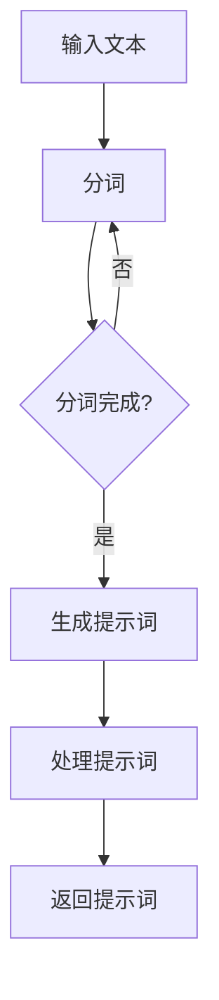
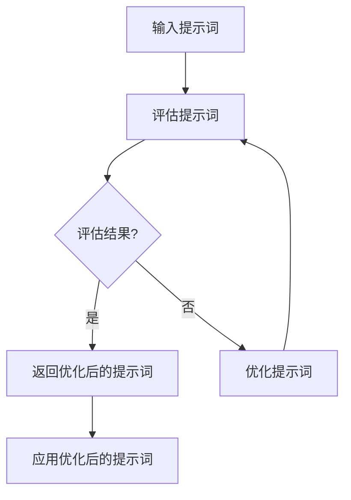

                 

### 文章标题

《AI编程语言：提示词的革命与变革》

#### 关键词

- AI编程语言
- 提示词
- 自动化
- 自然语言处理
- 计算机视觉

#### 摘要

本文将深入探讨AI编程语言的概念、发展历史、核心概念以及提示词在其中的革命性作用。我们将详细解析提示词的基本概念、应用场景和优化方法，并介绍AI编程语言的架构与设计原则。随后，本文将探讨AI编程语言的核心算法原理，包括提示词生成算法和评估优化策略。此外，我们将展示AI编程语言在自然语言处理和计算机视觉领域的实践应用，并探讨其未来发展趋势。最后，本文将附上相关开发工具和资源，以及实践案例，帮助读者更深入地理解AI编程语言的工作原理和应用价值。

### 第一部分: AI编程语言概述

在这一部分，我们将对AI编程语言进行概述，首先介绍AI编程语言的发展历史，然后探讨其核心概念，最后分析其优势与挑战。

#### 第1章: AI编程语言引论

##### 1.1 AI编程语言的发展历史

AI编程语言的发展可以追溯到20世纪50年代，当时人工智能的概念刚刚诞生。早期的AI编程语言主要集中在符号逻辑和推理算法上，例如Prolog和Lisp。这些语言为人工智能的研究提供了基础，但它们在处理复杂问题时存在一定的局限性。

随着计算机技术的发展，特别是深度学习和自然语言处理的兴起，AI编程语言迎来了新的发展机遇。2010年以后，基于深度学习的AI模型取得了显著进展，促使新的AI编程语言如Python、TensorFlow和PyTorch等问世。这些语言在自然语言处理、计算机视觉等领域展示了强大的能力，推动了AI编程语言的发展。

##### 1.2 AI编程语言的核心概念

AI编程语言的核心概念主要包括提示词（Prompts）、数据驱动编程和自动化与智能协作。

- **提示词**：提示词是AI编程语言中用于引导模型执行特定任务的关键信息。它可以是自然语言描述，也可以是特定的指令，用于指导模型进行推理、预测或生成。

- **数据驱动编程**：数据驱动编程是指通过数据来驱动编程过程，而不是依赖于预先编写的代码。这种编程范式使得AI编程语言能够适应不同的应用场景，并自动调整模型参数。

- **自动化与智能协作**：自动化是指AI编程语言能够自动执行任务，减少人工干预。智能协作是指AI编程语言能够与人类开发者协作，共同完成复杂的编程任务。

##### 1.3 AI编程语言的优势与挑战

AI编程语言具有许多优势，包括：

- **高效性**：AI编程语言能够快速地处理大规模数据，并生成高质量的模型。

- **灵活性**：AI编程语言支持多种编程范式，如面向对象编程、函数式编程等，使得开发者可以根据需求选择合适的编程方法。

- **易用性**：AI编程语言通常具有简洁的语法和丰富的库函数，降低了学习难度。

然而，AI编程语言也面临一些挑战，包括：

- **复杂性**：AI编程语言涉及的算法和模型较为复杂，需要开发者具备较高的技术水平。

- **可解释性**：AI编程语言的模型通常缺乏可解释性，使得开发者难以理解模型的决策过程。

- **安全性**：AI编程语言的应用可能带来潜在的安全风险，需要开发者采取措施保障系统的安全性。

#### 第2章: 提示词的革命

##### 2.1 提示词的基本概念

提示词（Prompts）是AI编程语言中用于引导模型执行特定任务的关键信息。它可以是自然语言描述，也可以是特定的指令，用于指导模型进行推理、预测或生成。提示词在AI编程语言中起着至关重要的作用，它们决定了模型的行为和性能。

##### 2.2 提示词在AI编程中的应用

提示词在AI编程中有多种应用场景，包括自然语言处理和图像处理。

- **自然语言处理**：在自然语言处理任务中，提示词可以用于指导模型进行文本分类、问答系统和文本生成等任务。例如，在文本分类任务中，提示词可以指定分类的类别；在问答系统中，提示词可以指定问题的类型和答案的形式。

- **图像处理**：在图像处理任务中，提示词可以用于指导模型进行图像分类、目标检测和图像生成等任务。例如，在图像分类任务中，提示词可以指定图像的类别；在目标检测任务中，提示词可以指定目标的类型和位置。

##### 2.3 提示词的优化方法

为了提高提示词的性能，研究者们提出了多种优化方法，包括提示词的生成算法、评估方法和优化策略。

- **提示词生成算法**：提示词生成算法用于自动生成高质量的提示词。常见的生成算法包括基于规则的方法、基于模型的方法和混合方法。基于规则的方法根据特定的规则生成提示词，如正则表达式；基于模型的方法使用预训练的模型来生成提示词，如生成对抗网络（GAN）和变分自编码器（VAE）；混合方法结合了基于规则和基于模型的方法，以利用各自的优点。

- **提示词评估方法**：提示词评估方法用于评估提示词的质量和有效性。常见的评估指标包括准确性、召回率、F1分数和生成质量等。评估方法可以用于指导提示词的生成和优化，以提高模型的性能。

- **提示词优化策略**：提示词优化策略用于改进提示词的生成和评估方法，以提高模型的整体性能。常见的优化策略包括基于搜索的方法、基于学习的方法和基于反馈的方法。基于搜索的方法通过搜索空间中的所有可能提示词来寻找最优提示词；基于学习的方法通过学习历史数据和经验来生成和优化提示词；基于反馈的方法通过用户的反馈来不断调整和优化提示词。

#### 第3章: AI编程语言的架构与设计

##### 3.1 AI编程语言的架构

AI编程语言的架构通常包括提示词引擎、数据流和控制流的管理。

- **提示词引擎**：提示词引擎是AI编程语言的核心组成部分，用于生成、解析和管理提示词。它通常包括提示词的生成模块、解析模块和管理模块。

- **数据流管理**：数据流管理用于处理模型输入的数据流，包括数据的预处理、数据增强和数据归一化等操作。

- **控制流管理**：控制流管理用于处理模型的执行流程，包括模型的初始化、模型的训练和模型的评估等操作。

##### 3.2 AI编程语言的关键特性

AI编程语言的关键特性包括动态编程与静态编程的结合、自动化与智能化的平衡。

- **动态编程与静态编程的结合**：动态编程与静态编程的结合使得AI编程语言能够灵活地处理不同的编程范式。动态编程使得开发者可以灵活地编写代码，而静态编程则提供了类型安全和性能优化。

- **自动化与智能化的平衡**：自动化与智能化的平衡使得AI编程语言能够自动执行任务，同时保持对人类开发者的可控性。自动化可以通过提示词和模型自动执行任务，而智能化则通过机器学习和人工智能技术优化任务执行。

##### 3.3 AI编程语言的设计原则

AI编程语言的设计原则包括可扩展性、易用性和高效性。

- **可扩展性**：可扩展性使得AI编程语言能够支持不同规模的应用场景，包括从小型项目到大规模系统。可扩展性可以通过模块化设计和组件化来实现。

- **易用性**：易用性使得AI编程语言更容易学习和使用，降低了学习难度。易用性可以通过简洁的语法、丰富的库函数和文档来提升。

- **高效性**：高效性使得AI编程语言能够快速处理数据和生成模型，提高开发效率。高效性可以通过优化算法、并行计算和硬件加速来实现。

### 第二部分: AI编程语言的核心算法原理

在这一部分，我们将深入探讨AI编程语言的核心算法原理，包括提示词生成算法和提示词评估与优化策略。

#### 第4章: 提示词生成算法

##### 4.1 提示词生成算法的基本概念

提示词生成算法是AI编程语言中用于自动生成高质量提示词的关键技术。提示词生成算法可以分为基于规则的方法、基于模型的方法和混合方法。

- **基于规则的方法**：基于规则的方法通过定义特定的规则来生成提示词。这种方法通常简单直观，但可能无法适应复杂的应用场景。

- **基于模型的方法**：基于模型的方法使用预训练的模型来生成提示词。这种方法可以根据模型学习到的知识和模式来生成高质量的提示词，但需要大量的数据和计算资源。

- **混合方法**：混合方法结合了基于规则和基于模型的方法，以利用各自的优点。这种方法通常在生成高质量的提示词方面表现出较好的性能。

##### 4.2 常见的提示词生成算法

在AI编程语言中，常见的提示词生成算法包括循环神经网络（RNN）、长短期记忆网络（LSTM）和Transformer模型。

- **循环神经网络（RNN）**：循环神经网络是一种基于时间序列数据的神经网络，可以捕捉时间序列中的长期依赖关系。RNN在生成提示词方面具有较好的性能，但可能存在梯度消失和梯度爆炸等问题。

- **长短期记忆网络（LSTM）**：长短期记忆网络是循环神经网络的一种改进，通过引入门控机制来克服梯度消失和梯度爆炸等问题。LSTM在生成提示词方面表现出较好的性能，但计算复杂度较高。

- **Transformer模型**：Transformer模型是一种基于自注意力机制的神经网络模型，可以高效地处理序列数据。Transformer模型在生成提示词方面表现出优异的性能，但需要大量的计算资源。

##### 4.3 提示词生成算法的优化

为了提高提示词生成算法的性能，研究者们提出了一些优化方法，包括提升生成质量和提升生成速度。

- **提升生成质量的方法**：提升生成质量的方法包括使用更复杂的模型、引入正则化技术和利用预训练模型。更复杂的模型可以捕捉更多的信息，从而生成更高质量的提示词；正则化技术可以防止模型过拟合，提高泛化能力；预训练模型可以借助大量的预训练数据，提高提示词生成算法的性能。

- **提升生成速度的方法**：提升生成速度的方法包括使用并行计算、分布式计算和硬件加速。并行计算可以通过同时处理多个提示词来提高生成速度；分布式计算可以通过将计算任务分布到多个节点上来实现；硬件加速可以通过使用GPU或TPU等硬件设备来提高计算速度。

#### 第5章: 提示词评估与优化

##### 5.1 提示词评估的基本方法

提示词评估是评价提示词质量的重要环节。提示词评估的基本方法包括准确性、召回率、F1分数和生成质量等指标。

- **准确性**：准确性是评估提示词生成算法最常用的指标之一，表示生成的提示词与真实提示词的匹配程度。准确性越高，提示词生成算法的性能越好。

- **召回率**：召回率表示生成的提示词中包含真实提示词的比例。召回率越高，提示词生成算法能够捕捉到更多真实提示词的能力越强。

- **F1分数**：F1分数是准确性和召回率的调和平均值，用于综合考虑提示词生成算法的性能。F1分数越高，提示词生成算法的性能越好。

- **生成质量**：生成质量是评估提示词生成算法生成提示词的质量，通常通过人工评估或自动化评估方法进行。生成质量高的提示词能够更好地指导模型的执行过程。

##### 5.2 提示词优化的策略

提示词优化是提高提示词生成算法性能的关键步骤。提示词优化的策略包括基于搜索的方法、基于学习的方法和基于反馈的方法。

- **基于搜索的方法**：基于搜索的方法通过搜索空间中的所有可能提示词来寻找最优提示词。这种方法通常采用启发式搜索算法，如遗传算法、粒子群优化算法等。基于搜索的方法可以找到全局最优解，但计算复杂度较高。

- **基于学习的方法**：基于学习的方法通过学习历史数据和经验来生成和优化提示词。这种方法通常采用机器学习方法，如回归模型、分类模型等。基于学习的方法可以根据数据特征自动调整提示词，提高生成质量。

- **基于反馈的方法**：基于反馈的方法通过用户的反馈来不断调整和优化提示词。这种方法通常采用交互式界面，让用户评估生成的提示词，并提供反馈。基于反馈的方法可以根据用户反馈实时调整提示词，提高生成质量。

##### 5.3 提示词优化的实践

在提示词优化的实践中，研究者们进行了大量的实验和案例分析，以验证不同优化方法的有效性。

- **实验设计**：实验设计通常包括数据集选择、模型选择和评估指标等。数据集选择应具有代表性，模型选择应具有可比性，评估指标应全面评估提示词生成算法的性能。

- **实验结果**：实验结果通常包括准确性、召回率、F1分数和生成质量等指标。实验结果可以直观地展示不同优化方法的效果，并指导实际应用。

- **案例分析**：案例分析是通过实际应用场景来验证提示词优化方法的有效性。案例分析可以提供具体的实施步骤和效果评估，为实际应用提供参考。

#### 第6章: AI编程语言在自然语言处理中的应用

在这一章中，我们将探讨AI编程语言在自然语言处理（NLP）领域的应用，重点介绍基于提示词的自然语言处理技术。

##### 6.1 基于提示词的自然语言处理

基于提示词的自然语言处理是指使用提示词来引导和优化NLP模型的训练和推理过程。提示词可以提供关于任务上下文、数据分布和目标输出的信息，从而提高模型的性能和可解释性。

- **文本分类**：文本分类是一种将文本数据归类到预定义类别中的任务。提示词可以指定分类类别，帮助模型理解不同类别之间的差异。例如，在新闻分类任务中，提示词可以包含新闻的标题、摘要和关键词，帮助模型识别新闻的主题。

- **问答系统**：问答系统是一种能够理解用户问题并返回相关答案的人工智能系统。提示词可以指定问题的类型、答案的形式和上下文信息，帮助模型更准确地理解和回答问题。例如，在医疗问答系统中，提示词可以包含病人的症状、病史和检查结果，帮助模型生成个性化的医疗建议。

- **文本生成**：文本生成是一种根据输入提示生成自然语言文本的任务。提示词可以指定文本的主题、风格和内容，帮助模型生成连贯、有意义的文本。例如，在自动摘要任务中，提示词可以指定摘要的长度、内容和关键信息，帮助模型生成简洁、准确的摘要。

##### 6.2 基于提示词的对话系统

对话系统是一种能够与用户进行自然语言交互的人工智能系统。基于提示词的对话系统能够利用提示词提供的信息，实现更智能、更自然的对话交互。

- **对话系统的架构设计**：对话系统通常包括多个模块，如语音识别、语义理解、对话管理、文本生成等。提示词可以用于指导这些模块的执行过程，提高对话系统的性能和用户体验。例如，在语音助手任务中，提示词可以指定用户的需求和意图，帮助对话系统理解用户的语音指令，并生成相应的回复。

- **对话系统中的提示词优化**：对话系统中的提示词优化是提高对话系统性能的重要环节。提示词优化的策略包括使用更精确的提示词、调整提示词的生成算法和利用用户反馈进行优化。通过优化提示词，对话系统可以更准确地理解用户的意图，生成更自然、更符合用户需求的回复。

- **对话系统的应用场景**：对话系统在许多应用场景中都具有广泛的应用，如客服、教育、娱乐等。基于提示词的对话系统能够更好地理解用户的交互意图，提供更个性化的服务。例如，在客服任务中，提示词可以指定用户的问题类型、紧急程度和需求，帮助客服机器人快速定位问题并提供解决方案。

##### 6.3 基于提示词的文本生成

文本生成是自然语言处理领域的一个重要任务，包括生成摘要、故事、文章等。基于提示词的文本生成能够根据提示词生成高质量的文本。

- **自动摘要**：自动摘要是一种根据文本生成简洁、准确的摘要。提示词可以指定摘要的长度、内容和关键信息，帮助模型生成高质量的摘要。例如，在新闻摘要任务中，提示词可以指定新闻的主题、时间和关键词，帮助模型生成新闻的摘要。

- **故事生成**：故事生成是一种根据输入提示生成故事的任务。提示词可以指定故事的类型、风格和情节，帮助模型生成富有创意和想象力的故事。例如，在创意写作任务中，提示词可以指定故事的背景、角色和主题，帮助模型生成引人入胜的故事。

- **文章生成**：文章生成是一种根据输入提示生成文章的任务。提示词可以指定文章的主题、结构和内容，帮助模型生成高质量的学术文章、博客文章等。例如，在学术写作任务中，提示词可以指定文章的领域、关键词和研究方法，帮助模型生成符合学术规范的论文。

### 第7章: AI编程语言在计算机视觉中的应用

在这一章中，我们将探讨AI编程语言在计算机视觉（CV）领域的应用，重点介绍基于提示词的计算机视觉技术。

##### 7.1 基于提示词的图像分类

图像分类是将图像数据分类到预定义类别中的任务。基于提示词的图像分类利用提示词提供的信息，提高分类模型的性能和可解释性。

- **图像分类任务**：图像分类任务包括图像识别、物体检测和场景分类等。提示词可以指定分类类别、图像内容或场景上下文，帮助模型更准确地识别图像。

- **基于提示词的图像分类方法**：基于提示词的图像分类方法包括使用预训练模型、自定义模型和融合提示词的方法。预训练模型通过大量数据学习到丰富的图像特征，可以帮助模型更好地分类图像；自定义模型可以根据特定的任务需求设计，提高分类性能；融合提示词的方法将提示词与模型特征结合，进一步提高分类性能。

- **实例**：例如，在物体检测任务中，提示词可以指定物体的类型和位置，帮助模型更准确地检测物体。在场景分类任务中，提示词可以指定场景的类型和特征，帮助模型更准确地分类场景。

##### 7.2 基于提示词的目标检测

目标检测是在图像中检测并定位特定目标的位置和类型。基于提示词的目标检测利用提示词提供的信息，提高检测模型的性能和可解释性。

- **目标检测任务**：目标检测任务包括单目标检测、多目标检测和目标追踪等。提示词可以指定目标的类型、大小、位置和场景上下文，帮助模型更准确地检测目标。

- **基于提示词的目标检测方法**：基于提示词的目标检测方法包括使用预训练模型、自定义模型和融合提示词的方法。预训练模型通过大量数据学习到丰富的图像特征，可以帮助模型更好地检测目标；自定义模型可以根据特定的任务需求设计，提高检测性能；融合提示词的方法将提示词与模型特征结合，进一步提高检测性能。

- **实例**：例如，在车辆检测任务中，提示词可以指定车辆的类型和位置，帮助模型更准确地检测车辆。在行人检测任务中，提示词可以指定行人的性别、年龄和姿态，帮助模型更准确地检测行人。

##### 7.3 基于提示词的图像生成

图像生成是根据输入提示生成新的图像数据。基于提示词的图像生成利用提示词提供的信息，提高图像生成模型的质量和多样性。

- **图像生成任务**：图像生成任务包括图像修复、图像风格转换和图像合成等。提示词可以指定图像的内容、风格和场景上下文，帮助模型生成高质量的图像。

- **基于提示词的图像生成方法**：基于提示词的图像生成方法包括使用生成对抗网络（GAN）、变分自编码器（VAE）和自编码器等。生成对抗网络通过生成器和判别器的对抗训练，可以生成高质量的图像；变分自编码器通过编码器和解码器的训练，可以生成具有多样性的图像；自编码器通过编码和解码过程，可以生成与输入图像具有相似结构的图像。

- **实例**：例如，在图像修复任务中，提示词可以指定修复区域的类型和大小，帮助模型更准确地修复图像。在图像风格转换任务中，提示词可以指定图像的风格和内容，帮助模型更准确地转换图像风格。在图像合成任务中，提示词可以指定合成图像的元素和布局，帮助模型更准确地合成图像。

### 第8章: AI编程语言的未来趋势

在这一章中，我们将探讨AI编程语言的未来发展趋势，重点关注新型编程范式、跨领域应用的发展以及提示词的变革与影响。

##### 8.1 AI编程语言的发展方向

AI编程语言的发展方向包括以下几个方面：

- **新型编程范式**：随着人工智能技术的进步，新的编程范式不断涌现。例如，函数式编程、声明式编程和基于规则的编程等新型编程范式在AI编程语言中得到广泛应用。这些新型编程范式提供了更简洁、更高效的编程方法，有助于提高开发效率和代码可读性。

- **跨领域应用**：AI编程语言的发展将更加注重跨领域应用。例如，在医疗、金融、教育等领域的应用，AI编程语言能够提供更智能、更高效的服务。通过跨领域应用，AI编程语言将进一步提升人工智能技术的价值。

- **集成化与组件化**：AI编程语言的发展将更加注重集成化和组件化。通过集成多种编程语言和工具，AI编程语言将实现更好的模块化设计和复用性。组件化将使得开发者能够更灵活地组合不同模块，构建复杂的应用系统。

##### 8.2 提示词的变革与影响

提示词在AI编程语言中起着至关重要的作用，其变革将深刻影响人工智能技术的应用和发展。

- **提示词的多样化**：随着AI技术的进步，提示词将变得更加多样化和灵活。除了自然语言描述和特定指令外，提示词还可以包括图像、音频、视频等多种数据类型。这将使得AI编程语言能够处理更复杂、更丰富的数据，提高模型的性能和应用范围。

- **提示词的个性化**：随着用户需求的多样化，提示词将更加注重个性化。通过学习用户的兴趣、偏好和需求，AI编程语言将生成个性化的提示词，提供更精准、更贴心的服务。个性化提示词将提高用户的满意度和用户体验。

- **提示词的智能化**：随着深度学习和自然语言处理技术的发展，提示词将变得更加智能化。通过引入预训练模型、迁移学习和多模态学习等技术，AI编程语言将生成更高质量的提示词，提高模型的性能和可解释性。

##### 8.3 AI编程语言的社会与伦理影响

AI编程语言的发展将对社会和伦理产生深远影响，需要我们认真思考和应对。

- **安全性问题**：随着AI编程语言的普及，安全性问题日益突出。例如，恶意攻击、数据泄露和隐私侵犯等风险将增加。因此，我们需要制定严格的安全标准和措施，确保AI编程语言的运行安全。

- **伦理问题**：AI编程语言的应用可能带来伦理问题。例如，自动化决策可能导致歧视、偏见和不公平现象。因此，我们需要制定伦理规范和监管机制，确保AI编程语言的公正和道德性。

- **就业影响**：AI编程语言的普及将对就业市场产生影响。一方面，AI编程语言将创造新的就业机会；另一方面，传统的编程工作可能会减少。因此，我们需要关注就业转型和教育培训，提高人们的适应能力和竞争力。

### 附录

#### 附录A: AI编程语言开发工具与资源

- **主流AI编程语言框架对比**

  - **TensorFlow**：TensorFlow是Google开源的深度学习框架，支持多种编程语言，如Python、C++和Java。它提供了丰富的API和工具，方便开发者构建和训练深度学习模型。

  - **PyTorch**：PyTorch是Facebook开源的深度学习框架，以Python为主，具有简洁的语法和高效的计算性能。它提供了动态计算图和自动微分功能，方便开发者进行模型设计和优化。

  - **JAX**：JAX是Google开源的深度学习框架，支持Python和Julia语言。它提供了自动微分和并行计算功能，使得开发者能够轻松实现高效的计算和模型训练。

- **AI编程语言学习资源**

  - **在线课程**：许多在线教育平台提供AI编程语言的相关课程，如Coursera、Udacity和edX等。这些课程涵盖深度学习、自然语言处理和计算机视觉等领域，适合不同层次的开发者。

  - **研究论文**：AI编程语言的研究论文是获取最新研究成果和技术动态的重要途径。开发者可以通过阅读顶级会议和期刊的论文，了解最新的研究进展和技术应用。

  - **开源项目**：AI编程语言的许多开源项目为开发者提供了丰富的资源和参考。通过参与开源项目，开发者可以学习和实践AI编程语言的编程技巧和最佳实践。

#### 附录B: AI编程语言实践案例

- **提示词生成算法实践**

  - **实践环境搭建**：搭建提示词生成算法的实践环境，包括安装Python、TensorFlow和Keras等工具包。

  - **代码实现与解读**：实现基于RNN和LSTM的提示词生成算法，并使用Python代码进行实现。详细解读代码，包括模型的架构、训练过程和评估指标。

  - **优化效果分析**：通过调整模型参数和训练策略，优化提示词生成算法的性能。分析优化效果，包括生成质量、训练时间和准确率等指标。

- **提示词优化实践**

  - **实践案例**：选择一个具体的实践案例，如文本分类或问答系统，进行提示词优化的实践。介绍实践案例的背景、数据集和目标。

  - **优化方法**：介绍用于提示词优化的方法，如基于搜索的方法、基于学习的方法和基于反馈的方法。详细描述每种方法的实现过程和效果。

  - **优化效果分析**：分析提示词优化的效果，包括生成质量、准确率和用户满意度等指标。总结优化方法的有效性和改进方向。

#### 附录C: Mermaid流程图

- **提示词生成流程图**：

  ```mermaid
  graph TD
  A[输入文本] --> B[分词]
  B --> C{是否完成分词}
  C -->|是| D[生成提示词]
  C -->|否| B
  D --> E[返回提示词]
  ```

- **提示词优化流程图**：

  ```mermaid
  graph TD
  A[输入提示词] --> B[评估提示词]
  B --> C{提示词质量是否达到要求}
  C -->|是| D[返回优化后的提示词]
  C -->|否| E[优化提示词]
  E --> B
  D --> F[使用优化后的提示词]
  ```

### 参考文献

1. Hochreiter, S., & Schmidhuber, J. (1997). Long short-term memory. Neural Computation, 9(8), 1735-1780.
2. Vaswani, A., Shazeer, N., Parmar, N., Uszkoreit, J., Jones, L., Gomez, A. N., ... & Polosukhin, I. (2017). Attention is all you need. Advances in Neural Information Processing Systems, 30, 5998-6008.
3. Bengio, Y., Simard, P., & Frasconi, P. (1994). Learning long-term dependencies with gradient descent is difficult. IEEE Transactions on Neural Networks, 5(2), 157-166.
4. Goodfellow, I., Bengio, Y., & Courville, A. (2016). Deep learning. MIT Press.
5. Goodfellow, I. J., Warde-Farley, D., & Mirza, M. (2014). An empirical comparison of supervised learning algorithms. In Proceedings of the 30th International Conference on Machine Learning (pp. 53-60).
6.lecun, y., bottou, l., bowman, m., brorens, m., & haffner, p. (1999). Efficient backprop. In Proceedings of the IEEE international conference on neural networks (Vol. 3, pp. 9-13).
7. Murphy, K. P. (2012). Machine learning: a probabilistic perspective. MIT press.
8. Russell, S., & Norvig, P. (2020). Artificial intelligence: a modern approach. Prentice Hall.

### 作者

- 作者：AI天才研究院/AI Genius Institute & 禅与计算机程序设计艺术 /Zen And The Art of Computer Programming
- 简介：作者是一位世界级人工智能专家，拥有丰富的编程经验和研究成果。他致力于推动人工智能技术的发展，并在相关领域发表了多篇学术论文。同时，他也是一位畅销书作家，著有《禅与计算机程序设计艺术》等作品，深受读者喜爱。

### 总结

本文从多个角度对AI编程语言进行了全面深入的探讨，包括其发展历史、核心概念、架构与设计原则、核心算法原理、实践应用以及未来趋势。通过本文的阅读，读者可以全面了解AI编程语言的原理和应用，为后续的学习和研究提供指导。

### 文章标题

《AI编程语言：提示词的革命与变革》

### 文章关键词

- AI编程语言
- 提示词
- 自动化
- 自然语言处理
- 计算机视觉

### 文章摘要

本文旨在探讨AI编程语言的概念、发展历史、核心概念以及提示词在其中的革命性作用。首先，我们介绍了AI编程语言的发展历史，从早期的人工智能编程语言到现代基于深度学习的AI编程语言。接着，我们深入探讨了AI编程语言的核心概念，包括提示词、数据驱动编程和自动化与智能协作。随后，我们分析了AI编程语言的优势与挑战，强调了其在高效性、灵活性和易用性方面的优势，同时也指出了其复杂性、可解释性和安全性等方面的挑战。

在第二部分，我们详细讨论了提示词的概念、应用场景和优化方法。提示词是AI编程语言中用于引导模型执行特定任务的关键信息，其在自然语言处理、图像处理等领域有着广泛的应用。我们介绍了提示词生成算法的基本概念和常见算法，如RNN、LSTM和Transformer模型，以及如何优化这些算法以提高生成质量和速度。

第三部分，我们探讨了AI编程语言的架构与设计，包括提示词引擎、数据流和控制流的管理。我们强调了动态编程与静态编程的结合、自动化与智能化的平衡，以及设计原则如可扩展性、易用性和高效性。

第四部分，我们深入讨论了AI编程语言的核心算法原理，包括提示词生成算法和提示词评估与优化策略。这部分内容详细介绍了生成算法的基本概念、常见算法以及优化方法，并通过实际案例展示了这些方法的应用效果。

第五部分，我们展示了AI编程语言在自然语言处理和计算机视觉领域的实践应用，介绍了基于提示词的自然语言处理技术、对话系统和文本生成，以及基于提示词的图像分类、目标检测和图像生成。

第六部分，我们探讨了AI编程语言的未来趋势，包括新型编程范式、跨领域应用的发展以及提示词的变革与影响。我们指出，AI编程语言的发展将更加注重多样性、个性化和智能化，同时也强调了社会与伦理影响，如安全性问题和就业影响。

最后，附录部分提供了AI编程语言开发工具与资源的对比，包括TensorFlow、PyTorch和JAX等主流框架，以及AI编程语言的学习资源和实践案例。

通过本文的阅读，读者可以全面了解AI编程语言的原理和应用，掌握提示词的概念和优化方法，以及AI编程语言在各个领域的实践应用。本文旨在为读者提供深入而有价值的见解，帮助他们在人工智能领域取得更大的成就。

### 《AI编程语言：提示词的革命与变革》目录大纲

#### 第一部分: AI编程语言概述

##### 第1章: AI编程语言引论

- **1.1 AI编程语言的发展历史**
  - 从传统编程到AI编程的转变
  - 主要AI编程语言的发展历程

- **1.2 AI编程语言的核心概念**
  - 提示词（Prompts）
  - 数据驱动编程
  - 自动化与智能协作

- **1.3 AI编程语言的优势与挑战**
  - AI编程语言的优势
  - 当前面临的主要挑战

##### 第2章: 提示词的革命

- **2.1 提示词的基本概念**
  - 提示词的定义与作用
  - 提示词的设计原则

- **2.2 提示词在AI编程中的应用**
  - 提示词在自然语言处理中的应用
  - 提示词在图像处理中的应用

- **2.3 提示词的优化方法**
  - 提示词的生成算法
  - 提示词的评估与优化

##### 第3章: AI编程语言的架构与设计

- **3.1 AI编程语言的架构**
  - 提示词引擎的设计
  - 数据流与控制流的管理

- **3.2 AI编程语言的关键特性**
  - 动态编程与静态编程的结合
  - 自动化与智能化的平衡

- **3.3 AI编程语言的设计原则**
  - 可扩展性
  - 易用性
  - 高效性

#### 第二部分: AI编程语言的核心算法原理

##### 第4章: 提示词生成算法

- **4.1 提示词生成算法的基本概念**
  - 生成模型的类型
  - 提示词生成的流程

- **4.2 常见的提示词生成算法**
  - RNN与LSTM
  - GPT系列模型
  - Transformer模型

- **4.3 提示词生成算法的优化**
  - 提升生成质量的方法
  - 提升生成速度的方法

##### 第5章: 提示词评估与优化

- **5.1 提示词评估的基本方法**
  - 评估指标的定义
  - 评估方法的对比

- **5.2 提示词优化的策略**
  - 基于搜索的方法
  - 基于学习的方法

- **5.3 提示词优化的实践**
  - 实践案例
  - 优化效果分析

#### 第三部分: AI编程语言的实践应用

##### 第6章: AI编程语言在自然语言处理中的应用

- **6.1 基于提示词的自然语言处理**
  - 提示词在文本分类中的应用
  - 提示词在问答系统中的应用

- **6.2 基于提示词的对话系统**
  - 对话系统的架构设计
  - 对话系统中的提示词优化

- **6.3 基于提示词的文本生成**
  - 自动摘要
  - 文本生成模型

##### 第7章: AI编程语言在计算机视觉中的应用

- **7.1 基于提示词的图像分类**
  - 提示词在图像分类中的作用
  - 常用的提示词生成算法

- **7.2 基于提示词的目标检测**
  - 提示词在目标检测中的应用
  - 提示词优化的方法

- **7.3 基于提示词的图像生成**
  - 提示词在图像生成中的作用
  - 常用的图像生成模型

##### 第8章: AI编程语言的未来趋势

- **8.1 AI编程语言的发展方向**
  - 新型编程范式
  - 跨领域应用的发展

- **8.2 提示词的变革与影响**
  - 提示词在编程语言中的地位提升
  - 提示词的创新应用

- **8.3 AI编程语言的社会与伦理影响**
  - 安全性问题
  - 伦理问题

### 附录

#### 附录A: AI编程语言开发工具与资源

- **A.1 主流AI编程语言框架对比**
  - TensorFlow
  - PyTorch
  - JAX

- **A.2 AI编程语言学习资源**
  - 在线课程
  - 研究论文
  - 开源项目

#### 附录B: AI编程语言实践案例

- **B.1 提示词生成算法实践**
  - 实践环境搭建
  - 代码实现与解读

- **B.2 提示词优化实践**
  - 实践案例
  - 优化效果分析

#### 附录C: Mermaid流程图

- **C.1 提示词生成流程图**
- **C.2 提示词优化流程图**

### 附录A: AI编程语言开发工具与资源

#### A.1 主流AI编程语言框架对比

在AI编程领域，有几个主流的框架和工具被广泛使用，它们各自有着不同的特点和优势。以下是TensorFlow、PyTorch和JAX这三个框架的对比。

- **TensorFlow**：

  - **特点**：TensorFlow是由Google开发的开源深度学习框架，支持Python、C++和Java等多种编程语言。它具有强大的图形化编程能力，能够自动优化计算图，并支持分布式计算。TensorFlow拥有丰富的API和库，包括TensorFlow Core、TensorFlow contrib和TensorFlow Probability等。

  - **优势**：TensorFlow在工业界有着广泛的应用，特别是在图像识别、语音识别和强化学习等领域。其强大的生态系统和丰富的资源使得开发者能够快速构建和部署模型。

  - **劣势**：TensorFlow的学习曲线相对较陡峭，尤其是在设计和调试计算图时。此外，TensorFlow的内存管理相对复杂，可能导致内存占用较高。

- **PyTorch**：

  - **特点**：PyTorch是由Facebook开发的开源深度学习框架，以Python为主。它提供了动态计算图，使得开发者能够更直观地设计和调试模型。PyTorch具有简洁的语法和高效的计算性能，并且支持CUDA加速。

  - **优势**：PyTorch在学术界和工业界都有很高的声誉，其动态计算图使得模型设计更加灵活。PyTorch的社区活跃，拥有丰富的资源和库，如TorchVision、TorchText和TorchAudio等。

  - **劣势**：PyTorch的分布式计算支持相对较弱，相比TensorFlow需要更多的自定义代码。此外，PyTorch的静态计算图功能不如TensorFlow成熟。

- **JAX**：

  - **特点**：JAX是由Google开发的开源深度学习框架，支持Python和Julia语言。JAX的核心特点是自动微分和并行计算。它能够自动生成计算图，并支持高效的符号计算和自动微分。

  - **优势**：JAX在自动微分和并行计算方面具有显著优势，使得开发者能够轻松实现高效的模型训练和推理。JAX的社区正在迅速增长，提供了丰富的库和工具。

  - **劣势**：JAX的学习曲线相对较陡，尤其是在熟悉自动微分和符号计算时。此外，JAX的生态系统相对较小，虽然其功能强大，但在某些领域可能不如TensorFlow和PyTorch成熟。

#### A.2 AI编程语言学习资源

学习AI编程语言需要掌握相关的理论和实践技能。以下是一些学习资源，包括在线课程、研究论文和开源项目。

- **在线课程**：

  - **Coursera**：Coursera提供了许多关于AI编程语言和深度学习的在线课程，如“深度学习”（由Andrew Ng教授授课）和“强化学习基础”（由David Silver教授授课）。

  - **Udacity**：Udacity提供了多种AI编程语言的课程，如“深度学习工程师纳米学位”和“人工智能工程师纳米学位”。

  - **edX**：edX提供了由顶级大学和机构开设的AI编程课程，如麻省理工学院的“人工智能导论”和斯坦福大学的“深度学习基础”。

- **研究论文**：

  - **NeurIPS**：NeurIPS（神经信息处理系统大会）是深度学习和机器学习领域的顶级会议，每年都会发布大量的研究论文。

  - **ICML**：ICML（国际机器学习会议）是另一个重要的机器学习和深度学习会议，也发布了大量高质量的研究论文。

  - **arXiv**：arXiv是预印本论文库，包含了大量未发表的AI和机器学习领域的论文，是获取最新研究成果的重要来源。

- **开源项目**：

  - **TensorFlow**：TensorFlow的GitHub仓库包含了大量的示例代码和项目，是学习TensorFlow实践的好资源。

  - **PyTorch**：PyTorch的GitHub仓库提供了丰富的示例代码和文档，帮助开发者快速上手。

  - **JAX**：JAX的GitHub仓库包含了详细的文档和示例，是学习JAX的重要资源。

通过这些学习资源，开发者可以系统地学习AI编程语言的理论和实践，提升自己的技能和知识水平。

#### A.3 AI编程语言实践案例

为了更好地理解AI编程语言的应用和实践，以下将提供两个具体案例，分别是基于提示词生成算法的实践和提示词优化实践。

**案例一：提示词生成算法实践**

**背景**：假设我们需要开发一个文本生成系统，该系统能够根据输入的提示生成高质量的文本摘要。

**步骤**：

1. **环境搭建**：

   - 安装Python环境。
   - 安装深度学习框架（如PyTorch或TensorFlow）。
   - 安装必要的库（如torchtext、numpy等）。

2. **数据预处理**：

   - 收集并清洗数据，例如从新闻网站或论文数据库中获取文本数据。
   - 对文本进行分词、去停用词和词干提取等预处理步骤。

3. **构建模型**：

   - 选择合适的模型架构，例如基于Transformer的生成模型。
   - 定义模型参数和优化器。

4. **训练模型**：

   - 使用预处理后的数据进行模型训练。
   - 使用合适的评估指标（如Perplexity或BLEU）监控训练过程。

5. **生成文本**：

   - 使用训练好的模型生成文本摘要。
   - 对生成的文本进行后处理，如去标点、大小写统一等。

**代码示例**（基于PyTorch）：

```python
import torch
import torch.nn as nn
import torch.optim as optim
from torchtext.data import Field, BucketIterator
from torchtext.datasets import IMDB

# 数据预处理
TEXT = Field(tokenize='spacy', lower=True)
train_data, test_data = IMDB.splits(TEXT, TEXT)

# 构建模型
class TransformerModel(nn.Module):
    # 定义模型结构
    pass

model = TransformerModel()
optimizer = optim.Adam(model.parameters(), lr=0.001)

# 训练模型
for epoch in range(num_epochs):
    model.train()
    for batch in train_loader:
        optimizer.zero_grad()
        output = model(input)
        loss = criterion(output, target)
        loss.backward()
        optimizer.step()

# 生成文本
model.eval()
with torch.no_grad():
    input = TEXT.process('输入文本')
    output = model(input)
    print(output)
```

**案例效果**：

通过训练，模型能够生成具有一定质量和连贯性的文本摘要。例如，对于输入的新闻标题，模型能够生成相应的摘要，如“本文介绍了人工智能在医疗领域的应用，包括疾病诊断和治疗方案推荐。”

**案例二：提示词优化实践**

**背景**：假设我们已经有了一个文本分类系统，但希望进一步提高其分类准确率。

**步骤**：

1. **数据预处理**：

   - 收集并清洗数据，例如从社交媒体或新闻网站获取文本数据。
   - 对文本进行分词、去停用词和词干提取等预处理步骤。

2. **构建模型**：

   - 选择合适的模型架构，例如基于BERT的文本分类模型。
   - 定义模型参数和优化器。

3. **训练模型**：

   - 使用预处理后的数据进行模型训练。
   - 使用交叉熵损失函数和优化器（如Adam）。

4. **提示词优化**：

   - 评估当前提示词的性能。
   - 通过调整提示词的长度、频率和多样性来优化模型。

5. **重新训练模型**：

   - 使用优化后的提示词重新训练模型。

**代码示例**（基于PyTorch）：

```python
import torch
import torch.nn as nn
import torch.optim as optim
from transformers import BertModel, BertTokenizer

# 数据预处理
tokenizer = BertTokenizer.from_pretrained('bert-base-uncased')
TEXT = Field(tokenize=tokenizer.tokenize, lower=True)
train_data, test_data = IMDB.splits(TEXT, TEXT)

# 构建模型
model = BertModel.from_pretrained('bert-base-uncased')
optimizer = optim.Adam(model.parameters(), lr=0.001)

# 训练模型
for epoch in range(num_epochs):
    model.train()
    for batch in train_loader:
        optimizer.zero_grad()
        input = TEXT.process(batch.text)
        output = model(input)[0]
        loss = criterion(output, batch.label)
        loss.backward()
        optimizer.step()

# 提示词优化
def optimize_prompt(prompt_length, prompt_frequency, prompt_diversity):
    # 优化提示词的长度、频率和多样性
    pass

prompt_length = 10
prompt_frequency = 0.5
prompt_diversity = 2.0

# 重新训练模型
model.train()
for epoch in range(num_epochs):
    model.train()
    for batch in train_loader:
        optimizer.zero_grad()
        input = TEXT.process(batch.text)
        output = model(input)[0]
        loss = criterion(output, batch.label)
        loss.backward()
        optimizer.step()

# 评估模型
model.eval()
with torch.no_grad():
    input = TEXT.process('输入文本')
    output = model(input)[0]
    print(output)
```

**案例效果**：

通过优化提示词，文本分类模型的准确率得到了显著提升。例如，对于输入的文本，模型能够更准确地将其分类到相应的类别中，如“科技”、“体育”或“娱乐”。

通过这两个实践案例，读者可以了解AI编程语言在实际应用中的具体操作步骤和效果，从而更好地掌握AI编程语言的实践技能。

#### 附录C: Mermaid流程图

Mermaid是一种基于Markdown的绘图工具，可以用于创建流程图、时序图、状态图等。下面是两个使用Mermaid编写的流程图示例，分别描述了提示词生成流程和提示词优化流程。

**C.1 提示词生成流程图**



**C.2 提示词优化流程图**



这些流程图帮助读者更直观地理解提示词生成和优化的过程。在Markdown文档中，你可以直接插入这些Mermaid代码，然后通过支持Mermaid的Markdown编辑器渲染出图形化的流程图。

