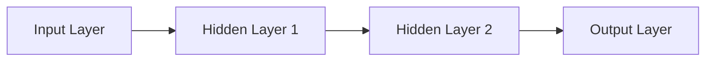

                 

### 文章标题

《AI编程语言：提示词的革命与未来》

### 关键词

人工智能，编程语言，提示词，神经网络，深度学习，Python，R语言，Julia语言

### 摘要

本文将深入探讨AI编程语言的概念、核心技术、历史发展、应用场景、未来趋势以及实战案例。我们将逐步解析AI编程语言的内涵和外延，揭示提示词在AI编程中的革命性作用，并结合Python、R语言和Julia等常见AI编程语言，分析它们在自然语言处理、计算机视觉、机器学习等领域的应用。同时，我们将展望AI编程语言的未来发展趋势，探讨其对编程教育、社会影响以及伦理和法律问题的挑战。通过本文，读者将全面了解AI编程语言的核心技术原理，掌握其应用场景，并预见到AI编程语言的广阔未来。

# 《AI编程语言：提示词的革命与未来》目录大纲

## 第一部分: AI编程语言概述

### 第1章: AI编程语言的概念与历史

#### 1.1.1 AI编程语言的定义

#### 1.1.2 AI编程语言的发展历程

#### 1.1.3 AI编程语言的重要性

### 第2章: AI编程语言的核心技术与原理

#### 2.1.1 提示词机制

#### 2.1.2 语言模型基础

#### 2.1.3 神经网络与深度学习

### 第3章: 常见的AI编程语言

#### 3.1.1 Python与AI编程

#### 3.1.2 R语言在AI编程中的应用

#### 3.1.3 Julia语言的优势

### 第4章: AI编程语言的应用场景

#### 4.1.1 自然语言处理

#### 4.1.2 计算机视觉

#### 4.1.3 机器学习与数据挖掘

### 第5章: AI编程语言的未来发展趋势

#### 5.1.1 下一代AI编程语言

#### 5.1.2 人工智能与编程教育的融合

#### 5.1.3 AI编程语言对社会的影响

## 第二部分: AI编程语言实战

### 第6章: AI编程语言项目实战

#### 6.1.1 AI编程环境搭建

#### 6.1.2 实战项目一：文本分类

##### 6.1.1.1 数据准备与预处理

##### 6.1.1.2 模型训练与评估

##### 6.1.1.3 模型部署与优化

#### 6.1.2 实战项目二：图像识别

##### 6.1.2.1 数据准备与预处理

##### 6.1.2.2 模型训练与评估

##### 6.1.2.3 模型部署与优化

### 第7章: AI编程语言中的核心算法原理详解

#### 7.1.1 语言模型算法

##### 7.1.1.1 语言模型的基本概念

##### 7.1.1.2 语言模型的常用算法

##### 7.1.1.3 语言模型的优化方法

#### 7.1.2 神经网络算法

##### 7.1.2.1 神经网络的基本结构

##### 7.1.2.2 神经网络的训练过程

##### 7.1.2.3 神经网络的优化算法

### 第8章: 数学模型与公式详解

#### 8.1.1 概率论与统计学基础

##### 8.1.1.1 概率分布函数

##### 8.1.1.2 贝叶斯定理

##### 8.1.1.3 马尔可夫模型

#### 8.1.2 机器学习与深度学习数学模型

##### 8.1.2.1 损失函数

##### 8.1.2.2 优化算法

##### 8.1.2.3 神经网络数学模型

### 第9章: AI编程语言中的伦理与法律问题

#### 9.1.1 AI编程语言伦理问题

##### 9.1.1.1 数据隐私与安全性

##### 9.1.1.2 AI算法的公平性

##### 9.1.1.3 AI编程语言的法律责任

#### 9.1.2 AI编程语言的应用规范

##### 9.1.2.1 行业标准与法规

##### 9.1.2.2 人工智能伦理守则

### 第10章: AI编程语言未来展望

#### 10.1.1 AI编程语言的发展趋势

##### 10.1.1.1 新兴AI编程语言

##### 10.1.1.2 AI编程语言的教育与普及

##### 10.1.1.3 AI编程语言在企业中的应用

#### 10.1.2 AI编程语言对社会的影响

##### 10.1.2.1 AI编程语言对就业市场的影响

##### 10.1.2.2 AI编程语言对日常生活的影响

##### 10.1.2.3 AI编程语言对全球化进程的影响

## 附录

### 附录A: AI编程语言学习资源推荐

#### A.1 在线学习平台推荐

##### A.1.1 Coursera

##### A.1.2 edX

##### A.1.3 Udacity

#### A.2 经典教材与书籍推荐

##### A.2.1 《Python编程：从入门到实践》

##### A.2.2 《深度学习》（Goodfellow et al.）

##### A.2.3 《自然语言处理综论》（Jurafsky & Martin）

### 附录B: AI编程语言开发工具与库

#### B.1 Python相关库

##### B.1.1 TensorFlow

##### B.1.2 PyTorch

##### B.1.3 Keras

#### B.2 R语言相关库

##### B.2.1 caret

##### B.2.2 mlr

##### B.2.3 shiny

#### B.3 Julia相关库

##### B.3.1 JAX

##### B.3.2 MLJAR

##### B.3.3 ARKit

## 第一部分: AI编程语言概述

### 第1章: AI编程语言的概念与历史

#### 1.1.1 AI编程语言的定义

AI编程语言是一类旨在简化人工智能应用开发的编程语言。它们通过内置的库和框架，提供高度抽象的工具和接口，使开发者能够更轻松地实现机器学习、深度学习、自然语言处理、计算机视觉等AI任务。

#### 1.1.2 AI编程语言的发展历程

AI编程语言的发展历程可以追溯到20世纪50年代，当时出现了第一批尝试模拟人类智能的编程语言。然而，随着计算能力的提升和数据量的爆炸性增长，AI编程语言得到了迅速的发展。从早期的LISP到现代的Python、R语言和Julia，这些语言不断演进，满足日益复杂的应用需求。

#### 1.1.3 AI编程语言的重要性

AI编程语言的重要性体现在多个方面。首先，它们简化了AI任务的实现过程，降低了开发门槛。其次，AI编程语言提供了丰富的库和工具，使得开发者可以更高效地构建和优化AI模型。最后，AI编程语言推动了人工智能技术的普及和应用，促进了各行业的创新发展。

### 第2章: AI编程语言的核心技术与原理

#### 2.1.1 提示词机制

提示词（Prompt）是AI编程语言中的一个关键概念。它是指在AI模型训练和推理过程中，提供给模型的一系列输入。通过巧妙设计提示词，可以显著提高模型的性能和准确性。提示词机制涉及提示词的生成、选择和优化，是AI编程语言的核心技术之一。

#### 2.1.2 语言模型基础

语言模型是AI编程语言中不可或缺的部分。它是一种统计模型，用于预测文本序列的下一个单词或字符。语言模型广泛应用于自然语言处理任务，如机器翻译、文本生成、情感分析等。常见的语言模型算法包括n-gram模型、循环神经网络（RNN）和Transformer等。

#### 2.1.3 神经网络与深度学习

神经网络是AI编程语言的基础架构。它由一系列相互连接的节点（或神经元）组成，通过学习输入数据之间的复杂关系，实现数据分类、回归、生成等任务。深度学习是神经网络的一种扩展，通过增加网络的深度，提高了模型的表达能力和泛化能力。

### 第3章: 常见的AI编程语言

#### 3.1.1 Python与AI编程

Python是当前最流行的AI编程语言之一。它具有简洁易读的语法，丰富的库和框架，使得开发者可以轻松地实现各种AI任务。Python的库如TensorFlow、PyTorch和Keras，为深度学习和机器学习提供了强大的支持。

#### 3.1.2 R语言在AI编程中的应用

R语言是一种专门用于统计分析和数据科学的编程语言。它在自然语言处理、数据挖掘和图形可视化方面具有显著优势。R语言的库如caret、mlr和shiny，为AI编程提供了丰富的工具。

#### 3.1.3 Julia语言的优势

Julia语言是一种新兴的AI编程语言，具有高性能和易用性。它专为科学计算和数据分析而设计，能够高效地处理大规模数据集。Julia的库如JAX和MLJAR，提供了强大的深度学习和机器学习功能。

### 第4章: AI编程语言的应用场景

#### 4.1.1 自然语言处理

自然语言处理（NLP）是AI编程语言的重要应用领域。通过语言模型和深度学习技术，NLP可以实现文本分类、情感分析、机器翻译、语音识别等任务。Python、R语言和Julia在NLP领域具有广泛的应用。

#### 4.1.2 计算机视觉

计算机视觉是另一个重要的AI应用领域。通过卷积神经网络（CNN）和目标检测算法，计算机视觉可以实现图像分类、物体识别、人脸检测等任务。Python、R语言和Julia在计算机视觉领域也表现出强大的能力。

#### 4.1.3 机器学习与数据挖掘

机器学习和数据挖掘是AI编程语言的核心应用。通过构建和优化机器学习模型，可以解决分类、回归、聚类等数据科学问题。Python、R语言和Julia在机器学习和数据挖掘领域具有广泛的应用。

### 第5章: AI编程语言的未来发展趋势

#### 5.1.1 下一代AI编程语言

随着人工智能技术的不断发展，下一代AI编程语言将更加智能化、高效和易用。它们将集成更多的深度学习和机器学习技术，提供更丰富的库和框架，以满足不断增长的AI应用需求。

#### 5.1.2 人工智能与编程教育的融合

人工智能与编程教育的融合将成为未来发展的一个重要趋势。通过将AI编程语言纳入编程课程，可以培养学生的人工智能思维和编程能力，促进人工智能技术的普及和应用。

#### 5.1.3 AI编程语言对社会的影响

AI编程语言将对社会产生深远的影响。它们将推动各行业的数字化转型，创造新的就业机会，提高生产效率和生活质量。同时，AI编程语言也将带来一些挑战，如数据隐私、算法公平性和法律责任等。

## 第二部分: AI编程语言实战

### 第6章: AI编程语言项目实战

#### 6.1.1 AI编程环境搭建

要开始AI编程项目，首先需要搭建合适的开发环境。以下是一个基本的AI编程环境搭建步骤：

1. 安装操作系统：选择适合的操作系统，如Windows、macOS或Linux。
2. 安装编程语言：安装Python、R语言或Julia等AI编程语言。
3. 安装库和框架：安装必要的库和框架，如TensorFlow、PyTorch、Keras、caret、mlr、JAX和MLJAR等。
4. 配置环境变量：配置环境变量，以便在命令行中调用编程语言和库。

#### 6.1.2 实战项目一：文本分类

文本分类是自然语言处理中的一个常见任务。以下是一个简单的文本分类项目，包括数据准备、模型训练和评估等步骤：

##### 6.1.1.1 数据准备与预处理

1. 数据收集：收集用于文本分类的数据集，如新闻文章、社交媒体评论等。
2. 数据清洗：去除无效字符、停用词和标点符号，将文本转换为统一格式。
3. 向量化：将文本转换为数值表示，常用的方法包括词袋模型（Bag of Words）和词嵌入（Word Embeddings）。

##### 6.1.1.2 模型训练与评估

1. 选择模型：选择合适的文本分类模型，如朴素贝叶斯（Naive Bayes）、支持向量机（SVM）或深度神经网络（DNN）。
2. 模型训练：使用训练数据集对模型进行训练。
3. 模型评估：使用验证数据集评估模型性能，常用的评价指标包括准确率（Accuracy）、召回率（Recall）和F1分数（F1 Score）。

##### 6.1.1.3 模型部署与优化

1. 模型部署：将训练好的模型部署到生产环境，如Web服务或移动应用。
2. 模型优化：根据实际应用需求，对模型进行优化，提高模型性能。

#### 6.1.2 实战项目二：图像识别

图像识别是计算机视觉中的一个重要任务。以下是一个简单的图像识别项目，包括数据准备、模型训练和评估等步骤：

##### 6.1.2.1 数据准备与预处理

1. 数据收集：收集用于图像识别的数据集，如人脸识别、物体识别等。
2. 数据清洗：去除损坏或质量差的图像，统一图像大小和分辨率。
3. 数据增强：通过旋转、翻转、缩放等操作，增加数据多样性。

##### 6.1.2.2 模型训练与评估

1. 选择模型：选择合适的图像识别模型，如卷积神经网络（CNN）、循环神经网络（RNN）或生成对抗网络（GAN）。
2. 模型训练：使用训练数据集对模型进行训练。
3. 模型评估：使用验证数据集评估模型性能，常用的评价指标包括准确率（Accuracy）、召回率（Recall）和F1分数（F1 Score）。

##### 6.1.2.3 模型部署与优化

1. 模型部署：将训练好的模型部署到生产环境，如Web服务或移动应用。
2. 模型优化：根据实际应用需求，对模型进行优化，提高模型性能。

## 第7章: AI编程语言中的核心算法原理详解

### 7.1.1 语言模型算法

语言模型是自然语言处理（NLP）中的一个核心算法，用于预测文本序列中的下一个单词或字符。以下是对几种常见语言模型算法的详细解释。

#### 7.1.1.1 语言模型的基本概念

语言模型是一种概率模型，它通过学习大量文本数据，计算每个单词或字符在特定上下文中的概率分布。这样，语言模型就可以用于生成文本、翻译文本或进行文本分类等任务。

#### 7.1.1.2 语言模型的常用算法

1. **n-gram模型**：n-gram模型是一种基于词汇序列的统计模型，它通过计算前n个单词同时出现的概率来预测下一个单词。n-gram模型的简单实现如下：

   ```python
   def n_gram_model(corpus, n):
       model = {}
       for i in range(len(corpus) - n):
           context = tuple(corpus[i:i+n])
           next_word = corpus[i+n]
           if context not in model:
               model[context] = {}
           model[context][next_word] = model[context].get(next_word, 0) + 1
       return model
   ```

2. **循环神经网络（RNN）**：RNN是一种能够处理序列数据的神经网络，它通过循环结构记忆前一个时刻的信息。以下是一个简单的RNN实现：

   ```python
   import numpy as np

   def rnn(input_sequence, hidden_state, weights):
       output_sequence = []
       for input_vector in input_sequence:
           hidden_state = np.tanh(np.dot(input_vector, weights['input_to_hidden']) + np.dot(hidden_state, weights['hidden_to_hidden']))
           output_sequence.append(hidden_state)
       return output_sequence, hidden_state
   ```

3. **Transformer**：Transformer是一种基于自注意力机制的深度神经网络，它在NLP任务中表现出色。以下是一个简单的Transformer实现：

   ```python
   import numpy as np

   def transformer(input_sequence, hidden_state, weights):
       attention_scores = np.dot(input_sequence, weights['query']) + np.dot(hidden_state, weights['key'])
       attention_weights = softmax(attention_scores)
       context_vector = np.dot(attention_weights, input_sequence)
       output = np.tanh(np.dot(context_vector, weights['output']))
       return output
   ```

#### 7.1.1.3 语言模型的优化方法

为了提高语言模型的性能，可以采用以下优化方法：

1. **最小化损失函数**：使用损失函数（如交叉熵损失函数）来衡量模型预测与真实标签之间的差距，并使用优化算法（如梯度下降）来调整模型参数。
2. **正则化**：通过添加正则化项（如L2正则化或dropout）来防止模型过拟合。
3. **预训练与微调**：使用大规模语料库对模型进行预训练，然后在特定任务上微调模型，以获得更好的性能。

### 7.1.2 神经网络算法

神经网络（Neural Networks）是一种模仿人脑神经元连接的算法，用于分类、回归、生成等任务。以下是对几种常见神经网络算法的详细解释。

#### 7.1.2.1 神经网络的基本结构

神经网络由多个层组成，包括输入层、隐藏层和输出层。每个层包含多个神经元，神经元之间通过权重连接。以下是一个简单的神经网络结构：



#### 7.1.2.2 神经网络的训练过程

神经网络的训练过程包括以下几个步骤：

1. **前向传播**：将输入数据传递到神经网络的输入层，然后通过隐藏层和输出层，得到预测输出。
2. **计算损失**：使用损失函数（如均方误差、交叉熵等）计算预测输出与真实标签之间的差距。
3. **反向传播**：计算损失函数关于模型参数的梯度，并通过梯度下降或其他优化算法更新模型参数。
4. **迭代训练**：重复上述过程，直到满足停止条件（如达到指定迭代次数或损失函数收敛）。

#### 7.1.2.3 神经网络的优化算法

神经网络的优化算法用于调整模型参数，以最小化损失函数。以下是一些常见的优化算法：

1. **梯度下降**：一种简单但有效的优化算法，通过迭代更新模型参数，以减小损失函数的值。
2. **随机梯度下降（SGD）**：与梯度下降类似，但每次迭代只使用一个样本，以提高训练速度。
3. **动量梯度下降**：在梯度下降的基础上引入动量项，以加速收敛速度。
4. **Adam优化器**：一种自适应优化算法，根据历史梯度信息自适应调整学习率。

## 第8章: 数学模型与公式详解

### 8.1.1 概率论与统计学基础

概率论与统计学是机器学习和深度学习的重要基础。以下是一些常用的概率论和统计学概念和公式。

#### 8.1.1.1 概率分布函数

概率分布函数是描述随机变量取值的概率分布的函数。以下是一些常见的概率分布函数：

1. **伯努利分布**：描述二项试验成功的概率，概率质量函数为：

   $$P(X=k) = p^k(1-p)^{1-k}$$

   其中，$p$为成功的概率，$k$为成功的次数。

2. **二项分布**：描述多次独立伯努利试验中成功的次数的概率分布，概率质量函数为：

   $$P(X=k) = C_n^k p^k (1-p)^{n-k}$$

   其中，$n$为试验次数，$k$为成功的次数。

3. **泊松分布**：描述在固定时间间隔内发生特定事件的次数的概率分布，概率质量函数为：

   $$P(X=k) = \frac{\lambda^k e^{-\lambda}}{k!}$$

   其中，$\lambda$为事件发生的平均次数。

#### 8.1.1.2 贝叶斯定理

贝叶斯定理是一种用于计算条件概率和后验概率的公式。贝叶斯定理的公式为：

$$P(A|B) = \frac{P(B|A)P(A)}{P(B)}$$

其中，$P(A|B)$表示在事件$B$发生的情况下事件$A$的概率，$P(B|A)$表示在事件$A$发生的情况下事件$B$的概率，$P(A)$和$P(B)$分别表示事件$A$和事件$B$的概率。

#### 8.1.1.3 马尔可夫模型

马尔可夫模型是一种用于描述随机过程的数学模型，它假设当前状态仅依赖于前一个状态，与过去的状态无关。马尔可夫模型的公式为：

$$P(X_t = x_t | X_{t-1} = x_{t-1}, X_{t-2} = x_{t-2}, ..., X_1 = x_1) = P(X_t = x_t | X_{t-1} = x_{t-1})$$

其中，$X_t$表示在时刻$t$的状态，$x_t$表示状态的具体取值。

### 8.1.2 机器学习与深度学习数学模型

机器学习和深度学习中的数学模型主要包括损失函数、优化算法和神经网络数学模型。以下是对这些数学模型的详细解释。

#### 8.1.2.1 损失函数

损失函数是用于评估模型预测值与真实值之间差距的函数。以下是一些常见的损失函数：

1. **均方误差（MSE）**：用于回归任务，计算预测值与真实值之间误差的平方和，公式为：

   $$MSE = \frac{1}{m}\sum_{i=1}^{m}(y_i - \hat{y}_i)^2$$

   其中，$m$为样本数量，$y_i$为真实值，$\hat{y}_i$为预测值。

2. **交叉熵损失（Cross-Entropy Loss）**：用于分类任务，计算真实标签与预测标签之间的交叉熵，公式为：

   $$Cross-Entropy Loss = -\sum_{i=1}^{m}y_i \log(\hat{y}_i)$$

   其中，$y_i$为真实标签，$\hat{y}_i$为预测标签。

#### 8.1.2.2 优化算法

优化算法用于最小化损失函数，从而找到最佳模型参数。以下是一些常见的优化算法：

1. **梯度下降（Gradient Descent）**：一种简单的优化算法，通过迭代更新模型参数，以减小损失函数的值。梯度下降的公式为：

   $$\theta_{\text{new}} = \theta_{\text{old}} - \alpha \nabla_\theta J(\theta)$$

   其中，$\theta$为模型参数，$\alpha$为学习率，$J(\theta)$为损失函数。

2. **随机梯度下降（Stochastic Gradient Descent, SGD）**：与梯度下降类似，但每次迭代只使用一个样本，以提高训练速度。

3. **动量梯度下降（Momentum Gradient Descent）**：在梯度下降的基础上引入动量项，以加速收敛速度。

4. **Adam优化器**：一种自适应优化算法，根据历史梯度信息自适应调整学习率。

#### 8.1.2.3 神经网络数学模型

神经网络是一种由多个神经元组成的层次结构，用于分类、回归等任务。以下是对神经网络数学模型的详细解释：

1. **前向传播**：将输入数据传递到神经网络的输入层，然后通过隐藏层和输出层，得到预测输出。前向传播的公式为：

   $$\text{Output} = \text{sigmoid}(\sum_{j=1}^{n} w_{ij} \cdot \text{Input}_j + b_j)$$

   其中，$w_{ij}$为输入层到隐藏层的权重，$b_j$为隐藏层的偏置，$\text{sigmoid}$函数为：

   $$\text{sigmoid}(x) = \frac{1}{1 + e^{-x}}$$

2. **反向传播**：计算损失函数关于模型参数的梯度，并通过梯度下降或其他优化算法更新模型参数。反向传播的公式为：

   $$\nabla_{\theta} J(\theta) = \frac{\partial J(\theta)}{\partial \theta}$$

   其中，$\nabla_{\theta} J(\theta)$为损失函数关于模型参数$\theta$的梯度。

## 第9章: AI编程语言中的伦理与法律问题

### 9.1.1 AI编程语言伦理问题

随着人工智能（AI）技术的快速发展，AI编程语言的应用日益广泛，同时也引发了一系列伦理问题。以下是一些重要的AI编程语言伦理问题及其讨论：

#### 9.1.1.1 数据隐私与安全性

数据隐私和安全性是AI编程语言中最为关键的伦理问题之一。AI模型通常依赖于大量数据进行训练，这些数据往往涉及个人隐私。如何确保数据的安全和隐私，防止数据泄露和滥用，成为AI编程语言开发者和用户面临的重要挑战。

**解决方案**：
- **数据加密**：对敏感数据进行加密，确保数据在传输和存储过程中的安全性。
- **数据匿名化**：对数据进行匿名化处理，去除个人身份信息，以降低隐私泄露风险。
- **数据权限管理**：制定严格的数据权限管理制度，确保只有授权人员才能访问和处理敏感数据。

#### 9.1.1.2 AI算法的公平性

AI算法的公平性是一个备受关注的问题。AI系统可能会因数据偏见、算法设计不当等因素导致对不同人群的歧视。如何确保AI算法的公平性和透明性，避免对特定群体的不公平对待，是AI编程语言开发者需要考虑的问题。

**解决方案**：
- **算法透明性**：提高算法的透明度，确保算法决策过程可以追溯和解释。
- **数据多样性**：确保训练数据具有代表性，避免数据集中存在的偏见和歧视。
- **公平性评估**：对AI系统进行公平性评估，检测和纠正潜在的偏见和歧视。

#### 9.1.1.3 AI编程语言的法律责任

随着AI技术的应用越来越广泛，AI编程语言的法律责任问题也逐渐浮现。如何明确AI系统的法律责任，以及在出现问题时如何进行责任追究，是法律界和AI编程语言开发者需要共同面对的挑战。

**解决方案**：
- **法律框架**：制定相关法律框架，明确AI系统的法律责任和责任主体。
- **责任分配**：明确AI系统开发、部署和维护过程中各方的责任，确保责任分配合理。
- **责任追究**：建立责任追究机制，确保在AI系统出现问题时可以及时追究责任。

### 9.1.2 AI编程语言的应用规范

为了确保AI编程语言的健康发展，制定相应的应用规范是必要的。以下是一些AI编程语言应用规范的建议：

#### 9.1.2.1 行业标准与法规

制定统一的行业标准与法规，规范AI编程语言的开发和应用。这些标准与法规应包括：

- **数据隐私和安全标准**：规范数据处理和存储过程，确保数据的安全和隐私。
- **算法公平性标准**：规范算法设计和评估过程，确保算法的公平性和透明性。
- **AI系统责任标准**：明确AI系统的法律责任，确保责任分配合理。

#### 9.1.2.2 人工智能伦理守则

制定人工智能伦理守则，引导AI编程语言开发者和用户遵循道德规范。这些伦理守则应包括：

- **数据伦理**：确保数据采集、处理和使用符合伦理规范，尊重个人隐私。
- **算法伦理**：确保算法设计、开发和应用过程中遵循公平、透明和可解释原则。
- **责任伦理**：明确AI系统开发、部署和维护过程中的责任，确保责任承担合理。

通过制定和应用这些规范，可以促进AI编程语言的健康发展，确保其在各个领域的合理应用，同时减少潜在的伦理和法律风险。

## 第10章: AI编程语言未来展望

### 10.1.1 AI编程语言的发展趋势

AI编程语言的发展趋势体现在以下几个方面：

#### 10.1.1.1 新兴AI编程语言

随着AI技术的不断进步，新的AI编程语言不断涌现。这些新兴语言致力于解决现有编程语言在性能、易用性、扩展性等方面的局限性。例如，Julia语言因其高性能和易用性，在科学计算和数据分析领域得到了广泛应用。类似的，其他新兴AI编程语言如PyTorch Light和MindSpore也在逐步获得关注。

#### 10.1.1.2 AI编程语言的教育与普及

AI编程语言的教育与普及是未来发展的一个重要方向。为了培养新一代AI人才，各国纷纷将AI编程语言纳入中小学及大学课程。通过系统化的教育，学生可以掌握AI编程语言的基本原理和应用，为未来的职业发展打下坚实基础。

#### 10.1.1.3 AI编程语言在企业中的应用

AI编程语言在企业中的应用日益广泛。越来越多的企业开始采用AI技术来提高生产效率、优化业务流程和创造新的商业机会。例如，在金融行业，AI编程语言用于风险管理、智能投顾和自动化交易；在医疗行业，AI编程语言用于医学图像分析、疾病诊断和个性化治疗。

### 10.1.2 AI编程语言对社会的影响

AI编程语言对社会产生了深远的影响，这些影响主要体现在以下几个方面：

#### 10.1.2.1 AI编程语言对就业市场的影响

AI编程语言的普及和应用改变了就业市场的格局。一方面，AI技术的需求推动了相关职业的兴起，如数据科学家、机器学习工程师、AI研究员等。另一方面，传统的编程职位也在向AI领域转型，如Web开发、移动应用开发等。

#### 10.1.2.2 AI编程语言对日常生活的影响

AI编程语言的应用已经深入到我们的日常生活中。例如，智能助手（如Siri、Alexa）使用自然语言处理技术来理解和响应用户的需求；自动驾驶汽车使用计算机视觉和机器学习技术来确保行驶安全。

#### 10.1.2.3 AI编程语言对全球化进程的影响

AI编程语言促进了全球化的进程。随着AI技术的广泛应用，跨国公司可以通过远程开发和协作来实现全球资源整合。此外，AI编程语言的学习和普及也为发展中国家提供了新的经济增长点，有助于缩小全球数字鸿沟。

## 附录

### 附录A: AI编程语言学习资源推荐

为了帮助读者更好地学习和掌握AI编程语言，以下是一些推荐的学习资源：

#### A.1 在线学习平台推荐

1. **Coursera**：提供丰富的AI课程，包括深度学习、自然语言处理等。
2. **edX**：与知名大学合作，提供高质量的AI课程，如MIT的“机器学习”课程。
3. **Udacity**：提供实用的AI课程和实践项目，适合初学者和进阶者。

#### A.2 经典教材与书籍推荐

1. **《Python编程：从入门到实践》**：适合初学者，全面介绍了Python编程基础和应用。
2. **《深度学习》（Goodfellow et al.）**：深度学习的经典教材，适合有一定数学基础的读者。
3. **《自然语言处理综论》（Jurafsky & Martin）**：全面介绍了自然语言处理的基础知识和应用。

### 附录B: AI编程语言开发工具与库

在AI编程中，使用合适的开发工具和库可以显著提高开发效率和项目质量。以下是一些常用的AI编程语言开发工具与库：

#### B.1 Python相关库

1. **TensorFlow**：谷歌开发的深度学习框架，广泛应用于各种AI任务。
2. **PyTorch**：由Facebook开发的深度学习框架，具有高度的灵活性和易用性。
3. **Keras**：Python的深度学习库，提供了简单的API，使深度学习模型搭建更加便捷。

#### B.2 R语言相关库

1. **caret**：用于数据科学和机器学习的R库，提供了大量的机器学习算法和评估工具。
2. **mlr**：R的机器学习框架，支持多种机器学习算法和评估方法。
3. **shiny**：R的Web开发框架，用于创建交互式的Web应用。

#### B.3 Julia相关库

1. **JAX**：由Google开发的数值计算库，支持自动微分和硬件加速。
2. **MLJAR**：Julia的机器学习库，提供了丰富的机器学习算法和工具。
3. **ARKit**：用于计算机视觉和图像处理的Julia库。

