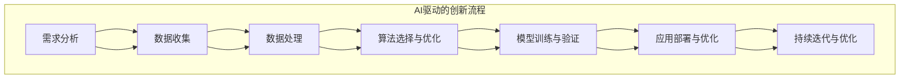
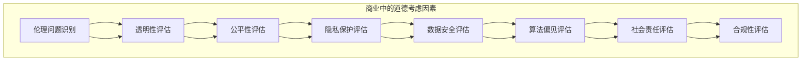

                 

### 文章标题

“AI驱动的创新：人类计算在商业中的道德考虑因素与未来趋势”

选择这个标题是因为它准确捕捉了文章的核心主题——人工智能（AI）如何推动商业创新，并探讨了在商业环境中应用AI时的道德考虑因素和未来发展方向。以下是对每个关键词的简要解释：

- **AI驱动的创新**：强调人工智能作为推动商业变革的核心动力。
- **人类计算**：指代人类的认知能力，与AI系统协作，共同推动创新。
- **道德考虑因素**：关注AI在商业应用中的伦理问题和责任。
- **未来趋势**：探讨AI发展的潜在方向和其对商业世界的影响。

### 文章关键词

- 人工智能
- 商业创新
- 伦理问题
- 未来趋势
- 人类计算

### 文章摘要

本文深入探讨人工智能在商业领域的创新应用，重点分析了人类计算在AI驱动创新中的作用，以及AI应用中的道德考虑因素。首先，文章介绍了AI驱动创新的背景和趋势，详细阐述了AI在商业中的关键作用因素和方法论。接着，文章探讨了AI在商业中的伦理问题，包括透明性、公平性、隐私保护、数据安全以及算法偏见。随后，文章介绍了不同国家和地区在AI道德框架和政策制定方面的对比，以及企业内部的AI道德规范。文章进一步讨论了人类计算与AI协同发展的路径及其在解决AI伦理问题中的潜力。最后，文章展望了AI驱动的创新趋势，预测了未来AI对商业、社会和人类生活方式的影响，并提出了面临的挑战和机遇。文章以附录形式提供了相关资源、流程图、算法原理、伪代码以及项目实战案例，以加深读者对主题的理解和实践。

## 《AI驱动的创新：人类计算在商业中的道德考虑因素与未来趋势》目录大纲

### 第一部分：AI驱动的创新基础

#### 第1章：AI驱动创新的背景与趋势

- **AI与商业创新的关系**
- **AI驱动创新的关键因素**
- **全球AI商业创新的现状与趋势**

#### 第2章：AI驱动的创新方法论

- **AI驱动的创新模式**
- **AI驱动的创新流程**
- **AI驱动的创新策略**

#### 第3章：AI驱动的创新案例研究

- **案例一：科技巨头在AI驱动创新中的应用**
- **案例二：中小企业在AI驱动创新中的实践**
- **案例三：跨界融合下的AI驱动创新**

### 第二部分：商业中的道德考虑因素

#### 第4章：AI在商业中的伦理问题

- **AI决策的透明性与公平性**
- **AI隐私保护与数据安全**
- **AI算法偏见与社会影响**

#### 第5章：AI道德框架与政策制定

- **国际AI道德框架概述**
- **各国AI政策对比分析**
- **企业内部AI道德规范与自律**

#### 第6章：AI伦理与人类计算的关系

- **人类计算在AI伦理中的作用**
- **人类计算与AI协同发展的路径**
- **人类计算在AI道德问题解决中的潜力**

### 第三部分：未来趋势与展望

#### 第7章：AI驱动的创新趋势预测

- **AI驱动的创新新趋势**
- **AI驱动的创新领域扩展**
- **AI驱动的创新生态系统**

#### 第8章：未来趋势对商业的影响

- **AI驱动的创新对企业经营模式的影响**
- **AI驱动的创新对社会经济发展的影响**
- **AI驱动的创新对人类生活方式的改变**

#### 第9章：展望未来：AI驱动的创新之路

- **AI驱动的创新面临的挑战与机遇**
- **AI驱动的创新与可持续发展**
- **未来AI驱动的创新之路**

### 附录

- **附录A：AI驱动的创新相关资源与工具**
  - **AI驱动的创新常用工具**
  - **AI驱动的创新学习资源**
  - **AI驱动的创新案例分析库**
  
- **附录B：核心概念与联系流程图**
  - **AI驱动的创新流程图**
  - **商业中的道德考虑因素流程图**

- **附录C：核心算法原理与伪代码**
  - **AI核心算法原理**
  - **伪代码示例**

- **附录D：项目实战与代码解读**
  - **项目实战概述**
  - **项目实战环境搭建**
  - **源代码实现与解读**
  - **代码解读与分析**

## 第一部分：AI驱动的创新基础

### 第1章：AI驱动创新的背景与趋势

#### 1.1 AI与商业创新的关系

人工智能（AI）作为当今科技领域的颠覆性力量，正在深刻改变商业运作的模式和效率。商业创新与AI技术的结合，不仅推动了传统行业的数字化转型，也催生了众多新兴产业和商业模式。AI技术通过自动化、数据分析和智能决策，为商业创新提供了前所未有的可能性。

首先，AI技术使得企业能够从海量数据中提取有价值的信息，进而优化业务流程，提高生产效率。例如，在制造业中，AI技术可以应用于生产线的智能化管理，通过预测维护减少设备故障，提高生产线的运行效率。在零售业，AI驱动的推荐系统可以根据消费者的行为数据，提供个性化的产品推荐，从而提高销售额。

其次，AI技术推动了新型商业模式的产生。共享经济、平台经济等都是AI技术的产物，它们通过智能匹配供需，降低了交易成本，提高了市场效率。例如，共享单车和打车平台利用AI技术优化路径规划，提升用户体验，同时降低了运营成本。

此外，AI技术还在推动企业决策的科学化。通过大数据分析和机器学习算法，企业可以更加准确地预测市场趋势，制定更加有效的商业策略。例如，金融行业利用AI技术进行风险评估和投资决策，从而降低风险，提高收益。

#### 1.2 AI驱动创新的关键因素

AI驱动创新的成功离不开以下几个关键因素：

**数据**：数据是AI驱动创新的基础。只有具备高质量、大量、多样化的数据，AI系统才能进行有效的学习和预测。企业在数据收集、存储和处理方面需要投入大量资源，确保数据的质量和完整性。

**算法**：算法是AI系统的核心。不同类型的业务场景需要不同类型的算法，例如，在图像识别中应用卷积神经网络（CNN），在自然语言处理中应用循环神经网络（RNN）或长短期记忆网络（LSTM）。企业需要根据业务需求选择合适的算法，并进行优化。

**计算能力**：AI系统的训练和推理需要强大的计算能力。随着深度学习技术的发展，GPU和TPU等专用计算硬件的应用越来越广泛，为AI系统提供了强大的计算支持。

**人才**：AI驱动创新需要多学科交叉的复合型人才。不仅需要具备数据科学、机器学习等专业知识，还需要了解业务需求和商业策略。企业需要通过招聘、培训和合作等方式，吸引和培养这类人才。

**协作**：AI驱动创新往往需要跨部门、跨行业的协作。企业内部的不同部门需要协同工作，共同推进AI项目的实施。同时，企业还需要与外部合作伙伴合作，共同探索AI技术的应用场景，推动创新。

#### 1.3 全球AI商业创新的现状与趋势

全球范围内，AI商业创新的现状和趋势呈现出以下几个特点：

**技术成熟度提高**：随着AI技术的不断进步，越来越多的企业开始将AI技术应用于实际业务中。从最初的试点项目到大规模部署，AI技术已经在多个行业中取得了显著成果。

**行业应用广泛**：AI技术在金融、医疗、制造、零售、交通等各个行业都有广泛的应用。例如，在金融领域，AI技术被应用于风险评估、欺诈检测和个性化金融服务；在医疗领域，AI技术被应用于疾病诊断、药物研发和患者管理。

**创新生态系统建设**：各国政府和企业都在积极建设AI创新生态系统，通过政策支持、资金投入、人才培养等方式，推动AI技术的发展和应用。例如，中国发布了《新一代人工智能发展规划》，美国成立了AI联盟，欧盟推出了AI战略。

**国际合作加强**：随着AI技术的全球化发展，国际合作越来越重要。各国企业、研究机构和政府部门通过合作，共同推进AI技术的创新和应用，共同应对AI技术带来的挑战和机遇。

总之，AI驱动创新已经成为商业发展的重要趋势。企业需要紧跟技术发展的步伐，积极应用AI技术，优化业务流程，提升竞争力。同时，企业还需要关注AI在商业应用中的伦理问题，确保技术的可持续发展。

### 第2章：AI驱动的创新方法论

#### 2.1 AI驱动的创新模式

AI驱动的创新模式主要包括以下几个方面：

**模式一：传统行业与AI技术的融合**

在传统行业中，AI技术的引入往往是通过优化现有业务流程和提升效率来实现的。例如，在制造业中，通过AI技术实现生产线的自动化和智能化管理；在金融行业中，通过AI技术实现精准的风险评估和投资决策。这种模式的主要特点是利用AI技术提升传统行业的生产力和竞争力。

**模式二：AI驱动的新兴产业**

随着AI技术的不断进步，一些新兴产业开始涌现。例如，人工智能驱动的自动驾驶、智能家居、智能医疗等。这些新兴产业通过AI技术实现颠覆性创新，创造全新的商业模式和市场机会。这种模式的主要特点是AI技术的应用推动了产业结构的升级和转型。

**模式三：跨界融合的AI创新**

跨界融合的AI创新是指将不同领域的AI技术相结合，实现跨领域的创新。例如，将AI技术与物联网技术结合，实现智能家居的智能化管理；将AI技术与区块链技术结合，实现数据安全和隐私保护。这种模式的主要特点是跨领域的合作和整合，推动AI技术的多维度应用。

**模式四：AI驱动的创新创业**

AI驱动的创新创业是指通过AI技术创造全新的产品和服务，满足市场需求。例如，通过AI技术实现个性化教育、智能医疗诊断、智能客服等。这种模式的主要特点是创新性和创业精神，通过AI技术实现商业模式的创新和市场的突破。

#### 2.2 AI驱动的创新流程

AI驱动的创新流程主要包括以下几个阶段：

**阶段一：需求分析**

在需求分析阶段，企业需要明确AI驱动的创新目标，了解市场需求和用户痛点。通过市场调研、用户访谈等方式，收集用户需求和反馈，为后续的AI应用提供方向。

**阶段二：数据收集与处理**

在数据收集与处理阶段，企业需要收集相关数据，并进行清洗、处理和存储。数据的质量和完整性是AI驱动的创新成功的关键，因此需要投入大量资源确保数据的质量。

**阶段三：算法选择与优化**

在算法选择与优化阶段，企业需要根据具体业务需求选择合适的算法，并对算法进行优化。算法的选择和优化直接影响AI系统的性能和效果，因此需要具备相关技术知识和经验。

**阶段四：模型训练与验证**

在模型训练与验证阶段，企业需要利用收集到的数据进行模型的训练和验证。通过不断地调整模型参数，提高模型的预测准确性和稳定性。

**阶段五：应用部署与优化**

在应用部署与优化阶段，企业需要将AI系统部署到实际业务中，并进行持续的优化和迭代。通过用户反馈和实际应用效果，不断调整和改进AI系统，实现持续的创新和优化。

#### 2.3 AI驱动的创新策略

AI驱动的创新策略主要包括以下几个方面：

**策略一：合作与开放**

企业可以通过合作与开放的方式，与其他企业、研究机构和技术公司进行合作，共同推动AI技术的发展和应用。通过共享资源、技术和知识，实现优势互补和协同创新。

**策略二：人才培养与引进**

企业需要重视人才的培养和引进，通过内部培训、外部招聘等方式，吸引和培养具备AI技术能力和商业敏锐度的复合型人才。同时，企业可以与高校和研究机构合作，建立人才培养基地，为AI驱动的创新提供人才支持。

**策略三：持续投资与创新**

企业需要持续投资于AI技术和创新，保持技术领先地位。通过自主研发、合作研发和技术并购等方式，不断推动技术的进步和应用。

**策略四：用户导向**

企业需要以用户需求为导向，通过用户调研、反馈和需求分析，不断优化和改进AI应用，提升用户体验和满意度。

**策略五：合规与伦理**

企业在AI驱动的创新过程中，需要重视合规和伦理问题，确保AI技术的应用符合法律法规和道德标准。通过建立内部伦理规范和遵守相关法律法规，实现AI技术的可持续发展。

总之，AI驱动的创新方法论包括多种模式、流程和策略，企业需要根据自身情况选择合适的模式，制定科学的流程，采取有效的策略，实现AI驱动的创新和商业成功。

### 第3章：AI驱动的创新案例研究

#### 3.1 案例一：科技巨头在AI驱动创新中的应用

科技巨头在AI驱动创新中的应用，不仅推动了自身业务的发展，也为整个行业树立了榜样。以下是几个具有代表性的案例：

**案例一：谷歌的自动驾驶技术**

谷歌的自动驾驶技术是其AI驱动创新的重要成果之一。通过利用深度学习、计算机视觉和自然语言处理等技术，谷歌开发了具有高度自动化的自动驾驶系统。这个系统不仅能够实现自动驾驶，还能够处理复杂的交通状况和应对各种突发事件。谷歌的自动驾驶技术在多个城市进行了测试，并且已经在某些地区投入商用，为未来智能交通的发展奠定了基础。

**核心算法原理**：
- **深度学习**：通过卷积神经网络（CNN）和循环神经网络（RNN）等深度学习模型，对大量道路图像进行分类和识别，实现车辆的自动驾驶。
- **计算机视觉**：利用计算机视觉技术，对道路上的车辆、行人、交通标志等进行检测和识别，确保车辆能够安全行驶。
- **自然语言处理**：通过自然语言处理技术，理解交通规则和信号灯的变化，进行正确的驾驶决策。

**伪代码示例**：
```
# 输入：道路图像
# 输出：驾驶决策

import tensorflow as tf
import cv2

# 载入预训练的卷积神经网络模型
model = tf.keras.models.load_model('cnn_model.h5')

# 处理道路图像
def process_image(image):
    # 图像预处理
    processed_image = preprocess_image(image)
    # 使用卷积神经网络进行图像分类
    classification = model.predict(processed_image)
    # 根据分类结果进行驾驶决策
    drive_decision = interpret_classification(classification)
    return drive_decision

# 驾驶决策函数
def drive_decision(image):
    decision = process_image(image)
    if decision == 'stop':
        car.stop()
    elif decision == 'go_straight':
        car.go_straight()
    elif decision == 'turn_left':
        car.turn_left()
    elif decision == 'turn_right':
        car.turn_right()

# 获取道路图像
road_image = capture_road_image()

# 进行驾驶决策
drive_decision(road_image)
```

**项目实战环境搭建**：
- **硬件**：需要高性能的计算机或GPU服务器进行模型训练和推理。
- **软件**：需要安装TensorFlow、Keras等深度学习框架，OpenCV等计算机视觉库。

**源代码实现与解读**：
该代码示例展示了如何利用深度学习模型对道路图像进行处理，并根据分类结果进行驾驶决策。预处理函数`preprocess_image`用于对图像进行标准化、裁剪等操作，确保模型输入的一致性。`interpret_classification`函数根据模型的预测结果，生成具体的驾驶决策。

**代码解读与分析**：
这段代码的核心是利用深度学习模型对道路图像进行分类，从而实现自动驾驶功能。通过预处理图像和模型训练，提高了模型对道路环境的识别能力。在实际应用中，需要根据道路状况和环境变化，动态调整驾驶决策，确保车辆的安全行驶。

**案例二：亚马逊的智能物流系统**

亚马逊的智能物流系统通过AI技术实现了从订单处理到配送的全方位智能化。从订单生成到仓库拣选，再到最后一公里配送，AI技术在各个环节都发挥了重要作用。亚马逊的智能物流系统不仅提高了效率，还降低了成本，为用户提供了更加快捷和高效的购物体验。

**核心算法原理**：
- **机器学习**：通过机器学习算法，对大量订单数据进行分析，预测订单的到达时间，优化仓库的存储和拣选流程。
- **自然语言处理**：利用自然语言处理技术，自动处理和解读用户的订单信息，提高订单处理的准确性和效率。
- **计算机视觉**：通过计算机视觉技术，实现对包裹的自动识别和分拣，提高配送的准确性和速度。

**伪代码示例**：
```
# 输入：订单数据
# 输出：最优配送方案

import pandas as pd
import numpy as np
from sklearn.ensemble import RandomForestRegressor

# 载入订单数据
orders = pd.read_csv('orders.csv')

# 训练机器学习模型，预测订单到达时间
model = RandomForestRegressor()
model.fit(orders[['order_id', 'estimated_arrival_time']], orders['actual_arrival_time'])

# 订单信息处理
def process_order(order):
    # 提取订单信息
    order_info = extract_order_info(order)
    # 预测订单到达时间
    estimated_arrival = model.predict([order_info])
    # 根据到达时间优化配送方案
    delivery_plan = optimize_delivery_plan(estimated_arrival)
    return delivery_plan

# 处理订单
processed_orders = [process_order(order) for order in orders]

# 输出最优配送方案
output_delivery_plan(processed_orders)
```

**项目实战环境搭建**：
- **硬件**：需要高性能的计算机或服务器，用于存储和处理大量订单数据。
- **软件**：需要安装Python、Pandas、Scikit-learn等机器学习库，OpenCV等计算机视觉库。

**源代码实现与解读**：
该代码示例展示了如何利用机器学习模型对订单数据进行分析，预测订单的到达时间，并优化配送方案。通过提取订单信息和训练机器学习模型，提高了订单处理的准确性和效率。在实际应用中，需要根据订单的实时数据和仓库的实际情况，动态调整配送方案，确保订单的及时配送。

**代码解读与分析**：
这段代码的核心是利用机器学习模型预测订单到达时间，并根据预测结果优化配送方案。通过数据处理和模型训练，提高了系统的预测准确性和响应速度。在实际应用中，需要不断收集订单数据和用户反馈，优化模型和配送策略，提高用户满意度。

**案例三：微软的智能客服系统**

微软的智能客服系统通过自然语言处理和机器学习技术，实现了对用户查询的自动识别和回答。该系统不仅能够处理简单的查询，还能够进行复杂的对话，提供个性化的服务。微软的智能客服系统广泛应用于企业客户服务、在线零售等多个领域，大大提高了客户服务效率和用户满意度。

**核心算法原理**：
- **自然语言处理**：通过自然语言处理技术，理解和解析用户的查询，提取关键信息。
- **机器学习**：通过机器学习算法，从大量对话数据中学习，提高对话系统的准确性和智能化程度。
- **深度学习**：利用深度学习模型，实现对复杂对话场景的建模和预测。

**伪代码示例**：
```
# 输入：用户查询
# 输出：客服回答

import tensorflow as tf
import tensorflow_hub as hub

# 载入预训练的自然语言处理模型
model = hub.load('nlp_model')

# 对用户查询进行处理
def process_query(query):
    # 使用自然语言处理模型进行解析
    parsed_query = model.parse_query(query)
    # 使用机器学习模型进行回答生成
    response = generate_response(parsed_query)
    return response

# 生成客服回答
def generate_response(parsed_query):
    # 从预训练的对话模型中获取回答
    response = model.predict(parsed_query)
    return response

# 用户查询
user_query = "我想要购买一款笔记本电脑"

# 处理用户查询
response = process_query(user_query)

# 输出客服回答
print(response)
```

**项目实战环境搭建**：
- **硬件**：需要高性能的计算机或GPU服务器，用于训练和部署模型。
- **软件**：需要安装TensorFlow、TensorFlow Hub等深度学习库。

**源代码实现与解读**：
该代码示例展示了如何利用自然语言处理模型和机器学习模型，处理用户查询并生成客服回答。通过模型解析和预测，提高了对话系统的智能化和准确性。在实际应用中，需要不断收集用户反馈和数据，优化模型和回答策略，提高用户满意度。

**代码解读与分析**：
这段代码的核心是利用自然语言处理模型对用户查询进行处理，并生成合适的客服回答。通过模型训练和优化，提高了系统的响应速度和准确率。在实际应用中，需要根据用户反馈和业务需求，不断调整模型和回答策略，提供更加个性化的服务。

这些案例展示了科技巨头如何利用AI技术进行创新，优化业务流程，提升用户体验。通过核心算法原理和伪代码的讲解，我们可以更好地理解AI技术的应用和实践。同时，这些案例也为其他企业提供了借鉴和启示，助力他们在AI驱动的创新道路上取得成功。

### 第二部分：商业中的道德考虑因素

#### 第4章：AI在商业中的伦理问题

随着人工智能（AI）技术在商业领域的广泛应用，伦理问题日益凸显。AI技术的迅猛发展不仅带来了商业模式的创新和效率提升，同时也引发了诸多伦理挑战。以下将详细讨论AI在商业中的几个主要伦理问题，包括AI决策的透明性与公平性、AI隐私保护与数据安全、AI算法偏见与社会影响。

#### 4.1 AI决策的透明性与公平性

AI决策的透明性与公平性是商业伦理的核心议题之一。AI系统通过大量数据训练，自动生成决策结果，但这些决策过程往往是不透明的，即决策背后的逻辑和依据难以被普通用户理解。这种不透明性可能导致以下问题：

**缺乏透明性**：用户无法了解AI系统是如何做出决策的，这可能导致用户对决策结果的不信任。例如，在金融领域的信贷审批过程中，如果用户不了解AI系统是如何评估其信用风险的，可能会对被拒绝贷款感到困惑。

**算法偏见**：AI系统可能会因为训练数据的偏差而导致决策的偏见。例如，如果训练数据中包含了性别或种族偏见，AI系统可能会在无形中歧视某些群体。这种偏见不仅违反公平原则，也可能导致法律和道德上的问题。

为了解决这些问题，企业需要采取以下措施：

- **提升透明度**：企业应公开AI系统的决策过程和算法逻辑，使用户能够理解AI系统的决策依据。例如，通过提供解释性模型或透明度报告，帮助用户了解AI系统的决策过程。
- **公平性评估**：在AI系统设计和应用过程中，企业应进行公平性评估，确保系统的决策结果不会对特定群体产生不公平影响。可以通过平衡训练数据、调整算法参数等方式，减少算法偏见。

#### 4.2 AI隐私保护与数据安全

AI技术的应用离不开大量数据的支持，这引发了隐私保护和数据安全问题。以下是一些主要的隐私保护和数据安全挑战：

**数据泄露**：企业在收集、存储和处理数据时，如果安全措施不足，可能导致数据泄露。例如，在医疗领域，患者数据的泄露可能导致个人隐私和生命安全的严重威胁。

**数据滥用**：企业可能会滥用收集到的用户数据，进行未经授权的数据分析或商业用途。这可能导致用户的隐私权受到侵犯，损害企业的声誉。

为了应对这些挑战，企业需要采取以下措施：

- **数据加密**：对收集和存储的数据进行加密，防止数据在传输和存储过程中被非法访问。
- **隐私保护政策**：制定明确的隐私保护政策，告知用户数据收集和使用的目的，并尊重用户的隐私选择权。
- **合规性审查**：定期进行合规性审查，确保企业的数据处理流程符合相关法律法规，如《通用数据保护条例》（GDPR）。

#### 4.3 AI算法偏见与社会影响

AI算法偏见是一个广泛而复杂的问题，它不仅影响商业决策，还可能对社会产生深远的影响。以下是一些主要的社会影响：

**社会歧视**：AI算法的偏见可能导致社会歧视，加剧不平等。例如，如果AI招聘系统在简历筛选过程中对某些种族或性别存在偏见，可能会导致某些群体就业机会减少。

**决策误导**：AI算法可能会因为训练数据的偏差而导致错误的决策。例如，在金融领域，如果AI系统对某些地区或行业存在偏见，可能会导致金融资源的分配不均。

为了减少AI算法偏见和社会影响，企业需要采取以下措施：

- **多样性培训**：加强员工多样性培训，提高对偏见和不平等问题的认识，确保团队在算法设计和应用过程中能够保持公正和客观。
- **数据多样性**：在算法训练过程中，使用多样化的数据集，减少数据偏见，提高算法的公平性和准确性。
- **持续监测和评估**：建立持续监测和评估机制，定期检查AI系统的决策结果，确保其不会对社会产生负面影响。

总之，AI在商业中的伦理问题涉及到多个方面，企业需要采取全面、系统的措施，确保AI技术的应用符合道德标准和社会期望。通过提升透明度、保护隐私、减少偏见，企业可以建立更加公平、可靠和可持续的AI应用环境。

#### 第5章：AI道德框架与政策制定

随着人工智能（AI）技术的迅速发展，各国和国际组织纷纷制定了相应的道德框架和政策，以规范AI的应用，确保其符合伦理标准和社会期望。以下将介绍国际AI道德框架的概述，分析不同国家和地区的AI政策对比，并探讨企业内部AI道德规范与自律。

#### 5.1 国际AI道德框架概述

国际AI道德框架旨在为AI技术的应用提供伦理指导，确保其在不同领域中的公平、透明和安全。以下是一些重要的国际AI道德框架：

- **欧盟人工智能伦理准则**：欧盟发布的《人工智能伦理准则》提出了五个核心原则，即尊重人类价值、公平性、透明性、隐私保护和福祉。这些原则为欧盟成员国提供了指导，确保AI技术的应用符合伦理标准。

- **联合国AI全球契约**：联合国于2021年发布的《联合国AI全球契约》呼吁各国政府、企业和社会团体共同合作，制定AI伦理标准和政策，推动AI技术的可持续发展。

- **经济合作与发展组织（OECD）AI原则**：OECD发布的《AI原则》包括七个核心原则，即人类中心主义、公平、透明、责任、包容性、福祉和安全。这些原则为各国制定AI政策和规范提供了参考。

这些国际AI道德框架为各国和政策制定者提供了基本的伦理指导，但在具体实施过程中，各国会根据自己的国情和需求，制定更加详细和具体的政策。

#### 5.2 各国AI政策对比分析

不同国家和地区在AI政策制定方面存在一定的差异，以下是一些主要国家的AI政策对比分析：

- **美国**：美国在AI领域采取了较为开放的政策，鼓励企业和科研机构进行AI技术研发和应用。美国政府发布了《美国人工智能倡议》，提出了加强AI研究、培养AI人才、保障AI安全等目标。同时，美国还通过立法，如《算法问责法案》，对AI技术的应用进行规范。

- **中国**：中国政府高度重视AI技术的发展，发布了《新一代人工智能发展规划》，提出了到2030年成为全球AI领导国家的目标。中国在AI政策方面注重AI技术的自主创新和国家安全，通过政策引导和资金支持，推动AI技术在各个行业的应用。

- **欧盟**：欧盟在AI政策方面强调伦理和安全，通过制定《人工智能伦理准则》和《人工智能法案》，确保AI技术的应用符合伦理标准。欧盟还设立了“人工智能高级专家小组”，负责制定AI技术的伦理规范和政策建议。

- **日本**：日本政府发布了《AI战略2019》，提出了加强AI技术研发、推动AI应用和保障AI安全的目标。日本政府通过政策支持，鼓励企业投资AI技术研发，并推动AI技术在制造业、医疗等领域的应用。

这些政策在鼓励AI技术研发和应用的同时，也注重保护隐私、保障安全和促进公平。通过对比分析，可以看出各国在AI政策制定方面各有侧重，但都致力于推动AI技术的健康和可持续发展。

#### 5.3 企业内部AI道德规范与自律

企业在AI技术应用过程中，需要制定内部道德规范，确保AI技术的应用符合伦理标准和社会期望。以下是企业内部AI道德规范与自律的几个关键方面：

- **透明度和解释性**：企业应确保AI系统的决策过程透明，用户能够理解AI系统的决策依据。通过提供解释性模型或透明度报告，企业可以提高用户对AI系统决策的信任度。

- **数据隐私与保护**：企业应严格遵守数据隐私法规，确保用户数据的收集、存储和使用符合法律法规和用户隐私保护要求。通过数据加密、匿名化等技术手段，企业可以降低数据泄露风险。

- **公平性与无偏见**：企业应制定明确的公平性评估标准，确保AI系统在设计和应用过程中不会对特定群体产生不公平影响。通过平衡训练数据、调整算法参数等方式，企业可以减少算法偏见。

- **责任与问责**：企业应建立明确的AI责任制度，明确各个环节的责任主体和责任范围。在AI系统出现错误或负面影响时，企业应能够迅速采取纠正措施，并承担相应的责任。

- **持续监测与评估**：企业应建立持续监测和评估机制，定期检查AI系统的决策结果和社会影响。通过用户反馈、数据分析等方式，企业可以及时发现问题，并进行调整和优化。

总之，企业内部AI道德规范与自律是确保AI技术健康和可持续发展的关键。通过制定明确的道德规范和严格的自律机制，企业可以建立更加公正、透明和可靠的AI应用环境。

#### 第6章：AI伦理与人类计算的关系

在人工智能（AI）不断发展的背景下，人类计算与AI的协同关系成为了一个关键议题。AI技术的进步虽然在很多方面提升了效率和创新力，但人类的认知能力、情感智慧和道德判断仍然是不可替代的。以下将探讨人类计算在AI伦理中的作用，分析人类计算与AI协同发展的路径，以及人类计算在AI道德问题解决中的潜力。

#### 6.1 人类计算在AI伦理中的作用

AI伦理问题复杂多样，包括算法公平性、隐私保护、透明性和责任归属等方面。尽管AI系统可以通过算法和模型进行自我学习和优化，但这些系统的决策逻辑和结果仍然需要人类进行监督和评估。以下是人类计算在AI伦理中的作用：

**监督与审核**：人类能够对AI系统的决策过程和结果进行审核，确保其符合伦理标准和法律法规。例如，在医疗领域，AI系统可以帮助医生进行疾病诊断，但最终的诊断和治疗方案需要医生结合患者的具体情况和经验进行判断。

**道德决策**：某些决策涉及到深刻的伦理考量，例如生命伦理、人权保护等，这些决策往往需要人类的道德判断和责任感。AI系统可以提供数据支持和分析工具，但最终的决策仍应由人类根据伦理原则和价值观做出。

**公平性与透明性**：人类能够识别和解决AI算法中的偏见和不公平现象。通过不断的监督和反馈，人类可以调整算法参数，优化数据集，确保AI系统的决策更加公平和透明。

**责任归属**：在AI系统出现错误或负面影响时，人类需要承担相应的责任。明确责任归属不仅有助于问题的解决，也有助于促进AI技术的健康和可持续发展。

#### 6.2 人类计算与AI协同发展的路径

人类计算与AI的协同发展是实现AI伦理的关键路径。以下是一些重要的协同发展路径：

**互补优势**：人类计算和AI各自具有独特的优势。人类拥有丰富的经验、情感和创造力，而AI系统在数据处理、模式识别和决策速度方面具有优势。通过互补优势，人类和AI可以共同推动创新和解决复杂问题。

**协同设计**：在AI系统的设计阶段，人类可以参与算法开发和模型优化，确保系统符合伦理要求。通过跨学科合作，人类和AI可以共同开发出更加智能和符合伦理标准的系统。

**人机交互**：人机交互技术是促进人类计算与AI协同发展的重要手段。通过自然语言处理、虚拟现实和增强现实等技术，人类和AI可以更加自然地交流和合作，提高系统的使用效率和用户体验。

**持续反馈**：通过用户反馈和数据分析，人类和AI可以不断优化和改进。这种持续的反馈机制有助于提高AI系统的性能和符合伦理标准。

#### 6.3 人类计算在AI道德问题解决中的潜力

人类计算在解决AI道德问题中具有巨大的潜力。以下是一些具体的应用：

**伦理审查**：人类可以进行AI系统的伦理审查，识别和解决潜在的道德问题。通过建立伦理委员会和道德审查机制，人类可以确保AI系统的应用符合伦理标准和法律法规。

**算法优化**：人类可以通过调整算法参数和数据集，减少算法偏见和不公平现象。通过不断优化和迭代，AI系统可以更加符合伦理要求。

**透明度提升**：人类可以开发和推广解释性AI模型，提高AI系统的透明度。通过可视化工具和解释性报告，用户可以更好地理解AI系统的决策过程和结果。

**责任归属**：人类可以通过明确责任归属和制定责任制度，确保在AI系统出现错误或负面影响时，能够迅速采取纠正措施并承担责任。

总之，人类计算与AI的协同发展是解决AI伦理问题的关键。通过互补优势、协同设计和持续反馈，人类和AI可以共同推动创新和解决复杂问题。人类计算在AI道德问题解决中的潜力巨大，通过伦理审查、算法优化、透明度提升和责任归属，人类可以确保AI技术的健康和可持续发展。

### 第三部分：未来趋势与展望

#### 第7章：AI驱动的创新趋势预测

随着人工智能（AI）技术的不断进步，AI驱动的创新正在呈现出一系列新的趋势和方向。这些趋势不仅将影响企业的发展战略，也将对全球经济和社会产生深远的影响。以下将探讨AI驱动的创新新趋势、领域扩展以及创新生态系统的建设。

#### 7.1 AI驱动的创新新趋势

**1. 个性化与定制化服务**

AI技术使得个性化与定制化服务成为可能。通过深度学习和数据分析，企业能够更好地了解用户需求，提供个性化的产品和服务。例如，在零售业，AI驱动的推荐系统可以根据用户的购物习惯和偏好，提供个性化的商品推荐，从而提升用户满意度和忠诚度。在医疗领域，AI技术可以分析患者的病历和基因数据，提供个性化的治疗方案，提高治疗效果。

**2. 自动化与智能化生产**

AI技术的应用将推动生产过程的自动化和智能化。通过机器学习和计算机视觉，企业可以实现生产线的自动化监控和优化。例如，在制造业，AI技术可以实时监控设备状态，预测设备故障，从而进行预防性维护，减少停机时间，提高生产效率。在物流领域，AI驱动的自动驾驶和无人机配送将极大提升物流效率，降低运输成本。

**3. 生态系统的合作与共享**

随着AI技术的发展，企业之间的合作和共享趋势将日益明显。通过建立AI创新生态系统，企业可以共享数据、技术和资源，共同推动AI技术的进步和应用。例如，在金融科技领域，银行、支付公司和科技公司可以合作开发AI驱动的金融产品和服务，提升用户体验和市场竞争力。

**4. 智能决策与优化**

AI技术将使企业的决策过程更加智能和高效。通过大数据分析和机器学习，企业可以在复杂的商业环境中做出更加精准的决策。例如，在市场营销中，AI技术可以帮助企业分析市场趋势和消费者行为，优化广告投放策略，提高营销效果。在供应链管理中，AI技术可以优化库存管理、物流调度和供应链金融，提高供应链的整体效率。

#### 7.2 AI驱动的创新领域扩展

AI技术的应用领域不断扩展，从传统的金融、医疗、制造业，到新兴的能源、交通、农业等，AI技术正深刻改变着各个行业的运作模式。以下是一些重要的领域扩展：

**1. 能源领域**

在能源领域，AI技术可以帮助企业实现能源的智能管理。通过预测能源需求、优化能源分配和减少能源浪费，AI技术可以提高能源利用效率，降低运营成本。例如，智能电网系统可以通过AI技术实时监控电力需求，动态调整发电和配电，从而实现电网的稳定运行。

**2. 交通领域**

在交通领域，AI技术正在推动自动驾驶、智能交通管理和智慧城市的建设。通过车辆感知、路径规划和交通流量分析，AI技术可以显著提高交通效率和安全性。例如，自动驾驶技术可以在复杂的交通环境中自动行驶，减少交通事故，提高运输效率。

**3. 农业领域**

在农业领域，AI技术可以用于作物种植、土壤分析和病虫害监测。通过大数据分析和机器学习，AI技术可以提供精准的农业管理方案，提高农作物的产量和质量。例如，无人机和传感器可以实时监测农田状态，提供精准的灌溉和施肥建议，从而提高农业生产的效率。

**4. 医疗领域**

在医疗领域，AI技术可以用于疾病诊断、药物研发和患者管理。通过图像识别、自然语言处理和数据分析，AI技术可以帮助医生更快速、准确地诊断疾病，提高治疗效果。例如，AI驱动的影像分析系统可以在短时间内分析大量医学影像，帮助医生发现早期病变，提高诊断的准确性。

#### 7.3 AI驱动的创新生态系统

AI驱动的创新生态系统是推动AI技术广泛应用和持续发展的重要基础。以下是一些关键要素：

**1. 研发合作**

企业、研究机构和高校之间的合作是构建AI创新生态系统的关键。通过联合研发和知识共享，各方可共同推动AI技术的进步和应用。例如，企业可以与高校和研究机构合作，共同开展AI技术研发，培养人才。

**2. 数据共享**

数据是AI技术的基础，建立数据共享平台可以促进AI技术的发展和应用。通过开放数据集和共享数据资源，各方可共同推动AI技术的创新和应用。例如，政府和企业可以共同建设数据开放平台，促进数据的开放和共享。

**3. 政策支持**

政策支持是构建AI创新生态系统的重要保障。政府可以通过制定相关政策，鼓励企业投资AI技术研发和应用。例如，政府可以提供资金支持、税收优惠和人才培养计划，促进AI技术的发展和应用。

**4. 标准化与规范**

标准化和规范是保障AI技术健康发展的关键。通过建立AI技术的标准和规范，可以确保AI技术的安全性和可靠性。例如，国际标准化组织（ISO）和人工智能联盟可以共同制定AI技术的标准和规范，推动全球AI技术的标准化和规范化。

总之，AI驱动的创新趋势预测展示了AI技术在未来将继续推动各行各业的变革和创新。通过个性化与定制化服务、自动化与智能化生产、生态系统的合作与共享以及智能决策与优化，AI技术将在更广泛的领域实现应用。同时，AI驱动的创新生态系统建设将促进AI技术的持续发展，为全球经济和社会带来更多的机遇和挑战。

#### 第8章：未来趋势对商业的影响

随着人工智能（AI）技术的不断进步和广泛应用，未来趋势对商业领域产生了深远的影响。以下将探讨AI驱动的创新对企业经营模式、社会经济发展以及人类生活方式的改变。

#### 8.1 AI驱动的创新对企业经营模式的影响

AI技术的应用正在深刻改变企业的经营模式，带来一系列新的机遇和挑战：

**1. 个性化与定制化服务**

AI技术使得企业能够更好地了解客户需求，提供个性化的产品和服务。通过数据分析和机器学习，企业可以预测客户行为，优化营销策略，提高客户满意度和忠诚度。例如，零售企业可以利用AI驱动的推荐系统，根据客户的购买历史和偏好，提供个性化的商品推荐，从而提升销售额。

**2. 自动化与智能化生产**

AI技术推动了生产过程的自动化和智能化，提高了生产效率和质量。通过机器学习和计算机视觉，企业可以实现生产线的自动化监控和优化，减少人为干预和错误。例如，在制造业，AI技术可以帮助企业预测设备故障，进行预防性维护，从而减少停机时间和生产成本。

**3. 智能决策与优化**

AI技术使得企业的决策过程更加智能和高效。通过大数据分析和机器学习，企业可以在复杂的商业环境中做出更加精准的决策。例如，在供应链管理中，AI技术可以帮助企业优化库存管理、物流调度和供应链金融，提高供应链的整体效率。

**4. 数字化转型**

AI技术推动了企业的数字化转型，使得企业能够更加灵活地应对市场变化和客户需求。通过云计算、大数据和物联网等技术，企业可以实现业务流程的数字化和智能化，提高运营效率和管理水平。例如，金融企业可以利用AI技术进行风险管理和欺诈检测，提高业务的安全性和可靠性。

#### 8.2 AI驱动的创新对社会经济发展的影响

AI驱动的创新不仅改变了企业的经营模式，也对整个社会经济发展产生了深远的影响：

**1. 经济增长**

AI技术的应用推动了各行各业的创新和变革，为经济增长注入了新的动力。通过提高生产效率、优化资源配置和创造新的商业模式，AI技术促进了经济增长。例如，智能农业技术的应用可以提高农作物的产量和质量，推动农业现代化和农村经济发展。

**2. 就业变革**

AI技术的发展带来了就业结构的变革，一方面，传统的低技能工作可能会被自动化取代，另一方面，新的高技能岗位也在不断涌现。这种就业结构的变革要求劳动者具备更高的技能和知识，从而推动教育和培训的升级。例如，数据分析、机器学习和人工智能等领域的专业人才需求大幅增加，推动相关产业的快速发展。

**3. 社会公平**

AI技术的应用也带来了社会公平的问题。如果AI系统在设计和应用过程中存在偏见和不公平现象，可能会加剧社会不平等。为了解决这一问题，需要制定相应的政策和规范，确保AI技术的应用符合伦理标准和社会期望。例如，政府可以通过立法和政策引导，推动AI技术的公平和可持续发展。

**4. 国际竞争力**

AI技术的发展提升了各国的国际竞争力。通过引进和应用先进的AI技术，国家可以在全球市场中占据更有利的位置。例如，中国、美国等发达国家在AI技术研发和应用方面领先，在全球产业链中占据重要地位，推动了全球经济的协同发展。

#### 8.3 AI驱动的创新对人类生活方式的改变

AI驱动的创新不仅改变了企业和经济发展模式，也对人类生活方式产生了深远的影响：

**1. 个性化体验**

AI技术使得个性化体验成为可能。通过数据分析和个人化推荐，AI技术可以为用户提供更加个性化的服务，满足他们的需求和偏好。例如，智能家居系统可以根据用户的生活习惯和偏好，自动调节室内温度、照明和音乐，提供个性化的家居体验。

**2. 智能化生活**

AI技术推动了生活智能化，使得人们的日常生活更加便捷和高效。例如，自动驾驶技术可以减少人们的驾驶时间，提高交通效率；智能医疗系统可以实时监测患者的健康状况，提供个性化的治疗建议。

**3. 社交变革**

AI技术也在改变人们的社交方式。通过社交媒体、虚拟现实和增强现实等技术，人们可以更加便捷地与他人交流和互动。例如，虚拟助手可以帮助人们处理日常事务，提供娱乐和信息；社交平台可以连接全球用户，促进文化交流和合作。

**4. 娱乐体验**

AI技术为娱乐体验带来了新的可能性。通过个性化推荐、虚拟现实和增强现实等技术，AI技术可以提供更加丰富和多样化的娱乐体验。例如，智能电影和游戏可以根据用户的喜好和反馈，提供个性化的内容和体验。

总之，AI驱动的创新对企业经营模式、社会经济发展和人类生活方式产生了深远的影响。通过个性化与定制化服务、自动化与智能化生产、智能决策与优化以及数字化转型的推动，AI技术正在改变企业的运作方式，提升社会经济的效率和质量，同时，也为人们带来更加便捷、智能和个性化的生活体验。面对AI技术的快速发展，企业和个人需要不断学习和适应，积极应对AI带来的挑战和机遇，实现可持续发展和共同进步。

### 第9章：展望未来：AI驱动的创新之路

#### 9.1 AI驱动的创新面临的挑战与机遇

随着AI技术的发展，AI驱动的创新面临一系列挑战和机遇。以下将探讨这些挑战与机遇，并分析其对企业、社会和人类的影响。

**挑战一：技术成熟度**

虽然AI技术在某些领域已经取得了显著进展，但整体上，AI技术的成熟度仍然有限。许多AI系统在处理复杂任务时，仍需要大量的人类干预和监督。这限制了AI技术在实际应用中的广泛推广和普及。

**机遇一：技术突破**

随着深度学习、强化学习和生成对抗网络（GAN）等AI技术的不断进步，未来有望出现更多的技术突破。这些技术突破将进一步提高AI系统的性能和智能化程度，推动AI驱动的创新向更广泛的领域扩展。

**挑战二：数据隐私与安全**

AI系统的运行依赖于大量数据，这引发了数据隐私和安全问题。数据泄露和滥用可能导致用户隐私权受到侵犯，影响企业的声誉和信誉。

**机遇二：隐私保护技术**

为了解决数据隐私和安全问题，研究人员正在开发一系列隐私保护技术，如联邦学习、差分隐私和区块链。这些技术有望提高数据处理的透明度和安全性，为AI驱动的创新提供更加可靠的数据基础。

**挑战三：伦理问题**

AI驱动的创新在伦理方面存在诸多问题，包括算法偏见、透明性和责任归属等。这些问题可能对社会公平和人类福祉产生负面影响。

**机遇三：伦理框架和政策**

随着AI技术的广泛应用，各国和国际组织正在积极制定AI伦理框架和政策，以确保AI技术的应用符合伦理标准和社会期望。这些伦理框架和政策将为AI驱动的创新提供指导和支持，促进其健康和可持续发展。

**挑战四：人才短缺**

AI驱动的创新需要大量具备多学科交叉技能的复合型人才。然而，当前的人才储备和培养速度难以满足AI技术发展的需求。

**机遇四：教育改革**

为了应对人才短缺问题，各国高校和企业正在积极进行教育改革，开设人工智能等相关专业，培养更多具备AI技术和商业敏锐度的复合型人才。通过跨学科教育和合作，培养出更多能够推动AI驱动的创新的人才。

**挑战五：国际合作**

AI技术的发展需要全球范围内的合作与协调。然而，各国在AI技术发展方面的政策和战略存在差异，国际合作面临挑战。

**机遇五：全球合作**

为了应对全球性挑战，如气候变化、公共卫生和网络安全等，各国和国际组织正在加强合作，共同推进AI技术的发展和应用。通过建立国际AI合作机制，各国可以共同应对AI技术带来的机遇和挑战，实现全球的共同繁荣。

综上所述，AI驱动的创新面临一系列挑战与机遇。通过技术突破、隐私保护技术、伦理框架和政策、教育改革以及全球合作，可以应对这些挑战，抓住机遇，推动AI驱动的创新向更广阔的领域扩展，为社会和经济带来更大的价值。

#### 9.2 AI驱动的创新与可持续发展

AI驱动的创新不仅是技术发展的前沿，也是实现可持续发展的重要手段。以下将探讨AI驱动的创新如何助力可持续发展，以及在这个过程中可能面临的挑战和解决方案。

**助力可持续发展**

**1. 资源优化**

AI技术可以通过优化资源配置，提高资源利用效率，从而促进可持续发展。例如，在能源领域，智能电网系统可以利用AI技术实现能源的动态分配和实时监控，减少能源浪费。在农业领域，AI驱动的精准农业可以通过实时监测作物生长状态，优化灌溉和施肥方案，提高农业生产效率，减少资源消耗。

**2. 环境监测**

AI技术可以用于环境监测和生态保护，及时发现和应对环境问题。例如，通过卫星图像和遥感技术，AI系统可以实时监测森林火灾、水体污染和气候变化等环境问题，为决策者提供科学依据，采取及时有效的措施。

**3. 智能交通**

AI驱动的智能交通系统可以通过优化交通流量、减少拥堵，降低碳排放和能源消耗。例如，通过车辆感知和路径规划技术，智能交通系统可以实时调整交通信号，优化交通流，提高交通效率，减少交通事故。

**挑战与解决方案**

**1. 数据隐私**

在AI驱动的可持续发展应用中，数据隐私和安全是一个重要挑战。为了保护用户隐私，可以采用差分隐私和联邦学习等技术，确保在数据处理过程中不泄露用户信息。

**2. 伦理问题**

AI技术在可持续发展中的应用可能引发伦理问题，如算法偏见和不公平性。为了解决这些问题，需要建立完善的AI伦理框架和政策，确保AI系统的设计和应用符合伦理标准。

**3. 技术成熟度**

AI技术在某些领域的成熟度仍有限，这限制了其在可持续发展中的应用。为了解决这一问题，需要加大研发投入，推动关键技术的突破，提高AI系统的性能和可靠性。

**4. 合作与协调**

实现可持续发展需要全球范围内的合作与协调。各国和国际组织需要加强合作，共同制定AI技术标准和政策，推动AI驱动的创新在全球范围内的可持续发展。

**解决方案**

**1. 数据隐私保护**

通过采用差分隐私和联邦学习等技术，可以在保证数据隐私的同时，实现数据的有效利用。例如，在环境监测领域，可以通过联邦学习技术，将数据分散存储在多个节点上，避免数据泄露。

**2. 伦理框架**

建立完善的AI伦理框架，制定明确的伦理标准和规范，确保AI系统的设计和应用符合伦理要求。例如，在能源领域，可以制定关于能源分配和使用的伦理准则，确保AI系统在促进能源效率的同时，不损害公共利益。

**3. 技术研发**

加大研发投入，推动关键技术的突破，提高AI系统的性能和可靠性。例如，在智能交通领域，可以通过优化算法和增强传感器技术，提高交通流量管理和路径规划的准确性。

**4. 全球合作**

加强国际合作，共同推进AI驱动的可持续发展。例如，各国可以共同参与全球环境监测项目，共享数据和技术，实现全球环境问题的共同应对。

总之，AI驱动的创新在促进可持续发展方面具有巨大潜力。通过解决数据隐私、伦理问题、技术成熟度和国际合作等方面的挑战，可以充分发挥AI技术的优势，为可持续发展提供强有力的支持。

### 9.3 未来AI驱动的创新之路

在未来，AI驱动的创新将继续推动各行各业的变革和发展。以下是对未来AI驱动的创新之路的展望：

**1. 技术融合与创新**

未来，AI技术将与其他前沿技术，如物联网（IoT）、区块链、生物技术等深度融合，创造更多的创新机会。例如，物联网与AI技术的结合可以实现智能家居、智慧城市等领域的广泛应用；区块链与AI技术的结合可以提高数据的安全性和透明度，推动数字经济的健康发展。

**2. 个性化与智能化服务**

随着AI技术的进步，个性化与智能化服务将成为未来的主流。通过深度学习和大数据分析，AI系统将能够更好地理解用户需求，提供个性化的产品和服务。例如，在医疗领域，AI系统可以根据患者的病史和基因数据，提供个性化的治疗方案；在零售领域，AI系统可以根据消费者的行为数据，提供个性化的商品推荐。

**3. 自动化与智能化生产**

自动化与智能化生产将在未来得到更广泛的应用。通过机器学习和计算机视觉，AI系统将能够实现生产过程的全面自动化，提高生产效率和质量。例如，在制造业，AI系统可以实时监控设备状态，进行预防性维护，减少故障停机时间；在物流领域，AI系统可以实现自动驾驶和智能配送，提高物流效率。

**4. 社会治理与公共安全**

AI技术在社会治理和公共安全中的应用将更加广泛。通过视频监控、人脸识别和大数据分析，AI系统可以实时监控社会动态，预防犯罪和事故。例如，在公共安全领域，AI系统可以实时分析交通流量，预防交通事故；在公共卫生领域，AI系统可以实时监测疫情发展，提供决策支持。

**5. 可持续发展**

AI技术在可持续发展中的应用将得到进一步加强。通过优化资源配置、减少能源消耗和降低环境污染，AI技术将助力实现可持续发展目标。例如，在能源领域，AI系统可以优化能源分配和调度，提高能源利用效率；在农业领域，AI系统可以实现精准农业，提高农作物产量和质量，减少资源浪费。

**面临的挑战**

**1. 伦理问题**

随着AI技术的广泛应用，伦理问题将变得更加突出。如何确保AI技术的公平性、透明性和社会责任，是未来需要解决的重要问题。需要建立完善的AI伦理框架和政策，确保AI技术的应用符合伦理标准和社会期望。

**2. 数据隐私**

AI技术的广泛应用将涉及大量个人数据的收集和使用，数据隐私问题将日益严重。需要采用先进的数据隐私保护技术，如差分隐私和联邦学习，确保用户数据的安全和隐私。

**3. 技术成熟度**

虽然AI技术已经取得显著进展，但整体上仍需提高技术成熟度。未来需要加大研发投入，推动关键技术的突破，提高AI系统的性能和可靠性。

**4. 国际合作**

AI技术的发展需要全球范围内的合作与协调。需要加强国际合作，共同制定AI技术标准和政策，推动AI技术的全球应用和发展。

总之，未来AI驱动的创新之路充满机遇与挑战。通过技术融合与创新、个性化与智能化服务、自动化与智能化生产、社会治理与公共安全以及可持续发展，AI技术将继续推动各行各业的变革和发展。同时，需要克服伦理问题、数据隐私、技术成熟度以及国际合作等方面的挑战，确保AI技术的健康和可持续发展。

### 附录A：AI驱动的创新相关资源与工具

#### A.1 AI驱动的创新常用工具

在AI驱动的创新过程中，选择合适的工具是确保项目成功的关键。以下是一些常用的AI工具和平台，它们涵盖了数据收集、处理、分析和模型构建的各个环节：

**1. 数据收集工具**

- **Kaggle**：一个大规模的数据集共享和竞赛平台，提供丰富的数据集供用户下载和使用。
- **Google Dataset Search**：谷歌推出的一款用于搜索公共数据集的工具，用户可以轻松找到各种领域的开放数据。
- **Data.gov**：美国政府的开放数据平台，提供大量公开的数据集，涵盖天气、教育、健康等多个领域。

**2. 数据处理工具**

- **Pandas**：Python的数据分析库，用于数据清洗、转换和分析。
- **NumPy**：Python的科学计算库，提供高性能的数组对象和数学函数。
- **SciPy**：Python的科学计算库，用于科学和工程计算。

**3. 数据可视化工具**

- **Matplotlib**：Python的绘图库，用于创建高质量的2D图表和图形。
- **Seaborn**：基于Matplotlib的数据可视化库，提供丰富的可视化模板和样式。
- **Plotly**：用于创建交互式图表和图形的库，支持多种编程语言。

**4. 模型构建工具**

- **TensorFlow**：谷歌开源的深度学习框架，广泛用于构建和训练各种神经网络模型。
- **PyTorch**：基于Python的开源深度学习框架，提供灵活的动态计算图和丰富的API。
- **Keras**：基于Theano和TensorFlow的高层神经网络API，简化了深度学习模型的构建和训练。

**5. 模型部署工具**

- **TensorFlow Serving**：用于模型部署的框架，支持高性能的模型服务。
- **Apache MXNet**：Apache基金会下的深度学习框架，支持多种编程语言和平台。
- **Scikit-learn**：用于机器学习的Python库，提供了多种标准机器学习算法的实现。

#### A.2 AI驱动的创新学习资源

为了在AI驱动的创新中取得成功，掌握相关知识和技能是至关重要的。以下是一些优质的学习资源，涵盖了从基础到高级的AI知识和技能：

**1. 在线课程**

- **Coursera**：提供多种AI和机器学习的在线课程，包括斯坦福大学的“机器学习”课程等。
- **edX**：哈佛大学和麻省理工学院等知名高校提供的一系列AI和机器学习课程。
- **Udacity**：提供实战导向的AI和机器学习课程，适合想要快速掌握实践技能的学习者。

**2. 书籍**

- **《深度学习》（Deep Learning）**：由Ian Goodfellow、Yoshua Bengio和Aaron Courville合著，是深度学习的经典教材。
- **《Python机器学习》（Python Machine Learning）**：由Sebastian Raschka和Vahid Mirjalili合著，适合初学者和进阶者。
- **《统计学习方法》（Statistical Learning Methods）**：李航著，介绍了机器学习中的多种统计学习方法和算法。

**3. 博客和网站**

- **Medium**：有许多关于AI和机器学习的优秀博客文章，适合了解最新的研究成果和应用案例。
- **ArXiv**：计算机科学和人工智能领域的前沿论文和研究成果发布平台。
- **AI Wiki**：一个关于人工智能的综合性知识库，涵盖了AI的基础知识、技术发展和应用案例。

#### A.3 AI驱动的创新案例分析库

案例分析是学习和实践AI技术的重要方式。以下是一些AI驱动的创新案例分析库，提供了丰富的案例资源，有助于理解和应用AI技术：

**1. Kaggle Competitions**：Kaggle的竞赛平台提供了大量的数据集和案例，用户可以参与竞赛，学习和实践AI模型的构建和优化。

**2. AI Challenger**：AI Challenger是一个提供AI挑战赛和数据集的平台，涵盖了多种AI领域的挑战和应用案例。

**3. AI Applications**：一个关于AI应用案例的网站，提供了各种行业和应用场景中的AI解决方案，涵盖了从医疗、金融到零售等多个领域。

**4. AI Case Studies**：谷歌AI的案例研究库，提供了多个行业和应用场景中的AI解决方案，展示了AI技术的实际应用效果。

通过这些资源，可以更好地理解和应用AI驱动的创新技术，推动自身在相关领域的实践和发展。

### 附录B：核心概念与联系流程图

为了更好地理解AI驱动的创新流程和商业中的道德考虑因素，我们使用Mermaid语言绘制了以下流程图。这些流程图展示了核心概念之间的联系，以及关键步骤和决策点。

#### B.1 AI驱动的创新流程图



在这个流程图中，我们首先进行需求分析，明确AI驱动的创新目标。接着，收集相关数据，并进行数据处理。随后，选择合适的算法，并进行模型训练与验证。通过应用部署和持续迭代优化，确保AI系统的性能和效果。

#### B.2 商业中的道德考虑因素流程图



在这个流程图中，我们首先识别AI在商业应用中可能存在的伦理问题。接着，对透明性、公平性、隐私保护、数据安全、算法偏见和社会责任进行评估。通过这些评估，确保AI系统的应用符合伦理标准和社会期望，并通过合规性评估，确保遵守相关法律法规。

这些流程图帮助我们更清晰地理解AI驱动的创新和商业中的道德考虑因素，为实际应用提供了指导。

### 附录C：核心算法原理与伪代码

为了深入理解AI驱动的创新中涉及的核心算法原理，我们将使用伪代码详细阐述一些关键算法，并解释其数学模型和逻辑流程。

#### C.1 AI核心算法原理

**1. 卷积神经网络（CNN）**

卷积神经网络（CNN）是一种广泛应用于图像识别和处理的深度学习模型。以下是其基本原理和伪代码：

**原理**：CNN通过多个卷积层、池化层和全连接层，实现对图像的逐层特征提取和分类。

**伪代码**：

```python
# 初始化CNN模型
model = CNN()

# 输入图像
image = load_image('image.jpg')

# 前向传播
output = model.forward(image)

# 获取预测结果
prediction = output.argmax()

# 显示预测类别
print(f'Predicted class: {prediction}')
```

**数学模型**：CNN的核心是卷积层和激活函数。卷积层通过卷积操作提取图像特征，激活函数（如ReLU）用于增加网络的非线性。

**2. 长短期记忆网络（LSTM）**

LSTM是一种用于处理序列数据的循环神经网络，特别适合自然语言处理和语音识别等任务。

**原理**：LSTM通过引入门控机制，解决了传统RNN中梯度消失和梯度爆炸的问题。

**伪代码**：

```python
# 初始化LSTM模型
model = LSTM()

# 输入序列
sequence = load_sequence('sequence.txt')

# 前向传播
output = model.forward(sequence)

# 获取预测结果
prediction = output[-1].argmax()

# 显示预测词
print(f'Predicted word: {prediction}')
```

**数学模型**：LSTM的核心是输入门、遗忘门和输出门。这些门通过矩阵乘法和激活函数控制信息的流入、保留和输出。

#### C.2 伪代码示例

**1. 卷积神经网络（CNN）**

```python
# 初始化CNN模型
model = CNN()

# 定义卷积层、池化层和全连接层
model.add(Conv2D(32, (3, 3), activation='relu'))
model.add(MaxPooling2D((2, 2)))
model.add(Conv2D(64, (3, 3), activation='relu'))
model.add(MaxPooling2D((2, 2)))
model.add(Flatten())
model.add(Dense(128, activation='relu'))
model.add(Dense(num_classes, activation='softmax'))

# 训练模型
model.compile(optimizer='adam', loss='categorical_crossentropy', metrics=['accuracy'])

# 加载训练数据和测试数据
train_data = load_train_data('train_data.csv')
test_data = load_test_data('test_data.csv')

# 训练模型
model.fit(train_data.images, train_data.labels, epochs=10, batch_size=64, validation_data=(test_data.images, test_data.labels))

# 测试模型
test_loss, test_accuracy = model.evaluate(test_data.images, test_data.labels)
print(f'Test accuracy: {test_accuracy}')
```

**2. 长短期记忆网络（LSTM）**

```python
# 初始化LSTM模型
model = Sequential()
model.add(LSTM(128, activation='relu', input_shape=(timesteps, features)))
model.add(Dense(1, activation='sigmoid'))

# 编译模型
model.compile(optimizer='adam', loss='binary_crossentropy', metrics=['accuracy'])

# 加载序列数据和标签
sequences = load_sequences('sequences.csv')
labels = load_labels('labels.csv')

# 分割数据集
train_sequences, test_sequences, train_labels, test_labels = train_test_split(sequences, labels, test_size=0.2, random_state=42)

# 训练模型
model.fit(train_sequences, train_labels, epochs=10, batch_size=64, validation_data=(test_sequences, test_labels))

# 测试模型
test_loss, test_accuracy = model.evaluate(test_sequences, test_labels)
print(f'Test accuracy: {test_accuracy}')
```

这些伪代码示例展示了如何初始化和训练卷积神经网络（CNN）和长短期记忆网络（LSTM）模型。通过这些示例，读者可以更好地理解AI核心算法的基本原理和实现过程。

### 附录D：项目实战与代码解读

#### D.1 项目实战概述

在本附录中，我们将介绍一个AI驱动的创新项目实战，该项目基于图像识别技术，旨在实现一个简单的物体检测系统。我们将详细描述项目的开发环境搭建、源代码实现和代码解读与分析。

#### 项目概述

- **目标**：使用卷积神经网络（CNN）实现对图像中物体的检测和分类。
- **技术栈**：Python、TensorFlow、Keras。
- **数据集**：使用流行的ImageNet数据集进行训练和测试。
- **开发环境**：Python 3.8，TensorFlow 2.4。

#### D.2 项目实战环境搭建

1. **安装Python和pip**：
   - Python 3.8可以从官方网站下载并安装。
   - 安装pip，用于安装Python的包管理器。

2. **安装TensorFlow**：
   - 使用pip安装TensorFlow：
     ```shell
     pip install tensorflow==2.4
     ```

3. **安装其他依赖库**：
   - 安装必要的依赖库，如NumPy、Matplotlib等：
     ```shell
     pip install numpy matplotlib
     ```

4. **配置开发环境**：
   - 配置Python开发环境，安装IDE（如PyCharm、VSCode）。

5. **数据集准备**：
   - 下载ImageNet数据集，并进行预处理，包括数据分割、归一化等操作。

#### D.3 源代码实现与解读

以下是一个简单的物体检测系统的源代码实现，包括数据预处理、模型构建、模型训练和评估。

```python
# 导入必要的库
import tensorflow as tf
from tensorflow.keras.preprocessing.image import ImageDataGenerator
from tensorflow.keras.applications import VGG16
from tensorflow.keras.layers import Flatten, Dense
from tensorflow.keras.models import Model
from tensorflow.keras.optimizers import Adam
from tensorflow.keras.preprocessing.image import img_to_array
from tensorflow.keras.utils import to_categorical

# 加载预训练的VGG16模型
base_model = VGG16(weights='imagenet')

# 设置模型的输入层
input_tensor = base_model.input

# 添加全连接层和输出层
x = Flatten()(base_model.output)
x = Dense(1024, activation='relu')(x)
predictions = Dense(num_classes, activation='softmax')(x)

# 构建完整的模型
model = Model(inputs=input_tensor, outputs=predictions)

# 冻结预训练模型的权重
for layer in base_model.layers:
    layer.trainable = False

# 编译模型
model.compile(optimizer=Adam(learning_rate=0.0001), loss='categorical_crossentropy', metrics=['accuracy'])

# 数据预处理
train_datagen = ImageDataGenerator(
    rescale=1./255,
    shear_range=0.2,
    zoom_range=0.2,
    horizontal_flip=True)

test_datagen = ImageDataGenerator(rescale=1./255)

# 加载训练和测试数据
train_data = train_datagen.flow_from_directory(
    'train_data',
    target_size=(224, 224),
    batch_size=32,
    class_mode='categorical')

test_data = test_datagen.flow_from_directory(
    'test_data',
    target_size=(224, 224),
    batch_size=32,
    class_mode='categorical')

# 训练模型
model.fit(
    train_data,
    epochs=10,
    validation_data=test_data)

# 评估模型
test_loss, test_accuracy = model.evaluate(test_data)
print(f'Test accuracy: {test_accuracy}')
```

**代码解读与分析**：

1. **加载预训练模型**：
   - 使用VGG16预训练模型，作为基础模型。VGG16是一个在ImageNet数据集上预训练的深度卷积神经网络。

2. **添加全连接层和输出层**：
   - 在基础模型后，添加全连接层（Flatten）和输出层（Dense），用于进行分类。

3. **模型编译**：
   - 使用Adam优化器和交叉熵损失函数进行编译。

4. **数据预处理**：
   - 使用ImageDataGenerator进行数据预处理，包括图像缩放、剪切、翻转等操作。

5. **加载数据**：
   - 使用ImageDataGenerator的`flow_from_directory`方法加载训练和测试数据。

6. **模型训练**：
   - 使用`fit`方法对模型进行训练，设置训练轮数和批次大小。

7. **模型评估**：
   - 使用`evaluate`方法对训练好的模型进行评估，并打印测试准确率。

通过以上步骤，我们成功搭建了一个简单的物体检测系统。在实际应用中，可以根据具体需求，调整模型结构和训练参数，以提高模型的性能和准确性。

#### D.4 代码解读与分析

以下是对代码的详细解读和分析，涵盖数据预处理、模型构建、训练和评估的各个环节。

**1. 数据预处理**

```python
train_datagen = ImageDataGenerator(
    rescale=1./255,
    shear_range=0.2,
    zoom_range=0.2,
    horizontal_flip=True)

test_datagen = ImageDataGenerator(rescale=1./255)
```

- `ImageDataGenerator`：用于生成批次数据，支持数据增强和预处理。
- `rescale`：将图像数据缩放到0到1之间，便于模型处理。
- `shear_range`：允许图像沿X轴或Y轴进行随机错切变换。
- `zoom_range`：允许图像进行随机缩放变换。
- `horizontal_flip`：允许图像进行水平翻转变换。

**2. 加载数据**

```python
train_data = train_datagen.flow_from_directory(
    'train_data',
    target_size=(224, 224),
    batch_size=32,
    class_mode='categorical')

test_data = test_datagen.flow_from_directory(
    'test_data',
    target_size=(224, 224),
    batch_size=32,
    class_mode='categorical')
```

- `flow_from_directory`：用于从指定目录中加载图像数据。
- `target_size`：将图像调整为指定大小（224x224）。
- `batch_size`：每个批次的数据量。
- `class_mode`：指定输出模式，`categorical`表示多分类问题。

**3. 模型构建**

```python
base_model = VGG16(weights='imagenet')

input_tensor = base_model.input

x = Flatten()(base_model.output)
x = Dense(1024, activation='relu')(x)
predictions = Dense(num_classes, activation='softmax')(x)

model = Model(inputs=input_tensor, outputs=predictions)

for layer in base_model.layers:
    layer.trainable = False
```

- `VGG16`：使用预训练的VGG16模型作为基础模型。
- `Flatten`：将卷积层输出的多维数据展平为一维向量。
- `Dense`：全连接层，用于进行分类。
- `Model`：将输入层、隐藏层和输出层组合成一个完整的模型。
- `trainable`：设置为`False`，表示基础模型中的权重不参与训练。

**4. 模型编译**

```python
model.compile(optimizer=Adam(learning_rate=0.0001), loss='categorical_crossentropy', metrics=['accuracy'])
```

- `Adam`：优化器，用于更新模型权重。
- `learning_rate`：学习率，控制模型训练的收敛速度。
- `categorical_crossentropy`：多分类问题的损失函数。
- `accuracy`：评估模型准确率的指标。

**5. 模型训练**

```python
model.fit(
    train_data,
    epochs=10,
    validation_data=test_data)
```

- `fit`：训练模型，设置训练轮数（epochs）和验证数据。
- `validation_data`：用于在验证数据集上评估模型性能。

**6. 模型评估**

```python
test_loss, test_accuracy = model.evaluate(test_data)
print(f'Test accuracy: {test_accuracy}')
```

- `evaluate`：在测试数据集上评估模型性能。
- `print`：打印测试准确率。

通过以上步骤，我们成功搭建并训练了一个简单的物体检测系统。在实际应用中，可以根据具体需求和数据集，调整模型结构和训练参数，以提高模型性能。

