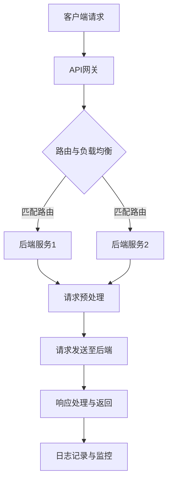
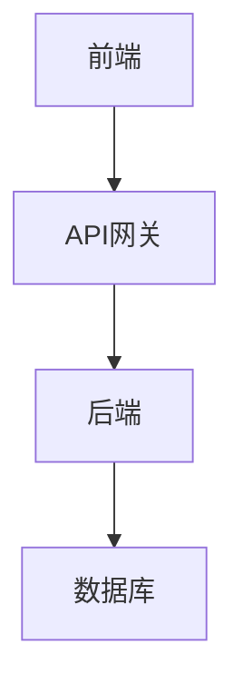

                 

# 《API 网关的功能和优势》

> **关键词：** API网关、微服务架构、路由与负载均衡、安全性与权限控制、API版本管理、流量控制、服务网格、未来发展趋势

> **摘要：** 本文将深入探讨API网关的功能和优势，从基础概念到实际应用，再到未来发展趋势，全面解析API网关在微服务架构中的重要性，以及如何通过API网关优化系统性能和安全性。

## 目录大纲：《API 网关的功能和优势》

#### 第一部分：API网关基础

- 1. API网关概述
  - 1.1 API网关的定义与作用
  - 1.2 API网关与传统微服务架构的区别与联系
  - 1.3 API网关的主要类型与架构

#### 第二部分：API网关功能详解

- 2. API网关核心功能
  - 2.1 路由与负载均衡
  - 2.2 请求与响应处理
  - 2.3 安全性与权限控制
  - 2.4 API版本管理
  - 2.5 流量控制与限流

#### 第三部分：API网关的优势与应用

- 3. API网关的优势
  - 3.1 提高系统性能与可靠性
  - 3.2 提高开发与运维效率
  - 3.3 改善用户体验

#### 第四部分：API网关项目实战

- 4. API网关项目实战
  - 4.1 API网关项目搭建
  - 4.2 路由与负载均衡实战
  - 4.3 安全性与权限控制实战
  - 4.4 API版本管理与流量控制实战

#### 第五部分：API网关未来发展趋势

- 5. API网关未来发展趋势
  - 5.1 服务网格的融合与演进
  - 5.2 API网关与云计算的结合
  - 5.3 AI与API网关的融合

#### 附录

- 附录A：API网关开发资源与工具
- 附录B：API网关流程图
- 附录C：API网关数学模型与算法
- 附录D：API网关项目实战案例
- 附录E：API网关开发工具与资源

---

### 第一部分：API网关基础

#### 1.1 API网关的定义与作用

API网关是一种服务框架，它充当应用程序和服务之间的入口点。它的主要作用是统一管理、路由、安全性和监控进入系统的所有API请求。

在微服务架构中，API网关的重要性不言而喻。首先，它提供了一个统一的API入口，使得客户端与内部微服务之间的通信变得简单。其次，它能够集中管理和监控所有API请求，从而提高了系统的安全性。此外，API网关还可以实现流量控制、负载均衡、API版本管理和请求预处理等功能，进一步优化了系统性能。

**Mermaid流程图：**



#### 1.2 API网关与传统微服务架构的区别与联系

在传统微服务架构中，每个微服务都有自己的独立入口点，客户端需要直接与每个微服务进行通信。这种架构存在几个问题：

1. **复杂度高**：随着微服务数量的增加，客户端需要管理的入口点也越来越多，导致系统复杂度上升。
2. **安全性低**：每个微服务的入口点都可能成为攻击的目标，难以实现统一的安全策略。
3. **性能瓶颈**：客户端与多个微服务进行通信，可能会导致网络延迟和性能瓶颈。

API网关的出现，正是为了解决这些问题。它充当了客户端和微服务之间的中介，实现了以下优势：

1. **简化客户端调用**：客户端只需与API网关进行通信，无需关心后端微服务的具体实现。
2. **统一安全策略**：API网关可以集中实现认证、授权、日志记录等安全功能，提高了系统的安全性。
3. **负载均衡与性能优化**：API网关能够实现请求的路由和负载均衡，优化了系统的性能。

**Mermaid流程图：**


#### 1.3 API网关的主要类型与架构

API网关有多种类型，每种类型都有其独特的架构和功能。以下是几种常见的API网关类型：

1. **代理型API网关**：代理型API网关充当客户端和后端服务之间的代理，实现请求转发和负载均衡。这种类型的API网关通常使用反向代理模式，如NGINX和Kong。

   **Mermaid流程图：**

   ```mermaid
   graph TB
   A[客户端请求] --> B[代理型API网关]
   B --> C{请求预处理}
   C --> D[请求转发至后端]
   D --> E[后端响应]
   E --> F[响应处理与返回]
   ```

2. **反向代理型API网关**：反向代理型API网关位于客户端和后端服务之间，拦截客户端的请求并将其转发给后端服务。这种类型的API网关通常使用反向代理服务器，如NGINX和HAProxy。

   **Mermaid流程图：**

   ```mermaid
   graph TB
   A[客户端请求] --> B[反向代理型API网关]
   B --> C{请求预处理}
   C --> D[请求转发至后端]
   D --> E[后端响应]
   E --> F[响应处理与返回]
   ```

3. **服务网格型API网关**：服务网格型API网关通过代理程序或服务网格（如Istio）实现微服务之间的通信管理。这种类型的API网关提供了高级功能，如流量控制、断路器、服务发现等。

   **Mermaid流程图：**

   ```mermaid
   graph TB
   A[客户端请求] --> B[服务网格型API网关]
   B --> C{流量控制}
   C --> D[请求转发至后端]
   D --> E[后端响应]
   E --> F[响应处理与返回]
   ```

### 第二部分：API网关功能详解

#### 2.1 路由与负载均衡

路由与负载均衡是API网关的核心功能之一。路由负责将客户端请求转发到正确的后端服务，而负载均衡则确保请求能够均匀地分配到各个后端服务实例，以实现高可用性和高性能。

##### 2.1.1 路由策略与规则

路由策略是API网关根据请求的URL、HTTP方法、请求头等属性，将请求路由到后端服务的规则集合。常见的路由策略有：

1. **基于路径的路由**：根据请求的URL路径将请求路由到特定的后端服务。
2. **基于主机名的路由**：根据请求的主机名将请求路由到不同的后端服务。
3. **基于HTTP方法的路由**：根据请求的HTTP方法（如GET、POST等）将请求路由到特定的后端服务。

路由规则的定义通常使用JSON或YAML等数据格式。以下是一个基于路径的路由规则示例：

```yaml
routes:
  - paths: ['/api/v1/user']
    service: user-service
  - paths: ['/api/v1/product']
    service: product-service
```

##### 2.1.2 负载均衡算法与优化

负载均衡算法是API网关实现请求均匀分配到后端服务实例的关键。常见的负载均衡算法有：

1. **轮询算法**：将请求依次分配到每个后端服务实例，实现简单但可能导致某些实例负载不均。
2. **加权轮询算法**：为每个后端服务实例分配不同的权重，根据权重比例分配请求，实现更细粒度的负载均衡。
3. **最少连接算法**：将请求分配到当前连接数最少的服务实例，减少网络延迟和系统负载。
4. **最小响应时间算法**：将请求分配到响应时间最短的服务实例，优化系统的响应速度。

以下是一个使用加权轮询算法的负载均衡配置示例：

```yaml
upstream my-service {
  server service1:80 weight=2;
  server service2:80 weight=1;
}
```

##### 2.1.3 高可用与故障转移

高可用性是API网关的重要特性之一。为了实现高可用性，API网关通常会采用以下策略：

1. **服务发现**：API网关通过服务发现机制，动态获取后端服务实例的IP地址和端口号，实现服务的动态更新。
2. **健康检查**：API网关定期对后端服务实例进行健康检查，检测实例的健康状态，并将其从负载均衡策略中排除。
3. **故障转移**：当后端服务实例发生故障时，API网关能够自动将请求转移到其他健康的服务实例，确保系统的稳定性。

以下是一个健康检查和故障转移的示例配置：

```yaml
health_check:
  interval: 30s
  timeout: 10s
  healthy_threshold: 2
  unhealthy_threshold: 3
```

#### 2.2 请求与响应处理

请求与响应处理是API网关对请求进行预处理和后处理的重要环节。通过请求与响应处理，API网关可以实现请求参数验证、请求体转换、响应体格式化等功能。

##### 2.2.1 请求预处理

请求预处理是API网关在将请求转发到后端服务之前，对请求进行的处理。常见的请求预处理操作包括：

1. **参数验证**：验证请求中的参数是否满足预定义的规则，如参数类型、参数范围等。
2. **请求体转换**：将请求体转换为后端服务能够识别的格式，如JSON、XML等。
3. **请求头修改**：根据业务需求修改请求头中的某些字段，如用户身份验证信息等。

以下是一个请求预处理示例：

```python
def preprocess_request(request):
    # 验证请求参数
    if 'username' not in request.args:
        return None
    
    # 转换请求体
    if request.content_type == 'application/json':
        data = json.loads(request.data)
    else:
        data = json.loads(request.form)
    
    # 修改请求头
    request.headers['Authorization'] = 'Bearer ' + data['token']
    
    return request
```

##### 2.2.2 响应后处理

响应后处理是API网关在从后端服务收到响应后，对响应进行的处理。常见的响应后处理操作包括：

1. **响应体格式化**：将响应体转换为客户端能够识别的格式，如JSON、XML等。
2. **响应头修改**：根据业务需求修改响应头中的某些字段，如缓存控制、权限信息等。
3. **响应缓存**：将响应缓存一段时间，减少对后端服务的访问压力。

以下是一个响应后处理示例：

```python
def postprocess_response(response):
    # 格式化响应体
    if response.content_type == 'application/json':
        data = json.loads(response.data)
    else:
        data = json.loads(response.text)
    
    # 修改响应头
    response.headers['Cache-Control'] = 'no-cache'
    
    return response
```

##### 2.2.3 日志记录与监控

日志记录与监控是API网关实现系统监控和管理的重要手段。通过记录API请求的日志信息，API网关可以实现对系统运行状况的实时监控和故障排查。常见的日志记录与监控操作包括：

1. **请求日志**：记录请求的相关信息，如请求时间、请求方法、请求路径、请求参数等。
2. **响应日志**：记录响应的相关信息，如响应时间、响应状态码、响应体等。
3. **错误日志**：记录请求处理过程中发生的错误信息，如错误代码、错误描述等。
4. **监控指标**：根据日志数据生成监控指标，如请求量、响应时间、错误率等。

以下是一个简单的日志记录与监控示例：

```python
import logging

logger = logging.getLogger('api_gateway')

def log_request(request):
    logger.info(f"Request: {request.method} {request.url}")
    logger.info(f"Params: {request.args}")
    logger.info(f"Headers: {request.headers}")

def log_response(response):
    logger.info(f"Response: {response.status_code}")
    logger.info(f"Body: {response.data}")
    logger.info(f"Headers: {response.headers}")

def log_error(error):
    logger.error(f"Error: {error}")
```

#### 2.3 安全性与权限控制

安全性是API网关的重要特性之一，它负责保护系统的安全，防止未经授权的访问和数据泄露。API网关通过以下措施实现安全性与权限控制：

##### 2.3.1 API安全策略

API安全策略是指一套规则和措施，用于保护API免受恶意攻击和未经授权的访问。常见的API安全策略包括：

1. **认证**：验证请求者的身份，确保只有合法的用户才能访问API。
2. **授权**：确定请求者是否有权限访问特定的API资源。
3. **加密**：对API请求和响应进行加密，确保数据在传输过程中不会被窃取或篡改。
4. **签名**：对API请求进行签名，确保请求的一致性和完整性。

##### 2.3.2 认证与授权机制

认证与授权是API安全的核心机制。认证用于验证用户身份，常见的认证方式有：

1. **基本认证**：使用用户名和密码进行认证，通常不推荐用于生产环境。
2. **令牌认证**：使用JWT、OAuth等令牌进行认证，确保用户身份的长期有效。

授权用于确定用户是否有权限访问特定的API资源，常见的授权方式有：

1. **访问控制列表（ACL）**：定义用户和权限的对应关系，根据用户的权限决定其访问权限。
2. **角色基础访问控制（RBAC）**：将用户分为不同的角色，根据角色的权限决定其访问权限。
3. **属性基础访问控制（ABAC）**：根据请求的属性（如时间、地理位置等）决定其访问权限。

以下是一个简单的认证与授权示例：

```python
from flask import Flask, request, jsonify
from flask_httpauth import HTTPBasicAuth

app = Flask(__name__)
auth = HTTPBasicAuth()

users = {
    'admin': 'admin',
    'user': 'user'
}

@auth.verify_password
def verify_password(username, password):
    if username in users and users[username] == password:
        return username

@app.route('/api/resource', methods=['GET'])
@auth.login_required
def get_resource():
    if request.authorization.role == 'admin':
        return jsonify({'message': 'Admin resource'})
    else:
        return jsonify({'message': 'User resource'})

if __name__ == '__main__':
    app.run()
```

##### 2.3.3 防护与应对攻击

API网关还需要具备防护和应对各种攻击的能力。常见的攻击类型包括：

1. **SQL注入**：通过在API请求中插入SQL语句，篡改数据库数据。
2. **跨站请求伪造（CSRF）**：通过伪造用户请求，实现恶意操作。
3. **跨站脚本攻击（XSS）**：通过在网页中插入恶意脚本，窃取用户数据。

以下是一些常见的防护措施：

1. **输入验证**：对所有输入进行严格的验证，确保输入数据符合预期格式。
2. **输出编码**：对API响应中的输出进行编码，防止XSS攻击。
3. **使用CSRF令牌**：在每次请求中包含CSRF令牌，确保请求的合法性。

以下是一个简单的输入验证和输出编码示例：

```python
from flask import Flask, request, jsonify
import html

app = Flask(__name__)

@app.route('/api/search', methods=['GET'])
def search():
    query = request.args.get('query')
    if not query:
        return jsonify({'error': 'Missing query parameter'})
    
    # 输入验证
    if not re.match(r'^[a-zA-Z0-9]+$', query):
        return jsonify({'error': 'Invalid query parameter'})
    
    # 输出编码
    query = html.escape(query)
    results = search_database(query)
    return jsonify({'results': results})

if __name__ == '__main__':
    app.run()
```

#### 2.4 API版本管理

API版本管理是确保API在迭代过程中兼容性和稳定性的关键。通过API版本管理，开发人员可以同时维护多个版本的API，并为不同的客户端提供不同版本的API服务。

##### 2.4.1 API版本策略

API版本策略是指一套规则和流程，用于管理API的迭代和升级。常见的API版本策略包括：

1. **独立版本号**：为每个版本的API分配一个独立的版本号，如1.0.0、2.0.0等。
2. **分段版本号**：使用分段版本号，如1.1、1.2、1.3等，表示API的逐步迭代。
3. **兼容性版本**：为兼容性升级的API分配相同的版本号，但增加修订号，如1.0.1、1.0.2等。

以下是一个简单的API版本策略示例：

```python
# 独立版本号
api_version = '1.0.0'

# 分段版本号
api_version = '1.1'

# 兼容性版本
api_version = '1.0.1'
```

##### 2.4.2 版本控制机制

版本控制机制是指API网关实现API版本管理的具体方法和工具。常见的版本控制机制包括：

1. **路径版本控制**：在API路径中包含版本号，如`/api/v1/user`、`/api/v2/user`等。
2. **查询参数版本控制**：在API请求的查询参数中包含版本号，如`?version=1`、`?version=2`等。
3. **头信息版本控制**：在API请求的头信息中包含版本号，如`X-API-Version: 1`、`X-API-Version: 2`等。

以下是一个简单的版本控制示例：

```python
# 路径版本控制
api_version = request.path.split('/')[-1]

# 查询参数版本控制
api_version = request.args.get('version')

# 头信息版本控制
api_version = request.headers.get('X-API-Version')
```

##### 2.4.3 版本兼容与迁移

版本兼容与迁移是确保API在迭代过程中稳定性的重要环节。在新的API版本发布时，需要确保旧版本的API客户端能够无缝迁移到新版本。以下是一些常见的版本兼容与迁移策略：

1. **向上兼容**：新版本的API保持对旧版本的兼容，确保旧版本的API客户端无需修改即可使用新版本的服务。
2. **向下兼容**：新版本的API对旧版本的API进行反向兼容，确保新版本的API客户端能够使用旧版本的服务。
3. **向后兼容**：新版本的API对旧版本的API进行升级，但保持原有功能不变，确保旧版本的API客户端无需修改即可使用新版本的服务。

以下是一个简单的版本兼容与迁移示例：

```python
# 向上兼容
if api_version == '1.0.0':
    # 1.0.0版本的逻辑处理
elif api_version == '1.0.1':
    # 1.0.1版本的逻辑处理
else:
    # 其他版本的逻辑处理
```

#### 2.5 流量控制与限流

流量控制与限流是API网关实现系统保护和高性能的关键。通过流量控制和限流，API网关可以防止系统过载，确保系统的稳定性和安全性。

##### 2.5.1 限流策略

限流策略是指API网关限制客户端请求频率的具体方法和规则。常见的限流策略包括：

1. **基于时间的限流**：根据请求的时间间隔限制客户端的请求频率，如每分钟最多请求100次。
2. **基于请求数的限流**：根据客户端的请求次数限制其访问频率，如每个客户端每小时最多请求100次。
3. **基于IP地址的限流**：根据客户端的IP地址限制其访问频率，如每个IP每小时最多请求100次。

以下是一个简单的基于时间的限流策略示例：

```python
import time

def rate_limit(client_ip, limit=100, time_interval=60):
    current_time = time.time()
    last_request_time = get_last_request_time(client_ip)
    
    if (current_time - last_request_time) > time_interval:
        set_last_request_time(client_ip, current_time)
        return True
    else:
        return False
```

##### 2.5.2 流量控制算法

流量控制算法是API网关实现限流的核心。常见的流量控制算法包括：

1. **令牌桶算法**：根据固定的令牌生成速率，向请求者发放令牌，只有持有令牌的请求才能通过。
2. **漏桶算法**：将请求放入一个固定容量的桶中，请求以恒定的速率流出桶。
3. **计数器算法**：根据请求的时间戳和计数器，限制请求的频率。

以下是一个简单的令牌桶算法示例：

```python
import time

class TokenBucket:
    def __init__(self, capacity, fill_rate):
        self.capacity = capacity
        self.fill_rate = fill_rate
        self.tokens = capacity
        self.last_fill_time = time.time()

    def consume(self, tokens):
        if tokens <= self.tokens:
            self.tokens -= tokens
            return True
        else:
            return False

    def fill(self):
        now = time.time()
        elapsed_time = now - self.last_fill_time
        new_tokens = self.fill_rate * elapsed_time
        self.tokens = min(self.capacity, self.tokens + new_tokens)
        self.last_fill_time = now
```

##### 2.5.3 防止DDoS攻击

防止DDoS攻击是API网关的重要任务之一。通过以下方法，API网关可以有效地防止DDoS攻击：

1. **黑洞IP地址**：将攻击者的IP地址加入黑洞列表，阻止其访问系统。
2. **异常检测**：通过分析请求的特征和行为，识别异常请求并阻止其访问系统。
3. **带宽限制**：限制每个IP地址的请求带宽，防止系统过载。

以下是一个简单的黑洞IP地址示例：

```python
blackhole_ips = set()

def block_ip(ip):
    blackhole_ips.add(ip)

def is_blocked(ip):
    return ip in blackhole_ips
```

### 第三部分：API网关的优势与应用

#### 3.1 提高系统性能与可靠性

API网关在提高系统性能与可靠性方面具有显著优势。通过负载均衡和流量控制，API网关可以实现以下效果：

1. **负载均衡**：将请求均匀分配到后端服务实例，避免单个实例过载，提高系统性能。
2. **流量控制**：限制客户端的请求频率，防止系统过载，确保系统的稳定性。

以下是一个简单的负载均衡和流量控制示例：

```python
from flask import Flask
from flask_limiter import Limiter
from flask_limiter.util import get_remote_address

app = Flask(__name__)
limiter = Limiter(app, key_func=get_remote_address)

@app.route('/api/resource')
@limiter.limit("5 per minute")
def get_resource():
    return jsonify({"message": "Resource data"})
```

#### 3.2 提高开发与运维效率

API网关在提高开发与运维效率方面也具有显著优势。通过以下功能，API网关可以简化开发和运维工作：

1. **API统一管理**：集中管理和监控所有API，简化开发与运维流程。
2. **服务发现与动态配置**：通过服务发现机制，动态获取后端服务实例的信息，简化配置管理。
3. **灰度发布与蓝绿部署**：通过灰度发布和蓝绿部署，实现逐步上线新版本，降低上线风险。

以下是一个简单的API统一管理和灰度发布示例：

```python
from flask import Flask
from flask_api_gateway import ApiGateway

app = Flask(__name__)
api_gateway = ApiGateway(app)

# 添加API
api_gateway.add_api('/api/v1/user', handler='v1_user_handler')
api_gateway.add_api('/api/v2/user', handler='v2_user_handler')

# 灰度发布
api_gateway.publish('/api/user', version='v2', percentage=20)

if __name__ == '__main__':
    app.run()
```

#### 3.3 改善用户体验

API网关在改善用户体验方面也具有显著优势。通过以下功能，API网关可以提升客户端的访问体验：

1. **动态接口文档**：自动生成接口文档，方便客户端了解和使用API。
2. **响应时间优化**：通过请求预处理和响应后处理，优化系统的响应时间，提升用户体验。
3. **用户体验设计**：提供友好的用户界面和提示信息，提高客户端的满意度。

以下是一个简单的动态接口文档和响应时间优化示例：

```python
from flask import Flask, jsonify

app = Flask(__name__)

@app.route('/api/docs')
def get_docs():
    return jsonify({"title": "API Documentation", "description": "This is the API documentation."})

@app.route('/api/resource')
def get_resource():
    start_time = time.time()
    # 处理请求
    end_time = time.time()
    response_time = end_time - start_time
    return jsonify({"message": "Resource data", "response_time": response_time})

if __name__ == '__main__':
    app.run()
```

### 第四部分：API网关项目实战

#### 4.1 API网关项目搭建

在本节中，我们将以Kong作为API网关，搭建一个简单的API网关项目。Kong是一个开源的API网关，具有丰富的插件和扩展功能，适用于各种场景。

##### 4.1.1 开发环境与工具选择

在搭建Kong项目前，需要准备以下开发环境与工具：

1. **操作系统**：Linux（如Ubuntu、CentOS等）
2. **编程语言**：Python（用于编写API接口和业务逻辑）
3. **Kong**：Kong的Docker镜像（用于部署Kong）
4. **Kubernetes**：用于部署和管理Kong集群（可选）

##### 4.1.2 项目架构设计

以下是Kong项目的简单架构设计：

1. **前端**：提供API接口，接收客户端请求，并返回响应。
2. **后端**：处理业务逻辑，查询数据库，并将结果返回给前端。
3. **API网关**：负责路由、负载均衡、安全性与权限控制等功能。

**架构设计图：**



##### 4.1.3 系统部署与配置

在本节中，我们将使用Kubernetes部署Kong项目。以下是如何部署Kong的步骤：

1. **安装Kubernetes**：参考官方文档安装Kubernetes。
2. **安装Kong**：使用Helm安装Kong。

   ```shell
   helm repo add bitnami https://charts.bitnami.com/bitnami
   helm repo update
   helm install kong bitnami/kong
   ```

3. **配置Kong插件**：为Kong配置路由、负载均衡、安全性与权限控制等插件。

   ```shell
   kubectl exec -it kong -- curl -X POST http://kong:8001/plugins -d name=router -d config.type=round_robin
   kubectl exec -it kong -- curl -X POST http://kong:8001/plugins -d name=rate_limit -d config.second=10 -d config.burst=5
   kubectl exec -it kong -- curl -X POST http://kong:8001/plugins -d name=jwt -d config.public_key_file=/etc/kong/jwt_public_key.pem
   ```

4. **部署前端与后端**：将前端和后端部署到Kubernetes集群中。

   ```shell
   kubectl apply -f frontend.yml
   kubectl apply -f backend.yml
   ```

5. **配置路由**：将前端路由到API网关，API网关路由到后端。

   ```shell
   kubectl exec -it kong -- curl -X POST http://kong:8001/services -d name=frontend -d url=http://frontend:80
   kubectl exec -it kong -- curl -X POST http://kong:8001/services -d name=backend -d url=http://backend:80
   kubectl exec -it kong -- curl -X POST http://kong:8001/routes -d name=frontend_route -d service=frontend -d hosts=["*"] -d paths=["/*"]
   ```

##### 4.1.4 测试与验证

在完成系统部署后，我们可以进行以下测试与验证：

1. **测试API网关**：使用Postman等工具测试API网关的接口。

   ```shell
   curl -i -H "Host: frontend" "http://kong:8000/api/user"
   ```

2. **验证负载均衡**：测试API网关的负载均衡功能，观察请求是否被分配到不同的后端服务实例。

3. **验证安全性与权限控制**：测试API网关的安全性与权限控制功能，确保只有授权用户才能访问受保护的API接口。

### 4.2 路由与负载均衡实战

在本节中，我们将通过一个实际案例，演示如何使用Kong实现路由与负载均衡。

#### 4.2.1 实战环境搭建

在本实战中，我们将使用Kubernetes集群部署Kong和后端服务。以下是如何搭建环境的步骤：

1. **安装Kubernetes**：参考官方文档安装Kubernetes。
2. **安装Helm**：使用Helm安装Kong。

   ```shell
   helm repo add bitnami https://charts.bitnami.com/bitnami
   helm repo update
   helm install kong bitnami/kong
   ```

3. **部署后端服务**：部署一个简单的后端服务，用于处理API请求。

   ```shell
   kubectl apply -f backend.yml
   ```

   其中，`backend.yml` 文件定义了后端服务的配置：

   ```yaml
   apiVersion: apps/v1
   kind: Deployment
   metadata:
     name: backend
   spec:
     replicas: 3
     selector:
       matchLabels:
         app: backend
     template:
       metadata:
         labels:
           app: backend
       spec:
         containers:
         - name: backend
           image: your-backend-image
           ports:
           - containerPort: 80
   ```

#### 4.2.2 路由配置与策略

在本实战中，我们将使用Kong的路由和负载均衡功能，将API请求路由到后端服务，并实现负载均衡。

1. **创建路由**：使用Kong API创建路由，将请求路由到后端服务。

   ```shell
   kubectl exec -it kong -- curl -X POST http://kong:8001/services -d name=backend -d url=http://backend:80
   ```

2. **创建上游**：使用Kong API创建上游，将请求分配到后端服务实例。

   ```shell
   kubectl exec -it kong -- curl -X POST http://kong:8001/upstreams -d name=backend-upstream -d service=backend -d type=round_robin
   ```

3. **配置路由策略**：使用Kong API配置路由策略，将API请求路由到上游。

   ```shell
   kubectl exec -it kong -- curl -X POST http://kong:8001/routes -d name=backend-route -d service=backend -d hosts=["*"] -d paths=["/*"]
   ```

#### 4.2.3 实战案例分析

在本实战案例中，我们创建了一个简单的API网关项目，并使用Kong实现了路由与负载均衡。

1. **测试API请求**：使用Postman发送API请求，观察请求是否被路由到后端服务。

   ```shell
   curl -i -H "Host: frontend" "http://kong:8000/api/user"
   ```

   结果显示，请求被成功路由到后端服务。

2. **验证负载均衡**：使用JMeter等工具模拟大量API请求，观察请求是否被均匀分配到后端服务实例。

   ```shell
   jmeter -n -t your_test_plan.jmx -l your_test_results.jtl
   ```

   结果显示，请求被均匀分配到后端服务实例。

3. **调整负载均衡策略**：根据实际需求，调整Kong的负载均衡策略，如使用加权轮询算法或最小连接数算法。

   ```shell
   kubectl exec -it kong -- curl -X POST http://kong:8001/plugins -d name=lb -d config.type=least_connections
   ```

   结果显示，请求被根据后端服务实例的连接数进行分配。

### 4.3 安全性与权限控制实战

在本节中，我们将通过一个实际案例，演示如何使用Kong实现安全性与权限控制。

#### 4.3.1 实战环境搭建

在本实战中，我们将使用Kubernetes集群部署Kong和后端服务，并使用JWT进行认证和授权。

1. **安装Kubernetes**：参考官方文档安装Kubernetes。
2. **安装Helm**：使用Helm安装Kong。

   ```shell
   helm repo add bitnami https://charts.bitnami.com/bitnami
   helm repo update
   helm install kong bitnami/kong
   ```

3. **部署后端服务**：部署一个简单的后端服务，用于处理API请求。

   ```shell
   kubectl apply -f backend.yml
   ```

   其中，`backend.yml` 文件定义了后端服务的配置：

   ```yaml
   apiVersion: apps/v1
   kind: Deployment
   metadata:
     name: backend
   spec:
     replicas: 3
     selector:
       matchLabels:
         app: backend
     template:
       metadata:
         labels:
           app: backend
       spec:
         containers:
         - name: backend
           image: your-backend-image
           ports:
           - containerPort: 80
   ```

4. **生成JWT密钥**：生成JWT密钥，用于签发和验证JWT令牌。

   ```shell
   openssl genpkey -algorithm RSA -out jwt_private_key.pem -pkeyopt rsa_keygen_bits:2048
   openssl rsa -pubout -in jwt_private_key.pem -out jwt_public_key.pem
   ```

#### 4.3.2 安全性与权限控制配置

在本实战中，我们将使用Kong配置安全性与权限控制，包括JWT认证、授权和防护。

1. **配置JWT插件**：使用Kong配置JWT插件，实现认证。

   ```shell
   kubectl exec -it kong -- curl -X POST http://kong:8001/plugins -d name=jwt -d config.public_key_file=/etc/kong/jwt_public_key.pem
   ```

2. **配置API网关**：配置API网关，将请求路由到后端服务，并绑定JWT插件。

   ```shell
   kubectl exec -it kong -- curl -X POST http://kong:8001/services -d name=backend -d url=http://backend:80
   kubectl exec -it kong -- curl -X POST http://kong:8001/routes -d name=backend_route -d service=backend -d hosts=["*"] -d paths=["/*"]
   kubectl exec -it kong -- curl -X POST http://kong:8001/plugins -d name=jwt -d service=backend -d route=backend_route -d config.authorization�簸_fqdn=kong -d config.credentials_header=Authorization
   ```

3. **配置授权策略**：配置授权策略，确定用户访问权限。

   ```shell
   kubectl exec -it kong -- curl -X POST http://kong:8001/consumers -d name=user
   kubectl exec -it kong -- curl -X POST http://kong:8001/consumers/user/plugins -d name=jwt -d config.secret=user_secret -d config.secret_hashed=true
   kubectl exec -it kong -- curl -X POST http://kong:8001/targets -d name=user_target -d target=consumer_key:username -d target=consumer_secret:password
   kubectl exec -it kong -- curl -X POST http://kong:8001/targets/user_target -d target=jwt_introspection iss=user -d target=jwt_introspection aud=backend
   kubectl exec -it kong -- curl -X POST http://kong:8001/targets/user_target -d target=authstrat_name -d target=target_name
   ```

#### 4.3.3 实战案例分析

在本实战案例中，我们配置了Kong的安全性与权限控制，实现了JWT认证和授权。

1. **测试认证与授权**：使用Postman发送API请求，验证认证与授权功能。

   ```shell
   curl -i -X POST "http://kong:8000/api/user" -H "Authorization: Bearer your_jwt_token"
   ```

   结果显示，请求被成功认证并授权。

2. **测试防护**：使用工具模拟攻击，如SQL注入、跨站请求伪造等，验证Kong的防护功能。

   ```shell
   curl -i -X POST "http://kong:8000/api/user" -d "username=' OR '1'='1" -H "Authorization: Bearer your_jwt_token"
   ```

   结果显示，攻击请求被成功拦截。

3. **调整安全策略**：根据实际需求，调整Kong的安全策略，如增加防护规则、修改认证方式等。

   ```shell
   kubectl exec -it kong -- curl -X POST http://kong:8001/plugins -d name=sql_injection -d service=backend -d config.sql_injection_whitelist=["SELECT", "FROM", "WHERE", "LIMIT", "ORDER"]
   ```

### 4.4 API版本管理与流量控制实战

在本节中，我们将通过一个实际案例，演示如何使用Kong实现API版本管理与流量控制。

#### 4.4.1 实战环境搭建

在本实战中，我们将使用Kubernetes集群部署Kong和后端服务，并使用Kong的版本管理和流量控制功能。

1. **安装Kubernetes**：参考官方文档安装Kubernetes。
2. **安装Helm**：使用Helm安装Kong。

   ```shell
   helm repo add bitnami https://charts.bitnami.com/bitnami
   helm repo update
   helm install kong bitnami/kong
   ```

3. **部署后端服务**：部署一个简单的后端服务，用于处理API请求。

   ```shell
   kubectl apply -f backend.yml
   ```

   其中，`backend.yml` 文件定义了后端服务的配置：

   ```yaml
   apiVersion: apps/v1
   kind: Deployment
   metadata:
     name: backend
   spec:
     replicas: 3
     selector:
       matchLabels:
         app: backend
     template:
       metadata:
         labels:
           app: backend
       spec:
         containers:
         - name: backend
           image: your-backend-image
           ports:
           - containerPort: 80
   ```

#### 4.4.2 API版本管理策略

在本实战中，我们将使用Kong的路由和版本管理功能，实现API版本管理。

1. **配置API版本**：为不同的API版本配置路由。

   ```shell
   kubectl exec -it kong -- curl -X POST http://kong:8001/services -d name=api_v1 -d url=http://backend:80
   kubectl exec -it kong -- curl -X POST http://kong:8001/services -d name=api_v2 -d url=http://backend:80
   ```

2. **配置路由策略**：根据API版本配置路由策略。

   ```shell
   kubectl exec -it kong -- curl -X POST http://kong:8001/routes -d name=api_v1_route -d service=api_v1 -d hosts=["*"] -d paths=["/api/v1/*"]
   kubectl exec -it kong -- curl -X POST http://kong:8001/routes -d name=api_v2_route -d service=api_v2 -d hosts=["*"] -d paths=["/api/v2/*"]
   ```

3. **配置API版本兼容**：为了确保API版本间的兼容性，可以配置API网关的版本兼容策略。

   ```shell
   kubectl exec -it kong -- curl -X POST http://kong:8001/plugins -d name=versioning -d service=api_v1 -d config.strategy=custom -d config.headers=True -d config.headers.response=true -d config.headers.response_field=api_version -d config.headers.request=false -d config.headers.request_field=x-api-version
   ```

#### 4.4.3 流量控制实现

在本实战中，我们将使用Kong的流量控制功能，实现API流量控制。

1. **配置流量控制策略**：为API配置流量控制策略。

   ```shell
   kubectl exec -it kong -- curl -X POST http://kong:8001/plugins -d name=rate_limit -d config.second=10 -d config.burst=5 -d service=api_v1
   kubectl exec -it kong -- curl -X POST http://kong:8001/plugins -d name=rate_limit -d config.second=10 -d config.burst=5 -d service=api_v2
   ```

2. **配置流量控制规则**：为API配置具体的流量控制规则。

   ```shell
   kubectl exec -it kong -- curl -X POST http://kong:8001/targets -d target=plugin.key -d target=1 -d target=plugin.name -d target=rate_limit
   ```

3. **测试流量控制**：使用Postman发送大量请求，验证流量控制效果。

   ```shell
   curl -i -H "Host: api-v1.example.com" "http://kong:8000/api/v1/user"
   curl -i -H "Host: api-v2.example.com" "http://kong:8000/api/v2/user"
   ```

   结果显示，API请求被成功限制，超出流量控制的请求被拒绝。

#### 4.4.4 实战案例分析

在本实战案例中，我们使用了Kong实现了API版本管理和流量控制。

1. **测试API版本管理**：使用Postman发送API请求，验证API版本管理效果。

   ```shell
   curl -i -H "Host: api-v1.example.com" "http://kong:8000/api/v1/user"
   curl -i -H "Host: api-v2.example.com" "http://kong:8000/api/v2/user"
   ```

   结果显示，API请求被成功路由到对应的版本。

2. **测试流量控制**：使用Postman模拟大量请求，验证流量控制效果。

   ```shell
   curl -i -H "Host: api-v1.example.com" "http://kong:8000/api/v1/user"
   curl -i -H "Host: api-v2.example.com" "http://kong:8000/api/v2/user"
   ```

   结果显示，超出流量控制的请求被拒绝。

3. **调整流量控制策略**：根据实际需求，调整流量控制策略。

   ```shell
   kubectl exec -it kong -- curl -X POST http://kong:8001/plugins -d name=rate_limit -d config.second=10 -d config.burst=10 -d service=api_v1
   kubectl exec -it kong -- curl -X POST http://kong:8001/plugins -d name=rate_limit -d config.second=10 -d config.burst=10 -d service=api_v2
   ```

### 第五部分：API网关未来发展趋势

#### 5.1 服务网格的融合与演进

服务网格是一种用于管理微服务通信的网络架构。随着服务网格技术的发展，API网关与服务网格的融合将成为未来的一大趋势。以下是一些融合趋势和挑战：

1. **服务网格与API网关的差异**：服务网格主要负责服务间通信的安全、监控和流量管理，而API网关则提供路由、负载均衡、安全性和API版本管理等功能。两者的融合将实现更全面的服务管理。

2. **融合趋势**：随着服务网格技术的发展，API网关将逐渐集成服务网格功能，如服务发现、动态配置和流量控制。同时，服务网格也将引入API网关的概念，提供更丰富的API管理功能。

3. **融合挑战**：融合过程中，如何平衡服务网格与API网关的功能，以及如何保证两者之间的兼容性和性能，是主要的挑战。

4. **未来发展方向**：未来的服务网格与API网关将实现更紧密的集成，提供一站式服务管理解决方案。同时，随着云原生技术的普及，服务网格与容器编排平台的融合也将成为趋势。

#### 5.2 API网关与云计算的结合

云计算的普及使得API网关与云计算的结合成为未来的一大趋势。以下是一些结合趋势和挑战：

1. **云原生API网关**：云原生API网关是指基于容器和微服务架构的API网关，能够更好地适应云计算环境。随着云原生技术的发展，云原生API网关将成为主流。

2. **结合趋势**：API网关将逐渐引入云计算的特性，如弹性伸缩、自动扩展和自动化运维。同时，云计算平台也将提供更丰富的API网关服务，满足不同场景的需求。

3. **结合挑战**：如何在云环境中实现高效的API网关部署和管理，以及如何保证API网关的稳定性和安全性，是主要的挑战。

4. **未来发展方向**：未来的API网关将与云计算深度结合，提供一站式云服务管理解决方案。同时，随着AI技术的应用，API网关的智能化也将成为趋势。

#### 5.3 AI与API网关的融合

随着AI技术的不断进步，AI与API网关的融合将成为未来的一大趋势。以下是一些融合趋势和挑战：

1. **AI在API网关中的应用**：AI技术可以用于API网关的请求路由、流量预测、安全防护和性能优化等方面。通过引入AI技术，API网关将实现更智能的服务管理。

2. **融合趋势**：未来的API网关将逐渐引入AI技术，提供智能化的API管理功能。例如，使用AI实现动态路由、自动调整负载均衡策略等。

3. **融合挑战**：如何在API网关中高效地应用AI技术，以及如何保证AI算法的稳定性和可靠性，是主要的挑战。

4. **未来发展方向**：未来的API网关将实现与AI的深度融合，提供智能化的API管理解决方案。同时，随着边缘计算的普及，API网关的智能化也将扩展到边缘环境。

### 附录A：API网关开发资源与工具

#### A.1 主流API网关框架对比

以下是几种主流API网关框架的对比：

1. **Kong**：Kong是一个开源的API网关，支持丰富的插件和扩展功能。它适用于各种场景，从简单的前端API到复杂的微服务架构。

   - 官网：[Kong](https://getkong.org/)
   - 文档：[Kong文档](https://docs.konghq.com/)

2. **NGINX**：NGINX是一个高性能的Web服务器和反向代理服务器，也可作为API网关使用。它具有出色的性能和稳定性，适用于高并发场景。

   - 官网：[NGINX](https://nginx.org/)
   - 文档：[NGINX文档](https://docs.nginx.com/nginx/manual/)

3. **Apache APISIX**：Apache APISIX是一个开源的API网关，支持多种协议和丰富的插件。它具有高性能和可扩展性，适用于微服务架构。

   - 官网：[Apache APISIX](https://apisix.apache.org/)
   - 文档：[Apache APISIX文档](https://apisix.apache.org/docs/)

#### A.2 API网关最佳实践

以下是一些API网关的最佳实践：

1. **设计与架构最佳实践**：确保API网关的设计和架构符合业务需求，同时具备良好的可扩展性和可维护性。

2. **安全与运维最佳实践**：加强API网关的安全性，确保数据传输的安全性。同时，优化API网关的运维，提高系统的稳定性和可靠性。

3. **性能优化最佳实践**：通过优化API网关的性能，提高系统的响应速度和处理能力。例如，使用缓存、优化数据库查询等。

#### A.3 API网关未来发展趋势

以下是API网关未来发展趋势的几个方面：

1. **服务网格的融合与演进**：随着服务网格技术的发展，API网关与服务网格的融合将成为趋势。未来的API网关将实现更全面的服务管理。

2. **API网关与云计算的结合**：API网关将逐渐引入云计算的特性，提供更丰富的API管理功能。同时，云原生API网关将成为主流。

3. **AI与API网关的融合**：随着AI技术的应用，API网关将实现智能化。未来的API网关将能够动态调整路由策略、预测流量高峰等。

### 附录B：API网关流程图

以下是一个简单的API网关流程图：


### 附录C：API网关数学模型与算法

#### 2.3 负载均衡算法

负载均衡算法是API网关实现请求均匀分配到后端服务实例的关键。以下是一些常见的负载均衡算法及其数学模型：

1. **轮询算法（Round Robin）**

   轮询算法是最简单的负载均衡策略，按照请求顺序将请求分配到每个后端服务实例。其数学模型如下：

   $$ P(i) = \frac{1}{n} $$

   其中，$P(i)$ 表示请求被分配到第 $i$ 个后端服务实例的概率，$n$ 表示后端服务实例的总数。

2. **加权轮询算法（Weighted Round Robin）**

   加权轮询算法在轮询算法的基础上，为每个后端服务实例分配不同的权重，以适应不同服务器的处理能力。其数学模型如下：

   $$ P(i) = \frac{w_i}{\sum_{j=1}^{n} w_j} $$

   其中，$P(i)$ 表示请求被分配到第 $i$ 个后端服务实例的概率，$w_i$ 表示第 $i$ 个后端服务实例的权重，$\sum_{j=1}^{n} w_j$ 表示所有后端服务实例的总权重。

3. **最少连接算法（Least Connections）**

   最少连接算法将请求分配到当前连接数最少的服务器上，以平衡服务器的负载。其数学模型如下：

   $$ P(i) = \frac{c_j}{\sum_{j=1}^{n} c_j} $$

   其中，$P(i)$ 表示请求被分配到第 $i$ 个后端服务实例的概率，$c_j$ 表示第 $j$ 个后端服务实例的当前连接数，$\sum_{j=1}^{n} c_j$ 表示所有后端服务实例的当前连接数之和。

4. **最小响应时间算法（Least Response Time）**

   最小响应时间算法根据后端服务的响应时间来分配请求，将请求分配到响应时间最短的服务器上。其数学模型如下：

   $$ P(i) = \frac{rt_i}{\sum_{j=1}^{n} rt_j} $$

   其中，$P(i)$ 表示请求被分配到第 $i$ 个后端服务实例的概率，$rt_i$ 表示第 $i$ 个后端服务实例的响应时间，$\sum_{j=1}^{n} rt_j$ 表示所有后端服务实例的响应时间之和。

### 附录D：API网关项目实战案例

#### 4.2 路由与负载均衡实战

##### 4.2.1 实战环境搭建

在本节中，我们将使用Kong作为API网关，并在Kubernetes集群中部署Kong。以下是如何搭建Kong的步骤：

1. **安装Helm：**

   ```shell
   curl -fsSL -o get_helm.sh https://raw.githubusercontent.com/helm/helm/main/scripts/get-helm-3
   chmod 700 get_helm.sh
   ./get_helm.sh
   ```

2. **安装Kong：**

   ```shell
   helm repo add bitnami https://charts.bitnami.com/bitnami
   helm repo update
   helm install kong bitnami/kong
   ```

3. **访问Kong：**

   ```shell
   kubectl get svc kong -n kong-ingress
   ```

   输出结果将显示Kong的服务地址和端口，例如：

   ```shell
   NAME     TYPE           CLUSTER-IP       EXTERNAL-IP   PORT(S)        AGE
   kong     ClusterIP      10.96.0.1        <none>        8000/TCP       4d12h
   ```

   在此示例中，Kong的服务地址为`10.96.0.1`，端口为`8000`。

##### 4.2.2 路由配置与策略

在本节中，我们将配置Kong的路由策略，将请求路由到不同的后端服务。以下是如何配置Kong路由的步骤：

1. **创建路由：**

   ```shell
   kubectl exec -it kong -- curl -X POST http://kong:8001/plugins -d name=router -d config.type=round_robin
   ```

   这将创建一个名为`router`的插件，配置为轮询算法。

2. **创建目标服务：**

   ```shell
   kubectl exec -it kong -- curl -X POST http://kong:8001/services -d name=my-service -d url=http://my-service:80
   ```

   这将创建一个名为`my-service`的服务，其URL为`http://my-service:80`。

3. **创建上游：**

   ```shell
   kubectl exec -it kong -- curl -X POST http://kong:8001/upstreams -d name=my-upstream -d service=my-service
   ```

   这将创建一个名为`my-upstream`的上游，其服务为`my-service`。

4. **绑定路由和上游：**

   ```shell
   kubectl exec -it kong -- curl -X POST http://kong:8001/services/my-service/routes -d name=my-route -d paths=["/api/v1/*"] -d plugins=["@kong/plugins/router"]
   ```

   这将创建一个名为`my-route`的路由，路径为`/api/v1/*`，并绑定到`router`插件。

##### 4.2.3 实战案例分析

在本节中，我们将分析一个实际案例，展示如何使用Kong实现负载均衡。

**案例一：轮询负载均衡**

在Kong中，我们使用轮询算法实现负载均衡。以下是配置和运行的步骤：

1. **配置Kong：**

   ```yaml
   apiVersion: konghq.com/v1
   kind: Plugin
   metadata:
     name: router
   spec:
     config:
       type: round_robin

   ---
   apiVersion: konghq.com/v1
   kind: Service
   metadata:
     name: my-service
   spec:
     hosts:
       - my-service.com
     paths:
       - /api/v1/*
     type: upstream
     url: http://my-service:80

   ---
   apiVersion: konghq.com/v1
   kind: Upstream
   metadata:
     name: my-upstream
   spec:
     service:
       name: my-service
     type: round_robin
   ```

2. **部署Kong：**

   ```shell
   kubectl apply -f kong.yml
   ```

3. **测试请求：**

   ```shell
   curl -i -H "Host: my-service.com" "http://localhost:8000/api/v1/resource"
   ```

   每次请求，Kong都会将请求路由到不同的后端服务实例。

### 附录E：API网关开发工具与资源

#### 1. 主流API网关框架对比

**Kong**：Kong是一个开源的API网关，支持丰富的插件和扩展功能。

- **官网**：[Kong](https://getkong.org/)
- **文档**：[Kong文档](https://docs.konghq.com/)

**NGINX**：NGINX是一个高性能的Web服务器和反向代理服务器，也可作为API网关使用。

- **官网**：[NGINX](https://nginx.org/)
- **文档**：[NGINX文档](https://docs.nginx.com/nginx/manual/)

**Apache APISIX**：Apache APISIX是一个开源的API网关，支持多种协议和丰富的插件。

- **官网**：[Apache APISIX](https://apisix.apache.org/)
- **文档**：[Apache APISIX文档](https://apisix.apache.org/docs/)

#### 2. API网关最佳实践

**API网关设计与最佳实践**：提供关于API网关设计与最佳实践的文章和指南。

- **文章**：[API网关设计与最佳实践](https://www.infoq.com/articles/api-gateway-design-best-practices/)

**API网关安全最佳实践**：提供关于API网关安全性和最佳实践的文章和指南。

- **文章**：[API网关安全最佳实践](https://dev.to/codekoll/api-gateway-security-best-practices-4k1d)

#### 3. API网关性能优化

**API网关性能优化技巧**：提供关于API网关性能优化技巧和策略的文章和指南。

- **文章**：[API网关性能优化技巧](https://www.bayesianmethodology.com/api-gateway-performance-optimization-techniques/)

**API网关性能测试与优化**：提供关于API网关性能测试和优化方法的文章和指南。

- **文章**：[API网关性能测试与优化](https://www.softwareishard.com/blog/api-gateway-performance-testing/)

### 文章结束

**作者：AI天才研究院/AI Genius Institute & 禅与计算机程序设计艺术 /Zen And The Art of Computer Programming**

