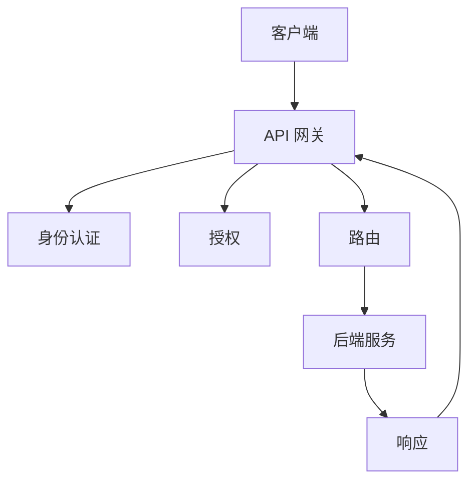
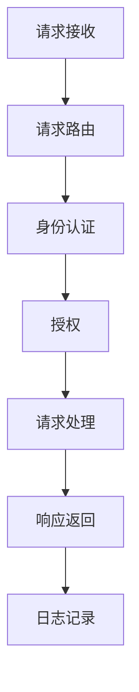
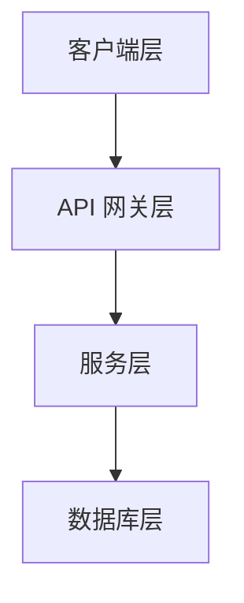
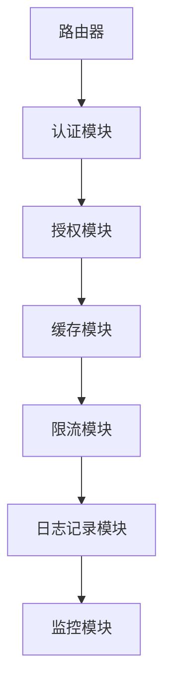

                 

## 《API 网关的安全功能》

> **关键词**：API 网关、安全功能、认证与授权、加密与传输安全、安全防护、安全测试与漏洞扫描、安全策略与合规性、实战案例

> **摘要**：本文深入探讨 API 网关在网络安全中的关键作用，重点分析其安全功能，包括认证与授权、加密与传输安全、安全防护、安全测试与漏洞扫描、安全策略与合规性。通过具体实战案例，本文为构建安全的 API 网关提供实际指导。

## 《API 网关的安全功能》书籍目录大纲

### 第一部分：API 网关概述

#### 第1章：API 网关的定义与作用

##### 1.1.1 API 网关的基本概念

- **定义**：API 网关是什么，其与传统架构的区别
- **基本概念**：API 网关的组成部分、工作流程

##### 1.1.2 API 网关的作用与重要性

- **作用**：API 网关在分布式架构中的重要性
- **重要性**：API 网关在微服务架构中的应用场景

#### 第2章：API 网关技术基础

##### 2.1.1 API 网关的工作原理

- **工作原理**：API 网关如何处理请求和响应
- **工作流程**：请求路由、请求处理、响应返回

##### 2.1.2 API 网关的技术架构

- **技术架构**：API 网关的分层架构、组件功能

##### 2.1.3 API 网关的组件与模块

- **组件**：API 网关的主要组件及其作用
- **模块**：API 网关的扩展模块与功能

### 第二部分：API 网关的安全功能

#### 第3章：API 网关的认证与授权

##### 3.1.1 API 认证机制

- **认证机制**：用户身份验证的方法与流程

###### 3.1.1.1 基于用户名的认证

- **方法**：用户名和密码的验证流程
- **实现**：示例代码与解释

###### 3.1.1.2 基于OAuth 2.0的认证

- **方法**：OAuth 2.0 的认证流程
- **实现**：示例代码与解释

###### 3.1.1.3 单点登录（SSO）

- **方法**：SSO 的实现方式
- **实现**：示例代码与解释

##### 3.1.2 API 授权机制

- **授权机制**：权限控制的方法与流程

###### 3.1.2.1 基于角色的访问控制（RBAC）

- **方法**：RBAC 的实现方式
- **实现**：示例代码与解释

###### 3.1.2.2 基于资源的访问控制（ABAC）

- **方法**：ABAC 的实现方式
- **实现**：示例代码与解释

###### 3.1.2.3 访问令牌与授权码

- **方法**：访问令牌的生成与使用
- **实现**：示例代码与解释

#### 第4章：API 网关的加密与传输安全

##### 4.1.1 TLS/SSL 详解

- **工作原理**：TLS/SSL 的作用与工作流程
- **配置与使用**：TLS/SSL 配置的步骤与最佳实践

##### 4.1.2 数据加密技术

- **加密技术**：对称加密与非对称加密的原理与应用
- **常见加密算法**：AES、RSA 等加密算法的详细说明
- **数据加密实践**：加密技术在 API 网关中的应用示例

#### 第5章：API 网关的安全防护

##### 5.1.1 API 网关的威胁与攻击

- **威胁分析**：常见威胁的类型与特点
- **攻击防护**：防护策略与实践

##### 5.1.2 防火墙与网络安全设备

- **防火墙**：防火墙的作用与配置
- **网络安全设备**：网络安全设备的集成与优化

#### 第6章：API 网关的安全测试与漏洞扫描

##### 6.1.1 安全测试方法

- **测试方法**：安全测试的分类与工具
- **实践**：安全测试的实际操作步骤

##### 6.1.2 漏洞扫描与修复

- **漏洞扫描**：漏洞扫描工具的选择与使用
- **漏洞修复**：漏洞修复的方法与策略

#### 第7章：API 网关的安全策略与合规性

##### 7.1.1 安全策略设计

- **策略设计**：安全策略的制定与实施
- **策略优化**：安全策略的迭代与优化

##### 7.1.2 合规性与法规遵循

- **合规性**：相关法规与标准概述
- **法规遵循**：合规性与安全管理

### 第三部分：API 网关安全实战案例

#### 第8章：API 网关安全案例解析

##### 8.1.1 案例一：某电商平台 API 网关安全防护实践

- **案例背景**：电商平台面临的安全挑战
- **防护措施**：API 网关安全防护的具体措施
- **效果评估**：防护措施的效果评估

##### 8.1.2 案例二：某企业级 API 网关安全策略与实践

- **案例背景**：企业级应用的安全需求
- **安全策略**：安全策略的制定与实施
- **实施效果**：安全策略的实施效果与评估

### 附录：API 网关安全资源与工具

##### 附录 A：API 网关安全工具推荐

- **安全测试工具**：自动化安全测试工具推荐
- **安全防护工具**：API 网关安全防护工具推荐
- **安全策略管理工具**：安全策略管理工具推荐

##### 附录 B：API 网关安全相关资源

- **安全标准与规范**：API 网关安全标准与规范概述
- **最佳实践**：API 网关安全最佳实践
- **研究文献与资料**：API 网关安全研究文献与资料推荐

---

### 第一部分：API 网关概述

#### 第1章：API 网关的定义与作用

##### 1.1.1 API 网关的基本概念

**定义**：API 网关是一种架构组件，负责接收外部客户端的请求，根据路由策略将这些请求转发到相应的后端服务，同时对请求进行预处理和响应后处理。

**基本概念**：API 网关的组成部分包括：

- **路由器**：负责请求的路由和转发
- **身份认证**：验证请求者身份
- **授权**：决定请求者是否具有访问特定资源的权限
- **日志记录**：记录请求和响应的相关信息
- **缓存**：缓存请求和响应，提高性能
- **限流**：限制请求的频率和速率，防止恶意攻击

**API 网关与传统架构的区别**：

- **传统架构**：在传统的客户端-服务器架构中，客户端直接与服务器通信，需要处理多个服务器的请求和响应。
- **API 网关架构**：API 网关作为中间层，统一处理客户端请求和后端服务响应，简化了客户端和后端服务的交互。

**基本概念流程图**：



##### 1.1.2 API 网关的作用与重要性

**作用**：API 网关在分布式架构中扮演着关键角色，主要作用包括：

- **统一接口管理**：为后端服务提供统一的接口，简化客户端的调用流程。
- **流量控制**：通过限流和缓存等技术，控制客户端请求的流量，提高系统稳定性。
- **安全防护**：通过认证和授权机制，确保请求的安全性和合法性。
- **监控与日志**：收集和分析请求和响应的日志信息，帮助监控系统性能和问题。

**重要性**：API 网关在微服务架构中的重要性体现在以下几个方面：

- **服务解耦**：API 网关作为中间层，降低了服务之间的耦合度，提高了系统的可维护性和可扩展性。
- **性能优化**：通过缓存和限流等机制，优化系统的性能和响应速度。
- **安全性**：通过认证和授权等安全功能，保护后端服务的安全性和数据的完整性。
- **灵活性**：支持多种服务协议和接口风格，满足不同客户端的需求。

**API 网关在微服务架构中的应用场景**：

- **API 集成**：将多个后端服务的接口整合为一个统一的接口，简化客户端调用。
- **服务网关**：作为微服务架构中的统一入口，统一处理客户端请求和响应。
- **服务代理**：代理客户端请求到后端服务，实现服务解耦和性能优化。
- **API 隔离**：通过身份认证和授权，隔离不同的客户端和服务，确保安全性。

#### 第2章：API 网关技术基础

##### 2.1.1 API 网关的工作原理

**工作原理**：API 网关的工作原理主要包括以下几个步骤：

1. **请求接收**：API 网关接收客户端发送的请求，包括 HTTP 请求头和请求体。
2. **请求路由**：根据路由策略，将请求转发到相应的后端服务。路由策略可以是固定路由、动态路由等。
3. **身份认证**：对请求者进行身份认证，确保请求者具有访问权限。
4. **授权**：根据请求者的权限，决定是否允许访问特定资源。
5. **请求处理**：将请求转发给后端服务，并接收后端服务的响应。
6. **响应返回**：将后端服务的响应返回给客户端，包括 HTTP 响应头和响应体。
7. **日志记录**：记录请求和响应的相关信息，用于监控和分析。

**工作流程图**：



**API 网关的技术架构**：

API 网关的技术架构主要包括以下几个层次：

1. **客户端层**：客户端发送请求到 API 网关。
2. **API 网关层**：API 网关接收请求并进行处理，包括路由、认证、授权等。
3. **服务层**：后端服务处理请求并返回响应。
4. **数据库层**：存储相关数据和配置信息。

**技术架构图**：



**API 网关的组件与模块**：

API 网关的主要组件和模块包括：

1. **路由器**：负责请求的路由和转发。
2. **认证模块**：实现用户身份认证，如用户名密码认证、OAuth 2.0 认证等。
3. **授权模块**：实现权限控制，如基于角色的访问控制（RBAC）、基于资源的访问控制（ABAC）等。
4. **缓存模块**：缓存请求和响应，提高性能。
5. **限流模块**：限制请求的频率和速率，防止恶意攻击。
6. **日志记录模块**：记录请求和响应的相关信息，用于监控和分析。
7. **监控模块**：监控 API 网关的性能和状态，及时发现和处理问题。

**组件与模块关系图**：



### 第二部分：API 网关的安全功能

#### 第3章：API 网关的认证与授权

##### 3.1.1 API 认证机制

API 认证机制是确保请求者身份合法性的关键环节。以下是几种常见的 API 认证机制：

###### 3.1.1.1 基于用户名的认证

基于用户名的认证是最简单的一种认证方式，通常结合密码或密钥进行身份验证。以下是一个简单的基于用户名的认证流程：

1. 客户端向 API 网关发送请求，请求头中包含用户名和密码。
2. API 网关接收到请求后，提取用户名和密码。
3. API 网关使用内置的用户数据库或认证服务验证用户名和密码的正确性。
4. 如果验证通过，API 网关允许请求继续执行；否则，返回认证失败的结果。

以下是一个简单的伪代码示例：

```python
def authenticate(username, password):
    # 从数据库中查找用户信息
    user = find_user(username)
    # 比较密码是否匹配
    if user and check_password(password, user.password):
        return "Authentication successful"
    else:
        return "Authentication failed"

# 客户端请求示例
response = send_request("GET", "/api/resource", {"username": "user", "password": "password"})
print(response)
```

###### 3.1.1.2 基于OAuth 2.0的认证

OAuth 2.0 是一种开放标准，用于授权第三方应用访问用户资源的有限权限。基于 OAuth 2.0 的认证流程如下：

1. 客户端向授权服务器请求授权码。
2. 用户在授权服务器上确认授权。
3. 授权服务器生成授权码，并将其发送给客户端。
4. 客户端使用授权码向认证服务器请求访问令牌。
5. 认证服务器验证授权码并生成访问令牌。
6. 客户端将访问令牌发送给 API 网关。
7. API 网关使用访问令牌验证客户端的权限。

以下是一个简单的 OAuth 2.0 认证流程伪代码示例：

```python
# 客户端请求授权码
response = send_request("GET", "https://authserver.com/oauth2/authorize", {
    "response_type": "code",
    "client_id": "client_id",
    "redirect_uri": "https://client.com/callback",
    "scope": "read_write"
})

# 用户在授权服务器上确认授权
code = extract_code_from_response(response)

# 客户端请求访问令牌
response = send_request("POST", "https://authserver.com/oauth2/token", {
    "grant_type": "authorization_code",
    "code": code,
    "redirect_uri": "https://client.com/callback",
    "client_id": "client_id",
    "client_secret": "client_secret"
})

# 提取访问令牌
access_token = extract_access_token_from_response(response)

# 客户端发送带有访问令牌的请求
response = send_request("GET", "/api/resource", {
    "access_token": access_token
})
print(response)
```

###### 3.1.1.3 单点登录（SSO）

单点登录（SSO）是一种集中管理身份验证的机制，用户只需登录一次，即可访问多个系统。基于 SSO 的认证流程如下：

1. 用户访问 API 网关。
2. API 网关检查用户是否已经登录，如果没有，则重定向到 SSO 登录页面。
3. 用户在 SSO 登录页面输入用户名和密码。
4. SSO 服务器验证用户身份并生成登录令牌。
5. SSO 服务器将登录令牌发送给 API 网关。
6. API 网关使用登录令牌验证用户身份。

以下是一个简单的 SSO 认证流程伪代码示例：

```python
# 用户访问 API 网关
response = send_request("GET", "/api/resource")

# API 网关检查用户是否已经登录
if not is_logged_in(response):
    # 重定向到 SSO 登录页面
    redirect_to_login_page("https://sso.server.com/login")

# 用户在 SSO 登录页面输入用户名和密码
username = input("Username: ")
password = input("Password: ")

# SSO 服务器验证用户身份并生成登录令牌
response = send_request("POST", "https://sso.server.com/login", {
    "username": username,
    "password": password
})

# 提取登录令牌
login_token = extract_login_token_from_response(response)

# API 网关使用登录令牌验证用户身份
response = send_request("POST", "/api/resource", {
    "login_token": login_token
})
print(response)
```

##### 3.1.2 API 授权机制

API 授权机制用于确定请求者是否有权限访问特定资源。以下是几种常见的 API 授权机制：

###### 3.1.2.1 基于角色的访问控制（RBAC）

基于角色的访问控制（RBAC）是一种常见的授权机制，它根据用户角色来分配权限。以下是一个简单的 RBAC 授权流程：

1. 用户登录并获取一个身份验证令牌。
2. 用户尝试访问一个受保护的资源。
3. API 网关检查用户身份验证令牌的有效性。
4. API 网关根据用户的角色检查是否有权限访问该资源。
5. 如果有权限，API 网关允许请求继续执行；否则，返回授权失败的结果。

以下是一个简单的 RBAC 授权流程伪代码示例：

```python
# 用户登录并获取身份验证令牌
auth_token = login()

# 用户尝试访问受保护的资源
response = send_request("GET", "/api/resource", {
    "auth_token": auth_token
})

# API 网关检查用户身份验证令牌的有效性
if is_token_valid(auth_token):
    # 检查用户角色
    role = get_user_role(auth_token)
    if role_has_permission(role, "read_resource"):
        # 有权限，允许请求继续执行
        print("Access granted")
    else:
        # 无权限，返回授权失败的结果
        print("Access denied")
else:
    # 身份验证令牌无效，返回授权失败的结果
    print("Authentication failed")
```

###### 3.1.2.2 基于资源的访问控制（ABAC）

基于资源的访问控制（ABAC）是一种根据资源属性和用户属性来决定授权的机制。以下是一个简单的 ABAC 授权流程：

1. 用户登录并获取一个身份验证令牌。
2. 用户尝试访问一个受保护的资源。
3. API 网关检查用户身份验证令牌的有效性。
4. API 网关根据资源的属性和用户的属性检查是否有权限访问该资源。
5. 如果有权限，API 网关允许请求继续执行；否则，返回授权失败的结果。

以下是一个简单的 ABAC 授权流程伪代码示例：

```python
# 用户登录并获取身份验证令牌
auth_token = login()

# 用户尝试访问受保护的资源
response = send_request("GET", "/api/resource", {
    "auth_token": auth_token
})

# API 网关检查用户身份验证令牌的有效性
if is_token_valid(auth_token):
    # 获取资源属性
    resource_attributes = get_resource_attributes("/api/resource")
    # 获取用户属性
    user_attributes = get_user_attributes(auth_token)
    # 根据资源属性和用户属性检查权限
    if resource_attributes["read_permission"] == "allowed" and user_attributes["role"] == "admin":
        # 有权限，允许请求继续执行
        print("Access granted")
    else:
        # 无权限，返回授权失败的结果
        print("Access denied")
else:
    # 身份验证令牌无效，返回授权失败的结果
    print("Authentication failed")
```

###### 3.1.2.3 访问令牌与授权码

访问令牌（Access Token）和授权码（Authorization Code）是 OAuth 2.0 标准中用于授权的两种令牌。以下是对这两种令牌的简要说明：

- **访问令牌（Access Token）**：访问令牌是一个字符串，用于访问受保护的资源。访问令牌通常由授权服务器颁发，并包含访问权限和有效时间等信息。用户在获取访问令牌后，可以将它作为请求头的一部分发送给 API 网关，以证明自己有权访问受保护的资源。

- **授权码（Authorization Code）**：授权码是一个字符串，用于证明用户已经同意授权第三方应用访问其资源。授权码由授权服务器颁发，并要求第三方应用在请求访问令牌时提供。授权码通常是一次性的，使用后立即失效。

以下是一个简单的访问令牌和授权码的示例：

```python
# 用户获取授权码
response = send_request("GET", "https://authserver.com/oauth2/authorize", {
    "response_type": "code",
    "client_id": "client_id",
    "redirect_uri": "https://client.com/callback",
    "scope": "read_write"
})
code = extract_code_from_response(response)

# 客户端请求访问令牌
response = send_request("POST", "https://authserver.com/oauth2/token", {
    "grant_type": "authorization_code",
    "code": code,
    "redirect_uri": "https://client.com/callback",
    "client_id": "client_id",
    "client_secret": "client_secret"
})
access_token = extract_access_token_from_response(response)

# 客户端发送带有访问令牌的请求
response = send_request("GET", "/api/resource", {
    "access_token": access_token
})
print(response)
```

#### 第4章：API 网关的加密与传输安全

##### 4.1.1 TLS/SSL 详解

TLS/SSL（传输层安全/安全套接层）是一种用于保护网络通信的安全协议，它通过加密通信数据来确保数据的机密性、完整性和认证性。以下是对 TLS/SSL 的详细解释：

**工作原理**：

- **握手过程**：当客户端与服务器建立连接时，双方会通过握手过程协商加密算法和密钥，确保通信双方的安全。
- **加密过程**：在握手完成后，客户端和服务器使用协商好的加密算法对数据进行加密和解密，确保数据在传输过程中的机密性。
- **认证过程**：TLS/SSL 通过证书认证来确保通信双方的身份，防止中间人攻击。

**配置与使用**：

- **证书配置**：TLS/SSL 需要使用证书来确保通信的安全，证书由证书颁发机构（CA）签发。配置 TLS/SSL 时，需要将证书和私钥配置到服务器上。
- **浏览器支持**：现代浏览器支持 TLS/SSL，用户可以通过 HTTPS（HTTP over TLS/SSL）访问网站，确保数据在传输过程中的安全性。

**优化与性能**：

- **证书优化**：为了提高 TLS/SSL 的性能，可以使用证书优化技术，如证书链优化、证书压缩等。
- **性能监控**：定期监控 TLS/SSL 的性能，及时发现和处理问题。

**常见问题**：

- **证书过期**：定期检查证书有效期，及时更新证书，防止证书过期导致连接失败。
- **证书不信任**：确保服务器上的证书由受信任的 CA 签发，避免浏览器提示证书不信任。

**示例**：

以下是一个简单的 TLS/SSL 配置示例：

```python
# 生成证书和私钥
openssl req -new -x509 -days 365 -nodes -out server.crt -keyout server.key
openssl genrsa -out server.key 2048

# 配置 TLS/SSL
ssl_certificate = server.crt
ssl_certificate_key = server.key
ssl_protocols = TLSv1.2
ssl_ciphers = HIGH:!aNULL:!MD5

# 启用 HTTPS
use_https = True
```

##### 4.1.2 数据加密技术

数据加密技术用于保护数据在传输过程中的机密性，防止数据被窃取或篡改。以下是对数据加密技术的详细解释：

**对称加密与非对称加密**：

- **对称加密**：对称加密使用相同的密钥对数据进行加密和解密。常见的对称加密算法有 AES、DES 等。
- **非对称加密**：非对称加密使用一对密钥（公钥和私钥）进行加密和解密。公钥用于加密，私钥用于解密。常见的非对称加密算法有 RSA、ECC 等。

**常见加密算法**：

- **AES**：高级加密标准（AES）是一种对称加密算法，具有高效性和安全性。
- **RSA**：RSA 是一种非对称加密算法，具有高安全性和灵活性。
- **ECC**：椭圆曲线密码学（ECC）是一种非对称加密算法，具有更高的安全性和效率。

**数据加密实践**：

- **数据加密存储**：将敏感数据加密存储在数据库或文件系统中，防止数据泄露。
- **数据加密传输**：使用 TLS/SSL 等加密协议对数据进行加密传输，确保数据在传输过程中的安全性。

以下是一个简单的数据加密实践示例：

```python
# 加密数据
def encrypt_data(data, key):
    cipher = AES.new(key, AES.MODE_EAX)
    ciphertext, tag = cipher.encrypt_and_digest(data)
    return cipher.nonce, ciphertext, tag

# 解密数据
def decrypt_data(nonce, ciphertext, tag, key):
    cipher = AES.new(key, AES.MODE_EAX, nonce=nonce)
    data = cipher.decrypt_and_verify(ciphertext, tag)
    return data
```

#### 第5章：API 网关的安全防护

##### 5.1.1 API 网关的威胁与攻击

API 网关作为系统中的关键组件，面临着多种威胁和攻击。以下是一些常见的威胁和攻击手段：

**DDoS 攻击**：分布式拒绝服务（DDoS）攻击旨在使系统无法正常提供服务。攻击者通过大量无效请求占用系统资源，导致系统无法响应正常请求。

**SQL 注入**：SQL 注入攻击是一种常见的 Web 攻击方式，攻击者通过在输入字段中插入恶意 SQL 查询，篡改数据库数据或执行未授权的操作。

**XSS 攻击**：跨站脚本（XSS）攻击是一种利用 Web 应用程序漏洞，在用户浏览器中注入恶意脚本，窃取用户信息或执行恶意操作的攻击。

**认证攻击**：认证攻击包括暴力破解、中间人攻击等，攻击者试图获取用户的认证信息，从而非法访问系统。

**访问控制攻击**：访问控制攻击旨在绕过系统的权限控制，非法访问受限资源。

**常见攻击手段与案例**：

- **DDoS 攻击**：例如，2016 年 Mirai 僵尸网络对 Dyn DNS 服务器的攻击，导致多个知名网站暂时无法访问。
- **SQL 注入**：例如，2017 年 TripAdvisor 网站遭受 SQL 注入攻击，导致约 1.25 亿用户的个人信息泄露。
- **XSS 攻击**：例如，2018 年 LinkedIn 网站遭受 XSS 攻击，导致用户的登录凭据被盗取。
- **认证攻击**：例如，2019 年 Facebook 漏洞导致攻击者通过暴力破解攻击获取用户的登录凭据。
- **访问控制攻击**：例如，2017 年 Ticketmaster 网站遭受访问控制攻击，导致超过 1 亿用户的数据泄露。

**攻击防护策略**：

- **DDoS 防护**：使用 DDoS 防火墙、流量清洗等技术，检测和过滤恶意流量。
- **SQL 注入防护**：使用预编译语句、参数化查询等技术，防止 SQL 注入攻击。
- **XSS 防护**：使用内容安全策略（CSP）等技术，防止恶意脚本注入。
- **认证防护**：使用强密码、多因素认证等技术，提高认证安全性。
- **访问控制防护**：使用基于角色的访问控制（RBAC）、基于资源的访问控制（ABAC）等技术，确保权限控制的有效性。

**防火墙与网络安全设备**：

- **防火墙**：防火墙是网络安全的基础设施，用于监控和控制进出网络的数据包。防火墙可以根据安全策略，过滤和阻止恶意流量。
- **网络安全设备**：包括入侵检测系统（IDS）、入侵防御系统（IPS）、统一威胁管理（UTM）等，用于检测和防御网络攻击。

以下是一个简单的防火墙配置示例：

```python
# 配置防火墙规则
iptables -A INPUT -p tcp --dport 80 -j ACCEPT
iptables -A INPUT -p tcp --dport 443 -j ACCEPT
iptables -A INPUT -p udp --dport 53 -j ACCEPT
iptables -A INPUT -j DROP
```

#### 第6章：API 网关的安全测试与漏洞扫描

##### 6.1.1 安全测试方法

安全测试是确保 API 网关安全性的重要步骤。以下是一些常见的安全测试方法：

**自动化安全测试工具**：

- **ZAP**：ZAP（Zed Attack Proxy）是一款开源的自动化安全测试工具，可以模拟各种攻击，检测 API 网关的安全漏洞。
- **OWASP ZAP**：OWASP ZAP 是一款开源的自动化安全测试工具，支持多种漏洞检测功能，包括 SQL 注入、XSS、认证问题等。
- **Burp Suite**：Burp Suite 是一款功能强大的自动化安全测试工具，可以用于漏洞扫描、攻击模拟等。

**手动安全测试实践**：

- **黑盒测试**：黑盒测试是一种不依赖内部知识的测试方法，测试人员从外部尝试各种可能的攻击方式，以发现安全漏洞。
- **白盒测试**：白盒测试是一种基于代码内部结构的测试方法，测试人员通过分析代码，寻找潜在的安全漏洞。
- **灰盒测试**：灰盒测试是黑盒测试和白盒测试的结合，测试人员部分了解代码内部结构，从而进行更深入的安全测试。

以下是一个简单的安全测试实践示例：

```python
# 使用 ZAP 进行自动化安全测试
import zap

# 初始化 ZAP
zap.init()

# 添加测试目标
zap.add_target("https://api.example.com")

# 开始扫描
zap.start_scan()

# 检查漏洞报告
reports = zap.get_scan_results()
for report in reports:
    print(report.title, report风险级别)

# 关闭 ZAP
zap.close()
```

##### 6.1.2 漏洞扫描与修复

漏洞扫描是识别 API 网关潜在安全漏洞的重要手段。以下是对漏洞扫描和修复的详细说明：

**漏洞扫描工具**：

- **Nessus**：Nessus 是一款强大的漏洞扫描工具，可以扫描操作系统、应用程序和配置文件，发现潜在的安全漏洞。
- **OpenVAS**：OpenVAS 是一款开源的漏洞扫描工具，支持多种漏洞扫描功能，适用于企业级安全测试。

**漏洞扫描步骤**：

1. 选择合适的漏洞扫描工具。
2. 配置扫描目标，包括 IP 地址、端口等。
3. 运行扫描，收集系统漏洞信息。
4. 分析扫描结果，识别潜在的安全漏洞。

以下是一个简单的漏洞扫描示例：

```python
# 使用 Nessus 进行漏洞扫描
import Nessus

# 创建 Nessus 客户端
client = Nessus.Client("nessususer", "nessuspassword")

# 配置扫描目标
target = Nessus.Target("192.168.1.1", "8080")

# 运行扫描
scan_id = client.scan(target)

# 获取扫描结果
results = client.get_scan_results(scan_id)
for result in results:
    print(result.name, result风险级别)
```

**漏洞修复与安全加固**：

1. 分析漏洞扫描结果，确定优先级和修复计划。
2. 针对每个漏洞，选择适当的修复方法，如更新软件、修改配置等。
3. 检查修复效果，确保漏洞已被彻底修复。
4. 定期进行安全检查和漏洞扫描，确保系统的安全性。

以下是一个简单的漏洞修复示例：

```python
# 修复漏洞
import修复工具

# 获取漏洞信息
vulnerability = 获取漏洞信息()

# 根据漏洞信息选择修复方法
if vulnerability.type == "软件更新":
    修复工具.update_software(vulnerability.name)
elif vulnerability.type == "配置修改":
    修复工具.modify_config(vulnerability.name, vulnerability.config)
else:
    print("未知漏洞类型，无法修复")
```

#### 第7章：API 网关的安全策略与合规性

##### 7.1.1 安全策略设计

安全策略是确保 API 网关安全性的重要指南。以下是对安全策略设计和实施的详细说明：

**安全策略设计**：

1. **需求分析**：分析 API 网关的业务需求和安全需求，确定需要实现的安全功能。
2. **风险评估**：评估 API 网关面临的安全风险，确定安全策略的重点。
3. **策略制定**：根据需求分析和风险评估结果，制定安全策略。
4. **策略实施**：将安全策略转化为具体的配置和操作，确保安全策略得到有效实施。

以下是一个简单的安全策略设计示例：

```python
# 安全策略设计
def design_security_policy():
    # 需求分析
    requirements = analyze_requirements()

    # 风险评估
    risks = assess_risks()

    # 策略制定
    policy = create_policy(requirements, risks)

    # 策略实施
    implement_policy(policy)
```

**安全策略实施**：

1. **配置安全设置**：配置 API 网关的安全设置，如身份认证、加密等。
2. **部署安全工具**：部署安全工具，如防火墙、入侵检测系统等。
3. **监控与审计**：监控 API 网关的安全状态，记录审计日志。
4. **培训与意识**：对相关人员进行安全培训，提高安全意识。

以下是一个简单的安全策略实施示例：

```python
# 安全策略实施
def implement_security_policy(policy):
    # 配置安全设置
    configure_security_settings(policy)

    # 部署安全工具
    deploy_security_tools(policy)

    # 监控与审计
    monitor_and_audit(policy)

    # 培训与意识
    train_and_awareness(policy)
```

**策略优化与迭代**：

1. **定期评估**：定期对安全策略进行评估，检查策略的有效性和适应性。
2. **调整策略**：根据评估结果，调整安全策略，确保策略与时俱进。
3. **反馈与改进**：收集用户反馈和安全事件，持续改进安全策略。

以下是一个简单的策略优化与迭代示例：

```python
# 策略优化与迭代
def optimize_security_policy(policy):
    # 定期评估
    assess_policy(policy)

    # 调整策略
    adjust_policy(policy)

    # 反馈与改进
    improve_policy(policy)
```

##### 7.1.2 合规性与法规遵循

合规性是确保 API 网关符合相关法规和标准的要求。以下是对合规性和法规遵循的详细说明：

**相关法规与标准概述**：

- **GDPR（通用数据保护条例）**：GDPR 是欧盟制定的数据保护法规，要求企业保护用户个人数据。
- **PCI DSS（支付卡行业数据安全标准）**：PCI DSS 是支付卡行业制定的数据安全标准，要求企业保护支付卡数据。
- **ISO 27001**：ISO 27001 是国际标准化组织制定的信息安全管理体系标准。

**合规性与安全管理**：

1. **合规性评估**：评估 API 网关是否符合相关法规和标准的要求。
2. **合规性验证**：验证 API 网关的合规性，确保安全控制措施得到有效实施。
3. **合规性维护**：定期检查 API 网关的合规性，及时更新和调整安全控制措施。

以下是一个简单的合规性评估示例：

```python
# 合规性评估
def assess_compliance():
    # 评估 GDPR 合规性
    gdpr_compliance = assess_gdpr_compliance()

    # 评估 PCI DSS 合规性
    pci_dss_compliance = assess_pci_dss_compliance()

    # 评估 ISO 27001 合规性
    iso_27001_compliance = assess_iso_27001_compliance()

    # 汇总合规性评估结果
    compliance_results = {
        "GDPR": gdpr_compliance,
        "PCI DSS": pci_dss_compliance,
        "ISO 27001": iso_27001_compliance
    }
    return compliance_results
```

### 第三部分：API 网关安全实战案例

#### 第8章：API 网关安全案例解析

##### 8.1.1 案例一：某电商平台 API 网关安全防护实践

**案例背景**：

某电商平台是一家大型在线零售商，其 API 网关负责处理来自各种客户端的请求，如移动应用、第三方合作伙伴和内部系统。由于业务规模庞大，平台面临着严峻的安全挑战。

**防护措施与效果**：

1. **身份认证**：采用 OAuth 2.0 认证机制，确保请求者身份的合法性。同时，实现单点登录（SSO），提高用户体验。
2. **授权**：使用基于角色的访问控制（RBAC）和基于资源的访问控制（ABAC），确保请求者有权访问特定的资源。
3. **加密与传输安全**：使用 TLS/SSL 加密通信数据，确保数据在传输过程中的机密性和完整性。
4. **安全防护**：配置防火墙和网络安全设备，防止恶意攻击和非法访问。同时，实施 DDoS 防护措施，确保平台在遭受大规模攻击时仍能正常运行。
5. **安全测试与漏洞扫描**：定期进行安全测试和漏洞扫描，及时发现和修复安全漏洞。

**效果评估**：

通过上述防护措施，平台成功抵御了多种安全威胁，包括 SQL 注入、XSS 攻击和 DDoS 攻击等。安全测试和漏洞扫描发现并修复了多个潜在的安全漏洞，确保了平台的稳定性和安全性。

**案例总结**：

该案例展示了 API 网关在电子商务平台中的重要性，以及如何通过综合的安全措施确保平台的安全性和稳定性。同时，案例中的实践经验为其他企业提供了宝贵的参考和借鉴。

##### 8.1.2 案例二：某企业级 API 网关安全策略与实践

**案例背景**：

某企业级应用提供商开发了一款企业级 API 网关，用于管理其内部和第三方服务的接口。由于企业用户对安全性有较高的要求，平台需要制定并实施严格的安全策略。

**安全策略制定**：

1. **需求分析**：分析企业用户的安全需求，确定需要实现的安全功能。
2. **风险评估**：评估 API 网关面临的安全风险，确定安全策略的重点。
3. **策略制定**：根据需求分析和风险评估结果，制定安全策略，包括身份认证、授权、加密与传输安全等。

**安全策略实施**：

1. **配置安全设置**：配置 API 网关的安全设置，如身份认证、加密等。
2. **部署安全工具**：部署安全工具，如防火墙、入侵检测系统等。
3. **监控与审计**：监控 API 网关的安全状态，记录审计日志。
4. **培训与意识**：对相关人员进行安全培训，提高安全意识。

**实施效果**：

通过制定和实施严格的安全策略，企业级 API 网关成功抵御了多种安全威胁，包括 SQL 注入、XSS 攻击和 DDoS 攻击等。安全测试和漏洞扫描发现并修复了多个潜在的安全漏洞，确保了平台的稳定性和安全性。

**案例总结**：

该案例展示了企业级 API 网关在安全管理中的重要性，以及如何通过制定和实施严格的安全策略确保平台的安全性和合规性。同时，案例中的实践经验为其他企业提供了一定的参考和借鉴。

### 附录：API 网关安全资源与工具

##### 附录 A：API 网关安全工具推荐

- **API 网关安全测试工具**：

  - **OWASP ZAP**：一款开源的自动化安全测试工具，支持多种漏洞检测功能。

  - **Burp Suite**：一款功能强大的自动化安全测试工具，适用于 API 网关的安全测试。

- **API 网关安全防护工具**：

  - **NGINX**：一款高性能的 Web 服务器，支持 TLS/SSL 加密、认证和授权等功能。

  - **Kong**：一款开源的 API 网关，支持多种安全功能，如加密、认证和限流等。

- **API 网关安全策略管理工具**：

  - **Keycloak**：一款开源的身份认证和访问管理工具，支持 OAuth 2.0 和 SSO。

  - **Spring Security**：一款基于 Java 的安全框架，支持多种安全功能，如身份认证、授权和加密等。

##### 附录 B：API 网关安全相关资源

- **API 网关安全标准与规范**：

  - **OWASP API Security Cheatsheet**：OWASP 提供的 API 安全指南，涵盖常见的 API 安全问题和防护措施。

  - **API Security Best Practices**：API 安全最佳实践，提供 API 安全性的实用建议。

- **API 网关安全最佳实践**：

  - **Designing and Implementing API Security**：设计并实现 API 安全的指南，涵盖 API 安全的设计和实现。

  - **API Security in the Cloud**：云计算环境中的 API 安全，介绍云环境下的 API 安全防护措施。

- **API 网关安全研究文献与资料**：

  - **API Security: From Design to Deployment**：API 安全的完整指南，涵盖 API 安全的各个方面。

  - **The API Security Handbook**：API 安全手册，提供 API 安全的深入研究和最佳实践。

