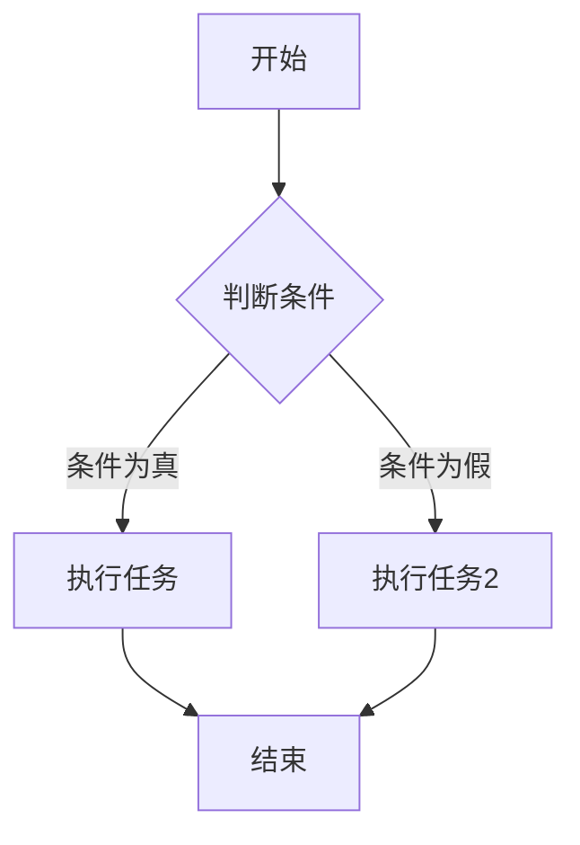

                 

# Andrej Karpathy：AI 大神

## 关键词：
- Andrej Karpathy
- AI 大模型
- 深度学习
- 自然语言处理
- 计算机视觉
- 推荐系统

## 摘要：
本文深入探讨了一位AI领域的杰出人物：Andrej Karpathy。文章首先概述了AI大模型的基本概念、特点和应用领域，随后详细分析了AI大模型的构建基础、自然语言处理中的应用、计算机视觉中的应用、推荐系统中的应用以及金融领域的应用。同时，文章还讨论了AI大模型的安全与伦理问题以及未来的发展趋势。通过本文，读者可以全面了解Andrej Karpathy在AI领域的重要贡献和他所代表的AI大模型的深远影响。

### 第一部分: AI大模型基础

#### 第1章: AI大模型概述

#### 1.1 AI大模型的基本概念

AI大模型是指具有高参数量、大规模数据集的深度学习模型。这种模型通过学习大量的数据来提取复杂的特征，从而具有强大的泛化能力。

- **深度学习模型**：由多层神经网络组成，能够通过学习大量的数据来提取复杂的特征。每个神经元都接收前一层神经元的输出，并通过激活函数进行处理，最终输出预测结果。

- **大规模数据集**：大规模、多样化的数据集有助于模型更好地泛化。数据集的大小直接影响模型的效果，因为模型需要足够的数据来学习特征。

#### 1.2 AI大模型的特点

- **高参数量**：AI大模型具有数百万甚至数十亿个参数。这些参数需要通过大规模数据集进行训练，以便模型能够学习到有效的特征。

- **大规模训练**：AI大模型通常需要大量的计算资源和时间进行训练。这是因为模型需要处理大量的数据，并进行多次迭代来优化参数。

- **强大的泛化能力**：AI大模型通过学习大量的数据，可以提取到具有普遍性的特征，从而在新的数据集上表现出强大的泛化能力。

#### 1.3 AI大模型的技术背景

AI大模型的发展得益于以下几个方面：

- **深度学习的兴起**：深度学习作为AI的核心技术，其兴起可以追溯到20世纪80年代。近年来，随着计算能力和数据集的爆炸式增长，深度学习取得了巨大的成功。

- **大数据处理技术的成熟**：Hadoop、Spark等大数据处理技术的成熟，使得处理大规模数据成为可能。这些技术提供了高效的数据存储、处理和分析方法，为AI大模型的发展提供了坚实的基础。

- **计算能力提升**：GPU、TPU等专用硬件的发明，大幅提升了深度学习模型的训练速度。这些硬件可以并行处理大量的数据，从而大大缩短了模型的训练时间。

#### 1.4 AI大模型的应用领域

AI大模型在多个领域都有广泛的应用，包括但不限于：

- **自然语言处理**：包括文本分类、机器翻译、语音识别等。AI大模型可以处理海量的文本数据，提取出丰富的语义特征，从而实现高效的文本理解和生成。

- **计算机视觉**：包括图像分类、目标检测、图像生成等。AI大模型可以通过学习大量的图像数据，提取出具有高度识别能力的特征，从而在图像识别任务中取得优异的性能。

- **推荐系统**：AI大模型可以通过学习用户行为数据和物品特征，实现个性化的推荐。在电商、社交媒体等场景中，AI大模型可以帮助平台为用户推荐感兴趣的内容或商品。

- **金融**：AI大模型可以用于信用评分、风险管理、智能投顾等任务。通过学习大量的金融数据，AI大模型可以提取出有效的特征，从而在金融领域发挥重要作用。

#### 1.5 AI大模型的未来发展趋势

随着技术的不断发展，AI大模型在以下几个方面有望取得重要突破：

- **模型压缩与高效推理**：为了应对模型在移动设备和边缘设备上的应用，模型压缩与高效推理技术至关重要。通过压缩模型大小和优化推理算法，可以实现更高效的模型部署。

- **多模态学习**：结合多种数据类型，如文本、图像、音频等，可以实现更全面的智能。多模态学习将有助于模型在复杂任务中发挥更好的性能。

- **自监督学习**：自监督学习是一种无需人工标注数据的训练方法，直接从大规模未标注数据中学习。这种方法有望减少数据标注成本，提高模型的泛化能力。

#### 1.6 本章总结

AI大模型作为当前AI领域的热点，其基础概念、技术背景和应用领域都需要深入理解。未来，随着技术的不断发展，AI大模型将在更多领域发挥重要作用。

#### 第2章: AI大模型构建基础

##### 2.1 深度学习基础

##### 2.1.1 神经网络的基本结构

神经网络是由一系列相互连接的神经元组成的计算模型。一个典型的神经网络包括输入层、隐藏层和输出层。

- **输入层**：接收外部输入数据。
- **隐藏层**：负责对输入数据进行特征提取和变换。
- **输出层**：生成最终的输出结果。

神经网络的每个神经元都通过权重与前一层的神经元相连，并使用激活函数对输入进行处理。

##### 2.1.2 前馈神经网络

前馈神经网络是一种无循环的神经网络，数据从前向后传递，每个节点只能影响后面的节点。这种网络结构简单，易于实现和优化。

##### 2.1.3 激活函数

激活函数是神经网络中用于引入非线性的关键组件。常见的激活函数包括ReLU、Sigmoid和Tanh等。

- **ReLU（Rectified Linear Unit）**：对于输入小于0的部分，输出为0；对于输入大于等于0的部分，输出为输入本身。ReLU函数简单且易于计算，有助于加快模型训练速度。

- **Sigmoid**：将输入映射到(0,1)区间。Sigmoid函数可以用于二分类问题，但其梯度较小，可能导致训练困难。

- **Tanh**：将输入映射到(-1,1)区间。Tanh函数与Sigmoid函数类似，但其梯度更大，有助于提高模型训练速度。

##### 2.2 优化算法

优化算法用于调整神经网络中的参数，以最小化损失函数。常见的优化算法包括随机梯度下降（SGD）和Adam等。

- **随机梯度下降（SGD）**：每次迭代只更新一个样本的参数，并计算该样本的梯度。SGD算法简单，但可能收敛较慢。

- **Adam**：结合了SGD和Momentum的优点，适用于大部分深度学习任务。Adam算法通过自适应地调整学习率，提高模型的收敛速度。

##### 2.3 大规模数据处理

##### 2.3.1 数据预处理

在深度学习模型训练过程中，数据预处理至关重要。常见的数据预处理方法包括标准化、归一化和缺失值处理等。

- **标准化**：将数据缩放到相同的范围，如(-1,1)或(0,1)。标准化可以加速模型训练，提高模型性能。

- **归一化**：通过缩放数据，使其满足一定的分布。归一化可以简化模型训练过程，提高模型泛化能力。

- **缺失值处理**：处理缺失数据，如填充、删除或插值等方法。

##### 2.3.2 数据增强

数据增强是通过增加数据多样性来提高模型泛化能力的方法。常见的数据增强方法包括旋转、缩放、剪裁等。

- **旋转**：将图像随机旋转一定角度。
- **缩放**：将图像随机缩放到不同的尺度。
- **剪裁**：从图像中随机剪裁一部分作为新的训练样本。

##### 2.4 训练策略

##### 2.4.1 批处理大小

批处理大小是指在每次迭代中参与训练的样本数量。批处理大小会影响模型的训练速度和泛化能力。

- **较小的批处理大小**：有助于减少方差，提高模型的泛化能力。
- **较大的批处理大小**：有助于减少偏置，提高模型的训练速度。

##### 2.4.2 训练与验证

在模型训练过程中，通常需要将数据集划分为训练集和验证集。

- **训练集**：用于模型参数的更新。
- **验证集**：用于评估模型性能，调整模型参数。

通过交叉验证，可以进一步评估模型的泛化能力。

##### 2.5 模型评估

模型评估是判断模型性能的重要步骤。常见的评估指标包括准确率、召回率、F1值和AUC值等。

- **准确率**：预测正确的样本数占总样本数的比例。
- **召回率**：预测正确的样本数占实际正确样本数的比例。
- **F1值**：准确率和召回率的调和平均值。
- **AUC值**：ROC曲线下的面积。

##### 2.6 本章总结

AI大模型的构建涉及深度学习的基础、优化算法、数据处理策略、训练策略和模型评估。通过理解这些基本概念，可以更好地构建和优化AI大模型。

#### 第3章: AI大模型在自然语言处理中的应用

##### 3.1 自然语言处理基础

##### 3.1.1 语言模型

语言模型是一种概率模型，用于预测下一个单词。常见的语言模型包括N-gram模型、隐马尔可夫模型（HMM）和神经网络模型等。

- **N-gram模型**：基于历史词序列的概率模型，下一个词的概率取决于前面几个词。
- **隐马尔可夫模型（HMM）**：用于处理序列数据的概率模型，隐藏状态序列和观测序列之间的关系。
- **神经网络模型**：包括循环神经网络（RNN）、长短期记忆网络（LSTM）和门控循环单元（GRU）等，可以学习复杂的语言特征。

##### 3.1.2 词嵌入

词嵌入是将单词映射到高维向量空间的过程。词嵌入可以捕捉单词的语义和语法信息，从而提高模型性能。

- **One-hot编码**：将每个单词映射到一个one-hot向量，但这种方法维度爆炸。
- **Word2Vec**：基于神经网络的词向量模型，可以学习到语义相似的词具有相似的向量表示。
- **GloVe**：基于全局平均的方法，通过优化词向量之间的相似性，提高词嵌入的质量。
- **BERT**：基于Transformer的预训练模型，通过同时考虑上下文信息，生成高质量的词向量。

##### 3.1.3 语义分析

语义分析是理解句子含义并进行语义表示的过程。常见的语义分析方法包括词性标注、命名实体识别、情感分析和文本生成等。

- **词性标注**：对句子中的每个词进行词性标注，如名词、动词、形容词等。
- **命名实体识别**：识别句子中的命名实体，如人名、地名、组织名等。
- **情感分析**：判断句子或文本的情感倾向，如积极、消极、中性等。
- **文本生成**：根据给定的输入，生成新的文本。

##### 3.2 GPT模型详解

##### 3.2.1 GPT模型概述

GPT（Generative Pre-trained Transformer）是一种基于Transformer的预训练模型，用于自然语言生成。GPT模型通过自监督学习在大规模语料库上预训练，然后通过微调应用于各种自然语言处理任务。

- **自监督学习**：GPT模型利用未标记的文本数据，通过预测下一个词来学习语言特征。
- **预训练与微调**：预训练阶段，GPT模型在大规模语料库上学习语言模式；微调阶段，根据特定任务对模型进行调整。

##### 3.2.2 GPT模型架构

GPT模型采用Transformer架构，其中最重要的组件是自注意力机制。

- **自注意力机制**：GPT模型通过自注意力机制计算每个词的权重，从而更好地捕捉上下文信息。
- **位置编码**：为了处理序列数据，GPT模型使用位置编码来表示词的位置信息。
- **多层堆叠**：GPT模型通过多层自注意力机制和全连接层进行堆叠，以提高模型的表达能力。

##### 3.2.3 GPT模型训练

GPT模型的训练分为两个阶段：预训练和微调。

- **预训练**：在预训练阶段，GPT模型通过自监督学习在大规模语料库上学习语言特征。预训练过程中，模型通过预测下一个词来优化参数。
- **微调**：在微调阶段，GPT模型根据特定任务的数据进行微调，以适应具体的自然语言处理任务。

##### 3.3 BERT模型详解

BERT（Bidirectional Encoder Representations from Transformers）是一种基于Transformer的预训练模型，用于双向编码表示。BERT模型通过同时考虑上下文信息，生成高质量的词向量。

- **双向编码**：BERT模型通过同时读取正向和反向的文本序列，捕捉词与词之间的双向关系。
- **上下文理解**：BERT模型可以更好地理解词的上下文信息，从而提高自然语言处理任务的性能。

##### 3.3.2 BERT模型架构

BERT模型采用Transformer架构，其中最重要的组件是自注意力机制。

- **自注意力机制**：BERT模型通过自注意力机制计算每个词的权重，从而更好地捕捉上下文信息。
- **多层堆叠**：BERT模型通过多层自注意力机制和全连接层进行堆叠，以提高模型的表达能力。

##### 3.3.3 BERT模型应用

BERT模型在自然语言处理任务中具有广泛的应用，如问答系统、文本分类、命名实体识别等。

- **任务适配**：通过微调BERT模型，使其适应特定任务的数据。
- **模型微调**：在微调阶段，模型根据特定任务的数据进行调整，以提高任务性能。
- **性能优化**：通过调整模型参数和优化策略，提高模型的性能。

##### 3.4 其他自然语言处理模型

除了GPT和BERT模型，还有许多其他优秀的自然语言处理模型。

- **T5模型**：T5（Text-to-Text Transformer）是一种文本到文本的Transformer模型，具有强大的文本生成能力。
- **ROBERTA模型**：ROBERTA是在BERT基础上增强的模型，通过引入更多的预训练数据和优化策略，提高了模型性能。

##### 3.5 本章总结

自然语言处理是AI大模型的重要应用领域。通过GPT、BERT等模型，可以实现高效的文本理解和生成。本章详细介绍了这些模型的架构、训练和应用。

#### 第4章: AI大模型在计算机视觉中的应用

##### 4.1 计算机视觉基础

##### 4.1.1 图像处理基础

图像处理是计算机视觉的基础，涉及图像获取、预处理和特征提取等。

- **图像获取**：通过摄像头、手机等设备获取图像。
- **预处理**：对图像进行缩放、裁剪、滤波等操作，以提高图像质量。
- **特征提取**：从图像中提取具有区分性的特征，如边缘、纹理、颜色等。

##### 4.1.2 特征提取方法

特征提取是将图像转换为向量表示的过程，有助于后续的机器学习模型处理。

- **哈希特征**：通过将图像映射到哈希空间，提取特征。
- **SIFT（Scale-Invariant Feature Transform）**：尺度不变特征变换，用于图像匹配。
- **HOG（Histogram of Oriented Gradients）**：方向梯度直方图，用于目标检测。
- **深度特征**：通过卷积神经网络（CNN）提取的高级特征。

##### 4.1.3 目标检测与识别

目标检测是计算机视觉的重要任务，旨在识别图像中的对象并定位。

- **R-CNN（Region-based CNN）**：基于区域提议的方法，使用CNN提取特征，并进行分类。
- **Faster R-CNN**：改进R-CNN，使用区域提议网络（RPN）提高检测速度。
- **SSD（Single Shot MultiBox Detector）**：在单个网络中同时完成特征提取和目标检测。
- **YOLO（You Only Look Once）**：基于边界框预测的实时目标检测方法。

##### 4.1.4 图像生成

图像生成是通过神经网络生成新的图像的过程，具有广泛的应用。

- **生成对抗网络（GAN）**：通过对抗训练生成高质量的图像。
- **风格迁移**：将一种艺术风格应用到另一张图像上。
- **图像超分辨率**：从低分辨率图像中生成高分辨率图像。

##### 4.2 CV大模型综述

计算机视觉大模型（CV大模型）是指具有高参数量、大规模数据集的深度学习模型，能够实现图像分类、目标检测、图像生成等任务。

- **卷积神经网络（CNN）**：用于图像识别的神经网络，通过卷积层、池化层和全连接层进行特征提取和分类。
- **增强型CNN**：如ResNet、Inception、DenseNet等，通过模块化设计和深度结构优化模型性能。
- **跨模态学习**：结合多种数据类型，如图像和文本，提高模型的能力和应用范围。

##### 4.3 计算机视觉大模型应用

计算机视觉大模型在许多领域都有广泛应用，包括但不限于：

- **图像分类**：识别图像中的内容，如物体分类、场景分类等。
- **目标检测**：识别图像中的对象并定位，如行人检测、车辆检测等。
- **视频分析**：处理和分析视频数据，如动作识别、情感分析等。
- **图像生成**：生成新的图像，如艺术创作、图像修复等。

##### 4.4 应用案例分析

计算机视觉大模型在各个领域的应用案例丰富多样，以下是一些典型案例：

- **医学影像分析**：通过深度学习模型对医学影像进行自动分析，如肿瘤检测、骨折检测等。
- **虚拟现实**：利用深度学习模型实现实时图像处理和场景生成，提高虚拟现实体验。
- **自动驾驶**：通过深度学习模型实现自动驾驶车辆的环境感知和目标识别。

##### 4.5 本章总结

计算机视觉是AI大模型的重要应用领域。通过CNN等模型，可以实现图像分类、目标检测、视频分析等任务。本章详细介绍了计算机视觉大模型的基础知识、应用和案例。

#### 第5章: AI大模型在推荐系统中的应用

##### 5.1 推荐系统基础

##### 5.1.1 推荐系统概述

推荐系统是一种基于用户历史行为和物品属性信息的系统，旨在为用户提供个性化的推荐。推荐系统广泛应用于电商、社交媒体、音乐、视频等场景。

- **协同过滤**：基于用户-物品交互信息进行推荐，包括基于用户的协同过滤和基于物品的协同过滤。
- **内容推荐**：基于物品的属性信息进行推荐，如文本描述、图像特征等。
- **混合推荐**：结合协同过滤和内容推荐，提高推荐效果。

##### 5.1.2 用户行为分析

用户行为分析是推荐系统的核心步骤，旨在收集并分析用户的行为数据，以了解用户的需求和偏好。

- **页面点击**：记录用户在页面上的点击行为，如浏览商品、查看详情等。
- **搜索记录**：记录用户的搜索历史，包括搜索关键词、搜索时间等。
- **购买行为**：记录用户的购买行为，如购买时间、购买物品等。

##### 5.1.3 物品特征提取

物品特征提取是将物品转化为数字特征表示的过程，以供推荐系统使用。

- **类别标签**：将物品分类到不同的类别，如电子产品、服装等。
- **文本描述**：提取物品的文本描述，如商品名称、产品说明等。
- **图像特征**：提取物品的图像特征，如颜色、纹理、形状等。

##### 5.2 AI大模型在推荐系统中的应用

##### 5.2.1 基于深度学习的协同过滤

基于深度学习的协同过滤结合了深度学习和协同过滤的优点，通过神经网络提取用户和物品的特征，提高推荐准确性。

- **神经网络嵌入**：将用户和物品映射到低维空间，通过学习用户和物品的交互关系。
- **自注意力机制**：提高特征权重，更好地捕捉用户和物品之间的关系。

##### 5.2.2 内容推荐与深度学习

深度学习在内容推荐中的应用主要体现在提取物品特征和用户行为特征上。

- **CNN：用于提取图像特征**：通过卷积神经网络提取图像的深度特征，提高推荐效果。
- **RNN：用于处理序列数据**：通过循环神经网络处理用户的点击序列，捕捉用户的兴趣变化。

##### 5.2.3 混合推荐系统

混合推荐系统结合了协同过滤、内容推荐和深度学习的优势，以提高推荐效果。

- **协同过滤 + 内容推荐**：结合基于用户-物品交互和物品属性信息的推荐方法。
- **协同过滤 + 模型解释**：在协同过滤模型中引入模型解释机制，提高推荐的可解释性。

##### 5.3 实战案例

##### 5.3.1 电商推荐系统

电商推荐系统是根据用户的历史行为和兴趣，为用户推荐相关商品。

- **用户行为分析**：分析用户的浏览记录、搜索记录和购买行为，了解用户的需求和偏好。
- **物品特征提取**：提取商品的类别标签、文本描述和图像特征。
- **深度学习模型构建**：基于深度学习技术，构建推荐模型，实现个性化推荐。

##### 5.3.2 社交媒体推荐

社交媒体推荐是根据用户的社交关系和兴趣，为用户推荐相关内容。

- **用户关系网络**：构建用户之间的关系网络，如好友关系、共同关注等。
- **文本特征提取**：提取用户的发布内容、评论和点赞等文本特征。
- **深度学习模型训练**：基于深度学习技术，训练推荐模型，实现个性化推荐。

##### 5.4 推荐系统评估

##### 5.4.1 评估指标

评估推荐系统的性能常用的指标包括准确率、召回率、F1值和NDCG等。

- **准确率**：预测正确的比例。
- **召回率**：预测正确且实际感兴趣的物品比例。
- **F1值**：准确率和召回率的调和平均值。
- **NDCG**：期望排序质量。

##### 5.4.2 评估方法

评估推荐系统的方法包括交叉验证、在线评估和A/B测试等。

- **交叉验证**：通过将数据集划分为训练集和验证集，评估模型的泛化能力。
- **在线评估**：在真实环境下实时评估模型效果，如点击率、转化率等。
- **A/B测试**：将用户随机分配到不同的推荐模型，比较不同模型的性能。

##### 5.5 本章总结

AI大模型在推荐系统中的应用，能够显著提高推荐效果。本章介绍了推荐系统的基本概念、AI大模型的应用方法、实战案例和评估方法。

#### 第6章: AI大模型在金融领域的应用

##### 6.1 金融科技概述

##### 6.1.1 金融科技的发展历程

金融科技（FinTech）是指利用科技手段创新金融产品和服务，提高金融效率和安全性的领域。金融科技的发展历程可以分为以下几个阶段：

- **20世纪80年代**：电子银行业务兴起，如ATM机、网上银行等。
- **21世纪初**：移动支付、电子货币、P2P借贷等创新金融模式出现。
- **现在**：人工智能、区块链、大数据等新兴技术在金融领域得到广泛应用。

##### 6.1.2 金融科技的关键技术

金融科技的关键技术包括区块链、人工智能、大数据等，这些技术为金融行业带来了深刻的变革。

- **区块链**：去中心化的分布式账本技术，具有安全、透明、不可篡改的特点，在支付、交易、智能合约等领域有广泛应用。
- **人工智能**：通过机器学习、深度学习等技术，实现智能投顾、风险管理、欺诈检测等应用。
- **大数据**：通过海量数据的收集、存储、分析，实现客户行为分析、信用评估、风险控制等。

##### 6.1.3 金融科技的应用领域

金融科技在金融行业的应用非常广泛，涵盖了支付、借贷、投资、风险管理等多个领域。

- **支付**：移动支付、区块链支付等新兴支付方式，提高了支付效率和安全。
- **借贷**：P2P借贷、智能借贷等创新模式，降低了借贷成本，提高了借贷效率。
- **投资**：智能投顾、量化交易等应用，为投资者提供个性化投资建议和策略。
- **风险管理**：通过大数据和人工智能技术，实现风险预测、监控和应对。

##### 6.2 AI大模型在金融领域的应用

##### 6.2.1 信用评分

信用评分是评估个人或企业的信用风险的过程，AI大模型在信用评分中具有重要作用。

- **特征工程**：提取用户的信用信息，如收入、负债、信用历史等。
- **模型训练**：利用AI大模型，如神经网络、决策树等，对信用评分模型进行训练。

##### 6.2.2 风险管理

风险管理是金融机构的重要任务，AI大模型在风险管理中发挥着关键作用。

- **模型预测**：利用AI大模型，如神经网络、随机森林等，预测市场波动、违约风险等。
- **风险控制**：根据模型预测结果，调整投资组合、设置风险限额等。

##### 6.2.3 智能投顾

智能投顾是基于用户的风险偏好和投资目标，提供个性化投资建议的服务。AI大模型在智能投顾中具有重要意义。

- **数据分析**：分析用户的风险偏好、投资目标、历史交易等数据。
- **投资策略**：根据数据分析结果，提供合适的投资组合和策略。

##### 6.3 实战案例

##### 6.3.1 智能投顾系统

智能投顾系统是基于AI大模型为用户提供投资建议的系统。

- **用户画像**：根据用户的风险偏好、投资目标等信息，建立用户画像。
- **投资策略**：根据用户画像，提供个性化的投资组合和策略。
- **策略调整**：根据市场变化和用户反馈，调整投资策略。

##### 6.3.2 信用评分系统

信用评分系统是基于AI大模型评估个人或企业信用风险的系统。

- **数据收集**：收集用户的信用信息，如收入、负债、信用历史等。
- **模型训练**：利用AI大模型，如神经网络、决策树等，训练信用评分模型。
- **风险评估**：根据模型评估结果，评估用户的信用风险。

##### 6.4 金融领域的挑战与机遇

##### 6.4.1 挑战

金融领域应用AI大模型面临一些挑战：

- **数据隐私**：用户数据的隐私保护是一个重要问题。
- **监管合规**：遵守相关法规和标准，确保模型的合规性。
- **模型解释性**：提高模型的可解释性，使其决策过程透明。

##### 6.4.2 机遇

金融领域应用AI大模型也带来了一些机遇：

- **提高效率**：通过自动化处理大量金融业务，提高运营效率。
- **降低成本**：减少人力成本，降低风险。
- **创新业务模式**：利用AI大模型开展新的金融产品和服务。

##### 6.5 本章总结

AI大模型在金融领域的应用为金融行业带来了巨大的变革。本章介绍了金融科技的发展历程、关键技术、应用领域以及面临的挑战和机遇。

#### 第7章: AI大模型的安全与伦理问题

##### 7.1 AI大模型的安全挑战

随着AI大模型在各个领域的应用越来越广泛，其安全问题也日益突出。以下是一些主要的AI大模型安全挑战：

##### 7.1.1 模型安全

模型安全是指防止AI大模型被恶意攻击或篡改的问题。以下是一些常见的模型安全挑战：

- **对抗攻击**：攻击者通过构造对抗性样本，欺骗AI模型做出错误的决策。例如，对抗性攻击可以通过在输入图像中添加微小的噪声，使模型误判图像类别。
- **模型注入**：攻击者通过在模型训练过程中注入恶意代码，使模型在推理时执行非法操作。模型注入可能导致模型在特定场景下泄露敏感信息或执行恶意操作。

##### 7.1.2 数据安全

数据安全是指保护用户数据不被泄露或滥用的过程。以下是一些常见的数据安全挑战：

- **数据泄露**：由于安全漏洞或不当处理，用户数据可能被泄露给未授权的第三方。例如，SQL注入攻击可以通过构造恶意SQL查询，窃取数据库中的敏感信息。
- **数据滥用**：攻击者可能利用获取的敏感数据从事非法活动，如身份盗窃、欺诈等。

##### 7.1.3 计算安全

计算安全是指确保计算资源的合理使用，防止计算资源被恶意占用的过程。以下是一些常见的计算安全挑战：

- **资源滥用**：攻击者可能利用恶意程序或恶意模型，占用大量计算资源，导致合法用户无法使用计算资源。

##### 7.2 AI大模型的伦理问题

AI大模型的伦理问题涉及公平性、隐私、解释性等方面，这些问题在AI大模型的应用中日益受到关注。以下是一些主要的AI大模型伦理问题：

##### 7.2.1 公平性

公平性是指AI大模型不应歧视任何群体或导致不公平的结果。以下是一些常见的公平性挑战：

- **种族、性别、年龄等歧视**：AI大模型可能基于历史数据中的偏见，对某些群体产生不公平的待遇。例如，招聘系统可能对某些种族或性别产生歧视。
- **算法偏见**：AI大模型可能在训练过程中学习到偏见，导致在决策过程中对某些群体产生不公平的影响。

##### 7.2.2 隐私

隐私是指保护用户隐私信息不被泄露或滥用的过程。以下是一些常见的隐私挑战：

- **用户数据保护**：用户数据可能包含敏感信息，如个人身份信息、医疗记录等。如果这些数据泄露，可能导致严重的隐私侵犯。
- **数据共享**：AI大模型可能需要共享用户数据以进行训练或优化，这可能引发数据隐私问题。

##### 7.2.3 解释性

解释性是指提高AI大模型决策过程透明度的过程。以下是一些常见的解释性挑战：

- **黑箱模型**：一些复杂的AI大模型，如深度神经网络，可能被称为“黑箱模型”，因为其内部工作机制不透明。这可能导致用户无法理解模型是如何做出决策的。
- **可解释性要求**：在某些应用场景中，用户或监管机构可能要求模型具有可解释性，以便理解和审核模型的决策过程。

##### 7.3 安全与伦理问题的解决方案

为了解决AI大模型的安全与伦理问题，需要从技术、法规和社会责任等多个方面进行努力。以下是一些解决方案：

##### 7.3.1 技术解决方案

- **加密技术**：通过加密技术保护数据安全，防止数据泄露。
- **安全训练**：在模型训练过程中引入安全机制，防止对抗攻击和模型注入。
- **可解释性技术**：开发可解释性方法，提高模型的透明度，使用户能够理解模型的决策过程。

##### 7.3.2 法规与规范

- **数据保护法规**：制定相关数据保护法规，如欧盟的《通用数据保护条例》（GDPR），以保护用户隐私。
- **模型监管标准**：制定模型监管标准，确保AI大模型的应用符合伦理和公平性要求。

##### 7.3.3 社会责任

- **企业伦理培训**：对相关从业人员进行伦理培训，提高他们的道德意识。
- **社会责任报告**：企业应定期发布社会责任报告，展示其在AI大模型应用中的伦理和实践。

##### 7.4 案例分析

##### 7.4.1 模型歧视案例

一个著名的案例是谷歌的招聘系统被发现在种族和性别方面存在歧视。研究人员发现，该系统的评分在女性和少数族裔候选人的评分上明显低于男性和白人候选人。谷歌随后采取了一系列措施，包括重新设计评估标准、加强多样性培训等，以减少模型偏见。

##### 7.4.2 数据泄露案例

2017年，英国航空公司（British Airways）的数据泄露事件导致约500万名乘客的个人信息被泄露。事件发生后，航空公司采取了紧急措施，包括通知受影响的乘客、加强网络安全措施等。此外，航空公司还面临了巨额罚款和声誉损失。

##### 7.5 本章总结

AI大模型的安全与伦理问题是当前研究的热点。通过技术手段、法规和规范、社会责任等多方面的努力，可以有效地解决这些挑战，推动AI的健康发展。

#### 第8章: AI大模型的未来趋势与发展

##### 8.1 AI大模型的未来趋势

随着技术的不断发展，AI大模型在未来将呈现出以下趋势：

##### 8.1.1 模型压缩与高效推理

为了应对模型在移动设备和边缘设备上的应用，模型压缩与高效推理技术至关重要。通过压缩模型大小和优化推理算法，可以实现更高效的模型部署。

- **模型压缩**：通过剪枝、量化、蒸馏等方法，减少模型的参数量和计算复杂度，从而降低模型大小。
- **高效推理**：通过优化算法、专用硬件加速等手段，提高模型的推理速度和效率。

##### 8.1.2 自监督学习

自监督学习是一种无需人工标注数据的训练方法，直接从大规模未标注数据中学习。这种方法有望减少数据标注成本，提高模型的泛化能力。

- **无监督预训练**：通过自监督学习，在未标注数据上进行预训练，然后微调应用于具体任务。
- **多任务学习**：利用自监督学习同时学习多个任务，提高模型的泛化能力。

##### 8.1.3 跨模态学习

跨模态学习是指结合多种数据类型，如图像、文本、音频等，实现更全面的智能。这种方法有助于模型在复杂任务中发挥更好的性能。

- **多模态特征融合**：将不同模态的数据进行特征融合，提高模型对复杂场景的识别能力。
- **多任务学习**：同时学习多个模态的任务，提高模型的泛化能力。

##### 8.1.4 增强现实与虚拟现实

增强现实（AR）与虚拟现实（VR）技术的发展为AI大模型的应用提供了新的场景。通过AI大模型，可以实现更真实的交互式场景生成和实时图像处理。

- **场景生成**：利用AI大模型生成虚拟场景，提高用户体验。
- **实时图像处理**：利用AI大模型进行实时图像处理，提高AR/VR系统的性能。

##### 8.2 AI大模型的发展方向

未来，AI大模型将在以下几个方面取得重要突破：

##### 8.2.1 人工智能伦理与法律

随着AI大模型的广泛应用，其伦理和法律问题受到越来越多的关注。制定相关法规和标准，确保AI大模型的健康发展，将成为重要的发展方向。

- **伦理规范**：制定AI伦理规范，确保AI大模型的应用符合伦理要求。
- **法律法规**：制定相关法律法规，确保AI大模型的应用符合法律要求。

##### 8.2.2 绿色AI

为了应对全球气候变化，绿色AI将成为未来发展的一个重要方向。通过优化AI训练和推理的能耗，实现更环保的AI技术。

- **能效优化**：通过优化算法和硬件，降低AI大模型的能耗。
- **可再生能源使用**：鼓励使用可再生能源，降低AI大模型的碳排放。

##### 8.2.3 AI与IoT

将AI与物联网（IoT）结合，实现智能连接，是未来发展的一个重要方向。通过AI大模型，可以实现智能家居、智慧城市等应用。

- **智能家居**：利用AI大模型实现智能家电控制、设备诊断等。
- **智慧城市**：利用AI大模型实现城市交通管理、环境监测等。

##### 8.2.4 AI与生物医学

AI大模型在生物医学领域的应用前景广阔，包括医学影像分析、药物研发等。通过AI大模型，可以加速生物医学的研究和应用。

- **医学影像分析**：利用AI大模型进行医学影像的自动分析，提高诊断准确性。
- **药物研发**：利用AI大模型加速药物研发，提高药物开发效率。

##### 8.3 未来展望

未来，AI大模型将在各个领域深入应用，改变人类的生活和工作方式。同时，AI大模型的安全与伦理问题也将得到更好的解决，推动AI的健康发展。

- **智能化服务**：AI大模型将实现更智能的服务，提高用户满意度。
- **自动化生产**：AI大模型将推动自动化生产，提高生产效率。
- **个性化体验**：AI大模型将实现更个性化的体验，满足用户个性化需求。

##### 8.4 本章总结

AI大模型作为当前AI领域的研究热点，其未来趋势和发展方向涵盖了模型压缩、自监督学习、跨模态学习等多个方面。同时，AI大模型的发展也将深刻影响人类社会，带来巨大的变革。本章对AI大模型的未来趋势和发展进行了展望。

#### 附录A: AI大模型开发工具与资源

##### A.1 主流深度学习框架

以下是几种常用的深度学习框架：

- **TensorFlow**：由Google开发的开源深度学习框架，支持Python和C++。

  - 官网：[TensorFlow官网](https://www.tensorflow.org/)

- **PyTorch**：由Facebook开发的开源深度学习框架，支持Python。

  - 官网：[PyTorch官网](https://pytorch.org/)

- **Keras**：基于Theano和TensorFlow的高层神经网络API。

  - 官网：[Keras官网](https://keras.io/)

- **Theano**：基于Python的开源深度学习库，已被TensorFlow取代。

  - 官网：[Theano官网](https://www.theano.ai/)

##### A.2 数据处理工具

以下是几种常用的数据处理工具：

- **Pandas**：Python的数据分析库，用于数据清洗、操作和分析。

  - 官网：[Pandas官网](https://pandas.pydata.org/)

- **NumPy**：Python的科学计算库，用于数组操作。

  - 官网：[NumPy官网](https://numpy.org/)

- **Scikit-learn**：Python的数据挖掘和机器学习库，提供各种算法和工具。

  - 官网：[Scikit-learn官网](https://scikit-learn.org/)

##### A.3 训练与部署工具

以下是几种常用的训练与部署工具：

- **Docker**：容器化平台，用于应用程序的打包和部署。

  - 官网：[Docker官网](https://www.docker.com/)

- **Kubernetes**：容器编排平台，用于自动化部署、扩展和管理容器化应用程序。

  - 官网：[Kubernetes官网](https://kubernetes.io/)

##### A.4 资源与学习材料

以下是几个有用的学习资源：

- **Coursera**：在线学习平台，提供各种计算机科学和人工智能课程。

  - 官网：[Coursera官网](https://www.coursera.org/)

- **edX**：在线学习平台，提供大量计算机科学和人工智能课程。

  - 官网：[edX官网](https://www.edx.org/)

- **arXiv**：计算机科学领域的预印本论文库。

  - 官网：[arXiv官网](https://arxiv.org/)

#### 附录B: Mermaid流程图示例



#### 附录C: 代码示例

以下是一个简单的Python代码示例，用于计算平均值和标准差：

```python
import numpy as np

# 计算平均值
def mean(data):
    return np.mean(data)

# 计算标准差
def std(data):
    return np.std(data)

# 主函数
def main():
    data = [1, 2, 3, 4, 5]
    print("平均值：", mean(data))
    print("标准差：", std(data))

if __name__ == "__main__":
    main()
```

#### 附录D: 数学公式示例

以下是一个简单的数学公式示例，使用LaTeX格式表示：

```latex
$$
E[X] = \sum_{i=1}^{n} x_i
$$`

#### 附录E: 伪代码示例

以下是一个简单的计算平均值和标准差的伪代码示例：

```plaintext
算法：计算平均值和标准差

输入：数据集D

步骤：
1. 初始化平均值m = 0，标准差s = 0
2. 对于每个数据点xi in D：
   a. m = m + xi
   b. s = s + xi^2
3. 计算平均值：m = m / n
4. 计算标准差：s = sqrt(s / n - m^2)
5. 输出平均值m和标准差s
```

### 总结

本文全面探讨了AI领域的大神Andrej Karpathy及其在AI领域的贡献。我们从AI大模型的基础、构建与实践、自然语言处理、计算机视觉、推荐系统、金融领域、安全与伦理问题以及未来趋势与发展等方面，详细介绍了AI大模型的相关知识。通过本文，读者可以全面了解AI大模型的原理、应用和发展趋势，为深入研究和实践AI技术提供指导。希望本文能为读者带来启发和帮助。

