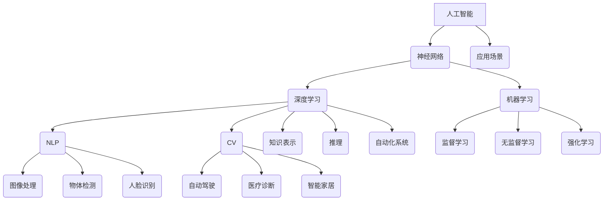
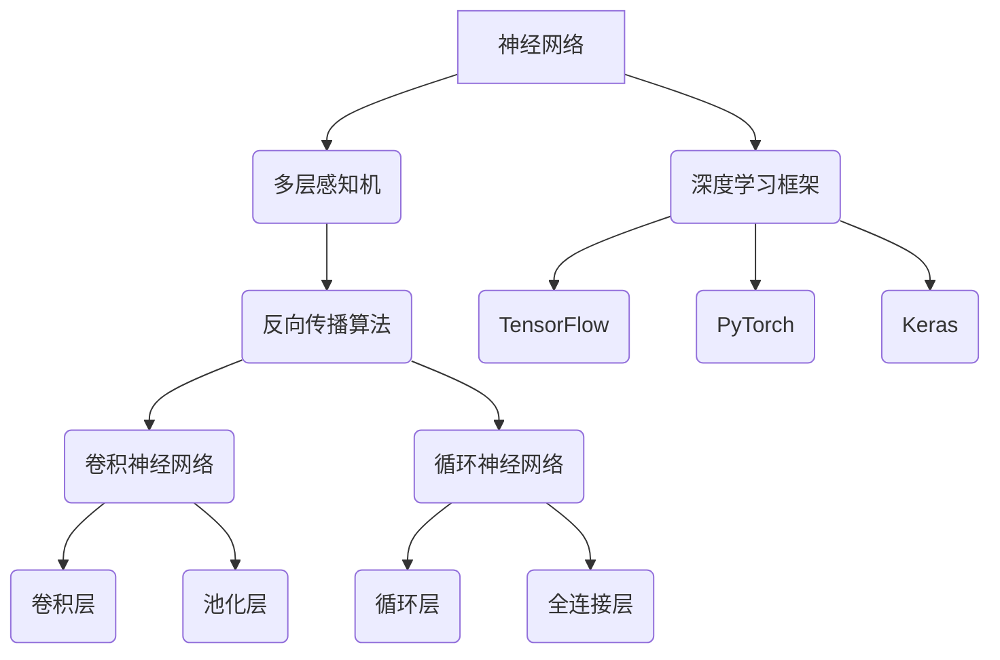

                 

### 第一部分：人工智能的历史与现状

#### 第1章：人工智能的历史与发展

人工智能（AI）作为计算机科学的一个重要分支，其历史可以追溯到20世纪50年代。以下是对人工智能起源与发展历程的概述。

##### 1.1 人工智能的起源与发展历程

人工智能的概念最早由美国计算机科学家约翰·麦卡锡（John McCarthy）在1956年的达特茅斯会议上提出。这次会议被认为是人工智能历史上的一个里程碑，标志着人工智能作为一个独立学科的开始。

- **1956年**：达特茅斯会议召开，人工智能概念首次提出。
- **1960年代**：早期的人工智能系统如“逻辑理论家”（Logic Theorist）和“通用问题求解器”（General Problem Solver）相继问世，标志着早期人工智能研究的开始。
- **1970年代**：随着硬件性能的提升和算法的发展，人工智能研究取得了一定的进展。然而，由于过高的期望和资源限制，人工智能领域在1974年经历了所谓的“人工智能冬天”。
- **1980年代**：专家系统的兴起和知识表示技术的发展，使得人工智能在特定领域取得了显著的成就。
- **1990年代**：机器学习和数据挖掘技术的发展，使得人工智能研究逐渐从基于规则的系统转向基于数据的方法。
- **2000年代**：随着计算能力的提升和大数据的发展，深度学习成为人工智能领域的重要突破，推动了人工智能的快速发展。
- **2010年代至今**：人工智能技术取得了巨大的进步，广泛应用于图像识别、自然语言处理、自动驾驶等多个领域。

##### 1.2 当前人工智能技术的发展现状

当前，人工智能技术已经取得了显著的进展，成为推动社会进步的重要力量。以下是对当前人工智能技术发展现状的概述。

- **深度学习**：深度学习是人工智能领域的一个关键突破，通过多层神经网络模拟人脑的思维方式，实现了在图像识别、语音识别、自然语言处理等领域的突破性进展。
- **自然语言处理（NLP）**：自然语言处理技术使得计算机能够理解和生成自然语言，广泛应用于智能客服、机器翻译、文本分类等场景。
- **计算机视觉**：计算机视觉技术使得计算机能够从图像或视频中提取信息，广泛应用于图像识别、物体检测、人脸识别等领域。
- **自动驾驶**：自动驾驶技术是人工智能在交通领域的应用，通过传感器、算法和控制系统，实现汽车的自主驾驶。
- **机器人**：人工智能技术使得机器人能够执行复杂任务，如服务机器人、工业机器人等，广泛应用于制造、医疗、服务等领域。

##### 1.3 人工智能的技术分类与应用领域

人工智能技术可以按照不同的分类方式进行划分，常见的分类方法包括基于技术、应用领域和实现方式等。

- **基于技术的分类**：
  - **机器学习**：通过数据和算法，使计算机具备从数据中学习和预测的能力。
  - **深度学习**：基于多层神经网络，通过大规模数据进行训练，实现复杂函数的建模。
  - **强化学习**：通过试错和奖励机制，使计算机在特定环境中找到最优策略。
  - **知识表示与推理**：通过符号逻辑和知识库，使计算机具备推理和决策能力。
  - **计算机视觉**：通过图像处理和模式识别，使计算机具备从图像中提取信息的能力。
  - **自然语言处理**：通过语言模型和语义理解，使计算机具备理解和生成自然语言的能力。

- **应用领域的分类**：
  - **医疗健康**：人工智能在医疗健康领域的应用，如疾病诊断、药物研发、医疗影像分析等。
  - **金融**：人工智能在金融领域的应用，如风险控制、投资决策、智能投顾等。
  - **交通**：人工智能在交通领域的应用，如自动驾驶、智能交通管理、车联网等。
  - **制造业**：人工智能在制造业的应用，如自动化生产线、智能检测、智能制造等。
  - **零售**：人工智能在零售领域的应用，如智能推荐、库存管理、客户服务等。
  - **智能家居**：人工智能在智能家居的应用，如智能家电控制、家居安全监控、智能家居系统集成等。

总之，人工智能技术的发展已经取得了显著的成果，并逐渐渗透到社会的各个方面。未来，随着技术的不断进步和应用的不断拓展，人工智能将在更广泛的领域发挥重要作用。下一章将深入探讨人工智能的核心概念与架构。

### 第2章：人工智能的核心概念与架构

人工智能的核心概念与架构是理解和应用人工智能技术的基础。本章将介绍人工智能的基本概念、核心架构以及基础知识。

#### 2.1 人工智能的基本概念

人工智能（Artificial Intelligence，简称AI）是指通过计算机技术实现的智能系统，能够模拟人类智能行为，执行特定任务。以下是人工智能的一些基本概念：

- **智能体**：智能体（Agent）是能够感知环境并采取行动以实现目标的计算实体。智能体可以是程序、机器人、传感器等。
- **知识表示**：知识表示是指将人类知识转化为计算机可以理解和处理的形式。常见的知识表示方法包括符号表示、语义网络、本体论等。
- **推理**：推理是指从已知事实中推导出新事实的过程。推理可以分为演绎推理和归纳推理。演绎推理是从一般到特殊的推理过程，而归纳推理是从特殊到一般的推理过程。
- **机器学习**：机器学习（Machine Learning）是一种让计算机通过数据和算法自我改进的方法。常见的机器学习方法包括监督学习、无监督学习和强化学习。
- **深度学习**：深度学习（Deep Learning）是机器学习的一个分支，通过多层神经网络模拟人脑的思维方式，实现复杂函数的建模。深度学习在图像识别、语音识别和自然语言处理等领域取得了显著成果。
- **自然语言处理**：自然语言处理（Natural Language Processing，简称NLP）是研究计算机如何理解和生成自然语言的技术。NLP在机器翻译、情感分析、文本分类等领域有广泛应用。
- **计算机视觉**：计算机视觉（Computer Vision）是研究计算机如何从图像或视频中提取信息的技术。计算机视觉在图像识别、物体检测和人脸识别等领域有广泛应用。

#### 2.2 人工智能的架构与技术

人工智能的架构可以从不同层面进行划分，包括感知层、决策层和执行层。以下是各个层面的基本架构和关键技术：

- **感知层**：感知层是人工智能系统的输入层，主要负责从环境中获取信息。关键技术包括传感器技术、计算机视觉、自然语言处理等。

  - **传感器技术**：传感器技术用于感知环境中的各种物理量，如温度、湿度、光线等。传感器技术是人工智能系统获取外界信息的基础。
  - **计算机视觉**：计算机视觉技术用于从图像或视频中提取信息，如物体检测、图像识别、姿态估计等。计算机视觉技术在自动驾驶、安防监控等领域有广泛应用。
  - **自然语言处理**：自然语言处理技术用于理解自然语言，如文本分类、情感分析、机器翻译等。自然语言处理技术在智能客服、智能助手等领域有广泛应用。

- **决策层**：决策层是人工智能系统的核心层，负责对感知层获取的信息进行分析和处理，并做出决策。关键技术包括机器学习、深度学习、知识图谱等。

  - **机器学习**：机器学习技术用于训练模型，使计算机能够从数据中学习和预测。机器学习在分类、回归、聚类等领域有广泛应用。
  - **深度学习**：深度学习技术通过多层神经网络模拟人脑的思维方式，实现复杂函数的建模。深度学习在图像识别、语音识别、自然语言处理等领域有广泛应用。
  - **知识图谱**：知识图谱是一种用于表示实体及其关系的图形化数据结构。知识图谱技术用于构建知识库，支持智能问答、推荐系统等。

- **执行层**：执行层是人工智能系统的输出层，负责根据决策层的决策执行相应的操作。关键技术包括机器人控制、自动化系统等。

  - **机器人控制**：机器人控制技术用于控制机器人的运动和行动。机器人控制技术在工业自动化、服务机器人等领域有广泛应用。
  - **自动化系统**：自动化系统通过计算机技术和控制技术实现自动化生产和管理。自动化系统在制造业、物流等领域有广泛应用。

#### 2.3 人工智能的基础知识与原理

人工智能的基础知识与原理是理解和应用人工智能技术的前提。以下是人工智能的一些基础知识与原理：

- **神经网络**：神经网络（Neural Network）是一种模拟人脑神经元之间连接的计算机模型。神经网络通过训练从数据中学习特征，并能够进行预测和分类。
- **激活函数**：激活函数是神经网络中的一个关键组成部分，用于决定神经元是否被激活。常见的激活函数包括 sigmoid 函数、ReLU 函数、Tanh 函数等。
- **反向传播算法**：反向传播算法（Backpropagation Algorithm）是一种用于训练神经网络的优化算法。反向传播算法通过计算损失函数关于网络参数的梯度，更新网络参数，以减小损失函数的值。
- **损失函数**：损失函数（Loss Function）是评估模型预测结果与实际结果之间差异的指标。常见的损失函数包括均方误差（MSE）、交叉熵损失（Cross-Entropy Loss）等。
- **优化算法**：优化算法（Optimization Algorithm）用于调整网络参数，以最小化损失函数。常见的优化算法包括梯度下降（Gradient Descent）、随机梯度下降（Stochastic Gradient Descent，简称SGD）等。

总之，人工智能的核心概念与架构是理解和应用人工智能技术的基础。通过掌握人工智能的基本概念、核心架构以及基础知识，可以更好地理解人工智能的工作原理和应用场景。下一章将深入探讨人工智能的算法与模型。

### 第3章：人工智能的算法与模型

人工智能的算法与模型是实现智能行为的核心。本章将详细介绍人工智能中常用的算法与模型，包括神经网络与深度学习、自然语言处理技术以及计算机视觉技术。

#### 3.1 神经网络与深度学习

神经网络（Neural Network）是人工智能的一种基本模型，通过模拟人脑神经元之间的连接和活动，实现数据的学习和处理。深度学习（Deep Learning）是神经网络的一种扩展，通过多层神经网络的结构，实现更复杂的特征学习和建模。

##### 3.1.1 神经网络的基本概念

神经网络由多个神经元（节点）组成，每个神经元接收多个输入，并经过加权求和后通过激活函数进行输出。神经网络的基本概念包括：

- **神经元**：神经网络的基本计算单元，类似于人脑中的神经元。每个神经元接受多个输入，并经过加权求和产生输出。
- **权重**：神经元之间的连接权重，用于调节输入信号的强度。
- **偏置**：神经元的偏置项，用于调整神经元的输出。
- **激活函数**：用于决定神经元是否被激活的函数，常见的激活函数包括 sigmoid 函数、ReLU 函数和 Tanh 函数。

##### 3.1.2 深度学习的基本概念

深度学习是通过多层神经网络实现数据学习和建模的方法。深度学习的基本概念包括：

- **多层神经网络**：深度学习通过多层神经网络的结构，实现更复杂的特征学习和建模。每一层神经网络对输入数据进行处理，并传递给下一层。
- **前向传播**：在前向传播过程中，输入数据通过神经网络的前向传播，逐层计算得到输出。
- **反向传播**：在反向传播过程中，通过计算损失函数关于网络参数的梯度，更新网络参数，以减小损失函数的值。
- **激活函数**：深度学习中的激活函数通常选择 ReLU 函数，以加快网络的训练速度。

##### 3.1.3 深度学习的常用算法

深度学习有许多常用的算法，包括卷积神经网络（CNN）、循环神经网络（RNN）和生成对抗网络（GAN）等。

- **卷积神经网络（CNN）**：卷积神经网络是一种用于图像识别和处理的深度学习模型。CNN 通过卷积层和池化层提取图像的特征，并使用全连接层进行分类。
- **循环神经网络（RNN）**：循环神经网络是一种用于序列数据处理的深度学习模型。RNN 通过循环结构，将前一时刻的信息传递到下一时刻，实现序列数据的建模。
- **生成对抗网络（GAN）**：生成对抗网络是一种由生成器和判别器组成的深度学习模型。生成器生成数据，判别器判断数据的真实性，通过对抗训练实现数据的生成。

##### 3.1.4 深度学习的应用

深度学习在许多领域都有广泛应用，包括图像识别、语音识别、自然语言处理等。

- **图像识别**：深度学习在图像识别领域取得了显著的成果，例如人脸识别、物体检测等。
- **语音识别**：深度学习在语音识别领域通过构建声学模型和语言模型，实现了高精度的语音识别。
- **自然语言处理**：深度学习在自然语言处理领域通过构建词向量模型和语言模型，实现了语义理解和文本生成。

#### 3.2 自然语言处理技术

自然语言处理（Natural Language Processing，简称NLP）是研究计算机如何理解、生成和处理自然语言的技术。NLP 在智能客服、机器翻译、文本分类等领域有广泛应用。

##### 3.2.1 NLP的基本概念

NLP 的基本概念包括：

- **词向量**：词向量是用于表示单词的向量表示，常见的词向量模型包括 Word2Vec、GloVe 和 BERT 等。
- **句法分析**：句法分析是指对句子进行结构分析，确定单词之间的语法关系。
- **语义分析**：语义分析是指对句子进行语义理解，确定句子所表达的意思。
- **文本分类**：文本分类是指将文本数据按照预定的类别进行分类。
- **情感分析**：情感分析是指对文本数据中的情感倾向进行判断，如积极情感、消极情感等。

##### 3.2.2 NLP的常用算法

NLP 的常用算法包括词嵌入、序列标注、文本分类等。

- **词嵌入**：词嵌入是将单词映射到高维空间中的向量表示，用于表示单词之间的语义关系。
- **序列标注**：序列标注是指对文本中的每个单词进行标注，确定单词的类别。
- **文本分类**：文本分类是指使用机器学习方法，将文本数据按照预定的类别进行分类。
- **情感分析**：情感分析是指使用机器学习方法，对文本数据中的情感倾向进行判断。

##### 3.2.3 NLP的应用

NLP 在许多领域都有广泛应用，包括文本分类、情感分析、机器翻译等。

- **文本分类**：文本分类是指将文本数据按照预定的类别进行分类，例如新闻分类、产品评论分类等。
- **情感分析**：情感分析是指对文本数据中的情感倾向进行判断，例如情感极性分析、用户评论情感分析等。
- **机器翻译**：机器翻译是指使用计算机技术实现不同语言之间的翻译，例如英语到中文的翻译、中文到英语的翻译等。

#### 3.3 计算机视觉技术

计算机视觉（Computer Vision）是研究如何使计算机从图像或视频中提取信息的技术。计算机视觉在图像识别、物体检测、人脸识别等领域有广泛应用。

##### 3.3.1 计算机视觉的基本概念

计算机视觉的基本概念包括：

- **图像处理**：图像处理是指对图像进行预处理，如滤波、边缘检测等，以提高图像的质量和清晰度。
- **特征提取**：特征提取是指从图像中提取具有区分性的特征，用于后续的分类或识别任务。
- **目标检测**：目标检测是指从图像中检测出特定目标的位置和形状。
- **图像识别**：图像识别是指从图像中识别出特定的物体或场景。
- **人脸识别**：人脸识别是指从图像中识别出特定的人脸。

##### 3.3.2 计算机视觉的常用算法

计算机视觉的常用算法包括卷积神经网络（CNN）、支持向量机（SVM）、深度卷积网络（DNN）等。

- **卷积神经网络（CNN）**：卷积神经网络是一种用于图像识别和处理的深度学习模型，通过卷积层和池化层提取图像的特征。
- **支持向量机（SVM）**：支持向量机是一种用于分类和回归任务的机器学习算法，通过构建超平面来实现分类。
- **深度卷积网络（DNN）**：深度卷积网络是一种由多层卷积层和全连接层组成的深度学习模型，用于图像识别和分类。

##### 3.3.3 计算机视觉的应用

计算机视觉在许多领域都有广泛应用，包括安防监控、医疗诊断、自动驾驶等。

- **安防监控**：安防监控是指使用计算机视觉技术实现实时监控和异常检测。
- **医疗诊断**：医疗诊断是指使用计算机视觉技术辅助医生进行疾病诊断，如医学图像分析、病变检测等。
- **自动驾驶**：自动驾驶是指使用计算机视觉技术实现汽车的自主驾驶，如车道保持、障碍物检测等。

总之，人工智能的算法与模型是理解和应用人工智能技术的基础。通过掌握神经网络与深度学习、自然语言处理技术以及计算机视觉技术，可以更好地理解人工智能的工作原理和应用场景。下一章将深入探讨人工智能的数学模型与公式。

### 第4章：人工智能的数学模型与公式

人工智能技术的发展离不开数学模型的支撑。数学模型和公式在人工智能中起到了核心作用，帮助计算机理解和处理复杂数据。本章将介绍人工智能中常用的数学模型与公式，包括损失函数、优化算法以及卷积操作等。

#### 4.1 数学模型与公式的基本概念

数学模型是使用数学语言描述现实世界问题的抽象模型。在人工智能中，数学模型用于描述数据之间的关系和学习过程。公式则是数学模型的具体表达形式，用于计算和推导。

##### 4.1.1 损失函数

损失函数（Loss Function）是评估模型预测结果与实际结果之间差异的指标。在机器学习和深度学习中，损失函数用于指导模型的训练过程，目标是使损失函数的值最小化。

常见的损失函数包括：

- **均方误差（MSE，Mean Squared Error）**：用于回归问题，计算预测值与实际值之间差的平方的平均值。公式如下：

  $$
  L(y_{\hat{}} ,y) = \frac{1}{2} \| y_{\hat{}} - y \|_2^2
  $$

  其中，$y_{\hat{}}$ 是预测值，$y$ 是实际值。

- **交叉熵损失（Cross-Entropy Loss）**：用于分类问题，计算预测概率分布与真实分布之间的交叉熵。公式如下：

  $$
  L(y_{\hat{}} ,y) = -\sum_{i} y_i \log(y_{\hat{i}})
  $$

  其中，$y_i$ 是第 $i$ 类的目标概率，$y_{\hat{i}}$ 是第 $i$ 类的预测概率。

##### 4.1.2 优化算法

优化算法（Optimization Algorithm）用于调整模型参数，以最小化损失函数。常见的优化算法包括梯度下降（Gradient Descent）和其变种。

- **梯度下降（Gradient Descent）**：梯度下降是一种基于损失函数梯度的优化算法。其基本思想是沿着损失函数的梯度方向更新模型参数，以减少损失函数的值。梯度下降的公式如下：

  $$
  w_{t+1} = w_{t} - \alpha \cdot \nabla_{w} J(w)
  $$

  其中，$w_t$ 是当前权重，$\alpha$ 是学习率，$\nabla_{w} J(w)$ 是损失函数关于权重 $w$ 的梯度。

- **动量梯度下降（Momentum Gradient Descent）**：动量梯度下降是在梯度下降基础上引入动量项的优化算法。动量项可以加速收敛，减少波动。其公式如下：

  $$
  w_{t+1} = w_{t} - \alpha \cdot \nabla_{w} J(w) + \beta \cdot (w_{t+1} - w_t)
  $$

  其中，$\beta$ 是动量项的系数。

##### 4.1.3 卷积操作

卷积操作（Convolution Operation）是计算机视觉中的核心操作，用于提取图像的特征。卷积操作的公式如下：

$$
(f * g)(x) = \sum_{y \in \mathbb{Z}^d} f(y) \cdot g(x - y)
$$

其中，$f$ 和 $g$ 是两个函数，$x$ 是输入值，$y$ 是卷积核的位置。卷积操作可以提取输入数据的特征。

#### 4.2 深度学习中的常用数学模型

深度学习中的数学模型包括神经网络中的权重、激活函数、反向传播算法等。

##### 4.2.1 神经网络中的权重

神经网络中的权重（Weight）是连接神经元之间的参数，用于调节输入信号的强度。权重可以通过梯度下降算法进行优化。

##### 4.2.2 激活函数

激活函数（Activation Function）是神经网络中的一个关键组成部分，用于决定神经元是否被激活。常见的激活函数包括 sigmoid 函数、ReLU 函数和 Tanh 函数。

- **sigmoid 函数**：公式如下：

  $$
  \sigma(x) = \frac{1}{1 + e^{-x}}
  $$

  sigmoid 函数的输出值在 0 和 1 之间。

- **ReLU 函数**：公式如下：

  $$
  \text{ReLU}(x) = \max(0, x)
  $$

  ReLU 函数在输入为正时输出为输入值，输入为负时输出为 0。

- **Tanh 函数**：公式如下：

  $$
  \tanh(x) = \frac{e^x - e^{-x}}{e^x + e^{-x}}
  $$

  Tanh 函数的输出值在 -1 和 1 之间。

##### 4.2.3 反向传播算法

反向传播算法（Backpropagation Algorithm）是一种用于训练神经网络的优化算法。反向传播算法通过计算损失函数关于网络参数的梯度，更新网络参数，以减小损失函数的值。反向传播算法的伪代码如下：

```
// 初始化神经网络
NN = initializeNN()

// 训练神经网络
for epoch in 1 to MAX_EPOCHS:
    for each training sample (x, y) in dataset:
        // 前向传播
        z = forward_pass(x, NN)
        // 计算损失函数
        loss = calculate_loss(z, y)
        // 反向传播
        backward_pass(z, y, NN)
        // 更新权重
        update_weights(NN)

// 训练完成
return NN
```

#### 4.3 人工智能中的常见数学公式

人工智能中涉及许多常见的数学公式，包括矩阵运算、线性代数和概率论等。

##### 4.3.1 矩阵运算

矩阵运算是人工智能中常用的数学工具，包括矩阵加法、矩阵乘法和矩阵求导等。

- **矩阵加法**：公式如下：

  $$
  A + B = \begin{bmatrix}
  a_{11} + b_{11} & a_{12} + b_{12} \\
  a_{21} + b_{21} & a_{22} + b_{22}
  \end{bmatrix}
  $$

- **矩阵乘法**：公式如下：

  $$
  AB = \begin{bmatrix}
  a_{11}b_{11} + a_{12}b_{21} & a_{11}b_{12} + a_{12}b_{22} \\
  a_{21}b_{11} + a_{22}b_{21} & a_{21}b_{12} + a_{22}b_{22}
  \end{bmatrix}
  $$

- **矩阵求导**：公式如下：

  $$
  \frac{\partial A}{\partial x} = \begin{bmatrix}
  \frac{\partial a_{11}}{\partial x} & \frac{\partial a_{12}}{\partial x} \\
  \frac{\partial a_{21}}{\partial x} & \frac{\partial a_{22}}{\partial x}
  \end{bmatrix}
  $$

##### 4.3.2 线性代数

线性代数在人工智能中应用广泛，包括特征向量、特征值和奇异值分解等。

- **特征向量**：特征向量是线性变换后保持不变的方向。特征向量的求解可以通过求解特征值问题得到。
- **特征值**：特征值是线性变换后缩放的特征向量的比例。特征值的求解可以通过求解特征值问题得到。
- **奇异值分解**（Singular Value Decomposition，简称SVD）：奇异值分解是一种将矩阵分解为三个矩阵的乘积的方法，可以用于图像压缩、数据降维等。

##### 4.3.3 概率论

概率论在人工智能中用于描述不确定性和概率分布。

- **概率分布**：概率分布用于描述随机变量的概率分布情况。常见的概率分布包括正态分布、伯努利分布和多项式分布等。
- **条件概率**：条件概率是指在给定某个条件下，另一个事件发生的概率。条件概率的公式如下：

  $$
  P(A|B) = \frac{P(A \cap B)}{P(B)}
  $$

- **贝叶斯定理**：贝叶斯定理是一种根据已知条件和概率分布计算后验概率的方法。贝叶斯定理的公式如下：

  $$
  P(A|B) = \frac{P(B|A)P(A)}{P(B)}
  $$

通过本章的介绍，我们可以看到数学模型和公式在人工智能中的重要性。掌握这些数学模型和公式，可以更好地理解和应用人工智能技术。下一章将讨论人工智能的应用场景与案例。

### 第5章：人工智能的应用场景与案例

人工智能技术已经深入到社会的各个领域，从医疗健康、金融到自动驾驶，都取得了显著的成果。本章节将探讨人工智能在不同领域的具体应用场景和案例。

#### 5.1 人工智能在医疗领域的应用

人工智能在医疗领域的应用非常广泛，从疾病诊断、治疗方案制定到医疗数据分析，都极大地提升了医疗服务的效率和质量。

- **疾病诊断**：人工智能可以通过图像识别技术，帮助医生进行疾病诊断。例如，通过分析医学影像数据，人工智能可以快速检测出肺结节、乳腺癌等疾病，提高早期诊断的准确率。
- **治疗方案制定**：人工智能可以根据患者的病历数据，分析出最合适的治疗方案。例如，在癌症治疗中，人工智能可以推荐最佳的药物组合和放疗方案。
- **药物研发**：人工智能在药物研发中也发挥了重要作用。通过机器学习算法，人工智能可以预测药物的副作用、毒性，加速新药的发现和开发过程。
- **医疗数据分析**：人工智能可以对海量的医疗数据进行分析，提取出有价值的信息。例如，通过对流行病数据的分析，人工智能可以预测疾病爆发趋势，帮助卫生部门制定防疫策略。

案例：IBM的Watson for Oncology是一种基于人工智能的医疗诊断系统，它通过分析医学文献、病例数据和临床试验数据，为医生提供癌症治疗方案的建议。

#### 5.2 人工智能在金融领域的应用

人工智能在金融领域的应用同样非常广泛，从风险管理、投资决策到智能客服，都极大地提升了金融服务的效率和准确性。

- **风险管理**：人工智能可以通过数据分析技术，帮助金融机构进行风险评估和管理。例如，通过分析客户的历史交易数据和市场走势，人工智能可以预测客户的信用风险。
- **投资决策**：人工智能可以通过机器学习算法，分析市场数据，为投资者提供投资建议。例如，量化投资平台可以使用人工智能算法，自动进行股票交易和资产配置。
- **智能客服**：人工智能可以通过自然语言处理技术，为金融机构提供智能客服服务。例如，通过聊天机器人，客户可以随时获取金融服务的信息和帮助。
- **信用评分**：人工智能可以通过分析客户的历史数据和行为数据，为金融机构提供信用评分服务。例如，通过分析客户的消费记录、社交网络活动等数据，人工智能可以更准确地评估客户的信用状况。

案例：J.P. Morgan使用人工智能技术开发的COiN系统，可以自动分析客户文件，识别潜在的财务欺诈行为，大大提高了金融机构的风险管理水平。

#### 5.3 人工智能在自动驾驶领域的应用

自动驾驶技术是人工智能在交通领域的一个重要应用，通过传感器、算法和控制系统，实现汽车的自主驾驶。

- **环境感知**：自动驾驶汽车通过传感器（如雷达、激光雷达、摄像头等）感知周围环境，识别道路、交通标志、行人等。
- **路径规划**：自动驾驶系统通过算法对感知到的环境进行建模，规划出最优的行驶路径。
- **控制执行**：自动驾驶系统根据路径规划和环境感知的结果，控制汽车的加速、转向和制动等操作，实现自主驾驶。
- **决策与行为预测**：自动驾驶系统需要预测其他车辆、行人的行为，并根据这些预测做出相应的驾驶决策。

案例：谷歌的Waymo项目是一个自动驾驶汽车项目，通过人工智能技术，实现了完全自动化的驾驶体验，为用户提供安全、高效的出行服务。

总之，人工智能在医疗、金融和自动驾驶等领域的应用，不仅提高了各行业的工作效率，还推动了技术的创新和发展。随着人工智能技术的不断进步，未来将在更多领域发挥重要作用。下一章将讨论人工智能的未来发展趋势与挑战。

### 第6章：人工智能的未来发展趋势与挑战

人工智能（AI）作为当代科技发展的前沿领域，正以惊人的速度影响着各个行业和社会。未来，人工智能的发展将继续呈现高速增长的态势，但同时也会面临诸多挑战。本章将探讨人工智能的未来发展趋势、潜在方向以及面临的挑战与应对策略。

#### 6.1 人工智能的发展趋势

人工智能的未来发展趋势可以从技术进步、应用扩展和产业变革三个方面进行概述。

##### 6.1.1 技术进步

1. **深度学习算法的优化与多样化**：随着计算能力的提升和数据量的增加，深度学习算法将继续优化，包括更高效的训练算法、更小的模型规模、更好的泛化能力等。
2. **生成对抗网络（GAN）的拓展**：生成对抗网络在图像生成、视频处理和数据增强等领域有广泛应用，未来将在更多领域得到拓展。
3. **强化学习技术的成熟**：强化学习在机器人控制、游戏智能和自动驾驶等领域有重要应用，随着算法和理论的不断完善，强化学习将在更多复杂环境中发挥作用。
4. **跨学科融合**：人工智能与生物学、心理学、物理学等学科的融合将推动新技术的诞生，如神经形态计算和类脑智能。

##### 6.1.2 应用扩展

1. **垂直行业深化应用**：人工智能在医疗、金融、教育、制造业等垂直行业的应用将继续深化，提升行业效率和服务质量。
2. **跨领域融合应用**：人工智能技术将在能源、环境、交通等领域得到应用，实现跨领域的协同发展。
3. **个人智能助理的普及**：智能助理将更加智能化，能够更好地理解和满足用户需求，广泛应用于个人生活和办公场景。
4. **智能城市的建设**：人工智能将助力智能城市建设，通过数据分析和智能控制，实现城市管理的精细化、智能化。

##### 6.1.3 产业变革

1. **产业链重构**：人工智能技术将重塑产业链结构，推动传统产业升级和新兴产业的形成。
2. **数字化转型加速**：人工智能将加速各行各业的数字化转型，提升企业的生产效率和市场竞争力。
3. **全球竞争格局重塑**：人工智能技术的发展将改变全球竞争格局，推动新兴市场国家的科技崛起。
4. **新就业形态**：人工智能将创造新的就业机会，同时也可能带来就业结构的变化和挑战。

#### 6.2 人工智能的未来方向

人工智能的未来方向可以从智能化水平提升、人机协同和智能化生态三个方面进行探讨。

##### 6.2.1 智能化水平提升

1. **自主学习能力**：人工智能系统将具备更强的自主学习能力，通过自我优化和适应环境，实现智能化的自主进化。
2. **泛化能力**：人工智能将具备更强的泛化能力，能够在不同的任务和环境中保持高性能。
3. **认知能力**：人工智能将具备更高级的认知能力，能够进行推理、规划和决策，模拟人类的思维过程。

##### 6.2.2 人机协同

1. **人机融合**：人工智能将与人类实现更深层次的融合，通过人机交互技术，实现人类与机器的无缝协作。
2. **智能助手**：智能助手将更加智能化，能够理解和执行人类的指令，提高工作效率和生活质量。
3. **个性化服务**：人工智能将提供个性化的服务，满足用户的多样化需求，提升用户体验。

##### 6.2.3 智能化生态

1. **大数据驱动**：人工智能的发展将依赖于大数据的支持，通过数据驱动的智能决策，实现更高效的服务和产品。
2. **云计算与边缘计算**：云计算与边缘计算的融合将提供更强大的计算能力，支持大规模人工智能应用。
3. **智能网络**：智能网络将实现更快速、更稳定的数据传输，支持人工智能的实时应用。

#### 6.3 人工智能的挑战与应对策略

人工智能在发展过程中也面临诸多挑战，包括技术挑战、伦理问题、法律监管等方面。

##### 6.3.1 技术挑战

1. **算法透明度与可解释性**：当前的人工智能算法往往被认为是“黑箱”，缺乏透明度和可解释性。解决这一挑战需要开发更透明的算法和解释工具。
2. **计算资源需求**：深度学习等算法对计算资源的需求巨大，随着模型规模的增大，计算资源的瓶颈将越来越突出。解决这一挑战需要研发更高效的算法和硬件支持。
3. **数据隐私与安全**：人工智能算法对大量数据的依赖引发数据隐私和安全问题。解决这一挑战需要制定严格的数据保护政策和安全标准。

##### 6.3.2 伦理问题

1. **算法偏见**：人工智能系统可能因为数据偏差而产生偏见，影响决策的公平性和公正性。解决这一挑战需要开发公平性评估和修正算法。
2. **人机关系**：人工智能的发展可能导致人机关系的改变，需要重新审视人类的角色和地位，建立和谐的人机关系。
3. **道德责任**：人工智能系统在决策过程中可能产生道德责任问题，如自动驾驶汽车的伦理决策等。解决这一挑战需要建立明确的道德标准和责任分配机制。

##### 6.3.3 法律监管

1. **法律法规**：人工智能的发展需要相应的法律法规支持，确保技术应用的合法性和安全性。解决这一挑战需要制定和完善相关法律法规。
2. **监管机制**：建立有效的监管机制，确保人工智能技术的合规使用和风险控制。解决这一挑战需要政府、企业和学术界共同努力。
3. **国际合作**：人工智能技术具有全球性，需要国际合作来应对跨国界的挑战。解决这一挑战需要加强国际交流与合作。

总之，人工智能的未来发展充满机遇和挑战。通过技术创新、伦理规范和法律监管，人工智能有望实现可持续发展，为社会带来更多价值。下一章将讨论人工智能的社会影响与伦理问题。

### 第7章：人工智能的社会影响与伦理问题

人工智能（AI）作为一项前沿技术，其在带来巨大经济和社会效益的同时，也引发了一系列社会影响和伦理问题。本章将探讨人工智能对社会的影响、伦理问题以及道德挑战，并提出相应的对策。

#### 7.1 人工智能对社会的影响

人工智能对社会的影响广泛而深远，涵盖了经济、文化、就业等多个方面。

##### 7.1.1 经济影响

1. **提高生产效率**：人工智能可以通过自动化和智能化技术，提高生产效率和产品质量，降低生产成本。
2. **创造新产业**：人工智能的快速发展将催生一系列新兴产业，如自动驾驶、智能医疗、智能家居等，推动经济增长。
3. **改变就业结构**：人工智能的发展可能导致一些传统工作岗位的减少，但同时也将创造新的就业机会，需要社会对就业结构进行适应和调整。

##### 7.1.2 文化影响

1. **改变人类生活方式**：人工智能将改变人类的生活方式，如智能家居、智能助理等技术的普及，将使人们的生活更加便捷和舒适。
2. **影响价值观**：人工智能的发展可能影响人们的价值观和道德观念，如自动化决策可能引发道德责任问题。
3. **文化多样性的挑战**：人工智能技术的普及可能导致文化多样性的减少，因为一些文化元素可能被标准化和同质化。

##### 7.1.3 就业影响

1. **就业岗位减少**：人工智能的发展可能导致一些传统工作岗位的减少，特别是那些重复性和低技能的工作。
2. **就业岗位增加**：尽管如此，人工智能也将创造新的就业机会，如AI系统开发、维护和监管等。
3. **技能需求变化**：人工智能的发展将改变对劳动力的技能需求，需要劳动者不断提升自己的技能以适应新的就业市场。

#### 7.2 人工智能的伦理问题

人工智能的快速发展引发了一系列伦理问题，包括算法偏见、隐私保护和数据安全等。

##### 7.2.1 算法偏见

1. **算法偏见的原因**：算法偏见可能源于训练数据的不公平或编程过程中的人为偏见，导致算法在决策过程中产生不公平的结果。
2. **解决算法偏见的方法**：解决算法偏见需要从多个方面入手，包括提高数据质量、改进算法设计、建立公平性评估机制等。

##### 7.2.2 隐私保护

1. **隐私保护的挑战**：人工智能系统通常需要大量数据来进行训练和优化，这可能侵犯用户的隐私权。
2. **隐私保护的方法**：为了保护用户隐私，可以采取数据去匿名化、数据加密、隐私计算等技术手段，同时需要制定严格的隐私保护法律法规。

##### 7.2.3 数据安全

1. **数据安全的挑战**：人工智能系统依赖于大量数据，数据泄露或滥用可能导致严重的后果。
2. **数据安全的方法**：为了确保数据安全，可以采取数据加密、访问控制、安全审计等技术手段，同时需要建立健全的数据安全法律法规。

#### 7.3 道德挑战

人工智能的发展还带来一系列道德挑战，包括责任归属、决策伦理和人类尊严等。

##### 7.3.1 责任归属

1. **责任归属的挑战**：在人工智能系统中，当发生错误或造成损害时，责任归属往往不明确，这可能阻碍人工智能的应用和发展。
2. **责任归属的对策**：为了明确责任归属，需要制定相应的法律法规，明确人工智能系统的责任主体和责任范围。

##### 7.3.2 决策伦理

1. **决策伦理的挑战**：人工智能系统在决策过程中可能面临伦理道德问题，如自动驾驶汽车的伦理决策等。
2. **决策伦理的对策**：为了解决决策伦理问题，需要建立伦理决策框架，明确人工智能系统在决策过程中应遵循的伦理原则和标准。

##### 7.3.3 人类尊严

1. **人类尊严的挑战**：人工智能的发展可能威胁到人类的尊严，如过度依赖人工智能可能导致人类失去独立思考和行动的能力。
2. **人类尊严的对策**：为了保护人类尊严，需要加强人机协同，确保人工智能系统在辅助人类决策时尊重人类的主体地位。

总之，人工智能的发展对社会产生了深远的影响，同时也带来了一系列伦理问题。通过制定合理的政策和法规，采取有效的技术手段，可以应对这些挑战，确保人工智能的健康、可持续发展。下一章将介绍人工智能相关资源与工具，为读者提供实用的学习和开发资源。

### 附录 A：人工智能相关资源与工具

人工智能作为一门迅速发展的学科，需要大量的资源和工具来支撑学习和研究。以下是一些主流的人工智能框架与库、研究论文与资料以及学习与交流平台，供读者参考。

#### A.1 主流人工智能框架与库

1. **TensorFlow**：Google开源的深度学习框架，支持多种神经网络架构和优化算法，广泛应用于图像识别、语音识别、自然语言处理等领域。

   - 官网：[TensorFlow官网](https://www.tensorflow.org/)
   - 社区：[TensorFlow论坛](https://forums.tensorflow.org/)

2. **PyTorch**：Facebook开源的深度学习框架，以动态计算图和灵活的架构著称，广泛应用于计算机视觉、自然语言处理等领域。

   - 官网：[PyTorch官网](https://pytorch.org/)
   - 社区：[PyTorch论坛](https://discuss.pytorch.org/)

3. **Keras**：一个高级神经网络API，支持TensorFlow和Theano后端，提供简洁的接口和丰富的预训练模型，适合快速原型设计和实验。

   - 官网：[Keras官网](https://keras.io/)
   - 社区：[Keras论坛](https://keras.io/getting-started/faq/#where-can-i-get-help-from-the-keras-community)

4. **Scikit-learn**：一个基于Python的开源机器学习库，提供多种常用的机器学习算法和工具，适用于数据挖掘和数据分析。

   - 官网：[Scikit-learn官网](https://scikit-learn.org/)
   - 社区：[Scikit-learn论坛](https://mail.python.org/mailman/listinfo/scikit-learn)

5. **Apache MXNet**：Apache基金会的深度学习框架，支持多种编程语言，具有高性能和灵活的模型定义能力。

   - 官网：[MXNet官网](https://mxnet.apache.org/)
   - 社区：[MXNet论坛](https://cwiki.apache.org/confluence/display/MXNET/Home)

6. **Caffe**：由伯克利大学开源的深度学习框架，支持卷积神经网络，广泛应用于图像识别和计算机视觉领域。

   - 官网：[Caffe官网](https://caffe.berkeleyvision.org/)
   - 社区：[Caffe论坛](https://groups.google.com/forum/#!forum/caffe)

#### A.2 人工智能研究论文与资料

1. **NeurIPS**（Neural Information Processing Systems）：全球顶级的人工智能会议，每年发布大量前沿研究论文。

   - 官网：[NeurIPS官网](https://neurips.cc/)

2. **ICLR**（International Conference on Learning Representations）：专注于深度学习和机器学习的顶级会议，发布最新的研究论文。

   - 官网：[ICLR官网](https://iclr.cc/)

3. **JMLR**（Journal of Machine Learning Research）：机器学习领域的重要期刊，发表高质量的研究论文。

   - 官网：[JMLR官网](http://jmlr.org/)

4. **arXiv**：一个开放获取的学术论文预印本服务器，提供最新的学术研究成果。

   - 官网：[arXiv官网](https://arxiv.org/)

5. **AI 研究院论文集**：许多顶级 AI 研究院和实验室会发布他们的论文集，包括 Google AI、OpenAI、Facebook AI 等机构。

   - 官网：[Google AI 论文集](https://ai.google/research/pubs/)
   - 官网：[OpenAI 论文集](https://openai.com/research/)
   - 官网：[Facebook AI 论文集](https://research.fb.com/publications/)

#### A.3 人工智能学习与交流平台

1. **Coursera**：提供大量人工智能相关的在线课程，由世界顶级大学和机构提供。

   - 官网：[Coursera官网](https://www.coursera.org/)

2. **edX**：提供人工智能和机器学习相关的在线课程，由世界顶级大学和机构提供。

   - 官网：[edX官网](https://www.edx.org/)

3. **Udacity**：提供人工智能和机器学习相关的纳米学位课程，帮助学习者深入理解人工智能技术。

   - 官网：[Udacity官网](https://www.udacity.com/)

4. **AI 研究社区**：许多 AI 研究机构和公司会建立研究社区，如 Facebook AI Research、Google AI、DeepMind 等。

   - 官网：[Facebook AI Research 社区](https://research.fb.com/community/)
   - 官网：[Google AI 社区](https://ai.google/research/)
   - 官网：[DeepMind 社区](https://www.deeplearning.net/)

5. **AI 论坛**：许多在线论坛和社区为 AI 研究者和开发者提供交流和学习平台，如 Stack Overflow、Reddit、AI 论坛等。

   - 官网：[Stack Overflow](https://stackoverflow.com/)
   - 官网：[Reddit AI 论坛](https://www.reddit.com/r/AI/)
   - 官网：[AI 论坛](https://www.ai-forum.org/)

通过这些资源和工具，读者可以深入了解人工智能的技术和应用，为学习和研究提供有力支持。希望这些资源能够帮助您在人工智能的道路上取得更大的进步。

### 第8章：人工智能实践指南

#### 8.1 人工智能项目实战

进行人工智能项目实战是掌握人工智能技术的关键步骤。本节将介绍如何进行一个典型的人工智能项目，包括项目规划、数据准备、模型训练和评估等步骤。

##### 8.1.1 项目规划

1. **确定项目目标**：明确项目的目标，例如图像分类、语音识别或自然语言处理等。
2. **选择数据集**：根据项目目标选择合适的数据集，可以从公开数据集（如Kaggle、UCI机器学习库等）或自定义数据集开始。
3. **技术选型**：根据项目目标和数据特性选择合适的技术框架和算法，如TensorFlow、PyTorch、Scikit-learn等。

##### 8.1.2 数据准备

1. **数据清洗**：对数据进行清洗，包括去除缺失值、异常值和处理噪声等。
2. **数据预处理**：对数据进行归一化、标准化、编码等预处理操作，以便于模型训练。
3. **数据增强**：通过数据增强技术（如随机裁剪、旋转、缩放等）增加数据多样性，提高模型的泛化能力。

##### 8.1.3 模型训练

1. **模型定义**：根据项目目标和技术选型，定义神经网络结构或选择预训练模型。
2. **模型训练**：使用训练数据对模型进行训练，可以通过调整学习率、批量大小等参数来优化模型性能。
3. **模型验证**：使用验证数据集对模型进行验证，调整模型参数，避免过拟合。

##### 8.1.4 模型评估

1. **评估指标**：根据项目目标选择合适的评估指标，如准确率、召回率、F1 分数等。
2. **模型调优**：通过调整模型结构和参数，优化模型性能。
3. **模型部署**：将训练好的模型部署到生产环境中，进行实际应用。

#### 8.2 人工智能开发环境搭建

搭建人工智能开发环境是进行项目实战的基础。本节将介绍如何搭建Python + TensorFlow和Python + PyTorch的开发环境。

##### 8.2.1 环境一：Python + TensorFlow

1. **安装Python**：在官方网站下载并安装Python，推荐使用Python 3.7或更高版本。

   - 官网：[Python官网](https://www.python.org/downloads/)

2. **安装TensorFlow**：在命令行中运行以下命令安装TensorFlow：

   ```
   pip install tensorflow
   ```

3. **验证安装**：在Python环境中运行以下代码，验证TensorFlow是否安装成功：

   ```python
   import tensorflow as tf
   print(tf.__version__)
   ```

##### 8.2.2 环境二：Python + PyTorch

1. **安装Python**：同上，安装Python 3.7或更高版本。

2. **安装PyTorch**：在命令行中运行以下命令安装PyTorch：

   ```
   pip install torch torchvision
   ```

3. **验证安装**：在Python环境中运行以下代码，验证PyTorch是否安装成功：

   ```python
   import torch
   print(torch.__version__)
   ```

通过以上步骤，您已经成功搭建了Python + TensorFlow和Python + PyTorch的开发环境，可以开始进行人工智能项目实战。

#### 8.3 人工智能源代码实现与解读

以下将提供一个简单的TensorFlow和PyTorch的源代码实现，并对其进行详细解读。

##### TensorFlow实现

```python
import tensorflow as tf

# 定义神经网络结构
model = tf.keras.Sequential([
    tf.keras.layers.Dense(128, activation='relu', input_shape=(784,)),
    tf.keras.layers.Dense(10, activation='softmax')
])

# 编译模型
model.compile(optimizer='adam',
              loss='categorical_crossentropy',
              metrics=['accuracy'])

# 训练模型
model.fit(x_train, y_train, epochs=5)
```

**解读**：

1. **import tensorflow as tf**：导入 TensorFlow 库。
2. **model = tf.keras.Sequential([...])**：创建一个序列模型，包含两个全连接层（Dense Layer），第一个层的激活函数为ReLU，第二个层的激活函数为softmax。
3. **model.compile([...])**：编译模型，指定优化器为adam，损失函数为categorical_crossentropy，评估指标为accuracy。
4. **model.fit(x_train, y_train, epochs=5)**：使用训练数据和标签训练模型，训练5个周期。

##### PyTorch实现

```python
import torch
import torch.nn as nn

# 定义卷积神经网络结构
class ConvNet(nn.Module):
    def __init__(self):
        super(ConvNet, self).__init__()
        self.conv1 = nn.Conv2d(1, 10, kernel_size=5)
        self.conv2 = nn.Conv2d(10, 20, kernel_size=5)
        self.fc1 = nn.Linear(320, 50)
        self.fc2 = nn.Linear(50, 10)

    def forward(self, x):
        x = nn.functional.relu(self.conv1(x))
        x = nn.functional.relu(self.conv2(x))
        x = nn.functional.relu(self.fc1(x.reshape(-1, 320)))
        x = self.fc2(x)
        return x

# 实例化模型
model = ConvNet()

# 编译模型
optimizer = torch.optim.Adam(model.parameters(), lr=0.001)
criterion = nn.CrossEntropyLoss()

# 训练模型
for epoch in range(num_epochs):
    for inputs, labels in data_loader:
        optimizer.zero_grad()
        outputs = model(inputs)
        loss = criterion(outputs, labels)
        loss.backward()
        optimizer.step()
```

**解读**：

1. **import torch, torch.nn as nn**：导入 PyTorch 库。
2. **class ConvNet(nn.Module)**：定义一个卷积神经网络（ConvNet）类，继承自nn.Module。
3. **model = ConvNet()**：实例化卷积神经网络模型。
4. **optimizer = torch.optim.Adam(model.parameters(), lr=0.001)**：定义优化器为Adam，学习率为0.001。
5. **criterion = nn.CrossEntropyLoss()**：定义损失函数为交叉熵损失。
6. **for epoch in range(num_epochs)**：训练循环，每个周期更新模型参数。
7. **for inputs, labels in data_loader**：数据加载循环，加载训练数据。
8. **optimizer.zero_grad()**：清空梯度。
9. **outputs = model(inputs)**：前向传播。
10. **loss = criterion(outputs, labels)**：计算损失。
11. **loss.backward()**：反向传播。
12. **optimizer.step()**：更新模型参数。

通过上述源代码实现和解读，我们可以看到如何使用TensorFlow和PyTorch搭建和训练神经网络模型。这些代码可以作为人工智能项目实战的起点，进一步学习和应用。

### 附录二：人工智能 Mermaid 流程图

以下为人工智能领域的一些Mermaid流程图，用于展示人工智能的基础架构和神经网络与深度学习算法。

#### Mermaid 流程图一：人工智能基础架构



此流程图展示了人工智能的基础架构，包括神经网络、深度学习、自然语言处理、计算机视觉和应用场景等关键组成部分。

#### Mermaid 流程图二：神经网络与深度学习算法



此流程图展示了神经网络与深度学习算法的基本结构，包括多层感知机、反向传播算法、卷积神经网络、循环神经网络和深度学习框架等。

通过这些Mermaid流程图，读者可以更直观地了解人工智能的核心概念和算法架构，有助于深入理解和应用人工智能技术。

