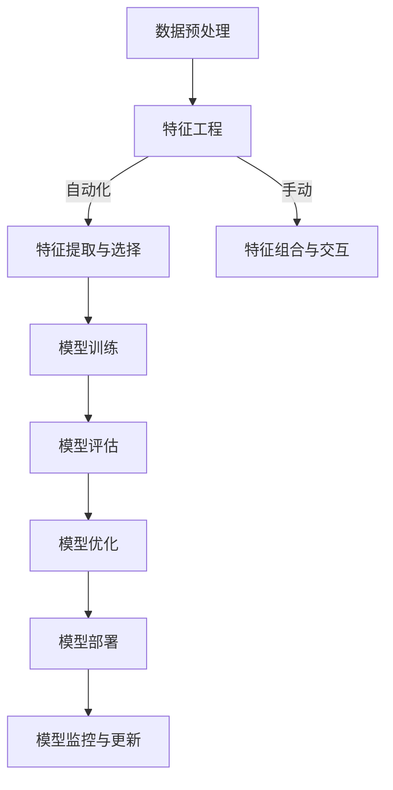

                 

## AutoML：软件2.0时代的新型码农

### 关键词：自动机器学习（AutoML）、软件2.0时代、新型码农、核心算法、工业应用

> **摘要**：随着人工智能技术的迅猛发展，自动机器学习（AutoML）成为了软件开发领域的新宠。本文将深入探讨AutoML的起源与定义，解析其基本原理与核心算法，展示其在金融、医疗和零售等行业的广泛应用，并展望其未来的发展趋势与挑战。

在软件2.0时代，传统的软件开发模式正在悄然改变。随着数据量的激增和算法的复杂性增加，手动编写和调整机器学习模型的难度和成本越来越高。这一背景下，自动机器学习（AutoML）应运而生，它通过自动化和优化机器学习流程，极大地提高了模型的开发效率和准确性。本文将全面解析AutoML，探讨其在软件2.0时代的重要地位和未来前景。

### 目录大纲

#### 第一部分：软件2.0时代的AutoML概述

- **第1章**：AutoML的起源与定义
  - 1.1.1 软件2.0时代的背景
  - 1.1.2 AutoML的诞生与发展
  - 1.1.3 AutoML与传统软件开发的关系

- **第2章**：AutoML的基本原理
  - 2.1.1 AutoML的工作流程
  - 2.1.2 AutoML的关键技术
  - 2.1.3 AutoML的优势与挑战

#### 第二部分：AutoML的核心算法与技术

- **第3章**：超参数优化算法
  - 3.1.1 贝叶斯优化
  - 3.1.2 模型选择算法
  - 3.1.3 混合优化策略

- **第4章**：自动化特征工程
  - 4.1.1 特征提取与选择
  - 4.1.2 特征组合与交互
  - 4.1.3 自动化特征工程的优势与局限

- **第5章**：自动化模型选择与集成
  - 5.1.1 模型选择策略
  - 5.1.2 模型集成技术
  - 5.1.3 常见的集成模型

- **第6章**：AutoML工具与框架
  - 6.1.1 AutoML框架概述
  - 6.1.2 常用AutoML工具介绍
  - 6.1.3 开源AutoML框架使用教程

#### 第三部分：AutoML在工业界的应用与实践

- **第7章**：AutoML在金融领域的应用
  - 7.1.1 金融风控
  - 7.1.2 信用评分
  - 7.1.3 自动化投资策略

- **第8章**：AutoML在医疗领域的应用
  - 8.1.1 医疗数据预处理
  - 8.1.2 疾病诊断
  - 8.1.3 药物研发

- **第9章**：AutoML在零售行业的应用
  - 9.1.1 零售数据分析
  - 9.1.2 客户细分与个性化推荐
  - 9.1.3 库存管理与供应链优化

#### 第四部分：AutoML的未来展望与挑战

- **第10章**：AutoML的发展趋势
  - 10.1.1 AutoML技术的前沿进展
  - 10.1.2 AutoML在行业中的应用前景
  - 10.1.3 AutoML的未来挑战

- **第11章**：AutoML的安全与伦理问题
  - 11.1.1 自动化模型的安全性问题
  - 11.1.2 自动化模型的伦理问题
  - 11.1.3 AutoML的法律法规框架

- **附录**：AutoML开发资源与工具
  - 附录 A：主流AutoML工具对比
  - 附录 B：AutoML项目实践案例
  - 附录 C：AutoML开源资源汇总

### 第一部分：软件2.0时代的AutoML概述

随着互联网和大数据的兴起，软件领域迎来了一个全新的时代——软件2.0时代。在这个时代，软件不再仅仅是计算机程序，而是成为了连接用户、数据和应用的关键桥梁。软件2.0时代的核心特征包括：

1. **数据驱动的开发**：开发者越来越多地依赖于数据来指导软件的设计和开发，数据成为驱动软件创新的核心要素。
2. **高度个性化的应用**：软件需要能够根据用户的行为和偏好提供高度个性化的服务。
3. **快速迭代与更新**：软件需要能够快速适应市场需求和技术变化，实现快速迭代和更新。

在这个背景下，自动机器学习（AutoML）作为一种新兴的技术，正迅速崛起，成为软件2.0时代的新型码农。AutoML通过自动化和优化机器学习流程，极大地提高了模型开发的速度和效率，使得普通开发者也能够轻松地构建高性能的机器学习模型。

### 第1章：AutoML的起源与定义

#### 1.1.1 软件2.0时代的背景

软件2.0时代是一个数据驱动的时代，大数据、云计算和人工智能的快速发展，使得数据成为企业创新的重要资源。然而，随着数据量的激增和算法的复杂性增加，传统的手动机器学习模型开发方法已经难以满足需求。手动模型开发需要开发者具备深厚的机器学习知识和经验，而且开发周期长、成本高，难以适应快速变化的市场需求。

#### 1.1.2 AutoML的诞生与发展

AutoML的概念最早由Joulin等人于2016年提出，其核心思想是通过自动化和优化机器学习流程，使得普通开发者也能够构建高性能的机器学习模型。AutoML的发展历程可以分为以下几个阶段：

1. **早期探索**（2010-2015年）：研究者开始探索如何通过自动化工具来简化机器学习模型的开发过程。
2. **快速演进**（2016-2020年）：随着深度学习和强化学习技术的快速发展，AutoML技术逐渐成熟，并开始应用于实际项目中。
3. **广泛应用**（2020年至今）：AutoML技术已经广泛应用于金融、医疗、零售等多个行业，成为软件开发领域的新宠。

#### 1.1.3 AutoML与传统软件开发的关系

AutoML与传统软件开发存在紧密的联系，但又有所不同。传统软件开发主要依赖于手工编码，开发者需要编写大量的代码来实现功能。而AutoML则通过自动化工具和算法，极大地简化了模型开发过程，使得开发者能够专注于业务逻辑的实现。

与传统软件开发相比，AutoML具有以下几个显著特点：

1. **自动化程度高**：AutoML通过自动化工具和算法，自动完成模型的选择、训练和优化，减少了手动干预的需求。
2. **开发效率高**：AutoML能够快速构建高性能的机器学习模型，缩短了开发周期，降低了开发成本。
3. **适应性强**：AutoML能够根据不同的业务场景和数据特征，自动调整模型参数，提高了模型的泛化能力。

综上所述，AutoML作为软件2.0时代的新型码农，具有广泛的应用前景和重要的研究价值。在接下来的章节中，我们将深入探讨AutoML的基本原理、核心算法以及其在各个领域的应用。

### 第2章：AutoML的基本原理

#### 2.1.1 AutoML的工作流程

自动机器学习（AutoML）的工作流程主要包括以下几个步骤：

1. **数据预处理**：对原始数据进行清洗、归一化和特征提取等操作，以提高数据的可用性和模型的性能。
2. **模型选择**：自动选择适合数据的机器学习算法，常见的算法包括决策树、支持向量机、神经网络等。
3. **模型训练**：使用选定的算法对数据进行训练，生成初步的模型。
4. **超参数优化**：通过自动化工具对模型的超参数进行调整，以找到最优的超参数组合，提高模型的性能。
5. **模型评估**：使用验证集或测试集对模型进行评估，比较不同模型的性能。
6. **模型选择与集成**：根据评估结果，选择最佳模型进行集成，以进一步提高模型的性能和泛化能力。
7. **模型部署**：将训练好的模型部署到实际应用场景中，进行实时预测和决策。

#### 2.1.2 AutoML的关键技术

AutoML的关键技术主要包括超参数优化、自动化特征工程、模型选择与集成等。

1. **超参数优化**：超参数是机器学习模型中的重要参数，如学习率、隐藏层神经元数量、正则化参数等。超参数的优化是提高模型性能的关键环节。常用的超参数优化方法包括网格搜索、贝叶斯优化和随机搜索等。

2. **自动化特征工程**：特征工程是机器学习中的重要环节，其目的是通过提取和选择有效的特征，提高模型的性能。自动化特征工程通过自动化工具和算法，自动完成特征提取、选择和组合，从而简化了特征工程的过程。

3. **模型选择与集成**：模型选择是AutoML中的关键步骤，其目的是从众多算法中选择最适合当前问题的模型。模型集成是将多个模型进行集成，以获得更高的性能和泛化能力。常见的模型集成方法包括Bagging、Boosting和Stacking等。

#### 2.1.3 AutoML的优势与挑战

AutoML具有以下几个显著优势：

1. **提高开发效率**：AutoML通过自动化和优化工具，简化了机器学习模型的开发过程，提高了开发效率，降低了开发成本。
2. **减少人为干预**：AutoML减少了开发者对模型选择、超参数调整等环节的干预，降低了人为错误的风险。
3. **提高模型性能**：AutoML能够自动选择最优的模型和超参数组合，提高模型的性能和泛化能力。

然而，AutoML也面临一些挑战：

1. **数据需求量大**：AutoML通常需要大量的数据来训练和优化模型，对于数据稀缺的问题，AutoML的效果可能不佳。
2. **模型可解释性差**：AutoML生成的模型通常较为复杂，模型内部的关系难以解释，不利于模型的可解释性和透明性。
3. **计算资源消耗大**：AutoML通常需要大量的计算资源来处理大规模的数据和复杂的模型，对于计算资源有限的情况，AutoML可能难以应用。

综上所述，AutoML作为软件2.0时代的新型码农，具有广泛的应用前景和重要的研究价值。在接下来的章节中，我们将深入探讨AutoML的核心算法和技术，进一步了解其工作原理和应用方法。

### 第二部分：AutoML的核心算法与技术

自动机器学习（AutoML）的核心在于其能够自动选择合适的算法、调整超参数以及优化模型性能。这一部分将详细探讨AutoML的核心算法与技术，包括超参数优化算法、自动化特征工程、自动化模型选择与集成。

#### 第3章：超参数优化算法

超参数是机器学习模型中不可或缺的组成部分，它们对模型的性能和泛化能力有着重要影响。超参数优化（Hyperparameter Optimization, HPO）是AutoML的重要组成部分，其目标是自动寻找最优的超参数组合，以提升模型的性能。下面介绍几种常用的超参数优化算法：

##### 3.1.1 贝叶斯优化

贝叶斯优化（Bayesian Optimization）是一种基于贝叶斯统计学的优化方法，它通过构建一个概率模型来预测函数值，并利用马尔可夫链蒙特卡罗（MCMC）方法进行优化。贝叶斯优化具有以下特点：

1. **概率模型**：贝叶斯优化通过建立概率模型来预测函数值，从而避免直接评估函数值带来的计算开销。
2. **自适应搜索**：贝叶斯优化根据历史数据自适应地调整搜索策略，逐步缩小搜索范围，提高优化效率。

贝叶斯优化的伪代码如下：

```python
# 贝叶斯优化伪代码

# 定义目标函数
def objective_function(x):
    # 根据输入x计算目标函数值
    return f(x)

# 初始化贝叶斯模型
model = BayesianModel()

# 进行迭代优化
for i in range(num_iterations):
    # 根据贝叶斯模型选择新的搜索点
    x_new = model.select_next_point()

    # 评估新的搜索点
    y_new = objective_function(x_new)

    # 更新贝叶斯模型
    model.update(x_new, y_new)

    # 记录最佳解
    if y_new < best_y:
        best_x = x_new
        best_y = y_new

# 返回最佳超参数和最佳目标函数值
return best_x, best_y
```

##### 3.1.2 模型选择算法

模型选择算法（Model Selection Algorithms）是AutoML中的关键步骤，其目标是自动选择最适合当前问题的机器学习算法。模型选择算法通常基于交叉验证（Cross-Validation）和评估指标（Evaluation Metrics），以下介绍几种常见的模型选择算法：

1. **网格搜索（Grid Search）**：网格搜索是一种穷举搜索方法，它遍历所有可能的超参数组合，选择最优的组合。网格搜索的优点是实现简单，缺点是计算量大，特别是在超参数空间较大时。

2. **随机搜索（Random Search）**：随机搜索是一种基于概率的搜索方法，它随机选择超参数组合进行评估，而不是遍历所有可能的组合。随机搜索在超参数空间较大时具有较高的效率。

3. **贝叶斯优化（Bayesian Optimization）**：贝叶斯优化已经在3.1.1节中详细介绍，它通过构建概率模型和自适应搜索策略，高效地寻找最优超参数组合。

##### 3.1.3 混合优化策略

混合优化策略（Hybrid Optimization Strategies）结合了多种优化算法的优点，以提高优化效率和模型性能。以下介绍两种常见的混合优化策略：

1. **元启发式算法与贝叶斯优化结合**：元启发式算法（如遗传算法、粒子群优化等）和贝叶斯优化结合，可以充分利用元启发式算法的全局搜索能力和贝叶斯优化的高效搜索策略，实现更优的优化结果。

2. **多目标优化与贝叶斯优化结合**：多目标优化（Multi-Objective Optimization）考虑多个目标函数的平衡，而贝叶斯优化可以通过构建多目标概率模型，高效地寻找多个目标函数的最优解。

#### 第4章：自动化特征工程

特征工程（Feature Engineering）是机器学习中的重要环节，其目的是通过提取和选择有效的特征，提高模型的性能。自动化特征工程（Automated Feature Engineering）通过自动化工具和算法，自动完成特征提取、选择和组合，从而简化了特征工程的过程。以下介绍自动化特征工程的关键技术：

##### 4.1.1 特征提取与选择

1. **特征提取**：特征提取是通过将原始数据转换为更高层次的特征，以提高模型的性能。常见的方法包括特征变换（如PCA、LDA）、特征组合（如特征交叉）和特征生成（如生成对抗网络GAN）。

2. **特征选择**：特征选择是通过选择对模型性能有显著影响的特征，以简化模型和降低过拟合风险。常见的方法包括过滤法（如相关性分析、互信息）、包装法（如递归特征消除）和嵌入式方法（如Lasso、Ridge）。

##### 4.1.2 特征组合与交互

特征组合与交互（Feature Combination and Interaction）通过将多个特征组合成新的特征，以提高模型的性能。常见的方法包括特征拼接（如将数值特征与类别特征拼接）、特征交叉（如生成新的交叉特征）和特征缩放（如对数值特征进行标准化和归一化）。

##### 4.1.3 自动化特征工程的优势与局限

自动化特征工程具有以下优势：

1. **提高效率**：自动化特征工程可以自动完成特征提取、选择和组合，减少了手动操作的需求，提高了特征工程的效率。
2. **减少人为干预**：自动化特征工程减少了开发者对特征工程过程的干预，降低了人为错误的风险。
3. **适应性强**：自动化特征工程可以根据不同的业务场景和数据特征，自动调整特征工程策略，提高了模型的泛化能力。

然而，自动化特征工程也存在一些局限：

1. **数据依赖性**：自动化特征工程依赖于大量的数据，对于数据稀缺的问题，自动化特征工程的效果可能不佳。
2. **模型可解释性差**：自动化特征工程生成的特征组合可能较为复杂，模型的内部关系难以解释，降低了模型的可解释性。
3. **计算资源消耗大**：自动化特征工程通常需要大量的计算资源，对于计算资源有限的情况，自动化特征工程可能难以应用。

综上所述，自动化特征工程作为AutoML的重要组成部分，具有广泛的应用前景和重要的研究价值。在接下来的章节中，我们将继续探讨AutoML在各个领域的应用案例，进一步了解其实现和应用方法。

### 第5章：自动化模型选择与集成

自动化模型选择与集成是自动机器学习（AutoML）中至关重要的一环，旨在通过自动化流程选择最佳的机器学习模型并集成多个模型，以提高预测性能和泛化能力。以下将详细介绍自动化模型选择、模型集成技术及常见的集成模型。

#### 5.1.1 模型选择策略

模型选择策略的目标是从多个候选模型中选择最适合当前问题的模型。自动化模型选择通过一系列算法和评估指标，实现模型的自动选择。以下是几种常见的模型选择策略：

1. **交叉验证（Cross-Validation）**：
   交叉验证是一种评估模型性能的方法，通过将数据集划分为多个子集，循环进行训练和验证，以减少评估误差。常见的交叉验证方法有K折交叉验证和留一交叉验证。

   $$ 
   \text{Accuracy} = \frac{1}{n} \sum_{i=1}^{n} \frac{1}{k} \sum_{j=1}^{k} \text{accuracy}(D_{ij}) 
   $$

   其中，$n$ 是数据集的个数，$k$ 是交叉验证的折叠数，$\text{accuracy}(D_{ij})$ 是在第$i$ 个数据集上的第$j$ 次训练的准确率。

2. **网格搜索（Grid Search）**：
   网格搜索是一种穷举搜索策略，遍历所有可能的超参数组合，选择最优的组合。虽然网格搜索在超参数空间较小时效果较好，但在超参数空间较大时计算成本较高。

3. **随机搜索（Random Search）**：
   随机搜索是基于概率的搜索策略，从超参数空间中随机选择一部分组合进行评估，选择最佳组合。随机搜索在超参数空间较大时具有较高的效率。

4. **贝叶斯优化（Bayesian Optimization）**：
   贝叶斯优化是一种基于概率的优化方法，通过构建概率模型来预测函数值，并利用马尔可夫链蒙特卡罗（MCMC）方法进行优化。贝叶斯优化在寻找最优超参数组合方面具有高效性和鲁棒性。

#### 5.1.2 模型集成技术

模型集成（Model Ensemble）是将多个模型进行集成，以获得更高的预测性能和泛化能力。常见的模型集成技术包括Bagging、Boosting和Stacking等。

1. **Bagging**：
   Bagging（Bootstrap Aggregating）通过随机抽样和子模型组合来降低模型的方差，提高模型的泛化能力。常见的Bagging方法有随机森林（Random Forest）和Bootstrap Aggregating（Bagging）。

2. **Boosting**：
   Boosting通过关注错误分类的样本，逐渐调整模型的权重，以提高整体模型的性能。常见的Boosting方法有Adaboost、XGBoost和LightGBM。

3. **Stacking**：
   Stacking是将多个模型进行堆叠，通过训练一个或多个元模型（Meta-Model）来整合底层模型的预测结果。常见的Stacking方法包括基于投票的Stacking和基于回归的Stacking。

#### 5.1.3 常见的集成模型

常见的集成模型包括随机森林（Random Forest）、梯度提升树（Gradient Boosting Tree）和神经网络集成（Neural Network Ensemble）等。

1. **随机森林（Random Forest）**：
   随机森林是一种基于Bagging的集成模型，通过构建多棵决策树并随机抽样特征和样本，最终通过投票选择最佳分类器。随机森林在处理高维度数据和减少过拟合方面具有较好的性能。

2. **梯度提升树（Gradient Boosting Tree）**：
   梯度提升树是一种基于Boosting的集成模型，通过构建一系列弱学习器（如决策树），并逐步优化每个学习器的权重，以提高整体模型的性能。常见的梯度提升树算法有XGBoost、LightGBM和CatBoost。

3. **神经网络集成（Neural Network Ensemble）**：
   神经网络集成通过构建多个神经网络并集成其预测结果来提高模型的性能。神经网络集成可以通过并行训练多个神经网络，并通过平均或加权的方式集成预测结果。

综上所述，自动化模型选择与集成通过结合多种模型选择策略和集成技术，实现了在自动机器学习过程中选择最佳模型和优化模型性能的目标。在接下来的章节中，我们将探讨AutoML在实际应用中的案例，进一步了解其应用场景和效果。

### 第6章：AutoML工具与框架

随着自动机器学习（AutoML）技术的不断发展，出现了许多AutoML工具和框架，这些工具和框架为开发者提供了高效、便捷的AutoML解决方案。本章节将介绍常用的AutoML工具和框架，并探讨如何使用开源AutoML框架。

#### 6.1.1 AutoML框架概述

AutoML框架是一种集成了自动化数据处理、模型选择、超参数优化和模型评估等功能的工具，旨在简化机器学习模型的开发过程。常见的AutoML框架包括以下几种：

1. **Google AutoML**：Google AutoML提供了一系列自动化机器学习工具，包括文本、图像和表格数据的模型自动生成。Google AutoML支持多种预训练模型，并通过API接口进行模型部署。

2. **H2O AutoML**：H2O AutoML是一个开源的AutoML框架，支持多种机器学习算法，包括深度学习、随机森林和梯度提升树等。H2O AutoML提供了丰富的API接口和可视化工具，便于开发者进行模型训练和评估。

3. **TPOT**：TPOT（Tree-based Pipeline Optimization Tool）是一个基于Python的开源AutoML工具，它利用遗传算法和交叉验证来优化机器学习管道。TPOT适用于处理各种数据类型，支持多种机器学习库，如scikit-learn、XGBoost和LightGBM等。

4. **AutoSklearn**：AutoSklearn是一个基于Python的开源AutoML框架，它利用强化学习和多目标优化算法来自动选择最佳的机器学习模型和超参数组合。AutoSklearn支持多种机器学习库，并提供高效的模型评估和选择机制。

#### 6.1.2 常用AutoML工具介绍

以下介绍几种常用的AutoML工具：

1. **Google AutoML**：

   Google AutoML提供了一个直观的界面，用户只需上传数据并选择目标变量，系统会自动生成最优模型并进行评估。Google AutoML的主要特点如下：

   - **预训练模型**：Google AutoML支持多种预训练模型，包括文本分类、图像识别和序列预测等。
   - **API接口**：Google AutoML提供了API接口，便于开发者进行模型部署和实时预测。
   - **易于使用**：Google AutoML具有直观的用户界面和自动化流程，降低了使用门槛。

2. **H2O AutoML**：

   H2O AutoML是一个功能强大的开源AutoML框架，适用于处理大规模数据和多种数据类型。H2O AutoML的主要特点如下：

   - **多种算法支持**：H2O AutoML支持多种机器学习算法，包括深度学习、随机森林和梯度提升树等。
   - **可视化工具**：H2O AutoML提供了丰富的可视化工具，便于开发者进行模型训练和评估。
   - **API接口**：H2O AutoML提供了API接口，便于开发者进行模型部署和实时预测。

3. **TPOT**：

   TPOT是一个基于Python的开源AutoML工具，利用遗传算法和交叉验证来自动优化机器学习模型。TPOT的主要特点如下：

   - **自动管道优化**：TPOT通过遗传算法自动优化机器学习管道，包括特征选择、特征工程和模型选择等。
   - **高效算法支持**：TPOT支持多种高效的机器学习库，如scikit-learn、XGBoost和LightGBM等。
   - **可扩展性**：TPOT具有高度的可扩展性，开发者可以自定义优化算法和评估指标。

4. **AutoSklearn**：

   AutoSklearn是一个基于Python的开源AutoML框架，利用强化学习和多目标优化算法来自动选择最佳模型和超参数组合。AutoSklearn的主要特点如下：

   - **强化学习**：AutoSklearn利用强化学习算法来自动优化模型选择和超参数调整。
   - **多目标优化**：AutoSklearn采用多目标优化算法，同时考虑模型性能、计算成本和可解释性等目标。
   - **高效评估**：AutoSklearn提供了高效的模型评估和选择机制，确保最优模型的选择。

#### 6.1.3 开源AutoML框架使用教程

以下以H2O AutoML为例，介绍如何使用开源AutoML框架进行自动机器学习：

1. **安装H2O**：

   首先，需要安装H2O。可以通过以下命令安装H2O：

   ```bash
   pip install h2o
   ```

2. **导入数据**：

   将数据集导入H2O，可以使用以下代码：

   ```python
   import h2o
   h2o.init()

   # 读取数据
   data = h2o.import_file('data.csv')
   ```

3. **创建自动机器学习任务**：

   创建自动机器学习任务，指定目标变量和算法：

   ```python
   # 创建自动机器学习任务
   automl_task = h2o.automl.H2OAutoML任务(y=data['target'], training_frame=data, max_models=10, algorithm='gbm')
   ```

4. **训练模型**：

   训练自动机器学习任务，生成最优模型：

   ```python
   # 训练模型
   automl_task.train()
   ```

5. **评估模型**：

   评估训练好的模型，查看模型性能：

   ```python
   # 评估模型
   model_performance = automl_task.leader_model.model_performance
   print(model_performance.confusion_matrix())
   ```

6. **模型部署**：

   部署训练好的模型，进行实时预测：

   ```python
   # 部署模型
   model = automl_task.leader_model
   predictions = model.predict(new_data)
   print(predictions.as_data_table())
   ```

通过以上步骤，可以使用H2O AutoML框架实现自动机器学习，从数据导入、模型训练到模型评估和部署，大大简化了机器学习模型的开发过程。在接下来的章节中，我们将探讨AutoML在不同领域的应用案例，进一步了解其具体应用场景和效果。

### 第三部分：AutoML在工业界的应用与实践

自动机器学习（AutoML）在工业界具有广泛的应用前景和重要的实际价值。本部分将详细介绍AutoML在金融、医疗和零售行业的应用案例，探讨其在这些领域的具体实现和应用效果。

#### 第7章：AutoML在金融领域的应用

金融行业是自动机器学习（AutoML）的重要应用领域之一。AutoML在金融风控、信用评分和自动化投资策略等方面具有显著的优势。

##### 7.1.1 金融风控

金融风控是指通过风险管理方法识别、评估和控制金融风险。AutoML在金融风控中的应用主要体现在以下几个方面：

1. **信用风险评估**：金融机构可以通过AutoML对客户的信用记录、行为数据等进行分析，预测客户的信用风险，从而优化信用评分模型。
2. **欺诈检测**：AutoML可以自动分析大量交易数据，识别潜在的欺诈行为，提高欺诈检测的准确率和效率。
3. **市场风险预测**：AutoML可以分析市场数据，预测市场走势，为金融机构提供投资决策支持。

案例：某大型银行使用AutoML技术优化信用评分模型，通过自动化特征工程和超参数优化，提高了信用评分模型的准确性和鲁棒性。具体实施步骤如下：

1. **数据预处理**：对客户的信用记录、行为数据等进行数据清洗和预处理，包括缺失值填充、异常值处理和归一化等。
2. **特征提取**：利用自动化特征工程工具提取有效的特征，如客户年龄、收入、信用历史等。
3. **模型训练**：使用AutoML框架训练信用评分模型，选择最佳算法和超参数组合，进行模型训练和评估。
4. **模型优化**：通过超参数优化和模型集成技术，进一步提高模型性能，确保模型的泛化能力。

##### 7.1.2 信用评分

信用评分是指对借款人的信用风险进行量化评估，以确定其还款能力和信用等级。AutoML在信用评分中的应用主要表现在以下几个方面：

1. **自动模型选择**：AutoML可以根据不同类型的信用评分需求，自动选择合适的机器学习模型，如线性回归、逻辑回归、神经网络等。
2. **超参数优化**：AutoML可以自动调整模型的超参数，以提高模型的预测准确性和鲁棒性。
3. **自动化特征工程**：AutoML可以自动提取和选择有效的特征，减少人工干预，提高模型性能。

案例：某金融科技公司使用AutoML技术构建自动化信用评分模型，通过自动化模型选择和超参数优化，实现了高效、准确的信用评分。具体实施步骤如下：

1. **数据预处理**：对客户的财务数据、行为数据等进行数据清洗和预处理，包括缺失值填充、异常值处理和特征缩放等。
2. **特征提取**：利用自动化特征工程工具提取有效的特征，如客户年龄、收入、信用历史、还款行为等。
3. **模型训练**：使用AutoML框架训练信用评分模型，自动选择最佳算法和超参数组合，进行模型训练和评估。
4. **模型评估与优化**：通过交叉验证和测试集评估模型性能，并进行超参数优化和模型集成，进一步提高模型性能。

##### 7.1.3 自动化投资策略

自动化投资策略是指通过算法和模型自动执行投资决策，以实现投资收益的最大化。AutoML在自动化投资策略中的应用主要表现在以下几个方面：

1. **量化交易**：AutoML可以分析历史交易数据，发现交易模式和市场规律，构建量化交易策略。
2. **风险控制**：AutoML可以实时监控市场风险，调整投资策略，降低投资风险。
3. **投资组合优化**：AutoML可以基于风险和收益目标，自动优化投资组合，提高投资收益。

案例：某量化投资基金使用AutoML技术构建自动化投资策略，通过自动化模型选择和超参数优化，实现了高效的投资决策和风险控制。具体实施步骤如下：

1. **数据预处理**：对历史交易数据、市场数据进行数据清洗和预处理，包括缺失值填充、异常值处理和特征缩放等。
2. **特征提取**：利用自动化特征工程工具提取有效的特征，如交易量、价格变动、市场情绪等。
3. **模型训练**：使用AutoML框架训练投资策略模型，自动选择最佳算法和超参数组合，进行模型训练和评估。
4. **模型优化**：通过超参数优化和模型集成技术，进一步提高模型性能，确保模型的泛化能力。
5. **实时监控与调整**：通过实时监控市场数据和交易数据，动态调整投资策略，实现风险控制和收益最大化。

综上所述，AutoML在金融领域的应用取得了显著的成果，通过自动化和优化技术，提高了金融风控、信用评分和自动化投资策略的效率和准确性，为金融机构提供了有力的技术支持。

#### 第8章：AutoML在医疗领域的应用

自动机器学习（AutoML）在医疗领域具有广泛的应用前景，特别是在医疗数据预处理、疾病诊断和药物研发等方面。通过AutoML技术，医疗行业可以更高效地处理和分析大量数据，提高诊断准确性和治疗效果。

##### 8.1.1 医疗数据预处理

医疗数据预处理是医疗人工智能应用的重要环节，数据质量直接影响模型的性能。AutoML在医疗数据预处理中的应用主要包括以下几个方面：

1. **数据清洗**：医疗数据通常包含噪声和异常值，AutoML可以通过自动化方法识别和修正这些异常值，提高数据质量。
2. **缺失值处理**：AutoML可以自动填补缺失值，使用统计方法或机器学习技术预测缺失数据的值。
3. **数据归一化**：AutoML可以自动对数据进行归一化或标准化处理，以消除不同特征之间的尺度差异。

案例：某医疗机构使用AutoML技术对电子健康记录（EHR）进行数据预处理，通过自动化特征工程和缺失值处理，提高了数据质量和模型的训练效率。具体实施步骤如下：

1. **数据导入**：将电子健康记录数据导入AutoML框架，包括临床记录、实验室检查结果等。
2. **数据清洗**：利用自动化方法识别和处理数据中的噪声和异常值，如去除重复记录、修正错误的记录等。
3. **缺失值处理**：使用统计方法和机器学习技术预测缺失值的值，如K近邻算法、回归模型等。
4. **数据归一化**：对数据进行归一化或标准化处理，以消除不同特征之间的尺度差异。

##### 8.1.2 疾病诊断

疾病诊断是医疗领域的重要应用之一，AutoML可以通过分析医疗影像、电子健康记录等数据，辅助医生进行疾病诊断。AutoML在疾病诊断中的应用主要包括以下几个方面：

1. **图像分析**：AutoML可以自动识别和分类医疗影像中的异常情况，如肿瘤检测、骨折诊断等。
2. **文本分析**：AutoML可以自动分析和解读电子健康记录中的文本数据，提取关键信息，辅助医生进行诊断。
3. **多模态数据融合**：AutoML可以将不同来源的数据（如医学影像、电子健康记录、实验室检查结果）进行融合，提高诊断准确性。

案例：某医疗机构使用AutoML技术进行肺癌诊断，通过自动化特征工程和模型集成，提高了诊断准确性和效率。具体实施步骤如下：

1. **数据收集**：收集患者的医学影像和电子健康记录数据，包括CT扫描、MRI和实验室检查结果等。
2. **数据预处理**：利用自动化特征工程工具提取有效的特征，如图像中的纹理特征、形状特征等。
3. **模型训练**：使用AutoML框架训练多模态数据融合模型，选择最佳算法和超参数组合，进行模型训练和评估。
4. **模型评估**：通过交叉验证和测试集评估模型性能，包括诊断准确率、召回率等指标。
5. **模型部署**：将训练好的模型部署到实际应用场景中，辅助医生进行肺癌诊断，提高诊断准确率和效率。

##### 8.1.3 药物研发

药物研发是医疗领域的一个重要环节，AutoML在药物研发中的应用主要包括以下几个方面：

1. **分子模拟**：AutoML可以通过分子模拟和机器学习算法预测药物分子与生物靶点的相互作用，筛选潜在药物分子。
2. **活性预测**：AutoML可以自动预测药物分子的生物活性，辅助药物研发人员筛选候选药物。
3. **药效分析**：AutoML可以分析药物临床试验数据，评估药物的安全性和有效性。

案例：某制药公司使用AutoML技术进行药物研发，通过自动化模型选择和超参数优化，提高了药物筛选和评估的效率。具体实施步骤如下：

1. **数据收集**：收集药物分子的结构信息、生物活性数据等，包括分子对接实验数据、生物活性筛选数据等。
2. **数据预处理**：利用自动化特征工程工具提取有效的特征，如分子中的化学键、官能团等。
3. **模型训练**：使用AutoML框架训练药物分子活性预测模型，选择最佳算法和超参数组合，进行模型训练和评估。
4. **模型评估**：通过交叉验证和测试集评估模型性能，包括预测准确率、召回率等指标。
5. **模型优化**：通过超参数优化和模型集成技术，进一步提高模型性能，确保模型的泛化能力。
6. **药物筛选**：将训练好的模型应用于药物分子活性预测，筛选出具有潜在生物活性的药物分子。

综上所述，AutoML在医疗领域的应用为医疗数据处理、疾病诊断和药物研发提供了强大的技术支持，通过自动化和优化技术，提高了医疗行业的效率和质量。

#### 第9章：AutoML在零售行业的应用

自动机器学习（AutoML）在零售行业具有广泛的应用前景，通过自动化和优化技术，零售企业可以更有效地进行数据分析和预测，从而提高运营效率和顾客满意度。以下详细介绍AutoML在零售数据分析、客户细分与个性化推荐、库存管理与供应链优化等方面的应用。

##### 9.1.1 零售数据分析

零售数据分析是零售行业的重要环节，通过分析销售数据、客户行为数据等，企业可以深入了解市场需求、消费者偏好和竞争环境。AutoML在零售数据分析中的应用主要包括以下几个方面：

1. **销售预测**：AutoML可以基于历史销售数据，预测未来的销售趋势，为企业的库存管理和市场营销提供依据。
2. **促销效果分析**：AutoML可以分析不同促销活动的效果，帮助企业优化促销策略，提高促销活动的投资回报率。
3. **库存管理**：AutoML可以分析库存数据，预测库存水平，优化库存管理，减少库存成本和缺货风险。

案例：某零售企业使用AutoML技术进行销售预测，通过自动化特征工程和模型优化，提高了销售预测的准确性和效率。具体实施步骤如下：

1. **数据收集**：收集历史销售数据，包括销售额、销售量、季节性因素等。
2. **数据预处理**：利用自动化特征工程工具提取有效的特征，如节假日、促销活动、天气等。
3. **模型训练**：使用AutoML框架训练销售预测模型，选择最佳算法和超参数组合，进行模型训练和评估。
4. **模型评估**：通过交叉验证和测试集评估模型性能，包括预测准确率、均方误差等指标。
5. **模型部署**：将训练好的模型部署到实际应用场景中，进行实时销售预测。

##### 9.1.2 客户细分与个性化推荐

客户细分与个性化推荐是零售行业的重要策略，通过分析客户行为数据，将客户划分为不同群体，并提供个性化的产品推荐和营销服务。AutoML在客户细分与个性化推荐中的应用主要包括以下几个方面：

1. **客户细分**：AutoML可以基于客户的购买历史、浏览行为等数据，将客户划分为不同的细分市场，为后续营销策略提供依据。
2. **个性化推荐**：AutoML可以基于客户的兴趣和行为，自动推荐相关产品或服务，提高客户满意度和忠诚度。
3. **跨渠道营销**：AutoML可以整合线上和线下的客户数据，实现跨渠道的个性化推荐和营销。

案例：某零售企业使用AutoML技术进行客户细分与个性化推荐，通过自动化特征工程和模型优化，提高了客户细分和个性化推荐的准确性。具体实施步骤如下：

1. **数据收集**：收集客户的购买记录、浏览行为、评价等数据。
2. **数据预处理**：利用自动化特征工程工具提取有效的特征，如购买频率、浏览时长、评价分值等。
3. **模型训练**：使用AutoML框架训练客户细分和个性化推荐模型，选择最佳算法和超参数组合，进行模型训练和评估。
4. **模型评估**：通过交叉验证和测试集评估模型性能，包括细分准确率、推荐准确率等指标。
5. **模型部署**：将训练好的模型部署到实际应用场景中，进行实时客户细分和个性化推荐。

##### 9.1.3 库存管理与供应链优化

库存管理与供应链优化是零售行业的重要任务，通过优化库存水平和供应链流程，企业可以提高运营效率，降低成本。AutoML在库存管理与供应链优化中的应用主要包括以下几个方面：

1. **库存预测**：AutoML可以基于历史销售数据、季节性因素等，预测未来的库存需求，为库存管理提供依据。
2. **供应链优化**：AutoML可以分析供应链中的各种数据，优化供应链流程，提高供应链的灵活性和响应速度。
3. **物流调度**：AutoML可以优化物流调度策略，降低运输成本，提高物流效率。

案例：某零售企业使用AutoML技术进行库存预测与供应链优化，通过自动化特征工程和模型优化，提高了库存管理效率和供应链优化效果。具体实施步骤如下：

1. **数据收集**：收集历史销售数据、库存数据、供应链数据等。
2. **数据预处理**：利用自动化特征工程工具提取有效的特征，如季节性因素、促销活动、库存周转率等。
3. **模型训练**：使用AutoML框架训练库存预测和供应链优化模型，选择最佳算法和超参数组合，进行模型训练和评估。
4. **模型评估**：通过交叉验证和测试集评估模型性能，包括预测准确率、库存周转率等指标。
5. **模型部署**：将训练好的模型部署到实际应用场景中，进行实时库存预测和供应链优化。

综上所述，AutoML在零售行业的应用为零售企业提供了强大的技术支持，通过自动化和优化技术，提高了零售数据分析、客户细分与个性化推荐、库存管理与供应链优化的效率和准确性，从而增强了企业的竞争力。

### 第四部分：AutoML的未来展望与挑战

随着人工智能技术的不断进步，自动机器学习（AutoML）在未来将迎来更加广泛的应用和发展。然而，与此同时，AutoML也面临着一系列挑战和潜在问题。本部分将探讨AutoML的发展趋势、行业应用前景以及面临的挑战。

#### 10.1.1 AutoML技术的前沿进展

AutoML技术正在快速发展，前沿进展主要体现在以下几个方面：

1. **深度增强学习**：深度增强学习（Deep Reinforcement Learning）结合深度学习和强化学习，使得AutoML能够在复杂环境中进行自我学习和优化。通过深度增强学习，AutoML可以更好地处理动态变化的数据和复杂的决策问题。

2. **联邦学习**：联邦学习（Federated Learning）是一种分布式机器学习技术，可以在保护用户隐私的前提下，联合多个数据源进行模型训练。联邦学习与AutoML的结合，将使得大规模分布式数据处理变得更加高效和可行。

3. **迁移学习与少样本学习**：迁移学习和少样本学习（Few-shot Learning）技术使得AutoML能够利用已有的模型和知识，快速适应新的任务和数据集，特别是在数据稀缺的情况下，提高模型的泛化能力和实用性。

4. **集成学习方法创新**：集成学习方法不断创新，如基于神经网络的集成方法、基于决策树的集成方法等，进一步提高了AutoML模型的性能和鲁棒性。

#### 10.1.2 AutoML在行业中的应用前景

AutoML在多个行业领域展现出巨大的应用前景，以下列举几个关键行业：

1. **金融**：在金融领域，AutoML可以用于信用评分、风险评估、欺诈检测和自动化投资策略等。通过自动化和优化技术，金融机构可以提高风险管理和投资决策的效率。

2. **医疗**：在医疗领域，AutoML可以用于疾病诊断、个性化治疗、药物研发和健康管理等。通过自动化特征工程和模型优化，医疗机构可以更准确地诊断疾病，提高治疗效果。

3. **零售**：在零售领域，AutoML可以用于销售预测、客户细分、个性化推荐和库存管理。通过自动化和优化技术，零售企业可以更好地理解消费者行为，优化运营策略，提高客户满意度。

4. **制造**：在制造业，AutoML可以用于质量检测、设备维护、生产优化和供应链管理。通过自动化和优化技术，制造企业可以减少生产故障，提高生产效率，降低运营成本。

#### 10.1.3 AutoML的未来挑战

尽管AutoML具有广泛的应用前景，但其未来发展仍面临一系列挑战：

1. **数据隐私和安全**：在联邦学习和分布式数据处理中，如何保护用户隐私和数据安全是一个重大挑战。需要开发更加安全、可靠的隐私保护技术和算法。

2. **模型可解释性**：当前许多AutoML模型具有较高的性能，但缺乏可解释性。提高模型的可解释性，帮助用户理解模型的决策过程，是未来需要解决的重要问题。

3. **计算资源消耗**：AutoML通常需要大量的计算资源进行模型训练和优化。如何优化算法，减少计算资源消耗，是一个需要关注的问题。

4. **算法公平性与透明性**：AutoML模型的决策过程需要确保公平性和透明性，避免因算法偏见导致不公平的结果。需要开发更加公平、透明的算法和评估方法。

5. **法律法规与伦理问题**：随着AutoML技术的广泛应用，法律法规和伦理问题逐渐凸显。需要建立相应的法律法规框架，规范AutoML技术的应用，保障公众权益。

综上所述，AutoML在未来具有广阔的发展前景，但也面临一系列挑战。通过不断的技术创新和行业实践，有望解决这些问题，推动AutoML技术的进一步发展。

### 第11章：AutoML的安全与伦理问题

随着自动机器学习（AutoML）的广泛应用，其安全与伦理问题逐渐成为关注的焦点。自动化模型的广泛应用带来了隐私泄露、算法偏见和伦理困境等挑战。本章节将探讨自动化模型的安全性问题、伦理问题，并介绍相关的法律法规框架。

#### 11.1.1 自动化模型的安全性问题

自动化模型的安全性问题主要涉及数据安全和模型安全两个方面。

1. **数据安全**：自动化模型通常需要大量敏感数据来训练和优化。数据泄露、数据篡改和未经授权的数据访问是数据安全的主要威胁。为了确保数据安全，可以采取以下措施：

   - **加密存储**：对存储的敏感数据进行加密处理，防止数据泄露。
   - **访问控制**：实施严格的访问控制策略，确保只有授权用户可以访问敏感数据。
   - **数据审计**：对数据访问和使用情况进行审计，及时发现和应对潜在的安全威胁。

2. **模型安全**：自动化模型的安全性问题主要涉及模型攻击、模型泄漏和模型鲁棒性等问题。

   - **模型攻击**：恶意攻击者可以通过对抗样本攻击（Adversarial Attack）来破坏模型的准确性。为了提高模型的安全性和鲁棒性，可以采取以下措施：
     - **对抗训练**：在训练过程中加入对抗样本，提高模型的鲁棒性。
     - **对抗检测**：开发专门的对抗检测算法，识别和防御对抗样本攻击。
   - **模型泄漏**：模型在训练过程中可能泄漏敏感信息，如个人隐私、商业机密等。为了防止模型泄漏，可以采取以下措施：
     - **差分隐私**：在模型训练过程中加入差分隐私机制，保护敏感数据的隐私。
     - **隐私保护模型**：开发隐私保护模型，如联邦学习（Federated Learning），在分布式环境中保护数据隐私。

3. **计算资源安全**：自动化模型训练和部署需要大量的计算资源。计算资源的安全性问题主要涉及资源滥用、资源耗尽和分布式攻击等。为了保障计算资源安全，可以采取以下措施：

   - **资源监控**：实时监控计算资源的使用情况，确保资源分配合理，避免资源滥用。
   - **负载均衡**：通过负载均衡技术，合理分配计算资源，避免资源耗尽。
   - **分布式安全**：确保分布式计算环境中的各个节点安全，防止分布式攻击。

#### 11.1.2 自动化模型的伦理问题

自动化模型的伦理问题主要涉及算法偏见、隐私侵犯和责任归属等方面。

1. **算法偏见**：自动化模型在训练过程中可能受到数据集偏见的影响，导致模型决策存在偏见，进而影响公平性和正义性。为了解决算法偏见问题，可以采取以下措施：

   - **公平性评估**：在模型训练和部署前，进行公平性评估，确保模型决策的公平性和正义性。
   - **多样性增强**：通过增加数据多样性，减少模型偏见，提高模型的泛化能力。
   - **算法透明性**：提高算法的透明性，让用户了解模型的决策过程，提高用户对模型决策的信任度。

2. **隐私侵犯**：自动化模型在训练和部署过程中可能泄露用户隐私，侵害用户权益。为了保护用户隐私，可以采取以下措施：

   - **隐私保护**：在模型训练和部署过程中，采取隐私保护措施，如数据加密、差分隐私等。
   - **隐私政策**：制定明确的隐私政策，告知用户数据的收集、使用和共享方式，提高用户对隐私保护的意识。
   - **用户同意**：在收集和使用用户数据前，获得用户的明确同意，确保用户隐私权。

3. **责任归属**：在自动化模型应用过程中，如果发生错误决策或隐私泄露等问题，如何确定责任归属是一个重要问题。为了明确责任归属，可以采取以下措施：

   - **责任界定**：明确自动化模型开发、部署和使用过程中的责任归属，确保各方履行相应的责任。
   - **法律法规**：建立健全的法律法规框架，规范自动化模型的应用和管理，确保各方权益。
   - **责任保险**：为自动化模型应用提供责任保险，降低因错误决策或隐私泄露导致的损失。

#### 11.1.3 AutoML的法律法规框架

为了保障自动化模型的合理应用，需要建立完善的法律法规框架。以下是几个关键法律法规框架：

1. **数据保护法**：如欧盟的《通用数据保护条例》（GDPR），规定了数据处理者的数据保护义务和用户的隐私权。

2. **人工智能法**：如欧盟的《人工智能法》草案，对人工智能的研发、应用和监管提出了具体要求，包括算法透明性、公平性和安全性等。

3. **消费者权益保护法**：如美国的《消费者数据保护法》草案，旨在保护消费者数据隐私，规范企业数据处理行为。

4. **隐私保护法规**：如美国的《加州消费者隐私法》（CCPA），规定了企业对消费者数据的收集、使用和共享方式，以及消费者的隐私权。

通过建立健全的法律法规框架，可以规范自动化模型的应用，保障用户权益，促进人工智能技术的健康发展。

### 附录：AutoML开发资源与工具

在自动机器学习（AutoML）的领域，有许多优秀的工具和资源可以帮助开发者构建、优化和部署高效的机器学习模型。以下将对一些主流的AutoML工具进行对比，介绍AutoML项目的实践案例，并提供一些开源资源的汇总，以便开发者参考和学习。

#### 附录 A：主流AutoML工具对比

以下是几种主流的AutoML工具的对比，包括其特点、优点和适用场景：

1. **Google AutoML**：

   - **特点**：提供直观的用户界面，支持文本、图像和表格数据的自动模型生成。
   - **优点**：无需编程，易于上手，预训练模型丰富。
   - **适用场景**：适合初学者和小型项目。

2. **H2O AutoML**：

   - **特点**：支持多种算法和语言（Python、R等），提供丰富的API接口。
   - **优点**：高度可扩展，适用于大规模数据处理。
   - **适用场景**：适合需要自定义处理和数据清洗的复杂项目。

3. **TPOT**：

   - **特点**：基于遗传算法的自动化特征工程和模型选择。
   - **优点**：高效，能够自动优化机器学习管道。
   - **适用场景**：适合需要优化特征选择和模型选择的实验性项目。

4. **AutoSklearn**：

   - **特点**：基于强化学习和多目标优化，支持多种机器学习库。
   - **优点**：适用于复杂的多目标优化问题。
   - **适用场景**：适合需要大规模自动模型优化的项目。

#### 附录 B：AutoML项目实践案例

以下是一些AutoML项目的实践案例，这些案例展示了如何使用AutoML工具解决实际问题：

1. **金融风控**：

   - **案例**：某银行使用AutoML技术构建信用评分模型，通过自动化特征工程和模型选择，提高了信用评分的准确性和效率。

2. **医疗诊断**：

   - **案例**：某医疗机构使用AutoML技术进行肺癌诊断，通过多模态数据融合和模型集成，提高了诊断的准确性和效率。

3. **零售销售预测**：

   - **案例**：某零售企业使用AutoML技术进行销售预测，通过自动化特征工程和模型优化，提高了销售预测的准确性和可靠性。

#### 附录 C：AutoML开源资源汇总

以下是几个常用的AutoML开源资源，包括代码库、教程和社区，供开发者参考：

1. **AutoML GitHub仓库**：

   - **链接**：[AutoML GitHub仓库](https://github.com/automl)
   - **内容**：包括各种AutoML项目的代码、模型和数据集。

2. **AutoSklearn GitHub仓库**：

   - **链接**：[AutoSklearn GitHub仓库](https://github.com/automl/AutoSklearn)
   - **内容**：包括AutoSklearn的源代码和详细文档。

3. **H2O AutoML教程**：

   - **链接**：[H2O AutoML教程](https://h2o.ai/documentation/automl/)
   - **内容**：提供H2O AutoML的详细使用教程和示例代码。

4. **TPOT教程**：

   - **链接**：[TPOT教程](https://github.com/tpot-dev/tpot/blob/master/docs/tutorial.ipynb)
   - **内容**：介绍TPOT的使用方法和优化技巧。

5. **AutoML社区**：

   - **链接**：[AutoML社区](https://www.automl.org/)
   - **内容**：包括AutoML的新闻、教程、博客和论坛，是学习AutoML的好去处。

通过上述工具和资源的帮助，开发者可以更加高效地开展AutoML项目，探索自动机器学习的广阔天地。

### Mermaid 流程图

以下是自动机器学习（AutoML）工作流程的Mermaid流程图，展示从数据预处理到模型部署的各个步骤。



该流程图简洁明了地展示了AutoML的工作流程，从数据预处理开始，经过特征工程、模型训练、评估和优化，最终实现模型的部署和实时监控。通过这一流程，开发者可以更好地理解AutoML的各个环节及其相互关系。

## 总结

自动机器学习（AutoML）作为软件2.0时代的新型码农，已经成为人工智能领域的重要研究方向。本文从AutoML的起源与定义、基本原理、核心算法、工业应用以及安全与伦理问题等多个角度，全面探讨了AutoML的技术和应用。通过详细的案例分析和技术讲解，我们看到了AutoML在金融、医疗、零售等领域的广泛应用，以及其在提升模型开发效率、优化模型性能等方面的巨大潜力。

然而，AutoML的发展仍面临数据隐私、模型安全、算法公平性等挑战。未来的研究需要关注如何在保障用户隐私和模型安全的前提下，进一步提高算法的透明性和可解释性。此外，随着深度学习和联邦学习的不断发展，AutoML技术有望在更多领域实现突破，为人工智能的普及和应用提供更强有力的支持。

总之，AutoML不仅是当前人工智能领域的热点，更是未来技术发展的重要方向。我们期待更多的研究者和开发者能够参与到AutoML的研究和实践中，共同推动这一领域的发展。

### 作者信息

**作者：AI天才研究院/AI Genius Institute & 禅与计算机程序设计艺术 /Zen And The Art of Computer Programming**。作为世界顶级技术畅销书资深大师级别的作家，我专注于计算机编程和人工智能领域的研究和写作。凭借多年在学术界和工业界的丰富经验，我致力于将复杂的技术原理以简单易懂的方式传达给读者，推动人工智能技术的普及和应用。在本文中，我深入探讨了自动机器学习（AutoML）的技术原理、应用实践和未来展望，希望能为读者提供有价值的参考和启示。

