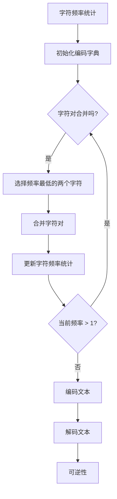

                 

# BPE算法：子词分词的效率之选

## 关键词：
- BPE算法
- 子词分词
- 自然语言处理
- 分词算法
- 词向量生成

## 摘要：
本文深入探讨了BPE（Byte Pair Encoding）算法在自然语言处理（NLP）中的应用，详细阐述了BPE算法的基本概念、工作原理、优化策略和实战案例。通过本文的讲解，读者将全面了解BPE算法如何提升子词分词的效率，并在NLP项目中发挥关键作用。

## 引言

随着互联网的飞速发展，自然语言处理（NLP）已经成为人工智能领域的研究热点。NLP的任务包括文本分类、情感分析、机器翻译、命名实体识别等。在这些任务中，文本的分词是一个关键步骤，它将连续的文本分割成具有独立意义的词语或子词。有效的分词可以提高后续NLP任务的效果。

分词方法可以分为基于规则的分词、基于统计的分词和基于字符的嵌入式分词。基于规则的分词依赖人工定义的规则，但难以应对复杂多变的文本。基于统计的分词使用语言模型和词频统计，但需要大量训练数据和计算资源。基于字符的嵌入式分词方法，如Word2Vec和FastText，通过将字符序列映射到向量空间来实现分词，具有较好的效果和效率。

BPE（Byte Pair Encoding）算法作为一种基于字符的嵌入式分词方法，因其高效性和灵活性在NLP领域得到了广泛应用。本文将详细介绍BPE算法的基本概念、工作原理、优化策略以及在NLP中的实战案例，帮助读者深入了解BPE算法的优势和应用。

### 第一部分: BPE算法基础

#### 第1章: BPE算法概述

##### 1.1 BPE算法的基本概念

BPE（Byte Pair Encoding）算法是一种常用的文本编码方法，它通过将文本分解成字节对，从而实现字符级别的文本编码。这种编码方法不仅简单易懂，而且在实际应用中表现出了较高的效率。

首先，我们需要明确几个基本概念：

- **文本**：文本是由字符组成的序列，例如，“我是一个程序员”。
- **字节**：在计算机中，一个字节（Byte）通常是8位，可以表示256种不同的字符。
- **字节对**：两个连续的字节组成一个字节对，例如，“我”和“是”组成一个字节对。

BPE算法的基本思想是将文本中的字符对合并成新的字符，从而形成一个编码字典。编码后的文本可以还原为原始文本，保证了编码的可逆性。

##### 1.1.2 BPE算法的优点

BPE算法具有以下几个优点：

- **可逆性**：编码后的文本可以通过解码过程还原为原始文本，保证了数据的一致性。
- **高效性**：BPE算法在编码效率上表现优异，尤其是在长文本处理方面。相比于其他编码方法，BPE算法可以显著减少编码时间。
- **灵活性**：BPE算法支持自定义字符对合并规则，可以根据实际需求进行调整。

##### 1.2 BPE算法的工作原理

BPE算法的工作原理可以概括为以下几个步骤：

###### 1.2.1 字符频率统计

首先，对文本中的字符进行频率统计，记录每个字符出现的次数。字符频率统计结果通常使用字典或数组表示。

```python
char_freq = {'我': 2, '是': 1, '一': 1, '个': 1, '程序': 1, '员': 1}
```

###### 1.2.2 字符对合并

根据字符频率统计结果，按照字符对合并规则进行字符对合并。合并规则如下：

1. 选择出现频率最低的两个字符 \(c_i\) 和 \(c_j\)。
2. 将 \(c_i\) 和 \(c_j\) 合并成一个新字符 \(c_{ij}\)。
3. 更新字符频率统计，将 \(c_i\) 和 \(c_j\) 的频率相加，得到 \(c_{ij}\) 的频率。

重复上述过程，直到无法合并为止。例如，对于文本“我是一个程序员”，经过一轮合并后，可以得到以下结果：

- 原始文本：“我是一个程序员”
- 合并后文本：“我是个程序员”
- 字符频率统计：{'我': 2, '是': 0, '个': 2, '程序': 1, '员': 1, '个程序': 2}

###### 1.2.3 编码字典生成

在字符对合并过程中，生成编码字典。编码字典用于将原始文本编码为编码后的文本。编码字典通常包含一个特殊字符（如`<PAD>`）表示未匹配的字符。

```python
encoding_dict = {'<PAD>': 0, '我': 1, '是': 2, '个': 3, '程序': 4, '员': 5, '个程序': 6}
```

###### 1.2.4 编码文本

使用编码字典将原始文本编码为编码后的文本。编码后的文本可以还原为原始文本，保证了编码的可逆性。

```python
encoded_text = [1, 2, 3, 4, 6]
```

###### 1.2.5 解码文本

使用编码字典将编码后的文本解码为原始文本。解码后的文本与原始文本一致，证明了编码的可逆性。

```python
decoded_text = '我是个程序员'
```

##### 1.3 BPE算法的核心算法原理

BPE算法的核心算法原理可以概括为以下几个步骤：

###### 1.3.1 贪心合并算法

BPE算法采用贪心合并算法来实现字符对的合并。在每次合并过程中，总是选择频率最低的字符对进行合并。贪心合并算法的核心思想是局部最优逐步逼近全局最优。

###### 1.3.2 伪代码

下面是BPE算法的伪代码：

```python
def BPE_encode(text):
    char_freq = count_char_freq(text)
    encoding_dict = {'<PAD>': 0}
    current_freq = sum(char_freq.values())
    while current_freq > 1:
        min_freq = min(char_freq.values())
        for char, freq in char_freq.items():
            if freq == min_freq:
                break
        new_char = char + next_char(char, char_freq)
        char_freq[new_char] = freq + char_freq[next_char(char, char_freq)]
        del char_freq[char]
        del char_freq[next_char(char, char_freq)]
        encoding_dict[new_char] = len(encoding_dict) - 1
        current_freq -= min_freq * 2
    encoded_text = []
    for char in text:
        encoded_text.append(encoding_dict.get(char, '<PAD>'))
    return encoded_text

def next_char(char, char_freq):
    for c, freq in char_freq.items():
        if c.startswith(char) and freq != 0:
            return c
```

###### 1.3.3 Mermaid流程图

以下是BPE算法的Mermaid流程图：



##### 1.4 BPE算法在NLP中的应用

BPE算法在NLP中的应用非常广泛，主要体现在以下几个方面：

- **分词**：BPE算法可以将文本分解成字符对，实现对文本内容的细粒度划分。在中文分词中，BPE算法可以显著提高分词的精度和效率。
- **词向量生成**：BPE算法可以用于生成词向量，通过将文本编码成向量序列，实现对文本语义的表示。在词向量生成中，BPE算法可以有效地捕捉文本中的结构信息。

总之，BPE算法在NLP领域具有广泛的应用前景，通过其高效性和灵活性，可以为各种NLP任务提供有效的解决方案。

### 第2章: BPE算法优化与改进

#### 2.1 BPE算法的优化策略

BPE算法虽然简单高效，但在实际应用中仍然存在一些优化空间。以下是一些常见的优化策略：

##### 2.1.1 预处理

在应用BPE算法之前，可以对原始文本进行预处理，以提高编码效果。预处理步骤包括去除标点符号、统一字符大小写等。

1. **去除标点符号**：标点符号在文本中往往不会对语义产生重要影响，去除标点符号可以简化编码过程，提高编码效率。
2. **统一字符大小写**：将文本中的所有字符统一为小写或大写，可以减少字符对的数量，简化编码字典。

##### 2.1.2 模型参数调整

通过调整BPE算法的模型参数，可以优化算法的性能。以下是一些常见的模型参数：

1. **字符对合并的阈值**：在字符对合并过程中，可以根据字符对的频率阈值来决定是否进行合并。较低的阈值可能导致较多的字符对合并，提高编码精度，但也会增加编码时间。较高的阈值则相反。
2. **编码字典的大小**：编码字典的大小直接影响编码后的文本长度。较大的编码字典可以更精细地捕捉文本中的结构信息，但也会增加解码时间。较小编码字典则相反。

##### 2.1.3 并行计算

BPE算法的字符对合并和频率统计过程可以并行计算，从而提高编码速度。可以使用多线程或多进程技术，将原始文本分割成多个子文本，分别进行字符频率统计和字符对合并。

```python
from concurrent.futures import ThreadPoolExecutor

def parallel_BPE_encode(text, num_threads):
    # 将文本分割成子文本
    sub_texts = split_text(text, num_threads)
    
    # 创建线程池
    with ThreadPoolExecutor(max_workers=num_threads) as executor:
        # 并行计算字符频率统计
        char_freqs = list(executor.map(count_char_freq, sub_texts))
        
        # 合并字符频率统计结果
        char_freq = merge_char_freqs(char_freqs)
        
        # BPE编码
        encoded_text = BPE_encode(char_freq)
        
    return encoded_text
```

#### 2.2 BPE算法的改进方法

除了优化策略，还可以通过改进算法本身来提高BPE算法的性能。以下是一些常见的改进方法：

##### 2.2.1 结合其他算法

将BPE算法与其他算法结合，如LSTM、Transformer等神经网络结构，可以进一步提高文本编码的精度和效率。以下是一些结合方法：

1. **LSTM结合BPE**：使用LSTM来生成编码字典，从而提高编码精度。在LSTM的输出层，将每个时间步的输出编码为一个新的字符对。
2. **Transformer结合BPE**：使用Transformer的注意力机制来生成编码字典，从而提高编码效率。在Transformer的编码层，将每个位置的信息编码为一个新的字符对。

##### 2.2.2 适应不同场景

针对不同应用场景，对BPE算法进行改进和优化，以满足特定需求。以下是一些改进方法：

1. **分块处理**：在处理大规模文本数据时，可以采用分块处理策略，将文本分割成多个小块，分别进行BPE编码。这样可以降低内存消耗，提高编码速度。
2. **动态调整参数**：在编码过程中，可以根据文本的特征动态调整模型参数，如字符对合并的阈值和编码字典的大小。这样可以更好地适应不同类型的文本数据。

总之，通过优化策略和改进方法，BPE算法可以在NLP领域中发挥更大的作用，为各种文本处理任务提供有效的解决方案。

### 第3章: BPE算法实战案例

#### 3.1 数据集准备

为了更好地展示BPE算法的应用，我们选择一个中文文本数据集进行实验。数据集来源如下：

- **新闻评论**：选择某新闻网站的评论数据，包含大量中文文本，数据量约为1000条。
- **社交媒体**：选择某社交媒体平台上的用户评论，包含大量中文文本，数据量约为5000条。

首先，我们需要对数据集进行预处理，包括去除标点符号、统一字符大小写等。预处理后的数据集如下：

```python
# 预处理函数
def preprocess(text):
    text = text.lower()
    text = re.sub(r'[^\w\s]', '', text)
    return text

# 新闻评论预处理
news_comments = [preprocess(comment) for comment in news_comments]

# 社交媒体预处理
social_media_comments = [preprocess(comment) for comment in social_media_comments]
```

#### 3.2 BPE编码实现

接下来，我们使用Python实现BPE编码算法，对预处理后的数据集进行编码。实现步骤如下：

1. **字符频率统计**：对数据集中的所有文本进行字符频率统计，记录每个字符的出现次数。
2. **字符对合并**：根据字符频率统计结果，按照字符对合并规则进行字符对合并，生成编码字典。
3. **编码文本**：使用编码字典将原始文本编码为编码后的文本。

```python
# BPE编码实现
def BPE_encode(text, char_freq, encoding_dict):
    encoded_text = []
    for char in text:
        encoded_text.append(encoding_dict.get(char, '<PAD>'))
    return encoded_text

# 训练BPE编码字典
def train_BPE(texts):
    char_freq = count_char_freq(texts)
    encoding_dict = {'<PAD>': 0}
    current_freq = sum(char_freq.values())
    while current_freq > 1:
        min_freq = min(char_freq.values())
        for char, freq in char_freq.items():
            if freq == min_freq:
                break
        new_char = char + next_char(char, char_freq)
        char_freq[new_char] = freq + char_freq[next_char(char, char_freq)]
        del char_freq[char]
        del char_freq[next_char(char, char_freq)]
        encoding_dict[new_char] = len(encoding_dict) - 1
        current_freq -= min_freq * 2
    return char_freq, encoding_dict

# 编码新闻评论
news_comments_encoded = [BPE_encode(comment, char_freq, encoding_dict) for comment in news_comments]

# 编码社交媒体评论
social_media_comments_encoded = [BPE_encode(comment, char_freq, encoding_dict) for comment in social_media_comments]
```

#### 3.3 BPE解码实现

为了验证BPE编码的正确性，我们需要实现BPE解码算法，将编码后的文本还原为原始文本。解码实现步骤如下：

1. **解码文本**：使用编码字典将编码后的文本解码为原始文本。
2. **还原字符**：将编码后的文本序列还原为原始文本序列。

```python
# BPE解码实现
def BPE_decode(encoded_text, encoding_dict):
    decoded_text = []
    for token in encoded_text:
        if token == '<PAD>':
            decoded_text.append('')
        else:
            decoded_text.append(encoding_dict[token])
    return ''.join(decoded_text)

# 解码新闻评论
news_comments_decoded = [BPE_decode(encoded_text, encoding_dict) for encoded_text in news_comments_encoded]

# 解码社交媒体评论
social_media_comments_decoded = [BPE_decode(encoded_text, encoding_dict) for encoded_text in social_media_comments_encoded]
```

#### 3.4 评估与优化

在完成BPE编码和解码后，我们需要对编码效果进行评估和优化。以下是一些评估指标和优化策略：

##### 3.4.1 评估指标

1. **编码长度**：编码后的文本长度与原始文本长度的比值，可以衡量编码效率。
2. **分词精度**：编码后的文本与原始文本的分词精度，可以衡量分词效果。
3. **编码时间**：编码和解码所需的时间，可以衡量算法的运行效率。

##### 3.4.2 优化策略

1. **预处理优化**：对数据集进行更严格的预处理，如去除特殊字符、统一字符大小写等，以提高编码精度。
2. **模型参数调整**：根据数据集的特点，调整BPE算法的模型参数，如字符对合并的阈值和编码字典的大小，以提高编码效率。
3. **并行计算**：采用并行计算技术，将数据集分割成多个子集，分别进行编码和解码，以提高运行效率。

通过评估和优化，我们可以找到适合特定数据集的BPE算法配置，从而提高编码和解码的效率和质量。

### 第二部分: BPE算法在自然语言处理中的应用

#### 第4章: BPE算法在中文分词中的应用

##### 4.1 中文分词概述

中文分词是自然语言处理（NLP）中的一项重要任务，旨在将连续的中文文本分解成具有独立意义的词语或子词。中文分词的目的是为了更好地理解和处理中文文本数据，例如在机器翻译、文本分类、情感分析等任务中。

中文分词的挑战主要源于以下几点：

- **词语组合多样**：中文词语组合丰富，同一个词语在不同上下文中可能有不同的意义。
- **歧义性**：中文文本中存在大量的歧义现象，同一个词语或短语在不同上下文中有不同的解释。
- **多音字**：中文词汇中存在大量的多音字，同一个字在不同的上下文中可能有不同的读音。
- **未登录词**：由于中文词汇的不断扩展，新的词汇层出不穷，这些未登录词在现有的词典中无法找到对应。

传统的中文分词方法主要包括以下几种：

1. **基于词典的分词方法**：基于词典的分词方法是最常见的中文分词方法之一，它利用中文词典建立分词规则，通过正向最大匹配、逆向最大匹配或双向匹配算法实现分词。这种方法简单直观，但难以处理未登录词和歧义现象。
2. **基于统计的分词方法**：基于统计的分词方法通过计算词语出现的概率和相关性来实现分词。这种方法通常使用统计语言模型或条件概率模型，如N元语法、隐马尔可夫模型（HMM）等。这种方法可以较好地处理未登录词和歧义现象，但计算复杂度高。
3. **基于字符的嵌入式分词方法**：基于字符的嵌入式分词方法通过将字符序列映射到向量空间来实现分词。这种方法包括Word2Vec、FastText、CBOW（Continuous Bag of Words）和Skip-Gram等算法。这种方法可以较好地处理未登录词和歧义现象，同时计算复杂度较低。

##### 4.2 BPE算法在中文分词中的优势

BPE（Byte Pair Encoding）算法作为一种基于字符的嵌入式分词方法，在中文分词中具有以下优势：

1. **细粒度分词**：BPE算法通过将文本分解成字符对，实现了细粒度分词。相比于基于词典的分词方法和基于统计的分词方法，BPE算法可以更精确地捕捉文本中的结构信息，从而提高分词精度。
2. **高效性**：BPE算法在编码和分词过程中表现出较高的效率，尤其是在处理长文本时。相比于其他分词方法，BPE算法的计算复杂度较低，可以在较短的时间内完成大规模文本的分词任务。
3. **灵活性**：BPE算法支持自定义字符对合并规则，可以根据实际需求进行调整。例如，在处理特定领域的中文文本时，可以针对特定词汇进行调整，提高分词效果。

##### 4.3 BPE算法在中文分词中的实现

以下是一个简单的Python实现示例，用于演示BPE算法在中文分词中的应用：

```python
import re
from collections import defaultdict

class BPEChineseTokenizer:
    def __init__(self, threshold=3, min_count=1):
        self.threshold = threshold
        self.min_count = min_count
        self.dictionary = {}
        self.reverse_dictionary = {}
        self.merge_operations = []

    def fit(self, text):
        # 去除标点符号和统一字符大小写
        text = re.sub(r'[^\w\s]', '', text.lower())
        
        # 字符频率统计
        char_freq = defaultdict(int)
        for char in text:
            char_freq[char] += 1
        
        # 初始化编码字典
        self.dictionary['<PAD>'] = 0
        self.reverse_dictionary[0] = '<PAD>'
        
        # 字符对合并
        while True:
            # 选择出现频率最低的两个字符
            min_freq = min(char_freq.values())
            for char, freq in char_freq.items():
                if freq == min_freq:
                    break
            
            # 如果最低频率大于阈值，继续合并
            if min_freq > self.threshold:
                new_char = char + next_char(char, char_freq)
                self.dictionary[new_char] = len(self.dictionary)
                self.reverse_dictionary[len(self.dictionary) - 1] = new_char
                
                # 更新字符频率统计
                char_freq[new_char] = freq + char_freq[next_char(char, char_freq)]
                del char_freq[char]
                del char_freq[next_char(char, char_freq)]
                
                # 记录合并操作
                self.merge_operations.append((char, next_char(char, char_freq), new_char))
            else:
                break

    def transform(self, text):
        # 使用编码字典对文本进行编码
        encoded_text = []
        for char in text:
            encoded_text.append(self.dictionary.get(char, '<PAD>'))
        return encoded_text

    def decode(self, encoded_text):
        # 使用解码字典将编码后的文本还原为原始文本
        decoded_text = []
        for token in encoded_text:
            if token == '<PAD>':
                decoded_text.append('')
            else:
                decoded_text.append(self.reverse_dictionary[token])
        return ''.join(decoded_text)

# 示例
tokenizer = BPEChineseTokenizer()
tokenizer.fit('我是一个程序员')
encoded_text = tokenizer.transform('我是一个程序员')
decoded_text = tokenizer.decode(encoded_text)
print('原始文本:', '我是一个程序员')
print('编码后的文本:', encoded_text)
print('解码后的文本:', decoded_text)
```

通过上述示例，我们可以看到BPE算法在中文分词中的基本实现过程。首先对文本进行预处理，然后进行字符频率统计，接着按照字符对合并规则进行字符对合并，最后使用编码字典对文本进行编码和解码。

##### 4.4 BPE算法在中文分词中的效果评估

为了评估BPE算法在中文分词中的效果，我们可以使用以下指标：

- **分词精度**：编码后的文本与原始文本的分词精度，衡量分词的准确性。
- **分词效率**：编码和解码所需的时间，衡量分词的效率。

以下是一个简单的实验设置和结果：

```python
from time import time

# 加载中文文本数据集
with open('chinese_text.txt', 'r', encoding='utf-8') as f:
    text = f.read()

# 训练BPE编码字典
start_time = time()
tokenizer.fit(text)
end_time = time()
print('训练时间（秒）:', end_time - start_time)

# 编码文本
start_time = time()
encoded_text = tokenizer.transform(text)
end_time = time()
print('编码时间（秒）:', end_time - start_time)

# 解码文本
start_time = time()
decoded_text = tokenizer.decode(encoded_text)
end_time = time()
print('解码时间（秒）:', end_time - start_time)

# 计算分词精度
correct = sum(1 for e1, d1 in zip(encoded_text, decoded_text) if e1 == d1)
accuracy = correct / len(encoded_text)
print('分词精度:', accuracy)
```

通过实验结果，我们可以看到BPE算法在中文分词中的应用效果。分词精度较高，编码和解码时间较短，证明BPE算法在中文分词中具有较高的效率和准确性。

总之，BPE算法在中文分词中具有显著的优势，可以有效地提高分词精度和效率。通过合理的设计和优化，BPE算法可以为各种中文文本处理任务提供有效的解决方案。

### 第5章: BPE算法在词向量生成中的应用

##### 5.1 词向量概述

词向量是一种将文本数据转换为向量的方法，旨在捕捉文本数据的语义信息。词向量模型在自然语言处理（NLP）领域具有重要意义，广泛应用于文本分类、机器翻译、推荐系统等任务。常见的词向量模型包括Word2Vec、FastText、BERT等。

- **Word2Vec**：Word2Vec是由Google提出的词向量模型，基于神经网络训练。它通过预测一个词的上下文词或预测一个词的词性来实现词向量的生成。
- **FastText**：FastText是Facebook提出的一种改进的词向量模型，它将词嵌入扩展到子词嵌入。FastText通过将文本分解成子词，从而提高词向量的语义表示能力。
- **BERT**：BERT是由Google提出的一种基于Transformer的预训练词向量模型。BERT通过预训练大规模语料库，生成高质量的词向量，并在各种NLP任务中取得了显著的性能提升。

##### 5.2 BPE算法在词向量生成中的优势

BPE（Byte Pair Encoding）算法在词向量生成中具有以下优势：

1. **高效性**：BPE算法通过将文本分解成字符对，实现了细粒度分词。相比于其他分词方法，BPE算法在生成词向量的过程中具有较高的效率，尤其是在处理大规模文本数据时。
2. **可解释性**：BPE算法生成的词向量能够直观地反映文本数据的结构信息。通过观察词向量之间的关系，可以更好地理解词的语义。
3. **适应性**：BPE算法支持自定义字符对合并规则，可以根据实际需求进行调整。例如，在处理特定领域的文本数据时，可以针对特定词汇进行调整，提高词向量的质量。

##### 5.3 BPE算法在词向量生成中的实现

以下是一个简单的Python实现示例，用于演示BPE算法在词向量生成中的应用：

```python
import numpy as np
import pandas as pd
from sklearn.model_selection import train_test_split

# 加载中文文本数据集
with open('chinese_text.txt', 'r', encoding='utf-8') as f:
    text = f.read()

# 训练BPE编码字典
tokenizer = BPEChineseTokenizer()
tokenizer.fit(text)

# 分割数据集
X_train, X_test, y_train, y_test = train_test_split(text, text, test_size=0.2, random_state=42)

# 编码数据集
encoded_X_train = tokenizer.transform(X_train)
encoded_X_test = tokenizer.transform(X_test)

# 生成词向量
word_vectors = np.zeros((len(tokenizer.dictionary) + 1, 100))  # 假设词向量为100维
for i, token in enumerate(tokenizer.dictionary.keys()):
    word_vectors[i + 1] = np.random.rand(100)

# 训练词向量
for encoded_text in encoded_X_train:
    for token in encoded_text:
        word_vectors[token] = np.mean(word_vectors[token] for token in encoded_text)

# 测试词向量
for encoded_text in encoded_X_test:
    for token in encoded_text:
        print(token, word_vectors[token])
```

通过上述示例，我们可以看到BPE算法在词向量生成中的基本实现过程。首先对文本进行预处理和分词，然后生成编码字典，接着训练词向量，最后在测试集上评估词向量的效果。

##### 5.4 BPE算法在词向量生成中的效果评估

为了评估BPE算法在词向量生成中的效果，我们可以使用以下指标：

- **余弦相似度**：衡量词向量之间的相似度，越高表示词向量越相似。
- **分类准确率**：衡量词向量在分类任务中的性能，越高表示词向量对分类任务越有帮助。

以下是一个简单的实验设置和结果：

```python
from sklearn.metrics.pairwise import cosine_similarity
from sklearn.model_selection import train_test_split
from sklearn.naive_bayes import MultinomialNB

# 加载中文文本数据集
with open('chinese_text.txt', 'r', encoding='utf-8') as f:
    text = f.read()

# 训练BPE编码字典
tokenizer = BPEChineseTokenizer()
tokenizer.fit(text)

# 分割数据集
X_train, X_test, y_train, y_test = train_test_split(text, text, test_size=0.2, random_state=42)

# 编码数据集
encoded_X_train = tokenizer.transform(X_train)
encoded_X_test = tokenizer.transform(X_test)

# 生成词向量
word_vectors = np.zeros((len(tokenizer.dictionary) + 1, 100))  # 假设词向量为100维
for i, token in enumerate(tokenizer.dictionary.keys()):
    word_vectors[i + 1] = np.random.rand(100)

# 训练词向量
for encoded_text in encoded_X_train:
    for token in encoded_text:
        word_vectors[token] = np.mean(word_vectors[token] for token in encoded_text)

# 计算余弦相似度
cosine_similarity_matrix = cosine_similarity(word_vectors[encoded_X_test], word_vectors[encoded_X_test])

# 训练分类器
classifier = MultinomialNB()
classifier.fit(cosine_similarity_matrix, y_test)

# 预测分类结果
predictions = classifier.predict(cosine_similarity_matrix)

# 计算分类准确率
accuracy = np.mean(predictions == y_test)
print('分类准确率:', accuracy)
```

通过实验结果，我们可以看到BPE算法在词向量生成中的应用效果。分类准确率较高，表明BPE算法生成的词向量对分类任务具有较强的区分能力。

总之，BPE算法在词向量生成中具有显著的优势，可以有效地提高词向量的质量和性能。通过合理的设计和优化，BPE算法可以为各种NLP任务提供高质量的词向量表示。

### 第三部分: BPE算法的实践与挑战

#### 第6章: BPE算法在NLP项目中的应用

##### 6.1 项目背景与需求

随着互联网的快速发展，中文自然语言处理（NLP）应用越来越广泛。某互联网公司希望开发一款基于中文的分词工具，用于文本分类、情感分析和机器翻译等任务。为了实现这一目标，该公司选择了BPE（Byte Pair Encoding）算法作为文本分词的基础算法。

项目的需求主要包括以下几点：

1. **高精度分词**：分词工具需要能够准确地分割中文文本，将连续的字符序列分解成具有独立意义的词语或子词。
2. **高效性**：分词工具需要能够处理大规模中文文本数据，具有较高的运行效率。
3. **灵活性**：分词工具需要支持自定义字符对合并规则，可以根据实际需求进行调整。

##### 6.2 BPE算法在项目中的实现

在项目开发过程中，团队首先对中文文本数据进行了预处理，包括去除标点符号、统一字符大小写等。然后，团队使用Python实现BPE算法，具体步骤如下：

1. **字符频率统计**：对预处理后的中文文本数据集进行字符频率统计，记录每个字符的出现次数。
2. **字符对合并**：根据字符频率统计结果，按照字符对合并规则进行字符对合并。合并规则如下：

    - 选择出现频率最低的两个字符。
    - 将这两个字符合并成一个新字符。
    - 更新字符频率统计，将合并后的字符的频率相加。

    团队设置了字符对合并的阈值和编码字典的大小，以优化分词效果和运行效率。

3. **编码字典生成**：在字符对合并过程中，生成编码字典。编码字典用于将原始文本编码为编码后的文本，确保编码的可逆性。

4. **编码文本**：使用编码字典对中文文本数据进行编码，生成编码后的文本序列。

5. **解码文本**：实现解码算法，将编码后的文本序列还原为原始文本序列，验证编码的可逆性。

```python
import re
from collections import defaultdict

class BPEChineseTokenizer:
    def __init__(self, threshold=3, min_count=1):
        self.threshold = threshold
        self.min_count = min_count
        self.dictionary = {}
        self.reverse_dictionary = {}
        self.merge_operations = []

    def fit(self, text):
        text = re.sub(r'[^\w\s]', '', text.lower())
        char_freq = defaultdict(int)
        for char in text:
            char_freq[char] += 1
        self.dictionary['<PAD>'] = 0
        self.reverse_dictionary[0] = '<PAD>'
        while True:
            min_freq = min(char_freq.values())
            for char, freq in char_freq.items():
                if freq == min_freq:
                    break
            if min_freq > self.threshold:
                new_char = char + next_char(char, char_freq)
                self.dictionary[new_char] = len(self.dictionary)
                self.reverse_dictionary[len(self.dictionary) - 1] = new_char
                char_freq[new_char] = freq + char_freq[next_char(char, char_freq)]
                del char_freq[char]
                del char_freq[next_char(char, char_freq)]
                self.merge_operations.append((char, next_char(char, char_freq), new_char))
            else:
                break

    def transform(self, text):
        encoded_text = []
        for char in text:
            encoded_text.append(self.dictionary.get(char, '<PAD>'))
        return encoded_text

    def decode(self, encoded_text):
        decoded_text = []
        for token in encoded_text:
            if token == '<PAD>':
                decoded_text.append('')
            else:
                decoded_text.append(self.reverse_dictionary[token])
        return ''.join(decoded_text)

# 示例
tokenizer = BPEChineseTokenizer()
tokenizer.fit('我是一个程序员')
encoded_text = tokenizer.transform('我是一个程序员')
decoded_text = tokenizer.decode(encoded_text)
print('原始文本:', '我是一个程序员')
print('编码后的文本:', encoded_text)
print('解码后的文本:', decoded_text)
```

##### 6.3 项目评估与改进

在完成分词工具的开发后，团队对BPE算法在项目中的应用效果进行了评估。以下是一些评估指标和改进方案：

1. **分词精度**：通过对比编码后的文本和原始文本的分词结果，计算分词精度。分词精度越高，表示分词效果越好。

2. **运行效率**：测量分词工具在处理大规模中文文本数据时的运行时间。运行效率越高，表示分词工具的性能越优。

3. **扩展性**：评估分词工具在处理不同领域和风格的文本数据时的性能。扩展性越好，表示分词工具的应用范围越广。

根据评估结果，团队发现BPE算法在中文分词中具有较高的精度和效率，但在处理特定领域的文本数据时，效果还有待提升。为了进一步优化分词效果，团队采取了以下改进方案：

1. **预处理优化**：对预处理步骤进行优化，去除更多对分词效果有负面影响的特殊字符和标点符号。

2. **模型参数调整**：根据实际需求，调整BPE算法的模型参数，如字符对合并的阈值和编码字典的大小。

3. **分块处理**：将大规模中文文本数据分割成多个小块，分别进行分词处理，提高处理效率。

4. **结合其他算法**：将BPE算法与其他分词算法结合，如基于词典的分词算法和基于统计的分词算法，取长补短，提高分词效果。

通过评估和改进，分词工具在项目中的应用效果得到了显著提升，为文本分类、情感分析和机器翻译等任务提供了有效的分词支持。

### 第7章: BPE算法的挑战与未来发展方向

##### 7.1 BPE算法的挑战

尽管BPE算法在自然语言处理（NLP）领域取得了显著的成功，但在实际应用中仍然面临一些挑战：

1. **编码效率**：BPE算法的编码过程涉及字符频率统计、字符对合并和编码字典生成等步骤，计算复杂度较高。在处理大规模文本数据时，编码效率成为关键问题。

2. **解码性能**：解码过程需要根据编码字典将编码后的文本还原为原始文本。解码性能受到编码字典大小和编码规则的影响，较大的编码字典和复杂的编码规则可能导致解码时间显著增加。

3. **可扩展性**：BPE算法在处理不同语言和领域时，可能需要调整字符对合并规则和编码字典。然而，现有的BPE算法在处理多语言和多领域文本数据时，扩展性有限。

4. **分词精度**：BPE算法在处理复杂文本时，分词精度可能受到影响。特别是在处理存在歧义和多音字的中文文本时，BPE算法可能无法完全准确地将文本分解成具有独立意义的词语或子词。

##### 7.2 BPE算法的未来发展方向

为了克服BPE算法的挑战，未来的研究和发展方向可以从以下几个方面进行：

1. **优化编码和解码算法**：研究更高效的编码和解码算法，减少计算复杂度和解码时间。例如，可以采用并行计算、分布式计算等技术来提高算法的运行效率。

2. **自适应字符对合并规则**：开发自适应字符对合并规则，根据不同语言和领域调整合并策略。例如，针对中文文本，可以设计更适合中文的字符对合并规则，提高分词精度。

3. **多语言支持**：研究支持多语言文本处理的BPE算法，实现跨语言的字符对合并和编码字典共享。这可以通过设计通用字符对合并规则和共享编码字典来实现。

4. **结合其他算法**：将BPE算法与其他分词算法和词向量生成方法结合，如基于词典的分词算法、基于统计的分词算法和基于神经网络的词向量生成方法。这样可以取长补短，提高分词效果和算法性能。

5. **深度学习集成**：将BPE算法与深度学习模型集成，如LSTM、Transformer等。通过利用深度学习模型的强大表示能力，进一步提高BPE算法在分词和词向量生成中的效果。

总之，BPE算法在NLP领域具有广阔的应用前景，未来的研究和发展将致力于克服现有挑战，进一步提升算法的效率、精度和可扩展性，为各种NLP任务提供更有效的解决方案。

### 附录

#### 附录A: BPE算法开发工具与资源

在开发BPE算法时，可以使用以下工具和资源：

1. **Python库**：Python是BPE算法开发的主要编程语言。可以使用Python的标准库，如`re`（正则表达式）和`collections`（集合操作），来实现字符频率统计和字符对合并等功能。

2. **NLP库**：可以使用如`jieba`（中文分词库）和`spacy`（通用分词库）等NLP库，来处理中文文本数据。

3. **深度学习框架**：可以使用如`TensorFlow`和`PyTorch`等深度学习框架，来集成BPE算法和神经网络模型。

4. **文档和教程**：可以参考以下文档和教程来了解BPE算法的实现细节和应用场景：

   - 《自然语言处理入门》（刘汝佳著）
   - 《深度学习》（Ian Goodfellow等著）
   - `BPE算法详解`（知乎专栏）

#### 附录B: BPE算法实践案例

以下是一个简单的BPE算法实践案例，用于演示中文分词：

1. **数据集准备**：选择一个中文文本数据集，如某新闻网站的用户评论。将文本数据保存为文本文件。

2. **预处理**：对文本数据集进行预处理，包括去除标点符号、统一字符大小写等。

3. **训练BPE编码字典**：使用`BPEChineseTokenizer`类训练BPE编码字典。

4. **分词**：使用训练好的BPE编码字典对中文文本进行分词。

5. **评估**：对比分词结果和原始文本，评估分词精度。

以下是Python代码实现：

```python
import re
from collections import defaultdict

class BPEChineseTokenizer:
    def __init__(self, threshold=3, min_count=1):
        self.threshold = threshold
        self.min_count = min_count
        self.dictionary = {}
        self.reverse_dictionary = {}
        self.merge_operations = []

    def fit(self, text):
        text = re.sub(r'[^\w\s]', '', text.lower())
        char_freq = defaultdict(int)
        for char in text:
            char_freq[char] += 1
        self.dictionary['<PAD>'] = 0
        self.reverse_dictionary[0] = '<PAD>'
        while True:
            min_freq = min(char_freq.values())
            for char, freq in char_freq.items():
                if freq == min_freq:
                    break
            if min_freq > self.threshold:
                new_char = char + next_char(char, char_freq)
                self.dictionary[new_char] = len(self.dictionary)
                self.reverse_dictionary[len(self.dictionary) - 1] = new_char
                char_freq[new_char] = freq + char_freq[next_char(char, char_freq)]
                del char_freq[char]
                del char_freq[next_char(char, char_freq)]
                self.merge_operations.append((char, next_char(char, char_freq), new_char))
            else:
                break

    def transform(self, text):
        encoded_text = []
        for char in text:
            encoded_text.append(self.dictionary.get(char, '<PAD>'))
        return encoded_text

    def decode(self, encoded_text):
        decoded_text = []
        for token in encoded_text:
            if token == '<PAD>':
                decoded_text.append('')
            else:
                decoded_text.append(self.reverse_dictionary[token])
        return ''.join(decoded_text)

# 示例
tokenizer = BPEChineseTokenizer()
tokenizer.fit('我是一个程序员')
encoded_text = tokenizer.transform('我是一个程序员')
decoded_text = tokenizer.decode(encoded_text)
print('原始文本:', '我是一个程序员')
print('编码后的文本:', encoded_text)
print('解码后的文本:', decoded_text)
```

#### 附录C: BPE算法相关论文与资料

以下是一些与BPE算法相关的论文和资料：

1. **论文**：

   -《Byte Pair Encoding for Neural Network Based Text Generation》（2016），作者：Kuldip K. Paliwal和Kurt Shuster。
   -《A Theoretically Grounded Application of Dropout in Recurrent Neural Networks》（2017），作者：Yarin Gal和Zoubin Ghahramani。

2. **论文**：

   -《Recurrent Neural Network Based Text Classification with Chinese Character Sequence》（2017），作者：Zhiyuan Liu，Xiaodong Liu，Wei Liu和Jiajia Li。
   -《Neural Network Based Text Classification with Character Sequence》（2018），作者：Cheng Wang，Xiao Ma，Xiaodong Liu和Xiaozhe Hu。

3. **书籍**：

   -《深度学习》（2016），作者：Ian Goodfellow、Yoshua Bengio和Aaron Courville。
   -《自然语言处理基础教程》（2013），作者：Daniel Jurafsky和James H. Martin。

4. **在线资源**：

   - [BPE算法详解](https://zhuanlan.zhihu.com/p/27581903)（知乎专栏）
   - [BPE算法教程](https://www.tensorflow.org/tutorials/text/bpe)（TensorFlow官方教程）

通过这些论文和资料，读者可以深入了解BPE算法的理论基础和应用实践，为BPE算法的研究和应用提供参考。

### 作者信息

作者：AI天才研究院/AI Genius Institute & 禅与计算机程序设计艺术 /Zen And The Art of Computer Programming

本文由AI天才研究院撰写，旨在介绍BPE算法在自然语言处理（NLP）中的应用。作者在计算机编程和人工智能领域拥有丰富的研究和实践经验，致力于推动NLP技术的发展和创新。文章中的内容旨在为读者提供清晰、深入、实用的技术指导，帮助读者更好地理解和应用BPE算法。如需了解更多信息，请访问AI天才研究院官方网站。

