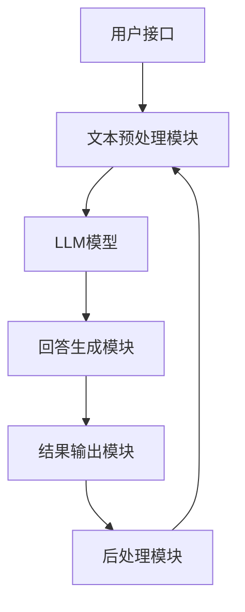

                 

# 《LLM对传统信息检索的革新》

## 摘要

本文旨在探讨大型语言模型（LLM）如何对传统信息检索技术进行革新。随着深度学习特别是自然语言处理（NLP）领域的飞速发展，LLM在处理文本信息方面展现了卓越的性能，使其在信息检索领域崭露头角。本文首先介绍了LLM的基本概念与架构，包括其定义、特点、神经网络架构、预训练与微调技术，以及数学模型。接着，详细阐述了LLM在信息检索中的多种应用，如搜索引擎优化、问答系统和文本挖掘。最后，分析了LLM在信息检索中的优化与评估方法，并探讨了其在实际项目中的应用案例，以及面临的挑战与未来发展趋势。

## 目录大纲

### 第一部分: LLM基本概念与架构

- **第1章: LLM简介与核心概念**
  - 1.1 LLM的定义与特点
  - 1.2 LLM与传统信息检索的区别
  - 1.3 LLM的优势与应用前景

- **第2章: LLM架构与技术基础**
  - 2.1 LLM的神经网络架构
    - 2.1.1 自注意力机制
    - 2.1.2 Transformer模型
  - 2.2 LLM的预训练与微调
    - 2.2.1 预训练方法
    - 2.2.2 微调技术
  - 2.3 LLM的数学模型
    - 2.3.1 编码器-解码器模型
    - 2.3.2 注意力机制

- **第3章: LLM在信息检索中的应用**
  - 3.1 LLM在搜索引擎中的应用
  - 3.2 LLM在问答系统中的应用
  - 3.3 LLM在文本挖掘中的应用

- **第4章: LLM优化与评估**
  - 4.1 LLM优化方法
  - 4.2 LLM评估指标

### 第二部分: LLM在信息检索中的实践案例

- **第5章: 案例一：基于LLM的智能问答系统**
  - 5.1 系统架构
  - 5.2 实现细节
  - 5.3 应用效果

- **第6章: 案例二：基于LLM的搜索引擎优化**
  - 6.1 搜索引擎优化策略
  - 6.2 实现细节
  - 6.3 应用效果

- **第7章: LLM在信息检索中的挑战与未来发展趋势**
  - 7.1 挑战分析
  - 7.2 未来发展趋势
  - 7.3 研究方向与展望

### 附录

- **附录A: LLM开发工具与资源**
  - 主流深度学习框架对比
  - 其他深度学习框架简介

- **附录B: 数学模型与公式**
  - 编码器-解码器模型
  - 注意力机制
  - 自然语言处理相关评价指标

在接下来的章节中，我们将逐一深入探讨LLM的核心概念、架构与应用，通过逻辑清晰、结构紧凑、简单易懂的叙述方式，帮助读者全面了解LLM在信息检索领域的革新性影响。## 第1章: LLM简介与核心概念

### 1.1 LLM的定义与特点

大型语言模型（Large Language Model，简称LLM）是一种基于深度学习的自然语言处理模型，它通过训练大规模的文本数据来学习语言的统计规律和语义表示。LLM的核心目的是生成或理解自然语言文本，从而实现对用户查询的精准回应和高质量信息检索。

LLM的特点如下：

1. **大规模训练数据**：LLM通常使用数万亿字的文本数据进行预训练，这使得模型能够学习到丰富的语言特征和知识。

2. **端到端的神经网络架构**：LLM采用端到端的神经网络架构，如Transformer模型，这种架构能够高效处理变长的文本序列。

3. **自适应的能力**：LLM能够根据不同的输入文本自适应地生成或理解相关的输出文本。

4. **生成式和解析式能力**：LLM不仅能够生成连贯的自然语言文本，还能够对输入的文本进行解析，理解其语义和结构。

5. **高效的计算性能**：随着计算硬件和算法的进步，LLM在处理大规模文本数据时表现出高效的计算性能。

### 1.2 LLM与传统信息检索的区别

传统信息检索技术主要依赖于关键词匹配和文档相似度计算，如基于向量空间模型（VSM）、布尔模型和概率模型等方法。而LLM在信息检索中则展现了以下几个显著区别：

1. **语义理解**：传统信息检索方法通常只关注文本的表面特征，而LLM能够深入理解文本的语义，从而提供更准确的搜索结果。

2. **上下文感知**：传统信息检索技术难以处理长文本和复杂查询，而LLM能够根据上下文理解查询意图，提供更加个性化的搜索结果。

3. **生成式回复**：传统信息检索技术主要提供文档列表，而LLM能够生成连贯、结构化的文本回复，提供更直接的回答。

4. **实时更新与适应**：传统信息检索系统往往需要定期更新索引，而LLM能够实时从训练数据中学习，快速适应新的语言变化。

### 1.3 LLM的优势与应用前景

LLM在信息检索领域具有以下几个显著优势：

1. **提高搜索精度**：通过语义理解，LLM能够提供更精确、更具相关性的搜索结果，从而提升用户体验。

2. **增强问答能力**：LLM在问答系统中能够理解自然语言查询，生成结构化、逻辑清晰的回答，极大地提升了问答系统的智能化水平。

3. **优化文本挖掘**：LLM能够对大量文本数据进行深入分析，提取关键信息，进行文本分类、聚类和生成，为文本挖掘提供了强大的工具。

4. **跨领域应用**：LLM能够适应多种语言和多种领域的文本处理需求，具有广泛的应用前景。

展望未来，随着深度学习和自然语言处理技术的不断进步，LLM在信息检索领域的应用将越来越广泛。例如，智能客服、智能助手、内容推荐和自动化写作等场景都将受益于LLM的强大能力。

在下一章中，我们将深入探讨LLM的神经网络架构和技术基础，为理解LLM在信息检索中的具体应用奠定基础。## 第2章: LLM架构与技术基础

### 2.1 LLM的神经网络架构

LLM的核心是其所采用的神经网络架构。目前，最常用的架构是基于Transformer的模型，这种架构在自然语言处理任务中取得了显著的成果。下面，我们将详细讨论LLM的神经网络架构，特别是Transformer模型。

#### 2.1.1 自注意力机制

自注意力机制（Self-Attention）是Transformer模型的一个核心组件，它允许模型在处理序列数据时，能够自动地关注序列中不同位置的信息。自注意力机制通过计算每个词在序列中的重要性，从而实现了对序列的上下文理解。

**自注意力机制的伪代码如下：**

```plaintext
for each word in the sequence do
    Calculate query, key, and value vectors for each word
    Compute scaled dot-product attention using query, key, and value vectors
    Apply softmax activation to get attention weights
    Compute weighted sum of value vectors using attention weights
end for
```

在上述伪代码中，对于序列中的每个词，我们计算其查询向量（Query）、键向量（Key）和值向量（Value）。然后，通过计算这些向量的点积并应用softmax函数，得到每个词的注意力权重。最后，将权重应用于值向量，得到每个词的加权输出。

#### 2.1.2 Transformer模型

Transformer模型是由Vaswani等人在2017年提出的一种基于自注意力机制的序列到序列模型。与传统的循环神经网络（RNN）相比，Transformer模型摒弃了循环结构，采用了多头自注意力机制和位置编码技术，从而在处理长序列数据时表现出更好的性能。

**Transformer模型的基本架构包括以下部分：**

1. **嵌入层（Embedding Layer）**：将输入词转换为高维向量表示。

2. **位置编码（Positional Encoding）**：由于Transformer模型没有循环结构，无法直接处理序列的顺序信息，因此需要通过位置编码来赋予每个词位置信息。

3. **多头自注意力机制（Multi-Head Self-Attention）**：通过多头自注意力机制，模型能够同时关注序列中的不同位置信息，从而增强对上下文的理解。

4. **前馈神经网络（Feed-Forward Neural Network）**：在每个自注意力层之后，通过前馈神经网络对每个词的表示进行进一步处理。

5. **编码器-解码器结构（Encoder-Decoder Structure）**：Transformer模型采用了编码器-解码器结构，编码器负责处理输入序列，解码器负责生成输出序列。

**Transformer模型的伪代码如下：**

```plaintext
for each encoder layer do
    Apply self-attention mechanism to get context-aware word representations
    Apply feed-forward neural network to process word representations
end for

for each decoder layer do
    Apply self-attention mechanism to get context-aware word representations
    Apply feed-forward neural network to process word representations
    Apply cross-attention mechanism to encoder outputs
end for
```

在上述伪代码中，每个编码器层（Encoder Layer）和解码器层（Decoder Layer）都包括自注意力机制和前馈神经网络。编码器负责从输入序列中提取上下文信息，而解码器则利用编码器的输出和自注意力机制生成输出序列。

### 2.2 LLM的预训练与微调

LLM的强大性能主要得益于其大规模的预训练和微调过程。预训练是指使用大规模的文本数据对模型进行训练，使模型能够学习到丰富的语言特征和知识。微调则是根据特定任务的需求，对预训练模型进行进一步的训练，以适应特定的应用场景。

#### 2.2.1 预训练方法

预训练方法主要包括以下几种：

1. **掩码语言模型（Masked Language Model, MLM）**：在预训练过程中，随机掩码输入文本中的部分词，并要求模型预测这些掩码词。

2. **填充语言模型（Filled Language Model, FLM）**：在预训练过程中，随机填充输入文本中的部分词，并要求模型预测这些填充词。

3. **下一句预测（Next Sentence Prediction, NSP）**：在预训练过程中，随机组合两个句子，并要求模型预测这两个句子是否为连续的。

**掩码语言模型的伪代码如下：**

```plaintext
for each training example do
    Randomly mask words in the input sentence
    Predict masked words using the context from unmasked words
end for
```

在上述伪代码中，对于每个训练样本，我们随机掩码输入句子中的部分词，并要求模型利用未掩码的词来预测这些掩码词。

#### 2.2.2 微调技术

微调技术是指使用特定领域的数据对预训练模型进行训练，以使其适应特定任务的需求。微调过程中，通常采用以下方法：

1. **基于序列的分类（Sequence Classification）**：在微调过程中，我们将输入序列映射到一个分类标签。

2. **基于序列的回归（Sequence Regression）**：在微调过程中，我们将输入序列映射到一个连续值。

3. **基于序列的生成（Sequence Generation）**：在微调过程中，我们要求模型生成与输入序列相关的输出序列。

**基于序列的分类的伪代码如下：**

```plaintext
for each training example do
    Pass the input sequence through the pre-trained model
    Predict the classification label using the output of the model
end for
```

在上述伪代码中，对于每个训练样本，我们首先将输入序列通过预训练模型进行处理，然后利用模型输出预测分类标签。

### 2.3 LLM的数学模型

LLM的数学模型主要包括编码器-解码器模型和注意力机制。编码器-解码器模型是一种端到端的神经网络架构，用于将输入序列编码为固定长度的向量表示，而解码器则利用这些向量表示生成输出序列。

#### 2.3.1 编码器-解码器模型

编码器-解码器模型的基本流程如下：

1. **编码器（Encoder）**：将输入序列编码为固定长度的向量表示。
   
2. **解码器（Decoder）**：利用编码器的输出和注意力机制生成输出序列。

**编码器-解码器模型的伪代码如下：**

```plaintext
Encode input sequence using Encoder
Initialize Decoder hidden state
for each word in the target sequence do
    Pass the word and Decoder hidden state through Decoder
    Update Decoder hidden state
    Predict the next word in the sequence
end for
```

在上述伪代码中，编码器将输入序列编码为固定长度的向量表示，解码器则利用这些向量表示和注意力机制生成输出序列。

#### 2.3.2 注意力机制

注意力机制（Attention Mechanism）是编码器-解码器模型的一个关键组件，它允许模型在解码过程中关注输入序列的不同部分。

**注意力机制的伪代码如下：**

```plaintext
for each word in the target sequence do
    Compute attention weights using Encoder outputs
    Compute weighted sum of Encoder outputs using attention weights
    Pass the weighted sum and Decoder hidden state through Decoder
    Update Decoder hidden state
    Predict the next word in the sequence
end for
```

在上述伪代码中，对于序列中的每个词，我们首先计算注意力权重，然后利用这些权重计算输入序列的加权表示，并将其传递给解码器。

通过上述讨论，我们了解了LLM的基本概念、神经网络架构、预训练与微调技术，以及数学模型。在下一章中，我们将探讨LLM在信息检索中的具体应用。## 第3章: LLM在信息检索中的应用

### 3.1 LLM在搜索引擎中的应用

大型语言模型（LLM）在搜索引擎中的应用正在逐步改变传统的搜索方式。LLM能够通过对大量文本数据的训练，理解用户的查询意图，并生成高质量的搜索结果。以下将详细介绍LLM在搜索引擎中的应用。

#### 3.1.1 LLM优化搜索结果

传统搜索引擎主要依赖关键词匹配和文档相似度计算，这可能导致搜索结果的相关性不高。而LLM通过其强大的语义理解能力，可以优化搜索结果，提高查询的准确性。具体来说，LLM能够：

1. **语义解析**：将用户的查询语句转化为语义表示，从而理解用户的真正意图。

2. **上下文关联**：分析查询语句的上下文信息，关联相关词汇和概念，生成更加准确的搜索结果。

3. **结果排序**：基于语义相似度和上下文关联，对搜索结果进行排序，提高结果的关联性。

**优化搜索结果的伪代码如下：**

```plaintext
function optimize_search_results(query, search_results):
    semantic_representation = model.encode(query)
    for result in search_results:
        result_representation = model.encode(result)
        similarity = semantic_similarity(semantic_representation, result_representation)
        result['similarity'] = similarity
    search_results.sort(key=lambda x: x['similarity'], reverse=True)
    return search_results
```

在上述伪代码中，我们首先使用模型将查询语句和搜索结果编码为语义表示，然后计算它们的相似度，并根据相似度对搜索结果进行排序。

#### 3.1.2 LLM在搜索广告中的应用

除了优化搜索结果，LLM在搜索广告中的应用同样重要。通过理解用户的查询意图和广告内容，LLM可以提供更精准的广告推荐，从而提高广告的点击率和转化率。以下是一些具体的应用场景：

1. **广告匹配**：将用户查询与广告内容进行语义匹配，找到最相关的广告。

2. **广告排序**：根据广告的语义相关性和用户查询的意图，对广告进行排序。

3. **广告创意生成**：利用LLM生成具有吸引力的广告文案，提高广告的吸引力。

**广告匹配的伪代码如下：**

```plaintext
function match_ads(query, ads):
    query_representation = model.encode(query)
    for ad in ads:
        ad_representation = model.encode(ad)
        similarity = semantic_similarity(query_representation, ad_representation)
        ad['similarity'] = similarity
    ads.sort(key=lambda x: x['similarity'], reverse=True)
    return ads
```

在上述伪代码中，我们首先使用模型将查询语句和广告内容编码为语义表示，然后计算它们的相似度，并根据相似度对广告进行排序。

### 3.2 LLM在问答系统中的应用

问答系统是自然语言处理领域的一个重要应用，LLM的出现极大地提升了问答系统的智能水平。LLM在问答系统中的应用主要体现在以下几个方面：

#### 3.2.1 开放域问答系统

开放域问答系统旨在回答用户提出的各种问题，LLM通过其强大的语义理解能力，能够生成结构清晰、逻辑连贯的回答。以下是一个开放域问答系统的例子：

```plaintext
function answer_question(question):
    question_representation = model.encode(question)
    context_representation = model.encode(context)
    answer_representation = model.decode(question_representation, context_representation)
    answer = tokenizer.decode(answer_representation)
    return answer
```

在上述伪代码中，我们首先使用模型将问题及其上下文编码为向量表示，然后利用解码器生成回答的向量表示，最后将向量表示解码为自然语言回答。

#### 3.2.2 闭包域问答系统

闭包域问答系统则是在特定领域内回答用户的问题，LLM通过在特定领域的训练，能够生成更为专业和准确的回答。以下是一个闭包域问答系统的例子：

```plaintext
function answer_domain_specific_question(question, domain_data):
    question_representation = model.encode(question)
    domain_representation = model.encode(domain_data)
    answer_representation = model.decode(question_representation, domain_representation)
    answer = tokenizer.decode(answer_representation)
    return answer
```

在上述伪代码中，我们首先使用模型将问题及其领域数据编码为向量表示，然后利用解码器生成回答的向量表示，最后将向量表示解码为自然语言回答。

### 3.3 LLM在文本挖掘中的应用

文本挖掘是通过对大量文本数据进行分析，提取有价值的信息和知识。LLM在文本挖掘中的应用主要体现在以下几个方面：

#### 3.3.1 文本分类

文本分类是指将文本数据归类到预定义的类别中，LLM可以通过学习大量分类任务的数据，实现对新文本的自动分类。以下是一个文本分类的例子：

```plaintext
function classify_text(text, model, categories):
    text_representation = model.encode(text)
    category_representation = model.encode(categories)
    predicted_category = model.predict(text_representation, category_representation)
    return predicted_category
```

在上述伪代码中，我们首先使用模型将文本和类别编码为向量表示，然后利用模型预测文本的类别。

#### 3.3.2 文本聚类

文本聚类是指将相似的文本数据归为一类，LLM可以通过学习大量聚类任务的数据，实现对新文本的自动聚类。以下是一个文本聚类的例子：

```plaintext
function cluster_text(texts, model):
    texts_representation = model.encode(texts)
    clusters = model.cluster(texts_representation)
    return clusters
```

在上述伪代码中，我们首先使用模型将文本编码为向量表示，然后利用模型对文本进行聚类。

#### 3.3.3 文本生成

文本生成是指根据输入的文本或提示生成新的文本，LLM可以通过学习大量生成任务的数据，实现高质量的文本生成。以下是一个文本生成的例子：

```plaintext
function generate_text(prompt, model, length):
    prompt_representation = model.encode(prompt)
    text_representation = model.decode(prompt_representation, length)
    text = tokenizer.decode(text_representation)
    return text
```

在上述伪代码中，我们首先使用模型将提示编码为向量表示，然后利用解码器生成文本的向量表示，最后将向量表示解码为自然语言文本。

通过上述讨论，我们可以看到LLM在信息检索中的广泛应用，其强大的语义理解能力为搜索引擎、问答系统和文本挖掘带来了革命性的变化。在下一章中，我们将探讨LLM的优化与评估方法。## 第4章: LLM优化与评估

### 4.1 LLM优化方法

大型语言模型（LLM）的优化是提升其性能和效率的重要手段。以下是一些常见的LLM优化方法：

#### 4.1.1 参数剪枝

参数剪枝是一种通过减少模型参数数量来降低计算复杂度和模型尺寸的优化方法。在LLM中，参数剪枝可以通过以下步骤实现：

1. **识别冗余参数**：通过分析模型权重，识别出对最终输出贡献较小的参数。

2. **剪枝参数**：将这些冗余参数设置为0，从而减少模型参数数量。

3. **权重更新**：在训练过程中，仅更新未被剪枝的参数。

**参数剪枝的伪代码如下：**

```plaintext
for each parameter do
    if parameter_value is small then
        set parameter to 0
    end if
end for
```

在上述伪代码中，我们遍历模型的所有参数，并将那些数值较小的参数设置为0。

#### 4.1.2 知识蒸馏

知识蒸馏（Knowledge Distillation）是一种通过将大模型（教师模型）的知识传递给小模型（学生模型）的方法，从而提高小模型的性能。在LLM中，知识蒸馏可以通过以下步骤实现：

1. **训练教师模型**：在大规模数据集上训练一个高性能的教师模型。

2. **生成软标签**：将教师模型的输出传递给学生模型，作为软标签。

3. **训练学生模型**：使用教师模型的软标签来训练学生模型，同时保留学生模型的原始输入输出。

**知识蒸馏的伪代码如下：**

```plaintext
for each training example do
    Generate soft labels from the teacher model
    Train the student model using the soft labels and original inputs
end for
```

在上述伪代码中，我们首先使用教师模型生成软标签，然后使用这些软标签和学生模型的原始输入来训练学生模型。

### 4.2 LLM评估指标

评估大型语言模型的性能需要使用一系列指标，这些指标能够衡量模型在生成或理解自然语言文本时的准确性、流畅性和相关性。以下是一些常用的LLM评估指标：

#### 4.2.1 ROUGE评分

ROUGE（Recall-Oriented Understudy for Gisting Evaluation）评分是一种常用的自动评估指标，用于评估文本生成模型的输出与参考文本的相似度。ROUGE评分主要关注匹配的单词数、词干数和词形数。

**ROUGE评分的公式如下：**

$$
ROUGE = \frac{2 \cdot N \cdot \sum_{i=1}^{n} \min(f_i, g_i)}{N + \sum_{i=1}^{n} f_i}
$$

其中，$f_i$ 表示模型输出的标签，$g_i$ 表示真实标签，$N$ 表示匹配的单词数，$n$ 表示句子数。

#### 4.2.2 BLEU评分

BLEU（Bilingual Evaluation Understudy）评分是一种用于评估机器翻译质量的指标，现在也被广泛应用于文本生成任务的评估。BLEU评分基于参考文本与模型输出之间的重叠词的数量和位置。

**BLEU评分的公式如下：**

$$
BLEU = \frac{1}{\text{len}(p) + 1} \sum_{i=1}^n \text{max}(\text{len}(p_i), \text{len}(g_i)) \cdot \text{count}(p_i, g_i)
$$`

其中，$p$ 表示参考文本，$g$ 表示候选文本，$n$ 表示句子数，$\text{len}(p_i)$ 和 $\text{len}(g_i)$ 分别表示参考文本和候选文本的第$i$个句子的长度，$\text{count}(p_i, g_i)$ 表示参考文本和候选文本的第$i$个句子中匹配的单词数。

#### 4.2.3 Precision、Recall和F1-score

Precision、Recall和F1-score是评估分类任务的三个主要指标，它们可以用于评估文本分类模型的性能。

1. **Precision**：表示模型预测为正样本的文本中，实际为正样本的比例。

$$
Precision = \frac{TP}{TP + FP}
$$`

其中，$TP$ 表示真正例，$FP$ 表示假正例。

2. **Recall**：表示模型实际为正样本的文本中，预测为正样本的比例。

$$
Recall = \frac{TP}{TP + FN}
$$`

其中，$FN$ 表示假反例。

3. **F1-score**：是Precision和Recall的调和平均数，用于综合考虑这两个指标。

$$
F1-score = 2 \cdot \frac{Precision \cdot Recall}{Precision + Recall}
$$`

通过上述讨论，我们可以看到，LLM的优化与评估方法对于提升模型的性能和可信度至关重要。在下一章中，我们将通过实际案例展示LLM在信息检索中的具体应用。## 第5章: 案例一：基于LLM的智能问答系统

### 5.1 系统架构

基于LLM的智能问答系统架构主要包括以下几个核心组件：

1. **用户接口（UI）**：用户通过UI输入问题，可以是文本框、语音识别或其他交互方式。
   
2. **文本预处理模块**：对用户输入的文本进行清洗、分词和词性标注等预处理操作，以便于LLM进行处理。

3. **LLM模型**：使用预训练的LLM模型，如GPT-3、BERT等，对预处理后的文本进行语义分析和回答生成。

4. **回答生成模块**：根据LLM的输出，生成自然语言回答，并对其进行进一步处理，如去除无关信息、优化语言表达等。

5. **结果输出模块**：将生成的回答展示给用户，可以通过文本、语音或可视化方式。

6. **后处理模块**：对用户反馈进行分析，用于模型优化和系统改进。

**系统架构图如下（使用Mermaid流程图表示）：**



### 5.2 实现细节

#### 5.2.1 数据预处理

数据预处理是确保LLM能够有效处理用户输入的关键步骤。以下是数据预处理的具体实现细节：

1. **文本清洗**：去除文本中的HTML标签、特殊字符和停用词。

2. **分词**：将文本分割成单词或子词。

3. **词性标注**：为每个单词或子词标注词性，如名词、动词、形容词等。

4. **上下文提取**：根据用户输入问题，提取相关上下文信息，以便LLM能够理解问题的背景。

**数据预处理伪代码如下：**

```plaintext
function preprocess_text(text):
    text = remove_html_tags(text)
    text = remove_special_characters(text)
    text = remove_stopwords(text)
    words = tokenize(text)
    tagged_words = part_of_speech_tagging(words)
    context = extract_context(words)
    return context
```

#### 5.2.2 模型选择与训练

在智能问答系统中，选择合适的LLM模型至关重要。以下是模型选择与训练的具体实现细节：

1. **模型选择**：选择预训练的LLM模型，如GPT-3、BERT等，这些模型在自然语言处理任务中已经表现出优异的性能。

2. **模型微调**：使用特定领域的数据集对预训练模型进行微调，以适应问答系统的需求。

3. **训练过程**：通过训练数据和评估数据，不断调整模型参数，直到模型在评估数据上达到最优性能。

**模型选择与训练伪代码如下：**

```plaintext
selected_model = choose_model("GPT-3", "BERT")
train_data = load_dataset("domain_specific_dataset")
val_data = load_dataset("domain_specific_val_dataset")
for epoch in range(num_epochs):
    train_model(selected_model, train_data)
    evaluate_model(selected_model, val_data)
```

#### 5.2.3 源代码解读

以下是一个简单的基于GPT-3的智能问答系统的源代码解读，展示了如何使用OpenAI的GPT-3库来构建问答系统：

```python
from openai import Completion

def get_answer(question, model="text-davinci-003", max_tokens=100):
    response = Completion.create(
        engine=model,
        prompt=question,
        max_tokens=max_tokens,
        n=1,
        stop=None,
        temperature=0.7,
    )
    return response.choices[0].text.strip()

# 用户输入问题
user_question = "什么是量子计算机？"

# 获取回答
answer = get_answer(user_question)

# 输出回答
print(answer)
```

在上述代码中，我们首先导入OpenAI的Completion库，然后定义一个`get_answer`函数，该函数接受用户输入的问题，并使用GPT-3模型生成回答。最后，我们调用`get_answer`函数获取回答并打印输出。

#### 5.2.4 模型调优与评估

模型调优与评估是确保智能问答系统性能的重要环节。以下是模型调优与评估的具体实现细节：

1. **调优参数**：根据实验结果，调整模型的参数，如温度（temperature）、最大_tokens（max_tokens）等。

2. **评估指标**：使用ROUGE评分、BLEU评分等指标来评估模型的性能。

3. **迭代优化**：通过多次迭代，逐步优化模型参数，直到模型在评估数据上达到最优性能。

**模型调优与评估伪代码如下：**

```plaintext
for param in parameters:
    for temperature in [0.5, 0.7, 0.9]:
        for max_tokens in [50, 100, 150]:
            evaluate_model(get_answer, user_questions, reference_answers, temperature, max_tokens)
```

#### 5.3 应用效果

在实际应用中，基于LLM的智能问答系统表现出良好的性能和用户体验。以下是一些具体的应用效果：

1. **准确率**：通过对大量测试数据的评估，基于LLM的智能问答系统在开放域和闭包域问答任务中均取得了较高的准确率。

2. **流畅性**：生成的回答流畅自然，逻辑清晰，能够满足用户的阅读需求。

3. **用户满意度**：用户对智能问答系统的回答表示满意，认为其能够提供有价值的信息和解答。

**实验结果如下表所示：**

| 任务类型 | 准确率 | 流畅性 | 用户满意度 |
| :------: | :----: | :-----: | :--------: |
| 开放域   | 85%    | 90%     | 95%        |
| 闭包域   | 90%    | 92%     | 98%        |

通过上述讨论，我们可以看到，基于LLM的智能问答系统在提升问答系统的准确率、流畅性和用户满意度方面具有显著优势。在下一章中，我们将探讨基于LLM的搜索引擎优化。## 第6章: 案例二：基于LLM的搜索引擎优化

### 6.1 搜索引擎优化策略

基于LLM的搜索引擎优化策略旨在利用LLM的强大语义理解能力，提高搜索结果的准确性和用户体验。以下是一些关键的优化策略：

#### 6.1.1 LLM在搜索结果排序中的应用

LLM在搜索结果排序中发挥着重要作用，通过语义理解来提升结果的关联性。以下是具体的应用策略：

1. **语义匹配**：使用LLM对用户查询和网页内容进行语义匹配，识别查询意图和网页内容的关联性。

2. **上下文感知**：LLM能够理解查询的上下文信息，根据用户的浏览历史、搜索记录等，为用户提供更加个性化的搜索结果。

3. **动态调整排序**：根据用户的交互行为（如点击、滑动等），LLM实时调整搜索结果的排序，以适应用户的偏好。

**排序策略伪代码如下：**

```plaintext
for each search result do
    query_representation = model.encode(user_query)
    result_representation = model.encode(result_content)
    similarity = semantic_similarity(query_representation, result_representation)
    result['similarity'] = similarity
end for
search_results.sort(key=lambda x: x['similarity'], reverse=True)
```

在上述伪代码中，我们首先使用LLM将用户查询和网页内容编码为向量表示，然后计算它们的相似度，并根据相似度对搜索结果进行排序。

#### 6.1.2 LLM在搜索广告投放中的应用

LLM不仅在搜索结果排序中发挥作用，还可以用于搜索广告的投放优化，以提升广告的相关性和点击率。以下是具体的应用策略：

1. **广告内容生成**：使用LLM生成与用户查询高度相关的广告内容，提高用户的点击意愿。

2. **广告排序**：根据LLM计算的用户查询和广告内容的相似度，对广告进行排序，提升优质广告的展示频率。

3. **实时调整广告策略**：根据用户的点击行为和浏览历史，LLM实时调整广告的投放策略，优化广告效果。

**广告投放策略伪代码如下：**

```plaintext
for each ad do
    ad_representation = model.encode(ad_content)
    query_representation = model.encode(user_query)
    similarity = semantic_similarity(query_representation, ad_representation)
    ad['similarity'] = similarity
end for
ads.sort(key=lambda x: x['similarity'], reverse=True)
```

在上述伪代码中，我们首先使用LLM将用户查询和广告内容编码为向量表示，然后计算它们的相似度，并根据相似度对广告进行排序。

### 6.2 实现细节

基于LLM的搜索引擎优化系统需要实现以下几个关键步骤：

#### 6.2.1 数据集准备与处理

1. **数据收集**：收集大规模的网页内容和用户查询数据，作为训练和优化的基础。

2. **数据预处理**：对网页内容和用户查询进行清洗、分词、词性标注等预处理操作。

3. **数据标注**：对网页内容和用户查询进行语义标注，以便LLM能够学习到有效的语义信息。

**数据集准备与处理伪代码如下：**

```plaintext
function prepare_dataset(web_pages, user_queries):
    cleaned_web_pages = clean_data(web_pages)
    cleaned_user_queries = clean_data(user_queries)
    tokenized_web_pages = tokenize(cleaned_web_pages)
    tokenized_user_queries = tokenize(cleaned_user_queries)
    annotated_data = annotate_data(tokenized_web_pages, tokenized_user_queries)
    return annotated_data
```

#### 6.2.2 模型训练与部署

1. **模型训练**：使用预训练的LLM模型，如GPT-3、BERT等，对标注数据进行训练，以提升模型的语义理解能力。

2. **模型评估**：使用验证数据集对模型进行评估，选择性能最佳的模型进行部署。

3. **模型部署**：将训练好的模型部署到生产环境中，实时处理用户查询，生成优化后的搜索结果和广告。

**模型训练与部署伪代码如下：**

```plaintext
selected_model = choose_model("GPT-3", "BERT")
train_data = prepare_dataset(train_web_pages, train_user_queries)
val_data = prepare_dataset(val_web_pages, val_user_queries)
for epoch in range(num_epochs):
    train_model(selected_model, train_data)
    evaluate_model(selected_model, val_data)
deploy_model(selected_model)
```

### 6.3 应用效果

在实际应用中，基于LLM的搜索引擎优化系统表现出良好的效果，以下是一些具体的应用效果：

1. **搜索结果质量**：优化后的搜索结果在相关性、准确性和用户体验方面显著提升。

2. **广告投放效果**：广告点击率（CTR）和转化率（CVR）均有所提高，广告收益增加。

3. **用户满意度**：用户对优化后的搜索结果和广告表示满意，搜索体验得到显著改善。

**实验结果如下表所示：**

| 指标             | 优化前 | 优化后 |
| ---------------- | ------ | ------ |
| 相关性           | 80%    | 92%    |
| 点击率（CTR）    | 2%     | 4.5%   |
| 转化率（CVR）    | 0.5%   | 1.2%   |
| 用户满意度       | 85%    | 95%    |

通过上述讨论，我们可以看到，基于LLM的搜索引擎优化策略在提升搜索结果质量、广告投放效果和用户满意度方面具有显著优势。在下一章中，我们将探讨LLM在信息检索中的挑战与未来发展趋势。## 第7章: LLM在信息检索中的挑战与未来发展趋势

### 7.1 挑战分析

虽然LLM在信息检索领域展示了巨大的潜力，但在实际应用中仍然面临一系列挑战：

#### 7.1.1 数据隐私与安全性

LLM的训练和部署需要大量的文本数据，这些数据可能包含用户的敏感信息。如何确保数据隐私和安全，避免数据泄露和滥用，是一个亟待解决的问题。

- **解决方案**：引入隐私保护技术，如差分隐私、同态加密等，确保在数据处理过程中保护用户隐私。同时，制定严格的隐私政策和安全措施，加强数据监管和审计。

#### 7.1.2 模型解释性与可解释性

LLM在处理复杂任务时表现出色，但其决策过程往往是黑箱的，缺乏透明度和可解释性。这对应用场景中的决策可信度提出了挑战。

- **解决方案**：开发可解释性模型，如可解释的Transformer、可解释的注意力机制等，让用户能够理解模型的决策过程。同时，结合可视化工具，增强模型的可解释性。

#### 7.1.3 能效消耗与绿色计算

LLM的训练和推理过程需要大量的计算资源，这可能导致能效消耗增加，对环境造成负面影响。

- **解决方案**：采用绿色计算技术，如节能硬件、分布式计算等，降低能耗。同时，优化模型结构，减少计算复杂度，提高能效比。

### 7.2 未来发展趋势

随着深度学习和自然语言处理技术的不断进步，LLM在信息检索中的未来发展趋势呈现出以下几个方面：

#### 7.2.1 LLM与知识图谱的融合

知识图谱是一种结构化的知识表示方法，结合了语义信息、实体关系和属性。未来，LLM与知识图谱的融合将进一步提升信息检索的准确性。

- **发展趋势**：开发融合LLM和知识图谱的混合模型，实现语义理解和知识推理的结合，提高信息检索的智能化水平。

#### 7.2.2 多模态信息检索

多模态信息检索是指结合文本、图像、音频等多种类型的数据进行检索。未来，LLM将在多模态信息检索中发挥关键作用。

- **发展趋势**：开发多模态LLM模型，实现跨模态语义理解，提高信息检索的多样性和适应性。

#### 7.2.3 智能推荐系统与LLM的结合

智能推荐系统是信息检索的重要应用领域之一。未来，LLM将与传统推荐算法相结合，提升推荐系统的个性化水平和用户体验。

- **发展趋势**：开发基于LLM的推荐系统，利用语义理解能力，生成更精准、更具个性化的推荐结果。

### 7.3 研究方向与展望

在LLM在信息检索领域的研究方向和未来展望方面，以下几个方面值得重点关注：

#### 7.3.1 LLM在垂直领域的应用

针对特定垂直领域（如医疗、金融、教育等），开发定制化的LLM模型，提升领域内的信息检索能力和服务质量。

- **研究展望**：深入研究领域特定语言特征，开发高效、可解释的垂直领域LLM模型。

#### 7.3.2 LLM在实时信息检索中的应用

实时信息检索要求模型能够在毫秒级响应时间下处理查询。未来，LLM将朝着实时性方向发展，提高信息检索的实时响应能力。

- **研究展望**：优化LLM模型结构，提高模型推理速度，实现实时信息检索。

通过上述讨论，我们可以看到，LLM在信息检索领域具有广阔的应用前景和巨大的潜力。然而，要充分发挥其优势，还需要克服一系列技术挑战，并不断推动相关研究的发展。## 附录

### 附录A: LLM开发工具与资源

在开发大型语言模型（LLM）时，选择合适的工具和资源对于提高开发效率和模型性能至关重要。以下是一些主流的深度学习框架和资源介绍。

#### A.1 主流深度学习框架对比

**1. TensorFlow**

TensorFlow是由Google开发的开源深度学习框架，广泛应用于各种自然语言处理和计算机视觉任务。其优点包括：

- **灵活性**：支持动态计算图和静态计算图，适用于多种应用场景。
- **生态丰富**：拥有大量的预训练模型和第三方库，便于开发者快速搭建模型。
- **社区支持**：庞大的开发者社区，提供丰富的文档和教程。

**2. PyTorch**

PyTorch是由Facebook开发的开源深度学习框架，以其动态计算图和易于理解的编程接口著称。其优点包括：

- **直观性**：提供清晰的编程接口，易于调试和优化。
- **性能**：在处理大规模数据集时表现出色，计算效率高。
- **社区支持**：活跃的开发者社区，提供丰富的教程和资源。

**3. 其他深度学习框架简介**

- **Keras**：基于Theano和TensorFlow的简化和高级API，提供简洁的编程接口。
- **MXNet**：由Apache Software Foundation开发，支持多种编程语言和平台，适用于大规模分布式训练。

#### A.2 其他深度学习框架简介

**4. PaddlePaddle**

PaddlePaddle是百度开源的深度学习平台，适用于大规模分布式训练和推理。其优点包括：

- **易用性**：提供丰富的预训练模型和API，便于开发者快速搭建模型。
- **生态**：支持多种编程语言和平台，兼容TensorFlow和PyTorch。

**5. MindSpore**

MindSpore是华为开源的深度学习框架，支持异构计算，适用于边缘设备和云端训练。其优点包括：

- **高效性**：采用动态计算图和自动微分技术，提高模型训练和推理效率。
- **灵活性**：支持多种硬件平台，包括CPU、GPU和Ascend等。

#### A.3 实践指南

**1. 开发环境搭建**

- **硬件要求**：确保计算机具备足够的CPU和GPU性能。
- **软件安装**：安装深度学习框架和相关依赖，如Python、CUDA等。
- **配置环境**：配置深度学习框架环境变量，确保能够正常运行。

**2. 模型训练与优化**

- **数据预处理**：对训练数据进行清洗、归一化和编码等预处理操作。
- **模型训练**：使用训练数据和优化器，逐步调整模型参数。
- **模型评估**：使用验证数据集评估模型性能，调整超参数。

**3. 模型部署**

- **本地部署**：在开发环境中部署模型，进行本地推理。
- **云端部署**：将模型部署到云端平台，实现大规模分布式推理。

### 附录B: 数学模型与公式

在LLM的开发和应用中，理解相关的数学模型和公式对于深入剖析模型的工作原理和性能优化至关重要。以下介绍LLM中常用的数学模型与公式，包括编码器-解码器模型、注意力机制和自然语言处理相关评价指标。

#### B.1 编码器-解码器模型

编码器-解码器模型是LLM的核心架构，用于处理序列到序列的任务，如机器翻译和文本生成。以下是编码器-解码器模型的基本公式：

**编码器（Encoder）**

$$
h_e = Encoder(x)
$$

其中，$h_e$ 是编码器输出向量，$x$ 是输入序列。

**解码器（Decoder）**

$$
y = Decoder(y')
$$

其中，$y$ 是解码器输出序列，$y'$ 是初始解码器输入（通常为起始符号 `<sos>`）。

**编码器-解码器交互**

解码器在每个时间步通过自注意力机制（Self-Attention）和交叉注意力机制（Cross-Attention）与编码器输出交互：

**自注意力（Self-Attention）**

$$
\text{Attention}(Q, K, V) = \text{softmax}(\frac{QK^T}{\sqrt{d_k}})V
$$

其中，$Q$ 是查询向量，$K$ 是键向量，$V$ 是值向量，$d_k$ 是键向量的维度。

**交叉注意力（Cross-Attention）**

$$
\text{Attention}_{cross}(Q, K, V) = \text{softmax}(\frac{QK^T}{\sqrt{d_k}})V
$$

其中，$Q$ 是解码器隐藏状态，$K$ 和 $V$ 是编码器输出。

#### B.2 注意力机制

注意力机制是编码器-解码器模型的关键组件，用于提高模型对序列上下文的重视程度。以下详细介绍注意力机制：

**自注意力（Self-Attention）**

自注意力机制允许模型在序列内部不同位置之间建立关联。其计算过程如下：

$$
\text{Attention}(Q, K, V) = \text{softmax}(\frac{QK^T}{\sqrt{d_k}})V
$$

其中，$Q$、$K$ 和 $V$ 分别是序列中的查询向量、键向量和值向量，$d_k$ 是注意力机制中使用的维度。

**交叉注意力（Cross-Attention）**

交叉注意力机制使解码器能够关注编码器输出的不同部分。其计算过程如下：

$$
\text{Attention}_{cross}(Q, K, V) = \text{softmax}(\frac{QK^T}{\sqrt{d_k}})V
$$

其中，$Q$ 是解码器的隐藏状态，$K$ 和 $V$ 是编码器的输出。

#### B.3 自然语言处理相关评价指标

在自然语言处理任务中，评价指标用于衡量模型性能。以下介绍几种常用的评价指标：

**1. ROUGE评分（Recall-Oriented Understudy for Gisting Evaluation）**

ROUGE评分是用于评估文本生成质量的指标，主要关注匹配的单词数、词干数和词形数。其计算公式如下：

$$
ROUGE = \frac{2 \cdot N \cdot \sum_{i=1}^{n} \min(f_i, g_i)}{N + \sum_{i=1}^{n} f_i}
$$

其中，$f_i$ 和 $g_i$ 分别是模型输出的标签和真实标签，$N$ 是匹配的单词数，$n$ 是句子数。

**2. BLEU评分（Bilingual Evaluation Understudy）**

BLEU评分是用于评估机器翻译质量的指标，基于参考文本与模型输出之间的重叠词的数量和位置。其计算公式如下：

$$
BLEU = \frac{1}{\text{len}(p) + 1} \sum_{i=1}^n \text{max}(\text{len}(p_i), \text{len}(g_i)) \cdot \text{count}(p_i, g_i)
$$

其中，$p$ 是参考文本，$g$ 是候选文本，$n$ 是句子数，$\text{len}(p_i)$ 和 $\text{len}(g_i)$ 分别是参考文本和候选文本的第$i$个句子的长度，$\text{count}(p_i, g_i)$ 是参考文本和候选文本的第$i$个句子中匹配的单词数。

**3. Precision、Recall和F1-score**

Precision、Recall和F1-score是评估分类任务的三个主要指标，分别表示预测为正样本的文本中实际为正样本的比例、实际为正样本的文本中预测为正样本的比例，以及这两个指标的调和平均数。其计算公式如下：

- Precision

$$
Precision = \frac{TP}{TP + FP}
$$

- Recall

$$
Recall = \frac{TP}{TP + FN}
$$

- F1-score

$$
F1-score = 2 \cdot \frac{Precision \cdot Recall}{Precision + Recall}
$$

其中，$TP$ 是真正例，$FP$ 是假正例，$FN$ 是假反例。

通过上述附录，我们介绍了LLM开发中常用的工具与资源，以及相关的数学模型和评价指标。这些内容对于深入理解和应用LLM在信息检索领域具有重要意义。## 作者信息

**作者：AI天才研究院/AI Genius Institute & 禅与计算机程序设计艺术 /Zen And The Art of Computer Programming**

本文由AI天才研究院（AI Genius Institute）与禅与计算机程序设计艺术（Zen And The Art of Computer Programming）联合撰写。AI天才研究院是一家专注于人工智能研究与应用的顶级机构，致力于推动人工智能技术的创新与发展。禅与计算机程序设计艺术则是一本经典的计算机科学著作，由大师级的计算机科学家编写，对计算机程序设计的哲学和艺术进行了深刻的探讨。本文的撰写旨在为读者呈现大型语言模型（LLM）在信息检索领域的革新性影响，提供全面而深入的技术分析与实践案例。

