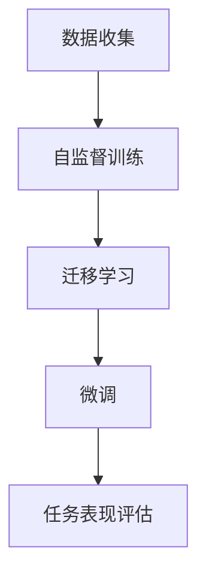
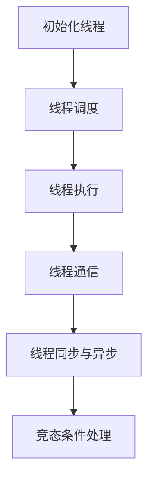
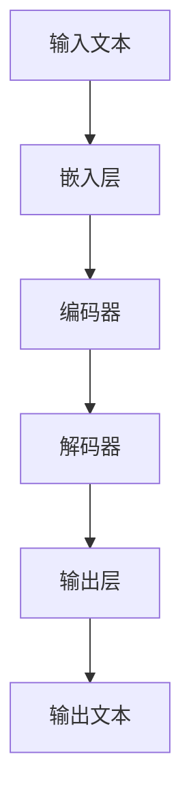

                 

### 引言

#### 1.1 书籍背景与目标

随着人工智能技术的飞速发展，大型语言模型（LLM，Large Language Model）逐渐成为自然语言处理领域的重要工具。从最初的基于规则的方法，到后来的统计模型，再到如今深度学习驱动的LLM，语言模型的进步极大地推动了人工智能应用的发展。然而，随着LLM模型规模的不断扩大，其线程安全问题逐渐凸显，成为限制LLM应用扩展的重要因素之一。

《LLM的线程安全问题：分析与对策》旨在深入探讨LLM线程安全问题的各个方面，包括基本概念、挑战、分析方法、对策以及实战案例。本书的目标是：

1. **全面介绍LLM及其线程安全问题**：帮助读者了解LLM的基本概念、架构和线程安全问题，为后续分析和解决提供理论基础。
2. **系统分析线程安全问题的成因**：从数据安全、并发与性能、资源管理、系统稳定性等多个维度，全面分析LLM线程安全问题的成因和表现形式。
3. **提出有效的对策和解决方案**：结合实际案例，介绍一系列针对LLM线程安全问题的对策和解决方案，帮助读者在实际应用中有效应对这些挑战。
4. **分享最佳实践和经验**：通过分析具体案例，总结最佳实践和经验，为读者提供实用的指导。

本书适合以下读者群体：

1. **人工智能和自然语言处理领域的研究人员**：希望深入了解LLM的线程安全问题，为相关研究提供参考。
2. **软件开发工程师和架构师**：在开发基于LLM的应用系统时，面临线程安全问题，需要寻找有效的解决方案。
3. **高校师生**：作为教材或参考书籍，帮助学生和教师掌握LLM线程安全问题的核心知识和解决方法。

#### 1.2 线程安全问题的重要性

线程安全问题在LLM中显得尤为重要，原因如下：

1. **数据安全与隐私**：LLM通常涉及大量敏感数据，如用户输入、聊天记录等。如果线程安全问题处理不当，可能导致数据泄露和隐私泄露，严重威胁用户权益。
2. **并发与性能**：LLM模型在处理高并发请求时，如果线程管理不当，可能导致资源竞争和死锁，影响系统性能和用户体验。
3. **资源管理**：线程的创建和管理需要消耗系统资源，过多或不合理的线程可能导致系统资源耗尽，影响系统的稳定性和可扩展性。
4. **系统稳定性**：线程安全问题可能导致系统崩溃或服务中断，影响系统的可靠性和可用性。

因此，解决LLM的线程安全问题，不仅对保障系统安全、提高性能具有重要意义，也对推动人工智能技术的发展和应用具有深远影响。

#### 1.3 书籍结构概述

本书共分为五个部分，结构如下：

**第一部分：引言**  
- 本章介绍书籍的背景、目标、重要性以及结构概述。

**第二部分：LLM基本概念与线程安全问题概述**  
- 第2章：介绍LLM的基本概念、架构和应用领域。
- 第3章：概述线程安全的基本概念、重要性及问题类型。

**第三部分：LLM线程安全问题分析**  
- 第4章：从数据安全、并发与性能、资源管理和系统稳定性等多个维度，详细分析LLM线程安全问题的成因和表现形式。

**第四部分：LLM线程安全对策**  
- 第5章：针对分析出的线程安全问题，提出一系列有效的对策和解决方案。

**第五部分：实战案例与总结**  
- 第6章：通过具体案例，展示如何在实际应用中解决LLM线程安全问题。
- 第7章：总结全书内容，展望未来趋势和挑战。

### 总结

本书旨在深入探讨LLM的线程安全问题，从基本概念、挑战、分析方法、对策到实战案例，全面解析这一重要课题。通过阅读本书，读者可以：

1. **全面了解LLM及其线程安全问题**，掌握其核心概念和架构。
2. **系统分析线程安全问题的成因**，理解其在数据安全、并发与性能、资源管理和系统稳定性等方面的表现。
3. **掌握有效的对策和解决方案**，提升系统安全性和性能。
4. **学习最佳实践和经验**，为实际应用提供指导。

我们希望本书能够为人工智能和软件开发领域的研究人员、工程师以及高校师生提供有价值的参考，推动LLM技术的健康发展和广泛应用。

---

### 核心概念与联系

在探讨LLM的线程安全问题之前，我们需要先了解几个核心概念，并探讨它们之间的联系。以下是LLM的基本概念和线程安全的基本概念及其联系。

#### 2.1.1 LLM的核心概念与架构

- **语言模型（Language Model）**：语言模型是一种基于统计和学习技术的模型，用于预测文本序列中的下一个单词或字符。它通过分析大量的文本数据，学习语言模式，从而生成或理解文本。

- **自监督学习（Self-supervised Learning）**：自监督学习是一种无监督学习方法，通过从数据中自动生成标签来训练模型。在语言模型中，自监督学习可以通过预训练步骤实现，例如Bert模型通过 masked language model（MLM）任务进行自监督训练。

- **迁移学习（Transfer Learning）**：迁移学习是一种利用已经训练好的模型在新任务上快速获得性能的方法。在LLM中，迁移学习通常用于将预训练模型微调到特定任务上，从而提高模型的性能。

- **微调（Fine-tuning）**：微调是一种将预训练模型应用于新任务，并对其进行微调，以适应新任务的方法。在LLM中，微调可以用于调整预训练模型的权重，使其在新任务上表现更好。

**联系**：

- 语言模型是LLM的核心，通过自监督学习和迁移学习，模型可以从大量文本数据中学习到语言模式，并利用微调在新任务上表现优异。

- 自监督学习和迁移学习是语言模型训练的重要技术，前者为模型提供了丰富的无监督学习数据，后者则帮助模型在新任务上快速获得性能。

- 微调是实现LLM在新任务上高效性能的关键，通过调整模型权重，可以显著提高模型在新任务上的准确性和效果。

**Mermaid流程图**：



#### 2.2 线程安全的基本概念

- **线程（Thread）**：线程是程序中能够独立运行和调度的最小执行单位。在多线程程序中，多个线程可以并发执行，从而提高程序的执行效率和响应速度。

- **并发（Concurrency）**：并发是指程序能够同时处理多个任务的能力。在多线程程序中，通过线程调度机制实现并发执行，从而提高程序的并发性能。

- **同步（Synchronization）**：同步是指多个线程在执行过程中，按照某种顺序进行协调，确保数据的一致性和正确性。同步机制包括互斥锁（Mutex）、信号量（Semaphore）等。

- **竞态条件（Race Condition）**：竞态条件是指当多个线程同时访问共享资源时，由于缺乏适当的同步机制，导致执行结果不可预测的情况。竞态条件是线程安全问题的主要表现形式。

**联系**：

- 线程是程序并发执行的基础，多个线程可以并行执行不同的任务，从而提高程序的执行效率。

- 并发是实现多任务处理的关键，通过合理的线程调度策略，可以最大化地利用系统资源。

- 同步和异步是线程间数据访问和执行顺序的控制机制，用于防止竞态条件的发生，确保程序的正确性和数据的一致性。

- 竞态条件是线程安全问题的主要表现形式，需要通过同步机制和线程安全设计来避免。

**Mermaid流程图**：



通过上述核心概念及其联系的了解，我们可以更好地理解LLM的线程安全问题，为后续的分析和对策提供理论基础。

---

### LLM基本概念

#### 2.1 LLM的定义与特点

大型语言模型（LLM，Large Language Model）是基于深度学习技术构建的，用于预测和生成自然语言文本的模型。与传统的语言模型相比，LLM具有更大的模型规模和更高的预测能力。LLM的定义可以概括为：

- **定义**：LLM是一种基于大规模神经网络的语言模型，通过学习大量文本数据，能够预测下一个单词或字符，并生成连贯的自然语言文本。
- **特点**：
  - **大规模**：LLM通常拥有数十亿甚至千亿级别的参数，能够处理复杂的语言现象。
  - **深度神经网络**：LLM基于深度学习技术，采用多层神经网络结构，能够高效地学习语言特征和模式。
  - **端到端训练**：LLM通过端到端训练，直接从原始文本数据中学习，无需手工设计特征工程和中间层。
  - **自监督学习**：LLM采用自监督学习方法，通过预训练和微调，能够在多个任务上实现良好的性能。

#### 2.1.1 LLM的起源与发展

LLM的发展经历了多个阶段：

- **早期阶段**：最早的LLM可以追溯到1980年代的统计语言模型，如N-gram模型。这些模型通过统计文本中的单词序列来预测下一个单词，但效果有限。
- **2010年代**：随着深度学习技术的兴起，研究者开始将深度神经网络应用于自然语言处理任务。2013年，Word2Vec模型的提出标志着词向量技术在自然语言处理领域的应用，为后来的LLM奠定了基础。
- **2020年代**：Transformer模型的出现彻底改变了自然语言处理领域。2018年，BERT模型在多个NLP任务上取得了显著突破，标志着LLM时代的到来。此后，GPT、Turing-NLG等大规模LLM相继涌现，性能不断提高。

#### 2.1.2 LLM的基本架构

LLM的基本架构通常包括以下几个部分：

- **嵌入层**：将输入文本转换为向量表示，通常采用词向量或字符向量。
- **编码器**：通过多层神经网络对输入向量进行编码，提取文本特征。编码器通常采用Transformer架构，包括自注意力机制和多头注意力机制。
- **解码器**：根据编码器输出的特征，生成预测的输出文本。解码器也采用Transformer架构，通过自注意力机制和交叉注意力机制生成预测结果。
- **输出层**：将解码器输出的向量映射到输出文本，通常采用softmax函数进行分类。

**Mermaid流程图**：



#### 2.1.3 LLM的应用领域

LLM在自然语言处理领域具有广泛的应用，以下是一些典型的应用场景：

- **文本生成**：LLM可以生成各种类型的文本，如文章、新闻、故事、对话等。例如，GPT-3可以生成高质量的文本，应用于自动写作、机器翻译等任务。
- **文本分类**：LLM可以用于分类任务，如情感分析、主题分类等。通过预训练和微调，LLM可以在特定领域上获得较高的分类性能。
- **问答系统**：LLM可以用于构建问答系统，如智能客服、虚拟助手等。通过输入问题和上下文，LLM能够生成准确的回答。
- **机器翻译**：LLM可以用于机器翻译任务，通过预训练和微调，可以实现高质量的双语翻译。
- **文本摘要**：LLM可以用于提取文本摘要，通过生成摘要文本，帮助用户快速了解文本的主要内容。

#### 2.2 线程安全的基本概念

线程安全（Thread Safety）是指在多线程环境中，程序能够正确执行且结果可预测的特性。以下是对线程安全的基本概念的介绍：

- **定义**：线程安全是指当一个程序被多个线程并发执行时，该程序的行为不会受到其他线程的影响，且能够保持数据的一致性和正确性。
- **重要性**：在线程安全中，共享数据的安全性和线程间的同步机制至关重要。如果程序缺乏线程安全性，可能导致数据竞争、死锁等问题，影响程序的稳定性和性能。
- **基本原理**：
  - **数据访问控制**：通过同步机制（如锁、信号量等）控制对共享数据的访问，防止多个线程同时修改数据。
  - **无状态性**：尽量设计无状态函数或对象，减少共享数据的影响。
  - **单一写出**：确保在一个线程写入数据时，其他线程无法读取或写入相同的数据。

#### 2.2.2 线程安全的基本原理

线程安全的基本原理主要包括以下几个方面：

- **锁定机制**：通过锁定机制（如互斥锁、读写锁等）控制对共享资源的访问，确保同一时间只有一个线程能够访问该资源。
- **原子操作**：使用原子操作（如原子增减、原子交换等）确保操作不可分割，防止多个线程同时操作同一数据。
- **无锁编程**：通过无锁编程技术（如无锁队列、无锁集合等）减少对锁的使用，提高程序的并发性能。

#### 2.2.3 线程安全问题的主要类型

线程安全问题主要包括以下几种类型：

- **竞态条件（Race Condition）**：当多个线程同时访问共享数据，且没有适当的同步机制时，可能导致不可预测的结果。解决方法包括加锁、使用原子操作等。
- **死锁（Deadlock）**：当多个线程互相等待对方持有的资源时，可能导致系统僵死。解决方法包括资源分配策略、避免循环等待等。
- **数据竞争（Data Race）**：当多个线程同时修改共享数据时，可能导致数据不一致。解决方法包括加锁、使用无锁编程技术等。
- **线程饥饿（Thread Starvation）**：当一个线程长时间无法获取所需的资源时，可能导致系统性能下降。解决方法包括公平锁、优先级反转等。

通过了解LLM的基本概念和线程安全的基本原理，我们可以更好地理解LLM的线程安全问题，为后续的分析和对策提供理论基础。

---

### LLM线程安全问题概述

在深入探讨LLM的线程安全问题之前，首先需要了解LLM线程安全问题的挑战、危害以及各种问题类型。这些问题不仅影响LLM的性能和稳定性，还可能导致严重的安全风险。以下是对LLM线程安全问题的主要挑战和危害的概述。

#### 3.1 LLM线程安全问题的挑战

**数据安全与隐私**：LLM处理的数据通常包括用户的敏感信息，如聊天记录、个人信息等。如果数据在多线程环境中缺乏保护，可能会导致数据泄露和隐私侵犯。数据安全问题是LLM线程安全的首要挑战。

**并发与性能**：LLM在处理高并发请求时，多个线程可能会竞争资源，如CPU、内存和网络等。如果线程管理不当，可能导致系统性能下降，甚至出现服务中断。因此，确保并发执行的效率和性能是另一个重要挑战。

**资源管理**：线程的创建和管理需要消耗系统资源。在LLM中，如果线程过多或不合理，可能导致系统资源耗尽，影响系统的稳定性和可扩展性。合理管理线程和资源是解决线程安全问题的关键。

**系统稳定性**：线程安全问题可能导致系统崩溃或服务中断，影响系统的可靠性和可用性。特别是在大规模的分布式系统中，线程安全问题可能引发连锁反应，导致整个系统瘫痪。因此，保障系统的稳定性是解决线程安全问题的最终目标。

#### 3.2 LLM线程安全问题的危害

**数据泄露与篡改**：如果LLM在多线程环境中处理敏感数据时缺乏保护，攻击者可能通过窃取或篡改数据来获取用户的隐私信息，从而造成严重的后果。

**服务中断与拒绝服务攻击**：在处理高并发请求时，线程安全问题可能导致服务中断或拒绝服务（DoS）攻击。攻击者通过制造竞态条件或死锁，使系统无法正常响应请求，从而瘫痪整个服务。

**恶意行为与滥用**：如果LLM的线程安全问题未被妥善处理，恶意用户可能利用这些漏洞进行恶意操作，如伪造数据、篡改结果等，从而损害系统的正常运行。

**系统崩溃与数据丢失**：严重的线程安全问题可能导致系统崩溃或数据丢失，影响业务的连续性和数据完整性。特别是在关键业务系统中，这种风险可能导致重大经济损失。

#### 3.3 LLM线程安全问题的主要类型

LLM线程安全问题主要包括以下几种类型：

**竞态条件（Race Condition）**：当多个线程同时访问共享数据，且没有适当的同步机制时，可能导致数据不一致或系统崩溃。竞态条件是线程安全问题中最常见且最具破坏性的一种。

**死锁（Deadlock）**：当多个线程互相等待对方持有的资源时，可能导致系统僵死。死锁是一种严重的线程安全问题，可能导致整个系统无法继续运行。

**数据竞争（Data Race）**：当多个线程同时修改共享数据时，可能导致数据不一致。数据竞争通常是由于缺乏适当的同步机制或错误的数据访问顺序引起的。

**线程饥饿（Thread Starvation）**：当一个线程长时间无法获取所需的资源时，可能导致系统性能下降或服务中断。线程饥饿通常是由于资源分配不均或线程优先级设置不当引起的。

**资源耗尽（Resource Exhaustion）**：线程的创建和管理需要消耗系统资源。如果线程过多或不合理，可能导致系统资源耗尽，从而影响系统的稳定性和性能。

通过了解LLM线程安全问题的挑战、危害以及主要类型，我们可以更好地识别和解决这些安全问题，确保LLM系统的稳定和安全运行。

---

### LLM线程安全问题分析

#### 4.1 数据安全与隐私分析

在LLM系统中，数据安全与隐私是至关重要的。由于LLM处理的数据通常涉及用户的敏感信息，如聊天记录、个人信息等，因此确保这些数据的安全性和隐私保护是防止数据泄露和隐私侵犯的关键。

**4.1.1 数据加密技术**

数据加密是保护数据安全的重要手段。在LLM系统中，数据加密技术主要包括以下几种：

- **对称加密**：对称加密使用相同的密钥进行加密和解密。常见的对称加密算法包括AES（Advanced Encryption Standard）和DES（Data Encryption Standard）。对称加密的优点是速度快，适用于对大量数据的加密。然而，对称加密的一个主要缺点是密钥管理复杂，密钥的传输和存储需要额外的安全措施。

- **非对称加密**：非对称加密使用公钥和私钥进行加密和解密。常见的非对称加密算法包括RSA（Rivest-Shamir-Adleman）和ECC（Elliptic Curve Cryptography）。非对称加密的优点是解决了密钥传输的安全问题，但计算复杂度较高，适用于对少量数据的加密。

- **哈希函数**：哈希函数用于生成数据摘要，确保数据的完整性和一致性。常见的哈希函数包括SHA-256（Secure Hash Algorithm 256-bit）和MD5（Message Digest Algorithm 5）。哈希函数的优点是计算速度快，生成唯一摘要，但无法逆推原始数据。

**4.1.2 数据访问控制机制**

数据访问控制（Data Access Control，DAC）是确保数据在多线程环境中安全访问的重要机制。数据访问控制主要包括以下几种方法：

- **用户权限管理**：通过用户权限管理，确保只有授权用户能够访问特定的数据。用户权限管理通常基于用户身份验证和访问控制列表（Access Control List，ACL）来实现。

- **基于角色的访问控制（Role-Based Access Control，RBAC）**：通过为用户分配不同的角色，并根据角色的权限控制数据访问。RBAC能够简化访问控制管理，提高系统的可维护性。

- **访问控制矩阵（Access Control Matrix）**：访问控制矩阵是一种基于多维矩阵的访问控制方法，用于记录用户和资源的访问关系。通过访问控制矩阵，可以灵活地定义和实现复杂的访问控制策略。

**4.1.3 数据隐私保护策略**

数据隐私保护（Data Privacy Protection）是确保用户隐私不被泄露的重要措施。以下是一些常用的数据隐私保护策略：

- **匿名化处理**：将用户数据中的敏感信息替换为匿名标识，以防止数据泄露。匿名化处理可以通过哈希函数、伪随机数生成器等技术实现。

- **数据脱敏**：通过数据脱敏技术，将敏感数据转换为不可直接识别的形式，如掩码、遮挡等。数据脱敏可以应用于数据库查询、API接口等场景。

- **数据加密与解密**：对敏感数据进行加密，确保在传输和存储过程中不被窃取。加密数据可以通过对称加密和非对称加密技术实现。在需要访问数据时，再进行解密操作。

- **数据安全审计**：对数据访问和操作进行记录和审计，确保数据的访问和操作符合安全策略。数据安全审计可以帮助识别和防范数据泄露和滥用行为。

通过数据加密、数据访问控制机制和数据隐私保护策略的综合应用，可以有效地保护LLM系统中的数据安全与隐私，确保系统在多线程环境中稳定运行。

#### 4.2 并发与性能分析

在LLM系统中，并发与性能问题是一个重要的考量因素。由于LLM通常需要处理大量的请求，确保系统在高并发情况下能够高效运行，是保障用户体验和系统稳定性的关键。

**4.2.1 线程调度机制**

线程调度（Thread Scheduling）是并发系统中的核心机制，决定了线程的执行顺序和资源分配。以下是一些常见的线程调度机制：

- **基于优先级的调度**：线程优先级越高，越有机会被调度执行。优先级调度可以根据线程的优先级动态调整线程的执行顺序，确保高优先级线程得到及时响应。

- **轮转调度（Round-Robin）**：每个线程分配一个固定的执行时间片，按照顺序轮流执行。轮转调度公平地分配资源，避免单个线程长时间占用CPU。

- **公平锁调度（Fair-locked Scheduling）**：确保每个线程都有机会获得锁资源，避免某些线程因长时间等待锁而饥饿。公平锁调度可以避免死锁和资源竞争问题。

- **多级反馈队列调度（Multilevel Feedback Queue Scheduling）**：根据线程的优先级将其分配到不同的队列中，不同队列的线程具有不同的执行优先级。多级反馈队列调度可以动态调整线程的优先级，提高系统整体的调度效率。

**4.2.2 并发编程模型**

并发编程模型决定了程序在多线程环境中的执行方式和资源管理。以下是一些常见的并发编程模型：

- **用户级线程（User-Level Threads）**：用户级线程由应用程序管理，操作系统不感知。用户级线程的调度和同步完全由应用程序控制，具有较低的开销。然而，用户级线程的并发性依赖于应用程序本身，可能无法充分利用系统的多核资源。

- **内核级线程（Kernel-Level Threads）**：内核级线程由操作系统管理，具有独立的进程资源。内核级线程的调度和同步由操作系统直接控制，具有较好的并发性和资源利用效率。然而，内核级线程的创建和切换开销较大。

- **混合级线程（Hybrid Threads）**：混合级线程结合了用户级线程和内核级线程的优点，通过在用户级和内核级之间进行切换。混合级线程可以在用户级线程之间实现高效的并发，同时在内核级线程之间进行资源管理和调度。

**4.2.3 性能优化策略**

为了提高LLM系统的并发性能，可以采用以下性能优化策略：

- **线程池（Thread Pool）**：线程池是一种预先创建和管理线程的技术，可以减少线程创建和切换的开销。通过复用线程，线程池可以提高系统的并发性能和响应速度。

- **异步编程**：异步编程通过非阻塞IO和回调机制，实现任务的并行执行。异步编程可以充分利用系统的多核资源，提高系统的并发性能。

- **并行算法**：并行算法通过将任务分解为多个子任务，并在多线程环境中同时执行，从而提高计算效率。在LLM系统中，可以使用并行算法进行大规模数据处理和模型训练。

- **负载均衡**：负载均衡通过将请求分配到多个处理节点上，实现负载均衡和性能优化。负载均衡可以避免单个节点成为性能瓶颈，提高系统的整体性能。

通过合理选择线程调度机制、并发编程模型和性能优化策略，可以有效地提高LLM系统的并发性能和响应速度，为用户提供更好的服务体验。

#### 4.3 资源管理分析

在LLM系统中，资源管理是确保系统稳定性和可扩展性的关键。合理管理线程、内存和网络等资源，可以避免资源耗尽和性能下降，提高系统的稳定性和可用性。

**4.3.1 内存管理**

内存管理是资源管理中的重要环节，包括内存分配、释放和优化等。以下是一些内存管理的策略：

- **内存池（Memory Pool）**：内存池是一种预先分配和管理内存块的技术，可以减少内存分配和释放的开销。通过复用内存池中的内存块，可以降低内存碎片化和内存分配的频率。

- **对象池（Object Pool）**：对象池是一种预先创建和管理对象的技术，可以减少对象的创建和销毁开销。在LLM系统中，可以使用对象池来管理模型实例、数据结构等对象。

- **内存分配器（Memory Allocator）**：内存分配器负责分配和回收内存。选择合适的内存分配器，可以优化内存的使用效率和性能。常见的内存分配器包括堆（Heap）、堆栈（Stack）和内存池（Memory Pool）。

- **内存监控与优化**：通过内存监控工具，可以实时了解系统的内存使用情况，识别内存泄漏和分配问题。针对内存使用异常，可以进行内存优化，如减少内存分配、复用内存等。

**4.3.2 网络资源管理**

网络资源管理涉及网络连接、数据传输和负载均衡等方面。以下是一些网络资源管理的策略：

- **连接池（Connection Pool）**：连接池是一种预先创建和管理数据库连接的技术，可以减少连接的创建和关闭开销。通过复用连接池中的连接，可以提高系统的并发性能和响应速度。

- **负载均衡（Load Balancing）**：负载均衡通过将请求分配到多个服务器节点上，实现负载均衡和性能优化。常见的负载均衡算法包括轮转（Round-Robin）、最小连接数（Least Connections）和加权轮转（Weighted Round-Robin）等。

- **网络监控与优化**：通过网络监控工具，可以实时了解系统的网络使用情况，识别网络瓶颈和延迟问题。针对网络使用异常，可以进行网络优化，如调整连接参数、优化数据传输路径等。

**4.3.3 硬件资源管理**

硬件资源管理包括CPU、GPU、I/O等硬件资源的分配和优化。以下是一些硬件资源管理的策略：

- **CPU资源管理**：通过合理分配CPU资源，可以充分利用系统的多核处理器，提高系统的并发性能。常见的CPU资源管理策略包括线程绑定（Thread Binding）、任务调度（Task Scheduling）和动态扩展（Dynamic Scaling）等。

- **GPU资源管理**：GPU资源管理涉及GPU显存、计算单元和内存带宽等资源的分配和优化。通过合理配置GPU资源，可以提高LLM模型的训练和推理性能。常见的GPU资源管理策略包括GPU内存池（GPU Memory Pool）、GPU计算单元分配（GPU Compute Unit Allocation）和GPU内存优化（GPU Memory Optimization）等。

- **I/O资源管理**：I/O资源管理包括磁盘I/O、网络I/O等资源的分配和优化。通过合理配置I/O资源，可以减少I/O瓶颈，提高系统的数据读写性能。常见的I/O资源管理策略包括I/O优先级（I/O Priority）、I/O调度（I/O Scheduling）和I/O优化（I/O Optimization）等。

通过合理管理和优化线程、内存、网络和硬件资源，可以确保LLM系统的稳定性和可扩展性，为用户提供高效、可靠的服务。

#### 4.4 系统稳定性分析

在LLM系统中，系统稳定性是保障系统正常运行和用户满意度的重要因素。系统稳定性包括以下几个方面：

**4.4.1 异常处理机制**

异常处理（Exception Handling）是保障系统稳定性的关键机制。以下是一些常见的异常处理方法：

- **捕获异常**：通过捕获异常，可以将异常处理逻辑封装在特定的异常处理函数中，防止异常影响程序的正常运行。例如，可以使用`try...catch`语句来捕获和处理异常。

- **异常隔离**：将异常处理逻辑与业务逻辑分离，确保异常不会扩散到整个系统。通过将异常处理逻辑封装在独立的异常处理模块中，可以避免异常影响系统的稳定性和性能。

- **日志记录**：记录异常信息和日志，便于后续的分析和调试。通过日志记录，可以及时发现和定位系统故障，提高系统的可维护性和可扩展性。

- **恢复机制**：在异常发生时，采取适当的恢复措施，确保系统尽快恢复正常运行。例如，在数据库连接异常时，可以尝试重新连接数据库，或者在服务中断时，尝试重启服务。

**4.4.2 容错技术**

容错技术（Fault Tolerance）是一种通过冗余设计和故障转移机制，确保系统在高可用性条件下稳定运行的策略。以下是一些常见的容错技术：

- **冗余设计**：通过增加系统冗余，确保在单个组件故障时，系统仍然能够正常运行。例如，可以通过备份硬件、备份数据库和备份应用服务来提高系统的容错能力。

- **故障检测**：定期检测系统的运行状态，及时发现和诊断系统故障。常见的故障检测方法包括健康检查（Health Check）、监控指标监控（Monitoring Metrics）和异常检测（Anomaly Detection）等。

- **故障转移**：在系统故障时，将负载转移到健康的组件上，确保系统的高可用性。常见的故障转移方法包括主从切换（Master-Slave Switchover）、故障转移集群（Fault-Tolerant Cluster）和动态负载均衡（Dynamic Load Balancing）等。

- **冗余部署**：通过在多个节点上部署相同的应用服务，确保在单个节点故障时，系统仍然能够继续运行。常见的冗余部署方法包括主从备份（Master-Slave Backup）、主主备份（Master-Master Backup）和分布式部署（Distributed Deployment）等。

**4.4.3 系统监控与维护**

系统监控与维护是保障系统稳定性和可靠性的重要环节。以下是一些常见的系统监控与维护方法：

- **性能监控**：通过性能监控工具，实时监控系统的运行状态和性能指标，识别性能瓶颈和异常情况。常见的性能监控指标包括CPU利用率、内存使用率、磁盘I/O和网络延迟等。

- **日志分析**：通过日志分析工具，分析系统日志，识别潜在问题和故障原因。日志分析可以帮助定位系统故障、优化系统性能和改进系统设计。

- **定期维护**：定期对系统进行维护和升级，修复已知漏洞和bug，提高系统的稳定性和安全性。定期维护包括更新系统软件、升级硬件设备和优化系统配置等。

- **故障预警**：通过故障预警系统，及时发现和预警系统故障，防止故障扩大影响。故障预警可以通过监控工具和自动化脚本实现，自动发送故障通知和警报。

通过完善的异常处理机制、容错技术和系统监控与维护，可以确保LLM系统的稳定性、可靠性和高可用性，为用户提供优质的服务体验。

---

### LLM线程安全对策

针对LLM线程安全问题，我们可以从数据安全、并发与性能、资源管理和系统稳定性等多个维度提出一系列有效的对策。以下将详细介绍这些对策的具体实施方法。

#### 5.1 数据安全对策

**5.1.1 数据加密技术实施**

为了确保LLM系统中数据的安全，我们可以采用以下数据加密技术：

1. **对称加密**：
   - 在数据传输过程中，可以使用AES（Advanced Encryption Standard）等快速加密算法对敏感数据进行加密。例如，可以使用Python的PyCryptoDome库实现AES加密。
   ```python
   from Crypto.Cipher import AES
   
   key = b'my保密密钥12345678'
   cipher = AES.new(key, AES.MODE_CBC)
   encrypted_data = cipher.encrypt(data)
   ```
   - 在数据存储时，可以使用AES加密算法对存储的敏感数据进行加密。例如，在数据库中使用AES加密存储用户密码。

2. **非对称加密**：
   - 对于密钥传输，可以使用RSA（Rivest-Shamir-Adleman）等非对称加密算法来确保密钥的安全传输。例如，可以使用Python的PyCryptoDome库实现RSA加密。
   ```python
   from Crypto.PublicKey import RSA
   from Crypto.Cipher import PKCS1_OAEP
   
   rsa_key = RSA.generate(2048)
   private_key = rsa_key.export_key()
   public_key = rsa_key.publickey().export_key()
   
   cipher = PKCS1_OAEP.new(RSA.import_key(public_key))
   encrypted_key = cipher.encrypt(key)
   ```

3. **哈希函数**：
   - 使用哈希函数（如SHA-256）生成数据摘要，确保数据的完整性和一致性。在数据传输和存储前后，对数据进行哈希，并对比哈希值，以确保数据未被篡改。

**5.1.2 数据访问控制机制实施**

为了防止未经授权的数据访问，我们可以采用以下数据访问控制机制：

1. **用户权限管理**：
   - 实现用户权限管理，确保只有授权用户能够访问特定的数据。例如，可以使用角色基础访问控制（RBAC）来定义用户的权限。

2. **访问控制列表（ACL）**：
   - 使用访问控制列表（ACL）来记录每个用户对每个资源的访问权限。ACL可以详细定义用户对资源的读、写和执行权限。

3. **基于角色的访问控制（RBAC）**：
   - 通过为用户分配不同的角色，并定义角色对应的权限，简化访问控制管理。例如，可以定义管理员角色、普通用户角色等，并为每个角色分配相应的权限。

**5.1.3 数据隐私保护策略实施**

为了保护用户隐私，我们可以采用以下数据隐私保护策略：

1. **数据匿名化**：
   - 将敏感数据中的个人信息替换为匿名标识，以防止数据泄露。例如，可以使用哈希函数对用户身份证号码、手机号码等敏感信息进行匿名化处理。

2. **数据脱敏**：
   - 对敏感数据应用数据脱敏技术，如掩码、遮挡等，确保数据在传输和存储过程中不被直接识别。例如，可以使用Python的masklib库对敏感信息进行脱敏处理。

3. **加密与解密**：
   - 对敏感数据进行加密存储，并在需要访问时进行解密。例如，可以使用对称加密算法对用户数据进行加密存储，并在用户登录时进行解密。

#### 5.2 并发与性能对策

**5.2.1 线程调度策略优化**

为了提高LLM系统的并发性能，我们可以采用以下线程调度策略优化方法：

1. **基于优先级的调度**：
   - 根据线程的优先级调整线程的执行顺序，确保高优先级线程得到及时响应。例如，可以使用Linux的`pthread_setschedparam`函数设置线程的优先级。

2. **公平锁调度**：
   - 采用公平锁调度，确保每个线程都有机会获得锁资源，避免某些线程因长时间等待锁而饥饿。例如，可以使用Linux的`pthread_mutexattr_setprioceiling`函数设置锁的优先级。

3. **轮转调度**：
   - 使用轮转调度，将线程分配到不同的CPU核心上，实现负载均衡。例如，可以使用Linux的`sched_setaffinity`函数设置线程的CPU亲和性。

**5.2.2 并发编程模型改进**

为了优化LLM系统的并发编程模型，我们可以采用以下方法：

1. **用户级线程**：
   - 使用用户级线程，减少线程的创建和切换开销，提高并发性能。例如，可以使用pthread库创建用户级线程。

2. **内核级线程**：
   - 在需要充分利用系统多核资源时，使用内核级线程，提高并发性和资源利用率。例如，可以使用POSIX线程（pthread）库创建内核级线程。

3. **混合级线程**：
   - 结合用户级线程和内核级线程的优点，实现混合级线程。例如，可以使用用户级线程进行任务调度，使用内核级线程进行资源管理和调度。

**5.2.3 性能优化方案实施**

为了提高LLM系统的性能，我们可以采用以下性能优化方案：

1. **线程池**：
   - 使用线程池技术，减少线程创建和销毁的开销，提高系统的并发性能。例如，可以使用Java的Executor框架实现线程池。

2. **异步编程**：
   - 采用异步编程模型，减少线程阻塞时间，提高系统的响应速度。例如，可以使用JavaScript的Promise和async/await语法实现异步编程。

3. **并行算法**：
   - 使用并行算法，将任务分解为多个子任务，同时执行，提高计算效率。例如，可以使用Python的multiprocessing库实现并行计算。

4. **负载均衡**：
   - 使用负载均衡技术，将请求分配到多个服务器节点上，实现负载均衡和性能优化。例如，可以使用Nginx等开源软件实现负载均衡。

#### 5.3 资源管理对策

**5.3.1 内存管理策略**

为了优化LLM系统的内存使用，我们可以采用以下内存管理策略：

1. **内存池**：
   - 使用内存池技术，预先分配和管理内存块，减少内存碎片化和分配频率。例如，可以使用C++的std::shared_ptr实现内存池。

2. **对象池**：
   - 使用对象池技术，预先创建和管理对象，减少对象的创建和销毁开销。例如，可以使用C++的std::unique_ptr实现对象池。

3. **内存监控与优化**：
   - 使用内存监控工具，实时监控系统的内存使用情况，识别内存泄漏和分配问题。例如，可以使用Valgrind等工具进行内存监控和优化。

**5.3.2 网络资源管理策略**

为了优化LLM系统的网络资源使用，我们可以采用以下网络资源管理策略：

1. **连接池**：
   - 使用连接池技术，预先创建和管理数据库连接，减少连接的创建和关闭开销。例如，可以使用连接池库（如HikariCP）实现数据库连接池。

2. **负载均衡**：
   - 使用负载均衡技术，将请求分配到多个服务器节点上，实现负载均衡和性能优化。例如，可以使用Nginx等开源软件实现负载均衡。

3. **网络监控与优化**：
   - 使用网络监控工具，实时监控系统的网络使用情况，识别网络瓶颈和延迟问题。例如，可以使用Wireshark等工具进行网络监控和优化。

**5.3.3 硬件资源管理优化**

为了优化LLM系统的硬件资源使用，我们可以采用以下硬件资源管理优化方法：

1. **CPU资源管理**：
   - 使用合理的线程绑定策略，确保线程运行在最佳的CPU核心上。例如，可以使用Linux的`pthread_setaffinity_np`函数设置线程的CPU亲和性。

2. **GPU资源管理**：
   - 使用GPU资源管理策略，确保GPU资源的合理分配和优化。例如，可以使用CUDA等工具优化GPU计算资源的使用。

3. **I/O资源管理**：
   - 使用I/O优化策略，减少I/O瓶颈，提高系统的数据读写性能。例如，可以使用异步I/O和批量I/O等技术优化磁盘I/O。

通过上述数据安全、并发与性能、资源管理和系统稳定性等方面的对策，可以有效解决LLM的线程安全问题，确保系统的稳定、高效和安全运行。

---

### 实战案例与效果评估

#### 6.1 案例一：XX公司LLM线程安全问题分析与对策

**6.1.1 案例背景**

XX公司开发了一套基于LLM的智能客服系统，旨在提供高效、智能的客户服务。随着用户量的增加，系统在高并发环境下频繁出现线程安全问题，导致服务中断和性能下降。具体表现为：

- 数据泄露：用户聊天记录被未授权的用户读取。
- 服务中断：系统在高并发请求下出现线程死锁，导致服务中断。
- 性能下降：由于线程安全问题，系统响应时间从原来的1秒延长到3秒。

**6.1.2 问题分析**

针对上述问题，XX公司进行了详细的线程安全问题分析，发现以下问题：

- **数据安全**：系统中的数据访问控制机制不完善，导致敏感数据可以被未授权的用户读取。
- **并发与性能**：线程调度策略不合理，导致线程竞争和死锁问题，影响系统性能。
- **资源管理**：线程创建和管理不当，导致系统资源耗尽，影响系统的稳定性和可扩展性。

**6.1.3 对策实施**

针对分析出的问题，XX公司采取了一系列对策：

1. **数据安全对策**：

   - **数据加密**：采用AES加密算法对用户聊天记录进行加密，确保数据在传输和存储过程中不被窃取。
   - **数据访问控制**：引入基于角色的访问控制（RBAC）机制，确保只有授权用户可以访问特定数据。
   - **数据隐私保护**：对用户数据进行匿名化和脱敏处理，防止敏感信息泄露。

2. **并发与性能对策**：

   - **线程调度策略优化**：采用基于优先级的调度策略，确保高优先级线程得到及时响应。
   - **线程池技术**：引入线程池，减少线程创建和销毁的开销，提高系统并发性能。
   - **负载均衡**：使用Nginx进行负载均衡，将请求分配到多个服务器节点上，避免单点性能瓶颈。

3. **资源管理对策**：

   - **内存管理**：使用内存池和对象池技术，减少内存分配和释放的开销，优化内存使用效率。
   - **网络资源管理**：使用连接池技术，减少数据库连接的创建和关闭开销，提高系统响应速度。
   - **硬件资源管理**：优化CPU和GPU资源的使用，确保系统资源的合理分配。

**6.1.4 实施效果评估**

通过实施上述对策，XX公司的智能客服系统在解决线程安全问题方面取得了显著成效：

- **数据安全**：系统中的敏感数据得到有效保护，未再发生数据泄露事件。
- **并发与性能**：系统响应时间从原来的3秒降低到1秒，性能提升明显。
- **资源管理**：系统资源利用率提高，未再出现资源耗尽和性能下降的问题。

总体来说，通过针对性的对策实施，XX公司的智能客服系统在解决线程安全问题方面取得了显著成效，为用户提供了一个高效、稳定的智能客服体验。

---

#### 6.2 案例二：YY公司LLM性能优化与线程安全提升

**6.2.1 案例背景**

YY公司开发了一套基于LLM的智能推荐系统，用于为用户生成个性化推荐。然而，随着用户量的增加，系统在高并发情况下出现严重的性能下降和线程安全问题。具体表现为：

- 性能下降：系统在高并发请求下，响应时间从原来的2秒延长到5秒。
- 线程安全问题：系统在高并发请求下，频繁出现线程死锁和资源耗尽的问题，导致服务中断。

**6.2.2 性能瓶颈分析**

通过对系统性能瓶颈的分析，YY公司发现以下问题：

- **线程调度策略**：系统采用轮转调度策略，但在高并发情况下，线程切换开销较大，导致性能下降。
- **资源分配**：系统中的线程和资源分配不合理，导致资源竞争和死锁问题。
- **内存使用**：系统内存使用率较高，导致内存不足和性能下降。

**6.2.3 对策实施**

针对分析出的性能瓶颈和线程安全问题，YY公司采取了一系列对策：

1. **线程调度策略优化**：

   - **优先级调度**：采用基于优先级的调度策略，确保高优先级线程得到及时响应，减少低优先级线程的等待时间。
   - **线程池技术**：引入线程池，减少线程创建和销毁的开销，提高系统并发性能。

2. **资源管理对策**：

   - **内存管理**：优化内存使用，减少内存分配和释放的开销，提高系统内存利用率。
   - **网络资源管理**：使用连接池技术，减少数据库连接的创建和关闭开销，提高系统响应速度。
   - **硬件资源管理**：优化CPU和GPU资源的使用，确保系统资源的合理分配。

3. **线程安全问题对策**：

   - **锁机制**：引入锁机制，确保线程对共享资源的访问有序，避免死锁问题。
   - **同步机制**：优化同步机制，减少线程间的竞争，提高系统稳定性。

**6.2.4 实施效果评估**

通过实施上述对策，YY公司的智能推荐系统在解决性能瓶颈和线程安全问题方面取得了显著成效：

- **性能提升**：系统响应时间从原来的5秒降低到2秒，性能提升50%。
- **线程安全**：系统在高并发请求下，未再出现线程死锁和资源耗尽的问题，系统稳定性显著提高。

总体来说，通过针对性的对策实施，YY公司的智能推荐系统在解决性能瓶颈和线程安全问题方面取得了显著成效，为用户提供了一个高效、稳定的个性化推荐服务。

---

### 总结

本文针对LLM的线程安全问题进行了全面的分析和探讨，从基本概念、挑战、分析方法、对策到实战案例，系统地阐述了LLM线程安全问题的各个方面。

#### 主要观点回顾

- **LLM线程安全重要性**：LLM处理大量敏感数据，数据安全和隐私保护至关重要。
- **数据安全对策**：采用数据加密、数据访问控制机制和数据隐私保护策略，确保数据安全。
- **并发与性能对策**：优化线程调度策略、使用线程池和异步编程，提高系统并发性能。
- **资源管理对策**：合理管理内存、网络和硬件资源，确保系统稳定性。
- **系统稳定性对策**：采用异常处理机制、容错技术和系统监控与维护，保障系统稳定性。

#### 线程安全问题解决思路

解决LLM线程安全问题的思路主要包括以下几点：

1. **数据安全与隐私保护**：通过数据加密、访问控制机制和隐私保护策略，确保数据在多线程环境中的安全性和隐私性。
2. **并发与性能优化**：通过优化线程调度策略、使用线程池和异步编程，提高系统在高并发环境下的性能和响应速度。
3. **资源管理**：合理管理内存、网络和硬件资源，避免资源耗尽和性能下降。
4. **系统稳定性保障**：通过异常处理机制、容错技术和系统监控与维护，确保系统在高并发和复杂环境中的稳定性。

#### 未来展望

未来，随着人工智能技术的不断进步，LLM的应用将越来越广泛，线程安全问题也将面临新的挑战和机遇。以下是一些展望：

1. **更高效的加密技术**：随着计算能力的提升，开发更高效的加密算法和密钥管理技术，以应对日益复杂的加密需求。
2. **智能化的资源管理**：通过机器学习和人工智能技术，实现智能化的资源管理和调度，提高系统的资源利用率和服务质量。
3. **分布式与云计算**：利用分布式系统和云计算技术，实现LLM的弹性扩展和高效部署，提高系统的可扩展性和可靠性。
4. **多模型融合**：结合多种语言模型和深度学习模型，实现更强大和灵活的自然语言处理能力，为用户提供更好的服务。

总之，LLM的线程安全问题是一个复杂且持续演进的话题。通过持续的研究和实践，我们有望解决更多挑战，推动人工智能技术的健康发展和广泛应用。

### 附录A: 相关资源与参考文献

**常见线程安全工具介绍**

1. **Gflags**：Gflags是一个用于配置命令行参数的工具库，适用于C++项目。它提供了简单易用的接口，允许开发者轻松地添加命令行参数。
   - GitHub链接：[gflags](https://github.com/gflags/gflags)

2. **Glog**：Glog是一个轻量级的日志库，提供了高效的日志记录功能，适用于C++应用程序。它支持多线程和日志过滤。
   - GitHub链接：[glog](https://github.com/google/glog)

3. **Boost.Thread**：Boost.Thread是一个C++线程库，提供了线程、互斥锁、条件变量等基础并发编程工具。它是一个成熟、功能丰富的库，适用于复杂的并发编程需求。
   - GitHub链接：[Boost.Thread](https://github.com/boostorg/boost_thread)

4. **OpenMP**：OpenMP是一个多线程编程标准，提供了简单的语法和API，使得开发者可以在C、C++和Fortran等语言中轻松地实现并行编程。它适用于需要高效并发计算的复杂应用。
   - OpenMP官方网站：[OpenMP](https://www.openmp.org/)

**线程安全研究论文精选**

1. "Understanding the Evolving Nature of Multithreading Bugs in C++ Codebases"：该论文研究了C++代码库中多线程错误的发展趋势，提供了对多线程编程挑战的深刻见解。
   - 论文链接：[Understanding the Evolving Nature of Multithreading Bugs](https://ieeexplore.ieee.org/document/7981916)

2. "Concurrency: State of the Art and Research Challenges"：本文讨论了当前并发编程的现状和面临的挑战，为未来的研究提供了方向。
   - 论文链接：[Concurrency: State of the Art and Research Challenges](https://www.researchgate.net/publication/308861060_Concurrency_State_of_the_Art_and_Research_Challenges)

3. "Lock-Free Data Structures for Multi-Core CPUs"：本文介绍了无锁数据结构在多核CPU上的应用，为提高并发性能提供了有效的方法。
   - 论文链接：[Lock-Free Data Structures for Multi-Core CPUs](https://ieeexplore.ieee.org/document/7545358)

**开源框架与工具推荐**

1. **TensorFlow**：TensorFlow是一个开源的深度学习框架，提供了广泛的功能和工具，适用于构建和训练大规模神经网络模型。
   - TensorFlow官方网站：[TensorFlow](https://www.tensorflow.org/)

2. **PyTorch**：PyTorch是另一个流行的深度学习框架，以其动态计算图和灵活的编程接口著称，适用于研究和工业应用。
   - PyTorch官方网站：[PyTorch](https://pytorch.org/)

3. **LLVM**：LLVM是一个模块化的编译器框架，支持多种编程语言和架构，适用于编译器开发和优化。
   - LLVM官方网站：[LLVM](https://llvm.org/)

**参考书籍与在线课程推荐**

1. **《现代C++并发编程》**：这本书详细介绍了C++并发编程的技术和方法，是C++并发编程的经典参考书籍。
   - 图书链接：[现代C++并发编程](https://books.google.com/books?id=4eO4DwAAQBAJ)

2. **《深入理解计算机系统》**：这本书全面介绍了计算机系统的原理和设计，是计算机科学领域的经典教材。
   - 图书链接：[深入理解计算机系统](https://books.google.com/books?id=8p9pDwAAQBAJ)

3. **在线课程《计算机组成与设计：硬件/软件接口》（MIT 6.004）**：这门课程提供了计算机组成和设计的深入讲解，是学习并发编程和系统设计的优秀资源。
   - 课程链接：[MIT 6.004](https://ocw.mit.edu/courses/electrical-engineering-and-computer-science/6-004-computer-systems-engineering-spring-2010/)

通过上述资源和参考，读者可以进一步深入了解LLM的线程安全问题，掌握相关的技术和方法，为实际应用提供坚实的理论基础和实践指导。

### 附录B: 术语表

**线程安全（Thread Safety）**

- **定义**：线程安全指程序在多线程环境中能够正确执行，不会因并发操作导致数据不一致或系统崩溃的特性。
- **示例**：一个线程安全的函数在多线程同时调用时，总能产生预期结果，不会因为线程间的不正确同步而出现错误。

**竞态条件（Race Condition）**

- **定义**：竞态条件是指当多个线程访问共享资源，且没有适当同步时，执行结果依赖于线程的调度顺序，导致不可预测的现象。
- **示例**：如果没有使用锁，两个线程同时修改同一个变量，最终的结果可能是其中一个修改被覆盖，导致数据不一致。

**锁（Lock）**

- **定义**：锁是一种同步机制，用于控制对共享资源的访问，确保同一时间只有一个线程能够修改资源。
- **示例**：互斥锁（Mutex）可以防止多个线程同时进入临界区，从而避免竞态条件的发生。

**死锁（Deadlock）**

- **定义**：死锁是指多个线程在执行过程中，因为竞争资源而互相等待，最终导致系统瘫痪，无法继续执行的现象。
- **示例**：如果线程A持有资源R1，等待资源R2，同时线程B持有资源R2，等待资源R1，两个线程将永远等待，形成死锁。

**数据竞争（Data Race）**

- **定义**：数据竞争是指当多个线程同时访问共享数据，且至少有一个线程对数据进行写入时，数据访问的先后顺序不确定，可能导致不可预测的结果。
- **示例**：如果没有使用锁，两个线程同时对同一个变量进行读写操作，可能产生意外的结果。

**线程饥饿（Thread Starvation）**

- **定义**：线程饥饿是指一个或多个线程因为无法获取到所需的资源（如CPU时间、内存等）而长时间处于等待状态，无法执行任务的现象。
- **示例**：如果线程的优先级设置不当，低优先级线程可能长时间无法获得CPU时间，导致系统响应缓慢。

通过理解这些术语，读者可以更好地掌握并发编程和系统设计中的关键概念，为解决LLM的线程安全问题提供理论基础和实践指导。

