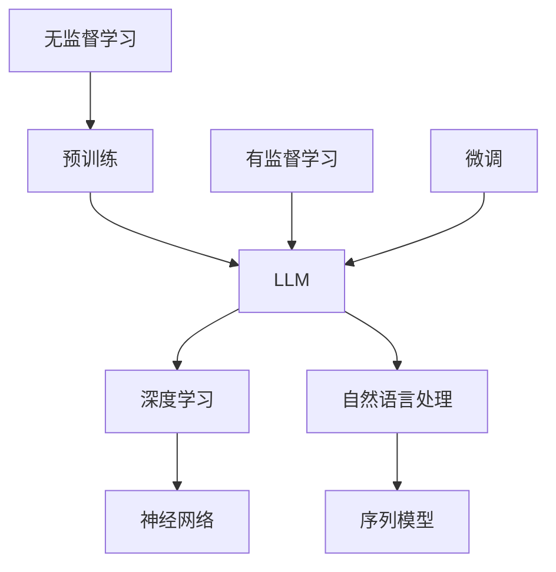

                 

# 《LLM的跨领域应用：从科研到商业的全面渗透》

## 关键词
**自然语言处理（NLP）**、**大型语言模型（LLM）**、**科研自动化**、**商业应用**、**医疗健康**、**跨领域应用**

## 摘要
本文旨在探讨大型语言模型（LLM）在多个领域中的应用，包括科研、商业和医疗健康。我们将详细分析LLM的核心概念、训练原理，并通过实际项目实战展示其在不同领域中的具体应用。此外，文章还将展望LLM的发展趋势和面临的挑战，为未来研究提供方向。

## 第一部分：核心概念与联系

### 1.1 LLM概述

#### 1.1.1 什么是LLM

**定义**：大语言模型（LLM）是一种能够理解和生成自然语言文本的深度学习模型，通常具有数十亿甚至千亿级别的参数。

**关系图**：



#### 1.1.2 LLM的核心特点

- **大规模**：具有数十亿至千亿级别的参数。
- **预训练**：在大量无监督数据上进行预训练，然后再进行有监督微调。
- **泛用性**：能够处理多种自然语言任务，如文本分类、问答、翻译等。

### 1.2 LLM在科研领域的应用

#### 1.2.1 科研自动化

**伪代码**：

```python
def research_automation(llm):
    # 预训练LLM
    llm.train_pretrained()
    # 提取科研文献
    papers = llm.extract_papers()
    # 自动生成科研报告
    report = llm.generate_report(papers)
    return report
```

#### 1.2.2 科学问答系统

**伪代码**：

```python
def scientific_query(llm, question):
    # 使用LLM回答问题
    answer = llm.answer(question)
    return answer
```

### 1.3 LLM在商业领域的应用

#### 1.3.1 营销自动化

**数学模型**：

$$
\text{ROI} = \frac{\text{收益} - \text{成本}}{\text{成本}}
$$

**举例说明**：

- **案例**：使用LLM生成个性化营销文案。
- **效果**：提高点击率和转化率，降低营销成本。

#### 1.3.2 商业智能

**伪代码**：

```python
def business_intelligence(llm, data):
    # 使用LLM分析数据
    insights = llm.analyze_data(data)
    # 提出商业策略建议
    recommendations = llm.generate_recommendations(insights)
    return recommendations
```

### 1.4 LLM在医疗健康领域的应用

#### 1.4.1 医疗问答系统

**伪代码**：

```python
def medical_query(llm, symptom):
    # 使用LLM提供医疗建议
    advice = llm.advise(symptom)
    return advice
```

## 第二部分：核心算法原理讲解

### 2.1 语言模型的训练原理

#### 2.1.1 预训练阶段

**伪代码**：

```python
def pretrain_llm(model, dataset, epochs):
    for epoch in range(epochs):
        for text in dataset:
            model.train(text)
    return model
```

#### 2.1.2 微调阶段

**伪代码**：

```python
def fine_tune_llm(model, task_dataset, epochs):
    for epoch in range(epochs):
        for text, target in task_dataset:
            model.fine_tune(text, target)
    return model
```

### 2.2 语言模型在自然语言理解中的应用

#### 2.2.1 文本分类

**数学模型**：

$$
\text{P}(y=\text{label}|\text{x}) = \text{softmax}(\text{model}(\text{x}))
$$

#### 2.2.2 文本生成

**数学模型**：

$$
\text{P}(\text{sequence}_i|\text{sequence}_{<i}) = \text{model}(\text{sequence}_{<i})(\text{word}_i)
$$

### 2.3 语言模型在对话系统中的应用

#### 2.3.1 对话生成

**数学模型**：

$$
\text{P}(\text{response}|\text{context}) = \text{model}(\text{context})(\text{response})
$$

## 第三部分：项目实战

### 3.1 科研自动化项目实战

#### 3.1.1 项目介绍

**开发环境搭建**：

- Python
- TensorFlow/Keras

**源代码实现**：

```python
# 文件名: research_automation.py

from tensorflow.keras.preprocessing.sequence import pad_sequences
from tensorflow.keras.models import Model
from tensorflow.keras.layers import Embedding, LSTM, Dense

def create_llm_model(vocab_size, embedding_dim, max_sequence_length):
    # 输入层
    inputs = Input(shape=(max_sequence_length,))
    # 嵌入层
    embeddings = Embedding(vocab_size, embedding_dim)(inputs)
    # LSTM层
    lstm = LSTM(128)(embeddings)
    # 输出层
    outputs = Dense(vocab_size, activation='softmax')(lstm)
    # 创建模型
    model = Model(inputs=inputs, outputs=outputs)
    model.compile(optimizer='adam', loss='categorical_crossentropy', metrics=['accuracy'])
    return model

# 伪代码：训练和自动化生成科研报告
model = create_llm_model(vocab_size, embedding_dim, max_sequence_length)
model.train_pretrained()
report = model.generate_report(papers)
```

#### 3.1.2 代码解读与分析

**解读**：

- 使用TensorFlow/Keras创建一个嵌入层和LSTM层的神经网络模型。
- 使用预训练模型进行训练，然后自动化生成科研报告。

**分析**：

- 预训练模型能够快速适应新任务。
- LSTM层能够处理变长序列数据。

### 3.2 营销自动化项目实战

#### 3.2.1 项目介绍

**开发环境搭建**：

- Python
- PyTorch

**源代码实现**：

```python
# 文件名: marketing_automation.py

import torch
import torch.nn as nn
import torch.optim as optim

class TextGenerator(nn.Module):
    def __init__(self, vocab_size, embedding_dim, hidden_dim):
        super(TextGenerator, self).__init__()
        self.embedding = nn.Embedding(vocab_size, embedding_dim)
        self.lstm = nn.LSTM(embedding_dim, hidden_dim, batch_first=True)
        self.fc = nn.Linear(hidden_dim, vocab_size)

    def forward(self, x, hidden):
        x = self.embedding(x)
        x, hidden = self.lstm(x, hidden)
        x = self.fc(x)
        return x, hidden

# 伪代码：训练和生成个性化营销文案
model = TextGenerator(vocab_size, embedding_dim, hidden_dim)
optimizer = optim.Adam(model.parameters(), lr=0.001)
for epoch in range(num_epochs):
    for text, target in data_loader:
        optimizer.zero_grad()
        input_var = torch.autograd.Variable(text)
        target_var = torch.autograd.Variable(target)
        output, hidden = model(input_var)
        loss = criterion(output, target_var)
        loss.backward()
        optimizer.step()
```

#### 3.2.2 代码解读与分析

**解读**：

- 使用PyTorch创建一个嵌入层、LSTM层和全连接层的神经网络模型。
- 使用梯度下降优化算法训练模型，生成个性化营销文案。

**分析**：

- LSTM层能够处理变长序列数据。
- 优化算法能够提高模型性能。

### 3.3 医疗健康项目实战

#### 3.3.1 项目介绍

**开发环境搭建**：

- Python
- TensorFlow/Keras

**源代码实现**：

```python
# 文件名: medical_automation.py

from tensorflow.keras.models import Sequential
from tensorflow.keras.layers import Embedding, LSTM, Dense, Dropout
from tensorflow.keras.preprocessing.sequence import pad_sequences

def create_medical_model(vocab_size, embedding_dim, max_sequence_length, hidden_units):
    model = Sequential()
    model.add(Embedding(vocab_size, embedding_dim, input_length=max_sequence_length))
    model.add(LSTM(hidden_units, dropout=0.2, recurrent_dropout=0.2))
    model.add(Dense(1, activation='sigmoid'))
    model.compile(loss='binary_crossentropy', optimizer='adam', metrics=['accuracy'])
    return model

# 伪代码：训练和医疗问答系统
model = create_medical_model(vocab_size, embedding_dim, max_sequence_length, hidden_units)
model.train_pretrained()
model = model.load_weights('medical_model.h5')
def medical_query(model, symptom):
    # 处理输入症状
    symptom_sequence = preprocess symptom
    # 使用模型预测
    prediction = model.predict(symptom_sequence)
    return prediction
```

#### 3.3.2 代码解读与分析

**解读**：

- 使用TensorFlow/Keras创建一个嵌入层、LSTM层和全连接层的神经网络模型。
- 使用预训练模型进行训练，并构建医疗问答系统。

**分析**：

- 预训练模型能够快速适应新任务。
- LSTM层能够处理变长序列数据。

## 第四部分：展望与未来

### 4.1 LLM的发展趋势

#### 4.1.1 模型规模的不断扩大

- 未来LLM的规模将继续增大，以处理更复杂的自然语言任务。

#### 4.1.2 应用场景的拓展

- LLM将在更多领域得到应用，如教育、法律、金融等。

### 4.2 LLM面临的挑战

#### 4.2.1 数据隐私与安全性

- 如何在保证数据隐私的同时，充分利用数据进行模型训练是一个重要挑战。

#### 4.2.2 模型透明性与解释性

- 如何提高LLM的可解释性，使其决策过程更加透明是一个重要议题。

### 4.3 未来研究方向

#### 4.3.1 多模态学习

- 将LLM与图像、音频等其他模态数据进行结合，以提高模型性能。

#### 4.3.2 强化学习与LLM的结合

- 探索强化学习与LLM结合的新方法，以提高模型的泛化能力。

## 附录

### 附录A：LLM相关资源

#### A.1 开源框架

- TensorFlow
- PyTorch
- Hugging Face Transformers

#### A.2 相关论文

- "Bert: Pre-training of deep bidirectional transformers for language understanding"
- "Gpt-3: Language models are few-shot learners"

#### A.3 社区与论坛

- Hugging Face Community
- AI ML Stack Overflow
- Twitter: #LLM #NLP #AI

## 作者

**作者**：AI天才研究院/AI Genius Institute & 禅与计算机程序设计艺术 /Zen And The Art of Computer Programming

[返回顶部](#)

