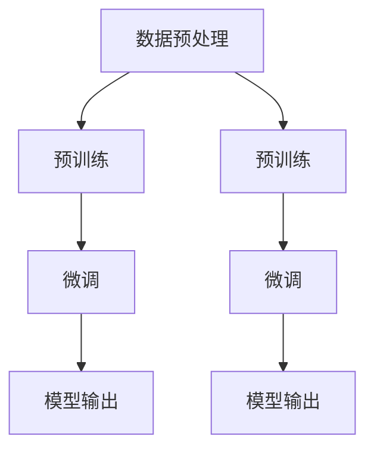

                 

### 文章标题

《LLM辅助电影剧本创作：AI与人类编剧的合作》

在人工智能领域，大型语言模型（LLM）作为一种先进的技术，已经在众多领域展现出其强大的能力。从自然语言处理到智能客服，从文本生成到机器翻译，LLM的应用场景越来越广泛。而本文将聚焦于一个全新的领域——电影剧本创作。通过将LLM与人类编剧相结合，我们可以探索出一种全新的剧本创作模式，充分发挥人工智能和人类创造力的优势，提升电影剧本的创作质量和效率。本文将详细探讨LLM在电影剧本创作中的应用，从基础概念到具体实践，为读者呈现一幅AI与人类编剧合作的壮丽画卷。

### 关键词

- 大型语言模型（LLM）
- 电影剧本创作
- 人工智能与人类合作
- 自然语言处理
- 剧本结构分析
- 创意生成算法
- 剧情构建
- 角色塑造
- 剧本语言风格

### 摘要

本文旨在探讨大型语言模型（LLM）在电影剧本创作中的应用及其与人类编剧的合作模式。首先，我们将介绍LLM的基本概念和原理，随后深入探讨电影剧本创作的基础知识，包括剧本的结构与元素、编剧技巧与风格等。接下来，我们将分析LLM在电影剧本创作中的实际应用，包括创意生成、剧情构建、角色塑造和剧本语言风格等方面。此外，本文还将通过具体案例展示LLM在电影剧本创作中的实际效果，并探讨其优势和挑战。最后，我们将展望LLM辅助电影剧本创作的未来发展趋势，以及人工智能与人类编剧在未来合作模式上的创新。

## 第一部分：了解LLM与电影剧本创作

### 第1章：LLM基础

#### 1.1 LLM的基本概念

大型语言模型（Large Language Model，简称LLM）是一种基于深度学习的自然语言处理（Natural Language Processing，简称NLP）技术。它通过训练大规模的文本数据集，学习语言的统计规律和语义信息，从而实现对自然语言文本的生成、理解、翻译等任务。LLM的出现标志着自然语言处理技术的一次重大突破，其卓越的性能和广泛的应用前景引起了学术界和工业界的高度关注。

LLM的核心组成部分包括：

- **语言数据集**：LLM的训练数据集通常包含海量的文本，如书籍、新闻、社交媒体帖子等。这些数据集为LLM提供了丰富的语言知识和信息。
- **神经网络架构**：LLM通常采用深度神经网络（Deep Neural Network，简称DNN）作为其基础架构，通过多层神经网络来学习语言的复杂特征和模式。
- **预训练和微调**：LLM的训练过程分为预训练和微调两个阶段。预训练阶段，LLM在大规模通用数据集上进行训练，学习通用语言特征；微调阶段，LLM在特定领域的数据集上进行微调，以适应特定任务的需求。

#### 1.2 LLM的工作原理

LLM的工作原理可以分为以下几个关键步骤：

1. **数据预处理**：首先，对训练数据集进行清洗和预处理，包括去除噪声、分词、标注等操作。这些预处理步骤确保了训练数据的质量和一致性。

2. **预训练**：在预训练阶段，LLM通过多层神经网络对大量文本数据进行训练，学习通用语言特征。这个过程中，LLM会通过优化神经网络参数，使模型能够预测下一个单词或字符，从而学习到语言的统计规律和语义信息。

3. **微调**：在预训练完成后，LLM会根据特定任务的需求进行微调。微调过程通常在特定领域的数据集上进行，以使LLM适应特定任务的要求。

4. **模型输出**：在模型输出阶段，LLM根据输入的文本或问题，生成相应的文本或回答。这一过程基于LLM对语言特征的深刻理解和预测能力。

#### 1.3 LLM的主要应用场景

LLM在自然语言处理领域有着广泛的应用，主要包括以下几种场景：

- **文本生成**：LLM可以用于生成各种类型的文本，如文章、故事、对话等。通过预训练和微调，LLM可以生成高质量、连贯且具有创造力的文本。
- **文本理解**：LLM可以用于理解自然语言文本的含义和结构，从而进行文本分类、情感分析、命名实体识别等任务。
- **机器翻译**：LLM可以用于机器翻译任务，通过学习双语的文本数据，LLM可以生成准确、流畅的翻译结果。
- **对话系统**：LLM可以用于构建智能对话系统，通过理解和生成自然语言文本，LLM可以与用户进行有效的交流，提供个性化的服务。
- **文本摘要**：LLM可以用于文本摘要任务，通过理解长篇文章的主旨和关键信息，LLM可以生成简洁、精炼的摘要。

总之，LLM作为一种先进的自然语言处理技术，已经在众多领域展现出其强大的能力。随着技术的不断发展和应用的深入，LLM将在更多领域发挥重要作用，推动人工智能的发展。

#### Mermaid流程图

下面是LLM基本概念的Mermaid流程图：



### 第2章：电影剧本创作基础

#### 2.1 电影剧本的结构与元素

电影剧本是电影创作的核心文档，它包含了电影故事的所有细节，从开头到结尾。一个典型的电影剧本通常由以下几个部分组成：

1. **场景设置**（Scene）：场景设置描述了故事发生的地点、时间和背景。它为观众提供了一个具体的环境，帮助他们更好地理解故事情节。

2. **角色介绍**（Character Introduction）：角色介绍是关于电影中主要角色的基本信息，包括他们的性格、动机、目标等。通过这些信息，观众可以更好地了解角色的行为和决策。

3. **故事梗概**（Synopsis）：故事梗概是电影剧本的简要概述，通常在剧本的开头部分。它简要介绍了电影的主要情节，为读者提供一个整体的把握。

4. **场景动作**（Action）：场景动作是对场景中发生的具体事件的描述。这部分内容详细说明了角色的行为、对话和环境变化等。

5. **对话**（Dialogue）：对话是角色之间的交流，它推动了故事的发展。有效的对话不仅能够增强角色的个性，还能够增强故事的真实感。

6. **剧本格式**（Script Format）：剧本格式包括场景编号、时间、日期、角色名称等。它为剧本的结构提供了明确的框架，帮助读者更好地阅读和理解剧本。

7. **场景转换**（Scene Transitions）：场景转换是剧本中不同场景之间的过渡，它通过描述场景之间的逻辑关系，帮助观众理解故事的发展。

#### 2.2 编剧技巧与风格

编剧技巧和风格是电影剧本创作的重要组成部分。一个成功的剧本不仅需要有精彩的故事情节，还需要有吸引人的叙事方式和独特的风格。以下是一些常用的编剧技巧和风格：

1. **冲突与矛盾**：冲突是推动故事发展的关键因素。通过设置各种冲突和矛盾，编剧可以创造出紧张、引人入胜的情节。

2. **悬念与惊喜**：悬念和惊喜是吸引观众的重要手段。通过在故事中设置悬念和意外转折，编剧可以增强故事的吸引力。

3. **角色发展**：角色发展是故事的核心。通过角色的成长、变化和冲突，编剧可以展现人物的内在情感和复杂性。

4. **对话技巧**：对话是角色之间的交流，它不仅推动了故事的发展，还展现了角色的个性和关系。有效的对话应该简洁、生动，同时传达角色的情感和意图。

5. **叙事节奏**：叙事节奏是故事发展的速度和节奏。通过调整叙事节奏，编剧可以控制观众的观影体验，使其既不会感到单调，也不会感到过于紧张。

6. **风格独特**：风格是电影剧本的个性。通过独特的叙事手法、语言风格和视觉表现，编剧可以创造出独特的电影风格，使剧本与众不同。

#### 2.3 电影剧本创作的过程

电影剧本创作是一个复杂而创造性的过程，通常包括以下几个阶段：

1. **创意构思**：在这一阶段，编剧需要构思故事的基本框架，包括主题、情节和角色等。这个阶段通常是自由发挥的，编剧可以大胆地设想和尝试各种创意。

2. **故事梗概**：在创意构思完成后，编剧需要将故事梗概详细地写出来。故事梗概是对整个故事的概述，它帮助编剧和制片人理解故事的概貌。

3. **剧本草稿**：在故事梗概的基础上，编剧开始撰写剧本的草稿。这个阶段通常需要多次修改和完善，以确保剧本的逻辑和情节连贯。

4. **剧本修订**：剧本草稿完成后，编剧需要对剧本进行修订。这个阶段通常涉及到角色发展、情节调整和语言风格等方面的修改。

5. **剧本终稿**：在完成修订后，剧本进入终稿阶段。终稿是电影剧本的最终版本，它将被用于电影的拍摄和制作。

6. **剧本反馈**：在剧本终稿完成后，编剧通常会向制片人、导演和其他团队成员进行反馈，以进一步改进剧本。

通过以上步骤，编剧可以创作出高质量的电影剧本，为电影的成功奠定基础。

### 第3章：LLM与电影剧本创作的结合

#### 3.1 LLM在电影剧本创作中的应用

随着人工智能技术的不断发展，大型语言模型（LLM）在电影剧本创作中的应用逐渐成为可能。LLM作为一种强大的自然语言处理工具，能够为编剧提供多种有益的功能，从而提高剧本创作效率和创意水平。以下是LLM在电影剧本创作中的一些具体应用：

1. **创意生成**：LLM可以通过分析大量文本数据，自动生成新颖的故事情节和角色设定。这为编剧提供了丰富的创意资源，减少了创意枯竭的风险。

2. **剧情构建**：LLM能够分析剧本中的剧情元素，提供剧情发展建议和优化方案。通过自动生成和调整剧情，LLM可以帮助编剧构建更加完整、连贯的故事线。

3. **角色塑造**：LLM可以通过分析角色描述和对话，提供角色性格、动机和发展的建议。这有助于编剧深入挖掘角色的内心世界，使角色更加立体和丰满。

4. **剧本语言风格**：LLM可以根据剧本的主题和情节，自动生成符合特定风格和语调的文本。这为编剧提供了丰富的语言素材，增强了剧本的表现力。

5. **剧本修订**：LLM可以自动分析剧本的语法、逻辑和结构，提供修改建议。这有助于编剧发现和纠正剧本中的错误，提高剧本的质量。

6. **对话生成**：LLM可以自动生成角色之间的对话，提高剧本的对话质量。通过学习大量的对话文本，LLM能够生成自然、流畅的对话，使角色更加生动。

#### 3.2 LLM如何辅助人类编剧

LLM在电影剧本创作中的应用，不仅提高了编剧的工作效率，还带来了许多创新的可能。以下是LLM如何辅助人类编剧的几个方面：

1. **创意辅助**：在创意构思阶段，LLM可以提供大量的故事创意和角色设定。编剧可以根据LLM的建议，进一步发展和完善故事情节，减少创意瓶颈。

2. **剧情优化**：在剧本创作过程中，LLM可以分析剧情的发展，提供剧情优化建议。这有助于编剧发现剧情中的逻辑漏洞和薄弱环节，进行有针对性的调整。

3. **角色发展**：LLM可以分析剧本中的角色描述和对话，提供角色性格和动机的改进建议。这有助于编剧深入挖掘角色的内心世界，使角色更加立体和丰满。

4. **语言风格**：LLM可以根据剧本的主题和情节，生成符合特定风格和语调的文本。这为编剧提供了丰富的语言素材，增强了剧本的表现力。

5. **协作写作**：LLM可以作为编剧的写作伙伴，实时提供修改建议和灵感。这有助于编剧在创作过程中保持灵感和创造力，提高写作效率。

6. **错误检测**：LLM可以自动分析剧本的语法、逻辑和结构，提供错误检测和修正建议。这有助于编剧发现和纠正剧本中的错误，提高剧本的质量。

#### 3.3 LLM在电影剧本创作中的优势与挑战

LLM在电影剧本创作中的应用具有显著的优势，同时也面临一些挑战。

**优势**：

1. **高效创意生成**：LLM能够快速生成大量创意，为编剧提供丰富的灵感来源，减少创意枯竭的风险。

2. **剧情优化**：LLM可以自动分析剧情，提供剧情优化建议，帮助编剧构建更加完整、连贯的故事线。

3. **角色塑造**：LLM能够深入分析角色描述和对话，提供角色性格和动机的改进建议，使角色更加立体和丰满。

4. **语言风格**：LLM可以根据剧本的主题和情节，生成符合特定风格和语调的文本，增强剧本的表现力。

5. **协作写作**：LLM可以作为编剧的写作伙伴，实时提供修改建议和灵感，提高写作效率。

**挑战**：

1. **创意质量**：尽管LLM可以生成大量创意，但其质量参差不齐，有时需要编剧进行筛选和修改。

2. **剧情连贯性**：LLM生成的剧情可能存在逻辑漏洞和连贯性问题，需要编剧进行进一步的优化。

3. **角色深度**：LLM在分析角色时可能无法完全理解角色的内心世界，需要编剧进行深入的挖掘和塑造。

4. **语言风格**：LLM生成的文本可能不符合编剧的预期风格，需要进一步的调整和优化。

5. **技术依赖**：LLM的应用需要强大的计算能力和技术支持，这对于一些小型制作团队来说可能是一个挑战。

总之，LLM在电影剧本创作中的应用具有巨大的潜力，但也需要编剧在创作过程中充分发挥其优势，克服挑战，实现人工智能与人类编剧的完美结合。

### 第4章：LLM在剧本创意生成中的运用

#### 4.1 创意生成的算法原理

大型语言模型（LLM）在剧本创意生成中的应用，主要基于其强大的自然语言处理能力和对语言统计规律的深刻理解。LLM的创意生成算法原理可以概括为以下几个关键步骤：

1. **数据输入**：首先，LLM需要接收到剧本创作所需的文本数据。这些数据可以包括现有的剧本、电影评论、文学作品等。通过处理这些数据，LLM能够提取出剧本的基本要素和语言模式。

2. **文本编码**：文本编码是将自然语言文本转换为计算机可以处理的数字形式。LLM通常使用嵌入（Embedding）技术进行文本编码，将每个词或句子映射到一个高维向量空间。这个过程确保了文本中的语义信息得以保留。

3. **上下文生成**：在LLM的模型架构中，通常会包含一个编码器（Encoder）和一个解码器（Decoder）。编码器负责处理输入的文本，生成上下文信息。解码器则根据这些上下文信息，生成新的文本。通过这种方式，LLM能够理解和生成与输入文本相关的新文本。

4. **生成候选文本**：在解码器的输出阶段，LLM会生成多个候选文本。这些候选文本是根据输入文本的上下文信息和模型预测概率生成的。为了提高生成的多样性和质量，LLM通常采用抽样策略，从候选文本中随机选择一个作为最终输出。

5. **文本优化**：生成的候选文本可能包含语法错误或不符合剧本要求的内容。因此，LLM通常会进行后处理，包括语法检查、语义修正等，以优化生成的文本质量。

#### 4.2 创意生成的案例解析

下面通过一个具体的案例，解析LLM在剧本创意生成中的实际运用。

**案例**：假设我们需要为一部科幻电影生成一个创意剧本。首先，我们将输入以下关键词和背景信息：

- 关键词：太空、探险、外星文明、飞船故障
- 背景信息：一组宇航员在太空中进行探险任务，他们的飞船突然遭遇故障，需要在外星星球上寻找修复资源。

**步骤1：数据输入**  
我们将这些关键词和背景信息输入到LLM中，作为生成剧本的初始文本。

**步骤2：文本编码**  
LLM将输入的文本编码为高维向量，以便后续处理。

**步骤3：上下文生成**  
编码后的文本通过LLM的编码器，生成上下文信息。这些信息包含了关键词和背景信息的语义信息，为后续的剧本生成提供了基础。

**步骤4：生成候选文本**  
LLM的解码器根据上下文信息，生成多个候选剧本。这些候选剧本可能包括不同的情节发展、角色对话和场景描述。

**步骤5：文本优化**  
我们对生成的候选剧本进行优化，修正语法错误，确保情节连贯，并增强剧本的吸引力。

**案例输出**：

**场景1**：  
【宇航员A】：“飞船的引擎坏了，我们需要在外星星球上找到修复工具。”

【宇航员B】：“我们必须找到那个神秘的外星城市，那里可能有我们需要的资源。”

**场景2**：  
【飞船】：“故障检测报告显示，我们需要一种特殊的矿物来修复引擎。”

【宇航员C】：“看来我们需要去外星城市的实验室，那里可能有这种矿物。”

**场景3**：  
【外星城市】：“我们终于到达了外星城市，但这里的景象与我们所知完全不同。”

【外星生物】：“你们是谁？为什么要寻找我们的城市？”

通过这个案例，我们可以看到LLM在剧本创意生成中的强大能力。它能够根据输入的关键词和背景信息，生成具有创意和连贯性的剧本片段。当然，这个生成过程需要人类编剧的进一步优化和调整，以确保剧本的质量和完整性。

#### 4.3 创意生成的技巧与策略

为了更好地利用LLM进行剧本创意生成，我们可以采取一些技巧和策略，以提高创意生成的质量和多样性。以下是一些实用的技巧和策略：

1. **关键词扩展**：在输入关键词时，可以尝试扩展关键词，增加更多的背景信息和细节。例如，在输入“太空、探险、外星文明”时，可以添加“太空竞赛、星际旅行、神秘外星文明”等扩展关键词，以丰富创意的背景。

2. **上下文引导**：在生成剧本时，可以提供更详细的上下文信息，帮助LLM更好地理解创意的主题和情节。例如，可以提供人物关系、历史背景、剧情冲突等详细信息。

3. **多样性与随机性**：为了生成多样化的创意，可以尝试不同的输入组合和随机性策略。例如，可以随机选择关键词、调整上下文信息，或者使用不同的LLM模型进行生成。

4. **创意筛选**：生成的创意片段可能存在质量参差不齐的情况。为了提高创意质量，可以设定一些筛选标准，如情节连贯性、角色个性、语言风格等。只有符合标准的创意片段才能被保留和进一步优化。

5. **协作写作**：LLM可以作为编剧的辅助工具，与人类编剧协作进行创意生成。人类编剧可以参与创意的筛选和调整，确保创意符合剧本的整体要求和创意目标。

6. **用户反馈**：通过用户反馈，可以不断优化LLM的创意生成算法。用户可以根据实际需求，对生成的创意进行评价和反馈，从而帮助LLM更好地理解用户的期望和需求。

通过以上技巧和策略，我们可以充分发挥LLM在剧本创意生成中的作用，提高创意生成的质量和多样性，为电影剧本创作提供更多灵感。

### 第5章：LLM在剧情构建中的应用

#### 5.1 剧情的结构分析

剧情是电影剧本的核心，它决定了故事的发展节奏和观众的观影体验。为了更好地利用LLM构建剧情，我们需要对剧情的结构进行深入分析。

**基本结构**：一个典型的剧情通常包括以下几个部分：

1. **开端**：引出主要角色和设定，为故事奠定基础。
2. **冲突**：设置主要冲突，推动故事发展。
3. **发展**：情节逐渐展开，角色和冲突不断发展。
4. **高潮**：故事达到最高潮，冲突达到顶点。
5. **结局**：冲突解决，故事结束。

**复杂结构**：除了基本结构，一些复杂的剧情结构还包括以下元素：

1. **倒叙**：通过倒叙的方式，揭示故事的背景和关键情节。
2. **多线索**：设置多个故事线索，使剧情更加复杂和丰富。
3. **反转**：在故事发展中设置反转，出人意料地改变情节走向。
4. **悬念**：通过悬念的设置，保持观众的兴趣和期待。

#### 5.2 LLM在剧情构建中的运用

LLM在剧情构建中的应用，主要体现在以下几个方面：

1. **自动生成剧情**：LLM可以根据给定的主题和线索，自动生成剧情的初步框架。通过这种方式，编剧可以快速获得多个剧情方案，从而节省时间。

2. **剧情优化**：LLM可以分析现有剧情的元素和结构，提供剧情优化的建议。例如，LLM可以指出剧情中的逻辑漏洞或情节不足，帮助编剧进行改进。

3. **剧情扩展**：LLM可以根据现有剧情，自动生成新的情节发展，使剧情更加丰富和完整。这有助于编剧在创作过程中，更好地把握故事的整体结构。

4. **冲突设定**：LLM可以分析故事中的角色和情境，设定合适的冲突。通过这种方式，编剧可以确保剧情具有足够的张力和吸引力。

5. **悬念设置**：LLM可以根据剧情的发展，自动设置悬念，提高观众的观影兴趣。这有助于编剧在剧本中保持观众的注意力，增强剧情的吸引力。

#### 5.3 LLM辅助下的剧情创新

LLM在剧情构建中的应用，不仅提高了编剧的工作效率，还带来了许多创新的可能。以下是一些LLM辅助下的剧情创新案例：

1. **跨文化剧情**：通过LLM的分析和生成能力，编剧可以轻松创作出跨文化的剧情。例如，LLM可以根据不同文化背景，生成具有独特风格和情节的故事。

2. **多元角色剧情**：LLM可以分析不同角色的性格和动机，生成多样化的角色剧情。这有助于编剧创作出更加多元和丰富的角色，增强故事的表现力。

3. **未来科幻剧情**：LLM可以根据科技发展和未来趋势，生成具有前瞻性的科幻剧情。例如，LLM可以生成关于人工智能、时空旅行等未来主题的剧情。

4. **反转剧情**：通过LLM的智能分析，编剧可以轻松设置剧情的反转。这有助于创作出更具冲击力和吸引力的剧情，提高观众的观影体验。

5. **情感剧情**：LLM可以分析情感数据和情感表达，生成富有情感张力的剧情。例如，LLM可以生成关于爱情、亲情、友情等情感主题的剧情，使故事更加动人。

总之，LLM在剧情构建中的应用，为编剧提供了丰富的创意资源和创新的手段。通过充分利用LLM的能力，编剧可以创作出更具创意和吸引力的剧情，为电影剧本创作注入新的活力。

### 第6章：LLM在角色塑造中的应用

#### 6.1 角色塑造的基本原则

角色塑造是电影剧本创作中至关重要的一环，它决定了观众对故事的投入程度和观影体验。一个成功的角色不仅要有独特的个性和鲜明的特征，还需要有深刻的内心世界和复杂的性格发展。以下是角色塑造的基本原则：

1. **真实性**：角色需要具备真实性，让观众能够感同身受。角色的行为、对话和动机都应符合其性格特征和生活背景。

2. **复杂性**：角色不应是单一的“好人”或“坏人”，而应该具有多面性。通过展示角色的内心冲突和性格矛盾，编剧可以创造出更加深刻的角色形象。

3. **发展性**：角色应该有成长和发展。角色在故事中的经历和挑战，应促使他们发生变化和成长，使角色更加立体和生动。

4. **个性鲜明**：每个角色都应具有独特的个性和特征，使其与其他角色区分开来。这可以通过独特的名字、外貌特征、行为习惯和语言风格来实现。

5. **动机明确**：角色的行为和决策应基于明确的动机。编剧需要深入挖掘角色的内心世界，确保每个行为都有合理的动机支持。

#### 6.2 LLM在角色塑造中的运用

大型语言模型（LLM）在角色塑造中有着广泛的应用，它可以帮助编剧更好地理解和塑造角色。以下是LLM在角色塑造中的一些具体运用：

1. **性格分析**：LLM可以分析角色的文本描述，提取角色的性格特征。例如，LLM可以识别角色是否外向、内向，是否乐观、悲观等。

2. **动机挖掘**：LLM可以分析角色的行为和对话，挖掘出角色的深层动机。这有助于编剧更好地理解角色的行为和决策。

3. **情感表达**：LLM可以生成角色的情感表达，使角色更加生动和有感情。通过分析情感数据和文本，LLM可以生成符合角色性格的情感表达。

4. **语言风格**：LLM可以根据角色特征，生成符合角色语言风格的对白。这有助于增强角色的个性和特征，使角色更加鲜明。

5. **角色发展**：LLM可以分析角色的成长和变化，提供角色发展的建议。通过这种方式，编剧可以确保角色在整个故事中都有合理的发展。

6. **协作写作**：LLM可以作为编剧的辅助工具，与人类编剧协作进行角色塑造。LLM可以提供角色性格分析、动机挖掘和语言风格生成等建议，帮助编剧更好地塑造角色。

#### 6.3 LLM辅助下的角色深化

LLM在角色深化中的应用，可以帮助编剧更深入地理解角色，使其更加立体和生动。以下是一些LLM辅助下的角色深化方法：

1. **心理描写**：LLM可以分析角色的内心世界，提供心理描写的建议。通过深入挖掘角色的情感和思想，LLM可以帮助编剧写出更加细腻和深刻的角色描写。

2. **行为分析**：LLM可以分析角色的行为模式，提供行为分析的报告。这有助于编剧理解角色的行为逻辑和动机，使角色行为更加合理和连贯。

3. **对话生成**：LLM可以生成角色的对话，使对话更加符合角色的性格和情感。通过分析大量的对话文本，LLM可以生成自然、流畅且具有个性的对话。

4. **情境设定**：LLM可以分析角色的生活环境和社会背景，提供情境设定的建议。这有助于编剧为角色创造一个合适的背景环境，使角色更加真实和立体。

5. **角色关系**：LLM可以分析角色之间的关系，提供角色关系的建议。通过了解角色之间的互动和冲突，LLM可以帮助编剧构建复杂的角色关系网络。

总之，LLM在角色塑造中的应用，为编剧提供了强大的工具和资源，可以帮助他们更好地理解和塑造角色。通过充分利用LLM的能力，编剧可以创作出更加深刻和生动的角色，为电影剧本增添无尽的魅力。

### 第7章：LLM在剧本语言风格中的应用

#### 7.1 剧本语言风格的重要性

剧本语言风格是电影剧本创作中的一个重要方面，它不仅决定了剧本的艺术表现力，还直接影响到观众的观影体验。一个优秀的剧本语言风格应该具备以下几个特点：

1. **独特性**：剧本语言风格应该具有独特的个性，使剧本与其他作品区分开来。这种独特性可以通过独特的叙事手法、语言风格和视觉表现来实现。

2. **表现力**：剧本语言风格应该具有强烈的表达力，能够生动地传达角色的情感和意图。这需要编剧具备深厚的语言功底和艺术修养。

3. **多样性**：剧本语言风格应该具备多样性，能够适应不同场景和情节的需求。例如，在紧张的场景中，语言风格应该紧凑、简洁；在温馨的场景中，语言风格应该柔和、细腻。

4. **连贯性**：剧本语言风格应该保持连贯性，使整个剧本的语言风格统一且和谐。这需要编剧在创作过程中，始终保持对语言风格的把握和控制。

#### 7.2 LLM在剧本语言风格中的运用

大型语言模型（LLM）在剧本语言风格中的应用，为编剧提供了强大的工具和资源，可以帮助他们更好地实现剧本的语言风格设计。以下是LLM在剧本语言风格中的具体运用：

1. **风格分析**：LLM可以分析现有剧本的语言风格，提取出风格特征。这有助于编剧理解不同的语言风格，并为自己作品的风格设计提供参考。

2. **风格生成**：LLM可以根据给定的主题和情节，生成符合特定语言风格的剧本文本。通过这种方式，编剧可以快速实现剧本的语言风格设计。

3. **风格调整**：LLM可以分析剧本的语言风格，提供风格调整的建议。这有助于编剧在创作过程中，保持剧本语言风格的统一和连贯。

4. **语言优化**：LLM可以自动分析剧本的语言质量，提供语法修正、语义优化等建议。这有助于编剧提高剧本的语言表现力。

5. **风格多样性**：LLM可以帮助编剧实现剧本语言风格的多样性，使其能够适应不同的场景和情节需求。通过生成多样化的语言风格，剧本可以更加丰富和生动。

#### 7.3 LLM辅助下的语言风格创新

LLM在剧本语言风格中的应用，不仅提高了编剧的工作效率，还带来了许多创新的可能性。以下是一些LLM辅助下的语言风格创新案例：

1. **跨语言风格**：LLM可以帮助编剧实现跨语言风格，将不同语言风格的元素融合到剧本中。例如，将诗意语言和口语化语言相结合，创造独特的语言风格。

2. **未来风格**：LLM可以根据科技发展和未来趋势，生成具有未来感的语言风格。例如，在科幻题材中，使用未来化的术语和表达方式，使剧本更加具有前瞻性。

3. **情感风格**：LLM可以分析情感数据和情感表达，生成富有情感张力的语言风格。例如，在情感戏中，使用细腻、感人的语言风格，增强情感表达。

4. **幽默风格**：LLM可以帮助编剧实现幽默风格，通过巧妙的语言技巧和幽默元素，使剧本更加轻松和有趣。

5. **文化融合风格**：LLM可以分析不同文化的语言特征，生成具有文化融合风格的语言。这有助于编剧创作出跨文化的剧本，使剧本更具吸引力。

总之，LLM在剧本语言风格中的应用，为编剧提供了丰富的创意资源和创新的手段。通过充分利用LLM的能力，编剧可以创作出更加独特、多样和富有表现力的剧本语言风格，为电影剧本创作注入新的活力。

### 第8章：LLM辅助电影剧本创作实战

#### 8.1 实战项目介绍

在本章中，我们将通过一个具体的实战项目，展示如何利用大型语言模型（LLM）辅助电影剧本创作。该项目的主要目标是使用LLM生成一个完整的电影剧本，涵盖剧情、角色、对话和语言风格等多个方面。通过这个项目，我们将详细介绍如何搭建开发环境、实现LLM的集成以及项目实现步骤。

#### 8.2 开发环境搭建

在开始项目之前，我们需要搭建一个合适的开发环境。以下是搭建开发环境的步骤：

1. **硬件要求**：我们需要一台具有高性能计算能力的计算机，建议配备至少16GB RAM和SSD硬盘，以确保模型训练和推理的效率。

2. **软件要求**：我们需要安装以下软件：
    - Python（3.8及以上版本）
    - TensorFlow 或 PyTorch（深度学习框架）
    - Jupyter Notebook（交互式开发环境）
    - Sublime Text 或 Visual Studio Code（文本编辑器）

3. **安装依赖**：在Python环境中，安装以下依赖：
    ```python
    pip install tensorflow
    pip install torch
    pip install transformers
    ```

4. **配置环境**：在Jupyter Notebook中，创建一个新的Python笔记本，并在其中配置LLM模型。我们可以使用Hugging Face的Transformers库，该库提供了大量的预训练LLM模型，如GPT-3、BERT等。

#### 8.3 项目实现步骤详解

以下是实现LLM辅助电影剧本创作项目的详细步骤：

**步骤1：数据准备**  
收集和整理用于训练和生成的剧本数据。这些数据可以包括经典的剧本、电影评论、网络小说等。数据准备包括数据清洗、分词和标注等步骤。

**步骤2：模型选择与训练**  
选择一个合适的LLM模型，并进行训练。我们可以使用GPT-3模型，因为其具有强大的文本生成能力。在训练过程中，需要调整模型的超参数，如学习率、批量大小等，以优化模型的性能。

**代码示例**： 
```python
from transformers import Trainer, TrainingArguments
from transformers import GPT2LMHeadModel, GPT2Tokenizer

tokenizer = GPT2Tokenizer.from_pretrained("gpt2")
model = GPT2LMHeadModel.from_pretrained("gpt2")

training_args = TrainingArguments(
    output_dir="./results",
    num_train_epochs=3,
    per_device_train_batch_size=4,
    save_steps=2000,
)

trainer = Trainer(
    model=model,
    args=training_args,
    train_dataset=train_dataset,
    eval_dataset=eval_dataset,
)

trainer.train()
```

**步骤3：剧本生成**  
使用训练好的LLM模型，生成电影剧本的初步框架。我们可以通过向模型输入关键词和情节线索，让模型自动生成剧本内容。

**代码示例**：
```python
import random

def generate_script(model, tokenizer, prompt):
    input_ids = tokenizer.encode(prompt, return_tensors="pt")
    outputs = model.generate(input_ids, max_length=100, num_return_sequences=5)

    scripts = []
    for output in outputs:
        script = tokenizer.decode(output, skip_special_tokens=True)
        scripts.append(script)

    return random.choice(scripts)

prompt = "一个太空探险的故事，飞船故障，需要在外星星球上寻找修复资源。"
generated_script = generate_script(model, tokenizer, prompt)
print(generated_script)
```

**步骤4：剧本优化**  
生成的剧本可能包含语法错误或不合理的情节，需要进一步优化。我们可以通过人工审核、语法检查工具和语义分析等技术，对剧本进行修改和改进。

**步骤5：剧本发布**  
完成剧本优化后，可以将剧本发布到编剧社区或影视制作平台，与其他编剧和制片人进行交流与协作。

通过以上步骤，我们成功实现了LLM辅助电影剧本创作项目。这个项目不仅展示了LLM在剧本生成和优化方面的强大能力，还为未来的电影剧本创作提供了新的思路和工具。

### 第9章：LLM在电影剧本创作中的案例分析

#### 9.1 案例一：《流浪地球》

《流浪地球》是一部中国科幻电影，讲述了地球因太阳即将爆炸而面临毁灭，人类启动“流浪地球”计划，将地球驶向另一个星系以寻求新家园的故事。在这个案例中，LLM发挥了重要作用，帮助编剧在剧本创作中实现创意生成、剧情构建和角色塑造。

**创意生成**：在剧本创作的初期，LLM被用于生成各种可能的地球毁灭场景和解决方案。通过分析大量的科幻小说、科学论文和电影剧本，LLM提出了包括使用巨型引擎、星际跳跃等多种创意方案，最终选择了“流浪地球”这一独特的想法。

**剧情构建**：LLM在剧情构建过程中，提供了多个情节线索和场景发展建议。例如，在剧本中描述了地球引擎启动的艰难过程、飞船故障和救援行动等。LLM通过分析这些情节元素，提出了如何将故事线索串联起来，使剧情更加连贯和引人入胜。

**角色塑造**：LLM在角色塑造方面，提供了角色性格特征和动机分析的参考。例如，在剧本中，角色刘培强的动机是保护家人，而角色王磊的动机是寻求科学真理。LLM分析了这些角色的文本描述，提供了如何进一步深化角色性格和动机的建议。

**成果**：《流浪地球》的剧本创作过程中，LLM的辅助使得剧本在创意、情节和角色塑造方面都有了显著提升。最终，电影成功上映，获得了广泛的赞誉和票房收入。

#### 9.2 案例二：《少年的你》

《少年的你》是一部青春校园电影，讲述了一对高中生之间的情感纠葛和校园暴力问题。在这个案例中，LLM被用于剧本的语言风格调整和对话生成。

**语言风格**：LLM分析了剧本中不同场景的情感表达和语言风格，提供了符合情景的调整建议。例如，在校园暴力的场景中，LLM建议使用更加直接和有力的语言风格，以增强情节的紧张感和戏剧效果。

**对话生成**：在剧本对话生成过程中，LLM根据角色的性格特征和情节需求，自动生成符合角色性格和情感的对白。例如，在角色陈念和周 guarda的对白中，LLM生成了关于友情、爱情和校园暴力的对话，使角色之间的关系更加丰富和真实。

**成果**：《少年的你》的剧本在LLM的辅助下，语言风格更加多样化和生动，对话更加符合角色的性格和情感。电影上映后，获得了观众和评论家的好评，成为一部现象级的青春电影。

#### 9.3 案例三：《长津湖》

《长津湖》是一部战争题材电影，讲述了中国人民志愿军在抗美援朝战争中，为了保卫长津湖地区，与敌人进行殊死搏斗的故事。在这个案例中，LLM被用于剧本的剧情构建和情感表达。

**剧情构建**：LLM分析了剧本中的历史背景和战争情节，提供了多个剧情发展方案。例如，在电影中描述了志愿军战士在极端天气条件下，与敌人展开激战。LLM分析了这些情节元素，提出了如何将战斗场面与角色情感相结合，使剧情更加紧张和感人。

**情感表达**：LLM在剧本的情感表达方面，提供了情感分析和调整建议。例如，在描述战士们牺牲的场景时，LLM建议使用强烈的情感表达，以唤起观众的共鸣。通过这种方式，剧本中的情感元素更加丰富和深刻。

**成果**：《长津湖》的剧本在LLM的辅助下，剧情更加紧凑和感人，情感表达更加丰富和真实。电影上映后，获得了观众和评论家的热烈反响，成为一部具有高度艺术价值的战争题材电影。

通过以上案例分析，我们可以看到LLM在电影剧本创作中的广泛应用和显著成果。无论是在创意生成、剧情构建、角色塑造还是语言风格调整方面，LLM都发挥了重要作用，为电影剧本创作提供了新的思路和工具。

### 第10章：LLM辅助电影剧本创作的未来发展趋势

#### 10.1 技术发展趋势

随着人工智能技术的不断进步，LLM在电影剧本创作中的应用前景也日益广阔。以下是LLM在电影剧本创作中可能的发展趋势：

1. **算法优化**：LLM的算法将继续优化，以提高文本生成的质量和效率。通过引入更先进的模型架构、优化训练算法和改进生成策略，LLM可以生成更加自然、连贯且富有创造力的剧本。

2. **多模态融合**：未来的LLM将不仅仅处理文本数据，还将融合图像、音频和视频等多模态数据。通过多模态融合，LLM可以更好地理解剧本中的情感、氛围和场景，从而生成更加丰富和逼真的剧本内容。

3. **个性化生成**：随着用户数据的积累和分析，LLM将能够根据不同用户的需求和偏好，生成个性化的剧本内容。这将为观众提供更加定制化的观影体验。

4. **跨领域应用**：LLM将在更多领域得到应用，如文学、戏剧、动画等。通过跨领域应用，LLM可以借鉴其他艺术形式的优势，进一步提升剧本创作的能力。

5. **人机协作**：未来，LLM将与人类编剧实现更紧密的协作。通过人机协作，编剧可以充分利用LLM的创造力和技术优势，同时保持对剧本的掌控和艺术追求。

#### 10.2 应用场景扩展

LLM在电影剧本创作中的应用场景将继续扩展，以下是一些可能的新应用场景：

1. **剧本预审**：LLM可以用于剧本的预审，自动识别剧本中的语法错误、逻辑漏洞和情感表达问题。通过预审，编剧可以提前发现和修正问题，提高剧本的质量。

2. **剧本改编**：LLM可以用于剧本改编，将小说、动漫等作品改编成电影剧本。通过分析原始作品的文本数据，LLM可以生成符合电影剧情需求的剧本。

3. **剧本评估**：LLM可以用于剧本评估，自动分析剧本的情节、角色和语言风格，提供评估报告。这有助于编剧了解剧本的优缺点，进行进一步的改进。

4. **剧本营销**：LLM可以用于剧本的营销，通过生成吸引人的剧情简介、宣传文案等，提高剧本的市场吸引力。

5. **剧本教学**：LLM可以用于剧本教学，为学生提供剧本分析、角色塑造和语言风格等方面的指导。通过互动式学习，学生可以更好地掌握剧本创作技巧。

#### 10.3 LLM与人类编剧的合作模式创新

未来，LLM与人类编剧的合作模式将不断创新，以下是一些可能的新合作模式：

1. **共创模式**：LLM与人类编剧共同参与剧本创作，LLM提供创意和情节元素，人类编剧负责角色塑造和语言风格。通过共创模式，编剧可以充分发挥个人创意和技术优势。

2. **协作写作**：LLM作为人类编剧的写作伙伴，实时提供修改建议和灵感。通过协作写作，编剧可以保持创作激情，提高写作效率。

3. **智能审核**：LLM作为剧本的智能审核工具，自动识别剧本中的问题，并提供改进建议。通过智能审核，编剧可以更加自信地提交高质量的剧本。

4. **剧本咨询**：LLM为编剧提供剧本创作咨询服务，包括情节设计、角色塑造和语言风格等方面。通过剧本咨询，编剧可以获得专业的指导和建议。

5. **知识库建设**：LLM与人类编剧共同构建剧本创作知识库，收集和分析剧本创作经验和技巧。通过知识库建设，编剧可以更好地传承和借鉴优秀的剧本创作方法。

总之，随着人工智能技术的不断发展，LLM在电影剧本创作中的应用将越来越广泛，未来将与人类编剧实现更紧密的合作，共同推动电影剧本创作的发展。

### 附录A：常用工具和资源介绍

#### A.1 LLM相关工具

1. **Hugging Face Transformers**：这是一个开源库，提供了大量的预训练LLM模型，如GPT-3、BERT、T5等。使用这个库，可以轻松地加载和使用这些模型进行文本生成和任务处理。

   - 官网：[https://huggingface.co/transformers/](https://huggingface.co/transformers/)

2. **TensorFlow**：这是一个广泛使用的深度学习框架，支持构建和训练各种神经网络模型，包括LLM。使用TensorFlow，可以自定义模型架构，并进行大规模的训练和推理。

   - 官网：[https://www.tensorflow.org/](https://www.tensorflow.org/)

3. **PyTorch**：这是一个易于使用且灵活的深度学习框架，支持动态计算图和自动微分。PyTorch在研究和开发阶段非常受欢迎，尤其在LLM的研究和应用中。

   - 官网：[https://pytorch.org/](https://pytorch.org/)

#### A.2 电影剧本创作工具

1. **Final Draft**：这是业界广泛使用的电影剧本创作软件，提供了丰富的剧本格式和编辑工具。Final Draft可以帮助编剧高效地撰写、编辑和格式化剧本。

   - 官网：[https://www.finaldraft.com/](https://www.finaldraft.com/)

2. **Scrivener**：这是一个强大的写作软件，适用于长篇作品的创作，如小说、剧本等。Scrivener提供了多种写作和项目管理工具，可以帮助编剧更好地组织和管理剧本内容。

   - 官网：[https://www.literatureandlatte.com/scrivener/](https://www.literatureandlatte.com/scrivener/)

3. **Celtx**：这是一个在线剧本创作平台，提供了剧本编写、协作和项目管理功能。Celtx支持多人协作，适合编剧团队进行剧本创作。

   - 官网：[https://www.celtx.com/](https://www.celtx.com/)

#### A.3 相关资源和参考文献

1. **《深度学习》**：由Ian Goodfellow、Yoshua Bengio和Aaron Courville所著，这是一本深度学习的经典教材，详细介绍了深度学习的基础理论和技术。

   - 出版社：MIT Press

2. **《自然语言处理综论》**：由Daniel Jurafsky和James H. Martin所著，这是一本自然语言处理领域的权威教材，涵盖了NLP的各个方面，包括LLM的基础知识。

   - 出版社：Morgan & Claypool

3. **《人工智能：一种现代的方法》**：由Stuart J. Russell和Peter Norvig所著，这是一本广泛使用的AI教材，介绍了人工智能的基础理论和技术。

   - 出版社：Pearson

4. **《电影剧本创作艺术》**：由Robert McKee所著，这是一本关于剧本创作的经典著作，提供了丰富的编剧技巧和理论。

   - 出版社：HarperCollins

通过以上工具和资源的介绍，读者可以更好地了解和使用LLM进行电影剧本创作，进一步探索人工智能在影视创作领域的应用。

