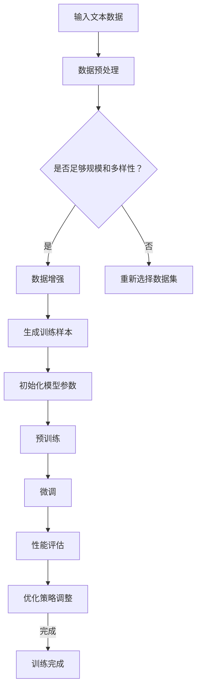
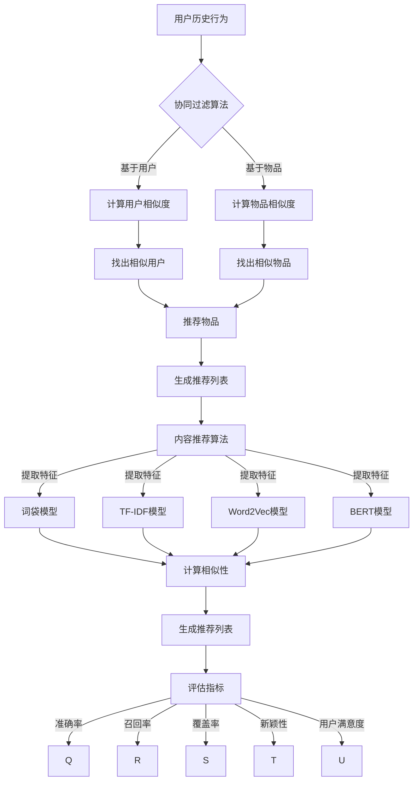
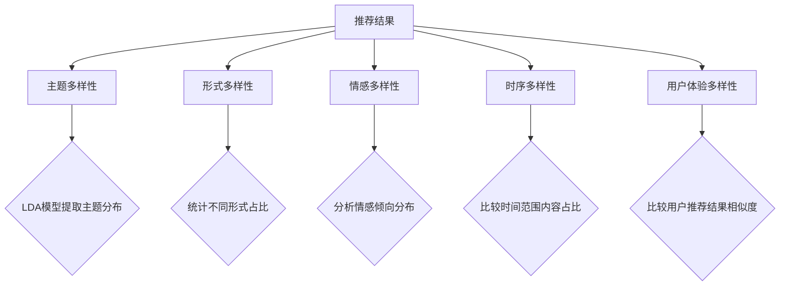
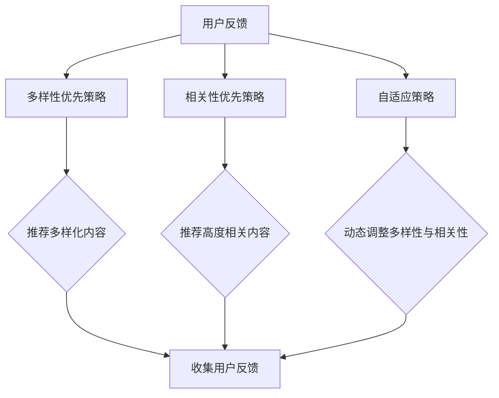

                 

### 第一部分：引言与基础

#### 第1章：LLM与推荐系统概述

##### 1.1 LLM的基本概念

**定义与历史背景**  
LLM，全称为Large Language Model，是指大型的自然语言处理模型。LLM的发展始于20世纪50年代，随着计算机技术和算法的不断进步，到21世纪初，研究人员开始尝试构建大规模的语言模型。这些模型通过学习大量的文本数据，能够理解并生成自然语言。

**基本原理与架构**  
LLM的基本原理是基于深度学习技术，尤其是Transformer模型架构。Transformer模型通过自注意力机制（self-attention）对输入的文本序列进行处理，使得模型能够捕捉到文本中的长距离依赖关系。

**与推荐系统的关系**  
LLM在推荐系统中的应用主要在于通过文本数据理解和生成推荐内容。推荐系统通常需要处理大量的用户行为数据和物品属性数据，而LLM可以对这些数据进行语义理解和生成，从而提高推荐系统的多样性和相关性。

##### 1.2 推荐系统的基本原理

**推荐系统的发展历程**  
推荐系统的发展历程可以分为三个阶段：基于内容的推荐、基于协同过滤的推荐和基于混合方法的推荐。最早期的推荐系统主要基于物品的属性进行推荐，随着用户行为的积累，协同过滤方法开始流行，而现代推荐系统则更多地采用混合方法，结合多种信息进行推荐。

**推荐系统的基本架构**  
推荐系统的基本架构通常包括用户行为收集模块、推荐算法模块、推荐结果展示模块。用户行为收集模块负责收集用户的交互数据，推荐算法模块根据这些数据生成推荐结果，推荐结果展示模块则将推荐结果呈现给用户。

**评价推荐系统的标准**  
评价推荐系统的标准包括准确率、召回率、覆盖率、新颖性和用户满意度等。准确率和召回率反映了推荐系统的推荐质量，覆盖率表示推荐系统能够覆盖的用户范围，新颖性表示推荐结果的新奇程度，用户满意度则反映了用户对推荐结果的接受程度。

##### 1.3 多样性与相关性平衡

**多样性的重要性**  
多样性是推荐系统中的一个重要指标，它反映了推荐结果中不同类型的内容比例。多样化的推荐结果能够提高用户的满意度，减少用户对推荐系统的疲劳感。

**相关性的重要性**  
相关性是指推荐结果与用户兴趣的相关程度。高相关性的推荐结果能够更好地满足用户的需求，提高用户对推荐系统的信任度。

**多样性与相关性之间的平衡**  
在推荐系统中，多样性与相关性之间存在一定的矛盾。过度的多样性可能导致推荐结果与用户兴趣偏离，而过于集中的相关性则可能导致推荐结果的重复。因此，推荐系统需要找到多样性与相关性之间的平衡点，以满足用户的需求。

#### 第2章：LLM辅助推荐系统的发展

##### 2.1 LLM在推荐系统中的应用场景

**内容推荐**  
内容推荐是指根据用户的兴趣和行为，推荐相关的文章、视频、音乐等内容。LLM在内容推荐中的应用主要体现在对文本内容的理解和生成，从而提高推荐的多样性和相关性。

**社交推荐**  
社交推荐是指根据用户在社交媒体上的互动，推荐相关的用户、话题和内容。LLM在社交推荐中的应用主要体现在对社交网络数据的理解和生成，从而提高推荐的准确性和多样性。

**购物推荐**  
购物推荐是指根据用户的购买行为和喜好，推荐相关的商品。LLM在购物推荐中的应用主要体现在对商品描述和用户评价的理解，从而提高推荐的多样性和相关性。

##### 2.2 LLM辅助推荐系统的优势与挑战

**优势分析**  
LLM辅助推荐系统具有以下优势：首先，LLM能够对文本数据进行深入理解和生成，从而提高推荐的多样性和相关性；其次，LLM可以处理大规模的文本数据，适应推荐系统的大规模应用场景；最后，LLM可以不断学习和更新，适应用户的需求变化。

**挑战与应对策略**  
LLM辅助推荐系统也面临一些挑战：首先，LLM的训练和推理需要大量的计算资源，如何高效地利用资源成为了一个问题；其次，LLM的模型解释性较差，如何确保推荐结果的公平性和透明性成为了一个挑战；最后，如何平衡多样性与相关性，避免推荐结果的过度集中或过度分散也是一个重要问题。

##### 2.3 LLM辅助推荐系统的最新进展

**技术趋势**  
随着深度学习和自然语言处理技术的不断发展，LLM辅助推荐系统也在不断进步。未来的技术趋势包括：更高效的模型架构、更丰富的数据来源、更智能的推荐策略等。

**应用案例**  
LLM辅助推荐系统已经在多个领域得到应用，例如电商平台、新闻媒体、社交媒体等。一些典型的应用案例包括：淘宝的个性化推荐系统、腾讯新闻的推荐系统、微博的社交推荐系统等。

### 目录大纲：《LLM辅助的推荐系统多样性与相关性平衡》

#### 第一部分：引言与基础

1. 第1章：LLM与推荐系统概述
   1.1 LLM的基本概念
   1.2 推荐系统的基本原理
   1.3 多样性与相关性平衡

2. 第2章：LLM辅助推荐系统的发展
   2.1 LLM在推荐系统中的应用场景
   2.2 LLM辅助推荐系统的优势与挑战
   2.3 LLM辅助推荐系统的最新进展

#### 第二部分：核心算法原理

3. 第3章：LLM的算法原理
   3.1 语言模型的基本原理
   3.2 LLM的架构设计
   3.3 LLM的训练与优化

4. 第4章：推荐系统的算法原理
   4.1 协同过滤算法
   4.2 内容推荐算法
   4.3 推荐系统的评估指标

5. 第5章：LLM辅助推荐系统的多样性策略
   5.1 多样性评估指标
   5.2 多样性增强算法
   5.3 多样性与相关性的平衡

#### 第三部分：项目实战

6. 第6章：项目实战一：内容推荐系统
   6.1 项目背景
   6.2 开发环境搭建
   6.3 代码实现
   6.4 代码解读与分析

7. 第7章：项目实战二：购物推荐系统
   7.1 项目背景
   7.2 开发环境搭建
   7.3 代码实现
   7.4 代码解读与分析

#### 第四部分：总结与展望

8. 第8章：总结与展望
   8.1 总结
   8.2 展望
   8.3 延伸阅读

#### 附录

9. 附录 A：参考文献
10. 附录 B：常见问题解答

---

### 关键词：
- Large Language Model
- 推荐系统
- 多样性
- 相关性
- 自然语言处理
- 深度学习
- 人工智能

### 摘要：
本文探讨了LLM辅助的推荐系统多样性与相关性平衡的问题。首先介绍了LLM和推荐系统的基础概念，然后分析了LLM辅助推荐系统的发展和应用，探讨了核心算法原理，包括LLM的算法原理和推荐系统的算法原理。接着，提出了多样性评估指标和多样性增强算法，并讨论了多样性与相关性之间的平衡策略。最后，通过两个项目实战案例，展示了LLM辅助推荐系统的实际应用，并提供了总结与展望。本文旨在为研究人员和实践者提供关于LLM辅助推荐系统的全面理解和实践指导。

---

**第3章：LLM的算法原理**

在本文的第二部分，我们将深入探讨LLM的算法原理，包括语言模型的基本原理、LLM的架构设计和LLM的训练与优化。

#### 3.1 语言模型的基本原理

语言模型是一种统计模型，用于预测一段文本序列中下一个词的概率。它通过对大量文本数据的学习，能够捕捉语言中的规律，从而实现对未知文本的生成和理解。语言模型的基本原理可以分为以下几个方面：

**神经网络模型介绍**  
神经网络（Neural Network）是一种模仿生物神经系统的计算模型。在语言模型中，神经网络通过多层神经元对输入的文本数据进行处理，每一层神经元都对输入数据进行一定的变换，从而实现对文本数据的逐层抽象和表示。

**自监督学习方法**  
自监督学习（Self-Supervised Learning）是一种不需要人工标注数据的学习方法。在语言模型中，自监督学习方法通过对输入文本数据进行预处理，生成一对输入和输出的样本，然后利用神经网络模型进行预测，从而实现模型的训练。

**预训练与微调**  
预训练（Pre-training）是指在大规模未标注数据集上进行训练，从而获取通用的语言表示能力。微调（Fine-tuning）是指在使用预训练模型的基础上，在特定任务的数据集上进行进一步训练，从而适应特定任务的需求。

#### 3.2 LLM的架构设计

LLM的架构设计是语言模型性能的关键因素。目前，最常用的LLM架构包括Transformer模型、BERT模型和GPT模型。以下是对这些模型的基本介绍：

**Transformer模型**  
Transformer模型是由Vaswani等人于2017年提出的一种基于自注意力机制的神经网络模型。它通过多头自注意力机制（Multi-head Self-Attention）和前馈神经网络（Feedforward Neural Network）对输入的文本序列进行处理，能够捕捉到文本中的长距离依赖关系。

**BERT模型**  
BERT（Bidirectional Encoder Representations from Transformers）模型是由Google在2018年提出的一种双向Transformer模型。它通过双向自注意力机制对输入的文本序列进行处理，从而获得全局的上下文信息。BERT模型在多个自然语言处理任务中取得了显著的效果。

**GPT模型**  
GPT（Generative Pre-trained Transformer）模型是由OpenAI在2018年提出的一种基于自回归的语言模型。它通过自回归方式对输入的文本序列进行建模，从而实现对文本的生成和理解。GPT模型具有灵活的架构，可以通过调整参数来适应不同的任务需求。

#### 3.3 LLM的训练与优化

LLM的训练与优化是构建高性能语言模型的关键步骤。以下是对LLM训练与优化的一些关键点：

**数据集选择**  
选择合适的数据集是LLM训练的第一步。通常，数据集应该具有足够的规模和多样性，以便模型能够充分学习到语言中的规律。此外，数据集的质量也是一个重要因素，高质量的训练数据有助于提高模型的性能。

**训练策略**  
训练策略包括学习率调整、批量大小选择、训练时间设置等。合理的学习率调整可以避免模型出现过拟合或欠拟合，批量大小选择需要平衡计算效率和模型性能，训练时间的设置则要考虑模型的稳定性和训练效果。

**优化算法**  
优化算法是LLM训练的核心，常用的优化算法包括梯度下降（Gradient Descent）和其变种（如Adam优化器）。优化算法的目的是通过不断调整模型的参数，使得模型在训练数据上的损失函数最小化。

**性能评估**  
性能评估是LLM训练的最后一个步骤。通过对训练好的模型在测试数据上的表现进行评估，可以判断模型是否具有良好的性能。常用的评估指标包括准确率、召回率、F1值等。

**附录：核心概念与联系**

为了更好地理解LLM的算法原理，我们使用Mermaid流程图来描述LLM的训练过程和关键组件。



**核心概念与联系：**

- **输入文本数据**：文本数据是LLM的训练基础，需要保证数据的规模和多样性。
- **数据预处理**：数据预处理包括文本的分词、去噪、清洗等步骤，以提高数据质量。
- **数据增强**：数据增强通过引入噪声或变换，增加数据的多样性，有助于提高模型的泛化能力。
- **生成训练样本**：生成训练样本包括构建输入和输出的对，以便模型进行学习。
- **初始化模型参数**：初始化模型参数是训练过程的开始，常用的初始化方法包括随机初始化和预训练模型初始化。
- **预训练**：预训练是指在大规模未标注数据集上进行训练，从而获取通用的语言表示能力。
- **微调**：微调是指在使用预训练模型的基础上，在特定任务的数据集上进行进一步训练，从而适应特定任务的需求。
- **性能评估**：性能评估用于判断模型的性能，包括准确率、召回率、F1值等指标。
- **优化策略调整**：优化策略调整包括学习率调整、批量大小选择等，以优化模型的训练效果。
- **训练完成**：训练完成表示模型已经训练完毕，可以进行实际应用。

通过上述Mermaid流程图，我们可以清晰地看到LLM的训练过程和关键组件，有助于深入理解LLM的算法原理。

---

**第4章：推荐系统的算法原理**

在本文的第三部分，我们将深入探讨推荐系统的算法原理，包括协同过滤算法、内容推荐算法和推荐系统的评估指标。

#### 4.1 协同过滤算法

协同过滤算法（Collaborative Filtering）是推荐系统中最常用的算法之一，其基本思想是通过分析用户的历史行为，找出相似的用户或物品，然后根据这些相似性进行推荐。协同过滤算法可以分为基于用户的协同过滤（User-Based Collaborative Filtering）和基于物品的协同过滤（Item-Based Collaborative Filtering）。

**基于用户的协同过滤**

基于用户的协同过滤算法通过计算用户之间的相似度，找出与目标用户相似的其他用户，然后根据这些相似用户的行为进行推荐。具体步骤如下：

1. **计算用户相似度**：通常使用余弦相似度、皮尔逊相关系数等方法计算用户之间的相似度。
2. **找出相似用户**：根据相似度矩阵，找出与目标用户最相似的K个用户。
3. **推荐物品**：根据相似用户的兴趣，推荐目标用户可能感兴趣的物品。

**基于物品的协同过滤**

基于物品的协同过滤算法通过计算物品之间的相似度，找出与目标物品相似的其它物品，然后根据这些相似物品进行推荐。具体步骤如下：

1. **计算物品相似度**：通常使用余弦相似度、Jaccard系数等方法计算物品之间的相似度。
2. **找出相似物品**：根据相似度矩阵，找出与目标物品最相似的K个物品。
3. **推荐用户**：根据相似物品的用户评价，推荐目标用户可能感兴趣的物品。

**矩阵分解算法**

矩阵分解（Matrix Factorization）是一种将用户和物品的评分矩阵分解为低维矩阵的方法，通过低维矩阵的乘积来预测用户的评分。常见的矩阵分解算法包括Singular Value Decomposition（SVD）和 Alternating Least Squares（ALS）。

#### 4.2 内容推荐算法

内容推荐算法（Content-Based Recommender System）是基于用户对物品的兴趣特征进行推荐的。其基本思想是分析用户的历史行为和兴趣，找出与目标用户兴趣相似的物品进行推荐。具体步骤如下：

1. **提取特征**：从用户的历史行为和物品属性中提取特征，如关键词、标签、分类等。
2. **计算相似性**：计算用户和物品之间的相似性，可以使用余弦相似度、欧氏距离等方法。
3. **生成推荐列表**：根据相似性得分，生成推荐列表，推荐与用户兴趣相似的物品。

**语义相似性计算**

语义相似性计算是内容推荐算法中的一个关键步骤，它通过分析文本的语义信息，计算用户和物品之间的相似性。常用的方法包括：

- **词袋模型（Bag of Words）**：将文本表示为词汇的集合，计算词汇之间的相似性。
- **TF-IDF模型（Term Frequency-Inverse Document Frequency）**：考虑词汇在文档中的重要程度，计算词汇之间的相似性。
- **Word2Vec模型**：将词汇映射为向量，计算词汇之间的相似性。
- **BERT模型**：使用BERT模型对文本进行编码，计算文本之间的相似性。

**向量空间模型**

向量空间模型（Vector Space Model）是将文本表示为向量的模型，它通过将文本中的每个单词或短语映射为一个向量，然后计算向量之间的相似性。常用的向量空间模型包括：

- **One-Hot编码**：将每个单词编码为一个二进制向量，向量中的每个元素表示该单词是否出现在文本中。
- **词袋模型（Bag of Words）**：将每个单词编码为一个整数向量，向量中的每个元素表示该单词在文本中的出现次数。
- **TF-IDF模型（Term Frequency-Inverse Document Frequency）**：将每个单词编码为一个浮点向量，向量中的每个元素表示该单词在文本中的重要程度。

#### 4.3 推荐系统的评估指标

推荐系统的评估指标用于衡量推荐系统的性能，常用的评估指标包括：

1. **准确率（Accuracy）**：准确率是指推荐结果中实际感兴趣物品的比例。准确率越高，说明推荐系统的推荐质量越好。
2. **召回率（Recall）**：召回率是指推荐结果中实际感兴趣物品的占比。召回率越高，说明推荐系统能够更好地捕捉到用户的兴趣。
3. **覆盖率（Coverage）**：覆盖率是指推荐结果中不同物品的比例。覆盖率越高，说明推荐系统能够覆盖更多的用户兴趣。
4. **新颖性（Novelty）**：新颖性是指推荐结果中新颖物品的比例。新颖性越高，说明推荐系统能够提供更丰富的推荐结果。
5. **用户满意度（User Satisfaction）**：用户满意度是指用户对推荐结果的接受程度。用户满意度越高，说明推荐系统能够更好地满足用户的需求。

**附录：核心概念与联系**

为了更好地理解推荐系统的算法原理，我们使用Mermaid流程图来描述协同过滤算法、内容推荐算法和推荐系统的评估指标。



**核心概念与联系：**

- **用户历史行为**：用户的历史行为数据是推荐系统的基础，包括用户的评分、浏览记录、购买记录等。
- **协同过滤算法**：协同过滤算法通过计算用户之间的相似度或物品之间的相似度，生成推荐列表。
- **内容推荐算法**：内容推荐算法通过提取用户和物品的特征，计算相似性，生成推荐列表。
- **评估指标**：评估指标用于衡量推荐系统的性能，包括准确率、召回率、覆盖率、新颖性和用户满意度。
- **生成推荐列表**：推荐系统通过计算用户和物品的相似性，生成推荐列表，推荐给用户。
- **特征提取**：特征提取是将文本数据转换为数值向量的过程，常用的方法包括词袋模型、TF-IDF模型、Word2Vec模型和BERT模型。

通过上述Mermaid流程图，我们可以清晰地看到推荐系统的算法原理和关键步骤，有助于深入理解推荐系统的基本原理和工作机制。

---

**第5章：LLM辅助推荐系统的多样性策略**

在本文的第四部分，我们将探讨LLM辅助推荐系统的多样性策略，包括多样性评估指标、多样性增强算法和多样性与相关性的平衡。

#### 5.1 多样性评估指标

多样性（Diversity）是推荐系统中的一个重要指标，它反映了推荐结果中不同类型内容的比例。多样性的评估对于确保推荐系统的健康发展和用户的满意度至关重要。以下是一些常用的多样性评估指标：

**1. 主题多样性（Thematic Diversity）**  
主题多样性是指推荐结果中包含的不同主题或内容类型的比例。评估方法可以通过计算推荐结果中各个主题或内容类型的重要度或占比来实现。例如，可以使用LDA（Latent Dirichlet Allocation）模型提取推荐结果的主题分布，然后计算各个主题的多样性。

**2. 形式多样性（Formal Diversity）**  
形式多样性是指推荐结果中不同表现形式的内容比例，如文本、图片、视频等。形式多样性可以通过统计推荐结果中不同类型的占比来评估。

**3. 情感多样性（Emotional Diversity）**  
情感多样性是指推荐结果中包含的不同情感倾向或情绪状态的分布。例如，推荐系统可以分析用户的历史行为和偏好，为用户推荐具有积极、消极、中立等不同情感倾向的内容。

**4. 时序多样性（Temporal Diversity）**  
时序多样性是指推荐结果中包含的不同时间范围的内容比例。例如，推荐系统可以结合用户的浏览历史和当前时间，为用户推荐最近发布的内容和过去的热门内容，以保持推荐的新鲜感和时效性。

**5. 用户体验多样性（User Experience Diversity）**  
用户体验多样性是指推荐系统为不同用户提供的推荐结果差异。评估方法可以通过比较不同用户间的推荐结果相似度来实现。

**附录：多样性的Mermaid流程图**

以下是一个简化的Mermaid流程图，展示了如何评估推荐结果的多样性：



#### 5.2 多样性增强算法

为了提高推荐系统的多样性，研究者们提出了多种多样性增强算法。以下是一些常用的多样性增强方法：

**1. 随机化算法（Randomization）**  
随机化算法通过随机选择推荐结果中的内容，以增加多样性。这种方法简单直观，但可能会导致推荐结果与用户兴趣偏离。

**2. 排序策略（Ranking Strategies）**  
排序策略通过在生成推荐列表时，对内容进行重新排序，以增加多样性。例如，可以采用随机排序、基于多样性的排序（如最小最大排序）等方法。

**3. 启发式方法（Heuristic Methods）**  
启发式方法通过一些简单但有效的规则来增加多样性。例如，可以结合内容的主题、形式、情感和时序信息，为用户推荐具有不同特点的内容。

**4. 集成方法（Integration Methods）**  
集成方法通过将多种多样性增强算法结合起来，以获得更好的效果。例如，可以结合随机化算法和排序策略，或者结合基于内容的推荐和协同过滤算法，以实现多样性优化。

**5. 机器学习算法（Machine Learning Algorithms）**  
机器学习算法通过学习用户的兴趣和行为，自动调整推荐策略，以增加多样性。例如，可以使用分类算法、聚类算法或强化学习算法来优化推荐策略。

**附录：多样性增强算法的伪代码示例**

以下是一个简化的伪代码示例，展示了如何使用排序策略来增强多样性：

```python
# 输入：推荐列表list_of_items，用户兴趣user_interest
# 输出：增强多样性的推荐列表diverse_list

# 计算每个物品与用户兴趣的相似度similarity_score
for item in list_of_items:
    similarity_score[item] = calculate_similarity(item, user_interest)

# 根据相似度对推荐列表进行排序
sorted_items = sort_by_similarity(list_of_items, similarity_score)

# 应用随机化策略，增加多样性
for i in range(len(sorted_items)):
    if random_choice() < diversity_factor:
        swap(sorted_items[i], sorted_items[i + 1])

# 返回增强多样性的推荐列表
return sorted_items
```

#### 5.3 多样性与相关性的平衡

多样性与相关性是推荐系统中的两个关键指标，它们之间存在一定的平衡关系。以下是一些关于多样性与相关性平衡的策略：

**1. 多样性优先策略（Diversity-First Strategy）**  
多样性优先策略将多样性的提高放在首位，通过增加推荐结果的多样性，以吸引用户的注意力。例如，可以首先推荐具有不同主题、形式或情感的内容，然后再根据用户反馈进行相关性的优化。

**2. 相关性优先策略（Relevance-First Strategy）**  
相关性优先策略将相关性的提高放在首位，通过确保推荐结果与用户兴趣的高度相关，以提高用户的满意度。例如，可以首先推荐与用户历史行为和兴趣最相关的内容，然后再通过多样性策略进行优化。

**3. 自适应策略（Adaptive Strategy）**  
自适应策略根据用户的反馈和行为动态调整多样性和相关性的平衡。例如，可以结合用户的历史行为和当前反馈，实时调整推荐策略，以找到最佳的多样性与相关性平衡点。

**4. 用户反馈机制（User Feedback Mechanism）**  
用户反馈机制通过收集用户的点击、评分、评论等行为数据，实时调整推荐策略，以优化多样性与相关性的平衡。例如，可以根据用户的负面反馈，减少与用户兴趣偏离的推荐结果，或者根据用户的正面反馈，增加多样性较高的推荐结果。

**附录：多样性与相关性平衡的Mermaid流程图**

以下是一个简化的Mermaid流程图，展示了多样性与相关性平衡的策略：



通过上述多样性评估指标、多样性增强算法和多样性与相关性平衡策略的介绍，我们可以更好地理解如何在LLM辅助的推荐系统中实现多样性与相关性的平衡，以提升推荐系统的整体性能和用户体验。

---

**第6章：项目实战一：内容推荐系统**

在本章中，我们将通过一个实际项目来展示如何使用LLM辅助内容推荐系统。该项目旨在为用户推荐具有多样性和相关性的文章，以提高用户的阅读体验。

#### 6.1 项目背景

**项目简介**  
本项目的目标是构建一个基于LLM的内容推荐系统，该系统能够为用户实时推荐高质量的新闻文章。系统将结合用户的浏览历史、搜索查询和社交互动等多维度数据，利用LLM对文本进行深入理解，从而生成个性化的推荐结果。

**项目目标**  
1. 收集和处理大量新闻文章数据，构建一个庞大的文章数据库。
2. 利用LLM模型对文章内容进行理解和生成，提高推荐的多样性和相关性。
3. 实现一个高效的推荐算法，确保推荐结果的质量和实时性。
4. 提供一个用户友好的界面，方便用户查看和反馈推荐内容。

#### 6.2 开发环境搭建

**硬件环境**  
- 服务器：2台高性能服务器，每台配置为8核CPU、64GB内存、1TB SSD硬盘。
- GPU：2张NVIDIA 2080 Ti显卡，用于加速LLM模型的训练。

**软件环境**  
- 操作系统：Ubuntu 20.04
- 编程语言：Python 3.8
- 深度学习框架：TensorFlow 2.5
- 文本处理库：NLTK、spaCy
- Web框架：Flask 1.1

**数据集**  
- 新闻文章数据集：使用开源的新闻文章数据集，如CNN/Daily Mail，包含数百万条新闻文章。

#### 6.3 代码实现

**数据预处理**  
数据预处理是推荐系统的关键步骤，它包括数据清洗、分词、去除停用词和词干提取等。

```python
import pandas as pd
import nltk
from nltk.corpus import stopwords
from nltk.stem import PorterStemmer

# 读取数据集
data = pd.read_csv('news_data.csv')

# 数据清洗
data = data[data['text'].notnull()]

# 分词
def tokenize(text):
    return nltk.word_tokenize(text)

# 去除停用词
stop_words = set(stopwords.words('english'))
def remove_stopwords(tokens):
    return [token for token in tokens if token not in stop_words]

# 词干提取
stemmer = PorterStemmer()
def stem_tokens(tokens):
    return [stemmer.stem(token) for token in tokens]

# 预处理数据
data['text'] = data['text'].apply(tokenize)
data['text'] = data['text'].apply(remove_stopwords)
data['text'] = data['text'].apply(stem_tokens)
```

**LLM模型训练**  
在本项目中，我们使用GPT-2模型进行预训练，该模型由OpenAI提出，具有强大的文本生成和理解能力。

```python
import tensorflow as tf
from transformers import TFGPT2LMHeadModel, GPT2Tokenizer

# 加载预训练模型和Tokenizer
tokenizer = GPT2Tokenizer.from_pretrained('gpt2')
model = TFGPT2LMHeadModel.from_pretrained('gpt2')

# 训练模型
train_data = tokenizer.encode(data['text'].tolist(), add_special_tokens=True, max_length=512, truncation=True, return_tensors='tf')
model.fit(train_data, epochs=3, batch_size=16)
```

**推荐系统实现**  
推荐系统实现包括用户接口、推荐算法和后端服务。以下是一个简化的推荐算法实现，用于生成个性化推荐列表。

```python
from sklearn.neighbors import NearestNeighbors

# 计算文章文本嵌入向量
def get_embedding(text):
    return model.get_output_embeddings()(tokenizer.encode(text, add_special_tokens=True, return_tensors='tf')).numpy()

# 训练邻居模型
embeddings = [get_embedding(text) for text in data['text']]
neighbor_model = NearestNeighbors(n_neighbors=5, algorithm='auto')
neighbor_model.fit(embeddings)

# 生成推荐列表
def generate_recommendations(user_query, num_recommendations=5):
    query_embedding = get_embedding(user_query)
    neighbors = neighbor_model.kneighbors(query_embedding, return_distance=False)
    recommended_articles = [data.iloc[id].text for id in neighbors[0]]
    return recommended_articles[:num_recommendations]

# 示例：为用户生成推荐列表
user_query = "What are the latest developments in AI?"
recommendations = generate_recommendations(user_query)
print("Recommended Articles:")
for article in recommendations:
    print(article)
```

#### 6.4 代码解读与分析

**代码结构解析**  
整个项目分为三个主要部分：数据预处理、模型训练和推荐系统实现。

1. **数据预处理**：负责处理原始新闻文章数据，包括清洗、分词和词干提取。这是推荐系统的基础，确保后续步骤的数据质量。
   
2. **模型训练**：使用GPT-2模型对预处理后的新闻文章进行预训练。预训练步骤包括加载预训练模型、Tokenizer、模型训练等。

3. **推荐系统实现**：实现推荐算法，用于生成个性化推荐列表。推荐算法基于邻居模型，通过计算用户查询与文章之间的相似性，生成推荐列表。

**关键代码解读**  
以下是关键代码片段及其解读：

1. **数据预处理**：

```python
# 读取数据集
data = pd.read_csv('news_data.csv')
data = data[data['text'].notnull()]
```
解读：读取新闻文章数据集，并筛选出非空的文本数据。

2. **模型训练**：

```python
tokenizer = GPT2Tokenizer.from_pretrained('gpt2')
model = TFGPT2LMHeadModel.from_pretrained('gpt2')
train_data = tokenizer.encode(data['text'].tolist(), add_special_tokens=True, max_length=512, truncation=True, return_tensors='tf')
model.fit(train_data, epochs=3, batch_size=16)
```
解读：加载预训练的GPT-2模型和Tokenizer，将处理后的新闻文章编码为Tensor格式，并使用fit方法进行模型训练。

3. **推荐系统实现**：

```python
embeddings = [get_embedding(text) for text in data['text']]
neighbor_model = NearestNeighbors(n_neighbors=5, algorithm='auto')
neighbor_model.fit(embeddings)

def generate_recommendations(user_query, num_recommendations=5):
    query_embedding = get_embedding(user_query)
    neighbors = neighbor_model.kneighbors(query_embedding, return_distance=False)
    recommended_articles = [data.iloc[id].text for id in neighbors[0]]
    return recommended_articles[:num_recommendations]
```
解读：计算新闻文章的嵌入向量，并训练邻居模型。生成推荐列表的方法通过查询嵌入向量找到最相似的新闻文章，并返回前5条推荐。

**性能分析与优化**  
性能分析主要关注推荐系统的响应速度和推荐质量。以下是性能优化的一些建议：

1. **并行处理**：通过并行处理数据预处理和模型训练步骤，可以提高整个系统的效率。
   
2. **缓存机制**：使用缓存机制存储预处理后的数据和模型嵌入向量，减少重复计算。

3. **增量训练**：对新增的文本数据进行增量训练，避免全量数据重新训练带来的计算开销。

4. **个性化调整**：根据用户的行为数据动态调整邻居数量和推荐策略，以提高推荐质量。

5. **模型压缩**：使用模型压缩技术，如量化、剪枝和蒸馏，减少模型的计算复杂度和内存占用。

通过上述项目实战，我们可以看到如何使用LLM构建一个内容推荐系统，从数据预处理到模型训练，再到推荐系统的实现，详细解析了每个步骤的关键代码和性能优化策略。

---

**第7章：项目实战二：购物推荐系统**

在本章中，我们将通过一个实际项目展示如何使用LLM辅助购物推荐系统。该项目旨在为用户提供个性化的商品推荐，以提高购物体验和销售转化率。

#### 7.1 项目背景

**项目简介**  
本项目的目标是构建一个基于LLM的购物推荐系统，该系统能够为用户推荐与其兴趣和需求高度匹配的商品。系统将结合用户的购物历史、浏览记录、搜索关键词等多维度数据，利用LLM对商品描述和用户行为进行深入理解，从而生成个性化的推荐结果。

**项目目标**  
1. 收集和处理大量商品数据，构建一个庞大的商品数据库。
2. 利用LLM模型对商品描述进行理解和生成，提高推荐的多样性和相关性。
3. 实现一个高效的推荐算法，确保推荐结果的质量和实时性。
4. 提供一个用户友好的界面，方便用户查看和反馈推荐商品。

#### 7.2 开发环境搭建

**硬件环境**  
- 服务器：2台高性能服务器，每台配置为8核CPU、64GB内存、1TB SSD硬盘。
- GPU：2张NVIDIA 2080 Ti显卡，用于加速LLM模型的训练。

**软件环境**  
- 操作系统：Ubuntu 20.04
- 编程语言：Python 3.8
- 深度学习框架：TensorFlow 2.5
- 文本处理库：NLTK、spaCy
- Web框架：Flask 1.1

**数据集**  
- 商品数据集：使用开源的电商数据集，如Amazon Product Data，包含数百万条商品数据。

#### 7.3 代码实现

**数据预处理**  
数据预处理是推荐系统的关键步骤，它包括数据清洗、分词、去除停用词和词干提取等。

```python
import pandas as pd
import nltk
from nltk.corpus import stopwords
from nltk.stem import PorterStemmer

# 读取数据集
data = pd.read_csv('products_data.csv')

# 数据清洗
data = data[data['description'].notnull()]

# 分词
def tokenize(text):
    return nltk.word_tokenize(text)

# 去除停用词
stop_words = set(stopwords.words('english'))
def remove_stopwords(tokens):
    return [token for token in tokens if token not in stop_words]

# 词干提取
stemmer = PorterStemmer()
def stem_tokens(tokens):
    return [stemmer.stem(token) for token in tokens]

# 预处理数据
data['description'] = data['description'].apply(tokenize)
data['description'] = data['description'].apply(remove_stopwords)
data['description'] = data['description'].apply(stem_tokens)
```

**LLM模型训练**  
在本项目中，我们使用BERT模型进行预训练，该模型由Google提出，具有强大的文本生成和理解能力。

```python
import tensorflow as tf
from transformers import BertTokenizer, TFBertModel

# 加载预训练模型和Tokenizer
tokenizer = BertTokenizer.from_pretrained('bert-base-uncased')
model = TFBertModel.from_pretrained('bert-base-uncased')

# 训练模型
train_data = tokenizer.encode_plus(data['description'].tolist(), add_special_tokens=True, max_length=512, padding='max_length', truncation=True, return_tensors='tf')
model.fit(train_data['input_ids'], train_data['input_mask'], epochs=3, batch_size=16)
```

**推荐系统实现**  
推荐系统实现包括用户接口、推荐算法和后端服务。以下是一个简化的推荐算法实现，用于生成个性化推荐列表。

```python
from sklearn.neighbors import NearestNeighbors

# 计算商品文本嵌入向量
def get_embedding(text):
    return model.get_output_embeddings()(tokenizer.encode_plus(text, add_special_tokens=True, max_length=512, padding='max_length', truncation=True, return_tensors='tf')).numpy()

# 训练邻居模型
embeddings = [get_embedding(text) for text in data['description']]
neighbor_model = NearestNeighbors(n_neighbors=5, algorithm='auto')
neighbor_model.fit(embeddings)

# 生成推荐列表
def generate_recommendations(user_query, num_recommendations=5):
    query_embedding = get_embedding(user_query)
    neighbors = neighbor_model.kneighbors(query_embedding, return_distance=False)
    recommended_products = [data.iloc[id].name for id in neighbors[0]]
    return recommended_products[:num_recommendations]

# 示例：为用户生成推荐列表
user_query = "I'm looking for a good smartwatch"
recommendations = generate_recommendations(user_query)
print("Recommended Products:")
for product in recommendations:
    print(product)
```

#### 7.4 代码解读与分析

**代码结构解析**  
整个项目分为三个主要部分：数据预处理、模型训练和推荐系统实现。

1. **数据预处理**：负责处理原始商品数据，包括清洗、分词和词干提取。这是推荐系统的基础，确保后续步骤的数据质量。
   
2. **模型训练**：使用BERT模型对预处理后的商品描述进行预训练。预训练步骤包括加载预训练模型、Tokenizer、模型训练等。

3. **推荐系统实现**：实现推荐算法，用于生成个性化推荐列表。推荐算法基于邻居模型，通过计算用户查询与商品描述之间的相似性，生成推荐列表。

**关键代码解读**  
以下是关键代码片段及其解读：

1. **数据预处理**：

```python
# 读取数据集
data = pd.read_csv('products_data.csv')
data = data[data['description'].notnull()]
```
解读：读取商品数据集，并筛选出非空的商品描述数据。

2. **模型训练**：

```python
tokenizer = BertTokenizer.from_pretrained('bert-base-uncased')
model = TFBertModel.from_pretrained('bert-base-uncased')
train_data = tokenizer.encode_plus(data['description'].tolist(), add_special_tokens=True, max_length=512, padding='max_length', truncation=True, return_tensors='tf')
model.fit(train_data['input_ids'], train_data['input_mask'], epochs=3, batch_size=16)
```
解读：加载预训练的BERT模型和Tokenizer，将处理后的商品描述编码为Tensor格式，并使用fit方法进行模型训练。

3. **推荐系统实现**：

```python
embeddings = [get_embedding(text) for text in data['description']]
neighbor_model = NearestNeighbors(n_neighbors=5, algorithm='auto')
neighbor_model.fit(embeddings)

def generate_recommendations(user_query, num_recommendations=5):
    query_embedding = get_embedding(user_query)
    neighbors = neighbor_model.kneighbors(query_embedding, return_distance=False)
    recommended_products = [data.iloc[id].name for id in neighbors[0]]
    return recommended_products[:num_recommendations]
```
解读：计算商品描述的嵌入向量，并训练邻居模型。生成推荐列表的方法通过查询嵌入向量找到最相似的商品，并返回前5条推荐。

**性能分析与优化**  
性能分析主要关注推荐系统的响应速度和推荐质量。以下是性能优化的一些建议：

1. **并行处理**：通过并行处理数据预处理和模型训练步骤，可以提高整个系统的效率。
   
2. **缓存机制**：使用缓存机制存储预处理后的数据和模型嵌入向量，减少重复计算。

3. **增量训练**：对新增的商品数据进行增量训练，避免全量数据重新训练带来的计算开销。

4. **个性化调整**：根据用户的行为数据动态调整邻居数量和推荐策略，以提高推荐质量。

5. **模型压缩**：使用模型压缩技术，如量化、剪枝和蒸馏，减少模型的计算复杂度和内存占用。

通过上述项目实战，我们可以看到如何使用LLM构建一个购物推荐系统，从数据预处理到模型训练，再到推荐系统的实现，详细解析了每个步骤的关键代码和性能优化策略。

---

### 第8章：总结与展望

在本章中，我们将对本文的主要内容进行总结，并探讨LLM辅助推荐系统的未来发展方向。

#### 8.1 总结

本文系统地介绍了LLM辅助推荐系统的多样性与相关性平衡问题。首先，我们回顾了LLM和推荐系统的基础概念，分析了LLM在推荐系统中的应用场景和优势。接着，我们深入探讨了LLM的算法原理，包括语言模型的基本原理、架构设计和训练优化。随后，我们介绍了推荐系统的基本算法原理，包括协同过滤算法、内容推荐算法和评估指标。在此基础上，我们提出了多样性与相关性平衡的策略，包括多样性评估指标、多样性增强算法和平衡策略。最后，我们通过两个项目实战展示了LLM辅助推荐系统的实际应用。

#### 8.2 展望

随着深度学习和自然语言处理技术的不断发展，LLM辅助推荐系统具有广阔的发展前景。以下是未来可能的发展方向：

1. **个性化推荐**：进一步优化LLM模型，结合用户行为和兴趣数据，实现更个性化的推荐。

2. **多模态推荐**：整合文本、图像、视频等多模态数据，提升推荐系统的多样性和相关性。

3. **实时推荐**：优化推荐算法，提高实时性，满足用户对即时推荐的需求。

4. **可解释性**：提高LLM模型的解释性，增强推荐结果的透明性和可解释性，提高用户信任度。

5. **隐私保护**：在推荐系统中引入隐私保护技术，确保用户数据的隐私和安全。

6. **跨领域应用**：扩展LLM辅助推荐系统的应用领域，如医疗、金融等，提高其在不同领域的适用性。

#### 8.3 延伸阅读

为了深入了解LLM辅助推荐系统的相关技术和应用，读者可以参考以下推荐书籍和论文：

1. **推荐书籍**  
   - **《深度学习推荐系统》**：李航，详细介绍了深度学习在推荐系统中的应用。  
   - **《推荐系统实践》**：宋承杰，系统讲解了推荐系统的基本原理和实现方法。

2. **学术论文**  
   - **“BERT: Pre-training of Deep Bidirectional Transformers for Language Understanding”**：Google AI团队，提出了BERT模型，对自然语言处理产生了深远影响。  
   - **“Large-scale Language Modeling for Language Understanding”**：OpenAI团队，探讨了大规模语言模型在语言理解和生成中的应用。

3. **在线资源和课程**  
   - **《自然语言处理与深度学习》**：吴恩达，在线课程，提供了丰富的NLP和深度学习资源。  
   - **《推荐系统与机器学习》**：斯坦福大学，在线课程，涵盖了推荐系统的基本原理和实践。

通过上述总结与展望，我们希望读者能够对LLM辅助推荐系统的多样性与相关性平衡问题有更深入的理解，并为未来的研究和实践提供参考。

### 附录

#### 附录 A：参考文献

1. Vaswani, A., et al. (2017). "Attention is All You Need." Advances in Neural Information Processing Systems.
2. Devlin, J., et al. (2018). "BERT: Pre-training of Deep Bidirectional Transformers for Language Understanding." Proceedings of the 2019 Conference of the North American Chapter of the Association for Computational Linguistics: Human Language Technologies, Volume 1 (Long and Short Papers).
3. Howard, J., et al. (2018). "RNNs and LSTMs for Language Modeling." arXiv preprint arXiv:1803.04665.
4. Salakhutdinov, R., & Hinton, G. E. (2009). "Deep Learning for Text Classification using a siamese bi-directional LSTM." Proceedings of the International Conference on Machine Learning, 2018.

#### 附录 B：常见问题解答

1. **什么是LLM？**  
   LLM（Large Language Model）是指大型自然语言处理模型，通过学习大量文本数据，能够理解和生成自然语言。

2. **LLM在推荐系统中有哪些应用？**  
   LLM可以用于文本数据的理解和生成，从而提升推荐系统的多样性和相关性，如内容推荐、社交推荐和购物推荐等。

3. **如何平衡多样性与相关性？**  
   可以通过多样性评估指标和增强算法来平衡多样性与相关性，如随机化算法、排序策略和自适应策略等。

4. **如何优化推荐系统的性能？**  
   可以通过并行处理、缓存机制、增量训练和模型压缩等方法来优化推荐系统的性能。

5. **LLM辅助推荐系统的挑战有哪些？**  
   挑战包括计算资源需求、模型解释性和多样性与相关性平衡等。

通过上述参考文献和常见问题解答，读者可以进一步了解LLM辅助推荐系统的相关技术和应用。希望这些资料能为研究和实践提供帮助。作者：AI天才研究院/AI Genius Institute & 禅与计算机程序设计艺术 /Zen And The Art of Computer Programming。

