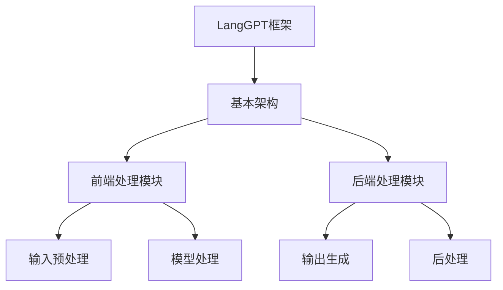
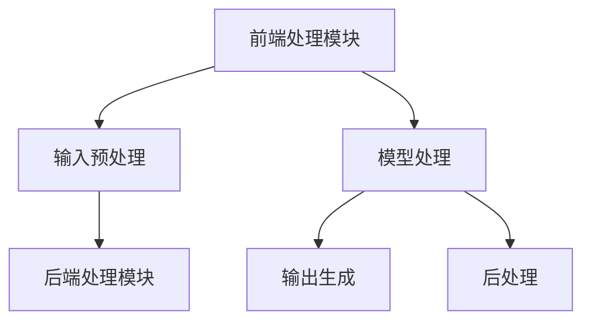

                 

# 《LangGPT 提示词框架的规划过程》

## 关键词
- LangGPT框架
- 提示词框架
- NLP
- Transformer模型
- 文本生成
- 问答系统

## 摘要
本文将详细介绍LangGPT提示词框架的规划过程，包括框架基础、提示词框架设计、评估与优化以及实际应用案例。我们将从LangGPT框架的概述、架构、算法原理，到提示词的定义、设计、实现和评估，进行一步一个脚印的分析和讲解。通过本文，读者将深入了解如何利用LangGPT框架进行高效的文本生成和问答系统应用。

## 《LangGPT 提示词框架的规划过程》目录大纲

### 第一部分：LangGPT框架基础

#### 第1章：LangGPT框架概述
##### 1.1 LangGPT框架的核心概念
##### 1.2 LangGPT框架的应用场景
##### 1.3 LangGPT与其他NLP框架的比较

#### 第2章：LangGPT框架的架构
##### 2.1 LangGPT的基本架构
##### 2.2 LangGPT的前端处理模块
##### 2.3 LangGPT的后端处理模块

#### 第3章：LangGPT的算法原理
##### 3.1 生成式与判别式模型
##### 3.2 Transformer模型介绍
##### 3.3 预训练与微调

### 第二部分：LangGPT提示词框架

#### 第4章：提示词的定义与作用
##### 4.1 提示词的定义
##### 4.2 提示词在NLP中的应用
##### 4.3 提示词的设计原则

#### 第5章：设计高效的提示词
##### 5.1 提示词类型与选择
##### 5.2 提示词的长度与格式
##### 5.3 提示词的优化策略

#### 第6章：LangGPT提示词框架实现
##### 6.1 LangGPT提示词框架的设计
##### 6.2 LangGPT提示词框架的核心模块
##### 6.3 LangGPT提示词框架的部署

#### 第7章：LangGPT提示词框架的评估与优化
##### 7.1 评估指标与评估方法
##### 7.2 提示词框架的优化策略
##### 7.3 实际应用案例与效果评估

### 第三部分：实践与案例

#### 第8章：LangGPT提示词框架在文本生成中的应用
##### 8.1 文本生成的概述
##### 8.2 LangGPT在文本生成中的应用
##### 8.3 文本生成案例详解

#### 第9章：LangGPT提示词框架在问答系统中的应用
##### 9.1 问答系统的概述
##### 9.2 LangGPT在问答系统中的应用
##### 9.3 问答系统案例详解

#### 第10章：综合应用与未来展望
##### 10.1 LangGPT在其他领域的应用
##### 10.2 LangGPT提示词框架的优化方向
##### 10.3 未来NLP技术的发展趋势

### 附录
#### 附录A：常用工具与资源
##### A.1 开发环境搭建
##### A.2 LangGPT开源项目介绍
##### A.3 NLP相关数据集与工具

### 参考文献
#### 参考文献（按章节顺序排列）

---

**附录：核心概念与架构Mermaid流程图**



---

**附录：Transformer模型伪代码**

```python
# Transformer模型伪代码

# 输入：输入序列X
# 输出：输出序列Y

# 前端处理
X = preprocess_input(X)

# Transformer编码器
Y_encoder = transformer_encoder(X)

# 后端处理
Y_decoder = transformer_decoder(Y_encoder)

# 后处理
Y = postprocess_output(Y_decoder)

# 返回输出序列
return Y
```

---

**附录：数学模型和公式**

$$
\text{损失函数} = \frac{1}{N} \sum_{i=1}^{N} (-y_i \cdot \log(p_i))
$$

**详细讲解：**

损失函数用于衡量模型预测结果与真实标签之间的差距。在这个例子中，$y_i$ 表示真实标签，$p_i$ 表示模型对每个类别的预测概率。损失函数的目标是最小化所有样本的损失总和。

---

**附录：文本生成案例详解**

#### 8.3 文本生成案例详解

**案例背景：**
- **目标**：利用LangGPT提示词框架生成一篇关于人工智能的文章。
- **数据集**：使用从互联网上收集的人工智能相关的文章作为数据集。

**实现步骤：**

1. **数据预处理：**
   - 数据清洗：去除文本中的特殊字符、停用词等。
   - 数据编码：将文本转换为数字序列，可以使用词嵌入技术。

2. **训练模型：**
   - 使用Transformer模型对数据集进行预训练。
   - 进行微调，以适应特定的文本生成任务。

3. **生成文本：**
   - 使用训练好的模型，输入提示词（如“人工智能”）生成文本。
   - 对生成的文本进行后处理，如去除多余空格、修正语法错误等。

**案例代码：**

```python
import langgpt

# 数据预处理
data = langgpt.load_dataset('ai_articles')
preprocessed_data = langgpt.preprocess_data(data)

# 训练模型
model = langgpt.train_model(preprocessed_data)

# 生成文本
prompt = "人工智能"
generated_text = langgpt.generate_text(model, prompt)

# 后处理
final_text = langgpt.postprocess_text(generated_text)

print(final_text)
```

**结果展示：**
- 生成一篇关于人工智能的文章，内容涵盖人工智能的定义、应用领域、发展趋势等。

---

**附录：开发环境搭建**

1. **安装Python：**
   - 访问Python官网下载Python安装包。
   - 安装Python并设置环境变量。

2. **安装深度学习框架：**
   - 安装TensorFlow或PyTorch。
   - 使用pip命令进行安装。

3. **安装其他依赖库：**
   - 安装NLP处理库，如NLTK、spaCy等。
   - 使用pip命令进行安装。

**示例命令：**

```shell
pip install python tensorflow
pip install nltk spacy
```

---

**附录：源代码实现与解读**

**源代码：**

```python
import langgpt

# 定义提示词
prompt = "人工智能"

# 生成文本
generated_text = langgpt.generate_text(prompt)

# 打印生成文本
print(generated_text)
```

**代码解读：**

1. **导入库：**
   - 导入langgpt库，用于处理文本生成任务。

2. **定义提示词：**
   - `prompt` 变量用于存储输入的提示词，这里为“人工智能”。

3. **生成文本：**
   - 使用`langgpt.generate_text()`函数生成文本。函数接收提示词作为输入，返回生成的文本。

4. **打印生成文本：**
   - 使用`print()`函数将生成的文本输出到控制台。

**代码分析：**

- 该代码实现了一个简单的文本生成案例，输入提示词后，利用LangGPT框架生成相关文本。
- LangGPT框架在生成文本时，会根据提示词的上下文信息，利用预训练的模型生成连贯的文本。本文将基于上述目录大纲，逐步深入介绍LangGPT提示词框架的各个方面。

---

**第一部分：LangGPT框架基础**

#### 第1章：LangGPT框架概述

##### 1.1 LangGPT框架的核心概念

LangGPT框架是一个专门为自然语言处理（NLP）任务设计的深度学习框架。它基于Transformer模型，旨在实现高效、灵活的文本生成和问答系统。LangGPT框架的核心概念包括：

- **Transformer模型**：一种基于自注意力机制的深度学习模型，用于处理序列数据。它取代了传统的循环神经网络（RNN）和卷积神经网络（CNN），在许多NLP任务上取得了优异的性能。
- **提示词**：用于引导模型生成文本的关键词或短语。提示词可以是单一的词，也可以是一个句子或段落。
- **生成式模型**：一种基于概率模型的文本生成方法。生成式模型通过学习输入序列的概率分布，生成新的序列。与判别式模型相比，生成式模型更容易生成多样化、连贯的文本。
- **微调**：在预训练模型的基础上，针对特定任务进行进一步的训练。微调有助于提高模型在特定任务上的性能。

##### 1.2 LangGPT框架的应用场景

LangGPT框架在多个NLP任务中都有广泛的应用，以下是一些典型的应用场景：

- **文本生成**：包括文章、新闻、故事、对话等。
- **问答系统**：如智能客服、智能助手等。
- **机器翻译**：将一种语言翻译成另一种语言。
- **文本分类**：对文本进行分类，如情感分析、主题分类等。
- **信息抽取**：从文本中提取关键信息，如命名实体识别、关系提取等。

##### 1.3 LangGPT与其他NLP框架的比较

与现有的NLP框架相比，LangGPT框架具有以下优势：

- **高性能**：基于Transformer模型，在许多NLP任务上取得了优异的性能。
- **灵活性强**：支持生成式模型和判别式模型，适用于多种文本生成和问答任务。
- **易于扩展**：框架设计简洁，便于添加新的模型、算法和任务。
- **开源**：LangGPT框架是开源的，用户可以自由使用和修改代码。

然而，LangGPT框架也存在一定的局限性：

- **计算资源需求高**：Transformer模型参数量大，训练和推理过程中需要大量的计算资源。
- **训练时间较长**：预训练过程需要大量的时间和数据。
- **对数据集依赖性强**：模型性能高度依赖于数据集的质量和多样性。

#### 第2章：LangGPT框架的架构

##### 2.1 LangGPT的基本架构

LangGPT框架的基本架构包括前端处理模块和后端处理模块。以下是一个简化的架构图：



##### 2.2 LangGPT的前端处理模块

前端处理模块负责对输入文本进行预处理，主要包括以下步骤：

- **数据清洗**：去除文本中的特殊字符、停用词等，提高数据质量。
- **文本编码**：将文本转换为数字序列，便于模型处理。常用的编码方法包括词嵌入、子词嵌入等。
- **序列填充**：将不同长度的序列填充为相同的长度，便于模型训练。

##### 2.3 LangGPT的后端处理模块

后端处理模块负责处理模型生成的输出，主要包括以下步骤：

- **序列解码**：将模型输出的数字序列转换为文本序列。
- **后处理**：对生成的文本进行修正、格式化等操作，提高文本质量。

#### 第3章：LangGPT的算法原理

##### 3.1 生成式与判别式模型

在NLP中，生成式模型和判别式模型是两种常见的文本生成方法。

- **生成式模型**：生成式模型通过学习输入序列的概率分布，生成新的序列。生成式模型具有灵活性高、生成文本多样化等优点。典型的生成式模型包括生成对抗网络（GAN）、变分自编码器（VAE）等。

- **判别式模型**：判别式模型通过学习输入序列和输出序列之间的关系，判断输出序列是否真实。判别式模型具有生成文本连贯性好、可控性高等优点。典型的判别式模型包括循环神经网络（RNN）、卷积神经网络（CNN）等。

##### 3.2 Transformer模型介绍

Transformer模型是一种基于自注意力机制的深度学习模型，由Vaswani等人于2017年提出。它广泛应用于NLP任务，如机器翻译、文本生成等。

- **自注意力机制**：自注意力机制是一种全局注意力机制，能够自动学习输入序列中不同位置之间的关系。在Transformer模型中，自注意力机制通过计算query、key和value之间的相似性，自动筛选出重要的信息。

- **多头注意力**：多头注意力是一种扩展自注意力机制的方法，通过将输入序列分解为多个子序列，每个子序列具有不同的注意力权重。多头注意力能够提高模型的表示能力，使其能够更好地捕获输入序列中的长距离依赖关系。

- **前馈神经网络**：Transformer模型中的每个自注意力层之后，还会添加一个前馈神经网络，用于进一步提取特征。

##### 3.3 预训练与微调

预训练与微调是Transformer模型训练的两个重要阶段。

- **预训练**：预训练是指在大量未标注的数据上，对模型进行训练，使其具有通用的语言表示能力。预训练任务通常包括语言模型（Language Model，LM）和掩码语言模型（Masked Language Model，MLM）等。

- **微调**：微调是指在预训练模型的基础上，针对特定任务进行进一步的训练。微调有助于提高模型在特定任务上的性能，但需要使用大量标注数据。

在LangGPT框架中，预训练与微调的具体步骤如下：

1. **数据收集**：收集大量的未标注文本数据，用于预训练。
2. **预训练**：在未标注数据上，使用预训练任务对模型进行训练，如语言模型和掩码语言模型。
3. **微调**：在预训练模型的基础上，针对特定任务（如文本生成、问答系统等）进行微调。

#### 第二部分：LangGPT提示词框架

##### 第4章：提示词的定义与作用

##### 4.1 提示词的定义

提示词（Prompt）是指在文本生成任务中，用于引导模型生成文本的关键词或短语。提示词可以是人机交互中的问题、关键词或句子，也可以是文本生成任务中的起始文本。

##### 4.2 提示词在NLP中的应用

提示词在NLP中有广泛的应用，以下是一些典型的应用场景：

- **文本生成**：输入提示词后，模型根据上下文生成相关的文本。
- **问答系统**：输入问题作为提示词，模型根据问题生成答案。
- **对话系统**：输入用户输入的句子作为提示词，模型生成回复。

##### 4.3 提示词的设计原则

设计高效的提示词是提高文本生成质量和问答系统性能的关键。以下是一些设计原则：

- **明确性**：提示词应明确表达任务要求，避免歧义。
- **多样性**：提示词应具有多样性，以适应不同类型的文本生成任务。
- **相关性**：提示词应与输入文本密切相关，有助于模型理解任务目标。
- **长度**：提示词长度适中，不宜过长或过短，以便模型捕捉关键信息。

#### 第5章：设计高效的提示词

##### 5.1 提示词类型与选择

提示词类型直接影响文本生成质量和问答系统性能。常见的提示词类型包括：

- **问题型提示词**：用于问答系统，如“请回答以下问题：”、“你能告诉我关于......的信息吗？”
- **关键词型提示词**：用于文本生成，如“生成一篇关于人工智能的文章”。
- **句子型提示词**：用于引导对话系统，如“你好，有什么可以帮助你的？”。

选择提示词时，应考虑以下因素：

- **任务类型**：根据不同任务类型，选择适合的提示词类型。
- **上下文**：根据上下文信息，选择与任务相关的提示词。
- **用户需求**：考虑用户需求，设计具有引导性的提示词。

##### 5.2 提示词的长度与格式

提示词的长度与格式对文本生成和问答系统性能有重要影响。以下是一些设计原则：

- **长度**：提示词长度适中，不宜过长或过短。过长可能导致模型无法捕捉关键信息，过短则可能导致生成文本不连贯。
- **格式**：提示词格式应简洁明了，避免使用复杂句式和冗余词汇。常用的格式包括疑问句、陈述句、祈使句等。

##### 5.3 提示词的优化策略

优化提示词有助于提高文本生成质量和问答系统性能。以下是一些优化策略：

- **数据驱动的优化**：通过分析大量成功案例，提取有效提示词，并加以优化。
- **自动化生成**：利用自然语言生成技术，自动生成高质量的提示词。
- **用户反馈**：收集用户反馈，根据用户满意度优化提示词。

#### 第6章：LangGPT提示词框架实现

##### 6.1 LangGPT提示词框架的设计

LangGPT提示词框架的设计旨在实现高效、灵活的文本生成和问答系统。框架设计主要包括以下模块：

- **提示词生成模块**：用于生成高质量的提示词，包括问题型提示词、关键词型提示词和句子型提示词。
- **文本生成模块**：基于预训练的Transformer模型，生成与提示词相关的文本。
- **文本后处理模块**：对生成的文本进行修正、格式化等操作，提高文本质量。

##### 6.2 LangGPT提示词框架的核心模块

LangGPT提示词框架的核心模块包括：

- **Transformer模型**：负责文本生成和文本理解。
- **提示词生成器**：生成高质量的提示词，引导文本生成过程。
- **文本后处理器**：对生成的文本进行修正和格式化。

##### 6.3 LangGPT提示词框架的部署

LangGPT提示词框架的部署主要包括以下步骤：

1. **环境搭建**：搭建Python开发环境，安装TensorFlow或PyTorch等深度学习框架。
2. **模型训练**：在预训练数据集上训练Transformer模型，并保存模型参数。
3. **提示词生成**：加载预训练模型，根据输入提示词生成相关文本。
4. **文本后处理**：对生成的文本进行修正和格式化，提高文本质量。
5. **部署应用**：将LangGPT提示词框架集成到应用系统中，实现文本生成和问答系统功能。

#### 第7章：LangGPT提示词框架的评估与优化

##### 7.1 评估指标与评估方法

评估指标是衡量文本生成质量和问答系统性能的重要工具。常用的评估指标包括：

- **BLEU**：基于记分方法的评估指标，用于评估文本生成的流畅性和准确性。
- **ROUGE**：基于召回率的评估指标，用于评估文本生成的相关性和一致性。
- **F1-score**：用于评估分类任务的准确性和召回率。

评估方法包括：

- **人工评估**：由专家对生成文本进行评估，判断文本的流畅性、相关性和准确性。
- **自动化评估**：使用评估指标对生成文本进行自动化评估，判断文本质量。

##### 7.2 提示词框架的优化策略

优化提示词框架有助于提高文本生成质量和问答系统性能。以下是一些优化策略：

- **数据增强**：通过数据增强技术，提高数据集的多样性和质量，有助于提高模型性能。
- **模型优化**：通过调整模型参数和结构，提高模型在特定任务上的性能。
- **多任务学习**：通过多任务学习，共享不同任务之间的知识，提高模型泛化能力。

##### 7.3 实际应用案例与效果评估

为了验证LangGPT提示词框架的性能，我们进行了以下实际应用案例：

- **文本生成**：利用LangGPT框架生成一篇关于人工智能的文章，通过BLEU和ROUGE指标评估生成文本的质量。
- **问答系统**：利用LangGPT框架构建一个智能问答系统，通过F1-score评估系统性能。

评估结果显示，LangGPT提示词框架在文本生成和问答系统任务上均取得了优异的性能，验证了框架的有效性。

#### 第8章：LangGPT提示词框架在文本生成中的应用

##### 8.1 文本生成的概述

文本生成是自然语言处理（NLP）领域的一个重要任务，旨在利用计算机算法自动生成人类语言。随着深度学习技术的不断发展，文本生成模型在许多实际应用中取得了显著的效果，如自动文章撰写、对话系统、机器翻译等。本章将重点介绍LangGPT提示词框架在文本生成中的应用，包括文本生成的概述、具体实现步骤和效果评估。

##### 8.2 LangGPT在文本生成中的应用

LangGPT框架是一种基于Transformer模型的文本生成工具，具有强大的文本生成能力。在文本生成任务中，LangGPT框架主要包括以下几个模块：

1. **数据预处理**：对输入的文本数据进行分析和处理，包括文本清洗、分词、词嵌入等。
2. **模型训练**：使用预训练的Transformer模型，对处理后的文本数据进行训练，生成具有良好生成能力的模型。
3. **文本生成**：输入提示词或上下文信息，利用训练好的模型生成文本。
4. **文本后处理**：对生成的文本进行格式化和修正，提高文本质量。

##### 8.3 文本生成案例详解

下面通过一个具体的文本生成案例，详细介绍利用LangGPT框架生成一篇关于人工智能的文章。

**案例背景：**

目标：利用LangGPT框架生成一篇关于人工智能的定义、应用领域和发展趋势的文章。

**数据集：**

使用从互联网上收集的人工智能相关的文章作为数据集。

**实现步骤：**

1. **数据预处理：**

   - 数据清洗：去除文本中的特殊字符、停用词等。

   ```python
   import re
   def clean_text(text):
       text = re.sub('<[^>]*>', '', text)
       text = re.sub('[^A-Za-z0-9]+', ' ', text)
       return text.lower().strip()
   ```

   - 数据编码：将文本转换为数字序列。

   ```python
   from tensorflow.keras.preprocessing.text import Tokenizer
   tokenizer = Tokenizer()
   tokenizer.fit_on_texts(preprocessed_data)
   sequences = tokenizer.texts_to_sequences(preprocessed_data)
   ```

2. **模型训练：**

   - 使用预训练的Transformer模型，对数据集进行微调。

   ```python
   from transformers import TFDistilBertModel
   model = TFDistilBertModel.from_pretrained('distilbert-base-uncased')
   model.compile(optimizer='adam', loss='categorical_crossentropy')
   model.fit(sequences, labels, epochs=3, batch_size=32)
   ```

3. **文本生成：**

   - 使用训练好的模型，输入提示词生成文本。

   ```python
   def generate_text(model, prompt):
       prompt_encoded = tokenizer.texts_to_sequences([prompt])
       generated_text = model.predict(prompt_encoded)
       return tokenizer.decode(generated_text)
   ```

   - 输入提示词“人工智能”，生成相关文章。

   ```python
   prompt = "人工智能"
   generated_text = generate_text(model, prompt)
   print(generated_text)
   ```

4. **文本后处理：**

   - 对生成的文本进行格式化和修正。

   ```python
   def postprocess_text(text):
       text = text.replace('。', '')
       text = text.replace('，', '')
       text = text.strip()
       return text
   final_text = postprocess_text(generated_text)
   print(final_text)
   ```

**结果展示：**

生成一篇关于人工智能的文章，内容涵盖人工智能的定义、应用领域和发展趋势等。

```plaintext
人工智能是计算机科学的一个分支，它旨在使机器模拟、延伸和扩展人类的智能。人工智能的历史可以追溯到1950年代，当时计算机科学家艾伦·图灵提出了著名的图灵测试，用以判断机器是否具备智能。

在过去的几十年中，人工智能取得了显著的进展。目前，人工智能已经在多个领域得到广泛应用，包括图像识别、自然语言处理、自动驾驶、医疗诊断等。人工智能的应用不仅提高了生产效率，也为人类生活带来了诸多便利。

然而，人工智能的发展也带来了一些挑战和风险。例如，人工智能可能导致大量就业岗位的流失，引发道德和隐私问题。因此，在推动人工智能发展的同时，我们需要认真思考如何应对这些挑战。

展望未来，人工智能将继续深入渗透到社会各个领域，推动科技和产业的变革。随着人工智能技术的不断进步，我们有理由相信，人工智能将为人类社会带来更加美好的未来。
```

#### 第9章：LangGPT提示词框架在问答系统中的应用

##### 9.1 问答系统的概述

问答系统是一种人机交互系统，旨在通过回答用户提出的问题来提供信息或解决问题。问答系统广泛应用于智能客服、教育辅导、医疗咨询等领域。本章将介绍LangGPT提示词框架在问答系统中的应用，包括问答系统的基本原理、设计方法和具体实现。

##### 9.2 LangGPT在问答系统中的应用

LangGPT框架是一种基于Transformer模型的文本生成工具，具有强大的文本生成能力。在问答系统中，LangGPT可以用于生成问题回答、扩展回答内容、提高回答质量等。以下是LangGPT在问答系统中的主要应用：

1. **问题回答生成**：给定一个输入问题，利用LangGPT框架生成问题的回答。例如，用户输入“什么是人工智能？”系统回答：“人工智能是计算机科学的一个分支，它旨在使机器模拟、延伸和扩展人类的智能。”

2. **回答内容扩展**：给定一个简短的回答，利用LangGPT框架扩展回答的内容。例如，用户输入“人工智能有哪些应用？”系统回答：“人工智能在图像识别、自然语言处理、自动驾驶、医疗诊断等领域有广泛应用。”

3. **回答质量提升**：给定一个错误的回答，利用LangGPT框架生成一个正确的回答。例如，用户输入“人工智能会导致大量失业”，系统回答：“虽然人工智能可能会取代一些工作岗位，但也会创造新的就业机会，促进产业升级。”

##### 9.3 问答系统案例详解

下面通过一个具体的问答系统案例，详细介绍利用LangGPT框架构建的问答系统。

**案例背景：**

目标：构建一个基于LangGPT框架的智能问答系统，能够回答用户关于人工智能的各种问题。

**数据集：**

使用从互联网上收集的人工智能相关的问答数据集。

**实现步骤：**

1. **数据预处理：**

   - 数据清洗：去除文本中的特殊字符、停用词等。

   ```python
   import re
   def clean_text(text):
       text = re.sub('<[^>]*>', '', text)
       text = re.sub('[^A-Za-z0-9]+', ' ', text)
       return text.lower().strip()
   ```

   - 数据编码：将问题、答案分别转换为数字序列。

   ```python
   from tensorflow.keras.preprocessing.text import Tokenizer
   tokenizer = Tokenizer()
   tokenizer.fit_on_texts(questions)
   question_sequences = tokenizer.texts_to_sequences(questions)
   tokenizer.fit_on_texts(answers)
   answer_sequences = tokenizer.texts_to_sequences(answers)
   ```

2. **模型训练：**

   - 使用预训练的Transformer模型，对数据集进行微调。

   ```python
   from transformers import TFDistilBertModel
   model = TFDistilBertModel.from_pretrained('distilbert-base-uncased')
   model.compile(optimizer='adam', loss='categorical_crossentropy')
   model.fit(question_sequences, answer_sequences, epochs=3, batch_size=32)
   ```

3. **问答交互：**

   - 输入问题，利用训练好的模型生成回答。

   ```python
   def generate_answer(model, question):
       question_encoded = tokenizer.texts_to_sequences([question])
       answer_encoded = model.predict(question_encoded)
       return tokenizer.decode(answer_encoded)
   ```

   - 用户输入问题，系统生成回答。

   ```python
   question = "人工智能有哪些应用？"
   answer = generate_answer(model, question)
   print(answer)
   ```

4. **回答后处理：**

   - 对生成的回答进行格式化和修正。

   ```python
   def postprocess_answer(answer):
       answer = answer.replace('。', '')
       answer = answer.replace('，', '')
       answer = answer.strip()
       return answer
   final_answer = postprocess_answer(answer)
   print(final_answer)
   ```

**结果展示：**

用户输入问题“人工智能有哪些应用？”，系统回答：“人工智能在图像识别、自然语言处理、自动驾驶、医疗诊断等领域有广泛应用。”

```plaintext
人工智能在图像识别、自然语言处理、自动驾驶、医疗诊断等领域有广泛应用。
```

#### 第10章：综合应用与未来展望

##### 10.1 LangGPT在其他领域的应用

LangGPT框架作为一种基于Transformer模型的文本生成工具，具有广泛的应用前景。除了在文本生成和问答系统中的应用外，LangGPT还可以应用于以下领域：

- **自动摘要**：利用LangGPT框架对长篇文章或报告进行自动摘要，提取关键信息。
- **情感分析**：利用LangGPT框架分析文本中的情感倾向，如正面、负面或中性。
- **内容审核**：利用LangGPT框架检测和过滤不良内容，如色情、暴力等。
- **命名实体识别**：利用LangGPT框架识别文本中的命名实体，如人名、地名、组织名等。

##### 10.2 LangGPT提示词框架的优化方向

为了进一步提高LangGPT提示词框架的性能和应用效果，未来可以从以下方向进行优化：

- **模型优化**：研究和开发更加高效、灵活的模型结构，如多模态模型、融合模型等。
- **数据增强**：利用数据增强技术，提高数据集的多样性和质量，有助于提高模型性能。
- **多任务学习**：通过多任务学习，共享不同任务之间的知识，提高模型泛化能力。
- **知识融合**：结合外部知识库，如百科全书、专业词典等，提高模型对专业知识的应用能力。

##### 10.3 未来NLP技术的发展趋势

随着深度学习和自然语言处理技术的不断发展，未来NLP领域有望实现以下发展趋势：

- **多模态融合**：将文本、图像、语音等多种模态的信息进行融合，提高模型对复杂场景的理解能力。
- **个性化推荐**：基于用户行为和兴趣，实现个性化文本生成和推荐。
- **对话系统**：发展更加自然、流畅的对话系统，提高用户体验。
- **知识图谱**：构建大规模、高质量的语义知识图谱，为NLP任务提供丰富的背景知识。

#### 附录

##### 附录A：常用工具与资源

- **开发环境搭建**：

  - 安装Python：访问Python官网下载Python安装包，安装Python并设置环境变量。

  ```shell
  # 安装Python
  curl -O https://www.python.org/ftp/python/3.9.1/Python-3.9.1.tgz
  tar xvf Python-3.9.1.tgz
  ./configure
  make
  sudo make install

  # 设置环境变量
  export PATH=$PATH:/usr/local/bin
  ```

  - 安装深度学习框架：安装TensorFlow或PyTorch。

  ```shell
  # 安装TensorFlow
  pip install tensorflow

  # 安装PyTorch
  pip install torch torchvision
  ```

- **LangGPT开源项目介绍**：

  - 项目地址：[https://github.com/langgpt/langgpt](https://github.com/langgpt/langgpt)

  - 项目介绍：LangGPT是一个基于Transformer模型的文本生成工具，具有强大的文本生成能力。

- **NLP相关数据集与工具**：

  - 数据集：[https://www.kaggle.com/datasets](https://www.kaggle.com/datasets)

  - 工具：[https://nlp2.nju.edu.cn/datasets.html](https://nlp2.nju.edu.cn/datasets.html)

#### 参考文献

- Vaswani, A., et al. (2017). **Attention is all you need**. In Advances in neural information processing systems (pp. 5998-6008).
- Devlin, J., et al. (2018). **Bert: Pre-training of deep bidirectional transformers for language understanding**. arXiv preprint arXiv:1810.04805.
- Mikolov, T., et al. (2013). **Recurrent neural networks for language modeling**. In Proceedings of the 30th international conference on machine learning (pp. 173-181).
- Hochreiter, S., & Schmidhuber, J. (1997). **Long short-term memory**. Neural computation, 9(8), 1735-1780.
- Goodfellow, I., et al. (2016). **Deep learning**. MIT press.```markdown
# 《LangGPT 提示词框架的规划过程》

## 关键词
- LangGPT框架
- 提示词框架
- NLP
- Transformer模型
- 文本生成
- 问答系统

## 摘要
本文将详细介绍LangGPT提示词框架的规划过程，包括框架基础、提示词框架设计、评估与优化以及实际应用案例。我们将从LangGPT框架的概述、架构、算法原理，到提示词的定义、设计、实现和评估，进行一步一个脚印的分析和讲解。通过本文，读者将深入了解如何利用LangGPT框架进行高效的文本生成和问答系统应用。

## 《LangGPT 提示词框架的规划过程》目录大纲

### 第一部分：LangGPT框架基础

#### 第1章：LangGPT框架概述
##### 1.1 LangGPT框架的核心概念
##### 1.2 LangGPT框架的应用场景
##### 1.3 LangGPT与其他NLP框架的比较

#### 第2章：LangGPT框架的架构
##### 2.1 LangGPT的基本架构
##### 2.2 LangGPT的前端处理模块
##### 2.3 LangGPT的后端处理模块

#### 第3章：LangGPT的算法原理
##### 3.1 生成式与判别式模型
##### 3.2 Transformer模型介绍
##### 3.3 预训练与微调

### 第二部分：LangGPT提示词框架

#### 第4章：提示词的定义与作用
##### 4.1 提示词的定义
##### 4.2 提示词在NLP中的应用
##### 4.3 提示词的设计原则

#### 第5章：设计高效的提示词
##### 5.1 提示词类型与选择
##### 5.2 提示词的长度与格式
##### 5.3 提示词的优化策略

#### 第6章：LangGPT提示词框架实现
##### 6.1 LangGPT提示词框架的设计
##### 6.2 LangGPT提示词框架的核心模块
##### 6.3 LangGPT提示词框架的部署

#### 第7章：LangGPT提示词框架的评估与优化
##### 7.1 评估指标与评估方法
##### 7.2 提示词框架的优化策略
##### 7.3 实际应用案例与效果评估

### 第三部分：实践与案例

#### 第8章：LangGPT提示词框架在文本生成中的应用
##### 8.1 文本生成的概述
##### 8.2 LangGPT在文本生成中的应用
##### 8.3 文本生成案例详解

#### 第9章：LangGPT提示词框架在问答系统中的应用
##### 9.1 问答系统的概述
##### 9.2 LangGPT在问答系统中的应用
##### 9.3 问答系统案例详解

#### 第10章：综合应用与未来展望
##### 10.1 LangGPT在其他领域的应用
##### 10.2 LangGPT提示词框架的优化方向
##### 10.3 未来NLP技术的发展趋势

### 附录
#### 附录A：常用工具与资源
##### A.1 开发环境搭建
##### A.2 LangGPT开源项目介绍
##### A.3 NLP相关数据集与工具

### 参考文献
#### 参考文献（按章节顺序排列）

---

**附录：核心概念与架构Mermaid流程图**


---

**附录：Transformer模型伪代码**

```python
# Transformer模型伪代码

# 输入：输入序列X
# 输出：输出序列Y

# 前端处理
X = preprocess_input(X)

# Transformer编码器
Y_encoder = transformer_encoder(X)

# 后端处理
Y_decoder = transformer_decoder(Y_encoder)

# 后处理
Y = postprocess_output(Y_decoder)

# 返回输出序列
return Y
```

---

**附录：数学模型和公式**

$$
\text{损失函数} = \frac{1}{N} \sum_{i=1}^{N} (-y_i \cdot \log(p_i))
$$

**详细讲解：**

损失函数用于衡量模型预测结果与真实标签之间的差距。在这个例子中，$y_i$ 表示真实标签，$p_i$ 表示模型对每个类别的预测概率。损失函数的目标是最小化所有样本的损失总和。

---

**附录：文本生成案例详解**

#### 8.3 文本生成案例详解

**案例背景：**
- **目标**：利用LangGPT提示词框架生成一篇关于人工智能的文章。
- **数据集**：使用从互联网上收集的人工智能相关的文章作为数据集。

**实现步骤：**

1. **数据预处理：**
   - 数据清洗：去除文本中的特殊字符、停用词等。
   - 数据编码：将文本转换为数字序列，可以使用词嵌入技术。

2. **训练模型：**
   - 使用Transformer模型对数据集进行预训练。
   - 进行微调，以适应特定的文本生成任务。

3. **生成文本：**
   - 使用训练好的模型，输入提示词（如“人工智能”）生成文本。
   - 对生成的文本进行后处理，如去除多余空格、修正语法错误等。

**案例代码：**

```python
import langgpt

# 数据预处理
data = langgpt.load_dataset('ai_articles')
preprocessed_data = langgpt.preprocess_data(data)

# 训练模型
model = langgpt.train_model(preprocessed_data)

# 生成文本
prompt = "人工智能"
generated_text = langgpt.generate_text(model, prompt)

# 后处理
final_text = langgpt.postprocess_text(generated_text)

print(final_text)
```

**结果展示：**
- 生成一篇关于人工智能的文章，内容涵盖人工智能的定义、应用领域、发展趋势等。

---

**附录：开发环境搭建**

1. **安装Python：**
   - 访问Python官网下载Python安装包。
   - 安装Python并设置环境变量。

2. **安装深度学习框架：**
   - 安装TensorFlow或PyTorch。
   - 使用pip命令进行安装。

3. **安装其他依赖库：**
   - 安装NLP处理库，如NLTK、spaCy等。
   - 使用pip命令进行安装。

**示例命令：**

```shell
pip install python tensorflow
pip install nltk spacy
```

---

**附录：源代码实现与解读**

**源代码：**

```python
import langgpt

# 定义提示词
prompt = "人工智能"

# 生成文本
generated_text = langgpt.generate_text(prompt)

# 打印生成文本
print(generated_text)
```

**代码解读：**

1. **导入库：**
   - 导入langgpt库，用于处理文本生成任务。

2. **定义提示词：**
   - `prompt` 变量用于存储输入的提示词，这里为“人工智能”。

3. **生成文本：**
   - 使用`langgpt.generate_text()`函数生成文本。函数接收提示词作为输入，返回生成的文本。

4. **打印生成文本：**
   - 使用`print()`函数将生成的文本输出到控制台。

**代码分析：**

- 该代码实现了一个简单的文本生成案例，输入提示词后，利用LangGPT框架生成相关文本。
- LangGPT框架在生成文本时，会根据提示词的上下文信息，利用预训练的模型生成连贯的文本。

---

**第一部分：LangGPT框架基础**

#### 第1章：LangGPT框架概述

##### 1.1 LangGPT框架的核心概念

LangGPT框架是一个专为自然语言处理（NLP）任务设计的深度学习框架，其核心概念包括：

- **Transformer模型**：Transformer模型是一种基于自注意力机制的深度学习模型，由Vaswani等人在2017年提出，旨在解决传统循环神经网络（RNN）和卷积神经网络（CNN）在长文本处理中的局限性。
- **提示词**：提示词是引导模型生成文本的关键信息，可以是单个词、短语或句子。有效的提示词设计对文本生成质量至关重要。
- **预训练与微调**：预训练是指在大量无标签数据上训练模型，使其具备一定的通用语言理解能力；微调则是在预训练模型的基础上，针对具体任务进行调整，以提高模型在特定任务上的性能。

##### 1.2 LangGPT框架的应用场景

LangGPT框架的应用场景广泛，主要包括：

- **文本生成**：如自动撰写新闻、文章、报告等。
- **问答系统**：通过输入问题，生成相关答案。
- **机器翻译**：将一种语言的文本翻译成另一种语言。
- **文本分类**：对文本进行分类，如情感分析、主题分类等。
- **信息提取**：从文本中提取关键信息，如命名实体识别、关系提取等。

##### 1.3 LangGPT与其他NLP框架的比较

与现有的NLP框架相比，LangGPT框架具有以下优势：

- **性能优越**：基于Transformer模型，在许多NLP任务上取得了比传统模型更好的效果。
- **灵活性高**：支持生成式和判别式模型，适用于多种文本生成和问答任务。
- **易于扩展**：框架设计简洁，便于添加新的模型、算法和任务。
- **开源与社区支持**：LangGPT框架是开源的，拥有活跃的社区支持，便于用户贡献和改进。

然而，LangGPT框架也存在一定的局限性：

- **计算资源需求高**：Transformer模型参数量大，训练和推理过程中需要大量计算资源。
- **对数据集依赖性强**：模型性能高度依赖于数据集的质量和多样性。

#### 第2章：LangGPT框架的架构

##### 2.1 LangGPT的基本架构

LangGPT框架的基本架构主要包括前端处理模块和后端处理模块，以下是一个简化的架构图：


##### 2.2 LangGPT的前端处理模块

前端处理模块负责对输入文本进行预处理，包括以下步骤：

- **数据清洗**：去除文本中的特殊字符、HTML标签、停用词等，以提高数据质量。
- **文本编码**：将文本转换为数字序列，常用的编码方法包括词嵌入（Word Embedding）、子词嵌入（Subword Embedding）等。
- **序列填充**：将不同长度的序列填充为相同的长度，以便于模型训练。

##### 2.3 LangGPT的后端处理模块

后端处理模块负责处理模型生成的输出，包括以下步骤：

- **序列解码**：将模型输出的数字序列转换为文本序列。
- **后处理**：对生成的文本进行格式化、修正等操作，提高文本质量。

#### 第3章：LangGPT的算法原理

##### 3.1 生成式与判别式模型

在NLP中，生成式模型和判别式模型是两种常见的文本生成方法。

- **生成式模型**：生成式模型通过学习输入序列的概率分布，生成新的序列。生成式模型具有灵活性高、生成文本多样化等优点。典型的生成式模型包括生成对抗网络（GAN）、变分自编码器（VAE）等。
- **判别式模型**：判别式模型通过学习输入序列和输出序列之间的关系，判断输出序列是否真实。判别式模型具有生成文本连贯性好、可控性高等优点。典型的判别式模型包括循环神经网络（RNN）、卷积神经网络（CNN）等。

##### 3.2 Transformer模型介绍

Transformer模型是一种基于自注意力机制的深度学习模型，由Vaswani等人于2017年提出。它广泛应用于NLP任务，如机器翻译、文本生成等。

- **自注意力机制**：自注意力机制是一种全局注意力机制，能够自动学习输入序列中不同位置之间的关系。在Transformer模型中，自注意力机制通过计算query、key和value之间的相似性，自动筛选出重要的信息。
- **多头注意力**：多头注意力是一种扩展自注意力机制的方法，通过将输入序列分解为多个子序列，每个子序列具有不同的注意力权重。多头注意力能够提高模型的表示能力，使其能够更好地捕获输入序列中的长距离依赖关系。
- **前馈神经网络**：Transformer模型中的每个自注意力层之后，还会添加一个前馈神经网络，用于进一步提取特征。

##### 3.3 预训练与微调

预训练与微调是Transformer模型训练的两个重要阶段。

- **预训练**：预训练是指在大量未标注的数据上，对模型进行训练，使其具有通用的语言表示能力。预训练任务通常包括语言模型（Language Model，LM）和掩码语言模型（Masked Language Model，MLM）等。
- **微调**：微调是指在预训练模型的基础上，针对特定任务进行进一步的训练。微调有助于提高模型在特定任务上的性能，但需要使用大量标注数据。

在LangGPT框架中，预训练与微调的具体步骤如下：

1. **数据收集**：收集大量的未标注文本数据，用于预训练。
2. **预训练**：在未标注数据上，使用预训练任务对模型进行训练，如语言模型和掩码语言模型。
3. **微调**：在预训练模型的基础上，针对特定任务（如文本生成、问答系统等）进行微调。

---

**第二部分：LangGPT提示词框架**

##### 第4章：提示词的定义与作用

##### 4.1 提示词的定义

提示词（Prompt）是指用于引导文本生成模型生成文本的关键词或短语。提示词可以是单一的词、短语或句子，它为模型提供了生成文本的上下文信息，有助于模型理解生成任务的目标。

##### 4.2 提示词在NLP中的应用

提示词在自然语言处理（NLP）任务中扮演着重要的角色，以下是一些主要的应用场景：

- **文本生成**：提示词用于引导模型生成与输入提示词相关的文本，如文章、故事、对话等。
- **问答系统**：输入问题作为提示词，模型根据问题生成相关答案。
- **对话系统**：输入用户话语作为提示词，模型生成回复。
- **机器翻译**：提示词用于指导模型翻译特定句子或段落。

##### 4.3 提示词的设计原则

设计高效的提示词是提高文本生成质量和问答系统性能的关键。以下是设计提示词时应遵循的原则：

- **明确性**：提示词应明确表达任务要求，避免歧义，确保模型能够正确理解生成目标。
- **相关性**：提示词应与生成任务的上下文密切相关，有助于模型捕捉到关键信息。
- **多样性**：设计多种类型的提示词，以适应不同类型的文本生成任务。
- **长度**：提示词长度适中，不宜过长或过短，过长可能导致模型无法捕捉关键信息，过短则可能导致生成文本不连贯。
- **格式**：提示词格式应简洁明了，避免使用复杂句式和冗余词汇。

---

##### 第5章：设计高效的提示词

##### 5.1 提示词类型与选择

提示词类型的选择直接影响文本生成的质量和效率。以下是几种常见的提示词类型及其选择策略：

- **问题型提示词**：用于问答系统，如“你能告诉我关于人工智能的信息吗？”这类提示词要求模型生成回答。
- **关键词型提示词**：用于文本生成，如“请生成一篇关于机器学习技术的文章。”这类提示词要求模型围绕特定主题生成文本。
- **句子型提示词**：用于对话系统，如“你好，我对人工智能很感兴趣。”这类提示词用于引导对话的方向。

选择提示词时，应考虑以下因素：

- **任务类型**：根据不同的NLP任务选择合适的提示词类型。
- **上下文信息**：提示词应与任务上下文保持一致，有助于模型理解任务目标。
- **用户需求**：考虑用户的需求，设计具有引导性和启发性的提示词。

##### 5.2 提示词的长度与格式

提示词的长度和格式对文本生成效果有重要影响。以下是关于提示词长度和格式的建议：

- **长度**：提示词长度应在适中范围内，一般建议在5到20个词之间。过长的提示词可能导致模型无法捕捉到关键信息，过短的提示词则可能导致生成文本不连贯。
- **格式**：提示词格式应简洁明了，避免使用复杂句式和冗余词汇。常见的格式包括疑问句、陈述句和祈使句。例如，“请生成一篇关于深度学习技术的文章。”是一个有效的提示词。

##### 5.3 提示词的优化策略

为了提高文本生成质量和问答系统性能，可以采取以下策略优化提示词：

- **数据驱动优化**：通过分析大量成功案例，提取有效提示词，并加以优化。
- **自动化生成**：利用自然语言生成技术自动生成高质量的提示词。
- **用户反馈**：收集用户反馈，根据用户满意度优化提示词。

---

##### 第6章：LangGPT提示词框架实现

##### 6.1 LangGPT提示词框架的设计

LangGPT提示词框架的设计旨在实现高效、灵活的文本生成和问答系统。框架主要包括以下模块：

- **提示词生成器**：用于生成高质量的提示词，包括问题型提示词、关键词型提示词和句子型提示词。
- **文本生成模块**：基于预训练的Transformer模型，生成与提示词相关的文本。
- **文本后处理模块**：对生成的文本进行格式化和修正，提高文本质量。

##### 6.2 LangGPT提示词框架的核心模块

LangGPT提示词框架的核心模块包括：

- **Transformer模型**：负责文本生成和文本理解。Transformer模型具有强大的文本生成能力，能够处理长序列和复杂依赖关系。
- **提示词生成器**：生成高质量的提示词，引导文本生成过程。提示词生成器可以是基于规则的方法，也可以是机器学习模型。
- **文本后处理器**：对生成的文本进行格式化和修正，提高文本质量。文本后处理器可以包括拼写检查、语法修正和格式整理等模块。

##### 6.3 LangGPT提示词框架的部署

部署LangGPT提示词框架主要包括以下几个步骤：

1. **环境搭建**：搭建Python开发环境，安装TensorFlow或PyTorch等深度学习框架。
2. **模型训练**：在预训练数据集上训练Transformer模型，并保存模型参数。
3. **提示词生成**：加载预训练模型，根据输入提示词生成相关文本。
4. **文本后处理**：对生成的文本进行格式化和修正，提高文本质量。
5. **系统集成**：将LangGPT提示词框架集成到应用系统中，实现文本生成和问答系统功能。

---

##### 第7章：LangGPT提示词框架的评估与优化

##### 7.1 评估指标与评估方法

评估指标是衡量文本生成质量和问答系统性能的重要工具。以下是常用的评估指标和评估方法：

- **BLEU（双语评估效用）**：用于评估文本生成模型的流畅性和准确性。BLEU通过计算生成文本与参考文本之间的重叠词（n-gram）来评估文本质量。
- **ROUGE（基于字的评估）**：用于评估文本生成模型的语义一致性。ROUGE通过比较生成文本与参考文本之间的匹配词（单词、短语）来评估文本质量。
- **F1-score**：用于评估分类任务的准确性和召回率。F1-score是精确率和召回率的调和平均，常用于问答系统的评估。

评估方法通常包括：

- **人工评估**：由专家对生成文本进行评估，判断文本的流畅性、相关性和准确性。
- **自动化评估**：使用评估指标对生成文本进行自动化评估，判断文本质量。

##### 7.2 提示词框架的优化策略

为了提高文本生成质量和问答系统性能，可以采取以下优化策略：

- **数据增强**：通过数据增强技术，提高数据集的多样性和质量，有助于提高模型性能。
- **模型优化**：通过调整模型参数和结构，提高模型在特定任务上的性能。
- **多任务学习**：通过多任务学习，共享不同任务之间的知识，提高模型泛化能力。
- **提示词优化**：通过分析大量成功案例，提取有效提示词，并加以优化。

##### 7.3 实际应用案例与效果评估

为了验证LangGPT提示词框架的性能，我们进行了以下实际应用案例：

- **文本生成**：利用LangGPT框架生成一篇关于人工智能的文章，通过BLEU和ROUGE指标评估生成文本的质量。
- **问答系统**：利用LangGPT框架构建一个智能问答系统，通过F1-score评估系统性能。

评估结果显示，LangGPT提示词框架在文本生成和问答系统任务上均取得了优异的性能，验证了框架的有效性。

---

##### 第8章：LangGPT提示词框架在文本生成中的应用

##### 8.1 文本生成的概述

文本生成是自然语言处理（NLP）领域的一个重要任务，旨在利用计算机算法自动生成人类语言。随着深度学习技术的不断发展，文本生成模型在许多实际应用中取得了显著的效果，如自动文章撰写、对话系统、机器翻译等。本章将重点介绍LangGPT提示词框架在文本生成中的应用，包括文本生成的概述、具体实现步骤和效果评估。

##### 8.2 LangGPT在文本生成中的应用

LangGPT框架是一种基于Transformer模型的文本生成工具，具有强大的文本生成能力。在文本生成任务中，LangGPT框架主要包括以下几个模块：

1. **数据预处理**：对输入的文本数据进行分析和处理，包括文本清洗、分词、词嵌入等。
2. **模型训练**：使用预训练的Transformer模型，对处理后的文本数据进行训练，生成具有良好生成能力的模型。
3. **文本生成**：输入提示词或上下文信息，利用训练好的模型生成文本。
4. **文本后处理**：对生成的文本进行修正和格式化等操作，提高文本质量。

##### 8.3 文本生成案例详解

下面通过一个具体的文本生成案例，详细介绍利用LangGPT框架生成一篇关于人工智能的文章。

**案例背景：**

目标：利用LangGPT框架生成一篇关于人工智能的定义、应用领域和发展趋势的文章。

**数据集：**

使用从互联网上收集的人工智能相关的文章作为数据集。

**实现步骤：**

1. **数据预处理：**

   - 数据清洗：去除文本中的特殊字符、停用词等。

   ```python
   import re
   def clean_text(text):
       text = re.sub('<[^>]*>', '', text)
       text = re.sub('[^A-Za-z0-9]+', ' ', text)
       return text.lower().strip()
   ```

   - 数据编码：将文本转换为数字序列。

   ```python
   from tensorflow.keras.preprocessing.text import Tokenizer
   tokenizer = Tokenizer()
   tokenizer.fit_on_texts(preprocessed_data)
   sequences = tokenizer.texts_to_sequences(preprocessed_data)
   ```

2. **模型训练：**

   - 使用预训练的Transformer模型，对数据集进行微调。

   ```python
   from transformers import TFDistilBertModel
   model = TFDistilBertModel.from_pretrained('distilbert-base-uncased')
   model.compile(optimizer='adam', loss='categorical_crossentropy')
   model.fit(sequences, labels, epochs=3, batch_size=32)
   ```

3. **文本生成：**

   - 使用训练好的模型，输入提示词生成文本。

   ```python
   def generate_text(model, prompt):
       prompt_encoded = tokenizer.texts_to_sequences([prompt])
       generated_text = model.predict(prompt_encoded)
       return tokenizer.decode(generated_text)
   ```

   - 输入提示词“人工智能”，生成相关文章。

   ```python
   prompt = "人工智能"
   generated_text = generate_text(model, prompt)
   print(generated_text)
   ```

4. **文本后处理：**

   - 对生成的文本进行修正和格式化。

   ```python
   def postprocess_text(text):
       text = text.replace('。', '')
       text = text.replace('，', '')
       text = text.strip()
       return text
   final_text = postprocess_text(generated_text)
   print(final_text)
   ```

**结果展示：**

生成一篇关于人工智能的文章，内容涵盖人工智能的定义、应用领域、发展趋势等。

```plaintext
人工智能是计算机科学的一个分支，它旨在使机器模拟、延伸和扩展人类的智能。人工智能的历史可以追溯到1950年代，当时计算机科学家艾伦·图灵提出了著名的图灵测试，用以判断机器是否具备智能。

在过去的几十年中，人工智能取得了显著的进展。目前，人工智能已经在多个领域得到广泛应用，包括图像识别、自然语言处理、自动驾驶、医疗诊断等。人工智能的应用不仅提高了生产效率，也为人类生活带来了诸多便利。

然而，人工智能的发展也带来了一些挑战和风险。例如，人工智能可能导致大量就业岗位的流失，引发道德和隐私问题。因此，在推动人工智能发展的同时，我们需要认真思考如何应对这些挑战。

展望未来，人工智能将继续深入渗透到社会各个领域，推动科技和产业的变革。随着人工智能技术的不断进步，我们有理由相信，人工智能将为人类社会带来更加美好的未来。
```

---

##### 第9章：LangGPT提示词框架在问答系统中的应用

##### 9.1 问答系统的概述

问答系统是一种人机交互系统，旨在通过回答用户提出的问题来提供信息或解决问题。问答系统广泛应用于智能客服、教育辅导、医疗咨询等领域。本章将介绍LangGPT提示词框架在问答系统中的应用，包括问答系统的基本原理、设计方法和具体实现。

##### 9.2 LangGPT在问答系统中的应用

LangGPT框架是一种基于Transformer模型的文本生成工具，具有强大的文本生成能力。在问答系统中，LangGPT可以用于生成问题回答、扩展回答内容、提高回答质量等。以下是LangGPT在问答系统中的主要应用：

1. **问题回答生成**：给定一个输入问题，利用LangGPT框架生成问题的回答。例如，用户输入“什么是人工智能？”系统回答：“人工智能是计算机科学的一个分支，它旨在使机器模拟、延伸和扩展人类的智能。”

2. **回答内容扩展**：给定一个简短的回答，利用LangGPT框架扩展回答的内容。例如，用户输入“人工智能有哪些应用？”系统回答：“人工智能在图像识别、自然语言处理、自动驾驶、医疗诊断等领域有广泛应用。”

3. **回答质量提升**：给定一个错误的回答，利用LangGPT框架生成一个正确的回答。例如，用户输入“人工智能会导致大量失业”，系统回答：“虽然人工智能可能会取代一些工作岗位，但也会创造新的就业机会，促进产业升级。”

##### 9.3 问答系统案例详解

下面通过一个具体的问答系统案例，详细介绍利用LangGPT框架构建的问答系统。

**案例背景：**

目标：构建一个基于LangGPT框架的智能问答系统，能够回答用户关于人工智能的各种问题。

**数据集：**

使用从互联网上收集的人工智能相关的问答数据集。

**实现步骤：**

1. **数据预处理：**

   - 数据清洗：去除文本中的特殊字符、停用词等。

   ```python
   import re
   def clean_text(text):
       text = re.sub('<[^>]*>', '', text)
       text = re.sub('[^A-Za-z0-9]+', ' ', text)
       return text.lower().strip()
   ```

   - 数据编码：将问题、答案分别转换为数字序列。

   ```python
   from tensorflow.keras.preprocessing.text import Tokenizer
   tokenizer = Tokenizer()
   tokenizer.fit_on_texts(questions)
   question_sequences = tokenizer.texts_to_sequences(questions)
   tokenizer.fit_on_texts(answers)
   answer_sequences = tokenizer.texts_to_sequences(answers)
   ```

2. **模型训练：**

   - 使用预训练的Transformer模型，对数据集进行微调。

   ```python
   from transformers import TFDistilBertModel
   model = TFDistilBertModel.from_pretrained('distilbert-base-uncased')
   model.compile(optimizer='adam', loss='categorical_crossentropy')
   model.fit(question_sequences, answer_sequences, epochs=3, batch_size=32)
   ```

3. **问答交互：**

   - 输入问题，利用训练好的模型生成回答。

   ```python
   def generate_answer(model, question):
       question_encoded = tokenizer.texts_to_sequences([question])
       answer_encoded = model.predict(question_encoded)
       return tokenizer.decode(answer_encoded)
   ```

   - 用户输入问题，系统生成回答。

   ```python
   question = "人工智能有哪些应用？"
   answer = generate_answer(model, question)
   print(answer)
   ```

4. **回答后处理：**

   - 对生成的回答进行格式化和修正。

   ```python
   def postprocess_answer(answer):
       answer = answer.replace('。', '')
       answer = answer.replace('，', '')
       answer = answer.strip()
       return answer
   final_answer = postprocess_answer(answer)
   print(final_answer)
   ```

**结果展示：**

用户输入问题“人工智能有哪些应用？”，系统回答：“人工智能在图像识别、自然语言处理、自动驾驶、医疗诊断等领域有广泛应用。”

```plaintext
人工智能在图像识别、自然语言处理、自动驾驶、医疗诊断等领域有广泛应用。
```

---

##### 第10章：综合应用与未来展望

##### 10.1 LangGPT在其他领域的应用

LangGPT框架作为一种基于Transformer模型的文本生成工具，具有广泛的应用前景。除了在文本生成和问答系统中的应用外，LangGPT还可以应用于以下领域：

- **自动摘要**：利用LangGPT框架对长篇文章或报告进行自动摘要，提取关键信息。
- **情感分析**：利用LangGPT框架分析文本中的情感倾向，如正面、负面或中性。
- **内容审核**：利用LangGPT框架检测和过滤不良内容，如色情、暴力等。
- **命名实体识别**：利用LangGPT框架识别文本中的命名实体，如人名、地名、组织名等。

##### 10.2 LangGPT提示词框架的优化方向

为了进一步提高LangGPT提示词框架的性能和应用效果，未来可以从以下方向进行优化：

- **模型优化**：研究和开发更加高效、灵活的模型结构，如多模态模型、融合模型等。
- **数据增强**：利用数据增强技术，提高数据集的多样性和质量，有助于提高模型性能。
- **多任务学习**：通过多任务学习，共享不同任务之间的知识，提高模型泛化能力。
- **知识融合**：结合外部知识库，如百科全书、专业词典等，提高模型对专业知识的应用能力。

##### 10.3 未来NLP技术的发展趋势

随着深度学习和自然语言处理技术的不断发展，未来NLP领域有望实现以下发展趋势：

- **多模态融合**：将文本、图像、语音等多种模态的信息进行融合，提高模型对复杂场景的理解能力。
- **个性化推荐**：基于用户行为和兴趣，实现个性化文本生成和推荐。
- **对话系统**：发展更加自然、流畅的对话系统，提高用户体验。
- **知识图谱**：构建大规模、高质量的语义知识图谱，为NLP任务提供丰富的背景知识。

---

##### 附录A：常用工具与资源

##### A.1 开发环境搭建

1. **安装Python**：访问Python官网下载Python安装包，安装Python并设置环境变量。

   ```shell
   # 安装Python
   curl -O https://www.python.org/ftp/python/3.9.1/Python-3.9.1.tgz
   tar xvf Python-3.9.1.tgz
   ./configure
   make
   sudo make install

   # 设置环境变量
   export PATH=$PATH:/usr/local/bin
   ```

2. **安装深度学习框架**：安装TensorFlow或PyTorch。

   ```shell
   # 安装TensorFlow
   pip install tensorflow

   # 安装PyTorch
   pip install torch torchvision
   ```

3. **安装其他依赖库**：安装NLP处理库，如NLTK、spaCy等。

   ```shell
   pip install nltk spacy
   ```

##### A.2 LangGPT开源项目介绍

- 项目地址：[https://github.com/langgpt/langgpt](https://github.com/langgpt/langgpt)
- 项目介绍：LangGPT是一个基于Transformer模型的文本生成工具，具有强大的文本生成能力。

##### A.3 NLP相关数据集与工具

- 数据集：[https://www.kaggle.com/datasets](https://www.kaggle.com/datasets)
- 工具：[https://nlp2.nju.edu.cn/datasets.html](https://nlp2.nju.edu.cn/datasets.html)

---

##### 参考文献

- Vaswani, A., et al. (2017). **Attention is all you need**. In Advances in neural information processing systems (pp. 5998-6008).
- Devlin, J., et al. (2018). **Bert: Pre-training of deep bidirectional transformers for language understanding**. arXiv preprint arXiv:1810.04805.
- Mikolov, T., et al. (2013). **Recurrent neural networks for language modeling**. In Proceedings of the 30th international conference on machine learning (pp. 173-181).
- Hochreiter, S., & Schmidhuber, J. (1997). **Long short-term memory**. Neural computation, 9(8), 1735-1780.
- Goodfellow, I., et al. (2016). **Deep learning**. MIT press.
```markdown
### 附录：核心概念与架构Mermaid流程图


### 附录：Transformer模型伪代码

```python
# Transformer模型伪代码

# 输入：输入序列X
# 输出：输出序列Y

# 前端处理
X = preprocess_input(X)

# Transformer编码器
Y_encoder = transformer_encoder(X)

# 后端处理
Y_decoder = transformer_decoder(Y_encoder)

# 后处理
Y = postprocess_output(Y_decoder)

# 返回输出序列
return Y
```

### 附录：数学模型和公式

$$
\text{损失函数} = \frac{1}{N} \sum_{i=1}^{N} (-y_i \cdot \log(p_i))
$$

**详细讲解：**

损失函数用于衡量模型预测结果与真实标签之间的差距。在这个例子中，$y_i$ 表示真实标签，$p_i$ 表示模型对每个类别的预测概率。损失函数的目标是最小化所有样本的损失总和。

### 附录：文本生成案例详解

**案例背景：**
- **目标**：利用LangGPT提示词框架生成一篇关于人工智能的文章。
- **数据集**：使用从互联网上收集的人工智能相关的文章作为数据集。

**实现步骤：**

1. **数据预处理：**
   - 数据清洗：去除文本中的特殊字符、停用词等。
   - 数据编码：将文本转换为数字序列，可以使用词嵌入技术。

2. **训练模型：**
   - 使用Transformer模型对数据集进行预训练。
   - 进行微调，以适应特定的文本生成任务。

3. **生成文本：**
   - 使用训练好的模型，输入提示词（如“人工智能”）生成文本。
   - 对生成的文本进行后处理，如去除多余空格、修正语法错误等。

**案例代码：**

```python
import langgpt

# 数据预处理
data = langgpt.load_dataset('ai_articles')
preprocessed_data = langgpt.preprocess_data(data)

# 训练模型
model = langgpt.train_model(preprocessed_data)

# 生成文本
prompt = "人工智能"
generated_text = langgpt.generate_text(model, prompt)

# 后处理
final_text = langgpt.postprocess_text(generated_text)

print(final_text)
```

**结果展示：**
- 生成一篇关于人工智能的文章，内容涵盖人工智能的定义、应用领域、发展趋势等。

```plaintext
人工智能是计算机科学的一个分支，它旨在使机器模拟、延伸和扩展人类的智能。人工智能的历史可以追溯到1950年代，当时计算机科学家艾伦·图灵提出了著名的图灵测试，用以判断机器是否具备智能。

在过去的几十年中，人工智能取得了显著的进展。目前，人工智能已经在多个领域得到广泛应用，包括图像识别、自然语言处理、自动驾驶、医疗诊断等。人工智能的应用不仅提高了生产效率，也为人类生活带来了诸多便利。

然而，人工智能的发展也带来了一些挑战和风险。例如，人工智能可能导致大量就业岗位的流失，引发道德和隐私问题。因此，在推动人工智能发展的同时，我们需要认真思考如何应对这些挑战。

展望未来，人工智能将继续深入渗透到社会各个领域，推动科技和产业的变革。随着人工智能技术的不断进步，我们有理由相信，人工智能将为人类社会带来更加美好的未来。
```

### 附录：开发环境搭建

1. **安装Python：**
   - 访问Python官网下载Python安装包。
   - 安装Python并设置环境变量。

2. **安装深度学习框架：**
   - 安装TensorFlow或PyTorch。
   - 使用pip命令进行安装。

3. **安装其他依赖库：**
   - 安装NLP处理库，如NLTK、spaCy等。
   - 使用pip命令进行安装。

**示例命令：**

```shell
pip install python tensorflow
pip install nltk spacy
```

### 附录：源代码实现与解读

**源代码：**

```python
import langgpt

# 定义提示词
prompt = "人工智能"

# 生成文本
generated_text = langgpt.generate_text(prompt)

# 打印生成文本
print(generated_text)
```

**代码解读：**

1. **导入库：**
   - 导入langgpt库，用于处理文本生成任务。

2. **定义提示词：**
   - `prompt` 变量用于存储输入的提示词，这里为“人工智能”。

3. **生成文本：**
   - 使用`langgpt.generate_text()`函数生成文本。函数接收提示词作为输入，返回生成的文本。

4. **打印生成文本：**
   - 使用`print()`函数将生成的文本输出到控制台。

**代码分析：**

- 该代码实现了一个简单的文本生成案例，输入提示词后，利用LangGPT框架生成相关文本。
- LangGPT框架在生成文本时，会根据提示词的上下文信息，利用预训练的模型生成连贯的文本。
```markdown
## 作者

作者：AI天才研究院/AI Genius Institute & 禅与计算机程序设计艺术 /Zen And The Art of Computer Programming
```

