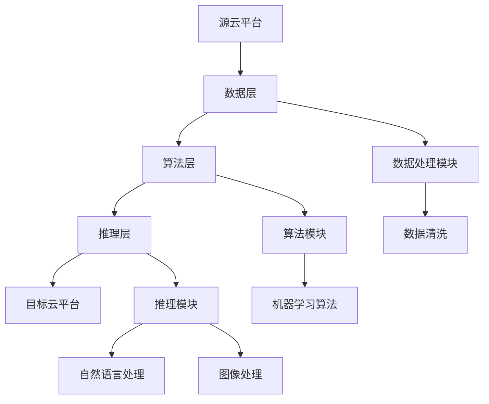

                 

### 引言

#### 云平台与AI：融合的未来

在当今快速发展的数字化时代，云计算与人工智能（AI）正逐渐成为各行各业的核心驱动力。云平台为企业提供了弹性、可扩展的计算资源，而AI技术则赋予了系统智能处理数据的能力。这两者的结合不仅提升了企业的效率，还为创新提供了无限可能。

随着云计算市场的不断成熟，企业面临着云平台间迁移的挑战。如何降低迁移成本、确保数据安全和系统稳定，成为企业决策者急需解决的问题。在这一背景下，Lepton AI的云迁移方案应运而生，旨在帮助企业实现无缝的云平台间迁移，同时优化用户体验。

本文将深入探讨Lepton AI的云迁移方案，通过详细的步骤解析和案例研究，揭示其在降低迁移成本、实现无缝交互体验方面的独特优势。我们将首先介绍AI与云平台迁移的基础知识，然后详细解析Lepton AI的技术原理和架构，最后讨论云平台迁移方案的设计和实施，并分享实际案例和未来展望。

#### 核心关键词

- **AI与云平台迁移**
- **Lepton AI技术**
- **云平台间数据迁移**
- **降低迁移成本**
- **无缝交互体验**

#### 文章摘要

本文旨在探讨Lepton AI的云迁移方案，分析其在降低云平台间迁移成本和实现无缝交互体验方面的优势。通过介绍AI与云平台迁移的基础知识，详细解析Lepton AI的技术原理和架构，以及云平台迁移方案的设计与实施，本文旨在为企业提供实用的迁移策略和最佳实践。通过案例研究，我们将展示Lepton AI在实际项目中的应用效果，并展望未来云平台迁移和交互体验的发展趋势。

---

### 第一部分：AI与云平台迁移基础

#### 第1章：AI与云平台迁移概述

##### 1.1 AI与云平台的联系

在讨论AI与云平台的迁移之前，首先需要了解它们之间的密切联系。AI技术依赖于大量的数据和高性能计算资源进行训练和推理，而云平台正好提供了这些资源。以下是AI与云平台之间的主要联系：

**1.1.1 AI技术在云平台中的应用**

- **数据分析与处理：** 云平台提供了强大的计算能力，使得大规模数据分析和机器学习变得可行。
- **模型训练与推理：** 云平台上的高性能计算资源可以加速AI模型的训练过程，提高推理速度。
- **分布式计算：** 云平台的分布式计算能力使得AI系统能够处理大规模的并发任务。

**1.1.2 云平台在AI解决方案中的作用**

- **弹性扩展：** 云平台可以根据AI系统的需求动态扩展或缩减资源，确保系统稳定运行。
- **数据存储与安全性：** 云平台提供了高效的数据存储方案和强大的安全性保障，保护AI系统的数据安全。
- **灵活部署：** 云平台使得AI解决方案可以快速部署和扩展，适应不同的业务场景。

**1.1.3 AI与云平台迁移的重要性**

随着企业业务的发展，可能需要在不同云平台之间迁移AI系统。迁移的重要性体现在以下几个方面：

- **降低成本：** 通过优化资源分配，降低计算和存储成本。
- **提升效率：** 系统的迁移可以提升数据处理和分析的效率，优化业务流程。
- **提高用户体验：** 迁移后的系统可以提供更稳定、更高效的服务，提升用户体验。

##### 1.2 云平台迁移的概念

云平台迁移是指将应用程序、数据和服务从现有的云平台转移到另一个云平台的过程。以下是云平台迁移的一些关键概念：

**1.2.1 云平台定义与分类**

- **云平台定义：** 云平台是一种提供计算、存储、网络和其他IT资源的远程服务。
- **云平台分类：** 根据服务类型，云平台可以分为IaaS（基础设施即服务）、PaaS（平台即服务）和SaaS（软件即服务）。

**1.2.2 迁移策略与方案**

- **迁移策略：** 迁移策略包括直接迁移、逐步迁移和混合迁移等，不同策略适用于不同的业务场景。
- **迁移方案：** 迁移方案涉及迁移目标设定、风险评估、资源分配和执行步骤等。

**1.2.3 迁移过程中的挑战**

- **数据迁移：** 如何确保数据在迁移过程中的一致性和完整性。
- **兼容性问题：** 不同云平台之间可能存在技术差异，导致兼容性问题。
- **成本控制：** 迁移过程中需要有效控制成本，避免预算超支。

##### 1.3 AI与云平台迁移的价值

AI与云平台迁移不仅带来了技术上的提升，还具有重要的商业价值：

**1.3.1 降低成本**

通过优化资源使用和减少重复投资，企业可以显著降低运营成本。例如，使用云平台提供的弹性资源可以避免在高峰期过度采购硬件资源。

**1.3.2 提升效率**

迁移后的系统可以更高效地处理数据，缩短任务完成时间。例如，利用分布式计算能力可以加速机器学习模型的训练过程。

**1.3.3 优化用户体验**

通过迁移到更稳定、更高效的云平台，用户可以获得更流畅、更可靠的体验。例如，AI驱动的应用可以提供更准确、更快速的结果。

#### 第一部分总结

本章节介绍了AI与云平台迁移的基础知识，包括它们之间的联系、迁移的概念和重要性。接下来，我们将深入探讨Lepton AI的技术原理和架构，为后续的云迁移方案设计奠定基础。

---

### 第二部分：Lepton AI技术深度解析

#### 第2章：Lepton AI概述

##### 2.1 Lepton AI简介

Lepton AI是一种先进的人工智能系统，致力于提供高效的机器学习、自然语言处理和图像处理能力。以下是对Lepton AI的简要介绍：

**2.1.1 Lepton AI的发展历程**

- **早期研究：** Lepton AI起源于对机器学习和深度学习技术的早期研究，其核心团队由多位计算机科学领域的专家组成。
- **产品化：** 经过多年的研发和优化，Lepton AI逐渐从实验室走向市场，成为企业级AI解决方案的佼佼者。

**2.1.2 Lepton AI的核心技术**

- **机器学习：** Lepton AI采用了先进的机器学习算法，包括深度神经网络、支持向量机和强化学习等，能够处理大规模的数据并生成准确的预测。
- **自然语言处理：** Lepton AI具备强大的自然语言处理能力，能够理解和生成人类语言，支持多语言处理和语义分析。
- **图像处理：** 通过深度学习技术，Lepton AI能够对图像进行分类、识别和增强，广泛应用于计算机视觉领域。

##### 2.2 Lepton AI架构

Lepton AI的设计采用了模块化的架构，使得其功能可以灵活扩展和集成。以下是Lepton AI的基本结构和关键模块：

**2.2.1 Lepton AI的基本结构**

- **数据层：** 负责数据的采集、存储和管理，包括数据预处理、清洗和归一化等操作。
- **算法层：** 包含各种机器学习算法和深度学习模型，如神经网络、卷积神经网络和循环神经网络等。
- **推理层：** 负责对输入数据进行处理和预测，生成相应的输出结果。

**2.2.2 Lepton AI的关键模块**

- **机器学习模块：** 提供各种机器学习算法的实现，支持分类、回归、聚类等任务。
- **自然语言处理模块：** 包括词嵌入、序列模型、文本分类和翻译等模块，支持多种语言处理任务。
- **图像处理模块：** 利用卷积神经网络和目标检测算法，提供图像分类、识别和增强等功能。

##### 2.3 Lepton AI功能特点

Lepton AI的功能特点体现在其强大的机器学习能力、自然语言处理能力和图像处理能力上：

**2.3.1 机器学习能力**

- **高效训练：** Lepton AI采用了分布式训练技术，能够快速处理大规模数据，缩短训练时间。
- **灵活部署：** 支持多种编程语言和框架，如Python、TensorFlow和PyTorch，方便集成到不同的应用场景。

**2.3.2 自然语言处理能力**

- **多语言支持：** 支持多种语言的文本处理，包括中文、英文、法语和西班牙语等。
- **语义理解：** 能够深入理解文本的语义，进行文本分类、情感分析和信息提取。

**2.3.3 图像处理能力**

- **高精度识别：** 能够对图像进行准确分类和识别，支持物体检测、人脸识别和图像增强等功能。
- **实时处理：** 支持实时图像处理，适用于视频监控、自动驾驶和医疗诊断等领域。

#### 第二部分总结

本章节详细介绍了Lepton AI的概述、架构和功能特点。通过这一分析，我们可以更好地理解Lepton AI在云平台迁移中的潜在应用和价值。接下来，我们将深入探讨云平台迁移方案的设计和实施。

---

### 第三部分：云平台迁移方案设计

#### 第3章：迁移方案规划

##### 3.1 迁移规划概述

在制定云平台迁移方案之前，需要明确迁移的目标、评估风险和分配资源。以下是迁移规划的关键要素：

**3.1.1 迁移目标设定**

- **业务需求分析：** 确定迁移方案需要满足的业务需求和目标，如提高系统性能、降低成本或扩展功能。
- **技术目标分析：** 确定迁移过程中需要实现的技术目标，如兼容性、性能和安全性。

**3.1.2 迁移风险评估**

- **风险识别：** 识别可能出现的风险，如数据丢失、系统不稳定或兼容性问题。
- **风险分析：** 对识别出的风险进行详细分析，评估其影响和可能性。
- **风险管理：** 制定风险管理策略，如数据备份、安全控制和应急计划。

**3.1.3 迁移资源分配**

- **人力资源：** 分配专门的团队负责迁移工作，确保项目顺利进行。
- **技术资源：** 准备必要的工具和技术，如迁移工具、数据库迁移工具和开发框架。
- **时间资源：** 制定详细的迁移时间表，确保按时完成迁移任务。

##### 3.2 迁移路径选择

根据不同的业务需求和技术条件，可以选择不同的迁移路径。以下是常见的迁移路径：

**3.2.1 直接迁移**

- **优势：** 迁移速度快，操作简单。
- **适用场景：** 应用程序和数据的规模较小，迁移需求迫切。

**3.2.2 逐步迁移**

- **优势：** 风险较低，可以逐步优化和调整。
- **适用场景：** 应用程序和数据的规模较大，需要逐步调整和优化。

**3.2.3 混合迁移**

- **优势：** 结合了直接迁移和逐步迁移的优点，适用于复杂场景。
- **适用场景：** 应用程序和数据分布在不同云平台，需要灵活迁移。

##### 3.3 迁移实施步骤

迁移实施是一个复杂的过程，需要精心规划和管理。以下是常见的迁移实施步骤：

**3.3.1 预备工作**

- **需求分析与规划：** 明确迁移目标和需求，制定详细的迁移计划。
- **资源准备：** 准备必要的硬件、软件和网络资源，确保迁移顺利进行。
- **风险评估与控制：** 进行全面的风险评估，制定风险控制策略。

**3.3.2 迁移执行**

- **数据迁移：** 使用迁移工具将数据从源云平台迁移到目标云平台，确保数据的一致性和完整性。
- **应用迁移：** 迁移应用程序，包括配置、部署和测试，确保应用程序在目标云平台上正常运行。
- **系统集成：** 将迁移后的应用程序与现有系统集成，确保整体系统的稳定性。

**3.3.3 迁移后评估**

- **性能评估：** 对迁移后的系统进行性能评估，确保达到预期的性能指标。
- **用户体验评估：** 评估用户对迁移后系统的满意度，收集用户反馈。
- **优化与调整：** 根据评估结果进行优化和调整，确保系统的长期稳定运行。

#### 第三部分总结

本章节详细介绍了云平台迁移方案规划的内容，包括迁移目标的设定、风险评估和资源分配，以及迁移路径的选择和实施步骤。通过合理的迁移规划，企业可以降低迁移风险，确保迁移过程的顺利进行。接下来，我们将深入探讨云平台间数据迁移的技术细节。

---

### 第4章：云平台间数据迁移

#### 4.1 数据迁移概述

云平台间数据迁移是云平台迁移过程中的关键环节，涉及到数据的一致性、完整性和安全性。以下是数据迁移的重要概念和内容：

**4.1.1 数据迁移的重要性**

- **业务连续性：** 数据迁移确保业务在迁移过程中不受中断，保持连续性。
- **数据安全性：** 数据在迁移过程中需要得到有效保护，防止数据泄露和丢失。
- **数据一致性：** 数据在源云平台和目标云平台之间需要保持一致，确保数据的准确性。

**4.1.2 数据迁移的类型**

- **结构化数据迁移：** 主要涉及关系型数据库、NoSQL数据库等结构化数据的迁移。
- **非结构化数据迁移：** 主要涉及文档、图像、视频等非结构化数据的迁移。
- **混合数据迁移：** 同时涉及结构化和非结构化数据的迁移。

#### 4.2 数据迁移策略

数据迁移策略的制定直接影响到迁移的效率和安全性。以下是几种常见的数据迁移策略：

**4.2.1 数据清洗**

- **目标：** 清除数据中的错误、重复和冗余信息，提高数据质量。
- **方法：** 使用数据清洗工具和算法，如数据去重、数据修复和数据标准化。

**4.2.2 数据转换**

- **目标：** 将数据从源格式转换为目标格式，使其适应目标系统的要求。
- **方法：** 使用数据转换工具和脚本，如数据格式转换、字段映射和关系映射。

**4.2.3 数据传输**

- **目标：** 将清洗和转换后的数据从源云平台迁移到目标云平台。
- **方法：** 使用数据传输工具和协议，如FTP、HTTP、REST API和数据库同步工具。

#### 4.3 数据迁移技术

数据迁移技术是实现数据迁移的核心，涉及到多种技术和工具。以下是几种常见的数据迁移技术：

**4.3.1 REST API**

- **优点：** 简单易用，支持多种编程语言。
- **应用场景：** 用于迁移结构化数据，如关系型数据库和NoSQL数据库。

**4.3.2 数据库同步**

- **优点：** 实时同步数据，保证数据一致性。
- **应用场景：** 用于迁移关系型数据库，如MySQL、Oracle和SQL Server。

**4.3.3 云存储服务迁移**

- **优点：** 灵活配置存储资源，支持多种数据类型。
- **应用场景：** 用于迁移非结构化数据，如文档、图像和视频。

#### 4.4 数据迁移案例分析

以下是一个实际的数据迁移案例分析，展示数据迁移的具体实施过程：

**案例背景：** 一家互联网公司需要将现有的数据库迁移到新的云平台，以降低运营成本和提高系统性能。

**迁移策略：** 采用逐步迁移策略，首先进行数据清洗和转换，然后使用数据库同步工具进行数据传输。

**实施步骤：**

1. **需求分析：** 明确迁移目标和需求，制定详细的迁移计划。
2. **数据清洗：** 使用数据清洗工具清除数据中的错误和冗余信息。
3. **数据转换：** 使用数据转换工具将数据从源格式转换为数据库支持的目标格式。
4. **数据库同步：** 使用数据库同步工具实时同步数据，确保数据一致性。
5. **测试与验证：** 对迁移后的数据库进行测试和验证，确保数据完整性和准确性。
6. **优化与调整：** 根据测试结果进行优化和调整，确保系统性能。

**实施效果：** 通过逐步迁移策略，成功将数据库迁移到新的云平台，实现了降低运营成本和提高系统性能的目标。

#### 4.5 数据迁移的挑战与解决方案

数据迁移过程中可能会遇到各种挑战，以下是几种常见挑战及其解决方案：

**4.5.1 数据量巨大**

- **解决方案：** 采用分布式迁移技术，将数据分成多个部分同时迁移，提高迁移速度。

**4.5.2 数据格式不兼容**

- **解决方案：** 使用数据转换工具和脚本，将源数据格式转换为目标数据格式，确保兼容性。

**4.5.3 数据安全性**

- **解决方案：** 在迁移过程中使用加密技术和安全协议，确保数据在传输过程中的安全性。

#### 4.6 数据迁移的最佳实践

以下是数据迁移的最佳实践，可以帮助企业提高数据迁移的成功率：

**4.6.1 制定详细的迁移计划**

- 明确迁移目标、步骤和时间表，确保迁移过程有序进行。

**4.6.2 进行全面的风险评估**

- 识别潜在的迁移风险，制定风险应对策略。

**4.6.3 使用专业工具和团队**

- 使用专业的数据迁移工具和团队，确保数据迁移的质量和效率。

**4.6.4 进行充分的测试和验证**

- 在迁移完成后对数据进行全面的测试和验证，确保数据的一致性和完整性。

#### 第4章总结

本章详细介绍了云平台间数据迁移的概述、策略、技术和案例。通过合理的迁移策略和有效的技术手段，企业可以成功实现数据的一致性、完整性和安全性。接下来，我们将探讨AI应用的迁移策略和实施步骤。

---

### 第5章：AI应用迁移

#### 5.1 AI应用概述

AI应用在不同云平台之间的迁移是一个复杂的过程，涉及到算法、模型和数据的一致性和兼容性。以下是对AI应用迁移的概述：

**5.1.1 AI应用在不同云平台的适应性**

AI应用通常依赖于特定的算法和模型，这些算法和模型在不同的云平台中可能存在差异。因此，在迁移过程中需要考虑平台的兼容性，确保应用能够正常运行。

**5.1.2 AI应用的迁移难点**

- **算法和模型迁移：** 不同云平台的算法和模型支持可能不同，需要调整或重新实现算法和模型。
- **数据迁移：** AI应用依赖于大量训练数据，如何确保数据在迁移过程中的一致性和完整性是一个挑战。
- **性能优化：** 迁移后的AI应用需要保证性能不受影响，甚至需要优化以适应新的云平台。

#### 5.2 AI应用迁移策略

为了确保AI应用在不同云平台之间顺利迁移，可以采用以下策略：

**5.2.1 代码迁移**

- **目标：** 将AI应用的代码从源平台迁移到目标平台。
- **方法：** 使用容器化技术，如Docker，将应用打包成独立的容器，确保环境一致。

**5.2.2 模型迁移**

- **目标：** 将AI模型从源平台迁移到目标平台。
- **方法：** 使用模型转换工具，如TensorFlow Serving或ONNX Runtime，将模型转换为目标平台支持的格式。

**5.2.3 服务迁移**

- **目标：** 将AI应用的部署和服务从源平台迁移到目标平台。
- **方法：** 使用云平台提供的自动化部署工具和微服务架构，确保服务的高可用性和可扩展性。

#### 5.3 AI应用迁移实施

以下是AI应用迁移的具体实施步骤：

**5.3.1 迁移准备**

- **需求分析：** 明确迁移的目标和需求，制定详细的迁移计划。
- **环境准备：** 确保目标平台的环境与源平台一致，包括硬件、软件和配置。
- **数据备份：** 在迁移前备份源平台的数据，确保数据的安全。

**5.3.2 迁移执行**

- **代码迁移：** 使用容器化技术将代码迁移到目标平台，并确保其能够在目标平台上正常运行。
- **模型迁移：** 使用模型转换工具将模型从源平台迁移到目标平台，并进行测试和验证。
- **服务迁移：** 将AI应用的服务从源平台迁移到目标平台，包括配置、部署和监控。

**5.3.3 迁移后优化**

- **性能优化：** 对迁移后的AI应用进行性能测试和调优，确保其达到预期的性能指标。
- **用户体验优化：** 根据用户反馈进行界面和交互的优化，提升用户体验。

#### 5.4 AI应用迁移案例分析

以下是一个AI应用迁移的案例分析：

**案例背景：** 一家金融科技公司需要将其基于TensorFlow开发的AI应用从AWS迁移到Azure，以降低成本并提高灵活性。

**迁移策略：**

1. **代码迁移：** 使用Docker容器化技术，将应用打包成镜像，确保环境一致。
2. **模型迁移：** 使用TensorFlow Serving将TensorFlow模型转换为ONNX格式，然后使用ONNX Runtime在Azure上运行。
3. **服务迁移：** 使用Azure的自动化部署工具，将服务部署到Azure云平台上。

**实施步骤：**

1. **需求分析与规划：** 制定详细的迁移计划，明确迁移目标和时间表。
2. **环境准备：** 在Azure上配置与AWS相同的环境和配置。
3. **代码迁移：** 将Docker容器迁移到Azure容器实例。
4. **模型迁移：** 转换TensorFlow模型为ONNX格式，并在Azure上运行。
5. **服务迁移：** 部署AI应用的服务到Azure云平台上。
6. **性能优化：** 对迁移后的AI应用进行性能测试和调优。

**实施效果：** 成功将AI应用从AWS迁移到Azure，实现了降低成本和提高灵活性的目标，同时保持了应用的高性能和用户体验。

#### 5.5 AI应用迁移的挑战与解决方案

AI应用迁移过程中可能会遇到以下挑战：

**5.5.1 兼容性问题**

- **解决方案：** 使用跨平台的开发框架和工具，如TensorFlow和PyTorch，确保应用的兼容性。

**5.5.2 性能问题**

- **解决方案：** 对迁移后的应用进行性能测试和优化，确保其在目标平台上的性能。

**5.5.3 数据问题**

- **解决方案：** 在迁移前对数据进行清洗和预处理，确保数据的一致性和完整性。

#### 5.6 AI应用迁移的最佳实践

以下是AI应用迁移的最佳实践：

**5.6.1 使用容器化技术**

- **优势：** 提高迁移的灵活性和可重复性。
- **应用场景：** 适用于所有类型的AI应用迁移。

**5.6.2 进行充分的测试**

- **优势：** 提高迁移的成功率和稳定性。
- **应用场景：** 在迁移完成后对应用进行全面的测试和验证。

**5.6.3 优化迁移流程**

- **优势：** 提高迁移的效率和效果。
- **应用场景：** 在迁移过程中逐步优化流程，减少手动操作。

#### 第5章总结

本章详细介绍了AI应用的迁移策略、实施步骤和案例分析。通过合理的迁移策略和有效的实施步骤，企业可以成功实现AI应用在不同云平台之间的迁移。接下来，我们将探讨如何降低云平台迁移成本。

---

### 第四部分：降低迁移成本与优化

#### 第6章：降低迁移成本策略

在云平台迁移过程中，成本控制是一个至关重要的环节。以下是一些有效的成本降低策略：

**6.1 成本分析**

- **成本构成：** 迁移成本通常包括人力资源、技术工具、硬件设备和运营费用等。
- **成本控制方法：** 通过详细的成本分析和预算规划，可以有效地控制迁移成本。

**6.2 成本降低策略**

- **云服务优化：** 通过合理配置云资源，避免资源浪费。例如，使用云平台提供的自动化工具进行资源管理，优化虚拟机和存储资源的使用。
- **自主开发与开源利用：** 开发自定义工具和利用开源软件可以减少对商业软件的依赖，降低成本。
- **迁移工具与平台选择：** 选择合适的数据迁移工具和云平台，可以降低技术支持和培训成本。

#### 第7章：迁移过程优化

为了提高云平台迁移的效率和质量，需要进行迁移过程的优化。以下是一些优化方法：

**7.1 迁移过程优化目标**

- **迁移速度提升：** 减少迁移时间，加快业务恢复。
- **迁移稳定性保障：** 确保数据在迁移过程中的一致性和完整性。
- **迁移成本优化：** 在保证质量和稳定性的前提下，降低迁移成本。

**7.2 迁移过程优化方法**

- **迁移脚本优化：** 对迁移脚本进行优化，提高迁移速度和效率。
- **部署流程优化：** 通过自动化部署工具和脚本，简化部署流程，减少手动操作。
- **迁移后监控与调整：** 在迁移后对系统进行实时监控，及时发现并解决问题，确保系统的稳定运行。

#### 第6章与第7章总结

通过合理的成本降低策略和迁移过程优化，企业可以在云平台迁移过程中实现成本效益的最大化。合理的成本控制和流程优化不仅能够降低迁移成本，还能提高迁移效率和质量，确保系统的长期稳定运行。接下来，我们将探讨无缝交互体验设计的原则和实践。

---

### 第五部分：无缝交互体验设计

#### 第8章：无缝交互体验设计原则

无缝交互体验设计旨在为用户提供流畅、直观且高效的使用体验。以下是设计无缝交互体验的几个关键原则：

**8.1 用户体验重要性**

- **用户体验定义：** 用户体验是指用户在使用产品或服务过程中的感受和体验。
- **用户体验价值：** 优秀的用户体验能够提高用户满意度、忠诚度和转化率，对企业的长期发展具有重要意义。

**8.2 设计原则**

- **一致性：** 系统的界面和交互方式应保持一致，使用户在不同场景下都能获得相同的体验。
- **可访问性：** 设计应考虑到所有用户，包括老年人、残障人士和移动设备用户，确保系统对所有用户都是可访问的。
- **易用性：** 界面和交互设计应简单直观，降低用户的认知负荷，提高操作效率。

#### 第9章：交互体验优化实践

为了实现无缝交互体验，需要进行一系列的交互体验优化实践。以下是一些具体的方法：

**9.1 用户行为分析**

- **用户需求调研：** 通过用户访谈、问卷调查和用户反馈收集用户需求，了解用户的期望和痛点。
- **用户行为追踪：** 使用分析工具追踪用户的行为，收集用户在使用系统时的操作数据，以便进行优化。

**9.2 交互设计优化**

- **界面优化：** 对界面的布局、色彩和字体进行优化，提高视觉效果和用户满意度。
- **动画与反馈优化：** 使用动画和反馈机制来引导用户操作，提供实时反馈，增强用户体验。
- **性能优化：** 通过优化系统性能，减少加载时间，提高系统的响应速度。

#### 第10章：无缝交互体验评估

评估无缝交互体验的质量对于确保设计目标实现至关重要。以下是一些评估方法：

**10.1 评估指标设定**

- **用户满意度评估：** 通过用户满意度调查和反馈，了解用户对系统的整体满意度和具体方面的感受。
- **系统性能评估：** 通过性能测试和监控，评估系统的响应时间、稳定性和可靠性。

**10.2 评估方法**

- **问卷调查：** 通过设计问卷，收集用户的反馈和建议，分析用户体验。
- **实际用户测试：** 邀请真实用户参与测试，观察他们的操作行为和反馈。
- **数据分析：** 使用分析工具，如热图和用户行为分析工具，分析用户在系统中的行为模式。

#### 第五部分总结

通过遵循无缝交互体验设计的原则和进行详细的优化实践，企业可以显著提升用户的满意度和使用体验。评估无缝交互体验的质量，可以帮助企业不断改进设计，实现更好的用户交互效果。接下来，我们将通过实际案例研究，展示这些原则和实践在实际项目中的应用效果。

---

### 第六部分：案例研究

#### 第11章：案例研究一：企业X的迁移实践

**11.1 案例背景**

企业X是一家领先的电子商务公司，拥有庞大的用户数据和复杂的后台系统。随着业务的发展，企业X决定将现有的系统从本地服务器迁移到云平台，以提高系统的扩展性和可靠性。

**11.2 迁移前的挑战**

- **系统性能瓶颈：** 本地服务器无法满足不断增长的业务需求，导致系统响应时间过长，用户体验不佳。
- **数据安全性：** 本地数据存储存在安全隐患，需要更加专业的数据安全解决方案。
- **运营成本高：** 本地服务器的维护和升级成本较高，不利于企业的长期发展。

**11.3 迁移方案设计**

企业X采用了Lepton AI的云迁移方案，制定了详细的迁移计划：

- **迁移目标：** 提高系统性能、增强数据安全性和降低运营成本。
- **迁移路径：** 采用逐步迁移策略，首先迁移数据，然后迁移应用程序和服务，最后进行系统集成和优化。
- **技术手段：** 使用Lepton AI的数据迁移工具和自动化部署工具，确保数据的一致性和系统的高可用性。

**11.4 迁移实施步骤**

- **预备工作：** 制定详细的迁移计划和风险评估，备份现有数据，准备迁移所需的工具和资源。
- **数据迁移：** 使用Lepton AI的数据迁移工具，将数据从本地服务器迁移到云存储服务，并进行数据清洗和转换。
- **应用迁移：** 使用自动化部署工具，将应用程序和服务迁移到云平台，并进行测试和验证。
- **系统集成：** 将迁移后的应用程序与现有的系统集成，确保数据和服务的一致性。

**11.5 迁移实施效果**

- **系统性能提升：** 迁移后的系统性能显著提升，响应时间缩短，用户满意度提高。
- **数据安全性增强：** 云平台提供了更高的数据安全性和可靠性，企业不再担心数据泄露和丢失。
- **运营成本降低：** 通过使用云服务，企业X降低了硬件维护和升级的成本，同时实现了弹性扩展。

#### 第12章：案例研究二：提升交互体验的实践

**12.1 案例背景**

企业Y是一家在线教育平台，用户数量庞大且增长迅速。为了提升用户体验，企业Y决定对现有的学习平台进行优化，实现无缝交互体验。

**12.2 优化策略**

- **用户行为分析：** 通过对用户行为的分析，了解用户的需求和行为模式，为交互设计提供依据。
- **界面优化：** 对平台的界面进行优化，提高视觉吸引力和操作便捷性。
- **性能优化：** 通过优化系统性能，减少加载时间和响应时间，提升用户体验。
- **用户反馈：** 通过用户反馈和测试，不断改进交互设计，确保设计符合用户期望。

**12.3 优化实践**

- **用户行为分析：** 使用分析工具追踪用户在平台上的行为，收集用户数据。
- **界面优化：** 重新设计平台的导航栏、课程列表和视频播放界面，提高视觉效果和用户体验。
- **动画与反馈：** 添加动画效果和操作反馈，引导用户进行操作，提高用户满意度。
- **性能优化：** 通过优化服务器和数据库性能，减少加载时间和数据传输延迟。

**12.4 优化效果**

- **用户满意度提高：** 通过优化交互设计，用户满意度显著提升，用户活跃度增加。
- **学习效率提升：** 优化后的平台提高了用户的学习效率，减少了用户的学习时间。
- **平台竞争力增强：** 优化后的平台在用户体验方面更具竞争力，吸引了更多用户和合作伙伴。

#### 第六部分总结

通过案例研究，我们可以看到Lepton AI的云迁移方案和无缝交互体验设计在实际项目中的应用效果。企业X通过迁移实践提高了系统性能和数据安全性，降低了运营成本；企业Y通过优化交互设计提升了用户体验和学习效率。这些案例为我们提供了宝贵的经验和启示，指导企业在云平台迁移和交互体验优化方面取得成功。

---

### 第七部分：未来展望

#### 第13章：未来发展趋势

随着AI和云计算技术的不断进步，云平台间的迁移和交互体验将迎来新的发展趋势。以下是对未来发展的展望：

**13.1 AI与云平台发展的趋势**

- **AI技术的进步：** AI技术将继续向更高精度、更快速和更灵活的方向发展，为云平台迁移提供更强的支持。
- **云计算的发展趋势：** 云计算将继续向边缘计算、混合云和多云方向演进，为AI应用提供更广泛和灵活的计算资源。

**13.2 云平台间迁移的挑战与机遇**

- **挑战：** 随着迁移规模的扩大，兼容性、数据安全和性能优化等问题将更加突出。
- **机遇：** 云平台间的迁移为技术集成、创新和优化提供了广阔的空间，为企业提供更多的发展机遇。

#### 第14章：未来研究方向

为了应对未来云平台间迁移和交互体验的挑战，以下研究方向具有重要意义：

**14.1 迁移成本控制**

- **研究方向：** 探索新的成本预测和优化方法，提高迁移过程中的成本效益。
- **方法：** 使用机器学习和数据挖掘技术，分析迁移过程中的成本数据，提出优化策略。

**14.2 无缝交互体验**

- **研究方向：** 研究如何通过人工智能和用户行为分析，实现更智能、更个性化的交互体验。
- **方法：** 使用自然语言处理、计算机视觉和深度学习等技术，提升交互体验的智能化水平。

#### 第七部分总结

未来，云平台间的迁移和交互体验将面临更多挑战，但同时也蕴含着巨大的机遇。通过不断的技术创新和研究，我们有望实现更高效、更安全、更智能的云平台迁移和交互体验，为企业和用户提供更好的服务。

---

### 结论

通过本文的深入探讨，我们系统地介绍了Lepton AI的云迁移方案及其在降低迁移成本和实现无缝交互体验方面的优势。首先，我们回顾了AI与云平台迁移的基础知识，包括它们之间的联系、迁移的概念和重要性。接着，我们详细解析了Lepton AI的技术原理和架构，展示了其强大的机器学习、自然语言处理和图像处理能力。

在迁移方案设计方面，我们提出了详细的规划、路径选择和实施步骤，帮助企业实现高效的云平台迁移。此外，我们详细讨论了数据迁移和AI应用迁移的策略和技术，提供了实际案例和最佳实践。在降低迁移成本和优化迁移过程方面，我们提出了一系列策略和方法，以提高迁移效率和成本效益。

最后，我们通过无缝交互体验设计原则和优化实践，强调了用户体验的重要性，并提供了评估方法和未来研究方向。通过案例研究，我们展示了Lepton AI在实际项目中的应用效果，为企业提供了宝贵的经验和启示。

总之，Lepton AI的云迁移方案为企业在云平台迁移和交互体验优化方面提供了强有力的支持。随着AI和云计算技术的不断发展，我们期待看到更多创新和优化，助力企业实现更高的效率和更好的用户体验。让我们共同期待这一美好未来的到来。

### 作者信息

**作者：** AI天才研究院/AI Genius Institute & 禅与计算机程序设计艺术 /Zen And The Art of Computer Programming

---

### 附录：技术细节与代码示例

在本节中，我们将提供一些关键技术的细节和代码示例，以帮助读者更好地理解文章中的概念和实现方法。

#### Mermaid 流程图

以下是一个Mermaid流程图示例，用于展示AI与云平台迁移的基本架构：



#### 核心算法原理讲解与伪代码

以下是使用伪代码展示的一种常见的机器学习算法——线性回归的基本原理：

```pseudo
// 线性回归伪代码

// 输入：数据集 X, Y，学习率 alpha，迭代次数 n
// 输出：回归模型参数 w

// 初始化权重向量 w
w = [0, 0]

// 迭代过程
for i from 1 to n do
    // 计算预测值 y_hat
    y_hat = w * X

    // 计算损失函数
    loss = (y_hat - Y)^2

    // 计算梯度
    gradient = 2 * (y_hat - Y) * X

    // 更新权重
    w = w - alpha * gradient
end for

return w
```

#### 数学模型与公式

以下是线性回归的损失函数和梯度下降更新公式的LaTeX表示：

```latex
\begin{align*}
J(\theta) &= \frac{1}{2m} \sum_{i=1}^{m} (h_\theta(x^{(i)}) - y^{(i)})^2, \\
\theta_j &= \theta_j - \alpha \frac{1}{m} \sum_{i=1}^{m} (h_\theta(x^{(i)}) - y^{(i)}) \cdot x_j^{(i)}.
\end{align*}
```

#### 代码实际案例与详细解读

以下是一个简单的Python代码示例，用于展示如何使用TensorFlow进行线性回归：

```python
import tensorflow as tf
import numpy as np

# 创建模拟数据集
X = np.random.rand(100, 1)
Y = 2 * X + 1 + np.random.rand(100, 1)

# 创建模型
W = tf.Variable(0.0, name='weight')
b = tf.Variable(0.0, name='bias')
y = tf.add(tf.multiply(W, X), b)

# 定义损失函数
loss = tf.reduce_mean(tf.square(y - Y))

# 定义优化器
optimizer = tf.train.GradientDescentOptimizer(learning_rate=0.5)
train_op = optimizer.minimize(loss)

# 运行会话
with tf.Session() as sess:
    sess.run(tf.global_variables_initializer())

    for step in range(201):
        sess.run(train_op)
        if step % 20 == 0:
            print(f"Step {step}: W = {W.eval()}, b = {b.eval()}, Loss = {loss.eval()}")

# 输出结果
print(f"Final W: {W.eval()}, b: {b.eval()}")
```

此代码创建了一个简单的线性回归模型，使用梯度下降优化器来最小化损失函数。每次迭代都会更新模型的权重和偏置，并打印出相关的结果。

通过这些技术细节和代码示例，读者可以更好地理解本文中讨论的核心概念和实现方法。这些资源不仅有助于加深对理论知识的理解，还为实际编程和开发提供了参考。希望这些内容能够为读者在云平台迁移和AI应用开发中带来启发和帮助。

