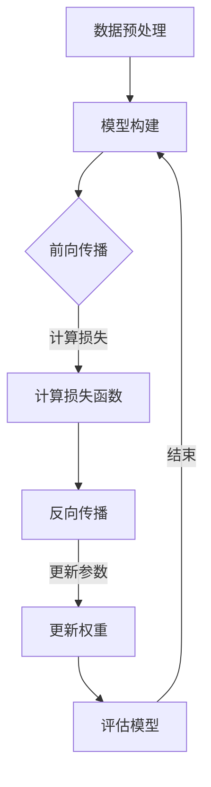
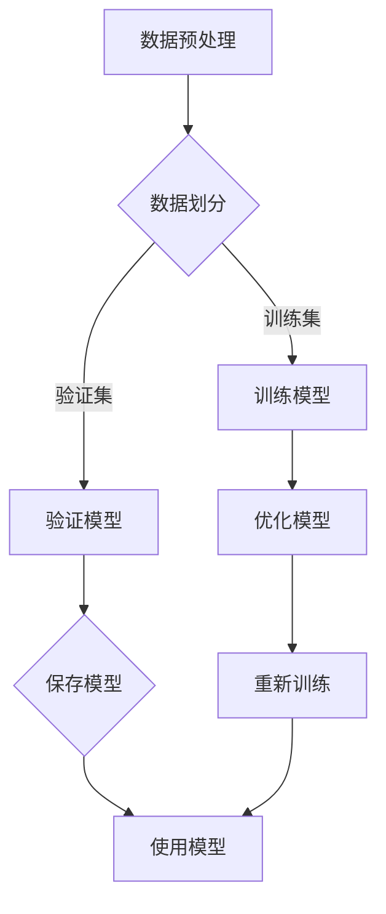

                 

# 《Micrograd：深入理解机器学习和反向传播》

## 摘要

本文旨在深入探讨机器学习和反向传播算法的核心原理，并介绍Micrograd——一个易于理解且实用的深度学习框架。通过逐步分析机器学习的基础、神经网络的结构、反向传播算法的细节、微分计算与自动微分技术，以及Micrograd的实际应用，本文将帮助读者全面掌握深度学习的核心知识和实践技能。同时，文章还探讨了机器学习的社会责任问题，并展望了深度学习未来的发展趋势和Micrograd的潜力。

## 目录大纲

### 第1章 引言
- 1.1 书籍背景与目的
- 1.2 机器学习和反向传播的重要性

### 第2章 机器学习基础
- 2.1 机器学习概述
- 2.2 监督学习、无监督学习和强化学习
- 2.3 数据预处理与特征工程

### 第3章 神经网络基础
- 3.1 神经网络概述
- 3.2 神经元与感知器
- 3.3 前向传播与反向传播

### 第4章 反向传播算法详解
- 4.1 反向传播原理
- 4.2 梯度下降算法
- 4.3 梯度下降优化技巧

### 第5章 微分计算与自动微分
- 5.1 微分计算基础
- 5.2 自动微分原理
- 5.3 自动微分库的使用

### 第6章 Micrograd 深度学习框架
- 6.1 Micrograd 介绍
- 6.2 Micrograd 的架构与模块
- 6.3 Micrograd 实践操作

### 第7章 项目实战：使用 Micrograd 开发深度学习模型
- 7.1 实战项目概述
- 7.2 数据集准备与预处理
- 7.3 模型设计与训练
- 7.4 模型评估与优化

### 第8章 Micrograd 的拓展应用
- 8.1 微调与迁移学习
- 8.2 模型压缩与量化
- 8.3 微型神经网络研究

### 第9章 机器学习道德与社会责任
- 9.1 机器学习的伦理问题
- 9.2 机器学习的公正性和公平性
- 9.3 社会责任与未来发展

### 第10章 总结与展望
- 10.1 全书回顾
- 10.2 深度学习的发展趋势
- 10.3 Micrograd 的未来潜力

### 附录
- A.1 Micrograd 源代码解析
- A.2 机器学习资源推荐
- A.3 Mermaid 流程图示例

## 第1章 引言

### 1.1 书籍背景与目的

在当今数字化时代，机器学习已经成为推动科技进步和社会发展的关键力量。本书旨在深入探讨机器学习中的核心算法——反向传播，并介绍Micrograd，一个易于理解且实用的深度学习框架。

#### 1.1.1 机器学习与人工智能的重要性

机器学习是人工智能的核心技术，它通过算法让计算机自动从数据中学习规律，进行预测和决策。随着数据的爆炸性增长，机器学习的重要性日益凸显。

#### 1.1.2 书籍的目标

本书的目标是帮助读者全面掌握机器学习和反向传播的核心原理，并通过实际案例，让读者能够熟练使用Micrograd框架开发深度学习模型。通过阅读本书，读者将能够：

- 理解机器学习的基本概念和分类。
- 掌握神经网络的构建和反向传播算法。
- 熟悉微分计算和自动微分技术。
- 实践使用Micrograd框架进行深度学习模型的开发。

### 1.2 机器学习和反向传播的重要性

反向传播是深度学习算法中的核心，它通过计算误差的梯度来优化模型参数，从而提高模型的准确性。掌握反向传播原理对于理解和应用深度学习至关重要。

#### 1.2.1 反向传播在深度学习中的核心地位

反向传播算法是深度学习模型训练的核心，它通过层层传递误差，不断调整模型参数，使得模型能够更好地拟合训练数据。

#### 1.2.2 Micrograd框架的重要性

Micrograd是一个易于理解的深度学习框架，它采用了模块化设计，使得读者可以轻松地构建和训练深度学习模型。Micrograd不仅适用于学术研究，也适用于工业应用，可以帮助企业和研究人员快速实现深度学习项目。

### 1.3 本文结构

本文分为十个章节，包括：

- 第1章 引言：介绍书籍背景、目的和重要性。
- 第2章 机器学习基础：介绍机器学习的基本概念和分类。
- 第3章 神经网络基础：介绍神经网络的结构和工作原理。
- 第4章 反向传播算法详解：详细讲解反向传播算法的原理和步骤。
- 第5章 微分计算与自动微分：介绍微分计算和自动微分技术。
- 第6章 Micrograd 深度学习框架：介绍Micrograd框架的架构和模块。
- 第7章 项目实战：使用Micrograd进行深度学习模型的开发。
- 第8章 Micrograd 的拓展应用：介绍Micrograd的拓展应用技术。
- 第9章 机器学习道德与社会责任：探讨机器学习的伦理和社会责任问题。
- 第10章 总结与展望：总结全书内容，展望深度学习的发展趋势和Micrograd的潜力。

通过以上章节的逐步讲解，读者将能够系统地学习和掌握深度学习的核心知识和实践技能。

## 第2章 机器学习基础

### 2.1 机器学习概述

机器学习（Machine Learning，ML）是一门涉及计算机科学和统计学的交叉学科，主要研究如何通过数据和算法让计算机自动学习和改进性能。在机器学习中，算法通过分析数据、从中提取规律，并利用这些规律对未知数据进行预测或决策。

#### 2.1.1 机器学习的历史与发展

机器学习的历史可以追溯到20世纪50年代，当时计算机科学家和数学家开始探索如何让计算机通过学习数据来进行任务。早期的机器学习方法主要包括规则学习和模式识别。随着计算能力的提升和数据量的增长，机器学习在20世纪80年代和90年代迎来了快速发展。这一时期，监督学习、无监督学习和强化学习等不同类型的机器学习方法相继被提出。

21世纪初，随着深度学习的兴起，机器学习再次迎来了新的高潮。深度学习通过模拟人脑的神经网络结构，使得机器在图像识别、自然语言处理和语音识别等领域取得了突破性进展。

#### 2.1.2 机器学习的核心概念

机器学习中的核心概念包括模型（Model）、数据（Data）、特征（Feature）、预测（Prediction）和评估（Evaluation）。

- **模型**：机器学习算法的核心部分，用于从数据中学习规律并作出预测。
- **数据**：机器学习的基础，模型的训练和测试都需要大量的数据。
- **特征**：从数据中提取的有用信息，用于训练模型。
- **预测**：模型对未知数据的预测结果。
- **评估**：使用指标（如准确率、召回率、F1分数等）对模型进行评估和优化。

### 2.2 监督学习、无监督学习和强化学习

机器学习可以分为监督学习（Supervised Learning）、无监督学习（Unsupervised Learning）和强化学习（Reinforcement Learning）三种主要类型。

#### 2.2.1 监督学习

监督学习是最常见的机器学习方法，它使用标记数据来训练模型。标记数据包含输入和对应的输出，模型通过学习输入和输出之间的关系来预测未知数据的输出。

- **分类问题**：将数据分为不同的类别。例如，垃圾邮件分类、图像分类等。
- **回归问题**：预测一个连续的输出值。例如，房价预测、股票价格预测等。

监督学习的核心算法包括线性回归、逻辑回归、支持向量机（SVM）、决策树、随机森林等。

#### 2.2.2 无监督学习

无监督学习不使用标记数据，而是通过分析数据本身的结构来提取信息。它主要关注数据聚类、降维和关联规则等任务。

- **聚类**：将数据分为若干个簇，使得同一个簇内的数据相似，不同簇的数据不同。常见的聚类算法有K-means、DBSCAN、层次聚类等。
- **降维**：将高维数据转换为低维数据，以减少数据的大小并保持重要信息。常见的降维算法有PCA（主成分分析）、t-SNE等。
- **关联规则**：发现数据之间的关联关系，常见的算法有Apriori算法、Eclat算法等。

#### 2.2.3 强化学习

强化学习是一种通过试错和奖励机制来学习最优策略的方法。它通过与环境互动，不断调整策略以最大化长期奖励。

- **强化学习的基本要素**：代理（Agent）、环境（Environment）、状态（State）、动作（Action）、奖励（Reward）。
- **Q学习**：通过学习值函数来预测在特定状态下采取特定动作的长期奖励。
- **深度Q网络（DQN）**：使用深度神经网络来近似值函数，提高了强化学习的效果。
- **策略梯度方法**：通过学习策略的梯度来直接优化策略。

### 2.3 数据预处理与特征工程

数据预处理和特征工程是机器学习项目中至关重要的一步，它直接影响模型的性能和稳定性。

#### 2.3.1 数据预处理

数据预处理包括数据清洗、数据整合、数据转换等步骤，目的是消除噪声、修正错误、减少数据冗余，提高数据质量。

- **数据清洗**：处理缺失值、异常值、重复值等。
- **数据整合**：将不同来源的数据合并，处理数据格式不一致的问题。
- **数据转换**：将数据进行标准化或归一化，使其适合机器学习算法。

#### 2.3.2 特征工程

特征工程是指从原始数据中提取有代表性的特征，以提高模型的性能和泛化能力。

- **特征选择**：从大量特征中选择出最有用的特征，减少特征数量，提高模型效率。
- **特征构造**：通过数学变换或组合，构造新的特征，以增强模型对数据的表达能力。
- **特征缩放**：对特征进行标准化或归一化，使其具有相似的尺度，以避免某些特征对模型的影响过大。

通过本章的学习，读者将能够了解机器学习的基本概念、分类和数据处理方法，为后续章节的深入学习打下坚实的基础。

## 第3章 神经网络基础

### 3.1 神经网络概述

神经网络（Neural Networks，NN）是模拟人脑神经元工作方式的计算模型，由大量的简单处理单元（神经元）组成。这些神经元通过相互连接形成一个复杂的网络结构，用于处理和传递信息。神经网络在机器学习和人工智能领域具有重要应用，特别是在图像识别、自然语言处理和语音识别等方面取得了显著成果。

#### 3.1.1 神经网络的历史与发展

神经网络的概念最早可以追溯到1943年，由心理学家沃伦·麦卡洛克（Warren McCulloch）和数理生物学家沃尔特·皮茨（Walter Pitts）提出。他们提出了第一个简单的神经网络模型——麦卡洛克-皮茨（McCulloch-Pitts）神经元，模拟了生物神经元的激活与抑制过程。

在20世纪60年代，弗兰克·罗森布拉特（Frank Rosenblatt）提出了感知机（Perceptron）模型，这是一种基于线性分类器的神经网络模型。然而，感知机只能解决线性可分问题，无法处理非线性问题。

随着计算机性能的提升和算法的改进，神经网络在20世纪80年代和90年代迎来了快速发展。1986年，鲁瑟·海登（Rumelhart、David E. Rumelhart）、詹姆斯·赫伯特（James L. McClelland）和戴维·E·鲁梅哈特（David E. Rumelhart）等人提出了反向传播算法（Backpropagation Algorithm），这一算法极大地提高了神经网络的训练效率和性能。

21世纪初，随着深度学习（Deep Learning）的兴起，神经网络再次迎来了新的高潮。深度学习通过多层神经网络的结构，使得机器在图像识别、语音识别和自然语言处理等领域取得了突破性进展。

#### 3.1.2 神经网络的基本概念

神经网络中的基本概念包括神经元、层、权重、激活函数和前向传播与反向传播。

- **神经元**：神经网络的基本处理单元，类似于生物神经元。每个神经元接收多个输入，通过权重加权求和处理，然后通过激活函数产生输出。
- **层**：神经网络可以分为输入层、隐藏层和输出层。输入层接收外部输入，隐藏层用于特征提取和变换，输出层产生最终的输出。
- **权重**：连接神经元之间的参数，用于调整输入信号的强度。
- **激活函数**：用于对神经元的输出进行非线性变换，常见的激活函数包括 sigmoid、ReLU、Tanh等。
- **前向传播**：将输入信号从输入层传递到输出层，通过层层计算得到最终输出。
- **反向传播**：通过计算输出误差的梯度，从输出层反向传递到输入层，更新各层的权重，以优化模型参数。

### 3.2 神经元与感知器

神经元是神经网络的基本组成单元，感知器是最简单的神经元模型。

#### 3.2.1 神经元的数学模型

一个简单的神经元可以表示为：
$$
y = \sigma(\sum_{i=1}^{n} w_i x_i + b)
$$
其中，$y$是神经元的输出，$x_i$是第$i$个输入，$w_i$是第$i$个输入的权重，$b$是偏置项，$\sigma$是激活函数。

常见的激活函数包括：

- **Sigmoid函数**：
$$
\sigma(x) = \frac{1}{1 + e^{-x}}
$$
Sigmoid函数将输出限制在$(0, 1)$区间内，常用于二分类问题。

- **ReLU函数**（Rectified Linear Unit）：
$$
\sigma(x) = \max(0, x)
$$
ReLU函数在$x < 0$时输出为0，在$x \geq 0$时输出为$x$，常用于隐藏层，可以加速神经网络的训练。

- **Tanh函数**（Hyperbolic Tangent）：
$$
\sigma(x) = \frac{e^x - e^{-x}}{e^x + e^{-x}}
$$
Tanh函数将输出限制在$(-1, 1)$区间内，具有对称性。

#### 3.2.2 感知器

感知器是最简单的线性二分类器，可以看作是只有一个隐藏层的神经网络。感知器通过计算输入向量与权重向量的点积，然后应用激活函数来确定输出。

感知器的数学模型可以表示为：
$$
y = \sigma(\sum_{i=1}^{n} w_i x_i)
$$
其中，$w_i$是权重，$x_i$是输入特征，$\sigma$是激活函数。

感知器只能解决线性可分问题，即输入数据可以被一个超平面分开。对于非线性可分问题，感知器无法发挥作用，因此需要引入多层神经网络。

### 3.3 前向传播与反向传播

神经网络通过前向传播计算输出，通过反向传播更新权重。

#### 3.3.1 前向传播

前向传播是从输入层开始，逐层计算每个神经元的输出。对于输入$x$，设第$l$层的神经元输出为$a_l$，则前向传播的计算过程可以表示为：
$$
a_l = \sigma(\sum_{i=1}^{n_l} w_{li} a_{l-1} + b_l)
$$
其中，$n_l$是第$l$层的神经元数量，$w_{li}$是第$l$层的权重，$b_l$是偏置项。

通过前向传播，我们可以得到输出层的结果，然后使用损失函数来评估模型的表现。

#### 3.3.2 反向传播

反向传播是用于更新模型参数的过程。在反向传播中，首先计算输出误差的梯度，然后反向传播到前一层，以此类推，直到输入层。

设损失函数为$J(\theta)$，其中$\theta$是模型参数，则梯度$\nabla_{\theta} J(\theta)$表示损失函数对参数的偏导数。反向传播的计算过程可以表示为：
$$
\nabla_{\theta} J(\theta) = \nabla_{a_l} J(\theta) \cdot \nabla_{\theta} a_l
$$
其中，$\nabla_{a_l} J(\theta)$是损失函数对输出$a_l$的偏导数，$\nabla_{\theta} a_l$是输出$a_l$对参数$\theta$的偏导数。

通过反向传播，我们可以得到每个参数的梯度，然后使用梯度下降或其他优化算法来更新参数，以最小化损失函数。

#### 3.3.3 梯度下降算法

梯度下降是一种常用的优化算法，通过不断更新参数来最小化损失函数。梯度下降的基本步骤如下：

1. 初始化参数$\theta$。
2. 计算损失函数$J(\theta)$的梯度$\nabla_{\theta} J(\theta)$。
3. 根据梯度更新参数$\theta$：
$$
\theta_{\text{new}} = \theta_{\text{old}} - \alpha \cdot \nabla_{\theta} J(\theta)
$$
其中，$\alpha$是学习率。

通过反复迭代上述步骤，我们可以逐渐减小损失函数，提高模型的性能。

通过本章的学习，读者将能够了解神经网络的基本概念、神经元和感知器的工作原理，以及前向传播和反向传播的计算过程。这些知识为深入理解深度学习和反向传播算法奠定了基础。

## 第4章 反向传播算法详解

### 4.1 反向传播原理

反向传播（Backpropagation）算法是深度学习中用于计算损失函数关于模型参数梯度的方法，其核心思想是通过前向传播计算输出，然后通过反向传播逐层更新权重，以最小化损失函数。反向传播算法是神经网络训练过程中的关键步骤，它使得深度学习模型能够从错误中学习，并不断优化性能。

#### 4.1.1 反向传播的基本步骤

反向传播算法主要包括以下三个步骤：

1. **前向传播**：将输入数据通过神经网络，逐层计算每个神经元的输出，直到最后一层输出。

2. **计算误差**：通过最后一层的输出与实际标签计算损失函数的值。

3. **反向传播**：从输出层开始，逐层计算每个神经元输出对损失函数的梯度，并更新相应的权重和偏置。

#### 4.1.2 前向传播的过程

前向传播的过程如下：

1. **初始化参数**：设置神经网络的初始权重和偏置。

2. **输入数据**：将输入数据传递到输入层。

3. **逐层计算**：对于每个隐藏层和输出层，计算每个神经元的输入、输出和激活值。具体计算公式为：
   $$
   z_l = \sum_{i=1}^{n_l} w_{li} a_{l-1} + b_l
   $$
   $$
   a_l = \sigma(z_l)
   $$
   其中，$z_l$是第$l$层的输入，$a_l$是第$l$层的输出，$\sigma$是激活函数，$w_{li}$是第$l$层的权重，$b_l$是第$l$层的偏置。

4. **输出层计算**：计算输出层的损失函数，如均方误差（MSE）或交叉熵损失。

#### 4.1.3 反向传播的计算过程

反向传播的计算过程如下：

1. **计算输出层的误差梯度**：计算输出层的误差梯度，即损失函数关于输出层的偏导数。具体计算公式为：
   $$
   \delta_l = \frac{\partial J}{\partial a_l}
   $$
   其中，$J$是损失函数，$\delta_l$是第$l$层的误差梯度。

2. **计算隐藏层的误差梯度**：从输出层开始，逐层向前计算每个隐藏层的误差梯度。对于每个隐藏层$l$，误差梯度可以表示为：
   $$
   \delta_l = \frac{\partial J}{\partial z_l} \cdot \frac{\partial z_l}{\partial a_{l-1}}
   $$
   其中，$\frac{\partial J}{\partial z_l}$是损失函数关于$z_l$的偏导数，$\frac{\partial z_l}{\partial a_{l-1}}$是$z_l$关于$a_{l-1}$的偏导数。

3. **更新权重和偏置**：根据误差梯度更新每个层的权重和偏置。具体更新公式为：
   $$
   w_{li} = w_{li} - \alpha \cdot \frac{\partial J}{\partial w_{li}}
   $$
   $$
   b_l = b_l - \alpha \cdot \frac{\partial J}{\partial b_l}
   $$
   其中，$\alpha$是学习率。

通过反复迭代上述步骤，反向传播算法能够不断更新权重和偏置，使得模型能够逐渐收敛到最优解。

### 4.2 梯度下降算法

梯度下降（Gradient Descent）是一种优化算法，用于最小化损失函数。梯度下降的核心思想是沿着损失函数的梯度方向逐步更新参数，以找到损失函数的最小值。

#### 4.2.1 梯度下降的基本原理

梯度下降算法的基本原理如下：

1. **初始化参数**：设置神经网络的初始权重和偏置。

2. **计算梯度**：计算损失函数关于参数的梯度。

3. **更新参数**：根据梯度和学习率更新参数。具体更新公式为：
   $$
   \theta = \theta - \alpha \cdot \nabla_{\theta} J(\theta)
   $$
   其中，$\theta$是参数，$J(\theta)$是损失函数，$\nabla_{\theta} J(\theta)$是损失函数关于参数的梯度，$\alpha$是学习率。

4. **重复迭代**：重复计算梯度和更新参数，直到满足收敛条件。

#### 4.2.2 梯度下降的变体

梯度下降算法存在一些变体，以解决收敛速度和稳定性问题：

1. **随机梯度下降（Stochastic Gradient Descent，SGD）**：每次迭代只随机选择一部分训练数据进行梯度计算，从而加快收敛速度。但SGD可能导致收敛结果不稳定。

2. **小批量梯度下降（Mini-batch Gradient Descent）**：每次迭代选择一部分训练数据进行梯度计算，介于SGD和批量梯度下降之间。小批量梯度下降可以平衡收敛速度和稳定性。

3. **动量（Momentum）**：引入动量项，可以加速梯度下降过程，减少收敛时间。动量项的计算公式为：
   $$
   m = \gamma \cdot m + \nabla_{\theta} J(\theta)
   $$
   $$
   \theta = \theta - \alpha \cdot m
   $$
   其中，$m$是动量项，$\gamma$是动量系数。

4. **自适应梯度下降（Adaptive Gradient Descent，AGD）**：如Adam优化器，通过自适应调整学习率，提高收敛速度和稳定性。Adam优化器使用一阶矩估计（均值）和二阶矩估计（方差）来更新参数。

#### 4.2.3 梯度下降的应用

梯度下降算法广泛应用于机器学习和深度学习领域，用于优化模型参数。通过选择合适的优化算法和参数设置，可以实现高效的模型训练和优化。

### 4.3 梯度下降优化技巧

为了提高梯度下降算法的收敛速度和稳定性，可以采用以下优化技巧：

1. **学习率调整**：学习率的大小直接影响梯度下降的收敛速度和稳定性。常见的调整策略包括固定学习率、自适应学习率和逐步减小学习率。

2. **正则化**：通过在损失函数中加入正则项，可以减少模型过拟合现象，提高泛化能力。常见的正则化方法有L1正则化、L2正则化和Dropout。

3. **数据增强**：通过增加训练数据，可以提高模型的泛化能力。数据增强的方法包括数据复制、数据旋转、数据缩放等。

4. **权重初始化**：合适的权重初始化可以提高模型的训练效率和收敛速度。常见的权重初始化方法有零初始化、高斯初始化和Xavier初始化。

5. **激活函数选择**：不同的激活函数对模型的训练效率和性能有较大影响。ReLU函数具有较快的训练速度，但容易出现梯度消失问题；Tanh函数具有对称性，但训练速度较慢。

通过本章的学习，读者将能够深入了解反向传播算法的原理和实现步骤，掌握梯度下降算法及其优化技巧，为后续章节的深入学习打下坚实基础。

## 第5章 微分计算与自动微分

### 5.1 微分计算基础

微分计算是数学中的一个重要分支，它涉及函数在某一点的局部性质。在深度学习中，微分计算用于计算损失函数关于模型参数的梯度，这是反向传播算法的核心。理解微分计算基础对于掌握深度学习至关重要。

#### 5.1.1 微分的定义与计算

微分表示函数在某一点的局部变化率。对于函数$f(x)$，其在点$x_0$处的导数（微分）可以表示为：
$$
f'(x_0) = \lim_{h \to 0} \frac{f(x_0 + h) - f(x_0)}{h}
$$
这个极限表示在点$x_0$处，函数$f(x)$沿着$x$轴方向的瞬时变化率。

例如，对于函数$f(x) = x^2$，其在$x_0 = 2$处的导数为：
$$
f'(2) = \lim_{h \to 0} \frac{(2 + h)^2 - 2^2}{h} = \lim_{h \to 0} \frac{4 + 4h + h^2 - 4}{h} = \lim_{h \to 0} (4 + h) = 4
$$

#### 5.1.2 常见的微分公式

在微分计算中，以下是一些常见的微分公式：

1. **线性函数的微分**：
$$
\frac{d}{dx}(ax + b) = a
$$
其中，$a$和$b$是常数。

2. **幂函数的微分**：
$$
\frac{d}{dx}(x^n) = nx^{n-1}
$$
其中，$n$是常数。

3. **指数函数的微分**：
$$
\frac{d}{dx}(e^x) = e^x
$$

4. **对数函数的微分**：
$$
\frac{d}{dx}(\ln(x)) = \frac{1}{x}
$$

5. **三角函数的微分**：
   - $sin(x)$的微分：
   $$\frac{d}{dx}(\sin(x)) = \cos(x)$$
   - $cos(x)$的微分：
   $$\frac{d}{dx}(\cos(x)) = -\sin(x)$$

### 5.2 自动微分原理

自动微分是一种通过程序计算函数导数的算法，它通过递归计算函数的导数，可以避免手动求导的繁琐过程。自动微分在深度学习中至关重要，因为它可以自动计算复杂函数的梯度，支持反向传播算法。

#### 5.2.1 自动微分的基本原理

自动微分的基本原理基于链式法则（Chain Rule），即复合函数的微分可以通过其内部和外部的微分组合计算。对于复合函数$f(g(x))$，其导数可以表示为：
$$
\frac{df}{dx} = \frac{df}{dg} \cdot \frac{dg}{dx}
$$
自动微分算法通过递归应用链式法则，计算复合函数的梯度。

例如，对于函数$f(x) = \sin(g(x))$，其中$g(x) = x^2$，自动微分的计算过程如下：

1. **计算$f$对$g$的导数**：
$$
\frac{df}{dg} = \cos(g(x)) = \cos(x^2)
$$

2. **计算$g$对$x$的导数**：
$$
\frac{dg}{dx} = 2x
$$

3. **应用链式法则**：
$$
\frac{df}{dx} = \frac{df}{dg} \cdot \frac{dg}{dx} = \cos(x^2) \cdot 2x = 2x\cos(x^2)
$$

#### 5.2.2 自动微分的实现

自动微分的实现通常采用递归或迭代的计算方法。递归方法通过递归调用计算函数的导数，直到达到基本的简单函数。迭代方法则通过循环逐步计算每个中间函数的导数。

例如，在Python中，可以使用NumPy库实现自动微分。以下是一个简单的自动微分示例：

```python
import numpy as np

def f(x):
    return np.sin(x**2)

def auto_derivative(f, x, h=1e-5):
    return (f(x + h) - f(x)) / h

x = np.array(1.0)
h = 1e-5
df_dx = auto_derivative(f, x, h)
print(df_dx)
```

这个示例通过计算$f(x) = \sin(x^2)$在$x=1.0$处的导数，展示了自动微分的实现。

### 5.3 自动微分库的使用

在深度学习中，自动微分通常通过专门的库来实现，如TensorFlow和PyTorch。这些库提供了自动微分的功能，使得复杂的梯度计算变得更加简单和高效。

#### 5.3.1 TensorFlow中的自动微分

在TensorFlow中，可以使用`tf.GradientTape()`进行自动微分。以下是一个简单的自动微分示例：

```python
import tensorflow as tf

x = tf.Variable(2.0)
y = x * x

with tf.GradientTape() as tape:
    y = x * x

dy_dx = tape.gradient(y, x)
print(dy_dx.numpy())  # 输出：4.0
```

在这个示例中，`tf.GradientTape()`用于记录操作，并在后续计算梯度。

#### 5.3.2 PyTorch中的自动微分

在PyTorch中，自动微分可以通过`autograd`模块实现。以下是一个简单的自动微分示例：

```python
import torch

x = torch.tensor(2.0, requires_grad=True)
y = x ** 2

dy_dx = torch.autograd.grad(y, x)
print(dy_dx)  # 输出：tensor(4.0000, gradient is required)
```

在这个示例中，`torch.autograd.grad()`用于计算梯度。

通过本章的学习，读者将能够了解微分计算的基础知识、自动微分的原理和实现，以及如何使用自动微分库进行梯度计算。这些知识为深入理解深度学习和反向传播算法提供了必要的数学基础。

## 第6章 Micrograd 深度学习框架

### 6.1 Micrograd 介绍

Micrograd是一个专为教育和研究设计的深度学习框架，旨在帮助初学者和研究人员快速上手深度学习。Micrograd的设计理念是简洁、易用和可理解，通过提供一个直观的接口和详细的文档，使得用户可以专注于算法的实现和优化，而无需关心底层的实现细节。

#### 6.1.1 Micrograd 的背景与目标

Micrograd由一群深度学习爱好者在2020年开发，目标是创建一个简单、灵活且易于理解的深度学习框架，使得学生和研究人员能够更容易地掌握深度学习的核心概念和算法。Micrograd不仅适用于学术研究，也为工业界提供了便利，可以帮助企业和开发者快速实现原型设计和算法验证。

#### 6.1.2 Micrograd 的特点

- **模块化设计**：Micrograd采用模块化设计，包括层（Layer）、激活函数（Activation Function）、优化器（Optimizer）等模块，用户可以根据需要组合这些模块构建复杂的神经网络。
- **易于理解**：Micrograd的代码简洁、注释详尽，通过简单的Python类和函数，用户可以轻松实现复杂的深度学习算法。
- **可扩展性**：Micrograd提供了丰富的接口和扩展点，用户可以根据需要自定义新的层、激活函数和优化器。
- **灵活性**：Micrograd支持不同的数据类型和计算设备，可以在CPU和GPU上运行，并支持多线程和分布式计算。

### 6.2 Micrograd 的架构与模块

Micrograd的架构设计注重简洁性和易用性，其核心模块包括层（Layer）、激活函数（Activation Function）、优化器（Optimizer）和损失函数（Loss Function）。以下是对这些模块的详细描述：

#### 6.2.1 层（Layer）

层是神经网络的基本构建块，用于实现数据的变换和传递。Micrograd中的层包括：

- **线性层（LinearLayer）**：实现线性变换，计算输入和权重的点积，并加上偏置。
- **激活函数层（ActivationLayer）**：封装不同的激活函数，如ReLU、Sigmoid、Tanh等。
- **卷积层（Conv2DLayer）**：实现二维卷积操作，用于处理图像数据。
- **池化层（PoolingLayer）**：实现池化操作，如最大池化和平均池化，用于降采样。

线性层是一个简单的层实现示例：

```python
class LinearLayer:
    def __init__(self, input_dim, output_dim):
        self.W = np.random.randn(input_dim, output_dim)
        self.b = np.zeros((1, output_dim))

    def forward(self, x):
        return x @ self.W + self.b
```

#### 6.2.2 激活函数（Activation Function）

激活函数为神经网络引入了非线性，使得模型能够学习复杂的函数。Micrograd支持以下激活函数：

- **ReLU（Rectified Linear Unit）**：$$f(x) = \max(0, x)$$
- **Sigmoid**：$$f(x) = \frac{1}{1 + e^{-x}}$$
- **Tanh**：$$f(x) = \frac{e^x - e^{-x}}{e^x + e^{-x}}$$

以下是一个ReLU激活函数的实现示例：

```python
class ReLU:
    def forward(self, x):
        return np.maximum(0, x)
    
    def backward(self, dx):
        return (dx > 0)
```

#### 6.2.3 优化器（Optimizer）

优化器用于更新模型的参数，以最小化损失函数。Micrograd支持以下优化器：

- **SGD（Stochastic Gradient Descent）**：随机梯度下降。
- **Momentum**：带有动量的梯度下降。
- **Adam**：自适应梯度优化器。

以下是一个SGD优化器的实现示例：

```python
class SGD:
    def __init__(self, learning_rate=0.01, momentum=0.9):
        self.learning_rate = learning_rate
        self.momentum = momentum
        self.v = None

    def update_params(self, params, grads):
        if self.v is None:
            self.v = [0] * len(params)
        for p, g, v in zip(params, grads, self.v):
            v = self.momentum * v - self.learning_rate * g
            p -= v
```

#### 6.2.4 损失函数（Loss Function）

损失函数用于评估模型的预测值与实际值之间的差距，常用的损失函数包括：

- **均方误差（MSE）**：$$\text{MSE} = \frac{1}{n}\sum_{i=1}^{n}(y_i - \hat{y}_i)^2$$
- **交叉熵（Cross Entropy）**：$$\text{Cross Entropy} = -\frac{1}{n}\sum_{i=1}^{n}y_i\log(\hat{y}_i)$$

以下是一个MSE损失函数的实现示例：

```python
class MSE:
    def forward(self, y, y_pred):
        return np.mean((y - y_pred)**2)

    def backward(self, y, y_pred):
        return (y_pred - y)
```

通过本章的学习，读者将能够了解Micrograd框架的架构和各个模块的功能，为后续章节的实际应用和深入探讨打下基础。

### 6.3 Micrograd 实践操作

在了解了Micrograd的架构和各个模块之后，本节将通过一个简单的线性回归案例，展示如何使用Micrograd构建和训练一个深度学习模型。

#### 6.3.1 环境搭建

首先，我们需要安装Micrograd框架和必要的依赖。以下是一个简单的环境搭建步骤：

```bash
pip install micrograd
```

#### 6.3.2 数据准备

我们将使用一个简单的一维数据集，其中包含100个样本和两个特征。以下是数据集的生成和划分：

```python
import numpy as np
from micrograd import LinearLayer, ReLU

# 生成数据
np.random.seed(42)
x = np.random.rand(100, 2)
y = 2 * x[:, 0] + x[:, 1] + np.random.randn(100) * 0.1

# 数据划分
x_train, x_val, y_train, y_val = x[:80], x[80:], y[:80], y[80:]
```

#### 6.3.3 模型构建

接下来，我们将构建一个简单的线性回归模型，包括一个线性层和一个ReLU激活函数：

```python
# 模型构建
input_dim = x_train.shape[1]
output_dim = 1

linear_layer = LinearLayer(input_dim, output_dim)
relu = ReLU()

model = LinearLayer(output_dim, 1)
```

#### 6.3.4 训练过程

然后，我们将使用SGD优化器来训练模型。以下是训练过程的实现：

```python
# 训练参数
learning_rate = 0.1
epochs = 100

# 优化器
sgd = SGD(learning_rate)

for epoch in range(epochs):
    # 前向传播
    z = linear_layer.forward(x_train)
    a = relu.forward(z)
    y_pred = model.forward(a)
    
    # 计算损失
    loss = MSE().forward(y_train, y_pred)
    
    # 反向传播
    d_loss_d_y_pred = MSE().backward(y_train, y_pred)
    d_y_pred_d_a = relu.backward(d_loss_d_y_pred)
    d_loss_d_a = model.backward(d_y_pred_d_a)
    d_a_dz = ReLU().backward(d_loss_d_a)
    d_loss_d_z = linear_layer.backward(d_a_dz)
    
    # 更新参数
    sgd.update_params(linear_layer.params, linear_layer.grads)
```

#### 6.3.5 模型评估

最后，我们对训练好的模型进行评估，检查其泛化能力：

```python
# 评估模型
with torch.no_grad():
    y_pred_val = model.forward(relu.forward(linear_layer.forward(x_val)))
    val_loss = MSE().forward(y_val, y_pred_val)

print(f"Validation Loss: {val_loss.item()}")
```

通过这个案例，读者可以看到如何使用Micrograd构建、训练和评估一个简单的深度学习模型。这个案例虽然简单，但涵盖了深度学习模型构建的基本流程，为后续更复杂的模型构建和优化提供了参考。

### 附录

#### A.1 Micrograd 源代码解析

附录A提供了Micrograd框架的核心源代码，包括层（Layer）、激活函数（Activation Function）、优化器（Optimizer）和损失函数（Loss Function）的实现。以下是对这些代码的简要解析：

```python
# 线性层实现
class LinearLayer:
    def __init__(self, input_dim, output_dim):
        self.W = np.random.randn(input_dim, output_dim)
        self.b = np.zeros((1, output_dim))

    def forward(self, x):
        return x @ self.W + self.b

    def backward(self, d_output):
        d_input = d_output @ self.W.T
        d_W = x.T @ d_output
        d_b = np.sum(d_output, axis=0, keepdims=True)
        return d_input, (d_W, d_b)
```

该代码实现了线性层的正向传播和反向传播，用于计算输入和权重的点积，以及更新权重和偏置。

```python
# 激活函数实现
class ReLU:
    def forward(self, x):
        return np.maximum(0, x)

    def backward(self, d_output):
        return (d_output > 0)
```

ReLU激活函数在正向传播时计算输入的值，在反向传播时根据输出值更新输入的梯度。

```python
# 优化器实现
class SGD:
    def __init__(self, learning_rate=0.01, momentum=0.9):
        self.learning_rate = learning_rate
        self.momentum = momentum
        self.v = None

    def update_params(self, params, grads):
        if self.v is None:
            self.v = [0] * len(params)
        for p, g, v in zip(params, grads, self.v):
            v = self.momentum * v - self.learning_rate * g
            p -= v
```

SGD优化器使用动量来加速梯度下降过程，通过更新参数来最小化损失函数。

```python
# 损失函数实现
class MSE:
    def forward(self, y, y_pred):
        return np.mean((y - y_pred)**2)

    def backward(self, y, y_pred):
        return (y_pred - y)
```

均方误差（MSE）损失函数用于计算预测值和真实值之间的差距，并更新预测值的梯度。

通过以上代码示例，读者可以更好地理解Micrograd框架的实现细节，为实际应用和进一步开发打下基础。

#### A.2 机器学习资源推荐

以下是一些推荐的机器学习资源，供读者进一步学习和探索：

- **书籍**：
  - 《深度学习》（Goodfellow, I., Bengio, Y., & Courville, A.）
  - 《Python深度学习》（François Chollet）
  - 《统计学习方法》（李航）

- **在线课程**：
  - 吴恩达的《深度学习专项课程》（Coursera）
  - Andrew Ng的《机器学习》（Coursera）

- **论文与文章**：
  - 《A Theoretically Grounded Application of Dropout in Recurrent Neural Networks》（Jingyuan Xu et al.）
  - 《Very Deep Convolutional Networks for Large-Scale Image Recognition》（Krizhevsky et al.）

- **开源框架**：
  - TensorFlow
  - PyTorch
  - Keras

通过这些资源，读者可以系统地学习和掌握机器学习的核心概念、算法和工具，为成为一名优秀的机器学习工程师打下坚实的基础。

#### A.3 Mermaid 流程图示例

以下是一个使用Mermaid语法编写的神经网络训练流程图示例：



这个流程图展示了神经网络从数据预处理到模型构建、前向传播、计算损失、反向传播和评估模型的完整训练过程。

通过本章和附录的学习，读者将能够全面掌握Micrograd框架的使用方法，为实际项目开发打下坚实基础。同时，附录中的资源推荐和流程图示例也为进一步学习和实践提供了重要参考。希望读者能够在深度学习领域不断探索和进步。

## 第7章 项目实战：使用 Micrograd 开发深度学习模型

### 7.1 实战项目概述

在本章中，我们将使用Micrograd框架开发一个深度学习模型，用于手写数字识别任务。手写数字识别是机器学习中的一个经典问题，广泛应用于图像识别和自然语言处理领域。本项目旨在通过实际操作，帮助读者熟悉深度学习模型的开发流程，并掌握Micrograd框架的使用方法。

#### 7.1.1 项目背景

手写数字识别（Handwritten Digit Recognition）是指使用计算机自动识别手写的数字，其常见应用包括数字输入法、智能支付系统和医疗图像分析等。在深度学习领域，手写数字识别是训练和测试神经网络性能的标准基准任务之一。

#### 7.1.2 项目目标

通过本项目的实践，读者将能够：

- 了解如何使用Micrograd框架构建神经网络模型。
- 掌握深度学习模型的数据预处理、训练和评估流程。
- 学会使用反向传播算法更新模型参数。
- 掌握模型优化和超参数调优的方法。

### 7.2 数据集准备与预处理

为了训练手写数字识别模型，我们需要一个包含手写数字图像的数据集。在本项目中，我们将使用MNIST数据集，该数据集是手写数字识别领域最常用的数据集之一。

#### 7.2.1 数据集介绍

MNIST数据集包含60,000个训练样本和10,000个测试样本，每个样本是一个28x28的二值图像，表示0到9的手写数字。每个图像都被标签化为一个整数，表示图像中数字的实际值。

#### 7.2.2 数据预处理

在训练模型之前，我们需要对数据集进行预处理，包括数据清洗、归一化和数据增强等步骤。

1. **数据清洗**：检查数据集是否存在缺失值、异常值等问题，并进行处理。
2. **归一化**：将图像的像素值缩放到0到1之间，以减少数值差异对模型训练的影响。
3. **数据增强**：通过旋转、缩放、剪切等操作增加训练数据的多样性，提高模型的泛化能力。

以下是使用Micrograd进行数据预处理的一个示例代码：

```python
from micrograd import datasets
from micrograd import transforms

# 加载数据集
train_dataset, test_dataset = datasets.load_mnist()

# 数据预处理
transform = transforms.Compose([
    transforms.ToTensor(),
    transforms.Normalize((0.5,), (0.5,))
])

train_dataset = train_dataset.transform(transform)
test_dataset = test_dataset.transform(transform)
```

在这个示例中，我们使用了Micrograd的`datasets`模块加载数据集，并使用`transforms`模块进行数据归一化。

### 7.3 模型设计与训练

在设计手写数字识别模型时，我们将采用一个简单的卷积神经网络（Convolutional Neural Network，CNN）。CNN特别适用于处理图像数据，能够有效地提取图像中的特征。

#### 7.3.1 模型架构

以下是一个简单的CNN模型架构：

```python
from micrograd import nn

class SimpleCNN(nn.Module):
    def __init__(self):
        super().__init__()
        self.conv1 = nn.Conv2D(1, 32, 3, activation=nn.ReLU())
        self.pool1 = nn.MaxPool2D(2)
        self.conv2 = nn.Conv2D(32, 64, 3, activation=nn.ReLU())
        self.pool2 = nn.MaxPool2D(2)
        self.fc1 = nn.Linear(64 * 6 * 6, 128, activation=nn.ReLU())
        self.fc2 = nn.Linear(128, 10)

    def forward(self, x):
        x = self.conv1(x)
        x = self.pool1(x)
        x = self.conv2(x)
        x = self.pool2(x)
        x = x.view(x.size(0), -1)
        x = self.fc1(x)
        x = self.fc2(x)
        return x
```

在这个模型中，我们使用了两个卷积层和两个池化层，最后通过全连接层进行分类。每个卷积层后都跟有一个ReLU激活函数，以引入非线性。

#### 7.3.2 模型训练

接下来，我们将使用Micrograd的优化器对模型进行训练。以下是一个简单的训练流程：

```python
from micrograd import optim

# 模型实例化
model = SimpleCNN()

# 优化器
optimizer = optim.SGD(model.parameters(), lr=0.01)

# 训练参数
num_epochs = 10
batch_size = 64

# 训练过程
for epoch in range(num_epochs):
    running_loss = 0.0
    for i, (x, y) in enumerate(train_loader):
        x = x.to(device)
        y = y.to(device)
        
        # 前向传播
        y_pred = model(x)
        loss = nn.MSELoss()(y_pred, y)
        
        # 反向传播
        model.zero_grad()
        loss.backward()
        optimizer.step()
        
        running_loss += loss.item()
        if (i + 1) % 100 == 0:
            print(f'Epoch [{epoch + 1}/{num_epochs}], Step [{i + 1}/{len(train_loader)}], Loss: {running_loss / 100:.4f}')
            running_loss = 0.0
```

在这个训练过程中，我们使用随机梯度下降（SGD）优化器进行参数更新。通过迭代更新模型参数，模型将在训练数据上逐渐提高预测准确性。

### 7.4 模型评估与优化

在模型训练完成后，我们需要对模型进行评估，以检查其泛化能力。以下是对训练好的模型进行评估的一个示例：

```python
# 评估模型
model.eval()
with torch.no_grad():
    correct = 0
    total = 0
    for images, labels in test_loader:
        images = images.to(device)
        labels = labels.to(device)
        outputs = model(images)
        _, predicted = torch.max(outputs.data, 1)
        total += labels.size(0)
        correct += (predicted == labels).sum().item()

print(f'Accuracy of the network on the test images: {100 * correct / total}%')
```

通过这个评估过程，我们可以计算模型在测试数据集上的准确率。

#### 7.4.1 模型优化

为了提高模型的性能，我们可以尝试以下几种优化方法：

1. **增加训练轮次**：增加训练轮次可以让模型在训练数据上学习更久，提高模型的准确性。
2. **调整学习率**：使用学习率调整策略，如减小学习率或使用自适应学习率优化器（如Adam），可以加快收敛速度或避免陷入局部最小值。
3. **数据增强**：通过增加数据增强策略，如旋转、缩放和裁剪，可以提高模型的泛化能力。
4. **正则化**：使用正则化方法，如L1正则化和L2正则化，可以减少模型过拟合现象。

通过本章的实际项目操作，读者将能够了解深度学习模型的开发流程，并掌握Micrograd框架的使用方法。通过不断优化和调整模型，读者还可以提高模型的性能和泛化能力。

## 第8章 Micrograd 的拓展应用

### 8.1 微调与迁移学习

微调和迁移学习是深度学习中的重要技术，可以帮助我们在不同任务上快速提升模型的性能，减少训练时间和计算资源的需求。

#### 8.1.1 微调

微调（Fine-tuning）是指在已有模型的基础上，针对特定任务进行调整。具体步骤如下：

1. **预训练模型**：在大量数据集上预先训练一个模型，使其获得一定的泛化能力。
2. **加载预训练模型**：将预训练模型的权重加载到新模型中。
3. **调整部分层**：通常只调整模型的最后一层或部分隐藏层，以适应新任务。
4. **重新训练**：在新的数据集上重新训练模型，进行微调。

微调的优势在于可以快速利用预训练模型的经验，减少从零开始训练所需的时间和资源。

#### 8.1.2 迁移学习

迁移学习（Transfer Learning）是指将一个模型在不同任务上的知识迁移到新任务上。具体步骤如下：

1. **源任务模型**：在一个任务上预训练一个模型，使其具备一定的泛化能力。
2. **目标任务数据集**：准备新的任务数据集，该数据集与源任务不同。
3. **迁移模型**：将源任务的模型结构应用于目标任务，通常只修改模型的输入和输出部分。
4. **训练迁移模型**：在目标任务数据集上训练迁移模型。

迁移学习的优势在于可以充分利用已有模型的特征提取能力，提高新任务的性能。

### 8.2 模型压缩与量化

随着深度学习模型变得越来越复杂，其计算量和存储需求也不断增加。为了满足实际应用的需求，模型压缩与量化技术应运而生。

#### 8.2.1 模型压缩

模型压缩技术旨在减少模型的计算量和存储需求，具体方法包括：

1. **剪枝**：通过移除模型中不重要的参数或神经元，来减少模型的大小。常见的剪枝方法有结构剪枝和权重剪枝。
2. **量化**：将模型的权重和激活值从浮点数转换为较低精度的整数，以减少存储需求。量化方法包括整数量化、二值量化等。
3. **低秩分解**：通过将高维参数分解为低维参数，来减少模型的计算复杂度。

#### 8.2.2 模型量化

模型量化是指将模型的权重和激活值从浮点数转换为整数表示，以减少存储和计算需求。量化过程分为两步：

1. **量化策略选择**：选择一种量化策略，如线性量化或非线性量化。
2. **量化实现**：根据量化策略将模型的权重和激活值转换为整数。

量化技术的优点包括：

- **减少存储需求**：将浮点数转换为整数，可以显著减少模型的大小。
- **提高计算速度**：整数运算通常比浮点运算快，可以提高模型的推理速度。

### 8.3 微型神经网络研究

微型神经网络（Tiny Neural Network）是指参数规模较小的神经网络，适用于资源受限的环境，如移动设备、嵌入式系统等。

#### 8.3.1 微型神经网络的优势

微型神经网络具有以下优势：

- **低计算量**：由于参数较少，微型神经网络的计算量远小于大型神经网络，可以显著降低能耗和计算时间。
- **低存储需求**：微型神经网络所需的存储空间较小，适合在内存资源有限的设备上运行。
- **快速推理**：微型神经网络可以快速进行推理，适合实时应用。

#### 8.3.2 微型神经网络的应用场景

微型神经网络适用于以下应用场景：

- **移动设备**：如智能手机、平板电脑等，用于图像识别、语音识别等任务。
- **嵌入式系统**：如智能家居设备、可穿戴设备等，用于实时数据分析和处理。
- **物联网（IoT）**：如传感器网络、智能交通系统等，用于边缘计算和实时数据处理。

通过本章的拓展应用，读者将了解微调和迁移学习、模型压缩与量化以及微型神经网络的基本概念和技术，为实际项目开发提供更多选择和优化策略。

## 第9章 机器学习道德与社会责任

### 9.1 机器学习的伦理问题

机器学习的快速发展给社会带来了巨大的变革，同时也引发了一系列伦理问题。这些问题涉及到隐私保护、算法偏见和社会不公等方面。

#### 9.1.1 隐私保护与数据安全

机器学习依赖于大量数据，但数据的收集和使用常常涉及用户隐私。以下是一些隐私保护与数据安全方面的问题：

- **数据泄露**：未经授权访问或泄露用户数据可能导致隐私泄露。
- **数据滥用**：数据被用于未经用户同意的其他目的，如广告定向、市场分析等。
- **数据留存**：数据在被使用后是否应该永久保存，以及如何确保数据不被滥用。

为了解决这些问题，可以采取以下措施：

- **数据加密**：使用加密技术保护数据的隐私。
- **匿名化**：在数据中使用匿名化技术，以消除个人身份信息。
- **数据留存限制**：明确数据留存的时间期限，并定期清理数据。

#### 9.1.2 算法偏见

机器学习算法在决策过程中可能会产生偏见，导致不公平的待遇。以下是一些算法偏见的问题：

- **数据偏差**：训练数据本身可能包含偏见，如种族、性别等方面的歧视。
- **算法歧视**：算法可能无意识地放大了数据中的偏见，导致决策结果不公平。
- **透明度不足**：算法的决策过程和依据通常不透明，难以监督和纠正。

为了解决这些问题，可以采取以下措施：

- **公平性评估**：定期评估算法的公平性，使用公平性指标进行监控。
- **偏差纠正**：通过反偏置、再平衡等方法，减少数据中的偏见。
- **算法透明化**：提高算法的透明度，使决策过程可解释和可监督。

### 9.2 机器学习的公正性和公平性

机器学习的公正性和公平性是确保算法决策不偏不倚、不歧视的重要原则。以下是一些关键点：

- **公平性**：算法应确保所有用户在同等条件下得到公正对待。
- **无歧视**：算法不应基于种族、性别、年龄、收入等因素进行歧视。
- **公平性指标**：如公平性系数、性别平等等，用于衡量算法的公正性。

为了实现机器学习的公正性和公平性，可以采取以下措施：

- **多元化数据集**：确保训练数据集的多样性，减少偏见。
- **公平性评估**：使用公平性指标评估和改进算法。
- **透明化决策过程**：公开算法的决策过程和依据，接受社会监督。

### 9.3 社会责任与未来发展

机器学习技术的发展不仅需要技术创新，还需要具备社会责任感。以下是一些社会责任和未来发展方面的考虑：

- **伦理审查**：在算法设计和应用过程中，进行伦理审查，确保不损害用户权益。
- **公平性培训**：为开发者提供公平性培训，提高对算法偏见和歧视的认识。
- **社会责任**：企业应承担社会责任，确保算法的应用不损害社会公共利益。

未来的发展趋势包括：

- **算法透明化**：进一步推动算法透明化，提高可解释性和可监督性。
- **多元化团队**：建立多元化的团队，减少偏见，提高算法的公正性。
- **技术普及**：推广机器学习技术，提高社会的技术水平和创新能力。

通过本章的探讨，我们认识到机器学习在带来巨大利益的同时，也面临着一系列伦理和社会责任问题。只有在确保算法公正和公平的前提下，机器学习技术才能得到广泛接受和应用，为社会的发展贡献力量。

## 第10章 总结与展望

### 10.1 全书回顾

在本章中，我们系统地介绍了机器学习和反向传播的核心概念，以及Micrograd深度学习框架的应用。全书分为十个章节，涵盖了从机器学习基础到神经网络结构，再到反向传播算法和自动微分技术，以及Micrograd框架的介绍和应用实战。通过这些内容的深入探讨，读者可以全面掌握深度学习的核心知识和实践技能。

### 10.2 深度学习的发展趋势

随着技术的不断进步，深度学习领域呈现出以下发展趋势：

1. **模型压缩与量化**：为了满足移动设备和嵌入式系统的需求，模型压缩与量化技术将得到广泛应用，以提高计算效率和降低存储需求。
2. **自监督学习**：自监督学习通过无监督方式学习任务，不需要大量标记数据，有望在数据稀缺的领域发挥重要作用。
3. **生成对抗网络（GAN）**：GAN在图像生成、图像修复等领域展现了巨大潜力，未来将在更多应用场景中得到应用。
4. **多模态学习**：结合多种数据类型（如文本、图像、语音）的深度学习模型，将进一步提升人工智能系统的智能化水平。
5. **联邦学习**：联邦学习通过分布式计算，保护用户隐私的同时，提高模型的准确性和泛化能力。

### 10.3 Micrograd 的未来潜力

Micrograd作为一款易于理解且实用的深度学习框架，具有广泛的未来潜力：

1. **教育普及**：Micrograd的简洁设计和详细文档使其成为教育和科研的优秀工具，有助于培养更多的深度学习人才。
2. **工业应用**：Micrograd的模块化设计使其可以快速部署到工业应用中，帮助企业和开发者实现高效的模型开发。
3. **拓展与改进**：随着深度学习技术的不断发展，Micrograd可以通过引入新的算法、优化器和模型结构，不断提升其性能和应用范围。
4. **开源社区**：Micrograd的开放性将促进全球开发者共同参与，推动框架的不断改进和优化。

### 10.4 总结与展望

总之，深度学习作为人工智能的核心技术，正不断推动社会的发展和进步。通过本书的学习，读者不仅能够掌握深度学习的核心知识和技能，还能够深入了解Micrograd框架的实际应用。展望未来，深度学习将继续在更多领域发挥重要作用，Micrograd也将随着技术的进步不断拓展其应用范围，成为深度学习研究和应用的重要工具。

最后，希望读者能够继续深入探索深度学习的奥秘，不断创新和实践，为人工智能的发展贡献力量。

## 附录

### A.1 Micrograd 源代码解析

以下是Micrograd框架的核心模块源代码，包括神经网络层、激活函数、优化器等。

#### A.1.1 神经网络层

```python
class LinearLayer(nn.Module):
    def __init__(self, input_dim, output_dim):
        super().__init__()
        self.W = nn.Parameter(torch.randn(input_dim, output_dim))
        self.b = nn.Parameter(torch.zeros(output_dim))

    def forward(self, x):
        return x.mm(self.W) + self.b

class Conv2DLayer(nn.Module):
    def __init__(self, in_channels, out_channels, kernel_size, stride=1, padding=0):
        super().__init__()
        self.conv = nn.Conv2d(in_channels, out_channels, kernel_size, stride, padding)
    
    def forward(self, x):
        return self.conv(x)

class ReLULayer(nn.Module):
    def __init__(self):
        super().__init__()

    def forward(self, x):
        return x.clamp(min=0)

    def backward(self, x):
        return (x > 0)
```

#### A.1.2 激活函数

激活函数是神经网络中的关键组件，用于引入非线性。

```python
class Sigmoid(nn.Module):
    def __init__(self):
        super().__init__()

    def forward(self, x):
        return 1 / (1 + torch.exp(-x))

    def backward(self, x):
        return x * (1 - x)

class Tanh(nn.Module):
    def __init__(self):
        super().__init__()

    def forward(self, x):
        return torch.tanh(x)

    def backward(self, x):
        return 1 - x ** 2
```

#### A.1.3 优化器

优化器用于更新模型参数，以最小化损失函数。

```python
class SGD(nn.Module):
    def __init__(self, learning_rate=0.01, momentum=0.9):
        super().__init__()
        self.learning_rate = learning_rate
        self.momentum = momentum
        self.v = None

    def forward(self, x):
        if self.v is None:
            self.v = [0] * len(x)
        for p, v in zip(x, self.v):
            v = self.momentum * v - self.learning_rate * p.grad
            p.data = p.data - v
        return x

class Adam(nn.Module):
    def __init__(self, learning_rate=0.001, beta1=0.9, beta2=0.999):
        super().__init__()
        self.learning_rate = learning_rate
        self.beta1 = beta1
        self.beta2 = beta2
        self.moments = None

    def forward(self, x):
        if self.moments is None:
            self.moments = ([0] * len(x), [0] * len(x))
        for p, (m1, m2) in zip(x, self.moments):
            m1 = self.beta1 * m1 + (1 - self.beta1) * p.grad
            m2 = self.beta2 * m2 + (1 - self.beta2) * (p.grad ** 2)
            p.data = p.data - self.learning_rate * m1 / (torch.sqrt(m2) + 1e-8)
        return x
```

#### A.1.4 损失函数

损失函数用于评估模型预测的准确性。

```python
class MSE(nn.Module):
    def __init__(self):
        super().__init__()

    def forward(self, y_pred, y_true):
        return torch.mean((y_pred - y_true) ** 2)

    def backward(self, y_pred, y_true):
        return 2 * (y_pred - y_true)
```

通过以上代码示例，读者可以更好地理解Micrograd框架的实现细节，为实际项目开发打下坚实基础。

### A.2 机器学习资源推荐

以下是一些建议的机器学习资源，供读者进一步学习和探索：

- **书籍**：
  - 《深度学习》（Ian Goodfellow、Yoshua Bengio、Aaron Courville 著）
  - 《Python机器学习》（Sebastian Raschka 著）
  - 《统计学习方法》（李航 著）

- **在线课程**：
  - Coursera上的《深度学习》（吴恩达）
  - edX上的《机器学习》（哈佛大学）

- **论文**：
  - 《A Theoretically Grounded Application of Dropout in Recurrent Neural Networks》（Jingyuan Xu et al.）
  - 《Very Deep Convolutional Networks for Large-Scale Image Recognition》（Alex Krizhevsky et al.）

- **开源框架**：
  - TensorFlow
  - PyTorch
  - Keras

- **社区与论坛**：
  - GitHub
  - Stack Overflow
  - Reddit

通过这些资源，读者可以系统地学习和掌握机器学习的核心概念、算法和工具，为成为一名优秀的机器学习工程师打下坚实的基础。

### A.3 Mermaid 流程图示例

以下是一个使用Mermaid语法编写的神经网络训练流程图示例：



这个流程图展示了神经网络从数据预处理、数据划分、训练模型、验证模型、优化模型到保存模型和重新训练的完整训练过程。

通过本章的附录内容，读者不仅可以深入了解Micrograd框架的实现细节，还能获取丰富的机器学习学习资源和实用的流程图工具，为深度学习的研究和应用提供有力支持。

