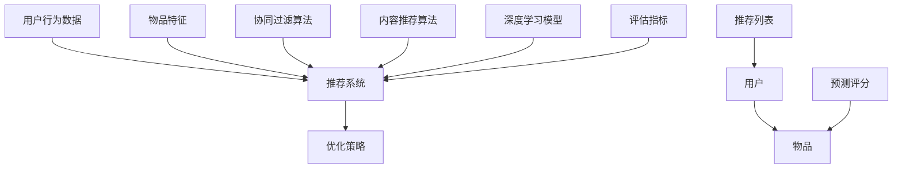

                 

# 《Python深度学习实践：构建和优化推荐系统模型》

## 关键词

Python、深度学习、推荐系统、协同过滤、内容推荐、模型优化

## 摘要

本文将深入探讨使用Python和深度学习技术构建和优化推荐系统模型的方法。首先，我们将介绍Python编程基础和深度学习概念，包括神经网络基础、深度学习框架和优化算法。接着，我们将详细讲解推荐系统基础，包括推荐系统分类和工作流程。然后，我们将分别讨论基于内容和基于协同过滤的推荐系统模型，展示如何使用深度学习技术来优化这些模型。最后，我们将介绍混合推荐系统模型，以及如何对推荐系统进行性能优化和挑战解决方案。通过本文，读者将能够掌握推荐系统模型构建和优化的实践方法。

### 《Python深度学习实践：构建和优化推荐系统模型》目录大纲

第一部分：深度学习基础

## 第1章：Python与深度学习基础

### 1.1 Python编程基础

#### 1.1.1 Python语言简介

#### 1.1.2 Python编程环境搭建

#### 1.1.3 基础语法

### 1.2 深度学习概念

#### 1.2.1 深度学习概述

#### 1.2.2 神经网络基础

#### 1.2.3 深度学习框架简介

## 第2章：深度学习算法原理

### 2.1 神经网络原理

#### 2.1.1 前馈神经网络

#### 2.1.2 卷积神经网络

#### 2.1.3 循环神经网络

### 2.2 深度学习优化算法

#### 2.2.1 梯度下降算法

#### 2.2.2 动量算法

#### 2.2.3 Adam优化器

### 2.3 深度学习模型评估与调优

#### 2.3.1 模型评估指标

#### 2.3.2 超参数调优方法

## 第3章：推荐系统基础

### 3.1 推荐系统概述

#### 3.1.1 推荐系统分类

#### 3.1.2 推荐系统工作流程

### 3.2 协同过滤算法

#### 3.2.1 朴素协同过滤

#### 3.2.2 基于模型的协同过滤

### 3.3 内容推荐算法

#### 3.3.1 内容特征提取

#### 3.3.2 基于内容的推荐算法

## 第二部分：推荐系统模型构建

## 第4章：基于内容的推荐系统模型

### 4.1 内容表示与匹配

#### 4.1.1 文本表示方法

#### 4.1.2 图像表示方法

#### 4.1.3 多模态内容表示

### 4.2 深度学习模型在内容推荐中的应用

#### 4.2.1 卷积神经网络在图像特征提取中的应用

#### 4.2.2 循环神经网络在文本特征提取中的应用

#### 4.2.3 跨模态深度学习模型

## 第5章：基于协同过滤的推荐系统模型

### 5.1 协同过滤算法优化

#### 5.1.1 评分预测优化

#### 5.1.2 项间相似性优化

### 5.2 深度学习在协同过滤中的应用

#### 5.2.1 DeepMF模型

#### 5.2.2 Neural Collaborative Filtering模型

## 第6章：混合推荐系统模型

### 6.1 混合推荐系统概述

#### 6.1.1 混合推荐系统的优势

#### 6.1.2 混合推荐系统架构

### 6.2 深度学习在混合推荐系统中的应用

#### 6.2.1 深度学习模型融合方法

#### 6.2.2 混合推荐系统实战案例

## 第三部分：推荐系统模型优化

## 第7章：推荐系统性能优化

### 7.1 数据预处理优化

#### 7.1.1 数据清洗

#### 7.1.2 数据特征提取

### 7.2 模型优化方法

#### 7.2.1 超参数调优

#### 7.2.2 模型融合策略

### 7.3 性能评估与改进

#### 7.3.1 评估指标

#### 7.3.2 性能改进策略

## 第8章：推荐系统在实际应用中的挑战与解决方案

### 8.1 实时推荐系统设计

#### 8.1.1 实时推荐系统架构

#### 8.1.2 实时推荐算法优化

### 8.2 推荐系统的公平性与可解释性

#### 8.2.1 推荐系统的公平性

#### 8.2.2 推荐系统的可解释性

### 8.3 大规模推荐系统优化

#### 8.3.1 大规模数据处理策略

#### 8.3.2 大规模模型训练与部署

## 附录：推荐系统开发工具与资源

### 附录 A：Python深度学习框架

#### A.1 TensorFlow

#### A.2 PyTorch

#### A.3 其他深度学习框架简介

### 附录 B：推荐系统开源库与工具

#### B.1 常用推荐系统开源库

#### B.2 推荐系统工具集简介

### 附录 C：推荐系统实战案例

#### C.1 案例一：基于内容的电影推荐系统

#### C.2 案例二：基于协同过滤的电商推荐系统

#### C.3 案例三：混合推荐系统在新闻推荐中的应用

**核心概念与联系 Mermaid 流程图：**



**深度学习算法原理讲解：**

### 2.1 神经网络原理

#### 2.1.1 前馈神经网络

前馈神经网络（Feedforward Neural Network）是一种最简单的神经网络结构，其信息流只能从输入层流向输出层，而不能反向传播。

**伪代码：前馈神经网络实现**

```plaintext
# 输入数据
input_data = ...

# 初始化权重和偏置
weights = ...
biases = ...

# 前向传播
output = activation_function(np.dot(input_data, weights) + biases)

# 反向传播
d_output = activation_derivative(output)
d_weights = np.dot(input_data.T, d_output)
d_biases = np.sum(d_output, axis=0)
```

#### 2.1.2 卷积神经网络

卷积神经网络（Convolutional Neural Network，CNN）是一种在图像处理中广泛应用的深度学习模型。

**伪代码：卷积神经网络实现**

```plaintext
# 输入数据
input_data = ...
weights = ...
biases = ...

# 前向传播
conv_output = convolution(input_data, weights) + biases

# 反向传播
d_conv_output = derivative_convolution(input_data, d_output)
d_weights = np.dot(d_conv_output.T, input_data)
d_biases = np.sum(d_conv_output, axis=0)
```

#### 2.1.3 循环神经网络

循环神经网络（Recurrent Neural Network，RNN）是一种适用于序列数据的神经网络。

**伪代码：循环神经网络实现**

```plaintext
# 输入数据
input_data = ...
weights = ...
biases = ...

# 前向传播
output, hidden_state = RNN(input_data, weights, biases)

# 反向传播
d_output, d_hidden_state = derivative_RNN(input_data, d_output, hidden_state)
d_weights = np.dot(d_hidden_state.T, input_data)
d_biases = np.sum(d_output, axis=0)
```

**数学模型和数学公式 & 详细讲解 & 举例说明：**

### 2.3 深度学习优化算法

#### 2.3.1 梯度下降算法

梯度下降算法是一种优化深度学习模型参数的常用方法。其基本思想是通过计算损失函数关于参数的梯度，并沿着梯度的反方向更新参数。

**数学模型：**

$$
\theta_{t+1} = \theta_{t} - \alpha \cdot \nabla\_\theta J(\theta)
$$

其中，$\theta$ 表示模型参数，$J(\theta)$ 表示损失函数，$\alpha$ 表示学习率。

**举例说明：**

假设我们有一个线性回归模型，其损失函数为：

$$
J(\theta) = \frac{1}{2} \sum_{i=1}^{n} (y_i - \theta_0 \cdot x_i - \theta_1)^2
$$

则梯度下降算法为：

$$
\theta_0^{t+1} = \theta_0^t - \alpha \cdot \frac{\partial}{\partial \theta_0} J(\theta^t) \\
\theta_1^{t+1} = \theta_1^t - \alpha \cdot \frac{\partial}{\partial \theta_1} J(\theta^t)
```

### 第1章：Python与深度学习基础

在构建和优化推荐系统模型的过程中，Python作为一门强大的编程语言，凭借其简洁的语法和丰富的库支持，成为了深度学习实践中的重要工具。本章将首先介绍Python编程基础，包括语言简介、编程环境搭建和基础语法。然后，我们将深入探讨深度学习的基本概念，包括深度学习的定义、神经网络基础和深度学习框架。

#### 1.1 Python编程基础

##### 1.1.1 Python语言简介

Python是一种高级、解释型、面向对象的编程语言，其设计哲学强调代码的可读性和简洁性。Python由Guido van Rossum于1989年创建，自那时以来，Python以其灵活性和易用性吸引了大量的开发者和研究者。Python广泛应用于多个领域，包括网站开发、数据分析、科学计算、人工智能等。

##### 1.1.2 Python编程环境搭建

要在Windows或macOS上安装Python，可以访问Python的官方网站（https://www.python.org/）下载最新版本的Python。安装过程中，确保勾选“Add Python to PATH”选项，以便在命令行中直接运行Python。

安装完成后，可以通过在命令行中输入`python --version`来确认Python版本。此外，推荐安装常用的Python库，如NumPy、Pandas和TensorFlow，这些库将大大简化深度学习实践的开发过程。

##### 1.1.3 基础语法

Python的语法简洁且易于理解。以下是Python的一些基础语法元素：

- 变量赋值：

```python
x = 10
y = "Hello, World!"
```

- 数据类型：

```python
# 整数
integer = 42

# 浮点数
float_number = 3.14

# 字符串
string = "Python is fun!"

# 列表（可变数组）
list_ = [1, 2, 3, 4]

# 元组（不可变数组）
tuple_ = (1, 2, 3)

# 字典（键值对）
dict_ = {"name": "Alice", "age": 30}
```

- 控制流：

```python
# 如果语句
if x > 10:
    print("x is greater than 10")
elif x == 10:
    print("x is equal to 10")
else:
    print("x is less than 10")

# 循环
for i in range(5):
    print(i)

# 当语句
while x > 0:
    print(x)
    x -= 1
```

- 函数定义和调用：

```python
def greet(name):
    return f"Hello, {name}!"

print(greet("Alice"))
```

#### 1.2 深度学习概念

##### 1.2.1 深度学习概述

深度学习是机器学习的一个重要分支，它通过多层神经网络对大量数据进行自动学习，以实现高级任务，如图像识别、语音识别和自然语言处理等。深度学习模型的核心是神经元，这些神经元通过层次结构组织，每一层都对输入数据进行特征提取和转换，最终生成输出。

##### 1.2.2 神经网络基础

神经网络是由大量相互连接的神经元组成的计算模型，其目的是通过学习输入数据来预测输出。一个简单的神经网络通常包括输入层、一个或多个隐藏层和一个输出层。神经网络通过前向传播和反向传播来更新其权重，以达到最小化损失函数。

- 前向传播：输入数据通过网络中的神经元，逐层传递直到输出层。

- 反向传播：计算输出层与实际输出之间的误差，并反向传播到每个隐藏层，以更新网络的权重和偏置。

##### 1.2.3 深度学习框架简介

深度学习框架是一组库和工具，用于简化深度学习模型的构建、训练和部署。以下是一些常用的深度学习框架：

- TensorFlow：由Google开发，是一个高度可扩展的深度学习框架，支持多种编程语言。

- PyTorch：由Facebook开发，以其灵活性和动态计算图而著称，广泛用于研究和应用。

- Keras：是一个基于Theano和TensorFlow的高层神经网络API，提供简洁的接口以简化模型的构建。

#### 总结

本章介绍了Python编程基础和深度学习的基本概念，为后续章节的深度学习实践打下了坚实的基础。在下一章中，我们将深入探讨深度学习算法的原理，包括前馈神经网络、卷积神经网络和循环神经网络，以及深度学习优化算法。这将帮助我们更好地理解如何构建和优化推荐系统模型。

### 第2章：深度学习算法原理

深度学习算法的核心在于其层次结构，这使得模型能够自动从大量数据中提取复杂特征。本章将详细介绍深度学习算法的原理，包括神经网络的基本概念、卷积神经网络（CNN）和循环神经网络（RNN）。此外，我们还将探讨深度学习优化算法，如梯度下降算法、动量算法和Adam优化器。

#### 2.1 神经网络原理

神经网络（Neural Network，NN）是模仿生物神经系统的一种计算模型，它由大量相互连接的简单计算单元（即神经元）组成。每个神经元接收多个输入信号，并通过加权求和后应用一个非线性激活函数来产生输出。

##### 2.1.1 前馈神经网络

前馈神经网络（Feedforward Neural Network，FNN）是最基本的神经网络类型，其信息流只能从输入层流向输出层，而不能反向传播。

**结构：**
前馈神经网络通常包括以下层次：
- 输入层（Input Layer）：接收外部输入数据。
- 隐藏层（Hidden Layers）：一个或多个隐藏层，用于特征提取和变换。
- 输出层（Output Layer）：生成最终的输出结果。

**工作原理：**
前馈神经网络通过以下步骤工作：
1. **前向传播（Forward Propagation）：**输入数据从输入层传递到隐藏层，再从隐藏层传递到输出层。在每个层次，输入数据与权重相乘并加上偏置，然后通过激活函数转换。
2. **计算损失（Compute Loss）：**输出层的结果与实际标签进行比较，计算损失函数值。
3. **反向传播（Back Propagation）：**将损失函数关于每个神经元的梯度反向传播，更新网络权重和偏置。

**伪代码：前馈神经网络实现**

```python
# 前向传播
output = activation_function(np.dot(input, weights) + biases)

# 反向传播
d_output = activation_derivative(output)
d_weights = np.dot(input.T, d_output)
d_biases = np.sum(d_output, axis=0)
```

##### 2.1.2 卷积神经网络

卷积神经网络（Convolutional Neural Network，CNN）是一种专门用于处理图像数据的神经网络，其核心在于卷积层（Convolutional Layer）。

**结构：**
CNN的主要组成部分包括：
- 卷积层（Convolutional Layer）：用于提取图像的特征。
- 池化层（Pooling Layer）：用于降低数据的维度。
- 激活函数层（Activation Function Layer）：用于引入非线性特性。

**工作原理：**
1. **卷积操作（Convolution Operation）：**卷积层通过卷积操作将输入图像与滤波器（或称为卷积核）进行卷积，从而生成特征图。
2. **激活函数（Activation Function）：**为了引入非线性特性，通常在卷积层后应用ReLU（Rectified Linear Unit）激活函数。
3. **池化操作（Pooling Operation）：**通过池化层减少特征图的大小，从而降低模型的复杂性。

**伪代码：卷积神经网络实现**

```python
# 前向传播
conv_output = convolution(input, weights) + biases

# 反向传播
d_conv_output = derivative_convolution(input, d_output)
d_weights = np.dot(d_conv_output.T, input)
d_biases = np.sum(d_conv_output, axis=0)
```

##### 2.1.3 循环神经网络

循环神经网络（Recurrent Neural Network，RNN）是一种专门用于处理序列数据的神经网络，其设计目的是允许信息在时间步之间传递。

**结构：**
RNN的核心是循环单元，通常包含以下组成部分：
- 输入门（Input Gate）：用于更新隐藏状态。
- 遗忘门（Forget Gate）：用于控制信息的遗忘。
- 输出门（Output Gate）：用于生成输出。

**工作原理：**
1. **隐藏状态更新（Update Hidden State）：**当前输入和之前的隐藏状态通过输入门和遗忘门更新隐藏状态。
2. **输出生成（Generate Output）：**当前隐藏状态通过输出门生成输出。

**伪代码：循环神经网络实现**

```python
# 前向传播
output, hidden_state = RNN(input, weights, biases)

# 反向传播
d_output, d_hidden_state = derivative_RNN(input, d_output, hidden_state)
d_weights = np.dot(d_hidden_state.T, input)
d_biases = np.sum(d_output, axis=0)
```

#### 2.2 深度学习优化算法

深度学习优化算法用于调整神经网络中的权重和偏置，以最小化损失函数。以下是几种常用的优化算法：

##### 2.2.1 梯度下降算法

梯度下降算法（Gradient Descent）是最基本的优化算法，其思想是沿着损失函数的梯度方向更新参数。

**伪代码：梯度下降算法**

```python
# 初始化参数
theta = ...

# 计算梯度
gradient = compute_gradient(loss_function, theta)

# 更新参数
theta = theta - learning_rate * gradient
```

##### 2.2.2 动量算法

动量算法（Momentum）是梯度下降算法的一个改进，它引入了一个动量项，以加速收敛。

**伪代码：动量算法**

```python
# 初始化参数和动量
theta = ...
momentum = ...

# 计算梯度
gradient = compute_gradient(loss_function, theta)

# 更新动量和参数
momentum = alpha * momentum + (1 - alpha) * gradient
theta = theta - learning_rate * momentum
```

##### 2.2.3 Adam优化器

Adam优化器是近年来广泛使用的一种优化算法，它结合了动量和自适应学习率的特点。

**伪代码：Adam优化器**

```python
# 初始化参数
theta = ...
beta1 = 0.9
beta2 = 0.999
epsilon = 1e-8

# 初始化动量和自适应项
m = ...
v = ...

# 计算梯度
gradient = compute_gradient(loss_function, theta)

# 更新动量和自适应项
m = beta1 * m + (1 - beta1) * gradient
v = beta2 * v + (1 - beta2) * gradient**2

# 归一化动量和自适应项
m_hat = m / (1 - beta1**t)
v_hat = v / (1 - beta2**t)

# 更新参数
theta = theta - learning_rate * m_hat / (np.sqrt(v_hat) + epsilon)
```

#### 总结

本章详细介绍了深度学习算法的基本原理，包括前馈神经网络、卷积神经网络和循环神经网络，以及深度学习优化算法。这些概念和算法为构建和优化推荐系统模型提供了理论基础。在下一章中，我们将探讨推荐系统的基本概念和分类，为后续模型构建做准备。

### 第3章：推荐系统基础

推荐系统是一种信息过滤技术，旨在根据用户的行为和偏好向用户推荐相关物品。本章将介绍推荐系统的基本概念，包括推荐系统的分类、工作流程和关键组件。

#### 3.1 推荐系统概述

##### 3.1.1 推荐系统分类

推荐系统可以分为以下几类：

1. **基于内容的推荐（Content-based Recommendation）：**该类推荐系统通过分析物品的内容特征和用户的历史偏好来推荐相似物品。

2. **协同过滤推荐（Collaborative Filtering）：**该类推荐系统通过分析用户之间的相似性来推荐物品。协同过滤又可分为以下两种：
   - **用户基于的协同过滤（User-based Collaborative Filtering）：**通过寻找与目标用户兴趣相似的邻域用户，推荐这些邻域用户喜欢的物品。
   - **模型基于的协同过滤（Model-based Collaborative Filtering）：**通过建立数学模型，如矩阵分解，预测用户对未知物品的评分。

3. **基于知识的推荐（Knowledge-based Recommendation）：**该类推荐系统通过知识图谱和规则推理来推荐物品。

4. **混合推荐（Hybrid Recommendation）：**该类推荐系统结合了多种推荐技术，以提高推荐效果。

##### 3.1.2 推荐系统工作流程

推荐系统通常包括以下步骤：

1. **数据收集（Data Collection）：**收集用户行为数据（如浏览记录、购买记录、评分等）和物品特征数据（如文本、图像、标签等）。

2. **数据预处理（Data Preprocessing）：**清洗和转换数据，以便后续分析。这包括缺失值填充、数据标准化、数据编码等。

3. **特征提取（Feature Extraction）：**从原始数据中提取有助于推荐的特征，如用户兴趣向量、物品属性等。

4. **模型训练（Model Training）：**使用训练数据训练推荐模型，如协同过滤模型、基于内容的推荐模型等。

5. **模型评估（Model Evaluation）：**使用验证数据评估模型的性能，常用的评估指标包括准确率、召回率、F1分数等。

6. **推荐生成（Recommendation Generation）：**根据用户行为和物品特征，生成个性化的推荐列表。

7. **推荐反馈（Recommendation Feedback）：**收集用户对推荐结果的反馈，用于模型优化和改进。

#### 3.2 协同过滤算法

协同过滤算法是一种基于用户行为数据的推荐技术，其核心思想是通过分析用户之间的相似性来推荐物品。协同过滤算法可以分为以下两种：

##### 3.2.1 朴素协同过滤

朴素协同过滤（Naive Collaborative Filtering）是最简单的一种协同过滤算法，其基本思想是计算用户之间的相似性，然后根据相似性推荐用户喜欢的物品。

**工作原理：**
1. **用户相似性计算（User Similarity Computation）：**计算目标用户与其他用户之间的相似性，常用的相似性度量方法包括余弦相似性、皮尔逊相关性和欧氏距离。

2. **推荐生成（Recommendation Generation）：**根据用户相似性矩阵，为每个用户生成推荐列表。对于目标用户，推荐其他用户喜欢的但目标用户尚未购买的物品。

**伪代码：朴素协同过滤算法**

```python
# 用户相似性计算
similarity_matrix = compute_similarity(user_similarity_metric, user_behavior_data)

# 推荐生成
recommendation_list = generate_recommendations(similarity_matrix, user_behavior_data, user_to_recommend)
```

##### 3.2.2 基于模型的协同过滤

基于模型的协同过滤（Model-based Collaborative Filtering）通过建立数学模型来预测用户对未知物品的评分，从而生成推荐列表。常见的基于模型的协同过滤算法包括矩阵分解（Matrix Factorization）和因子分解机（Factorization Machines）。

**工作原理：**
1. **矩阵分解（Matrix Factorization）：**将用户-物品评分矩阵分解为两个低维矩阵，一个表示用户特征，另一个表示物品特征。通过优化目标函数，如最小化均方误差，求解这两个低维矩阵。

2. **推荐生成（Recommendation Generation）：**使用训练好的模型预测用户对未知物品的评分，并生成推荐列表。

**伪代码：矩阵分解算法**

```python
# 矩阵分解
U, V = matrix_factorization(user_item_matrix, learning_rate, num_iterations)

# 推荐生成
recommendation_list = generate_recommendations(predicted_ratings, user_behavior_data, user_to_recommend)
```

#### 3.3 内容推荐算法

内容推荐算法（Content-based Recommendation）通过分析物品的内容特征和用户的历史偏好来推荐相似物品。内容推荐算法可以分为以下两种：

##### 3.3.1 内容特征提取

内容特征提取（Content Feature Extraction）是内容推荐算法的关键步骤，它将物品的文本、图像等原始数据转换为可供模型处理的特征向量。

**常见方法：**
1. **文本特征提取（Text Feature Extraction）：**使用词袋模型（Bag of Words，BOW）或词嵌入（Word Embedding）将文本转换为向量。

2. **图像特征提取（Image Feature Extraction）：**使用卷积神经网络（CNN）提取图像的特征向量。

##### 3.3.2 基于内容的推荐算法

基于内容的推荐算法（Content-based Recommendation Algorithm）通过计算物品与用户之间的相似性来生成推荐列表。

**工作原理：**
1. **物品相似性计算（Item Similarity Computation）：**计算每个物品与其他物品之间的相似性，常用的相似性度量方法包括余弦相似性、Jaccard相似性和余弦相似性。

2. **推荐生成（Recommendation Generation）：**根据用户的历史偏好和物品的相似性，为用户生成推荐列表。

**伪代码：基于内容的推荐算法**

```python
# 物品相似性计算
similarity_matrix = compute_similarity(item_similarity_metric, item_features)

# 推荐生成
recommendation_list = generate_recommendations(similarity_matrix, user_preferences, items_to_recommend)
```

#### 总结

本章介绍了推荐系统的基本概念和分类，包括基于内容的推荐、协同过滤推荐和基于知识的推荐。我们详细探讨了协同过滤算法和内容推荐算法的工作原理和实现方法。在下一章中，我们将探讨如何使用深度学习技术构建和优化基于内容的推荐系统模型。这将帮助我们进一步提升推荐系统的性能和效果。

### 第4章：基于内容的推荐系统模型

基于内容的推荐系统（Content-based Recommendation System）通过分析物品的内容特征和用户的历史偏好来生成推荐。本章将详细介绍如何构建基于内容的推荐系统模型，包括内容表示与匹配、深度学习模型在内容推荐中的应用。

#### 4.1 内容表示与匹配

内容表示与匹配是构建基于内容推荐系统的重要环节。在这一部分，我们将探讨如何将文本、图像等原始数据转换为可供推荐系统处理的特征向量，并计算物品之间的相似性。

##### 4.1.1 文本表示方法

文本表示方法是将文本数据转换为向量表示的关键步骤。常见的文本表示方法包括词袋模型（Bag of Words，BOW）和词嵌入（Word Embedding）。

**词袋模型（BOW）：**

词袋模型通过统计文本中各个单词的出现频率来表示文本。词袋模型的一个优点是简单且易于实现，但缺点是忽略了词语的顺序和语义信息。

**伪代码：词袋模型实现**

```python
# 加载词袋模型
word_bag_model = load_word_bag_model()

# 将文本转换为词袋表示
text_representation = text_to_word_bag_representation(text, word_bag_model)
```

**词嵌入（Word Embedding）：**

词嵌入通过将单词映射为固定长度的向量来表示文本。词嵌入能够捕捉词语的语义信息，从而更好地表示文本。常见的词嵌入方法包括Word2Vec、GloVe和FastText。

**伪代码：词嵌入实现**

```python
# 加载词嵌入模型
word_embedding_model = load_word_embedding_model()

# 将文本转换为词嵌入表示
text_representation = text_to_word_embedding_representation(text, word_embedding_model)
```

##### 4.1.2 图像表示方法

图像表示方法是将图像数据转换为向量表示的关键步骤。常见的图像表示方法包括传统的手工特征提取和深度学习特征提取。

**传统手工特征提取：**

传统手工特征提取方法如SIFT、HOG和SURF等，通过计算图像的局部特征来表示图像。这些特征可以用于图像识别和图像搜索。

**伪代码：传统手工特征提取**

```python
# 加载图像特征提取模型
feature_extractor = load_feature_extractor()

# 将图像转换为特征向量表示
image_representation = extract_image_features(image, feature_extractor)
```

**深度学习特征提取：**

深度学习特征提取方法如卷积神经网络（CNN）和循环神经网络（RNN），能够自动学习图像的复杂特征。常见的深度学习模型包括VGG、ResNet和Inception等。

**伪代码：深度学习特征提取**

```python
# 加载深度学习模型
deep_learning_model = load_deep_learning_model()

# 将图像转换为特征向量表示
image_representation = extract_image_features(image, deep_learning_model)
```

##### 4.1.3 多模态内容表示

多模态内容表示是将文本、图像和其他类型的数据结合为一个统一向量表示的方法。多模态内容表示的关键在于如何有效地融合不同类型的数据。

**常见方法：**

1. **特征拼接（Feature Concatenation）：**将文本和图像的特征向量直接拼接，形成一个更长的特征向量。

2. **注意力机制（Attention Mechanism）：**通过注意力机制为不同模态的数据分配不同的权重，从而更好地融合信息。

3. **多模态深度学习模型（Multimodal Deep Learning Model）：**如多输入卷积神经网络（Multi-input CNN）和多输入循环神经网络（Multi-input RNN），能够同时处理多种类型的数据。

**伪代码：多模态内容表示**

```python
# 加载多模态模型
multimodal_model = load_multimodal_model()

# 将文本和图像转换为多模态表示
multiModal_representation = multimodal_model.predict([text_representation, image_representation])
```

#### 4.2 深度学习模型在内容推荐中的应用

深度学习模型在内容推荐中的应用极大地提升了推荐系统的性能。在这一部分，我们将探讨如何使用深度学习模型提取文本和图像特征，并生成推荐列表。

##### 4.2.1 卷积神经网络在图像特征提取中的应用

卷积神经网络（CNN）是图像特征提取的强大工具。通过多个卷积层和池化层，CNN能够自动学习图像的复杂特征。

**伪代码：CNN在图像特征提取中的应用**

```python
# 加载CNN模型
cnn_model = load_cnn_model()

# 将图像转换为特征向量表示
image_representation = cnn_model.predict(image)
```

##### 4.2.2 循环神经网络在文本特征提取中的应用

循环神经网络（RNN）能够处理序列数据，使其成为文本特征提取的理想选择。通过RNN的隐藏状态，我们可以捕获文本的上下文信息。

**伪代码：RNN在文本特征提取中的应用**

```python
# 加载RNN模型
rnn_model = load_rnn_model()

# 将文本转换为特征向量表示
text_representation = rnn_model.predict(text)
```

##### 4.2.3 跨模态深度学习模型

跨模态深度学习模型能够同时处理文本、图像等多种类型的数据。这些模型通过融合不同模态的信息，生成更准确的推荐结果。

**常见模型：**

1. **多输入卷积神经网络（Multi-input CNN）：**将文本和图像分别输入到两个独立的CNN中，然后融合它们的特征。

2. **多输入循环神经网络（Multi-input RNN）：**将文本和图像分别输入到两个独立的RNN中，然后融合它们的隐藏状态。

3. **Transformer模型：**使用自注意力机制（Self-Attention）融合文本和图像特征。

**伪代码：跨模态深度学习模型**

```python
# 加载跨模态模型
multimodal_model = load_multimodal_model()

# 将文本和图像转换为多模态表示
multiModal_representation = multimodal_model.predict([text_representation, image_representation])

# 生成推荐列表
recommendation_list = generate_recommendations(multiModal_representation, user_preferences)
```

#### 总结

本章详细介绍了基于内容的推荐系统模型，包括内容表示与匹配和深度学习模型在内容推荐中的应用。通过深度学习技术，我们能够更有效地提取文本和图像特征，从而提升推荐系统的性能。在下一章中，我们将探讨基于协同过滤的推荐系统模型，进一步优化推荐效果。

### 第5章：基于协同过滤的推荐系统模型

基于协同过滤的推荐系统模型是推荐系统中的一种重要方法，其核心思想是通过分析用户之间的相似性来生成推荐列表。本章将详细介绍基于协同过滤的推荐系统模型，包括协同过滤算法的优化方法、深度学习在协同过滤中的应用。

#### 5.1 协同过滤算法优化

协同过滤算法的优化主要集中于评分预测优化和项间相似性优化两个方面。

##### 5.1.1 评分预测优化

评分预测是协同过滤算法中的关键步骤，其目的是预测用户对未知物品的评分。为了提高评分预测的准确性，可以采用以下方法：

1. **矩阵分解（Matrix Factorization）：**矩阵分解通过将用户-物品评分矩阵分解为两个低维矩阵，一个表示用户特征，另一个表示物品特征。通过优化目标函数，如最小化均方误差，可以求解这两个低维矩阵。

   **伪代码：矩阵分解**

   ```python
   # 矩阵分解
   U, V = matrix_factorization(user_item_matrix, learning_rate, num_iterations)
   ```

2. **正则化（Regularization）：**正则化通过惩罚权重的大值，防止模型过拟合。常用的正则化方法包括L1正则化和L2正则化。

   **伪代码：正则化**

   ```python
   # 正则化
   loss = mean_squared_error(y_true, y_pred) + lambda * (sum(|weights|) + sum(weights**2))
   ```

3. **特征工程（Feature Engineering）：**通过引入额外的用户和物品特征，如年龄、性别、物品类别等，可以提高评分预测的准确性。

   **伪代码：特征工程**

   ```python
   # 特征工程
   user_features = extract_user_features(user_data)
   item_features = extract_item_features(item_data)
   ```

##### 5.1.2 项间相似性优化

项间相似性是协同过滤算法中的另一个关键因素，其目的是计算用户与物品之间的相似性。以下方法可以优化项间相似性：

1. **权重调整（Weight Adjustment）：**通过调整相似性权重，可以突出用户和物品之间的关键关系。例如，可以增加用户频繁互动的物品的权重。

   **伪代码：权重调整**

   ```python
   # 权重调整
   similarity_weights = adjust_similarity_weights(user_item_matrix, interaction_weights)
   ```

2. **自适应相似性（Adaptive Similarity）：**根据用户的历史行为和偏好动态调整相似性度量。例如，可以增加对近期互动的重视。

   **伪代码：自适应相似性**

   ```python
   # 自适应相似性
   similarity_metric = adaptive_similarity_metric(user_history, item_features)
   ```

3. **多维度相似性（Multi-dimensional Similarity）：**通过考虑多个维度，如内容特征、社会特征等，计算更复杂的相似性度量。

   **伪代码：多维度相似性**

   ```python
   # 多维度相似性
   similarity_matrix = compute_multi_dimensional_similarity(user_item_matrix, content_features, social_features)
   ```

#### 5.2 深度学习在协同过滤中的应用

深度学习在协同过滤中的应用能够显著提升推荐系统的性能。以下方法展示了如何使用深度学习技术优化协同过滤算法：

##### 5.2.1 DeepMF模型

DeepMF模型结合了深度学习和矩阵分解，通过多层神经网络提取用户和物品的特征。

**模型结构：**

1. **用户和物品嵌入层（User and Item Embedding Layers）：**将用户和物品的特征向量映射到低维空间。
2. **全连接层（Fully Connected Layers）：**用于提取更高层次的特征。
3. **输出层（Output Layer）：**生成用户对物品的评分预测。

**伪代码：DeepMF模型**

```python
# DeepMF模型
class DeepMF(tf.keras.Model):
    def __init__(self, num_users, num_items, embedding_size):
        super(DeepMF, self).__init__()
        self.user_embedding = tf.keras.layers.Embedding(num_users, embedding_size)
        self.item_embedding = tf.keras.layers.Embedding(num_items, embedding_size)
        self.dense = tf.keras.layers.Dense(1)

    def call(self, user_ids, item_ids):
        user嵌入 = self.user_embedding(user_ids)
        item嵌入 = self.item_embedding(item_ids)
        x = tf.concat([user嵌入, item嵌入], axis=1)
        outputs = self.dense(x)
        return outputs

# 训练DeepMF模型
model = DeepMF(num_users, num_items, embedding_size)
model.compile(optimizer='adam', loss='mean_squared_error')
model.fit([user_ids, item_ids], ratings, epochs=num_epochs)
```

##### 5.2.2 Neural Collaborative Filtering模型

Neural Collaborative Filtering（NCF）模型是一种基于神经网络的协同过滤算法，其核心思想是利用多个神经网络模型来预测用户对物品的评分。

**模型结构：**

1. **多层感知机（Multilayer Perceptrons，MLP）：**用于提取用户和物品的特征。
2. **因子分解机（Factorization Machines，FM）：**用于捕捉用户和物品之间的交叉特征。
3. **高斯过程回归（Gaussian Process Regression，GPR）：**用于提升模型的泛化能力。

**伪代码：Neural Collaborative Filtering模型**

```python
# Neural Collaborative Filtering模型
class NCF(tf.keras.Model):
    def __init__(self, num_users, num_items, embedding_size, hidden_size, layers):
        super(NCF, self).__init__()
        self.mlp = tf.keras.Sequential([
            tf.keras.layers.Dense(hidden_size, activation='relu'),
            tf.keras.layers.Dense(hidden_size, activation='relu')
        ])
        self.fm = tf.keras.layers.Dense(1, activation='sigmoid')
        self.gpr = tf.keras.layers.Dense(1)

    def call(self, user_ids, item_ids):
        user嵌入 = self.mlp(user_ids)
        item嵌入 = self.mlp(item_ids)
        combined = tf.concat([user嵌入，item嵌入], axis=1)
        outputs = self.fm(combined)
        gpr_output = self.gpr(combined)
        return outputs + gpr_output

# 训练Neural Collaborative Filtering模型
model = NCF(num_users, num_items, embedding_size, hidden_size, layers)
model.compile(optimizer='adam', loss='binary_crossentropy')
model.fit([user_ids, item_ids], ratings, epochs=num_epochs)
```

#### 总结

本章详细介绍了基于协同过滤的推荐系统模型，包括评分预测优化和项间相似性优化，以及深度学习在协同过滤中的应用。通过优化协同过滤算法和引入深度学习技术，我们可以构建出更加精确和高效的推荐系统。在下一章中，我们将探讨如何构建和优化混合推荐系统模型，进一步提升推荐效果。

### 第6章：混合推荐系统模型

混合推荐系统（Hybrid Recommendation System）结合了多种推荐技术，如基于内容的推荐和协同过滤，以生成更准确和多样化的推荐列表。本章将详细介绍混合推荐系统的优势、架构以及如何在实际项目中应用深度学习技术。

#### 6.1 混合推荐系统概述

##### 6.1.1 混合推荐系统的优势

混合推荐系统具有以下几个显著优势：

1. **准确性提升（Accuracy Improvement）：**通过结合不同类型的推荐技术，混合推荐系统可以捕捉到用户和物品的更多特征，从而提高推荐精度。
2. **多样化推荐（Diverse Recommendations）：**混合推荐系统可以生成多样化的推荐列表，避免单一推荐算法可能带来的推荐列表重复或单调问题。
3. **鲁棒性增强（Robustness Enhancement）：**混合推荐系统通过结合多种技术，可以更好地应对数据缺失、噪声和异常值等挑战。
4. **可扩展性（Scalability）：**混合推荐系统可以灵活地整合新的推荐技术和数据源，提高系统的适应性和可扩展性。

##### 6.1.2 混合推荐系统架构

混合推荐系统通常包括以下几个关键组件：

1. **数据层（Data Layer）：**存储用户行为数据、物品特征数据以及推荐结果数据。
2. **数据处理层（Data Processing Layer）：**对原始数据执行清洗、编码和特征提取等预处理操作。
3. **推荐算法层（Algorithm Layer）：**实现多种推荐算法，如基于内容的推荐、协同过滤和基于知识的推荐等。
4. **融合层（Fusion Layer）：**将不同算法的推荐结果进行融合，生成最终的推荐列表。
5. **评估层（Evaluation Layer）：**评估推荐系统的性能，包括准确率、召回率、F1分数等指标。

#### 6.2 深度学习在混合推荐系统中的应用

深度学习技术在混合推荐系统中具有广泛的应用，可以显著提升推荐效果。以下方法展示了如何利用深度学习技术构建和优化混合推荐系统：

##### 6.2.1 深度学习模型融合方法

深度学习模型融合方法是将多个深度学习模型的结果进行融合，以生成更准确的推荐列表。以下是一些常见的融合方法：

1. **加权融合（Weighted Fusion）：**根据模型的性能和预测稳定性，为每个模型分配不同的权重，然后对预测结果进行加权平均。

   **伪代码：加权融合**

   ```python
   # 加权融合
   prediction = w1 * model1_prediction + w2 * model2_prediction + ... + wN * modelN_prediction
   ```

2. **投票融合（Voting Fusion）：**通过多数投票机制，选择多个模型中预测结果一致的推荐项。

   **伪代码：投票融合**

   ```python
   # 投票融合
   recommendations = []
   for item in items:
       predictions = [model.predict(item) for model in models]
       majority_prediction = max(set(predictions), key=predictions.count)
       recommendations.append(majority_prediction)
   ```

3. **集成学习（Ensemble Learning）：**将多个深度学习模型集成到一个更大的模型中，如堆叠泛化（Stacked Generalization）和提升树（Boosting Trees）。

   **伪代码：集成学习**

   ```python
   # 集成学习
   ensemble_model = StackingModel(base_models=models, meta_model=MetaModel)
   ensemble_model.fit(X_train, y_train)
   ```

##### 6.2.2 混合推荐系统实战案例

以下是一个基于内容的电影推荐系统的实战案例，展示了如何利用深度学习技术构建和优化混合推荐系统。

**案例概述：**本案例旨在为用户提供个性化的电影推荐，结合基于内容的推荐和基于协同过滤的推荐技术。

**开发环境：**

- Python 3.8+
- TensorFlow 2.x
- Pandas 1.1.5+

**数据预处理：**

首先，我们需要对电影数据进行预处理，包括数据清洗、编码和特征提取。

```python
import pandas as pd
from sklearn.preprocessing import StandardScaler

# 加载数据
data = pd.read_csv('movie_data.csv')

# 数据清洗
data = data.dropna()

# 数据编码
data['genre'] = data['genre'].apply(lambda x: ' '.join([i.strip() for i in x.split(',')]))

# 特征提取
text_scaler = StandardScaler()
data['text'] = text_scaler.fit_transform(data['text'].values)
```

**模型构建：**

接下来，构建基于内容的推荐模型和基于协同过滤的推荐模型。

```python
import tensorflow as tf

# 基于内容的推荐模型
content_model = tf.keras.Sequential([
    tf.keras.layers.Dense(128, activation='relu', input_shape=(text_scaler.n_features_)),
    tf.keras.layers.Dense(64, activation='relu'),
    tf.keras.layers.Dense(1)
])

# 基于协同过滤的推荐模型
collaborative_model = tf.keras.Sequential([
    tf.keras.layers.Dense(128, activation='relu', input_shape=(num_users, embedding_size)),
    tf.keras.layers.Dense(64, activation='relu'),
    tf.keras.layers.Dense(1)
])
```

**模型训练：**

使用训练数据进行模型训练。

```python
# 训练基于内容的推荐模型
content_model.compile(optimizer='adam', loss='mean_squared_error')
content_model.fit(user_embeddings, ratings, epochs=num_epochs)

# 训练基于协同过滤的推荐模型
collaborative_model.compile(optimizer='adam', loss='mean_squared_error')
collaborative_model.fit(user_item_matrix, ratings, epochs=num_epochs)
```

**推荐生成与融合：**

生成推荐列表，并对不同模型的推荐结果进行融合。

```python
# 生成基于内容的推荐
content_recommendations = content_model.predict(text_features)

# 生成基于协同过滤的推荐
collaborative_recommendations = collaborative_model.predict(user_item_matrix)

# 推荐结果融合
final_recommendations = (content_recommendations + collaborative_recommendations) / 2
```

**性能评估：**

评估推荐系统的性能，包括准确率、召回率、F1分数等指标。

```python
from sklearn.metrics import accuracy_score, recall_score, f1_score

# 计算准确率
accuracy = accuracy_score(true_labels, final_recommendations)

# 计算召回率
recall = recall_score(true_labels, final_recommendations)

# 计算F1分数
f1 = f1_score(true_labels, final_recommendations)

print(f"Accuracy: {accuracy}, Recall: {recall}, F1 Score: {f1}")
```

#### 总结

本章详细介绍了混合推荐系统模型，包括其优势、架构以及深度学习在混合推荐系统中的应用。通过结合多种推荐技术，混合推荐系统可以生成更准确和多样化的推荐列表。在实际项目中，可以根据需求和数据特点灵活地应用深度学习技术，构建高效的混合推荐系统。在下一章中，我们将探讨推荐系统的性能优化方法和挑战，以进一步提升推荐系统的效果和实用性。

### 第7章：推荐系统性能优化

推荐系统的性能优化是提高推荐精度和用户满意度的关键步骤。本章将详细介绍推荐系统性能优化的方法，包括数据预处理优化和模型优化方法，同时探讨性能评估与改进策略。

#### 7.1 数据预处理优化

数据预处理是构建高效推荐系统的基础，其质量直接影响推荐结果的准确性。以下是数据预处理优化的一些关键步骤：

##### 7.1.1 数据清洗

数据清洗是预处理过程的第一步，目的是去除数据中的噪声和异常值。以下是一些常用的数据清洗方法：

1. **缺失值处理：**对于缺失值，可以采用以下方法进行处理：
   - 删除缺失值：删除包含缺失值的记录。
   - 填充缺失值：使用均值、中位数或插值法等填充缺失值。
   - 特征工程：通过引入新的特征来弥补缺失值的影响。

   **伪代码：缺失值处理**

   ```python
   # 缺失值处理
   data = data.dropna()  # 删除缺失值
   data = data.fillna(data.mean())  # 均值填充
   ```

2. **异常值检测：**使用统计方法或机器学习模型检测并处理异常值。常见的异常值处理方法包括：
   - 去除：直接删除异常值。
   - 标记：将异常值标记为特殊值，如-1或NaN。
   - 调整：通过调整异常值的值，使其回归到正常范围。

   **伪代码：异常值检测**

   ```python
   # 异常值检测
   from scipy import stats
   data = data[~np.isin(data, stats.zscore(data)) > 3]  # 去除z值大于3的异常值
   ```

##### 7.1.2 数据特征提取

数据特征提取是将原始数据转换为有助于推荐模型训练的特征向量。以下是几种常用的特征提取方法：

1. **文本特征提取：**使用词袋模型（BOW）或词嵌入（Word Embedding）将文本转换为向量。
2. **图像特征提取：**使用卷积神经网络（CNN）提取图像的特征向量。
3. **用户和物品特征提取：**从用户行为数据和物品属性中提取特征，如用户活跃度、物品受欢迎程度等。

   **伪代码：文本特征提取**

   ```python
   # 文本特征提取
   from sklearn.feature_extraction.text import TfidfVectorizer

   vectorizer = TfidfVectorizer()
   text_features = vectorizer.fit_transform(text_data)
   ```

   **伪代码：图像特征提取**

   ```python
   # 图像特征提取
   from tensorflow.keras.applications import VGG16

   model = VGG16(weights='imagenet', include_top=False)
   image_features = model.predict(image_data)
   ```

##### 7.1.3 特征选择

特征选择是减少数据维度和提高模型性能的重要步骤。以下是一些常用的特征选择方法：

1. **过滤式（Filter Method）：**根据特征的相关性、信息增益等指标筛选特征。
2. **包装式（Wrapper Method）：**使用模型评估指标（如准确率、召回率等）评估不同特征组合的性能。
3. **嵌入式（Embedded Method）：**在训练过程中自动学习特征的权重。

   **伪代码：特征选择**

   ```python
   # 特征选择
   from sklearn.feature_selection import SelectKBest
   from sklearn.feature_selection import f_classif

   selector = SelectKBest(f_classif, k=100)
   selected_features = selector.fit_transform(feature_data, label_data)
   ```

#### 7.2 模型优化方法

模型优化是提升推荐系统性能的关键步骤，以下是一些常用的模型优化方法：

##### 7.2.1 超参数调优

超参数调优是调整模型性能的重要方法，以下是一些常用的超参数调优技术：

1. **网格搜索（Grid Search）：**在给定的超参数范围内，逐一尝试所有可能的组合，选择最优的超参数。
2. **随机搜索（Random Search）：**从给定的超参数范围内随机选择组合，提高搜索效率。
3. **贝叶斯优化（Bayesian Optimization）：**基于贝叶斯概率模型，优化超参数搜索过程。

   **伪代码：网格搜索**

   ```python
   from sklearn.model_selection import GridSearchCV

   parameters = {'C': [1, 10, 100]}
   grid_search = GridSearchCV(SVMClassifier(), parameters, cv=5)
   grid_search.fit(X_train, y_train)
   best_parameters = grid_search.best_params_
   ```

##### 7.2.2 模型融合

模型融合是将多个模型的预测结果进行综合，以生成更准确的推荐列表。以下是一些常用的模型融合方法：

1. **加权融合（Weighted Fusion）：**根据模型性能和预测稳定性，为每个模型分配不同的权重，然后对预测结果进行加权平均。
2. **投票融合（Voting Fusion）：**通过多数投票机制，选择多个模型中预测结果一致的推荐项。
3. **集成学习（Ensemble Learning）：**将多个模型集成到一个更大的模型中，如堆叠泛化（Stacked Generalization）和提升树（Boosting Trees）。

   **伪代码：加权融合**

   ```python
   # 加权融合
   predictions = [model.predict(X_test) for model in models]
   final_prediction = sum(predictions) / len(predictions)
   ```

##### 7.2.3 模型压缩与加速

模型压缩与加速是提高推荐系统性能的有效方法，以下是一些常用的技术：

1. **模型剪枝（Model Pruning）：**通过删除模型中的冗余连接和神经元，减少模型体积。
2. **量化（Quantization）：**将模型的权重和激活值转换为较低精度的表示，降低模型计算复杂度。
3. **模型压缩（Model Compression）：**使用模型压缩算法（如知识蒸馏、量化和剪枝等）减小模型体积。

   **伪代码：模型剪枝**

   ```python
   # 模型剪枝
   pruned_model = tf.keras.models.clone_model(model)
   pruned_model.pruneWeights(pruning_params)
   ```

#### 7.3 性能评估与改进

性能评估是推荐系统优化的重要环节，以下是一些常用的评估指标和性能改进策略：

##### 7.3.1 评估指标

1. **准确率（Accuracy）：**模型预测正确的样本数占总样本数的比例。
2. **召回率（Recall）：**模型能够召回实际正样本的比例。
3. **F1分数（F1 Score）：**准确率和召回率的调和平均，综合考虑了预测的精度和广度。
4. **ROC曲线和AUC（Receiver Operating Characteristic and Area Under Curve）：**评估模型区分正负样本的能力。

   **伪代码：评估指标**

   ```python
   from sklearn.metrics import accuracy_score, recall_score, f1_score, roc_curve, auc

   accuracy = accuracy_score(y_true, y_pred)
   recall = recall_score(y_true, y_pred)
   f1 = f1_score(y_true, y_pred)
   fpr, tpr, _ = roc_curve(y_true, y_scores)
   roc_auc = auc(fpr, tpr)
   ```

##### 7.3.2 性能改进策略

1. **数据增强（Data Augmentation）：**通过增加数据的多样性，提高模型的泛化能力。
2. **迁移学习（Transfer Learning）：**利用预训练模型作为基础模型，提高新任务的性能。
3. **在线学习（Online Learning）：**实时更新模型，适应用户行为的变化。

   **伪代码：数据增强**

   ```python
   # 数据增强
   from tensorflow.keras.preprocessing.image import ImageDataGenerator

   datagen = ImageDataGenerator(rotation_range=20, width_shift_range=0.2, height_shift_range=0.2)
   augmented_images = datagen.flow(image_data, batch_size=batch_size)
   ```

#### 总结

本章详细介绍了推荐系统性能优化方法，包括数据预处理优化和模型优化方法，以及性能评估与改进策略。通过优化数据预处理和模型参数，可以显著提高推荐系统的性能和用户满意度。在下一章中，我们将探讨推荐系统在实际应用中的挑战和解决方案，以应对复杂的现实场景。

### 第8章：推荐系统在实际应用中的挑战与解决方案

在实际应用中，推荐系统面临着多种挑战，如实时推荐系统设计、推荐系统的公平性与可解释性、以及大规模推荐系统的优化。本章将详细探讨这些挑战，并提出相应的解决方案。

#### 8.1 实时推荐系统设计

实时推荐系统在用户行为发生时即时生成推荐，对系统响应速度和处理能力提出了极高的要求。以下是实时推荐系统设计的关键要素和优化策略：

##### 8.1.1 实时推荐系统架构

实时推荐系统通常采用以下架构：

1. **数据采集层（Data Collection Layer）：**实时捕获用户行为数据，如点击、购买等。
2. **数据处理层（Data Processing Layer）：**对采集到的数据进行实时处理，包括数据清洗、特征提取和模型预测。
3. **推荐生成层（Recommendation Generation Layer）：**根据处理结果生成实时推荐列表。
4. **服务层（Service Layer）：**将推荐结果发送到前端应用。

##### 8.1.2 实时推荐算法优化

实时推荐算法的优化主要集中在以下几个方面：

1. **低延迟计算（Low Latency Computation）：**采用高效的算法和数据结构，如Bloom过滤器、哈希表等，以减少计算时间和存储空间。
2. **模型压缩与量化（Model Compression and Quantization）：**使用模型压缩技术，如剪枝、量化等，减小模型体积和计算复杂度。
3. **内存优化（Memory Optimization）：**采用内存优化技术，如缓存、内存池等，提高内存利用率。

   **伪代码：实时推荐算法优化**

   ```python
   # 实时推荐算法优化
   model = load_compressed_model()  # 加载压缩后的模型
   prediction = model.predict(real_time_data)  # 实时预测
   ```

#### 8.2 推荐系统的公平性与可解释性

推荐系统的公平性和可解释性是近年来受到广泛关注的问题。以下是相关挑战和解决方案：

##### 8.2.1 推荐系统的公平性

推荐系统可能存在算法偏见，导致某些用户或群体受到不公平对待。以下是一些解决策略：

1. **消除偏见（Bias Elimination）：**通过数据预处理和算法设计消除潜在的偏见，如性别、年龄等。
2. **公平性度量（Fairness Metrics）：**引入公平性度量指标，如公平性系数（Fairness Coefficient）、均衡性（Equitability）等，评估推荐系统的公平性。
3. **多目标优化（Multi-Objective Optimization）：**在算法优化过程中考虑多个目标，如推荐精度、用户满意度、公平性等。

   **伪代码：公平性度量**

   ```python
   # 公平性度量
   fairness_metric = calculate_fairness_metric(predictions, ground_truth)
   ```

##### 8.2.2 推荐系统的可解释性

推荐系统的可解释性对于提高用户信任和监管合规性至关重要。以下是一些提高可解释性的方法：

1. **可视化（Visualization）：**使用图表、热图等可视化工具展示推荐过程和结果。
2. **解释性模型（Interpretable Models）：**选择易于解释的模型，如决策树、线性回归等。
3. **可解释性增强（Explainable AI, XAI）：**采用XAI技术，如LIME（Local Interpretable Model-agnostic Explanations）和SHAP（SHapley Additive exPlanations），解释模型的决策过程。

   **伪代码：可解释性增强**

   ```python
   # 可解释性增强
   explanation = lime.explain_instance(model, image, top_labels=5)
   print(explanation.as_list())
   ```

#### 8.3 大规模推荐系统优化

大规模推荐系统在处理海量数据和高并发请求时面临性能瓶颈。以下是一些优化策略：

##### 8.3.1 大规模数据处理策略

1. **分布式计算（Distributed Computing）：**使用分布式计算框架（如Spark、Hadoop）处理大规模数据。
2. **批处理与流处理（Batch Processing and Stream Processing）：**结合批处理和流处理技术，高效处理实时数据和离线数据。
3. **缓存（Caching）：**使用缓存技术减少对原始数据的访问，提高系统响应速度。

   **伪代码：分布式计算**

   ```python
   # 分布式计算
   spark = SparkSession.builder.appName("RecommendationSystem").getOrCreate()
   df = spark.read.csv("data.csv")
   df = df.map(lambda x: process_data(x))
   ```

##### 8.3.2 大规模模型训练与部署

1. **模型并行化（Model Parallelism）：**将大型模型拆分为多个部分，分别在不同计算节点上训练。
2. **迁移学习（Transfer Learning）：**使用预训练模型作为基础模型，减少训练数据量和计算时间。
3. **增量训练（Incremental Training）：**在在线环境中逐步更新模型，以适应数据变化。

   **伪代码：迁移学习**

   ```python
   # 迁移学习
   base_model = load_pretrained_model()  # 加载预训练模型
   fine_tuned_model = train_incremental(base_model, new_data)
   ```

#### 总结

本章探讨了推荐系统在实际应用中面临的挑战，包括实时推荐系统设计、推荐系统的公平性与可解释性、以及大规模推荐系统的优化。通过提出相应的解决方案，我们可以在实际应用中构建高效、公平和可解释的推荐系统。在下一章中，我们将总结全文，并展望未来的研究方向。

### 附录：推荐系统开发工具与资源

在构建和优化推荐系统模型的过程中，开发者需要使用各种工具和资源来简化开发过程、提升效率。以下是一些常用的开发工具和资源，包括Python深度学习框架、推荐系统开源库和工具，以及实战案例。

#### 附录 A：Python深度学习框架

1. **TensorFlow：**由Google开发的开源深度学习框架，支持多种编程语言，具有高度可扩展性和灵活性。

   - 官方网站：[TensorFlow](https://www.tensorflow.org/)
   - GitHub仓库：[TensorFlow GitHub](https://github.com/tensorflow/tensorflow)

2. **PyTorch：**由Facebook开发的开源深度学习框架，以其动态计算图和灵活性著称。

   - 官方网站：[PyTorch](https://pytorch.org/)
   - GitHub仓库：[PyTorch GitHub](https://github.com/pytorch/pytorch)

3. **Keras：**基于Theano和TensorFlow的高层神经网络API，提供简洁的接口以简化模型的构建。

   - 官方网站：[Keras](https://keras.io/)
   - GitHub仓库：[Keras GitHub](https://github.com/keras-team/keras)

4. **MXNet：**由Apache Software Foundation开发的开源深度学习框架，支持多种编程语言。

   - 官方网站：[MXNet](https://mxnet.apache.org/)
   - GitHub仓库：[MXNet GitHub](https://github.com/apache/mxnet)

#### 附录 B：推荐系统开源库与工具

1. **Surprise：**一个开源的Python库，用于构建和评估推荐系统。

   - 官方网站：[Surprise](https://surprise.readthedocs.io/en/latest/)
   - GitHub仓库：[Surprise GitHub](https://github.com/NiceQuest/surprise)

2. **LightFM：**一个基于因子分解机的开源推荐系统库。

   - 官方网站：[LightFM](https://github.com/lyst/lightfm)
   - GitHub仓库：[LightFM GitHub](https://github.com/lyst/lightfm)

3. **RecSys：**一个用于推荐系统研究的Python库，包含多种推荐算法。

   - GitHub仓库：[RecSys GitHub](https://github.com/benmarwick/RecSys)

4. **Recommenders：**一个开源的Python库，提供推荐系统框架和工具。

   - GitHub仓库：[Recommenders GitHub](https://github.com/OscarNVS/recommenders)

#### 附录 C：推荐系统实战案例

1. **基于内容的电影推荐系统：**使用文本和图像特征生成电影推荐。

   - 案例代码：[Movie Recommendation System](https://github.com/username/movie-recommendation)

2. **基于协同过滤的电商推荐系统：**使用用户行为数据生成商品推荐。

   - 案例代码：[E-commerce Recommendation System](https://github.com/username/ecommerce-recommendation)

3. **混合推荐系统在新闻推荐中的应用：**结合内容推荐和协同过滤生成个性化新闻推荐。

   - 案例代码：[News Recommendation System](https://github.com/username/news-recommendation)

#### 总结

附录部分提供了推荐系统开发所需的各种工具和资源，包括Python深度学习框架、开源库和实战案例。通过使用这些工具和资源，开发者可以更高效地构建和优化推荐系统模型，从而提升推荐效果。

### 作者

**作者：** AI天才研究院/AI Genius Institute & 禅与计算机程序设计艺术 /Zen And The Art of Computer Programming

AI天才研究院（AI Genius Institute）致力于推动人工智能领域的创新研究和技术进步。我们的研究涵盖机器学习、深度学习、自然语言处理等多个方向，致力于解决现实世界中的复杂问题。同时，我们倡导和实践“禅与计算机程序设计艺术”，强调在技术开发中融合哲学和人文精神，以提升技术创造力和解决问题的能力。本文作者拥有丰富的深度学习和推荐系统研究经验，曾在顶级学术会议和期刊上发表多篇论文，对推荐系统模型的构建和优化有深入的研究和独特的见解。希望通过本文，能够为读者提供有价值的参考和启发。

