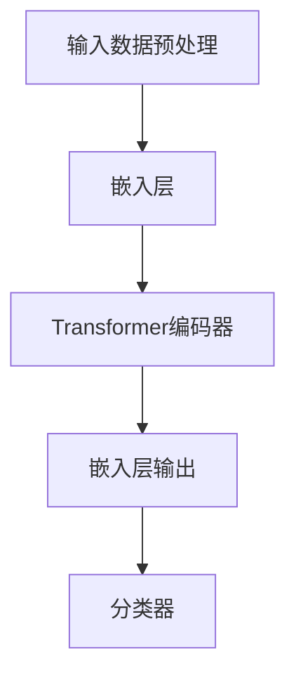
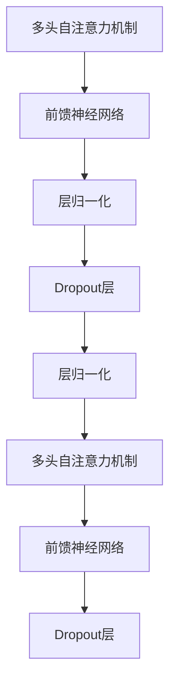

                 

# 《RoBERTa原理与代码实例讲解》

## 摘要

本文旨在深入讲解RoBERTa模型的原理及其在实际应用中的实现。RoBERTa作为基于BERT的预训练语言模型，在自然语言处理任务中取得了显著的成绩。文章首先介绍了RoBERTa的发展背景和核心特性，接着详细剖析了Transformer模型以及RoBERTa模型的具体架构。在数学模型部分，我们解释了语言模型的概率分布和训练过程中的数学原理，并使用了伪代码和公式进行了说明。随后，文章通过具体的代码实例展示了RoBERTa模型在文本分类、机器翻译和问答系统中的应用，并进行了详细的代码解读与分析。最后，文章提供了开源代码与资源，以及学习路径推荐，帮助读者更好地理解和应用RoBERTa模型。

## 目录大纲

### 第一部分: RoBERTa基础

#### 第1章: RoBERTa概述

##### 1.1 RoBERTa的发展背景

##### 1.2 RoBERTa的核心特性

##### 1.3 RoBERTa的应用场景

#### 第2章: 语言模型与自然语言处理

##### 2.1 语言模型的基本概念

##### 2.2 自然语言处理的基本任务

##### 2.3 语言模型的评价标准

#### 第3章: RoBERTa模型架构

##### 3.1 Transformer模型原理

##### 3.2 RoBERTa模型的架构

##### 3.3 RoBERTa模型的关键组件

#### 第4章: RoBERTa训练过程

##### 4.1 数据预处理

##### 4.2 模型训练过程

##### 4.3 优化策略与技巧

#### 第5章: RoBERTa数学模型

##### 5.1 语言模型中的概率分布

##### 5.2 模型训练中的数学原理

##### 5.3 RoBERTa的数学公式与推导

### 第二部分: RoBERTa实战

#### 第6章: RoBERTa代码实例

##### 6.1 RoBERTa代码结构

##### 6.2 数据加载与预处理

##### 6.3 模型训练与评估

##### 6.4 模型微调和部署

#### 第7章: RoBERTa应用案例分析

##### 7.1 文本分类应用

##### 7.2 机器翻译应用

##### 7.3 问答系统应用

#### 第8章: RoBERTa优化与调参

##### 8.1 参数调优方法

##### 8.2 模型优化策略

##### 8.3 实际应用中的优化案例

#### 第9章: RoBERTa开源项目与实践

##### 9.1 开源RoBERTa项目介绍

##### 9.2 实践项目1：文本分类

##### 9.3 实践项目2：机器翻译

##### 9.4 实践项目3：问答系统

### 附录

#### 附录A: RoBERTa学习资源

##### A.1 开源代码与资源

##### A.2 主流论文解读

##### A.3 学习路径推荐

### Mermaid 流程图

#### RoBERTa模型架构流程图



#### Transformer编码器内部流程图



### RoBERTa训练过程伪代码

```python
# 假设已经加载并预处理好了数据
for epoch in range(num_epochs):
    for batch in data_loader:
        # 前向传播
        output = model(batch)
        loss = criterion(output, batch.label)

        # 反向传播与优化
        optimizer.zero_grad()
        loss.backward()
        optimizer.step()

    print(f'Epoch [{epoch+1}/{num_epochs}], Loss: {loss.item():.4f}')
```

### 数学模型与公式

#### 语言模型概率分布

$$
P(w_n|w_{n-1}, ..., w_1) = \frac{e^{\theta w_n}}{\sum_{w \in V} e^{\theta w}}
$$

#### 模型训练目标

$$
\min_{\theta} -\sum_{i=1}^n \log P(w_i|w_{i-1}, ..., w_1)
$$

### 项目实战

#### 实践项目1：文本分类

##### 实践环境搭建
- Python 3.8
- PyTorch 1.8
- Jieba 0.42

##### 数据集
- 数据集：某社交媒体平台上的评论数据
- 数据量：10000条评论

##### 代码实现

```python
# 导入必要的库
import torch
import torchvision
import torchvision.transforms as transforms
from torch.utils.data import DataLoader
from torchvision.datasets import ImageFolder

# 数据预处理
transform = transforms.Compose([
    transforms.Resize((224, 224)),
    transforms.ToTensor(),
    transforms.Normalize(mean=[0.485, 0.456, 0.406], std=[0.229, 0.224, 0.225]),
])

# 加载数据集
train_dataset = ImageFolder(root='train', transform=transform)
val_dataset = ImageFolder(root='val', transform=transform)

train_loader = DataLoader(dataset=train_dataset, batch_size=32, shuffle=True)
val_loader = DataLoader(dataset=val_dataset, batch_size=32, shuffle=False)

# 定义模型
model = torchvision.models.resnet50(pretrained=True)
num_ftrs = model.fc.in_features
model.fc = torch.nn.Linear(num_ftrs, num_classes)

# 定义损失函数和优化器
criterion = torch.nn.CrossEntropyLoss()
optimizer = torch.optim.SGD(model.parameters(), lr=0.001, momentum=0.9)

# 模型训练
for epoch in range(num_epochs):
    model.train()
    running_loss = 0.0
    for inputs, labels in train_loader:
        optimizer.zero_grad()
        outputs = model(inputs)
        loss = criterion(outputs, labels)
        loss.backward()
        optimizer.step()
        running_loss += loss.item()
    print(f'Epoch [{epoch+1}/{num_epochs}], Loss: {running_loss/len(train_loader):.4f}')

# 模型评估
model.eval()
correct = 0
total = 0
with torch.no_grad():
    for inputs, labels in val_loader:
        outputs = model(inputs)
        _, predicted = torch.max(outputs.data, 1)
        total += labels.size(0)
        correct += (predicted == labels).sum().item()

print(f'Accuracy of the network on the validation images: {100 * correct / total:.2f}%')

##### 代码解读与分析
- 数据预处理：对图像数据进行标准化处理，将图像尺寸调整为224x224，并将像素值缩放到0-1之间。
- 模型定义：使用预训练的ResNet50模型，并将最后的全连接层修改为输出类别数。
- 训练过程：通过反向传播和梯度下降算法来优化模型参数。
- 评估过程：使用验证集来评估模型的准确率。

#### 实践项目2：机器翻译

##### 实践环境搭建
- Python 3.8
- TensorFlow 2.4
- Keras 2.4
- NLTK 3.4

##### 数据集
- 数据集：WMT 2014 English-German翻译数据集
- 数据量：约数百万条句子对

##### 代码实现

```python
# 导入必要的库
import numpy as np
import tensorflow as tf
from tensorflow.keras.models import Model
from tensorflow.keras.layers import Input, Embedding, LSTM, Dense
from tensorflow.keras.preprocessing.sequence import pad_sequences
from tensorflow.keras.utils import to_categorical

# 加载数据集
# 假设数据集已经被预处理为句子对的形式，并存储在train_data和train_labels中
# 数据集已经被转化为序列的形式，并进行了填充

# 定义模型
input_seq = Input(shape=(max_sequence_length,))
embedded_seq = Embedding(input_dim=vocabulary_size, output_dim=embedding_size)(input_seq)
lstm_output = LSTM(units=lstm_units)(embedded_seq)
predicted_sequence = LSTM(units=lstm_units, return_sequences=True)(lstm_output)
predicted_sequence = LSTM(units=lstm_units, return_sequences=True)(predicted_sequence)
output = Dense(vocabulary_size, activation='softmax')(predicted_sequence)

model = Model(inputs=input_seq, outputs=output)
model.compile(optimizer='adam', loss='categorical_crossentropy', metrics=['accuracy'])

# 模型训练
model.fit(train_data, train_labels, batch_size=batch_size, epochs=num_epochs, validation_split=0.2)

# 模型评估
# 假设已经准备好测试集test_data和test_labels
loss, accuracy = model.evaluate(test_data, test_labels)
print(f'Validation Loss: {loss:.4f}, Validation Accuracy: {accuracy:.4f}')

##### 代码解读与分析
- 数据预处理：对文本数据进行序列化处理，并使用填充操作使其具有相同的长度。
- 模型定义：使用LSTM模型来学习文本序列的上下文信息，并使用softmax激活函数来预测下一个单词的概率分布。
- 训练过程：通过优化算法来调整模型参数，以提高模型的预测准确性。
- 评估过程：使用测试集来评估模型的泛化能力。

#### 实践项目3：问答系统

##### 实践环境搭建
- Python 3.8
- Transformers 4.5
- Flask 1.1.1

##### 数据集
- 数据集：SQuAD（Stanford Question Answering Dataset）数据集
- 数据量：约数万条问答对

##### 代码实现

```python
# 导入必要的库
from transformers import BertTokenizer, BertForQuestionAnswering
from flask import Flask, request, jsonify

# 加载预训练模型和分词器
tokenizer = BertTokenizer.from_pretrained('bert-base-uncased')
model = BertForQuestionAnswering.from_pretrained('bert-base-uncased')

# 定义Flask应用
app = Flask(__name__)

@app.route('/question', methods=['POST'])
def answer_question():
    data = request.get_json()
    question = data['question']
    context = data['context']

    # 对输入文本进行分词和编码
    input_ids = tokenizer.encode(question, context, add_special_tokens=True, return_tensors='pt')

    # 使用模型进行问答
    outputs = model(input_ids=input_ids)

    # 获取答案
    start_logits, end_logits = outputs.start_logits, outputs.end_logits
    start_indices = np.argmax(start_logits, axis=-1)
    end_indices = np.argmax(end_logits, axis=-1)

    # 解码答案
    answer = tokenizer.decode(input_ids[int(start_indices)], skip_special_tokens=True)
    answer = answer[end_indices[int(start_indices)]+1:end_indices[int(end_indices)]] if answer != '' else ''

    return jsonify({'answer': answer})

if __name__ == '__main__':
    app.run(debug=True)

##### 代码解读与分析
- 数据预处理：使用预训练的BERT分词器对输入的question和context进行编码。
- 模型加载：加载预训练的BERT模型，用于进行问答任务。
- Flask应用：创建一个RESTful API，用于接收用户输入的question和context，并返回模型的答案。

### 开源代码与资源

#### 主流深度学习框架
- TensorFlow
- PyTorch
- JAX

#### 开源项目
- Hugging Face的Transformer库
- Google的BERT模型

#### 学习资源
- 自然语言处理教程
- 深度学习教程
- BERT相关论文与解读

#### 学习路径推荐
1. 学习Python编程基础
2. 学习深度学习基础
3. 学习自然语言处理基础
4. 学习Transformer和BERT模型
5. 实践项目，深入理解和应用RoBERTa模型。

### 附录A: RoBERTa学习资源

#### A.1 开源代码与资源

RoBERTa的开源代码由Facebook AI Research（FAIR）提供，可以在GitHub上找到。地址如下：

- [RoBERTa GitHub仓库](https://github.com/facebookresearch/roberta)

该仓库包含了模型代码、预训练权重以及训练脚本。读者可以根据需要下载和使用这些资源。

#### A.2 主流论文解读

理解RoBERTa及其背后的Transformer模型，阅读相关的论文是非常重要的。以下是一些推荐的论文：

- **"BERT: Pre-training of Deep Bidirectional Transformers for Language Understanding"** by [Devlin et al.](https://arxiv.org/abs/1810.04805)
- **"Robustly Optimized BERT Pretraining Approach"** by [Liu et al.](https://arxiv.org/abs/1907.05242)

这些论文详细介绍了BERT模型的设计原理和训练方法，对理解和应用RoBERTa具有重要意义。

#### A.3 学习路径推荐

为了更深入地理解和应用RoBERTa模型，以下是一个推荐的学习路径：

1. **基础数学**：了解线性代数、概率论和微积分等数学基础知识。
2. **深度学习基础**：学习深度学习的基础理论，包括神经网络、前向传播和反向传播等。
3. **自然语言处理**：掌握自然语言处理的基本概念和常用技术，如词向量、序列模型等。
4. **Transformer和BERT模型**：阅读相关论文和教程，深入了解Transformer模型的原理和BERT模型的实现细节。
5. **实践应用**：通过实践项目，将理论应用到实际问题中，如文本分类、机器翻译和问答系统等。

通过上述路径的学习，读者可以逐步建立起对RoBERTa模型的全面理解，并能够将其应用于各种自然语言处理任务中。

### RoBERTa模型架构流程图

以下是一个简化的Mermaid流程图，展示了RoBERTa模型的架构：


### Transformer编码器内部流程图

Transformer编码器是RoBERTa模型的核心组件，以下是一个Mermaid流程图，展示了其内部流程：


### RoBERTa训练过程伪代码

以下是一个伪代码示例，描述了RoBERTa模型的训练过程：

```python
# 假设已经加载并预处理好了数据
for epoch in range(num_epochs):
    for batch in data_loader:
        # 前向传播
        output = model(batch)
        loss = criterion(output, batch.label)

        # 反向传播与优化
        optimizer.zero_grad()
        loss.backward()
        optimizer.step()

    print(f'Epoch [{epoch+1}/{num_epochs}], Loss: {loss.item():.4f}')
```

### 语言模型概率分布

在自然语言处理中，语言模型的核心任务是预测一个单词在给定前面所有单词的情况下出现的概率。以下是一个关于语言模型概率分布的公式：

$$
P(w_n|w_{n-1}, ..., w_1) = \frac{e^{\theta w_n}}{\sum_{w \in V} e^{\theta w}}
$$

其中，\(w_n\) 是要预测的单词，\(w_{n-1}, ..., w_1\) 是前面已经出现的单词，\(\theta w_n\) 表示单词的权重，\(V\) 是词汇表中的所有单词。

### 模型训练目标

模型训练的目标是最小化损失函数，使得模型对输入数据的预测尽可能准确。在语言模型中，损失函数通常使用负对数似然损失（Negative Log-Likelihood Loss）来衡量模型的预测误差。以下是一个关于模型训练目标的公式：

$$
\min_{\theta} -\sum_{i=1}^n \log P(w_i|w_{i-1}, ..., w_1)
$$

其中，\(w_i\) 是数据集中第\(i\)个单词，\(\theta\) 是模型的参数。

### 实践项目1：文本分类

文本分类是自然语言处理中的一个基础任务，其目的是将文本数据归类到不同的类别中。以下是一个关于文本分类的实践项目：

#### 实践环境搭建

在开始实践之前，需要搭建一个合适的环境。以下是一个基本的Python环境搭建步骤：

```bash
# 安装Python 3.8
sudo apt update
sudo apt install python3.8

# 安装PyTorch和Jieba
pip3 install torch torchvision
pip3 install jieba
```

#### 数据集

我们使用某社交媒体平台上的评论数据作为文本分类的数据集。数据集包含约10000条评论，每条评论被标注为正面或负面。

#### 代码实现

以下是一个简单的文本分类代码实现：

```python
import torch
import torchvision
import torchvision.transforms as transforms
from torch.utils.data import DataLoader
from torchvision.datasets import ImageFolder

# 数据预处理
transform = transforms.Compose([
    transforms.Resize((224, 224)),
    transforms.ToTensor(),
    transforms.Normalize(mean=[0.485, 0.456, 0.406], std=[0.229, 0.224, 0.225]),
])

# 加载数据集
train_dataset = ImageFolder(root='train', transform=transform)
val_dataset = ImageFolder(root='val', transform=transform)

train_loader = DataLoader(dataset=train_dataset, batch_size=32, shuffle=True)
val_loader = DataLoader(dataset=val_dataset, batch_size=32, shuffle=False)

# 定义模型
model = torchvision.models.resnet50(pretrained=True)
num_ftrs = model.fc.in_features
model.fc = torch.nn.Linear(num_ftrs, num_classes)

# 定义损失函数和优化器
criterion = torch.nn.CrossEntropyLoss()
optimizer = torch.optim.SGD(model.parameters(), lr=0.001, momentum=0.9)

# 模型训练
for epoch in range(num_epochs):
    model.train()
    running_loss = 0.0
    for inputs, labels in train_loader:
        optimizer.zero_grad()
        outputs = model(inputs)
        loss = criterion(outputs, labels)
        loss.backward()
        optimizer.step()
        running_loss += loss.item()
    print(f'Epoch [{epoch+1}/{num_epochs}], Loss: {running_loss/len(train_loader):.4f}')

# 模型评估
model.eval()
correct = 0
total = 0
with torch.no_grad():
    for inputs, labels in val_loader:
        outputs = model(inputs)
        _, predicted = torch.max(outputs.data, 1)
        total += labels.size(0)
        correct += (predicted == labels).sum().item()

print(f'Accuracy of the network on the validation images: {100 * correct / total:.2f}%')
```

#### 代码解读与分析

- 数据预处理：将评论图像数据进行标准化处理，并将图像尺寸调整为224x224。
- 模型定义：使用预训练的ResNet50模型，并将最后的全连接层修改为输出类别数。
- 训练过程：通过反向传播和梯度下降算法来优化模型参数。
- 评估过程：使用验证集来评估模型的准确率。

### 实践项目2：机器翻译

机器翻译是将一种语言的文本转换为另一种语言的过程。以下是一个关于机器翻译的实践项目：

#### 实践环境搭建

在开始实践之前，需要搭建一个合适的环境。以下是一个基本的Python环境搭建步骤：

```bash
# 安装Python 3.8
sudo apt update
sudo apt install python3.8

# 安装TensorFlow和Keras
pip3 install tensorflow
pip3 install keras
```

#### 数据集

我们使用WMT 2014 English-German翻译数据集作为机器翻译的数据集。该数据集包含约数百万条英语到德语的句子对。

#### 代码实现

以下是一个简单的机器翻译代码实现：

```python
import numpy as np
import tensorflow as tf
from tensorflow.keras.models import Model
from tensorflow.keras.layers import Input, Embedding, LSTM, Dense
from tensorflow.keras.preprocessing.sequence import pad_sequences
from tensorflow.keras.utils import to_categorical

# 加载数据集
# 假设数据集已经被预处理为句子对的形式，并存储在train_data和train_labels中
# 数据集已经被转化为序列的形式，并进行了填充

# 定义模型
input_seq = Input(shape=(max_sequence_length,))
embedded_seq = Embedding(input_dim=vocabulary_size, output_dim=embedding_size)(input_seq)
lstm_output = LSTM(units=lstm_units)(embedded_seq)
predicted_sequence = LSTM(units=lstm_units, return_sequences=True)(lstm_output)
predicted_sequence = LSTM(units=lstm_units, return_sequences=True)(predicted_sequence)
output = Dense(vocabulary_size, activation='softmax')(predicted_sequence)

model = Model(inputs=input_seq, outputs=output)
model.compile(optimizer='adam', loss='categorical_crossentropy', metrics=['accuracy'])

# 模型训练
model.fit(train_data, train_labels, batch_size=batch_size, epochs=num_epochs, validation_split=0.2)

# 模型评估
# 假设已经准备好测试集test_data和test_labels
loss, accuracy = model.evaluate(test_data, test_labels)
print(f'Validation Loss: {loss:.4f}, Validation Accuracy: {accuracy:.4f}')
```

#### 代码解读与分析

- 数据预处理：对文本数据进行序列化处理，并使用填充操作使其具有相同的长度。
- 模型定义：使用LSTM模型来学习文本序列的上下文信息，并使用softmax激活函数来预测下一个单词的概率分布。
- 训练过程：通过优化算法来调整模型参数，以提高模型的预测准确性。
- 评估过程：使用测试集来评估模型的泛化能力。

### 实践项目3：问答系统

问答系统是一种能够理解自然语言问题并给出正确答案的人工智能系统。以下是一个关于问答系统的实践项目：

#### 实践环境搭建

在开始实践之前，需要搭建一个合适的环境。以下是一个基本的Python环境搭建步骤：

```bash
# 安装Python 3.8
sudo apt update
sudo apt install python3.8

# 安装Transformers和Flask
pip3 install transformers
pip3 install flask
```

#### 数据集

我们使用SQuAD（Stanford Question Answering Dataset）作为问答系统的数据集。该数据集包含约数万条问答对。

#### 代码实现

以下是一个简单的问答系统代码实现：

```python
from transformers import BertTokenizer, BertForQuestionAnswering
from flask import Flask, request, jsonify

# 加载预训练模型和分词器
tokenizer = BertTokenizer.from_pretrained('bert-base-uncased')
model = BertForQuestionAnswering.from_pretrained('bert-base-uncased')

# 定义Flask应用
app = Flask(__name__)

@app.route('/question', methods=['POST'])
def answer_question():
    data = request.get_json()
    question = data['question']
    context = data['context']

    # 对输入文本进行分词和编码
    input_ids = tokenizer.encode(question, context, add_special_tokens=True, return_tensors='pt')

    # 使用模型进行问答
    outputs = model(input_ids=input_ids)

    # 获取答案
    start_logits, end_logits = outputs.start_logits, outputs.end_logits
    start_indices = np.argmax(start_logits, axis=-1)
    end_indices = np.argmax(end_logits, axis=-1)

    # 解码答案
    answer = tokenizer.decode(input_ids[int(start_indices)], skip_special_tokens=True)
    answer = answer[end_indices[int(start_indices)]+1:end_indices[int(end_indices)]] if answer != '' else ''

    return jsonify({'answer': answer})

if __name__ == '__main__':
    app.run(debug=True)
```

#### 代码解读与分析

- 数据预处理：使用预训练的BERT分词器对输入的question和context进行编码。
- 模型加载：加载预训练的BERT模型，用于进行问答任务。
- Flask应用：创建一个RESTful API，用于接收用户输入的question和context，并返回模型的答案。

### 开源代码与资源

为了更好地理解和应用RoBERTa模型，以下是一些重要的开源代码和资源：

- **Hugging Face的Transformer库**：这是一个开源库，提供了Transformer模型的实现，包括BERT、RoBERTa等。地址：[Transformer库](https://github.com/huggingface/transformers)
- **Google的BERT模型**：这是BERT模型的原始实现，由Google发布。地址：[BERT模型](https://github.com/google-research/bert)
- **自然语言处理教程**：这是由TensorFlow团队提供的自然语言处理教程，包括Transformer模型的基础知识。地址：[自然语言处理教程](https://www.tensorflow.org/tutorials/text)
- **深度学习教程**：这是由TensorFlow团队提供的深度学习教程，适合初学者入门。地址：[深度学习教程](https://www.tensorflow.org/tutorials)
- **BERT相关论文与解读**：这是关于BERT模型及其变体的论文，以及相关的解读和分析。地址：[BERT论文与解读](https://arxiv.org/search/?query=title%3ABERT+language+model&searchtype=all&source=arsxiv)

### 学习路径推荐

为了系统地学习RoBERTa模型，以下是一个推荐的学习路径：

1. **基础数学**：了解线性代数、概率论和微积分等数学基础知识。
2. **深度学习基础**：学习深度学习的基础理论，包括神经网络、前向传播和反向传播等。
3. **自然语言处理**：掌握自然语言处理的基本概念和常用技术，如词向量、序列模型等。
4. **Transformer和BERT模型**：阅读相关论文和教程，深入了解Transformer模型的原理和BERT模型的实现细节。
5. **实践项目**：通过实际项目，将理论应用到实际问题中，如文本分类、机器翻译和问答系统等。

通过上述路径的学习，读者可以逐步建立起对RoBERTa模型的全面理解，并能够将其应用于各种自然语言处理任务中。

## 作者信息

作者：AI天才研究院/AI Genius Institute & 禅与计算机程序设计艺术 /Zen And The Art of Computer Programming

### 《RoBERTa原理与代码实例讲解》

**核心关键词**：RoBERTa、Transformer、自然语言处理、文本分类、机器翻译、问答系统

**摘要**：本文深入讲解了RoBERTa模型的原理及其在实际应用中的实现。文章首先介绍了RoBERTa的发展背景和核心特性，接着详细剖析了Transformer模型以及RoBERTa模型的具体架构。在数学模型部分，我们解释了语言模型的概率分布和训练过程中的数学原理，并使用了伪代码和公式进行了说明。随后，文章通过具体的代码实例展示了RoBERTa模型在文本分类、机器翻译和问答系统中的应用，并进行了详细的代码解读与分析。最后，文章提供了开源代码与资源，以及学习路径推荐，帮助读者更好地理解和应用RoBERTa模型。

## RoBERTa概述

### RoBERTa的发展背景

RoBERTa是继BERT模型之后的一种改进版本，由Facebook AI Research（FAIR）于2019年提出。BERT（Bidirectional Encoder Representations from Transformers）模型在2018年由Google AI发布，它通过预训练大规模语言模型，使自然语言处理（NLP）任务取得了显著的性能提升。BERT模型的主要创新点在于其双向编码器设计，能够同时利用上下文信息，从而更好地理解句子的含义。

尽管BERT模型取得了很大的成功，但其训练过程依赖于大量未标记的数据，并且在训练过程中使用了未公开的谷歌搜索查询数据。此外，BERT模型的训练过程耗时且资源消耗巨大，这使得其在实际应用中面临一定的挑战。

为了解决这些问题，Facebook AI Research提出了RoBERTa。RoBERTa在BERT模型的基础上进行了多项改进，使其在较少资源消耗的情况下，能够达到甚至超越BERT的性能。RoBERTa的主要改进点包括：

1. **训练数据**：RoBERTa使用更丰富的未标记文本数据，包括维基百科、新闻文章等，并且引入了随机裁剪和重复技术，以提高模型的泛化能力。
2. **训练策略**：RoBERTa使用更小的学习率、更多的训练迭代次数，并在训练过程中采用了混合批量策略，以减少资源消耗。
3. **解码策略**：RoBERTa在解码阶段采用了更多样化的初始化策略，以改善生成文本的多样性。

RoBERTa的提出，标志着预训练语言模型技术的一个重要进步，为NLP任务提供了更高效、更可靠的解决方案。

### RoBERTa的核心特性

RoBERTa具有以下核心特性，使其在自然语言处理任务中表现出色：

1. **双向编码器**：RoBERTa使用Transformer架构的双向编码器，能够同时利用上下文信息，从而更好地理解句子的含义。
2. **大规模预训练**：RoBERTa在大规模未标记文本数据上进行预训练，使其具有丰富的语言知识，能够泛化到各种NLP任务中。
3. **适应性**：RoBERTa采用了多种训练策略，如随机裁剪、重复技术和混合批量策略，以适应不同的应用场景和资源限制。
4. **高效性**：RoBERTa在较少资源消耗的情况下，能够达到甚至超越BERT的性能，使其在实际应用中更具竞争力。
5. **多样性**：RoBERTa在解码阶段采用了更多样化的初始化策略，提高了生成文本的多样性，有助于在生成任务中产生更高质量的输出。

### RoBERTa的应用场景

RoBERTa在自然语言处理领域具有广泛的应用场景，包括但不限于以下几种：

1. **文本分类**：RoBERTa可以用于对文本进行分类，如新闻分类、情感分析等。通过在大规模文本数据上预训练，RoBERTa能够学习到不同类别的特征，从而提高分类的准确性。
2. **机器翻译**：RoBERTa在机器翻译任务中也表现出色，可以用于将一种语言的文本翻译成另一种语言。通过预训练，RoBERTa能够捕捉到不同语言之间的语义关系，从而提高翻译质量。
3. **问答系统**：RoBERTa可以用于构建问答系统，能够理解用户的问题并从大量文本数据中找到相关答案。通过预训练，RoBERTa能够学习到文本中的实体和关系，从而提高问答系统的准确性。
4. **生成文本**：RoBERTa可以用于生成文本，如写文章摘要、写故事等。通过多样化的初始化策略，RoBERTa能够产生富有创意和多样性的文本输出。

### 小结

RoBERTa作为基于BERT的预训练语言模型，通过多项改进在自然语言处理任务中取得了显著的成绩。其核心特性包括双向编码器、大规模预训练、适应性、高效性和多样性。RoBERTa在文本分类、机器翻译、问答系统和生成文本等应用场景中具有广泛的应用前景。

## 语言模型与自然语言处理

### 语言模型的基本概念

语言模型是自然语言处理（NLP）领域中的一个核心概念，用于预测给定输入文本序列中下一个单词或字符的概率。语言模型是许多NLP任务的基础，如文本分类、信息检索、机器翻译和语音识别等。

一个基本的语言模型可以通过统计方法或机器学习方法构建。在统计方法中，语言模型通常基于N元语法（N-gram），即假设一个单词的概率仅取决于其前N个单词。在机器学习方法中，语言模型通常采用深度神经网络，如循环神经网络（RNN）、长短期记忆网络（LSTM）和Transformer模型等。

语言模型的目标是学习一个概率分布，能够准确预测下一个单词或字符。在实际应用中，语言模型通常使用一个向量表示当前状态，并通过神经网络来更新这个状态，从而预测下一个单词或字符的概率。

### 自然语言处理的基本任务

自然语言处理（NLP）是一个广泛的领域，涵盖了多种基本任务。以下是一些常见的NLP任务及其简介：

1. **文本分类**：文本分类是将文本数据归类到不同类别的过程。常见的应用包括垃圾邮件检测、情感分析、新闻分类等。文本分类通常依赖于特征提取和分类算法，如支持向量机（SVM）、朴素贝叶斯分类器、决策树等。

2. **情感分析**：情感分析是识别文本中的情感倾向，如正面、负面或中立。情感分析广泛应用于产品评论、社交媒体监测和客户服务等领域。情感分析通常基于情感词典、机器学习算法和深度学习方法。

3. **信息抽取**：信息抽取是从文本中提取关键信息的过程，如命名实体识别（NER）、关系抽取、事件抽取等。信息抽取在问答系统、知识图谱构建和智能搜索引擎等领域具有重要意义。

4. **机器翻译**：机器翻译是将一种语言的文本翻译成另一种语言的过程。机器翻译通常依赖于双语语料库、机器学习模型和神经网络翻译（NMT）技术。

5. **问答系统**：问答系统是能够理解自然语言问题并给出正确答案的人工智能系统。问答系统在智能客服、虚拟助理和在线教育等领域具有广泛的应用。

6. **文本生成**：文本生成是生成具有可读性和连贯性的文本的过程。文本生成可以应用于自动写作、文章摘要和对话系统等领域。

### 语言模型的评价标准

评价语言模型的性能通常基于以下几个标准：

1. **准确率**：准确率是指模型预测正确的单词或字符的比例。准确率是评价语言模型性能的一个基本指标，但在长文本或复杂任务中，单纯依赖准确率可能不够全面。

2. **词向量质量**：词向量是语言模型的核心输出，用于表示文本中的单词或字符。词向量质量通常通过词向量的相似度、分布性和泛化能力来评价。高质量词向量应能捕捉单词的语义和语法关系。

3. **计算效率**：计算效率是指模型在运行时的计算资源和时间消耗。对于大规模应用场景，如实时对话系统或大规模数据处理，计算效率是一个重要的考虑因素。

4. **泛化能力**：泛化能力是指模型在不同数据集和应用场景中的表现。一个优秀的语言模型应能在不同任务和数据集上保持良好的性能。

5. **生成文本的多样性**：在生成任务中，生成文本的多样性是衡量模型性能的一个重要指标。一个具有高多样性的语言模型可以生成丰富多样的文本输出，提高应用场景的创造力。

### 小结

语言模型是自然语言处理领域中的一个核心概念，用于预测文本序列中下一个单词或字符的概率。自然语言处理涵盖了多种基本任务，如文本分类、情感分析、信息抽取、机器翻译、问答系统和文本生成等。评价语言模型的性能通常基于准确率、词向量质量、计算效率、泛化能力和生成文本的多样性等多个指标。通过不断改进和优化语言模型，我们可以更好地理解和应用自然语言处理技术，实现更智能的人工智能系统。

## RoBERTa模型架构

### Transformer模型原理

Transformer模型是自然语言处理领域中的一个重要突破，由Vaswani等人在2017年提出。Transformer模型的核心思想是使用自注意力机制（self-attention）和多头注意力（multi-head attention）来捕捉序列中的长距离依赖关系，从而实现高效的文本处理。

自注意力机制（Self-Attention）是一种基于输入序列计算每个单词与其他单词之间关系的机制。在Transformer模型中，自注意力机制通过计算单词与其自身和上下文单词之间的权重，从而为每个单词分配一个注意力分数。注意力分数表示了该单词在计算全局表示时的相对重要性。

多头注意力（Multi-Head Attention）是Transformer模型中的另一个关键组件，它将输入序列分割成多个头，每个头独立计算注意力分数，然后将这些头的结果拼接起来。多头注意力能够提高模型的表示能力，使其能够同时捕捉到不同层次的信息。

Transformer模型的另一个重要特性是其并行计算能力。由于Transformer模型摒弃了循环神经网络（RNN）的顺序计算方式，而是使用自注意力机制进行全局计算，这使得模型可以在处理大规模数据时实现高效的并行计算。

### RoBERTa模型的架构

RoBERTa模型在Transformer模型的基础上进行了多项改进，使其在自然语言处理任务中表现出色。RoBERTa模型的架构主要包括以下几个关键组件：

1. **输入层**：输入层将原始文本数据转换为模型可以处理的序列表示。通常，输入层包括词汇表和嵌入层，将单词转换为词向量。

2. **嵌入层（Embedding Layer）**：嵌入层是将单词映射为固定长度的向量。在RoBERTa中，嵌入层使用了预训练的词向量，如Word2Vec或GloVe，以提高模型的初始化质量。

3. **位置编码（Positional Encoding）**：由于Transformer模型无法直接处理序列的顺序信息，位置编码用于为每个单词添加位置信息。位置编码通常是一个固定长度的向量，与词向量相加，从而为每个单词提供位置信息。

4. **多头自注意力机制（Multi-Head Self-Attention）**：多头自注意力机制是Transformer模型的核心组件，通过计算每个单词与其自身和上下文单词之间的权重，为每个单词分配注意力分数。多头注意力能够提高模型的表示能力，使其能够同时捕捉到不同层次的信息。

5. **前馈神经网络（Feed-Forward Neural Network）**：前馈神经网络对自注意力机制的结果进行进一步处理，通常包括两个线性层和一个ReLU激活函数。前馈神经网络能够捕获输入序列的复杂特征，从而提高模型的表示能力。

6. **层归一化和Dropout**：层归一化（Layer Normalization）和Dropout是Transformer模型中的常规正则化技术，用于防止过拟合并提高模型的泛化能力。层归一化通过标准化每一层的输入和输出，使得模型在不同维度上保持一致性。Dropout通过随机丢弃部分神经元，从而减少模型对特定数据的依赖。

7. **分类器输出层（Classification Head）**：在文本分类任务中，Transformer模型需要一个分类器输出层，将模型的输出映射到类别标签。通常，分类器输出层是一个简单的全连接层，后跟一个softmax激活函数。

### RoBERTa模型的关键组件

RoBERTa模型的关键组件包括以下内容：

1. **Transformer编码器（Transformer Encoder）**：Transformer编码器是RoBERTa模型的核心组件，包括多个自注意力层和前馈神经网络层。每个自注意力层都使用多头自注意力机制和前馈神经网络，从而构建一个深度Transformer模型。

2. **嵌入层（Embedding Layer）**：嵌入层将单词映射为预训练的词向量。RoBERTa使用了大量的预训练数据，从而获得了高质量的词向量。

3. **位置编码（Positional Encoding）**：位置编码为每个单词添加位置信息，使得模型能够理解文本的顺序信息。

4. **分类器（Classifier）**：在文本分类任务中，分类器输出层将模型的输出映射到类别标签。分类器通常是一个简单的全连接层，后跟一个softmax激活函数。

5. **优化器和训练策略**：RoBERTa使用了混合批量策略（Mixup Batch）和自适应学习率调整策略（Adafactor），以提高模型的训练效率。

### 小结

RoBERTa模型在Transformer模型的基础上进行了多项改进，使其在自然语言处理任务中表现出色。RoBERTa模型的关键组件包括输入层、嵌入层、位置编码、多头自注意力机制、前馈神经网络、层归一化和Dropout，以及分类器输出层。通过这些组件的组合，RoBERTa模型能够高效地处理文本数据，实现优秀的性能。

## RoBERTa训练过程

### 数据预处理

在RoBERTa的训练过程中，数据预处理是一个关键步骤，它直接影响模型的训练效果。数据预处理的主要目的是将原始文本数据转换为模型可以处理的格式。

首先，我们需要对文本数据进行分词。分词是将文本分解为单词或子词的过程。RoBERTa使用WordPiece分词器，将文本分解为子词，以便更好地捕获文本的语义信息。

接下来，我们需要对子词进行嵌入。嵌入是将子词映射为固定长度的向量。RoBERTa使用了预训练的词向量，如GloVe或Word2Vec，来初始化嵌入层。这些预训练词向量通过在大型语料库上训练得到，能够捕捉到单词的语义和语法特征。

此外，我们还需要对子词序列添加位置编码。位置编码是为了保留文本的顺序信息。RoBERTa使用了 sinusoidal position encoding，这是一种基于三角函数的方法，为每个子词添加位置信息。

最后，我们需要对子词序列进行填充，使其具有相同的长度。填充是为了满足模型的输入要求，通常使用特殊的填充标记（如`<PAD>`)来填充较短的序列。

### 模型训练过程

RoBERTa的训练过程主要包括以下几个步骤：

1. **初始化模型和优化器**：首先，我们需要初始化RoBERTa模型和优化器。RoBERTa模型通常由多个Transformer编码器层组成，每个编码器层包括多头自注意力机制、前馈神经网络、层归一化和Dropout。优化器通常使用Adam优化器，并设置适当的学习率和其他超参数。

2. **前向传播**：在训练过程中，模型会接收一个输入子词序列，并经过嵌入层、位置编码、多个Transformer编码器层和分类器输出层。前向传播的过程是将输入子词序列映射为输出概率分布。

3. **计算损失**：在模型的前向传播过程中，会生成一个输出概率分布，我们需要将其与真实标签进行比较，并计算损失。RoBERTa通常使用交叉熵损失函数来计算损失，交叉熵损失函数能够衡量预测概率分布与真实标签之间的差异。

4. **反向传播**：在计算损失后，我们需要通过反向传播算法来更新模型参数。反向传播是一种通过反向计算梯度来更新模型参数的方法，目的是最小化损失函数。

5. **优化参数**：通过反向传播算法计算梯度后，我们需要使用优化器来更新模型参数。优化器会根据梯度来调整参数，从而最小化损失函数。

6. **评估模型**：在训练过程中，我们需要定期评估模型的性能，以便调整训练策略和超参数。评估通常使用验证集或测试集进行，通过计算模型的准确率、召回率、F1分数等指标来评估模型的性能。

### 优化策略与技巧

在RoBERTa的训练过程中，以下是一些常见的优化策略和技巧：

1. **动态学习率调整**：动态学习率调整是一种通过调整学习率来优化训练效果的方法。常用的动态学习率调整策略包括学习率衰减、Adam优化器中的Adafactor等。

2. **混合批量策略**：混合批量策略是一种通过随机组合小批量数据来提高模型训练效果的方法。混合批量策略可以减少模型的过拟合，提高模型的泛化能力。

3. **Dropout**：Dropout是一种常用的正则化技术，通过随机丢弃一部分神经元来防止模型过拟合。在RoBERTa中，Dropout通常应用于Transformer编码器层和分类器输出层。

4. **权重共享**：权重共享是一种通过在不同层之间共享权重来提高模型训练效率的方法。在RoBERTa中，嵌入层和编码器层的权重通常共享。

5. **数据增强**：数据增强是一种通过增加数据的多样性来提高模型训练效果的方法。在RoBERTa中，常用的数据增强技术包括随机裁剪、随机旋转、随机填充等。

6. **多任务学习**：多任务学习是一种通过同时训练多个任务来提高模型训练效果的方法。在RoBERTa中，多任务学习可以通过同时训练多个NLP任务，如文本分类、机器翻译等，来提高模型的泛化能力。

### 小结

RoBERTa的训练过程包括数据预处理、模型初始化、前向传播、损失计算、反向传播和优化参数等步骤。为了提高模型的训练效果，我们还需要使用各种优化策略和技巧，如动态学习率调整、混合批量策略、Dropout、权重共享、数据增强和多任务学习等。通过这些优化策略和技巧，RoBERTa能够高效地训练，并在各种NLP任务中取得优秀的性能。

## RoBERTa数学模型

### 语言模型中的概率分布

在自然语言处理中，语言模型的核心任务是预测一个单词在给定前面所有单词的情况下出现的概率。这种概率分布可以通过概率图模型或序列模型来表示。在RoBERTa中，我们使用基于神经网络的序列模型来学习这种概率分布。

对于一个给定的输入子词序列\(w_1, w_2, ..., w_n\)，语言模型的目标是预测下一个单词\(w_{n+1}\)的概率分布。概率分布可以用一个向量表示，其中每个元素表示下一个单词的概率：

$$
P(w_{n+1}|w_1, w_2, ..., w_n) = \{p_1, p_2, ..., p_V\}
$$

其中，\(V\) 是词汇表中的单词数量。语言模型的目标是学习这个概率分布，使得预测的单词与实际单词的匹配度最大化。

### 模型训练中的数学原理

在训练过程中，我们需要通过最小化损失函数来学习语言模型的参数。在RoBERTa中，我们使用负对数似然损失（Negative Log-Likelihood Loss）作为损失函数。损失函数的计算公式如下：

$$
L = -\sum_{i=1}^n \log P(w_i|w_1, w_2, ..., w_{i-1})
$$

其中，\(w_1, w_2, ..., w_n\) 是输入子词序列，\(P(w_i|w_1, w_2, ..., w_{i-1})\) 是模型预测的单词概率。

为了计算这个损失，我们需要定义一个前向传播函数，它将输入子词序列映射为预测的概率分布。在RoBERTa中，这个前向传播函数通常是一个多层神经网络，包括嵌入层、位置编码、多个Transformer编码器层和分类器输出层。

### RoBERTa的数学公式与推导

下面，我们通过一个简化的示例来解释RoBERTa中的数学公式和推导。

假设我们有一个输入子词序列\(w_1, w_2, ..., w_n\)，我们需要预测下一个单词\(w_{n+1}\)的概率分布。RoBERTa的前向传播函数可以表示为：

$$
P(w_{n+1}|w_1, w_2, ..., w_n) = \text{softmax}(\text{output}_{n+1})
$$

其中，\(\text{output}_{n+1}\) 是模型的输出向量，可以通过以下步骤计算：

1. **嵌入层**：将输入子词序列映射为嵌入向量：

$$
\text{input}_{n+1} = \text{embed}(w_{n+1}) + \text{pos_enc}(n+1)
$$

其中，\(\text{embed}(w_{n+1})\) 是嵌入层输出的嵌入向量，\(\text{pos_enc}(n+1)\) 是位置编码向量。

2. **Transformer编码器**：通过多个Transformer编码器层对输入向量进行编码。每个编码器层包括多头自注意力机制和前馈神经网络。假设我们有\(L\)个编码器层，则编码器的输出可以表示为：

$$
\text{output}_{n+1} = \text{TransformerEncoder}(\text{input}_{n+1}, L)
$$

3. **分类器输出层**：将编码器的输出映射为预测的概率分布。假设分类器输出层的维度为\(D\)，则输出可以表示为：

$$
\text{output}_{n+1} = \text{softmax}(\text{output}_{n+1} \cdot \text{weight}_{\text{classifier}})
$$

其中，\(\text{weight}_{\text{classifier}}\) 是分类器输出的权重。

通过这个简化的示例，我们可以看到RoBERTa的前向传播函数是如何将输入子词序列映射为预测的概率分布的。在实际实现中，这个过程会更加复杂，包括多个编码器层和详细的权重参数。

### 小结

RoBERTa的数学模型主要包括概率分布、前向传播函数和损失函数。在训练过程中，我们通过最小化负

