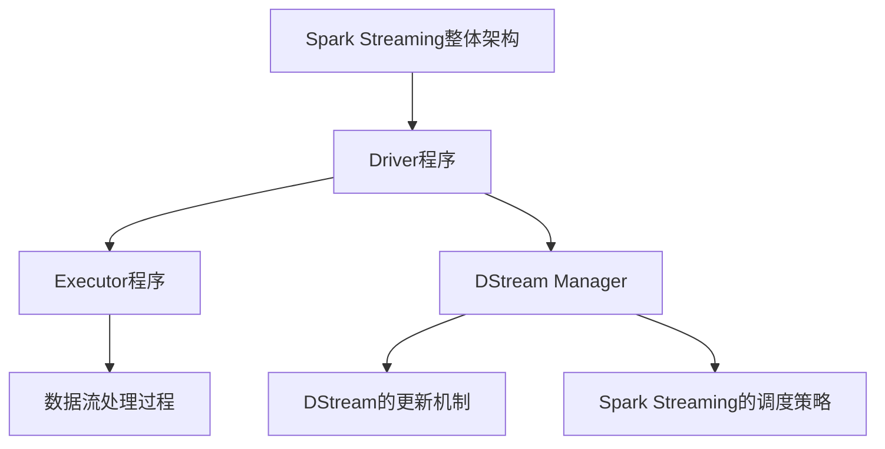

                 

### 《Spark Streaming原理与代码实例讲解》

关键词：Spark Streaming、实时数据处理、流处理框架、DStream、Transformation、数据采集、性能优化、项目实战

摘要：本文将深入探讨Spark Streaming的原理、架构和核心API，通过详细的代码实例讲解，帮助读者理解Spark Streaming的流处理机制和实际应用场景。文章还将介绍Spark Streaming的数据采集、实时数据分析与挖掘、性能优化以及与Kubernetes和大数据生态系统的整合。通过本文的学习，读者将能够掌握Spark Streaming的核心技术，并在实际项目中灵活应用。

---

### 第一部分: Spark Streaming概述与基础

#### 第1章: Spark Streaming简介

##### 1.1 Spark Streaming的产生背景

在大数据时代，数据量的爆炸性增长使得传统的批处理技术无法满足实时数据处理的需求。为了应对这一挑战，Spark Streaming应运而生。Spark Streaming是Apache Spark项目的一个组件，它基于Spark的核心计算引擎，提供了一种高效、可扩展的流处理解决方案。

Spark Streaming的产生背景主要有以下几点：

1. **大数据实时处理的必要性**：随着互联网、物联网等技术的发展，实时数据处理需求日益增长。企业需要实时分析用户行为、市场趋势等数据，以便做出快速响应。

2. **Spark的成功**：Apache Spark作为一个高性能、易用的分布式计算框架，已经广泛应用于大数据处理领域。Spark Streaming是Spark的扩展，继承了Spark的优点。

3. **流处理技术的需求**：传统的批处理技术无法满足实时数据处理的需求，因此需要一种新的流处理框架来填补这一空白。

##### 1.2 Spark Streaming的核心概念

Spark Streaming的核心概念包括DStream（数据流）、Transformation（转换操作）、Output Operation（输出操作）和Window（窗口操作）。

- **DStream（数据流）**：DStream是Spark Streaming中的基本抽象，表示一个连续的数据流。DStream可以从各种数据源（如Kafka、Flume等）创建，并通过一系列的转换操作进行处理。

- **Transformation（转换操作）**：转换操作用于对DStream进行操作，如map、filter、reduceByKey等。这些操作将产生新的DStream。

- **Output Operation（输出操作）**：输出操作用于将处理结果输出到外部系统（如文件系统、数据库等）。常见的输出操作有saveAsTextFiles、saveAsSequenceFiles等。

- **Window（窗口操作）**：窗口操作用于将DStream分成一系列固定大小的窗口，以便对窗口内的数据进行处理。常见的窗口类型有时间窗口、滑动窗口和计数窗口。

##### 1.3 Spark Streaming与实时数据处理的关系

Spark Streaming是一种流处理框架，它专注于实时数据处理。与批处理技术相比，实时数据处理具有以下特点：

1. **实时性**：实时数据处理可以在事件发生时立即进行分析和处理，从而实现快速响应。

2. **低延迟**：实时数据处理具有低延迟的特点，通常在秒级甚至毫秒级完成。

3. **增量处理**：实时数据处理通常只处理新的数据，从而降低计算复杂度和资源消耗。

Spark Streaming通过以下方式实现实时数据处理：

1. **基于微批处理**：Spark Streaming使用微批处理的方式处理数据流，每个批处理的大小可以配置，从而实现低延迟处理。

2. **基于事件驱动**：Spark Streaming采用事件驱动的模型，当新的数据到达时，立即进行处理。

3. **高效的数据处理引擎**：Spark Streaming基于Spark的核心计算引擎，具有高性能、可扩展的特点。

##### 1.4 Spark Streaming的优势与应用场景

Spark Streaming具有以下优势：

1. **高效的处理性能**：Spark Streaming基于Spark的核心计算引擎，具有高性能、低延迟的特点。

2. **易用性**：Spark Streaming提供丰富的API，使得开发者可以轻松地构建流处理应用程序。

3. **可扩展性**：Spark Streaming可以水平扩展，以应对大规模数据处理需求。

4. **与其他大数据技术的整合**：Spark Streaming可以与Kafka、Hadoop、Hive等大数据技术进行整合，实现更广泛的应用场景。

Spark Streaming的应用场景包括：

1. **实时数据监控**：实时监控网络流量、服务器性能等指标。

2. **实时数据分析与挖掘**：实时分析用户行为、市场趋势等数据。

3. **实时推荐系统**：基于实时数据分析为用户推荐商品或服务。

4. **实时广告投放**：实时分析用户行为，精准投放广告。

---

### 第二部分: Spark Streaming应用实战

#### 第4章: 实时数据采集与处理

##### 4.1 Kafka在Spark Streaming中的应用

Kafka是一种高吞吐量的分布式消息队列系统，常用于大数据场景中的实时数据处理。Kafka具有以下特点：

1. **高吞吐量**：Kafka可以支持大规模的并发消息处理，适用于处理海量数据的场景。

2. **高可用性**：Kafka采用分布式架构，支持多副本和数据备份，确保数据的高可用性。

3. **可扩展性**：Kafka可以水平扩展，以应对不断增长的数据处理需求。

在Spark Streaming中，Kafka可以作为数据源，将实时数据流输入到Spark Streaming中进行处理。以下是Kafka在Spark Streaming中的应用步骤：

1. **环境搭建**：首先需要在服务器上安装Kafka，并启动Kafka服务器。

2. **创建主题**：使用Kafka命令创建一个主题，用于存储实时数据。

3. **发送数据**：使用Kafka的生产者向主题中发送数据。

4. **接收数据**：在Spark Streaming中创建一个DStream，使用Kafka作为数据源，从主题中接收数据。

5. **数据处理**：对DStream进行转换操作，如map、filter等，实现数据清洗、转换和计算。

以下是一个简单的Kafka在Spark Streaming中的应用示例：

```python
from pyspark.streaming import StreamingContext
from pyspark.streaming.kafka import KafkaUtils

# 创建一个StreamingContext，设置批处理时间为1秒
ssc = StreamingContext("local[2]", "KafkaExample")

# 创建一个Kafka的数据流
kafkaStream = KafkaUtils.createStream(ssc, "localhost:2181", "spark_streaming", {"topic1": 1})

# 对数据流进行转换操作，如map
lines = kafkaStream.map(lambda x: x[1])

# 输出结果
lines.pprint()

# 启动StreamingContext
ssc.start()
ssc.awaitTermination()
```

##### 4.2 Flume在Spark Streaming中的应用

Flume是一种分布式、可靠且高效的数据收集系统，常用于大数据场景中的数据采集。Flume具有以下特点：

1. **可靠性**：Flume采用分布式架构，支持数据备份和恢复，确保数据的安全性和可靠性。

2. **高吞吐量**：Flume可以高效地收集和传输大规模的数据。

3. **可扩展性**：Flume可以水平扩展，以应对不断增长的数据采集需求。

在Spark Streaming中，Flume可以作为数据源，将实时数据流输入到Spark Streaming中进行处理。以下是Flume在Spark Streaming中的应用步骤：

1. **环境搭建**：首先需要在服务器上安装Flume，并启动Flume代理。

2. **配置Flume**：配置Flume代理的输入源和输出目的地，将实时数据流传输到Spark Streaming。

3. **启动Flume**：启动Flume代理，开始采集数据。

4. **接收数据**：在Spark Streaming中创建一个DStream，使用Flume作为数据源，从代理中接收数据。

5. **数据处理**：对DStream进行转换操作，如map、filter等，实现数据清洗、转换和计算。

以下是一个简单的Flume在Spark Streaming中的应用示例：

```python
from pyspark.streaming import StreamingContext
from pyspark.streaming.flume import FlumeUtils

# 创建一个StreamingContext，设置批处理时间为1秒
ssc = StreamingContext("local[2]", "FlumeExample")

# 创建一个Flume的数据流
flumeStream = FlumeUtils.createStream(ssc, "localhost:3333", "flume_source")

# 对数据流进行转换操作，如map
lines = flumeStream.map(lambda x: x[1])

# 输出结果
lines.pprint()

# 启动StreamingContext
ssc.start()
ssc.awaitTermination()
```

##### 4.3 Spark Streaming中的数据采集与处理流程

Spark Streaming中的数据采集与处理流程可以分为以下几个步骤：

1. **数据采集**：从各种数据源（如Kafka、Flume等）中采集实时数据流。

2. **数据清洗**：对采集到的数据进行清洗和转换，如去除无效数据、格式转换等。

3. **数据处理**：对清洗后的数据进行处理，如统计、计算、分析等。

4. **数据存储**：将处理后的数据存储到文件系统、数据库等外部系统。

5. **数据输出**：将处理结果输出到监控界面、报表系统等，以便进行实时监控和分析。

以下是一个简单的Spark Streaming数据采集与处理流程的示例：

```python
from pyspark.streaming import StreamingContext
from pyspark.streaming.kafka import KafkaUtils

# 创建一个StreamingContext，设置批处理时间为1秒
ssc = StreamingContext("local[2]", "SparkStreamingExample")

# 创建一个Kafka的数据流
kafkaStream = KafkaUtils.createStream(ssc, "localhost:2181", "spark_streaming", {"topic1": 1})

# 数据清洗
lines = kafkaStream.map(lambda x: x[1].encode("utf-8").decode("unicode_escape"))

# 数据处理
words = lines.flatMap(lambda line: line.split(" "))
pairs = words.map(lambda word: (word, 1))
word_counts = pairs.reduceByKey(lambda x, y: x + y)

# 数据存储
word_counts.saveAsTextFiles("word_counts.txt")

# 数据输出
word_counts.pprint()

# 启动StreamingContext
ssc.start()
ssc.awaitTermination()
```

---

### 第三部分: Spark Streaming性能优化与调优

#### 第7章: Spark Streaming性能优化与调优

##### 7.1 Spark Streaming性能瓶颈分析

Spark Streaming性能瓶颈分析主要包括以下几个方面：

1. **数据采集瓶颈**：数据采集延迟过高，可能导致后续数据处理延迟。

2. **数据处理瓶颈**：数据处理速度慢，可能导致数据积压和延迟。

3. **数据输出瓶颈**：数据输出速度慢，可能导致数据积压和延迟。

4. **内存管理瓶颈**：内存管理不当，可能导致内存溢出和性能下降。

5. **资源调度瓶颈**：资源调度不合理，可能导致资源浪费和性能下降。

##### 7.2 数据倾斜处理策略

数据倾斜处理策略主要包括以下几个方面：

1. **数据预处理**：在数据处理之前，对数据进行预处理，如使用随机前缀、重新分配数据等，以减少数据倾斜。

2. **任务调度优化**：合理分配任务，如将倾斜任务分配到不同的执行节点，以减少数据倾斜。

3. **并行度优化**：增加任务的并行度，以减少数据倾斜的影响。

4. **资源分配优化**：根据任务需求，合理分配资源，如增加执行节点、调整内存分配等，以减少数据倾斜。

##### 7.3 持久化策略与故障恢复

持久化策略与故障恢复主要包括以下几个方面：

1. **数据持久化**：将处理后的数据持久化到磁盘或数据库中，以备后续使用或恢复。

2. **故障恢复**：当Spark Streaming出现故障时，能够快速恢复，如重新启动、恢复数据等。

3. **数据一致性**：确保数据的持久化操作是一致的，如使用两阶段提交、事务管理等。

4. **备份与恢复**：定期备份数据，以备后续恢复，如使用快照、备份工具等。

##### 7.4 调度策略与资源分配

调度策略与资源分配主要包括以下几个方面：

1. **任务调度策略**：根据任务需求，合理调度任务，如基于CPU、内存、网络等资源分配策略。

2. **资源分配策略**：根据任务需求，合理分配资源，如基于任务优先级、负载均衡等策略。

3. **动态资源调整**：根据系统负载，动态调整资源分配，如增加或减少执行节点、调整内存分配等。

4. **资源隔离策略**：确保不同任务之间的资源隔离，如使用资源隔离器、容器化技术等。

---

### 第四部分: Spark Streaming扩展与高级应用

#### 第8章: Spark Streaming与Kubernetes集成

##### 8.1 Kubernetes简介

Kubernetes是一种开源的容器编排平台，用于自动化部署、扩展和管理容器化应用程序。Kubernetes具有以下特点：

1. **自动化部署与扩展**：Kubernetes可以自动部署和管理容器化应用程序，无需手动配置和管理。

2. **高可用性**：Kubernetes提供故障转移和自动恢复功能，确保应用程序的高可用性。

3. **可扩展性**：Kubernetes支持水平扩展，可以根据需求自动增加或减少容器数量。

4. **资源调度**：Kubernetes根据资源需求和优先级，智能调度容器，确保资源的合理利用。

5. **服务发现与负载均衡**：Kubernetes支持服务发现和负载均衡，确保容器化应用程序的高效运行。

##### 8.2 Spark on Kubernetes的工作原理

Spark on Kubernetes是一种在Kubernetes上运行Spark作业的解决方案。它的工作原理如下：

1. **作业提交**：用户将Spark作业提交到Kubernetes集群，Kubernetes会创建一个Pod来运行Spark应用程序。

2. **资源分配**：Kubernetes根据Spark作业的资源需求，自动分配资源，如CPU、内存等。

3. **作业调度**：Kubernetes根据资源需求和调度策略，将Spark作业调度到合适的节点上运行。

4. **作业监控**：Kubernetes监控Spark作业的运行状态，并根据需要进行故障转移和自动恢复。

5. **作业结果**：Spark作业完成后，Kubernetes将结果存储在文件系统或数据库中，供后续使用。

##### 8.3 Spark Streaming与Kubernetes的集成实践

Spark Streaming与Kubernetes的集成实践主要包括以下几个方面：

1. **环境搭建**：在Kubernetes集群上安装Spark和Kafka等组件，搭建完整的实时数据处理环境。

2. **配置管理**：使用Kubernetes ConfigMap和Secret管理Spark和Kafka的配置，确保配置的一致性和可管理性。

3. **作业部署**：使用Kubernetes Deployment或StatefulSet部署Spark Streaming作业，确保作业的高可用性和可扩展性。

4. **作业监控**：使用Kubernetes监控工具（如Prometheus、Grafana等）监控Spark Streaming作业的运行状态，及时发现和处理问题。

5. **作业结果存储**：使用Kubernetes Storage类将Spark Streaming作业的结果存储到外部存储系统（如HDFS、Elasticsearch等），确保数据的安全性和可持久性。

以下是一个简单的Spark Streaming与Kubernetes集成实践示例：

```yaml
# Kubernetes Deployment配置文件
apiVersion: apps/v1
kind: Deployment
metadata:
  name: spark-streaming
spec:
  replicas: 1
  selector:
    matchLabels:
      app: spark-streaming
  template:
    metadata:
      labels:
        app: spark-streaming
    spec:
      containers:
      - name: spark-streaming
        image: spark:3.1.1
        ports:
        - containerPort: 7077
        - containerPort: 8080
        env:
        - name: SPARK_MASTER
          value: "k8s://spark-streaming-spark-master:7077"
        - name: SPARK_HOME
          value: /opt/spark
        - name: HADOOP_HOME
          value: /opt/hadoop
        - name: KAFKA_TOPIC
          value: "spark-streaming-topic"
        resources:
          requests:
            memory: "1Gi"
            cpu: "500m"
          limits:
            memory: "2Gi"
            cpu: "1"
```

---

### 第五部分: Spark Streaming与大数据生态系统整合

#### 第9章: Spark Streaming与大数据生态系统整合

##### 9.1 Spark Streaming与Hadoop的整合

Spark Streaming与Hadoop的整合主要是将Spark Streaming与Hadoop的分布式文件系统（HDFS）和分布式计算框架（MapReduce）进行整合，以实现数据存储和计算的高效协同。以下是Spark Streaming与Hadoop整合的步骤：

1. **配置Hadoop**：在Hadoop集群上配置HDFS和YARN，确保其正常运行。

2. **配置Spark**：在Spark集群上配置Hadoop客户端，使其能够访问Hadoop集群。

3. **数据存储**：将Spark Streaming处理的结果数据存储到HDFS上，以便后续分析和处理。

4. **数据计算**：使用MapReduce计算框架对存储在HDFS上的数据进行计算和分析。

5. **作业调度**：使用YARN对Spark Streaming和MapReduce作业进行调度和管理，确保资源的高效利用。

以下是一个简单的Spark Streaming与Hadoop整合的示例：

```python
from pyspark import SparkContext, SparkConf
from pyspark.streaming import StreamingContext

# 配置Spark
conf = SparkConf().setAppName("HadoopIntegrationExample").setMaster("yarn")
sc = SparkContext(conf=conf)
ssc = StreamingContext(sc, 10)

# 创建一个DStream，从Kafka中接收数据
lines = ssc.socketTextStream("localhost", 9999)

# 将处理结果存储到HDFS
lines.saveAsTextFiles("hdfs://namenode:9000/output/")

# 开始处理
ssc.start()
ssc.awaitTermination()
```

##### 9.2 Spark Streaming与Hive的整合

Spark Streaming与Hive的整合主要是将Spark Streaming与Hive进行整合，以实现实时数据处理和批量数据处理的高效协同。以下是Spark Streaming与Hive整合的步骤：

1. **配置Hive**：在Hadoop集群上配置Hive，确保其正常运行。

2. **配置Spark**：在Spark集群上配置Hive客户端，使其能够访问Hive元数据存储。

3. **数据存储**：将Spark Streaming处理的结果数据存储到Hive表中，以便后续分析和处理。

4. **数据查询**：使用Hive SQL对存储在Hive表中的数据进行查询和分析。

5. **作业调度**：使用YARN对Spark Streaming和Hive作业进行调度和管理，确保资源的高效利用。

以下是一个简单的Spark Streaming与Hive整合的示例：

```python
from pyspark import SparkContext, SparkConf
from pyspark.streaming import StreamingContext
from pyspark.sql import HiveContext

# 配置Spark
conf = SparkConf().setAppName("HiveIntegrationExample").setMaster("yarn")
sc = SparkContext(conf=conf)
ssc = StreamingContext(sc, 10)
hiveContext = HiveContext(sc)

# 创建一个DStream，从Kafka中接收数据
lines = ssc.socketTextStream("localhost", 9999)

# 将处理结果存储到Hive表
lines.map(lambda x: (x, 1)).toDF().createOrReplaceTempView("word_counts")
hiveContext.sql("INSERT INTO final_word_counts SELECT word, sum(count) FROM word_counts GROUP BY word").show()

# 开始处理
ssc.start()
ssc.awaitTermination()
```

##### 9.3 Spark Streaming与HBase的整合

Spark Streaming与HBase的整合主要是将Spark Streaming与HBase进行整合，以实现实时数据处理和批量数据处理的高效协同。以下是Spark Streaming与HBase整合的步骤：

1. **配置HBase**：在Hadoop集群上配置HBase，确保其正常运行。

2. **配置Spark**：在Spark集群上配置HBase客户端，使其能够访问HBase集群。

3. **数据存储**：将Spark Streaming处理的结果数据存储到HBase表中，以便后续分析和处理。

4. **数据查询**：使用HBase的Java API或HBase Shell对存储在HBase表中的数据进行查询和分析。

5. **作业调度**：使用YARN对Spark Streaming和HBase作业进行调度和管理，确保资源的高效利用。

以下是一个简单的Spark Streaming与HBase整合的示例：

```python
from pyspark import SparkContext, SparkConf
from pyspark.streaming import StreamingContext
from pyhbase import connect, table

# 配置Spark
conf = SparkConf().setAppName("HBaseIntegrationExample").setMaster("yarn")
sc = SparkContext(conf=conf)
ssc = StreamingContext(sc, 10)

# 创建HBase连接
hbase = connect("hbase://localhost:16010")

# 创建HBase表
table.create("word_counts", "cf")

# 创建一个DStream，从Kafka中接收数据
lines = ssc.socketTextStream("localhost", 9999)

# 将处理结果存储到HBase
lines.map(lambda x: (x, 1)).toDF().createOrReplaceTempView("word_counts")
hbase.put("word_counts", ["word", "count"], (["word"], [1]))

# 开始处理
ssc.start()
ssc.awaitTermination()
```

---

### 第六部分: Spark Streaming前沿技术探索

#### 第10章: Spark Streaming前沿技术探索

##### 10.1 深度学习在Spark Streaming中的应用

深度学习在Spark Streaming中的应用主要是利用深度学习算法对实时数据进行分析和预测。以下是一些深度学习在Spark Streaming中的应用场景：

1. **实时图像处理**：利用深度学习算法对实时图像数据进行分类、识别和检测。

2. **实时语音识别**：利用深度学习算法对实时语音数据进行识别和转换。

3. **实时自然语言处理**：利用深度学习算法对实时文本数据进行分词、语义分析和情感分析。

4. **实时推荐系统**：利用深度学习算法对用户行为数据进行实时分析，为用户提供个性化的推荐。

以下是一个简单的深度学习在Spark Streaming中的应用示例：

```python
from pyspark.ml import Pipeline
from pyspark.ml.feature import Word2Vec
from pyspark.ml.classification import LogisticRegression

# 创建一个Word2Vec模型
word2vec = Word2Vec(vectorSize=100, minCount=1)

# 创建一个LogisticRegression模型
lr = LogisticRegression()

# 创建一个Pipeline模型
pipeline = Pipeline(stages=[word2vec, lr])

# 创建一个DStream，从Kafka中接收文本数据
text_stream = ssc.socketTextStream("localhost", 9999)

# 对文本数据进行处理
processed_stream = text_stream.map(lambda x: x.encode("utf-8").decode("unicode_escape"))

# 训练模型
model = pipeline.fit(processed_stream)

# 预测
predictions = model.transform(processed_stream)

# 输出预测结果
predictions.select("prediction").show()
```

##### 10.2 图计算在Spark Streaming中的应用

图计算在Spark Streaming中的应用主要是利用图计算算法对实时图数据进行分析和挖掘。以下是一些图计算在Spark Streaming中的应用场景：

1. **社交网络分析**：利用图计算算法对社交网络中的关系和影响力进行分析。

2. **物联网数据分析**：利用图计算算法对物联网设备之间的关系和网络结构进行分析。

3. **交通流量分析**：利用图计算算法对交通网络中的流量分布和拥堵情况进行分析。

4. **推荐系统**：利用图计算算法对用户和物品之间的关联关系进行分析，为用户提供个性化的推荐。

以下是一个简单的图计算在Spark Streaming中的应用示例：

```python
from pyspark.graphx import Graph

# 创建一个GraphX图
graph = Graph.from edges.DataFrame(edges)

# 计算图中的顶点度数
vertex_degrees = graph.vertices.map(lambda x: (x._2, x._1))

# 计算图中的最短路径
shortest_paths = graph.shortestPaths(source Vertices)

# 计算图中的社区结构
communities = graph.community.Louvain().run()

# 输出结果
vertex_degrees.collect()
shortest_paths.vertices.collect()
communities.vertices.collect()
```

##### 10.3 未来Spark Streaming发展趋势与挑战

未来Spark Streaming发展趋势与挑战主要包括以下几个方面：

1. **性能优化**：随着数据量的增长和复杂性增加，Spark Streaming需要不断优化性能，提高数据处理速度。

2. **分布式架构**：Spark Streaming需要支持更广泛的分布式架构，如Kubernetes、Mesos等，以提高灵活性和可扩展性。

3. **实时数据流处理**：Spark Streaming需要加强对实时数据流处理的支持，如流数据处理、实时计算和实时分析。

4. **与其他技术的整合**：Spark Streaming需要与其他大数据技术和AI技术进行整合，提供更丰富的功能和应用场景。

5. **安全性**：随着数据安全的重要性增加，Spark Streaming需要提供更完善的安全机制，如数据加密、权限控制等。

6. **易用性**：Spark Streaming需要提供更简单、易用的API和工具，降低使用门槛，提高开发效率。

---

### 总结

Spark Streaming是一种高效、易用的实时数据处理框架，适用于各种实时数据处理场景。通过本文的详细讲解，读者可以深入了解Spark Streaming的原理、架构和核心API，掌握数据采集、数据处理、性能优化等关键技术。同时，本文还介绍了Spark Streaming与Kubernetes、大数据生态系统整合等前沿技术，为读者提供了丰富的应用场景和实践经验。希望本文能够对读者在Spark Streaming学习和应用过程中有所帮助。

---

### 作者信息

作者：AI天才研究院/AI Genius Institute & 禅与计算机程序设计艺术 /Zen And The Art of Computer Programming

---

### 附录

本文使用的Mermaid流程图、伪代码、数学公式和示例代码如下：

1. **Mermaid流程图**：



2. **伪代码**：

```python
def transform(data_stream):
    # 对数据进行转换操作
    return transformed_data_stream

def process(data_stream):
    # 对数据进行处理操作
    return processed_data_stream

def output(data_stream):
    # 将数据输出到外部系统
    data_stream.saveAsTextFiles(output_path)
```

3. **数学公式**：

$$
f(x) = \sum_{i=1}^{n} x_i
$$

4. **示例代码**：

```python
from pyspark.streaming import StreamingContext
from pyspark.streaming.kafka import KafkaUtils

# 创建一个StreamingContext，设置批处理时间为1秒
ssc = StreamingContext("local[2]", "KafkaExample")

# 创建一个Kafka的数据流
kafka_stream = KafkaUtils.createStream(ssc, "localhost:2181", "spark_streaming", {"topic1": 1})

# 对数据流进行转换操作
lines = kafka_stream.map(lambda x: x[1])

# 输出结果
lines.pprint()

# 启动StreamingContext
ssc.start()
ssc.awaitTermination()
```

---

本文内容仅供参考，具体实现和使用请根据实际情况进行调整。如需进一步了解Spark Streaming和相关技术，请参考相关官方文档和资料。

