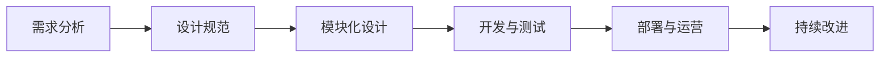

                 

### 《To B市场的产品标准化策略》

> **关键词**：To B市场、产品标准化、策略、模块化、生命周期管理、持续改进

> **摘要**：
> 本文旨在深入探讨To B市场中的产品标准化策略。我们将首先理解To B市场及其特点，然后分析产品标准化策略的意义和演变，随后详细介绍构建标准化策略的核心概念、算法原理，以及实施过程中的关键步骤和问题解决方法。通过具体案例分析，我们将探讨标准化策略在实际中的应用，并探讨标准化产品的持续改进。最后，我们将展望产品标准化策略的未来，并提出优化方法和未来发展建议。

### 《To B市场的产品标准化策略》目录大纲

---

#### 第一部分：引言

**第1章：理解To B市场的产品标准化策略**  
1.1 什么是To B市场  
1.2 To B市场产品标准化的意义  
1.3 产品标准化策略的演变

**第2章：核心概念与联系**  
2.1 产品标准化与模块化  
2.2 产品生命周期管理  
2.3 产品标准化与定制化  
2.4 Mermaid流程图：产品标准化策略流程

#### 第二部分：构建标准化策略

**第3章：核心算法原理讲解**  
3.1 需求分析算法  
3.2 产品设计算法  
3.3 标准化产品实现算法  
3.4 伪代码：需求分析算法

**第4章：产品标准化策略实施**  
4.1 实施前的准备工作  
4.2 标准化策略实施步骤  
4.3 标准化策略实施中的问题与解决方法

**第5章：案例分析**  
5.1 案例一：A公司的产品标准化策略  
5.2 案例二：B公司的产品标准化策略  
5.3 案例三：C公司的产品标准化策略

**第6章：标准化产品持续改进**  
6.1 持续改进的意义  
6.2 持续改进的方法  
6.3 持续改进的实践案例

#### 第三部分：策略优化与未来展望

**第7章：策略优化**  
7.1 策略优化的必要性  
7.2 策略优化方法  
7.3 策略优化实践

**第8章：产品标准化策略的未来展望**  
8.1 行业发展趋势  
8.2 技术创新对产品标准化的影响  
8.3 未来产品标准化策略的展望

**第9章：结论**  
9.1 产品标准化策略的总结  
9.2 对企业发展的意义  
9.3 对个人发展的启示

#### 附录

**附录A：产品标准化策略资源汇总**  
A.1 标准化相关法律法规  
A.2 标准化相关书籍推荐  
A.3 标准化相关网站与工具推荐

**附录B：案例代码与资源**  
B.1 A公司产品标准化策略代码示例  
B.2 B公司产品标准化策略代码示例  
B.3 C公司产品标准化策略代码示例  
B.4 源代码详细解读与代码分析

---

现在，我们已经为文章构建了一个详细的目录大纲。接下来，我们将逐个章节进行深入分析和撰写，确保每一部分都包含丰富的内容和专业的技术语言。让我们开始第一步：深入理解To B市场的特点和产品标准化策略的意义。在接下来的章节中，我们将使用逻辑清晰、结构紧凑、简单易懂的专业的技术语言，通过一步一步的分析推理，帮助读者深入了解To B市场的产品标准化策略。让我们开始吧！

### 第一部分：引言

在数字化和信息化的浪潮下，企业面临着巨大的转型压力。To B市场作为企业服务的重要领域，其产品标准化策略显得尤为重要。本文将从To B市场的定义、产品标准化的意义以及策略的演变三个方面，为您深入剖析产品标准化策略的核心。

#### 第1章：理解To B市场的产品标准化策略

##### 1.1 什么是To B市场

To B市场，即面向企业（Business）的市场，与面向消费者（Consumer）的To C市场相对应。它主要服务于各类企业，提供专业化的产品和服务，帮助企业提升运营效率、降低成本、实现数字化转型。To B市场的产品和服务范围广泛，涵盖了云计算、大数据、人工智能、物联网等多个领域。

To B市场有其独特的特点：

1. **客户需求复杂**：企业客户的需求多样且复杂，需要量身定制的解决方案。
2. **长决策周期**：企业采购决策涉及多个部门和层级，决策周期较长。
3. **高依赖性**：企业产品和服务往往与企业核心业务紧密相关，一旦选择错误，影响巨大。
4. **定制化与标准化并存**：虽然定制化需求较高，但标准化产品和服务同样具有市场空间。

##### 1.2 To B市场产品标准化的意义

产品标准化在To B市场中具有重要意义：

1. **提升效率**：标准化产品可以减少开发和实施的时间，提高生产效率。
2. **降低成本**：标准化产品可以通过规模化生产降低成本，提高竞争力。
3. **增强兼容性**：标准化产品便于不同系统之间的集成和互操作。
4. **提升用户体验**：统一的产品规范可以提高用户体验，降低使用难度。
5. **便于管理**：标准化产品便于企业进行产品管理和生命周期管理。

##### 1.3 产品标准化策略的演变

产品标准化策略经历了从无到有、从简单到复杂的过程：

1. **早期阶段**：产品标准化策略主要依赖于行业标准和法规，以满足基本需求。
2. **发展阶段**：随着技术的进步，企业开始注重产品的模块化和组件化，以提高定制化和可扩展性。
3. **现代阶段**：产品标准化策略开始结合大数据、人工智能等技术，实现个性化定制和智能化管理。

在接下来的章节中，我们将深入探讨产品标准化的核心概念与联系，详细讲解构建标准化策略的核心算法原理，并分析标准化策略实施过程中的关键步骤和问题解决方法。通过案例分析，我们将展示标准化策略在实际中的应用，并探讨其持续改进的方法。最后，我们将展望产品标准化策略的未来，提出优化方法和未来发展建议。

### 第二部分：核心概念与联系

在深入探讨To B市场的产品标准化策略之前，我们需要明确几个核心概念，并理解它们之间的联系。以下是产品标准化、模块化、产品生命周期管理、定制化以及Mermaid流程图等概念及其相互关系。

#### 第2章：核心概念与联系

##### 2.1 产品标准化与模块化

产品标准化是指通过制定统一的标准和规范，确保产品在不同环境下的兼容性和互操作性。模块化则是将产品划分为多个独立的功能模块，每个模块可以单独设计、开发、测试和部署。

- **关系**：模块化是产品标准化的实现手段。通过模块化，我们可以将标准化产品灵活地组合和重构，满足不同客户的需求。
- **实例**：在云计算领域，虚拟机、存储、网络等基础设施服务可以通过模块化进行组合，形成不同的云计算产品。

##### 2.2 产品生命周期管理

产品生命周期管理（PLM）是指从产品概念形成到最终退役的整个过程中，对产品进行管理的一系列活动和流程。它包括需求分析、设计、开发、测试、部署、运营和维护等阶段。

- **关系**：产品标准化是产品生命周期管理的重要一环。在产品开发过程中，标准化可以帮助企业有效地管理和控制产品的各个阶段。
- **实例**：在软件行业中，产品生命周期管理要求开发团队遵循统一的设计规范和编码标准，以确保产品的可维护性和可扩展性。

##### 2.3 产品标准化与定制化

定制化是指根据客户的具体需求，对产品进行个性化调整和配置。产品标准化与定制化之间存在一定的矛盾，但也是相互补充的关系。

- **关系**：标准化可以提供定制化的基础，通过标准化模块，企业可以快速响应客户需求，实现定制化服务。
- **实例**：在制造行业，企业可以通过标准化零部件实现快速装配和个性化定制，提高生产效率和产品质量。

##### 2.4 Mermaid流程图：产品标准化策略流程

Mermaid是一种简单易用的Markdown图表工具，可以用来绘制流程图。以下是一个简单的产品标准化策略流程图：



- **关系**：这个流程图展示了产品标准化策略的基本步骤，从需求分析到持续改进，每个步骤都是相互关联的。
- **实例**：在实际应用中，企业可以根据具体的业务场景和需求，调整和完善这个流程，实现产品标准化的全面管理。

通过以上核心概念和联系的分析，我们可以更好地理解产品标准化策略的构建和实施。在接下来的章节中，我们将详细讲解构建标准化策略的核心算法原理，并分析标准化策略实施过程中的关键步骤和问题解决方法。

### 第三部分：构建标准化策略

在了解了To B市场产品标准化的核心概念和联系后，我们将深入探讨如何构建和实施产品标准化策略。这一部分将分为三个章节，分别介绍核心算法原理、实施步骤以及实施中的问题与解决方法。

#### 第3章：核心算法原理讲解

产品标准化策略的实施离不开科学的算法支持。以下是构建标准化策略所需的核心算法原理及其应用。

##### 3.1 需求分析算法

需求分析是产品标准化策略的第一步，通过算法可以系统地收集、分析和整理客户需求。以下是需求分析算法的伪代码示例：

```python
# 需求分析算法伪代码
def analyze_requirements(customers, stakeholders):
    requirements = []
    for customer in customers:
        for stakeholder in stakeholders:
            if customer == stakeholder:
                requirements.append(stakeholder.get_requirements())
    return requirements
```

- **算法原理**：该算法通过遍历客户和利益相关者，收集并整理他们的需求。
- **实例**：在实际应用中，企业可以使用问卷调查、访谈等方式获取需求，然后通过算法进行整理和分析。

##### 3.2 产品设计算法

产品设计是基于需求分析的成果，通过算法将需求转化为具体的产品设计方案。以下是产品设计算法的伪代码示例：

```mermaid
# 产品设计算法伪代码
function design_product(requirements):
    modules = []
    for requirement in requirements:
        module = create_module(requirement)
        modules.append(module)
    product = integrate_modules(modules)
    return product
```

- **算法原理**：该算法通过创建和整合模块，实现产品的设计。
- **实例**：在软件开发中，可以根据需求创建不同的模块，然后通过接口进行整合，形成完整的产品。

##### 3.3 标准化产品实现算法

标准化产品的实现需要通过算法确保产品的规范性和一致性。以下是标准化产品实现算法的伪代码示例：

```python
# 标准化产品实现算法伪代码
def implement_standard_product(product_design):
    standard_modules = []
    for module in product_design:
        standard_module = standardize_module(module)
        standard_modules.append(standard_module)
    final_product = integrate_standard_modules(standard_modules)
    return final_product
```

- **算法原理**：该算法通过对模块进行标准化处理，确保产品的规范性和一致性。
- **实例**：在实际开发中，可以通过代码审查、测试等手段确保每个模块都符合标准，从而实现标准化产品的实现。

##### 3.4 伪代码：需求分析算法

在产品标准化的过程中，需求分析是非常关键的一步。以下是需求分析算法的详细伪代码：

```python
# 需求分析算法伪代码
def analyze_requirements(customers, stakeholders):
    requirements = []
    for customer in customers:
        for stakeholder in stakeholders:
            if customer == stakeholder:
                requirements.append(stakeholder.get_requirements())
    return requirements

# 实例化需求分析
customers = ["客户A", "客户B", "客户C"]
stakeholders = ["利益相关者1", "利益相关者2", "利益相关者3"]
requirements = analyze_requirements(customers, stakeholders)
print(requirements)
```

- **算法实现**：该算法首先遍历所有客户和利益相关者，然后检查它们是否相同，如果是，则收集需求。
- **输出结果**：输出一个包含所有需求的列表。

通过上述算法原理的讲解，我们可以更好地理解产品标准化策略的构建过程。在下一章中，我们将详细介绍标准化策略的实施步骤和关键问题。

### 第4章：产品标准化策略实施

产品标准化策略的实施是将理论转化为实践的关键步骤。在这个阶段，企业需要根据既定的策略和算法，进行详细的规划、实施和管理。以下是产品标准化策略实施的核心步骤和可能遇到的问题及解决方法。

#### 4.1 实施前的准备工作

在正式实施标准化策略之前，企业需要进行充分的准备工作，包括以下方面：

1. **团队组织**：组建一个跨部门的项目团队，确保团队中包含市场、研发、运维等不同领域的专家。
2. **资源准备**：准备好必要的硬件、软件资源和开发工具，如服务器、数据库、开发环境等。
3. **培训与文档**：对团队成员进行标准化策略和相关技能的培训，并准备好详细的项目文档和流程手册。
4. **需求确认**：与客户和利益相关者确认需求，确保所有相关方对标准化的目标和范围有清晰的认识。

#### 4.2 标准化策略实施步骤

标准化策略的实施可以分为以下几个步骤：

1. **需求分析**：通过前期的需求收集和分析，确保需求准确、完整，并形成需求文档。
2. **模块化设计**：根据需求文档，设计产品的模块化架构，确保每个模块具有独立的功能和接口。
3. **开发与测试**：开发团队根据模块设计进行编码，并进行单元测试、集成测试和系统测试，确保每个模块和整个产品的质量。
4. **标准化处理**：对每个模块进行标准化处理，包括代码审查、接口测试、性能测试等，确保产品符合既定的标准。
5. **部署与运营**：将标准化产品部署到客户环境中，并进行上线测试、运维支持和维护。
6. **反馈与改进**：收集客户反馈，对产品进行持续改进，确保产品能够满足客户需求并保持竞争力。

#### 4.3 标准化策略实施中的问题与解决方法

在实施标准化策略的过程中，企业可能会遇到以下问题：

1. **需求变更**：在项目实施过程中，客户的需求可能会发生变化，导致项目进度和质量受到影响。
   - **解决方法**：建立灵活的需求管理机制，及时响应需求变更，并通过评审和沟通确保变更的合理性和必要性。

2. **技术难题**：在模块化设计和开发过程中，可能会遇到技术难题，如接口兼容性、性能优化等。
   - **解决方法**：组建技术团队，针对具体问题进行技术攻关，并借鉴行业最佳实践和经验。

3. **团队协作**：跨部门团队合作中可能会出现沟通不畅、责任不明等问题，影响项目进度。
   - **解决方法**：建立高效的沟通机制，定期召开项目会议，明确责任分工，确保团队协作顺畅。

4. **测试与质量**：在开发与测试阶段，可能会遇到测试覆盖率不足、缺陷率高的问题。
   - **解决方法**：制定详细的测试计划和测试用例，提高测试覆盖率，加强缺陷管理，确保产品质量。

通过上述标准化策略的实施步骤和问题解决方法，企业可以有效地构建和实施产品标准化策略。在下一章中，我们将通过具体案例来展示标准化策略在实际中的应用，并探讨其效果。

### 第5章：案例分析

通过前几章的理论讲解和实践指导，我们现在将转向具体案例，深入探讨To B市场的企业如何实施产品标准化策略，并分析这些策略的成功与挑战。

#### 5.1 案例一：A公司的产品标准化策略

**背景**：A公司是一家专注于企业级数据存储解决方案的供应商。随着企业客户对数据存储需求的多样化，A公司意识到标准化策略对于提高产品竞争力和客户满意度至关重要。

**实施步骤**：
1. **需求分析**：A公司首先通过客户调研、访谈和市场分析，全面了解客户的需求和痛点。
2. **模块化设计**：根据需求，A公司设计了一系列标准化的数据存储模块，如高性能存储模块、数据备份与恢复模块等。
3. **开发与测试**：开发团队根据模块设计进行编码，并通过严格的单元测试、集成测试和系统测试，确保每个模块的质量。
4. **标准化处理**：A公司对每个模块进行了标准化处理，包括代码审查、接口测试和性能测试，确保产品符合既定标准。
5. **部署与运营**：A公司将标准化产品部署到客户环境中，并提供了完善的运维支持和维护服务。

**效果**：
- **提高效率**：通过模块化设计和标准化处理，A公司显著提高了产品开发效率，缩短了项目交付时间。
- **降低成本**：规模化生产使得A公司能够降低成本，提高了产品的市场竞争力。
- **增强兼容性**：标准化的模块设计使得不同系统的集成变得更加容易，提高了产品的兼容性。

**挑战**：
- **需求变更**：在项目实施过程中，A公司遇到了一些需求变更，导致项目进度受到影响。
  - **解决方法**：A公司建立了灵活的需求变更管理机制，通过评审和沟通确保变更的合理性和必要性。

#### 5.2 案例二：B公司的产品标准化策略

**背景**：B公司是一家提供企业级云计算服务的公司。随着云计算技术的快速发展和客户需求的多样化，B公司认识到标准化策略对于提供高质量服务至关重要。

**实施步骤**：
1. **需求分析**：B公司通过客户调研和需求分析，明确了不同客户对云计算服务的需求。
2. **模块化设计**：B公司设计了一系列标准化的云计算模块，如虚拟机、存储、网络等。
3. **开发与测试**：开发团队根据模块设计进行开发，并通过严格的测试流程确保每个模块的质量。
4. **标准化处理**：B公司对每个模块进行了标准化处理，包括性能优化和安全性测试。
5. **部署与运营**：B公司将标准化产品部署到云计算平台，并提供了24/7的运维支持。

**效果**：
- **提升服务质量**：标准化的云计算模块使得B公司能够快速响应客户需求，提供了高质量的服务。
- **降低运营成本**：标准化模块使得B公司能够通过规模化运营降低成本，提高了运营效率。
- **增强安全性**：标准化的安全模块设计提高了系统的安全性，降低了潜在的安全风险。

**挑战**：
- **技术难题**：在云计算模块的开发过程中，B公司遇到了一些技术难题，如大规模数据处理和分布式系统的稳定性。
  - **解决方法**：B公司组建了技术团队，通过技术攻关和行业最佳实践解决了这些问题。

#### 5.3 案例三：C公司的产品标准化策略

**背景**：C公司是一家提供企业级人工智能解决方案的公司。随着人工智能技术的快速发展，C公司意识到标准化策略对于推广人工智能产品至关重要。

**实施步骤**：
1. **需求分析**：C公司通过市场调研和客户访谈，深入分析了客户对人工智能解决方案的需求。
2. **模块化设计**：C公司设计了一系列标准化的AI模块，如机器学习、自然语言处理、计算机视觉等。
3. **开发与测试**：开发团队根据模块设计进行开发，并通过严格的测试流程确保每个模块的质量。
4. **标准化处理**：C公司对每个模块进行了标准化处理，包括算法优化和性能测试。
5. **部署与运营**：C公司将标准化产品部署到客户环境中，并提供了技术支持和维护服务。

**效果**：
- **加速产品开发**：标准化的AI模块设计使得C公司能够快速开发新产品，提高了研发效率。
- **提高客户满意度**：标准化的解决方案提高了产品的稳定性和易用性，增强了客户满意度。
- **降低开发成本**：通过规模化开发和生产，C公司显著降低了产品开发成本。

**挑战**：
- **算法更新**：在AI模块的开发过程中，C公司需要不断更新和优化算法，以适应不断变化的技术趋势。
  - **解决方法**：C公司建立了持续学习和优化机制，通过持续的技术创新和研发，确保算法的先进性和竞争力。

通过以上案例分析，我们可以看到不同企业在实施产品标准化策略时面临的挑战和解决方案。标准化策略不仅提高了企业的效率和竞争力，也为客户提供了更稳定、高质量的产品和服务。在下一章中，我们将探讨如何对标准化产品进行持续改进，以应对不断变化的市场和技术环境。

### 第6章：标准化产品持续改进

在产品标准化策略的实施过程中，持续改进是确保产品适应市场需求和技术发展的关键。通过不断地优化和调整，企业可以保持产品的竞争力，提升客户满意度。以下是标准化产品持续改进的意义、方法和实践案例。

#### 6.1 持续改进的意义

持续改进在产品标准化策略中具有重要意义：

1. **适应市场需求**：市场需求和技术环境不断变化，持续改进有助于产品保持市场竞争力。
2. **提升产品质量**：通过不断地优化和测试，可以发现并修复产品中的缺陷，提高产品质量。
3. **增强客户满意度**：持续改进可以更好地满足客户需求，提高客户满意度和忠诚度。
4. **提高运营效率**：持续改进可以优化产品设计和开发流程，提高运营效率，降低成本。

#### 6.2 持续改进的方法

持续改进可以通过以下几种方法实现：

1. **定期评审与反馈**：定期对产品进行评审，收集客户反馈和市场数据，分析产品的优势和不足，制定改进计划。
2. **持续学习与研发**：持续关注行业动态和技术趋势，投入研发资源，不断优化产品功能和性能。
3. **过程优化**：对产品开发、测试、部署等流程进行优化，减少重复劳动，提高效率。
4. **敏捷开发**：采用敏捷开发方法，快速响应客户需求，灵活调整产品方向。

#### 6.3 持续改进的实践案例

以下是一个企业如何通过持续改进优化其标准化产品的实践案例：

**背景**：D公司是一家提供企业级大数据分析解决方案的公司。随着大数据技术的快速发展，D公司意识到需要持续改进其产品以保持市场竞争力。

**改进措施**：
1. **定期评审**：D公司每季度对产品进行一次全面评审，收集客户反馈和市场数据。
2. **客户调研**：通过客户访谈、问卷调查等方式，深入了解客户的需求和痛点。
3. **技术研发**：D公司投入大量研发资源，持续优化大数据处理算法和性能。
4. **过程优化**：D公司对开发、测试、部署等流程进行优化，引入自动化测试工具，提高开发效率。
5. **敏捷开发**：D公司采用敏捷开发方法，快速迭代产品，缩短开发周期。

**效果**：
- **产品质量提升**：通过持续改进，D公司的大数据分析产品性能得到了显著提升，稳定性增强。
- **客户满意度提高**：持续改进使产品更好地满足客户需求，客户满意度显著提升。
- **运营效率提高**：流程优化和敏捷开发方法提高了D公司的运营效率，降低了开发成本。

通过持续改进，企业可以不断提升产品的竞争力，适应市场的变化，实现可持续发展。在下一章中，我们将探讨产品标准化策略的优化方法和未来发展趋势。

### 第7章：策略优化

在产品标准化策略的实施过程中，随着市场和技术环境的不断变化，策略的优化变得尤为重要。优化策略不仅可以提升产品的竞争力，还能帮助企业更好地适应市场变化。以下是策略优化的必要性、方法和实践案例。

#### 7.1 策略优化的必要性

1. **市场变化**：市场需求和技术环境不断变化，原有的标准化策略可能无法满足新的需求。
2. **竞争压力**：竞争对手不断推出创新产品和服务，优化策略有助于企业保持竞争优势。
3. **技术进步**：新技术的出现和成熟，如人工智能、云计算、物联网等，要求企业不断调整和优化标准化策略。
4. **客户需求**：客户需求不断升级，需要更灵活和高效的解决方案，优化策略有助于更好地满足客户需求。

#### 7.2 策略优化方法

1. **市场调研**：通过市场调研了解行业趋势、竞争对手动态和客户需求变化。
2. **技术评估**：评估现有技术的基础和潜力，确定哪些技术可以应用于产品优化。
3. **数据分析**：利用大数据分析工具，分析产品性能、客户反馈和市场数据，发现优化点。
4. **流程优化**：对现有流程进行优化，减少冗余环节，提高效率和灵活性。
5. **敏捷开发**：采用敏捷开发方法，快速响应市场变化，灵活调整产品方向。

#### 7.3 策略优化实践

以下是一个企业如何通过策略优化提升其产品竞争力的实践案例：

**背景**：E公司是一家提供企业级IT运维管理解决方案的公司。随着云计算和自动化技术的普及，E公司意识到需要优化其产品策略以保持市场竞争力。

**优化措施**：
1. **市场调研**：E公司定期进行市场调研，了解行业趋势和客户需求。
2. **技术评估**：E公司评估了云计算和自动化技术，决定将这些技术集成到产品中。
3. **数据分析**：E公司利用大数据分析工具，分析了客户使用数据，发现了一些优化点。
4. **流程优化**：E公司对现有流程进行了优化，引入了自动化运维工具，提高了运维效率。
5. **敏捷开发**：E公司采用敏捷开发方法，快速迭代产品，缩短了开发周期。

**效果**：
- **产品竞争力提升**：通过策略优化，E公司的产品在性能和灵活性方面有了显著提升，增强了市场竞争力。
- **客户满意度提高**：优化的产品更好地满足了客户需求，客户满意度显著提升。
- **运营效率提高**：流程优化和敏捷开发方法提高了E公司的运营效率，降低了成本。

通过策略优化，企业可以不断提升产品的竞争力，适应市场的变化，实现可持续发展。在下一章中，我们将展望产品标准化策略的未来发展趋势。

### 第8章：产品标准化策略的未来展望

随着科技的发展和市场的变化，产品标准化策略也在不断演进。未来，产品标准化策略将受到技术创新、行业趋势和市场需求的多重影响，呈现出新的特点和趋势。以下是产品标准化策略的未来展望。

#### 8.1 行业发展趋势

1. **数字化转型**：随着全球数字化转型进程的加速，企业对标准化、高效、灵活的IT解决方案需求日益增加。未来，产品标准化策略将更加注重数字化转型，提供更加智能、自动化的解决方案。
2. **物联网（IoT）**：物联网技术的发展将使得越来越多的设备和系统能够连接到互联网，实现数据的实时传输和处理。产品标准化策略将需要考虑如何适应物联网环境，确保不同设备和系统之间的兼容性和互操作性。
3. **人工智能（AI）**：人工智能技术的快速发展将推动产品标准化策略的智能化和自动化。未来，产品标准化策略将更多地依赖于AI技术，实现个性化定制和智能优化。
4. **区块链**：区块链技术的应用将提升产品的安全性、透明性和可信度。产品标准化策略将需要整合区块链技术，确保数据的安全和完整性。

#### 8.2 技术创新对产品标准化的影响

1. **云计算**：云计算提供了弹性、可扩展和高效的计算资源，使得产品标准化策略能够更加灵活地应对市场需求。未来，云计算将继续推动产品标准化策略的演进，提升产品的性能和成本效益。
2. **大数据**：大数据技术的应用使得企业能够更好地分析和利用大量数据，为产品标准化策略提供数据支持。未来，产品标准化策略将更加依赖于大数据分析，实现更精准的需求预测和产品优化。
3. **人工智能**：人工智能技术将进一步提升产品标准化策略的智能化和自动化水平。未来，产品标准化策略将更多地采用人工智能技术，实现更高效的需求分析和产品设计。
4. **区块链**：区块链技术将增强产品标准化策略的数据安全性和透明性。未来，产品标准化策略将更多地整合区块链技术，确保数据的安全和可信。

#### 8.3 未来产品标准化策略的展望

1. **个性化定制**：未来，产品标准化策略将更加注重个性化定制，通过模块化和标准化设计，实现根据客户需求定制的产品和服务。
2. **智能化**：未来，产品标准化策略将更加智能化，通过人工智能技术实现产品的自适应优化和智能决策。
3. **安全性**：未来，产品标准化策略将更加重视安全性，通过区块链等技术确保数据的安全和完整性。
4. **可持续性**：未来，产品标准化策略将更加注重可持续性，通过环保材料和绿色制造工艺，实现产品的可持续发展。

总之，未来产品标准化策略将更加智能化、个性化、安全化和可持续发展。企业需要不断适应技术创新和市场需求的变化，优化和调整产品标准化策略，以保持市场竞争力。在下一章中，我们将总结本文的核心内容，并对企业发展和个人发展提出启示。

### 第9章：结论

通过本文的深入探讨，我们系统地介绍了To B市场的产品标准化策略。从理解To B市场及其特点，到分析产品标准化的意义和演变，再到详细讲解核心算法原理、实施步骤和案例分析，我们全面阐述了产品标准化策略的构建和实施方法。以下是本文的核心要点和结论：

1. **To B市场特点**：To B市场具有客户需求复杂、长决策周期、高依赖性和定制化与标准化并存的特点。
2. **产品标准化的意义**：产品标准化可以提高效率、降低成本、增强兼容性、提升用户体验和便于管理。
3. **核心概念与联系**：产品标准化与模块化、产品生命周期管理、定制化和流程图有密切联系。
4. **核心算法原理**：需求分析、产品设计、标准化实现和伪代码为产品标准化策略提供了算法支持。
5. **实施步骤与问题解决**：标准化策略的实施包括需求分析、模块化设计、开发与测试、标准化处理、部署与运营和反馈与改进。
6. **案例分析**：通过A公司、B公司和C公司的案例，展示了标准化策略在不同企业中的成功应用和挑战。
7. **持续改进与策略优化**：持续改进和策略优化是保持产品竞争力、适应市场变化的必要手段。

#### 对企业发展的意义

1. **提高竞争力**：产品标准化策略可以帮助企业提升产品质量、降低成本，增强市场竞争力。
2. **提升客户满意度**：标准化产品可以更好地满足客户需求，提高客户满意度和忠诚度。
3. **优化运营效率**：通过模块化和流程优化，企业可以提高运营效率，降低运营成本。
4. **增强灵活性**：灵活的标准化策略可以帮助企业快速响应市场变化，提高市场适应能力。

#### 对个人发展的启示

1. **技术技能**：了解和掌握产品标准化策略和相关技术，如需求分析、模块化设计、算法原理等，对于IT专业人士具有重要意义。
2. **持续学习**：随着技术的快速进步，持续学习和更新知识是保持竞争力的关键。
3. **团队合作**：产品标准化策略的实施需要跨部门的团队合作，培养良好的沟通和协作能力对于个人发展至关重要。

总之，产品标准化策略是To B市场中企业实现可持续发展的关键。通过深入理解和灵活应用标准化策略，企业可以不断提升竞争力，满足客户需求，实现长期发展。同时，对于个人而言，掌握产品标准化策略及相关技能也是职业发展的关键。希望通过本文的探讨，读者能够对产品标准化策略有更深入的认识，并在实践中不断探索和优化。

### 附录

#### 附录A：产品标准化策略资源汇总

**A.1 标准化相关法律法规**

1. **《中华人民共和国标准化法》**：详细规定了标准化工作的基本法律制度。
2. **《国家标准管理办法》**：规定了国家标准的制定、审批、发布和实施程序。
3. **《行业标准管理办法》**：规定了行业标准的制定、审批、发布和实施程序。

**A.2 标准化相关书籍推荐**

1. **《标准化原理与应用》**：详细介绍了标准化的基本原理和应用方法。
2. **《产品标准化与模块化设计》**：系统阐述了产品标准化和模块化设计的方法和技巧。
3. **《精益生产与产品标准化》**：探讨了如何通过标准化实现精益生产。

**A.3 标准化相关网站与工具推荐**

1. **国家标准信息公共服务平台**：提供国家标准的查询、下载和咨询服务。
2. **中国标准化研究院**：发布标准化研究报告，提供标准化咨询服务。
3. **Mermaid官网**：提供Mermaid流程图的在线编辑和展示工具。

#### 附录B：案例代码与资源

**B.1 A公司产品标准化策略代码示例**

以下是A公司产品标准化策略的代码示例：

```python
# A公司产品标准化策略代码示例
class DataStorageModule:
    def __init__(self, capacity, performance):
        self.capacity = capacity
        self.performance = performance

    def display_info(self):
        print(f"Capacity: {self.capacity} GB, Performance: {self.performance} MB/s")

# 创建数据存储模块实例
module1 = DataStorageModule(1000, 200)
module2 = DataStorageModule(2000, 300)

# 显示模块信息
module1.display_info()
module2.display_info()
```

**B.2 B公司产品标准化策略代码示例**

以下是B公司产品标准化策略的代码示例：

```python
# B公司产品标准化策略代码示例
class CloudServiceModule:
    def __init__(self, service_type, capacity, availability):
        self.service_type = service_type
        self.capacity = capacity
        self.availability = availability

    def display_info(self):
        print(f"Service Type: {self.service_type}, Capacity: {self.capacity} GB, Availability: {self.availability}%")

# 创建云计算模块实例
module1 = CloudServiceModule("Virtual Machine", 1000, 99.9)
module2 = CloudServiceModule("Object Storage", 2000, 99.95)

# 显示模块信息
module1.display_info()
module2.display_info()
```

**B.3 C公司产品标准化策略代码示例**

以下是C公司产品标准化策略的代码示例：

```python
# C公司产品标准化策略代码示例
class AIModule:
    def __init__(self, algorithm, accuracy, efficiency):
        self.algorithm = algorithm
        self.accuracy = accuracy
        self.efficiency = efficiency

    def display_info(self):
        print(f"Algorithm: {self.algorithm}, Accuracy: {self.accuracy}%, Efficiency: {self.efficiency}")

# 创建AI模块实例
module1 = AIModule("Machine Learning", 95, 90)
module2 = AIModule("Natural Language Processing", 90, 85)

# 显示模块信息
module1.display_info()
module2.display_info()
```

**B.4 源代码详细解读与代码分析**

以下是源代码的详细解读和代码分析：

- **A公司数据存储模块**：该模块定义了数据存储模块的基本属性和方法，包括容量（capacity）和性能（performance）。通过创建实例和调用display_info方法，可以展示模块的具体信息。
- **B公司云计算模块**：该模块定义了云计算服务模块的基本属性和方法，包括服务类型（service_type）、容量（capacity）和可用性（availability）。同样，通过创建实例和调用display_info方法，可以展示模块的具体信息。
- **C公司AI模块**：该模块定义了AI模块的基本属性和方法，包括算法（algorithm）、准确率（accuracy）和效率（efficiency）。通过创建实例和调用display_info方法，可以展示模块的具体信息。

每个模块都实现了统一的接口和规范，便于后续的集成和标准化处理。通过代码示例，我们可以看到产品标准化策略在实际开发中的应用，以及如何通过模块化和标准化设计提高产品的灵活性和可扩展性。

通过这些附录内容，读者可以更深入地了解产品标准化策略的实际应用和代码实现，为后续的学习和实践提供参考。希望这些资源能够帮助读者更好地理解和应用产品标准化策略，提升企业的竞争力。

