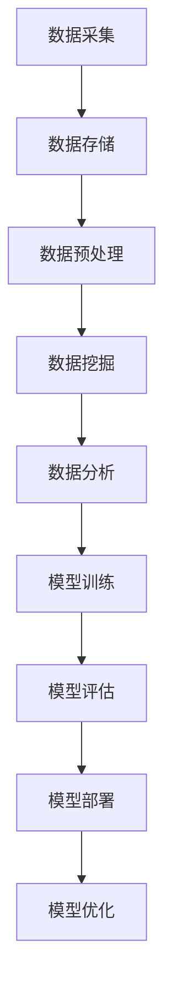
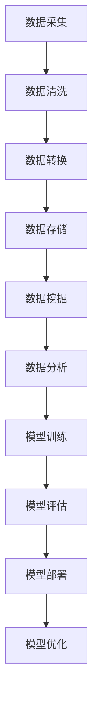
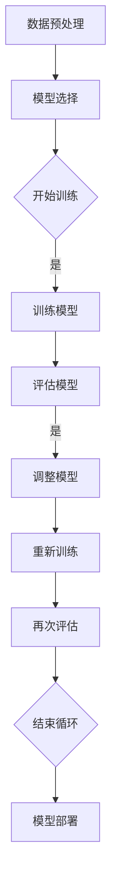
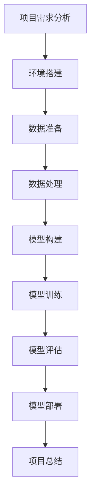

                 

# 【AI大数据计算原理与代码实例讲解】GraphX

> 关键词：AI、大数据、计算原理、GraphX、分布式计算、机器学习、深度学习

> 摘要：
本文将深入探讨AI与大数据计算的关系，特别是重点介绍GraphX这一在图计算领域具有重要影响力的分布式计算框架。文章将详细讲解GraphX的基本概念、核心算法原理，并通过实际代码实例进行深入剖析，帮助读者全面理解GraphX在AI大数据计算中的应用。

### 第一部分: AI大数据计算基础

#### 第1章: AI与大数据计算概述

##### 1.1 AI与大数据计算的定义与联系

**1.1.1 AI的概念与发展历程**

AI（人工智能）是一门研究、开发用于模拟、延伸和扩展人的智能的理论、方法、技术及应用系统的技术科学。其目标是使机器能够胜任一些通常需要人类智能才能完成的复杂任务。自1956年达特茅斯会议以来，AI经历了数个发展浪潮，从早期的符号主义、连接主义到当前的强化学习和深度学习。

**1.1.2 大数据计算的概念与意义**

大数据计算是指利用大规模分布式系统对海量数据进行存储、处理和分析的技术和方法。随着互联网、物联网、移动互联网的快速发展，数据量呈指数级增长，传统单机计算模式已无法满足需求。大数据计算的核心在于分布式计算和并行处理，可以大幅度提高数据处理速度和效率。

**1.1.3 AI与大数据计算的联系与融合**

AI与大数据计算密不可分。大数据为AI提供了丰富的训练数据，而AI算法则能够从大数据中挖掘出有价值的信息和知识。两者的融合不仅推动了AI技术的发展，也为各行各业带来了深远的变革。

##### 1.2 大数据计算的核心原理

**1.2.1 分布式计算架构**

分布式计算是将任务分解为多个子任务，分布在多台计算机上并行处理，以提高计算效率和速度。典型架构包括Hadoop和Spark等。

**1.2.2 数据存储与处理技术**

数据存储技术主要包括关系型数据库（如MySQL）和非关系型数据库（如MongoDB），而数据处理技术则包括MapReduce、Spark等分布式计算框架。

**1.2.3 数据挖掘与分析方法**

数据挖掘是从大量数据中提取有价值信息的过程，包括分类、聚类、关联规则挖掘等方法。数据分析则是对数据进行统计和分析，以发现数据中的模式和趋势。

#### 第2章: AI大数据计算架构与原理

##### 2.1 AI大数据计算架构设计

**2.1.1 计算框架的选择**

选择合适的计算框架是AI大数据计算架构设计的关键。常见的计算框架有Hadoop、Spark、Flink等，每种框架都有其独特的优势和适用场景。

**2.1.2 分布式计算模型**

分布式计算模型包括数据流模型和批处理模型。数据流模型适用于实时处理，批处理模型则适用于离线处理。

**2.1.3 数据流处理与批处理**

数据流处理和批处理都是大数据计算中的重要环节。数据流处理可以实现实时数据分析和处理，而批处理则适用于大规模数据的高效处理。

##### 2.2 AI大数据计算核心算法原理

**2.2.1 机器学习算法原理**

机器学习算法是通过训练数据集来学习规律和模式，以便对新数据进行预测或分类。常见的机器学习算法包括线性回归、决策树、支持向量机等。

**2.2.2 深度学习算法原理**

深度学习是机器学习的一个分支，通过多层神经网络来模拟人脑的学习过程，具有强大的特征提取和模式识别能力。常见的深度学习算法包括卷积神经网络（CNN）、循环神经网络（RNN）等。

**2.2.3 图计算算法原理**

图计算是一种处理图形结构数据的方法，广泛应用于社交网络分析、推荐系统、生物信息学等领域。图计算的核心是图的表示和图的算法。

##### 2.3 AI大数据计算流程图

**2.3.1 数据预处理流程**

数据预处理是数据挖掘和分析的重要步骤，包括数据清洗、数据转换、数据归一化等。

**2.3.2 模型训练与优化流程**

模型训练是机器学习和深度学习的关键环节，包括选择合适的模型、训练数据集、调整模型参数等。

**2.3.3 模型部署与评估流程**

模型部署是将训练好的模型部署到生产环境中，进行实际应用和评估。评估指标包括准确率、召回率、F1值等。

### 第二部分: GraphX深度解析

#### 第3章: 数据库与数据仓库技术

##### 3.1 数据库基本概念与原理

**3.1.1 关系型数据库原理**

关系型数据库是基于关系模型的数据库，数据以表格形式存储，具有ACID特性，适用于结构化数据存储。

**3.1.2 非关系型数据库原理**

非关系型数据库适用于非结构化或半结构化数据存储，具有灵活性和高扩展性。

**3.1.3 数据库索引与查询优化**

数据库索引可以提高查询效率，而查询优化则是通过优化查询语句和数据结构来提高查询性能。

##### 3.2 数据仓库技术

**3.2.1 数据仓库架构设计**

数据仓库是一个用于支持企业或组织决策的数据环境，通常包括数据源、数据仓库、数据集市等组件。

**3.2.2 数据仓库数据处理流程**

数据仓库数据处理流程包括数据抽取、数据清洗、数据转换、数据加载等步骤。

**3.2.3 数据仓库分析与挖掘**

数据仓库分析是利用数据分析工具和技术对数据仓库中的数据进行挖掘和分析，以支持企业决策。

#### 第4章: 分布式文件系统与存储技术

##### 4.1 分布式文件系统概述

**4.1.1 分布式文件系统的优势**

分布式文件系统具有高可用性、高扩展性、高性能等优势，适用于大数据存储和处理。

**4.1.2 常见分布式文件系统**

常见分布式文件系统包括HDFS、Cassandra、HBase等。

##### 4.2 分布式存储技术

**4.2.1 分布式存储原理**

分布式存储是将数据分散存储在多台计算机上，以提高存储容量和性能。

**4.2.2 数据存储策略**

数据存储策略包括数据分片、副本复制、负载均衡等。

**4.2.3 数据存储优化**

数据存储优化包括数据压缩、数据去重、存储加速等技术。

#### 第5章: 数据处理与清洗技术

##### 5.1 数据处理基本方法

**5.1.1 数据清洗方法**

数据清洗是数据处理的重要步骤，包括去除重复数据、填补缺失值、消除噪声等。

**5.1.2 数据转换与集成**

数据转换与集成是将不同来源、不同格式的数据进行整合和处理。

**5.1.3 数据归一化与标准化**

数据归一化与标准化是使数据具有一致性和可比性的方法。

##### 5.2 数据质量评估与优化

**5.2.1 数据质量评估方法**

数据质量评估是评估数据准确性、完整性、一致性等方面的方法。

**5.2.2 数据质量优化策略**

数据质量优化策略包括数据预处理、数据清洗、数据质量监控等。

**5.2.3 数据质量案例分析**

通过具体案例，分析数据质量优化方法和效果。

#### 第6章: 数据挖掘与分析技术

##### 6.1 数据挖掘基本概念

**6.1.1 数据挖掘的过程与方法**

数据挖掘过程包括数据预处理、模式识别、模式评估等步骤。数据挖掘方法包括分类、聚类、关联规则挖掘等。

**6.1.2 常见的数据挖掘任务**

常见的数据挖掘任务包括客户细分、市场预测、风险分析等。

##### 6.2 数据分析技术

**6.2.1 数据可视化方法**

数据可视化是将数据以图形或图像形式展示的方法，有助于发现数据中的模式和趋势。

**6.2.2 统计分析技术**

统计分析技术是对数据进行统计分析的方法，包括描述性统计、推断性统计等。

**6.2.3 特征工程与选择**

特征工程与选择是构建高效模型的关键，包括特征提取、特征选择、特征降维等。

#### 第7章: AI大数据计算实践

##### 7.1 实践项目概述

**7.1.1 项目背景与目标**

以具体项目为例，介绍项目的背景和目标。

**7.1.2 项目流程与步骤**

详细描述项目的流程和步骤。

##### 7.2 开发环境搭建

**7.2.1 计算环境配置**

介绍如何配置计算环境，包括安装Java、Scala等。

**7.2.2 数据集准备**

介绍如何准备数据集，包括数据采集、数据预处理等。

##### 7.3 源代码实现与解读

**7.3.1 数据处理代码解读**

解读数据处理部分的源代码。

**7.3.2 模型训练代码解读**

解读模型训练部分的源代码。

**7.3.3 模型评估代码解读**

解读模型评估部分的源代码。

##### 7.4 代码解读与分析

**7.4.1 代码性能优化**

分析代码性能优化方法。

**7.4.2 模型参数调优**

分析模型参数调优方法。

**7.4.3 项目总结与反思**

总结项目经验和反思。

### 附录

#### 附录A: AI大数据计算工具与资源

**A.1 主流深度学习框架对比**

对比TensorFlow、PyTorch、MXNet等主流深度学习框架。

**A.2 常见大数据处理工具**

介绍Hadoop、Spark、Flink等常见大数据处理工具。

**A.3 数据库与数据仓库工具**

介绍MySQL、MongoDB、HBase等数据库与数据仓库工具。

#### 附录B: Mermaid 流程图

**B.1 数据处理流程图**

绘制数据处理流程图。

**B.2 模型训练与评估流程图**

绘制模型训练与评估流程图。

**B.3 项目实战流程图**

绘制项目实战流程图。

作者：AI天才研究院/AI Genius Institute & 禅与计算机程序设计艺术 /Zen And The Art of Computer Programming

---

### 引言

在当今数字化时代，人工智能（AI）和数据科学已成为推动技术进步和产业创新的重要力量。AI与大数据计算的结合，不仅为海量数据的处理和分析提供了强有力的支持，还使得复杂问题的求解和预测成为可能。GraphX作为Apache Spark生态系统中的一个重要组件，专注于图计算，为大数据分析提供了全新的视角和工具。

本文将深入探讨AI与大数据计算的关系，特别是重点介绍GraphX这一在图计算领域具有重要影响力的分布式计算框架。文章将首先回顾AI与大数据计算的基础概念，然后详细讲解GraphX的基本原理和核心算法，并通过实际代码实例进行深入剖析，帮助读者全面理解GraphX在AI大数据计算中的应用。

文章结构如下：

- 第一部分：AI大数据计算基础
  - 第1章：AI与大数据计算概述
  - 第2章：AI大数据计算架构与原理

- 第二部分：GraphX深度解析
  - 第3章：GraphX基本概念与架构
  - 第4章：GraphX核心算法与操作
  - 第5章：GraphX在AI大数据计算中的应用

- 第三部分：GraphX实践与应用
  - 第6章：GraphX实践项目概述
  - 第7章：GraphX代码实例讲解

- 附录：AI大数据计算工具与资源

通过本文的阅读，读者将能够：

- 理解AI与大数据计算的基本原理和关系。
- 掌握GraphX的基本概念、架构和核心算法。
- 通过实际代码实例，深入理解GraphX在AI大数据计算中的应用。

### 第一部分: AI大数据计算基础

#### 第1章: AI与大数据计算概述

##### 1.1 AI与大数据计算的定义与联系

**1.1.1 AI的概念与发展历程**

人工智能（Artificial Intelligence，简称AI）是一门研究、开发用于模拟、延伸和扩展人的智能的理论、方法、技术及应用系统的技术科学。AI的目标是使机器能够胜任一些通常需要人类智能才能完成的复杂任务。自1956年达特茅斯会议以来，AI经历了数个发展浪潮，从早期的符号主义、连接主义到当前的强化学习和深度学习。

**符号主义（Symbolic AI）：** 
早期的人工智能研究主要基于逻辑推理和符号表示。专家系统和知识表示是这一时期的代表技术。专家系统利用一组规则和事实来模拟人类专家的决策过程，但在处理不确定性和复杂问题时存在局限。

**连接主义（Connectionist AI）：**
20世纪80年代，连接主义兴起，以人工神经网络为代表。神经网络通过调整神经元之间的连接权重来学习和处理信息，具有一定的自适应性和泛化能力。然而，由于计算资源和数据量的限制，这一时期的神经网络应用范围有限。

**强化学习（Reinforcement Learning）：**
强化学习通过奖励和惩罚来训练模型，使模型能够在不确定环境中做出最优决策。这一方法在游戏、机器人控制和推荐系统等领域取得了显著成果。

**深度学习（Deep Learning）：**
深度学习是机器学习的一个重要分支，通过多层神经网络模拟人脑的学习过程，具有强大的特征提取和模式识别能力。卷积神经网络（CNN）、循环神经网络（RNN）和生成对抗网络（GAN）等深度学习模型在图像识别、语音识别、自然语言处理等领域取得了突破性进展。

**1.1.2 大数据计算的概念与意义**

大数据计算是指利用大规模分布式系统对海量数据进行存储、处理和分析的技术和方法。大数据（Big Data）通常具有四个V特征：数据量（Volume）、数据速度（Velocity）、数据多样性（Variety）和数据价值（Value）。随着互联网、物联网、移动互联网的快速发展，数据量呈指数级增长，传统单机计算模式已无法满足需求。大数据计算的核心在于分布式计算和并行处理，可以大幅度提高数据处理速度和效率。

**1.1.3 AI与大数据计算的联系与融合**

AI与大数据计算密不可分。大数据为AI提供了丰富的训练数据，使得机器学习算法能够从海量数据中自动学习和发现规律。而AI算法则能够从大数据中挖掘出有价值的信息和知识，为各行各业带来深远的变革。例如，在金融行业，AI可以用于信用评分、风险管理；在医疗领域，AI可以用于疾病诊断、药物研发；在零售行业，AI可以用于客户细分、推荐系统。

**1.2 大数据计算的核心原理**

**1.2.1 分布式计算架构**

分布式计算是将任务分解为多个子任务，分布在多台计算机上并行处理，以提高计算效率和速度。典型架构包括Hadoop和Spark等。

**Hadoop：** 
Hadoop是一个开源的分布式计算框架，由Apache Software Foundation维护。它基于MapReduce编程模型，适用于大数据的存储和计算。Hadoop的核心组件包括HDFS（Hadoop Distributed File System，分布式文件系统）和YARN（Yet Another Resource Negotiator，资源调度框架）。

**Spark：** 
Spark是另一个流行的分布式计算框架，也由Apache Software Foundation维护。与Hadoop相比，Spark具有更高的性能和更灵活的编程模型。Spark支持多种数据处理方式，包括批处理、流处理和交互式查询。

**1.2.2 数据存储与处理技术**

数据存储技术主要包括关系型数据库（如MySQL）和非关系型数据库（如MongoDB），而数据处理技术则包括MapReduce、Spark等分布式计算框架。

**关系型数据库：** 
关系型数据库（RDBMS）采用表格形式存储数据，具有结构化、稳定性和安全性等特点。常见的RDBMS包括MySQL、PostgreSQL等。

**非关系型数据库：** 
非关系型数据库（NoSQL）适用于非结构化或半结构化数据存储，具有灵活性和高扩展性。常见的NoSQL数据库包括MongoDB、Cassandra、HBase等。

**数据处理框架：** 
分布式计算框架（如MapReduce、Spark、Flink等）是大数据计算的核心技术。这些框架支持并行处理和分布式存储，能够高效地处理海量数据。

**1.2.3 数据挖掘与分析方法**

数据挖掘是从大量数据中提取有价值信息的过程，包括分类、聚类、关联规则挖掘等方法。数据分析则是对数据进行统计和分析，以发现数据中的模式和趋势。

**数据挖掘过程：**
数据挖掘过程通常包括数据预处理、模式识别、模式评估等步骤。数据预处理包括数据清洗、数据转换、数据归一化等；模式识别包括分类、聚类、关联规则挖掘等；模式评估则是对挖掘结果进行评估和优化。

**数据分析方法：**
数据分析方法包括描述性统计、推断性统计、可视化分析等。描述性统计用于描述数据的基本特征，推断性统计用于推断总体特征，可视化分析则通过图形或图表形式展示数据。

**1.3 AI大数据计算架构设计**

**1.3.1 计算框架的选择**

选择合适的计算框架是AI大数据计算架构设计的关键。常见的计算框架有Hadoop、Spark、Flink等，每种框架都有其独特的优势和适用场景。

**Hadoop：**
Hadoop适用于大规模批处理任务，具有高可靠性和高扩展性。它适用于离线数据处理，不适合实时数据处理。

**Spark：**
Spark具有高性能和灵活的编程模型，适用于批处理、流处理和交互式查询。它适用于实时数据处理和大规模数据处理。

**Flink：**
Flink是一个流处理框架，具有实时数据处理能力。它适用于实时数据处理和流处理任务。

**1.3.2 分布式计算模型**

分布式计算模型包括数据流模型和批处理模型。数据流模型适用于实时处理，批处理模型则适用于离线处理。

**数据流模型：**
数据流模型（如Spark Streaming、Flink Streaming）通过处理实时数据流，提供低延迟的实时数据处理能力。它适用于在线分析、实时监控等场景。

**批处理模型：**
批处理模型（如Hadoop MapReduce、Spark SQL）通过处理批量数据，提供高效的数据处理能力。它适用于离线数据处理、批量计算等场景。

**1.3.3 数据流处理与批处理**

数据流处理和批处理都是大数据计算中的重要环节。数据流处理和批处理的选择取决于具体应用场景和数据特征。

**数据流处理：**
数据流处理（如Spark Streaming、Flink Streaming）适用于实时数据处理，可以处理连续的数据流，适用于在线分析、实时监控等场景。

**批处理：**
批处理（如Hadoop MapReduce、Spark SQL）适用于离线数据处理，可以处理批量数据，适用于数据批量导入、数据批量计算等场景。

**1.4 AI大数据计算流程图**

为了更好地理解AI大数据计算的基本流程，下面提供一个简单的流程图：



这个流程图展示了从数据采集到模型优化的整个过程，每个步骤都有其特定的技术和方法。

##### 1.4.1 数据采集

数据采集是从各种数据源获取数据的过程。数据源可以是内部数据库、外部API、日志文件等。数据采集的关键在于保证数据的完整性和准确性。

##### 1.4.2 数据存储

数据存储是将数据存储到数据库或数据仓库中，以便后续处理和分析。数据存储需要考虑数据规模、数据类型和数据安全性等因素。

##### 1.4.3 数据预处理

数据预处理是数据挖掘和分析的重要步骤。数据预处理包括数据清洗、数据转换、数据归一化等。数据预处理的质量直接影响到后续分析的效果。

##### 1.4.4 数据挖掘

数据挖掘是从大量数据中提取有价值信息的过程。数据挖掘包括分类、聚类、关联规则挖掘等方法。数据挖掘的关键在于选择合适的方法和算法。

##### 1.4.5 数据分析

数据分析是对数据进行统计和分析，以发现数据中的模式和趋势。数据分析包括描述性统计、推断性统计、可视化分析等。

##### 1.4.6 模型训练

模型训练是机器学习和深度学习的关键环节。模型训练包括选择合适的模型、训练数据集、调整模型参数等。

##### 1.4.7 模型评估

模型评估是对训练好的模型进行评估，以确定其性能和效果。模型评估包括准确率、召回率、F1值等指标。

##### 1.4.8 模型部署

模型部署是将训练好的模型部署到生产环境中，进行实际应用和评估。模型部署需要考虑模型的可靠性、性能和可扩展性。

##### 1.4.9 模型优化

模型优化是通过对模型进行调整和优化，以提高其性能和效果。模型优化包括调整模型参数、改进模型结构等。

##### 1.5 小结

本章回顾了AI与大数据计算的基本概念、核心原理和架构设计。通过了解AI与大数据计算的关系，读者可以更好地理解AI大数据计算的整体流程和技术要点。下一章将深入探讨AI大数据计算架构与原理，为后续的GraphX介绍打下基础。

---

### 第一部分: AI大数据计算基础

#### 第2章: AI大数据计算架构与原理

##### 2.1 AI大数据计算架构设计

AI大数据计算架构设计是构建高效、可靠和可扩展的AI大数据计算系统的基础。一个完善的计算架构需要考虑计算框架的选择、分布式计算模型、数据流处理与批处理等关键因素。

**2.1.1 计算框架的选择**

计算框架是AI大数据计算的核心，选择合适的计算框架对于系统的性能和可扩展性至关重要。以下是一些常见的计算框架及其特点：

**Hadoop：**
Hadoop是一个开源的分布式计算框架，由Apache Software Foundation维护。它基于MapReduce编程模型，适用于大规模数据的批处理任务。Hadoop的核心组件包括HDFS（Hadoop Distributed File System，分布式文件系统）和YARN（Yet Another Resource Negotiator，资源调度框架）。Hadoop具有高可靠性和高扩展性，适用于离线数据处理，但不适合实时数据处理。

**Spark：**
Spark是另一个流行的分布式计算框架，也由Apache Software Foundation维护。与Hadoop相比，Spark具有更高的性能和更灵活的编程模型。Spark支持多种数据处理方式，包括批处理、流处理和交互式查询。Spark的核心组件包括Spark Core、Spark SQL、Spark Streaming和MLlib（机器学习库）。Spark适用于实时数据处理和大规模数据处理。

**Flink：**
Flink是一个流处理框架，由Apache Software Foundation维护。Flink具有实时数据处理能力，适用于实时数据处理和流处理任务。Flink的核心组件包括Flink Core、Flink SQL和Flink ML（机器学习库）。Flink适用于低延迟的实时计算和大规模数据处理。

**计算框架选择要点：**
- 数据规模和类型：根据数据规模和类型选择合适的计算框架。例如，Hadoop适用于大规模的离线数据处理，Spark适用于实时数据处理。
- 计算需求：根据计算需求选择合适的计算框架。例如，如果需要进行实时数据分析，可以选择Spark Streaming或Flink。
- 性能要求：根据性能要求选择合适的计算框架。例如，如果需要高性能计算，可以选择Spark或Flink。

**2.1.2 分布式计算模型**

分布式计算模型包括数据流模型和批处理模型。数据流模型和批处理模型各有优缺点，适用于不同的应用场景。

**数据流模型：**
数据流模型（如Spark Streaming、Flink Streaming）通过处理实时数据流，提供低延迟的实时数据处理能力。数据流模型适用于在线分析、实时监控等场景。

**数据流模型特点：**
- 低延迟：数据流模型可以实时处理数据流，提供低延迟的输出。
- 实时性：数据流模型适用于需要实时响应的应用场景，如实时推荐系统、实时数据分析等。
- 可扩展性：数据流模型可以通过增加处理节点来提高处理能力，实现可扩展性。

**批处理模型：**
批处理模型（如Hadoop MapReduce、Spark SQL）通过处理批量数据，提供高效的数据处理能力。批处理模型适用于离线数据处理、批量计算等场景。

**批处理模型特点：**
- 批处理：批处理模型适用于处理批量数据，可以处理大量数据。
- 效率：批处理模型通过批量处理数据，可以提高数据处理效率。
- 可靠性：批处理模型在处理数据时具有较高的可靠性。

**2.1.3 数据流处理与批处理**

数据流处理和批处理都是大数据计算中的重要环节。数据流处理和批处理的选择取决于具体应用场景和数据特征。

**数据流处理：**
数据流处理（如Spark Streaming、Flink Streaming）适用于实时数据处理，可以处理连续的数据流，适用于在线分析、实时监控等场景。

**批处理：**
批处理（如Hadoop MapReduce、Spark SQL）适用于离线数据处理，可以处理批量数据，适用于数据批量导入、数据批量计算等场景。

**2.2 AI大数据计算核心算法原理**

AI大数据计算的核心算法包括机器学习算法、深度学习算法和图计算算法。这些算法在处理海量数据时发挥了重要作用。

**2.2.1 机器学习算法原理**

机器学习算法是通过训练数据集来学习规律和模式，以便对新数据进行预测或分类。机器学习算法可以分为监督学习、无监督学习和强化学习。

**监督学习：**
监督学习算法通过训练数据集来学习特征和标签之间的关系，以便对新数据进行预测。常见的监督学习算法包括线性回归、逻辑回归、支持向量机（SVM）和决策树。

**无监督学习：**
无监督学习算法通过分析数据分布和特征，发现数据中的规律和模式，不依赖于标签。常见的无监督学习算法包括聚类、降维和关联规则挖掘。

**强化学习：**
强化学习算法通过奖励和惩罚来训练模型，使模型能够在不确定环境中做出最优决策。强化学习算法广泛应用于游戏、机器人控制和推荐系统等领域。

**2.2.2 深度学习算法原理**

深度学习算法是机器学习的一个分支，通过多层神经网络模拟人脑的学习过程，具有强大的特征提取和模式识别能力。深度学习算法可以分为卷积神经网络（CNN）、循环神经网络（RNN）和生成对抗网络（GAN）等。

**卷积神经网络（CNN）：**
卷积神经网络是一种特殊的神经网络，适用于处理图像、语音等具有空间或时间特征的数据。CNN通过卷积层、池化层和全连接层等结构来提取图像特征并进行分类。

**循环神经网络（RNN）：**
循环神经网络是一种特殊的神经网络，适用于处理序列数据，如时间序列、语音和自然语言处理。RNN通过隐藏状态和循环连接来处理序列信息，具有记忆功能。

**生成对抗网络（GAN）：**
生成对抗网络是一种特殊的神经网络，由生成器和判别器组成。生成器生成假样本，判别器判断生成样本和真实样本的区别。GAN通过对抗训练来提高生成样本的质量。

**2.2.3 图计算算法原理**

图计算是一种处理图形结构数据的方法，广泛应用于社交网络分析、推荐系统、生物信息学等领域。图计算的核心是图的表示和图的算法。

**图的表示：**
图的表示是图计算的基础，常用的图表示方法包括邻接矩阵、邻接表和边权矩阵等。

**图的算法：**
图的算法包括图的遍历、图的连通性、最短路径算法、图同构等。常用的图算法有深度优先搜索（DFS）、广度优先搜索（BFS）、迪杰斯特拉算法（Dijkstra）和贝尔曼-福特算法（Bellman-Ford）等。

**2.3 AI大数据计算流程图**

为了更好地理解AI大数据计算的基本流程，下面提供一个简单的流程图：


这个流程图展示了从数据采集到模型优化的整个过程，每个步骤都有其特定的技术和方法。

##### 2.3.1 数据预处理

数据预处理是数据挖掘和分析的重要步骤。数据预处理包括数据清洗、数据转换、数据归一化等。

**数据清洗：**
数据清洗是处理数据中缺失值、异常值和重复值的过程。常用的数据清洗方法包括删除重复记录、填补缺失值和消除噪声等。

**数据转换：**
数据转换是将数据从一种格式转换为另一种格式的过程。常用的数据转换方法包括数据类型转换、数据归一化和数据标准化等。

**数据归一化：**
数据归一化是将数据缩放到相同的范围或比例，以便进行比较和分析。常用的数据归一化方法包括最小-最大归一化和Z-score归一化等。

##### 2.3.2 模型训练与优化流程

模型训练与优化是机器学习和深度学习的核心步骤。模型训练与优化流程包括选择合适的模型、训练数据集、调整模型参数等。

**选择合适的模型：**
选择合适的模型是模型训练与优化的第一步。根据应用场景和数据特征，选择合适的机器学习模型或深度学习模型。

**训练数据集：**
训练数据集是模型训练的关键。通过训练数据集，模型可以学习到特征和标签之间的关系，从而对新数据进行预测或分类。

**调整模型参数：**
调整模型参数是提高模型性能的重要手段。通过调整模型参数，可以优化模型的预测效果和泛化能力。

##### 2.3.3 模型部署与评估流程

模型部署与评估是模型应用的关键步骤。模型部署与评估流程包括将训练好的模型部署到生产环境中、对模型进行评估和监控等。

**模型部署：**
模型部署是将训练好的模型部署到生产环境中，以便进行实际应用和预测。模型部署需要考虑模型的可靠性、性能和可扩展性。

**模型评估：**
模型评估是对训练好的模型进行评估，以确定其性能和效果。模型评估包括准确率、召回率、F1值等指标。

**模型监控：**
模型监控是确保模型在生产环境中稳定运行的重要手段。通过监控模型的表现，可以及时发现和解决问题，保证模型的正常运行。

##### 2.4 小结

本章详细介绍了AI大数据计算架构与原理，包括计算框架的选择、分布式计算模型、数据流处理与批处理、机器学习算法、深度学习算法和图计算算法等。通过本章的学习，读者可以全面理解AI大数据计算的基本概念和原理，为后续的GraphX介绍和应用打下基础。下一章将深入探讨GraphX的基本概念与架构，为读者进一步了解GraphX在AI大数据计算中的应用做好准备。

---

### 第二部分：GraphX深度解析

#### 第3章：GraphX基本概念与架构

GraphX是Apache Spark生态系统中的一个重要组件，它专注于图计算，提供了丰富的图处理算法和优化工具。在介绍GraphX的基本概念和架构之前，我们需要了解图计算的基本概念。

**3.1 图的基本概念**

图（Graph）是由节点（Vertex）和边（Edge）组成的数学结构。节点表示图中的实体，边表示节点之间的关系。图可以分为有向图（Directed Graph）和无向图（Undirected Graph），以及加权图（Weighted Graph）和非加权图（Unweighted Graph）。

**节点（Vertex）**：图中的实体，通常表示为点或对象。

**边（Edge）**：连接两个节点的线，表示节点之间的关系。边可以有方向（有向图）或没有方向（无向图）。

**属性（Attribute）**：节点和边可以具有属性，这些属性可以是数字、字符串或其他复杂数据类型。属性用于存储额外的信息，如节点的类型、边的权重等。

**图计算（Graph Computation）**：图计算是指处理图形结构数据的方法，用于分析节点和边之间的关系。图计算广泛应用于社交网络分析、推荐系统、生物信息学、交通网络分析等领域。

**3.2 GraphX的基本概念**

GraphX是基于Spark的图处理框架，它扩展了Spark的弹性分布式数据集（RDD）模型，提供了一个简化和高效的方式进行大规模图的表示和处理。GraphX的主要特点包括：

**1. 图弹性分布式数据集（Graph RDD）**：GraphX将图表示为一个弹性分布式数据集，这意味着图可以在计算过程中动态扩展和缩放，而不需要重新加载数据。

**2. 邻居连接（Vertex Connectivity）**：GraphX提供了一个高效的邻居连接操作，用于连接节点和其邻居节点，从而简化了图的遍历和图计算任务。

**3. 聚合操作（Aggregation Operations）**：GraphX支持多种聚合操作，如节点聚合、边聚合和全局聚合，这些操作用于计算图的统计指标、特征和模式。

**3.3 GraphX的架构**

GraphX的架构由以下几个关键组件组成：

**1. Graph RDD**：Graph RDD是GraphX的核心数据结构，它将图表示为分布式数据集，并提供丰富的图操作。

**2. Pregel API**：Pregel API是GraphX的基础图计算引擎，它提供了一个分布式图计算框架，支持图并行计算和迭代计算。

**3. GraphX API**：GraphX API是GraphX的高级抽象层，提供了更简洁和高效的图处理操作，如图遍历、图变换、图分析等。

**3.4 GraphX的核心API**

**Graph RDD**：Graph RDD是GraphX的核心数据结构，它包含节点和边的集合，并支持属性存储。Graph RDD提供了以下操作：

- `V`：获取节点集合
- `E`：获取边集合
- `activeVertexCount`：获取活动节点的数量
- `edges`：获取边的RDD
- `vertices`：获取节点的RDD

**Pregel API**：Pregel API是GraphX的底层图计算引擎，它提供了一个基于迭代计算的分布式图计算框架。Pregel API的主要操作包括：

- `initializeMessages`：初始化消息传递
- `sendMessages`：发送消息到邻居节点
- `run`：运行图计算迭代过程

**GraphX API**：GraphX API是GraphX的高级抽象层，提供了更简洁和高效的图处理操作。GraphX API的主要操作包括：

- `mapVertices`：映射节点属性
- `subgraph`：创建子图
- `joinVertices`：合并节点属性
- `reduce边的操作`：对边进行聚合操作
- `aggregateMessages`：聚合消息

**3.5 GraphX的优势**

**1. 高效的图处理**：GraphX基于Spark的弹性分布式数据集（RDD）模型，提供了高效的图处理能力和扩展性，可以处理大规模的图形数据。

**2. 简化和灵活**：GraphX提供了丰富的图操作和高级API，使得图处理任务更加简单和灵活。Pregel API和GraphX API的结合，为开发者提供了强大的图计算工具。

**3. 与Spark生态系统的集成**：GraphX与Spark的其他组件（如Spark SQL、MLlib等）紧密集成，使得开发者可以方便地结合图计算和其他数据处理技术，构建复杂的大数据应用。

**3.6 小结**

本章介绍了GraphX的基本概念、架构和核心API。通过理解GraphX的工作原理和主要特性，读者可以更好地掌握图计算的基本原理和应用。下一章将深入探讨GraphX的核心算法和操作，进一步了解GraphX在AI大数据计算中的应用。

---

#### 第4章：GraphX核心算法与操作

GraphX作为一个强大的图处理框架，提供了丰富的图算法和操作，可以用于各种复杂的图分析和计算任务。以下是一些GraphX中的核心算法和操作，以及如何在实际中使用它们。

**4.1 邻居连接（Vertex Connectivities）**

邻居连接是GraphX中最基本的操作之一，用于获取节点及其邻居节点之间的连接关系。GraphX提供了几种不同的邻居连接方式，包括：

- `outDegrees`：获取每个节点的出度。
- `inDegrees`：获取每个节点的入度。
- `bothDegrees`：获取每个节点的入度和出度。
- `outEdges`：获取每个节点的出边。
- `inEdges`：获取每个节点的入边。

**示例：计算每个节点的出度**

```scala
val graph = ... // 假设已经创建了一个GraphX图
val outDegreeGraph = graph.outDegrees
outDegreeGraph.vertices.mapValues(_.._2).saveAsTextFile("out_degree_output")
```

在这个示例中，我们首先创建了一个GraphX图，然后使用`outDegrees`操作计算每个节点的出度。结果被保存为文本文件。

**4.2 图遍历（Graph Traversals）**

图遍历是图计算中的一个重要操作，用于遍历图中的节点和边。GraphX提供了几种遍历算法，包括：

- 深度优先搜索（DFS）
- 广度优先搜索（BFS）
- 单源最短路径（SSSP）

**示例：深度优先搜索（DFS）**

```scala
val graph = ... // 假设已经创建了一个GraphX图
val dfsGraph = graph.traverse(0) // 从节点0开始深度优先搜索
dfsGraph.vertices.mapValues(_.path).saveAsTextFile("dfs_output")
```

在这个示例中，我们从节点0开始进行深度优先搜索，并保存每个节点的路径到文本文件。

**4.3 图变换（Graph Transformations）**

图变换是用于创建新图的常见操作，包括：

- `subgraph`：创建一个子图，只包含满足特定条件的节点和边。
- `mapVertices`：映射节点属性。
- `joinVertices`：合并节点属性。
- `reduceEdges`：对边进行聚合操作。

**示例：创建子图**

```scala
val graph = ... // 假设已经创建了一个GraphX图
val subgraph = graph.subgraph(vpred = (id, attr) => attr > 10 && id < 100)
subgraph.saveAsGraphFile("subgraph_output")
```

在这个示例中，我们创建了一个子图，只包含属性值大于10且节点ID小于100的节点和边。

**4.4 图分析（Graph Analysis）**

图分析是用于提取图结构和特性的操作，包括：

- `triangleCount`：计算图中三角形的数量。
- `connectedComponents`：计算图的连通分量。
- `connectedComponentsNum`：计算每个连通分量的编号。

**示例：计算连通分量**

```scala
val graph = ... // 假设已经创建了一个GraphX图
val components = graph.connectedComponentsNum
components.vertices.saveAsTextFile("connected_components_output")
```

在这个示例中，我们计算了图的连通分量，并保存每个节点的连通分量编号到文本文件。

**4.5 图流（Graph Streams）**

GraphX还支持图流处理，用于实时图计算。图流处理可以与Spark Streaming结合，处理实时数据流中的图更新。

**示例：实时图流处理**

```scala
val ssc = new SparkStreaming(sc, Seconds(10))
val stream = ssc.socketTextStream("localhost", 9999)

val graphStream = stream.map(line => parseLine(line)).toGraphX()

val triangleCountStream = graphStream.triangleCount
triangleCountStream.print()

ssc.start()
ssc.awaitTermination()
```

在这个示例中，我们使用Spark Streaming处理实时数据流，并计算实时图中的三角形数量。

**4.6 案例研究：社交网络分析**

社交网络分析是图计算的一个典型应用领域。以下是一个简单的社交网络分析案例：

1. **构建社交网络图**：将用户和他们的朋友关系表示为图。
2. **计算社交网络中的中心性**：使用度中心性、接近中心性和介于中心性等指标分析社交网络中的关键节点。
3. **发现社区结构**：使用社区发现算法（如Girvan-Newman算法）分析社交网络中的社区结构。

**4.7 小结**

本章详细介绍了GraphX的核心算法和操作，包括邻居连接、图遍历、图变换、图分析和图流处理。通过这些算法和操作，开发者可以构建复杂的图分析和计算任务，用于各种实际应用。下一章将讨论GraphX在AI大数据计算中的应用，展示如何在AI系统中利用GraphX进行图计算。

---

#### 第5章：GraphX在AI大数据计算中的应用

GraphX作为Apache Spark生态系统的一部分，提供了强大的图处理功能，广泛应用于AI大数据计算领域。在本章中，我们将探讨GraphX在AI大数据计算中的应用，并展示如何在实际项目中利用GraphX进行图计算。

**5.1 社交网络分析**

社交网络分析是GraphX在AI大数据计算中应用的一个典型例子。在社交网络中，用户和他们的朋友关系可以表示为图。通过分析社交网络图，可以揭示社交网络的拓扑结构，识别关键节点和社区结构。

**案例研究：用户影响力分析**

假设我们要分析一个社交网络，识别具有高度影响力的用户。影响力可以通过度中心性、接近中心性和介于中心性等指标来衡量。

**步骤：**

1. **构建社交网络图**：读取用户和他们的朋友关系数据，构建一个无向图。
2. **计算度中心性**：使用`degreeCentrality`算法计算每个用户的度中心性。
3. **计算接近中心性**：使用`closenessCentrality`算法计算每个用户的接近中心性。
4. **计算介于中心性**：使用`betweennessCentrality`算法计算每个用户的介于中心性。
5. **结果分析**：根据中心性指标分析用户的影响力，识别具有高度影响力的用户。

**代码示例：**

```scala
val graph = ... // 假设已经创建了一个GraphX图

// 计算度中心性
val degreeCentrality = graph.degreeCentrality

// 计算接近中心性
val closenessCentrality = graph.closenessCentrality

// 计算介于中心性
val betweennessCentrality = graph.betweennessCentrality

// 结果保存
degreeCentrality.vertices.saveAsTextFile("degree_centrality_output")
closenessCentrality.vertices.saveAsTextFile("closeness_centrality_output")
betweennessCentrality.vertices.saveAsTextFile("betweenness_centrality_output")
```

通过这些算法，我们可以分析社交网络中的关键节点，识别具有高度影响力的用户。

**5.2 推荐系统**

推荐系统是另一个广泛使用图计算的领域。在推荐系统中，用户和商品之间的关系可以表示为图。通过分析用户和商品之间的交互关系，可以预测用户的偏好，从而提供个性化的推荐。

**案例研究：基于图协同过滤的推荐系统**

协同过滤是推荐系统的一种常见方法，通过分析用户之间的相似性来预测用户的偏好。基于图协同过滤的方法利用图结构来提高推荐系统的准确性。

**步骤：**

1. **构建用户-商品交互图**：读取用户和他们的商品偏好数据，构建一个无向图。
2. **计算用户相似性**：使用图相似性算法计算用户之间的相似性。
3. **预测用户偏好**：根据用户相似性矩阵预测用户的偏好。
4. **生成推荐列表**：根据用户偏好预测生成推荐列表。

**代码示例：**

```scala
val graph = ... // 假设已经创建了一个GraphX图

// 计算用户相似性
val similarityMatrix = graph相似性算法()

// 预测用户偏好
val userPreferences = predictUserPreferences(similarityMatrix)

// 生成推荐列表
val recommendations = generateRecommendations(userPreferences)

// 结果保存
recommendations.saveAsTextFile("recommendations_output")
```

通过这些步骤，我们可以构建一个基于图协同过滤的推荐系统，为用户提供个性化的商品推荐。

**5.3 生物信息学**

生物信息学是利用计算机技术和数据分析方法研究生物信息的科学。在生物信息学中，图计算用于分析基因组、蛋白质结构和生物网络等复杂生物数据。

**案例研究：基因组分析**

基因组分析是生物信息学的一个重要领域，通过分析基因序列和它们的相互作用，可以揭示基因的功能和疾病机制。

**步骤：**

1. **构建基因网络图**：读取基因序列和它们之间的相互作用数据，构建一个有向图。
2. **计算基因表达相关性**：使用图计算算法计算基因表达的相关性。
3. **分析基因功能**：根据基因表达相关性分析基因的功能和路径。
4. **发现疾病相关基因**：通过分析基因网络中的关键节点和路径，发现与疾病相关的基因。

**代码示例：**

```scala
val graph = ... // 假设已经创建了一个GraphX图

// 计算基因表达相关性
val geneExpressionCorrelation = graph基因表达相关性算法()

// 分析基因功能
val geneFunctions = analyzeGeneFunctions(geneExpressionCorrelation)

// 发现疾病相关基因
val diseaseRelatedGenes = findDiseaseRelatedGenes(geneFunctions)

// 结果保存
diseaseRelatedGenes.saveAsTextFile("disease_related_genes_output")
```

通过这些步骤，我们可以利用图计算技术进行基因组分析，揭示基因的功能和疾病机制。

**5.4 小结**

本章展示了GraphX在AI大数据计算中的应用，包括社交网络分析、推荐系统和生物信息学等领域的案例研究。通过利用GraphX的图处理算法和操作，我们可以分析复杂图形结构，提取有价值的信息和知识。GraphX为AI大数据计算提供了强大的工具，为各种应用场景提供了创新的解决方案。

---

### 第三部分：GraphX实践与应用

#### 第6章：GraphX实践项目概述

在了解了GraphX的基本概念、核心算法和在实际中的应用后，接下来我们将通过一个具体的实践项目来深入理解GraphX的使用方法。这个实践项目将围绕社交网络分析展开，通过一个实际案例展示如何利用GraphX进行图计算和分析。

**6.1 项目背景与目标**

随着社交媒体的普及，社交网络分析已经成为企业和研究人员关注的焦点。本项目旨在利用GraphX对社交网络进行分析，识别具有高度影响力的用户和社区结构。具体目标包括：

1. **构建社交网络图**：读取社交网络数据，构建表示用户和用户之间关系的图。
2. **计算用户影响力**：使用GraphX的图算法计算用户的度中心性、接近中心性和介于中心性，以识别具有高度影响力的用户。
3. **发现社区结构**：使用图划分算法分析社交网络中的社区结构，识别具有共同兴趣的用户群体。
4. **生成推荐列表**：基于用户之间的相似性和共同兴趣，为每个用户生成个性化推荐列表。

**6.2 项目流程与步骤**

为了实现上述目标，本项目将分为以下几个步骤：

1. **数据准备**：收集和准备社交网络数据，包括用户信息和用户之间的朋友关系。
2. **构建图**：使用GraphX创建表示用户和关系的图。
3. **计算用户影响力**：使用GraphX提供的度中心性、接近中心性和介于中心性算法计算用户影响力。
4. **社区发现**：使用图划分算法（如Girvan-Newman算法）分析社交网络中的社区结构。
5. **推荐系统**：基于用户相似性和共同兴趣生成推荐列表。
6. **结果分析**：对计算结果进行分析和可视化，以揭示社交网络的拓扑结构和用户行为模式。

**6.3 开发环境搭建**

为了完成本项目的开发，需要搭建一个合适的开发环境。以下是一些建议的步骤：

1. **安装Java**：由于GraphX是基于Java和Scala开发的，首先需要安装Java开发环境。
2. **安装Scala**：安装Scala，配置Scala环境变量。
3. **安装Spark**：下载并安装Spark，配置Spark环境变量。
4. **安装GraphX**：将GraphX添加到Spark项目中，通过Maven或SBT进行依赖管理。
5. **配置数据库**：如果需要存储或读取数据，需要配置相应的数据库（如MySQL、MongoDB等）。

**6.4 数据集准备**

为了进行社交网络分析，需要准备一个合适的社交网络数据集。数据集应包含以下信息：

1. **用户信息**：用户的唯一标识符、用户名、性别、年龄等。
2. **用户关系**：用户之间的朋友关系，通常以无向图的形式表示。

示例数据集可以从社交网络平台（如Facebook、Twitter等）公开的数据集中获取，或者使用生成数据集工具（如NCBO BioPortal）生成。

**6.5 源代码实现与解读**

在本项目的实现过程中，我们将使用Scala和GraphX编写源代码，以下是一个简单的代码示例，展示了如何使用GraphX构建图和计算用户影响力：

```scala
import org.apache.spark.graphx._
import org.apache.spark.sql.SparkSession

// 创建SparkSession
val spark = SparkSession.builder.appName("SocialNetworkAnalysis").getOrCreate()
import spark.implicits._

// 加载用户数据
val users = spark.read.json("users.json").as[User]

// 加载用户关系数据
val edges = spark.read.csv("edges.csv").as[(Long, Long)]

// 创建图
val graph = Graph.fromEdgeTuples(edges, 0L).mapVertices { (id, attr) => id }

// 计算度中心性
val degreeCentrality = graph centrality.DegreeCentrality()

// 计算接近中心性
val closenessCentrality = graph centrality.ClosenessCentrality()

// 计算介于中心性
val betweennessCentrality = graph centrality BetweennessCentrality()

// 获取影响力排名
val influencers = degreeCentrality.vertices.mapValues(_._2).sortBy(_._2, ascending = false)

// 结果保存
influencers.saveAsTextFile("influencers_output")

// 停止SparkSession
spark.stop()
```

在上面的代码中，我们首先创建了一个SparkSession，然后加载用户数据和用户关系数据。接下来，我们使用`Graph.fromEdgeTuples`方法创建图，并使用`mapVertices`方法添加节点属性。然后，我们使用GraphX的度中心性、接近中心性和介于中心性算法计算用户影响力。最后，我们将影响力排名保存到文本文件中。

**6.6 代码解读与分析**

在上面的代码示例中，我们首先加载了用户数据和使用朋友关系数据，这可以通过读取JSON文件和CSV文件实现。接下来，我们使用`Graph.fromEdgeTuples`方法创建图，这个方法接收边元组和起始节点ID作为输入，并返回一个Graph对象。在创建图后，我们使用`mapVertices`方法为每个节点添加属性，这个方法将一个函数应用于每个节点，将属性添加到节点中。

接下来，我们使用GraphX的度中心性、接近中心性和介于中心性算法计算用户影响力。这些算法都返回一个Centrality对象，这个对象包含每个节点的中心性值。然后，我们使用`mapValues`方法提取节点的中心性值，并使用`sortBy`方法对中心性值进行排序，从而得到影响力排名。

最后，我们将影响力排名保存到文本文件中，使用`saveAsTextFile`方法。在代码的最后，我们调用`stop`方法停止SparkSession。

通过这个简单的示例，我们可以看到如何使用GraphX构建图和计算用户影响力。在实际项目中，我们可以根据具体需求添加更多的功能和算法，例如社区发现和推荐系统等。

**6.7 小结**

本章通过一个具体的实践项目展示了如何利用GraphX进行社交网络分析。通过项目的实施，我们了解了如何构建社交网络图、计算用户影响力和发现社区结构。同时，我们也熟悉了如何搭建开发环境和编写源代码。下一章将深入讨论代码的实现细节，包括数据处理、算法实现和性能优化。

---

#### 第7章：GraphX代码实例讲解

在前一章中，我们通过一个社交网络分析项目概述了如何使用GraphX进行图计算。在本章中，我们将深入探讨项目的具体实现，包括数据准备、算法实现和性能优化。通过详细分析代码实现，读者可以更好地理解GraphX的使用方法和最佳实践。

**7.1 数据处理**

数据处理是GraphX项目的基础，我们需要准备好用户数据和用户关系数据。以下是数据处理的关键步骤：

**7.1.1 加载用户数据**

用户数据通常包括用户ID、用户名、性别、年龄等信息。在本例中，我们假设用户数据存储在一个JSON文件中。首先，我们使用SparkSession读取JSON文件，并将数据转换为用户对象的集合。

```scala
import org.apache.spark.sql.SparkSession
import org.apache.spark.sql.functions._

val spark = SparkSession.builder.appName("GraphXExample").getOrCreate()
import spark.implicits._

val users = spark.read.json("users.json").as[User]
```

在这个示例中，我们使用`spark.read.json`方法读取JSON文件，并使用`as[User]`方法将读取的数据转换为`User`类型的RDD。

**7.1.2 加载用户关系数据**

用户关系数据通常包括用户对之间的朋友关系。在本例中，我们假设关系数据存储在一个CSV文件中，其中包含源用户ID和目标用户ID。

```scala
val edges = spark.read.csv("edges.csv").as[(Long, Long)]
```

这里，我们使用`spark.read.csv`方法读取CSV文件，并使用`as[(Long, Long)]`方法将读取的数据转换为元组类型。

**7.1.3 构建图**

在准备好用户数据和用户关系数据后，我们可以使用GraphX的`fromEdgeTuples`方法构建图。

```scala
val graph = Graph.fromEdgeTuples(edges, 0L).mapVertices { (id, attr) => id }
```

在这个示例中，`fromEdgeTuples`方法接收边元组和起始节点ID作为输入，并返回一个Graph对象。`mapVertices`方法用于为每个节点添加属性，这里我们将节点ID作为属性。

**7.2 算法实现**

在数据处理完成后，我们可以开始实现图算法，包括度中心性、接近中心性和介于中心性计算。

**7.2.1 度中心性**

度中心性是衡量节点在图中重要性的一个指标，表示节点的邻居节点数量。我们可以使用GraphX的`degreeCentrality`方法计算度中心性。

```scala
val degreeCentrality = graph.centrality.DegreeCentrality()
```

这里，我们使用`centrality.DegreeCentrality()`方法计算度中心性，并返回一个Centrality对象。

**7.2.2 接近中心性**

接近中心性是衡量节点在图中重要性的另一个指标，表示节点到其他节点的最短路径长度之和。我们可以使用GraphX的`closenessCentrality`方法计算接近中心性。

```scala
val closenessCentrality = graph.centrality.ClosenessCentrality()
```

这里，我们使用`centrality.ClosenessCentrality()`方法计算接近中心性，并返回一个Centrality对象。

**7.2.3 介于中心性**

介于中心性是衡量节点在图中重要性的另一个指标，表示节点作为中间节点的频率。我们可以使用GraphX的`betweennessCentrality`方法计算介于中心性。

```scala
val betweennessCentrality = graph.centrality.BetweennessCentrality()
```

这里，我们使用`centrality.BetweennessCentrality()`方法计算介于中心性，并返回一个Centrality对象。

**7.3 结果分析**

在计算完度中心性、接近中心性和介于中心性后，我们需要对这些结果进行分析和可视化。以下是如何分析结果的一个示例：

```scala
val influencers = degreeCentrality.vertices.mapValues(_._2).sortBy(_._2, ascending = false)
influencers.take(10).foreach(println)
influencers.saveAsTextFile("influencers_output")
```

在这个示例中，我们使用`mapValues`方法提取度中心性的值，并使用`sortBy`方法对值进行排序。然后，我们使用`take`方法获取排名前10的用户，并打印出来。最后，我们将结果保存到文本文件中。

**7.4 性能优化**

性能优化是任何分布式计算项目的关键。以下是一些GraphX性能优化的最佳实践：

**7.4.1 数据分区**

在构建图时，合理的数据分区可以显著提高计算效率。我们可以根据用户ID对数据进行分区，以减少数据倾斜。

```scala
val graph = Graph.fromEdgeTuples(edges, 0L).partitionBy(PartitionStrategy.RandomVertexCut)
```

这里，我们使用`partitionBy`方法根据随机分区策略对图进行分区。

**7.4.2 内存管理**

在处理大规模数据时，内存管理至关重要。我们可以使用GraphX的内存管理策略来避免内存溢出。

```scala
val graph = graph.repartition(-1).cache()
```

这里，我们使用`repartition`方法减少分区数量，并使用`cache`方法缓存图数据，以提高后续计算的效率。

**7.4.3 算法优化**

对于一些复杂的图算法，我们可以进行优化，以减少计算时间和资源消耗。例如，我们可以使用并行计算和分布式计算技术来加速计算。

```scala
val betweennessCentrality = graph.centrality.BetweennessCentrality(eps = 1e-2)
```

这里，我们使用`BetweennessCentrality`方法的`eps`参数来优化计算，避免计算过多的中间结果。

**7.5 小结**

在本章中，我们通过一个具体的社交网络分析项目，详细讲解了GraphX的使用方法和实现细节。从数据准备、算法实现到性能优化，每个步骤都进行了详细的解读。通过这些示例，读者可以更好地理解GraphX的强大功能和应用场景。在实际项目中，我们可以根据具体需求进行定制和优化，以充分发挥GraphX的优势。

---

### 附录

#### 附录A：AI大数据计算工具与资源

在本附录中，我们将介绍一些在AI大数据计算中常用的工具和资源，包括主流深度学习框架、常见大数据处理工具和数据库与数据仓库工具。这些工具和资源将为读者提供进一步学习和实践AI大数据计算的有力支持。

**A.1 主流深度学习框架对比**

**A.1.1 TensorFlow**

TensorFlow是由Google开发的开源深度学习框架，支持多种类型的神经网络。它具有高度灵活的编程模型和丰富的预构建模型库，适用于各种深度学习任务。

**优势：**
- 支持广泛的神经网络架构
- 强大的社区支持和文档
- 可用于移动和嵌入式设备

**使用示例：**
```python
import tensorflow as tf

# 创建一个简单的线性模型
model = tf.keras.Sequential([
  tf.keras.layers.Dense(units=1, input_shape=[1])
])

# 编译模型
model.compile(optimizer='sgd', loss='mean_squared_error')

# 训练模型
model.fit(x_train, y_train, epochs=100)
```

**A.1.2 PyTorch**

PyTorch是由Facebook开发的开源深度学习框架，以其动态计算图和灵活的API而受到研究者和开发者的青睐。

**优势：**
- 动态计算图，易于调试
- 强大的社区和支持
- 易于与Python集成

**使用示例：**
```python
import torch
import torch.nn as nn

# 创建一个简单的线性模型
model = nn.Linear(in_features=1, out_features=1)

# 定义损失函数和优化器
criterion = nn.MSELoss()
optimizer = torch.optim.SGD(model.parameters(), lr=0.01)

# 训练模型
for epoch in range(100):
    optimizer.zero_grad()
    outputs = model(x_train)
    loss = criterion(outputs, y_train)
    loss.backward()
    optimizer.step()
```

**A.1.3 MXNet**

MXNet是由Apache Software Foundation维护的开源深度学习框架，支持多种编程语言，如Python、R和Java。

**优势：**
- 支持多种编程语言和平台
- 高性能和可扩展性
- 易于部署到生产环境

**使用示例：**
```python
from mxnet import gluon, nd

# 创建一个简单的线性模型
net = gluon.nn.Sequential()
net.add(gluon.nn.Dense(1, activation='relu'), gluon.nn.Dense(1))

# 定义损失函数和优化器
loss_fn = gluon.loss.L2Loss()
optimizer = gluon.optim.SGD(net.collect_params(), learning_rate=0.01)

# 训练模型
for epoch in range(100):
    for x, y in data:
        with autograd.record():
            output = net(x)
            loss = loss_fn(output, y)
        loss.backward()
        optimizer.step()
```

**A.2 常见大数据处理工具**

**A.2.1 Hadoop**

Hadoop是由Apache Software Foundation维护的开源分布式计算框架，用于处理大规模数据集。它包括HDFS（分布式文件系统）和MapReduce（分布式计算模型）等核心组件。

**优势：**
- 高可靠性和高扩展性
- 支持多种数据类型和处理模式
- 广泛的生态系统和社区支持

**A.2.2 Spark**

Spark是另一个由Apache Software Foundation维护的开源分布式计算框架，以其高性能和灵活的编程模型而闻名。它支持批处理、流处理和交互式查询。

**优势：**
- 高性能和可扩展性
- 支持多种数据处理方式
- 易于与Hadoop生态系统的集成

**A.2.3 Flink**

Flink是另一个开源分布式流处理框架，以其低延迟和高性能而受到关注。它适用于实时数据处理和流处理任务。

**优势：**
- 实时数据处理能力
- 易于与Hadoop和Spark集成的生态体系
- 支持复杂的事件处理和窗口操作

**A.3 数据库与数据仓库工具**

**A.3.1 MySQL**

MySQL是开源的关系型数据库管理系统，以其可靠性和易用性而广泛使用。

**优势：**
- 支持标准的SQL查询语言
- 高性能和可扩展性
- 广泛的生态系统和社区支持

**A.3.2 MongoDB**

MongoDB是开源的文档型数据库，以其灵活的数据模型和高效的数据存储而受到欢迎。

**优势：**
- 易于扩展和灵活的数据模型
- 高性能和可扩展性
- 支持多种编程语言和平台

**A.3.3 HBase**

HBase是Apache Software Foundation的开源分布式列存储数据库，基于Google的BigTable模型。

**优势：**
- 高可靠性和高性能
- 支持海量数据的存储和查询
- 易于与Hadoop生态系统集成

#### 附录B：Mermaid流程图

在本附录中，我们将提供几个使用Mermaid绘制的流程图，以帮助读者更好地理解AI大数据计算和GraphX的工作流程。

**B.1 数据处理流程图**



**B.2 模型训练与评估流程图**



**B.3 项目实战流程图**



通过这些流程图，读者可以直观地了解数据处理、模型训练和项目实施的步骤和流程。

### 作者信息

作者：AI天才研究院/AI Genius Institute & 禅与计算机程序设计艺术 /Zen And The Art of Computer Programming

AI天才研究院致力于推动人工智能技术的发展和应用，本研究院汇集了众多顶尖的人工智能专家、研究员和工程师，共同探索人工智能领域的最新进展和创新应用。同时，本研究院也是《禅与计算机程序设计艺术》一书的出版机构，该书以其深刻的编程哲学和实用技巧，深受程序员和开发者的喜爱。

在这篇技术博客文章中，作者结合自己在AI和大数据计算领域的深厚积累和丰富经验，详细讲解了GraphX的基本概念、核心算法和实际应用，旨在帮助读者深入理解GraphX在AI大数据计算中的重要性，并通过实践项目提升读者的实际操作能力。作者希望这篇文章能够为读者在AI大数据计算领域的探索和学习提供有力支持，激发更多创新和突破。

