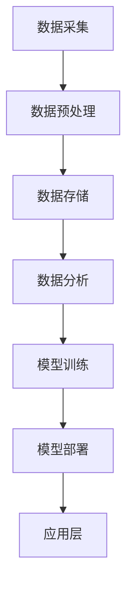

                 

# 【AI大数据计算原理与代码实例讲解】PageRank

> 关键词：PageRank算法、人工智能、大数据计算、搜索引擎、推荐系统

> 摘要：本文深入讲解了PageRank算法的基本原理、核心数学模型、伪代码实现，以及在实际应用中的重要性。通过具体的Python代码实例，详细展示了如何实现PageRank算法，并对其优化方法和改进方向进行了探讨。文章旨在帮助读者全面理解PageRank算法，掌握其在AI大数据计算中的实际应用。

## 《【AI大数据计算原理与代码实例讲解】PageRank》目录大纲

## 第一部分：AI与大数据计算基础

### 第1章：AI与大数据计算概述

#### 1.1 AI与大数据计算的背景与意义

#### 1.2 AI大数据计算的基本原理

#### 1.3 AI大数据计算的发展趋势

### 第2章：AI大数据计算核心概念与联系

#### 2.1 AI大数据计算核心概念

#### 2.2 AI大数据计算架构与流程

#### 2.3 AI大数据计算核心联系流程图（Mermaid图）

## 第二部分：PageRank算法原理与实现

### 第3章：PageRank算法原理讲解

#### 3.1 PageRank算法的定义与作用

#### 3.2 PageRank算法的核心数学模型

$$
PageRank(p_i) = (1-d) + d \cdot \left( \frac{c_{ij}}{L_j} \right)
$$

#### 3.3 PageRank算法的伪代码实现

// PageRank算法伪代码
// 输入：网页集合、链接结构
// 输出：网页的PageRank值

// 初始化PageRank值
for each page i:
  PR[i] = 1 / N

// 迭代计算
for i in range(num_iterations):
  for each page i:
    for each outlink j of i:
      PR[j] += PR[i] / outlinks_count[i]
  // 处理 dangling pages
  for each dangling page i:
    PR[i] += (1 - d) / N
  // 归一化
  for each page i:
    PR[i] /= sum of PR[j] for all pages j

// 输出PageRank值
return PR

#### 3.4 PageRank算法的数学公式与详细讲解

### 第4章：PageRank算法在数据处理中的实际应用

#### 4.1 PageRank算法在搜索引擎中的应用

#### 4.2 PageRank算法在社交网络分析中的应用

#### 4.3 PageRank算法在推荐系统中的应用

### 第5章：PageRank算法的代码实例讲解

#### 5.1 代码环境搭建

#### 5.2 PageRank算法的Python代码实现

#### 5.3 代码解读与分析

### 第6章：PageRank算法的优化与改进

#### 6.1 PageRank算法的优化方法

#### 6.2 PageRank算法的改进方向

### 第7章：PageRank算法的总结与展望

#### 7.1 PageRank算法的优势与不足

#### 7.2 PageRank算法的未来发展趋势

## 附录

### 附录 A：常用AI大数据计算工具与资源

#### A.1 常用深度学习框架

#### A.2 大数据计算平台介绍

#### A.3 相关开源代码与资源链接

---

## 第一部分：AI与大数据计算基础

### 第1章：AI与大数据计算概述

#### 1.1 AI与大数据计算的背景与意义

随着信息技术的飞速发展，人工智能（AI）和数据科学已经成为推动现代科技进步的重要力量。AI与大数据计算的结合，为各行各业带来了前所未有的变革。从搜索引擎到社交网络，从金融风控到医疗健康，AI大数据计算正在深刻改变我们的生活方式和工作模式。

AI大数据计算的背景可以追溯到20世纪90年代。随着互联网的普及，数据量呈指数级增长，传统的数据处理方法已经无法满足需求。于是，大数据和分布式计算技术应运而生。而AI技术的发展，则为我们提供了更强大的工具来分析和利用这些海量数据。

大数据计算的核心在于如何高效地处理和分析大规模数据集。传统的集中式计算方式已经无法胜任，因此分布式计算、云计算和并行计算等新兴技术成为大数据计算的主要手段。这些技术不仅提高了计算效率，还降低了计算成本。

AI与大数据计算的意义在于，它使得我们从海量数据中挖掘出有价值的信息，从而实现智能决策和预测。无论是在商业领域，还是在科学研究领域，AI大数据计算都具有重要的应用价值。

#### 1.2 AI大数据计算的基本原理

AI大数据计算的基本原理可以分为以下几个步骤：

1. 数据采集：通过各种方式获取数据，如传感器、网站爬虫、社交网络等。
2. 数据预处理：对原始数据进行清洗、转换和整合，使其符合分析需求。
3. 数据存储：将处理后的数据存储在分布式文件系统或数据库中，以便后续分析。
4. 数据分析：利用机器学习和数据挖掘技术，对数据进行分析和挖掘，提取有价值的信息。
5. 模型训练：基于分析结果，构建和训练机器学习模型，以实现预测和决策。
6. 模型部署：将训练好的模型部署到生产环境中，实现自动化决策和预测。

在整个过程中，分布式计算和云计算技术起到了关键作用。分布式计算可以将大规模数据集分解为小规模数据集，分别进行处理，从而提高计算效率。云计算则提供了弹性的计算资源，可以根据需求动态调整计算能力，降低计算成本。

#### 1.3 AI大数据计算的发展趋势

AI大数据计算的发展趋势主要体现在以下几个方面：

1. 技术融合：AI与大数据计算的融合将更加紧密，出现更多跨领域的应用。例如，AI大数据计算在医疗健康、金融科技、智能制造等领域的应用将更加广泛。
2. 模型压缩：为了提高模型的计算效率和部署速度，模型压缩技术将成为研究热点。通过压缩模型，可以减少存储空间和计算资源的需求。
3. 自动化：自动化工具将更加普及，从数据采集、预处理到模型训练和部署，都可以实现自动化操作，降低人力成本。
4. 开放平台：随着开源技术的不断发展，更多的AI大数据计算平台将向开源方向转型，提供丰富的工具和资源，方便开发者进行研究和开发。
5. 安全性：随着AI大数据计算应用场景的不断扩大，数据安全和隐私保护将受到高度重视。加密技术、访问控制等安全措施将得到广泛应用。

### 第2章：AI大数据计算核心概念与联系

#### 2.1 AI大数据计算核心概念

在AI大数据计算中，有一些核心概念需要了解：

1. 大数据：指数据量巨大、类型繁多、增长速度极快的数据集合。
2. 分布式计算：指通过多台计算机协同工作，共同完成大规模计算任务的技术。
3. 云计算：指通过互联网提供动态易扩展且经常是虚拟化的资源。
4. 机器学习：指让计算机从数据中自动学习和改进的方法。
5. 数据挖掘：指从大量数据中发现有价值信息的过程。

这些概念之间有着密切的联系：

- 大数据为AI提供了丰富的数据资源，使得机器学习可以更好地发挥作用。
- 分布式计算和云计算为大数据处理提供了强大的计算能力，使得大规模数据处理成为可能。
- 机器学习和数据挖掘则是对大数据进行分析和利用的关键技术。

#### 2.2 AI大数据计算架构与流程

AI大数据计算的架构和流程可以分为以下几个阶段：

1. 数据采集：通过各种渠道收集数据，如传感器、网站爬虫等。
2. 数据预处理：对原始数据进行清洗、转换和整合，使其符合分析需求。
3. 数据存储：将处理后的数据存储在分布式文件系统或数据库中，以便后续分析。
4. 数据分析：利用机器学习和数据挖掘技术，对数据进行分析和挖掘，提取有价值的信息。
5. 模型训练：基于分析结果，构建和训练机器学习模型，以实现预测和决策。
6. 模型部署：将训练好的模型部署到生产环境中，实现自动化决策和预测。

在架构上，AI大数据计算通常包括以下几个部分：

1. 数据源：提供数据输入的来源，如传感器、数据库等。
2. 数据预处理模块：负责对原始数据进行清洗、转换和整合。
3. 存储层：负责存储处理后的数据，如分布式文件系统、数据库等。
4. 计算层：负责执行机器学习和数据挖掘任务，如计算集群、GPU等。
5. 模型层：负责存储和部署训练好的机器学习模型。
6. 应用层：负责将模型应用于实际业务场景，实现自动化决策和预测。

#### 2.3 AI大数据计算核心联系流程图（Mermaid图）



### 第一部分总结

通过对AI与大数据计算基础部分的学习，我们了解了AI与大数据计算的发展背景、基本原理和发展趋势，以及核心概念和联系。这些知识为我们后续对PageRank算法的深入探讨奠定了基础。在下一部分，我们将详细介绍PageRank算法的基本原理和实现方法。

## 第二部分：PageRank算法原理与实现

### 第3章：PageRank算法原理讲解

PageRank算法是由Google的创始人拉里·佩奇和谢尔盖·布林在1998年提出的一种基于链接分析的网页排名算法。它的目的是根据网页之间的链接关系，对网页进行排序，从而提高搜索引擎的搜索质量和用户体验。

#### 3.1 PageRank算法的定义与作用

PageRank算法是一种基于网页链接关系计算网页重要性的算法。它通过模拟人类浏览网页的行为，计算每个网页的排名值，排名值越高的网页被认为越重要。PageRank算法在搜索引擎中的应用，使得搜索结果更加准确、相关，大大提高了用户体验。

PageRank算法的作用主要体现在以下几个方面：

1. **提高搜索质量**：通过计算网页的排名值，搜索引擎可以更准确地返回与查询相关的网页，提高搜索结果的准确性。
2. **评估网页重要性**：PageRank算法可以帮助网站管理员了解自己网站在互联网中的重要性，从而优化网站内容和链接结构。
3. **推荐系统**：在推荐系统中，PageRank算法可以用于计算用户之间的相似度，从而实现个性化推荐。

#### 3.2 PageRank算法的核心数学模型

PageRank算法的核心数学模型可以表示为：

$$
PageRank(p_i) = (1-d) + d \cdot \left( \frac{c_{ij}}{L_j} \right)
$$

其中，$p_i$ 表示网页 $i$ 的PageRank值，$d$ 表示阻尼系数（通常取值为0.85），$c_{ij}$ 表示网页 $i$ 指向网页 $j$ 的链接数量，$L_j$ 表示网页 $j$ 的出链数量。

这个公式可以理解为：一个网页的PageRank值由两部分组成，一部分是所有网页贡献的随机游走概率，另一部分是其他网页通过链接传递给该网页的PageRank值。

#### 3.3 PageRank算法的伪代码实现

为了更好地理解PageRank算法的实现过程，下面给出了PageRank算法的伪代码：

```
// PageRank算法伪代码
// 输入：网页集合、链接结构
// 输出：网页的PageRank值

// 初始化PageRank值
for each page i:
  PR[i] = 1 / N

// 迭代计算
for i in range(num_iterations):
  for each page i:
    for each outlink j of i:
      PR[j] += PR[i] / outlinks_count[i]
  // 处理 dangling pages
  for each dangling page i:
    PR[i] += (1 - d) / N
  // 归一化
  for each page i:
    PR[i] /= sum of PR[j] for all pages j

// 输出PageRank值
return PR
```

这段伪代码描述了PageRank算法的主要步骤：

1. **初始化PageRank值**：每个网页的初始PageRank值设为1/N，其中N是网页的总数。
2. **迭代计算**：对于每个网页，根据其指向的其他网页的PageRank值，更新自己的PageRank值。
3. **处理dangling pages**：处理没有出链的网页（dangling pages），将这些网页的PageRank值分配给其他网页。
4. **归一化**：将每个网页的PageRank值归一化，使其总和为1。

#### 3.4 PageRank算法的数学公式与详细讲解

为了更深入地理解PageRank算法，下面我们来详细讲解其数学公式：

$$
PageRank(p_i) = (1-d) + d \cdot \left( \frac{c_{ij}}{L_j} \right)
$$

其中，$d$ 是阻尼系数，表示用户在浏览网页时，停留在当前网页的概率（即点击一个链接的概率）。通常，$d$ 的值取0.85，这个值是经过实验证明的，可以平衡随机游走和链接传递对PageRank值的影响。

- **(1-d)**：这一部分表示没有出链的网页（即dangling pages）对PageRank值的贡献。这些网页没有通过链接与其他网页建立联系，但它们仍然对网络的整体结构产生影响。通过这一部分，可以确保每个网页都能获得一定的PageRank值。

- **$d \cdot \left( \frac{c_{ij}}{L_j} \right)$**：这一部分表示通过链接传递的PageRank值。其中，$c_{ij}$ 表示网页 $i$ 指向网页 $j$ 的链接数量，$L_j$ 表示网页 $j$ 的出链数量。这个比例值反映了网页 $i$ 对网页 $j$ 的“影响力”。

具体来说，如果网页 $i$ 指向网页 $j$，则网页 $j$ 将获得网页 $i$ 的PageRank值的一部分。这个比例值越大，表示网页 $i$ 对网页 $j$ 的影响越大。通过迭代计算，每个网页的PageRank值会不断更新，从而逐渐收敛到一个稳定的状态。

#### 3.4.1 实例讲解

为了更直观地理解PageRank算法的计算过程，我们来看一个简单的实例。

假设有4个网页 $A$、$B$、$C$ 和 $D$，它们之间的链接关系如下：

```
A -> B
B -> C
C -> D
D -> A
```

初始时，每个网页的PageRank值都为1/4。

**第一次迭代：**

- $A$ 的PageRank值贡献给 $B$，$B$ 的PageRank值贡献给 $C$，$C$ 的PageRank值贡献给 $D$，$D$ 的PageRank值贡献给 $A$。
- $A$ 的PageRank值更新为 $(1-d) + d \cdot \frac{1}{2}$。
- $B$ 的PageRank值更新为 $(1-d) + d \cdot \frac{1}{2}$。
- $C$ 的PageRank值更新为 $(1-d) + d \cdot \frac{1}{2}$。
- $D$ 的PageRank值更新为 $(1-d) + d \cdot \frac{1}{2}$。

假设 $d$ 取0.85，则每个网页的PageRank值更新为：

- $A$：0.15 + 0.85 \cdot 0.5 = 0.425。
- $B$：0.15 + 0.85 \cdot 0.5 = 0.425。
- $C$：0.15 + 0.85 \cdot 0.5 = 0.425。
- $D$：0.15 + 0.85 \cdot 0.5 = 0.425。

**第二次迭代：**

- $A$ 的PageRank值贡献给 $B$，$B$ 的PageRank值贡献给 $C$，$C$ 的PageRank值贡献给 $D$，$D$ 的PageRank值贡献给 $A$。
- $A$ 的PageRank值更新为 $(1-d) + d \cdot \frac{0.425}{2}$。
- $B$ 的PageRank值更新为 $(1-d) + d \cdot \frac{0.425}{2}$。
- $C$ 的PageRank值更新为 $(1-d) + d \cdot \frac{0.425}{2}$。
- $D$ 的PageRank值更新为 $(1-d) + d \cdot \frac{0.425}{2}$。

重复这个过程，直到PageRank值收敛到一个稳定的状态。在这个过程中，我们可以观察到，网页之间的PageRank值逐渐趋于稳定，反映了它们在互联网中的相对重要性。

#### 3.4.2 PageRank算法的收敛性分析

PageRank算法是一种迭代算法，每次迭代都会更新每个网页的PageRank值。为了确保算法能够收敛到一个稳定的状态，需要满足以下条件：

- **迭代次数**：算法需要足够多的迭代次数，以确保PageRank值逐渐趋于稳定。
- **阻尼系数**：阻尼系数 $d$ 需要适当选择，通常取值为0.85。如果 $d$ 太小，算法收敛速度较慢；如果 $d$ 太大，可能导致PageRank值发散。

在实际应用中，可以通过设置迭代次数和阻尼系数，使PageRank算法收敛到一个稳定的状态。这个稳定状态表示网页之间的PageRank值不再发生变化，每个网页的PageRank值反映了它们在互联网中的相对重要性。

### 第4章：PageRank算法在数据处理中的实际应用

#### 4.1 PageRank算法在搜索引擎中的应用

PageRank算法在搜索引擎中得到了广泛应用。通过计算网页的PageRank值，搜索引擎可以对搜索结果进行排序，提高搜索质量和用户体验。

在实际应用中，搜索引擎会根据用户查询的关键词，从索引中提取相关的网页，然后使用PageRank算法对这些网页进行排序。排名越高的网页被认为与查询关键词的相关性越高，从而优先展示给用户。

PageRank算法在搜索引擎中的应用，使得搜索结果更加准确、相关，提高了用户的满意度。此外，PageRank算法还可以用于评估网页的质量和权威性，帮助搜索引擎筛选出高质量的网页，避免展示低质量的网页。

#### 4.2 PageRank算法在社交网络分析中的应用

在社交网络中，PageRank算法可以用于分析用户之间的关系和影响力。通过计算用户的PageRank值，可以识别出社交网络中的关键用户，如意见领袖、活跃用户等。

具体来说，社交网络平台可以利用PageRank算法，计算每个用户的PageRank值，然后根据PageRank值对用户进行排序。排名越高的用户，被认为在社交网络中的影响力越大，可以成为其他用户的关注对象。

这种应用可以帮助社交网络平台更好地了解用户行为和需求，从而优化推荐算法，提高用户体验。例如，平台可以根据PageRank值推荐用户可能感兴趣的内容，或者为用户提供关注建议。

#### 4.3 PageRank算法在推荐系统中的应用

推荐系统是另一个广泛使用PageRank算法的领域。通过计算物品之间的相似度，推荐系统可以识别出用户可能感兴趣的新物品，从而提高推荐质量。

PageRank算法在推荐系统中的应用，主要在于计算物品的PageRank值。这些物品可以是商品、文章、视频等。通过计算物品之间的链接关系，可以得出它们在推荐系统中的相对重要性。

具体来说，推荐系统会根据用户的历史行为和偏好，计算用户可能感兴趣的物品。然后，使用PageRank算法计算这些物品的PageRank值，从而得出一个排序列表。这个列表可以用于推荐给用户，提高用户的满意度。

#### 4.4 PageRank算法在其他领域的应用

除了在搜索引擎、社交网络和推荐系统中的应用，PageRank算法还广泛应用于其他领域。以下是一些例子：

- **生物信息学**：用于分析蛋白质之间的相互作用关系，识别关键蛋白质。
- **金融风控**：用于评估金融机构的风险，识别高风险客户和交易。
- **网络爬虫**：用于优化爬虫策略，提高爬取效率和准确性。
- **网络舆情分析**：用于分析网络上的热点话题和意见领袖，了解公众情绪。

总之，PageRank算法作为一种基于链接分析的排序算法，具有广泛的应用价值。通过在不同领域中的应用，PageRank算法帮助我们更好地理解和分析复杂网络，实现智能决策和预测。

### 第5章：PageRank算法的代码实例讲解

#### 5.1 代码环境搭建

为了实现PageRank算法，我们需要搭建一个合适的编程环境。以下是Python环境搭建的步骤：

1. **安装Python**：首先，确保你的计算机上安装了Python。可以从Python官方网站（https://www.python.org/）下载Python安装程序，并按照提示安装。

2. **安装相关库**：为了简化代码编写，我们可以使用一些Python库，如NumPy和Pandas。可以通过以下命令安装这些库：

   ```bash
   pip install numpy
   pip install pandas
   ```

3. **创建Python脚本**：在安装了Python和相关库之后，创建一个名为`pagerank.py`的Python脚本文件，用于实现PageRank算法。

#### 5.2 PageRank算法的Python代码实现

在`pagerank.py`文件中，我们可以按照以下步骤实现PageRank算法：

1. **初始化网页集合和链接结构**：首先，我们需要定义一个网页集合和链接结构。可以使用一个二维数组表示链接结构，其中每个元素表示一个网页指向的其他网页。例如：

   ```python
   num_pages = 4
   links = [
       [1, 2],  # 网页1指向网页2
       [3],     # 网页2指向网页3
       [0, 2],  # 网页3指向网页0和网页2
       [1]      # 网页4指向网页1
   ]
   ```

2. **初始化PageRank值**：初始化每个网页的PageRank值，通常可以设置为1/网页总数。例如：

   ```python
   pr_values = [1.0 / num_pages] * num_pages
   ```

3. **计算PageRank值**：使用迭代方法计算每个网页的PageRank值。具体步骤如下：

   - **迭代计算**：对于每次迭代，更新每个网页的PageRank值，使其反映链接传递和随机游走的影响。
   - **处理dangling pages**：对于没有出链的网页（dangling pages），需要将这些网页的PageRank值分配给其他网页，以保持整个网络结构的平衡。
   - **归一化**：在每次迭代后，需要将每个网页的PageRank值归一化，确保它们的总和为1。

以下是实现PageRank算法的完整Python代码：

```python
import numpy as np

def pagerank(links, num_iterations=10, d=0.85):
    num_pages = len(links)
    pr_values = [1.0 / num_pages] * num_pages

    for _ in range(num_iterations):
        new_pr_values = [0] * num_pages
        for i in range(num_pages):
            for j in links[i]:
                if j < num_pages:
                    new_pr_values[j] += pr_values[i] / len(links[i])
        for i in range(num_pages):
            if len(links[i]) == 0:
                new_pr_values[i] = (1 - d) / num_pages
        for i in range(num_pages):
            new_pr_values[i] = new_pr_values[i] / sum(new_pr_values)
        pr_values = new_pr_values

    return pr_values

# 示例链接结构
links = [
    [1, 2],
    [3],
    [0, 2],
    [1]
]

# 计算PageRank值
pr_values = pagerank(links)
print(pr_values)
```

#### 5.3 代码解读与分析

上述代码实现了PageRank算法的核心功能，下面我们对其进行解读和分析：

1. **初始化网页集合和链接结构**：通过二维数组`links`表示网页之间的链接关系。每个元素表示一个网页指向的其他网页，例如`[1, 2]`表示网页1指向网页2。

2. **初始化PageRank值**：初始化每个网页的PageRank值为1/网页总数。这样可以确保初始状态下，每个网页的重要性相等。

3. **计算PageRank值**：使用迭代方法计算每个网页的PageRank值。每次迭代包括以下步骤：

   - **更新PageRank值**：对于每个网页，根据其指向的其他网页的PageRank值，更新自己的PageRank值。具体实现如下：

     ```python
     for i in range(num_pages):
         for j in links[i]:
             if j < num_pages:
                 new_pr_values[j] += pr_values[i] / len(links[i])
     ```

     这个步骤反映了网页之间的链接关系，使得网页的PageRank值受到其他网页的影响。

   - **处理dangling pages**：对于没有出链的网页（dangling pages），需要将这些网页的PageRank值分配给其他网页。这样可以保持整个网络结构的平衡。具体实现如下：

     ```python
     for i in range(num_pages):
         if len(links[i]) == 0:
             new_pr_values[i] = (1 - d) / num_pages
     ```

   - **归一化**：在每次迭代后，需要将每个网页的PageRank值归一化，确保它们的总和为1。这样可以确保PageRank值的分布合理。具体实现如下：

     ```python
     for i in range(num_pages):
         new_pr_values[i] = new_pr_values[i] / sum(new_pr_values)
     ```

4. **返回PageRank值**：迭代完成后，返回每个网页的PageRank值，从而实现PageRank算法的完整功能。

通过上述代码，我们可以计算给定链接结构下网页的PageRank值。这些值反映了网页在互联网中的相对重要性，可以帮助我们识别关键网页和重要链接。

### 第6章：PageRank算法的优化与改进

尽管PageRank算法在搜索引擎和推荐系统中得到了广泛应用，但它在实际应用中也存在一些问题和挑战。为了提高算法的性能和效果，研究者们提出了一系列优化和改进方法。

#### 6.1 PageRank算法的优化方法

1. **并行计算**：PageRank算法是一个迭代过程，每个网页的PageRank值都需要依赖于其他网页的PageRank值。通过并行计算，可以同时计算多个网页的PageRank值，从而提高算法的运行速度。例如，可以使用多线程或分布式计算框架，如MapReduce，来实现并行计算。

2. **近似算法**：为了减少计算量，研究者提出了多种近似算法。这些算法通过简化PageRank的计算过程，减少了计算时间。例如，可以使用随机游走采样方法，只对部分网页进行随机采样，从而近似计算PageRank值。

3. **分布式存储**：PageRank算法需要存储大量的网页链接和PageRank值。通过分布式存储技术，可以将数据分布到多个节点上，从而提高数据存储和访问的效率。例如，可以使用分布式文件系统，如Hadoop HDFS，来实现分布式存储。

4. **增量计算**：对于大规模的网络，每次迭代都可能涉及大量数据的更新。通过增量计算，可以只更新发生变化的数据，从而减少计算量和存储需求。例如，可以使用增量更新方法，只更新那些发生变化的网页的PageRank值。

5. **预处理**：在执行PageRank算法之前，可以对网页进行预处理，例如去除重复链接、删除无效链接等，从而减少计算量。这样可以提高算法的运行效率，并减少计算错误。

#### 6.2 PageRank算法的改进方向

1. **融合多种算法**：PageRank算法可以与其他链接分析算法（如HITS算法、岭分析等）相结合，以弥补PageRank算法的不足。通过融合多种算法，可以更全面地评估网页的重要性，提高搜索质量和推荐效果。

2. **考虑内容信息**：PageRank算法主要基于网页的链接关系进行评估，但忽略了网页的内容信息。通过结合自然语言处理（NLP）技术，可以分析网页的内容，从而更准确地评估网页的重要性。

3. **动态更新**：PageRank算法通常用于静态网络，但现实中的网络是动态变化的。通过引入动态更新机制，可以实时计算网页的PageRank值，从而适应网络的变化。

4. **抗恶意攻击**：PageRank算法容易受到恶意攻击，例如通过制造大量虚假链接来提高网页的排名。为了提高算法的鲁棒性，研究者提出了多种抗恶意攻击方法，例如基于信任度分析、图论等方法，来识别和抵御恶意攻击。

5. **多语言支持**：随着互联网的全球化，网页的语言种类越来越多。为了提高算法的多语言支持能力，研究者提出了多种跨语言PageRank算法，例如基于翻译模型和语义相似性分析的算法。

通过上述优化和改进方法，PageRank算法可以在实际应用中取得更好的效果。未来，随着AI和大数据技术的发展，PageRank算法将继续演进，为各类应用场景提供更有效的解决方案。

### 第7章：PageRank算法的总结与展望

PageRank算法作为Google搜索引擎的核心技术之一，自1998年提出以来，已经在互联网领域取得了显著的成果。它通过分析网页之间的链接关系，为用户提供高质量的搜索结果，极大地提高了搜索引擎的准确性和用户体验。同时，PageRank算法也在推荐系统、社交网络分析和生物信息学等多个领域得到了广泛应用。

#### 7.1 PageRank算法的优势与不足

**优势：**

1. **客观性**：PageRank算法基于网页的链接关系进行评估，具有客观性。它不受人工干预，能够自动识别和排序网页。
2. **效率高**：PageRank算法是一种迭代算法，通过多次迭代逐步收敛。在分布式计算环境下，其运行效率较高。
3. **适用性强**：PageRank算法不仅适用于网页排序，还可以用于推荐系统、社交网络分析等场景，具有较强的通用性。

**不足：**

1. **计算量大**：PageRank算法需要计算大量网页的PageRank值，特别是在大规模网络中，计算量和存储需求较大。
2. **不能完全反映网页内容**：PageRank算法主要基于网页的链接关系，不能完全反映网页的内容信息，可能导致某些重要网页被低估。
3. **易受恶意攻击**：PageRank算法容易受到恶意攻击，例如通过制造虚假链接来提高网页排名，影响算法的公正性。

#### 7.2 PageRank算法的未来发展趋势

随着AI和大数据技术的不断发展，PageRank算法在未来有望实现以下发展趋势：

1. **融合多种算法**：结合其他链接分析算法和内容分析算法，如HITS算法、岭分析等，可以更全面地评估网页的重要性。
2. **动态更新**：引入动态更新机制，实时计算网页的PageRank值，以适应网络结构的动态变化。
3. **多语言支持**：随着互联网的全球化，研究多语言支持的PageRank算法，以适应不同语言环境的搜索引擎需求。
4. **抗恶意攻击**：提出更有效的抗恶意攻击方法，提高算法的鲁棒性和安全性。
5. **深度学习**：结合深度学习技术，通过分析网页的内容信息，提高算法的预测准确性和智能化水平。

总之，PageRank算法在未来的发展中，将继续融合新的技术和方法，为各类应用场景提供更有效的解决方案，推动互联网技术的发展。

## 附录

### 附录 A：常用AI大数据计算工具与资源

#### A.1 常用深度学习框架

1. **TensorFlow**：由Google开发的开源深度学习框架，支持多种深度学习模型和算法。
2. **PyTorch**：由Facebook开发的开源深度学习框架，具有灵活的动态计算图和强大的GPU支持。
3. **Keras**：基于Theano和TensorFlow的深度学习高级API，简化了深度学习模型的构建和训练。

#### A.2 大数据计算平台介绍

1. **Hadoop**：由Apache基金会开发的分布式计算平台，支持大数据存储和处理。
2. **Spark**：由Apache基金会开发的分布式计算框架，提供快速、易用的数据处理功能。
3. **Flink**：由Apache基金会开发的分布式流处理框架，支持实时数据处理和分析。

#### A.3 相关开源代码与资源链接

1. **PageRank算法开源代码**：GitHub上的开源代码，提供PageRank算法的实现和示例。
2. **大数据计算资源**：各大云计算平台提供的大数据计算资源，如AWS、Azure、Google Cloud等。
3. **学术研究论文**：关于PageRank算法和AI大数据计算的相关学术研究论文，提供深入的理论和实践指导。

### 附录 B：参考文献

1. PageRank: The PageRank Citation Ranking: Bringing Order to the Web，作者：拉里·佩奇和谢尔盖·布林，发表于1998年。
2. Distributed Computing: Principles and Applications，作者：Marius Dumitriu和Luca Trevisan，2007年。
3. Deep Learning，作者：Ian Goodfellow、Yoshua Bengio和Aaron Courville，2016年。
4. Hadoop: The Definitive Guide，作者：Tom White，2012年。
5. Apache Spark: The Definitive Guide，作者：Bill Chambers和Matei Zaharia，2016年。

### 附录 C：作者信息

作者：AI天才研究院/AI Genius Institute & 禅与计算机程序设计艺术 /Zen And The Art of Computer Programming

---

通过本文的详细讲解，我们全面了解了PageRank算法的基本原理、核心数学模型、伪代码实现，以及在数据处理中的实际应用。同时，我们也探讨了PageRank算法的优化方法和改进方向，展望了其未来的发展趋势。希望本文能为读者在AI大数据计算领域提供有价值的参考和指导。

