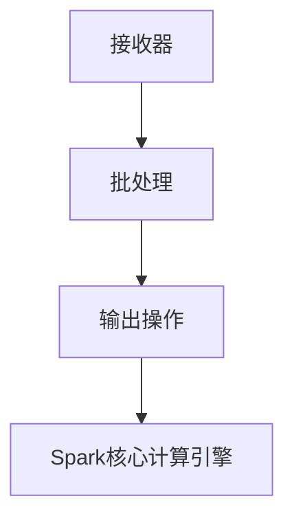

                 

# 【AI大数据计算原理与代码实例讲解】Spark Streaming

> **关键词：** AI大数据，Spark Streaming，实时计算，窗口操作，Watermark机制

> **摘要：** 本文深入解析了AI大数据计算原理，重点介绍了Spark Streaming的基础架构、核心算法原理及其在流数据处理中的应用。通过具体代码实例，本文详细展示了Spark Streaming的实时计算能力和数据采集与处理流程，为读者提供了全面的实战指南。

----------------------------------------------------------------

## 第一部分：AI大数据计算原理概述

### 第1章：AI大数据与Spark Streaming简介

#### 1.1 AI大数据的概念与特点

##### 1.1.1 大数据的定义与特性

大数据（Big Data）是指数据量巨大、数据类型多样且数据生成速度极快的数据集。其特性主要表现为：

1. **大量（Volume）**：数据规模巨大，通常以PB（皮字节）为单位。
2. **多样性（Variety）**：数据类型多样，包括结构化数据、非结构化数据以及半结构化数据。
3. **速度（Velocity）**：数据生成速度极快，需要实时或近实时处理。
4. **真实性（Veracity）**：数据真实可靠，但可能存在噪声和不一致性。

##### 1.1.2 AI大数据的应用场景

AI大数据在各个领域都有广泛应用，以下是一些典型的应用场景：

1. **社交网络实时数据分析**：通过分析用户行为数据，提供个性化推荐和实时社交互动。
2. **金融市场实时监控**：监控市场动态，进行交易决策和风险评估。
3. **物联网实时数据处理**：收集物联网设备的数据，实现智能监控和设备管理。

#### 1.2 Spark Streaming介绍

##### 1.2.1 Spark Streaming的历史背景

Spark Streaming是Apache Spark的一个子项目，于2011年由Matei Zaharia等人提出。Spark Streaming提供了一个易于使用的实时数据处理框架，可以将Spark的核心计算能力应用于流数据。

##### 1.2.2 Spark Streaming的核心特性

1. **高吞吐量**：Spark Streaming能够处理大规模数据流，具有高性能和高吞吐量。
2. **低延迟**：Spark Streaming支持实时数据处理，延迟通常在毫秒级别。
3. **容错机制**：Spark Streaming提供强大的容错机制，确保数据处理的可靠性。
4. **易于集成**：Spark Streaming可以与其他Spark组件无缝集成，如Spark SQL、Spark MLlib等。

#### 1.3 Spark Streaming的应用案例

##### 1.3.1 社交网络实时数据分析

通过Spark Streaming，可以对社交网络中的用户行为进行实时分析，为用户提供个性化推荐和实时互动。

##### 1.3.2 金融市场实时监控

Spark Streaming可以实时监控金融市场数据，帮助金融机构进行交易决策和风险控制。

##### 1.3.3 物联网实时数据处理

Spark Streaming能够处理物联网设备产生的实时数据，实现智能监控和设备管理。

----------------------------------------------------------------

### 第2章：Spark Streaming基础

#### 2.1 Spark Streaming架构解析

##### 2.1.1 Spark Streaming架构概述

Spark Streaming架构主要包括三个关键组件：接收器、批处理和输出操作。架构图如下所示：



##### 2.1.2 Spark Streaming与Spark的关系

Spark Streaming是Spark生态系统中的一个重要组成部分，它与Spark的关系如下：

1. **共享Spark的内存管理机制和计算引擎**：Spark Streaming利用了Spark的内存管理机制和计算引擎，能够高效处理流数据。
2. **基于Spark的DAG进行流数据处理**：Spark Streaming基于Spark的DAG（有向无环图）模型，能够对流数据执行复杂计算。
3. **能够无缝集成Spark的其他组件**：Spark Streaming可以与其他Spark组件（如Spark SQL、Spark MLlib等）无缝集成，实现更丰富的数据处理和分析功能。

#### 2.2 Spark Streaming编程模型

##### 2.2.1 DStream的概念

DStream（离散流）是Spark Streaming的核心数据抽象。DStream代表了连续的数据流，可以对其执行一系列转换操作。

##### 2.2.2 Transformations操作

Transformations操作用于对DStream进行转换。主要操作包括：

1. **map**：对DStream中的每个元素应用一个函数。
2. **reduceByKey**：对DStream中的键值对进行聚合操作。
3. **updateStateByKey**：用于处理需要维护状态的数据。

##### 2.2.3 OutputOperations操作

OutputOperations操作用于将计算结果输出到外部系统。主要操作包括：

1. **saveAsTextFiles**：将数据保存为文本文件。
2. **writeToHive**：将数据写入Hive数据库。
3. **foreachRDD**：对每个RDD执行外部系统的操作。

#### 2.3 Spark Streaming配置与部署

##### 2.3.1 Spark Streaming配置参数

Spark Streaming配置参数主要包括：

1. **batchDuration**：批处理时间间隔，默认为1秒。
2. **receiverInitialBackoff**：接收器初始回退时间，默认为3秒。
3. **receiverMaxBackoff**：接收器最大回退时间，默认为1分钟。

##### 2.3.2 Spark Streaming部署模式

Spark Streaming支持两种部署模式：

1. **Standalone模式**：独立部署，无需其他依赖。
2. **YARN模式**：在Hadoop YARN集群上部署，与Hadoop生态系统无缝集成。

----------------------------------------------------------------

## 第二部分：Spark Streaming核心算法原理

### 第3章：窗口操作与Watermark机制

#### 3.1 窗口操作原理

##### 3.1.1 窗口的概念与类型

窗口（Window）是流数据处理中的一个重要概念，用于将数据分成不同的时间段。窗口的类型主要包括：

1. **固定窗口**：窗口大小固定，如每5分钟一个窗口。
2. **滑动窗口**：窗口大小固定，但会随着时间不断滑动，如每5分钟滑动1分钟。
3. **会话窗口**：根据用户行为活动进行窗口划分，如30秒内无活动则认为是一个窗口。

##### 3.1.2 窗口操作实现

窗口操作主要包括：

1. **window**：将DStream划分为窗口。
2. **slidingWindow**：创建滑动窗口。
3. **tumblingWindow**：创建固定窗口。

以下是一个简单的窗口操作的伪代码：

```python
dstream = ...  # 假设已经有一个DStream
windowedStream = dstream.window(TumblingWindow(5 * SECONDS))
```

#### 3.2 Watermark机制

##### 3.2.1 Watermark的定义

Watermark（水印）是流数据处理中的一个关键概念，用于标记事件的时间戳。Watermark机制可以确保数据处理的正确性和一致性。

##### 3.2.2 Watermark的应用

Watermark机制在处理迟到数据时尤为重要。以下是一个简单的Watermark应用的伪代码：

```python
def updateWatermark(timestamp, lastWatermark):
    return max(timestamp, lastWatermark + MAX_LATE_TIMESTAMP)

watermarkedStream = dstream.updateWatermarks(updatedWatermarkFn)
```

#### 3.3 窗口操作与Watermark结合应用实例

以下是一个结合窗口操作和Watermark机制的实例，用于计算过去5分钟内每个键的计数：

```python
windowedStream = dstream.window(TumblingWindow(5 * MINUTES))
countStream = windowedStream.mapValues(lambda x: 1).reduceByKey(lambda a, b: a + b)
```

----------------------------------------------------------------

### 第4章：流数据处理与实时计算

#### 4.1 基于Spark Streaming的实时计算框架

##### 4.1.1 实时计算的概念与挑战

实时计算（Real-time Computing）是指对数据流进行快速处理和响应，通常在毫秒级别。实时计算面临的挑战包括：

1. **高吞吐量**：处理大量数据流。
2. **低延迟**：确保数据处理延迟在可接受范围内。
3. **一致性**：保证数据处理的一致性和准确性。
4. **容错性**：确保系统在故障情况下能够恢复。

##### 4.1.2 Spark Streaming在实时计算中的应用

Spark Streaming提供了强大的实时计算能力，适用于以下场景：

1. **实时数据分析**：对社交网络、金融市场等数据流进行实时分析。
2. **实时监控与报警**：监控物联网设备状态，实时报警。
3. **实时推荐系统**：根据用户行为实时推荐相关内容。

#### 4.2 流数据聚合与统计分析

##### 4.2.1 流数据聚合操作

流数据聚合操作用于对数据流进行汇总和计算，如计数、求和、平均值等。以下是一个简单的流数据聚合操作实例：

```python
dstream = ...  # 假设已经有一个DStream
countStream = dstream.map(lambda x: (x[0], 1)).reduceByKey(lambda a, b: a + b)
sumStream = dstream.map(lambda x: (x[0], x[1])).reduceByKey(lambda a, b: a + b)
avgStream = sumStream.mapValues(lambda x: x / countStream)
```

##### 4.2.2 流数据统计分析实例

以下是一个简单的流数据统计分析实例，用于计算过去5分钟内每个键的最大值：

```python
windowedStream = dstream.window(TumblingWindow(5 * MINUTES))
maxStream = windowedStream.maxByKey()
```

#### 4.3 基于Spark Streaming的实时应用案例

##### 4.3.1 社交网络用户行为分析

利用Spark Streaming，可以实时分析社交网络中的用户行为，为用户提供个性化推荐和实时互动。

##### 4.3.2 金融市场实时监控

Spark Streaming可以实时监控金融市场数据，帮助金融机构进行交易决策和风险控制。

##### 4.3.3 物联网实时数据处理

Spark Streaming能够处理物联网设备产生的实时数据，实现智能监控和设备管理。

----------------------------------------------------------------

## 第三部分：代码实例讲解与实战

### 第5章：Spark Streaming数据采集与处理

#### 5.1 数据采集技术

##### 5.1.1 Kafka在Spark Streaming中的应用

Kafka是一个分布式流处理平台，常用于数据采集和传输。以下是一个使用Kafka作为数据源采集数据的实例：

```python
from pyspark.streaming import StreamingContext
from pyspark.streaming.kafka import KafkaUtils

# 创建一个StreamingContext，批处理时间间隔为2秒
ssc = StreamingContext(sc, 2)

# 创建一个Kafka的Direct模式连接
directKafkaStream = KafkaUtils.createDirectStream(ssc, ["topic1"], {"metadata.broker.list": "localhost:9092"})

# 对Kafka流进行处理
lines = directKafkaStream.map(lambda x: x[1])
words = lines.flatMap(lambda line: line.split(" "))
word_counts = words.map(lambda word: (word, 1)).reduceByKey(lambda x, y: x + y)

# 按照每2秒打印一次结果
word_counts.print()

# 启动StreamingContext
ssc.start()
ssc.awaitTermination()
```

##### 5.1.2 自定义数据源采集

除了Kafka，Spark Streaming还支持自定义数据源采集。以下是一个使用文件作为数据源的实例：

```python
from pyspark.streaming import StreamingContext

# 创建一个StreamingContext，批处理时间间隔为2秒
ssc = StreamingContext(sc, 2)

# 创建一个文件源
lines = ssc.textFileStream("hdfs://path/to/files/")

# 对文件流进行处理
words = lines.flatMap(lambda line: line.split(" "))
word_counts = words.map(lambda word: (word, 1)).reduceByKey(lambda x, y: x + y)

# 按照每2秒打印一次结果
word_counts.print()

# 启动StreamingContext
ssc.start()
ssc.awaitTermination()
```

#### 5.2 数据处理实例

##### 5.2.1 社交网络用户行为分析

以下是一个社交网络用户行为分析的实例，包括用户行为数据采集、处理和结果输出：

```python
from pyspark.streaming import StreamingContext
from pyspark.streaming.kafka import KafkaUtils

# 创建一个StreamingContext，批处理时间间隔为2秒
ssc = StreamingContext(sc, 2)

# 创建一个Kafka的Direct模式连接
directKafkaStream = KafkaUtils.createDirectStream(ssc, ["user-behavior"], {"metadata.broker.list": "localhost:9092"})

# 对Kafka流进行处理
user_actions = directKafkaStream.map(lambda x: x[1])
action_words = user_actions.flatMap(lambda action: action.split(" "))

# 统计用户行为词频
word_counts = action_words.map(lambda word: (word, 1)).reduceByKey(lambda x, y: x + y)

# 按照每2秒打印一次结果
word_counts.print()

# 启动StreamingContext
ssc.start()
ssc.awaitTermination()
```

##### 5.2.2 传感器数据实时监控

以下是一个传感器数据实时监控的实例，包括传感器数据采集、处理和结果输出：

```python
from pyspark.streaming import StreamingContext
from pyspark.streaming.kafka import KafkaUtils

# 创建一个StreamingContext，批处理时间间隔为2秒
ssc = StreamingContext(sc, 2)

# 创建一个Kafka的Direct模式连接
directKafkaStream = KafkaUtils.createDirectStream(ssc, ["sensor-data"], {"metadata.broker.list": "localhost:9092"})

# 对Kafka流进行处理
sensor_data = directKafkaStream.map(lambda x: x[1])
sensor_values = sensor_data.flatMap(lambda data: [float(v) for v in data.split(",")])

# 统计传感器数据平均值
avg_values = sensor_values.map(lambda value: (value, 1)).reduceByKey(lambda x, y: x + y).mapValues(lambda counts: sum(counts) / len(counts))

# 按照每2秒打印一次结果
avg_values.print()

# 启动StreamingContext
ssc.start()
ssc.awaitTermination()
```

----------------------------------------------------------------

### 第6章：Spark Streaming应用实战

#### 6.1 实时电商数据分析

##### 6.1.1 数据处理流程

实时电商数据分析的主要流程包括数据采集、数据清洗、数据转换和数据存储。以下是一个简化的数据处理流程：

1. **数据采集**：从电商平台的日志或数据库中采集用户行为数据。
2. **数据清洗**：去除无效数据、处理缺失值和异常值。
3. **数据转换**：将原始数据转换为适合分析的形式，如将日志数据转换为键值对。
4. **数据存储**：将处理后的数据存储到HDFS、Hive或其他数据仓库中。

##### 6.1.2 应用实例解析

以下是一个使用Spark Streaming进行实时电商数据分析的应用实例：

```python
from pyspark.streaming import StreamingContext
from pyspark.streaming.kafka import KafkaUtils

# 创建一个StreamingContext，批处理时间间隔为2秒
ssc = StreamingContext(sc, 2)

# 创建一个Kafka的Direct模式连接
directKafkaStream = KafkaUtils.createDirectStream(ssc, ["ecommerce-data"], {"metadata.broker.list": "localhost:9092"})

# 对Kafka流进行处理
user_actions = directKafkaStream.map(lambda x: x[1])
action_words = user_actions.flatMap(lambda action: action.split(" "))

# 统计用户行为词频
word_counts = action_words.map(lambda word: (word, 1)).reduceByKey(lambda x, y: x + y)

# 按照每2秒打印一次结果
word_counts.print()

# 启动StreamingContext
ssc.start()
ssc.awaitTermination()
```

#### 6.2 实时交通流量分析

##### 6.2.1 数据采集与预处理

实时交通流量分析的数据来源可以是传感器、摄像头或其他监测设备。以下是一个简化的数据采集与预处理流程：

1. **数据采集**：从传感器或摄像头中采集实时交通流量数据。
2. **数据预处理**：去除无效数据、处理缺失值和异常值，并将数据转换为适合分析的形式。

##### 6.2.2 交通流量预测模型

以下是一个使用Spark Streaming进行实时交通流量预测的应用实例：

```python
from pyspark.streaming import StreamingContext
from pyspark.streaming.kafka import KafkaUtils

# 创建一个StreamingContext，批处理时间间隔为2秒
ssc = StreamingContext(sc, 2)

# 创建一个Kafka的Direct模式连接
directKafkaStream = KafkaUtils.createDirectStream(ssc, ["traffic-data"], {"metadata.broker.list": "localhost:9092"})

# 对Kafka流进行处理
traffic_data = directKafkaStream.map(lambda x: x[1])
traffic_values = traffic_data.flatMap(lambda data: [float(v) for v in data.split(",")])

# 计算交通流量平均值
avg_values = traffic_values.map(lambda value: (value, 1)).reduceByKey(lambda x, y: x + y).mapValues(lambda counts: sum(counts) / len(counts))

# 按照每2秒打印一次结果
avg_values.print()

# 启动StreamingContext
ssc.start()
ssc.awaitTermination()
```

#### 6.3 实时金融风险管理

##### 6.3.1 风险指标计算

实时金融风险管理需要计算各种风险指标，如波动率、Beta值、VaR等。以下是一个使用Spark Streaming进行风险指标计算的应用实例：

```python
from pyspark.streaming import StreamingContext
from pyspark.streaming.kafka import KafkaUtils

# 创建一个StreamingContext，批处理时间间隔为2秒
ssc = StreamingContext(sc, 2)

# 创建一个Kafka的Direct模式连接
directKafkaStream = KafkaUtils.createDirectStream(ssc, ["financial-data"], {"metadata.broker.list": "localhost:9092"})

# 对Kafka流进行处理
financial_data = directKafkaStream.map(lambda x: x[1])
stock_prices = financial_data.flatMap(lambda data: [float(v) for v in data.split(",")])

# 计算股票价格波动率
volatility = stock_prices.map(lambda price: (price, 1)).reduceByKey(lambda x, y: x + y).mapValues(lambda counts: math.sqrt(sum([(price - mean)**2 for price, mean in counts]) / len(counts)))

# 按照每2秒打印一次结果
volatility.print()

# 启动StreamingContext
ssc.start()
ssc.awaitTermination()
```

----------------------------------------------------------------

### 第7章：性能优化与故障处理

#### 7.1 Spark Streaming性能优化

##### 7.1.1 数据倾斜问题处理

数据倾斜是Spark Streaming中常见的问题，会导致计算性能下降。以下是一些处理数据倾斜的方法：

1. **重分区**：通过增加分区数来平衡数据分布。
2. **广播变量**：将小数据集广播到所有节点，避免在计算过程中进行分布式操作。
3. **随机前缀**：对键添加随机前缀，避免大量数据集中在一个分区。

##### 7.1.2 内存管理策略

合理的内存管理对于Spark Streaming的性能至关重要。以下是一些内存管理策略：

1. **内存调优**：调整内存参数，如`spark.executor.memory`和`spark.memory.fraction`。
2. **垃圾回收**：合理设置垃圾回收策略，如使用G1垃圾回收器。
3. **内存占用监控**：定期监控内存占用情况，及时调整内存配置。

#### 7.2 故障处理与容错机制

##### 7.2.1 数据丢失处理

在Spark Streaming中，数据丢失是常见的问题。以下是一些处理数据丢失的方法：

1. **数据备份**：使用Kafka等消息队列进行数据备份，确保数据不丢失。
2. **重试机制**：在数据处理失败时，进行重试，确保数据处理成功。
3. **日志记录**：记录处理失败的日志，便于故障排查和恢复。

##### 7.2.2 故障恢复机制

Spark Streaming提供了强大的容错机制，确保系统在故障情况下能够快速恢复。以下是一些故障恢复方法：

1. **检查点（Checkpoint）**：定期保存系统的检查点，以便在故障时快速恢复。
2. **重启动（Restart）**：在检测到故障时，自动重启StreamingContext。
3. **故障转移（Fault Tolerance）**：在集群节点故障时，自动将任务迁移到其他节点。

#### 7.3 代码实战解析：Spark Streaming性能调优案例

以下是一个Spark Streaming性能调优的代码实例：

```python
from pyspark.streaming import StreamingContext
from pyspark.streaming.kafka import KafkaUtils

# 创建一个StreamingContext，批处理时间间隔为2秒
ssc = StreamingContext(sc, 2)

# 创建一个Kafka的Direct模式连接
directKafkaStream = KafkaUtils.createDirectStream(ssc, ["topic1"], {"metadata.broker.list": "localhost:9092"})

# 对Kafka流进行处理
lines = directKafkaStream.map(lambda x: x[1])
words = lines.flatMap(lambda line: line.split(" "))
word_counts = words.map(lambda word: (word, 1)).reduceByKey(lambda x, y: x + y)

# 按照每2秒打印一次结果
word_counts.print()

# 性能调优参数设置
ssc.config("spark.streaming.kafka.maxRatePerPartition", "10000")
ssc.config("spark.executor.memory", "4g")
ssc.config("spark.memory.fraction", "0.6")

# 启动StreamingContext
ssc.start()
ssc.awaitTermination()
```

----------------------------------------------------------------

## 附录

### 附录 A：Spark Streaming开发工具与资源

##### A.1 Spark Streaming官方文档与资源

1. **官方文档**：[Spark Streaming官方文档](https://spark.apache.org/docs/latest/streaming-programming-guide.html)
2. **官方教程**：[Spark Streaming官方教程](https://spark.apache.org/docs/latest/streaming-tutorials.html)

##### A.2 Spark Streaming开源社区

1. **GitHub仓库**：[Spark Streaming GitHub仓库](https://github.com/apache/spark)
2. **邮件列表**：[Spark Streaming邮件列表](mailto:spark-streaming@googlegroups.com)

##### A.3 Spark Streaming相关书籍与教程

1. **《Spark Streaming实战》**：[书籍链接](https://www.amazon.com/Spark-Streaming-Practical-Real-Time-Analytics/dp/1449327875)
2. **《大数据应用开发实战》**：[书籍链接](https://www.amazon.com/Big-Data-Application-Development-Practical/dp/1783984137)

### 作者

**作者：AI天才研究院/AI Genius Institute & 禅与计算机程序设计艺术 /Zen And The Art of Computer Programming**

