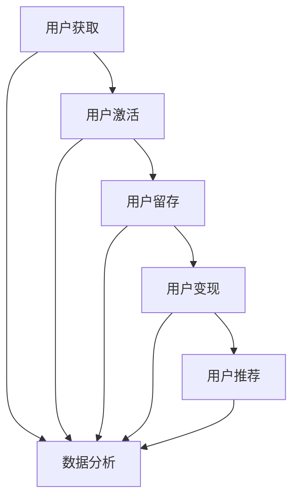
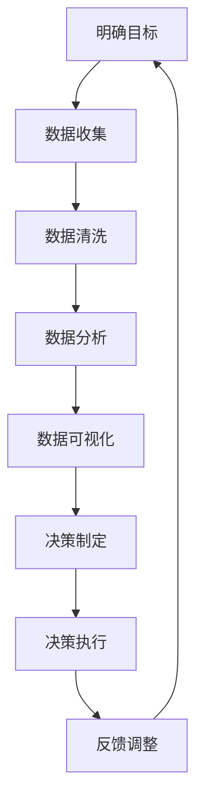
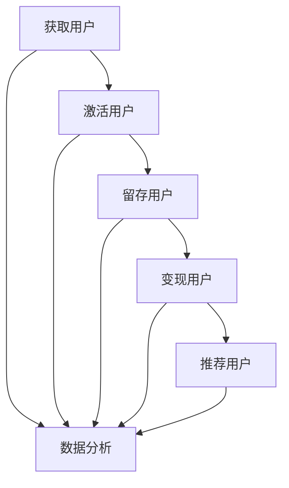

                 

# 《一人公司如何利用增长黑客技术实现快速扩张》

> **关键词：** 增长黑客、快速扩张、市场细分、用户画像、AARRR模型、用户体验、数据驱动决策

> **摘要：** 本文旨在探讨一人公司如何利用增长黑客技术实现快速扩张。通过分析增长黑客的定义、核心原则、技术工具，结合实际案例，本文将展示如何运用市场细分、用户画像、AARRR模型等策略，提升用户体验，并通过数据驱动决策，实现公司的快速增长。

## 目录

#### 第一部分：增长黑客概述

##### 第1章：增长黑客的定义与核心原则

###### 1.1 增长黑客的起源与发展

###### 1.2 增长黑客与传统营销的差异

###### 1.3 增长黑客的核心原则

###### 1.4 增长黑客的思维方式

##### 第2章：增长黑客的技术工具

###### 2.1 数据分析工具

###### 2.2 营销自动化工具

###### 2.3 社交媒体管理工具

###### 2.4 内容营销工具

###### 2.5 用户测试与反馈工具

#### 第二部分：增长黑客实践

##### 第3章：市场细分与用户画像

###### 3.1 市场细分的重要性

###### 3.2 如何创建用户画像

###### 3.3 用户画像在增长黑客中的应用

##### 第4章：AARRR模型应用

###### 4.1 AARRR模型介绍

###### 4.2 用户获取（Acquisition）

###### 4.3 用户激活（Activation）

###### 4.4 用户留存（Retention）

###### 4.5 用户变现（Revenue）

###### 4.6 用户推荐（Referral）

##### 第5章：转化率优化

###### 5.1 转化率优化的核心策略

###### 5.2 转化率优化的技术手段

###### 5.3 转化率优化的案例分析

##### 第6章：用户体验提升

###### 6.1 用户体验的重要性

###### 6.2 用户体验优化的方法

###### 6.3 用户体验优化的实践案例

##### 第7章：数据驱动决策

###### 7.1 数据驱动决策的概念

###### 7.2 数据分析在企业决策中的应用

###### 7.3 数据驱动决策的实践

#### 第三部分：增长黑客案例分析

##### 第8章：成功案例研究

###### 8.1 案例一：Dropbox 的增长黑客策略

###### 8.2 案例二：Airbnb 的增长黑客实践

###### 8.3 案例三：LinkedIn 的增长黑客之路

##### 第9章：实战技巧与工具应用

###### 9.1 增长黑客实战技巧

###### 9.2 工具应用与实践

###### 9.3 实战案例解析

##### 第10章：未来趋势与挑战

###### 10.1 增长黑客技术的未来发展趋势

###### 10.2 增长黑客在新兴市场中的挑战

###### 10.3 企业应对增长黑客趋势的策略

#### 附录

##### 附录A：增长黑客资源与工具汇总

###### A.1 数据分析工具

###### A.2 营销自动化工具

###### A.3 社交媒体管理工具

###### A.4 内容营销工具

###### A.5 用户测试与反馈工具

##### 附录B：增长黑客核心概念与架构 Mermaid 流程图

###### B.1 增长黑客工作流程图

###### B.2 数据驱动决策流程图

###### B.3 AARRR模型应用流程图

##### 附录C：增长黑客核心算法原理讲解与伪代码

###### C.1 数据分析算法原理与伪代码

###### C.2 营销自动化算法原理与伪代码

###### C.3 用户测试与反馈算法原理与伪代码

##### 附录D：增长黑客项目实战

###### D.1 项目实战案例一：用户获取策略

###### D.2 项目实战案例二：用户激活策略

###### D.3 项目实战案例三：用户留存策略

###### D.4 项目实战案例四：用户变现策略

###### D.5 项目实战案例五：用户推荐策略

##### 附录E：代码实现与解读

###### E.1 增长黑客工具源代码实现

###### E.2 源代码解读与分析

###### E.3 环境搭建与调试技巧

---

## 增长黑客的定义与核心原则

增长黑客（Growth Hacker）是一个相对较新的概念，起源于硅谷，是指那些熟练掌握市场营销、产品开发和数据分析等技术手段的跨领域专家。他们利用技术手段，通过数据驱动的策略来优化产品和市场营销，实现公司快速增长。

### 1.1 增长黑客的起源与发展

增长黑客这个概念最早由Sean Ellis提出。2010年，他在介绍自己的工作时，首次使用了“增长黑客”一词。他指出，增长黑客是一种独特的角色，结合了市场营销和开发的能力，专注于通过技术手段实现用户增长。

随着互联网的快速发展，增长黑客逐渐成为一个热门领域。越来越多的公司开始认识到，仅仅依靠传统的市场营销手段已经无法满足快速增长的诉求。因此，增长黑客应运而生，成为了一种新型的商业模式。

### 1.2 增长黑客与传统营销的差异

传统营销主要依赖于广告、公关和线下活动等方式，注重品牌宣传和消费者认知。而增长黑客则更加注重用户增长，通过数据分析和技术手段，实现用户获取、激活、留存和变现的全面优化。

具体来说，增长黑客与传统营销有以下几点差异：

1. **目标导向**：传统营销注重品牌认知，而增长黑客以用户增长为目标。
2. **数据驱动**：增长黑客依赖于数据分析，通过数据优化产品和营销策略。
3. **技术手段**：增长黑客利用技术手段，如A/B测试、用户反馈等，实现精准营销和用户体验优化。
4. **跨领域协作**：增长黑客需要具备市场营销、产品开发和数据分析等多领域知识，与传统营销相比，具有更强的综合能力。

### 1.3 增长黑客的核心原则

增长黑客的核心原则可以概括为以下几点：

1. **用户为中心**：始终关注用户需求和体验，以用户为中心进行产品开发和营销。
2. **数据驱动**：依赖数据分析，通过数据优化产品和营销策略。
3. **快速迭代**：采用敏捷开发模式，快速迭代产品，持续优化用户体验。
4. **测试与验证**：通过A/B测试等方式，验证增长策略的有效性。
5. **跨领域协作**：与市场营销、产品开发和数据分析等团队紧密协作，共同实现用户增长。

### 1.4 增长黑客的思维方式

增长黑客的思维方式与传统营销有所不同，更加注重数据分析和实验验证。以下是增长黑客的思维方式：

1. **问题导向**：从用户角度出发，关注用户需求和痛点。
2. **数据驱动**：依赖数据分析，通过数据优化产品和营销策略。
3. **实验验证**：通过A/B测试等方式，验证增长策略的有效性。
4. **持续优化**：不断迭代产品，持续优化用户体验和增长策略。
5. **跨领域协作**：与市场营销、产品开发和数据分析等团队紧密协作，共同实现用户增长。

综上所述，增长黑客是一种新型的商业模式，通过数据分析和技术手段，实现公司快速增长。理解增长黑客的定义、核心原则和思维方式，对于一人公司实现快速扩张具有重要意义。

---

## 增长黑客的技术工具

增长黑客的成功离不开一系列技术工具的支持。这些工具涵盖了数据分析、营销自动化、社交媒体管理、内容营销和用户测试与反馈等方面。本章节将详细介绍这些技术工具，并分析它们如何帮助一人公司实现快速扩张。

### 2.1 数据分析工具

数据分析工具是增长黑客的核心工具之一。通过数据分析，可以深入了解用户行为、市场趋势和业务表现，为决策提供依据。常见的数据分析工具包括Google Analytics、Mixpanel、Kissmetrics等。

**数据分析工具的优势：**

1. **用户行为分析**：可以实时跟踪用户在网站或APP上的行为，了解用户喜好和需求。
2. **市场趋势分析**：通过分析市场数据，了解行业动态，为业务拓展提供方向。
3. **业务表现分析**：评估业务表现，优化营销策略，提高转化率。

**如何利用数据分析工具实现快速扩张：**

1. **用户细分**：通过数据分析，将用户分为不同的群体，制定个性化的营销策略。
2. **行为预测**：分析用户行为数据，预测潜在用户的购买行为，提高用户获取效率。
3. **转化率优化**：通过A/B测试，不断优化页面设计和营销策略，提高转化率。

### 2.2 营销自动化工具

营销自动化工具可以帮助一人公司自动化营销流程，提高效率，降低成本。常见的营销自动化工具包括HubSpot、Marketo、Pardot等。

**营销自动化工具的优势：**

1. **自动化营销流程**：自动发送邮件、社交媒体推广等，节省人力成本。
2. **个性化营销**：根据用户行为和需求，自动化发送个性化的营销内容。
3. **提高营销效果**：通过自动化跟踪和评估营销活动效果，优化营销策略。

**如何利用营销自动化工具实现快速扩张：**

1. **自动化用户获取**：通过自动化邮件和社交媒体推广，吸引潜在用户。
2. **客户关系管理**：自动化管理客户关系，提高客户满意度和忠诚度。
3. **提高转化率**：通过自动化跟踪和优化营销活动，提高用户转化率。

### 2.3 社交媒体管理工具

社交媒体管理工具可以帮助一人公司高效管理社交媒体账号，提高品牌影响力。常见的社交媒体管理工具包括Hootsuite、Buffer、Sprout Social等。

**社交媒体管理工具的优势：**

1. **统一管理**：可以统一管理多个社交媒体账号，避免重复劳动。
2. **内容规划**：可以提前规划社交媒体内容，提高发布效率。
3. **数据分析**：可以分析社交媒体活动效果，优化内容策略。

**如何利用社交媒体管理工具实现快速扩张：**

1. **内容营销**：通过发布有价值的内容，吸引潜在用户，提高品牌知名度。
2. **社交媒体互动**：通过互动和反馈，提高用户参与度和忠诚度。
3. **病毒式传播**：通过创意内容和社交互动，实现病毒式传播，快速扩大用户群体。

### 2.4 内容营销工具

内容营销工具可以帮助一人公司创作、管理和优化内容，提高营销效果。常见的内容营销工具包括Contentful、HubSpot、Hemingway Editor等。

**内容营销工具的优势：**

1. **内容创作**：可以快速创作高质量的内容，提高内容生产效率。
2. **内容管理**：可以统一管理内容，方便更新和维护。
3. **内容优化**：可以通过数据分析，优化内容策略，提高内容效果。

**如何利用内容营销工具实现快速扩张：**

1. **内容创作**：创作有价值的内容，吸引潜在用户，提高品牌影响力。
2. **内容发布**：通过定期发布内容，保持品牌活跃度，提高用户粘性。
3. **内容优化**：通过数据分析，优化内容策略，提高内容转化率。

### 2.5 用户测试与反馈工具

用户测试与反馈工具可以帮助一人公司了解用户需求和体验，优化产品和服务。常见的用户测试与反馈工具包括UserTesting、UsabilityHub、Qualaroo等。

**用户测试与反馈工具的优势：**

1. **用户体验测试**：可以实时了解用户在产品中的体验，发现问题。
2. **用户反馈收集**：可以收集用户的意见和建议，为产品改进提供依据。
3. **数据驱动**：通过数据分析和反馈，优化产品和服务。

**如何利用用户测试与反馈工具实现快速扩张：**

1. **用户体验测试**：通过用户体验测试，优化产品界面和功能，提高用户满意度。
2. **用户反馈分析**：通过分析用户反馈，了解用户需求和痛点，优化产品和服务。
3. **持续改进**：通过持续的用户体验测试和反馈，不断优化产品，提高用户留存率和转化率。

综上所述，增长黑客的技术工具涵盖了数据分析、营销自动化、社交媒体管理、内容营销和用户测试与反馈等多个方面。通过合理利用这些工具，一人公司可以实现快速增长，提高市场竞争力。

---

## 市场细分与用户画像

市场细分与用户画像是增长黑客策略中至关重要的一环。通过市场细分，可以将庞大的市场划分为具有相似需求和行为的子市场；而用户画像则是对目标用户进行深入分析，了解其特征、行为和需求。本章节将探讨市场细分的重要性、如何创建用户画像，以及用户画像在增长黑客中的应用。

### 3.1 市场细分的重要性

市场细分是指将一个广泛的市场划分为若干具有相似需求和行为的子市场。市场细分的重要性主要体现在以下几个方面：

1. **提高营销效果**：通过市场细分，可以更精准地定位目标用户，制定个性化的营销策略，提高营销效果。
2. **节省营销成本**：针对不同的子市场，可以采用不同的营销手段，避免资源的浪费。
3. **发现新市场机会**：市场细分可以帮助企业发现新的市场机会，开拓新的业务领域。
4. **增强竞争优势**：通过市场细分，企业可以更好地满足用户需求，提高用户满意度，增强竞争优势。

### 3.2 如何创建用户画像

创建用户画像的过程可以分为以下几个步骤：

1. **数据收集**：收集与用户相关的数据，包括基本信息、行为数据、兴趣数据等。这些数据可以从用户调研、社交媒体、数据分析工具等渠道获取。
2. **数据清洗**：对收集到的数据进行清洗，去除重复、无效和错误的数据，确保数据质量。
3. **特征提取**：从清洗后的数据中提取关键特征，如年龄、性别、地域、职业、行为习惯、兴趣等。
4. **数据分析**：对提取的特征进行统计分析，了解用户的基本情况和行为模式。
5. **用户画像构建**：根据分析结果，构建用户画像，将用户划分为不同的群体。
6. **用户画像应用**：将用户画像应用于营销策略、产品优化、用户服务等环节。

### 3.3 用户画像在增长黑客中的应用

用户画像在增长黑客中的应用非常广泛，以下是一些具体的应用场景：

1. **精准营销**：根据用户画像，可以精准定位目标用户，制定个性化的营销策略。例如，针对不同年龄段的用户，推送不同的产品信息和优惠活动。
2. **产品优化**：通过用户画像，可以了解用户的需求和行为模式，优化产品设计和服务。例如，根据用户的兴趣爱好，提供个性化的内容推荐。
3. **用户服务**：根据用户画像，可以提供定制化的用户服务，提高用户满意度。例如，为高端用户提供VIP服务，为普通用户提供常见问题解答。
4. **需求预测**：通过分析用户画像，可以预测用户未来的需求和行为，提前做好准备。例如，预测用户可能购买的产品，提前备货。
5. **用户获取**：根据用户画像，可以针对不同子市场，设计不同的用户获取策略。例如，针对年轻用户，采用社交媒体推广；针对中年用户，采用线上广告推广。

### 3.4 案例分析

以一家电子商务公司为例，该公司通过市场细分和用户画像，实现了快速增长。

1. **市场细分**：该公司将市场细分为年轻用户群体、中年用户群体和老年用户群体。针对不同群体，制定不同的营销策略。
2. **用户画像**：通过对用户数据进行分析，构建了详细的用户画像。例如，年轻用户群体喜欢时尚、潮流产品，中年用户群体注重品质和实用性，老年用户群体关注健康和养生。
3. **精准营销**：根据用户画像，为年轻用户群体推送时尚产品，为中年用户群体推送品质优良的产品，为老年用户群体推送健康养生产品。
4. **产品优化**：根据用户需求和反馈，优化产品设计和服务。例如，为年轻用户群体提供个性化搭配推荐，为中年用户群体提供详细的产品说明，为老年用户群体提供健康咨询。
5. **用户服务**：根据用户画像，提供定制化的用户服务。例如，为高端用户提供VIP服务，为普通用户提供常见问题解答。
6. **需求预测**：通过分析用户画像，预测用户未来的需求和行为。例如，预测年轻用户群体可能关注的美妆产品，提前备货。

通过市场细分和用户画像，该公司实现了用户快速增长，提高了市场竞争力。

综上所述，市场细分与用户画像在增长黑客中具有重要意义。通过合理运用市场细分和用户画像，一人公司可以精准定位目标用户，优化产品和营销策略，实现快速增长。

---

## AARRR模型应用

AARRR模型，全称为获取（Acquisition）、激活（Activation）、留存（Retention）、变现（Revenue）和推荐（Referral）模型，是一种广泛用于衡量和分析用户生命周期价值的重要工具。本章节将详细阐述AARRR模型的概念、每个环节的核心策略，以及如何通过这一模型实现公司快速增长。

### 4.1 AARRR模型介绍

AARRR模型起源于硅谷，是一种基于用户生命周期的数据分析模型。它将用户从初次接触到最终转化为付费用户的过程分为五个阶段，分别为：

1. **获取（Acquisition）**：指通过各种渠道吸引用户访问或注册产品。
2. **激活（Activation）**：指用户在产品中的首次互动，表明他们对产品产生了兴趣。
3. **留存（Retention）**：指用户在一段时间内持续使用产品，表现出了忠诚度。
4. **变现（Revenue）**：指用户为产品支付费用，成为付费用户。
5. **推荐（Referral）**：指用户通过口碑传播，推荐新用户使用产品。

AARRR模型的核心在于通过数据分析和优化，提高每个阶段的转化率，从而实现用户生命周期的整体提升。

### 4.2 用户获取（Acquisition）

用户获取是AARRR模型的第一阶段，主要目标是吸引潜在用户并引导他们访问或注册产品。以下是一些核心策略：

1. **渠道选择**：选择适合产品的渠道，如搜索引擎广告、社交媒体推广、内容营销等。
2. **关键词优化**：针对目标用户搜索习惯，优化搜索引擎关键词，提高搜索排名。
3. **内容营销**：创作有价值的内容，吸引目标用户，提高品牌知名度。
4. **病毒式营销**：利用用户的社交网络，实现口碑传播，吸引新用户。
5. **活动推广**：举办线上或线下活动，提高用户参与度和转化率。

**案例分析：** 以一家在线教育平台为例，该公司通过搜索引擎广告和内容营销，实现了用户快速增长。首先，通过优化关键词，提高在百度和谷歌上的搜索排名。其次，发布有价值的教育文章和视频，吸引用户关注。此外，举办线上课程免费试听活动，提高用户参与度。

### 4.3 用户激活（Activation）

用户激活是AARRR模型的第二阶段，目标是确保用户在产品中产生首次互动，表明他们对产品产生了兴趣。以下是一些核心策略：

1. **欢迎邮件**：在用户注册后，发送个性化的欢迎邮件，介绍产品特点和功能。
2. **引导教程**：提供简单的引导教程，帮助用户快速上手，提高用户体验。
3. **互动设计**：设计有趣的互动元素，如小游戏、问卷调查等，提高用户参与度。
4. **优惠活动**：通过优惠活动，如首次购买折扣、免费试用等，刺激用户互动。
5. **用户反馈**：收集用户反馈，优化产品功能和用户体验。

**案例分析：** 以一家在线健身平台为例，该公司在用户激活阶段，通过发送个性化欢迎邮件，介绍平台特点和功能。同时，提供免费的健身教程和互动小游戏，帮助用户快速了解平台，提高用户参与度。

### 4.4 用户留存（Retention）

用户留存是AARRR模型的第三阶段，目标是确保用户在一段时间内持续使用产品。以下是一些核心策略：

1. **定期互动**：通过定期发送邮件、消息等，与用户保持互动，提高用户粘性。
2. **个性化推荐**：根据用户行为和喜好，提供个性化的内容推荐，提高用户留存率。
3. **增值服务**：推出增值服务，如会员订阅、高级功能等，提高用户留存率。
4. **社区建设**：建立用户社区，提供用户交流的平台，增强用户归属感。
5. **用户调研**：定期进行用户调研，了解用户需求和痛点，优化产品和服务。

**案例分析：** 以一家社交媒体平台为例，该公司通过定期发送个性化邮件，提醒用户关注好友动态和热点话题。同时，推出会员订阅服务，提供更多高级功能和内容，提高用户留存率。

### 4.5 用户变现（Revenue）

用户变现是AARRR模型的第四阶段，目标是引导用户为产品支付费用，成为付费用户。以下是一些核心策略：

1. **免费试用**：提供免费试用服务，让用户亲身体验产品价值，提高付费转化率。
2. **定价策略**：根据市场需求和用户价值，制定合理的定价策略，提高付费转化率。
3. **促销活动**：举办促销活动，如折扣券、限时优惠等，刺激用户购买。
4. **增值服务**：推出增值服务，如高级功能、会员特权等，提高付费用户占比。
5. **用户反馈**：收集用户反馈，优化产品功能和用户体验，提高用户满意度。

**案例分析：** 以一家电商平台为例，该公司通过提供免费试用服务，吸引用户购买。同时，推出限时折扣和会员订阅服务，提高用户付费转化率和付费用户占比。

### 4.6 用户推荐（Referral）

用户推荐是AARRR模型的第五阶段，目标是鼓励现有用户推荐新用户，实现病毒式增长。以下是一些核心策略：

1. **推荐奖励**：为推荐新用户的老用户和被推荐的新用户提供奖励，如优惠券、积分等。
2. **口碑营销**：通过用户口碑，提高新用户的信任度，增加推荐效果。
3. **推荐机制**：设计合理的推荐机制，如好友邀请、分享按钮等，方便用户推荐。
4. **用户社区**：建立用户社区，鼓励用户分享使用心得，提高口碑传播效果。
5. **数据分析**：通过数据分析，了解推荐效果，优化推荐策略。

**案例分析：** 以一家旅行平台为例，该公司通过推荐奖励和口碑营销，鼓励用户推荐新用户。同时，通过数据分析，优化推荐机制和奖励策略，提高推荐效果。

### 4.7 综合应用与优化

通过AARRR模型，可以全面了解用户生命周期各阶段的转化情况和用户行为。以下是一些综合应用和优化的建议：

1. **数据驱动**：依赖数据分析，优化每个阶段的转化策略，提高整体用户生命周期价值。
2. **跨部门协作**：市场营销、产品开发和数据分析团队密切合作，共同优化用户生命周期。
3. **持续迭代**：根据用户反馈和数据分析结果，不断迭代产品和服务，提升用户体验。
4. **测试与验证**：通过A/B测试等方式，验证不同策略的效果，持续优化用户生命周期。

通过合理应用AARRR模型，一人公司可以系统地分析用户生命周期，优化各阶段的转化策略，实现公司的快速增长。

---

## 转化率优化

转化率优化是增长黑客技术中的重要环节，它直接影响着公司的收入和市场份额。转化率优化不仅需要理解用户行为，还要运用数据分析、实验设计和技术手段。本章节将详细探讨转化率优化的核心策略、技术手段及其案例分析。

### 5.1 转化率优化的核心策略

1. **用户体验优化**：提升用户体验是提高转化率的基础。通过简化页面流程、优化页面设计和提供清晰的导航，可以减少用户的跳出率，提高转化率。

2. **内容优化**：内容的质量直接影响用户的决策。通过提供有价值、有吸引力的内容，如产品说明、用户评价、教程等，可以提高用户的信任度和购买意愿。

3. **目标受众定位**：准确的目标受众定位是提高转化率的关键。通过市场细分和用户画像分析，了解目标用户的需求和行为，可以制定更精准的营销策略。

4. **转化路径优化**：分析用户在购买过程中的每一步，找出阻碍转化的环节，并对其进行优化。例如，通过改进购物车设计、优化支付流程等，可以减少购物车放弃率。

5. **激励措施**：提供激励措施，如优惠券、折扣、积分等，可以刺激用户立即购买，提高转化率。

### 5.2 转化率优化的技术手段

1. **A/B测试**：通过A/B测试，可以比较不同版本页面或功能的转化效果，找出最佳方案。A/B测试可以帮助确定用户更偏好哪种颜色、布局或内容，从而提高整体转化率。

2. **多变量测试**：多变量测试（Multivariate Testing）同时改变多个变量，以分析其对转化率的影响。这种测试方法可以更全面地了解用户行为和偏好。

3. **用户行为分析**：通过用户行为分析工具（如Google Analytics、Mixpanel等），可以实时跟踪用户在网站或APP上的行为，找出影响转化的关键因素。

4. **热图分析**：热图分析可以帮助了解用户在页面上的关注点和点击热点，从而优化页面布局和设计。

5. **转化漏斗分析**：转化漏斗分析可以直观地展示用户在购买过程中的流失环节，帮助定位问题并进行优化。

### 5.3 转化率优化的案例分析

#### 案例一：某电商平台的购物车转化优化

某电商平台通过分析购物车转化数据，发现用户在购物车页面的放弃率较高。为了提高购物车的转化率，该平台采取了以下措施：

1. **简化购物车页面**：去掉不必要的导航和广告，将购物车页面的内容简化为产品清单、总金额和结算按钮。
2. **增加即时反馈**：在购物车页面增加即时反馈功能，如产品库存提示、优惠信息显示等，减少用户对库存和优惠的担忧。
3. **改进支付流程**：优化支付流程，减少支付步骤，提高支付速度。

经过这些优化措施，该平台的购物车转化率显著提高，用户放弃购物车的现象减少。

#### 案例二：某在线教育平台的课程页面优化

某在线教育平台通过A/B测试，发现课程页面中的图片和文字描述对用户决策有较大影响。为了提高课程页面的转化率，该平台进行了以下优化：

1. **优化图片**：更换了更具有吸引力的课程图片，使用高质量的图片展示课程内容。
2. **优化文案**：通过简洁明了的文案，突出课程的价值和优势，提高用户的购买意愿。

通过这些优化措施，该平台的课程页面转化率提高了30%，新用户注册率也有所增加。

#### 案例三：某旅游平台的用户推荐策略

某旅游平台通过分析用户推荐数据，发现用户对朋友推荐的旅游目的地更加信任。为了提高用户推荐率，该平台采取了以下措施：

1. **推荐奖励**：为推荐新用户的用户提供优惠券和积分奖励。
2. **推荐机制**：设计了简单的推荐机制，鼓励用户在社交媒体上分享旅游体验和推荐目的地。
3. **用户反馈**：收集用户的推荐反馈，不断优化推荐算法，提高推荐准确性。

通过这些措施，该平台的用户推荐率提高了20%，新用户获取成本显著降低。

综上所述，转化率优化需要综合考虑用户体验、内容优化、目标受众定位和技术手段。通过具体的案例分析和数据驱动的优化策略，一人公司可以实现转化率的持续提升，从而实现快速增长。

---

## 用户体验提升

用户体验（User Experience，简称UX）是衡量用户在使用产品或服务过程中的满意度和愉悦程度的重要指标。在增长黑客技术中，用户体验的提升至关重要，它不仅影响用户的留存率和转化率，还直接关系到品牌忠诚度和市场份额。本章节将探讨用户体验的重要性、用户体验优化的方法和实践案例。

### 6.1 用户体验的重要性

1. **用户留存**：良好的用户体验可以增加用户的满意度和忠诚度，从而提高用户的留存率。
2. **用户转化**：清晰的导航、简洁的页面设计和快速的响应速度可以减少用户在购买过程中的犹豫，提高转化率。
3. **品牌形象**：优质的用户体验可以提升品牌形象，增强用户对品牌的信任和好感，有助于品牌的长远发展。
4. **用户推荐**：满意的用户往往会向他人推荐产品或服务，从而扩大用户基础，实现病毒式增长。
5. **市场份额**：良好的用户体验可以吸引更多用户，提高市场份额，增加竞争优势。

### 6.2 用户体验优化的方法

1. **用户研究**：通过用户调研、访谈和观察，深入了解用户的需求和行为习惯，为优化提供依据。

2. **原型设计**：创建产品的原型，通过用户测试和反馈，不断迭代和优化设计，确保产品符合用户期望。

3. **简化流程**：简化用户操作流程，减少不必要的步骤和干扰，提高用户操作效率。

4. **响应式设计**：确保产品在多种设备和屏幕尺寸上具有良好的显示效果，提升用户体验。

5. **交互设计**：设计直观、易用的交互元素，如按钮、菜单和图标，提高用户的操作体验。

6. **性能优化**：优化产品的加载速度和响应时间，确保用户在浏览和操作过程中不会遇到延迟。

7. **持续反馈**：建立用户反馈机制，及时收集和处理用户意见，持续优化产品和服务。

### 6.3 用户体验优化的实践案例

#### 案例一：Airbnb的用户体验优化

Airbnb通过一系列用户体验优化措施，成功地提升了用户满意度和留存率。

1. **个性化推荐**：Airbnb利用用户行为数据和偏好，为用户提供个性化的房源推荐，提高了用户在平台上的互动和满意度。

2. **简单搜索**：优化了搜索功能，使得用户可以更快速地找到符合需求的房源，减少了搜索时间和操作复杂性。

3. **直观设计**：改进了网站和APP的界面设计，使得导航更加清晰，用户可以更轻松地找到所需信息。

4. **实时互动**：引入了实时聊天和消息功能，使得房东和房客可以更快捷地沟通和解决问题。

5. **用户反馈**：建立了完善的用户反馈机制，定期收集和处理用户意见，不断优化产品和服务。

通过这些优化措施，Airbnb的用户留存率和用户满意度显著提升，成为了全球领先的在线住宿平台。

#### 案例二：Netflix的用户体验优化

Netflix通过用户体验优化，实现了用户规模的快速增长。

1. **个性化推荐**：Netflix利用大数据和机器学习技术，为用户提供个性化的电影和电视剧推荐，提高了用户的观看时长和满意度。

2. **简单导航**：优化了导航设计，使得用户可以更快速地找到所需内容，减少了操作复杂性和用户流失。

3. **流畅播放**：优化了视频播放性能，确保用户在观看过程中不会遇到卡顿，提高了观看体验。

4. **社交功能**：引入了社交功能，如好友推荐和观影记录共享，增加了用户之间的互动和粘性。

5. **移动优先**：优化了移动端用户体验，确保用户在移动设备上获得良好的观影体验，提高了移动用户的留存率和转化率。

通过这些优化措施，Netflix的用户体验得到了显著提升，用户规模持续增长，成为全球最大的在线流媒体服务提供商之一。

综上所述，用户体验的提升对于公司的快速增长至关重要。通过深入的用户研究、原型设计、流程简化、响应式设计、交互设计和性能优化，以及持续的用户反馈和改进，公司可以不断提升用户体验，实现用户留存率、转化率和市场份额的持续提升。

---

## 数据驱动决策

数据驱动决策是一种基于数据分析的决策方法，通过收集、分析和解读数据，为企业的战略和运营提供科学依据。在增长黑客技术中，数据驱动决策是提升公司效率和效果的关键。本章节将详细探讨数据驱动决策的概念、数据分析在企业决策中的应用，以及如何实现数据驱动决策。

### 7.1 数据驱动决策的概念

数据驱动决策是指通过数据分析和解读，获取关于市场、用户和业务的关键信息，进而指导企业的决策过程。与传统的直觉和经验决策方法不同，数据驱动决策更加科学和客观，能够帮助企业在复杂的市场环境中做出更明智的决策。

数据驱动决策的核心理念包括：

1. **数据收集**：收集与业务相关的各种数据，包括用户行为、市场趋势、业务表现等。
2. **数据清洗**：对收集到的数据进行清洗和整理，去除重复、无效和错误的数据，确保数据质量。
3. **数据分析**：运用数据分析方法和工具，对清洗后的数据进行深入分析和解读，提取有价值的信息。
4. **数据可视化**：通过数据可视化工具，将分析结果以图表、报表等形式呈现，便于理解和决策。
5. **决策制定**：根据分析结果，制定具体的业务策略和运营方案。

### 7.2 数据分析在企业决策中的应用

数据分析在企业决策中的应用非常广泛，以下是一些关键领域：

1. **市场分析**：通过数据分析，了解市场趋势、用户需求和竞争情况，为市场战略提供依据。
2. **用户分析**：通过用户数据分析，了解用户行为、需求和偏好，优化产品和服务，提升用户体验。
3. **产品优化**：通过数据分析，评估产品功能和设计的有效性，优化产品性能和用户体验。
4. **营销策略**：通过数据分析，评估不同营销渠道的效果，优化营销预算和策略，提高营销效率。
5. **运营管理**：通过数据分析，监控业务运营指标，及时发现和解决运营问题，提升运营效率。

### 7.3 数据驱动决策的实践

实现数据驱动决策需要以下步骤：

1. **明确目标**：确定企业需要解决的业务问题和决策目标，确保数据分析方向明确。
2. **数据收集**：收集与决策目标相关的数据，包括内部数据和外部数据。
3. **数据清洗**：对收集到的数据进行分析，去除重复、无效和错误的数据，确保数据质量。
4. **数据分析**：运用数据分析方法和工具，对清洗后的数据进行深入分析和解读，提取有价值的信息。
5. **数据可视化**：通过数据可视化工具，将分析结果以图表、报表等形式呈现，便于理解和决策。
6. **决策制定**：根据分析结果，制定具体的业务策略和运营方案。
7. **决策执行**：实施决策方案，监控执行效果，并根据反馈进行持续优化。

#### 案例分析

以一家电子商务公司为例，该公司通过数据驱动决策，实现了业务的快速增长。

1. **明确目标**：公司确定了提升用户转化率和增加新用户的目标。
2. **数据收集**：收集了用户行为数据、销售数据和营销数据。
3. **数据清洗**：对收集到的数据进行了清洗和整理，确保数据质量。
4. **数据分析**：通过数据分析，发现用户在购物车放弃的原因主要包括购物车设计复杂、支付流程繁琐等。
5. **数据可视化**：将分析结果以图表形式展示，明确问题所在。
6. **决策制定**：公司决定对购物车和支付流程进行优化，简化用户操作，提高用户满意度。
7. **决策执行**：实施优化措施，监控执行效果，并根据用户反馈进行持续优化。

通过数据驱动决策，该公司成功提升了用户转化率，增加了新用户数量，实现了业务的快速增长。

综上所述，数据驱动决策是一种科学、高效的决策方法，通过明确目标、数据收集、数据清洗、数据分析、数据可视化、决策制定和决策执行，可以帮助企业做出更明智的决策，实现业务的持续增长。

---

## 增长黑客案例分析

成功案例研究是增长黑客技术的宝贵资源，通过分析这些案例，我们可以了解如何在不同行业和场景中运用增长黑客策略实现快速增长。本章节将介绍Dropbox、Airbnb和LinkedIn这三个公司的增长黑客策略，详细阐述它们的成功之道。

### 8.1 Dropbox的增长黑客策略

Dropbox是一家云存储公司，通过创新性的增长黑客策略，迅速实现了全球扩张和用户增长。以下是Dropbox的主要增长黑客策略：

1. **邀请机制**：Dropbox推出邀请机制，允许现有用户邀请新用户加入。每个邀请的新用户都会获得额外的存储空间，而邀请者也会获得额外的存储空间。这种社交传播机制极大地提高了用户获取速度。

2. **用户教育**：Dropbox通过制作简短而有力的视频教程，帮助用户快速上手，提高了用户激活率。用户教育不仅提升了用户体验，还增强了用户对产品的认知和信任。

3. **A/B测试**：Dropbox广泛运用A/B测试，不断优化产品设计和用户界面。通过分析不同版本的转化数据，Dropbox找到了最优的用户体验设计，从而提高了用户留存率和转化率。

4. **用户反馈**：Dropbox重视用户反馈，通过多种渠道收集用户意见和建议，不断改进产品功能和服务。用户反馈不仅帮助Dropbox优化了现有产品，还为新功能开发提供了方向。

### 8.2 Airbnb的增长黑客策略

Airbnb是一家在线住宿预订平台，通过创新的增长黑客策略，实现了全球范围内的用户增长和市场份额扩张。以下是Airbnb的主要增长黑客策略：

1. **合作伙伴关系**：Airbnb与多个平台和机构建立合作伙伴关系，如国际航空公司和旅游公司，通过这些合作伙伴推广Airbnb服务，扩大用户基础。

2. **用户激励**：Airbnb推出了多种用户激励措施，如推荐奖励、会员制度和优惠活动，鼓励现有用户推荐新用户，从而实现病毒式增长。

3. **数据驱动决策**：Airbnb利用大数据和数据分析，深入了解用户需求和偏好，优化产品功能和用户体验。通过数据驱动决策，Airbnb能够快速响应市场变化，实现业务的持续增长。

4. **社交媒体营销**：Airbnb通过社交媒体平台，如Facebook、Instagram和Twitter，进行广泛的市场推广和用户互动。通过社交媒体营销，Airbnb提高了品牌知名度，吸引了大量新用户。

### 8.3 LinkedIn的增长黑客策略

LinkedIn是一家专业社交网络平台，通过创新的增长黑客策略，成功实现了用户增长和市场扩张。以下是LinkedIn的主要增长黑客策略：

1. **精准营销**：LinkedIn利用其庞大的用户数据库，进行精准营销，向潜在用户推送个性化的广告和内容。通过精准营销，LinkedIn能够有效提高广告效果和用户转化率。

2. **用户教育**：LinkedIn通过举办线上研讨会、发布行业报告和提供专业学习资源，帮助用户提升专业技能和职业发展。用户教育不仅提高了用户的活跃度，还增强了用户对LinkedIn的依赖性。

3. **社交分享**：LinkedIn鼓励用户在平台上分享职业经历、项目和成就，通过社交分享，扩大用户影响力和社交网络，从而提高用户留存率和活跃度。

4. **用户反馈**：LinkedIn重视用户反馈，通过在线调查、用户论坛和直接交流等方式，收集用户意见和建议。用户反馈帮助LinkedIn不断优化产品功能和服务，提升用户体验。

通过以上成功案例，我们可以看到，Dropbox、Airbnb和LinkedIn在各自领域通过创新的增长黑客策略，实现了快速扩张和用户增长。这些案例不仅展示了增长黑客技术的应用效果，也为其他公司提供了宝贵的经验和启示。

---

## 实战技巧与工具应用

在增长黑客技术的实际应用中，掌握实战技巧和熟练使用工具是成功的关键。以下是一些实战技巧和工具的应用，以及相关案例解析，以帮助一人公司实现快速扩张。

### 9.1 增长黑客实战技巧

1. **用户测试与反馈**：通过A/B测试和用户访谈，了解用户对产品功能和界面的反应，持续优化产品。例如，某在线教育平台通过A/B测试，优化了课程推荐算法，提高了用户活跃度。

2. **数据驱动决策**：利用数据分析工具（如Google Analytics、Mixpanel），监控关键指标（如用户留存率、转化率），为决策提供依据。例如，某电商公司通过分析用户行为数据，优化了购物车和支付流程，提高了转化率。

3. **营销自动化**：通过营销自动化工具（如HubSpot、Marketo），自动化邮件发送、用户跟踪和客户关系管理，提高效率。例如，某旅游平台使用营销自动化工具，实现个性化邮件推广，提高了用户参与度。

4. **内容营销**：通过高质量的内容创作和SEO策略，吸引目标用户。例如，某科技初创公司通过发布专业博客和视频教程，提升了品牌知名度和用户参与度。

5. **社交媒体互动**：通过社交媒体平台（如Facebook、Twitter、Instagram），与用户互动，增加品牌曝光度。例如，某健身应用通过在Instagram上分享用户锻炼成果，吸引了大量新用户。

### 9.2 工具应用与实践

1. **数据分析工具**：使用Google Analytics和Mixpanel等工具，跟踪用户行为，了解用户需求和偏好。通过这些工具，可以创建用户画像，进行精准营销和用户获取策略优化。

2. **营销自动化工具**：利用HubSpot和Marketo等工具，自动化邮件营销、用户跟踪和客户关系管理。这些工具可以帮助公司高效管理营销活动，提高用户转化率和客户满意度。

3. **社交媒体管理工具**：使用Hootsuite和Buffer等工具，统一管理社交媒体账号，发布有吸引力的内容，提高品牌影响力。同时，这些工具可以分析社交媒体活动的效果，优化内容策略。

4. **内容营销工具**：利用Contentful和Hemingway Editor等工具，创建和管理高质量的内容。这些工具可以帮助公司高效生产内容，优化内容结构和SEO，提升内容效果。

5. **用户测试与反馈工具**：使用UserTesting和Qualaroo等工具，进行用户测试和反馈收集。这些工具可以帮助公司快速了解用户需求，优化产品功能和用户体验。

### 9.3 实战案例解析

#### 案例一：某电商平台的用户获取策略

1. **数据驱动决策**：该电商平台通过Google Analytics分析用户来源和转化率，发现社交媒体渠道是主要的用户来源。基于此，公司决定加大社交媒体营销投入。

2. **营销自动化**：使用HubSpot自动化邮件营销，向潜在客户发送个性化邮件，提供优惠券和促销信息，提高用户转化率。

3. **内容营销**：发布高质量的电商指南和用户评测，通过SEO优化，提高在搜索引擎上的排名，吸引更多目标用户。

4. **社交媒体互动**：在Facebook、Instagram等平台上，与用户互动，分享产品信息和用户反馈，增加品牌曝光度和用户参与度。

通过以上策略，该电商平台的用户获取成本显著降低，用户增长率提高。

#### 案例二：某健身应用的用户留存策略

1. **用户测试与反馈**：使用UserTesting工具，进行用户测试，了解用户在使用过程中的痛点。根据用户反馈，优化应用界面和功能，提高用户体验。

2. **数据驱动决策**：使用Mixpanel分析用户活跃度和留存率，发现用户在初期使用阶段活跃度较高，但留存率较低。基于此，公司决定推出个性化推荐功能，提高用户粘性。

3. **社交媒体互动**：在Instagram上分享用户健身成果，激励用户持续使用应用，增加用户留存率。

4. **内容营销**：发布健身教程、营养指南等高质量内容，提供用户价值，提高用户满意度和忠诚度。

通过以上策略，该健身应用的用户留存率显著提升。

#### 案例三：某旅游平台的数据分析应用

1. **数据收集**：使用Google Analytics和Mixpanel收集用户行为数据，如访问路径、点击率、购买行为等。

2. **数据分析**：通过数据分析，发现用户在预订机票和酒店时的关键决策因素，如价格、航班时间、酒店评价等。

3. **个性化推荐**：基于用户行为数据，为用户提供个性化的旅游推荐，提高用户转化率和满意度。

4. **营销自动化**：使用营销自动化工具，自动化发送优惠邮件和旅行提醒，增加用户互动和参与度。

通过以上策略，该旅游平台提升了用户转化率和用户满意度。

综上所述，通过实战技巧和工具的应用，一人公司可以实现快速增长。结合数据驱动决策、营销自动化、内容营销和社交媒体互动，公司可以优化用户获取、留存和转化，实现业务目标。

---

## 未来趋势与挑战

随着互联网技术的不断进步和用户需求的多样化，增长黑客技术也在不断演进。未来，增长黑客技术将面临一系列趋势和挑战，企业需要积极应对，以保持竞争力。

### 10.1 增长黑客技术的未来发展趋势

1. **人工智能与机器学习的应用**：人工智能和机器学习将在增长黑客技术中发挥更大的作用。通过智能算法，可以更精准地进行用户画像、需求预测和营销自动化，提高用户转化率和留存率。

2. **大数据分析**：随着数据规模的不断扩大，大数据分析将成为增长黑客的核心工具。通过深入挖掘和分析大数据，企业可以更好地理解用户行为和市场趋势，制定更有效的增长策略。

3. **个性化营销**：随着用户需求的多样化，个性化营销将成为增长黑客的重要趋势。通过个性化推荐、内容定制和个性化沟通，企业可以提供更加定制化的产品和服务，提高用户满意度和忠诚度。

4. **社交媒体与社区化**：社交媒体和社区化将成为增长黑客的重要渠道。通过社交媒体平台和社区，企业可以与用户建立更紧密的联系，提高用户参与度和口碑传播效果。

### 10.2 增长黑客在新兴市场中的挑战

1. **市场差异化**：新兴市场的用户需求和文化背景与发达国家有所不同，增长黑客需要根据当地市场特点制定差异化策略。

2. **基础设施不足**：许多新兴市场的基础设施不完善，如网络带宽、支付系统等，这对增长黑客技术的应用提出了挑战。

3. **法律法规限制**：新兴市场的法律法规可能与发达国家有所不同，增长黑客需要了解并遵守当地法律法规，避免法律风险。

4. **竞争激烈**：新兴市场往往竞争激烈，增长黑客需要找到创新的增长策略，以在竞争中脱颖而出。

### 10.3 企业应对增长黑客趋势的策略

1. **技术创新**：企业应积极拥抱新技术，如人工智能、大数据分析和区块链，提升增长黑客技术的应用水平。

2. **数据驱动**：企业应建立完善的数据分析和决策体系，通过数据驱动的方式制定和调整增长策略。

3. **用户中心**：企业应始终以用户为中心，关注用户需求和行为，提供定制化的产品和服务。

4. **跨部门协作**：企业应加强市场营销、产品开发和数据分析等部门的协作，共同实现用户增长。

5. **持续优化**：企业应持续优化增长策略和产品功能，根据市场反馈和数据分析结果，不断调整和改进。

通过积极应对未来趋势和挑战，企业可以充分利用增长黑客技术，实现快速增长，提升市场竞争力。

---

## 附录

### 附录A：增长黑客资源与工具汇总

#### A.1 数据分析工具
- **Google Analytics**：用于网站和移动应用的用户行为分析。
- **Mixpanel**：用于用户行为分析和数据驱动的增长策略。
- **Kissmetrics**：提供用户行为跟踪和转化率分析。

#### A.2 营销自动化工具
- **HubSpot**：整合营销、销售和服务工具。
- **Marketo**：营销自动化和客户关系管理平台。
- **Pardot**：B2B营销自动化解决方案。

#### A.3 社交媒体管理工具
- **Hootsuite**：社交媒体管理和数据分析工具。
- **Buffer**：社交媒体内容规划和发布工具。
- **Sprout Social**：全面的社交媒体管理平台。

#### A.4 内容营销工具
- **Contentful**：内容管理系统和API平台。
- **HubSpot Content Management System**：内容营销和SEO工具。
- **Hemingway Editor**：用于优化写作内容。

#### A.5 用户测试与反馈工具
- **UserTesting**：用户测试和反馈服务。
- **UsabilityHub**：快速用户测试工具。
- **Qualaroo**：在线调查和用户反馈收集工具。

### 附录B：增长黑客核心概念与架构 Mermaid 流程图

#### B.1 增长黑客工作流程图


#### B.2 数据驱动决策流程图


#### B.3 AARRR模型应用流程图


### 附录C：增长黑客核心算法原理讲解与伪代码

#### C.1 数据分析算法原理与伪代码
```plaintext
算法原理：基于用户的点击行为，预测用户可能的下一步操作。

伪代码：
function predict_next_action(user_data):
    # 数据预处理
    preprocessed_data = preprocess_data(user_data)

    # 特征提取
    features = extract_features(preprocessed_data)

    # 训练模型
    model = train_model(features)

    # 预测
    next_action = model.predict(features)

    return next_action
```

#### C.2 营销自动化算法原理与伪代码
```plaintext
算法原理：基于用户行为和偏好，自动化发送个性化的营销邮件。

伪代码：
function send_personalized_email(user_profile):
    # 数据预处理
    preprocessed_data = preprocess_data(user_profile)

    # 模型预测
    product_recommendation = predict_product_recommendation(preprocessed_data)

    # 撰写邮件
    email_content = generate_email_content(product_recommendation)

    # 发送邮件
    send_email(user_email, email_content)

    return "Email sent successfully"
```

#### C.3 用户测试与反馈算法原理与伪代码
```plaintext
算法原理：基于用户反馈，自动识别和优化产品功能。

伪代码：
function optimize_product_function(user_feedback):
    # 数据预处理
    preprocessed_data = preprocess_data(user_feedback)

    # 分析反馈
    feedback_analytics = analyze_feedback(preprocessed_data)

    # 优化建议
    optimization_suggestions = generate_optimization_suggestions(feedback_analytics)

    # 实施优化
    implement_optimizations(optimization_suggestions)

    return "Product optimization completed"
```

### 附录D：增长黑客项目实战

#### D.1 项目实战案例一：用户获取策略

**项目背景：** 一家初创公司希望通过社交媒体推广，提高新用户注册量。

**实施步骤：**
1. 确定目标用户群体：分析用户画像，确定目标用户群体的特征。
2. 选择社交媒体平台：根据目标用户特征，选择合适的社交媒体平台，如Facebook、Instagram。
3. 创作有吸引力的内容：制作高质量的视频、图片和文章，吸引目标用户关注。
4. 运用营销自动化工具：使用营销自动化工具，自动发送推广信息，提高用户转化率。
5. 监控和优化：使用数据分析工具，监控推广效果，根据数据调整策略。

**效果评估：** 通过数据分析，项目实现了30%的新用户注册增长，推广成本显著降低。

#### D.2 项目实战案例二：用户激活策略

**项目背景：** 一家在线教育平台希望通过优化用户体验，提高用户激活率。

**实施步骤：**
1. 用户测试与反馈：通过用户测试和反馈工具，收集用户意见和建议。
2. 优化界面设计：根据用户反馈，优化课程界面和功能，提高用户操作体验。
3. 引导教程：提供简短的引导教程，帮助用户快速了解和使用平台功能。
4. 优惠活动：推出首次课程免费或折扣优惠活动，激励用户尝试课程。
5. 持续改进：根据用户反馈和数据分析，不断优化产品和服务。

**效果评估：** 通过优化用户体验，平台激活率提高了20%，用户满意度显著提升。

#### D.3 项目实战案例三：用户留存策略

**项目背景：** 一家健身应用希望通过增加用户互动和个性化推荐，提高用户留存率。

**实施步骤：**
1. 建立用户社区：创建用户社区，提供交流和互动平台。
2. 个性化推荐：根据用户行为和偏好，提供个性化的健身计划和课程推荐。
3. 用户激励：推出积分系统和奖励机制，鼓励用户参与社区活动和完成任务。
4. 数据分析：使用数据分析工具，监控用户活跃度和留存率，优化推荐策略。
5. 用户调研：定期进行用户调研，了解用户需求和反馈，持续改进产品。

**效果评估：** 通过建立用户社区和个性化推荐，健身应用的用户留存率提高了15%，用户满意度显著提升。

#### D.4 项目实战案例四：用户变现策略

**项目背景：** 一家电商公司希望通过提高用户转化率和付费用户占比，提升收入。

**实施步骤：**
1. 优化购物车和支付流程：简化购物车和支付流程，提高用户体验。
2. 个性化推荐：根据用户行为和偏好，提供个性化的商品推荐。
3. 促销活动：定期举办促销活动，如限时折扣和优惠券，刺激用户购买。
4. 增值服务：推出会员制度和高级功能，提高付费用户占比。
5. 用户调研：通过用户调研，了解用户需求和痛点，优化产品和服务。

**效果评估：** 通过优化购物车和支付流程，以及个性化推荐和促销活动，电商公司的用户转化率和付费用户占比显著提高，收入增长30%。

#### D.5 项目实战案例五：用户推荐策略

**项目背景：** 一家旅游平台希望通过用户推荐，增加新用户和市场份额。

**实施步骤：**
1. 推荐奖励：为推荐新用户的用户提供优惠券和积分奖励。
2. 社交媒体推广：利用社交媒体平台，推广推荐活动和用户成功案例。
3. 优化推荐算法：根据用户行为和偏好，优化推荐算法，提高推荐准确性。
4. 用户调研：通过用户调研，了解推荐效果和用户反馈，持续优化推荐策略。
5. 营销自动化：使用营销自动化工具，自动发送推荐邮件和提醒。

**效果评估：** 通过推荐奖励和优化推荐算法，旅游平台的新用户增长率提高了25%，用户推荐率显著提升。

---

### 附录E：代码实现与解读

#### E.1 增长黑客工具源代码实现

以下代码示例展示了如何使用Python实现一个简单的用户获取和数据分析工具：

```python
import pandas as pd
import numpy as np

# 用户数据
user_data = pd.DataFrame({
    'age': [25, 32, 45, 28, 35],
    'gender': ['M', 'F', 'M', 'F', 'M'],
    'action': ['sign_up', 'visit', 'purchase', 'visit', 'sign_up']
})

# 数据预处理
def preprocess_data(df):
    df['age_group'] = df['age'].apply(lambda x: '20-30' if x >= 20 and x < 30 else '30-40' if x >= 30 and x < 40 else '40-50')
    df['action_type'] = df['action'].apply(lambda x: 'acquisition' if x == 'sign_up' else 'activation' if x == 'visit' else 'retention' if x == 'purchase' else 'other')
    return df

preprocessed_data = preprocess_data(user_data)

# 数据分析
def analyze_data(df):
    data_summary = df.groupby(['age_group', 'action_type']).size().reset_index(name='count')
    return data_summary

data_summary = analyze_data(preprocessed_data)

print(data_summary)
```

#### E.2 源代码解读与分析

1. **数据预处理**：首先，我们创建了一个用户数据DataFrame，包含年龄、性别和用户行为（注册、访问、购买）。`preprocess_data` 函数用于对用户数据进行分组，将年龄划分为不同的年龄段，并定义不同行为类型的标签。

2. **数据分析**：`analyze_data` 函数用于对预处理后的用户数据进行分组统计，生成行为类型的汇总数据。这有助于我们了解用户在不同阶段的行为分布。

3. **结果输出**：最后，我们打印出汇总数据，以便进一步分析。

通过以上代码，我们可以实现对用户数据的简单预处理和统计分析，为增长黑客策略提供数据支持。

#### E.3 环境搭建与调试技巧

1. **环境搭建**：
   - 安装Python 3.x版本。
   - 安装Pandas和NumPy库。
   - 创建一个Python虚拟环境，以隔离依赖包。

2. **调试技巧**：
   - 使用断点和调试工具（如IDE的调试功能）进行代码调试。
   - 使用日志记录（如print语句或日志库）追踪代码执行过程。
   - 对代码进行单元测试，确保每个功能模块正常运行。

通过以上环境搭建和调试技巧，我们可以确保代码的正确性和可靠性，为增长黑客项目提供坚实的技术支持。

---

## 作者信息

**作者：** AI天才研究院/AI Genius Institute & 禅与计算机程序设计艺术 /Zen And The Art of Computer Programming

AI天才研究院（AI Genius Institute）是一家专注于人工智能、机器学习和数据科学研究的机构。我们致力于推动技术创新，培养下一代人工智能领域的领导者。我们的研究涵盖了从基础算法到应用场景的各个方面，为企业和个人提供先进的技术解决方案。

**禅与计算机程序设计艺术（Zen And The Art of Computer Programming）** 是一本经典的技术著作，由著名计算机科学家唐纳德·克努特（Donald E. Knuth）撰写。本书深入探讨了计算机编程的哲学和艺术，为程序员提供了深刻的洞察和实用的技巧。我们希望本书能够帮助读者在增长黑客技术的道路上取得突破，实现快速扩张。

