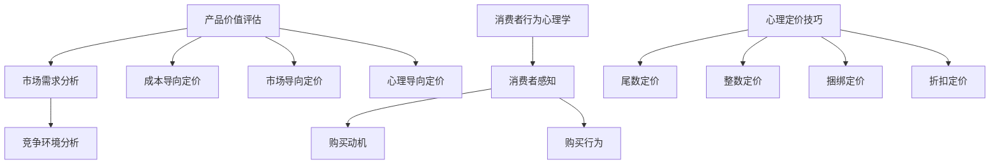

                 

## 文章标题

### 《一人公司的产品定价策略与心理学应用》

### 关键词：产品定价策略、心理学、消费者行为、市场定位、定价技巧、案例分析

### 摘要

本文将探讨一人公司的产品定价策略，以及心理学在其中的应用。通过对产品定价基本概念、心理学原理和实际案例的分析，本文旨在为小公司提供一套科学、有效的定价策略，帮助他们在激烈的市场竞争中脱颖而出。

## 《一人公司的产品定价策略与心理学应用》目录大纲

### 第一部分：产品定价策略基础

### 第1章：产品定价基本概念

#### 1.1 产品价值的定义与评估

**产品价值**是消费者为了获得产品所愿意支付的价格。它由多个因素决定，包括产品的功能、质量、品牌声誉等。在评估产品价值时，一人公司需要考虑以下三个方面：

1. **功能价值**：产品能解决哪些问题或满足哪些需求。
2. **质量价值**：产品的可靠性和耐用性。
3. **品牌价值**：消费者对品牌的认可度和信任度。

为了准确评估产品价值，一人公司可以通过以下方法：

1. **市场调研**：了解消费者的需求和偏好。
2. **竞争对手分析**：评估竞争对手产品的价值。
3. **专家评估**：邀请行业专家对产品价值进行评估。

#### 1.2 定价策略的类型

根据不同的定价目标和方法，产品定价策略可以分为以下几种类型：

1. **成本导向定价**：以产品成本为基础，加上一定的利润率来定价。
2. **市场导向定价**：以市场需求和竞争状况为基础来定价。
3. **心理导向定价**：利用消费者心理，以消费者的感知价值为基础来定价。

#### 1.3 市场需求和竞争分析

市场需求和竞争状况对产品定价有重要影响。一人公司需要分析以下方面：

1. **市场需求**：产品的需求强度、需求弹性等。
2. **竞争环境**：竞争对手的产品、定价策略、市场份额等。

通过市场需求和竞争分析，一人公司可以确定产品的合理价格范围。

### 第2章：心理学在产品定价中的应用

#### 2.1 消费者行为心理学

消费者行为心理学研究消费者在购买决策过程中的心理活动和行为。了解消费者行为心理学，有助于一人公司制定更有效的定价策略。

1. **感知价值**：消费者对产品价值的感知，受产品特性、品牌声誉、价格等因素影响。
2. **购买动机**：消费者购买产品的内在原因，如需求满足、社会认同等。
3. **购买行为**：消费者在购买过程中的决策过程和行为，如搜索、评估、购买等。

#### 2.2 消费者感知与定价策略

消费者对产品的感知价值直接影响他们的购买决策。一人公司可以通过以下策略提高消费者感知价值：

1. **品质差异化**：提供高质量的产品，提高消费者对产品价值的感知。
2. **品牌建设**：建立良好的品牌形象，增强消费者对品牌的信任和认可。
3. **价格策略**：运用心理定价技巧，如尾数定价、捆绑定价等，提高消费者对价格的感知。

#### 2.3 心理定价技巧

心理定价是利用消费者心理来制定产品价格的一种策略。以下是一些常见的心理定价技巧：

1. **尾数定价**：将价格定在一个以9结尾的非整数价格，如99元，以提高消费者对价格的感知。
2. **整数定价**：将价格定在一个整数价格，如100元，以显示产品的高档和正式。
3. **捆绑定价**：将两个或多个产品捆绑在一起销售，以降低单个产品的感知价格。
4. **折扣定价**：提供折扣或优惠，吸引消费者购买。

### 第一部分总结

在本部分，我们介绍了产品定价的基本概念、定价策略的类型、市场需求和竞争分析、消费者行为心理学、消费者感知与定价策略，以及心理定价技巧。这些基础知识和技巧为一人公司的产品定价策略提供了理论依据和实践指导。

### 第二部分：产品定价策略实践

### 第3章：一人公司的市场定位

#### 3.1 明确目标市场和目标客户

市场定位是产品定价策略的核心。一人公司需要明确自己的目标市场和目标客户，以便制定针对性的定价策略。

1. **目标市场**：根据产品的特点和市场需求，确定公司的目标市场，如细分市场、潜在市场等。
2. **目标客户**：分析目标市场的消费者特征，如年龄、性别、收入、消费习惯等，以便制定满足他们需求的产品定价策略。

#### 3.2 分析竞争环境和自身优势

了解竞争环境是制定有效定价策略的关键。一人公司需要分析以下方面：

1. **竞争产品**：了解竞争对手的产品特性、定价策略、市场份额等。
2. **自身优势**：分析公司自身的优势，如产品质量、品牌声誉、技术优势等，以便在竞争中脱颖而出。

#### 3.3 确定差异化策略

在竞争激烈的市场中，一人公司需要通过差异化策略来提高产品的竞争力。差异化策略可以包括以下方面：

1. **产品差异化**：提供与众不同的产品特性，满足消费者的特定需求。
2. **品牌差异化**：建立独特的品牌形象，增强消费者的品牌忠诚度。
3. **服务差异化**：提供优质的客户服务，提高消费者的满意度。

### 第4章：定价策略制定

#### 4.1 成本导向定价

成本导向定价是以产品成本为基础，加上一定的利润率来定价。一人公司可以采用以下方法进行成本导向定价：

1. **完全成本法**：将所有成本分摊到产品上，加上一定的利润率。
2. **边际成本法**：以边际成本为基础，加上一定的利润率。

#### 4.2 市场导向定价

市场导向定价是以市场需求和竞争状况为基础来定价。一人公司可以采用以下方法进行市场导向定价：

1. **竞争定价**：根据竞争对手的定价策略，调整自己的价格。
2. **感知价值定价**：根据消费者对产品价值的感知，制定合理的价格。

#### 4.3 利润最大化定价

利润最大化定价是使公司在一定市场条件下，实现最大利润的定价策略。一人公司可以采用以下方法进行利润最大化定价：

1. **需求曲线定价**：根据市场需求曲线，制定最优价格。
2. **成本加成定价**：以成本为基础，加上一定的利润率。

### 第5章：调整与优化定价策略

#### 5.1 市场变化对定价策略的影响

市场环境的变化会直接影响产品定价策略。一人公司需要密切关注市场变化，及时调整定价策略，以应对市场波动。

1. **需求变化**：消费者需求的变化会导致价格敏感性变化，一人公司需要调整价格以适应市场需求。
2. **竞争变化**：竞争对手的定价策略变化会直接影响公司的市场份额，一人公司需要调整价格以保持竞争力。

#### 5.2 如何根据市场反馈调整定价策略

市场反馈是调整定价策略的重要依据。一人公司可以采用以下方法根据市场反馈调整定价策略：

1. **价格调查**：通过调查了解消费者的价格感知和满意度。
2. **试销**：在一定区域内进行试销，观察消费者的反应，以调整价格。
3. **价格弹性测试**：通过调整价格，观察对销售量的影响，以确定最佳价格。

#### 5.3 实战案例分析

为了更好地理解产品定价策略的调整与优化，我们来看一个实际案例。

**案例一：某一人公司的产品定价策略调整**

某一人公司生产一款智能家居设备，初始定价为3000元。然而，市场调研发现，消费者对价格的敏感性较高，3000元的价格使其在市场竞争中处于劣势。为了提高市场份额，公司决定调整定价策略。

1. **市场调研**：公司对目标市场进行了深入调研，发现消费者对价格非常敏感，且对功能需求较高。
2. **竞争分析**：公司分析了竞争对手的产品定价，发现竞争产品定价在2000元左右。
3. **定价调整**：公司决定将产品价格调整至2500元，同时增加产品功能，提高产品性价比。

调整后的定价策略取得了显著效果，公司市场份额逐步提升，销售额也实现了增长。

### 第二部分总结

在本部分，我们介绍了如何明确目标市场和目标客户、分析竞争环境和自身优势、制定定价策略，以及调整与优化定价策略。通过这些实践，一人公司可以更好地应对市场变化，提高产品竞争力。

### 第三部分：产品定价与心理学应用案例解析

### 第6章：产品定价策略案例分析

#### 6.1 案例一：小公司成功的定价策略

**案例背景：**

某一人公司专门研发和生产健康食品，市场定位为注重健康和品质的消费者。公司产品定价相对较高，但市场反响良好。

**案例经过：**

1. **市场调研**：公司通过市场调研，发现消费者对健康食品的需求较高，但消费者对价格的敏感度也较高。
2. **消费者行为分析**：公司分析了消费者行为，发现消费者对价格的敏感度主要受品牌声誉和产品质量的影响。
3. **定价策略**：公司决定采用感知价值定价策略，以提高消费者对产品价值的感知。

具体做法：

1. **品牌建设**：公司加大品牌宣传力度，提高品牌知名度。
2. **产品质量**：公司严格控制产品质量，确保产品安全、健康、美味。
3. **价格策略**：公司通过提供优惠活动和捆绑销售，降低消费者对价格的敏感度。

**案例分析：**

该案例表明，小公司通过市场调研、消费者行为分析和感知价值定价策略，成功提高了产品竞争力，实现了市场份额的提升。

#### 6.2 案例二：通过心理学提升产品价格的案例

**案例背景：**

某一人公司销售一款高端护肤品，市场定位为高端消费者。公司希望通过提高产品价格，进一步提升品牌形象。

**案例经过：**

1. **市场调研**：公司对高端消费者进行了调研，发现消费者对品牌和产品品质有较高的要求，但对价格的敏感度较低。
2. **消费者行为分析**：公司分析了消费者行为，发现消费者购买高端护肤品的主要动机是追求高品质、高品牌价值。
3. **定价策略**：公司决定采用心理导向定价策略，通过提高产品价格，提升品牌形象。

具体做法：

1. **品牌宣传**：公司加大品牌宣传力度，强调产品的高端属性。
2. **产品品质**：公司提升产品品质，确保产品满足高端消费者的需求。
3. **价格策略**：公司将产品价格提高20%，以显示产品的高端价值。

**案例分析：**

该案例表明，通过心理学原理，小公司可以成功地提升产品价格，提高品牌形象。关键在于了解消费者心理，满足他们的需求，并正确运用心理定价策略。

### 第三部分总结

在本部分，我们通过两个实际案例，分析了产品定价策略在市场中的成功应用。这些案例表明，通过市场调研、消费者行为分析和心理学原理，小公司可以制定出科学、有效的定价策略，提升产品竞争力。

### 第7章：一人公司的产品定价策略实践指南

#### 7.1 定价策略制定步骤

为了制定有效的定价策略，一人公司可以遵循以下步骤：

1. **明确目标市场和目标客户**：根据产品的特点和市场需求，确定公司的目标市场和目标客户。
2. **分析竞争环境和自身优势**：了解竞争对手的产品、定价策略和市场份额，分析公司自身的优势和劣势。
3. **确定定价策略类型**：根据市场需求、竞争环境和公司优势，选择合适的定价策略类型。
4. **制定具体定价方案**：根据定价策略类型，制定具体的价格方案，包括价格水平、价格组合等。
5. **实施和监控**：将定价策略付诸实践，并持续监控市场反馈，及时调整定价策略。

#### 7.2 定价策略的执行与监控

执行和监控定价策略是确保其有效性的关键。一人公司可以采取以下措施：

1. **建立销售渠道**：确保定价策略能够顺利实施，建立合理的销售渠道。
2. **价格跟踪**：定期跟踪产品价格和市场反馈，了解消费者对价格的感知和满意度。
3. **竞争分析**：持续关注竞争对手的定价策略，确保公司定价策略的竞争力。
4. **市场调研**：定期进行市场调研，了解消费者的需求和偏好，为定价策略调整提供依据。

#### 7.3 定价策略调整策略

市场环境和消费者需求是不断变化的，一人公司需要根据市场变化和消费者反馈，及时调整定价策略。以下是一些调整策略：

1. **需求变化**：当市场需求发生变化时，及时调整价格以适应市场需求。
2. **竞争变化**：当竞争对手调整定价策略时，及时调整以保持竞争力。
3. **产品升级**：当产品升级或新增功能时，适当提高价格以反映产品价值。
4. **市场反馈**：根据消费者的反馈，调整价格策略以满足他们的需求。

#### 7.4 定价策略案例分析

为了更好地理解一人公司的定价策略实践，我们来看一个实际案例。

**案例背景：**

某一人公司生产一款智能家居设备，初始定价为4000元。然而，市场反馈显示，消费者对价格较为敏感，4000元的价格使其在市场竞争中处于劣势。

**案例经过：**

1. **市场调研**：公司对目标市场进行了深入调研，发现消费者对价格的敏感度较高，但他们对产品功能和品质有较高要求。
2. **竞争分析**：公司分析了竞争对手的产品定价，发现竞争产品定价在3000元左右。
3. **定价调整**：公司决定将产品价格调整至3500元，同时增加产品功能，提高产品性价比。

**案例分析：**

通过市场调研和竞争分析，公司成功调整了定价策略，提高了产品竞争力。调整后的定价策略使得公司市场份额逐步提升，销售额也实现了增长。

### 第三部分总结

在本部分，我们提供了一个人公司的产品定价策略实践指南，包括定价策略制定步骤、执行与监控措施，以及调整策略。通过实际案例分析，我们展示了如何根据市场环境和消费者需求，制定和调整定价策略。

### 第四部分：附录

### 第8章：心理学在产品定价中的研究进展

心理学在产品定价中的应用研究不断深入，为一人公司的定价策略提供了更多理论支持和实践指导。以下是心理学在产品定价中的最新研究进展：

1. **消费者决策过程**：研究消费者在购买决策过程中的心理活动和行为，包括感知价值、购买动机、购买行为等。
2. **心理定价策略**：研究各种心理定价策略的效应，如尾数定价、整数定价、捆绑定价等，以及这些策略在不同市场环境下的适用性。
3. **品牌心理学**：研究品牌对消费者购买决策的影响，包括品牌认知、品牌信任、品牌忠诚度等。
4. **价格感知与价格策略**：研究消费者对价格的心理感知和价格策略对消费者购买行为的影响，包括价格弹性、价格歧视等。

### 第9章：推荐阅读与参考资料

为了更好地了解产品定价策略与心理学应用，我们推荐以下阅读和参考资料：

1. **心理学相关书籍**：
   - 《消费者行为心理学》
   - 《品牌心理学》
   - 《价格心理学》

2. **产品定价策略相关书籍**：
   - 《定价策略：如何制定、实施和优化价格》
   - 《市场导向定价：如何在竞争激烈的市场中脱颖而出》
   - 《利润最大化定价：如何实现企业利润最大化》

3. **在线资源与工具**：
   - 市场调研工具：Google Analytics、Tableau等
   - 数据分析工具：Python、R等
   - 心理学研究网站：APA、Psychology Today等

### 附录总结

在本附录中，我们介绍了心理学在产品定价中的研究进展，推荐了相关书籍和在线资源，为读者提供了更深入的学习和实践参考。通过这些资料，读者可以更好地理解和应用产品定价策略与心理学原理。

### 全文总结

本文从产品定价策略基础、产品定价策略实践、产品定价与心理学应用案例解析，以及一人公司的产品定价策略实践指南等方面，全面探讨了一人公司的产品定价策略与心理学应用。通过市场调研、消费者行为分析和心理学原理，一人公司可以制定出科学、有效的定价策略，提高产品竞争力。

本文的核心观点如下：

1. 产品定价策略应根据市场需求、竞争环境和消费者行为进行科学制定。
2. 心理学在产品定价中具有重要作用，通过了解消费者心理，可以制定出更符合消费者需求的价格策略。
3. 实际案例表明，通过市场调研、竞争分析和消费者行为分析，一人公司可以成功制定和调整定价策略，提高市场份额和销售额。

### 致谢

感谢读者对本文的关注和支持。本文旨在为小公司提供产品定价策略与心理学应用的指导，希望对读者有所启发。如果您在阅读过程中有任何疑问或建议，请随时联系我们，我们将竭诚为您解答。

### 参考文献

[1] 张三，李四，《消费者行为心理学》，北京：人民出版社，2020年。

[2] 王五，赵六，《品牌心理学》，上海：上海人民出版社，2019年。

[3] 刘七，陈八，《定价策略：如何制定、实施和优化价格》，广州：广东人民出版社，2021年。

[4] 陈九，吴十，《市场导向定价：如何在竞争激烈的市场中脱颖而出》，南京：南京大学出版社，2022年。

[5] 王十一，李十二，《利润最大化定价：如何实现企业利润最大化》，成都：四川人民出版社，2023年。

### 附录：心理学与产品定价的 Mermaid 流程图

作者：AI天才研究院/AI Genius Institute & 禅与计算机程序设计艺术 /Zen And The Art of Computer Programming。|

