                 

### 《一人公司的品牌声誉管理与危机公关策略》

关键词：品牌声誉管理、危机公关、一人公司、策略、执行、案例、监测、预警

摘要：本文将探讨一人公司如何进行品牌声誉管理和危机公关，通过详细的案例分析、核心概念讲解和实际操作步骤，帮助一人公司提升品牌声誉，有效应对危机。

### 目录

1. 第一部分：品牌声誉管理基础
    1.1 品牌声誉概述
    1.2 品牌声誉评估与监测
    1.3 品牌声誉危机管理
    
2. 第二部分：危机公关策略与执行
    2.1 制定危机公关策略
    2.2 危机公关传播渠道与技巧
    2.3 危机公关执行与效果评估
    
3. 第三部分：一人公司品牌声誉管理与危机公关实战
    3.1 一人公司品牌声誉管理策略
    3.2 一人公司危机公关实战
    3.3 品牌声誉管理与危机公关整合
    
4. 附录
    4.1 品牌声誉管理工具与应用
    4.2 危机公关资源与参考资料

---

### 品牌声誉管理基础

品牌声誉管理是现代企业运营中至关重要的一环。对于一人公司而言，由于其规模较小，品牌声誉的影响尤为重要。良好的品牌声誉不仅可以提升公司的市场竞争力和客户信任度，还能为公司在关键时刻提供有力的支持。以下我们将详细探讨品牌声誉管理的基础内容。

#### 第1章：品牌声誉概述

品牌声誉是公司在公众中建立的形象和口碑。它不仅仅关乎公司产品的质量，还涉及公司的企业文化、社会责任和客户服务等方面。品牌声誉可以被视为公司的无形资产，它的价值在当今信息爆炸的时代尤为凸显。

**1.1 品牌声誉的定义与重要性**

品牌声誉是指消费者、合作伙伴和媒体等利益相关者对公司的整体看法和评价。它不仅反映了公司的市场表现，还包括了公司的社会责任和道德标准。品牌声誉的重要性体现在以下几个方面：

- **提升品牌知名度**：良好的品牌声誉可以帮助公司迅速提升知名度，扩大市场份额。
- **增加客户信任**：消费者往往更愿意购买那些拥有良好声誉的品牌产品。
- **提升公司价值**：品牌声誉的提升可以提升公司的整体估值和市场价值。

**1.2 品牌声誉与公司发展的关系**

品牌声誉与公司发展密切相关。一个良好的品牌声誉可以帮助公司：

- **增强客户忠诚度**：通过提供高质量的产品和服务，建立消费者对品牌的信任和忠诚。
- **吸引优秀人才**：一个有声誉的公司更能够吸引到优秀的员工。
- **获得合作伙伴支持**：优秀的品牌声誉能够帮助公司更容易获得合作伙伴的信任和支持。

**1.3 品牌声誉管理的核心要素**

品牌声誉管理涉及多个方面，其核心要素包括：

- **品牌定位**：明确品牌的核心价值和目标，确保品牌传播的一致性。
- **品牌传播**：通过多种渠道和方式向公众传递品牌信息，建立品牌形象。
- **客户关系管理**：提供优质的客户服务，建立良好的客户关系，提升客户满意度。
- **危机管理**：及时应对品牌声誉危机，防止声誉受损。

#### 第2章：品牌声誉评估与监测

品牌声誉的评估和监测是品牌声誉管理的重要组成部分。通过科学的评估和实时监测，公司可以及时了解品牌声誉的现状，发现潜在的问题，并采取相应的措施。

**2.1 品牌声誉评估方法**

品牌声誉评估通常包括以下几种方法：

- **问卷调查**：通过问卷调查了解消费者、合作伙伴等对品牌的看法和评价。
- **社交媒体监测**：利用社交媒体监测工具，分析品牌在社交媒体上的提及量和评价情况。
- **市场调研**：通过市场调研了解消费者对品牌的认知和态度。
- **专家评估**：邀请行业专家对品牌声誉进行评估。

**2.2 社交媒体监测工具与技巧**

社交媒体监测是品牌声誉评估的重要手段。以下是几种常用的社交媒体监测工具和技巧：

- **社交媒体监测工具**：如Brandwatch、Hootsuite等，可以实时监测品牌在社交媒体上的提及情况。
- **关键词分析**：通过分析关键词的使用情况，了解公众对品牌的讨论焦点。
- **情感分析**：利用自然语言处理技术，对社交媒体上的评论和讨论进行情感分析，了解公众对品牌的情感倾向。

**2.3 品牌声誉风险预警体系**

建立品牌声誉风险预警体系，可以帮助公司及时识别和应对品牌声誉风险。以下是构建品牌声誉风险预警体系的关键步骤：

- **建立风险识别机制**：通过数据分析和市场调研，识别潜在的品牌声誉风险。
- **建立风险评估模型**：对识别出的风险进行评估，确定风险的严重程度和影响范围。
- **建立风险应对机制**：制定相应的应对策略和预案，确保在风险发生时能够迅速采取行动。

#### 第3章：品牌声誉危机管理

品牌声誉危机是指可能对品牌声誉造成严重损害的事件或情况。有效的品牌声誉危机管理是维护品牌声誉的重要手段。以下我们将探讨品牌声誉危机管理的方法和步骤。

**3.1 危机公关的定义与类型**

危机公关是指公司在面对突发事件或危机时，采取的一系列应对措施，以维护品牌声誉和利益。危机公关可以分为以下几种类型：

- **自然灾害类危机**：如地震、洪水等自然灾害引起的危机。
- **产品安全类危机**：如产品质量问题、产品召回等。
- **企业内部管理类危机**：如内部腐败、高管丑闻等。
- **社会舆论类危机**：如网络谣言、负面报道等。

**3.2 危机公关的核心步骤**

有效的危机公关需要遵循以下核心步骤：

- **危机识别**：及时发现潜在的危机信号，识别危机的类型和影响范围。
- **危机评估**：对危机进行评估，确定危机的严重程度和可能带来的影响。
- **危机应对**：根据危机的类型和严重程度，制定相应的应对策略和措施。
- **危机传播**：通过媒体和社交媒体等渠道，向公众传递危机应对的信息和态度。
- **危机恢复**：在危机得到控制后，采取措施恢复品牌声誉，重建消费者信任。

**3.3 常见品牌危机案例分析**

以下是一些常见的品牌危机案例及其应对措施：

- **产品安全类危机**：如某知名奶粉品牌因质量问题引发的危机。该品牌迅速召回问题产品，发布道歉声明，并对消费者进行赔偿，最终成功恢复了品牌声誉。
- **企业内部管理类危机**：如某知名餐饮品牌因高管丑闻引发的危机。该品牌迅速采取措施，解雇涉事高管，发布公开道歉，并加强内部管理，最终恢复了消费者信任。
- **社会舆论类危机**：如某知名电商平台因消费者投诉引发的危机。该平台积极回应消费者诉求，发布整改措施，并加强与媒体的合作，最终成功化解了危机。

通过以上案例分析，我们可以看到，有效的危机公关需要迅速反应、果断决策和积极行动。只有通过科学的危机公关策略和有效的执行，公司才能在危机中保持品牌声誉，甚至实现品牌的提升。

### 第二部分：危机公关策略与执行

在品牌声誉管理中，危机公关策略与执行至关重要。对于一人公司而言，由于其资源和人力相对有限，如何在关键时刻采取有效的危机公关措施，成为品牌声誉管理的关键。以下我们将详细探讨危机公关策略的制定、传播渠道的利用以及执行与效果评估的方法。

#### 第4章：制定危机公关策略

制定有效的危机公关策略是应对品牌声誉危机的关键。一个科学合理的危机公关策略需要明确目标、原则和预案，以确保在危机发生时能够迅速采取行动。

**4.1 危机公关目标与原则**

危机公关的目标主要包括以下几个方面：

- **保护品牌声誉**：在危机中维护品牌的形象和信誉，防止声誉受损。
- **恢复消费者信任**：通过积极的沟通和行动，重建消费者对品牌的信任。
- **减少损失**：尽量减少危机对公司运营和财务的负面影响。

危机公关的基本原则包括：

- **迅速响应**：在危机发生后，尽快采取行动，避免问题扩大。
- **真实透明**：公开透明地传递危机信息和应对措施，避免误导和隐瞒。
- **积极沟通**：与媒体、消费者、合作伙伴等各方保持良好的沟通，传达危机处理的态度和进展。
- **专业处理**：聘请专业的危机公关团队或顾问，提供专业的危机处理建议。

**4.2 制定危机公关预案**

为了确保在危机发生时能够迅速、有效地应对，一人公司需要制定详细的危机公关预案。危机公关预案应包括以下内容：

- **危机识别和评估机制**：建立危机识别和评估机制，及时发现潜在的危机信号，评估危机的影响范围和严重程度。
- **危机应对流程**：明确危机应对的流程和步骤，确保在危机发生时能够迅速采取行动。
- **危机传播策略**：制定危机传播策略，包括对外发布信息的方式、渠道和内容。
- **危机恢复计划**：在危机得到控制后，制定恢复品牌声誉的计划和措施。

**4.3 危机公关信息发布策略**

危机公关的信息发布策略至关重要，它决定了信息传播的效率和效果。以下是几个关键点：

- **统一信息发布口径**：确保内部信息的一致性和统一性，避免信息混乱和误导。
- **选择适当的发布渠道**：根据危机的类型和影响范围，选择适当的发布渠道，如媒体发布会、社交媒体、官网公告等。
- **控制信息传播速度**：在信息发布时，要注意控制传播速度，避免信息过载和误解。
- **及时更新信息**：在危机处理过程中，要及时更新信息，保持公众对危机处理的知情权。

#### 第5章：危机公关传播渠道与技巧

危机公关传播渠道的利用和技巧对于危机处理的效果至关重要。以下是几种常见的危机公关传播渠道和技巧：

**5.1 传统媒体公关**

传统媒体公关包括报纸、电视、电台等渠道。在危机公关中，传统媒体仍然发挥着重要作用。以下是几个关键点：

- **选择合适的媒体**：根据危机的类型和影响范围，选择合适的传统媒体进行公关。
- **准备新闻稿件**：准备新闻稿件，明确危机的处理情况和公司态度，确保信息传递的一致性和准确性。
- **与媒体建立良好关系**：与媒体保持良好的关系，争取在危机处理中获得媒体的积极报道和支持。

**5.2 社交媒体公关**

社交媒体公关在危机公关中越来越重要。以下是几个关键点：

- **及时响应**：在社交媒体上及时响应消费者和媒体的问题和质疑，展示公司积极应对危机的态度。
- **情感引导**：在社交媒体上运用情感引导技巧，通过正面的情感表达和互动，缓解危机带来的负面影响。
- **监控社交媒体动态**：实时监控社交媒体上的危机讨论，及时了解公众对危机的看法和情绪，采取相应的措施。

**5.3 口碑管理策略**

口碑管理是危机公关的重要组成部分。以下是几个关键点：

- **建立口碑监测机制**：通过口碑监测工具，实时了解消费者的口碑和反馈，及时发现潜在的问题。
- **积极回应负面口碑**：对于负面口碑，要及时回应，表达歉意并采取改进措施，争取消费者的理解和信任。
- **鼓励正面口碑**：通过提供优质的产品和服务，鼓励消费者产生正面口碑，提升品牌形象。

#### 第6章：危机公关执行与效果评估

危机公关的执行和效果评估是确保危机公关策略有效实施的重要环节。以下是危机公关执行和效果评估的方法和步骤：

**6.1 危机公关执行步骤**

危机公关执行步骤主要包括：

- **危机应对会议**：召开危机应对会议，明确危机应对的具体措施和责任分工。
- **危机响应**：根据危机公关预案，迅速采取行动，进行危机响应。
- **信息发布**：按照危机公关信息发布策略，及时发布危机应对信息。
- **媒体沟通**：与媒体进行沟通，传达危机应对的情况和态度。
- **消费者沟通**：与消费者进行沟通，回应消费者的疑问和诉求。

**6.2 危机公关效果评估方法**

危机公关效果评估方法主要包括：

- **公众满意度调查**：通过问卷调查、电话访谈等方式，了解公众对危机应对的满意度。
- **社交媒体分析**：通过分析社交媒体上的讨论和评论，了解公众对危机应对的态度和情绪。
- **媒体报道分析**：分析媒体的报道和评论，了解媒体对危机应对的反馈。
- **市场份额分析**：通过分析市场份额的变化，了解危机应对对公司运营和财务的影响。

**6.3 危机公关案例分享与启示**

以下是一些危机公关案例及其启示：

- **某知名食品品牌**：在产品被曝出质量问题后，该品牌迅速采取行动，召回问题产品，发布公开道歉，并加强产品质量管理。最终，该品牌成功恢复了消费者信任。
- **某知名互联网公司**：在面临用户隐私泄露危机时，该公司立即采取紧急措施，发布道歉声明，并与用户沟通，告知用户隐私泄露的情况和解决方案。最终，该品牌成功化解了危机。

通过以上案例，我们可以看到，有效的危机公关需要迅速反应、果断决策和积极行动。只有通过科学的危机公关策略和有效的执行，公司才能在危机中保持品牌声誉，甚至实现品牌的提升。

### 第三部分：一人公司品牌声誉管理与危机公关实战

对于一人公司来说，品牌声誉管理和危机公关的实战应用尤为重要。由于资源有限，如何通过高效的策略和执行来提升品牌声誉和应对危机，成为关键。以下将详细探讨一人公司品牌声誉管理策略、危机公关实战以及品牌声誉管理与危机公关的整合。

#### 第7章：一人公司品牌声誉管理策略

一人公司的品牌声誉管理策略需要充分考虑其独特的运营环境和资源限制。以下是一人公司品牌声誉管理策略的几个关键点：

**7.1 一人公司品牌声誉管理特点**

- **灵活性和敏捷性**：一人公司能够快速调整品牌策略，适应市场变化。
- **个人品牌**：由于一人公司通常由创始人或关键人物运营，个人品牌与公司品牌紧密相关。
- **资源限制**：一人公司在预算、人力和资源上有限，需要高效利用资源。

**7.2 一人公司品牌声誉管理实践**

- **品牌定位**：清晰定义品牌价值主张，确保品牌传播的一致性。
- **社交媒体营销**：利用社交媒体平台建立品牌社区，与消费者建立互动关系。
- **内容营销**：通过高质量的内容吸引目标受众，提升品牌影响力。
- **客户关系管理**：提供优质的客户服务，建立长期的客户关系。

**7.3 一人公司品牌声誉管理案例分析**

以下是一个一人公司品牌声誉管理成功案例：

**案例**：一位独立软件开发者通过在GitHub上发布高质量的代码和文档，吸引了大量的开发者和用户。他的个人品牌得到了提升，公司品牌也随之受到认可。

**启示**：通过专业的内容和高质量的服务，一人公司可以有效提升品牌声誉，吸引更多的关注和认可。

#### 第8章：一人公司危机公关实战

对于一人公司，危机公关的实战应用需要快速反应和高效执行。以下是一人公司危机公关实战的几个关键步骤：

**8.1 一人公司危机公关准备工作**

- **建立危机应对小组**：明确小组成员的角色和责任，确保在危机发生时能够迅速响应。
- **制定危机公关预案**：根据可能的危机类型和影响范围，制定详细的预案。
- **培训员工**：对员工进行危机公关培训，确保他们了解危机应对的基本流程和原则。

**8.2 一人公司危机公关实战案例**

以下是一个一人公司危机公关实战案例：

**案例**：一位独立开发者发现其软件存在安全漏洞，可能影响用户隐私。他迅速发布安全补丁，并通过社交媒体向用户解释漏洞的情况和解决方案。

**启示**：快速、透明和积极的危机响应可以有效减轻危机带来的负面影响。

**8.3 一人公司危机公关经验总结**

- **及时响应**：在危机发生时，及时采取行动，避免问题扩大。
- **透明沟通**：公开、透明地与公众沟通，避免误导和隐瞒。
- **专业处理**：在必要时，寻求专业的危机公关顾问帮助，提供专业的危机处理建议。

#### 第9章：品牌声誉管理与危机公关整合

品牌声誉管理与危机公关的整合是确保品牌长期健康发展的重要策略。以下是一人公司如何整合品牌声誉管理与危机公关的几个关键点：

**9.1 品牌声誉管理与危机公关整合思路**

- **系统化**：将品牌声誉管理和危机公关纳入公司的整体运营战略，形成系统化的管理流程。
- **协调性**：确保品牌传播和危机应对的一致性，避免冲突和误解。
- **持续改进**：通过持续的监测和评估，不断优化品牌声誉管理和危机公关策略。

**9.2 品牌声誉管理与危机公关整合策略**

- **统一沟通平台**：建立统一的沟通平台，确保品牌传播和危机应对的信息一致性和时效性。
- **资源整合**：将品牌声誉管理和危机公关的资源进行整合，提高资源利用效率。
- **培训与宣传**：定期对员工进行品牌声誉管理和危机公关培训，提高员工的意识和能力。

**9.3 品牌声誉管理与危机公关整合案例**

以下是一个品牌声誉管理与危机公关整合成功案例：

**案例**：一家一人公司通过整合品牌声誉管理和危机公关，成功应对了一次市场谣言引发的危机。公司迅速发布澄清声明，并通过社交媒体进行舆论引导，最终成功恢复了品牌声誉。

**启示**：通过有效的整合策略，一人公司可以在危机中保持品牌声誉，甚至在危机后实现品牌的提升。

### 附录

#### 附录A：品牌声誉管理工具与应用

**A.1 品牌声誉管理工具介绍**

- **Brandwatch**：一款强大的社交媒体监测工具，可以实时监测品牌在社交媒体上的提及情况和情感倾向。
- **Google Analytics**：一款用于分析网站流量和用户行为的工具，可以帮助评估品牌在线上的表现。
- **Hootsuite**：一款社交媒体管理工具，可以用于发布和管理社交媒体内容。

**A.2 品牌声誉管理工具应用案例**

- **案例1**：某一人公司利用Brandwatch监测社交媒体上的品牌提及，及时发现负面评论并迅速采取行动，成功避免了声誉受损。

**A.3 品牌声誉管理工具推荐**

- **推荐1**：Klout，用于评估个人品牌影响力。
- **推荐2**：Canva，用于设计品牌宣传材料。

#### 附录B：危机公关资源与参考资料

**B.1 危机公关书籍推荐**

- **《危机公关管理》**：提供了详细的危机公关策略和案例分析。
- **《危机管理：应对突发事件的策略与技巧》**：介绍了危机管理的核心原则和实际操作方法。

**B.2 危机公关网站推荐**

- **CRMCritical**：提供危机公关的最新资讯和案例分析。
- **Crisis Communications**：一个专注于危机公关的在线资源库。

**B.3 危机公关工具与平台推荐**

- **BloomReach**：一款用于品牌监测和分析的工具。
- **Cision**：一个提供媒体关系管理和危机公关服务的平台。

---

### 结论

本文详细探讨了品牌声誉管理和危机公关在一人公司中的应用。通过科学的策略和实战案例，一人公司可以提升品牌声誉，有效应对危机。未来的研究和实践需要进一步探索如何利用新兴技术，如人工智能和大数据分析，来优化品牌声誉管理和危机公关策略。

### 作者信息

作者：AI天才研究院/AI Genius Institute & 禅与计算机程序设计艺术 /Zen And The Art of Computer Programming

---

### 核心概念与联系

为了更好地理解品牌声誉管理和危机公关，我们需要明确几个核心概念及其相互关系。以下是一个使用Mermaid绘制的流程图，展示这些概念及其关联：

```mermaid
graph TD
    A[品牌声誉] --> B[客户信任]
    A --> C[企业文化]
    A --> D[市场表现]
    B --> E[客户忠诚度]
    B --> F[品牌价值]
    C --> G[社会责任]
    C --> H[道德标准]
    D --> I[市场份额]
    D --> J[竞争实力]
    E --> K[重复购买]
    F --> L[品牌溢价]
    G --> M[公众认可]
    H --> N[社会影响]
    I --> O[盈利能力]
    J --> P[行业地位]
    K --> Q[口碑传播]
    L --> R[品牌影响力]
    M --> S[社会责任感]
    N --> T[公信力]
    O --> U[企业成长]
    P --> V[品牌认知]
    Q --> W[市场占有率]
    R --> X[品牌形象]
    S --> Y[公众形象]
    T --> Z[品牌声誉]
```



#### 解析：

- **品牌声誉（A）** 是公司整体形象的表现，包括客户信任（B）、企业文化（C）、市场表现（D）等方面。
- **客户信任（B）** 是品牌声誉的核心，直接影响客户忠诚度（E）和品牌价值（F）。
- **企业文化（C）** 包括社会责任（G）和道德标准（H），这些因素影响公司的公众认可（M）和社会影响（N）。
- **市场表现（D）** 关乎市场份额（I）和竞争实力（J），这些因素进一步影响品牌认知（V）和市场占有率（W）。
- **客户忠诚度（E）** 和品牌价值（F）共同塑造品牌溢价（L）和品牌影响力（R）。
- **社会责任（G）** 和道德标准（H）有助于提升公众形象（Y）和公信力（T）。
- **盈利能力（O）** 和行业地位（P）是品牌声誉管理和危机公关效果的重要衡量标准。
- **口碑传播（Q）** 和品牌形象（X）是品牌声誉管理和危机公关的重要目标。

这个Mermaid流程图清晰地展示了品牌声誉管理和危机公关中的核心概念及其相互关系，有助于读者更好地理解和管理品牌声誉。

### 核心算法原理讲解

在品牌声誉管理和危机公关中，算法的应用至关重要。以下将详细介绍一种用于品牌声誉评估的核心算法原理，并使用伪代码进行详细讲解。

#### 算法原理：基于情感分析的声誉评估模型

该算法基于情感分析技术，通过分析社交媒体上的用户评论和讨论，评估品牌声誉。核心步骤包括：

1. **数据收集**：从社交媒体平台收集关于品牌的评论和讨论。
2. **文本预处理**：清洗和标准化文本数据，去除噪声和停用词。
3. **情感分析**：对预处理后的文本进行情感分析，判断其情感倾向（正面、负面、中性）。
4. **权重计算**：根据评论的重要性和影响力，为每个评论分配权重。
5. **综合评分**：将情感分析和权重计算结合，生成品牌的综合声誉评分。

#### 伪代码

```plaintext
function brand_reputation_assessment/comments_data, importance_scores:
    # 步骤1：数据收集
    collected_data = collect_social_media_comments(brand_name)

    # 步骤2：文本预处理
    preprocessed_data = preprocess_comments(collected_data)

    # 步骤3：情感分析
    sentiment_scores = analyze_sentiments(preprocessed_data)

    # 步骤4：权重计算
    weighted_scores = calculate_weights(sentiment_scores, importance_scores)

    # 步骤5：综合评分
    reputation_score = compute_reputation_score(weighted_scores)

    return reputation_score

function collect_social_media_comments/brand_name:
    # 通过API获取社交媒体平台上的评论数据
    comments = []
    for platform in ["Twitter", "Facebook", "Instagram"]:
        platform_comments = fetch_comments_from_platform(brand_name, platform)
        comments.extend(platform_comments)
    return comments

function preprocess_comments/comments_data:
    # 清洗和标准化文本数据
    cleaned_data = []
    for comment in comments_data:
        cleaned_comment = remove_noise(comment)
        cleaned_comment = normalize_text(cleaned_comment)
        cleaned_data.append(cleaned_comment)
    return cleaned_data

function analyze_sentiments/preprocessed_data:
    # 对预处理后的文本进行情感分析
    sentiment_scores = {}
    for comment in preprocessed_data:
        sentiment = determine_sentiment(comment)
        sentiment_scores[comment] = sentiment
    return sentiment_scores

function calculate_weights/sentiment_scores, importance_scores:
    # 根据评论的重要性和影响力，为每个评论分配权重
    weighted_scores = {}
    for comment, sentiment in sentiment_scores.items():
        weight = get_weight(sentiment, importance_scores)
        weighted_scores[comment] = sentiment * weight
    return weighted_scores

function compute_reputation_score/weighted_scores:
    # 计算品牌的综合声誉评分
    reputation_score = sum(weighted_scores.values())
    return reputation_score
```

#### 解析：

1. **数据收集**：通过API从社交媒体平台获取关于品牌的评论数据。
2. **文本预处理**：清洗和标准化文本数据，去除噪声和停用词，确保数据质量。
3. **情感分析**：使用自然语言处理技术对预处理后的文本进行情感分析，判断情感倾向。
4. **权重计算**：为每个评论分配权重，权重取决于情感倾向和评论的重要性。
5. **综合评分**：将情感分析和权重计算结合，生成品牌的综合声誉评分。

这个核心算法原理讲解帮助我们理解了如何使用情感分析技术评估品牌声誉。通过伪代码的详细阐述，读者可以更好地掌握算法的实现方法。

### 数学模型和公式

在品牌声誉管理和危机公关中，数学模型和公式有助于量化分析品牌声誉的变化和危机的影响。以下将介绍两个关键数学模型：品牌声誉指数（BRI）和危机影响评估模型（CIM）。

#### 品牌声誉指数（BRI）

品牌声誉指数（BRI）用于量化品牌声誉的总体水平。公式如下：

$$
BRI = \frac{1}{N} \sum_{i=1}^{N} \frac{WS_i \cdot SS_i}{MS}
$$

其中：
- \( N \)：评论总数
- \( WS_i \)：评论 \( i \) 的权重
- \( SS_i \)：评论 \( i \) 的情感得分（正面为1，负面为-1，中性为0）
- \( MS \)：最大情感得分（通常为2，取决于评论的情感极性）

**示例**：假设有10条评论，其中5条正面，3条中性，2条负面，权重分别为2、1、1、2、1。则BRI计算如下：

$$
BRI = \frac{1}{10} \left( \frac{2 \cdot 1}{2} + \frac{1 \cdot 0}{2} + \frac{1 \cdot (-1)}{2} + \frac{2 \cdot 1}{2} + \frac{1 \cdot 0}{2} \right) = \frac{1}{10} (1 + 0 - 0.5 + 1 + 0) = 0.6
$$

#### 危机影响评估模型（CIM）

危机影响评估模型（CIM）用于评估危机对公司声誉的潜在影响。公式如下：

$$
CIM = \frac{1}{N} \sum_{i=1}^{N} \frac{CWS_i \cdot CS_i}{MS'}
$$

其中：
- \( N \)：评论总数
- \( CWS_i \)：评论 \( i \) 的危机权重
- \( CS_i \)：评论 \( i \) 的情感得分（危机影响分为正面、负面、中性，分别对应1、-1、0）
- \( MS' \)：最大危机情感得分（通常为2）

**示例**：假设有10条评论，其中5条正面，3条中性，2条负面，权重分别为2、1、1。则CIM计算如下：

$$
CIM = \frac{1}{10} \left( \frac{2 \cdot 1}{2} + \frac{1 \cdot 0}{2} + \frac{1 \cdot (-1)}{2} \right) = \frac{1}{10} (1 + 0 - 0.5) = 0.1
$$

#### 解析：

- **品牌声誉指数（BRI）**：通过情感得分和权重计算，反映品牌声誉的整体水平。
- **危机影响评估模型（CIM）**：通过危机权重和情感得分，评估危机对公司声誉的潜在影响。

这些数学模型和公式为品牌声誉管理和危机公关提供了量化的分析工具，帮助公司更好地理解和管理品牌声誉。

### 项目实战：代码实际案例与详细解读

在本文的最后一部分，我们将通过一个实际的代码案例，详细展示如何进行品牌声誉管理和危机公关的相关操作。以下是项目的开发环境搭建、源代码实现及代码解读与分析。

#### 开发环境搭建

为了实现品牌声誉管理和危机公关，我们将使用Python编程语言，并结合NLP（自然语言处理）和数据分析库，如NLTK、TextBlob和pandas。以下是开发环境的搭建步骤：

1. **安装Python**：确保安装了Python 3.x版本。
2. **安装NLP库**：在命令行中运行以下命令：
   ```bash
   pip install nltk textblob pandas
   ```
3. **安装社交媒体监测库**：根据需要安装特定的社交媒体监测库，如Tweepy（用于Twitter监测）：
   ```bash
   pip install tweepy
   ```

#### 源代码实现

以下是品牌声誉管理和危机公关的核心代码实现，分为数据收集、文本预处理、情感分析和结果展示几个部分。

```python
import tweepy
import nltk
from textblob import TextBlob
import pandas as pd

# 配置Twitter API密钥
consumer_key = 'YOUR_CONSUMER_KEY'
consumer_secret = 'YOUR_CONSUMER_SECRET'
access_token = 'YOUR_ACCESS_TOKEN'
access_token_secret = 'YOUR_ACCESS_TOKEN_SECRET'

# 初始化Tweepy API
auth = tweepy.OAuthHandler(consumer_key, consumer_secret)
auth.set_access_token(access_token, access_token_secret)
api = tweepy.API(auth)

# 数据收集
def collect_social_media_comments(brand_name, limit=100):
    comments = []
    for tweet in tweepy.Cursor(api.search, q=brand_name, lang='en', tweet_mode='extended').items(limit):
        comments.append(tweet.full_text)
    return comments

# 文本预处理
def preprocess_comments(comments):
    preprocessed_comments = []
    for comment in comments:
        # 去除URL、用户提及、HTML标签等
        text = nltk.download('stopwords')
        stop_words = nltk.corpus.stopwords.words('english')
        text = " ".join([word for word in nltk.word_tokenize(comment) if word not in stop_words and word.isalnum()])
        preprocessed_comments.append(text)
    return preprocessed_comments

# 情感分析
def analyze_sentiments(preprocessed_comments):
    sentiment_scores = []
    for comment in preprocessed_comments:
        blob = TextBlob(comment)
        sentiment_scores.append(blob.sentiment.polarity)
    return sentiment_scores

# 结果展示
def display_results(sentiment_scores):
    df = pd.DataFrame({'Sentiment': sentiment_scores})
    df['Sentiment'] = df['Sentiment'].apply(lambda x: 'Positive' if x > 0 else 'Negative' if x < 0 else 'Neutral')
    print(df)

# 主程序
if __name__ == '__main__':
    brand_name = 'Nike'
    comments = collect_social_media_comments(brand_name)
    preprocessed_comments = preprocess_comments(comments)
    sentiment_scores = analyze_sentiments(preprocessed_comments)
    display_results(sentiment_scores)
```

#### 代码解读与分析

1. **数据收集**：使用Tweepy库从Twitter上收集关于Nike品牌的评论。通过`collect_social_media_comments`函数，设置查询关键字和语言，获取指定数量的评论。

2. **文本预处理**：使用NLTK和TextBlob库对评论进行预处理。主要步骤包括去除URL、用户提及、HTML标签和停用词，确保文本数据的质量。

3. **情感分析**：利用TextBlob库对预处理后的文本进行情感分析，获取每条评论的情感得分（极性值）。情感得分为-1表示负面，0表示中性，1表示正面。

4. **结果展示**：使用pandas库将情感得分转化为表格形式，并打印输出。通过`display_results`函数，可以清晰地看到每条评论的情感倾向。

这个实际项目案例展示了如何使用Python进行品牌声誉管理和危机公关的核心步骤，从数据收集、文本预处理到情感分析和结果展示。通过代码实现，读者可以更好地理解品牌声誉管理和危机公关的操作流程。

### 总结

本文详细探讨了品牌声誉管理和危机公关在一人公司中的应用。首先，我们介绍了品牌声誉管理的基础概念，包括品牌声誉的定义、评估与监测方法，以及品牌声誉危机管理的核心步骤。接着，我们深入讨论了危机公关的策略与执行，包括制定危机公关策略、传播渠道与技巧、危机公关执行与效果评估。随后，我们针对一人公司的特点，探讨了其品牌声誉管理策略和危机公关实战。最后，我们通过实际代码案例展示了品牌声誉管理和危机公关的实现过程。

本文的关键点包括：

- 品牌声誉是公司的无形资产，对公司的长期发展至关重要。
- 危机公关需要快速反应、真实透明和积极沟通。
- 一人公司通过灵活的策略和高效的执行，可以提升品牌声誉和应对危机。
- 数学模型和算法的应用有助于量化分析品牌声誉和危机影响。

未来的研究和实践可以进一步探索如何利用人工智能和大数据技术优化品牌声誉管理和危机公关策略。此外，加强对社交媒体和新兴传播渠道的监测和分析，也将是提升品牌声誉管理效果的重要方向。通过不断学习和改进，一人公司可以更好地应对市场变化，实现品牌的长远发展。

