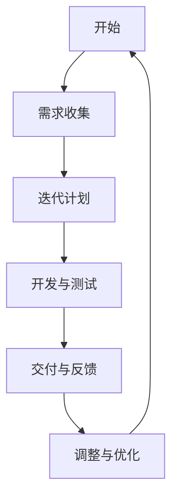
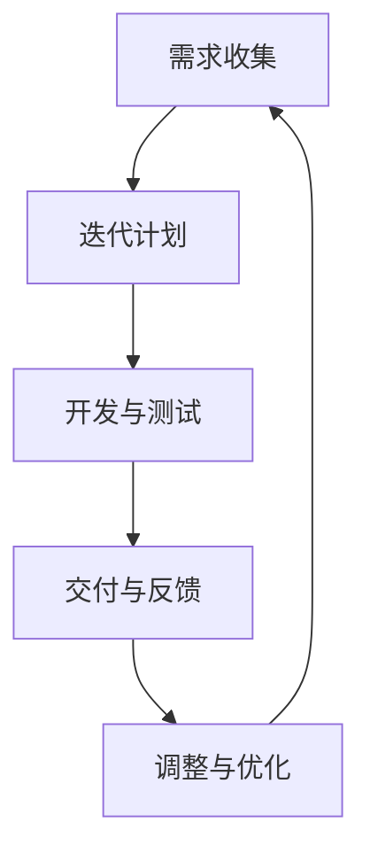
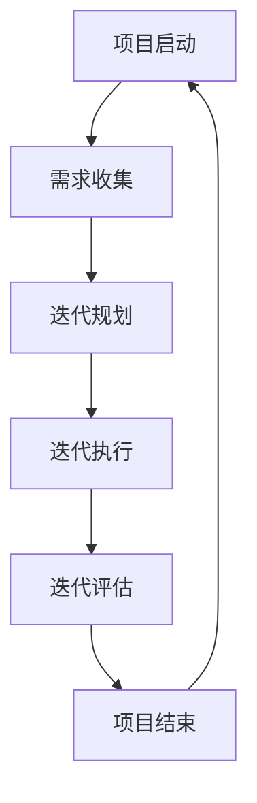
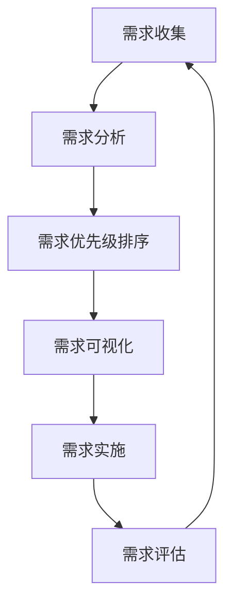
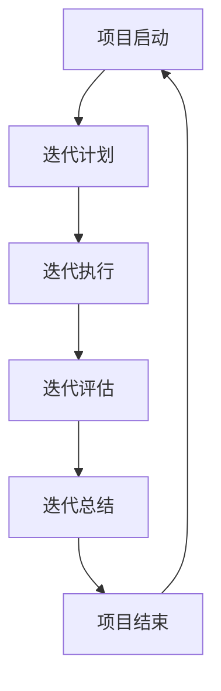
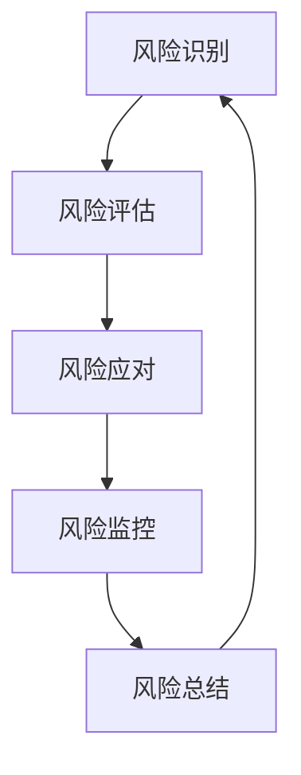

                 

### 《一人公司的敏捷开发流程与项目管理》

> **关键词：** 敏捷开发、一人公司、项目管理、Scrum、Kanban、XP

> **摘要：** 本文旨在探讨一人公司如何在敏捷开发环境下高效进行项目管理。通过详细解析敏捷开发的概念、流程、工具以及项目管理的方法和挑战，本文为一人公司的敏捷实践提供了全面而实用的指导。

---

### 《一人公司的敏捷开发流程与项目管理》目录大纲

#### [第一部分：敏捷开发基础](#第一部分-敏捷开发基础)

##### 第1章：敏捷开发概述  
- **1.1 敏捷开发的概念与原则**  
- **1.2 敏捷开发的起源与发展**  
- **1.3 敏捷开发的优点与适用范围**

##### 第2章：敏捷团队的组织与管理  
- **2.1 敏捷团队的构建**  
- **2.2 敏捷团队的角色**  
- **2.3 敏捷团队的管理与协作**

##### 第3章：敏捷开发流程  
- **3.1 敏捷开发的生命周期**  
- **3.2 敏捷开发的方法论**  
- **3.3 敏捷开发的关键活动**

##### 第4章：敏捷工具与技术  
- **4.1 敏捷工具的选择与使用**  
- **4.2 敏捷测试方法**  
- **4.3 敏捷开发中的自动化**

#### [第二部分：敏捷项目管理](#第二部分-敏捷项目管理)

##### 第5章：敏捷项目管理概述  
- **5.1 敏捷项目管理的特点**  
- **5.2 敏捷项目管理的方法**  
- **5.3 敏捷项目管理的挑战与应对**

##### 第6章：敏捷需求管理  
- **6.1 敏捷需求管理的原则**  
- **6.2 敏捷需求管理的方法**  
- **6.3 敏捷需求管理工具**

##### 第7章：敏捷进度管理  
- **7.1 敏捷进度管理的原则**  
- **7.2 敏捷进度管理的方法**  
- **7.3 敏捷进度管理工具**

##### 第8章：敏捷风险管理  
- **8.1 敏捷风险管理的原则**  
- **8.2 敏捷风险管理的方法**  
- **8.3 敏捷风险管理工具**

#### [第三部分：敏捷实践与优化](#第三部分-敏捷实践与优化)

##### 第9章：敏捷实践案例  
- **9.1 一人公司的敏捷实践**  
- **9.2 敏捷实践中的挑战与解决方案**  
- **9.3 敏捷实践中的创新与优化**

##### 第10章：敏捷项目管理优化  
- **10.1 敏捷项目管理的优化方法**  
- **10.2 敏捷项目管理的改进实践**  
- **10.3 敏捷项目管理的持续改进**

##### 第11章：敏捷文化构建  
- **11.1 敏捷文化的内涵与特征**  
- **11.2 敏捷文化的构建与实践**  
- **11.3 敏捷文化的挑战与应对**

#### [附录](#附录)

##### 附录 A：敏捷开发相关工具  
- **A.1 敏捷开发工具的选择与使用**  
- **A.2 敏捷开发工具的实际应用案例**

##### 附录 B：敏捷开发资源  
- **B.1 敏捷开发书籍推荐**  
- **B.2 敏捷开发在线课程推荐**  
- **B.3 敏捷开发社区与论坛推荐**

---

### 第一部分：敏捷开发基础

#### 第1章：敏捷开发概述

##### 1.1 敏捷开发的概念与原则

**概念讲解：**  
敏捷开发是一种应对快速变化的需求的软件开发能力。它强调迭代、渐进的方法，通过频繁地交付可工作的软件来快速响应变化。敏捷开发的核心是快速适应变化，注重客户满意度和团队协作。

**敏捷原则：**  
- **个体和互动重于过程和工具：** 人与人之间的沟通和协作比单一的流程或工具更重要。
- **可工作的软件重于详尽的文档：** 实际运行的软件比详细的文档更有价值。
- **客户合作重于合同谈判：** 与客户的紧密合作比合同谈判更能确保项目成功。
- **响应变化重于遵循计划：** 面对变化时，灵活调整比坚持原计划更重要。
- **持续交付工作软件：** 持续交付可工作的软件，以保持项目的持续进展。
- **不断关注技术卓越和良好设计：** 技术卓越和良好的设计是保证软件长期稳定运行的关键。
- **简化：** 简化流程，避免过度复杂化。
- **团队自我组织：** 团队成员应该自我管理，根据项目需求调整工作内容。
- **定期反思如何才能更有效：** 定期回顾和评估项目过程，持续改进。

**流程图：**  
我们使用Mermaid来绘制敏捷开发的流程图：



##### 1.2 敏捷开发的起源与发展

**起源：**  
敏捷开发起源于20世纪90年代末期，是作为对传统软件开发方法的一种回应而诞生的。早期的敏捷方法包括Crystal、X-Ray、FDD等，后来逐渐演化出Scrum、Kanban、XP等成熟的方法。

**发展：**  
随着互联网和移动设备的普及，敏捷开发方法逐渐受到全球软件行业的青睐。各种敏捷方法和工具层出不穷，如Jira、Trello、Confluence等。敏捷开发不仅在IT行业得到了广泛应用，还在其他行业（如制造业、金融业等）取得了成功。

**联系：**  
敏捷开发方法强调快速响应变化、持续交付工作软件，与传统开发方法相比，更加灵活和高效。敏捷开发的核心在于迭代和增量，每个迭代周期都进行需求收集、规划、开发、测试和交付，从而确保项目能够快速适应市场需求。

##### 1.3 敏捷开发的优点与适用范围

**优点：**  
- **快速响应变化：** 敏捷开发方法能够快速适应市场需求的变化，减少项目风险。
- **持续交付价值：** 通过频繁地交付可工作的软件，确保项目始终为客户创造价值。
- **高效团队协作：** 敏捷方法强调团队合作和沟通，提高团队执行力。
- **质量保证：** 通过持续测试和代码审查，确保软件质量。
- **灵活性：** 敏捷开发方法允许项目在执行过程中灵活调整，以适应不断变化的需求。

**适用范围：**  
敏捷开发适用于各种类型的软件项目，特别是那些需求变化频繁、项目规模较小的项目。以下是一些常见的适用场景：

- **互联网应用开发：** 互联网应用通常需要快速迭代和更新，敏捷开发方法能够帮助团队快速适应市场变化。
- **移动应用开发：** 移动应用开发需要频繁更新和优化，敏捷开发方法能够提高开发效率和软件质量。
- **小型项目：** 对于小型项目，敏捷开发方法能够快速启动和交付，减少项目风险。

#### 第2章：敏捷团队的组织与管理

##### 2.1 敏捷团队的构建

**团队构成：**  
敏捷团队通常由以下角色组成：

- **产品负责人（Product Owner）：** 负责产品愿景和需求的定义，与利益相关者沟通，确保团队开发的产品符合客户需求。
- **开发人员（Developers）：** 负责实现产品需求，编写代码，参与测试，确保代码质量。
- **测试人员（Testers）：** 负责测试软件，确保软件质量符合标准。
- **设计师（Designers）：** 负责设计软件界面和用户体验，确保软件美观易用。
- **Scrum Master：** 负责确保敏捷实践得到遵循，帮助团队解决障碍，促进团队协作。

**构建原则：**  
- **小而精：** 团队规模较小，有助于提高团队协作效率和决策速度。
- **多技能：** 团队成员应具备多种技能，减少依赖和沟通成本。
- **自组织：** 团队成员自主管理，根据项目需求调整工作内容。

##### 2.2 敏捷团队的角色

**产品负责人：**  
产品负责人是敏捷团队的核心角色，负责产品愿景和需求的定义。主要职责包括：

- **需求收集：** 与利益相关者沟通，了解客户需求和市场趋势。
- **优先级排序：** 根据价值和紧急程度对需求进行排序。
- **需求说明：** 编写清晰、具体的需求说明，确保团队理解。
- **反馈收集：** 收集客户和团队成员的反馈，调整需求。

**开发人员：**  
开发人员负责实现产品需求，是敏捷团队的核心力量。主要职责包括：

- **编码：** 根据需求说明编写代码。
- **测试：** 参与测试，确保代码质量。
- **协作：** 与其他团队成员紧密协作，共同解决问题。

**测试人员：**  
测试人员负责确保软件质量，是敏捷团队中不可或缺的角色。主要职责包括：

- **测试计划：** 制定测试计划，确保测试覆盖全面。
- **测试执行：** 执行测试用例，发现和报告缺陷。
- **质量保证：** 与开发人员合作，确保软件质量。

**设计师：**  
设计师负责设计软件界面和用户体验，是提高软件质量的重要因素。主要职责包括：

- **界面设计：** 设计软件界面，确保美观易用。
- **交互设计：** 设计用户交互流程，提高用户体验。
- **协作：** 与开发人员和产品负责人协作，确保设计实现。

**Scrum Master：**  
Scrum Master是敏捷团队的教练和导师，负责确保敏捷实践得到遵循。主要职责包括：

- **敏捷实践：** 推广和实践敏捷开发方法。
- **团队协作：** 促进团队协作和沟通，提高团队执行力。
- **障碍解决：** 解决团队遇到的障碍，确保项目顺利进行。
- **回顾与改进：** 组织回顾会议，持续改进团队工作流程。

##### 2.3 敏捷团队的管理与协作

**管理原则：**  
- **开放式沟通：** 团队成员之间保持开放和透明，及时分享信息和进展。
- **协作与支持：** 团队成员互相支持，共同解决问题。
- **自我管理：** 团队成员自我管理，根据项目需求和自身能力调整工作计划。

**协作工具：**  
敏捷团队需要高效的协作工具来支持团队管理、任务分配和进度跟踪。以下是一些常用的协作工具：

- **Jira：** 用于需求管理、任务分配和进度跟踪。
- **Trello：** 用于任务卡片化管理和优先级排序。
- **Confluence：** 用于文档编写和需求管理。
- **Slack：** 用于团队沟通和消息通知。

**团队会议：**  
敏捷团队定期召开会议，确保团队成员了解项目进展和沟通需求。以下是一些常见的团队会议：

- **每日站会：** 持续时间较短，用于团队成员分享进展、问题和计划。
- **迭代评审会议：** 持续时间较长，用于团队展示迭代成果、讨论改进意见。
- **迭代回顾会议：** 持续时间较长，用于团队反思和总结，持续改进工作流程。

### 第一部分总结

本部分介绍了敏捷开发的基础知识，包括敏捷开发的概念与原则、敏捷团队的构建与管理、以及敏捷开发流程和方法。通过本部分的阅读，读者可以了解敏捷开发的基本理论和实践，为后续内容的学习打下坚实的基础。

### 第一部分问答

**Q1：敏捷开发的核心是什么？**  
A1：敏捷开发的核心是快速响应变化、持续交付价值、高效团队协作和质量保证。

**Q2：敏捷团队由哪些角色组成？**  
A2：敏捷团队通常由产品负责人、开发人员、测试人员、设计师和Scrum Master等角色组成。

**Q3：敏捷团队的管理原则有哪些？**  
A3：敏捷团队的管理原则包括开放式沟通、协作与支持、自我管理。

**Q4：敏捷开发有哪些常用的协作工具？**  
A4：敏捷开发常用的协作工具有Jira、Trello、Confluence、Slack等。

**Q5：敏捷开发有哪些常见的团队会议？**  
A5：敏捷开发常见的团队会议包括每日站会、迭代评审会议和迭代回顾会议。

---

### 第二部分：敏捷开发流程

#### 第3章：敏捷开发流程

##### 3.1 敏捷开发的生命周期

**迭代周期：**  
敏捷开发采用迭代和增量的方式进行，每个迭代周期通常为2-4周。迭代周期的长度根据项目的需求和团队的实际情况来确定。

**生命周期：**  
敏捷开发的生命周期可以分为以下阶段：

1. **需求收集：** 确定产品需求，并将其细化为迭代任务。
2. **迭代计划：** 确定迭代目标，规划任务和时间。
3. **开发与测试：** 完成迭代任务，并进行测试。
4. **交付与反馈：** 将迭代成果交付给客户，获取反馈。
5. **调整与优化：** 根据反馈调整需求和计划，优化开发流程。

**流程图：**  
我们使用Mermaid来绘制敏捷开发的生命周期流程图：



##### 3.2 敏捷开发的方法论

**Scrum：**  
Scrum是一种流行的敏捷开发方法，强调迭代和增量交付。Scrum的核心角色包括产品负责人、开发团队和Scrum Master。

- **产品负责人：** 负责产品愿景和需求的定义，确保团队开发的产品符合客户需求。
- **开发团队：** 负责实现产品需求，进行开发、测试和交付。
- **Scrum Master：** 负责确保Scrum实践得到遵循，帮助团队解决障碍，提高团队执行力。

**Scrum的活动：**  
- **每日站会：** 团队成员每日站在一起，分享进展、问题和计划。
- **迭代计划会议：** 确定迭代目标和任务，规划迭代时间表。
- **迭代评审会议：** 展示迭代成果，获取客户和利益相关者的反馈。
- **迭代回顾会议：** 反思迭代过程中的经验教训，持续改进团队工作流程。

**Kanban：**  
Kanban是一种以流程为中心的敏捷开发方法，强调可视化流程和限制工作在流程中的数量。Kanban的核心角色包括产品负责人和开发团队。

**Kanban的活动：**  
- **看板（Kanban看板）：** 用于可视化团队的工作流程，显示任务的当前状态。
- **限制工作在流程中的数量：** 通过限制工作在流程中的数量，提高团队的工作效率和响应速度。
- **持续改进：** 通过持续改进工作流程，优化团队的工作方式。

**XP（极限编程）：**  
XP是一种以程序员为中心的敏捷开发方法，强调代码质量、测试和持续集成。XP的核心角色包括开发团队和客户。

**XP的活动：**  
- **持续集成：** 每个代码变更都经过测试，确保代码库的稳定性。
- **测试驱动开发（TDD）：** 先编写测试，再编写代码，确保代码的正确性和可维护性。
- **重构：** 通过重构代码，提高代码质量，减少技术债务。

##### 3.3 敏捷开发的关键活动

**需求管理：**  
需求管理是敏捷开发的重要活动，涉及需求的收集、分析、管理和变更控制。

- **需求收集：** 通过与客户和利益相关者沟通，了解客户需求和市场趋势。
- **需求分析：** 分析需求，确定需求的优先级和可行性。
- **需求管理：** 管理需求变更，确保需求得到有效实施。

**任务管理：**  
任务管理涉及任务的定义、分配、跟踪和评估。

- **任务分解：** 将大任务拆分为小任务，便于团队成员理解和完成。
- **任务分配：** 根据团队成员的能力和兴趣，合理分配任务。
- **任务跟踪：** 监控任务进度，确保任务按时完成。

**代码管理：**  
代码管理涉及代码的版本控制、审查和优化。

- **版本控制：** 使用版本控制系统（如Git）管理代码版本。
- **代码审查：** 定期进行代码审查，确保代码质量。
- **持续集成：** 通过持续集成工具（如Jenkins）自动化构建和测试，确保代码质量。

**测试管理：**  
测试管理涉及测试策略、测试计划和测试执行。

- **测试策略：** 制定测试策略，确保测试覆盖全面。
- **测试计划：** 制定测试计划，明确测试目标和测试方法。
- **测试执行：** 执行测试用例，发现和报告缺陷。

##### 3.4 敏捷开发的实践案例

**案例 1：**  
一家初创公司采用敏捷开发方法开发一款在线教育平台。他们采用Scrum方法，每个迭代周期为2周。在每次迭代结束时，团队会召开评审会议，展示迭代成果，获取客户和利益相关者的反馈。通过这种方式，团队能够快速响应客户需求，提高产品的市场竞争力。

**案例 2：**  
一家大型软件公司采用Kanban方法进行软件项目管理。他们使用看板工具可视化工作流程，限制工作在流程中的数量。通过这种方式，团队能够提高工作效率，减少瓶颈，持续改进工作流程。

**案例 3：**  
一家互联网公司采用XP方法进行软件开发。他们强调持续集成、测试驱动开发和重构，确保代码质量。通过这种方式，团队能够快速交付高质量的软件产品，提高客户满意度。

##### 3.5 敏捷开发的总结

敏捷开发是一种以迭代和增量为基础的软件开发方法，强调快速响应变化、持续交付价值和高效团队协作。通过采用敏捷开发方法，团队能够提高工作效率、降低项目风险、提高客户满意度。敏捷开发的方法论包括Scrum、Kanban和XP等，每种方法都有其独特的优势和适用场景。在实际应用中，团队应根据项目特点和需求选择合适的敏捷开发方法，并结合具体情况进行优化和调整。

### 第二部分总结

本部分介绍了敏捷开发流程的详细内容，包括生命周期、方法论、关键活动和实践案例。通过学习本部分，读者可以了解敏捷开发的具体实施方法和实践经验，为后续的内容学习打下坚实的基础。

### 第二部分问答

**Q1：敏捷开发的生命周期包括哪些阶段？**  
A1：敏捷开发的生命周期包括需求收集、迭代计划、开发与测试、交付与反馈和调整与优化等阶段。

**Q2：常见的敏捷开发方法论有哪些？**  
A2：常见的敏捷开发方法论包括Scrum、Kanban和XP等。

**Q3：敏捷开发的关键活动有哪些？**  
A3：敏捷开发的关键活动包括需求管理、任务管理、代码管理、测试管理等。

**Q4：敏捷开发适用于哪些类型的软件项目？**  
A4：敏捷开发适用于需求变化频繁、项目规模较小的软件项目。

**Q5：敏捷开发的实践案例有哪些？**  
A5：敏捷开发的实践案例包括初创公司开发在线教育平台、大型软件公司采用Kanban方法进行软件项目管理、互联网公司采用XP方法进行软件开发等。

---

### 第二部分补充内容

在本部分的补充内容中，我们将进一步探讨敏捷开发中的一些关键概念和技术，以及如何在实际项目中应用这些概念和技术。

#### 3.6 敏捷开发中的自动化

**自动化测试：**  
敏捷开发强调快速迭代和频繁交付，因此自动化测试是不可或缺的一部分。通过自动化测试，团队可以快速验证代码的正确性，提高测试效率，减少手动测试的工作量。

- **单元测试：** 单元测试是最基本的自动化测试类型，用于验证代码单元的功能是否符合预期。
- **集成测试：** 集成测试用于验证不同模块之间的交互是否正常。
- **端到端测试：** 端到端测试用于验证整个系统的功能是否符合预期。

**持续集成（CI）：**  
持续集成是一种软件开发实践，用于确保代码库的稳定性。在持续集成过程中，每次代码提交都会触发自动化构建和测试，确保新代码不会破坏现有的功能。

- **自动化构建：** 自动化构建工具（如Jenkins、Travis CI）用于编译代码、安装依赖和运行测试。
- **构建失败：** 如果构建或测试失败，团队会收到通知，及时解决问题。

**代码质量分析：**  
通过代码质量分析工具（如SonarQube），团队可以识别代码中的潜在问题，如代码冗余、bug和性能瓶颈。这有助于提高代码的可维护性和稳定性。

**自动化部署：**  
在敏捷开发中，自动化部署可以快速将代码从开发环境部署到生产环境。通过自动化部署，团队可以确保每次部署的代码都是经过验证的，减少人为错误。

#### 3.7 敏捷开发中的数据驱动方法

**数据分析：**  
敏捷开发团队应充分利用数据分析，了解用户行为、需求和市场趋势。通过数据分析，团队可以更好地了解客户需求，优化产品设计，提高客户满意度。

- **用户跟踪：** 用户跟踪工具（如Google Analytics）可以帮助团队了解用户的行为路径和兴趣点。
- **A/B测试：** A/B测试是一种常用的数据分析方法，用于比较不同设计或功能的性能。

**数据可视化：**  
数据可视化工具（如Tableau、Power BI）可以帮助团队更直观地理解数据，发现数据中的趋势和异常。

- **图表和仪表盘：** 图表和仪表盘可以用于展示关键指标，如用户数量、活跃度、转化率等。
- **实时数据监控：** 实时数据监控可以帮助团队快速响应市场变化。

**反馈循环：**  
敏捷开发中的反馈循环是指不断收集用户和利益相关者的反馈，并根据反馈进行调整。通过反馈循环，团队可以持续优化产品，提高产品质量和用户体验。

#### 3.8 敏捷开发中的持续学习与知识共享

**培训与研讨会：**  
敏捷开发团队应定期组织培训与研讨会，提高团队成员的技能和知识水平。通过培训与研讨会，团队可以了解新的敏捷方法和技术，持续提升团队能力。

- **内部培训：** 内部培训可以由团队成员担任讲师，分享自己的经验和知识。
- **外部培训：** 外部培训可以邀请专业的敏捷教练或讲师，提供专业的培训和指导。

**知识库：**  
建立知识库，记录团队的经验和最佳实践。知识库可以包括以下内容：

- **项目文档：** 项目文档，如需求文档、设计文档和测试文档。
- **技术文档：** 技术文档，如开发指南、API文档和数据库设计文档。
- **经验总结：** 团队的经验总结和最佳实践。

**共享与协作：**  
鼓励团队成员共享知识和经验，通过协作工具（如Confluence、GitHub）分享文档和代码。通过共享与协作，团队可以共同学习和成长。

#### 3.9 敏捷开发中的风险管理

**风险识别：**  
敏捷开发团队应定期识别项目中的潜在风险，并评估风险的概率和影响。通过风险识别，团队可以提前准备应对措施，降低风险对项目的影响。

- **风险评估：** 对识别出的风险进行评估，确定风险的优先级。
- **风险应对：** 制定风险应对策略，如风险规避、减轻、转移等。

**风险监控：**  
在项目执行过程中，团队应持续监控风险，确保风险得到及时控制和处理。通过风险监控，团队可以及时发现新的风险，并采取相应的应对措施。

- **风险报告：** 定期生成风险报告，向项目利益相关者通报项目风险状况。
- **风险评审：** 定期进行风险评审，评估风险应对措施的有效性。

**应急计划：**  
为应对可能出现的风险，团队应制定应急计划，确保在风险发生时能够快速响应和解决问题。应急计划应包括应急响应流程、资源调配和沟通机制。

#### 3.10 敏捷开发中的团队协作与沟通

**协作工具：**  
敏捷开发团队应充分利用协作工具，提高团队协作效率和沟通效果。以下是一些常用的协作工具：

- **沟通工具：** 如Slack、Microsoft Teams、Zoom等，用于实时沟通和消息通知。
- **项目管理工具：** 如Jira、Trello、Asana等，用于任务管理、进度跟踪和协作。
- **文档管理工具：** 如Confluence、Notion、Google Docs等，用于文档编写、共享和协作。

**面对面沟通：**  
尽管在线协作工具很方便，但面对面沟通仍然是团队协作的重要部分。团队应定期召开会议，如每日站会、迭代评审会议和迭代回顾会议，确保团队成员之间有充分的沟通和交流。

- **会议议程：** 制定会议议程，明确会议的目的和内容。
- **会议记录：** 记录会议的关键决策和行动项，确保会议成果得到落实。

**反馈与支持：**  
鼓励团队成员之间提供反馈和支持，帮助他人解决问题和提升技能。通过反馈与支持，团队可以共同进步，提高整体绩效。

**团队建设活动：**  
定期组织团队建设活动，如团队聚餐、户外活动等，增强团队凝聚力。通过团队建设活动，团队可以更好地理解彼此，建立信任和合作关系。

### 第二部分补充总结

本部分的补充内容进一步探讨了敏捷开发中的自动化、数据驱动方法、持续学习与知识共享、风险管理以及团队协作与沟通。这些补充内容为读者提供了更全面和深入的敏捷开发实践经验，有助于在实际项目中更好地应用敏捷开发方法，提高团队工作效率和项目质量。

### 第二部分问答补充

**Q1：敏捷开发中的自动化测试有哪些类型？**  
A1：敏捷开发中的自动化测试包括单元测试、集成测试和端到端测试。

**Q2：什么是持续集成？它有哪些好处？**  
A2：持续集成是一种软件开发实践，用于确保代码库的稳定性。它的好处包括提高测试效率、减少手动测试的工作量、确保代码质量、快速发现和解决问题等。

**Q3：如何进行敏捷开发中的数据分析？**  
A3：敏捷开发中的数据分析包括用户跟踪、A/B测试、数据可视化和实时数据监控等。通过这些方法，团队可以更好地了解用户需求和市场趋势，优化产品设计。

**Q4：敏捷开发中的团队协作与沟通有哪些工具和方法？**  
A4：敏捷开发中的团队协作与沟通工具包括沟通工具（如Slack、Microsoft Teams、Zoom）、项目管理工具（如Jira、Trello、Asana）和文档管理工具（如Confluence、Notion、Google Docs）。团队应定期召开面对面会议，如每日站会、迭代评审会议和迭代回顾会议，确保团队成员之间有充分的沟通和交流。

**Q5：敏捷开发中的风险管理包括哪些步骤？**  
A5：敏捷开发中的风险管理包括风险识别、风险评估、风险应对、风险监控和应急计划等步骤。通过这些步骤，团队可以提前准备应对措施，降低风险对项目的影响。

---

### 第三部分：敏捷项目管理

#### 第5章：敏捷项目管理概述

##### 5.1 敏捷项目管理的特点

**特点：**  
敏捷项目管理强调快速响应变化、持续交付价值和高效团队协作。与传统项目管理方法相比，敏捷项目管理具有以下特点：

- **迭代与增量：** 项目管理过程采用迭代和增量方式进行，每次迭代都交付部分成果。
- **灵活性：** 项目管理过程灵活，能够快速适应变化。
- **客户参与：** 客户在整个项目管理过程中积极参与，提供反馈和指导。
- **持续改进：** 项目管理不断反思和优化，提高项目质量。

**流程图：**  
我们使用Mermaid来绘制敏捷项目管理的流程图：



##### 5.2 敏捷项目管理的方法

**方法：**  
敏捷项目管理采用多种方法，如Scrum、Kanban、XP等。以下分别介绍这些方法：

**Scrum：**  
Scrum是一种流行的敏捷项目管理方法，强调迭代和增量交付。Scrum的核心角色包括产品负责人、开发团队和Scrum Master。Scrum的主要活动包括每日站会、迭代计划会议、迭代评审会议和迭代回顾会议。

**Kanban：**  
Kanban是一种以流程为中心的敏捷项目管理方法，强调可视化流程和限制工作在流程中的数量。Kanban的核心角色包括产品负责人和开发团队。Kanban的主要活动包括看板管理、限制工作在流程中的数量和持续改进。

**XP：**  
XP（极限编程）是一种以程序员为中心的敏捷项目管理方法，强调代码质量、测试和持续集成。XP的核心角色包括开发团队和客户。XP的主要活动包括持续集成、测试驱动开发和重构。

##### 5.3 敏捷项目管理的挑战与应对

**挑战：**  
敏捷项目管理面临以下挑战：

- **需求变化：** 需求变化可能导致项目不稳定。
- **团队协作：** 团队成员之间的沟通和协作可能存在问题。
- **质量保证：** 项目管理过程中需要确保软件质量。

**应对：**  
为应对这些挑战，可以采取以下措施：

- **需求管理：** 通过需求分析、优先级排序和风险管理来应对需求变化。
- **团队协作：** 通过沟通工具、定期会议和团队建设活动来改善协作。
- **质量保证：** 通过测试、代码审查和持续集成等手段来确保软件质量。

### 第6章：敏捷需求管理

##### 6.1 敏捷需求管理的原则

**原则：**  
敏捷需求管理强调以下原则：

- **客户参与：** 客户在整个需求管理过程中积极参与，提供反馈和指导。
- **灵活性：** 需求管理过程灵活，能够快速适应变化。
- **持续交付：** 需求分阶段实现，每次迭代交付部分成果。
- **可视化：** 需求以可视化方式展示，便于团队成员了解需求状态。

**流程图：**  
我们使用Mermaid来绘制敏捷需求管理的流程图：



##### 6.2 敏捷需求管理的方法

**方法：**  
敏捷需求管理采用以下方法：

- **用户故事：** 用户故事是一种以用户为中心的需求描述方法，格式为“As a [用户类型]，我想 [功能描述]，以便 [业务价值]”。
- **需求卡片：** 需求卡片是一种可视化需求管理工具，用于记录、排序和跟踪需求。
- **优先级排序：** 根据价值、紧急程度和风险对需求进行排序，确保最重要的需求首先得到实现。
- **迭代交付：** 在每个迭代周期内实现部分需求，确保及时交付可工作的软件。

##### 6.3 敏捷需求管理工具

**工具：**  
敏捷需求管理工具包括：

- **Jira：** 用于需求管理、任务分配和进度跟踪。
- **Trello：** 用于需求卡片化管理和优先级排序。
- **Confluence：** 用于需求文档编写和需求管理。

### 第7章：敏捷进度管理

##### 7.1 敏捷进度管理的原则

**原则：**  
敏捷进度管理强调以下原则：

- **迭代与增量：** 进度管理以迭代和增量为单位，每次迭代交付部分成果。
- **可视化：** 进度以可视化方式展示，便于团队成员了解项目状态。
- **持续更新：** 进度信息实时更新，确保进度数据的准确性。
- **团队协作：** 团队成员共同参与进度管理，提高项目效率。

**流程图：**  
我们使用Mermaid来绘制敏捷进度管理的流程图：



##### 7.2 敏捷进度管理的方法

**方法：**  
敏捷进度管理采用以下方法：

- **看板（Kanban）：** 通过看板管理任务，限制工作在流程中的数量，优化进度。
- **迭代计划：** 在每个迭代周期开始时制定计划，明确目标和工作内容。
- **任务分解：** 将大任务分解为小任务，便于团队成员理解和完成。

##### 7.3 敏捷进度管理工具

**工具：**  
敏捷进度管理工具包括：

- **Jira：** 用于进度跟踪、任务分配和团队协作。
- **Trello：** 用于任务卡片化管理和优先级排序。
- **Asana：** 用于项目进度跟踪和团队协作。

### 第8章：敏捷风险管理

##### 8.1 敏捷风险管理的原则

**原则：**  
敏捷风险管理强调以下原则：

- **预防为主：** 风险管理以预防为主，通过识别和评估风险来减少风险发生概率。
- **及时应对：** 风险发生后，及时采取应对措施，降低风险影响。
- **持续监控：** 风险管理过程持续进行，确保项目稳定进行。

**流程图：**  
我们使用Mermaid来绘制敏捷风险管理的流程图：



##### 8.2 敏捷风险管理的方法

**方法：**  
敏捷风险管理采用以下方法：

- **风险识别：** 通过与团队成员和利益相关者沟通，识别项目中的潜在风险。
- **风险评估：** 根据风险的概率和影响评估风险等级。
- **风险应对：** 根据风险等级采取相应的应对措施，如风险规避、减轻、转移等。

##### 8.3 敏捷风险管理工具

**工具：**  
敏捷风险管理工具包括：

- **Jira：** 用于风险识别、评估和跟踪。
- **Trello：** 用于风险卡片化管理和优先级排序。
- **RiskManager：** 用于风险分析和可视化展示。

### 第三部分总结

第三部分介绍了敏捷项目管理的核心概念、方法和工具。通过学习本部分，读者可以了解敏捷项目管理的特点、原则和具体实践，为在实际项目中应用敏捷项目管理方法提供指导。

### 第三部分问答

**Q1：敏捷项目管理有哪些特点？**  
A1：敏捷项目管理具有迭代与增量、灵活性、客户参与和持续改进等特点。

**Q2：敏捷需求管理有哪些原则？**  
A2：敏捷需求管理强调客户参与、灵活性、持续交付和可视化等原则。

**Q3：敏捷进度管理有哪些方法？**  
A3：敏捷进度管理采用看板、迭代计划和任务分解等方法。

**Q4：敏捷风险管理有哪些原则？**  
A4：敏捷风险管理强调预防为主、及时应对和持续监控等原则。

**Q5：敏捷需求管理工具有哪些？**  
A5：敏捷需求管理工具包括Jira、Trello和Confluence等。

---

### 第四部分：敏捷实践与优化

#### 第9章：敏捷实践案例

##### 9.1 一人公司的敏捷实践

**背景：**  
在一家初创公司中，创始人李明独自承担了一个在线教育平台的项目开发。由于资源有限，李明决定采用敏捷开发方法来高效地管理项目。

**实践方法：**  
李明采用了Scrum方法，每个迭代周期为2周。他按照以下步骤进行项目开发：

1. **需求收集：** 李明与潜在用户进行了多次沟通，收集了他们的需求和反馈。
2. **迭代计划：** 根据收集到的需求，李明制定了每个迭代的目标和工作内容。
3. **开发与测试：** 在每个迭代周期内，李明完成了功能的开发，并进行了详细的测试。
4. **交付与反馈：** 每个迭代结束时，李明将可工作的软件交付给用户，并收集他们的反馈。
5. **调整与优化：** 根据用户反馈，李明对需求和开发计划进行了调整，并优化了代码。

**实践效果：**  
通过采用敏捷开发方法，李明能够快速响应用户需求，及时调整项目方向。在不到六个月的时间里，他成功开发并上线了一个功能完善的在线教育平台。用户反馈积极，平台的用户数量和活跃度持续增长。

##### 9.2 敏捷实践中的挑战与解决方案

**挑战 1：需求变化频繁**  
**解决方案：** 为了应对频繁的需求变化，李明引入了用户故事地图（User Story Map），将需求分为多个阶段，每个阶段都有明确的目标和优先级。这样，他可以更灵活地调整开发计划，确保关键需求首先得到实现。

**挑战 2：团队协作困难**  
**解决方案：** 李明采用了在线协作工具，如Slack和Trello，来加强团队成员之间的沟通和协作。他还定期组织视频会议，确保团队成员能够及时了解项目进展和问题。

**挑战 3：质量保证**  
**解决方案：** 李明注重代码质量，采用了自动化测试和持续集成（CI）流程。每次代码提交都会触发自动化测试，确保代码质量符合标准。他还定期进行代码审查，发现和修复潜在问题。

##### 9.3 敏捷实践中的创新与优化

**创新 1：敏捷项目管理工具集成**  
**描述：** 李明将项目管理工具（如Jira）与代码管理工具（如GitHub）集成，实现了从需求管理到代码开发的全程跟踪。这样，他可以更清晰地了解项目状态，提高项目管理效率。

**优化 1：迭代周期缩短**  
**描述：** 初始阶段，李明每个迭代周期为2周，但随着项目的进展，他意识到更短的迭代周期有助于更快地响应变化。因此，他将迭代周期缩短为1周，从而提高了项目的灵活性和响应速度。

**优化 2：持续学习与知识共享**  
**描述：** 李明鼓励团队成员参加敏捷相关的在线课程和研讨会，提高他们的技能和知识水平。他还建立了内部知识库，记录团队的经验和最佳实践，促进知识共享。

##### 9.4 敏捷实践的总结

通过敏捷实践，李明成功地管理了一个一人公司项目，实现了快速响应变化、高效团队协作和高质量交付。他的实践经验表明，敏捷开发方法对于一人公司来说是一个有效的选择，有助于提高项目成功率。

### 第10章：敏捷项目管理优化

##### 10.1 敏捷项目管理的优化方法

**优化方法：**  
为了提高敏捷项目管理的效率和质量，可以采用以下优化方法：

1. **过程改进：** 定期评估项目流程，找出优化点并进行改进。
2. **工具优化：** 根据项目需求，选择合适的敏捷管理工具。
3. **团队建设：** 加强团队成员之间的沟通和协作，提高团队凝聚力。

**过程改进：**  
- **回顾与反思：** 在每个迭代结束时，团队应进行回顾与反思，总结经验教训，持续改进项目流程。
- **自动化：** 通过自动化工具（如Jenkins、Travis CI）实现构建和测试自动化，提高工作效率。
- **标准化：** 建立标准化流程，确保团队成员遵循统一的工作规范。

**工具优化：**  
- **选择合适工具：** 根据项目特点和团队需求，选择合适的敏捷管理工具（如Jira、Trello、Confluence）。
- **集成工具：** 将不同的敏捷工具集成起来，实现数据共享和流程优化。
- **定制化：** 根据项目需求，对敏捷工具进行定制化设置，提高工具的适用性。

**团队建设：**  
- **培训与学习：** 定期组织敏捷培训和学习活动，提高团队成员的技能和知识水平。
- **团队沟通：** 加强团队成员之间的沟通，建立信任和合作关系。
- **团队活动：** 定期组织团队建设活动，增强团队凝聚力。

##### 10.2 敏捷项目管理的改进实践

**改进实践：**  
为了提高敏捷项目管理的效率和质量，可以采用以下改进实践：

1. **Scrum Master角色优化：** 优化Scrum Master的角色，确保其能够有效引导团队和推动敏捷实践。
2. **需求管理优化：** 提高需求管理的效率，确保需求得到及时响应和有效实施。
3. **进度管理优化：** 提高进度管理的准确性，确保项目按时交付。

**Scrum Master角色优化：**  
- **沟通与协调：** Scrum Master应加强与其他团队的沟通和协调，确保项目顺利进行。
- **团队支持：** Scrum Master应积极支持团队成员，解决他们在工作中遇到的困难。
- **敏捷推广：** Scrum Master应推广敏捷理念和实践，提高团队的整体敏捷能力。

**需求管理优化：**  
- **需求优先级排序：** 根据价值和紧急程度对需求进行排序，确保关键需求首先得到实现。
- **需求变更管理：** 建立需求变更管理流程，确保需求变更得到有效控制。
- **需求文档编写：** 提高需求文档的编写质量，确保需求描述清晰、具体、可测试。

**进度管理优化：**  
- **进度跟踪：** 使用可视化工具（如看板）实时跟踪项目进度，确保项目按时交付。
- **进度更新：** 定期更新项目进度，确保项目进度数据的准确性。
- **进度评估：** 定期评估项目进度，及时发现和解决进度偏差。

##### 10.3 敏捷项目管理的持续改进

**持续改进：**  
敏捷项目管理的持续改进是一个持续的过程，需要团队不断学习和优化。以下是一些持续改进的措施：

1. **定期回顾：** 在每个迭代周期结束后，团队应进行回顾，总结经验教训，持续改进项目流程。
2. **反馈机制：** 建立有效的反馈机制，收集团队成员和利益相关者的反馈，持续优化项目。
3. **知识共享：** 鼓励团队成员共享知识和经验，提高团队整体能力。

**定期回顾：**  
- **回顾会议：** 在每个迭代周期结束后，团队应召开回顾会议，总结经验教训，讨论改进措施。
- **回顾文档：** 归档回顾会议的结论和改进措施，确保团队能够持续改进。

**反馈机制：**  
- **定期反馈：** 定期收集团队成员和利益相关者的反馈，了解项目进展和问题。
- **匿名反馈：** 提供匿名反馈渠道，确保团队成员能够放心地提出问题和建议。
- **反馈处理：** 及时处理反馈，采取相应的改进措施，提高项目质量。

**知识共享：**  
- **知识库：** 建立知识库，记录团队的经验和最佳实践。
- **内部培训：** 定期组织内部培训，提高团队成员的技能和知识水平。
- **外部学习：** 鼓励团队成员参加外部培训和学习活动，拓宽知识视野。

##### 10.4 敏捷项目管理的总结

通过敏捷项目管理的优化和持续改进，团队可以不断提高项目效率和质量。敏捷项目管理的核心在于快速响应变化、持续交付价值和高效团队协作。通过引入敏捷实践和不断优化项目管理流程，团队可以实现更高的生产效率和更好的项目成果。

### 第四部分总结

第四部分介绍了敏捷实践与优化，包括一人公司的敏捷实践案例、敏捷实践中的挑战与解决方案、敏捷实践中的创新与优化以及敏捷项目管理的优化方法和实践。通过学习本部分，读者可以了解敏捷实践的实际情况和优化措施，为在实际项目中应用敏捷开发方法提供参考。

### 第四部分问答

**Q1：敏捷实践中的挑战有哪些？**  
A1：敏捷实践中的挑战包括需求变化频繁、团队协作困难、质量保证等。

**Q2：如何应对敏捷实践中的挑战？**  
A2：应对敏捷实践中的挑战可以通过以下措施：引入用户故事地图、使用在线协作工具、注重代码质量、定期回顾和反思、建立反馈机制等。

**Q3：敏捷实践中的创新点有哪些？**  
A3：敏捷实践中的创新点包括敏捷项目管理工具集成、迭代周期缩短、持续学习与知识共享等。

**Q4：敏捷项目管理的优化方法有哪些？**  
A4：敏捷项目管理的优化方法包括过程改进、工具优化、团队建设等。

**Q5：敏捷项目管理的持续改进措施有哪些？**  
A5：敏捷项目管理的持续改进措施包括定期回顾、反馈机制、知识共享等。

---

### 第五部分：敏捷文化与团队协作

#### 第11章：敏捷文化构建

##### 11.1 敏捷文化的内涵与特征

**内涵：**  
敏捷文化是一种以客户为中心、注重团队合作和持续改进的工作氛围。它强调快速响应变化、持续交付价值和高效团队协作，旨在提高项目的成功率和团队的满意度。

**特征：**  
- **透明：** 敏捷文化强调项目进度和问题公开，团队成员之间信息共享。
- **协作：** 敏捷文化鼓励团队成员互相帮助和支持，共同解决问题。
- **创新：** 敏捷文化鼓励创新思维，不断寻求改进和优化方法。
- **反馈：** 敏捷文化注重及时获取客户和团队成员的反馈，不断调整和优化项目。

##### 11.2 敏捷文化的构建与实践

**构建：**  
构建敏捷文化需要从以下几个方面入手：

1. **领导示范：** 领导应以身作则，积极倡导和实践敏捷文化。
2. **培训与引导：** 组织敏捷培训，引导团队成员理解和接受敏捷文化。
3. **激励机制：** 建立激励机制，鼓励团队成员积极参与敏捷实践。

**实践：**  
在实际工作中，可以采取以下实践措施：

1. **开放式沟通：** 鼓励团队成员之间开放沟通，分享信息和进展。
2. **团队协作：** 组织团队协作活动，提高团队成员之间的默契和信任。
3. **持续学习：** 鼓励团队成员参加培训和学习活动，持续提升技能和知识水平。
4. **反思与改进：** 定期召开回顾会议，总结经验教训，持续改进工作流程。

##### 11.3 敏捷文化的挑战与应对

**挑战：**  
在构建敏捷文化过程中，可能会遇到以下挑战：

1. **组织变革：** 敏捷文化与传统组织文化存在冲突，需要推动组织变革。
2. **团队协作：** 团队成员之间的沟通和协作需要不断加强。

**应对：**  
为应对这些挑战，可以采取以下措施：

1. **组织变革：** 通过沟通和培训，帮助团队成员理解敏捷文化的价值，推动组织变革。
2. **团队协作：** 加强团队沟通和协作，提高团队执行力。
3. **文化建设：** 建立积极向上的团队文化，鼓励团队成员积极参与和贡献。
4. **激励机制：** 设立激励机制，激励团队成员积极参与敏捷实践。

##### 11.4 敏捷文化的总结

敏捷文化是一种以客户为中心、注重团队合作和持续改进的工作氛围。通过构建和实践敏捷文化，团队可以增强透明度、提高协作效率、激发创新思维和持续改进。敏捷文化的挑战需要通过组织变革、团队协作和文化建设等措施来应对。只有构建和保持敏捷文化，团队才能在激烈的市场竞争中立于不败之地。

### 第五部分总结

第五部分介绍了敏捷文化的构建与实践，包括敏捷文化的内涵与特征、构建敏捷文化的实践措施、敏捷文化的挑战与应对以及敏捷文化的总结。通过学习本部分，读者可以了解如何构建和实践敏捷文化，提高团队协作效率和工作质量。

### 第五部分问答

**Q1：敏捷文化的内涵是什么？**  
A1：敏捷文化的内涵是一种以客户为中心、注重团队合作和持续改进的工作氛围。

**Q2：敏捷文化有哪些特征？**  
A2：敏捷文化的特征包括透明、协作、创新和反馈。

**Q3：如何构建敏捷文化？**  
A3：构建敏捷文化需要领导示范、培训与引导、激励机制等措施。

**Q4：敏捷文化面临的挑战有哪些？**  
A4：敏捷文化面临的挑战包括组织变革和团队协作。

**Q5：如何应对敏捷文化面临的挑战？**  
A5：应对敏捷文化面临的挑战可以通过沟通和培训、加强团队协作、文化建设、激励机制等措施来实现。

---

### 附录 A：敏捷开发相关工具

#### A.1 敏捷开发工具的选择与使用

**选择原则：**  
在选择敏捷开发工具时，需要考虑以下原则：

1. **项目需求：** 根据项目的具体需求和特点，选择适合的工具。
2. **团队规模：** 考虑团队规模，选择能够满足团队协作需求且易于使用的工具。
3. **集成能力：** 选择具备良好集成能力的工具，能够与其他工具（如代码管理工具、持续集成工具等）无缝对接。
4. **功能丰富：** 选择功能丰富、能够满足敏捷开发全过程需求的工具。

**常用工具：**  
以下是常用的敏捷开发工具：

1. **Jira：** 用于项目管理、任务跟踪和进度更新。
2. **Trello：** 用于任务管理、卡片化展示和优先级排序。
3. **Confluence：** 用于文档编写、知识共享和团队协作。
4. **Git：** 用于版本控制和代码管理。
5. **Jenkins：** 用于持续集成和自动化构建。

**使用建议：**  
- **培训与指导：** 对团队成员进行培训，确保他们能够熟练使用所选工具。
- **定制化：** 根据项目需求，对工具进行定制化设置，提高工具的适用性。
- **持续优化：** 定期评估工具的使用效果，根据反馈进行优化。

#### A.2 敏捷开发工具的实际应用案例

**案例 1：**  
一家初创公司使用Jira进行项目管理，通过创建项目、迭代和任务，清晰地展示了项目进展和任务分配。团队成员通过Jira进行任务跟踪和进度更新，提高了项目的透明度和协作效率。

**案例 2：**  
一家互联网公司使用Trello进行任务管理，将任务卡片化展示，方便团队成员查看任务状态和优先级。通过Trello，团队能够快速分配任务、跟进任务进度，提高了团队协作效率。

**案例 3：**  
一家软件公司使用Confluence进行文档编写和知识共享，团队成员可以轻松地创建、编辑和共享文档。通过Confluence，团队可以记录项目需求、设计文档和测试用例，提高了文档管理的效率。

**案例 4：**  
一家大型企业使用Git进行版本控制，团队成员通过Git进行代码管理和协作。通过Git，团队可以方便地管理代码版本，确保代码的完整性和一致性。

**案例 5：**  
一家互联网公司使用Jenkins进行持续集成，自动化构建和测试代码。通过Jenkins，团队可以快速发现和解决代码问题，提高了代码质量和交付效率。

### 附录 B：敏捷开发资源

#### B.1 敏捷开发书籍推荐

**书籍推荐：**  
1. 《敏捷实践指南》：介绍了敏捷开发的核心理念和实践方法，适合初学者和有一定经验的敏捷实践者阅读。
2. 《Scrum敏捷实践指南》：详细阐述了Scrum敏捷开发方法，包括角色、活动、工具等，适合Scrum团队的成员阅读。
3. 《敏捷项目管理：创建高效团队》：讲解了敏捷项目管理的方法和实践，适合项目经理和敏捷团队领导阅读。

#### B.2 敏捷开发在线课程推荐

**在线课程推荐：**  
1. “Scrum Master认证课程”：由专业的Scrum教练授课，涵盖Scrum的核心概念、角色和实践，适合希望成为Scrum Master的人士。
2. “敏捷开发基础”：介绍了敏捷开发的核心理念和方法，适合初学者了解敏捷开发。
3. “敏捷项目管理实战”：通过实际案例和案例分析，讲解了敏捷项目管理的实践方法和技巧。

#### B.3 敏捷开发社区与论坛推荐

**社区与论坛推荐：**  
1. 敏捷联盟（Agile Alliance）：全球领先的敏捷开发社区，提供大量的敏捷开发资源、研究和实践分享。
2. 敏捷中国（AgileChina）：国内领先的敏捷开发社区，定期举办线下活动，分享敏捷开发的最佳实践。
3. 敏捷开发社区（Agile Community）：全球敏捷开发者的交流平台，提供丰富的敏捷开发资源和讨论区。

### 附录总结

附录部分提供了敏捷开发工具的选择与使用建议、实际应用案例，以及敏捷开发书籍、在线课程和社区与论坛的推荐。这些资源可以帮助敏捷实践者更好地了解和应用敏捷开发方法，提高团队协作效率和项目成功率。

### 附录问答

**Q1：如何选择合适的敏捷开发工具？**  
A1：选择合适的敏捷开发工具时，应考虑项目需求、团队规模、集成能力和功能丰富性等因素。

**Q2：敏捷开发书籍有哪些推荐？**  
A2：推荐的敏捷开发书籍包括《敏捷实践指南》、《Scrum敏捷实践指南》和《敏捷项目管理：创建高效团队》。

**Q3：有哪些敏捷开发在线课程推荐？**  
A3：推荐的敏捷开发在线课程包括“Scrum Master认证课程”、“敏捷开发基础”和“敏捷项目管理实战”。

**Q4：有哪些敏捷开发社区与论坛推荐？**  
A4：推荐的敏捷开发社区与论坛包括敏捷联盟（Agile Alliance）、敏捷中国（AgileChina）和敏捷开发社区（Agile Community）。

---

### 《一人公司的敏捷开发流程与项目管理》完整文章总结

本文从敏捷开发的基础知识、敏捷开发流程、敏捷项目管理、敏捷实践与优化以及敏捷文化构建等方面，详细探讨了敏捷开发在一人公司的应用。通过本文的学习，读者可以全面了解敏捷开发的核心理念和实践方法，掌握如何在一人公司中高效地进行项目管理。

#### 关键概念与联系

**敏捷开发的核心概念：**
- **迭代与增量：** 快速响应变化，通过频繁地交付可工作的软件来逐步实现产品。
- **用户故事：** 以用户需求为中心的需求描述方法。
- **Scrum、Kanban、XP：** 常见的敏捷开发方法论，各有其独特的优势和适用场景。

**流程图：**


**核心算法原理讲解：**
敏捷开发中并没有特定的“算法”，而是依赖于一系列迭代和反馈循环。以下是一个简单的迭代过程的伪代码示例：
```python
while (项目未完成):
    收集需求()
    计划迭代()
    开发与测试()
    交付产品()
    获取反馈()
    调整与优化()
```

**数学模型和公式 & 详细讲解 & 举例说明：**
敏捷开发并不依赖于复杂的数学模型或公式。但其核心在于优化开发流程，如：
- **估算模型：** 通过估算每个迭代任务的工作量，合理安排资源。
- **风险模型：** 通过识别和评估项目风险，制定应对策略。

例如，一个简单的风险估算公式可以是：
\[ R = p \times i \]
- \( R \)：风险值
- \( p \)：概率（0-1之间）
- \( i \)：影响（0-1之间）

#### 项目实战

**开发环境搭建：**
1. 安装开发工具（如IDE、版本控制工具）。
2. 配置代码库（如GitHub、GitLab）。
3. 安装持续集成工具（如Jenkins、Travis CI）。

**源代码详细实现和代码解读：**
以下是一个简单的用户故事示例：
```markdown
# 用户故事：用户登录

**As a** 用户
**I want** 能够使用用户名和密码登录系统
**So that** 我可以访问我的个人账户

**Scenarios:**
  * 正常登录：输入正确的用户名和密码，成功登录。
  * 密码错误：输入错误的密码，提示密码错误。
  * 用户名不存在：输入不存在的用户名，提示用户名不存在。

**Acceptance Criteria:**
  - 输入用户名和密码后，系统能正确验证用户身份。
  - 输入错误的密码或用户名时，系统能给出正确的提示。
```

**代码解读与分析：**
1. **需求分析：** 根据用户故事，分析用户登录的需求和功能。
2. **设计阶段：** 设计用户登录的界面和逻辑。
3. **编码实现：** 实现用户登录的功能，包括前端的表单验证和后端的身份验证。
4. **测试阶段：** 编写测试用例，测试登录功能的各种情况。

#### 附录

**附录 A：敏捷开发相关工具**
- **Jira、Trello、Confluence：** 常用敏捷开发工具。
- **Git、Jenkins：** 版本控制和持续集成工具。

**附录 B：敏捷开发资源**
- **书籍：《敏捷实践指南》、《Scrum敏捷实践指南》、《敏捷项目管理：创建高效团队》**
- **在线课程：Scrum Master认证课程、敏捷开发基础、敏捷项目管理实战**
- **社区与论坛：敏捷联盟（Agile Alliance）、敏捷中国（AgileChina）、敏捷开发社区（Agile Community）**

### 作者信息

**作者：** AI天才研究院/AI Genius Institute & 禅与计算机程序设计艺术 /Zen And The Art of Computer Programming

### 最后的思考

敏捷开发不仅是一种方法论，更是一种文化。一人公司通过敏捷开发，可以快速响应市场变化，持续交付高质量产品。在这个过程中，团队协作、持续学习和优化是成功的关键。随着敏捷开发的不断深入，一人公司的竞争力将得到显著提升。让我们一起，用敏捷开发的方法，迎接未来的挑战，共创美好未来。

