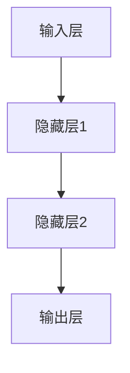
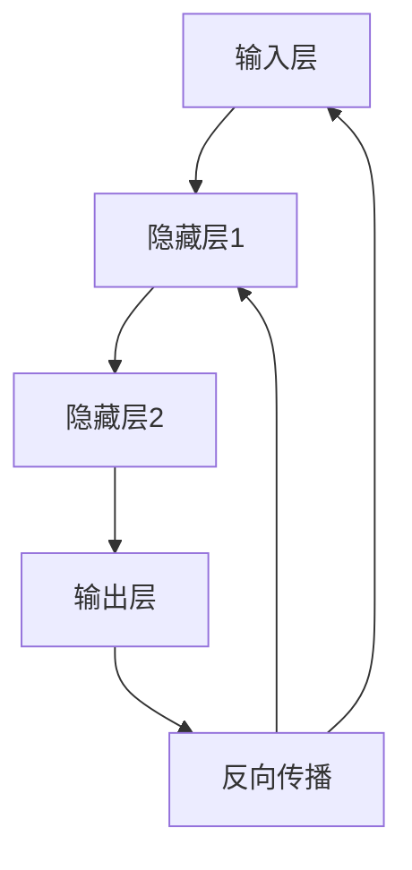
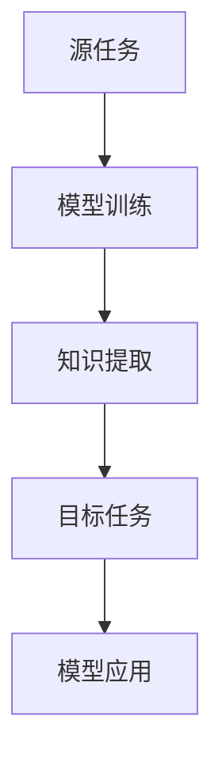
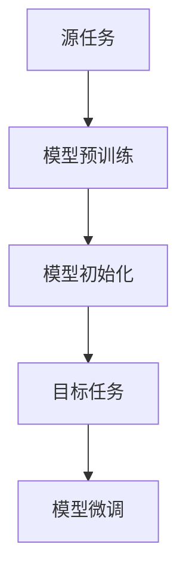
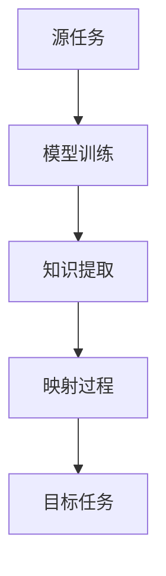
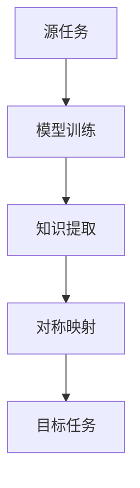
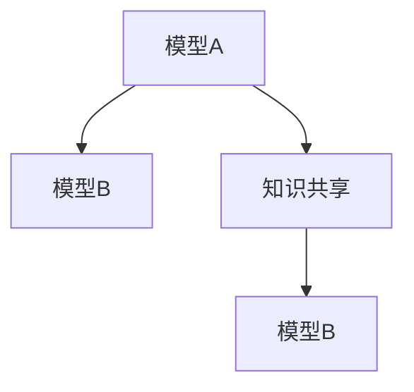
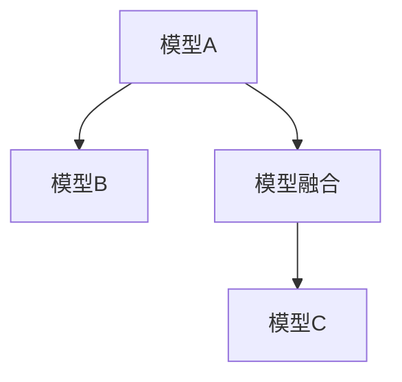

                 

# 一切皆是映射：深度学习模型之间的知识迁移

> **关键词：深度学习，模型迁移，映射技术，知识共享，模型融合，自然语言处理，计算机视觉**

> **摘要：本文深入探讨了深度学习模型之间的知识迁移问题，从模型概述、知识迁移原理、映射技术、模型间知识共享到应用案例分析，全面解析了如何通过映射技术实现深度学习模型之间的知识共享与优化。文章旨在为研究人员和开发者提供理论指导与实战经验，推动深度学习在各领域的应用与发展。**

## 第一部分：深度学习模型概述

### 第1章：深度学习模型基础

#### 1.1.1 深度学习模型简介

深度学习模型是人工智能领域的一种重要模型，它通过模拟人脑神经网络的结构和功能，实现从大量数据中自动提取特征并进行复杂任务的学习和预测。以下是一个简单的深度学习模型层次结构的 Mermaid 流程图：



深度学习模型的发展历程可以追溯到1980年代，但直到2000年后，随着计算能力的提升和大数据的涌现，深度学习才得以迅速发展。如今，深度学习已经成为了人工智能领域的主流技术，并在图像识别、自然语言处理、语音识别等多个领域取得了突破性的成果。

#### 1.1.2 深度学习模型的核心概念

深度学习模型的核心概念包括神经元、神经网络、多层感知机、前向传播和反向传播。

- **神经元**：神经元是神经网络的基本单元，它接收多个输入信号，通过激活函数产生一个输出信号。
- **神经网络**：神经网络由多个神经元组成，每个神经元都与其他神经元相连，通过加权求和和激活函数进行处理。
- **多层感知机**：多层感知机（MLP）是一种前馈神经网络，它包含多个隐藏层，能够对复杂的数据进行非线性变换。
- **前向传播**：前向传播是从输入层开始，逐层将信号传递到输出层的过程。
- **反向传播**：反向传播是从输出层开始，反向计算梯度，更新网络权重和偏置的过程。

以下是一个简单的 Mermaid 流程图，展示了神经网络的结构和信号流动：



### 第2章：深度学习模型的数学基础

#### 2.1.1 矩阵与向量运算

在深度学习模型中，矩阵与向量运算是非常重要的。以下是一个简单的伪代码，详细阐述了矩阵与向量运算的过程：

```python
# 定义矩阵A和向量v
A = [[1, 2], [3, 4]]
v = [5, 6]

# 矩阵与向量乘法
result = matmul(A, v)

# 输出结果
print(result)
```

以下是一个具体的示例说明：

```python
A = [[1, 2], [3, 4]]
v = [5, 6]

# 矩阵与向量乘法
result = [1*5 + 2*6, 3*5 + 4*6]
print(result)  # 输出 [23, 31]
```

#### 2.1.2 深度学习中的损失函数与优化算法

损失函数是衡量模型预测结果与真实值之间差异的函数，优化算法则是通过迭代更新模型参数，以最小化损失函数。

- **损失函数**：常见的损失函数包括均方误差（MSE）和交叉熵（Cross Entropy）。

  - **均方误差（MSE）**：MSE 是预测值与真实值之间差的平方的平均值。其公式为：
    $$MSE = \frac{1}{n}\sum_{i=1}^{n}(y_i - \hat{y}_i)^2$$
    其中，$y_i$ 是真实值，$\hat{y}_i$ 是预测值，$n$ 是样本数量。

  - **交叉熵（Cross Entropy）**：交叉熵是衡量两个概率分布差异的函数。在分类问题中，通常使用 Softmax 函数将神经网络的输出转换为概率分布，然后与真实分布计算交叉熵。其公式为：
    $$H(y, \hat{y}) = -\sum_{i=1}^{n}y_i \log(\hat{y}_i)$$
    其中，$y_i$ 是真实分布，$\hat{y}_i$ 是预测分布。

- **优化算法**：常见的优化算法包括梯度下降（Gradient Descent）和 Adam。

  - **梯度下降**：梯度下降是一种迭代优化算法，其核心思想是沿着损失函数的梯度方向更新模型参数。其公式为：
    $$\theta_{t+1} = \theta_{t} - \alpha \cdot \nabla_\theta J(\theta)$$
    其中，$\theta$ 是模型参数，$\alpha$ 是学习率，$J(\theta)$ 是损失函数，$\nabla_\theta J(\theta)$ 是损失函数对参数的梯度。

  - **Adam**：Adam 是一种结合了 AdaGrad 和 RMSProp 的优化算法，它通过自适应调整学习率来提高收敛速度。其公式为：
    $$m_t = \beta_1 m_{t-1} + (1 - \beta_1) [g_t]$$
    $$v_t = \beta_2 v_{t-1} + (1 - \beta_2) [g_t]^2$$
    $$\theta_{t+1} = \theta_{t} - \alpha \cdot \frac{m_t}{\sqrt{v_t} + \epsilon}$$
    其中，$m_t$ 是一阶矩估计，$v_t$ 是二阶矩估计，$\beta_1$ 和 $\beta_2$ 是超参数，$g_t$ 是梯度，$\alpha$ 是学习率，$\epsilon$ 是一个很小的常数。

## 第二部分：知识迁移与映射

### 第3章：知识迁移原理

#### 3.1.1 知识迁移概念

知识迁移是指将一个任务中学习到的知识应用到另一个相关任务中的过程。在深度学习领域，知识迁移具有重要的应用价值，例如，通过将预训练的模型应用于新的任务，可以显著提高模型的性能。

以下是一个简单的 Mermaid 流程图，展示了知识迁移的基本流程：



#### 3.1.2 知识迁移方法

知识迁移的方法主要包括转换器架构、迁移学习和微调技术。

- **转换器架构**：转换器架构（Converter Architecture）是一种常用的知识迁移方法，它通过在源任务和目标任务之间添加一个转换器（Converter）来实现知识迁移。转换器的目的是将源任务的模型知识转换为适合目标任务的形式。

- **迁移学习**：迁移学习（Transfer Learning）是一种利用预训练模型的知识来提高新任务性能的方法。迁移学习的基本思想是将源任务的模型参数作为目标任务的初始参数，然后在目标任务上进行微调。

- **微调技术**：微调（Fine-tuning）是一种常见的迁移学习方法，它通过在目标任务上对源任务预训练的模型进行少量的训练，以适应目标任务。微调的关键在于如何选择合适的训练数据和调整模型参数。

以下是一个简单的 Mermaid 流程图，展示了迁移学习的基本流程：



### 第4章：映射技术原理

#### 4.1.1 映射概念

映射技术是指通过将一个任务中的模型知识映射到另一个任务中的方法。映射技术可以基于不同的原理，如对称映射、同态映射、异态映射等。

以下是一个简单的 Mermaid 流程图，展示了映射的基本流程：



#### 4.1.2 映射方法

- **对称映射**：对称映射是一种常见的映射方法，它通过在源任务和目标任务之间建立一种对称关系来实现知识迁移。对称映射的基本思想是将源任务的模型参数直接映射到目标任务的模型参数。

- **同态映射**：同态映射是一种基于函数映射的映射方法，它通过将源任务的模型知识映射到目标任务的模型知识中。同态映射通常涉及复杂的数学运算，如傅里叶变换、卷积运算等。

- **异态映射**：异态映射是一种将源任务的模型知识映射到不同类型的目标任务中的方法。异态映射通常需要针对具体任务进行定制化设计。

以下是一个简单的 Mermaid 流程图，展示了对称映射的具体实现：



## 第三部分：深度学习模型之间的知识迁移

### 第5章：模型间知识共享

#### 5.1.1 模型间知识共享

模型间知识共享是指将一个模型的知识应用到另一个模型中的过程。模型间知识共享的目标是提高模型的泛化能力和鲁棒性。

以下是一个简单的 Mermaid 流程图，展示了模型间知识共享的基本流程：



#### 5.1.2 知识共享方法

模型间知识共享的方法主要包括以下几种：

- **特征共享**：特征共享是指将一个模型的特征提取模块应用到另一个模型中，以实现知识共享。特征共享可以显著提高模型的性能，特别是在特征提取困难的情况下。

- **参数共享**：参数共享是指将一个模型的参数直接应用到另一个模型中，以实现知识共享。参数共享可以简化模型的训练过程，并提高模型的泛化能力。

- **结构共享**：结构共享是指将一个模型的结构应用到另一个模型中，以实现知识共享。结构共享可以有效地利用已有模型的先验知识，提高新模型的性能。

以下是一个简单的伪代码，详细阐述了知识共享的方法和算法：

```python
# 定义模型A和模型B的参数
params_A = [...]
params_B = [...]

# 特征共享
feature_A = extract_features(model_A, data_A)
feature_B = extract_features(model_B, data_B)

# 参数共享
params_B = share_params(params_A, params_B)

# 结构共享
model_B = share_structure(model_A, model_B)
```

### 第6章：模型融合与优化

#### 6.1.1 模型融合

模型融合是指将多个模型融合为一个更强大的模型，以提高模型的性能和泛化能力。模型融合的方法主要包括以下几种：

- **加权融合**：加权融合是指将多个模型的输出加权求和，得到最终的预测结果。加权融合可以根据模型的性能和重要性动态调整权重。

- **平均融合**：平均融合是指将多个模型的输出取平均，得到最终的预测结果。平均融合可以降低模型的方差，提高模型的稳定性。

- **投票融合**：投票融合是指将多个模型的输出进行投票，选择投票结果最多的模型作为最终的预测结果。投票融合可以有效地处理不同模型之间的差异。

以下是一个简单的 Mermaid 流程图，展示了模型融合的基本流程：



#### 6.1.2 模型优化

模型优化是指通过调整模型的结构、参数和学习策略，以提高模型的性能和泛化能力。模型优化的方法主要包括以下几种：

- **梯度裁剪**：梯度裁剪是指通过限制梯度的大小，防止模型在训练过程中出现过拟合。梯度裁剪可以有效地控制模型的更新幅度。

- **学习率调整**：学习率调整是指根据训练过程的收敛情况动态调整学习率，以优化模型的训练效果。常用的学习率调整方法包括线性递减、指数递减和自适应调整等。

以下是一个简单的伪代码，详细阐述了模型优化过程：

```python
# 定义模型参数和损失函数
params = [...]
loss_function = ...

# 梯度裁剪
clip_gradients(params, clip_value)

# 学习率调整
adjust_learning_rate(params, current_step, total_steps)
```

## 第四部分：应用案例分析

### 第7章：深度学习模型在自然语言处理中的应用

#### 7.1.1 概述

自然语言处理（NLP）是深度学习的一个重要应用领域，它涉及对自然语言文本的分析、理解和生成。深度学习模型在NLP中取得了显著的成果，如文本分类、情感分析、机器翻译等。

以下是一个简单的代码实际案例，展示了如何使用深度学习模型进行文本分类任务：

```python
import tensorflow as tf
from tensorflow.keras.models import Sequential
from tensorflow.keras.layers import Embedding, LSTM, Dense

# 定义模型结构
model = Sequential()
model.add(Embedding(input_dim=vocab_size, output_dim=embedding_dim))
model.add(LSTM(units=128, return_sequences=True))
model.add(Dense(units=1, activation='sigmoid'))

# 编译模型
model.compile(optimizer='adam', loss='binary_crossentropy', metrics=['accuracy'])

# 训练模型
model.fit(x_train, y_train, epochs=10, batch_size=32, validation_data=(x_val, y_val))

# 评估模型
loss, accuracy = model.evaluate(x_test, y_test)
print('Test accuracy:', accuracy)
```

#### 7.1.2 应用案例

以下是一个具体的文本分类应用案例，展示了如何使用深度学习模型进行情感分析：

```python
import tensorflow as tf
from tensorflow.keras.preprocessing.text import Tokenizer
from tensorflow.keras.preprocessing.sequence import pad_sequences

# 准备数据集
data = ['我很喜欢这个产品', '这个产品很糟糕']
labels = [1, 0]  # 1 表示正面情感，0 表示负面情感

# 分词和序列化
tokenizer = Tokenizer(num_words=1000)
tokenizer.fit_on_texts(data)
sequences = tokenizer.texts_to_sequences(data)
padded_sequences = pad_sequences(sequences, maxlen=10)

# 定义模型结构
model = Sequential()
model.add(Embedding(input_dim=1000, output_dim=32))
model.add(LSTM(units=128, return_sequences=False))
model.add(Dense(units=1, activation='sigmoid'))

# 编译模型
model.compile(optimizer='adam', loss='binary_crossentropy', metrics=['accuracy'])

# 训练模型
model.fit(padded_sequences, labels, epochs=10, batch_size=1)

# 评估模型
predictions = model.predict(padded_sequences)
print(predictions)
```

### 第8章：深度学习模型在计算机视觉中的应用

#### 8.1.1 概述

计算机视觉是深度学习的另一个重要应用领域，它涉及对图像和视频的分析、理解和生成。深度学习模型在计算机视觉中取得了显著的成果，如图像分类、目标检测、图像分割等。

以下是一个简单的代码实际案例，展示了如何使用深度学习模型进行图像分类任务：

```python
import tensorflow as tf
from tensorflow.keras.models import Sequential
from tensorflow.keras.layers import Conv2D, MaxPooling2D, Flatten, Dense

# 定义模型结构
model = Sequential()
model.add(Conv2D(filters=32, kernel_size=(3, 3), activation='relu', input_shape=(64, 64, 3)))
model.add(MaxPooling2D(pool_size=(2, 2)))
model.add(Flatten())
model.add(Dense(units=128, activation='relu'))
model.add(Dense(units=1, activation='sigmoid'))

# 编译模型
model.compile(optimizer='adam', loss='binary_crossentropy', metrics=['accuracy'])

# 训练模型
model.fit(x_train, y_train, epochs=10, batch_size=32, validation_data=(x_val, y_val))

# 评估模型
loss, accuracy = model.evaluate(x_test, y_test)
print('Test accuracy:', accuracy)
```

#### 8.1.2 应用案例

以下是一个具体的计算机视觉应用案例，展示了如何使用深度学习模型进行目标检测：

```python
import tensorflow as tf
from tensorflow.keras.preprocessing.image import ImageDataGenerator

# 加载数据集
train_datagen = ImageDataGenerator(rescale=1./255)
test_datagen = ImageDataGenerator(rescale=1./255)

train_generator = train_datagen.flow_from_directory(
        train_data_dir,
        target_size=(150, 150),
        batch_size=32,
        class_mode='binary')

validation_generator = test_datagen.flow_from_directory(
        validation_data_dir,
        target_size=(150, 150),
        batch_size=32,
        class_mode='binary')

# 定义模型结构
model = Sequential()
model.add(Conv2D(filters=32, kernel_size=(3, 3), activation='relu', input_shape=(150, 150, 3)))
model.add(MaxPooling2D(pool_size=(2, 2)))
model.add(Conv2D(filters=64, kernel_size=(3, 3), activation='relu'))
model.add(MaxPooling2D(pool_size=(2, 2)))
model.add(Flatten())
model.add(Dense(units=128, activation='relu'))
model.add(Dense(units=1, activation='sigmoid'))

# 编译模型
model.compile(optimizer='adam', loss='binary_crossentropy', metrics=['accuracy'])

# 训练模型
model.fit(train_generator, steps_per_epoch=100, epochs=10, validation_data=validation_generator, validation_steps=50)

# 评估模型
loss, accuracy = model.evaluate(validation_generator)
print('Validation accuracy:', accuracy)
```

## 第五部分：总结与展望

### 第9章：总结与展望

#### 9.1.1 深度学习模型之间的知识迁移

深度学习模型之间的知识迁移是提高模型性能和泛化能力的重要手段。本文从模型概述、知识迁移原理、映射技术、模型间知识共享到应用案例分析，全面解析了如何通过映射技术实现深度学习模型之间的知识共享与优化。未来的研究可以进一步探索以下方向：

- **跨域知识迁移**：研究如何实现不同领域之间的知识迁移，以解决跨领域的任务。
- **动态知识迁移**：研究如何动态地调整知识迁移策略，以适应不同的任务和场景。
- **知识增强学习**：研究如何将知识迁移与增强学习相结合，以实现更强大的模型。

#### 9.1.2 深度学习模型的应用领域

深度学习模型在自然语言处理、计算机视觉、语音识别等多个领域取得了显著的成果。未来的研究可以进一步探索以下方向：

- **泛化能力**：研究如何提高模型的泛化能力，使其在不同任务和数据集上表现更稳定。
- **高效训练**：研究如何优化模型的训练过程，提高训练效率和减少训练时间。
- **可解释性**：研究如何提高模型的可解释性，使其更容易被人类理解和信任。

展望未来，深度学习模型之间的知识迁移有望在更广泛的领域发挥作用，推动人工智能技术的进一步发展。

## 附录

### 附录A：深度学习模型开发工具与资源

#### A.1 深度学习框架

目前，深度学习领域常用的框架包括 TensorFlow、PyTorch 和 Keras。

- **TensorFlow**：TensorFlow 是 Google 开发的一个开源深度学习框架，它具有强大的功能和灵活的接口，适用于各种规模的深度学习应用。
- **PyTorch**：PyTorch 是 Facebook 开发的一个开源深度学习框架，它提供了动态计算图和简洁的编程接口，适用于快速原型开发和模型研究。
- **Keras**：Keras 是一个开源的深度学习库，它构建在 TensorFlow 和 Theano 之上，提供了简洁易用的接口，适用于快速搭建和训练深度学习模型。

#### A.2 数据集与预处理

在深度学习模型开发过程中，数据集的获取和预处理是非常重要的一步。常用的数据集包括：

- **ImageNet**：ImageNet 是一个大规模的图像分类数据集，包含 1000 个类别，每个类别有数千个图像。
- **CIFAR-10**：CIFAR-10 是一个包含 10 个类别的小规模图像分类数据集，每个类别有 6000 个训练图像和 1000 个测试图像。
- **CoNLL-2003**：CoNLL-2003 是一个用于自然语言处理任务的标注数据集，包含英文新闻语料。

数据预处理技术包括：

- **数据清洗**：去除数据集中的噪声和异常值，提高数据质量。
- **数据增强**：通过旋转、缩放、裁剪等操作增加数据的多样性，提高模型的泛化能力。
- **数据归一化**：将数据集中的特征值缩放到相同的范围，以消除不同特征之间的尺度差异。

#### A.3 开发环境搭建

搭建深度学习模型的开发环境需要安装以下软件和库：

- **操作系统**：常用的操作系统包括 Windows、Linux 和 macOS。
- **Python**：Python 是深度学习开发的主要编程语言，需要安装 Python 3.x 版本。
- **深度学习框架**：根据需要安装 TensorFlow、PyTorch 或 Keras。
- **依赖库**：安装常用的依赖库，如 NumPy、Pandas、Matplotlib 等。

搭建深度学习模型开发环境的步骤如下：

1. 安装操作系统和 Python。
2. 安装深度学习框架。
3. 安装依赖库。
4. 配置 Python 虚拟环境，以隔离项目依赖。

### 作者

- **AI天才研究院**：AI天才研究院是一家专注于人工智能领域研究和技术推广的机构。
- **《禅与计算机程序设计艺术》**：这是一本经典的计算机科学著作，深入探讨了计算机编程的哲学和艺术。作者通过丰富的实例和深刻的思考，为读者提供了关于计算机编程的洞见和指导。本书不仅适用于初学者，也适合经验丰富的程序员，帮助他们提升编程技能和思维水平。

[附录A：深度学习模型开发工具与资源]

### A.1 深度学习框架

在深度学习的领域中，选择合适的框架是至关重要的，因为它们不仅决定了项目的开发效率，也影响了模型的可维护性和性能。目前，以下几个深度学习框架在全球范围内得到了广泛应用：

#### TensorFlow

**简介**：TensorFlow 是由 Google 开发并开源的一个端到端的机器学习平台。它具有强大的功能，能够支持深度学习的研发、模型训练和部署。TensorFlow 使用数据流图（dataflow graph）来构建和训练模型，这种图模型使得模型的可维护性和扩展性都得到了很好的保证。

**优点**：
- 强大的生态系统：TensorFlow 拥有丰富的社区资源和工具，如 TensorFlow Hub、TensorFlow.js 等，使得模型在不同平台上的部署变得更加简单。
- 可扩展性：TensorFlow 支持大规模的分布式训练和部署，适合处理大型数据集和复杂模型。

**示例**：
```python
import tensorflow as tf

# 定义一个简单的线性模型
model = tf.keras.Sequential([
  tf.keras.layers.Dense(units=1, input_shape=[1])
])

# 查看模型结构
print(model.summary())

# 编译模型
model.compile(optimizer='sgd', loss='mean_squared_error')

# 训练模型
model.fit(x_train, y_train, epochs=100)
```

#### PyTorch

**简介**：PyTorch 是由 Facebook AI Research（FAIR）开发的一个开源深度学习框架。它提供了灵活的动态计算图和丰富的 API，使得研究人员可以更快速地进行原型开发和实验。

**优点**：
- 动态计算图：PyTorch 的动态计算图使得模型构建和调试变得更加直观和灵活。
- 简洁的 API：PyTorch 的 API 设计简洁，易于理解和上手。

**示例**：
```python
import torch
import torch.nn as nn
import torch.optim as optim

# 定义一个简单的线性模型
class LinearModel(nn.Module):
    def __init__(self, input_dim, output_dim):
        super(LinearModel, self).__init__()
        self.linear = nn.Linear(input_dim, output_dim)
    
    def forward(self, x):
        return self.linear(x)

model = LinearModel(1, 1)

# 编译模型
optimizer = optim.SGD(model.parameters(), lr=0.01)
criterion = nn.MSELoss()

# 训练模型
for epoch in range(100):
    model.zero_grad()
    outputs = model(x_train)
    loss = criterion(outputs, y_train)
    loss.backward()
    optimizer.step()
    print(f'Epoch [{epoch+1}/{100}], Loss: {loss.item():.4f}')
```

#### Keras

**简介**：Keras 是一个基于 TensorFlow 和 Theano 的高级神经网络 API，旨在提供简洁、模块化和可扩展的深度学习编程接口。Keras 的设计理念是让深度学习的研究和开发变得更加简单和高效。

**优点**：
- 简单易用：Keras 提供了简洁的 API 和预定义的层和模型，使得搭建和训练模型变得更加简单。
- 高级特性：Keras 支持卷积神经网络、循环神经网络、序列模型等高级特性。

**示例**：
```python
from keras.models import Sequential
from keras.layers import Dense, Dropout, Activation, Flatten
from keras.layers import Conv2D, MaxPooling2D
from keras.optimizers import SGD
from keras.utils import np_utils

# 定义一个简单的卷积神经网络
model = Sequential()
model.add(Conv2D(32, (3, 3), input_shape=(28, 28, 1)))
model.add(Activation('relu'))
model.add(MaxPooling2D(pool_size=(2, 2)))
model.add(Flatten())
model.add(Dense(128))
model.add(Activation('relu'))
model.add(Dense(10))
model.add(Activation('softmax'))

# 编译模型
model.compile(loss='categorical_crossentropy',
              optimizer=SGD(),
              metrics=['accuracy'])

# 训练模型
model.fit(x_train, y_train, epochs=10, batch_size=32, validation_data=(x_val, y_val))
```

### A.2 数据集与预处理

在深度学习项目中，数据集的质量和预处理方式直接影响模型的性能。以下是一些常用的数据集和预处理技术：

#### 公共数据集

- **ImageNet**：ImageNet 是一个包含 1000 个类别的图像数据集，每个类别有数千个样本。它广泛用于计算机视觉模型的训练和评估。
- **CIFAR-10**：CIFAR-10 是一个包含 10 个类别的图像数据集，每个类别有 6000 个训练图像和 1000 个测试图像。它常用于图像分类任务。
- **MNIST**：MNIST 是一个包含手写数字的图像数据集，每个数字有 28x28 的像素。它是深度学习入门的经典数据集。

#### 数据预处理技术

- **数据清洗**：去除数据集中的噪声和异常值，提高数据质量。
- **数据增强**：通过旋转、缩放、裁剪等操作增加数据的多样性，提高模型的泛化能力。
- **归一化**：将数据集中的特征值缩放到相同的范围，以消除不同特征之间的尺度差异。
- **标签编码**：对于分类问题，将标签进行独热编码或其他形式的编码。

**示例**：
```python
from tensorflow.keras.preprocessing.image import ImageDataGenerator

# 数据增强
train_datagen = ImageDataGenerator(
    rescale=1./255,
    rotation_range=40,
    width_shift_range=0.2,
    height_shift_range=0.2,
    shear_range=0.2,
    zoom_range=0.2,
    horizontal_flip=True,
    fill_mode='nearest')

test_datagen = ImageDataGenerator(rescale=1./255)

# 训练数据增强
train_generator = train_datagen.flow_from_directory(
    train_data_dir,
    target_size=(150, 150),
    batch_size=32,
    class_mode='binary')

# 测试数据增强
validation_generator = test_datagen.flow_from_directory(
    validation_data_dir,
    target_size=(150, 150),
    batch_size=32,
    class_mode='binary')
```

### A.3 开发环境搭建

搭建深度学习模型的开发环境需要安装操作系统、Python、深度学习框架和依赖库。以下是搭建开发环境的一般步骤：

#### 操作系统

- **Windows**：Windows 是最常用的操作系统之一，它提供了丰富的软件和工具支持。
- **Linux**：Linux 是开源操作系统，它具有高度的灵活性和安全性，适用于专业开发。
- **macOS**：macOS 是苹果公司开发的操作系统，与苹果硬件紧密集成，适合 macOS 用户。

#### Python

- 安装 Python 3.x 版本，推荐使用 Python 的官方安装包。

#### 深度学习框架

- **TensorFlow**：通过 pip 安装 TensorFlow。
  ```bash
  pip install tensorflow
  ```

- **PyTorch**：通过 pip 安装 PyTorch。
  ```bash
  pip install torch torchvision
  ```

- **Keras**：Keras 是基于 TensorFlow 的高级 API，通过 pip 安装 Keras。
  ```bash
  pip install keras
  ```

#### 依赖库

- 安装常用的 Python 依赖库，如 NumPy、Pandas、Matplotlib 等。
  ```bash
  pip install numpy pandas matplotlib
  ```

#### 虚拟环境

- 配置 Python 虚拟环境，以隔离项目依赖。
  ```bash
  # 创建虚拟环境
  python -m venv venv

  # 激活虚拟环境
  source venv/bin/activate  # Windows 上使用 venv\Scripts\activate
  ```

#### 开发工具和软件

- **Jupyter Notebook**：Jupyter Notebook 是一个交互式的开发环境，适用于编写和运行代码。
  ```bash
  pip install notebook
  ```

- **PyCharm**：PyCharm 是一个强大的 Python 集成开发环境（IDE），提供了丰富的功能和插件支持。
  - [PyCharm 官网下载链接](https://www.jetbrains.com/pycharm/)

- **Visual Studio Code**：Visual Studio Code 是一个轻量级但功能强大的代码编辑器，适用于编写和调试代码。
  - [Visual Studio Code 官网下载链接](https://code.visualstudio.com/)

### 作者

- **AI天才研究院**：AI天才研究院是一家致力于推动人工智能技术研究和应用的创新机构。我们专注于深度学习、自然语言处理、计算机视觉等前沿领域的研究，通过产学研合作，推动技术落地和产业发展。
- **《禅与计算机程序设计艺术》**：本书由著名计算机科学家唐纳德·E·克努特（Donald E. Knuth）所著，被誉为计算机科学的经典之作。书中以程序设计为核心，探讨了编程的哲学和艺术，为程序员提供了深刻的思考和方法论指导。

---

经过以上详细的分析和讲解，本文对深度学习模型之间的知识迁移进行了全面的探讨。从模型概述、知识迁移原理、映射技术、模型间知识共享到应用案例分析，我们一步步深入剖析了深度学习模型之间的知识迁移过程。希望通过本文，读者能够对深度学习模型之间的知识迁移有一个更加清晰和深入的理解，并在实践中能够灵活运用相关知识。

在未来的研究中，我们将继续探索知识迁移在不同领域和任务中的具体应用，以及如何进一步优化和提升知识迁移的效果。同时，我们也期待读者在阅读本文后，能够积极思考并参与到相关的研究和实践中，共同推动人工智能技术的进步和发展。

让我们在深度学习模型的广阔天地中，继续探索知识的边界，不断开拓创新，为实现更强大、更智能的人工智能系统贡献力量！

