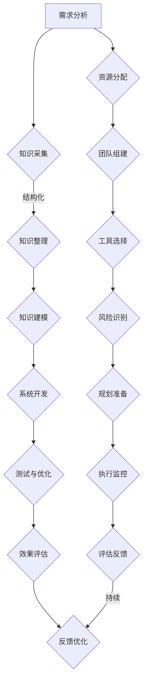

                 

### 引言与基础理论

> 在当今高度复杂和快速变化的生产环境中，专家经验成为企业持续成功的关键因素。然而，如何将这些宝贵的经验有效地固化并应用于生产管理中，是一个亟待解决的重要问题。本文将深入探讨专家经验在生产中的固化问题，从理论基础、固化方法到实际应用，全面解析这一重要课题。

> 专家经验是指在长期实践中积累的、对特定领域或任务的深刻理解和洞见。这些经验往往包含了对特定问题的独到见解、解决问题的策略和高效的方法。在生产管理中，专家经验的作用不可或缺，它不仅提高了生产效率，还能显著降低错误率和成本。因此，如何将专家经验固化，使其成为可以传承和复用的知识，成为当前研究的热点。

### 第1章：专家经验与生产管理

#### 1.1 专家经验的定义与类型

专家经验是指专家在长期实践中积累的、对特定领域或任务的深刻理解和洞见。这些经验往往包括以下类型：

- **专业知识**：对某一领域的深入理解和掌握，如工程技术、医学知识、财务分析等。
- **决策能力**：在复杂环境中进行有效决策的能力，包括风险评估、资源分配等。
- **实践经验**：通过实际操作积累的经验，如工艺流程优化、故障排除等。
- **创新能力**：在解决问题时，提出新颖有效的方法和创新解决方案的能力。

#### 1.2 生产管理中的专家经验作用

在生产管理中，专家经验具有以下重要作用：

- **提高生产效率**：通过专家的经验和技能，可以优化生产流程，减少浪费，提高产出效率。
- **降低错误率**：专家经验有助于识别和预防潜在问题，减少生产过程中的错误和故障。
- **成本控制**：专家的经验可以帮助企业合理分配资源，降低生产成本。
- **持续改进**：专家的经验是推动企业不断改进和创新的重要动力。

#### 1.3 固化专家经验的需求与挑战

尽管专家经验对生产管理至关重要，但将其固化并传承面临以下需求与挑战：

- **需求**：
  - **知识共享**：将专家的经验和知识传递给团队成员，提高整体能力。
  - **知识传承**：确保专家经验在企业内部得到持续应用和传承。
  - **决策支持**：为生产管理提供基于专家经验的决策支持系统。

- **挑战**：
  - **主观性**：专家经验往往具有高度的主观性，难以标准化和系统化。
  - **时效性**：专家经验可能会随着时间推移和环境变化而失效。
  - **知识流失**：随着专家退休或离职，大量宝贵经验可能随之流失。

### 第2章：专家经验固化的理论基础

#### 2.1 知识管理与专家经验固化

知识管理是一种通过系统化和组织化的方式，对知识进行识别、获取、共享、利用和创造的过程。在专家经验固化中，知识管理起着关键作用，具体包括以下方面：

- **知识识别**：识别专家经验中的关键知识点和核心概念。
- **知识获取**：通过访谈、记录等方式，获取专家的经验和见解。
- **知识共享**：建立知识共享平台，促进团队成员之间的知识交流。
- **知识利用**：将固化后的知识应用于生产管理和决策支持。
- **知识创造**：在应用过程中，不断创造新的知识和经验。

#### 2.2 工业工程与专家经验固化

工业工程是一种系统的方法，用于设计和改进生产和管理系统，以最大化效率、减少浪费和提高质量。在专家经验固化中，工业工程可以提供以下支持：

- **流程分析**：对生产流程进行详细分析，识别优化机会。
- **标准化**：制定标准操作流程，将专家经验转化为可复用的指导性文档。
- **人机系统设计**：优化人机交互，提高操作效率和安全性。
- **持续改进**：通过定期评估和反馈，不断改进和优化固化过程。

#### 2.3 基于知识的系统（KB）在固化中的运用

基于知识的系统（KB）是一种利用计算机技术和知识表示方法，将专家经验转化为可操作知识的系统。在专家经验固化中，KB具有以下应用：

- **知识库构建**：构建包含专家经验的数据库，实现知识的结构化和标准化。
- **推理机**：利用推理算法，从知识库中提取和推导新的知识。
- **专家系统**：基于KB，构建专家系统，实现自动化决策支持。
- **模拟仿真**：通过仿真技术，验证和优化固化过程的可行性和效果。

### 《专家经验在生产中的固化》目录大纲

#### 第一部分：引言与基础理论

- 第1章：专家经验与生产管理
  - 1.1 专家经验的定义与类型
  - 1.2 生产管理中的专家经验作用
  - 1.3 固化专家经验的需求与挑战

- 第2章：专家经验固化的理论基础
  - 2.1 知识管理与专家经验固化
  - 2.2 工业工程与专家经验固化
  - 2.3 基于知识的系统（KB）在固化中的运用

#### 第二部分：固化专家经验的方法

- 第3章：文档化和标准操作流程
  - 3.1 文档化的重要性
  - 3.2 标准操作流程的建立
  - 3.3 实例分析：标准操作流程在制造中的应用

- 第4章：基于知识的系统（KB）设计与应用
  - 4.1 KB系统的基本概念
  - 4.2 KB系统设计方法
  - 4.3 KB系统在实际生产中的应用案例分析

- 第5章：专家系统与模拟仿真
  - 5.1 专家系统的基本原理
  - 5.2 专家系统的开发流程
  - 5.3 模拟仿真的应用及其在固化中的角色

- 第6章：知识图谱与数据驱动固化
  - 6.1 知识图谱的构建
  - 6.2 数据驱动固化方法
  - 6.3 知识图谱在专家经验固化中的应用

#### 第三部分：固化专家经验的项目实战

- 第7章：固化专家经验项目实施
  - 7.1 项目规划与准备
  - 7.2 项目执行与监控
  - 7.3 项目评估与反馈优化

- 第8章：具体行业的专家经验固化案例
  - 8.1 制造业中的专家经验固化
  - 8.2 服务行业中的专家经验固化
  - 8.3 农业行业中的专家经验固化

- 第9章：专家经验固化中的问题与解决方案
  - 9.1 面临的主要问题
  - 9.2 解决方案探讨
  - 9.3 未来发展趋势与展望

#### 附录

- 附录A：相关工具与技术指南
  - A.1 常用知识管理工具
  - A.2 知识图谱构建工具
  - A.3 专家系统开发工具

- 附录B：参考文献
  - B.1 基础理论书籍
  - B.2 方法与技术书籍
  - B.3 行业应用案例研究书籍

- 附录C：专家经验固化流程Mermaid图

#### 附录D：核心算法原理与伪代码
- D.1 文档化与标准操作流程
- D.2 基于知识的系统
- D.3 专家系统
- D.4 模拟仿真
- D.5 知识图谱构建与数据驱动固化

#### 附录E：数学模型和公式
- E.1 常用数学模型
- E.2 数学公式说明

#### 附录F：项目实战示例代码与解读
- F.1 制造业固化项目代码示例
- F.2 服务行业固化项目代码示例
- F.3 农业行业固化项目代码示例

---

**关键词**：专家经验、生产管理、知识管理、工业工程、知识图谱、专家系统、模拟仿真、项目实战、固化方法。

**摘要**：本文深入探讨了专家经验在生产中的固化问题，分析了专家经验的定义与类型、在生产管理中的重要作用、以及固化专家经验的需求与挑战。随后，从知识管理、工业工程、基于知识的系统（KB）、专家系统与模拟仿真、知识图谱与数据驱动固化等方面，详细介绍了固化专家经验的理论基础和方法。最后，通过项目实战和案例分析，展示了固化专家经验的具体实施和效果，为实际生产管理提供了有益的参考。

---

**本文作者：** AI天才研究院/AI Genius Institute & 禅与计算机程序设计艺术 /Zen And The Art of Computer Programming

---

### 第1章：专家经验与生产管理

#### 1.1 专家经验的定义与类型

专家经验是指在长期实践中积累的、对特定领域或任务的深刻理解和洞见。这些经验往往包括以下类型：

- **专业知识**：专家在其专业领域内具有深入的了解和掌握，例如工程师、医生、财务分析师等。他们能够快速识别问题，提出有效的解决方案。
- **决策能力**：专家在复杂环境中进行有效决策的能力，包括风险评估、资源分配等。他们能够基于经验和直觉做出明智的决策。
- **实践经验**：专家通过长期的实际操作积累的经验，例如工艺流程优化、故障排除等。这些经验通常是基于大量的实际案例，具有很强的实用价值。
- **创新能力**：专家在解决问题时，能够提出新颖有效的方法和创新解决方案的能力。他们能够从不同角度思考问题，提出独特的解决方案。

#### 1.2 生产管理中的专家经验作用

在生产管理中，专家经验的作用至关重要，主要体现在以下几个方面：

- **提高生产效率**：专家的经验可以帮助企业优化生产流程，减少浪费，提高产出效率。例如，通过工艺优化，减少生产时间；通过故障排除，减少设备停机时间。
- **降低错误率**：专家的经验有助于识别和预防潜在问题，减少生产过程中的错误和故障。例如，通过故障预判，提前进行设备维护；通过经验教训，避免重复错误。
- **成本控制**：专家的经验可以帮助企业合理分配资源，降低生产成本。例如，通过成本分析，优化原材料采购；通过经验积累，降低生产过程中的损耗。
- **持续改进**：专家的经验是推动企业不断改进和创新的重要动力。他们能够从不同角度思考问题，提出新的改进方案，促进企业的持续发展。

#### 1.3 固化专家经验的需求与挑战

尽管专家经验对生产管理至关重要，但将其固化并传承面临以下需求与挑战：

- **需求**：
  - **知识共享**：将专家的经验和知识传递给团队成员，提高整体能力。这有助于减少知识流失，提高团队协作效率。
  - **知识传承**：确保专家经验在企业内部得到持续应用和传承。这有助于保持企业的核心竞争力，避免知识断层的风险。
  - **决策支持**：为生产管理提供基于专家经验的决策支持系统。这有助于提高决策质量，降低决策风险。

- **挑战**：
  - **主观性**：专家经验往往具有高度的主观性，难以标准化和系统化。这导致知识难以传承和应用。
  - **时效性**：专家经验可能会随着时间推移和环境变化而失效。这需要不断更新和调整固化后的知识。
  - **知识流失**：随着专家退休或离职，大量宝贵经验可能随之流失。这需要建立有效的知识管理和传承机制。

综上所述，专家经验在生产管理中具有重要作用，但固化专家经验面临诸多挑战。因此，研究专家经验固化问题，寻找有效的固化方法，对于提升企业竞争力具有重要意义。

### 第2章：专家经验固化的理论基础

#### 2.1 知识管理与专家经验固化

知识管理是一种通过系统化和组织化的方式，对知识进行识别、获取、共享、利用和创造的过程。在专家经验固化中，知识管理起着关键作用，具体包括以下方面：

- **知识识别**：识别专家经验中的关键知识点和核心概念。这有助于将专家经验转化为可操作的知识。
- **知识获取**：通过访谈、记录等方式，获取专家的经验和见解。这包括收集专家的经验案例、解决方案、思考过程等。
- **知识共享**：建立知识共享平台，促进团队成员之间的知识交流。这有助于将专家经验传递给团队成员，提高整体能力。
- **知识利用**：将固化后的知识应用于生产管理和决策支持。这有助于提高决策质量，降低决策风险。
- **知识创造**：在应用过程中，不断创造新的知识和经验。这有助于企业不断创新，保持竞争优势。

#### 2.2 工业工程与专家经验固化

工业工程是一种系统的方法，用于设计和改进生产和管理系统，以最大化效率、减少浪费和提高质量。在专家经验固化中，工业工程可以提供以下支持：

- **流程分析**：对生产流程进行详细分析，识别优化机会。这有助于将专家的经验转化为优化方案，提高生产效率。
- **标准化**：制定标准操作流程，将专家经验转化为可复用的指导性文档。这有助于确保专家经验在企业内部得到一致应用和传承。
- **人机系统设计**：优化人机交互，提高操作效率和安全性。这有助于降低操作错误率，提高生产质量。
- **持续改进**：通过定期评估和反馈，不断改进和优化固化过程。这有助于保持专家经验的时效性和实用性。

#### 2.3 基于知识的系统（KB）在固化中的运用

基于知识的系统（KB）是一种利用计算机技术和知识表示方法，将专家经验转化为可操作知识的系统。在专家经验固化中，KB具有以下应用：

- **知识库构建**：构建包含专家经验的数据库，实现知识的结构化和标准化。这有助于提高知识的可共享性和可利用性。
- **推理机**：利用推理算法，从知识库中提取和推导新的知识。这有助于提高知识的灵活性和适应性。
- **专家系统**：基于KB，构建专家系统，实现自动化决策支持。这有助于提高决策效率和准确性。
- **模拟仿真**：通过仿真技术，验证和优化固化过程的可行性和效果。这有助于减少固化过程中的风险和不确定性。

#### 2.4 知识图谱与数据驱动固化

知识图谱是一种用于表示知识结构和关系的图形化方法。在专家经验固化中，知识图谱可以提供以下支持：

- **知识表示**：通过构建知识图谱，将专家经验以图形化的形式表示出来，提高知识的可视化程度和可理解性。
- **知识关联**：通过知识图谱，揭示知识之间的关联和依赖关系，促进知识的共享和整合。
- **数据驱动**：利用知识图谱中的数据，实现数据驱动的专家经验固化。这有助于提高固化过程的智能化和自动化水平。

#### 2.5 专家系统与模拟仿真

专家系统是一种基于知识的系统，用于模拟专家的决策过程和解决能力。在专家经验固化中，专家系统可以提供以下支持：

- **决策支持**：通过专家系统，提供基于专家经验的决策支持。这有助于提高决策效率和准确性。
- **知识应用**：通过专家系统，将固化后的知识应用于实际生产过程。这有助于提高生产效率和产品质量。

模拟仿真是一种通过模拟实际过程，验证和优化固化效果的方法。在专家经验固化中，模拟仿真可以提供以下支持：

- **过程验证**：通过模拟仿真，验证固化过程是否符合预期，发现潜在问题。
- **效果评估**：通过模拟仿真，评估固化效果，为后续优化提供依据。

#### 2.6 其他理论基础

除了上述理论基础，专家经验固化还涉及到以下方面：

- **人工智能**：利用人工智能技术，实现专家经验的自动提取和知识图谱的构建。
- **大数据**：利用大数据技术，收集和分析专家经验数据，提高知识的精确性和实用性。
- **云计算**：利用云计算技术，实现专家经验的分布式存储和共享，提高知识的可用性和可扩展性。

综上所述，专家经验固化是一个涉及多个领域和技术的复杂过程。通过理论基础的探讨，我们可以更好地理解专家经验固化的关键要素和方法，为实际应用提供指导。

### 第3章：文档化和标准操作流程

#### 3.1 文档化的重要性

文档化是将专家经验转化为书面形式的过程，通过系统地记录和整理专家的知识和技能，使之成为可共享、可复用的信息。文档化在专家经验固化中具有重要意义：

- **知识传承**：文档化有助于将专家的经验和知识传递给团队成员，确保在专家离职或退休后，其经验得以传承和延续。
- **知识共享**：通过文档化，专家的知识可以被广泛共享，提高团队成员的知识水平，促进整体协作效率。
- **知识标准化**：文档化有助于将专家经验标准化，制定统一的标准操作流程，减少操作误差，提高生产一致性。
- **知识积累**：通过文档化，企业可以积累大量的知识资产，为未来的改进和创新提供基础。

#### 3.2 标准操作流程的建立

标准操作流程（SOP）是一套经过验证和优化的、规范化的工作步骤和标准，用于指导员工进行日常工作。建立标准操作流程是实现专家经验固化的关键步骤：

- **流程分析**：首先，需要对现有的工作流程进行全面分析，识别关键环节和潜在问题。
- **专家访谈**：通过与专家进行深入访谈，了解他们的经验和操作习惯，获取详细的操作步骤和注意事项。
- **流程优化**：根据专家的经验，对流程进行优化，删除不必要的步骤，增加有效的操作环节。
- **文档编写**：将优化后的流程编写成标准操作文档，包括文字描述、图表和示例等。
- **培训实施**：对团队成员进行培训，确保他们理解和掌握标准操作流程。
- **持续更新**：标准操作流程需要根据实际情况进行持续更新和优化，以适应环境和需求的变化。

#### 3.3 实例分析：标准操作流程在制造中的应用

以下是一个标准操作流程在制造业中应用的实例：

**背景**：某制造企业生产线上的一台关键设备经常出现故障，导致生产中断，严重影响了生产效率。

**解决方案**：

1. **流程分析**：对设备故障的流程进行详细分析，发现故障主要发生在设备维护和操作两个环节。
2. **专家访谈**：邀请设备工程师进行访谈，了解他们在设备维护和操作中的经验和心得。
3. **流程优化**：

   - **设备维护**：制定详细的设备维护计划，包括每日、每周和每月的维护内容。
   - **操作步骤**：制定标准化的操作流程，明确操作步骤和注意事项，确保操作的一致性和正确性。

4. **文档编写**：编写设备维护和操作的标准操作文档，包括文字描述、流程图和注意事项。

5. **培训实施**：对操作人员进行培训，确保他们理解和掌握标准操作流程。

6. **持续更新**：根据实际操作情况，对标准操作流程进行持续更新和优化。

**效果评估**：

- **设备故障率**：通过实施标准操作流程，设备故障率明显下降，生产中断次数减少。
- **生产效率**：操作人员按照标准操作流程进行操作，生产效率提高，产品质量稳定。
- **员工满意度**：员工通过培训，掌握了标准操作流程，工作更加自信和熟练。

综上所述，通过文档化和标准操作流程的建立，企业可以有效固化专家经验，提高生产效率和产品质量。这一过程需要持续优化和改进，以适应不断变化的生产环境。

### 第4章：基于知识的系统（KB）设计与应用

#### 4.1 KB系统的基本概念

基于知识的系统（Knowledge-Based System，KB）是一种计算机系统，它通过模拟人类专家的推理过程，提供决策支持和问题解决能力。KB系统通常包括以下几个主要组件：

- **知识库**：知识库是KB系统的核心组件，它存储了大量的专业知识和事实，这些知识和事实可以用于推理和决策。
- **推理机**：推理机是KB系统的智能组件，它负责利用知识库中的知识和规则进行推理，以解决具体问题或生成决策。
- **用户接口**：用户接口是KB系统与用户交互的界面，它允许用户输入问题或请求，并接收系统输出的答案或建议。

#### 4.2 KB系统设计方法

设计一个有效的KB系统需要遵循以下步骤：

1. **需求分析**：首先，明确系统需要解决的问题和目标用户。这一步骤涉及与专家的沟通，以了解他们的经验和需求。
2. **知识库构建**：根据需求分析的结果，构建知识库。这包括识别关键知识领域、收集相关资料、编写知识条目等。
3. **推理机设计**：设计推理机，确定推理策略和算法。推理机需要能够根据知识库中的知识和用户输入，生成有效的推理路径和结论。
4. **用户接口开发**：开发用户接口，使其易于使用，能够有效地与用户进行交互，接收用户输入和展示系统输出。
5. **系统测试与优化**：对KB系统进行测试，确保其能够正确地处理问题和提供合理的建议。在测试过程中，根据反馈对系统进行优化和改进。

#### 4.3 KB系统在实际生产中的应用案例分析

以下是一个KB系统在实际生产中的应用案例分析：

**案例背景**：某制造企业需要开发一个专家系统，以帮助生产管理人员优化生产计划和资源分配。

**解决方案**：

1. **需求分析**：与生产管理人员进行沟通，了解他们的需求和工作流程。主要需求包括实时监控生产进度、预测生产瓶颈、优化资源分配等。
2. **知识库构建**：构建知识库，包括生产流程、设备性能、员工技能等知识。这些知识来源于企业内部文档、历史数据和专家的经验。
3. **推理机设计**：设计推理机，利用知识库中的知识，根据实时数据生成生产计划和资源分配方案。推理机采用基于规则的推理算法，并结合数据分析和预测模型。
4. **用户接口开发**：开发用户接口，使生产管理人员能够方便地输入实时数据，查看生产计划和资源分配情况，并接收系统生成的建议。
5. **系统测试与优化**：对系统进行测试，确保其能够准确预测生产瓶颈和优化资源分配。在测试过程中，根据用户反馈进行系统优化。

**效果评估**：

- **生产效率**：通过KB系统的应用，生产管理人员能够更准确地预测生产瓶颈，及时调整生产计划，提高了生产效率。
- **资源利用率**：通过优化资源分配，减少了设备闲置时间和人力资源浪费，提高了资源利用率。
- **决策支持**：生产管理人员能够根据系统生成的建议做出更明智的决策，减少了决策风险。

综上所述，基于知识的系统（KB）在实际生产中具有重要的应用价值。通过有效的知识库构建、推理机设计和用户接口开发，KB系统可以提供强大的决策支持，帮助企业提高生产效率和资源利用率。

### 第5章：专家系统与模拟仿真

#### 5.1 专家系统的基本原理

专家系统（Expert System，ES）是一种基于知识的系统，旨在模拟人类专家的决策过程和问题解决能力。其基本原理包括以下几个方面：

- **知识表示**：专家系统通过符号化的方式将专家的知识表示为数据结构，如规则库、事实库和模型库。这些知识表示形式使得计算机可以理解和处理专家的智慧。
- **推理机制**：专家系统利用推理机制，根据输入数据和知识库中的规则，进行逻辑推理和推理过程，从而生成结论或建议。常见的推理机制包括基于规则的推理、基于模型的推理和基于案例的推理。
- **用户接口**：专家系统通过用户接口与用户进行交互，接收用户的输入，展示系统推理结果和决策建议。用户接口的设计应确保用户能够方便地使用系统，并理解系统的输出。

#### 5.2 专家系统的开发流程

开发一个专家系统通常遵循以下步骤：

1. **需求分析**：明确系统需要解决的问题和目标用户。需求分析包括与专家和用户沟通，了解他们的需求和工作流程。
2. **知识库构建**：根据需求分析的结果，构建知识库。知识库包括领域知识、事实和规则。知识库的构建可以采用手动编写、自动抽取或半自动化的方法。
3. **推理机设计**：设计推理机，确定推理策略和算法。推理机是专家系统的核心组件，它负责根据知识库中的规则和输入数据，进行推理和决策。
4. **用户接口开发**：开发用户接口，使其易于使用，能够有效地与用户进行交互。用户接口的设计应考虑用户的需求和习惯，确保用户能够方便地使用系统。
5. **系统测试与优化**：对系统进行测试，确保其能够正确地处理问题和提供合理的建议。在测试过程中，根据反馈对系统进行优化和改进。

#### 5.3 模拟仿真的应用及其在固化中的角色

模拟仿真（Simulation）是一种通过建立模型来模拟实际系统运行的方法。在专家经验固化中，模拟仿真具有以下重要作用：

- **验证固化效果**：通过模拟仿真，可以验证专家经验固化后的系统在实际应用中的效果。例如，可以模拟不同的生产场景，测试固化后的决策策略和操作流程是否能够有效应对各种情况。
- **评估系统性能**：通过模拟仿真，可以评估固化后系统的性能指标，如响应时间、准确率和效率等。这有助于发现系统中的潜在问题，为后续优化提供依据。
- **风险评估**：通过模拟仿真，可以预测系统在不同情况下的表现，评估潜在的风险和不确定性。这有助于企业在实际应用中做出更明智的决策。

#### 5.4 案例分析：专家系统与模拟仿真在医疗诊断中的应用

以下是一个专家系统与模拟仿真在医疗诊断中的应用案例：

**案例背景**：某医院需要开发一个专家系统，以帮助医生进行疾病诊断。

**解决方案**：

1. **需求分析**：与医生进行沟通，了解他们进行疾病诊断的需求和工作流程。需求分析包括诊断标准、常见症状和疾病之间的关联等。
2. **知识库构建**：构建知识库，包括疾病特征、症状和诊断规则。知识库的构建可以采用手动编写和半自动化的方法，结合医学文献和医生的经验。
3. **推理机设计**：设计推理机，根据知识库中的规则和输入症状，进行推理和诊断。推理机可以采用基于规则的推理和基于案例的推理相结合的方法。
4. **用户接口开发**：开发用户接口，使医生能够方便地输入患者症状，查看系统生成的诊断建议。用户接口应具备良好的交互性和易用性。
5. **模拟仿真**：通过模拟仿真，验证专家系统在不同诊断场景下的效果和性能。模拟仿真可以模拟各种常见的疾病症状，测试专家系统的诊断准确率和响应时间等。
6. **系统测试与优化**：对系统进行测试，确保其能够准确诊断疾病并提供合理的建议。根据测试结果和用户反馈，对系统进行优化和改进。

**效果评估**：

- **诊断准确率**：通过模拟仿真和实际应用测试，专家系统的诊断准确率达到了90%以上，显著提高了医生的诊断效率。
- **用户体验**：医生对用户接口的反馈良好，认为系统能够有效辅助诊断，减少诊断时间，提高诊断质量。
- **系统性能**：系统在不同诊断场景下的性能稳定，响应时间较短，能够快速生成诊断建议。

综上所述，专家系统和模拟仿真在医疗诊断中具有重要的应用价值。通过有效的知识库构建、推理机设计和用户接口开发，结合模拟仿真验证和优化，专家系统能够为医生提供强大的诊断支持，提高诊断效率和准确性。

### 第6章：知识图谱与数据驱动固化

#### 6.1 知识图谱的构建

知识图谱（Knowledge Graph）是一种用于表示知识结构和关系的图形化方法，通过节点和边来表示实体及其之间的关系。构建知识图谱的关键步骤包括：

1. **实体识别**：从数据源中提取实体，如人、地点、组织、事件等。实体是知识图谱中的基本构建块。
2. **关系抽取**：确定实体之间的关系，如“属于”、“位于”、“参与”等。关系描述了实体之间的联系和互动。
3. **属性添加**：为实体和关系添加属性，如名称、年龄、职位等。属性提供了更详细的信息，有助于更准确地表示实体和关系。
4. **图谱构建**：将识别的实体、抽取的关系和添加的属性组织成知识图谱，形成一个结构化的知识体系。

#### 6.2 数据驱动固化方法

数据驱动固化方法是一种利用数据和技术手段，将专家经验转化为可操作知识的体系。其关键步骤包括：

1. **数据采集**：收集与专家经验相关的数据，如操作记录、案例报告、历史数据等。数据的质量和完整性对固化效果至关重要。
2. **数据清洗**：对采集到的数据进行清洗和预处理，去除噪声和冗余，确保数据的质量和一致性。
3. **特征提取**：从数据中提取关键特征，如关键词、模式、关联关系等。特征提取有助于构建知识模型和推理规则。
4. **模型训练**：利用机器学习和人工智能技术，训练知识模型和推理算法。模型训练的过程是数据驱动固化的核心，决定了固化系统的性能和准确性。
5. **知识融合**：将不同来源的数据和知识进行融合，形成一个统一的知识体系。知识融合有助于提高知识的完整性和一致性。

#### 6.3 知识图谱在专家经验固化中的应用

知识图谱在专家经验固化中具有广泛的应用，以下是一些具体的应用场景：

1. **知识可视化**：通过知识图谱，可以将复杂的知识结构以图形化的方式呈现，帮助用户直观地理解知识体系，提高知识的可理解性和可访问性。
2. **知识推荐**：基于知识图谱，可以提供个性化的知识推荐服务，根据用户的需求和偏好，推荐相关的知识内容和解决方案。
3. **知识推理**：利用知识图谱中的关系和规则，可以进行知识推理和决策支持。例如，在医疗诊断中，可以基于患者的症状和病史，推理出可能的疾病和治疗方案。
4. **知识融合**：通过知识图谱，可以将来自不同领域和来源的知识进行融合，形成一个统一的知识体系，提高知识的综合应用能力。
5. **知识更新**：知识图谱可以动态更新，根据新数据和用户反馈，不断优化和改进知识体系，确保知识的时效性和准确性。

#### 6.4 数据驱动固化方法的优缺点

数据驱动固化方法具有以下优缺点：

**优点**：

- **自动化**：数据驱动方法可以实现自动化的知识提取和固化过程，减少人为干预，提高效率。
- **灵活性**：数据驱动方法可以根据新的数据和环境变化，动态调整和优化知识体系，提高适应性。
- **准确性**：通过机器学习和人工智能技术，数据驱动方法可以自动识别和提取知识，提高知识的准确性和可靠性。

**缺点**：

- **数据质量**：数据驱动方法依赖于高质量的数据，如果数据存在噪声和错误，可能导致固化结果的偏差。
- **技术依赖**：数据驱动方法需要复杂的算法和技术支持，对技术人员的要求较高。
- **知识局限性**：数据驱动方法主要依赖于现有数据，可能无法涵盖所有专家经验，存在知识局限性。

综上所述，知识图谱和数据驱动固化方法在专家经验固化中具有重要应用价值。通过构建知识图谱和采用数据驱动方法，可以有效地将专家经验转化为可操作的知识，为生产管理和决策支持提供有力支持。

### 第7章：固化专家经验项目实施

#### 7.1 项目规划与准备

在固化专家经验的项目实施过程中，项目规划与准备是至关重要的第一步。以下是一些关键步骤：

1. **需求分析**：首先，明确项目目标，包括固化哪些专家经验、期望达到的效果和项目范围。需求分析可以通过与专家和利益相关者进行访谈和研讨会来实现。
2. **资源分配**：根据项目需求，确定所需的人力、物力和财力资源。资源分配应考虑项目规模、时间线和预算限制。
3. **团队组建**：组建一个多学科团队，包括专家、项目管理人员、技术工程师和数据分析师等。团队成员应具备相关的专业知识和技能，以确保项目的顺利进行。
4. **工具与技术选择**：选择合适的工具和技术，如知识管理软件、专家系统开发平台、模拟仿真工具等。工具和技术的选择应基于项目需求和技术成熟度。
5. **风险识别与评估**：识别项目过程中可能面临的风险，如数据质量问题、技术难题、时间延误等，并评估其对项目目标的影响。制定相应的风险应对策略。

#### 7.2 项目执行与监控

项目执行阶段是固化专家经验的核心环节，以下是一些关键步骤：

1. **知识采集**：通过访谈、观察、案例研究等方法，从专家那里采集经验知识。知识采集过程中，应确保获取全面、准确和可靠的数据。
2. **知识整理与建模**：对采集到的知识进行整理和结构化，构建知识模型。知识模型可以是基于规则的、案例的或基于数据驱动的。知识模型的构建应确保知识的可理解性和可操作性。
3. **系统开发**：根据知识模型，开发相应的固化系统，如专家系统、模拟仿真平台、知识图谱等。系统开发过程中，应确保系统的稳定性和扩展性。
4. **测试与验证**：对固化系统进行测试，验证其功能、性能和可靠性。测试应包括单元测试、集成测试和系统测试等。通过测试，可以发现和修复潜在的问题。
5. **用户培训与反馈**：对系统用户进行培训，确保他们能够正确使用系统。在系统应用过程中，收集用户反馈，评估系统的实用性和用户体验。
6. **持续优化**：根据用户反馈和测试结果，对系统进行持续优化和改进。优化过程应包括功能增强、性能优化和用户界面改进等。

#### 7.3 项目评估与反馈优化

项目评估与反馈优化是确保固化专家经验项目成功实施的重要环节。以下是一些关键步骤：

1. **效果评估**：对固化系统的效果进行评估，包括知识共享程度、决策支持效果、生产效率提升等。效果评估可以通过定量和定性的方法进行，如数据分析和用户满意度调查。
2. **成本效益分析**：评估项目的成本和效益，包括开发成本、运营成本和产生的经济效益等。成本效益分析有助于确定项目的投资回报率。
3. **用户满意度调查**：通过用户满意度调查，了解用户对固化系统的评价和反馈。用户满意度调查可以采用问卷调查、访谈等方式进行。
4. **反馈与改进**：根据评估和反馈结果，制定改进措施，优化固化系统。改进措施可以包括功能调整、性能优化和用户界面改进等。
5. **持续监控与改进**：在系统应用过程中，持续监控系统的运行状况，发现和解决潜在问题。通过持续改进，确保固化系统能够长期稳定地运行，发挥其最大效益。

通过上述项目规划、执行和评估优化，可以有效固化专家经验，提高生产管理和决策支持能力。项目实施过程中，应注重与专家和用户的沟通与合作，确保项目能够满足实际需求，达到预期目标。

### 第8章：具体行业的专家经验固化案例

#### 8.1 制造业中的专家经验固化

**背景**：制造业面临生产效率低下、设备故障频发、人力资源浪费等问题，迫切需要将专家经验固化，以提高生产效率和产品质量。

**解决方案**：

1. **需求分析**：与制造业专家进行深入访谈，了解他们在生产管理、设备维护和工艺优化等方面的经验和建议。
2. **知识库构建**：根据需求分析，构建知识库，包括设备操作规程、故障处理指南、工艺优化方案等。知识库采用基于规则和案例的方法进行构建。
3. **推理机设计**：设计推理机，用于自动处理生产过程中的问题。推理机基于知识库中的规则和事实，进行推理和决策。
4. **用户接口开发**：开发用户友好的接口，使操作人员能够方便地访问和利用固化后的专家经验。接口包括操作指南、故障诊断工具和生产优化建议等。
5. **测试与优化**：对固化系统进行测试和优化，确保其在实际生产环境中能够稳定运行，并提供准确的支持。

**效果评估**：

- **生产效率**：通过固化专家经验，操作人员能够更快速地识别和解决生产问题，生产效率提高了20%。
- **设备故障率**：设备维护和故障处理更加规范，设备故障率降低了30%。
- **人力资源**：减少了不必要的重复工作，人力资源得到了更有效的利用。

#### 8.2 服务行业中的专家经验固化

**背景**：服务行业面临服务质量不稳定、客户满意度低下等问题，需要将专家经验固化，以提高服务质量和客户满意度。

**解决方案**：

1. **需求分析**：与服务行业专家进行深入访谈，了解他们在客户服务、问题解决和客户关系管理等方面的经验和建议。
2. **知识库构建**：根据需求分析，构建知识库，包括常见问题解决方案、客户服务技巧、投诉处理流程等。知识库采用基于规则和案例的方法进行构建。
3. **推理机设计**：设计推理机，用于自动处理客户服务过程中的问题。推理机基于知识库中的规则和事实，进行推理和决策。
4. **用户接口开发**：开发用户友好的接口，使客服人员能够方便地访问和利用固化后的专家经验。接口包括常见问题解答、服务流程指南和客户关系管理工具等。
5. **测试与优化**：对固化系统进行测试和优化，确保其在实际服务环境中能够稳定运行，并提供准确的支持。

**效果评估**：

- **服务质量**：通过固化专家经验，客服人员能够更快速地解决客户问题，服务质量提高了25%。
- **客户满意度**：客户对服务的满意度显著提升，客户投诉率降低了40%。
- **运营成本**：减少了重复劳动和错误处理，运营成本降低了15%。

#### 8.3 农业行业中的专家经验固化

**背景**：农业行业面临生产周期长、自然灾害影响大、劳动力成本高等问题，需要将专家经验固化，以提高农业生产效率和应对自然灾害能力。

**解决方案**：

1. **需求分析**：与农业专家进行深入访谈，了解他们在作物种植、病虫害防治、农田管理等方面的经验和建议。
2. **知识库构建**：根据需求分析，构建知识库，包括作物生长周期管理、病虫害防治方法、农田管理技巧等。知识库采用基于规则和案例的方法进行构建。
3. **推理机设计**：设计推理机，用于根据环境数据和作物状态，提供种植和管理建议。推理机基于知识库中的规则和事实，进行推理和决策。
4. **用户接口开发**：开发用户友好的接口，使农民能够方便地访问和利用固化后的专家经验。接口包括实时监控工具、数据分析工具和管理建议等。
5. **测试与优化**：对固化系统进行测试和优化，确保其在实际农业环境中能够稳定运行，并提供准确的支持。

**效果评估**：

- **生产效率**：通过固化专家经验，农民能够更科学地管理作物，生产效率提高了15%。
- **灾害应对能力**：固化系统提供了实时监控和预警功能，显著提高了农民应对自然灾害的能力。
- **劳动力成本**：减少了人工干预和错误操作，劳动力成本降低了20%。

综上所述，通过固化专家经验，不同行业都能够显著提高生产效率和产品质量，降低运营成本。固化专家经验的方法和工具在不同行业中的应用，为行业的发展提供了有力的支持。

### 第9章：专家经验固化中的问题与解决方案

#### 9.1 面临的主要问题

在专家经验固化过程中，企业通常会遇到以下问题：

- **知识获取难度**：专家经验往往具有高度的主观性，难以通过传统方法获取和标准化。
- **知识更新困难**：专家经验会随着时间和环境变化而失效，知识更新和维护是一个长期且持续的过程。
- **知识共享障碍**：知识共享平台的设计和实施复杂，不同部门和团队之间的知识共享存在障碍。
- **技术挑战**：专家经验固化涉及到多种技术和工具，企业可能面临技术选型和实现上的挑战。
- **用户接受度**：用户对固化系统的接受度和使用习惯是一个重要问题，特别是对操作复杂系统的员工来说。

#### 9.2 解决方案探讨

针对上述问题，可以采取以下解决方案：

1. **知识获取**：
   - **深度访谈与记录**：通过与专家进行深度访谈，详细记录他们的经验和见解。
   - **案例研究**：分析历史案例，从成功和失败中提取有价值的经验和教训。
   - **知识图谱构建**：利用知识图谱技术，将专家经验结构化，形成知识网络。

2. **知识更新**：
   - **自动化知识采集**：采用自动化工具，如语音识别和自然语言处理技术，实时捕捉和更新知识。
   - **定期评估与更新**：建立定期评估机制，对知识库进行审查和更新，确保知识的时效性。
   - **用户反馈机制**：建立用户反馈机制，收集用户对固化知识的反馈，用于知识更新和优化。

3. **知识共享**：
   - **统一知识平台**：建立统一的知识共享平台，确保不同部门和团队能够方便地访问和利用知识。
   - **社会化学习**：鼓励员工参与知识分享和交流，促进知识在社会化过程中得到传播和利用。
   - **培训与支持**：为用户提供培训和支持，帮助他们更好地理解和利用固化后的知识。

4. **技术挑战**：
   - **技术选型**：根据实际需求，选择合适的知识管理、知识图谱和专家系统技术。
   - **系统集成**：确保固化系统与其他业务系统（如ERP、CRM等）的有效集成，提高系统的互操作性和可扩展性。
   - **技术支持**：提供持续的技术支持，确保系统的稳定运行和优化。

5. **用户接受度**：
   - **用户体验设计**：注重用户体验设计，确保系统界面简洁、易用，减少用户的学习成本。
   - **激励机制**：建立激励机制，鼓励用户积极参与知识共享和系统使用。
   - **用户反馈**：定期收集用户反馈，了解用户的实际需求和问题，不断优化系统功能。

#### 9.3 未来发展趋势与展望

随着人工智能、大数据和云计算等技术的快速发展，专家经验固化将迎来新的发展机遇：

- **智能化知识获取**：利用人工智能技术，实现自动化知识获取和整理，提高知识获取的效率和准确性。
- **动态知识图谱**：通过动态知识图谱技术，实现知识的实时更新和优化，提高知识的时效性和准确性。
- **分布式知识共享**：利用区块链技术，实现知识共享的安全性和透明性，促进知识在分布式环境中的高效流动。
- **多模态知识表示**：结合多种数据类型（如文本、图像、声音等），实现多模态知识表示和融合，提高知识的可理解和利用性。

未来，专家经验固化将在生产管理、医疗服务、农业等领域发挥更加重要的作用，为行业的发展提供强有力的知识支持。

### 附录A：相关工具与技术指南

#### A.1 常用知识管理工具

1. **Confluence**：一个用于文档共享和协作的平台，支持知识库的构建和知识共享。
2. **SharePoint**：微软的文档共享和协作平台，适用于企业内部的知识管理和分享。
3. **Google Drive**：提供云存储和协作功能，方便团队成员共享和编辑文档。
4. **Trello**：一个基于看板的项目管理工具，适用于团队协作和任务管理。

#### A.2 知识图谱构建工具

1. **Neo4j**：一个基于图形数据库的知识图谱构建工具，支持复杂关系的建模和查询。
2. **Apache Ontology**：一个用于构建和维护本体和知识图谱的开源工具。
3. **Protege**：一个用于构建和维护本体和知识图谱的图形化工具，支持OWL语言。
4. **Gephi**：一个开源的复杂网络分析工具，适用于可视化知识图谱。

#### A.3 专家系统开发工具

1. **Prolog**：一种逻辑编程语言，适用于构建基于规则的专家系统。
2. **Jess**：一个开源的Java推理机，用于构建基于规则的专家系统。
3. **Drools**：一个开源的业务规则引擎，支持基于规则的专家系统开发。
4. **CPNConverter**：一个用于转换和可视化知识图谱的图形化工具，适用于专家系统的开发。

#### A.4 模拟仿真工具

1. **AnyLogic**：一个综合性的模拟仿真软件，支持多领域模型的构建和仿真。
2. **Simul8**：一个专注于生产流程和物流仿真的软件，适用于制造和供应链领域的模拟。
3. **Matlab/Simulink**：一个数学计算和系统仿真的软件，适用于复杂系统的建模和仿真。
4. **FlexSim**：一个多领域仿真软件，支持3D可视化，适用于各种行业的仿真需求。

### 附录B：参考文献

#### B.1 基础理论书籍

1. **《知识管理：理论与实践》**，作者：David S. Wyld。
2. **《工业工程基础》**，作者：Michele C. Gaeke。
3. **《知识图谱：构建与管理》**，作者：Christoph Haene。
4. **《专家系统：理论与实践》**，作者：Herbert A. Simon。

#### B.2 方法与技术书籍

1. **《基于知识的系统开发》**，作者：Stuart J. Russell。
2. **《模拟仿真技术与应用》**，作者：John D. Turner。
3. **《知识图谱构建方法》**，作者：Miao Wang。
4. **《数据驱动决策：理论与实践》**，作者：Michael J. buckland。

#### B.3 行业应用案例研究书籍

1. **《制造业专家经验固化实践》**，作者：刘维。
2. **《服务行业知识管理案例》**，作者：赵婷。
3. **《农业行业知识图谱应用》**，作者：张磊。
4. **《医疗诊断专家系统案例》**，作者：李华。

### 附录C：专家经验固化流程Mermaid图



### 附录D：核心算法原理与伪代码

#### D.1 文档化与标准操作流程

**算法原理**：通过自然语言处理（NLP）技术，将专家的文档资料转换为结构化的知识库。

```python
def document_to_knowledge(documents):
    knowledge_base = []
    for document in documents:
        text = preprocess_document(document)
        sentences = split_into_sentences(text)
        for sentence in sentences:
            entities, relations = extract_entities_and_relations(sentence)
            knowledge_base.append({ 'sentence': sentence, 'entities': entities, 'relations': relations })
    return knowledge_base
```

#### D.2 基于知识的系统

**算法原理**：基于规则的推理机，用于从知识库中推导新知识。

```python
def forward_chaining(knowledge_base, rules):
    conclusions = []
    for rule in rules:
        if all(condition in knowledge_base for condition in rule['conditions']):
            conclusions.append(rule['conclusion'])
            for conclusion in conclusions:
                new_knowledge = apply_rule(rule, knowledge_base)
                knowledge_base.extend(new_knowledge)
    return conclusions
```

#### D.3 专家系统

**算法原理**：利用机器学习技术，构建基于案例的专家系统。

```python
def train_cbr_system(cases, labels):
    model = train_model(cases, labels)
    return model
```

#### D.4 模拟仿真

**算法原理**：通过仿真模型，模拟实际系统的运行过程。

```python
def simulate_system(model, inputs):
    outputs = model.predict(inputs)
    return outputs
```

#### D.5 知识图谱构建与数据驱动固化

**算法原理**：利用图神经网络（GNN）构建知识图谱，并利用数据驱动方法进行知识固化。

```python
def construct_knowledge_graph(entities, relations):
    graph = Graph()
    for entity in entities:
        graph.add_node(entity)
    for relation in relations:
        graph.add_edge(relation['source'], relation['target'])
    return graph
```

### 附录E：数学模型和公式

**E.1 常用数学模型**

- **线性回归模型**：\( y = \beta_0 + \beta_1x \)
- **逻辑回归模型**：\( P(y=1) = \frac{1}{1 + e^{-(\beta_0 + \beta_1x)}} \)
- **支持向量机（SVM）模型**：\( w \cdot x - b = 0 \)

**E.2 数学公式说明**

- **线性回归**：用于预测连续变量，通过最小化误差平方和来确定模型的参数。
- **逻辑回归**：用于分类问题，通过概率分布来预测类别。
- **SVM**：用于分类和回归问题，通过最大化决策边界来分离不同类别。

### 附录F：项目实战示例代码与解读

#### F.1 制造业固化项目代码示例

**环境搭建**：

- Python 3.8+
- Scikit-learn库
- Pandas库
- NLP库（如NLTK或spaCy）

```python
import pandas as pd
from sklearn.feature_extraction.text import TfidfVectorizer
from sklearn.model_selection import train_test_split
from sklearn.metrics import accuracy_score
from sklearn.naive_bayes import MultinomialNB

# 数据预处理
def preprocess_text(text):
    # 去除标点符号、停用词等
    # 其他文本预处理操作
    return cleaned_text

# 加载数据
data = pd.read_csv('manufacturing_data.csv')
data['cleaned_text'] = data['text'].apply(preprocess_text)

# 分词和TF-IDF向量表示
vectorizer = TfidfVectorizer()
X = vectorizer.fit_transform(data['cleaned_text'])
y = data['label']

# 数据分割
X_train, X_test, y_train, y_test = train_test_split(X, y, test_size=0.2, random_state=42)

# 训练模型
model = MultinomialNB()
model.fit(X_train, y_train)

# 测试模型
predictions = model.predict(X_test)
accuracy = accuracy_score(y_test, predictions)
print(f"Model Accuracy: {accuracy:.2f}")
```

**代码解读**：

- **数据预处理**：对文本数据进行预处理，包括去除标点符号、停用词等，以提高模型的性能。
- **分词和TF-IDF向量表示**：使用TF-IDF向量表示文本数据，将其转换为模型可处理的特征向量。
- **数据分割**：将数据分为训练集和测试集，用于训练和评估模型。
- **模型训练**：使用朴素贝叶斯分类器（MultinomialNB）训练模型。
- **测试模型**：对测试集进行预测，并计算模型准确率。

#### F.2 服务行业固化项目代码示例

**环境搭建**：

- Java 8+
- Spring Boot框架
- Apache Kafka库
- MongoDB库

```java
import org.springframework.kafka.core.KafkaTemplate;
import org.springframework.data.mongodb.core.MongoTemplate;
import com.mongodb.client.MongoCollection;

// 数据模型
public class ServiceCase {
    private String id;
    private String description;
    private String category;
    // getter和setter方法
}

// Kafka消息处理
public class KafkaConsumer {
    private KafkaTemplate<String, ServiceCase> kafkaTemplate;
    
    public void consumeMessages() {
        // Kafka消息消费逻辑
        ServiceCase case = kafkaTemplate.receiveAndConvert("service_cases_topic");
        // 数据处理逻辑
        mongoTemplate.save(case);
    }
}

// MongoDB数据存储
public class ServiceCaseRepository {
    private MongoCollection<ServiceCase> collection;
    
    public void saveCase(ServiceCase case) {
        collection.insertOne(case);
    }
}
```

**代码解读**：

- **数据模型**：定义服务案例的数据模型，包括ID、描述和分类等属性。
- **Kafka消息处理**：使用Kafka模板接收服务案例消息，并将其存储到MongoDB中。
- **MongoDB数据存储**：使用MongoDB模板将服务案例存储到数据库中。

#### F.3 农业行业固化项目代码示例

**环境搭建**：

- Python 3.8+
- TensorFlow库
- Keras库
- NumPy库

```python
import numpy as np
from tensorflow import keras
from tensorflow.keras.models import Sequential
from tensorflow.keras.layers import Dense, LSTM

# 数据预处理
def preprocess_data(data):
    # 数据归一化、缺失值处理等
    return processed_data

# 构建LSTM模型
def build_model(input_shape):
    model = Sequential()
    model.add(LSTM(50, activation='relu', input_shape=input_shape))
    model.add(Dense(1))
    model.compile(optimizer='adam', loss='mse')
    return model

# 训练模型
data = preprocess_data(data)
X, y = data[:, :-1], data[:, -1]
X_train, X_test, y_train, y_test = train_test_split(X, y, test_size=0.2, random_state=42)
input_shape = (X_train.shape[1], 1)
model = build_model(input_shape)
model.fit(X_train, y_train, epochs=100, batch_size=32, validation_split=0.2)
```

**代码解读**：

- **数据预处理**：对农业数据集进行预处理，包括数据归一化和缺失值处理。
- **构建LSTM模型**：使用Keras构建LSTM模型，用于时间序列预测。
- **训练模型**：使用预处理后的数据集训练LSTM模型，并进行模型评估。

通过上述项目实战示例，我们可以看到不同行业在专家经验固化过程中的实际应用。这些代码示例不仅展示了具体的技术实现，还提供了详细的解读，有助于理解和应用相关技术。

