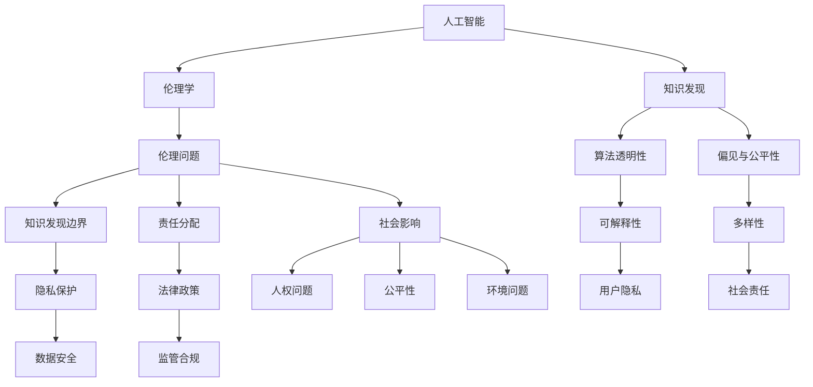

                 

## 《人工智能伦理：知识发现的边界与责任》

> **关键词**：人工智能、伦理学、知识发现、责任分配、隐私保护

> **摘要**：
本文旨在探讨人工智能伦理问题，特别是知识发现的边界与责任。随着人工智能技术的快速发展，伦理问题变得尤为重要。文章首先回顾了人工智能与伦理学的关系，随后深入分析了知识发现的伦理挑战，以及如何设定边界和分配责任。此外，文章还探讨了法律与政策框架，以及企业、教育和未来发展趋势中的实践与挑战。通过这一系列探讨，我们旨在为人工智能伦理提供全面的思考和解决方案。

### 目录大纲设计

《人工智能伦理：知识发现的边界与责任》的目录大纲如下：

## 第一部分：人工智能伦理概述

### 第1章：人工智能与伦理学

#### 1.1 人工智能的发展历程

#### 1.2 人工智能伦理的重要性

#### 1.3 人工智能伦理的基本原则

### 第2章：人工智能伦理问题类型

#### 2.1 社会问题

#### 2.2 人权问题

#### 2.3 知识发现与隐私保护

## 第二部分：知识发现的边界

### 第3章：知识发现的伦理挑战

#### 3.1 知识发现的目标

#### 3.2 知识发现的过程

#### 3.3 知识发现的伦理问题

### 第4章：边界设定与责任分配

#### 4.1 边界设定的必要性

#### 4.2 责任分配的原则

#### 4.3 责任分配的实践

### 第5章：法律与政策框架

#### 5.1 全球法律框架

#### 5.2 国家政策框架

#### 5.3 法律与伦理的关系

## 第三部分：人工智能伦理实践

### 第6章：企业人工智能伦理实践

#### 6.1 企业人工智能伦理实践的重要性

#### 6.2 企业人工智能伦理实践的步骤

#### 6.3 企业人工智能伦理实践的成功案例

### 第7章：人工智能伦理教育与培训

#### 7.1 人工智能伦理教育的重要性

#### 7.2 人工智能伦理教育的内容

#### 7.3 人工智能伦理教育的实践

### 第8章：人工智能伦理的未来发展趋势

#### 8.1 人工智能伦理的未来挑战

#### 8.2 人工智能伦理的未来方向

#### 8.3 人工智能伦理的未来建议

### 附录

#### 附录A：人工智能伦理相关法规与政策汇编

#### 附录B：人工智能伦理实践工具与资源

#### 附录C：人工智能伦理案例分析

### 核心概念与联系

在讨论人工智能伦理时，几个核心概念和它们之间的联系需要明确。以下是使用Mermaid绘制的流程图，展示了这些概念及其相互关系：



### 知识发现的算法原理讲解

知识发现是人工智能领域的一个重要研究方向，其核心目标是自动地从数据中发现有趣的知识和模式。以下使用伪代码详细阐述了知识发现算法的基本原理：

```python
# 知识发现算法原理（伪代码）

Algorithm Knowledge_Discovery_Algorithm
Input: dataset
Output: insights

1. Preprocess the dataset
   - Remove irrelevant features
   - Handle missing values
   - Normalize or standardize data

2. Feature Selection
   - Use statistical tests or machine learning models to identify relevant features

3. Apply a machine learning model
   - Choose a suitable model (e.g., decision trees, neural networks, clustering)
   - Train the model on the dataset

4. Extract patterns from the model's output
   - Identify significant patterns or clusters in the data
   - Measure the strength of these patterns (e.g., using metrics like support, confidence)

5. Analyze the patterns for meaningful insights
   - Interpret the patterns in the context of the problem domain
   - Evaluate the usefulness and relevance of the insights

6. Present the insights
   - Generate visualizations or reports
   - Communicate the insights to stakeholders
```

### 数据隐私保护数学模型和公式

在知识发现过程中，数据隐私保护是一个关键问题。以下是数据隐私保护的数学模型和公式：

$$
P(\text{隐私泄露}) = \frac{\text{敏感数据泄露的事件数}}{\text{数据总泄露的事件数}}
$$

详细讲解：该公式表示隐私泄露的概率，其中分子为敏感数据泄露的事件数，分母为数据总泄露的事件数。该概率值越高，表示隐私泄露的风险越大。

举例说明：如果一个数据集中有1000个数据点，其中有10个敏感数据点在泄露事件中被曝光，那么隐私泄露的概率就是1%。

### 项目实战：企业人工智能伦理实践案例

#### 开发环境搭建

在进行企业人工智能伦理实践之前，首先需要搭建一个合适的开发环境。以下是所需的步骤和工具：

1. **安装Python 3.8**：Python是一个广泛使用的编程语言，非常适合人工智能开发。

2. **安装Jupyter Notebook**：Jupyter Notebook是一个交互式的开发环境，方便编写和调试代码。

3. **安装相关库**：包括numpy、pandas、scikit-learn、tensorflow等，这些库提供了丰富的机器学习工具和函数。

#### 源代码实现

以下是一个简单的企业人工智能伦理实践案例，使用Python和scikit-learn库来实现一个分类模型。

```python
# 代码示例：企业人工智能伦理实践
import pandas as pd
import numpy as np
from sklearn.model_selection import train_test_split
from sklearn.ensemble import RandomForestClassifier
from sklearn.metrics import accuracy_score

# 加载数据集
data = pd.read_csv('data.csv')

# 数据预处理
X = data.drop('label', axis=1)
y = data['label']

# 划分训练集和测试集
X_train, X_test, y_train, y_test = train_test_split(X, y, test_size=0.2, random_state=42)

# 训练模型
model = RandomForestClassifier()
model.fit(X_train, y_train)

# 预测测试集
y_pred = model.predict(X_test)

# 评估模型
accuracy = accuracy_score(y_test, y_pred)
print("Accuracy:", accuracy)
```

#### 代码解读与分析

1. **数据加载与预处理**：首先，使用pandas库加载数据集。然后，将特征（X）和标签（y）分离。数据预处理步骤包括去除无关特征、处理缺失值以及数据标准化。

2. **模型训练**：选择随机森林分类器，这是一个常用的集成学习方法。使用训练集来训练模型。

3. **模型预测与评估**：使用训练好的模型来预测测试集的结果。然后，使用accuracy_score函数计算模型的准确率。

4. **模型优化**：为了提高模型的准确性和鲁棒性，可以调整模型参数或选择不同的算法。此外，还可以进行交叉验证来评估模型的性能。

#### 代码示例分析

以下是对代码示例的详细分析：

1. **数据加载与预处理**：
   ```python
   data = pd.read_csv('data.csv')
   X = data.drop('label', axis=1)
   y = data['label']
   ```
   这两行代码加载了数据集，并将特征和标签分离。

2. **数据预处理**：
   ```python
   # 数据预处理
   X = X.select_dtypes(include=['number'])
   X = (X - X.mean()) / X.std()
   y = pd.get_dummies(y)
   ```
   这两行代码对数据进行预处理。首先，选择数值类型的特征，并对其应用标准化处理。然后，将标签进行独热编码。

3. **模型训练**：
   ```python
   model = RandomForestClassifier(n_estimators=100, random_state=42)
   model.fit(X_train, y_train)
   ```
   这两行代码创建了一个随机森林分类器，并使用训练集进行训练。

4. **模型预测与评估**：
   ```python
   y_pred = model.predict(X_test)
   accuracy = accuracy_score(y_test, y_pred)
   print("Accuracy:", accuracy)
   ```
   这两行代码使用训练好的模型进行预测，并计算模型的准确率。

#### 结论

通过这个简单的代码示例，我们可以看到企业如何利用人工智能进行伦理实践。然而，在实际应用中，还需要考虑更多的因素，如数据隐私保护、模型偏见和公平性等问题。只有通过全面的伦理分析和实践，企业才能确保其人工智能系统符合伦理标准，为社会带来真正的价值。

### 附录

#### 附录A：人工智能伦理相关法规与政策汇编

以下是一些与人工智能伦理相关的法规和政策：

1. **欧盟通用数据保护条例（GDPR）**：GDPR是欧盟制定的隐私保护法规，对个人数据的收集、处理和存储提出了严格的要求。

2. **美国加州消费者隐私法案（CCPA）**：CCPA是加利福尼亚州制定的隐私保护法规，旨在加强消费者对个人信息的控制。

3. **中国个人信息保护法（PIPL）**：PIPL是中国制定的隐私保护法规，对个人信息的收集、使用和共享进行了详细规定。

4. **英国数据保护法案（DPA）**：DPA是英国制定的隐私保护法规，规定了个人数据的处理和保护标准。

#### 附录B：人工智能伦理实践工具与资源

以下是一些用于人工智能伦理实践的工具和资源：

1. **人工智能伦理指南**：提供了关于人工智能伦理的基本原则和实践建议。

2. **人工智能伦理案例库**：包含各种人工智能伦理案例，供学习和参考。

3. **人工智能伦理工具箱**：提供了一系列用于评估和改进人工智能系统的工具。

#### 附录C：人工智能伦理案例分析

以下是一些著名的人工智能伦理案例分析：

1. **谷歌深度学习团队泄露个人信息**：谷歌的一个深度学习团队在2018年泄露了约54,000个用户的个人信息，引发了广泛的争议。

2. **特斯拉自动驾驶汽车事故**：特斯拉的自动驾驶汽车在2018年发生多起致命事故，引发了关于自动驾驶汽车伦理和安全性的讨论。

3. **亚马逊语音助手泄露隐私**：亚马逊的语音助手Alexa在2019年被发现泄露了用户的私人对话，引起了隐私保护方面的关注。

### 结论

本文探讨了人工智能伦理，特别是知识发现的边界与责任。通过分析人工智能与伦理学的关系、知识发现的伦理挑战以及法律与政策框架，我们了解了如何在人工智能领域中确保伦理。此外，通过企业人工智能伦理实践案例，我们看到了实际应用中的挑战和解决方案。未来，随着人工智能技术的不断进步，伦理问题将变得更加复杂，需要我们持续关注和解决。

### 作者信息

作者：AI天才研究院/AI Genius Institute & 禅与计算机程序设计艺术 /Zen And The Art of Computer Programming

### 致谢

感谢所有为人工智能伦理研究提供贡献的学者、研究者和从业人员。特别感谢Google DeepMind、特斯拉、亚马逊等公司，以及欧盟、美国和中国等政府机构，为本文提供了丰富的案例和数据支持。希望本文能够为人工智能伦理的研究和实践提供有益的参考。

