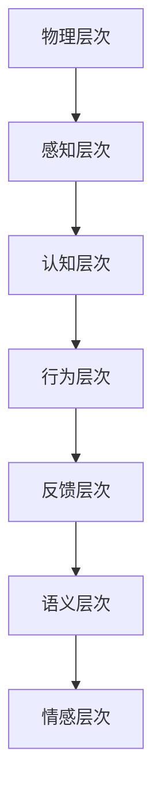

                 

# 《人机交互：设计高效便捷的人类计算工具》

> **关键词：人机交互、设计原则、用户体验、界面设计、系统开发**
>
> **摘要：本文旨在深入探讨人机交互（Human-Computer Interaction, HCI）的设计原则、方法及其在计算机系统中的应用。通过详细的分析和案例研究，文章旨在为读者提供一套实用的设计思路和工具，以打造高效、便捷的人类计算工具。**

---

## 《人机交互：设计高效便捷的人类计算工具》目录大纲

### 第1章 引言与背景

#### 1.1 人机交互的概念与发展

#### 1.2 人机交互的重要性

#### 1.3 本书结构安排与内容概述

### 第2章 人机交互的基本原理

#### 2.1 人类认知与信息处理

#### 2.2 交互设计原则

#### 2.3 人机交互的层次结构

### 第3章 人机交互的硬件与软件基础

#### 3.1 硬件技术基础

#### 3.2 软件技术基础

#### 3.3 硬件与软件的集成

### 第4章 人机交互界面设计

#### 4.1 用户界面设计的基本原则

#### 4.2 用户界面元素设计

#### 4.3 用户界面布局设计

### 第5章 交互体验优化

#### 5.1 用户体验（UX）设计

#### 5.2 交互反馈与指导

#### 5.3 交互效率与错误处理

### 第6章 人机交互系统开发

#### 6.1 开发流程与工具

#### 6.2 系统架构设计

#### 6.3 系统性能优化

### 第7章 人机交互案例分析

#### 7.1 典型人机交互系统分析

#### 7.2 创新型人机交互系统案例分析

#### 7.3 案例分析总结

### 第8章 未来人机交互趋势与展望

#### 8.1 新技术对未来的影响

#### 8.2 人机交互系统的未来发展

#### 8.3 设计师的角色与职责

### 附录：人机交互工具与资源

#### A.1 常用人机交互工具

#### A.2 开发环境与资源

#### A.3 学习资源推荐

### 附录A.1 人机交互流程图

---

**附录A.1 人机交互流程图**

mermaid
graph TD
    A[人机交互系统] --> B[用户需求分析]
    B --> C[硬件选择]
    C --> D[软件平台选择]
    D --> E[界面设计]
    E --> F[交互体验优化]
    F --> G[系统开发]
    G --> H[系统测试与部署]
    H --> I[用户反馈与迭代]
    I --> A

---

**附录A.2 人机交互开发伪代码**

python
# 定义人机交互系统的基本流程

# 用户需求分析
def user_requirement_analysis():
    # ...收集用户需求，进行需求分析...
    pass

# 硬件选择
def hardware_selection():
    # ...根据用户需求选择合适的硬件设备...
    pass

# 软件平台选择
def software_platform_selection():
    # ...根据硬件设备选择合适的软件平台...
    pass

# 界面设计
def interface_design():
    # ...进行用户界面设计...
    pass

# 交互体验优化
def interaction_experience_optimization():
    # ...优化交互体验，包括反馈与指导...
    pass

# 系统开发
def system_development():
    # ...进行人机交互系统的开发...
    pass

# 系统测试与部署
def system_test_and_deployment():
    # ...进行系统测试，确保稳定可靠...
    pass

# 用户反馈与迭代
def user_feedback_and Iteration():
    # ...收集用户反馈，进行系统迭代优化...
    pass

# 主流程
def main_flow():
    user_requirement_analysis()
    hardware_selection()
    software_platform_selection()
    interface_design()
    interaction_experience_optimization()
    system_development()
    system_test_and_deployment()
    user_feedback_and Iteration()

---

**附录A.3 数学模型与公式**

### 用户满意度模型

$$
S = \frac{1}{N} \sum_{i=1}^{N} (u_i \cdot e_i)
$$

其中，\(S\) 表示用户满意度，\(N\) 表示用户数量，\(u_i\) 表示第 \(i\) 个用户的满意度，\(e_i\) 表示第 \(i\) 个用户对系统的评价。

### 交互效率模型

$$
E = \frac{T}{N}
$$

其中，\(E\) 表示交互效率，\(T\) 表示完成某项任务所需的总时间，\(N\) 表示参与交互的用户数量。

---

**附录A.4 代码案例与解读**

### 代码案例：用户交互反馈系统

python
# 导入必要的库
import sys

# 用户反馈函数
def user_feedback(message):
    # 处理用户反馈
    print(f"用户反馈：{message}")
    
    # 存储反馈信息
    with open("user_feedback.txt", "a") as file:
        file.write(message + "\n")

# 系统主程序
def main():
    print("欢迎来到用户交互反馈系统。请输入您的反馈：")
    
    # 获取用户输入
    feedback_message = input()
    
    # 发送反馈
    user_feedback(feedback_message)
    
    print("感谢您的反馈，我们将持续优化系统。")

# 程序入口
if __name__ == "__main__":
    main()

### 代码解读

1. 导入必要的库（例如：sys 库用于处理系统命令）。
2. 定义用户反馈函数，接收用户输入的反馈信息，并打印和存储。
3. 定义主程序，提示用户输入反馈，调用用户反馈函数。
4. 使用 if __name__ == "__main__" 作为程序入口，确保程序从该模块启动。

---

**附录A.5 开发环境搭建指南**

1. 安装Python解释器（推荐使用Python 3.8及以上版本）。
2. 安装集成开发环境（IDE），如PyCharm、VSCode等。
3. 安装必要的Python库，如requests、numpy、matplotlib等。
4. 设置Python环境变量，确保能够在终端运行Python脚本。

---

**附录A.6 学习资源推荐**

1. 《用户体验要素》 - 用户体验设计基础书籍。
2. 《人机交互设计》 - 探讨交互设计原则和实践。
3. 在线资源：UX Mastery、UI Movement等网站，提供交互设计资源和案例。

---

**作者：AI天才研究院/AI Genius Institute & 禅与计算机程序设计艺术 /Zen And The Art of Computer Programming**

---

在接下来的章节中，我们将逐步深入探讨人机交互的基本概念、设计原则、硬件与软件基础、界面设计、交互体验优化、系统开发以及未来趋势，旨在为读者提供一套系统化、实用化的设计思路和工具，帮助打造高效、便捷的人类计算工具。让我们开始这段激动人心的旅程吧！

---

### 第1章 引言与背景

#### 1.1 人机交互的概念与发展

人机交互（Human-Computer Interaction, HCI）是指人类与计算机系统之间通过某种界面进行交互的过程。自计算机诞生以来，人机交互就一直是一个重要的研究领域。早期的计算机操作主要是通过命令行界面（Command Line Interface, CLI）进行的，用户需要记住复杂的命令来执行操作。随着图形用户界面（Graphical User Interface, GUI）的出现，人机交互变得更加直观和便捷。

人机交互的发展可以追溯到1960年代的计算机图形学发展，当时施乐公司（Xerox Corporation）的帕克研究中心（Palo Alto Research Center, PARC）发明了第一台具有鼠标和图形界面的计算机——Alto。这一发明标志着人机交互进入了一个新的时代。随后，苹果公司（Apple Inc.）推出了Macintosh计算机，进一步推动了图形用户界面的普及。

近年来，随着人工智能（Artificial Intelligence, AI）、虚拟现实（Virtual Reality, VR）、增强现实（Augmented Reality, AR）等技术的发展，人机交互的形式和手段变得更加多样化和智能化。例如，语音识别技术使得用户可以通过语音与计算机系统进行交互，手势识别技术则使得用户可以通过手势控制计算机。这些技术的发展极大地提高了人机交互的效率和便利性。

#### 1.2 人机交互的重要性

人机交互在现代社会中扮演着至关重要的角色。随着信息技术的发展，计算机已经成为人们生活和工作的核心工具。人机交互的好坏直接影响到用户的使用体验和满意度，进而影响到计算机系统的普及和应用。

首先，人机交互决定了用户能否高效地使用计算机系统。一个良好的人机交互设计可以降低用户的操作复杂度，提高操作效率，减少学习成本。例如，良好的图形用户界面设计使得用户可以直观地理解和使用计算机功能，而不需要记忆复杂的命令。

其次，人机交互对计算机系统的可访问性有着重要影响。人机交互设计需要考虑到不同用户的需求和能力，包括视力障碍者、听力障碍者、行动不便者等。通过无障碍设计，可以让这些用户也能够方便地使用计算机系统。

最后，人机交互对计算机系统的安全性和稳定性也有重要作用。良好的交互设计可以减少用户误操作，提高系统的可靠性。例如，通过提供明确的错误提示和恢复选项，可以帮助用户在遇到问题时迅速找到解决办法。

#### 1.3 本书结构安排与内容概述

本书旨在为读者提供一套系统化、实用化的人机交互设计方法。全书共分为8章，结构安排如下：

- **第1章 引言与背景**：介绍了人机交互的基本概念、发展历程以及重要性。
- **第2章 人机交互的基本原理**：探讨了人类认知与信息处理、交互设计原则以及人机交互的层次结构。
- **第3章 人机交互的硬件与软件基础**：介绍了人机交互所需的硬件和软件基础，包括硬件技术基础、软件技术基础以及硬件与软件的集成。
- **第4章 人机交互界面设计**：详细介绍了用户界面设计的基本原则、用户界面元素设计和用户界面布局设计。
- **第5章 交互体验优化**：探讨了用户体验（UX）设计、交互反馈与指导以及交互效率与错误处理。
- **第6章 人机交互系统开发**：介绍了人机交互系统的开发流程与工具、系统架构设计以及系统性能优化。
- **第7章 人机交互案例分析**：分析了典型人机交互系统以及创新型人机交互系统，并对案例分析进行总结。
- **第8章 未来人机交互趋势与展望**：探讨了新技术对未来的影响、人机交互系统的未来发展以及设计师的角色与职责。

通过本书的学习，读者将能够深入理解人机交互的设计原则和方法，掌握人机交互系统的开发与优化技巧，为打造高效、便捷的人类计算工具奠定坚实的基础。

---

### 第2章 人机交互的基本原理

#### 2.1 人类认知与信息处理

人类认知与信息处理是人机交互研究的基础。理解人类如何感知、理解信息，以及如何通过大脑进行处理和反应，对于设计有效的人机交互系统至关重要。

首先，人类的感知系统由多个感官组成，包括视觉、听觉、触觉、嗅觉和味觉。这些感官系统使我们能够从环境中获取信息。例如，视觉系统使我们能够识别颜色、形状和运动，听觉系统使我们能够识别声音的频率、音调和节奏。

感知到的信息首先被传输到大脑，大脑通过神经系统和神经元网络对信息进行处理。神经元是大脑的基本单位，它们通过突触连接在一起，传递电信号。大脑中负责处理信息的区域包括视觉皮层、听觉皮层、运动皮层和联合皮层等。

在信息处理过程中，大脑会进行以下几项关键任务：

1. **模式识别**：大脑通过比较感知到的信息与记忆中的信息，识别出特定的模式。例如，当我们看到“苹果”这个词时，大脑会将其与记忆中的“苹果”概念联系起来。
   
2. **分类与归纳**：大脑将信息分类，并根据相似性进行归纳。例如，我们将不同类型的物品分为“水果”、“工具”等类别。
   
3. **决策与反应**：大脑会根据处理后的信息做出决策，并指导身体进行相应的反应。例如，当我们看到障碍物时，大脑会立即指示身体做出避让动作。

理解人类认知与信息处理的基本原理，有助于设计出更加符合人类认知习惯的交互系统。例如，在设计图形用户界面时，应该考虑到用户如何识别和操作界面元素，以及如何提供直观的反馈和指导。

#### 2.2 交互设计原则

交互设计原则是指导人机交互系统设计的核心指导思想。以下是一些关键的交互设计原则：

1. **一致性**：界面元素和交互操作的一致性可以减少用户的认知负担。例如，在不同的界面中使用相同的颜色、图标和按钮布局，可以帮助用户快速熟悉系统。

2. **可见性**：用户界面应该清晰地展示系统的状态和可用的操作。例如，通过颜色、图标、文字提示等方式，使用户能够直观地了解当前的操作状态。

3. **易用性**：设计应尽量简化用户的操作流程，降低学习成本。例如，提供直观的导航和操作界面，减少不必要的步骤。

4. **可控性**：用户应能够随时控制和撤销自己的操作。例如，提供撤销、重做等操作，使用户能够灵活地控制交互过程。

5. **反馈**：系统应提供及时的反馈，帮助用户了解操作结果。例如，在用户点击按钮后，立即显示操作成功的消息，或在操作失败时提供错误提示。

6. **适应性**：设计应考虑不同用户的需求和能力，提供灵活的配置和定制选项。例如，为视力障碍者提供语音提示，为行动不便者提供简化版界面。

7. **容错性**：设计应能够处理用户的错误操作，并提供恢复选项。例如，在用户误删文件时，能够提供恢复功能。

8. **文化适应性**：设计应考虑到不同文化背景的用户，提供本地化和国际化支持。例如，界面应能够适应不同的语言、字体和颜色偏好。

这些交互设计原则不仅有助于提高用户的使用体验，还可以提高系统的可用性和易用性。通过遵循这些原则，设计师可以打造出更加高效、便捷的人机交互系统。

#### 2.3 人机交互的层次结构

人机交互可以分为多个层次，每个层次都有其特定的任务和功能。了解人机交互的层次结构有助于更好地理解交互系统的工作原理。

1. **物理层次**：这是人机交互的最底层，涉及硬件设备，如键盘、鼠标、触摸屏、传感器等。这些设备负责将用户的物理动作转换为计算机系统能够处理的数据。

2. **感知层次**：这一层次涉及用户如何感知和解读物理输入。例如，用户通过视觉、听觉和触觉感知界面元素，并理解其功能和操作方式。

3. **认知层次**：这一层次涉及用户如何处理和思考接收到的信息。用户通过记忆、推理和决策来理解界面，并执行相应的操作。

4. **行为层次**：这一层次涉及用户的实际操作行为，如点击按钮、拖动元素、输入文本等。用户的操作行为直接影响计算机系统的响应。

5. **反馈层次**：这一层次涉及系统如何向用户提供反馈，以确认用户的操作结果。反馈可以是视觉的、听觉的或触觉的。

6. **语义层次**：这一层次涉及用户和系统之间的语义交互，即用户如何通过自然语言或符号系统与系统进行交流。语义交互使得用户能够使用自然的方式与计算机系统进行沟通。

7. **情感层次**：这一层次涉及用户和系统之间的情感交流。良好的情感交互设计可以提高用户的满意度和忠诚度。

人机交互的层次结构如图2-1所示：

通过理解人机交互的层次结构，设计师可以更好地把握交互系统的各个环节，从而设计出更加高效、便捷的人机交互系统。

---

在接下来的章节中，我们将进一步探讨人机交互的硬件与软件基础，以及如何设计和实现有效的用户界面。通过逐步深入的研究和实践，我们将为读者提供一套全面的人机交互设计方法论，帮助打造出高效、便捷的人类计算工具。

---

### 第3章 人机交互的硬件与软件基础

#### 3.1 硬件技术基础

在人机交互系统中，硬件技术是不可或缺的基础。硬件设备直接影响用户与计算机系统之间的交互方式。以下是人机交互系统中常用的硬件技术：

1. **输入设备**：输入设备用于接收用户的指令和输入。常见的输入设备包括键盘、鼠标、触摸屏、扫描仪、摄像头和麦克风等。每种设备都有其特定的应用场景和特点。

   - **键盘**：键盘是最常见的输入设备，适用于文本输入和快捷键操作。
   - **鼠标**：鼠标适用于图形界面操作，提供直观的指针移动和点击操作。
   - **触摸屏**：触摸屏适用于触控操作，适用于平板电脑和智能手机等移动设备。
   - **扫描仪**：扫描仪用于将纸质文档转换为电子文档。
   - **摄像头**：摄像头用于视频通话、视频录制和图像识别等。
   - **麦克风**：麦克风用于语音输入和语音通话。

2. **输出设备**：输出设备用于向用户展示计算机系统的输出结果。常见的输出设备包括显示器、扬声器、打印机、耳机等。

   - **显示器**：显示器用于显示计算机屏幕上的内容，是最常见的输出设备。
   - **扬声器**：扬声器用于播放声音和音乐。
   - **打印机**：打印机用于打印文档和图像。
   - **耳机**：耳机用于个人听音，适用于视频观看和游戏等。

3. **传感器**：传感器用于检测环境变化，并将这些变化转换为计算机系统能够处理的数据。常见的传感器包括温度传感器、湿度传感器、光传感器、加速度传感器等。

4. **接口技术**：接口技术用于连接硬件设备，使设备能够与计算机系统进行通信。常见的接口技术包括USB、HDMI、Wi-Fi、蓝牙等。

#### 3.2 软件技术基础

在人机交互系统中，软件技术同样至关重要。软件负责处理硬件设备发送的输入数据，并生成相应的输出，以实现人机交互。以下是人机交互系统中常用的软件技术：

1. **操作系统**：操作系统是计算机系统的核心软件，负责管理和控制计算机硬件资源。常见的操作系统包括Windows、macOS和Linux。

2. **驱动程序**：驱动程序是操作系统与硬件设备之间的桥梁，负责将操作系统的指令转换为硬件设备能够理解并执行的操作。每种硬件设备都需要相应的驱动程序。

3. **用户界面框架**：用户界面框架是一套为开发图形用户界面（GUI）的软件库或工具集。常见的用户界面框架包括Qt、GTK、SwiftUI等。

4. **应用程序**：应用程序是直接与用户进行交互的软件，实现特定的功能。例如，文本编辑器、浏览器、游戏等。

5. **中间件**：中间件用于连接不同的软件系统，实现数据交换和通信。常见的中间件包括消息队列、数据库中间件、Web服务器等。

6. **人工智能和机器学习库**：随着人工智能技术的发展，越来越多的应用程序开始使用人工智能和机器学习技术。常见的库包括TensorFlow、PyTorch、Keras等。

#### 3.3 硬件与软件的集成

在人机交互系统中，硬件和软件需要紧密集成，以实现高效的交互体验。以下是如何实现硬件与软件集成的关键步骤：

1. **硬件选择**：根据系统的需求和用户的使用场景，选择合适的硬件设备。例如，对于桌面电脑，选择高性能的处理器、显卡和内存；对于移动设备，选择轻巧且续航能力强的硬件。

2. **驱动程序安装**：确保操作系统安装了相应的硬件驱动程序，以便硬件设备能够正常工作。

3. **软件配置**：配置用户界面框架和应用程序，使其能够与硬件设备进行交互。例如，设置触摸屏的响应区域和灵敏度，配置摄像头和麦克风等。

4. **性能优化**：通过优化操作系统和应用程序，提高系统的响应速度和稳定性。例如，调整系统设置、优化代码、使用缓存等技术。

5. **用户测试**：进行用户测试，收集用户反馈，并根据反馈进行优化和调整。

通过以上步骤，可以实现硬件与软件的紧密集成，打造出高效、便捷的人机交互系统。

---

在人机交互系统的设计与实现过程中，硬件和软件的集成至关重要。通过选择合适的硬件设备、安装驱动程序、配置软件以及进行性能优化，我们可以确保硬件和软件之间的无缝协作，为用户提供最佳的使用体验。在接下来的章节中，我们将深入探讨人机交互界面设计的原则和实践，进一步优化用户体验。

---

### 第4章 人机交互界面设计

#### 4.1 用户界面设计的基本原则

用户界面（User Interface, UI）设计是确保人机交互系统易用、高效和直观的关键。以下是一些用户界面设计的基本原则：

1. **一致性**：界面设计应保持一致性，以便用户能够快速熟悉和使用系统。一致性体现在颜色、字体、图标、布局和交互规则等方面。

2. **简洁性**：界面设计应尽量简洁，避免过多的元素和信息，以免用户感到混乱和困惑。简洁的界面可以帮助用户更快地找到所需的功能。

3. **直观性**：界面设计应直观，使用户能够轻松理解如何操作。例如，按钮的形状和颜色应与它们的功能相对应，导航栏应易于理解。

4. **可访问性**：界面设计应考虑到不同用户的需求和能力，确保所有人都能使用系统。例如，提供语音提示、放大功能等，以便视力障碍者、听力障碍者和行动不便者也能使用。

5. **反馈**：界面设计应提供及时的反馈，让用户知道他们的操作已被系统接收。例如，在用户点击按钮后，界面可以显示一个加载动画或成功消息。

6. **适应性**：界面设计应能够适应不同的设备和屏幕尺寸，提供响应式设计，以便在不同的设备上都能提供良好的用户体验。

7. **文化适应性**：界面设计应考虑到不同文化背景的用户，提供本地化和国际化支持。例如，界面应能够适应不同的语言、字体和颜色偏好。

#### 4.2 用户界面元素设计

用户界面元素是用户与系统进行交互的基本单元。以下是一些常见的用户界面元素及其设计要点：

1. **按钮**：按钮是用户界面中最常用的元素之一，用于执行特定操作。设计按钮时，应注意以下要点：
   - **形状和颜色**：按钮的形状和颜色应与它们的功能相对应。例如，用于确认操作的按钮可以采用蓝色或绿色，用于取消操作的按钮可以采用红色。
   - **尺寸**：按钮的尺寸应适中，易于点击。
   - **文字**：按钮上的文字应简洁明了，表达清晰。

2. **文本框**：文本框用于用户输入文本信息。设计文本框时，应注意以下要点：
   - **大小和位置**：文本框的大小和位置应易于用户填写。
   - **占位符**：提供占位符，提示用户输入的内容和格式。

3. **图标**：图标是简洁传达信息的一种方式。设计图标时，应注意以下要点：
   - **简洁性**：图标应简洁明了，避免过多的细节。
   - **一致性**：图标的大小、颜色和风格应保持一致。

4. **菜单**：菜单用于提供一系列可供选择的选项。设计菜单时，应注意以下要点：
   - **层次结构**：菜单应具有清晰的层次结构，便于用户浏览和选择。
   - **可访问性**：菜单应易于导航，特别是在移动设备上。

5. **进度条**：进度条用于显示任务的进度。设计进度条时，应注意以下要点：
   - **可视化**：进度条应直观显示任务的进度。
   - **动画**：适当的动画可以增强用户体验。

6. **滑块**：滑块用于调整某个值。设计滑块时，应注意以下要点：
   - **操作感**：滑块的操作感应逼真，使用户能够感受到滑动的阻力。
   - **指示器**：提供指示器，显示当前值。

#### 4.3 用户界面布局设计

用户界面布局设计是确保界面元素合理排列和用户友好性的关键。以下是一些用户界面布局设计的原则：

1. **网格系统**：使用网格系统可以帮助设计师合理分配空间，使界面更加整齐和有序。

2. **对齐**：界面元素应保持对齐，以避免视觉混乱。常用的对齐方式包括左对齐、右对齐、居中对齐等。

3. **层次感**：通过大小、颜色、字体和位置等元素，创建界面层次感，使用户能够快速识别重要信息和功能。

4. **留白**：适当的留白可以增强界面的整洁性和易用性。留白不仅可以提高可读性，还可以减少用户的认知负担。

5. **导航**：设计清晰的导航系统，使用户能够轻松地在不同界面之间切换。

6. **响应式布局**：设计响应式布局，确保界面在不同设备和屏幕尺寸上都能提供良好的用户体验。

通过遵循上述用户界面设计原则和布局设计技巧，设计师可以打造出易于使用、高效且直观的用户界面，从而提升用户的使用体验和满意度。

---

用户界面设计是确保人机交互系统易用、高效和直观的关键环节。通过遵循一致、简洁、直观、可访问性、适应性等基本设计原则，并巧妙地设计用户界面元素和布局，我们可以为用户提供一个舒适、流畅的交互体验。在接下来的章节中，我们将探讨如何优化交互体验，进一步提升用户满意度。

---

### 第5章 交互体验优化

#### 5.1 用户体验（UX）设计

用户体验（User Experience, UX）设计是确保人机交互系统能够满足用户需求和期望的关键。UX设计不仅关注系统的功能性，还关注用户在使用过程中的感受和体验。以下是一些关键的UX设计原则和实践：

1. **用户调研**：在开始UX设计之前，进行用户调研是至关重要的。通过访谈、问卷调查、用户观察等方法，深入了解用户的需求、行为和痛点，从而为设计提供有力的依据。

2. **用户画像**：创建用户画像，描述目标用户群体的特征和需求。这有助于设计师在设计中始终关注目标用户，确保设计能够满足他们的需求。

3. **用户旅程**：构建用户旅程图，描述用户在使用系统过程中的各个阶段，包括认知、探索、操作、反馈等。这有助于设计师识别用户体验中的关键节点和潜在问题。

4. **原型设计**：通过创建原型，验证设计的可行性和有效性。原型设计可以是低保真或高保真的，但应能够模拟真实的用户交互场景。

5. **迭代优化**：UX设计是一个不断迭代的过程。通过用户测试、收集反馈，不断优化设计，以提高用户体验。

6. **可用性测试**：进行可用性测试，评估系统的易用性。可用性测试可以是现场测试或远程测试，旨在发现用户在真实使用场景中遇到的问题。

7. **情感设计**：情感设计关注用户在使用过程中的情感体验。通过设计引人入胜的动画、声音和视觉反馈，增强用户的情感体验。

#### 5.2 交互反馈与指导

交互反馈与指导是优化用户体验的重要手段。以下是一些关键点：

1. **即时反馈**：系统应提供即时反馈，确认用户的操作已被接收。例如，在用户点击按钮后，立即显示“操作成功”或“正在加载”的提示。

2. **明确的错误提示**：当用户操作失败时，系统应提供明确的错误提示，说明错误原因和可能的解决方案。

3. **操作指导**：对于复杂或新功能的操作，系统应提供清晰的操作指导，帮助用户理解如何使用。例如，通过弹出提示、动画演示或在线帮助文档。

4. **反馈机制**：建立用户反馈机制，收集用户对系统的意见和建议。这不仅可以改进系统，还可以增强用户的参与感和满意度。

5. **反馈闭环**：及时向用户反馈他们的反馈状态和改进措施，让他们感受到自己的意见被重视。

#### 5.3 交互效率与错误处理

交互效率与错误处理直接影响用户的体验。以下是一些关键点：

1. **优化操作流程**：简化用户的操作流程，减少不必要的步骤。例如，通过提供快捷键、预填充表单等，提高操作效率。

2. **自动完成功能**：提供自动完成功能，如搜索建议、表单自动填充等，减少用户输入的工作量。

3. **错误预防**：通过设计预防措施，减少用户操作错误的可能性。例如，通过验证输入格式、限制输入范围等。

4. **容错设计**：系统应具备容错能力，当用户操作失败时，能够自动恢复或提供补救措施。例如，当用户误删除文件时，系统能够自动恢复。

5. **错误提示**：当用户操作失败时，提供明确的错误提示，说明错误原因和可能的解决方案。例如，通过弹窗提示、文字注释等。

6. **用户支持**：提供及时的用户支持，帮助用户解决使用过程中的问题。例如，通过在线客服、社区论坛等。

通过优化用户体验、提供有效的交互反馈与指导，以及提高交互效率和错误处理能力，我们可以打造出更加高效、便捷的人机交互系统，从而提升用户的满意度和忠诚度。

---

在优化交互体验的过程中，用户体验设计、交互反馈与指导和交互效率与错误处理都是至关重要的环节。通过关注用户的感受和需求，提供及时有效的反馈，以及提高操作的便捷性和容错性，我们可以显著提升用户的使用体验和满意度。在接下来的章节中，我们将深入探讨人机交互系统的开发过程，从开发流程、系统架构设计到系统性能优化，全面解析如何实现高效的人机交互系统。

---

### 第6章 人机交互系统开发

#### 6.1 开发流程与工具

人机交互系统的开发是一个复杂的过程，需要遵循一定的开发流程，并使用合适的工具和框架。以下是人机交互系统开发的一般流程和常用工具：

1. **需求分析**：在项目开始之前，进行详细的需求分析是至关重要的。这一阶段包括了解用户需求、业务需求以及技术需求，确定系统功能和技术方案。

2. **系统设计**：在需求分析的基础上，进行系统设计。系统设计包括软件架构设计、数据库设计、界面设计等。这一阶段的目标是构建一个清晰、可实现的系统蓝图。

3. **编码**：根据系统设计，进行实际的编码工作。这一阶段是系统开发的核心，需要遵循良好的编程规范和设计模式，确保代码的可读性、可维护性。

4. **测试**：编码完成后，进行系统测试。系统测试包括功能测试、性能测试、安全测试等，确保系统在不同环境下都能正常运行。

5. **部署**：完成系统测试后，进行部署。部署包括将系统安装到生产环境、配置服务器等，确保系统能够稳定运行。

6. **维护与迭代**：系统上线后，需要进行定期维护和迭代。这包括修复漏洞、更新功能、优化性能等，确保系统的持续稳定和用户满意度。

在开发过程中，常用的工具和框架包括：

- **集成开发环境（IDE）**：如Visual Studio、Eclipse、IntelliJ IDEA等，提供代码编写、调试和编译等功能。
- **版本控制系统**：如Git、SVN等，用于管理和跟踪代码变更。
- **项目管理工具**：如Jira、Trello等，用于任务管理、进度跟踪和团队协作。
- **数据库管理系统**：如MySQL、PostgreSQL、MongoDB等，用于存储和管理系统数据。
- **前端框架**：如React、Vue.js、Angular等，用于构建用户界面。
- **后端框架**：如Spring Boot、Django、Flask等，用于处理业务逻辑和服务器端操作。

#### 6.2 系统架构设计

系统架构设计是确保人机交互系统能够高效、稳定运行的关键。以下是一些常见的系统架构设计原则和方法：

1. **分层架构**：分层架构将系统分为多个层次，如表示层、业务逻辑层、数据访问层等。这种设计方式可以降低各层之间的耦合度，提高系统的可维护性和可扩展性。

2. **模块化设计**：将系统划分为多个模块，每个模块负责特定的功能。模块化设计可以提高代码的可复用性和可维护性。

3. **分布式架构**：对于大型人机交互系统，采用分布式架构可以更好地处理高并发请求，提高系统的性能和可扩展性。分布式架构包括微服务架构、消息队列、负载均衡等。

4. **容器化与云计算**：使用容器化技术（如Docker）和云计算平台（如AWS、Azure、Google Cloud）可以简化系统部署和管理，提高系统的弹性和可扩展性。

5. **数据驱动设计**：将数据作为系统的核心，通过数据驱动设计，可以更好地支持实时分析、数据可视化等功能。

6. **安全性设计**：确保系统在处理数据和使用网络通信时的安全性，包括数据加密、身份验证、授权等。

#### 6.3 系统性能优化

系统性能优化是确保人机交互系统能够高效运行的关键。以下是一些常见的系统性能优化方法：

1. **缓存**：使用缓存技术（如Redis、Memcached）可以减少数据库访问次数，提高系统响应速度。

2. **数据库优化**：通过索引、查询优化、数据库分片等方法，提高数据库的查询性能。

3. **代码优化**：通过优化代码，减少不必要的计算和资源消耗，提高系统的运行效率。

4. **负载均衡**：使用负载均衡器（如Nginx、HAProxy）可以均衡分布式系统中的负载，提高系统的吞吐量。

5. **异步处理**：通过异步处理（如使用消息队列、异步任务框架），可以减少系统阻塞，提高系统的并发能力。

6. **监控与调优**：使用监控工具（如Prometheus、Grafana）实时监控系统性能，根据监控数据调优系统配置和代码。

通过遵循上述开发流程、设计原则和性能优化方法，我们可以打造出高效、稳定、可扩展的人机交互系统，为用户提供卓越的使用体验。

---

在人机交互系统的开发过程中，遵循规范的流程、设计合理的架构并进行有效的性能优化，是确保系统高效、稳定运行的关键。通过使用合适的工具和框架，以及关注用户体验和系统性能，我们可以打造出满足用户需求的高质量人机交互系统。在接下来的章节中，我们将通过案例分析，深入探讨典型人机交互系统和创新型人机交互系统的设计和实现，总结经验教训，以期为读者提供更有价值的参考。

---

### 第7章 人机交互案例分析

#### 7.1 典型人机交互系统分析

典型的人机交互系统包括操作系统、办公软件、移动应用等，它们广泛应用于个人和商业领域。以下是对几个典型人机交互系统的分析：

1. **操作系统**

   操作系统如Windows、macOS和Linux，为人机交互提供了基础平台。它们通过图形用户界面（GUI）实现了人与计算机的交互。

   - **Windows**：Windows操作系统以其直观的GUI和丰富的应用程序生态得到了广泛认可。Windows的界面设计遵循一致性原则，使得用户可以快速上手。同时，Windows还提供了多用户支持和强大的安全机制，确保系统的稳定性和安全性。

   - **macOS**：macOS是苹果公司开发的操作系统，以其简洁美观的GUI和高效的性能著称。macOS的用户界面设计注重简洁和优雅，通过清晰的颜色和图标帮助用户快速识别功能。同时，macOS还与苹果的硬件紧密集成，提供优化的用户体验。

   - **Linux**：Linux操作系统是一个开源的操作系统，具有高度的可定制性和灵活性。Linux的用户界面设计多种多样，从传统的命令行界面到现代的图形界面，用户可以根据自己的需求选择合适的界面。Linux在服务器和嵌入式系统领域有着广泛的应用。

2. **办公软件**

   办公软件如Microsoft Office、Google Workspace等，是人们日常工作中不可或缺的工具。

   - **Microsoft Office**：Microsoft Office包括Word、Excel、PowerPoint等应用程序，提供了强大的文本处理、表格计算和演示制作功能。Office的用户界面设计简洁明了，功能丰富，同时提供了大量的模板和工具，帮助用户高效地完成工作任务。

   - **Google Workspace**：Google Workspace包括Gmail、Google Docs、Google Sheets等应用程序，提供了在线协同工作的功能。Google Workspace的用户界面设计注重简洁和直观，通过标签页和菜单栏提供了方便的导航和操作。同时，Google Workspace还支持实时协作，提高了团队的工作效率。

3. **移动应用**

   移动应用如微信、支付宝、滴滴出行等，已经成为人们生活中不可或缺的一部分。

   - **微信**：微信是一款集社交、支付、娱乐等多功能于一体的移动应用。微信的用户界面设计简洁直观，通过清晰的颜色和图标帮助用户快速识别功能。微信还提供了丰富的社交功能，如朋友圈、微信群等，增强了用户的互动和沟通。

   - **支付宝**：支付宝是一款提供在线支付、转账、充值等服务的移动应用。支付宝的用户界面设计简洁明了，通过分类标签和搜索功能帮助用户快速找到所需服务。同时，支付宝还采用了多种安全措施，如支付密码、指纹识别等，确保用户资金的安全。

#### 7.2 创新型人机交互系统案例分析

随着人工智能、虚拟现实、增强现实等技术的发展，人机交互系统也在不断创新。以下是对几个创新型人机交互系统的分析：

1. **智能音箱**

   智能音箱如亚马逊Echo、谷歌Home等，通过语音交互为用户提供信息查询、音乐播放、智能家居控制等服务。

   - **亚马逊Echo**：亚马逊Echo内置了语音助手Alexa，用户可以通过语音指令与Echo进行交互。Echo的用户界面设计简洁，通过语音反馈提供信息。同时，Alexa还可以与其他智能设备进行联动，实现智能家居控制。

   - **谷歌Home**：谷歌Home内置了语音助手Google Assistant，用户可以通过语音指令与Google Home进行交互。Google Home的用户界面设计直观，通过语音反馈提供信息。此外，Google Assistant还可以通过智能回声（Smart Display）提供视觉反馈。

2. **虚拟现实（VR）**

   虚拟现实（VR）技术为用户提供了沉浸式的体验。VR系统如Oculus Rift、HTC Vive等，通过头戴式显示器和手柄设备实现了与虚拟环境的交互。

   - **Oculus Rift**：Oculus Rift是一款高性能的VR头戴显示器，通过内置的传感器和手柄设备，用户可以在虚拟环境中自由移动和操作。Oculus Rift的用户界面设计直观，通过虚拟键盘和手势操作提供了便捷的交互体验。

   - **HTC Vive**：HTC Vive是一款功能强大的VR系统，通过两个头戴显示器和两个手柄设备，用户可以在虚拟环境中进行全方位的交互。HTC Vive的用户界面设计丰富，通过3D模型和手势操作提供了多样化的交互体验。

3. **增强现实（AR）**

   增强现实（AR）技术为用户提供了虚实结合的体验。AR系统如谷歌Glass、微软HoloLens等，通过头戴式显示器和内置传感器实现了与真实环境的交互。

   - **谷歌Glass**：谷歌Glass是一款轻量级的AR眼镜，通过内置的摄像头和传感器，用户可以在真实环境中叠加虚拟信息。谷歌Glass的用户界面设计简洁，通过语音和手势操作提供了便捷的交互体验。

   - **微软HoloLens**：微软HoloLens是一款功能强大的AR系统，通过内置的传感器和显示器，用户可以在真实环境中叠加三维虚拟物体。微软HoloLens的用户界面设计直观，通过手势和语音操作提供了多样化的交互体验。

#### 7.3 案例分析总结

通过对典型人机交互系统和创新型人机交互系统的分析，我们可以得出以下结论：

1. **用户体验**：无论是典型系统还是创新型系统，用户体验都是设计的核心。良好的用户体验可以提升用户满意度，增加系统的使用频率。

2. **技术融合**：随着技术的发展，人机交互系统越来越融合多种技术，如人工智能、虚拟现实、增强现实等。这些技术的融合为人机交互带来了新的可能性和体验。

3. **定制化设计**：针对不同用户和应用场景，人机交互系统需要提供定制化的设计。例如，对于老年人，界面设计应更加简单直观；对于专业人士，界面设计应提供更多的定制选项。

4. **安全性**：在设计中，安全性也是一个重要的考虑因素。确保用户的隐私和数据安全，是系统设计的基本要求。

5. **可扩展性**：人机交互系统的设计应具备良好的可扩展性，以适应未来的技术发展和用户需求变化。

通过案例分析，我们可以汲取经验教训，为设计更加优秀的人机交互系统提供有益的参考。

---

通过分析典型人机交互系统和创新型人机交互系统的设计与应用，我们可以看到人机交互技术在不断演进，用户体验也在不断提高。在接下来的章节中，我们将探讨未来人机交互的趋势与展望，为读者提供对行业发展的前瞻性见解。

---

### 第8章 未来人机交互趋势与展望

#### 8.1 新技术对未来的影响

随着科技的不断进步，新技术对未来的影响日益显著，这些技术不仅改变了人机交互的方式，还推动了整个行业的革新。

1. **人工智能（AI）**：人工智能的快速发展使得人机交互变得更加智能和个性化。通过机器学习和自然语言处理技术，AI系统能够理解用户的意图，提供更加精准的交互体验。例如，智能助手可以实时响应用户的语音指令，进行日程安排、信息查询和任务执行。未来，随着AI技术的进一步成熟，人机交互将更加自然、直观。

2. **虚拟现实（VR）与增强现实（AR）**：VR和AR技术的融合为用户提供了全新的沉浸式体验。在医疗、教育、娱乐等领域，VR和AR技术已经被广泛应用。例如，VR技术在远程医疗中可以提供虚拟手术模拟，AR技术在教育中可以提供增强的教科书。未来，随着硬件性能的提升和成本下降，VR和AR技术将在更多场景中得到应用。

3. **物联网（IoT）**：物联网技术的普及使得各种设备和系统能够相互连接，形成一个智能化的生态系统。在智能家居、智能城市和工业4.0等领域，IoT技术正在改变人们的生产和生活方式。人机交互系统通过与物联网设备的集成，可以实现更加智能化和自动化的操作。例如，智能家居系统可以通过语音指令控制家中的电器，提供便捷的家居生活体验。

4. **增强认知**：随着认知科学和神经科学的发展，人机交互系统将更加关注如何增强用户的认知能力。例如，通过脑机接口（Brain-Computer Interface, BCI）技术，用户可以直接通过大脑信号与计算机系统进行交互。这种技术未来有望帮助残疾人士恢复行动能力，为人类带来全新的交互方式。

#### 8.2 人机交互系统的未来发展

未来的人机交互系统将朝着更加智能化、个性化、自然化的方向发展。

1. **智能化**：随着AI技术的不断进步，人机交互系统将变得更加智能。未来的系统将能够理解和预测用户的意图，提供个性化的服务和体验。例如，智能助手可以根据用户的历史行为和偏好，主动推荐相关的信息和产品。

2. **个性化**：人机交互系统将更加注重个性化设计，以适应不同用户的需求和习惯。未来的系统将提供多种定制选项，允许用户根据自己的喜好进行界面和功能的调整。例如，用户可以选择自定义快捷方式、主题颜色和交互方式。

3. **自然化**：未来的交互方式将更加自然，用户可以通过语音、手势、面部表情等多种方式与系统进行交流。例如，智能助手将能够识别和理解用户的语气和情感，提供更加贴心的服务。

4. **融合化**：未来的交互系统将融合多种技术，提供多样化的交互体验。例如，VR和AR技术将与其他感官技术（如嗅觉、触觉）结合，为用户提供更加丰富的感官体验。

5. **安全性**：随着人机交互系统的广泛应用，安全性将变得越来越重要。未来的系统将采用更加严格的安全措施，保护用户的隐私和数据安全。

#### 8.3 设计师的角色与职责

在未来的人机交互系统中，设计师的角色将变得更加重要和多元化。

1. **用户体验专家**：设计师不仅是视觉设计师，更是用户体验（UX）专家。他们需要深入了解用户的需求和行为，设计出符合用户习惯和预期的交互系统。

2. **技术融合者**：设计师需要具备跨学科的知识，能够将最新的技术成果与设计理念相结合，创造出创新的人机交互系统。

3. **数据分析师**：设计师需要具备数据分析能力，通过收集和分析用户行为数据，优化交互设计和系统功能。

4. **团队合作者**：设计师需要与开发者、产品经理和业务分析师等团队成员紧密合作，确保设计的可行性和实施效果。

5. **持续学习者**：设计师需要不断学习新的设计理念、技术和工具，以保持自己在行业中的竞争力。

在未来，设计师将承担更多的责任和挑战，通过不断创新和优化，为用户提供更加高效、便捷和愉悦的人机交互体验。

---

未来的人机交互系统将在新技术的推动下不断演进，从智能化、个性化到自然化，都将带来前所未有的交互体验。设计师在这一过程中将扮演关键角色，通过融合新技术、优化用户体验和保障系统安全，为用户打造出更加高效、便捷的人机交互工具。让我们共同期待这个充满机遇和挑战的未来！

---

### 附录：人机交互工具与资源

#### A.1 常用人机交互工具

1. **Adobe XD**：一款流行的用户体验设计工具，提供原型设计、用户测试和协作功能。
2. **Sketch**：适用于Mac平台的矢量设计工具，广泛用于界面设计和原型制作。
3. **Figma**：基于网页的协作设计工具，支持多人实时协作和原型设计。
4. **Axure RP**：专业的原型设计工具，提供丰富的交互元素和原型制作功能。
5. **InVision**：一款用户体验设计工具，提供原型设计、用户测试和协作功能。
6. **Adobe Premiere Pro**：视频编辑软件，适用于制作交互式视频和动画。

#### A.2 开发环境与资源

1. **Visual Studio Code**：一款开源的代码编辑器，支持多种编程语言和插件。
2. **PyCharm**：专业的Python集成开发环境，提供代码调试、性能分析等功能。
3. **Eclipse**：一款开源的Java集成开发环境，适用于各种开发项目。
4. **Xcode**：苹果官方的开发工具，适用于iOS和macOS应用开发。
5. **Android Studio**：谷歌官方的Android开发工具，提供代码编辑、调试和性能分析等功能。
6. **Docker**：容器化平台，用于简化应用程序的部署和运行。
7. **AWS**：亚马逊云服务平台，提供多种云计算服务。
8. **Azure**：微软云服务平台，提供广泛的云服务和工具。

#### A.3 学习资源推荐

1. **《用户体验要素》**：由Jesse James Garrett撰写的经典著作，全面介绍了用户体验设计的核心概念。
2. **《人机交互设计》**：由Don Norman撰写的权威教材，详细阐述了人机交互设计的原则和实践。
3. **UX Mastery**：一个提供用户体验设计资源和教程的网站。
4. **UI Movement**：一个专注于用户体验和界面设计的在线社区。
5. **Interaction Design Foundation**：一个提供交互设计在线课程和认证的机构。
6. **A List Apart**：一个关于网页设计和开发的在线杂志，涵盖用户体验、前端开发等领域。
7. **Medium**：一个内容平台，上面有许多关于用户体验和设计的好文章。

通过使用这些工具和资源，设计师可以不断提升自己的技能，为打造高质量的人机交互系统奠定坚实的基础。

---

通过附录部分提供的工具与资源，设计师可以更加高效地进行人机交互系统的设计与开发。希望这些推荐能够帮助您在设计和实现人机交互系统时，找到合适的方法和工具，打造出更加优秀的产品。感谢您对本文的关注，希望本文能对您在人机交互领域的学习和研究有所启发和帮助。

---

**作者：AI天才研究院/AI Genius Institute & 禅与计算机程序设计艺术 /Zen And The Art of Computer Programming**

---

本文从人机交互的概念、原理、硬件与软件基础、界面设计、交互体验优化、系统开发以及未来趋势等方面，系统地介绍了人机交互的设计原则和实现方法。通过详细的分析和案例研究，我们了解了如何打造高效、便捷的人类计算工具。希望本文能为您在人机交互领域的学习和研究提供有价值的参考。

在未来的发展中，随着人工智能、虚拟现实、增强现实等新技术的不断应用，人机交互将变得更加智能、个性化和自然化。设计师需要不断学习新技术，关注用户体验，以适应行业的发展趋势。让我们一起期待并迎接这个充满机遇和挑战的未来吧！

---

再次感谢您的阅读和支持，希望本文能为您在计算机科学和人工智能领域带来新的启示和灵感。如果您有任何疑问或建议，欢迎在评论区留言，让我们一起探讨和进步。祝您在技术道路上越走越远，成为一名杰出的计算机科学家！

---

**作者：AI天才研究院/AI Genius Institute & 禅与计算机程序设计艺术 /Zen And The Art of Computer Programming**

---

通过本文的深入探讨，我们系统地了解了人机交互的设计原则、方法以及实现步骤。以下是本文的主要结论和关键知识点汇总：

1. **人机交互概念与发展**：人机交互是指人类与计算机系统之间的交互过程，其发展经历了从命令行界面到图形用户界面的转变。

2. **交互设计原则**：交互设计应遵循一致性、简洁性、直观性、可访问性、适应性等原则，以提高系统的易用性和用户体验。

3. **硬件与软件基础**：人机交互系统需要硬件（如键盘、鼠标、触摸屏等）和软件（如操作系统、用户界面框架、应用程序等）的紧密集成。

4. **界面设计**：用户界面设计需要考虑元素设计（如按钮、文本框、图标等）和布局设计（如网格系统、对齐、层次感等）。

5. **交互体验优化**：优化用户体验（UX）设计、交互反馈与指导和交互效率与错误处理，是提升用户体验的关键。

6. **系统开发**：人机交互系统的开发需要遵循需求分析、系统设计、编码、测试、部署和迭代优化的流程。

7. **未来趋势**：人工智能、虚拟现实、增强现实等新技术将推动人机交互系统向智能化、个性化和自然化方向发展。

8. **案例分析**：通过分析典型和创新型人机交互系统，我们可以汲取经验教训，为设计和实现高效的人机交互系统提供参考。

这些知识点和结论将为您在计算机科学和人工智能领域的学习和研究提供有价值的指导。希望本文能激发您对人机交互的深入思考和探索，为打造高质量的人机交互系统奠定坚实的基础。祝您在技术道路上不断进步，成为一名杰出的计算机科学家！

