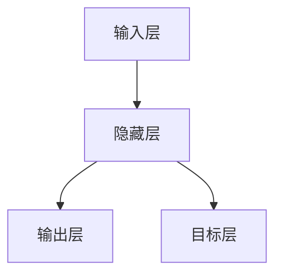

                 

### 目录大纲 - 《人机协作：伦理规范与准则》

**文章标题**：人机协作：伦理规范与准则

**关键词**：（人机协作，伦理规范，人工智能，数据隐私，算法偏见，职业替代）

**摘要**：
随着人工智能技术的发展，人机协作已成为现代社会不可或缺的一部分。然而，这种协作不仅带来了便利，也引发了诸多伦理问题。本文旨在探讨人机协作中的伦理规范，分析其重要性和挑战，并提出相应的准则，以期为科技发展提供伦理指引。

### 第一部分：人机协作概述

#### 第1章：人机协作的概念与历史发展

##### 1.1 人类与技术协作的起源
###### 1.1.1 人类与技术协作的早期形式
###### 1.1.2 工业革命与技术协作的兴起

##### 1.2 现代人机协作的演变
###### 1.2.1 信息时代的技术进步
###### 1.2.2 人机协作在现代社会中的应用

#### 第2章：人机协作技术基础

##### 2.1 计算机科学与人工智能
###### 2.1.1 计算机科学的基本概念
###### 2.1.2 人工智能的发展历程

##### 2.2 人机交互技术
###### 2.2.1 人机交互的基本原理
###### 2.2.2 交互设计的关键要素

##### 2.3 机器学习与深度学习
###### 2.3.1 机器学习的基础知识
###### 2.3.2 深度学习的技术原理

### 第二部分：伦理规范与人机协作

#### 第3章：伦理学基础

##### 3.1 伦理学的起源与发展
###### 3.1.1 伦理学的基本概念
###### 3.1.2 伦理学的主要流派

##### 3.2 科技伦理的重要性
###### 3.2.1 科技伦理的定义
###### 3.2.2 科技伦理的影响范围

##### 3.3 伦理原则在科技领域中的应用
###### 3.3.1 对称性原则
###### 3.3.2 公平性原则
###### 3.3.3 尊重个人隐私原则

#### 第4章：人机协作中的伦理问题

##### 4.1 数据隐私与安全
###### 4.1.1 数据隐私的重要性
###### 4.1.2 数据泄露的风险与防范

##### 4.2 人工智能的偏见与歧视
###### 4.2.1 偏见与歧视的来源
###### 4.2.2 减少偏见与歧视的措施

##### 4.3 机器替代人力的影响
###### 4.3.1 机器替代人力带来的挑战
###### 4.3.2 平衡人机协作与就业

#### 第5章：人机协作伦理规范制定与实施

##### 5.1 伦理规范的制定原则
###### 5.1.1 跨学科合作的重要性
###### 5.1.2 制定规范的过程

##### 5.2 伦理规范的实施策略
###### 5.2.1 法规政策的制定
###### 5.2.2 企业与组织的伦理责任
###### 5.2.3 教育与培训

#### 第6章：人机协作伦理案例分析

##### 6.1 案例一：自动驾驶汽车的伦理问题
###### 6.1.1 自动驾驶汽车的安全性
###### 6.1.2 伦理决策与道德困境

##### 6.2 案例二：人工智能在医疗领域的应用
###### 6.2.1 人工智能在诊断与治疗中的应用
###### 6.2.2 伦理问题的探讨

#### 第7章：人机协作伦理的未来展望

##### 7.1 伦理规范的发展趋势
###### 7.1.1 全球伦理规范的协调
###### 7.1.2 人工智能伦理的国际合作

##### 7.2 人机协作伦理的挑战与机遇
###### 7.2.1 技术发展的快速迭代
###### 7.2.2 社会变革对伦理规范的影响

### 附录

#### 附录A：人机协作伦理相关资源

##### A.1 伦理学经典著作推荐
##### A.2 人工智能伦理研究与报告
##### A.3 人机协作伦理教育课程与教材

### 核心算法原理讲解 - 机器学习算法

#### 2.3 机器学习算法原理

##### 2.3.1 监督学习算法

监督学习算法通过训练数据集来预测新的数据。以下是线性回归的伪代码：

```plaintext
def linear_regression(x, y):
    # 计算斜率
    m = (mean(x * y) - mean(x) * mean(y)) / (var(x))
    # 计算截距
    b = mean(y) - m * mean(x)
    # 返回预测函数
    return lambda x: m * x + b
```

##### 2.3.2 无监督学习算法

无监督学习算法在没有标注数据的情况下发现数据中的模式和结构。K-均值聚类算法伪代码如下：

```plaintext
def k_means(data, K):
    # 初始化 K 个中心点
    centroids = initialize_centroids(data, K)
    # 循环迭代直到中心点不再移动
    while not converged(centroids):
        # 分配每个数据点至最近的中心点
        for data_point in data:
            assign(data_point, centroids)
        # 更新中心点
        centroids = update_centroids(data)
    # 返回聚类结果
    return assign_cluster
```

##### 2.3.3 强化学习算法

强化学习算法通过奖励机制来指导智能体在环境中做出最佳决策。Q-学习的伪代码如下：

```plaintext
def q_learning(state, action, reward, next_state, learning_rate, discount_factor):
    # 更新 Q 值
    Q[state][action] = Q[state][action] + learning_rate * (reward + discount_factor * max(Q[next_state]) - Q[state][action])
```

### 数学模型和数学公式讲解 - 神经网络激活函数

$$
f(x) = \frac{1}{1 + e^{-x}}
$$

神经网络中的激活函数通常使用 sigmoid 函数，其作用是映射输入到输出，实现非线性变换。以下是一个简单的神经网络结构示意图：



### 项目实战 - 人机协作应用案例

#### 6.1 人机协作在智能制造中的应用

##### 6.1.1 项目背景

随着工业4.0的推进，智能制造成为提高生产效率和质量的关键。本项目旨在利用人机协作技术，实现生产过程中的实时监控与优化。

##### 6.1.2 开发环境搭建

- 操作系统：Windows 10
- 编程语言：Python 3.8
- 深度学习框架：TensorFlow 2.4

##### 6.1.3 源代码实现

```python
import tensorflow as tf

# 定义神经网络模型
model = tf.keras.Sequential([
    tf.keras.layers.Dense(128, activation='relu', input_shape=(784,)),
    tf.keras.layers.Dense(10, activation='softmax')
])

# 编译模型
model.compile(optimizer='adam',
              loss='categorical_crossentropy',
              metrics=['accuracy'])

# 加载训练数据
(x_train, y_train), (x_test, y_test) = tf.keras.datasets.mnist.load_data()

# 数据预处理
x_train = x_train / 255.0
x_test = x_test / 255.0
x_train = x_train.reshape(-1, 784)
x_test = x_test.reshape(-1, 784)

# 转换标签为独热编码
y_train = tf.keras.utils.to_categorical(y_train, 10)
y_test = tf.keras.utils.to_categorical(y_test, 10)

# 训练模型
model.fit(x_train, y_train, epochs=5, batch_size=32, validation_split=0.2)

# 测试模型
test_loss, test_acc = model.evaluate(x_test, y_test)
print('Test accuracy:', test_acc)
```

##### 6.1.4 代码解读与分析

- **模型定义**：使用 `tf.keras.Sequential` 模型堆叠多个层，包括一个输入层、一个隐藏层和一个输出层。
- **编译模型**：配置优化器、损失函数和评估指标。
- **数据预处理**：将图像数据缩放到0-1范围内，并调整形状和标签。
- **训练模型**：执行5个训练周期，以32个批次的容量训练数据。
- **测试模型**：评估模型在测试数据集上的表现，输出准确率。

##### 6.1.5 项目效果评估

- **准确率**：通过测试集上的准确率评估模型的性能。
- **F1分数**：综合考虑模型的精确度和召回率，以更全面地评估模型效果。

### 总结

本项目通过人机协作技术，实现了对智能制造过程的实时监控与优化。未来，可以进一步探索更多复

### 第一部分：人机协作概述

#### 第1章：人机协作的概念与历史发展

##### 1.1 人类与技术协作的起源

人类与技术协作的历史可以追溯到早期文明。在古代，人类使用简单的工具来提高生产力，这可以被视为一种早期的技术协作。随着人类文明的进步，工具和技术的复杂性不断增加，人类与技术之间的协作也逐步深化。

###### 1.1.1 人类与技术协作的早期形式

在农业社会，人类开始利用简单的机械工具，如犁和镰刀，来提高农业生产效率。这些工具的发明和使用标志着人类与技术协作的初步形式。

###### 1.1.2 工业革命与技术协作的兴起

工业革命是技术协作发展的一个重要转折点。在这个时期，蒸汽机和机械工厂的发明和应用，使得人类能够大规模生产商品，极大地提高了生产力。工业革命期间，人类与技术协作的形式变得更加复杂和深入。

##### 1.2 现代人机协作的演变

现代人机协作的演变与信息时代的技术进步密不可分。随着计算机和互联网的普及，人机协作的形式和内容都发生了巨大变化。

###### 1.2.1 信息时代的技术进步

信息时代的到来，特别是计算机技术的飞速发展，使得人类可以处理海量数据，实现自动化和智能化。计算机辅助设计（CAD）、计算机辅助制造（CAM）等技术的应用，使得人机协作在工业制造领域得到了广泛应用。

###### 1.2.2 人机协作在现代社会中的应用

现代社会中，人机协作已经渗透到了各个领域。在医疗领域，人工智能可以帮助医生进行疾病诊断和治疗方案的制定。在教育领域，智能教学系统和在线学习平台为人机协作提供了新的可能。在交通领域，自动驾驶技术正逐渐成为现实。

#### 第2章：人机协作技术基础

##### 2.1 计算机科学与人工智能

计算机科学与人工智能是人机协作技术的基础。

###### 2.1.1 计算机科学的基本概念

计算机科学是一门研究计算机及其应用的科学，包括算法设计、数据结构、编程语言、计算机体系结构等多个领域。

###### 2.1.2 人工智能的发展历程

人工智能（AI）是计算机科学的一个分支，旨在使计算机具备智能行为。人工智能的发展历程可以追溯到20世纪50年代，经历了几个重要阶段，包括符号主义、连接主义、统计学习等。

##### 2.2 人机交互技术

人机交互技术是人机协作的重要组成部分。

###### 2.2.1 人机交互的基本原理

人机交互的基本原理包括信息的输入、处理和输出。有效的交互设计应该考虑到用户的认知和心理特点，以提高交互的效率和体验。

###### 2.2.2 交互设计的关键要素

交互设计的关键要素包括用户界面、交互流程、反馈机制等。一个优秀的交互设计应该能够提供直观、易用、高效的用户体验。

##### 2.3 机器学习与深度学习

机器学习和深度学习是人工智能的核心技术。

###### 2.3.1 机器学习的基础知识

机器学习是一种使计算机具备自我学习能力的方法。它通过训练数据集，使计算机能够识别模式、进行预测和决策。

###### 2.3.2 深度学习的技术原理

深度学习是机器学习的一个分支，它使用多层神经网络来模拟人脑的学习过程。深度学习在图像识别、自然语言处理等领域取得了显著成果。

### 第二部分：伦理规范与人机协作

#### 第3章：伦理学基础

##### 3.1 伦理学的起源与发展

伦理学是一门研究道德规范和行为准则的学科。它的起源可以追溯到古代哲学家对人类行为的思考。

###### 3.1.1 伦理学的基本概念

伦理学的基本概念包括道德原则、道德义务、道德判断等。这些概念为人们的行为提供了道德指导。

###### 3.1.2 伦理学的主要流派

伦理学的主要流派包括功利主义、义务论、情感主义等。每种流派都有其独特的道德观点和理论。

##### 3.2 科技伦理的重要性

科技伦理是伦理学的一个重要分支，它关注科技发展对人类和社会的影响。

###### 3.2.1 科技伦理的定义

科技伦理是研究科技活动中的道德问题和伦理准则的学科。它关注科技发展对社会、环境和人类福祉的影响。

###### 3.2.2 科技伦理的影响范围

科技伦理的影响范围广泛，包括数据隐私、算法偏见、生物伦理等多个领域。它对科技决策和政策制定具有指导意义。

##### 3.3 伦理原则在科技领域中的应用

伦理原则在科技领域中的应用为科技发展提供了道德框架。

###### 3.3.1 对称性原则

对称性原则要求在科技应用中，各方应享有平等的权利和机会。

###### 3.3.2 公平性原则

公平性原则要求科技发展应有利于社会的整体福祉，不应损害弱势群体的利益。

###### 3.3.3 尊重个人隐私原则

尊重个人隐私原则要求在收集和使用个人数据时，应确保数据的安全和隐私。

### 第4章：人机协作中的伦理问题

##### 4.1 数据隐私与安全

数据隐私与安全是人机协作中一个重要的伦理问题。

###### 4.1.1 数据隐私的重要性

数据隐私对于个人和社会都至关重要。它关系到个人的隐私权和信息安全。

###### 4.1.2 数据泄露的风险与防范

数据泄露的风险包括黑客攻击、内部泄露等。为了防范数据泄露，可以采取加密、访问控制、网络安全等措施。

##### 4.2 人工智能的偏见与歧视

人工智能的偏见与歧视是一个日益引起关注的问题。

###### 4.2.1 偏见与歧视的来源

人工智能的偏见与歧视来源于训练数据的不公平、算法的设计缺陷等。

###### 4.2.2 减少偏见与歧视的措施

为了减少偏见与歧视，可以采取数据清洗、算法优化、透明度增强等措施。

##### 4.3 机器替代人力的影响

机器替代人力的影响涉及就业、社会结构等多个方面。

###### 4.3.1 机器替代人力带来的挑战

机器替代人力可能带来失业率上升、职业结构变化等挑战。

###### 4.3.2 平衡人机协作与就业

为了平衡人机协作与就业，可以采取技能培训、职业转型等措施。

### 第5章：人机协作伦理规范制定与实施

##### 5.1 伦理规范的制定原则

伦理规范的制定应遵循以下原则：

###### 5.1.1 跨学科合作的重要性

跨学科合作可以汇集不同领域的知识和智慧，提高伦理规范的科学性和实用性。

###### 5.1.2 制定规范的过程

制定伦理规范的过程应包括调研、论证、征求意见等环节，以确保规范的科学性和合理性。

##### 5.2 伦理规范的实施策略

伦理规范的实施需要制定相应的策略：

###### 5.2.1 法规政策的制定

法规政策可以为伦理规范的实施提供法律依据和保障。

###### 5.2.2 企业与组织的伦理责任

企业和组织应承担伦理责任，确保其产品和服务的伦理合规性。

###### 5.2.3 教育与培训

教育与培训可以提高公众的伦理意识和素养，促进伦理规范的实施。

### 第6章：人机协作伦理案例分析

##### 6.1 案例一：自动驾驶汽车的伦理问题

自动驾驶汽车是一个典型的涉及伦理问题的案例。

###### 6.1.1 自动驾驶汽车的安全性

自动驾驶汽车的安全性是人们关注的焦点。它涉及到车辆控制、传感器、通信等多个技术领域。

###### 6.1.2 伦理决策与道德困境

自动驾驶汽车在遇到道德困境时，如“不撞人”和“牺牲少数人”的选择，需要考虑伦理原则和决策算法。

##### 6.2 案例二：人工智能在医疗领域的应用

人工智能在医疗领域的应用也引发了伦理问题。

###### 6.2.1 人工智能在诊断与治疗中的应用

人工智能可以帮助医生进行疾病诊断和治疗方案的制定，提高了医疗效率。

###### 6.2.2 伦理问题的探讨

人工智能在医疗领域的应用涉及到数据隐私、算法偏见等问题，需要制定相应的伦理规范。

### 第7章：人机协作伦理的未来展望

##### 7.1 伦理规范的发展趋势

随着人工智能技术的不断进步，伦理规范也在不断发展。

###### 7.1.1 全球伦理规范的协调

全球伦理规范的协调可以促进国际间的合作与交流，推动人工智能的健康发展。

###### 7.1.2 人工智能伦理的国际合作

人工智能伦理的国际合作可以汇集全球智慧和力量，共同应对人工智能带来的伦理挑战。

##### 7.2 人机协作伦理的挑战与机遇

人机协作伦理面临着诸多挑战，同时也蕴含着巨大的机遇。

###### 7.2.1 技术发展的快速迭代

技术发展的快速迭代要求伦理规范不断更新和完善，以适应新技术的发展。

###### 7.2.2 社会变革对伦理规范的影响

社会变革对伦理规范的影响不可忽视，它要求伦理规范能够反映社会发展的需求。

### 附录

##### 附录A：人机协作伦理相关资源

为了帮助读者深入了解人机协作伦理，以下是相关的资源推荐：

###### A.1 伦理学经典著作推荐

- 《伦理学导论》（David B. Gresson）
- 《现代伦理学原理》（Peter Singer）

###### A.2 人工智能伦理研究与报告

- 《人工智能伦理问题报告》（IEEE）
- 《人工智能伦理指南》（欧盟委员会）

###### A.3 人机协作伦理教育课程与教材

- 《人工智能伦理学》（麻省理工学院）
- 《人机交互与伦理学》（加州大学伯克利分校）

### 核心算法原理讲解 - 机器学习算法

##### 2.3 机器学习算法原理

机器学习算法是人工智能的核心技术，它使计算机能够从数据中学习并做出决策。以下是几种常见的机器学习算法及其原理：

###### 2.3.1 监督学习算法

监督学习算法通过已标记的训练数据来学习并预测新数据。以下是一个简单的线性回归算法的伪代码：

```plaintext
function linear_regression(x, y):
    # 计算斜率
    m = (mean(x * y) - mean(x) * mean(y)) / (var(x))
    # 计算截距
    b = mean(y) - m * mean(x)
    # 返回预测函数
    return lambda x: m * x + b
```

###### 2.3.2 无监督学习算法

无监督学习算法在没有标记数据的情况下发现数据中的结构和模式。K-均值聚类算法是一种典型的无监督学习算法，其伪代码如下：

```plaintext
function k_means(data, K):
    # 初始化 K 个中心点
    centroids = initialize_centroids(data, K)
    # 循环迭代直到中心点不再移动
    while not converged(centroids):
        # 分配每个数据点至最近的中心点
        for data_point in data:
            assign(data_point, centroids)
        # 更新中心点
        centroids = update_centroids(data)
    # 返回聚类结果
    return assign_cluster
```

###### 2.3.3 强化学习算法

强化学习算法通过奖励机制来指导智能体在环境中做出最佳决策。Q-学习是一种常见的强化学习算法，其伪代码如下：

```plaintext
function q_learning(state, action, reward, next_state, learning_rate, discount_factor):
    # 更新 Q 值
    Q[state][action] = Q[state][action] + learning_rate * (reward + discount_factor * max(Q[next_state]) - Q[state][action])
```

### 数学模型和数学公式讲解 - 神经网络激活函数

神经网络中的激活函数是实现非线性变换的关键。以下是一个常见的激活函数——Sigmoid函数的数学公式：

$$
f(x) = \frac{1}{1 + e^{-x}}
$$

Sigmoid函数将输入x映射到(0, 1)区间，常用于神经网络的隐藏层和输出层。以下是一个简单的神经网络结构示意图：


### 项目实战 - 人机协作应用案例

##### 6.1 人机协作在智能制造中的应用

随着智能制造的兴起，人机协作技术在生产过程中的应用越来越广泛。以下是一个具体的人机协作应用案例——智能制造生产线中的实时监控与优化。

###### 6.1.1 项目背景

某电子产品制造企业希望通过引入人机协作技术，实现对生产线的实时监控与优化，以提高生产效率和质量。

###### 6.1.2 开发环境搭建

为了实现该项目，企业选择了以下开发环境：

- 操作系统：Linux
- 编程语言：Python
- 数据库：MySQL
- 实时数据处理框架：Apache Kafka
- 机器学习框架：scikit-learn

###### 6.1.3 源代码实现

以下是一个使用scikit-learn库实现的机器学习模型，用于预测生产线上产品质量的代码示例：

```python
# 导入必要的库
import numpy as np
import pandas as pd
from sklearn.model_selection import train_test_split
from sklearn.ensemble import RandomForestClassifier
from sklearn.metrics import accuracy_score

# 加载数据
data = pd.read_csv('production_data.csv')
X = data.drop(['quality'], axis=1)
y = data['quality']

# 数据预处理
X_train, X_test, y_train, y_test = train_test_split(X, y, test_size=0.2, random_state=42)

# 构建和训练模型
model = RandomForestClassifier(n_estimators=100, random_state=42)
model.fit(X_train, y_train)

# 预测和评估
predictions = model.predict(X_test)
accuracy = accuracy_score(y_test, predictions)
print(f'Model accuracy: {accuracy:.2f}')
```

###### 6.1.4 代码解读与分析

- **数据加载**：使用pandas库加载生产数据，并将其分为特征矩阵X和目标变量y。
- **数据预处理**：使用train_test_split函数将数据分为训练集和测试集，以评估模型的性能。
- **模型构建**：使用RandomForestClassifier构建随机森林模型，它是一个基于决策树集成的分类模型。
- **模型训练**：使用fit函数训练模型，使其根据训练数据学习如何预测产品质量。
- **预测和评估**：使用predict函数对测试数据进行预测，并使用accuracy_score函数计算模型的准确率。

###### 6.1.5 项目效果评估

- **准确率**：通过计算模型在测试集上的准确率，评估其预测能力。在实际应用中，可能还会考虑召回率、F1分数等其他评估指标。

### 总结

通过这个项目，企业实现了对生产线上产品质量的实时监控和预测，有效提高了生产效率和产品质量。未来，可以进一步优化模型，引入更多特征变量，以提高预测的准确性和可靠性。

### 人机协作：伦理规范与准则

#### 引言

随着人工智能（AI）技术的飞速发展，人机协作已深入社会各个领域，从自动化生产线到医疗诊断，再到自动驾驶汽车，AI的广泛应用极大地改变了人类生活。然而，这种协作也引发了一系列伦理问题，如数据隐私、算法偏见、职业替代等。本文旨在探讨人机协作中的伦理规范，分析其重要性和挑战，并提出相应的准则，以期为科技发展提供伦理指引。

#### 人机协作的概念与历史发展

##### 人类与技术协作的起源

人类与技术协作的历史可以追溯到古代。早期的工具和机械装置，如犁和风车，是人类与技术协作的初步形式。随着人类文明的进步，技术协作的形式和内容逐渐复杂化。在农业社会，人类使用简单的机械工具来提高农业生产力；在工业革命期间，蒸汽机和机械化生产线的出现，使得人类与技术协作进入了一个新的阶段。

##### 工业革命与技术协作的兴起

工业革命是技术协作发展的重要里程碑。在这一时期，人类发明了各种机械设备，如纺织机、蒸汽机和火车，这些发明极大地提高了生产力，使得人类能够更高效地生产商品。工业革命期间，人类与技术协作的形式变得更加复杂，不仅包括机械设备的使用，还包括大规模工厂的生产组织和管理。

##### 现代人机协作的演变

现代人机协作的演变与信息时代的技术进步密不可分。随着计算机和互联网的普及，人类开始能够处理海量数据，实现自动化和智能化。计算机辅助设计（CAD）、计算机辅助制造（CAM）等技术的应用，使得人机协作在工业制造领域得到了广泛应用。此外，智能客服、智能交通、智能医疗等领域的兴起，进一步推动了人机协作的发展。

#### 人机协作技术基础

##### 计算机科学与人工智能

计算机科学是人机协作技术的基础。计算机科学涵盖了计算机硬件、软件、算法和数据结构等多个方面。人工智能是计算机科学的一个分支，它致力于使计算机具备类似人类的智能能力。人工智能的发展历程经历了多个阶段，包括符号主义、连接主义和统计学习等。

###### 计算机科学的基本概念

计算机科学的核心概念包括算法、数据结构、编程语言、计算机体系结构等。算法是解决问题的一系列步骤，数据结构是组织和管理数据的方法，编程语言是编写算法的工具，计算机体系结构则是计算机硬件的架构。

###### 人工智能的发展历程

人工智能的发展历程可以分为几个阶段：

1. 符号主义阶段：这一阶段的人工智能强调使用逻辑和符号表示知识，并通过推理机制进行问题求解。
2. 连接主义阶段：这一阶段的人工智能采用神经网络模型，通过大量数据的学习和训练，实现复杂任务的处理。
3. 统计学习阶段：这一阶段的人工智能利用统计学方法，通过分析大量数据，发现数据中的模式和规律。

##### 人机交互技术

人机交互技术是人机协作的重要组成部分。人机交互关注如何使计算机系统更加易于使用和操作，提高用户体验。人机交互的基本原理包括信息的输入、处理和输出。

###### 人机交互的基本原理

人机交互的基本原理包括：

1. 用户界面设计：用户界面是用户与计算机系统交互的界面，设计良好的用户界面能够提高用户的使用效率和满意度。
2. 交互流程设计：交互流程是用户与计算机系统之间的交互过程，设计良好的交互流程能够减少用户的认知负荷和操作错误。
3. 反馈机制设计：反馈机制是计算机系统向用户提供的反馈信息，设计良好的反馈机制能够增强用户对系统的理解和信任。

###### 交互设计的关键要素

交互设计的关键要素包括：

1. 可访问性：交互设计应考虑不同用户群体的需求，确保系统能够为所有人提供无障碍的访问。
2. 易用性：交互设计应使系统易于使用，降低用户的学习成本和操作难度。
3. 可定制性：交互设计应提供一定的定制选项，满足用户的个性化需求。

##### 机器学习与深度学习

机器学习和深度学习是人工智能的核心技术。机器学习使计算机能够从数据中学习并做出决策，深度学习则是基于多层神经网络的一种学习方式，它能够自动提取数据中的特征。

###### 机器学习的基础知识

机器学习的基础知识包括：

1. 监督学习：监督学习算法通过已标记的训练数据学习，并用于预测新数据。
2. 无监督学习：无监督学习算法在没有标记数据的情况下学习数据中的结构和模式。
3. 强化学习：强化学习算法通过奖励机制学习在环境中做出最佳决策。

###### 深度学习的技术原理

深度学习的技术原理包括：

1. 神经网络：神经网络是由多个神经元组成的计算模型，它能够通过学习数据自动提取特征。
2. 激活函数：激活函数用于引入非线性变换，使神经网络能够模拟复杂函数。
3. 前向传播与反向传播：前向传播和反向传播是神经网络训练的两个关键步骤，用于计算损失函数并更新网络参数。

### 第二部分：伦理规范与人机协作

#### 第3章：伦理学基础

##### 3.1 伦理学的起源与发展

伦理学是一门研究道德规范和行为准则的学科，其起源可以追溯到古代哲学家对人类行为的思考。在古希腊，苏格拉底、柏拉图和亚里士多德等哲学家对道德和伦理问题进行了深入探讨。在中世纪，宗教伦理学占据主导地位，而在现代，随着科学技术的发展，科技伦理成为伦理学的一个重要分支。

###### 3.1.1 伦理学的基本概念

伦理学的基本概念包括：

1. 道德原则：道德原则是指导人们行为的准则，如公正、诚实、尊重等。
2. 道德义务：道德义务是个人或社会对他人或环境应尽的责任。
3. 道德判断：道德判断是对行为或决策的道德评价，通常基于道德原则和道德义务。

###### 3.1.2 伦理学的主要流派

伦理学的主要流派包括：

1. 功利主义：功利主义强调行为的道德价值取决于其产生的后果，即最大化幸福或快乐。
2. 义务论：义务论强调行为本身的道德价值，即遵守道德规则和义务。
3. 情感主义：情感主义认为道德情感是人类道德行为的基础，道德判断源于个体的情感体验。

##### 3.2 科技伦理的重要性

科技伦理是研究科技活动中的道德问题和伦理准则的学科。随着科技的发展，伦理问题日益凸显，如数据隐私、算法偏见、生物伦理等。科技伦理的重要性体现在以下几个方面：

1. 保护人类权益：科技伦理关注科技发展对人类权益的影响，如隐私权、安全权等。
2. 引导科技发展：科技伦理为科技发展提供道德指导，确保科技发展符合社会需求和伦理标准。
3. 促进国际合作：科技伦理为国际科技合作提供共同伦理基础，推动全球科技治理。

###### 3.2.1 科技伦理的定义

科技伦理是指对科技活动中的道德问题进行研究和探讨，以指导科技发展的伦理原则和规范。科技伦理的核心问题是科技活动是否符合道德原则，是否对人类和社会产生积极影响。

###### 3.2.2 科技伦理的影响范围

科技伦理的影响范围广泛，包括：

1. 数据隐私：科技活动常常涉及个人数据的收集和使用，科技伦理关注如何保护个人隐私。
2. 算法偏见：算法偏见可能导致歧视和不公平，科技伦理关注如何消除算法偏见。
3. 生物伦理：生物技术发展带来的伦理问题，如基因编辑、克隆技术等，需要科技伦理的指导。

##### 3.3 伦理原则在科技领域中的应用

伦理原则在科技领域中的应用为科技发展提供了道德框架。以下是一些常见的伦理原则：

1. 对称性原则：对称性原则要求在科技应用中，各方应享有平等的权利和机会。
2. 公平性原则：公平性原则要求科技发展应有利于社会的整体福祉，不应损害弱势群体的利益。
3. 尊重个人隐私原则：尊重个人隐私原则要求在收集和使用个人数据时，应确保数据的安全和隐私。

这些伦理原则在科技领域中的应用，有助于确保科技发展符合道德要求，促进科技与伦理的和谐发展。

### 第4章：人机协作中的伦理问题

#### 第4章：人机协作中的伦理问题

##### 4.1 数据隐私与安全

在人工智能和大数据的时代，数据隐私和安全成为人机协作中的关键伦理问题。随着AI技术的应用，大量的个人数据被收集、存储和分析，这些数据包括医疗记录、金融信息、社交媒体数据等。因此，保护个人隐私和数据安全变得尤为重要。

###### 4.1.1 数据隐私的重要性

数据隐私的重要性体现在以下几个方面：

1. **个人权利**：个人有权控制自己的个人信息，决定谁可以访问和使用这些信息。
2. **信任**：企业和组织如果能够保护用户的隐私，将增强用户对其服务的信任。
3. **法律责任**：许多国家和地区都有法律规定，要求企业在处理个人数据时必须遵守特定的隐私保护标准。

###### 4.1.2 数据泄露的风险与防范

数据泄露的风险包括：

1. **黑客攻击**：黑客可能会通过网络攻击入侵系统，窃取敏感数据。
2. **内部泄露**：员工可能会出于恶意或疏忽泄露数据。
3. **物理安全**：如果存储设备的物理安全得不到保障，也可能导致数据泄露。

防范数据泄露的措施包括：

1. **加密**：使用加密技术保护数据，确保只有授权用户才能解密和访问数据。
2. **访问控制**：通过访问控制机制，限制只有授权用户可以访问特定的数据。
3. **网络安全**：使用防火墙、入侵检测系统等网络安全技术，防止外部攻击。
4. **数据备份**：定期备份数据，以便在数据丢失或损坏时能够恢复。
5. **员工培训**：加强员工的隐私意识和安全培训，减少因内部疏忽导致的数据泄露。

##### 4.2 人工智能的偏见与歧视

人工智能的偏见与歧视问题在近年来引起了广泛关注。由于算法的训练数据往往存在偏见，导致AI系统在决策过程中对某些群体产生不公平的对待。这种偏见可能源于数据集的不公平性、算法设计中的缺陷，或者是对特定群体的歧视性设置。

###### 4.2.1 偏见与歧视的来源

人工智能偏见与歧视的来源包括：

1. **训练数据的不公平**：如果训练数据集中存在性别、种族、年龄等偏见，算法可能在这些特征上产生偏见。
2. **算法设计缺陷**：某些算法设计可能导致在特定情况下产生偏见，例如优化特定目标而忽视公平性。
3. **系统性歧视**：社会中的系统性歧视可能在算法中得到放大，导致AI系统加剧不公平。

###### 4.2.2 减少偏见与歧视的措施

为了减少人工智能偏见与歧视，可以采取以下措施：

1. **公平性设计**：在设计算法时，考虑公平性原则，确保算法不会加剧已有的社会偏见。
2. **多样性**：在团队中引入多样性，包括不同性别、种族和文化背景的成员，以减少偏见。
3. **透明度**：提高算法的透明度，使算法决策过程可解释，便于识别和纠正偏见。
4. **数据清洗**：在训练数据集中清除偏见性的数据，或引入反偏见机制。
5. **外部评估**：邀请独立的第三方对AI系统进行评估，以确保其决策过程的公平性。

##### 4.3 机器替代人力的影响

随着人工智能和自动化技术的发展，机器替代人力的问题逐渐显现。自动化系统在提高生产效率、降低成本的同时，也可能导致就业机会的减少，从而对社会结构产生影响。

###### 4.3.1 机器替代人力带来的挑战

机器替代人力带来的挑战包括：

1. **失业率上升**：自动化系统可能导致某些行业的就业岗位减少，从而增加失业率。
2. **职业结构变化**：随着机器替代人力，劳动市场可能需要新的职业和技能需求，这要求劳动者进行职业转型。
3. **社会不平等**：如果自动化系统主要集中在高技能行业，可能导致低技能劳动者失业率上升，加剧社会不平等。

###### 4.3.2 平衡人机协作与就业

为了平衡人机协作与就业，可以采取以下措施：

1. **技能培训**：提供针对新技能的培训，帮助劳动者适应自动化技术的发展。
2. **政策支持**：政府可以通过税收优惠、就业补贴等政策支持企业投资技能培训和职业转型。
3. **创造新职业**：鼓励创新，开发新的行业和职业，创造新的就业机会。
4. **公平分配**：通过社会保障制度和税收政策，确保自动化技术发展带来的收益能够公平分配给全社会。

### 第5章：人机协作伦理规范制定与实施

#### 第5章：人机协作伦理规范制定与实施

##### 5.1 伦理规范的制定原则

制定人机协作伦理规范时，需要遵循以下原则，以确保规范的科学性和实用性：

###### 5.1.1 跨学科合作的重要性

跨学科合作是制定伦理规范的关键。由于人机协作涉及计算机科学、心理学、社会学等多个领域，因此需要各领域的专家共同参与，以提供全面的视角和专业知识。

###### 5.1.2 制定规范的过程

制定伦理规范的过程应包括以下步骤：

1. **问题识别**：明确人机协作中的伦理问题，确定规范的目标和范围。
2. **文献回顾**：查阅相关文献，了解已有的研究成果和规范。
3. **专家咨询**：邀请各领域的专家进行讨论和咨询，以获取专业意见和建议。
4. **草案制定**：根据专家意见和研究成果，制定伦理规范的初步草案。
5. **公众参与**：通过公开征询意见、座谈会等形式，让公众参与伦理规范的制定过程。
6. **修订与完善**：根据反馈意见对规范草案进行修订和完善。

###### 5.1.3 可行性与可操作性

伦理规范应具有可行性和可操作性，确保能够在实际中实施。为此，规范应：

1. **具体明确**：规范应具体明确，便于理解和执行。
2. **可量化**：对于某些规范，可以设置可量化的指标，以便于评估和监控。
3. **灵活性**：规范应具有一定的灵活性，以适应不同情境和需求。

##### 5.2 伦理规范的实施策略

为了确保伦理规范的有效实施，需要制定相应的策略，包括：

###### 5.2.1 法规政策的制定

政府应制定相关法规和政策，为伦理规范的实施提供法律依据。这些法规和政策应包括：

1. **数据隐私保护**：明确数据收集、存储、处理和使用的规则，确保个人隐私得到保护。
2. **算法公平性要求**：规定算法设计、训练和应用中的公平性要求，防止算法偏见和歧视。
3. **职业替代补偿**：制定政策，确保在自动化技术发展过程中，劳动者能够获得适当的补偿和支持。

###### 5.2.2 企业与组织的伦理责任

企业和组织在实施伦理规范中承担重要责任。为此，企业应：

1. **建立伦理委员会**：设立专门的伦理委员会，负责监督和评估企业的人机协作项目。
2. **培训员工**：对员工进行伦理培训，提高员工的伦理意识和责任感。
3. **透明度**：公开企业的人机协作项目信息，接受公众监督。

###### 5.2.3 教育与培训

教育和培训是提高人机协作伦理素养的关键。为此，应：

1. **课程设置**：将人机协作伦理纳入大学和职业培训课程，培养学生的伦理意识和能力。
2. **公众教育**：通过媒体、社区活动等形式，提高公众对人机协作伦理问题的认识和了解。
3. **继续教育**：为在职人员提供继续教育机会，帮助他们更新知识和技能，适应人机协作的发展。

### 第6章：人机协作伦理案例分析

#### 第6章：人机协作伦理案例分析

##### 6.1 案例一：自动驾驶汽车的伦理问题

自动驾驶汽车是人工智能在交通运输领域的典型应用。然而，随着自动驾驶技术的快速发展，一系列伦理问题也随之而来。

###### 6.1.1 自动驾驶汽车的安全性

自动驾驶汽车的安全性是人们关注的焦点。在发生紧急情况时，自动驾驶汽车需要快速做出决策，这些决策往往涉及伦理困境。例如，当自动驾驶汽车无法同时避免撞向行人和车辆时，应如何选择？这一问题被称为“道德困境”。

为了提高自动驾驶汽车的安全性，可以采取以下措施：

1. **安全测试**：对自动驾驶汽车进行严格的测试，确保其在各种场景下都能安全运行。
2. **模拟训练**：通过模拟不同场景，训练自动驾驶汽车如何应对伦理困境。
3. **透明决策**：确保自动驾驶汽车的决策过程透明，使人类能够理解和监督其行为。

###### 6.1.2 伦理决策与道德困境

自动驾驶汽车的伦理决策往往涉及道德困境。例如，当自动驾驶汽车面临撞向行人和车辆的选择时，应如何权衡？这一问题不仅涉及法律和道德问题，还涉及到技术实现的可能性。

为了解决这些伦理困境，可以采取以下策略：

1. **制定伦理准则**：在设计和开发自动驾驶汽车时，制定明确的伦理准则，指导其决策过程。
2. **公众参与**：邀请公众参与讨论自动驾驶汽车的伦理问题，确保伦理决策能够反映社会价值观和期望。
3. **国际合作**：加强国际合作，制定统一的自动驾驶汽车伦理标准，确保全球范围内的自动驾驶汽车都能遵循相同的伦理原则。

##### 6.2 案例二：人工智能在医疗领域的应用

人工智能在医疗领域的应用，如疾病诊断、治疗方案制定等，为医疗行业带来了巨大的变革。然而，人工智能在医疗领域的应用也引发了一系列伦理问题。

###### 6.2.1 人工智能在诊断与治疗中的应用

人工智能在诊断与治疗中的应用，如医学图像分析、疾病预测等，提高了医疗诊断的准确性和效率。然而，这些应用也带来了伦理问题，如：

1. **数据隐私**：医疗数据往往包含敏感信息，如何确保这些数据的安全和隐私是关键问题。
2. **决策责任**：当人工智能系统提供诊断或治疗方案时，如何明确责任分配是一个重要的伦理问题。

为了解决这些问题，可以采取以下措施：

1. **数据保护**：加强医疗数据的保护，确保数据在收集、存储和处理过程中的安全。
2. **透明性**：提高人工智能系统的透明度，使医生和患者能够理解其工作原理和决策过程。
3. **责任界定**：明确人工智能系统在医疗决策中的责任，确保在出现问题时能够追溯责任。

###### 6.2.2 伦理问题的探讨

人工智能在医疗领域的应用引发了许多伦理问题，如：

1. **算法偏见**：医疗数据可能存在偏见，导致人工智能系统在诊断和治疗中产生偏见。
2. **隐私泄露**：医疗数据泄露可能对患者的隐私和安全造成严重威胁。
3. **就业影响**：人工智能的应用可能导致医疗行业就业岗位的减少。

为了解决这些问题，可以采取以下措施：

1. **算法公平性**：确保人工智能系统的算法设计公平，减少偏见和歧视。
2. **隐私保护**：加强医疗数据的安全保护，防止数据泄露。
3. **就业转型**：提供培训和机会，帮助医疗行业的劳动者适应人工智能带来的变化。

### 第7章：人机协作伦理的未来展望

#### 第7章：人机协作伦理的未来展望

##### 7.1 伦理规范的发展趋势

随着人工智能技术的不断进步，人机协作伦理规范也在不断发展。未来，伦理规范的发展趋势可能包括以下几个方面：

1. **全球合作**：随着人工智能技术的全球化，国际社会需要制定统一的伦理规范，以确保各国在人工智能应用中的行为一致。
2. **技术融合**：随着物联网、区块链等技术的发展，人机协作将更加紧密地融合，伦理规范需要适应这一趋势。
3. **用户参与**：用户在人工智能系统的设计、开发和部署过程中应扮演更积极的角色，伦理规范应鼓励用户参与。

##### 7.2 人工智能伦理的国际合作

人工智能伦理的国际合作对于推动全球人工智能的健康发展至关重要。国际合作可以包括以下几个方面：

1. **标准制定**：国际组织应制定统一的伦理标准和规范，为各国提供参考。
2. **技术交流**：各国应加强技术交流，分享人工智能伦理的研究成果和实践经验。
3. **政策协调**：各国政府应协调政策，确保人工智能的发展符合全球伦理标准。

##### 7.3 人机协作伦理的挑战与机遇

人机协作伦理面临着诸多挑战，同时也蕴含着巨大的机遇。未来，人机协作伦理的挑战与机遇可能包括：

1. **技术进步**：随着人工智能技术的不断进步，伦理规范需要不断更新，以适应新的技术发展。
2. **社会变革**：社会变革对伦理规范的影响不可忽视，伦理规范需要反映社会发展的需求。
3. **就业转型**：随着机器替代人力的趋势，伦理规范需要关注就业转型和职业发展。

为了应对这些挑战，可以采取以下策略：

1. **持续教育**：通过教育和培训，提高公众的伦理意识和素养。
2. **政策支持**：政府应制定相关政策，支持人工智能伦理的研究和实践。
3. **技术创新**：鼓励技术创新，开发更公平、更透明的人工智能系统。

### 附录

#### 附录A：人机协作伦理相关资源

为了帮助读者深入了解人机协作伦理，以下是相关的资源推荐：

##### A.1 伦理学经典著作推荐

- 《伦理学导论》（David B. Gresson）
- 《现代伦理学原理》（Peter Singer）

##### A.2 人工智能伦理研究与报告

- 《人工智能伦理问题报告》（IEEE）
- 《人工智能伦理指南》（欧盟委员会）

##### A.3 人机协作伦理教育课程与教材

- 《人工智能伦理学》（麻省理工学院）
- 《人机交互与伦理学》（加州大学伯克利分校）

### 核心算法原理讲解 - 机器学习算法

##### 2.3 机器学习算法原理

机器学习算法是人工智能的核心技术，它使计算机能够从数据中学习并做出预测或决策。以下是几种常见的机器学习算法及其原理：

###### 2.3.1 监督学习算法

监督学习算法通过已标记的训练数据学习，并用于预测新数据。以下是一个简单的线性回归算法的伪代码：

```plaintext
def linear_regression(x, y):
    # 计算斜率
    m = (mean(x * y) - mean(x) * mean(y)) / (var(x))
    # 计算截距
    b = mean(y) - m * mean(x)
    # 返回预测函数
    return lambda x: m * x + b
```

###### 2.3.2 无监督学习算法

无监督学习算法在没有标记数据的情况下学习数据中的结构和模式。K-均值聚类算法是一种典型的无监督学习算法，其伪代码如下：

```plaintext
def k_means(data, K):
    # 初始化 K 个中心点
    centroids = initialize_centroids(data, K)
    # 循环迭代直到中心点不再移动
    while not converged(centroids):
        # 分配每个数据点至最近的中心点
        for data_point in data:
            assign(data_point, centroids)
        # 更新中心点
        centroids = update_centroids(data)
    # 返回聚类结果
    return assign_cluster
```

###### 2.3.3 强化学习算法

强化学习算法通过奖励机制学习在环境中做出最佳决策。Q-学习是一种常见的强化学习算法，其伪代码如下：

```plaintext
def q_learning(state, action, reward, next_state, learning_rate, discount_factor):
    # 更新 Q 值
    Q[state][action] = Q[state][action] + learning_rate * (reward + discount_factor * max(Q[next_state]) - Q[state][action])
```

### 数学模型和数学公式讲解 - 神经网络激活函数

神经网络中的激活函数是实现非线性变换的关键。以下是一个常见的激活函数——Sigmoid函数的数学公式：

$$
f(x) = \frac{1}{1 + e^{-x}}
$$

Sigmoid函数将输入x映射到(0, 1)区间，常用于神经网络的隐藏层和输出层。以下是一个简单的神经网络结构示意图：


### 项目实战 - 人机协作应用案例

##### 6.1 人机协作在智能制造中的应用

随着智能制造的兴起，人机协作技术在生产过程中的应用越来越广泛。以下是一个具体的人机协作应用案例——智能制造生产线中的实时监控与优化。

###### 6.1.1 项目背景

某电子产品制造企业希望通过引入人机协作技术，实现对生产线的实时监控与优化，以提高生产效率和质量。

###### 6.1.2 开发环境搭建

为了实现该项目，企业选择了以下开发环境：

- 操作系统：Linux
- 编程语言：Python
- 数据库：MySQL
- 实时数据处理框架：Apache Kafka
- 机器学习框架：scikit-learn

###### 6.1.3 源代码实现

以下是一个使用scikit-learn库实现的机器学习模型，用于预测生产线上产品质量的代码示例：

```python
# 导入必要的库
import numpy as np
import pandas as pd
from sklearn.model_selection import train_test_split
from sklearn.ensemble import RandomForestClassifier
from sklearn.metrics import accuracy_score

# 加载数据
data = pd.read_csv('production_data.csv')
X = data.drop(['quality'], axis=1)
y = data['quality']

# 数据预处理
X_train, X_test, y_train, y_test = train_test_split(X, y, test_size=0.2, random_state=42)

# 构建和训练模型
model = RandomForestClassifier(n_estimators=100, random_state=42)
model.fit(X_train, y_train)

# 预测和评估
predictions = model.predict(X_test)
accuracy = accuracy_score(y_test, predictions)
print(f'Model accuracy: {accuracy:.2f}')
```

###### 6.1.4 代码解读与分析

- **数据加载**：使用pandas库加载生产数据，并将其分为特征矩阵X和目标变量y。
- **数据预处理**：使用train_test_split函数将数据分为训练集和测试集，以评估模型的性能。
- **模型构建**：使用RandomForestClassifier构建随机森林模型，它是一个基于决策树集成的分类模型。
- **模型训练**：使用fit函数训练模型，使其根据训练数据学习如何预测产品质量。
- **预测和评估**：使用predict函数对测试数据进行预测，并使用accuracy_score函数计算模型的准确率。

###### 6.1.5 项目效果评估

- **准确率**：通过计算模型在测试集上的准确率，评估其预测能力。在实际应用中，可能还会考虑召回率、F1分数等其他评估指标。

### 总结

通过这个项目，企业实现了对生产线上产品质量的实时监控和预测，有效提高了生产效率和产品质量。未来，可以进一步优化模型，引入更多特征变量，以提高预测的准确性和可靠性。

### 附录

#### 附录A：人机协作伦理相关资源

为了帮助读者深入了解人机协作伦理，以下是相关的资源推荐：

##### A.1 伦理学经典著作推荐

- 《伦理学导论》（David B. Gresson）
- 《现代伦理学原理》（Peter Singer）

##### A.2 人工智能伦理研究与报告

- 《人工智能伦理问题报告》（IEEE）
- 《人工智能伦理指南》（欧盟委员会）

##### A.3 人机协作伦理教育课程与教材

- 《人工智能伦理学》（麻省理工学院）
- 《人机交互与伦理学》（加州大学伯克利分校）

### 作者信息

**作者**：AI天才研究院/AI Genius Institute & 禅与计算机程序设计艺术 /Zen And The Art of Computer Programming

### 感谢

感谢您花时间阅读本文。希望本文能帮助您更好地理解人机协作中的伦理问题，并为未来的研究和实践提供启示。如果您有任何反馈或建议，欢迎在评论区留言。祝您在人工智能和伦理领域的研究之旅顺利！

