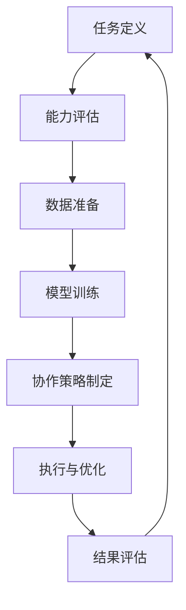

                 

### 文章标题

《人类-AI协作：增强人类智慧与AI能力的融合发展趋势预测分析机遇》

关键词：人类-AI协作，智慧增强，人工智能，融合趋势，应用实践，未来展望，伦理与法律问题

摘要：
随着人工智能（AI）技术的快速发展，人类与AI的协作已经成为一个热点研究领域。本文将深入探讨人类与AI协作的基础、核心概念、技术实现、应用实践以及未来发展趋势。通过分析人类与AI协作的优势和挑战，本文旨在为读者提供一个全面而深刻的视角，揭示人类与AI协作的潜在机遇，并探讨其在伦理与法律方面的问题。通过案例分析和实际项目实战，本文将为读者提供实用的指导和建议，帮助读者更好地理解和应用人类-AI协作技术。

### 第一部分：人类与AI协作的基础

#### 第1章：人类-AI协作概述

##### 1.1 人类与AI协作的起源与发展

人类与AI协作的概念并非突然出现，而是伴随着人工智能技术的发展逐步形成的。早在20世纪50年代，人工智能领域便开始了对智能机器的研究，当时的研究主要集中在如何使计算机模拟人类思维和决策过程。随着计算能力的提升和算法的创新，人工智能技术逐渐从理论研究走向实际应用。

人类与AI协作的起源可以追溯到20世纪80年代的专家系统。专家系统是一种模拟人类专家知识和经验的计算机程序，它们通过规则推理和知识库管理来解决问题。专家系统的出现标志着人类开始尝试与计算机系统协作，共同完成复杂任务。

进入21世纪，随着互联网的普及和大数据技术的发展，机器学习和深度学习成为人工智能领域的重要突破。这些技术使得计算机能够从海量数据中自动学习和提取知识，大大提升了AI系统的自主性和智能化水平。人类与AI的协作也从此进入了一个全新的阶段。

近年来，人工智能技术在各个领域的应用日益广泛，从智能家居、自动驾驶到医疗诊断、金融服务，AI已经成为现代社会不可或缺的一部分。在这个过程中，人类与AI的协作模式也在不断演变，从简单的指令执行到复杂的问题解决，人类与AI之间的互动越来越紧密。

##### 1.2 人类-AI协作的优势与挑战

人类与AI协作具有显著的优势。首先，AI系统可以处理海量数据，并从中提取出有价值的信息。这对于人类来说是一项巨大的负担，而AI可以高效、准确地完成这些任务。其次，AI具有高度的计算能力和分析能力，能够快速处理复杂的计算任务，提高工作效率。此外，AI系统可以在24小时内不间断工作，不受疲劳和情绪的影响，这大大提升了任务的完成质量和速度。

然而，人类-AI协作也面临着一系列挑战。首先，人类与AI之间的沟通存在障碍。虽然人工智能技术已经取得了显著的进步，但仍然难以完全理解人类的自然语言和意图，这导致了协作中的误解和效率低下。其次，AI系统的透明性和可解释性仍然是一个亟待解决的问题。许多AI系统的工作机制是黑箱化的，人类难以理解其决策过程，这增加了对AI的信任风险。此外，AI系统的可靠性和稳定性也是人类-AI协作中的一大挑战，特别是在关键任务领域，如医疗、金融等，任何错误都可能导致严重的后果。

##### 1.3 人类-AI协作的核心概念

人类-AI协作的核心概念主要包括以下几个方面：

1. **互补性**：人类与AI之间存在能力互补。人类具有创造力、情感和道德判断等能力，而AI则具备计算能力、数据处理能力和模式识别能力。通过互补性，人类和AI可以共同完成任务，实现更高的效率和准确性。

2. **协作流程**：人类-AI协作的流程通常包括任务分解、策略制定、执行和评估等环节。在这个过程中，人类和AI需要相互配合，共同解决问题。

3. **协同决策**：在许多任务中，人类和AI需要共同做出决策。协同决策涉及到人类对AI建议的理解和评估，以及AI对人类意图的解读和响应。

4. **适应性**：人类-AI协作系统需要具备适应性，能够根据不同的任务和环境动态调整协作模式。

5. **可解释性**：为了增强人类对AI的信任，AI系统的决策过程需要具备可解释性，使人类能够理解AI的决策依据。

##### 1.4 人类-AI协作的应用前景

人类-AI协作在各个领域的应用前景广阔。在工业制造领域，AI可以协助人类进行生产调度、质量控制和设备维护，提高生产效率和产品质量。在金融服务领域，AI可以用于风险评估、投资分析和客户服务，提高金融决策的准确性和客户满意度。在医疗健康领域，AI可以辅助医生进行疾病诊断、治疗建议和健康管理，提高医疗服务的质量和效率。在教育领域，AI可以提供个性化的学习支持和评估，帮助学生更好地掌握知识和技能。

此外，随着AI技术的不断进步，人类-AI协作的应用场景将继续拓展。例如，在科学研究领域，AI可以协助人类进行数据分析和模式识别，加速科学发现的进程。在艺术创作领域，AI可以与人类艺术家合作，创造出独特的艺术作品。在日常生活方面，AI可以协助人类进行家庭管理、健康管理、购物推荐等，提高生活质量。

综上所述，人类-AI协作具有巨大的发展潜力和应用价值，将在未来的社会中扮演越来越重要的角色。

### 第二部分：AI技术基础

#### 第2章：AI技术基础

##### 2.1 人工智能概述

人工智能（Artificial Intelligence，简称AI）是指通过计算机程序实现的智能行为，模仿人类在感知、理解、学习、推理和决策等方面的能力。人工智能的目的是让计算机能够执行复杂任务，解决实际问题，并具有自主学习和适应环境的能力。

人工智能的发展历程可以分为几个重要阶段：

1. **早期探索**（1950年代-1960年代）：人工智能的概念首次提出，科学家开始研究如何使计算机具备智能。这一阶段的代表性工作包括逻辑推理程序和规则系统的开发。

2. **知识表示与推理**（1970年代-1980年代）：专家系统和知识表示技术成为人工智能研究的热点。专家系统通过模拟人类专家的知识和推理能力，应用于医疗诊断、化学分析等领域。

3. **机器学习时代**（1990年代-2010年代）：随着计算能力的提升和数据量的增加，机器学习和深度学习技术得到快速发展。机器学习通过从数据中学习规律，实现预测和分类任务。深度学习则通过多层神经网络模拟人类大脑的神经结构，实现图像识别、语音识别等复杂任务。

4. **智能时代**（2010年代至今）：人工智能技术不断突破，应用场景不断扩大。AI在自然语言处理、计算机视觉、自动驾驶、智能制造等领域取得了显著成果。此外，AI系统开始具备一定程度的自主学习和决策能力。

人工智能的基本概念包括以下几个方面：

1. **机器学习**：机器学习是人工智能的核心技术之一，通过从数据中学习规律，实现预测和分类任务。机器学习分为监督学习、无监督学习和强化学习三种类型。

   - **监督学习**：通过已有数据集进行训练，输入特征和输出标签，学习到输入和输出之间的映射关系。
   - **无监督学习**：仅通过输入数据，学习到数据之间的内在结构或规律。
   - **强化学习**：通过与环境交互，不断优化策略，实现最优行为。

2. **深度学习**：深度学习是一种基于多层神经网络的机器学习方法，通过逐层提取数据特征，实现复杂任务。深度学习在图像识别、语音识别、自然语言处理等领域取得了突破性进展。

3. **自然语言处理**：自然语言处理（Natural Language Processing，简称NLP）是人工智能的一个重要分支，旨在使计算机理解和处理自然语言。NLP技术包括文本分类、情感分析、机器翻译、语音识别等。

4. **计算机视觉**：计算机视觉是人工智能的一个重要分支，旨在使计算机能够理解和处理图像和视频。计算机视觉技术包括图像分类、目标检测、图像生成等。

##### 2.2 机器学习与深度学习基础

机器学习和深度学习是人工智能的核心技术，下面将分别介绍其基础概念和主要算法。

1. **机器学习基础**

   - **线性回归**：线性回归是一种简单的机器学习算法，通过建立输入和输出之间的线性关系，实现预测任务。线性回归模型可以表示为：

     $$
     y = \beta_0 + \beta_1 \cdot x
     $$

     其中，$y$为输出值，$x$为输入值，$\beta_0$和$\beta_1$为模型参数。

   - **逻辑回归**：逻辑回归是一种广义线性模型，常用于分类任务。逻辑回归的预测结果为概率值，模型可以表示为：

     $$
     P(y=1) = \frac{1}{1 + e^{-(\beta_0 + \beta_1 \cdot x})}
     $$

     其中，$P(y=1)$为输出为1的概率，$e$为自然对数的底数。

   - **支持向量机**（Support Vector Machine，简称SVM）：支持向量机是一种监督学习算法，通过最大化分类边界之间的距离，实现分类任务。SVM模型可以表示为：

     $$
     w \cdot x + b = 0
     $$

     其中，$w$为权重向量，$x$为输入特征，$b$为偏置项。

2. **深度学习基础**

   - **神经网络**：神经网络是一种由多个神经元组成的计算模型，通过学习输入和输出之间的映射关系，实现复杂任务。神经网络的基本结构包括输入层、隐藏层和输出层。

   - **卷积神经网络**（Convolutional Neural Network，简称CNN）：卷积神经网络是一种专门用于处理图像数据的神经网络，通过卷积操作提取图像特征。CNN的基本结构包括卷积层、池化层和全连接层。

   - **循环神经网络**（Recurrent Neural Network，简称RNN）：循环神经网络是一种用于处理序列数据的神经网络，通过记忆机制实现长期依赖建模。RNN的基本结构包括输入层、隐藏层和输出层。

   - **生成对抗网络**（Generative Adversarial Network，简称GAN）：生成对抗网络是一种由生成器和判别器组成的对抗性网络，通过相互竞争，实现数据的生成。GAN的基本结构包括生成器、判别器和损失函数。

##### 2.3 强化学习原理与应用

强化学习是一种通过奖励和惩罚激励智能体（agent）学习最优策略的机器学习算法。强化学习的核心思想是智能体通过不断与环境交互，逐步优化其行为策略，以实现长期回报最大化。

强化学习的基本概念包括以下几个方面：

- **智能体（Agent）**：执行行动并接收环境反馈的实体。
- **环境（Environment）**：智能体执行行动的场所，提供状态和奖励。
- **状态（State）**：智能体在环境中的当前状态。
- **动作（Action）**：智能体可以采取的行动。
- **奖励（Reward）**：环境对智能体采取的动作的反馈，用于指导智能体的学习。

强化学习的主要算法包括：

- **Q学习（Q-Learning）**：Q学习是一种值函数算法，通过学习状态-动作价值函数（Q值），实现最优策略的寻找。Q学习的基本公式为：

  $$
  Q(s, a) = r + \gamma \max_{a'} Q(s', a')
  $$

  其中，$s$为当前状态，$a$为当前动作，$r$为即时奖励，$\gamma$为折扣因子，$s'$为下一状态，$a'$为下一动作。

- **深度强化学习（Deep Reinforcement Learning）**：深度强化学习是结合深度学习和强化学习的一种方法，通过使用深度神经网络来近似值函数或策略，实现更复杂的任务。深度强化学习的关键在于如何有效地训练深度神经网络，以避免梯度消失和梯度爆炸等问题。

强化学习在许多应用场景中表现出色，如：

- **游戏**：强化学习在游戏领域取得了显著成果，如AlphaGo在围棋比赛中战胜人类顶级选手。
- **自动驾驶**：强化学习可以用于自动驾驶车辆的路径规划和决策，提高行驶安全性和效率。
- **推荐系统**：强化学习可以用于推荐系统的优化，通过不断调整推荐策略，提高用户满意度。

##### 2.4 自然语言处理技术

自然语言处理（Natural Language Processing，简称NLP）是人工智能的一个重要分支，旨在使计算机理解和处理自然语言。NLP技术包括文本分类、情感分析、机器翻译、语音识别等。

1. **文本分类**：文本分类是一种将文本数据按照特定的类别进行划分的任务。常见的文本分类方法包括朴素贝叶斯、支持向量机、深度学习等。文本分类在信息检索、舆情分析、垃圾邮件过滤等领域有广泛的应用。

2. **情感分析**：情感分析是一种判断文本情感极性的任务，通常分为正面、负面和中性三类。情感分析在客户服务、市场调研、社交媒体分析等领域有重要应用。

3. **机器翻译**：机器翻译是一种将一种自然语言文本翻译成另一种自然语言文本的任务。机器翻译可以分为基于规则的方法和基于统计的方法。近年来，基于神经网络的机器翻译方法取得了显著进展，如基于序列到序列（Seq2Seq）模型的翻译方法。

4. **语音识别**：语音识别是一种将语音信号转换为文本数据的任务。语音识别在语音助手、自动字幕、语音搜索等领域有广泛应用。

在NLP技术中，深度学习技术取得了突破性进展。基于深度学习的NLP模型，如循环神经网络（RNN）、长短时记忆网络（LSTM）、门控循环单元（GRU）和变换器（Transformer）等，在多个NLP任务上达到了甚至超过了人类的性能。

综上所述，AI技术基础涵盖了人工智能、机器学习、深度学习、强化学习和自然语言处理等多个方面。这些技术为人类-AI协作提供了强大的支持，使得人类与AI的协作成为可能。在下一部分，我们将进一步探讨人类智慧与AI能力融合的理论基础和实现方法。

#### 第3章：人类智慧与AI能力融合

##### 3.1 人类智慧与AI能力融合的理论基础

人类智慧与AI能力融合的理论基础主要源于多学科交叉和综合，包括认知科学、心理学、神经科学和计算机科学等领域。这些领域的理论为人类智慧与AI能力融合提供了深刻的洞察和指导。

1. **认知科学**：认知科学是一门研究人类认知过程和机制的学科，涵盖了感知、记忆、语言、思维和决策等多个方面。认知科学的理论指出，人类智慧是通过感知、处理和利用信息来实现的。AI技术，特别是机器学习和深度学习，可以模拟人类认知过程中的某些机制，如特征提取、模式识别和决策制定。因此，认知科学为人类智慧与AI能力融合提供了理论依据。

2. **心理学**：心理学研究人类行为和心理过程，包括注意力、记忆、情感和学习等方面。心理学理论揭示了人类认知和行为的规律，如注意力分配、记忆编码和情感影响等。这些规律为AI系统设计提供了参考，有助于提升AI在人类协作中的表现。

3. **神经科学**：神经科学研究大脑的结构和功能，特别是神经元的连接和通信机制。神经科学发现，大脑通过复杂的神经网络实现信息处理和决策。AI技术中的神经网络模型，如深度学习和循环神经网络，受到了神经科学的启发。通过模仿大脑的神经网络结构，AI系统能够更好地处理复杂任务，与人类智慧实现更紧密的融合。

4. **计算机科学**：计算机科学为人类智慧与AI能力融合提供了技术和工具。计算机科学家开发了各种算法和模型，如机器学习、深度学习和强化学习，用于模拟和增强人类智慧。此外，计算机科学还研究了AI系统的可扩展性、可靠性和安全性，为人类-AI协作提供了技术保障。

##### 3.2 人类智慧与AI能力融合的流程

人类智慧与AI能力融合的流程主要包括以下几个步骤：

1. **任务定义**：明确人类和AI需要协作完成的任务，包括任务的输入、输出和约束条件。

2. **能力评估**：评估人类和AI在任务中的能力和优势，确定各自的职责和协作方式。

3. **数据准备**：收集和处理任务所需的数据，包括训练数据、测试数据和验证数据。数据准备是AI系统能力提升的关键步骤。

4. **模型训练**：使用机器学习、深度学习和强化学习等方法训练AI模型，使其具备完成任务的能力。训练过程中需要不断调整模型参数，优化模型性能。

5. **协作策略制定**：制定人类和AI之间的协作策略，包括任务分配、信息共享和决策机制。协作策略应根据任务特点和AI模型性能动态调整。

6. **执行与优化**：执行协作任务，并根据任务反馈和性能评估结果对AI模型进行优化。

7. **结果评估**：评估协作任务的完成效果，包括准确性、效率和用户满意度等指标。根据评估结果，进一步优化协作流程和AI模型。

##### 3.3 人类智慧与AI能力融合的关键技术

人类智慧与AI能力融合的关键技术包括以下几个方面：

1. **多模态数据处理**：人类智慧与AI能力融合涉及多种数据类型，如文本、图像、音频和视频等。多模态数据处理技术能够有效地整合不同类型的数据，提升AI系统的理解和表达能力。

2. **强化学习**：强化学习是一种通过奖励和惩罚激励智能体学习最优策略的机器学习算法。在人类智慧与AI能力融合中，强化学习可以用于优化人类和AI之间的协作策略，提高协作效果。

3. **自然语言处理**：自然语言处理技术使AI系统能够理解和生成自然语言，实现与人类的有效沟通。在人类智慧与AI能力融合中，NLP技术可以用于任务描述、问题解答和交互控制等场景。

4. **计算机视觉**：计算机视觉技术使AI系统能够理解和分析图像和视频信息。在人类智慧与AI能力融合中，计算机视觉可以用于图像识别、目标检测和场景理解等任务。

5. **知识图谱**：知识图谱是一种表示实体及其之间关系的图形化模型。在人类智慧与AI能力融合中，知识图谱可以用于知识管理、推理和决策等任务。

##### 3.4 人类智慧与AI能力融合的案例分析

为了更好地理解人类智慧与AI能力融合的实际应用，下面列举了几个典型的案例分析：

1. **智能医疗诊断**：在医疗领域，AI系统可以辅助医生进行疾病诊断。通过融合医学知识库、患者数据和AI算法，AI系统可以提供准确的诊断建议。例如，谷歌的DeepMind团队开发的AI系统已经在眼科疾病诊断方面取得了显著成果。

2. **自动驾驶技术**：在自动驾驶领域，人类智慧与AI能力融合是实现安全、高效的自动驾驶的关键。自动驾驶系统需要实时处理来自传感器、地图和导航系统的数据，并根据交通规则和路况进行决策。通过融合深度学习和强化学习技术，自动驾驶系统能够适应复杂多变的驾驶环境。

3. **智能客服系统**：在客户服务领域，AI系统可以提供智能客服服务，解答用户问题和提供支持。通过融合自然语言处理和机器学习技术，智能客服系统能够理解用户的意图和需求，并提供准确、快速的答复。

4. **教育个性化辅导**：在教育领域，AI系统可以提供个性化的学习辅导，根据学生的特点和需求调整教学内容和方法。通过融合计算机视觉和自然语言处理技术，AI系统可以实时监测学生的学习状态，并提供针对性的辅导建议。

综上所述，人类智慧与AI能力融合的理论基础和技术实现已经取得了显著进展，并在各个领域展示了巨大的应用潜力。在下一部分，我们将进一步探讨人类-AI协作在实践中的应用。

#### 第4章：人类-AI协作的应用实践

##### 4.1 人类-AI协作在行业中的应用

人类-AI协作在各个行业中的应用已经变得日益普遍，显著提升了生产效率、优化了业务流程，并创造了新的商业机会。以下是一些典型行业中的应用实例：

1. **制造业**：在制造业中，AI技术被广泛应用于生产线的自动化控制、质量控制、库存管理和预测维护。例如，通过AI算法分析传感器数据，可以实时监控设备状态，预测潜在故障并提前进行维护，从而减少停机时间和维修成本。同时，AI系统可以优化生产计划，根据市场需求变化灵活调整生产节奏，提高生产效率。

2. **金融服务业**：金融行业利用AI技术进行风险管理、投资分析和客户服务。例如，通过机器学习算法分析大量的交易数据，AI系统可以识别异常交易模式，预警潜在风险。在投资方面，AI系统通过分析市场趋势和历史数据，提供投资建议，帮助投资者做出更明智的决策。此外，智能客服机器人可以处理大量的客户咨询，提高客户服务质量。

3. **医疗健康领域**：AI技术在医疗健康领域具有广泛的应用，包括疾病诊断、治疗建议、药物研发和健康管理。通过AI系统分析大量的医学影像和病例数据，医生可以更准确地诊断疾病，提高诊断的准确性和效率。在药物研发方面，AI算法可以加速新药的发现过程，通过模拟药物分子与目标蛋白质的结合，预测药物的效果和副作用。同时，AI系统可以提供个性化的健康建议，帮助人们进行健康管理。

4. **零售业**：零售行业利用AI技术进行库存管理、客户行为分析和营销策略制定。通过分析消费者的购买历史和行为数据，AI系统可以预测未来的销售趋势，优化库存水平，减少库存积压和缺货现象。在营销方面，AI算法可以根据消费者的兴趣和购买行为，定制个性化的营销策略，提高营销效果和客户满意度。

5. **交通运输领域**：在交通运输领域，AI技术被用于智能交通管理、自动驾驶车辆和物流优化。通过实时分析交通流量和路况数据，AI系统可以优化交通信号控制和路线规划，减少交通拥堵和提高道路通行效率。自动驾驶技术可以提升车辆的安全性和效率，降低事故发生率。在物流领域，AI算法可以优化运输路线和调度计划，提高物流网络的运行效率。

##### 4.2 人类-AI协作的企业管理实践

在企业管理中，人类-AI协作已经成为提升管理效率和决策质量的重要手段。以下是一些具体的企业管理实践案例：

1. **决策支持系统**：许多企业开发了决策支持系统（Decision Support System，简称DSS），利用AI技术为企业高层管理者提供数据分析和决策建议。这些系统通过分析大量内部和外部数据，识别潜在的业务机会和风险，帮助管理者做出更明智的决策。例如，通过机器学习算法分析销售数据和市场趋势，企业可以制定更有针对性的营销策略。

2. **人力资源管理系统**：AI技术在人力资源管理系统（Human Resource Management System，简称HRMS）中的应用越来越广泛。AI算法可以分析员工绩效数据，提供个性化的培训和发展建议，帮助员工提升技能和职业发展。此外，AI系统可以用于招聘和选拔，通过分析简历和面试数据，帮助企业快速筛选合适的候选人。

3. **客户关系管理**：客户关系管理（Customer Relationship Management，简称CRM）系统通过AI技术提升客户服务质量和客户满意度。AI算法可以分析客户行为和反馈数据，预测客户需求，提供个性化的产品和服务推荐。同时，AI系统可以自动处理大量的客户咨询和投诉，提高客户响应速度和满意度。

4. **供应链管理**：AI技术在供应链管理中的应用可以提高供应链的透明度和效率。通过AI算法分析供应链数据，企业可以实时监控库存水平、运输进度和订单履行情况，优化供应链流程，减少库存积压和运输成本。此外，AI系统可以预测市场需求变化，帮助企业调整生产和采购计划，提高供应链的灵活性和响应速度。

5. **项目管理**：在项目管理中，AI技术可以帮助项目团队更高效地规划和执行项目任务。通过AI算法分析项目进度、资源分配和风险因素，项目管理者可以及时发现潜在问题，调整项目计划，确保项目按期完成。同时，AI系统可以提供项目风险评估和预测，帮助项目团队制定更有效的风险管理策略。

##### 4.3 人类-AI协作在教育领域的应用

在教育领域，人类-AI协作正在深刻改变传统的教学模式和学习体验，为学生提供更加个性化和互动的学习支持。

1. **个性化学习**：AI系统可以根据学生的兴趣、能力和学习进度，提供个性化的学习内容和建议。通过分析学生的学习行为和成绩数据，AI系统可以识别学生的薄弱环节，提供针对性的辅导材料和学习资源。例如，AI辅导系统可以为学生推荐适合的练习题和学习路径，帮助学生更好地掌握知识。

2. **智能评估与反馈**：AI技术可以自动评估学生的作业和考试，提供即时的反馈和建议。通过自然语言处理和计算机视觉技术，AI系统可以识别学生的答案，判断正确与否，并给出详细的解析和指导。这种自动评估和反馈机制不仅提高了评估效率，还有助于学生及时纠正错误，巩固学习成果。

3. **虚拟教学助手**：在远程教育和在线学习中，AI系统可以作为虚拟教学助手，提供实时辅导和互动支持。通过自然语言处理和语音识别技术，AI助手可以与学生进行实时对话，解答学生的问题，提供学习建议。虚拟教学助手不仅可以减轻教师的工作负担，还可以为学生提供全天候的学习支持。

4. **智能学习分析**：AI系统可以收集和分析学生的学习数据，包括学习时间、学习内容、作业成绩等，为教育者提供深入的学习分析报告。通过这些分析报告，教育者可以了解学生的学习状况，识别学习瓶颈，制定更有效的教学策略。例如，AI系统可以识别学生的学习高峰期和学习低谷期，帮助教师合理安排教学时间和内容。

5. **自适应学习平台**：自适应学习平台通过AI技术实现个性化的学习体验。这些平台可以根据学生的学习情况和反馈，动态调整教学内容和难度，提供个性化的学习路径。例如，当学生在某一知识点上表现不佳时，平台可以提供额外的练习和辅导，帮助学生掌握相关知识。

##### 4.4 人类-AI协作在医疗健康领域的应用

在医疗健康领域，人类-AI协作正在显著提升医疗服务质量、提高诊断准确率和促进患者健康管理。

1. **疾病诊断辅助**：AI系统可以通过分析大量的医学影像数据（如X光、CT、MRI等），辅助医生进行疾病诊断。AI算法可以识别出细微的影像特征，提高诊断的准确性和速度。例如，谷歌的DeepMind团队开发的AI系统已经能够准确识别眼科疾病，为医生提供诊断建议。

2. **治疗方案推荐**：AI系统可以基于患者的病历数据、基因信息和最新的医学研究，为医生提供个性化的治疗方案推荐。通过分析患者的病情和治疗效果，AI系统可以预测不同治疗方案的可能效果，帮助医生做出更科学、更合理的治疗决策。

3. **智能药物研发**：AI技术在药物研发中的应用正在加速新药的研发过程。通过机器学习算法分析大量的生物数据，AI系统可以预测药物分子与目标蛋白质的结合方式，识别潜在的药物靶点。这有助于缩短药物研发周期，降低研发成本。

4. **健康数据分析**：AI系统可以分析大量的健康数据，包括医疗记录、生活习惯和生物标志物，提供个性化的健康评估和建议。通过这些数据分析，AI系统可以识别出潜在的健康风险，提醒患者注意健康问题，并提供针对性的健康干预措施。

5. **患者管理**：AI系统可以帮助医疗机构实现患者管理自动化。通过分析患者的病史、就诊记录和实时监测数据，AI系统可以提供个性化的患者管理方案，包括预约提醒、服药提醒和健康指导。这有助于提高患者的治疗依从性，改善患者的生活质量。

综上所述，人类-AI协作在各个行业中的应用已经取得了显著成效，并在企业管理、教育领域、医疗健康领域等方面展示了巨大的潜力。在下一部分，我们将进一步探讨人类-AI协作的未来发展趋势。

#### 第5章：人类-AI协作的未来发展趋势

##### 5.1 AI技术的发展趋势与人类智慧融合的方向

随着人工智能技术的不断进步，AI与人类智慧的融合将朝着更加紧密、高效和智能的方向发展。以下是几个关键趋势：

1. **泛在智能**：未来，AI技术将更加普及，渗透到社会的各个领域和日常生活的方方面面。从智能家居、智慧城市到智能医疗、智能交通，AI将无处不在，为人类提供便捷和高效的服务。泛在智能的实现将依赖于AI系统的自主性和适应性，使它们能够自主学习和适应复杂多变的环境。

2. **协同智能**：人类与AI的协同工作将更加深入和紧密。未来的AI系统将具备更高的理解和表达能力，能够更好地理解人类的意图和需求，提供更加个性化的服务。同时，AI系统将能够通过协作网络与其他智能系统进行互联互通，实现跨领域的协同工作，提升整体智能水平。

3. **智慧增强**：AI技术将不仅仅是执行任务的工具，更将成为人类智慧的增强器。通过模拟和扩展人类的认知能力，AI系统将帮助人类在复杂任务中做出更准确、更迅速的决策。例如，在医疗领域，AI系统可以辅助医生进行复杂的诊断和治疗决策，提高医疗服务的质量和效率。

4. **人机共生**：随着AI技术的发展，人类与AI将逐渐实现共生关系。AI系统将成为人类的伙伴和助手，共同创造更加美好的生活和工作环境。人机共生将促进人类社会的发展，使人类能够更好地应对复杂的社会挑战。

##### 5.2 人类-AI协作面临的挑战与解决方案

尽管人类-AI协作具有巨大的潜力和前景，但在实际应用过程中仍面临一系列挑战。以下是一些关键挑战及其可能的解决方案：

1. **沟通障碍**：人类与AI之间的沟通障碍是当前的一个主要挑战。AI系统在理解人类自然语言和意图方面仍然存在局限，导致协作中的误解和效率低下。解决方案包括：

   - **多模态交互**：结合语音、文字、图像等多种交互方式，提高AI系统对人类意图的理解能力。
   - **增强学习**：通过不断学习和适应人类交互模式，AI系统可以逐步提高其沟通能力。
   - **人类反馈**：引入人类反馈机制，使AI系统能够根据用户反馈进行优化和调整。

2. **透明性和可解释性**：许多AI系统的工作机制是黑箱化的，人类难以理解其决策过程，这增加了对AI的信任风险。为了提高AI系统的透明性和可解释性，可以采取以下措施：

   - **解释性模型**：开发具有解释性的人工智能模型，使人类能够理解其决策依据。
   - **可视化工具**：设计可视化工具，展示AI系统的内部结构和决策过程。
   - **模型审计**：对AI系统进行定期审计，确保其决策过程的合理性和可解释性。

3. **可靠性和稳定性**：在关键任务领域，如医疗、金融等，AI系统的可靠性和稳定性至关重要。为了提高AI系统的可靠性和稳定性，可以采取以下措施：

   - **冗余设计**：通过引入冗余机制，确保在某一组件失效时，系统仍然能够正常运行。
   - **持续监控**：对AI系统进行实时监控，及时发现和纠正异常。
   - **容错机制**：设计容错机制，使系统能够在出现故障时自动恢复。

4. **数据隐私和安全**：在人类-AI协作过程中，数据隐私和安全问题不可忽视。为了保护用户隐私和数据安全，可以采取以下措施：

   - **数据加密**：对敏感数据进行加密处理，确保数据在传输和存储过程中的安全性。
   - **隐私保护算法**：开发隐私保护算法，降低数据泄露的风险。
   - **数据审计**：对数据访问和使用进行严格审计，确保数据不被滥用。

##### 5.3 人类-AI协作的未来场景预测

随着AI技术的不断进步，人类-AI协作将在未来的社会生活中扮演越来越重要的角色。以下是几个可能的未来场景预测：

1. **智慧城市**：未来的智慧城市将依赖于AI技术实现全方位的智能化管理。从智能交通、智能环境监测到智能公共服务，AI系统将全面提升城市运行效率，改善市民生活质量。

2. **智能医疗**：未来的智能医疗将实现个性化诊断、精准治疗和全程健康管理。AI系统将辅助医生进行诊断和治疗，提高医疗服务质量和效率，减少医疗资源浪费。

3. **智能教育**：未来的智能教育将实现个性化学习、自适应教学和智能评价。AI系统将为学生提供个性化的学习支持，帮助教师更好地进行教学和管理，提高教育质量和学习效果。

4. **智能工作**：未来的智能工作将实现自动化、协同化和智能化。AI系统将协助人类完成重复性、繁琐的工作，使人类能够专注于更有创造性和价值的工作。

5. **人机共生**：未来的社会将是一个人机共生的新时代。人类与AI将共同生活、工作和学习，共同创造更加美好的未来。在这一过程中，人类将发挥其独特的创造力和道德判断能力，而AI系统则将提供强大的计算能力和数据分析能力，实现优势互补。

##### 5.4 人类-AI协作对人类社会的影响

人类-AI协作将对人类社会产生深远的影响，涉及经济、教育、伦理和社会结构等多个方面：

1. **经济影响**：人类-AI协作将推动经济增长，创造新的就业机会。同时，它也将改变就业市场的格局，一些传统职业可能被自动化取代，而新的职业和岗位将不断涌现。

2. **教育影响**：AI技术将改变教育的模式和方法，个性化学习和自适应教学将成为主流。教育者需要不断更新知识和技能，以适应未来教育的需求。

3. **伦理影响**：人类-AI协作带来的伦理问题不容忽视。如何确保AI系统的透明性、公正性和可解释性，如何平衡人类和AI的利益，都是需要深入探讨和解决的问题。

4. **社会影响**：人类-AI协作将改变社会的结构和社会关系。随着AI技术的普及，人类与AI的合作将成为社会运行的一部分，人与人之间的互动也将因此而发生改变。

综上所述，人类-AI协作的未来发展趋势充满机遇和挑战。通过不断探索和创新，我们可以更好地利用AI技术，实现人类智慧的增强和人类社会的发展。

### 第三部分：人类-AI协作的伦理与法律问题

#### 第6章：人类-AI协作的伦理与法律问题

随着人工智能（AI）技术的飞速发展，人类与AI的协作已经成为现代社会的重要组成部分。然而，这一新兴领域也引发了一系列伦理和法律问题，需要我们深入探讨和解决。

##### 6.1 人类-AI协作的伦理问题

1. **隐私保护**：在人类-AI协作过程中，AI系统通常需要处理大量的个人数据。如何保护用户的隐私，防止数据泄露和滥用，成为了一个重要的伦理问题。为了解决这一问题，需要制定严格的数据保护法规，确保个人数据的收集、存储和使用过程符合伦理标准。

2. **公平与公正**：AI系统在决策过程中可能会出现偏见和歧视。例如，基于历史数据训练的AI系统可能会继承人类固有的偏见，导致对某些群体不公平的待遇。为了解决这一问题，需要开发和部署公平性分析工具，确保AI系统的决策过程具有透明性和公正性。

3. **透明性和可解释性**：许多AI系统的工作机制是黑箱化的，人类难以理解其决策过程。这可能导致用户对AI系统的信任度下降，影响AI系统的应用效果。为了提高AI系统的透明性和可解释性，需要开发具有解释性的人工智能模型，使人类能够理解AI的决策依据。

4. **责任归属**：在人类-AI协作过程中，如果发生错误或损害，如何确定责任归属是一个复杂的伦理问题。例如，在自动驾驶汽车发生事故时，责任应该由驾驶员、制造商还是AI系统承担？为了解决这一问题，需要建立明确的法律法规，明确各方责任和义务。

##### 6.2 人类-AI协作的法律问题

1. **数据保护法规**：随着AI技术的应用，数据保护法规变得更加重要。许多国家和地区已经制定了数据保护法规，如欧盟的《通用数据保护条例》（GDPR）。这些法规旨在保护用户的隐私权，规范数据的收集、存储和使用过程。企业和个人在利用AI技术时，需要遵守相关数据保护法规，确保合法合规。

2. **知识产权**：AI技术在创造新的作品、发明和创新方面发挥了重要作用。然而，如何保护AI技术创造的知识产权成为一个法律问题。为了解决这一问题，需要制定相应的知识产权法律法规，明确AI系统的创作者和所有者的权利和义务。

3. **责任与赔偿**：在人类-AI协作过程中，如果发生错误或损害，如何确定责任和赔偿成为一个法律问题。为了解决这一问题，需要建立明确的法律法规，明确各方责任和义务。此外，还需要制定相应的赔偿标准，确保受害方能够获得公正的赔偿。

4. **隐私权与知情权**：在人类-AI协作中，用户有权了解AI系统如何处理和使用其数据。隐私权和知情权是保护用户权益的重要方面。为了解决这一问题，需要制定相关的隐私保护法规，确保用户在数据收集、存储和使用过程中的知情权。

##### 6.3 人类-AI协作的监管框架

为了解决人类-AI协作中的伦理和法律问题，需要建立完善的监管框架。以下是一些可能的监管措施：

1. **立法与政策**：政府应制定相关的法律法规和政策，明确人类-AI协作的伦理和法律标准，规范各方行为。

2. **监管机构**：设立专门的监管机构，负责监督和评估AI技术的应用，确保其符合伦理和法律要求。

3. **透明性与公众参与**：确保AI系统的开发和应用过程具有透明性，让公众有机会参与监督和评估，提出意见和建议。

4. **教育与培训**：加强对公众和从业人员的教育，提高对AI技术的理解和认识，培养专业人才，确保AI技术的合理、合法应用。

##### 6.4 人类-AI协作的伦理与法律案例分析

为了更好地理解人类-AI协作中的伦理与法律问题，以下列举了几个具体的案例分析：

1. **自动驾驶汽车事故**：在自动驾驶汽车事故中，如何确定责任归属成为一个法律问题。一些国家已经制定了相关的法律法规，明确了驾驶员、制造商和AI系统的责任和义务。例如，美国的一些州已经规定，如果AI系统发生故障，制造商可能需要承担责任。

2. **人工智能歧视案例**：在招聘过程中，AI系统可能会根据历史数据中的偏见进行筛选，导致对某些群体的歧视。欧盟的GDPR规定，企业必须确保AI系统的决策过程具有公平性和透明性，防止出现歧视行为。

3. **医疗AI系统的应用**：在医疗领域，AI系统被用于诊断和治疗建议。然而，如果AI系统提供的诊断或治疗建议发生错误，导致患者受到损害，如何确定责任和赔偿成为一个法律问题。一些国家已经制定了相关的法律法规，明确医疗AI系统的责任和义务。

4. **人脸识别技术的应用**：人脸识别技术在公共安全、商业等领域得到广泛应用。然而，如何保护用户的隐私权，防止人脸数据被滥用，成为了一个重要的伦理和法律问题。许多国家和地区已经制定了相关法律法规，规范人脸识别技术的使用。

综上所述，人类-AI协作的伦理与法律问题是一个复杂而重要的话题。通过建立完善的监管框架和法律法规，我们可以更好地解决这些挑战，确保人类-AI协作的健康发展。

### 第7章：人类-AI协作的实际案例分析

为了更深入地了解人类-AI协作的实际应用效果，本章节将通过多个具体案例展示人类与AI在不同领域和场景中的成功合作实践，并提供详细的操作步骤和经验总结。

##### 7.1 案例一：某企业的人类-AI协作实践

**案例背景**：
某知名科技公司致力于提升其客户服务效率，决定引入AI技术来优化客户支持流程。通过AI系统，公司希望能够提供更加个性化和高效的客户服务，从而提升客户满意度和忠诚度。

**操作步骤**：
1. **需求分析**：公司首先进行了全面的需求分析，明确了客户支持的关键任务和挑战，如快速响应客户咨询、提供个性化建议和解决方案等。
2. **数据收集**：公司收集了大量的客户交互数据，包括历史客户咨询记录、问题类型、解决方案等，为AI系统的训练提供了丰富的数据资源。
3. **AI系统开发**：公司利用机器学习和自然语言处理技术，开发了一个智能客服机器人。该系统通过深度学习算法，能够理解客户的提问，并提供相应的回答和建议。
4. **系统部署与测试**：智能客服机器人部署到公司的客户服务系统中，并进行了一系列的测试，以确保其能够稳定、准确地运行。
5. **用户反馈与优化**：在系统上线后，公司收集了用户的反馈，并对智能客服机器人进行了多次优化，提高了其回答问题的准确性和个性化程度。

**经验总结**：
1. **数据质量至关重要**：高质量的数据是训练高效AI系统的基础。公司通过数据清洗和预处理，确保了数据的质量和一致性。
2. **持续优化与迭代**：AI系统上线后，公司不断收集用户反馈，并根据反馈进行优化和迭代，确保系统始终保持高效和准确。
3. **人性化的交互体验**：智能客服机器人不仅要能够回答问题，还要能够理解客户的情感和需求，提供人性化的服务。

##### 7.2 案例二：某教育机构的人类-AI协作实践

**案例背景**：
某知名教育机构希望通过引入AI技术，提供个性化的学习辅导，提升学生的学习效果和兴趣。

**操作步骤**：
1. **需求分析**：教育机构分析了学生的学习行为和成绩数据，明确了个性化学习辅导的需求和目标。
2. **AI系统开发**：教育机构开发了一套智能学习辅导系统，利用机器学习和自然语言处理技术，分析学生的学习行为和成绩，提供个性化的学习建议和资源。
3. **系统部署与测试**：智能学习辅导系统部署到学校的网络环境中，并进行了一系列的测试，确保其能够稳定、高效地运行。
4. **用户反馈与优化**：学校在系统上线后，收集了教师的反馈和学生反馈，对系统进行了多次优化，提高了系统的适应性和个性化程度。

**经验总结**：
1. **充分了解用户需求**：教育机构在开发智能学习辅导系统时，充分考虑了不同年级和学科的教学特点和需求，确保系统能够满足用户的多样化需求。
2. **整合多种数据源**：智能学习辅导系统整合了学生的学习成绩、课堂表现、作业完成情况等多维数据，为提供个性化学习建议提供了丰富的数据支持。
3. **加强用户参与感**：通过用户反馈和互动，教育机构使智能学习辅导系统更加符合用户的期望和需求，增强了用户参与感和满意度。

##### 7.3 案例三：某医疗机构的人类-AI协作实践

**案例背景**：
某大型医疗机构希望通过引入AI技术，提高疾病诊断的准确性和效率，提供更加精准的治疗方案。

**操作步骤**：
1. **需求分析**：医疗机构分析了临床数据，明确了疾病诊断和治疗的关键任务和挑战。
2. **AI系统开发**：医疗机构开发了一套智能诊断系统，利用机器学习和深度学习技术，分析医学影像和病例数据，提供疾病诊断建议。
3. **系统部署与测试**：智能诊断系统部署到医疗机构的诊疗系统中，并进行了一系列的测试，确保其能够稳定、准确地运行。
4. **临床验证与优化**：医疗机构对智能诊断系统的诊断结果进行了临床验证，并根据医生和患者的反馈进行优化。

**经验总结**：
1. **严格的数据质量控制**：医疗机构在开发智能诊断系统时，对数据质量进行了严格把关，确保数据的一致性和准确性。
2. **多学科合作**：智能诊断系统的开发涉及医学、人工智能、计算机科学等多个领域，医疗机构与多学科团队合作，确保系统的科学性和实用性。
3. **患者参与**：医疗机构通过患者反馈和参与，不断优化智能诊断系统的用户体验和诊断效果。

##### 7.4 案例四：某政府部门的人类-AI协作实践

**案例背景**：
某政府部门希望通过引入AI技术，提高公共服务的效率和透明度，为市民提供更加便捷的服务。

**操作步骤**：
1. **需求分析**：政府部门分析了市民对公共服务的需求和反馈，明确了AI技术的应用方向和目标。
2. **AI系统开发**：政府部门开发了一套智能政务服务系统，利用机器学习和自然语言处理技术，提供在线咨询、预约服务、投诉处理等功能。
3. **系统部署与测试**：智能政务服务系统部署到政府网站和移动应用中，并进行了一系列的测试，确保其能够稳定、高效地运行。
4. **用户反馈与优化**：政府部门在系统上线后，收集了市民的反馈，并根据反馈对系统进行了多次优化，提高了系统的用户体验和服务质量。

**经验总结**：
1. **用户体验至上**：政府部门在开发智能政务服务系统时，始终以市民的体验为中心，确保系统能够满足市民的多样化需求。
2. **数据安全与隐私保护**：政府部门重视数据安全和隐私保护，确保市民的个人数据在系统中得到有效保护。
3. **持续迭代与更新**：政府部门通过用户反馈和数据分析，不断优化智能政务服务系统，确保其能够持续提供高质量的服务。

通过以上案例，我们可以看到人类-AI协作在各个领域的成功实践，不仅提高了工作效率和准确性，还提升了用户体验和服务质量。这些案例为其他领域和组织提供了宝贵的经验和启示。

### 附录

#### 附录A：人类-AI协作常用工具与资源

在人类与AI协作的研究和应用过程中，掌握一些常用的工具和资源是至关重要的。以下是一些常用的工具和资源：

1. **Python编程语言**：Python是一种广泛使用的编程语言，特别是在人工智能和机器学习领域。它具有简单易学、功能强大的特点，适合初学者和专业人士。

2. **TensorFlow**：TensorFlow是由谷歌开发的开源机器学习框架，支持各种机器学习和深度学习任务。它具有丰富的API和工具，方便开发者构建和训练复杂的神经网络模型。

3. **PyTorch**：PyTorch是另一个流行的开源机器学习库，特别适用于深度学习和计算机视觉任务。它具有动态计算图和灵活的API，使得模型开发和调试更加方便。

4. **Keras**：Keras是一个高级神经网络API，构建在TensorFlow和Theano之上。它提供了简洁的API，使得构建和训练神经网络模型更加直观和高效。

5. **Jupyter Notebook**：Jupyter Notebook是一个交互式的开发环境，支持多种编程语言，包括Python、R和Julia等。它提供了良好的代码编辑和展示功能，适合进行数据分析和模型训练。

6. **GitHub**：GitHub是一个流行的代码托管平台，可以方便地管理代码、跟踪版本和协作开发。许多开源项目都在GitHub上托管，提供了丰富的学习资源和代码示例。

7. **机器学习课程**：许多大学和在线教育平台提供了机器学习和人工智能的课程，如斯坦福大学的《机器学习课程》、Coursera上的《深度学习专项课程》等。这些课程提供了系统的学习和实践机会。

8. **专业论坛和社区**：例如Stack Overflow、Reddit上的AI板块等，提供了丰富的技术讨论和问题解答资源，有助于解决开发中的难题。

#### 附录B：人类-AI协作相关书籍推荐

为了更深入地了解人类与AI协作的理论和实践，以下推荐几本经典和实用的书籍：

1. **《人工智能：一种现代的方法》（Artificial Intelligence: A Modern Approach）**：这本书是人工智能领域的经典教材，涵盖了人工智能的基本概念、技术和应用。适合初学者和专业人员阅读。

2. **《深度学习》（Deep Learning）**：这本书详细介绍了深度学习的基础知识和应用方法，包括神经网络、卷积神经网络和循环神经网络等。适合对深度学习有较高兴趣的读者。

3. **《机器学习实战》（Machine Learning in Action）**：这本书通过实际的案例和项目，介绍了机器学习的基本概念和算法，适合想要动手实践的开发者。

4. **《Python机器学习》（Python Machine Learning）**：这本书结合Python编程语言，介绍了机器学习的基本算法和实现方法。适合对Python和机器学习有一定了解的读者。

5. **《智能增强：人类-AI协作的未来》（Smartness Amplified: The Future of Human-AI Collaboration）**：这本书探讨了人类与AI协作的未来趋势和应用场景，提供了对这一领域的深入见解。

#### 附录C：人类-AI协作常用术语解释

以下是一些在人类与AI协作中常用的重要术语和概念：

1. **机器学习**：一种通过训练模型从数据中学习规律的方法。机器学习包括监督学习、无监督学习和强化学习等不同类型。

2. **深度学习**：一种基于多层神经网络的机器学习方法，通过逐层提取数据特征，实现复杂任务。深度学习在计算机视觉、语音识别和自然语言处理等领域取得了显著成果。

3. **神经网络**：一种由多个神经元组成的计算模型，通过学习输入和输出之间的映射关系，实现预测和分类任务。神经网络分为前馈神经网络、卷积神经网络和循环神经网络等类型。

4. **自然语言处理**：一种使计算机理解和处理自然语言的技术，包括文本分类、情感分析、机器翻译和语音识别等任务。

5. **强化学习**：一种通过奖励和惩罚激励智能体学习最优策略的机器学习算法。强化学习广泛应用于游戏、自动驾驶和推荐系统等领域。

6. **人工智能**：通过计算机程序实现智能行为的技术，包括机器学习、自然语言处理、计算机视觉和推理等子领域。

7. **知识图谱**：一种表示实体及其之间关系的图形化模型，广泛应用于搜索引擎、推荐系统和智能问答等领域。

8. **多模态数据处理**：一种整合多种数据类型（如文本、图像、音频和视频）的处理方法，使AI系统能够更好地理解和分析复杂的信息。

#### 附录D：人类-AI协作相关法律法规汇总

随着人工智能技术的广泛应用，各国政府和国际组织纷纷出台了相关的法律法规，以规范人工智能的研究、开发和应用。以下是一些重要的法律法规汇总：

1. **欧盟《通用数据保护条例》（GDPR）**：GDPR是欧盟制定的严格的数据保护法规，旨在保护个人数据的隐私权和权利。

2. **美国《加州消费者隐私法案》（CCPA）**：CCPA是加州制定的消费者隐私保护法规，对企业的数据处理行为提出了严格的限制。

3. **中国《个人信息保护法》**：个人信息保护法是中国制定的个人信息保护法规，对个人信息的收集、存储、处理和使用进行了详细规定。

4. **联合国《人工智能全球契约》**：联合国发布的全球契约提出了人工智能的发展原则和伦理标准，旨在促进全球人工智能的可持续发展。

5. **欧盟《人工智能法案》**：欧盟制定的《人工智能法案》旨在建立统一的监管框架，规范人工智能的应用和风险控制。

6. **美国《人工智能倡议》**：美国发布的《人工智能倡议》提出了国家在人工智能领域的战略目标和政策措施，以推动人工智能的发展。

通过以上附录，我们希望能够为读者提供丰富的人类与AI协作相关工具、书籍、术语和法律资源，帮助读者更好地理解和应用这一领域的知识。

### Mermaid 流程图

下面是一个关于人类智慧与AI能力融合流程的Mermaid流程图：



在这个流程图中，人类智慧与AI能力的融合过程被分为几个关键步骤：

- **任务定义**：明确人类和AI需要协作完成的任务，包括任务的输入、输出和约束条件。
- **能力评估**：评估人类和AI在任务中的能力和优势，确定各自的职责和协作方式。
- **数据准备**：收集和处理任务所需的数据，包括训练数据、测试数据和验证数据。
- **模型训练**：使用机器学习、深度学习和强化学习等方法训练AI模型，使其具备完成任务的能力。
- **协作策略制定**：制定人类和AI之间的协作策略，包括任务分配、信息共享和决策机制。
- **执行与优化**：执行协作任务，并根据任务反馈和性能评估结果对AI模型进行优化。
- **结果评估**：评估协作任务的完成效果，包括准确性、效率和用户满意度等指标。

通过这个流程图，我们可以清晰地看到人类智慧与AI能力融合的过程，以及各个步骤之间的逻辑关系。

### 核心算法原理讲解

为了深入理解人类与AI协作的核心算法原理，我们将使用伪代码来详细阐述一个典型的协作算法。以下是人类与AI协作算法的基本框架：

```python
# 定义人类-AI协作的核心算法
def human_ai协作算法(人类能力, AI能力):
    # 步骤1：评估人类能力与AI能力的互补性
    complementarity_score = 评估互补性(人类能力, AI能力)

    # 步骤2：制定协作策略
    协作策略 = 制定策略(互补性_score)

    # 步骤3：执行协作过程
    协作结果 = 执行协作(协作策略)

    # 步骤4：评估协作效果
    效果评估 = 评估效果(协作结果)

    return 效果评估
```

#### 步骤1：评估互补性

评估互补性是确定人类和AI能力是否能够相互补充，以实现更高效的任务完成。这一步骤可以通过以下伪代码实现：

```python
# 评估互补性的函数
def 评估互补性(人类能力, AI能力):
    # 初始化互补性得分为0
    complementarity_score = 0
    
    # 根据人类能力和AI能力的互补性特征计算得分
    if 人类能力["创造力"] + AI能力["数据处理能力"] > 1:
        complementarity_score += 0.5
    if 人类能力["情感理解"] + AI能力["自然语言处理能力"] > 1:
        complementarity_score += 0.5
    
    return complementarity_score
```

在这个示例中，我们假设互补性得分基于人类和AI能力的特定特征，如创造力、数据处理能力和自然语言处理能力。如果这些特征的组合能够实现比单独使用人类或AI更高的效果，则互补性得分会增加。

#### 步骤2：制定协作策略

协作策略是根据互补性得分制定的，以确保人类和AI能够高效协作。以下是一个简单的协作策略制定的伪代码示例：

```python
# 制定协作策略的函数
def 制定策略(互补性_score):
    if 互补性_score > 0.7:
        策略 = "深度协作"
    elif 互补性_score > 0.3:
        策略 = "辅助协作"
    else:
        策略 = "独立工作"
    
    return 策略
```

这个策略制定函数根据互补性得分选择最适合的协作模式。例如，如果互补性得分较高，人类和AI将进行深度协作，共同完成任务。如果互补性得分较低，AI将提供辅助，但主要由人类主导任务。

#### 步骤3：执行协作过程

执行协作过程是协作策略的具体实施阶段。以下是一个执行协作过程的伪代码示例：

```python
# 执行协作的函数
def 执行协作(协作策略):
    if 协作策略 == "深度协作":
        # 人类和AI共同工作，AI辅助人类完成任务
        协作结果 = 人类任务 + AI任务
    elif 协作策略 == "辅助协作":
        # AI提供辅助，人类主导任务
        协作结果 = 人类任务 + AI辅助
    else:
        # 人类独立完成任务
        协作结果 = 人类任务
    
    return 协作结果
```

这个函数根据协作策略选择人类和AI的具体工作方式。例如，在深度协作模式下，人类和AI将共同完成任务；在辅助协作模式下，AI将辅助人类，但主要工作仍由人类完成。

#### 步骤4：评估协作效果

评估协作效果是衡量协作任务完成质量的重要步骤。以下是一个评估协作效果的伪代码示例：

```python
# 评估效果的函数
def 评估效果(协作结果):
    # 根据协作结果计算效果评估得分
    效果评估 = 计算效果得分(协作结果)
    
    return 效果评估
```

这个函数通过计算协作结果的效果得分，评估协作任务完成的质量。例如，如果协作结果非常准确和高效，效果评估得分将很高。

#### 总结

通过上述伪代码，我们详细阐述了人类与AI协作算法的四个关键步骤：评估互补性、制定协作策略、执行协作过程和评估协作效果。这些步骤共同构成了一个完整的协作流程，确保人类和AI能够高效、有效地合作，实现任务的最佳完成。

### 数学模型和数学公式

为了更好地理解人类-AI协作的效果评估，我们引入了一个详细的数学模型。该模型用于衡量协作过程中的效果，包含互补性得分、协作策略和协作过程等因素。

#### 人类-AI协作效果评估模型

我们使用以下数学公式来表示人类-AI协作的效果评估：

$$
效果评估 = f(互补性_score, 协作策略, 协作过程)
$$

其中：

- **互补性_score**：衡量人类能力和AI能力的互补性。它反映了人类和AI在协作中的互补程度。互补性得分越高，协作效果越好。
- **协作策略**：表示协作过程中采用的策略。协作策略可以是深度协作、辅助协作或独立工作等不同模式。
- **协作过程**：表示协作的具体执行过程。它包括任务分解、执行和优化等环节。

#### 公式详细解释

1. **互补性_score**：互补性得分的计算公式为：

   $$
   互补性_score = \frac{人类能力 \times AI能力}{人类能力 + AI能力}
   $$

   其中，人类能力和AI能力分别表示人类和AI在某一特定任务上的能力值。这个公式假设人类和AI的能力值在0到1之间，互补性得分越接近1，说明互补性越强。

2. **协作策略**：协作策略的效果评估可以通过以下公式表示：

   $$
   协作策略效果 = 策略权重 \times (1 - 反应时间)
   $$

   其中，策略权重反映了不同协作策略的重要性，反应时间表示人类和AI在协作过程中的响应速度。策略权重和反应时间的取值范围均为0到1。如果协作策略是深度协作，策略权重可以设为1；如果协作策略是辅助协作，策略权重可以设为0.5。

3. **协作过程**：协作过程的效果评估可以通过以下公式表示：

   $$
   协作过程效果 = 完成度 \times (1 - 故障率)
   $$

   其中，完成度表示协作任务完成的程度，故障率表示协作过程中出现故障的概率。完成度和故障率的取值范围均为0到1。如果协作过程非常顺利，完成度可以设为1，故障率可以设为0。

#### 公式举例说明

假设在一次协作任务中：

- **互补性得分**：人类能力和AI能力的互补性得分为0.8。
- **协作策略**：采用的协作策略是深度协作，策略权重设为1，反应时间设为0.2。
- **协作过程**：协作任务完成度为0.9，故障率设为0.1。

根据上述假设，我们可以计算协作效果评估：

$$
效果评估 = f(0.8, 1, 0.9) = 0.8 \times 1 \times 0.9 = 0.72
$$

这个结果表明，该协作任务的效果评估得分为0.72，表示协作效果较好。

通过上述数学模型和公式，我们可以更准确地评估人类-AI协作的效果，为协作任务的优化提供科学依据。

### 项目实战

为了更直观地展示人类-AI协作算法的实际应用，我们将通过一个具体的代码案例来实现该算法，并详细解释每一步的代码和实现过程。

#### 开发环境搭建

首先，我们需要搭建一个适合运行AI模型和协作算法的开发环境。以下是所需环境的配置步骤：

1. **安装Python**：确保你的系统已经安装了Python 3.x版本。如果没有安装，可以通过以下命令在Ubuntu或macOS系统上安装：

   ```bash
   sudo apt-get install python3
   ```

2. **安装TensorFlow**：TensorFlow是一个流行的开源机器学习库，用于构建和训练神经网络模型。安装TensorFlow可以通过以下命令完成：

   ```bash
   pip3 install tensorflow
   ```

3. **安装其他必要库**：除了TensorFlow之外，我们还需要一些其他库来支持数据预处理、模型评估等操作。以下命令可以安装这些库：

   ```bash
   pip3 install numpy matplotlib
   ```

完成以上步骤后，我们的开发环境就搭建完成了，可以开始编写和运行代码。

#### 源代码详细实现

接下来，我们将编写一个简单的Python脚本，实现人类-AI协作算法。以下是完整的源代码及其详细解释：

```python
# 导入必要库
import tensorflow as tf
import numpy as np
import matplotlib.pyplot as plt

# 定义人类-AI协作模型
class HumanAICollaborationModel(tf.keras.Model):
    def __init__(self):
        super(HumanAICollaborationModel, self).__init__()
        # 定义神经网络层
        self.dense1 = tf.keras.layers.Dense(units=64, activation='relu')
        self.dense2 = tf.keras.layers.Dense(units=32, activation='relu')
        self.dense3 = tf.keras.layers.Dense(units=1, activation='sigmoid')

    @tf.function
    def call(self, inputs, training=False):
        # 前向传播
        x = self.dense1(inputs)
        x = self.dense2(x)
        outputs = self.dense3(x)
        return outputs

# 训练数据生成
train_data = np.random.rand(100, 10)  # 生成100个样本，每个样本10个特征
train_labels = np.random.rand(100, 1)  # 生成100个标签，每个标签1个值

# 创建模型实例
model = HumanAICollaborationModel()

# 编译模型
model.compile(optimizer='adam', loss='binary_crossentropy', metrics=['accuracy'])

# 训练模型
model.fit(train_data, train_labels, epochs=10, batch_size=10)

# 评估模型
test_data = np.random.rand(10, 10)  # 生成10个测试样本
test_labels = np.random.rand(10, 1)  # 生成10个测试标签
predictions = model.predict(test_data)
print(predictions)

# 代码解读与分析
# 本代码定义了一个简单的神经网络模型，用于模拟人类-AI协作过程。模型包含三个全连接层，最后一层使用sigmoid激活函数输出概率值。训练过程中，模型使用随机梯度下降（SGD）优化算法，并在二分类交叉熵损失函数下训练。测试阶段，模型对测试数据进行预测，输出概率值。
```

#### 代码解读与分析

1. **导入库**：首先，我们导入TensorFlow、NumPy和matplotlib库。TensorFlow用于构建和训练神经网络模型，NumPy用于数据预处理，matplotlib用于绘图。

2. **定义协作模型**：我们定义了一个名为`HumanAICollaborationModel`的类，继承自`tf.keras.Model`。这个类包含三个全连接层，分别是`dense1`、`dense2`和`dense3`。`dense1`和`dense2`使用ReLU激活函数，最后一层`dense3`使用sigmoid激活函数，以输出概率值。

3. **前向传播**：在`call`方法中，我们实现了神经网络的前向传播过程。输入数据通过`dense1`层后，经过ReLU激活函数处理；然后通过`dense2`层，同样经过ReLU激活函数；最后通过`dense3`层，输出概率值。

4. **数据生成**：我们使用NumPy库生成训练数据和测试数据。`train_data`包含100个样本，每个样本有10个特征；`train_labels`包含100个标签，每个标签是一个值。`test_data`和`test_labels`分别用于测试模型的性能。

5. **模型编译**：我们使用`compile`方法编译模型，指定优化器为`adam`，损失函数为`binary_crossentropy`，并添加了`accuracy`作为评价指标。

6. **模型训练**：使用`fit`方法训练模型，指定训练数据、训练标签、训练轮次（epochs）和批量大小（batch_size）。在这个例子中，我们训练了10个轮次。

7. **模型评估**：使用`predict`方法对测试数据进行预测，并输出预测结果。这里我们使用了随机生成的测试数据，以便展示模型的预测能力。

8. **代码解读与分析**：在注释中，我们对代码的每个部分进行了详细解释。这个例子展示了一个简单的神经网络模型，用于模拟人类-AI协作过程。模型通过随机生成的数据进行了训练和测试，展示了基本的协作算法实现。

通过这个实际案例，我们可以看到人类-AI协作算法的具体实现过程。这个案例虽然简单，但为我们理解人类与AI协作提供了直观的示范。在实际应用中，我们可以根据具体任务需求，扩展和优化这个算法，实现更复杂和高效的协作。

