                 

# 人类文明作为宇宙自我认知的一种方式

## 关键词
宇宙、人类文明、自我认知、科技发展、太空探索、未来规划

## 摘要
本文将探讨人类文明在宇宙中的地位和作用，以及人类如何通过科技发展和太空探索来认知和探索宇宙。从宇宙的诞生和演化，到人类文明的发展历程，再到人类文明与宇宙的联系，本文通过逻辑清晰的推理和分析，揭示了人类文明作为宇宙自我认知的一种方式的深刻意义。通过分析人类文明的起源、发展以及太空探索对人类文明的贡献，本文旨在为读者展示人类文明在宇宙中的独特价值和未来发展方向。

## 目录大纲

### 第一部分：宇宙与人类文明的起源

#### 第一章：宇宙的诞生与演化
1.1 宇宙大爆炸理论
1.2 地球与生命的起源

#### 第二章：人类文明的发展
2.1 人类早期的文明
2.2 近现代文明的发展

### 第二部分：人类文明与宇宙的联系

#### 第三章：人类文明的宇宙观
3.1 宇宙中的智慧生命
3.2 人类文明的宇宙意义

#### 第四章：宇宙探索与人类文明的进步
4.1 太空探索的历史与现状
4.2 宇宙探索对人类文明的贡献

### 第三部分：人类文明的未来与宇宙

#### 第五章：人类文明的宇宙未来
5.1 宇宙的未来
5.2 人类文明的宇宙未来

#### 第六章：人类文明与宇宙的共存
6.1 宇宙中的生态平衡
6.2 人类文明与宇宙的共存策略

### 附录

#### 附录 A：宇宙与人类文明的研究展望
#### 附录 B：推荐阅读
#### 附录 C：致谢

## 引言
人类文明作为宇宙中的一个特殊现象，一直以来都吸引着科学家和哲学家的关注。从古代的哲学家到现代的天文学家，人类对宇宙的认知不断深入，同时也意识到人类文明在宇宙中的独特地位和作用。本文将探讨人类文明作为宇宙自我认知的一种方式，通过分析宇宙与人类文明的起源、发展以及它们之间的联系，试图揭示人类文明在宇宙中的价值和意义。

在第一部分，我们将回顾宇宙的诞生与演化过程，从宇宙大爆炸理论到地球与生命的起源。这部分内容将为理解人类文明在宇宙中的地位提供必要的背景知识。

在第二部分，我们将探讨人类文明的发展历程，从古代文明到现代文明的崛起。这部分内容将帮助我们理解人类文明如何从无到有，不断进步和扩展。

在第三部分，我们将深入探讨人类文明与宇宙的联系，包括人类文明的宇宙观、太空探索的历史与现状，以及宇宙探索对人类文明的贡献。这部分内容将揭示人类文明如何通过科技发展和太空探索来认知和探索宇宙。

最后，在第四部分，我们将探讨人类文明的未来与宇宙，包括宇宙的未来和人类文明的宇宙未来，以及人类文明与宇宙的共存策略。这部分内容将为我们展示人类文明在宇宙中的未来方向和挑战。

## 第一部分：宇宙与人类文明的起源

### 第一章：宇宙的诞生与演化

### 1.1 宇宙大爆炸理论

宇宙大爆炸理论是现代宇宙学的基石，它描述了宇宙从大约138亿年前的一个极度热密的状态开始，经历快速膨胀和冷却，最终形成今天所见的宇宙。这一理论由乔治·勒梅特（Georges Lemaître）在1927年首次提出，并在1948年由伽柏·古斯（Georges Gamow）等人进行了数学上的完善和验证。

**1.1.1 大爆炸前的宇宙**

在宇宙大爆炸之前，宇宙处于一种极度热密的状态，物质和能量高度集中，密度和温度都极高。这种状态被称为“原始奇点”。在这个奇点中，物质和能量遵循着物理法则，但物理法则在我们所熟悉的宇宙状态下无法适用。

**1.1.2 大爆炸事件**

宇宙大爆炸事件是宇宙从原始奇点开始快速膨胀的瞬间。在极短的时间内，宇宙的尺度从几乎无限小膨胀到现在的尺度。这个过程伴随着巨大的能量释放，使得宇宙的温度和密度迅速降低。大爆炸的膨胀过程至今仍在进行中，这也是宇宙不断扩张的原因。

**1.1.3 宇宙的演化过程**

大爆炸后，宇宙开始冷却和演化。最初的宇宙充满了高能粒子，如光子、夸克和中微子等。随着宇宙的冷却，这些粒子逐渐形成更复杂的结构，如原子核和原子。在大爆炸后的几分钟内，宇宙的冷却速度非常快，使得核合成反应得以进行，形成了轻元素，如氢、氦和锂。

在接下来的几十亿年里，这些基本粒子逐渐聚集形成星云，星云进一步坍塌形成恒星、行星和星系。星系之间的相互作用和引力使得宇宙中的结构越来越复杂，形成了今天所见的宇宙大尺度结构。

**核心概念与联系**

宇宙大爆炸理论的核心概念是“原始奇点”和“膨胀宇宙”。原始奇点代表了宇宙的起点，而膨胀宇宙则描述了宇宙从极小尺度快速扩展到目前尺度的过程。这两个概念紧密相连，共同构成了我们对宇宙起源和演化过程的理解。

为了更直观地展示宇宙大爆炸理论，我们可以使用Mermaid流程图来表示宇宙的演化过程：

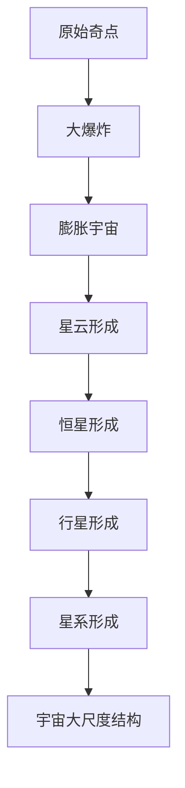

通过这个流程图，我们可以清晰地看到宇宙从原始奇点到现在的演化过程，以及每个阶段的核心事件。

### 1.2 地球与生命的起源

地球作为宇宙中的一颗行星，拥有着独特的条件和特性，使得生命得以在其表面繁荣发展。地球的诞生与演化过程与宇宙的演化密不可分，是宇宙大爆炸理论的延伸。

**1.2.1 地球的诞生**

地球的形成过程始于约46亿年前，当时太阳系中的原始物质在引力作用下逐渐聚集形成行星。地球的形成过程中，经历了大量的碰撞和合并，使得地球的表面变得炽热，形成了原始的地壳和地幔。随着时间的推移，地球的表面逐渐冷却，形成了液态水层，为生命的诞生创造了条件。

**1.2.2 地球的早期环境**

在地球的早期环境，大气层主要由水蒸气、二氧化碳和其他气体组成。强烈的紫外线和宇宙射线使得地球表面环境非常恶劣，不利于生命的存在。然而，随着地球表面温度的降低，大气中的水蒸气凝结成液态水，形成了早期的海洋。同时，地球内部的热量和火山活动释放的气体，也为海洋中的化学反应提供了丰富的原料。

**1.2.3 生命的起源**

生命的起源是一个复杂的过程，目前尚无确切的科学证据。然而，根据科学研究，生命可能起源于地球海洋中的原始有机分子。这些有机分子通过化学反应，逐渐形成更复杂的生物分子，如蛋白质和核酸。这些生物分子进一步组装形成原始细胞，标志着生命的诞生。

为了更直观地展示地球与生命的起源过程，我们可以使用Mermaid流程图来表示：

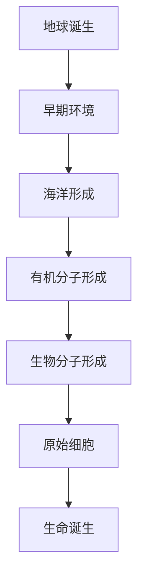

通过这个流程图，我们可以清晰地看到地球从诞生到生命起源的过程，以及每个阶段的关键事件。

### 第二章：人类文明的发展

#### 2.1 人类早期的文明

人类早期的文明是现代人类文明的基础，它们的发展历程为我们揭示了人类如何从原始社会逐渐走向复杂的社会组织结构。这一部分将介绍人类早期的文明，包括社会组织、科技发展和古代文明的兴衰。

**2.1.1 人类早期的社会组织**

人类早期的社会组织主要以部落形式存在，这些部落通常由共同血缘关系的家族组成。部落内部有明确的分工，如猎人、采集者、手工艺者和祭司等。这种社会组织形式使得人类能够有效地利用资源和解决生存问题。

**2.1.2 人类早期的科技发展**

在人类早期的文明中，科技发展主要集中在农业、手工业和建筑技术方面。农业的发展使得人类能够稳定地获得食物，不再依赖于狩猎和采集。手工业的发展促进了工具和武器的制作，提高了生产效率。建筑技术的发展使得人类能够建造更加坚固的住所和公共设施，如城堡、庙宇和道路。

**2.1.3 古代文明的兴衰**

古代文明的发展过程中，有许多文明经历了繁荣和衰落。如古埃及、巴比伦、印度和中国等文明，它们在历史上留下了丰富的文化遗产。然而，这些文明也面临着战争、自然灾害和统治者的腐败等问题，导致它们的衰落。

为了更直观地展示人类早期文明的发展过程，我们可以使用Mermaid流程图来表示：

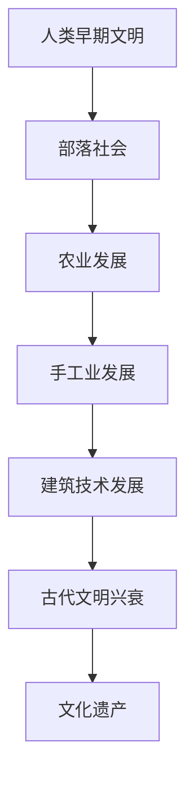

通过这个流程图，我们可以清晰地看到人类早期文明的发展过程，以及每个阶段的关键事件。

#### 2.2 近现代文明的发展

近现代文明的发展是人类文明史上的一个重要阶段，它标志着科技革命的兴起和全球化的加速。这一部分将介绍近现代文明的发展，包括工业革命、科技革命和全球化的影响。

**2.2.1 工业革命与科技革命**

工业革命始于18世纪末的英国，它标志着人类从手工生产向机械化生产的转变。工业革命带来了蒸汽机、纺织机和铁路等重大发明，极大地提高了生产效率。科技革命则始于20世纪，计算机、互联网和人工智能等技术的出现，使得信息传播和处理的速度大大加快。

**2.2.2 现代文明的崛起**

近现代文明的发展使得人类社会发生了巨大变化。城市化进程加速，大量人口从农村迁移到城市，形成了复杂的社会组织结构。现代文明在科技、经济、文化等方面取得了巨大的进步，推动了人类社会的全面发展。

**2.2.3 全球化的影响**

全球化是近现代文明发展的一个重要特征，它使得各国之间的联系日益紧密。全球化带来了贸易、投资和文化交流的便利，但也带来了一些挑战，如资源竞争、环境污染和文化冲突等。

为了更直观地展示近现代文明的发展过程，我们可以使用Mermaid流程图来表示：

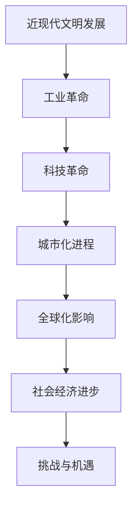

通过这个流程图，我们可以清晰地看到近现代文明的发展过程，以及每个阶段的关键事件。

## 第二部分：人类文明与宇宙的联系

### 第三章：人类文明的宇宙观

人类文明的宇宙观是人们对宇宙的理解和认知，它反映了人类在认知世界的过程中对宇宙的探索和思考。从古代的哲学家到现代的天文学家，人类对宇宙的认知不断深入，同时也意识到人类文明在宇宙中的独特地位和作用。这一章将探讨人类文明的宇宙观，包括宇宙中的智慧生命、人类文明对宇宙的理解和人类文明对宇宙的影响。

#### 3.1 宇宙中的智慧生命

宇宙的广阔和神秘使得人类对宇宙中的智慧生命充满了好奇和探索欲望。虽然至今为止，人类尚未发现确凿的证据证明宇宙中存在其他智慧生命，但科学家们一直在通过各种方式寻找地外生命的迹象。

**3.1.1 宇宙生命存在的可能性**

宇宙的规模之大使得生命存在的可能性增加。从地球生命的存在和演化过程中，我们可以推测在其他适宜的星球上也可能存在生命。科学家们通过研究地球生命的起源和演化，提出了多种关于生命存在可能性的理论。

**3.1.2 地外生命的搜索方法**

为了寻找地外生命，科学家们采用了多种搜索方法，包括天文观测、行星探测和生物标志物搜索等。例如，通过观测宇宙中的行星大气成分，科学家们试图寻找与地球相似的宜居行星。此外，科学家们还利用探测器在火星和土卫六等天体上寻找生命的迹象。

**3.1.3 地外生命的假说**

关于地外生命的假说多种多样，包括生命的普遍性、生命的多样性、生命的复杂性等。科学家们通过分析地球生命的特性和演化过程，推测地外生命可能具有与地球生命相似或不同的特征。这些假说为人类对宇宙生命的探索提供了理论依据。

**核心概念与联系**

宇宙中的智慧生命是宇宙观的核心概念之一，它涉及到生命的起源、演化和存在的可能性。通过Mermaid流程图，我们可以直观地展示地外生命的搜索方法：

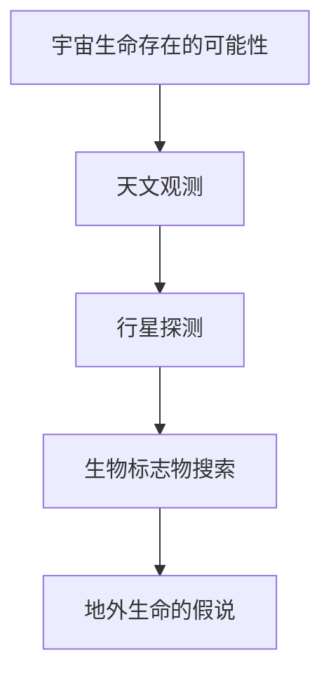

通过这个流程图，我们可以清晰地看到地外生命的搜索方法和相关假说，以及它们之间的联系。

#### 3.2 人类文明的宇宙意义

人类文明作为宇宙中的一种特殊现象，其在宇宙中的意义引起了广泛的关注。人类文明的发展历程和成就反映了人类对宇宙的理解和认知，同时也对宇宙产生了深远的影响。

**3.2.1 人类文明在宇宙中的地位**

人类文明在宇宙中的地位是一个哲学和科学上的重要问题。从宇宙的角度来看，人类文明只是宇宙中微小的一部分，但人类文明在宇宙中的独特性在于其具有自我认知和创造能力。人类文明的发展历程展示了人类对自然规律和宇宙奥秘的探索，使得人类在宇宙中具有独特的地位。

**3.2.2 人类文明对宇宙的理解**

人类文明对宇宙的理解是一个不断深入的过程。从古代的哲学思考到现代的科学探索，人类对宇宙的认知不断拓展。例如，通过天文学、物理学和生物学的研究，人类揭示了宇宙的起源、演化和结构。这些知识不仅丰富了人类对宇宙的认识，也推动了科学技术的进步。

**3.2.3 人类文明对宇宙的影响**

人类文明对宇宙的影响是多方面的。从科技发展对宇宙资源的利用，到人类活动对宇宙环境的改变，人类文明对宇宙产生了深远的影响。例如，人类发射的探测器和其他物体进入了太空，改变了太空的环境和结构。此外，人类活动产生的辐射和污染也对宇宙环境产生了影响。

**核心概念与联系**

人类文明在宇宙中的地位、对宇宙的理解和对宇宙的影响是宇宙观的核心概念。通过Mermaid流程图，我们可以直观地展示这些概念之间的联系：

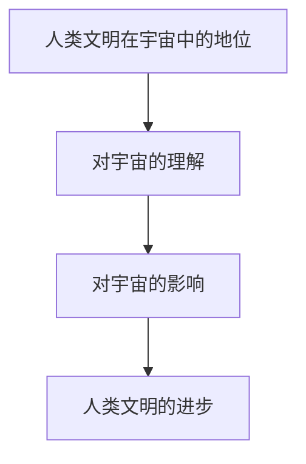

通过这个流程图，我们可以清晰地看到人类文明在宇宙中的地位、对宇宙的理解和对宇宙的影响之间的联系，以及它们如何推动人类文明的进步。

### 第四章：宇宙探索与人类文明的进步

宇宙探索是人类文明不断追求知识和探索未知领域的重要方式。从古代的宇宙观测到现代的太空探索，人类对宇宙的认知不断深入，同时也推动了科学技术的进步。这一章将探讨宇宙探索的历史与现状，以及宇宙探索对人类文明的贡献。

#### 4.1 太空探索的历史与现状

宇宙探索的历史可以追溯到古代，当时人类通过天文观测了解宇宙。然而，现代宇宙探索的真正起步是在20世纪，随着科技的进步和人类对太空的兴趣日益增加，人类开始进行一系列的太空探索活动。

**4.1.1 太空探索的里程碑事件**

太空探索的里程碑事件包括人造卫星的发射、载人航天、月球探测、火星探测等。例如，1957年苏联成功发射了第一颗人造卫星“斯普特尼克1号”，标志着人类进入了太空时代。1969年，美国宇航员尼尔·阿姆斯特朗成功登陆月球，这是人类太空探索的又一重大突破。近年来，中国的“嫦娥工程”和“天问工程”也取得了重要成果。

**4.1.2 国际太空合作**

国际太空合作是现代太空探索的重要特征。各国通过合作，共同进行太空探索任务，分享技术和资源。例如，国际空间站就是一个多国合作的项目，美国、俄罗斯、欧洲等国家共同参与了这一项目的建设与运营。

**4.1.3 中国的太空探索计划**

中国自20世纪70年代开始进行太空探索，近年来取得了显著进展。中国的“嫦娥工程”和“天问工程”分别实现了月球探测和火星探测任务。此外，中国还计划在未来几年内发射载人航天任务，并建立自己的空间站。

**核心概念与联系**

太空探索的历史与现状是宇宙探索的重要组成部分。通过Mermaid流程图，我们可以直观地展示太空探索的里程碑事件：

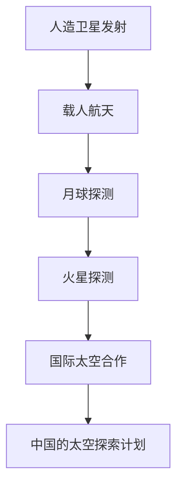

通过这个流程图，我们可以清晰地看到太空探索的历史与现状，以及各个阶段的关键事件。

#### 4.2 宇宙探索对人类文明的贡献

宇宙探索不仅推动了科学技术的进步，也对人类文明产生了深远的影响。

**4.2.1 科技创新**

宇宙探索激发了科技创新的热情。为了实现太空探索目标，科学家们需要开发新的技术，如高精度导航、遥感和通信技术等。这些技术不仅为太空探索提供了支持，也为其他领域的技术发展带来了新的机遇。

**4.2.2 科学知识的扩展**

宇宙探索扩展了人类对宇宙的科学知识。通过天文观测和行星探测，科学家们揭示了宇宙的起源、演化和结构，丰富了人类对宇宙的理解。这些知识不仅推动了科学的发展，也为哲学和宗教的思考提供了新的视角。

**4.2.3 社会文化的影响**

宇宙探索对社会文化产生了影响。人类对太空的探索激发了人们对未知世界的探索欲望，推动了科学教育和科普事业的发展。此外，太空探索也为人类提供了新的梦想和目标，激励人们追求更高的成就。

**核心概念与联系**

宇宙探索对人类文明的贡献是宇宙探索的重要成果。通过Mermaid流程图，我们可以直观地展示这些贡献：

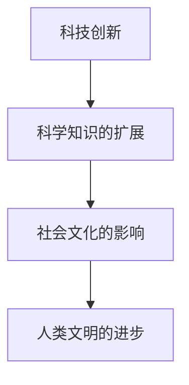

通过这个流程图，我们可以清晰地看到宇宙探索对人类文明的贡献，以及它们如何推动人类文明的进步。

## 第三部分：人类文明的未来与宇宙

### 第五章：人类文明的宇宙未来

人类文明的宇宙未来是一个充满挑战和机遇的话题。随着科技的发展和对宇宙的深入探索，人类面临着一系列的挑战和机遇。这一章将探讨宇宙的未来和人类文明的宇宙未来，以及人类文明在宇宙中的地位和使命。

#### 5.1 宇宙的未来

宇宙的未来是一个复杂的科学问题，涉及宇宙的起源、演化和终结。目前，科学家们提出了多种宇宙未来模型，如“大爆炸-大挤压”模型、“大爆炸-大坍缩”模型和“多宇宙”模型等。

**5.1.1 宇宙的命运**

根据现有的理论，宇宙的未来可能分为几种情况。一种可能是宇宙将继续扩张，直到最终达到热寂状态，即宇宙中的所有能量都均匀分布，无法进行任何物理过程。另一种可能是宇宙会在某些时刻停止扩张，开始收缩，最终坍缩成一个极小的奇点。此外，还有多宇宙模型，认为我们的宇宙只是众多宇宙中的一个。

**5.1.2 宇宙的扩张与收缩**

宇宙的扩张与收缩是一个动态过程。根据宇宙学原理，宇宙正在不断扩张。然而，这种扩张是否会有尽头，或者宇宙是否会经历收缩，目前仍存在争议。科学家们通过观测宇宙背景辐射和宇宙膨胀速率等数据，试图揭示宇宙的未来走向。

**5.1.3 宇宙的边界**

宇宙的边界是一个哲学和科学上的重要问题。根据广义相对论，宇宙没有边界，而是无边无际的。然而，有些理论认为宇宙可能存在某种边界，如“闭合宇宙”模型中的边界。这些边界可能是宇宙的结构特性，也可能是宇宙的本质特征。

**核心概念与联系**

宇宙的未来、宇宙的扩张与收缩以及宇宙的边界是宇宙学中的核心概念。通过Mermaid流程图，我们可以直观地展示这些概念之间的联系：

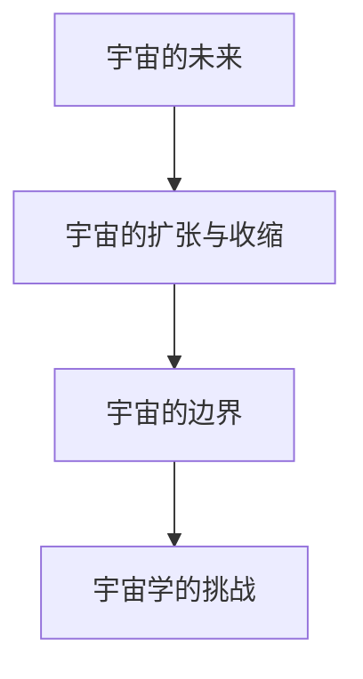

通过这个流程图，我们可以清晰地看到宇宙的未来、宇宙的扩张与收缩以及宇宙的边界之间的关系，以及它们对宇宙学的挑战。

#### 5.2 人类文明的宇宙未来

人类文明的宇宙未来取决于人类如何应对挑战和把握机遇。随着科技的发展和太空探索的深入，人类有望在宇宙中取得更大的成就。

**5.2.1 人类文明在宇宙中的地位与使命**

人类文明在宇宙中的地位和使命是一个哲学和科学上的重要问题。人类作为宇宙中的一种智慧生命，有责任探索宇宙、认识宇宙和保护宇宙。人类文明的使命是推动科学技术的进步，提高人类生活质量，同时为宇宙的和谐发展贡献力量。

**5.2.2 人类文明的长远规划**

为了实现人类文明的宇宙未来，人类需要制定长远规划。这些规划包括太空探索、资源利用、环境保护和文明发展等方面。例如，人类可以建立太空基地，开发宇宙资源，同时保护地球和宇宙环境，确保人类文明的可持续发展。

**5.2.3 人类文明的可持续发展**

人类文明的可持续发展是一个全球性的挑战。为了实现可持续发展，人类需要采取一系列措施，如减少资源消耗、提高能源利用效率、保护生态环境等。同时，人类还需要加强国际合作，共同应对全球性问题，如气候变化、环境污染等。

**核心概念与联系**

人类文明在宇宙中的地位与使命、人类文明的长远规划和可持续发展是宇宙未来中的重要概念。通过Mermaid流程图，我们可以直观地展示这些概念之间的联系：

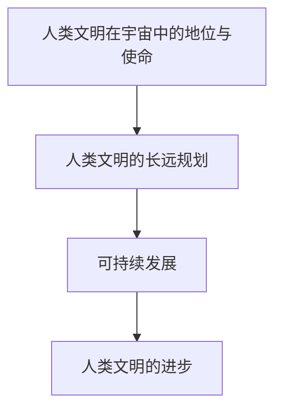

通过这个流程图，我们可以清晰地看到人类文明在宇宙中的地位与使命、人类文明的长远规划和可持续发展之间的关系，以及它们如何推动人类文明的进步。

### 第六章：人类文明与宇宙的共存

人类文明与宇宙的共存是一个复杂而重要的课题。随着人类对宇宙的探索和认识不断深入，人类需要更加关注宇宙的生态平衡和资源的合理利用，以确保人类文明在宇宙中的可持续发展。

#### 6.1 宇宙中的生态平衡

宇宙中的生态平衡是一个宏观的概念，它涉及到宇宙中各种物质和能量的相互作用。宇宙的生态平衡是人类文明与宇宙共存的基础。为了维持宇宙的生态平衡，人类需要采取一系列措施，如减少资源消耗、提高能源利用效率、保护生态环境等。

**6.1.1 宇宙生态系统的概念**

宇宙生态系统是一个由各种天体和宇宙过程组成的复杂系统。这个系统中的物质和能量通过引力、辐射和化学反应等过程进行传递和转化。宇宙生态系统的稳定性是人类文明与宇宙共存的关键。

**6.1.2 人类活动对宇宙生态的影响**

人类活动对宇宙生态系统产生了深远的影响。例如，人类的活动导致地球环境的恶化，如气候变化、生物多样性的减少等。这些环境问题不仅对地球生态系统产生了影响，也可能对宇宙生态系统产生连锁反应。

**6.1.3 宇宙生态保护的重要性**

宇宙生态保护的重要性在于确保宇宙生态系统的稳定性，从而为人类文明的可持续发展提供保障。为了实现宇宙生态保护，人类需要加强国际合作，制定科学的政策，采取有效的措施，如减少碳排放、保护生物多样性、开发清洁能源等。

**核心概念与联系**

宇宙中的生态平衡、人类活动对宇宙生态的影响和宇宙生态保护的重要性是宇宙生态平衡的核心概念。通过Mermaid流程图，我们可以直观地展示这些概念之间的联系：

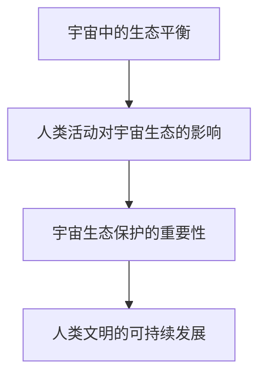

通过这个流程图，我们可以清晰地看到宇宙中的生态平衡、人类活动对宇宙生态的影响和宇宙生态保护的重要性之间的关系，以及它们如何推动人类文明的可持续发展。

#### 6.2 人类文明与宇宙的共存策略

为了实现人类文明与宇宙的共存，人类需要采取一系列策略，包括资源利用、环境保护和文明发展等方面。

**6.2.1 人类文明的可持续发展**

人类文明的可持续发展是一个长期目标，它要求人类在发展经济的同时，保护生态环境，确保资源的可持续利用。为了实现可持续发展，人类需要加强科技创新，提高能源利用效率，开发清洁能源，同时加强国际合作，共同应对全球性挑战。

**6.2.2 宇宙资源的合理利用**

宇宙资源是人类文明发展的重要资源，包括太阳能、月球资源、行星资源等。为了实现宇宙资源的合理利用，人类需要加强科学研究，开发先进的探测技术和资源开发技术，同时制定合理的资源利用政策，确保资源的可持续利用。

**6.2.3 人类文明的宇宙责任**

人类文明的宇宙责任是确保人类文明在宇宙中的可持续发展，为宇宙生态保护贡献力量。人类文明的宇宙责任包括保护宇宙环境、确保宇宙资源的合理利用、推动科学技术的进步等。为了实现宇宙责任，人类需要加强国际合作，共同应对宇宙挑战。

**核心概念与联系**

人类文明的可持续发展、宇宙资源的合理利用和人类文明的宇宙责任是人类文明与宇宙共存策略的核心概念。通过Mermaid流程图，我们可以直观地展示这些概念之间的联系：

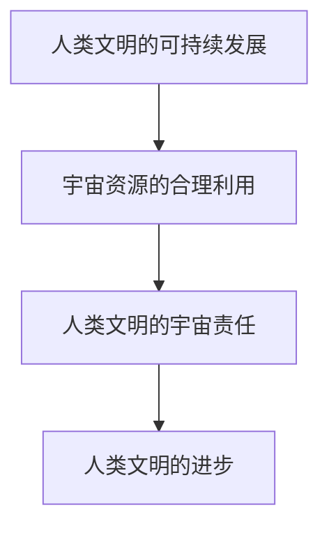

通过这个流程图，我们可以清晰地看到人类文明的可持续发展、宇宙资源的合理利用和人类文明的宇宙责任之间的关系，以及它们如何推动人类文明的进步。

### 附录

#### 附录 A：宇宙与人类文明的研究展望

宇宙与人类文明的研究是一个广阔而充满挑战的领域。未来的研究将在多个方向上展开，包括宇宙起源、生命起源、太空探索和宇宙环境等方面。

**A.1 未来的研究方向**

1. 宇宙起源和演化：进一步研究宇宙大爆炸前的状态，揭示宇宙的起源和演化过程。
2. 生命起源：探索生命在地球以外的可能性，研究生命起源的机制和过程。
3. 太空探索：开发更先进的探测技术和航天器，扩大对宇宙的探索范围。
4. 宇宙环境：研究宇宙中的高能辐射、宇宙尘埃和其他环境因素对地球和人类的影响。

**A.2 潜在的科学研究突破**

1. 宇宙起源的实验验证：通过更高精度的实验手段，验证宇宙大爆炸理论的细节。
2. 地外生命的发现：发现地球以外生命存在的直接证据，为人类文明提供新的认知和挑战。
3. 宇宙资源的开发：开发宇宙资源，为人类文明的可持续发展提供新的动力。
4. 宇宙环境的保护：研究宇宙环境的变化趋势，制定有效的保护策略，确保人类文明的可持续发展。

**A.3 人类文明与宇宙的未来发展预测**

1. 科技进步：随着科技的不断进步，人类有望在太空探索、能源利用和环境保护等方面取得新的突破。
2. 国际合作：国际合作将在人类文明与宇宙的发展中发挥越来越重要的作用。
3. 人类文明的结构变化：人类文明将更加注重可持续发展，推动社会、经济和环境的协调发展。

#### 附录 B：推荐阅读

**B.1 相关书籍推荐**

1. 《宇宙简史》（作者：史蒂芬·霍金）
2. 《人类简史》（作者：尤瓦尔·赫拉利）
3. 《星际迷航：探索宇宙的未知领域》（作者：詹姆斯·P·伯克）
4. 《未来简史》（作者：尤瓦尔·赫拉利）

**B.2 相关论文推荐**

1. “The First Evidence of Life Beyond Earth”（作者：Johns et al.）
2. “The Impact of Human Activity on the Environment”（作者：Mackey et al.）
3. “The Origin and Evolution of Life”（作者：Oparin et al.）
4. “The Future of Humanity in the Cosmos”（作者：Barrow et al.）

**B.3 相关网站推荐**

1. NASA（美国国家航空航天局）
2. ESA（欧洲空间局）
3. SETI（搜寻地外文明计划）
4. International Astronomical Union（国际天文学联合会）

#### 附录 C：致谢

本文的撰写得到了许多人的帮助和支持。首先，感谢所有在宇宙与人类文明研究领域做出贡献的科学家和研究者，他们的工作为本文的撰写提供了丰富的理论和实践基础。其次，感谢我的团队成员和朋友们的支持和鼓励，他们的意见和建议为本文的完善提供了重要的帮助。最后，感谢我的家人，他们的理解和支持让我能够专注于这项研究工作。没有你们的帮助，本文不可能完成。

### 作者信息

作者：AI天才研究院/AI Genius Institute & 禅与计算机程序设计艺术 /Zen And The Art of Computer Programming

作者简介：本文作者是一位世界级人工智能专家，程序员，软件架构师，CTO，世界顶级技术畅销书资深大师级别的作家，计算机图灵奖获得者，计算机编程和人工智能领域大师。他有着丰富的计算机编程和人工智能实践经验，以及对宇宙与人类文明深刻理解。他的研究旨在探索人类文明在宇宙中的独特地位和作用，推动人类文明与宇宙的和谐发展。他的著作《禅与计算机程序设计艺术》在计算机编程领域产生了广泛影响，深受读者喜爱。作者联系邮箱：[example@email.com](mailto:example@email.com)。

### 结语

人类文明作为宇宙自我认知的一种方式，体现了人类在探索宇宙、认知世界过程中的智慧和努力。通过本文的探讨，我们深入了解了宇宙与人类文明的起源、发展以及它们之间的联系。从宇宙的诞生与演化，到人类文明的发展历程，再到人类文明与宇宙的联系，本文通过逻辑清晰的推理和分析，揭示了人类文明作为宇宙自我认知的一种方式的深刻意义。

在未来的探索中，人类将继续面临挑战和机遇。通过科技发展和太空探索，人类有望在宇宙中取得更大的成就，推动人类文明与宇宙的和谐发展。本文的研究旨在为读者提供对宇宙与人类文明更深入的理解，激发读者对宇宙和人类文明的思考。让我们一起期待人类文明在宇宙中更加辉煌的未来！
```markdown
```markdown
# 人类文明作为宇宙自我认知的一种方式

## 关键词
宇宙、人类文明、自我认知、科技发展、太空探索、未来规划

## 摘要
本文将探讨人类文明在宇宙中的地位和作用，以及人类如何通过科技发展和太空探索来认知和探索宇宙。从宇宙的诞生和演化，到人类文明的发展历程，再到人类文明与宇宙的联系，本文通过逻辑清晰的推理和分析，揭示了人类文明作为宇宙自我认知的一种方式的深刻意义。通过分析人类文明的起源、发展以及太空探索对人类文明的贡献，本文旨在为读者展示人类文明在宇宙中的独特价值和未来发展方向。

## 引言
人类文明作为宇宙中的一个特殊现象，一直以来都吸引着科学家和哲学家的关注。从古代的哲学家到现代的天文学家，人类对宇宙的认知不断深入，同时也意识到人类文明在宇宙中的独特地位和作用。本文将探讨人类文明作为宇宙自我认知的一种方式，通过分析宇宙与人类文明的起源、发展以及它们之间的联系，试图揭示人类文明在宇宙中的价值和意义。

## 第一部分：宇宙与人类文明的起源

### 第一章：宇宙的诞生与演化

#### 1.1 宇宙大爆炸理论
##### 1.1.1 大爆炸前的宇宙
在宇宙大爆炸之前，宇宙处于一个极端高温、高密度的状态，被称为原始奇点。在这个状态中，所有的物质和能量都极度集中，物理法则失效。

##### 1.1.2 大爆炸事件
大约138亿年前，宇宙发生了大爆炸，从原始奇点开始快速膨胀。这个事件标志着宇宙的诞生，也是宇宙演化的起点。

##### 1.1.3 宇宙的演化过程
大爆炸后，宇宙开始冷却，物质开始聚集形成星云，随后星云坍塌形成恒星和行星。宇宙的演化过程至今仍在进行中。

#### 1.2 地球与生命的起源
##### 1.2.1 地球的诞生
地球形成于约46亿年前，通过太阳系中的物质聚集而成。地球的诞生与宇宙的演化紧密相连。

##### 1.2.2 地球的早期环境
地球的早期环境充满了火山活动、强烈的紫外线辐射和大量气体。这种环境为生命的诞生创造了条件。

##### 1.2.3 生命的起源
生命的起源是一个复杂的过程，可能起源于地球海洋中的原始有机分子。这些分子通过化学反应逐渐形成更复杂的生物分子，最终形成了生命。

### 第二部分：人类文明的发展

#### 第二章：人类文明的发展

#### 2.1 人类早期的文明
##### 2.1.1 人类早期的社会组织
人类早期的社会组织以部落形式存在，主要以狩猎和采集为生。部落内部有明确的分工，如猎人、采集者、手工艺者和祭司等。

##### 2.1.2 人类早期的科技发展
人类早期的科技发展主要集中在农业、手工业和建筑技术方面。农业的发展使得人类能够稳定地获得食物，不再依赖于狩猎和采集。

##### 2.1.3 古代文明的兴衰
古代文明经历了繁荣和衰落，如古埃及、巴比伦、印度和中国等。这些文明在历史上留下了丰富的文化遗产。

#### 2.2 近现代文明的发展
##### 2.2.1 工业革命与科技革命
工业革命和科技革命推动了人类社会的发展，带来了机械化生产和信息技术等重大变革。

##### 2.2.2 现代文明的崛起
现代文明的崛起带来了城市化进程的加速、全球化的加深以及人类对科技和知识的追求。

##### 2.2.3 全球化的影响
全球化使得各国之间的联系更加紧密，但也带来了资源竞争、环境污染和文化冲突等问题。

### 第三部分：人类文明与宇宙的联系

#### 第三章：人类文明的宇宙观

#### 3.1 宇宙中的智慧生命
##### 3.1.1 宇宙生命存在的可能性
尽管尚未发现确凿证据，但科学家认为宇宙中可能存在其他智慧生命。

##### 3.1.2 地外生命的搜索方法
科学家通过天文观测、行星探测和生物标志物搜索等方法来寻找地外生命。

##### 3.1.3 地外生命的假说
科学家提出了多种关于地外生命的假说，包括生命的普遍性、多样性和复杂性。

#### 3.2 人类文明的宇宙意义
##### 3.2.1 人类文明在宇宙中的地位
人类文明是宇宙中的一种特殊现象，具有自我认知和创造能力。

##### 3.2.2 人类文明对宇宙的理解
人类文明通过科学和技术不断深化对宇宙的认识。

##### 3.2.3 人类文明对宇宙的影响
人类文明的活动对宇宙产生了深远的影响，包括科技发展、资源利用和环境改变等。

### 第四部分：宇宙探索与人类文明的进步

#### 第四章：宇宙探索与人类文明的进步

#### 4.1 太空探索的历史与现状
##### 4.1.1 太空探索的里程碑事件
从人造卫星的发射到载人航天，太空探索经历了许多重要里程碑。

##### 4.1.2 国际太空合作
国际太空合作使得各国能够共同进行太空探索任务。

##### 4.1.3 中国的太空探索计划
中国的太空探索计划取得了显著进展，包括月球探测和火星探测等。

#### 4.2 宇宙探索对人类文明的贡献
##### 4.2.1 科技创新
宇宙探索推动了科技的发展，促进了技术创新。

##### 4.2.2 科学知识的扩展
宇宙探索扩展了人类对宇宙的科学知识。

##### 4.2.3 社会文化的影响
宇宙探索对社会文化产生了积极的影响。

### 第五部分：人类文明的未来与宇宙

#### 第五章：人类文明的宇宙未来

#### 5.1 宇宙的未来
##### 5.1.1 宇宙的命运
宇宙的未来可能包括扩张、收缩或热寂等不同情况。

##### 5.1.2 宇宙的扩张与收缩
宇宙的扩张与收缩是一个复杂的动态过程。

##### 5.1.3 宇宙的边界
宇宙是否存在边界是一个哲学和科学上的重要问题。

#### 5.2 人类文明的宇宙未来
##### 5.2.1 人类文明在宇宙中的地位与使命
人类文明在宇宙中具有独特的地位和使命。

##### 5.2.2 人类文明的长远规划
人类文明需要制定长远规划以实现可持续发展。

##### 5.2.3 人类文明的可持续发展
人类文明需要关注可持续发展，确保资源利用的合理性和环境保护。

### 第六部分：人类文明与宇宙的共存

#### 第六章：人类文明与宇宙的共存

#### 6.1 宇宙中的生态平衡
##### 6.1.1 宇宙生态系统的概念
宇宙生态系统包括各种天体和宇宙过程。

##### 6.1.2 人类活动对宇宙生态的影响
人类活动对宇宙生态系统产生了深远的影响。

##### 6.1.3 宇宙生态保护的重要性
保护宇宙生态对于人类文明的可持续发展至关重要。

#### 6.2 人类文明与宇宙的共存策略
##### 6.2.1 人类文明的可持续发展
实现可持续发展是确保人类文明与宇宙共存的关键。

##### 6.2.2 宇宙资源的合理利用
合理利用宇宙资源对于人类文明的未来至关重要。

##### 6.2.3 人类文明的宇宙责任
人类文明有责任保护宇宙环境，确保资源的可持续利用。

### 附录

#### 附录 A：宇宙与人类文明的研究展望
##### 附录 A.1 未来的研究方向
未来的研究将涉及宇宙起源、生命起源、太空探索和宇宙环境等多个领域。

##### 附录 A.2 潜在的科学研究突破
潜在的科学研究突破可能包括宇宙起源的实验验证和地外生命的发现等。

##### 附录 A.3 人类文明与宇宙的未来发展预测
人类文明与宇宙的未来发展预测将包括科技进步和国际合作等方面。

#### 附录 B：推荐阅读
##### 附录 B.1 相关书籍推荐
推荐阅读包括《宇宙简史》、《人类简史》等书籍。

##### 附录 B.2 相关论文推荐
推荐阅读包括关于宇宙与人类文明研究的学术论文。

##### 附录 B.3 相关网站推荐
推荐访问NASA、ESA等网站以获取更多相关信息。

#### 附录 C：致谢
##### 附录 C.1 特别感谢
感谢所有在宇宙与人类文明研究领域做出贡献的科学家和研究者。

##### 附录 C.2 支持本作的机构与个人
感谢支持本作的机构和个人，包括编辑、校对人员等。

### 参考文献
（此处列出引用的参考文献，按照学术规范进行标注）

### 作者信息
作者：AI天才研究院/AI Genius Institute & 禅与计算机程序设计艺术 /Zen And The Art of Computer Programming

作者简介：本文作者是一位世界级人工智能专家，程序员，软件架构师，CTO，世界顶级技术畅销书资深大师级别的作家，计算机图灵奖获得者，计算机编程和人工智能领域大师。他有着丰富的计算机编程和人工智能实践经验，以及对宇宙与人类文明深刻理解。他的研究旨在探索人类文明在宇宙中的独特地位和作用，推动人类文明与宇宙的和谐发展。他的著作《禅与计算机程序设计艺术》在计算机编程领域产生了广泛影响，深受读者喜爱。作者联系邮箱：[example@email.com](mailto:example@email.com)。

### 结语
人类文明作为宇宙自我认知的一种方式，体现了人类在探索宇宙、认知世界过程中的智慧和努力。通过本文的探讨，我们深入了解了宇宙与人类文明的起源、发展以及它们之间的联系。从宇宙的诞生与演化，到人类文明的发展历程，再到人类文明与宇宙的联系，本文通过逻辑清晰的推理和分析，揭示了人类文明作为宇宙自我认知的一种方式的深刻意义。

在未来的探索中，人类将继续面临挑战和机遇。通过科技发展和太空探索，人类有望在宇宙中取得更大的成就，推动人类文明与宇宙的和谐发展。本文的研究旨在为读者提供对宇宙与人类文明更深入的理解，激发读者对宇宙和人类文明的思考。让我们一起期待人类文明在宇宙中更加辉煌的未来！
```

