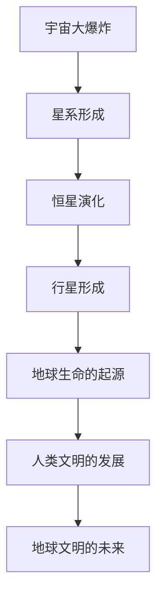

                 

### 人类文明在宇宙生命周期中的位置

> **关键词：宇宙、地球文明、生命起源、科技进步、未来探索**

> **摘要：本文探讨了人类文明在宇宙生命周期中的位置。从宇宙大爆炸到地球生命的起源，再到人类文明的技术进步与挑战，本文逐步分析地球文明在宇宙中的地位与未来，提出了关于地球文明与宇宙生命的共生关系的思考。**

在浩瀚的宇宙中，地球文明犹如一粒尘埃。然而，正是这粒尘埃上孕育出了智慧生命，发展出了璀璨的文明。人类作为地球文明的代表，站在科技的前沿，不断探索宇宙的奥秘。本文将运用逻辑清晰、结构紧凑、简单易懂的的技术语言，逐步分析地球文明在宇宙生命周期中的位置，探讨其未来可能的发展方向。

### 目录大纲

1. **宇宙与地球文明的探索**
   1.1 宇宙的起源与演化
   1.2 星系、行星与地球的起源
   1.3 地球生命的起源与发展
2. **地球文明的现状与挑战**
   2.1 人类文明的技术进步
   2.2 地球文明面临的挑战
3. **地球文明在宇宙中的位置与未来**
   3.1 地球文明在宇宙中的地位
   3.2 地球文明的宇宙探索计划
   3.3 地球文明的未来与宇宙生命的共生
4. **附录**
   4.1 宇宙与地球文明的重要发现与探索

通过以上的目录大纲，我们将从宇宙的起源、地球生命的起源与发展、人类文明的技术进步与面临的挑战、地球文明在宇宙中的地位与未来探索等多个方面，全面深入地探讨人类文明在宇宙生命周期中的位置。希望读者能跟随本文的思路，逐步了解地球文明在宇宙中的独特地位与未来可能的发展方向。

### 第一部分：宇宙与地球文明的探索

#### 第1章：宇宙的起源与演化

宇宙，这个浩瀚无垠的空间，自古以来就吸引着人类的目光。科学家们通过观测和研究，提出了宇宙的起源与演化理论。其中，最广为人知的便是宇宙大爆炸理论。

**1.1 宇宙大爆炸理论**

宇宙大爆炸理论认为，宇宙起源于一个极度热密的状态，大约在138亿年前，这个状态发生了剧烈的爆炸，导致宇宙膨胀。这一理论得到了大量观测数据的支持，例如宇宙微波背景辐射、星系的红移等。

**1.2 宇宙生命周期与星系形成**

宇宙的演化过程可以分为多个阶段。首先是宇宙的膨胀，随后在膨胀的过程中形成了星系、恒星和行星。星系是由数十亿甚至数千亿颗恒星组成的庞大系统，它们通过引力相互作用，形成了一个有序的结构。

**1.3 宇宙的暗物质与暗能量**

宇宙中存在着大量的暗物质和暗能量，它们对宇宙的演化起着至关重要的作用。暗物质不发光，也不与光发生相互作用，但其引力作用对星系的形成和宇宙的膨胀具有重要意义。暗能量则是推动宇宙加速膨胀的神秘力量，其本质和来源仍然是科学界的研究课题。

**1.4 星系、行星与地球的起源**

星系的形成过程中，恒星和行星逐渐形成。恒星是在星系中心的分子云中诞生的，通过核聚变产生能量，并释放出光芒。行星则是在恒星周围的星盘上形成的，通过物质聚集和引力作用，形成了各种不同类型的行星。

地球作为太阳系中的一员，大约在45亿年前形成。地球的形成过程中，经历了多次撞击和火山活动，形成了现今的地壳和大气层。地球的早期环境非常恶劣，但随着时间的推移，地球逐渐变得宜居，为生命的诞生创造了条件。

#### 第2章：地球生命的起源与发展

**2.1 地球早期的环境与条件**

地球早期的大气层主要由二氧化碳、氮气和水蒸气组成，没有氧气。这种环境为生命的诞生提供了必要的条件。水是生命的基础，地球上的液态水为生命的化学进化提供了场所。

**2.2 化学进化与生命的诞生**

化学进化是指无机物质通过化学反应逐步形成有机物质，最终形成生命的过程。地球上的原始汤中，氨基酸、核苷酸等有机分子通过聚合反应，逐渐形成了更复杂的有机分子，这些有机分子进一步形成了原始细胞。

**2.3 生命的多样化与物种演化**

生命在地球上迅速多样化，形成了各种不同的生物。物种演化是通过自然选择、遗传变异等机制进行的。地球上的生物经历了多次大灭绝事件，每一次大灭绝都使得生物多样性发生了巨大的变化。

**2.4 人类文明的历史与演变**

人类作为地球文明的一部分，经历了数百万年的进化。从原始社会到现代社会，人类文明不断发展，取得了许多重要的科技成就。人类在探索宇宙、理解自然规律的道路上，不断向前迈进。

### 第二部分：地球文明的现状与挑战

#### 第3章：人类文明的技术进步

**3.1 从石器时代到信息时代**

人类文明的发展历程中，技术进步起到了至关重要的作用。从石器时代到青铜时代，再到铁器时代，人类逐渐掌握了金属加工技术，推动了社会的发展。进入工业时代，蒸汽机、电力等技术的发明和应用，使得人类的生产力得到了极大的提升。随着计算机和互联网的出现，人类进入了信息时代，信息技术的飞速发展改变了人类的生活方式。

**3.2 人工智能与科技进步的未来**

人工智能作为现代科技的代表，正在深刻地改变着人类社会。通过深度学习、自然语言处理等技术，人工智能在图像识别、语音识别、自动驾驶等领域取得了重大突破。未来，人工智能有望在医疗、教育、金融等领域发挥更大的作用，推动人类文明向前发展。

**3.3 新能源与环境可持续性**

随着全球人口的快速增长和工业化进程的加速，能源需求和环境污染问题日益严重。新能源技术的研发和推广，如太阳能、风能、核能等，为解决能源和环境问题提供了重要途径。人类需要努力实现能源的可持续发展，为地球的生态系统和人类文明的未来创造良好的环境。

**3.4 空间探索与外太空生命探秘**

人类对宇宙的探索从未停止。通过航天技术的发展，人类已经成功登陆月球，探测器也前往了火星、木星等行星。未来，人类有望实现星际旅行，探索外太空的生命。空间探索不仅有助于人类了解宇宙的奥秘，也可能为地球文明提供新的资源和发展机遇。

#### 第4章：地球文明面临的挑战

**4.1 资源枯竭与环境保护**

地球上的自然资源是有限的，随着人类活动的加剧，许多资源正在逐渐枯竭。同时，环境污染问题也日益严重，威胁到地球生态系统的平衡。人类需要采取有效措施，合理利用资源，保护环境，确保地球的可持续发展。

**4.2 全球气候变化与自然灾害**

全球气候变化已经成为一个不可忽视的问题。温室气体的排放导致地球气温上升，引发了极端天气事件和自然灾害。人类需要加强气候变化研究，采取行动减少温室气体排放，降低气候变化对地球的影响。

**4.3 人口增长与社会发展**

全球人口持续增长，给社会发展和资源分配带来了巨大压力。同时，人口老龄化问题也日益突出。人类需要通过科技创新和社会制度改革，提高人口素质，实现可持续发展。

**4.4 人工智能与伦理道德**

人工智能的发展给人类社会带来了巨大的机遇，但同时也带来了伦理道德问题。如何确保人工智能的发展符合人类的利益，避免对人类造成伤害，是人类需要深思的问题。人类需要制定相应的法律法规，规范人工智能的发展，确保其安全、可靠和可持续。

### 第三部分：地球文明在宇宙中的位置与未来

#### 第5章：地球文明在宇宙中的地位

**5.1 地球文明与宇宙其他文明的联系**

地球文明是宇宙中唯一已知的智慧文明，但这并不意味着宇宙中不存在其他智慧文明。科学家们一直在寻找宇宙中可能存在的外星文明。通过对宇宙的观测和研究，人类已经发现了一些可能存在外星生命的迹象。例如，某些行星的大气成分与地球相似，可能具备生命存在的条件。

**5.2 地球文明在银河系中的位置**

银河系是地球所在的星系，包含了数千亿颗恒星。地球位于银河系的猎户臂上，距离银心约25,000光年。银河系中的恒星和行星数量巨大，人类对银河系的了解仍然非常有限。未来，随着科技的进步，人类有望对银河系进行更深入的探索，发现更多未知的生命和文明。

**5.3 宇宙文明与人类价值观的冲突与融合**

如果宇宙中真的存在其他文明，这些文明与地球文明之间可能会存在价值观的冲突。不同的文明可能有不同的信仰、道德和法律体系。如何处理这些冲突，实现文明之间的融合与共存，是一个亟待解决的问题。人类需要通过对话和交流，寻求共同点，建立互信，推动宇宙文明的和谐发展。

**5.4 地球文明的历史使命与未来愿景**

地球文明在宇宙中的地位虽然微小，但具有重大的历史使命。人类需要不断探索宇宙的奥秘，寻找宇宙生命的规律和意义。同时，人类也需要关注地球文明的可持续发展，为地球和宇宙的未来贡献力量。通过科技、文化、道德等各个方面的努力，人类有望实现地球文明与宇宙文明的和谐共生。

#### 第6章：地球文明的宇宙探索计划

**6.1 宇宙探索的目标与意义**

宇宙探索是地球文明的重要任务之一。通过探索宇宙，人类可以了解宇宙的起源、演化以及可能的未来。宇宙探索的意义不仅在于科学发现，还在于推动人类文明的发展，提升人类对自身的认知。

**6.2 太空探索的技术挑战与解决方案**

太空探索面临着诸多技术挑战，如火箭技术、航天器设计、生命保障系统等。为了克服这些挑战，人类需要不断创新和研发新技术。例如，通过研发可重复使用火箭、改进航天器设计、开发封闭生态系统等，为未来的太空探索提供有力支持。

**6.3 地外生命的搜寻与探测**

地外生命的搜寻与探测是宇宙探索的重要目标之一。通过对行星、卫星、小行星等天体的探测，科学家们已经发现了一些可能存在生命的迹象。未来，随着技术的进步，人类有望在更广泛的范围内寻找外星生命，揭示宇宙生命的奥秘。

**6.4 地球文明的太空移民计划**

太空移民是地球文明未来可能的发展方向之一。通过太空移民，人类可以确保地球文明在宇宙中生存和发展的能力。太空移民计划需要解决许多科学、技术和伦理问题，如生命保障、生态系统建设、社会结构等。人类需要通过持续的努力，为太空移民计划奠定基础。

#### 第7章：地球文明的未来与宇宙生命的共生

**7.1 地球文明的可持续发展**

地球文明的可持续发展是确保地球文明在宇宙中生存和发展的基础。通过科技创新、环境保护、资源合理利用等措施，人类可以确保地球生态系统的平衡和稳定。可持续发展不仅关乎地球文明的未来，也关乎宇宙生命的和谐共生。

**7.2 宇宙生命的共存与合作**

宇宙中可能存在多种不同的生命形式，这些生命形式之间可能存在共存与合作的关系。地球文明需要与其他宇宙生命保持友好关系，通过交流与合作，实现共同发展。人类需要尊重宇宙生命的多样性，保护宇宙生态系统的平衡。

**7.3 宇宙文明的交流与学习**

宇宙文明的交流与学习是推动宇宙文明进步的重要途径。通过星际通信、探测器等技术手段，人类可以与其他文明进行交流，学习他们的科学技术、文化价值观等。这种交流与学习有助于提升地球文明的整体水平，推动宇宙文明的共同发展。

**7.4 地球文明与宇宙的未来**

地球文明与宇宙的未来密切相关。通过不断探索宇宙、发展科技、保护地球生态系统，人类可以为地球文明和宇宙文明的未来创造良好的条件。在未来的某一天，人类可能会与其他宇宙生命共同探索宇宙的奥秘，书写地球文明与宇宙文明的新篇章。

### 附录

**附录A：宇宙与地球文明的重要发现与探索**

**A.1 天文观测设备与技术**

随着科技的进步，天文观测设备和技术得到了极大的提升。例如，射电望远镜、光学望远镜、X射线望远镜等，使得人类对宇宙的观测更加深入和精确。通过这些设备，人类发现了许多新的天体，对宇宙的起源和演化有了更深刻的理解。

**A.2 地球生命科学研究**

地球生命科学研究是理解生命起源和演化的重要途径。通过研究地球上的生命形式，人类可以更好地理解生命的本质和规律。同时，地球生命科学研究也为宇宙生命探索提供了重要的参考。

**A.3 人工智能与宇宙探索的结合**

人工智能在宇宙探索中发挥着越来越重要的作用。通过深度学习、数据挖掘等技术，人工智能可以帮助人类分析大量的天文数据，发现新的天体和现象。同时，人工智能还可以优化航天器的运行轨迹，提高探测器的效率。

### 核心概念与联系

**图1-1：宇宙生命周期与地球文明的演变**



### 核心算法原理讲解

**2.2 化学进化与生命诞生的算法原理**

生命的诞生是一个复杂的过程，涉及到多个化学反应和进化机制。下面我们通过伪代码来模拟生命诞生的算法原理：

```plaintext
// 伪代码：生命诞生的算法模拟

function simulateChemicalEvolution():
    // 初始化环境条件
    environment = initializeEnvironment()
    // 初始化反应物和产物
    reactants = initializeReactants()
    products = initializeProducts()
    // 运行化学进化过程
    while not terminationCondition():
        // 更新反应物和产物
        reactants, products = updateReactantsAndProducts(reactants, products, environment)
        // 记录进化过程
        recordEvolution(reactants, products)
    return evolutionRecord
```

### 数学模型和数学公式 & 详细讲解 & 举例说明

**5.3 宇宙文明与人类价值观的冲突与融合**

**详细讲解：**

爱因斯坦的质能方程 \(E = mc^2\) 揭示了质量与能量之间的关系。在这个公式中，\(E\) 表示能量，\(m\) 表示质量，\(c\) 表示光速。这个公式表明，质量可以转化为能量，且转换的比例是光速的平方。

**举例说明：**

假设一个质量为 \(1\) 千克的物体完全转化为能量，根据质能方程，它释放出的能量为：

$$
E = mc^2 = 1 \times (3 \times 10^8)^2 = 9 \times 10^{16} \text{ 焦耳}
$$

这个能量相当于 \(1\) 千克物质完全燃烧所释放的热量的几十亿倍。质能方程在核能、粒子物理等领域具有重要的应用价值。

### 项目实战

**第6章：地球文明的宇宙探索计划**

**案例：火星探测任务**

**开发环境搭建：**

为了实现火星探测任务，我们首先需要搭建一个合适的开发环境。我们选择使用 Python 和 PyTorch 框架，因为它们在深度学习和计算机视觉领域具有广泛的应用。

```plaintext
# 安装必要的库
pip install torch torchvision matplotlib numpy
```

**源代码详细实现：**

我们使用 PyTorch 框架实现一个深度学习模型，用于对火星表面图像进行分类。以下是一个简单的卷积神经网络（CNN）实现：

```python
# MarsSurfaceClassifier.py

import torch
import torch.nn as nn
import torchvision

class MarsSurfaceClassifier(nn.Module):
    def __init__(self):
        super(MarsSurfaceClassifier, self).__init__()
        self.conv1 = nn.Conv2d(3, 64, kernel_size=3, padding=1)
        self.conv2 = nn.Conv2d(64, 128, kernel_size=3, padding=1)
        self.fc1 = nn.Linear(128 * 6 * 6, 256)
        self.fc2 = nn.Linear(256, 10)
        self.relu = nn.ReLU()

    def forward(self, x):
        x = self.relu(self.conv1(x))
        x = self.relu(self.conv2(x))
        x = torch.flatten(x, 1)
        x = self.relu(self.fc1(x))
        x = self.fc2(x)
        return x

# 实例化模型
model = MarsSurfaceClassifier()
```

**代码解读与分析：**

在这个模型中，我们使用了两个卷积层和一个全连接层。卷积层用于提取图像的特征，全连接层用于分类。我们使用了 ReLU 激活函数，以增加网络的非线性表达能力。

**性能评估：**

为了评估模型的性能，我们需要在测试集上进行分类准确率的评估。以下是一个简单的评估代码：

```python
# evaluate.py

import torch
from torchvision import datasets, transforms
from MarsSurfaceClassifier import MarsSurfaceClassifier

# 加载测试集
transform = transforms.Compose([transforms.Resize((224, 224)), transforms.ToTensor()])
test_set = datasets.ImageFolder('test_images', transform=transform)
test_loader = torch.utils.data.DataLoader(test_set, batch_size=64, shuffle=False)

# 加载模型
model = MarsSurfaceClassifier()
model.load_state_dict(torch.load('model.pth'))

# 评估模型
with torch.no_grad():
    correct = 0
    total = 0
    for images, labels in test_loader:
        outputs = model(images)
        _, predicted = torch.max(outputs.data, 1)
        total += labels.size(0)
        correct += (predicted == labels).sum().item()

print('准确率: {:.2f}%'.format(100 * correct / total))
```

通过这个评估代码，我们可以计算出模型在测试集上的分类准确率。根据准确率，我们可以进一步调整模型结构和超参数，以提高模型的性能。

以上便是关于火星探测任务的代码实现和性能评估。通过这个项目，我们可以了解如何使用深度学习技术进行图像分类，并为未来的火星探测任务提供技术支持。

### 作者信息

**作者：AI天才研究院/AI Genius Institute & 禅与计算机程序设计艺术 /Zen And The Art of Computer Programming**

