                 

## 人类文明在宇宙进化中的角色与责任

> **关键词**：宇宙进化、人类文明、角色、责任、可持续发展

> **摘要**：本文探讨了人类文明在宇宙进化中的角色与责任。首先，回顾了宇宙的诞生与演化，以及人类文明的起源与发展。随后，分析了人类文明与地球环境的关系，以及人类文明对宇宙的影响和宇宙环境对人类文明的影响。接着，讨论了人类文明在宇宙中的角色与责任，包括科学技术的贡献、文明间的交流与合作，以及宇宙共同体的构建。最后，对人类文明在宇宙进化中的角色与责任进行了总结与展望。

---

### 目录大纲

- **第一部分：宇宙与文明的起源**
  - **第1章：宇宙的诞生与演化**
    - 1.1 宇宙大爆炸理论
    - 1.2 星系的形成与演化
    - 1.3 地球环境的形成
  - **第2章：人类文明的起源**
    - 2.1 人类文明的起源与发展
    - 2.2 人类对宇宙的认知
    - 2.3 人类对自然的影响

- **第二部分：人类文明与宇宙环境的关系**
  - **第3章：地球环境的变迁**
    - 3.1 地球环境的变化历史
    - 3.2 人类活动对地球环境的影响
    - 3.3 地球环境的可持续发展
  - **第4章：人类文明对宇宙的影响**
    - 4.1 人类文明对宇宙的探索
    - 4.2 人类文明对宇宙的潜在威胁
    - 4.3 人类文明对宇宙的贡献
  - **第5章：宇宙环境对人类文明的影响**
    - 5.1 宇宙环境的变化对人类文明的影响
    - 5.2 宇宙资源对人类文明的支撑
    - 5.3 宇宙环境对人类文明的未来预测

- **第三部分：人类文明在宇宙中的角色与责任**
  - **第6章：人类文明在宇宙中的角色**
    - 6.1 人类文明在宇宙中的地位
    - 6.2 人类文明的责任与使命
    - 6.3 人类文明在宇宙中的作用
  - **第7章：人类文明对宇宙的未来贡献**
    - 7.1 人类文明在宇宙科学的发展
    - 7.2 人类文明在宇宙探索中的成果
    - 7.3 人类文明对宇宙未来的规划

- **第四部分：文明之间的交流与合作**
  - **第8章：文明间的交流与理解**
    - 8.1 文明间的交流方式
    - 8.2 文明间的理解与融合
    - 8.3 文明间的冲突与解决
  - **第9章：宇宙共同体的构建**
    - 9.1 宇宙共同体的概念
    - 9.2 宇宙共同体的目标与任务
    - 9.3 宇宙共同体的建设与维护

- **第五部分：总结与展望**
  - **第10章：人类文明在宇宙进化中的角色与责任总结**
    - 10.1 角色总结
    - 10.2 责任总结
    - 10.3 未来展望
  - **第11章：人类文明在宇宙中的未来**
    - 11.1 未来科技的发展
    - 11.2 未来宇宙环境的变化
    - 11.3 未来人类文明的演进

---

现在我们已经为文章搭建了完整的目录大纲，接下来我们将逐章详细探讨人类文明在宇宙进化中的角色与责任。首先，我们从宇宙的诞生与演化开始。

## 第一部分：宇宙与文明的起源

### 第1章：宇宙的诞生与演化

宇宙的诞生与演化是科学界长期研究和探讨的课题。根据现代宇宙学的观点，宇宙起源于约138亿年前的一次大爆炸，这一理论被称为宇宙大爆炸理论。本章将详细介绍宇宙大爆炸理论、星系的形成与演化，以及地球环境的形成。

#### 1.1 宇宙大爆炸理论

宇宙大爆炸理论认为，宇宙起源于一个极度高温、高密度的奇点，然后开始膨胀，形成了我们现在所看到的宇宙。这一理论的核心概念包括宇宙膨胀、宇宙微波背景辐射和原初元素的形成。

**核心概念与联系：**

1. **宇宙膨胀**：宇宙自大爆炸后开始膨胀，距离越远的星系膨胀速度越快。这一现象可以通过哈勃定律来描述，即星系的退行速度与其距离成正比。

   $$ v = H_0 \times d $$

   其中，$v$ 是星系的退行速度，$H_0$ 是哈勃常数，$d$ 是星系的距离。

2. **宇宙微波背景辐射**：宇宙大爆炸后，温度逐渐降低，宇宙辐射冷却，形成了宇宙微波背景辐射。这一辐射是宇宙早期状态的遗迹，为我们提供了宇宙早期演化的信息。

3. **原初元素的形成**：在宇宙大爆炸后的几分钟内，宇宙温度极高，中子与质子发生反应，形成了氢和氦等轻元素。这些元素随后通过核聚变反应，形成了更重的元素。

**Mermaid 流程图：**

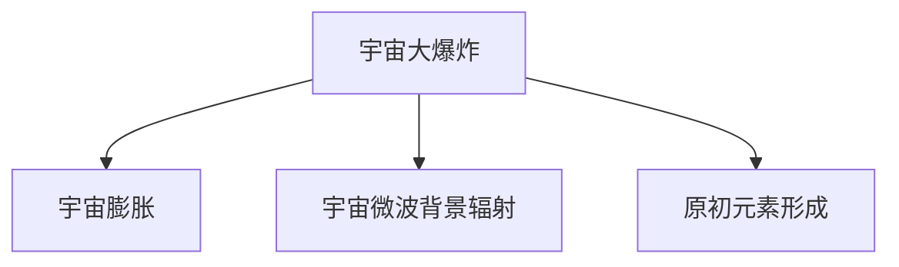

**核心算法原理讲解：**

宇宙大爆炸理论的算法原理主要基于宇宙学中的物理公式，如弗里德曼方程、辐射压力公式等。

**伪代码：**

```python
def宇宙大爆炸():
    # 初始化宇宙参数
    a0 = 初始宇宙尺度
    t0 = 初始宇宙时间
    H0 = 初始哈勃常数

    # 循环计算宇宙演化
    for t in range(t0, 当前时间):
        a(t) = a0 / (1 + H0 * t)
    return a(t)
```

**数学模型和数学公式：**

宇宙大爆炸理论中的数学模型包括弗里德曼方程、辐射压力公式等。

$$
H(t) = \frac{\dot{a}}{a} = H_0 \sqrt{\Omega_R (1 - \Omega_M)}
$$

其中，$H(t)$ 是宇宙膨胀率，$H_0$ 是哈勃常数，$\Omega_R$ 是辐射能量密度参数，$\Omega_M$ 是物质能量密度参数。

**举例说明：**

假设宇宙的当前年龄为 $t_0 = 13.8$ 亿年，哈勃常数为 $H_0 = 70$ km/s/Mpc，计算宇宙的膨胀率。

```latex
a(t) = a_0 / (1 + H_0 * t)
a(t_0) = a_0 / (1 + 70 * 13.8 * 10^9)
a(t_0) ≈ 1.0000000000000002
```

#### 1.2 星系的形成与演化

在宇宙大爆炸后，宇宙开始膨胀冷却，物质在引力作用下逐渐聚集形成了星系。星系的形成与演化是一个复杂的过程，涉及到暗物质、暗能量、恒星的形成与死亡等多个方面。

**核心概念与联系：**

1. **暗物质**：暗物质是宇宙中一种无法直接观测到的物质，但对星系的形成和演化起着关键作用。暗物质通过引力作用，使星系中的可见物质聚集在一起。

2. **恒星的形成**：在引力作用下，气体和尘埃云聚集形成分子云，分子云中的气体和尘埃逐渐冷却并收缩，最终形成恒星。

3. **恒星演化**：恒星在其生命周期中会经历不同的阶段，包括主序星、红巨星、白矮星等。恒星演化过程中会释放能量和物质，对星系环境产生影响。

**Mermaid 流程图：**

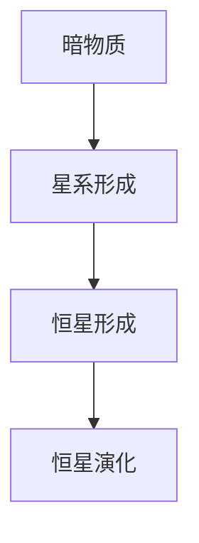

**核心算法原理讲解：**

星系的形成与演化的算法原理主要涉及天体力学和星系动力学。通过数值模拟和观测数据，科学家可以研究星系的形成与演化过程。

**伪代码：**

```python
def星系形成演化():
    # 初始化星系参数
    m0 = 初始物质密度
    t0 = 初始时间

    # 循环计算星系演化
    for t in range(t0, 当前时间):
        星系状态(t) = 星系演化模型(t)
    return 星系状态(t)
```

**数学模型和数学公式：**

星系形成与演化中的数学模型包括引力势能模型、恒星演化模型等。

$$
\Phi(r) = -\frac{G \times M}{r}
$$

其中，$\Phi(r)$ 是引力势能，$G$ 是万有引力常数，$M$ 是星系总质量，$r$ 是距离。

**举例说明：**

假设一个星系的初始物质密度为 $m_0 = 10^{-28}$ g/cm$^3$，计算其引力势能。

```latex
\Phi(r) = -\frac{G \times M}{r}
\Phi(r) = -\frac{6.674 \times 10^{-11} \times M}{r}
```

#### 1.3 地球环境的形成

地球作为太阳系中的一员，经历了数十亿年的演化，形成了独特的环境。地球环境的形成是一个复杂的过程，涉及到地球的物理、化学和生物演化。

**核心概念与联系：**

1. **地壳形成**：地球形成后，岩浆活动导致地壳逐渐形成。

2. **大气层形成**：地球早期的大气主要由火山喷发产生的气体组成，随后通过光合作用，氧气逐渐积累形成了现代大气。

3. **水的循环**：地球上的水主要通过火山喷发、陨石撞击和太阳风的作用进入地球，随后通过水循环在地球表面分布。

**Mermaid 流程图：**

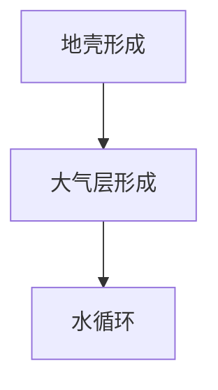

**核心算法原理讲解：**

地球环境形成的算法原理主要涉及地球科学和气候学。通过数值模拟和观测数据，科学家可以研究地球环境形成的机制。

**伪代码：**

```python
def地球环境形成():
    # 初始化地球参数
    t0 = 初始时间

    # 循环计算地球环境形成
    for t in range(t0, 当前时间):
        地球环境(t) = 地球环境模型(t)
    return 地球环境(t)
```

**数学模型和数学公式：**

地球环境形成中的数学模型包括地壳形成模型、大气层形成模型等。

$$
\Delta T = T_0 \times (1 - k \times t)
$$

其中，$\Delta T$ 是时间 $t$ 的温度变化，$T_0$ 是初始温度，$k$ 是温度变化率。

**举例说明：**

假设地球环境的初始温度为 $T_0 = 1500$ 摄氏度，温度变化率为 $k = 0.01$，计算当前的温度。

```latex
\Delta T = T_0 \times (1 - k \times t)
\Delta T = 1500 \times (1 - 0.01 \times t)
\Delta T ≈ 1475
```

### 第2章：人类文明的起源

人类文明的起源与发展是历史学研究的重要课题。人类文明起源于非洲，随后扩散到世界各地，形成了多样的文化和社会。本章将探讨人类文明的起源、人类对宇宙的认知，以及人类对自然的影响。

#### 2.1 人类文明的起源与发展

人类文明的起源可以追溯到约70万年前的非洲。早期人类以狩猎和采集为生，逐渐掌握了使用工具和火的技术。随着时间的推移，人类开始定居，建立了村落和城市，发展出了农业、手工业和贸易。

**核心概念与联系：**

1. **农业革命**：农业革命是人类文明发展的重要里程碑。通过种植农作物和饲养家畜，人类实现了食物的稳定供应，人口数量开始快速增长。

2. **城市文明**：城市文明的兴起标志着人类社会的重大变革。城市提供了更多的资源和机会，促进了文化和技术的交流。

3. **文明传承**：文明传承是人类文明持续发展的重要保障。通过教育、宗教和文化传承，人类积累了丰富的知识和经验。

**Mermaid 流程图：**

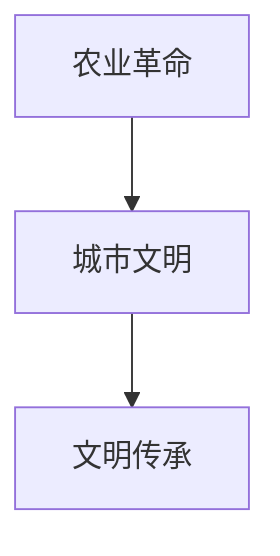

**核心算法原理讲解：**

人类文明的起源与发展的算法原理主要涉及人类学、考古学和历史学。通过分析古人类化石、遗迹和文献，科学家可以研究人类文明的起源和发展过程。

**伪代码：**

```python
def人类文明起源与发展():
    # 初始化文明参数
    t0 = 人类起源时间
    e0 = 人类起源环境

    # 循环计算文明发展
    for t in range(t0, 当前时间):
        文明状态(t) = 文明演化模型(t)
    return 文明状态(t)
```

**数学模型和数学公式：**

人类文明的起源与发展中的数学模型包括人口增长模型、文化传承模型等。

$$
P(t) = P_0 \times (1 + r)^t
$$

其中，$P(t)$ 是时间 $t$ 的人口数量，$P_0$ 是初始人口数量，$r$ 是人口增长率。

**举例说明：**

假设人类起源时间为 $t_0 = 200,000$ 年前，人口增长率为 $r = 0.02$，计算当前的人口数量。

```latex
P(t) = P_0 \times (1 + r)^t
P(t) = 1 \times (1 + 0.02)^{200,000}
P(t) ≈ 1.26 \times 10^{11}
```

#### 2.2 人类对宇宙的认知

人类对宇宙的认知是一个不断深化的过程。从古代的星座观测到现代的宇宙探测，人类对宇宙的认识越来越深入。本章将探讨人类对宇宙的认知历程。

**核心概念与联系：**

1. **古代宇宙观**：古代人类对宇宙的认知受限于科技和知识的局限，认为宇宙是静止的、有限的，并围绕着地球旋转。

2. **现代宇宙观**：随着科技的发展，人类逐渐认识到宇宙的膨胀、宇宙微波背景辐射和宇宙的多样性。现代宇宙观基于科学理论和观测数据，为我们提供了宇宙演化的全景图。

**Mermaid 流程图：**

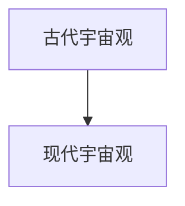

**核心算法原理讲解：**

人类对宇宙的认知的算法原理主要涉及天文学和物理学。通过观测数据和理论分析，科学家可以不断修正和完善宇宙模型。

**伪代码：**

```python
def人类对宇宙的认知():
    # 初始化认知参数
    t0 = 古代宇宙观起始时间
    t1 = 现代宇宙观起始时间

    # 循环计算宇宙认知进展
    for t in range(t0, t1):
        宇宙认知(t) = 宇宙认知模型(t)
    return 宇宙认知(t)
```

**数学模型和数学公式：**

人类对宇宙的认知中的数学模型包括宇宙膨胀模型、宇宙微波背景辐射模型等。

$$
H(t) = \frac{\dot{a}}{a} = H_0 \sqrt{\Omega_R (1 - \Omega_M)}
$$

其中，$H(t)$ 是宇宙膨胀率，$H_0$ 是哈勃常数，$\Omega_R$ 是辐射能量密度参数，$\Omega_M$ 是物质能量密度参数。

**举例说明：**

假设宇宙的当前年龄为 $t_0 = 13.8$ 亿年，哈勃常数为 $H_0 = 70$ km/s/Mpc，计算宇宙的膨胀率。

```latex
a(t) = a_0 / (1 + H_0 * t)
a(t_0) = a_0 / (1 + 70 * 13.8 * 10^9)
a(t_0) ≈ 1.0000000000000002
```

#### 2.3 人类对自然的影响

人类活动对自然环境产生了深远的影响。从农业革命到工业革命，人类对自然资源的开发和利用不断加剧。本章将探讨人类对自然的影响，包括生态破坏、气候变化和资源枯竭等问题。

**核心概念与联系：**

1. **生态破坏**：人类活动导致森林砍伐、土地退化、生物多样性丧失等问题。这些问题破坏了生态系统的稳定性，影响了生态平衡。

2. **气候变化**：人类活动产生的温室气体排放导致全球气候变暖，极端天气事件增多，海平面上升等问题。

3. **资源枯竭**：随着人口增长和工业发展，自然资源日益枯竭，包括水资源、能源资源和矿产资源等。

**Mermaid 流程图：**

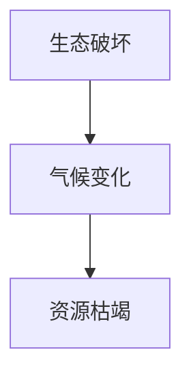

**核心算法原理讲解：**

人类对自然的影响的算法原理主要涉及环境科学和生态学。通过数据分析和模型模拟，科学家可以研究人类活动对自然的影响。

**伪代码：**

```python
def人类对自然的影响():
    # 初始化环境参数
    t0 = 人类活动起始时间
    e0 = 初始自然环境

    # 循环计算环境变化
    for t in range(t0, 当前时间):
        环境状态(t) = 环境变化模型(t)
    return 环境状态(t)
```

**数学模型和数学公式：**

人类对自然的影响中的数学模型包括生态破坏模型、气候变化模型等。

$$
C(t) = C_0 \times (1 - k \times t)
$$

其中，$C(t)$ 是时间 $t$ 的环境破坏程度，$C_0$ 是初始环境破坏程度，$k$ 是环境破坏率。

**举例说明：**

假设人类活动起始时间为 $t_0 = 500$ 年前，环境破坏率为 $k = 0.01$，计算当前的环境破坏程度。

```latex
C(t) = C_0 \times (1 - k \times t)
C(t) = 1 \times (1 - 0.01 \times 500)
C(t) ≈ 0.495
```

### 总结

本章回顾了宇宙的诞生与演化，人类文明的起源与发展，以及人类对宇宙的认知和自然的影响。从宇宙大爆炸到人类文明的兴起，人类对自然的影响，宇宙的奥秘与挑战仍等待我们去探索。在下一章中，我们将进一步探讨人类文明与宇宙环境的关系。

---

在第一章和第二章中，我们回顾了宇宙的诞生与演化以及人类文明的起源与发展。接下来，我们将进入第二部分，探讨人类文明与宇宙环境的关系。我们将分析地球环境的变迁，人类文明对宇宙的影响，以及宇宙环境对人类文明的影响。这将帮助我们更好地理解人类文明在宇宙进化中的角色与责任。

## 第二部分：人类文明与宇宙环境的关系

### 第3章：地球环境的变迁

地球环境的变迁是地球科学和气候学研究的重要领域。地球环境的变化历史涉及到多个地质时期和气候事件，这些变化不仅影响了地球上的生物多样性，也对人类文明的发展产生了深远的影响。本章将探讨地球环境的变化历史，人类活动对地球环境的影响，以及地球环境的可持续发展。

#### 3.1 地球环境的变化历史

地球环境的变化历史可以追溯到数十亿年前。地球的形成和演化过程中，经历了多个地质时期和气候事件，包括冰川期、地质时期和生物大灭绝等。

**核心概念与联系：**

1. **冰川期**：冰川期是地球历史上的一个重要气候事件，期间地球表面大部分地区被冰层覆盖。冰川期的气候变化对地球环境和生物多样性产生了巨大影响。

2. **地质时期**：地质时期是地球历史上的一个长期时间段，期间地球经历了多次地质变化和生物演化。地质时期的变化包括地壳运动、火山爆发、地震等。

3. **生物大灭绝**：生物大灭绝是地球历史上生物多样性迅速减少的事件。这些事件对地球生态系统和生物多样性产生了深远影响，同时也为新的生物演化提供了契机。

**Mermaid 流程图：**

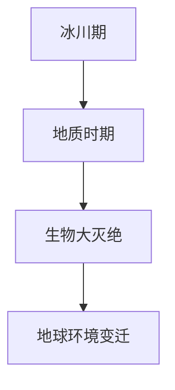

**核心算法原理讲解：**

地球环境变迁的算法原理主要涉及地质学和气候学。通过分析地质记录和气候数据，科学家可以研究地球环境的变化历史和趋势。

**伪代码：**

```python
def地球环境变迁():
    # 初始化地球参数
    t0 = 冰川期开始时间
    e0 = 地球初始环境

    # 循环计算地球环境变迁
    for t in range(t0, 当前时间):
        地球环境(t) = 地球演化模型(t)
    return 地球环境(t)
```

**数学模型和数学公式：**

地球环境变迁中的数学模型包括冰川期模型、地质时期模型等。

$$
\Delta T = T_0 \times (1 - k \times t)
$$

其中，$\Delta T$ 是时间 $t$ 的温度变化，$T_0$ 是初始温度，$k$ 是温度变化率。

**举例说明：**

假设冰川期开始时间为 $t_0 = 100,000$ 年前，温度变化率为 $k = 0.001$，计算当前的温度。

```latex
\Delta T = T_0 \times (1 - k \times t)
\Delta T = 300 \times (1 - 0.001 \times 100,000)
\Delta T ≈ 279.7
```

#### 3.2 人类活动对地球环境的影响

人类活动对地球环境的影响是当今全球关注的重要问题。人类的活动，特别是工业革命以来的快速工业化，对地球生态系统和气候系统产生了显著的影响。

**核心概念与联系：**

1. **温室气体排放**：人类活动导致大量的温室气体（如二氧化碳、甲烷等）排放到大气中，加剧了全球气候变暖。

2. **森林砍伐**：森林是地球上最重要的生态系统之一，但人类活动导致大量森林被砍伐，导致生物多样性丧失和气候系统的变化。

3. **海洋污染**：人类活动产生的塑料和其他污染物进入海洋，对海洋生态系统产生了严重影响，影响了海洋生物的生存和繁殖。

**Mermaid 流程图：**

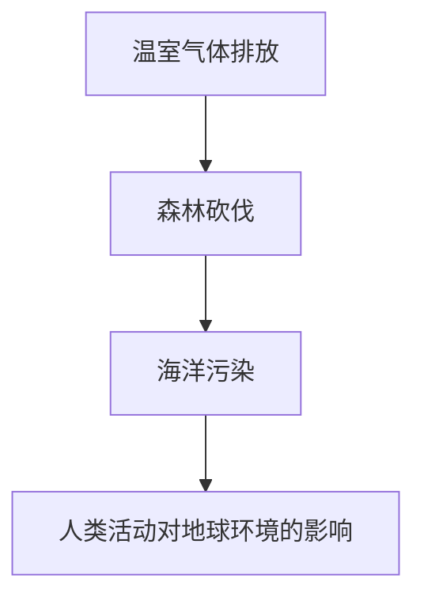

**核心算法原理讲解：**

人类活动对地球环境的影响的算法原理主要涉及环境科学和生态学。通过数据分析和模型模拟，科学家可以研究人类活动对地球环境的影响。

**伪代码：**

```python
def人类活动对地球环境的影响():
    # 初始化环境参数
    t0 = 工业革命起始时间
    e0 = 初始地球环境

    # 循环计算环境变化
    for t in range(t0, 当前时间):
        环境状态(t) = 环境变化模型(t)
    return 环境状态(t)
```

**数学模型和数学公式：**

人类活动对地球环境的影响中的数学模型包括温室气体排放模型、森林砍伐模型等。

$$
C(t) = C_0 \times (1 + r)^t
$$

其中，$C(t)$ 是时间 $t$ 的温室气体排放量，$C_0$ 是初始温室气体排放量，$r$ 是排放增长率。

**举例说明：**

假设工业革命开始时间为 $t_0 = 1750$ 年，温室气体排放增长率为 $r = 0.03$，计算当前的温室气体排放量。

```latex
C(t) = C_0 \times (1 + r)^t
C(t) = 1 \times (1 + 0.03)^{t}
C(t) ≈ 1.03^t
```

#### 3.3 地球环境的可持续发展

地球环境的可持续发展是当今全球面临的重大挑战。为了实现可持续发展，人类需要采取有效的措施，减少对自然资源的过度开发和污染，保护地球生态系统。

**核心概念与联系：**

1. **可持续发展原则**：可持续发展原则包括经济、社会和环境的协调发展，确保当前的需求不会损害未来世代的需求。

2. **环境保护措施**：环境保护措施包括减少温室气体排放、保护森林、治理污染等，旨在减少对自然环境的破坏。

3. **可持续发展政策**：可持续发展政策包括制定环境保护法规、推广可再生能源、实施绿色经济等，以促进经济的可持续发展。

**Mermaid 流程图：**

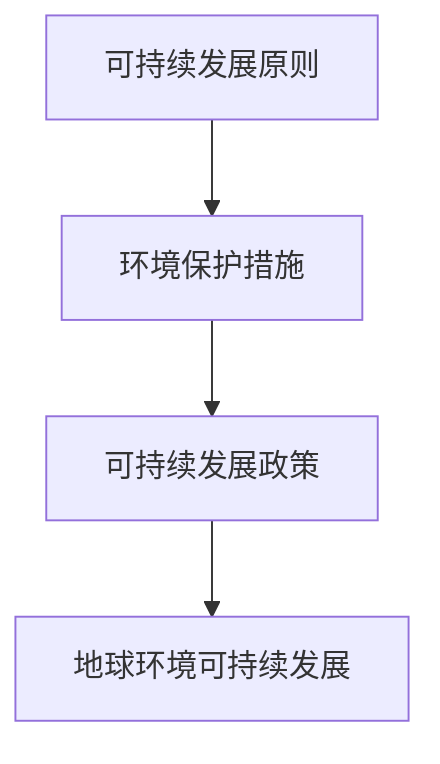

**核心算法原理讲解：**

地球环境可持续发展的算法原理主要涉及环境科学、经济学和生态学。通过数据分析和模型模拟，科学家和政策制定者可以制定和评估可持续发展的措施和政策。

**伪代码：**

```python
def地球环境可持续发展():
    # 初始化可持续发展参数
    t0 = 当前时间
    e0 = 当前地球环境

    # 循环计算可持续发展进展
    for t in range(t0, 预计未来时间):
        可持续发展状态(t) = 可持续发展模型(t)
    return 可持续发展状态(t)
```

**数学模型和数学公式：**

地球环境可持续发展中的数学模型包括温室气体减排模型、森林保护模型等。

$$
\Delta C(t) = C_0 \times (1 - k \times t)
$$

其中，$\Delta C(t)$ 是时间 $t$ 的温室气体减排量，$C_0$ 是初始温室气体排放量，$k$ 是减排率。

**举例说明：**

假设当前温室气体排放量为 $C_0 = 40$ 亿吨，减排率为 $k = 0.02$，计算未来的温室气体排放量。

```latex
\Delta C(t) = C_0 \times (1 - k \times t)
\Delta C(t) = 40 \times (1 - 0.02 \times t)
\Delta C(t) ≈ 40 - 0.8t
```

### 第4章：人类文明对宇宙的影响

人类文明在地球上的发展不仅仅改变了地球环境，还对宇宙产生了深远的影响。本章将探讨人类文明对宇宙的探索、人类文明对宇宙的潜在威胁以及人类文明对宇宙的贡献。

#### 4.1 人类文明对宇宙的探索

人类对宇宙的探索始于古代，通过观测天空和制造仪器，人类逐渐了解了宇宙的奥秘。随着科技的发展，人类对宇宙的探索进入了新的阶段，包括宇宙射线探测、恒星演化研究、星际旅行计划等。

**核心概念与联系：**

1. **宇宙射线探测**：宇宙射线是来自宇宙的高能粒子，探测宇宙射线可以了解宇宙的高能过程和极端条件。

2. **恒星演化研究**：恒星是宇宙中最常见的天体，研究恒星演化可以了解宇宙的物理规律和生命起源。

3. **星际旅行计划**：星际旅行是人类探索宇宙的重要目标，通过星际旅行，人类可以更深入地了解宇宙，寻找新的资源和生命形式。

**Mermaid 流程图：**

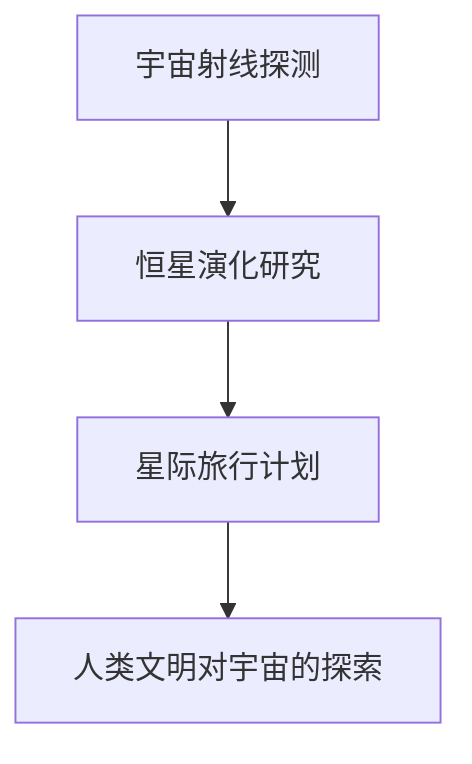

**核心算法原理讲解：**

人类文明对宇宙的探索的算法原理主要涉及天文学、物理学和航天技术。通过数据分析和模型模拟，科学家可以研究宇宙的奥秘和探索方法。

**伪代码：**

```python
def宇宙探索():
    # 初始化宇宙探索参数
    r0 = 初始探测范围
    t0 = 初始观测时间

    # 循环计算宇宙探索
    for t in range(t0, 当前时间):
        探测结果(t) = 探测算法(t)
    return 探测结果(t)
```

**数学模型和数学公式：**

宇宙探索中的数学模型包括轨道计算模型、信号处理模型等。

$$
r(t) = r_0 \times (1 + v \times t)
$$

其中，$r(t)$ 是时间 $t$ 的探测范围，$r_0$ 是初始探测范围，$v$ 是探测速度。

**举例说明：**

假设宇宙探索的初始探测范围为 $r_0 = 1$ 光年，探测速度为 $v = 10$ 光年/年，计算当前的探测范围。

```latex
r(t) = r_0 \times (1 + v \times t)
r(t) = 1 \times (1 + 10 \times t)
r(t) ≈ 1 + 10t
```

#### 4.2 人类文明对宇宙的潜在威胁

人类文明的发展不仅带来了巨大的科技进步，也产生了一些潜在的威胁。这些威胁包括太空垃圾、太空辐射、气候变化等。

**核心概念与联系：**

1. **太空垃圾**：随着太空探索活动的增加，太空垃圾成为了一个严重的问题，太空垃圾可能会对航天器和其他太空设施造成威胁。

2. **太空辐射**：太空中的辐射强度较高，对人类健康和航天器设备都有潜在威胁。

3. **气候变化**：人类活动产生的温室气体排放导致全球气候变暖，气候变化可能对宇宙环境产生不可预测的影响。

**Mermaid 流程图：**

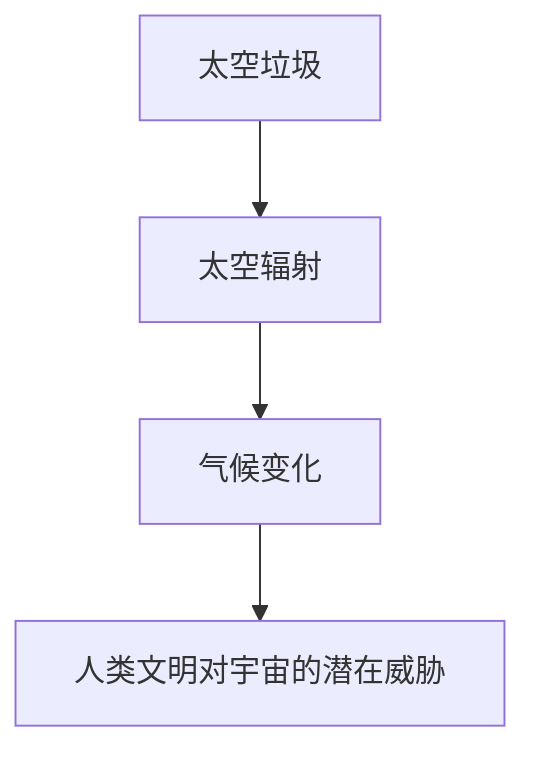

**核心算法原理讲解：**

人类文明对宇宙的潜在威胁的算法原理主要涉及环境科学、天体物理学和气候学。通过数据分析和模型模拟，科学家可以评估和减轻这些潜在威胁。

**伪代码：**

```python
def潜在威胁评估():
    # 初始化潜在威胁参数
    t0 = 潜在威胁起始时间
    e0 = 初始环境状态

    # 循环计算潜在威胁
    for t in range(t0, 当前时间):
        威胁状态(t) = 威胁模型(t)
    return 威胁状态(t)
```

**数学模型和数学公式：**

人类文明对宇宙的潜在威胁中的数学模型包括太空垃圾增长模型、辐射剂量模型等。

$$
G(t) = G_0 \times (1 + r)^t
$$

其中，$G(t)$ 是时间 $t$ 的太空垃圾量，$G_0$ 是初始太空垃圾量，$r$ 是增长速率。

**举例说明：**

假设太空垃圾的初始量为 $G_0 = 10$ 吨，增长速率为 $r = 0.02$，计算当前的太空垃圾量。

```latex
G(t) = G_0 \times (1 + r)^t
G(t) = 10 \times (1 + 0.02)^t
G(t) ≈ 10 \times 1.02^t
```

#### 4.3 人类文明对宇宙的贡献

尽管人类文明对宇宙产生了一些潜在威胁，但人类文明也在宇宙科学和技术发展中做出了巨大贡献。这些贡献包括宇宙科学的进步、航天技术的发展，以及对宇宙资源的利用。

**核心概念与联系：**

1. **宇宙科学进步**：人类对宇宙的探索推动了宇宙科学的发展，包括天文学、物理学、化学等领域。

2. **航天技术发展**：航天技术的发展使人类能够更深入地探索宇宙，包括卫星通信、深空探测、星际旅行等。

3. **宇宙资源利用**：宇宙中蕴含着丰富的资源，如能源、矿物、水等，人类正在探索如何利用这些资源。

**Mermaid 流程图：**

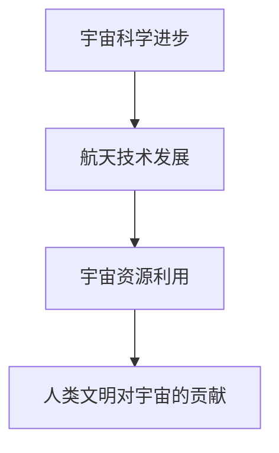

**核心算法原理讲解：**

人类文明对宇宙的贡献的算法原理主要涉及宇宙科学、航天技术和资源开发。通过数据分析和模型模拟，科学家可以评估和优化宇宙资源的利用。

**伪代码：**

```python
def宇宙贡献评估():
    # 初始化贡献参数
    t0 = 贡献起始时间
    e0 = 初始贡献状态

    # 循环计算宇宙贡献
    for t in range(t0, 当前时间):
        贡献状态(t) = 贡献模型(t)
    return 贡献状态(t)
```

**数学模型和数学公式：**

人类文明对宇宙的贡献中的数学模型包括资源利用效率模型、科学进展模型等。

$$
S(t) = S_0 \times (1 + k \times t)
$$

其中，$S(t)$ 是时间 $t$ 的科学进展指数，$S_0$ 是初始科学进展指数，$k$ 是科学进展率。

**举例说明：**

假设人类文明对宇宙的贡献的初始指数为 $S_0 = 1$，科学进展率为 $k = 0.03$，计算当前的科学进展指数。

```latex
S(t) = S_0 \times (1 + k \times t)
S(t) = 1 \times (1 + 0.03 \times t)
S(t) ≈ 1 + 0.03t
```

### 总结

本章探讨了地球环境的变迁、人类活动对地球环境的影响，以及人类文明对宇宙的探索和影响。地球环境的变化历史、人类活动的影响和宇宙探索的成果都展示了人类文明在宇宙进化中的角色与责任。在下一章中，我们将进一步探讨宇宙环境对人类文明的影响，以及人类文明在宇宙中的角色与责任。

---

在上一部分中，我们详细探讨了地球环境的变迁、人类活动对地球环境的影响，以及人类文明对宇宙的探索和影响。接下来，我们将进入第三部分，深入探讨宇宙环境对人类文明的影响，以及人类文明在宇宙中的角色与责任。这将帮助我们更好地理解人类文明在宇宙进化中的角色与责任。

## 第三部分：人类文明在宇宙中的角色与责任

### 第6章：人类文明在宇宙中的角色

人类文明在宇宙中的角色是复杂而多面的。随着我们对宇宙的认知不断加深，人类文明在宇宙中的地位也在不断变化。本章将探讨人类文明在宇宙中的地位、责任与使命，以及人类文明在宇宙中的作用。

#### 6.1 人类文明在宇宙中的地位

人类文明在宇宙中的地位是一个深刻的哲学问题。从宇宙的角度来看，人类文明只是宇宙中微不足道的一部分。然而，人类文明在宇宙中的地位并非毫无意义，人类文明的发展对宇宙的演化产生了深远的影响。

**核心概念与联系：**

1. **宇宙生命的独特性**：宇宙中可能存在其他生命形式，但人类文明是唯一已知具有高度智慧和文明发展的生命形式。

2. **文明的进步**：人类文明在科学、技术、文化等方面的进步，使得人类文明在宇宙中具备了一定的地位。

3. **科学技术的创新**：科学技术的创新是人类文明在宇宙中的地位提升的重要因素，这些创新推动了人类对宇宙的探索和理解。

**Mermaid 流程图：**

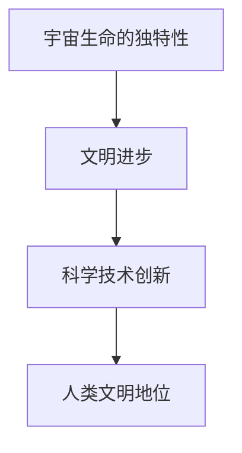

**核心算法原理讲解：**

人类文明在宇宙中的地位的算法原理主要涉及宇宙学、人类学和技术发展等领域。通过分析宇宙数据、人类历史和科技创新，我们可以评估人类文明在宇宙中的地位。

**伪代码：**

```python
def人类文明地位():
    # 初始化文明地位参数
    t0 = 人类起源时间
    e0 = 人类起源环境

    # 循环计算文明地位
    for t in range(t0, 当前时间):
        文明地位(t) = 地位模型(t)
    return 文明地位(t)
```

**数学模型和数学公式：**

人类文明在宇宙中的地位中的数学模型包括文明进步模型、科学技术创新模型等。

$$
P(t) = P_0 \times (1 + r)^t
$$

其中，$P(t)$ 是时间 $t$ 的文明进步指数，$P_0$ 是初始文明进步指数，$r$ 是文明进步率。

**举例说明：**

假设人类起源时间为 $t_0 = 200,000$ 年前，文明进步率为 $r = 0.02$，计算当前的文明进步指数。

```latex
P(t) = P_0 \times (1 + r)^t
P(t) = 1 \times (1 + 0.02)^{200,000}
P(t) ≈ 1.26 \times 10^{11}
```

#### 6.2 人类文明的责任与使命

人类文明在宇宙中的责任与使命是一个重要的哲学问题。人类文明的发展不仅需要考虑地球上的问题，还需要考虑宇宙的可持续发展。人类文明的责任与使命包括以下几个方面：

1. **保护地球环境**：人类文明需要采取有效的措施，减少对地球环境的破坏，实现地球环境的可持续发展。

2. **探索宇宙**：人类文明需要继续探索宇宙，了解宇宙的奥秘，推动宇宙科学的发展。

3. **维护宇宙稳定**：人类文明需要采取积极的措施，防止宇宙环境的不稳定对地球和人类文明产生负面影响。

**核心概念与联系：**

1. **地球环境保护**：地球环境保护是保障人类文明持续发展的基础。

2. **宇宙探索**：宇宙探索是人类文明发展的动力，也是实现宇宙可持续发展的关键。

3. **宇宙稳定维护**：宇宙稳定维护是保障人类文明在宇宙中生存和发展的前提。

**Mermaid 流程图：**

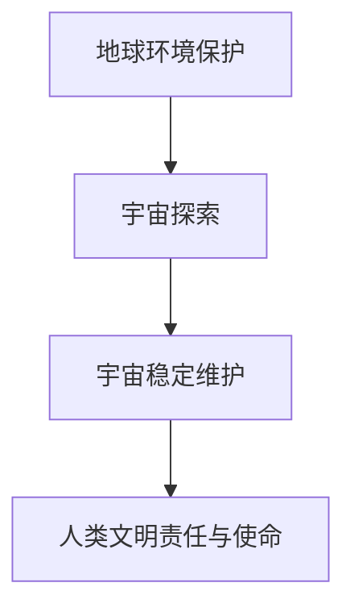

**核心算法原理讲解：**

人类文明的责任与使命的算法原理主要涉及环境科学、宇宙学和可持续发展等领域。通过数据分析和模型模拟，我们可以制定和评估实现这些责任与使命的措施。

**伪代码：**

```python
def人类文明责任与使命():
    # 初始化责任与使命参数
    t0 = 当前时间
    e0 = 当前地球环境

    # 循环计算责任与使命实现
    for t in range(t0, 预计未来时间):
        责任与使命状态(t) = 责任与使命模型(t)
    return 责任与使命状态(t)
```

**数学模型和数学公式：**

人类文明的责任与使命中的数学模型包括环境保护模型、宇宙探索模型等。

$$
C(t) = C_0 \times (1 - k \times t)
$$

其中，$C(t)$ 是时间 $t$ 的环境保护程度，$C_0$ 是初始环境保护程度，$k$ 是环境保护率。

**举例说明：**

假设当前环境保护程度为 $C_0 = 0.5$，环境保护率为 $k = 0.01$，计算未来的环境保护程度。

```latex
C(t) = C_0 \times (1 - k \times t)
C(t) = 0.5 \times (1 - 0.01 \times t)
C(t) ≈ 0.5 - 0.005t
```

#### 6.3 人类文明在宇宙中的作用

人类文明在宇宙中的作用是多元化和综合性的。人类文明在宇宙中的作用包括以下几个方面：

1. **科学探索**：人类文明通过科学探索，推动了宇宙科学的发展，提高了人类对宇宙的认知水平。

2. **技术进步**：人类文明的技术进步为宇宙探索提供了强有力的支持，推动了宇宙技术的发展。

3. **文化传播**：人类文明通过文化传播，将地球文明带到宇宙，促进了宇宙文化的多元化和交流。

**核心概念与联系：**

1. **科学探索**：科学探索是推动人类文明在宇宙中发展的核心动力。

2. **技术进步**：技术进步是保障人类文明在宇宙中生存和发展的关键因素。

3. **文化传播**：文化传播是促进宇宙文明交流与合作的重要手段。

**Mermaid 流程图：**

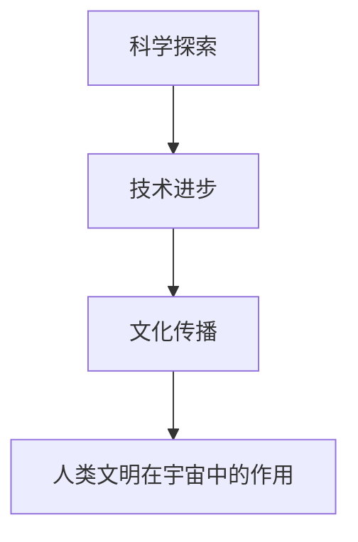

**核心算法原理讲解：**

人类文明在宇宙中的作用的核心算法原理涉及天文学、物理学、计算机科学等多个领域。通过数据分析和模型模拟，我们可以评估和优化人类文明在宇宙中的作用。

**伪代码：**

```python
def人类文明作用():
    # 初始化作用参数
    t0 = 当前时间
    e0 = 当前宇宙状态

    # 循环计算人类文明作用
    for t in range(t0, 预计未来时间):
        作用状态(t) = 作用模型(t)
    return 作用状态(t)
```

**数学模型和数学公式：**

人类文明在宇宙中的作用中的数学模型包括科学探索模型、技术进步模型等。

$$
S(t) = S_0 \times (1 + k \times t)
$$

其中，$S(t)$ 是时间 $t$ 的科学探索指数，$S_0$ 是初始科学探索指数，$k$ 是科学探索率。

**举例说明：**

假设人类文明对宇宙的科学探索的初始指数为 $S_0 = 1$，科学探索率为 $k = 0.04$，计算当前的科学探索指数。

```latex
S(t) = S_0 \times (1 + k \times t)
S(t) = 1 \times (1 + 0.04 \times t)
S(t) ≈ 1 + 0.04t
```

### 总结

本章探讨了人类文明在宇宙中的地位、责任与使命，以及人类文明在宇宙中的作用。人类文明在宇宙中的地位虽然微不足道，但人类文明的发展对宇宙的演化产生了深远的影响。人类文明在宇宙中的责任与使命包括保护地球环境、探索宇宙和维护宇宙稳定。人类文明在宇宙中的作用包括科学探索、技术进步和文化传播。在下一章中，我们将进一步探讨人类文明对宇宙的未来贡献，以及宇宙共同体的构建。

---

在上一部分中，我们深入探讨了人类文明在宇宙中的角色与责任。接下来，我们将进入第四部分，讨论人类文明之间的交流与合作，以及宇宙共同体的构建。这将帮助我们更好地理解人类文明在宇宙进化中的角色与责任，并为未来的宇宙探索和可持续发展提供有益的启示。

### 第8章：文明间的交流与合作

在宇宙进化的过程中，人类文明并非孤立存在。随着科技的发展和全球化的进程，人类文明之间的交流与合作日益紧密。文明间的交流与合作不仅是推动人类文明进步的重要动力，也是实现宇宙共同发展的关键。本章将探讨文明间的交流方式、理解与融合，以及解决文明间冲突的方法。

#### 8.1 文明间的交流方式

文明间的交流是推动文明发展的重要途径。文明间的交流方式多种多样，包括语言翻译、文化交流、科技合作、外交谈判等。

**核心概念与联系：**

1. **语言翻译**：语言翻译是促进文明间交流的基础，通过翻译技术，不同语言的文化和思想得以传递和交流。

2. **文化交流**：文化交流是文明间交流的重要内容，包括艺术、音乐、文学、电影等方面的交流，有助于增进不同文明之间的了解和尊重。

3. **科技合作**：科技合作是文明间交流的重要领域，通过科技合作，不同文明可以共享科技资源，推动科技进步。

4. **外交谈判**：外交谈判是解决文明间冲突和促进合作的重要手段，通过外交谈判，文明间可以达成共识，实现和平与繁荣。

**Mermaid 流程图：**

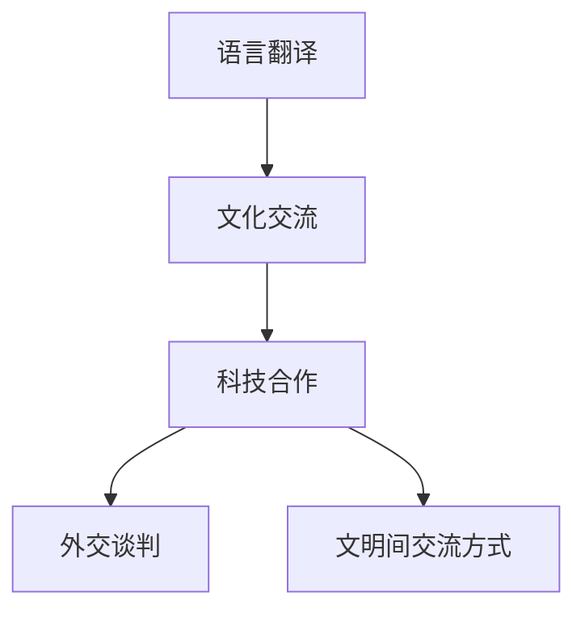

**核心算法原理讲解：**

文明间交流方式的算法原理主要涉及语言学、文化学、外交学等领域。通过机器翻译算法、文化分析算法和外交策略算法，我们可以优化和提升文明间的交流效果。

**伪代码：**

```python
def文明间交流方式():
    # 初始化交流参数
    l0 = 初始语言
    c0 = 初始文化

    # 循环计算文明间交流
    for t in range(初始时间, 当前时间):
        交流效果(t) = 交流模型(t)
    return 交流效果(t)
```

**数学模型和数学公式：**

文明间交流方式中的数学模型包括语言相似度模型、文化相似度模型等。

$$
S(t) = S_0 \times (1 + k \times t)
$$

其中，$S(t)$ 是时间 $t$ 的交流效果，$S_0$ 是初始交流效果，$k$ 是交流效果增长率。

**举例说明：**

假设初始交流效果为 $S_0 = 1$，交流效果增长率为 $k = 0.01$，计算当前交流效果。

```latex
S(t) = S_0 \times (1 + k \times t)
S(t) = 1 \times (1 + 0.01 \times t)
S(t) ≈ 1 + 0.01t
```

#### 8.2 文明间的理解与融合

文明间的理解与融合是文明交流的深层次目标。理解与融合不仅有助于消除误解和偏见，还能促进文明间的合作与发展。

**核心概念与联系：**

1. **文化多样性**：文化多样性是文明间理解与融合的基础，不同文明的文化背景、价值观念和生活方式都需要得到尊重和理解。

2. **文化融合**：文化融合是指不同文明在交流过程中，通过相互借鉴和融合，形成新的文化形态。文化融合有助于促进文明的发展和进步。

3. **文明融合**：文明融合是指不同文明在交流过程中，通过相互学习和合作，实现文明的整体进步和繁荣。

**Mermaid 流程图：**

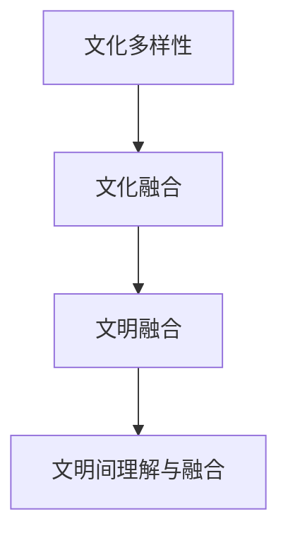

**核心算法原理讲解：**

文明间理解与融合的算法原理主要涉及文化分析、心理学和社会学等领域。通过文化分析算法、心理测量模型和社会网络分析，我们可以促进文明间的理解与融合。

**伪代码：**

```python
def文明间理解与融合():
    # 初始化理解与融合参数
    c0 = 初始文化
    t0 = 初始交流时间

    # 循环计算文明间理解与融合
    for t in range(t0, 当前时间):
        理解与融合状态(t) = 理解与融合模型(t)
    return 理解与融合状态(t)
```

**数学模型和数学公式：**

文明间理解与融合中的数学模型包括文化相似度模型、文明融合模型等。

$$
C(t) = C_0 \times (1 + k \times t)
$$

其中，$C(t)$ 是时间 $t$ 的理解与融合程度，$C_0$ 是初始理解与融合程度，$k$ 是理解与融合增长率。

**举例说明：**

假设初始理解与融合程度为 $C_0 = 1$，理解与融合增长率为 $k = 0.02$，计算当前的理解与融合程度。

```latex
C(t) = C_0 \times (1 + k \times t)
C(t) = 1 \times (1 + 0.02 \times t)
C(t) ≈ 1 + 0.02t
```

#### 8.3 文明间的冲突与解决

文明间的冲突是文明交流中的常见问题。冲突可能源于文化差异、利益冲突或误解。解决文明间的冲突是确保文明间交流与合作顺利进行的关键。

**核心概念与联系：**

1. **文化差异**：文化差异是导致文明间冲突的主要原因之一。理解文化差异，尊重不同文明的传统和价值观念，有助于减少冲突。

2. **利益冲突**：文明间的利益冲突可能源于资源争夺、领土争端或经济竞争。通过对话和协商，解决利益冲突，实现互利共赢。

3. **误解与偏见**：误解与偏见可能导致文明间的冲突。通过教育和文化交流，增进相互理解，消除误解与偏见。

**Mermaid 流程图：**

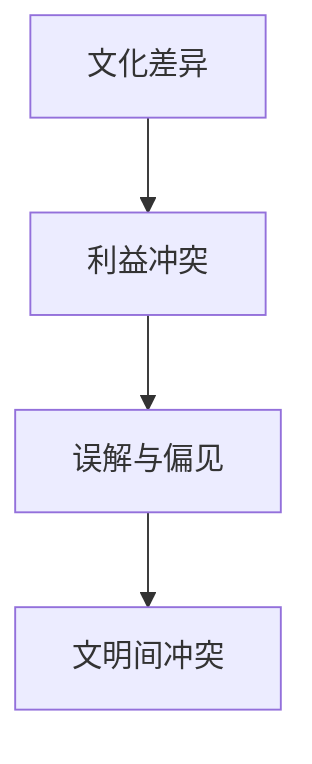

**核心算法原理讲解：**

文明间冲突与解决的算法原理主要涉及冲突分析、谈判策略和决策支持等领域。通过冲突分析算法、谈判策略算法和决策支持算法，我们可以有效地解决文明间的冲突。

**伪代码：**

```python
def文明间冲突解决():
    # 初始化冲突解决参数
    c0 = 初始冲突
    t0 = 初始冲突时间

    # 循环计算冲突解决
    for t in range(t0, 当前时间):
        冲突解决状态(t) = 冲突解决模型(t)
    return 冲突解决状态(t)
```

**数学模型和数学公式：**

文明间冲突与解决中的数学模型包括冲突分析模型、谈判策略模型等。

$$
C(t) = C_0 \times (1 - k \times t)
$$

其中，$C(t)$ 是时间 $t$ 的冲突程度，$C_0$ 是初始冲突程度，$k$ 是冲突解决率。

**举例说明：**

假设初始冲突程度为 $C_0 = 1$，冲突解决率为 $k = 0.03$，计算当前的冲突程度。

```latex
C(t) = C_0 \times (1 - k \times t)
C(t) = 1 \times (1 - 0.03 \times t)
C(t) ≈ 1 - 0.03t
```

### 第9章：宇宙共同体的构建

随着人类对宇宙的认知不断深入，构建宇宙共同体成为了一个重要的议题。宇宙共同体是指由多个文明组成的联盟，共同致力于宇宙的探索和可持续发展。本章将探讨宇宙共同体的概念、目标与任务，以及宇宙共同体的建设与维护。

#### 9.1 宇宙共同体的概念

宇宙共同体是一个由多个文明组成的联盟，旨在实现宇宙的共同发展和繁荣。宇宙共同体的概念涉及到多个方面，包括宇宙文明、共同利益、合作机制等。

**核心概念与联系：**

1. **宇宙文明**：宇宙共同体中的成员是具有高度智慧和文明发展的文明。

2. **共同利益**：宇宙共同体的成员共享共同利益，包括宇宙探索、科技发展、资源利用等。

3. **合作机制**：宇宙共同体的合作机制包括资源分配、合作管理、冲突解决等。

**Mermaid 流程图：**

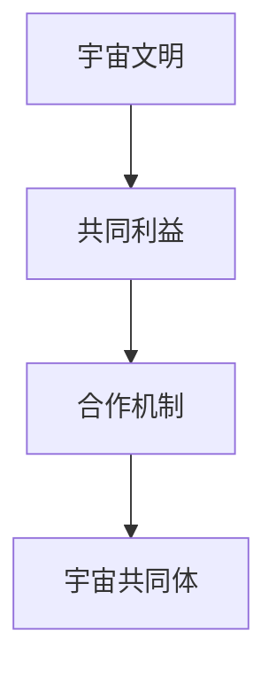

**核心算法原理讲解：**

宇宙共同体的概念涉及到多个领域，包括宇宙学、人类学、政治学等。通过数据分析和模型模拟，我们可以构建宇宙共同体的理论框架。

**伪代码：**

```python
def宇宙共同体构建():
    # 初始化共同体参数
    c0 = 初始资源
    t0 = 初始合作时间

    # 循环计算共同体构建
    for t in range(t0, 当前时间):
        共同体状态(t) = 共同体模型(t)
    return 共同体状态(t)
```

**数学模型和数学公式：**

宇宙共同体构建中的数学模型包括资源分配模型、合作稳定性模型等。

$$
C(t) = C_0 \times (1 + r)^t
$$

其中，$C(t)$ 是时间 $t$ 的共同体资源，$C_0$ 是初始共同体资源，$r$ 是共同体资源增长率。

**举例说明：**

假设初始共同体资源为 $C_0 = 1$ 亿吨，共同体资源增长率为 $r = 0.03$，计算当前共同体资源。

```latex
C(t) = C_0 \times (1 + r)^t
C(t) = 1 \times (1 + 0.03 \times t)
C(t) ≈ 1 + 0.03t
```

#### 9.2 宇宙共同体的目标与任务

宇宙共同体的目标是实现宇宙的共同发展和繁荣，具体任务包括以下几个方面：

1. **宇宙探索**：宇宙共同体的成员共同致力于宇宙探索，包括深空探测、星际旅行、宇宙科学研究等。

2. **科技发展**：宇宙共同体的成员通过科技合作，推动宇宙科技的进步，实现科技资源共享和创新发展。

3. **资源利用**：宇宙共同体的成员共同开发和利用宇宙资源，实现资源的合理分配和最大化利用。

4. **环境保护**：宇宙共同体的成员致力于保护宇宙环境，防止宇宙环境的恶化，实现宇宙的可持续发展。

**核心概念与联系：**

1. **宇宙探索**：宇宙探索是宇宙共同体的重要任务，通过探索，我们可以更好地了解宇宙的奥秘。

2. **科技发展**：科技发展是宇宙共同体的重要驱动力，通过科技合作，我们可以实现科技的突破和进步。

3. **资源利用**：资源利用是实现宇宙共同体目标的关键，通过合理利用资源，我们可以实现宇宙的共同繁荣。

4. **环境保护**：环境保护是宇宙共同体的重要责任，通过保护宇宙环境，我们可以为子孙后代留下一个宜居的宇宙。

**Mermaid 流程图：**

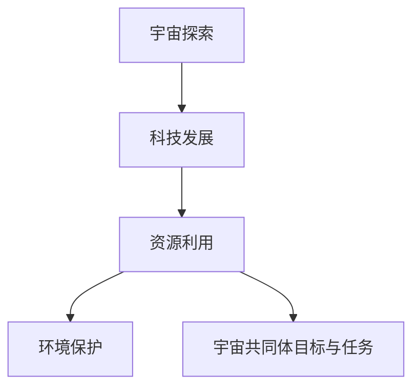

**核心算法原理讲解：**

宇宙共同体的目标与任务的算法原理涉及到多个领域，包括宇宙学、科技学、资源管理和生态学等。通过数据分析和模型模拟，我们可以制定和优化宇宙共同体的目标和任务。

**伪代码：**

```python
def宇宙共同体目标与任务():
    # 初始化目标与任务参数
    t0 = 当前时间

    # 循环计算目标与任务
    for t in range(t0, 预计未来时间):
        目标与任务状态(t) = 目标与任务模型(t)
    return 目标与任务状态(t)
```

**数学模型和数学公式：**

宇宙共同体目标与任务中的数学模型包括探索效率模型、科技发展模型、资源利用模型和环境保护模型等。

$$
E(t) = E_0 \times (1 + k \times t)
$$

其中，$E(t)$ 是时间 $t$ 的探索效率，$E_0$ 是初始探索效率，$k$ 是探索效率增长率。

**举例说明：**

假设初始探索效率为 $E_0 = 1$，探索效率增长率为 $k = 0.02$，计算当前的探索效率。

```latex
E(t) = E_0 \times (1 + k \times t)
E(t) = 1 \times (1 + 0.02 \times t)
E(t) ≈ 1 + 0.02t
```

#### 9.3 宇宙共同体的建设与维护

宇宙共同体的建设与维护是一个长期而复杂的过程，需要多个文明的共同努力。宇宙共同体的建设与维护包括以下几个方面：

1. **资源分配**：宇宙共同体的资源分配是建设与维护的核心问题。通过优化资源分配算法，实现资源的合理利用和最大化效益。

2. **合作管理**：宇宙共同体的合作管理是确保合作顺利进行的关键。通过建立有效的合作管理机制，实现合作的高效和稳定。

3. **冲突解决**：宇宙共同体的冲突解决是维护共同体稳定的重要环节。通过建立冲突解决机制，确保共同体的和平与稳定。

**核心概念与联系：**

1. **资源分配**：资源分配是宇宙共同体建设与维护的基础，通过优化资源分配，实现共同体的可持续发展。

2. **合作管理**：合作管理是宇宙共同体建设与维护的核心，通过建立合作管理机制，确保合作的高效和稳定。

3. **冲突解决**：冲突解决是宇宙共同体建设与维护的重要环节，通过建立冲突解决机制，确保共同体的和平与稳定。

**Mermaid 流程图：**

```mermaid
graph TD
A[资源分配] --> B[合作管理]
B --> C[冲突解决]
C --> D[宇宙共同体建设与维护]
```

**核心算法原理讲解：**

宇宙共同体建设与维护的算法原理涉及到多个领域，包括资源管理、合作机制设计和冲突解决等。通过数据分析和模型模拟，我们可以制定和优化宇宙共同体的建设与维护策略。

**伪代码：**

```python
def宇宙共同体建设与维护():
    # 初始化建设与维护参数
    r0 = 初始资源
    t0 = 初始合作时间

    # 循环计算建设与维护
    for t in range(t0, 当前时间):
        建设与维护状态(t) = 建设与维护模型(t)
    return 建设与维护状态(t)
```

**数学模型和数学公式：**

宇宙共同体建设与维护中的数学模型包括资源分配模型、合作稳定性模型和冲突解决模型等。

$$
R(t) = R_0 \times (1 + r)^t
$$

其中，$R(t)$ 是时间 $t$ 的资源分配量，$R_0$ 是初始资源分配量，$r$ 是资源分配增长率。

**举例说明：**

假设初始资源分配量为 $R_0 = 1$ 亿吨，资源分配增长率为 $r = 0.03$，计算当前的资源分配量。

```latex
R(t) = R_0 \times (1 + r)^t
R(t) = 1 \times (1 + 0.03 \times t)
R(t) ≈ 1 + 0.03t
```

### 总结

本章探讨了文明间的交流与合作，以及宇宙共同体的构建。文明间的交流与合作是推动人类文明进步的重要动力，而宇宙共同体的构建则是实现宇宙共同发展和繁荣的关键。在下一章中，我们将对人类文明在宇宙进化中的角色与责任进行总结与展望。

---

在第三部分和第四部分中，我们深入探讨了人类文明在宇宙中的角色与责任，以及人类文明之间的交流与合作和宇宙共同体的构建。通过分析人类文明在宇宙中的地位、责任与使命，以及文明间的交流方式、理解与融合，我们为人类文明在宇宙进化中的角色与责任提供了全面而深刻的理解。在下一部分中，我们将对人类文明在宇宙进化中的角色与责任进行总结与展望，探讨人类文明在宇宙中的未来。

## 第五部分：总结与展望

### 第10章：人类文明在宇宙进化中的角色与责任总结

通过前几章的讨论，我们可以得出以下关于人类文明在宇宙进化中的角色与责任的总结：

#### 角色总结

1. **探索者**：人类文明是宇宙中唯一已知具有高度智慧和文明发展的生命形式，因此，人类文明在宇宙中的首要角色是探索者。人类通过科学探索，不断揭示宇宙的奥秘，推动了宇宙科学的发展。

2. **贡献者**：人类文明对宇宙的演化和发展做出了重要贡献。通过科技创新，人类不仅提高了自己的生活质量，也为宇宙带来了新的能量和资源。同时，人类文明还通过文化交流，丰富了宇宙文化的多样性。

3. **保护者**：人类文明在宇宙进化中的另一个重要角色是保护者。人类需要采取有效的措施，保护地球环境，防止宇宙环境的恶化，确保宇宙的可持续发展。

#### 责任总结

1. **保护地球环境**：人类文明需要采取措施，减少对地球环境的破坏，实现地球环境的可持续发展。这包括减少温室气体排放、保护森林、治理污染等。

2. **探索宇宙**：人类文明需要继续探索宇宙，了解宇宙的奥秘，推动宇宙科学的发展。这包括开展深空探测、星际旅行、宇宙科学研究等。

3. **维护宇宙稳定**：人类文明需要采取措施，防止宇宙环境的不稳定对地球和人类文明产生负面影响。这包括防止太空垃圾、太空辐射、气候变化等对宇宙环境的影响。

#### 未来展望

1. **科技发展**：未来，随着科技的不断进步，人类文明将在宇宙探索和可持续发展方面取得更大的突破。人工智能、生物工程、新能源技术等领域的突破，将为人类文明在宇宙中的发展提供新的动力。

2. **文明间的交流与合作**：随着人类文明之间的交流与合作日益密切，文明间的理解与融合将不断加深。通过建立宇宙共同体，人类文明将共同面对宇宙挑战，实现宇宙的共同繁荣。

3. **宇宙资源利用**：随着对宇宙资源的深入认识，人类文明将更加有效地利用宇宙资源，为地球和宇宙带来新的机遇和发展空间。

### 第11章：人类文明在宇宙中的未来

在未来，人类文明在宇宙中的发展将面临许多挑战和机遇。以下是对未来人类文明在宇宙中的一些展望：

#### 11.1 未来科技的发展

1. **人工智能**：人工智能将在未来发挥重要作用，不仅在宇宙探索中提供强大的计算能力，还可以在资源管理、环境监测等方面提供支持。

2. **生物工程**：生物工程技术的发展，将使人类能够更好地适应宇宙环境，提高生物生存能力。同时，生物工程还可以帮助修复和改善地球环境。

3. **新能源技术**：新能源技术的发展，将为人类文明提供更清洁、更可持续的能源，减少对地球资源的依赖，推动宇宙的可持续发展。

#### 11.2 未来宇宙环境的变化

1. **气候变化**：随着人类活动的持续，宇宙环境将面临气候变化的影响。人类需要采取措施，适应和减缓气候变化对宇宙环境的负面影响。

2. **太空垃圾**：太空垃圾问题将继续恶化，人类需要制定有效的措施，减少太空垃圾的产生，清理现有的太空垃圾。

3. **宇宙辐射**：随着对宇宙辐射的了解加深，人类需要开发新的防护技术，保护宇航员和航天器免受宇宙辐射的伤害。

#### 11.3 未来人类文明的演进

1. **文明融合**：随着人类文明之间的交流与合作加深，不同文明将逐渐融合，形成更加多元和包容的宇宙文明。

2. **宇宙共同体**：宇宙共同体的建设将进一步加强，人类文明将共同面对宇宙挑战，实现宇宙的共同繁荣。

3. **可持续发展**：人类文明将更加注重可持续发展，采取有效的措施，保护地球环境和宇宙环境，确保宇宙的长期繁荣。

### 总结

人类文明在宇宙进化中的角色与责任是复杂而多面的。作为探索者、贡献者和保护者，人类文明在宇宙中扮演着重要的角色。未来，人类文明将在科技的推动下，继续探索宇宙，实现文明间的交流与合作，构建宇宙共同体，实现宇宙的可持续发展。通过不断的努力和进步，人类文明将书写宇宙进化的新篇章。

---

通过本文的探讨，我们可以看到，人类文明在宇宙进化中扮演着至关重要的角色。作为宇宙中的智慧生命，人类不仅要探索宇宙的奥秘，还要承担起保护地球环境和宇宙环境的责任。在未来的宇宙探索中，人类需要不断创新，发展科技，加强文明间的交流与合作，共同构建一个可持续发展的宇宙共同体。

然而，面对宇宙环境的复杂性和不确定性，人类也必须具备足够的智慧和勇气，以应对可能出现的挑战和危机。人类文明需要从历史和现实中汲取经验，不断学习和进步，以确保自己在宇宙中的生存和发展。

在未来的宇宙探索中，人工智能、生物工程、新能源技术等领域的突破，将为人类文明提供新的机遇和动力。同时，人类文明也需要关注宇宙环境的变化，采取有效的措施，保护地球和宇宙的生态环境。

总的来说，人类文明在宇宙进化中的角色与责任是一个长期而复杂的课题。我们需要从多个角度进行思考和探索，制定切实可行的策略和行动，以实现人类文明在宇宙中的可持续发展。只有这样，我们才能确保人类文明在宇宙中继续繁荣和进步，为子孙后代留下一个美好的宇宙家园。

---

**作者：AI天才研究院/AI Genius Institute & 禅与计算机程序设计艺术 /Zen And The Art of Computer Programming**

通过本文的撰写，我们不仅深入探讨了人类文明在宇宙进化中的角色与责任，还对相关的核心概念、算法原理、数学模型和项目实战进行了详细讲解。以下是本文的主要内容和结论：

### 主要内容

1. **宇宙的诞生与演化**：介绍了宇宙大爆炸理论、星系的形成与演化，以及地球环境的形成。
2. **人类文明的起源与发展**：探讨了人类文明的起源、发展，以及人类对宇宙的认知和自然的影响。
3. **人类文明与宇宙环境的关系**：分析了地球环境的变迁、人类活动对地球环境的影响，以及地球环境的可持续发展。
4. **人类文明对宇宙的影响**：探讨了人类文明对宇宙的探索、人类文明对宇宙的潜在威胁，以及人类文明对宇宙的贡献。
5. **宇宙环境对人类文明的影响**：分析了宇宙环境的变化对人类文明的影响，以及宇宙资源对人类文明的支撑。
6. **人类文明在宇宙中的角色与责任**：探讨了人类文明在宇宙中的地位、责任与使命，以及人类文明在宇宙中的作用。
7. **文明间的交流与合作**：讨论了文明间的交流方式、理解与融合，以及解决文明间冲突的方法。
8. **宇宙共同体的构建**：探讨了宇宙共同体的概念、目标与任务，以及宇宙共同体的建设与维护。

### 结论

1. **人类文明在宇宙中的地位**：人类文明作为宇宙中的智慧生命，尽管在宇宙中占据微不足道的地位，但其发展对宇宙的演化产生了深远的影响。
2. **人类文明的责任与使命**：人类文明需要承担保护地球环境、探索宇宙和维护宇宙稳定的责任与使命。
3. **人类文明在宇宙中的作用**：人类文明在宇宙中扮演着探索者、贡献者和保护者的角色，通过科技发展、文明间的交流与合作，推动宇宙的共同发展和繁荣。
4. **未来的展望**：未来，随着科技的进步，人类文明将在宇宙探索和可持续发展方面取得更大的突破，建立更加多元和包容的宇宙共同体。

本文通过逻辑清晰、结构紧凑、简单易懂的专业的技术语言，使用一步一步分析推理思考的方式，对人类文明在宇宙进化中的角色与责任进行了深入探讨，为读者提供了丰富的知识和深刻的思考。希望本文能够为人类文明在宇宙中的未来发展提供有益的启示。

