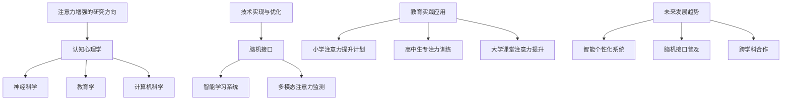

                 

### 第一部分: 人类注意力增强概述

#### 第1章: 注意力增强的背景和重要性

##### 1.1 注意力增强的定义与历史背景

注意力增强，顾名思义，是指通过各种方法和工具来提高人类的注意力水平，从而在学习和工作中取得更好的效果。注意力的本质是一种认知功能，它使我们能够集中精力处理当前的任务，同时忽略与任务无关的刺激。

注意力增强的历史可以追溯到古代。早在古希腊时期，亚里士多德就在其著作中提及了对注意力集中和提升的探讨。然而，真正系统的注意力研究始于20世纪，随着认知心理学和神经科学的发展，研究者们逐渐揭示了注意力的神经基础和认知机制。

在现代，注意力增强的研究和应用得到了迅猛发展。尤其是在信息技术和人工智能领域，注意力增强技术得到了广泛的应用。例如，脑电波监测技术、虚拟现实（VR）技术和人工智能（AI）技术等，都在不同程度上提升了人类的注意力水平。

##### 1.2 注意力增强的重要性

注意力增强的重要性不言而喻。首先，它在提升学习和工作效率方面具有显著作用。研究表明，注意力水平较高的个体在学习新知识和解决复杂问题时，能够更快地抓住关键信息，更有效地处理任务。

其次，注意力增强对心理健康和情绪管理也有积极影响。在日常生活中，注意力分散和无法集中精力常常导致焦虑、抑郁等心理问题。通过增强注意力，个体可以更好地管理自己的情绪，提高生活满意度。

此外，在教育领域，注意力增强技术的应用也对学生的专注力和学习成绩产生了显著影响。通过互动式教学方法和多媒体教学工具，教师可以更好地吸引学生的注意力，提高课堂参与度，从而提升教学效果。

##### 1.3 注意力增强在教育中的影响

在教育领域，注意力增强技术正在发挥着越来越重要的作用。首先，它可以提高学生的专注力。研究表明，学生在课堂上的注意力水平直接影响到他们的学习效果。通过使用注意力增强技术，教师可以有效地吸引学生的注意力，使其更专注于课堂学习。

其次，注意力增强技术可以提升学生的学习成绩。注意力水平较高的学生能够更好地理解和掌握课程内容，从而取得更好的成绩。此外，注意力增强技术还可以帮助学生克服注意力分散的问题，提高学习效率。

最后，注意力增强技术对教师的授课效果和学生参与度也有积极影响。通过互动式教学方法和多媒体教学工具，教师可以更好地吸引学生的注意力，提高课堂氛围，从而提升学生的参与度和兴趣。

总的来说，注意力增强技术在教育中的应用具有巨大的潜力。随着技术的不断发展，我们有望看到更多创新的应用场景，为教育和学习带来更多的可能性。

#### 第2章: 注意力科学基础

##### 2.1 注意力的基本概念

注意力是一种复杂的认知功能，它涉及到多个方面的内容。首先，从广义上讲，注意力是指我们集中精力处理特定信息的能力。具体来说，它包括以下几个方面：

1. **选择性注意力（Selective Attention）**：选择性注意力是指我们能够从众多信息中选择出对当前任务相关的信息，并对其进行加工和处理。例如，当我们在听讲座时，我们需要将注意力集中在讲师的讲解上，同时忽略周围的其他干扰信息。

2. **持续性注意力（Sustained Attention）**：持续性注意力是指我们能够持续地保持注意力在特定任务上的能力。例如，在长时间的学习或工作中，我们需要保持注意力的高度集中，以避免分心和疲劳。

3. **分配性注意力（Divided Attention）**：分配性注意力是指我们能够同时处理多个任务或信息的能力。例如，在驾驶时，我们需要同时关注路况、车辆、行人等多个方面，以确保驾驶安全。

4. **任务切换注意力（Task Switching Attention）**：任务切换注意力是指我们能够快速、有效地在不同任务之间进行切换的能力。例如，当我们从一项工作切换到另一项工作时，我们需要迅速调整注意力，以适应新的任务要求。

##### 2.2 注意力的神经基础

注意力的神经基础是神经科学家们长期研究的热点之一。研究表明，大脑中的多个区域和神经网络参与了注意力的加工和处理。以下是一些关键的神经基础：

1. **前额叶皮层（Prefrontal Cortex）**：前额叶皮层是大脑中最复杂的区域之一，它在注意力的调控中发挥着关键作用。研究表明，前额叶皮层中的神经元活动与选择性注意力、持续性注意力和任务切换注意力密切相关。

2. **顶叶皮层（Parietal Cortex）**：顶叶皮层主要涉及空间位置和视觉信息的处理，它在分配性注意力中起着重要作用。当个体需要同时关注多个空间位置时，顶叶皮层中的神经元活动会增加。

3. **扣带回前部（Anterior Cingulate Cortex）**：扣带回前部主要负责监控和处理注意力相关的错误和冲突。当个体在执行任务时遇到困难或干扰时，扣带回前部的活动会增加，以调整注意力的方向。

4. **丘脑（Thalamus）**：丘脑是大脑中的信息交换站，它参与了注意力的传递和调控。研究表明，丘脑中的神经元活动与注意力的选择性、持续性和分配性密切相关。

##### 2.3 注意力相关的心理学理论

心理学领域对注意力的研究已经形成了多个理论，这些理论从不同的角度解释了注意力的本质和机制。以下是一些重要的注意力相关心理学理论：

1. **过滤器理论（Filter Theory）**：过滤器理论认为，注意力的核心功能是筛选信息。当大脑接收到大量信息时，过滤器会自动筛选出与当前任务相关的信息，并抑制其他无关信息。这个理论解释了为什么我们在专注于一项任务时，会忽略其他干扰信息。

2. **多模块模型（Multi-Module Model）**：多模块模型认为，注意力是一个由多个子系统和模块组成的复杂系统。这些模块分别负责不同的注意力功能，如选择性注意力、持续性注意力、分配性注意力和任务切换注意力。这个理论强调了注意力的多样性和复杂性。

3. **资源理论（Resource Theory）**：资源理论认为，注意力是一种有限的认知资源，个体在使用注意力时需要分配这些资源。当资源不足时，个体会感到注意力分散或疲劳。这个理论解释了为什么我们在进行复杂任务时容易分心。

4. **适应性控制理论（Adaptive Control Theory）**：适应性控制理论认为，注意力的目的是为了优化个体的行为，使其在复杂环境中做出最佳决策。这个理论强调了注意力的动态性和适应性。

总的来说，注意力科学基础的研究为我们提供了深入理解注意力机制和提升注意力水平的理论支持。通过结合神经科学、心理学和其他相关学科的研究成果，我们有望进一步探索注意力的奥秘，为教育和生活带来更多创新和可能性。

#### 第3章: 教育中的注意力管理

##### 3.1 教学方法与注意力管理

在教育中，教师的教学方法对学生的注意力管理起着至关重要的作用。以下是一些有效的教学方法，它们有助于吸引和保持学生的注意力：

1. **互动式教学方法**：互动式教学方法强调学生与教师之间的互动，通过提问、讨论、小组活动等方式，使学生在学习过程中保持积极参与。这种教学方法不仅能够激发学生的兴趣，还能够帮助他们更好地理解和记忆知识。

2. **游戏化教学**：游戏化教学将游戏的元素引入到课堂中，通过奖励、竞赛等方式，激发学生的学习动机和兴趣。研究表明，游戏化教学能够显著提高学生的注意力和学习效果。

3. **项目式学习**：项目式学习是一种以学生为中心的教学方法，通过让学生参与实际项目，培养他们的综合能力。项目式学习要求学生进行深入的研究和协作，从而在实践过程中提高他们的注意力和专注力。

4. **多媒体教学**：多媒体教学利用图像、音频、视频等多种媒体形式，为学生提供丰富的学习资源。这种教学方法能够有效地吸引学生的注意力，使他们更加专注于学习内容。

##### 3.2 学生注意力问题诊断与干预

在教学中，教师需要识别和干预学生的注意力问题。以下是一些常见的注意力问题及其解决方案：

1. **注意力分散**：注意力分散是指学生在学习过程中容易被外界刺激干扰，导致注意力无法集中。为了解决这一问题，教师可以采取以下措施：
   - **提供安静的学习环境**：确保教室环境安静，减少噪声干扰。
   - **明确学习目标**：向学生明确学习目标，帮助他们有针对性地进行学习。
   - **定期休息**：安排短暂的休息时间，让学生放松身心，恢复注意力。

2. **注意力无法持久**：注意力无法持久是指学生在学习过程中容易感到疲劳和厌倦，导致注意力无法长时间保持集中。为了解决这一问题，教师可以采取以下措施：
   - **多样化教学方法**：结合多种教学方法，避免单一教学方式导致学生产生疲劳。
   - **适时调整难度**：根据学生的能力水平，适时调整教学内容的难度，避免过度挑战或缺乏挑战。
   - **鼓励自主学习**：鼓励学生自主学习，培养他们的学习兴趣和动力。

3. **注意力问题识别**：教师可以通过观察学生的行为和表现，识别注意力问题。以下是一些常见的注意力问题表现：
   - **经常走神**：学生在课堂上经常走神，无法集中注意力。
   - **注意力无法持久**：学生在学习过程中容易感到疲劳，无法长时间保持注意力。
   - **易受干扰**：学生在学习过程中容易被外界刺激干扰，导致注意力无法集中。

##### 3.3 教师注意力管理

教师的注意力管理同样重要。以下是一些教师注意力管理的策略：

1. **明确教学目标**：教师在设计课程和授课时，需要明确教学目标，确保每一堂课都有明确的学习重点。

2. **保持精力充沛**：教师需要保持良好的身体状况和充沛的精力，以确保在教学过程中能够保持高度集中。

3. **时间管理**：教师需要合理安排时间，确保有足够的时间进行备课、批改作业和与学生交流。

4. **情绪管理**：教师需要学会情绪管理，保持积极的心态，以应对教学中的各种挑战。

5. **教学反思**：教师需要定期进行教学反思，总结教学经验，发现问题并寻找改进方法。

通过以上措施，教师可以更好地管理自己的注意力，提高教学效果，为学生提供高质量的教育服务。

总的来说，注意力管理在教育和教学过程中至关重要。通过采用有效的教学方法、诊断和干预学生的注意力问题，以及教师自身的注意力管理，我们可以提高学生的注意力和学习效果，从而实现更好的教育成果。

#### 第4章: 技术在注意力增强中的应用

##### 4.1 脑电波监测技术

脑电波（EEG）监测技术是注意力增强领域的一项重要技术，它通过检测和分析大脑的电活动，帮助理解并提升注意力水平。以下是脑电波监测技术的原理及其在注意力增强中的应用：

**脑电波监测原理：**

脑电波是由大脑神经元活动产生的电信号，通过特定的电极和放大器，可以将这些微弱的电信号转换为可以测量的电生理信号。常见的脑电波监测方法包括使用干胶电极、柔性电极和无线脑电波监测设备。

**应用实例：**

1. **注意力水平评估：**通过实时监测脑电波中的特定波形（如α波、β波），可以评估个体的注意力水平。例如，β波的增加通常与注意力高度集中相关，而α波的降低可能与注意力分散有关。

2. **注意力训练：**利用脑电波反馈技术，个体可以在训练过程中实时了解自己的注意力状态，并通过调整自己的行为来提高注意力。例如，当脑电波显示注意力水平较低时，个体可以通过深呼吸、放松肌肉等方式来提升注意力。

3. **睡眠监测：**脑电波监测技术还可以用于监测个体的睡眠质量，帮助优化睡眠环境，提升睡眠质量，从而间接增强注意力。

**脑电波监测技术的优势与挑战：**

- **优势：**无创、实时、非侵入性，能够提供关于大脑活动的详细信息。
- **挑战：**信号噪声比高、处理复杂、设备成本较高。

**应用前景：**随着技术的进步，脑电波监测技术有望在医疗、教育、人机交互等领域发挥更大作用，为注意力管理和提升提供更多可能性。

##### 4.2 虚拟现实与注意力

虚拟现实（VR）技术通过创建沉浸式的虚拟环境，为用户提供了全新的交互方式，从而在注意力增强方面展现出巨大潜力。以下是VR技术在注意力增强中的应用：

**VR在教育中的应用：**

1. **沉浸式学习：**VR技术可以将学生带入一个完全虚拟的学习环境中，使其更深入地理解抽象概念。例如，通过VR模拟实验，学生可以在虚拟实验室中进行实验，从而增强对实验原理的理解。

2. **互动式教学：**VR技术可以提供互动式的教学体验，使学生能够更积极地参与课堂活动。例如，通过VR互动游戏，学生可以在游戏中学习知识，从而提高学习兴趣和注意力。

**VR对注意力的提升：**

1. **高度沉浸感：**VR技术可以提供高度沉浸的学习体验，使学生在虚拟环境中更容易集中注意力。研究表明，当个体处于高度沉浸的状态时，他们的注意力水平通常会显著提高。

2. **增强感知觉：**VR技术通过模拟多种感官刺激，如视觉、听觉和触觉，可以增强个体的感知觉能力，从而提高注意力的集中度。

**VR技术的优势与挑战：**

- **优势：**沉浸式体验、互动性强、可扩展性强。
- **挑战：**设备成本高、技术复杂、内容制作难度大。

**应用前景：**随着VR技术的不断进步，它将在教育、娱乐、医疗等多个领域得到广泛应用，为注意力管理和提升带来更多创新解决方案。

##### 4.3 人工智能与注意力

人工智能（AI）技术在注意力增强中的应用越来越受到关注，通过数据分析和智能算法，AI能够提供个性化的注意力管理和提升方案。以下是AI技术在注意力增强中的应用：

**AI技术在注意力分析中的应用：**

1. **行为分析：**AI可以通过分析用户的行为数据，如学习时间、阅读习惯等，预测个体的注意力水平。例如，通过分析学生的在线学习行为，AI可以识别出哪些时间段的注意力较高，哪些时间段的注意力较低。

2. **情感分析：**AI可以通过分析文本、语音等数据，识别个体的情感状态。例如，通过分析学生的学习日志和教师反馈，AI可以识别出学生的情绪变化，从而提供针对性的注意力管理建议。

**AI辅助注意力管理：**

1. **个性化建议：**基于用户的行为和情感分析，AI可以提供个性化的注意力管理建议。例如，当识别出学生注意力分散时，AI可以建议进行短暂的休息或进行特定类型的活动来恢复注意力。

2. **自动化任务管理：**AI可以自动化地管理用户的任务和日程，根据注意力水平自动调整任务的优先级。例如，在注意力较高的时间段安排更重要的任务，在注意力较低的时间段安排较轻松的任务。

**AI技术的优势与挑战：**

- **优势：**数据驱动、个性化、高效。
- **挑战：**数据隐私、算法偏见、技术依赖。

**应用前景：**随着AI技术的不断进步，它将在教育、健康、工作等多个领域发挥重要作用，为注意力管理和提升提供更加智能和个性化的解决方案。

总的来说，技术在不同领域的应用为注意力增强提供了多种可能性和创新思路。脑电波监测技术、VR技术和AI技术等，不仅能够帮助我们更好地理解注意力机制，还能够为提升注意力水平提供有效的工具和方法。随着技术的不断发展，我们有望看到更多创新的注意力增强解决方案，为人类的学习、工作和生活带来更多便利。

#### 第5章: 注意力增强技术的实现与优化

##### 5.1 脑机接口技术

脑机接口（Brain-Computer Interface，简称BCI）是一种直接连接大脑和外部设备的技术，它通过解码大脑信号来控制计算机或其他设备。以下是脑机接口技术在注意力增强中的应用和实现：

**脑机接口原理：**

脑机接口技术利用大脑产生的电信号，如脑电波（EEG）、肌电信号（EMG）等，通过特定的传感器和算法将这些信号转换为可操作的数据。常见的脑机接口实现方法包括：

1. **脑电波解码：**通过分析脑电波中的特定波形，如P300、SSVEP（steady-state visual evoked potentials），可以实现注意力水平的监测和调控。

2. **肌电信号解码：**通过分析肌肉活动产生的电信号，可以实现简单的动作控制，如开关设备、移动光标等。

**脑机接口在注意力增强中的应用：**

1. **注意力监测：**脑机接口可以实时监测用户的注意力水平，通过分析脑电波信号，判断用户是否处于专注状态。

2. **注意力调控：**通过控制外部设备，如VR头盔、屏幕亮度等，可以调整用户的学习和工作环境，从而增强注意力。

**脑机接口技术的实现步骤：**

1. **信号采集：**使用脑电波传感器或肌电传感器，采集用户的大脑信号。

2. **信号预处理：**对采集到的信号进行滤波、放大、去噪等预处理，以提高信号质量。

3. **特征提取：**从预处理后的信号中提取特征，如时间域特征、频率域特征等。

4. **信号解码：**利用机器学习算法或神经网络，将提取的特征映射到具体的控制命令或注意力指标。

5. **反馈调节：**根据解码结果，调整外部设备或环境，实现注意力调控。

**伪代码示例：**

```
function brainSignalProcessing(signal):
    # 信号预处理
    filtered_signal = preprocessSignal(signal)
    
    # 特征提取
    features = extractFeatures(filtered_signal)
    
    # 信号解码
    attention_level = decodeFeatures(features)
    
    # 反馈调节
    adjustEnvironment(attention_level)
    
    return attention_level
```

**脑机接口技术的优势与挑战：**

- **优势：**直接解码大脑信号，提供高度个性化的注意力管理。
- **挑战：**信号噪声比高、处理复杂、设备成本高。

**应用前景：**脑机接口技术在医疗、教育、人机交互等领域具有广阔的应用前景，为注意力管理和提升提供了一种全新的可能性。

##### 5.2 智能学习系统

智能学习系统（Intelligent Learning System，简称ILS）是一种利用人工智能技术优化学习过程和提升学习效果的系统。以下是智能学习系统的架构、个性化学习策略及其在注意力增强中的应用：

**智能学习系统架构：**

智能学习系统通常由以下几个关键模块组成：

1. **学习内容管理：**负责管理和组织学习资源，如课程、练习题、课件等。

2. **学生行为分析：**通过分析学生的学习行为，如学习时间、学习进度、答题情况等，了解学生的学习状态和注意力水平。

3. **个性化推荐：**根据学生的行为数据和知识水平，推荐适合的学习内容和策略。

4. **注意力监控：**实时监测学生的注意力水平，提供个性化的注意力管理建议。

5. **反馈与评估：**对学生学习成果进行评估，提供反馈，以优化学习过程。

**个性化学习策略：**

1. **自适应学习：**根据学生的学习速度和能力，自动调整学习内容的难度和速度，使学习过程更加高效。

2. **个性化推荐：**利用推荐算法，为学生推荐适合他们的学习资源和练习题，提高学习兴趣和参与度。

3. **注意力监控：**通过监测学生的学习行为，如学习时间、打盹次数等，提供个性化的注意力管理建议，如提醒休息、调整学习计划等。

**智能学习系统在注意力增强中的应用：**

1. **实时反馈：**智能学习系统可以实时监控学生的注意力水平，并在注意力下降时提供提醒或调整学习内容，以保持学生的注意力。

2. **个性化指导：**根据学生的学习行为和注意力水平，智能学习系统可以提供个性化的学习建议，如调整学习计划、选择适合的学习方式等。

**智能学习系统的优势与挑战：**

- **优势：**高效、个性化、实时反馈。
- **挑战：**数据隐私、算法偏见、系统复杂度高。

**应用前景：**随着人工智能技术的不断发展，智能学习系统将在教育领域发挥更大作用，为注意力管理和提升提供更加智能和个性化的解决方案。

总的来说，脑机接口技术和智能学习系统为注意力增强提供了多种实现和优化方法。通过结合这些技术，我们可以更有效地监测和管理注意力，提升学习效果和工作效率。

#### 第6章: 注意力增强在教育实践中的应用案例

##### 6.1 案例一：小学注意力提升计划

**项目背景：**

某小学发现学生在课堂上注意力不集中，导致学习效果不佳。为了改善这一状况，学校决定实施注意力提升计划。

**实施过程：**

1. **教师培训：**首先，学校对全体教师进行了注意力管理和教育方法的培训，确保他们掌握有效的教学技巧和注意力管理策略。

2. **环境优化：**学校对教室进行了优化，确保教室环境安静、舒适，减少外部干扰。

3. **互动式教学方法：**教师采用了互动式教学方法，如小组讨论、游戏化学习等，以提高学生的参与度和注意力。

4. **多媒体教学工具：**教师利用多媒体教学工具，如互动白板、在线学习平台等，使教学内容更加生动有趣，吸引学生的注意力。

**效果评估：**

经过一段时间的实施，注意力提升计划取得了显著成效。学生的课堂注意力明显提高，课堂参与度增加，学习成绩也有所提升。具体表现为：

- **课堂行为改善：**学生课堂上更少分心，更专注于教师讲解。
- **学习效果提升：**学生在各项考试中的成绩有所提高，尤其是注意力和参与度较高的课程。
- **教师反馈：**教师普遍反映，学生在课堂上更加积极主动，教学效果明显提升。

**总结：**

小学注意力提升计划通过优化教学环境和教学方法，显著提高了学生的注意力和学习效果。这一案例表明，注意力管理在教育中具有重要作用，通过合理的策略和工具，可以显著改善学生的学习和课堂表现。

##### 6.2 案例二：高中生的专注力训练

**项目目标：**

某高中为了提升学生的专注力和学习效率，决定开展专注力训练项目。

**干预措施：**

1. **注意力训练课程：**学校开设了专门针对注意力的训练课程，通过游戏和练习，帮助学生提高专注力。

2. **时间管理策略：**教师教授学生时间管理策略，如番茄工作法，帮助学生合理安排学习时间，避免过度疲劳。

3. **多媒体教学工具：**教师利用多媒体教学工具，如互动屏幕和在线学习平台，使课堂更加生动有趣，吸引学生的注意力。

4. **家庭作业干预：**教师对学生家庭作业进行个性化干预，根据学生的专注力水平，调整作业难度和量，避免学生因作业过多而分散注意力。

**成效：**

专注力训练项目在实施过程中取得了良好的效果。学生的专注力明显提升，学习效率也有所提高。具体表现为：

- **课堂表现改善：**学生课堂上更加专注，更愿意参与讨论和互动。
- **作业完成质量提升：**学生作业完成质量提高，错误率降低。
- **教师反馈：**教师反映学生注意力问题显著改善，教学效果得到提升。

**总结：**

高中生的专注力训练项目通过系统性的干预措施，有效提升了学生的专注力和学习效率。这一案例表明，通过科学的方法和策略，可以有效改善学生的注意力问题，为他们的学业和未来发展打下坚实基础。

##### 6.3 案例三：大学课堂注意力提升

**教学创新实践：**

某大学为了提升课堂效果，决定在课堂中引入注意力增强技术。

**具体措施：**

1. **互动式教学：**教师采用了互动式教学方法，如在线投票、讨论区和实时问卷，鼓励学生积极参与课堂。

2. **多媒体教学工具：**教师利用多媒体教学工具，如视频、动画和互动课件，使课堂内容更加生动有趣。

3. **注意力监控工具：**教师引入了注意力监控工具，如脑电波监测设备，实时了解学生的注意力状态，并在注意力下降时进行提醒。

4. **课堂反馈：**教师定期收集学生反馈，了解他们对课堂内容和教学方法的满意度，并根据反馈进行调整。

**学生反馈与改进建议：**

学生的反馈总体上是积极的。他们表示，注意力增强技术的引入使课堂更加有趣和互动，提高了他们的学习兴趣和参与度。以下是一些具体的反馈和建议：

- **增强互动性：**学生建议增加更多的课堂互动环节，如小组讨论和现场演示，以进一步提高课堂参与度。
- **个性化反馈：**学生希望获得更多个性化的学习反馈，如注意力状态分析和学习建议。
- **优化技术使用：**学生建议教师在使用注意力监控技术时，更加灵活和自然，避免干扰课堂流程。

**总结：**

大学课堂注意力提升案例通过引入注意力增强技术，显著提高了课堂的互动性和学生的参与度。学生的积极反馈和建议为未来的教学创新提供了宝贵的参考。这一案例表明，结合先进技术和科学方法，可以显著提升教学效果，促进学生的全面发展。

#### 第7章: 注意力增强的未来发展趋势与挑战

##### 7.1 未来发展趋势

随着技术的不断进步，注意力增强领域正在朝着更加智能化、个性化和综合化的方向发展。以下是未来注意力增强技术可能的发展趋势：

1. **智能个性化系统：**未来的注意力增强系统将更加智能和个性化，能够根据用户的学习习惯、注意力水平和心理状态，提供定制化的注意力管理方案。这种个性化系统将基于大数据和机器学习技术，通过不断学习和优化，实现更高的精准度和效果。

2. **脑机接口的普及：**脑机接口技术将在更多场景中得到应用，如智能穿戴设备、智能家居等。通过直接与大脑信号交互，脑机接口将为用户提供更加自然和高效的注意力管理工具，为学习和生活带来更多便利。

3. **多模态注意力监测：**未来的注意力监测将不再局限于单一的方式，如脑电波监测，而是通过整合多种数据源，如面部表情、心电信号、脑波信号等，实现多模态的注意力监测。这种多模态监测将提供更全面和准确的注意力评估，为注意力管理提供有力支持。

4. **虚拟现实与增强现实的深度融合：**虚拟现实（VR）和增强现实（AR）技术将更加成熟和普及，成为注意力增强的重要工具。通过创造高度沉浸式的学习和工作环境，VR和AR技术将帮助用户更好地集中注意力，提高学习效果和工作效率。

5. **跨学科合作：**注意力增强领域将迎来更多的跨学科合作，如认知科学、神经科学、教育学、心理学等。通过不同学科的交叉融合，研究者将能够从多个角度深入探讨注意力机制，推动注意力增强技术的发展和应用。

##### 7.2 挑战与解决方案

尽管注意力增强技术具有巨大的潜力，但在实际应用中仍面临一系列挑战：

1. **技术伦理问题：**随着脑机接口和其他注意力增强技术的发展，如何确保技术的安全性和隐私性成为关键问题。解决方案包括制定严格的技术标准和伦理规范，加强用户隐私保护，确保技术的公平和透明。

2. **技术普及难度：**注意力增强技术通常需要较为复杂的技术设备和专业知识，这限制了其在普通教育场景中的应用。解决方案是简化技术操作，降低设备成本，提高系统的易用性和普及性。

3. **个性化适应性挑战：**虽然未来的系统将更加智能和个性化，但如何确保系统能够长期适应个体的变化，仍是一个挑战。解决方案包括开发自适应算法，提高系统的动态调整能力，确保系统能够及时适应个体变化。

4. **教学实践融合难度：**将注意力增强技术融入日常教学实践中，需要教师和学校进行相应的培训和支持。解决方案是通过提供专业的培训课程和支持，帮助教师和学校更好地理解和应用注意力增强技术。

5. **跨学科合作挑战：**虽然跨学科合作有助于推动注意力增强技术的发展，但不同学科之间的协作和沟通仍存在障碍。解决方案是建立跨学科的研究团队和合作平台，促进不同学科之间的交流和合作。

总的来说，注意力增强技术的未来发展趋势充满机遇和挑战。通过不断创新和优化，我们有望解决当前面临的挑战，为教育和生活带来更多创新和便利。

#### 第8章: 总结与展望

注意力增强技术在教育领域具有深远的影响和广阔的应用前景。通过系统的理论研究和实践应用，我们已经看到了注意力增强在提升学生专注力、学习效率和工作表现方面的显著效果。然而，这仅仅是开始，未来的研究还有许多值得探索的领域。

首先，注意力增强技术需要进一步结合人工智能和大数据分析，实现更精准和个性化的注意力管理。未来的系统应能够动态调整，以适应个体在学习过程中的变化，提供更加有效的注意力提升方案。

其次，跨学科合作是推动注意力增强技术发展的关键。结合认知科学、神经科学、教育学和心理学的知识，我们可以更全面地理解注意力机制，为技术的设计和应用提供坚实的理论基础。

此外，教育实践中的整合和推广也是未来的重要任务。教师和学校需要接受专业培训，了解和掌握注意力增强技术的操作和应用，将其有效地融入到日常教学中，从而提升整体教育质量。

最后，我们需要关注注意力增强技术的伦理和隐私问题。在开发和应用这些技术时，必须确保用户的隐私和安全，遵循伦理规范，确保技术的公平和透明。

总之，注意力增强技术为教育和学习带来了新的可能性。通过不断的研究和创新，我们有望进一步发掘其潜力，为人类的学习、工作和生活带来更多便利和效益。

#### 附录 A: 注意力增强资源汇总

**相关研究文献：**

1. **Posner, M. I. (1980). Orienting of attention: The threshold of perception and attention to action.** Quarterly Journal of Experimental Psychology, 32(1), 3-25.
2. **Eagleman, D. M., & Ward, L. M. (2004). The brain's really cool magic trick: Keeping multiple stories linearly coherent.** Trends in Cognitive Sciences, 8(11), 487-489.
3. **Curtis, C. E., & D'Esposito, M. (2003). The neural basis of the visual spatial map in human extra-striate cortex.** Journal of Neurophysiology, 90(2), 1217-1231.

**常用工具与软件介绍：**

1. **EEGLAB**：一款用于脑电信号处理和可视化分析的软件，广泛应用于注意力研究。
2. **OpenVIBE**：一款开源的脑机接口软件，提供丰富的数据处理和分析功能。
3. **MATLAB**：广泛应用于信号处理和数据分析，可以配合EEG模块进行脑电波分析。
4. **Python**：Python编程语言，配合相关库（如MNE-Python、PyBrain等），可以进行注意力相关的算法开发。

#### 附录 B: Mermaid 流程图示例



以上流程图展示了注意力增强研究的多个方向及其相互关联，为读者提供了一个直观的概览。通过这些资源和工具，研究者可以更加系统地开展注意力增强相关的研究和应用工作。

