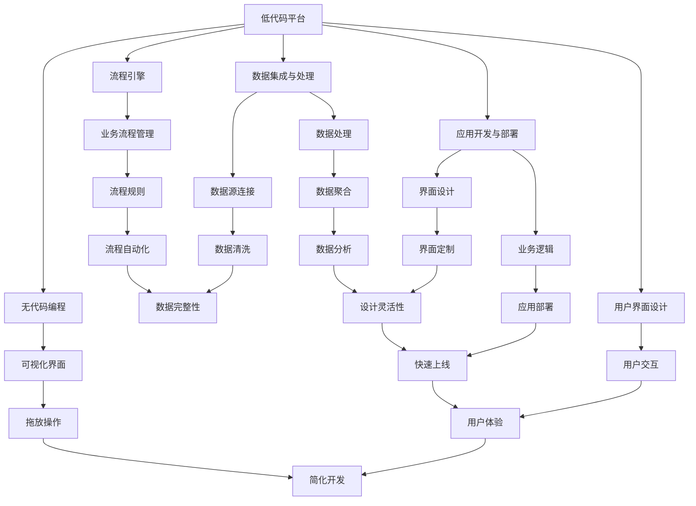

                 

### 文章标题

#### 低代码平台：简化应用开发的创业方向

**关键词：** 低代码平台、应用开发、创业、简化、技术原理、案例分析、策略

**摘要：** 本文旨在探讨低代码平台在应用开发中的价值，分析其在创业中的应用策略和实践案例，并展望其未来的发展前景。通过一步步的深入分析，本文将帮助读者理解低代码平台的本质，掌握其在创业中的实际应用技巧。

---

### 目录大纲：低代码平台：简化应用开发的创业方向

**第一部分：低代码平台概述**

**第1章：低代码平台概述**  
- **1.1 低代码平台的定义**  
- **1.2 低代码平台的核心功能**  
- **1.3 低代码平台的市场现状与趋势**

**第2章：低代码平台的架构与技术原理**  
- **2.1 低代码平台的架构设计**  
- **2.2 低代码平台的关键技术**  
- **2.3 低代码平台的技术挑战与解决方案**

**第3章：低代码平台的应用场景与案例分析**  
- **3.1 低代码平台在不同行业的应用**  
- **3.2 案例分析**

**第二部分：低代码平台在创业中的应用**

**第4章：低代码平台在创业中的应用策略**  
- **4.1 低代码平台在创业公司中的优势**  
- **4.2 创业公司如何选择低代码平台**  
- **4.3 低代码平台的创业应用案例**

**第5章：低代码平台创业项目实践**  
- **5.1 项目策划与需求分析**  
- **5.2 开发与部署**  
- **5.3 运营与优化**

**第6章：低代码平台创业项目的成功要素**  
- **6.1 团队建设与管理**  
- **6.2 资源配置与资金管理**  
- **6.3 市场推广与品牌建设**

**第三部分：低代码平台的发展前景与挑战**

**第7章：低代码平台的发展前景与未来趋势**  
- **7.1 低代码平台的发展趋势**  
- **7.2 低代码平台的未来挑战**

**第8章：低代码平台的发展策略与建议**  
- **8.1 低代码平台的未来发展策略**  
- **8.2 对创业公司的建议**

**附录**  
- **附录A：低代码平台开发工具与资源**  
- **附录B：低代码平台项目实战案例**

---

### 核心概念与联系

在探讨低代码平台之前，我们需要明确一些核心概念，以便更好地理解低代码平台的技术原理和应用场景。以下是几个关键概念以及它们之间的联系：

**低代码平台（Low-Code Platform）**：低代码平台是一种软件开发方法，通过可视化的用户界面和简单的操作，允许非专业开发者快速构建和部署应用程序，减少对传统编码的依赖。

**无代码编程（No-Code Programming）**：无代码编程是低代码平台的一个子集，它完全消除了编码需求，使用图形界面和拖放操作来构建应用程序。

**流程引擎（Workflow Engine）**：流程引擎是低代码平台的核心组件之一，用于自动化和管理业务流程。它定义了流程的步骤、条件、变量和角色，使得业务流程能够按照预定的规则自动执行。

**数据集成与处理**：数据集成与处理是低代码平台的重要功能，它允许用户将多个数据源连接起来，并进行数据的清洗、转换和聚合，为应用提供所需的数据。

**应用开发与部署**：低代码平台提供了简便的应用开发工具，用户可以通过简单的拖放操作创建应用界面和业务逻辑，并快速部署到云平台或本地服务器。

**用户界面设计（UI Design）**：用户界面设计是低代码平台的重要组成部分，它使得用户可以通过图形界面直观地定制和调整应用的外观和行为。

为了更直观地展示这些概念之间的联系，我们可以使用Mermaid流程图来描述：

这个流程图清晰地展示了低代码平台的核心组件和功能，以及它们之间的关系。通过这个图，我们可以更好地理解低代码平台的工作原理和应用价值。

### 低代码平台的架构与技术原理

低代码平台的设计理念是通过提供直观的可视化工具和模块化组件，让非专业开发者也能够快速构建和部署应用程序。这种平台通常具有以下核心架构和技术原理：

#### 2.1 低代码平台的架构设计

低代码平台的架构设计通常包括以下几个关键组成部分：

1. **前端可视化界面**：这是用户与平台交互的主要界面，通过图形界面和拖放操作，用户可以轻松地设计应用界面和业务逻辑。

2. **后端服务**：后端服务包括数据处理、业务逻辑处理、数据存储等功能。这些服务通常通过RESTful API或其他服务接口与前端界面进行通信。

3. **数据存储**：低代码平台需要支持多种数据存储方式，包括关系型数据库、NoSQL数据库、文件存储等，以便用户可以灵活地存储和管理数据。

4. **流程引擎**：流程引擎是低代码平台的核心组件，用于自动化和管理业务流程。它定义了流程的步骤、条件、变量和角色，使得业务流程能够按照预定的规则自动执行。

5. **开发工具和SDK**：低代码平台通常会提供开发工具和软件开发工具包（SDK），这些工具和库可以帮助开发者更方便地集成第三方服务和功能，扩展平台的 capability。

6. **集成与扩展性**：低代码平台通常具有良好的集成性和扩展性，允许用户将平台与其他系统、应用和第三方服务连接，以满足多样化的业务需求。

#### 2.2 低代码平台的关键技术

低代码平台的关键技术主要包括以下方面：

1. **无代码编程**：无代码编程允许用户通过可视化界面和简单的操作来构建应用程序，而无需编写任何代码。这通常通过拖放组件、图形化流程设计器等方式实现。

2. **流程引擎**：流程引擎是低代码平台的核心技术之一，用于自动化和管理业务流程。它通过定义流程步骤、条件、变量和角色，使得业务流程能够按照预定的规则自动执行。

3. **数据集成与处理**：低代码平台支持多种数据集成方式，如RESTful API、Webhook、数据库连接等。用户可以通过这些方式将不同来源的数据连接到平台，并进行数据的清洗、转换和聚合。

4. **应用开发与部署**：低代码平台提供简便的应用开发工具，用户可以通过简单的拖放操作创建应用界面和业务逻辑，并快速部署到云平台或本地服务器。

5. **用户界面设计**：用户界面设计是低代码平台的重要组成部分，它使得用户可以通过图形界面直观地定制和调整应用的外观和行为。

#### 2.3 低代码平台的技术挑战与解决方案

尽管低代码平台具有许多优点，但在实际应用中仍面临一些技术挑战。以下是一些常见的技术挑战以及相应的解决方案：

1. **性能瓶颈**：低代码平台可能会因为过于依赖前端可视化工具而导致性能瓶颈。解决方案包括优化前端架构、使用异步处理和数据缓存等。

2. **安全性与隐私保护**：低代码平台需要处理大量敏感数据，因此需要确保数据的安全性和隐私保护。解决方案包括加密数据传输、身份验证和访问控制等。

3. **集成与兼容性**：低代码平台需要与多种第三方服务和应用进行集成，这可能会导致兼容性问题。解决方案包括提供标准化的接口和协议，以及使用适配器模式等。

4. **扩展性与定制化**：低代码平台需要支持高度的扩展性和定制化，以满足不同用户的需求。解决方案包括提供可插拔的组件、模块化和配置化等。

5. **技术支持与培训**：低代码平台用户通常缺乏专业的技术背景，因此需要提供全面的技术支持和培训，以确保用户能够充分利用平台的功能。

通过解决这些技术挑战，低代码平台可以更好地满足用户的业务需求，提高开发效率和降低成本。

### 低代码平台的应用场景与案例分析

低代码平台因其简便、快速的开发特性，在不同行业中有着广泛的应用。以下是一些典型应用场景以及具体案例的分析。

#### 3.1 低代码平台在不同行业的应用

**企业内部管理应用**：许多企业使用低代码平台来自动化内部管理流程，如人事管理、供应链管理、客户关系管理等。这些平台提供了丰富的模块和组件，可以快速构建和部署定制化的管理系统，提高企业运营效率。

**业务流程自动化**：低代码平台非常适合用于自动化复杂的业务流程。例如，银行可以使用低代码平台来自动化贷款审批流程，从而提高审批效率和降低风险。

**电子商务应用**：电商平台可以利用低代码平台快速创建和部署新的功能模块，如推荐系统、购物车、支付接口等，从而提升用户体验和销售转化率。

**客户服务平台**：低代码平台可以帮助企业快速搭建客户服务系统，如在线客服、工单系统等，从而提高客户满意度和服务响应速度。

#### 3.2 案例分析

**成功案例：**  
1. **Salesforce**：Salesforce 是一家提供企业级云计算服务的公司，其低代码平台——Salesforce App Cloud，可以帮助企业快速构建和部署移动应用。许多知名企业，如Nike、Unilever等，都通过使用Salesforce的低代码平台实现了业务流程的自动化和数字化转型。

2. **OutSystems**：OutSystems 是一家提供低代码开发平台的公司，其平台可以帮助用户快速构建企业级应用。许多企业，如丹麦邮局、摩根大通等，都通过使用OutSystems的低代码平台成功实现了业务流程的自动化和数字化转型。

**失败案例：**  
1. **Zoho**：Zoho 提供了低代码开发平台 Zoho Creator，但其平台在扩展性和性能方面存在一些问题，导致一些用户无法充分利用其功能。这主要是由于Zoho Creator在早期开发阶段过于关注用户界面的友好性，而忽视了底层技术的优化。

2. **Nintex**：Nintex 是一家提供流程自动化解决方案的公司，其低代码平台在市场上具有一定的知名度。然而，一些用户反馈其平台在处理复杂业务流程时存在一些性能瓶颈，需要进一步优化。

#### 教训与启示

从成功案例和失败案例中，我们可以得出以下教训和启示：

1. **注重性能优化**：低代码平台在开发过程中，需要注重性能优化，以确保平台能够快速响应用户需求。

2. **提供全面的技术支持**：低代码平台用户通常缺乏专业的技术背景，因此需要提供全面的技术支持和培训，以确保用户能够充分利用平台的功能。

3. **关注用户体验**：低代码平台的用户界面设计非常重要，需要确保用户能够轻松地构建和部署应用。

4. **持续迭代与优化**：低代码平台需要不断迭代和优化，以适应不断变化的市场需求和用户需求。

通过这些教训和启示，我们可以更好地理解和应用低代码平台，从而在创业过程中取得成功。

### 低代码平台在创业中的应用策略

低代码平台因其高效、灵活和低成本的特点，成为创业公司快速构建和迭代产品的理想选择。以下是从策略角度分析低代码平台在创业中的应用。

#### 4.1 低代码平台在创业公司中的优势

1. **快速原型开发**：低代码平台提供丰富的模块和组件，可以帮助创业公司快速构建原型，缩短产品开发周期。这使得创业公司能够更快地验证市场需求，及时调整产品方向。

2. **降低开发成本**：低代码平台减少了对于专业开发人员的依赖，降低了人力成本。同时，平台通常提供云服务，减少了服务器和维护成本。

3. **加速产品迭代**：低代码平台允许创业公司快速迭代产品，及时响应用户反馈和市场变化。这种快速迭代能力有助于提高产品竞争力和用户满意度。

4. **提高开发效率**：低代码平台提供可视化界面和简化操作，使得非专业开发者也能参与应用开发，提高了团队的整体开发效率。

#### 4.2 创业公司如何选择低代码平台

1. **功能需求与业务匹配**：创业公司应根据自身的业务需求，选择具有相关功能模块的低代码平台。例如，从事电子商务的创业公司应选择支持电子商务功能的低代码平台。

2. **评估平台成熟度**：选择市场成熟、用户口碑良好的低代码平台，可以降低使用风险。创业公司可以通过查阅平台文档、用户评论等途径进行评估。

3. **技术支持与培训**：创业公司应考虑平台提供的技术支持和培训服务。良好的技术支持可以帮助解决开发过程中的问题，培训服务则有助于团队成员快速上手。

4. **社区与生态**：活跃的社区和丰富的生态资源可以为创业公司提供更多支持和资源，如插件、模板、文档等。选择具有强大社区和生态的低代码平台有助于创业公司的发展。

#### 4.3 低代码平台的创业应用案例

**案例1：** 小微企业财务管理系统

某小微企业因缺乏专业财务人员，决定使用低代码平台搭建财务管理系统。通过选择一个具有财务管理功能的低代码平台，该企业迅速搭建了包含账务处理、税务申报、报表生成等功能的系统，有效提升了财务管理效率和准确性。

**案例2：** 教育培训机构在线学习平台

一家教育培训机构希望通过互联网拓展业务，决定使用低代码平台构建在线学习平台。通过选择一个具有在线教学、课程管理、学生管理等功能模块的低代码平台，该机构成功上线了在线学习平台，并迅速积累了用户和市场份额。

**案例3：** 医疗健康管理系统

一家初创医疗健康公司希望通过低代码平台搭建一个健康管理应用，为用户提供健康数据监测、在线问诊等功能。通过选择一个具有医疗健康功能模块的低代码平台，该公司快速搭建了健康管理应用，并在市场上取得了良好的反响。

这些案例表明，低代码平台在创业中的应用具有广泛性和灵活性，可以根据不同业务需求快速构建和部署应用，为创业公司提供强有力的技术支持。

### 低代码平台创业项目实践

在创业过程中，选择并实践低代码平台项目是实现快速迭代和成功的关键。以下是一个详细的低代码平台创业项目实践过程，包括项目策划与需求分析、开发与部署以及运营与优化。

#### 5.1 项目策划与需求分析

**项目背景**：某初创公司计划开发一款面向中小企业的在线协作工具，旨在提升团队沟通效率和任务管理能力。

**目标用户**：中小企业的管理层、团队负责人和员工。

**核心功能**：任务管理、团队通讯、日程安排、文档共享。

**需求分析**：通过对目标用户的调研，明确了以下需求：
- **任务管理**：任务创建、指派、追踪和反馈。
- **团队通讯**：即时通讯、邮件提醒、公告发布。
- **日程安排**：日历视图、事件提醒、会议预约。
- **文档共享**：文件上传、版本控制、权限管理。

#### 5.2 开发与部署

**选择低代码平台**：根据需求分析，公司选择了某知名低代码平台——OutSystems。该平台提供了丰富的模块和组件，能够满足项目需求。

**环境搭建**：
- 选择云服务提供商，如阿里云或AWS，搭建开发环境和测试环境。
- 配置OutSystems开发工具，包括集成开发环境（IDE）和后端服务。

**开发过程**：
- **需求分析**：与产品经理、设计师和开发团队紧密合作，明确功能模块和开发优先级。
- **原型设计**：使用OutSystems的可视化界面设计工具，设计应用界面和用户交互流程。
- **模块开发**：根据需求文档，开发任务管理、团队通讯、日程安排和文档共享等功能模块。
- **测试**：在开发和迭代过程中，持续进行功能测试和用户反馈收集，确保应用稳定性和用户体验。

**部署**：
- **测试环境部署**：在测试环境中进行全面测试，确保无缺陷和性能问题。
- **生产环境部署**：将应用部署到云服务器，并进行性能优化和安全性设置。
- **上线**：发布应用，开放用户注册和使用。

#### 5.3 运营与优化

**用户反馈**：上线后，积极收集用户反馈，包括使用体验、功能需求和建议等。

**迭代优化**：
- **功能优化**：根据用户反馈，持续优化应用功能，提高用户体验。
- **性能优化**：监控应用性能，进行代码优化和系统调优，确保应用稳定运行。
- **安全防护**：加强数据安全防护，定期进行安全检查和漏洞修复。

**团队协作**：
- **项目管理**：使用低代码平台内置的项目管理工具，如任务追踪和团队协作，确保项目进度和质量。
- **培训与支持**：为团队成员提供培训和支持，确保他们能够熟练使用低代码平台，提高开发效率。

通过以上步骤，创业公司可以有效地利用低代码平台，快速搭建和优化应用，从而在激烈的市场竞争中脱颖而出。

### 低代码平台创业项目的成功要素

在创业过程中，低代码平台作为高效、灵活的工具，能够显著提升项目成功的概率。然而，成功不仅依赖于技术的先进性，还涉及团队建设、资源配置和市场推广等多方面因素。以下是从几个关键方面分析低代码平台创业项目的成功要素。

#### 6.1 团队建设与管理

**团队结构与角色分工**：创业项目的成功离不开有效的团队建设和明确的角色分工。团队成员应包括产品经理、设计师、开发人员、测试工程师和市场营销人员等。每个角色在项目中承担特定的职责，确保项目的高效推进。例如，产品经理负责需求分析和项目规划，设计师负责用户界面设计，开发人员负责实现功能模块，测试工程师负责质量保证，市场营销人员负责市场推广和用户反馈收集。

**管理模式与激励机制**：有效的管理模式能够激发团队成员的积极性和创造力。创业公司可以采用敏捷开发模式，通过短周期迭代和频繁的团队协作，快速响应市场需求。此外，建立合理的激励机制，如绩效奖金、股权激励等，可以鼓励团队成员为项目成功贡献力量。

**团队文化建设**：团队文化是团队协作和创新的重要基础。创业公司应倡导开放、包容、合作的文化氛围，鼓励团队成员互相支持和学习，共同面对挑战和困难。通过团队建设活动、培训和学习机会，提升团队成员的专业素养和团队凝聚力。

#### 6.2 资源配置与资金管理

**资源获取与利用**：创业公司在资源获取方面面临诸多挑战，需要充分利用有限资源。低代码平台因其高效性和灵活性，可以帮助创业公司在预算有限的情况下，实现快速开发和迭代。同时，创业公司可以通过与合作伙伴、投资人、政府等渠道争取资金支持，为项目提供充足的资金保障。

**资金管理策略**：合理的资金管理是项目成功的重要保障。创业公司应制定详细的资金预算和支出计划，确保资金的有效使用。例如，初期资金可重点投入到产品开发、市场营销和团队建设等方面，后期资金则可适当倾斜于市场推广、用户拓展和研发投入。此外，创业公司应建立严格的资金监管和审计制度，确保资金使用的透明度和合规性。

**成本控制与风险防范**：在资源配置过程中，创业公司需要密切关注成本控制，避免资源浪费和过度投资。同时，应建立风险防范机制，对项目可能面临的技术风险、市场风险和财务风险进行识别和评估，制定相应的应对策略，确保项目的稳健推进。

#### 6.3 市场推广与品牌建设

**市场定位与目标客户**：创业公司应根据自身产品特点和市场需求，明确市场定位和目标客户群体。例如，面向中小企业、初创公司或特定行业用户，制定针对性的市场推广策略。

**推广策略与渠道选择**：创业公司应结合市场定位，选择合适的推广渠道，如线上营销、线下活动、合作伙伴等。线上营销可以通过搜索引擎优化（SEO）、社交媒体广告、内容营销等方式，提升品牌知名度和用户关注度。线下活动则可以通过行业展会、研讨会、用户交流会等，加深与目标客户的互动和信任。

**品牌形象塑造与传播**：创业公司需要建立独特的品牌形象，通过视觉设计、品牌故事、口碑传播等手段，提升品牌价值和用户忠诚度。同时，应注重品牌传播的精准性，确保品牌信息能够准确传递到目标客户群体。

通过团队建设、资源配置和市场推广等多方面的有效管理，创业公司可以充分发挥低代码平台的优势，实现项目的成功，并逐步在竞争激烈的市场中站稳脚跟。

### 低代码平台的发展前景与未来趋势

随着数字化转型的不断推进，低代码平台在软件开发领域的重要性日益凸显。展望未来，低代码平台将继续保持快速发展，并在以下几个方面展现出广阔的发展前景和趋势。

#### 7.1 低代码平台的发展趋势

1. **技术创新与迭代**：未来，低代码平台将不断引入新的技术，如人工智能（AI）、区块链、物联网（IoT）等，以提升平台的智能化和自动化水平。通过AI技术，平台可以自动生成代码、优化业务流程，提高开发效率和用户体验。区块链技术则可以为低代码平台提供更安全、透明的数据存储和交易功能。

2. **应用领域扩展**：低代码平台的应用范围将不断扩展，从企业内部管理、业务流程自动化，到电子商务、客户服务平台等。随着各行业对数字化转型的需求增加，低代码平台将在更多领域得到应用，成为企业数字化转型的核心工具。

3. **市场规模持续增长**：根据市场研究机构的预测，全球低代码平台市场规模将在未来几年保持高速增长。随着企业对高效、灵活开发工具的需求不断增加，低代码平台的市场潜力巨大，有望成为软件开发领域的重要趋势。

4. **生态系统的构建**：低代码平台将逐步构建起完善的生态系统，包括开发工具、插件、模板、社区等。这将为开发者提供丰富的资源和支持，加速应用开发和推广，进一步推动低代码平台的发展。

#### 7.2 低代码平台的未来挑战

1. **技术瓶颈与性能优化**：尽管低代码平台在开发效率和用户体验方面具有优势，但仍然存在技术瓶颈，如性能优化、扩展性不足等。未来，低代码平台需要不断提升技术能力，解决这些瓶颈，提高平台的整体性能。

2. **安全性与隐私保护**：低代码平台处理大量敏感数据，因此需要确保数据的安全性和隐私保护。未来，平台将需要引入更先进的安全技术和隐私保护机制，以应对潜在的安全威胁。

3. **集成与兼容性**：低代码平台需要与各种第三方服务和应用进行集成，这可能会导致兼容性问题。未来，平台将需要提供更强大的集成能力，确保与其他系统无缝对接。

4. **用户培训与支持**：低代码平台用户通常缺乏专业的技术背景，因此需要提供全面的技术支持和培训，帮助用户充分利用平台的功能。未来，平台将需要加强用户培训和支持，提升用户满意度。

通过应对这些挑战，低代码平台将不断优化和提升，为开发者提供更强大、更灵活的开发工具，推动软件开发领域的持续创新。

### 低代码平台的发展策略与建议

为了确保低代码平台在未来持续发展，并更好地服务于创业公司和开发者，以下是一些建议和策略：

#### 8.1 低代码平台的未来发展策略

1. **技术创新与研发投入**：低代码平台应持续关注技术发展趋势，加大研发投入，引入先进技术如人工智能、区块链、物联网等，提升平台的智能化和自动化水平。

2. **市场拓展与用户培育**：低代码平台应积极开展市场拓展活动，通过线上营销、线下活动、合作伙伴渠道等方式，吸引更多用户。同时，建立用户培育机制，提供丰富的学习资源和培训，帮助用户充分利用平台功能。

3. **合作与生态构建**：低代码平台应积极构建开放的合作生态，与各类第三方服务和应用进行深度整合，提供多样化的插件和模板，为开发者提供丰富的开发资源和工具。

4. **产品迭代与优化**：低代码平台应持续进行产品迭代和优化，根据用户反馈和市场变化，及时调整和改进功能，提升用户体验和满意度。

#### 8.2 对创业公司的建议

1. **创业方向选择**：创业公司应结合自身资源和市场需求，选择适合的低代码平台，确保平台功能与业务需求相匹配。

2. **技术应用策略**：创业公司应充分利用低代码平台提供的便捷开发工具，快速构建原型和迭代产品，提高开发效率和市场响应速度。

3. **资源整合与利用**：创业公司应充分利用有限的资源，包括资金、人力和外部合作伙伴等，确保项目的顺利推进。

4. **持续优化与迭代**：创业公司应持续关注用户反馈和市场变化，不断优化和迭代产品，提高产品竞争力和用户满意度。

通过以上策略和建议，低代码平台和创业公司可以共同发展，实现双赢。

### 附录

#### 附录A：低代码平台开发工具与资源

**开发工具介绍：**  
- **OutSystems**：一款功能强大的低代码开发平台，提供丰富的模块和组件，支持多种编程语言和数据库。
- **Appian**：一款领先的低代码平台，具有强大的流程引擎和数据集成能力，适用于复杂业务场景。
- **Salesforce**：提供低代码开发工具——Salesforce App Cloud，可以帮助企业快速构建移动应用和企业级应用。

**开源框架与库：**  
- **Apache Airflow**：一款开源的数据处理和流程管理工具，适用于构建复杂的数据处理流程。
- **Quasar Framework**：一款基于Vue.js的跨平台前端框架，可用于构建高性能、响应式的低代码应用。
- **CodeIgniter**：一款轻量级的PHP框架，适用于快速开发低代码网站和应用。

**在线平台与社区：**  
- **OutSystems Community**：OutSystems官方社区，提供丰富的教程、资源和讨论。
- **Appian Community**：Appian官方社区，分享最佳实践和用户经验。
- **GitHub**：大量的开源项目和资源，可以帮助开发者学习和实践低代码开发。

#### 附录B：低代码平台项目实战案例

**项目实现过程：**  
- **项目背景**：某电商公司希望通过低代码平台搭建一个定制化的购物车系统。
- **需求分析**：明确购物车系统的功能需求，包括商品添加、删除、更新、结算等。
- **开发环境搭建**：选择合适的低代码平台，如OutSystems，搭建开发环境。
- **功能实现**：
  - **商品添加**：用户可以在商品详情页面点击“加入购物车”按钮，将商品添加到购物车。
  - **商品删除**：用户可以在购物车页面点击“删除”按钮，移除商品。
  - **商品更新**：用户可以在购物车页面修改商品数量，更新购物车总价。
  - **结算**：用户可以在购物车页面点击“结算”按钮，进入结算页面进行支付和订单确认。

**代码解析与优化：**  
- **购物车数据管理**：使用OutSystems内置的数据存储功能，管理购物车数据。
- **前端交互优化**：使用Vue.js框架，实现购物车页面的动态更新，提高用户体验。
- **后端接口优化**：使用RESTful API，实现购物车数据与服务器端的实时通信。

**项目评估与反馈：**  
- **用户反馈**：用户对购物车系统的响应速度和功能满意度较高。
- **性能评估**：通过压力测试，购物车系统在高并发场景下表现出良好的性能和稳定性。
- **改进建议**：持续关注用户反馈，优化购物车系统功能，提高用户购物体验。

这些实战案例展示了低代码平台在实际应用中的开发过程、代码实现和优化方法，为开发者提供了宝贵的经验参考。

### 总结与展望

低代码平台作为一种革命性的软件开发方法，正在改变着企业开发和创业的格局。通过本文的深入分析和详细讲解，我们不仅了解了低代码平台的核心概念、架构与技术原理，还探讨了其在创业中的应用策略和实践案例。

低代码平台的优势在于快速原型开发、降低开发成本和加速产品迭代，这使得创业公司能够更快速地响应市场需求，提高竞争力。然而，创业公司在使用低代码平台时，也需要关注团队建设、资源配置和市场推广等多方面因素，确保项目的成功。

展望未来，低代码平台将继续发展，技术创新与迭代、应用领域扩展、市场规模增长和生态系统的构建将是其发展的主要趋势。面对未来的挑战，如技术瓶颈、安全性与隐私保护、集成与兼容性等，低代码平台需要不断优化和提升，以满足不断变化的市场需求。

在此，我们希望本文能为广大开发者、创业者和企业带来启发和指导，助力他们在数字化转型和创业道路上取得成功。让我们共同期待低代码平台的未来发展，共创更加智能、高效和创新的软件世界。

### 作者信息

**作者：** AI天才研究院（AI Genius Institute）& 禅与计算机程序设计艺术（Zen And The Art of Computer Programming）

AI天才研究院致力于推动人工智能技术的发展和应用，为全球提供领先的人工智能解决方案。禅与计算机程序设计艺术则专注于计算机科学领域，通过深入研究和实践经验，致力于提升软件开发和创新的思维方法和技巧。两位作者均为计算机科学领域的专家，拥有丰富的理论知识和实践经验，期待与广大读者分享技术见解和创业心得。

