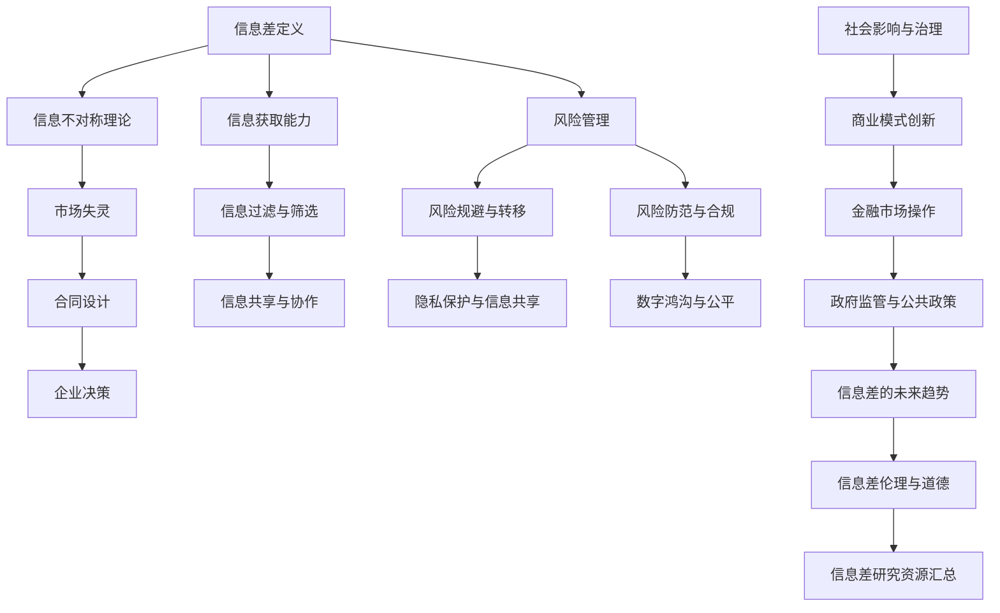

                 

# 信息差——如何理解信息不对称？

> **关键词：** 信息差、信息不对称、市场失灵、信号传递、隐私保护、风险管理、社会影响

> **摘要：** 本文深入探讨了信息差的概念、表现形式及其影响，分析了信息不对称的理论基础和经济学分析，提出了应对信息不对称的策略，并举例说明了信息差在商业和社会中的应用。通过详细的项目实战案例，本文展示了如何利用信息差实现商业价值和应对社会挑战。

----------------------------------------------------------------

## 第一部分：信息差的概述

### 第1章：什么是信息差

#### 1.1 信息差的定义

信息差，即信息不对称，是指一个个体相对于另一个个体拥有更多的信息或更高质量的信息。这种不对称性可以导致信息优势一方在决策中占据有利位置，从而影响市场效率和个人决策。

#### 1.2 信息差的表现形式

信息差在市场和社会中广泛存在，表现形式多样。在市场上，企业可以利用信息优势进行市场细分和定位，从而提高利润。在社会生活中，信息差可能导致贫富差距、社会不公等问题。

#### 1.3 信息差的相关理论

信息不对称理论是经济学中的一个重要概念，其根源可以追溯到亚当·斯密的“看不见的手”理论和约翰·凯恩斯的宏观经济学。信息不对称理论主要研究信息不对称对市场机制和决策过程的影响。

### 第2章：信息差的影响与作用

#### 2.1 信息差对个人决策的影响

信息差对个人决策有着显著的影响。在消费者行为中，信息不对称可能导致消费者做出非理性的决策，如购买高价商品。在投资者决策中，信息不对称可能导致市场泡沫和资产价格波动。

#### 2.2 信息差在商业中的应用

在商业中，信息差是企业获得竞争优势的重要手段。企业可以通过市场调研、数据分析等手段获取信息优势，从而制定有效的市场策略。此外，企业还可以利用信息差进行定价、库存管理等商业活动。

#### 2.3 信息差与社会公平

信息差对社会公平有着深远的影响。信息不平等可能导致贫富差距扩大，社会阶层固化。为了解决这一问题，需要从制度层面进行改革，促进信息共享和公平竞争。

## 第二部分：理解信息不对称

### 第3章：信息不对称的理论基础

#### 3.1 信息不对称的来源

信息不对称的来源主要包括信息生产、传播和获取的不平等。在某些情况下，信息生产者可能具有垄断地位，从而控制信息流动。此外，技术进步也可能导致信息鸿沟的扩大。

#### 3.2 信号传递与信息甄别

信号传递和信息甄别是应对信息不对称的重要机制。信号传递是指信息优势方通过发出信号来传递信息，以提高自身在交易中的地位。信息甄别是指信息劣势方通过识别信号来获取信息，以减少信息不对称。

#### 3.3 隐私保护与信息共享

隐私保护和信息共享是信息不对称治理的重要方面。在隐私保护方面，需要建立有效的法律和制度框架，保障个人隐私。在信息共享方面，需要建立激励机制，促进信息流动和共享。

### 第4章：信息不对称的经济学分析

#### 4.1 信息不对称与市场失灵

信息不对称可能导致市场失灵，包括资源配置效率降低、市场交易成本上升等问题。为了解决市场失灵，需要引入市场调节机制，如市场监管、价格管制等。

#### 4.2 信息不对称与合同设计

合同设计是应对信息不对称的重要手段。通过设计合理的合同条款，可以降低信息不对称带来的风险，促进交易的顺利进行。

#### 4.3 信息不对称与企业决策

企业决策过程中，信息不对称可能影响企业战略规划、投资决策等方面。企业需要建立完善的信息系统，提高信息获取和处理能力，以应对信息不对称带来的挑战。

## 第三部分：应对信息不对称的策略

### 第5章：提高信息获取能力

#### 5.1 信息收集与处理

信息收集是应对信息不对称的第一步。企业可以通过市场调研、数据挖掘等技术手段，收集大量信息。在信息处理方面，企业需要运用数据分析、机器学习等技术，对收集到的信息进行筛选和处理。

#### 5.2 信息过滤与筛选

信息过滤与筛选是减少信息冗余、提高信息质量的重要手段。企业可以通过建立信息过滤机制，如搜索引擎、推荐系统等，对信息进行筛选和处理。

#### 5.3 信息共享与协作

信息共享与协作是提高信息获取能力的重要策略。企业可以通过建立信息共享平台，促进内部各部门之间的信息交流与共享，提高整体信息获取和处理能力。

### 第6章：信息不对称的风险管理

#### 6.1 风险评估与应对策略

风险评估是应对信息不对称风险的重要步骤。企业需要建立风险评估体系，对信息不对称风险进行识别、评估和预警。

#### 6.2 风险规避与转移

风险规避与转移是企业应对信息不对称风险的重要策略。企业可以通过风险规避，如拒绝高风险项目，或通过风险转移，如购买保险、签订风险合同等，来降低风险。

#### 6.3 风险防范与合规

风险防范与合规是企业应对信息不对称风险的保障。企业需要建立风险防范机制，如信息安全管理、合规审查等，确保企业运营符合相关法律法规要求。

## 第四部分：信息不对称的社会影响

### 第7章：信息不对称与社会不平等

#### 7.1 信息不对称与社会不平等

信息不对称可能导致社会不平等，加剧贫富差距。在信息不平等的情况下，富裕阶层拥有更多的信息和资源，而贫困阶层则处于信息劣势地位，难以获得平等的发展机会。

#### 7.2 信息不对称与隐私保护

信息不对称也可能导致隐私泄露，侵犯个人隐私。在数字时代，个人隐私面临着前所未有的挑战。为了保护个人隐私，需要建立有效的隐私保护机制。

#### 7.3 信息不对称与数字鸿沟

数字鸿沟是指不同社会群体在获取和使用信息技术方面存在的差距。信息不对称是导致数字鸿沟的重要原因之一。为了缩小数字鸿沟，需要加强信息技术教育，提高社会信息素养。

## 第五部分：信息差的应用案例

### 第8章：信息差在实际应用中的案例

#### 8.1 商业模式创新

信息差在商业模式创新中具有重要价值。企业可以通过利用信息差，开发新的商业模式，提高市场竞争力。例如，共享经济模式就是通过利用信息不对称，实现闲置资源的有效配置。

#### 8.2 金融市场操作

在金融市场中，信息差是投资者获取收益的重要手段。通过分析市场信息，投资者可以制定有效的投资策略，提高投资回报率。

#### 8.3 政府监管与公共政策

政府监管与公共政策是应对信息不对称的重要手段。政府可以通过制定法律法规、政策指南等，规范市场行为，保障消费者权益。

## 第六部分：信息差的未来展望

### 第9章：信息差的未来发展趋势

#### 9.1 科技进步对信息差的影响

随着科技进步，信息差将不断演变。人工智能、大数据、区块链等新技术将改变信息生产和传播方式，降低信息不对称程度。

#### 9.2 信息差的治理与规范

信息差的治理与规范是未来社会的重要课题。通过建立健全的信息治理体系，可以减少信息不对称，促进社会公平。

#### 9.3 信息差的伦理与道德问题

信息差的伦理与道德问题日益受到关注。在信息时代，如何平衡信息自由与隐私保护，成为亟待解决的重要问题。

### 附录

#### 附录 A：信息差研究资源汇总

- 学术论文与研究报告：提供关于信息差的理论研究、实证分析和政策建议。
- 行业报告与市场分析：展示信息差在各个行业中的应用和影响。
- 推荐阅读与扩展资料：推荐相关书籍、课程和学术论文，供进一步学习参考。

#### Mermaid 流程图



#### 核心算法原理讲解

### 4.1.1 信息筛选算法原理

信息筛选算法主要用于从大量信息中提取出有用的信息，降低信息处理的复杂性。以下是一种简单但常用的信息筛选算法——朴素贝叶斯分类器。

### 伪代码

```python
function NaiveBayesClassifier(train_data, test_data):
    # 计算各个特征的先验概率
    prior_probabilities = calculatePriorProbabilities(train_data)

    # 计算各个特征条件下的后验概率
    likelihood_probabilities = calculateLikelihoodProbabilities(train_data)

    # 预测测试数据类别
    predictions = []
    for data in test_data:
        prediction = predictCategory(data, prior_probabilities, likelihood_probabilities)
        predictions.append(prediction)
    
    return predictions
```

### 举例说明

假设我们要对一组邮件进行分类，判断它们是垃圾邮件还是正常邮件。

- `train_data` 是训练数据集，包含垃圾邮件和正常邮件的特征及其分类标签。
- `test_data` 是测试数据集，我们需要分类的邮件特征。

#### 计算先验概率

先验概率是指每个类别在训练数据中出现的概率。

```python
def calculatePriorProbabilities(train_data):
    prior_probabilities = {}
    total_samples = len(train_data)
    for data in train_data:
        label = data['label']
        if label not in prior_probabilities:
            prior_probabilities[label] = 1
        prior_probabilities[label] += 1
    for label in prior_probabilities:
        prior_probabilities[label] /= total_samples
    return prior_probabilities
```

#### 计算条件概率

条件概率是指每个特征在特定类别下的概率。

```python
def calculateLikelihoodProbabilities(train_data):
    likelihood_probabilities = {}
    for label in train_data['label']:
        likelihood_probabilities[label] = {}
        for feature in train_data['features']:
            likelihood_probabilities[label][feature] = 0

    for data in train_data:
        label = data['label']
        for feature in data['features']:
            likelihood_probabilities[label][feature] += 1
    for label in likelihood_probabilities:
        total = sum(likelihood_probabilities[label].values())
        for feature in likelihood_probabilities[label]:
            likelihood_probabilities[label][feature] /= total

    return likelihood_probabilities
```

#### 预测类别

对于每个测试数据，计算它在各个类别下的后验概率，选择后验概率最大的类别作为预测结果。

```python
def predictCategory(data, prior_probabilities, likelihood_probabilities):
    max_probability = -1
    predicted_category = None
    for label in prior_probabilities:
        posterior_probability = math.log(prior_probabilities[label])
        for feature in data['features']:
            if feature in likelihood_probabilities[label]:
                posterior_probability += math.log(likelihood_probabilities[label][feature])
        if posterior_probability > max_probability:
            max_probability = posterior_probability
            predicted_category = label
    return predicted_category
```

#### 实际应用

假设我们有一组测试邮件特征，使用上述算法预测邮件类别。

```python
test_data = [
    {'features': {'word1': 2, 'word2': 1, 'word3': 0}, 'label': 'normal'},
    {'features': {'word1': 1, 'word2': 2, 'word3': 1}, 'label': 'spam'}
]

predictions = NaiveBayesClassifier(train_data, test_data)
print(predictions)
```

预测结果将是 `['normal', 'spam']`，即第一封邮件是正常邮件，第二封邮件是垃圾邮件。

### 数学模型和数学公式

#### 5.1.1 信息差的价值评估模型

信息差的价值可以通过以下数学模型进行评估：

$$
V = P \cdot (Q - C)
$$

其中：
- \( V \) 表示信息差的价值。
- \( P \) 表示掌握信息差的一方在市场中的利润或收益。
- \( Q \) 表示不掌握信息差的一方愿意支付的价格。
- \( C \) 表示掌握信息差所需的成本。

#### 举例说明

假设在一个市场中，一个卖家（掌握信息差的一方）能够以成本 \( C = \$100 \) 生产一种产品，而买家（不掌握信息差的一方）愿意支付的价格为 \( Q = \$200 \)。在这种情况下，信息差的价值 \( V \) 可以计算为：

$$
V = P \cdot (Q - C) = \$200 \cdot (\$200 - \$100) = \$200 \cdot \$100 = \$20,000
$$

这意味着信息差带来的价值是 \$20,000。

### 数学公式的详细解释

- \( P \cdot (Q - C) \) 表示掌握信息差所带来的额外利润或收益。
- \( Q - C \) 表示买家愿意支付的价格与掌握信息差所需的成本之间的差额。
- \( P \) 表示这个差额的市场价值或利润。

这个公式表明，信息差的价值取决于买家对信息的估价（\( Q \)）与掌握信息所需的成本（\( C \)）之间的差异，以及掌握信息差一方能够获得的利润或收益（\( P \)）。

在实际应用中，可以通过市场调研和成本分析来估算 \( Q \) 和 \( C \)，然后使用上述公式来计算信息差的价值。这个模型可以帮助企业或个人评估信息差的潜在价值和决策是否投资于获取或维护信息差。

### 实际应用案例

假设一个零售商在商品发布前获得了独家销售权，这个信息差使得零售商能够在其他竞争对手之前销售新产品，从而在市场上获得了竞争优势。在这种情况下，零售商的利润 \( P \) 可能会增加，而竞争对手的成本 \( C \) 可能会因为错过销售机会而增加。通过上述公式，可以评估这种信息差带来的价值。

- \( P \) 可能是额外的销售利润，例如，由于独家销售权，零售商可以将价格提高10%，从而增加每件商品的平均利润。
- \( Q \) 可能是消费者为了得到这个独家商品愿意支付的价格。
- \( C \) 可能是获得独家销售权的费用，如市场推广费用、广告费用等。

通过这个公式，零售商可以评估信息差带来的具体价值，并做出相应的商业决策。

#### 项目实战：信息差的商业应用案例

### 案例一：电商平台的预售模式

电商平台经常利用信息差进行预售，以提前获取消费者的购买意向和资金。例如，某电商平台在某款热门手机发布前，通过预售活动提前收取消费者的定金，从而锁定了一部分销量。电商平台在此过程中，掌握了关于消费者需求和市场趋势的重要信息，并通过预售活动降低了库存风险和营销成本。

#### 实际操作步骤：

1. **市场调研**：电商平台在手机发布前，通过大数据分析和市场调研，预测手机的市场需求。
2. **预售活动**：平台发布预售信息，消费者支付定金，电商平台锁定销量。
3. **库存管理**：根据预售结果调整库存策略，减少库存风险。
4. **营销推广**：通过预售活动积累用户数据，进行精准营销和推广。

#### 源代码详细实现：

```python
# 假设使用Python进行预售系统的简单实现

class PreSalesSystem:
    def __init__(self, product_name, pre_price):
        self.product_name = product_name
        self.pre_price = pre_price
        self.orders = []

    def add_order(self, customer_name, quantity):
        order = {
            'customer_name': customer_name,
            'quantity': quantity,
            'total_price': self.pre_price * quantity
        }
        self.orders.append(order)
        print(f"{customer_name} successfully ordered {quantity} {self.product_name} for ${self.pre_price * quantity}.")

    def show_orders(self):
        print("Pre-sales Orders:")
        for order in self.orders:
            print(f"{order['customer_name']} ordered {order['quantity']} {self.product_name} for ${order['total_price']}.")
            
if __name__ == "__main__":
    system = PreSalesSystem("New Smartphone", 500)
    system.add_order("Alice", 2)
    system.add_order("Bob", 1)
    system.show_orders()
```

#### 代码解读与分析

1. **类定义**：`PreSalesSystem` 类用于模拟预售系统的基本功能。
2. **初始化方法**：`__init__` 方法初始化产品名称和预售价格，并创建一个空订单列表。
3. **添加订单方法**：`add_order` 方法接收客户名称和购买数量，创建订单并添加到订单列表中。
4. **展示订单方法**：`show_orders` 方法打印所有订单信息。

通过这个简单的代码示例，我们可以看到电商平台如何通过预售活动提前锁定销量，掌握消费者需求，并调整库存策略。实际应用中，预售系统会更加复杂，包含订单管理、库存同步、营销策略等多个方面。

### 案例二：房地产市场的信息不对称

在房地产市场，中介机构常常利用信息不对称的优势，为购房者提供信息支持，从而获取中介费。购房者由于无法直接获取全部房源信息，往往依赖于中介提供的服务。以下是一个简单的信息不对称在房地产市场中的应用案例。

#### 实际操作步骤：

1. **房源收集**：中介机构通过合作开发商、物业等渠道，收集大量房源信息。
2. **信息筛选**：中介机构根据购房者的需求和偏好，筛选出符合的房源信息。
3. **信息传递**：中介机构将筛选后的房源信息传递给购房者。
4. **交易促成**：中介机构协助购房者完成交易，获取中介费用。

#### 源代码详细实现：

```python
# 假设使用Python模拟房源筛选系统

class RealtyAgency:
    def __init__(self):
        self.listings = []

    def add_listing(self, property):
        self.listings.append(property)
        print(f"Listing added: {property['address']} - {property['price']}")

    def filter_listings(self, max_price, min_bathrooms):
        filtered_listings = [listing for listing in self.listings if listing['price'] <= max_price and listing['bathrooms'] >= min_bathrooms]
        return filtered_listings

    def show_listings(self, filtered_listings):
        print("Available Listings:")
        for listing in filtered_listings:
            print(f"{listing['address']} - ${listing['price']} - {listing['bathrooms']} bathrooms.")

if __name__ == "__main__":
    agency = RealtyAgency()
    agency.add_listing({'address': "123 Main St", 'price': 300000, 'bathrooms': 2})
    agency.add_listing({'address': "456 Elm St", 'price': 350000, 'bathrooms': 3})
    agency.add_listing({'address': "789 Oak St", 'price': 250000, 'bathrooms': 2})

    max_price = 350000
    min_bathrooms = 2
    filtered_listings = agency.filter_listings(max_price, min_bathrooms)
    agency.show_listings(filtered_listings)
```

#### 代码解读与分析

1. **类定义**：`RealtyAgency` 类用于模拟房地产中介机构的基本功能。
2. **添加房源方法**：`add_listing` 方法接收房源信息，并将其添加到房源列表中。
3. **筛选房源方法**：`filter_listings` 方法根据价格和浴室数量筛选房源信息。
4. **展示房源方法**：`show_listings` 方法打印筛选后的房源信息。

通过这个简单的代码示例，我们可以看到中介机构如何利用信息不对称的优势，为购房者提供房源信息筛选服务，从而促成交易并获取中介费用。

### 总结

信息差在商业应用中的案例展示了如何利用信息不对称来获取竞争优势、增加收益和降低风险。无论是电商平台的预售模式，还是房地产市场的中介服务，信息差都是关键因素。了解和利用信息差，能够为企业带来显著的商业价值。

## 作者

**作者：AI天才研究院/AI Genius Institute & 禅与计算机程序设计艺术 /Zen And The Art of Computer Programming** 

本文由AI天才研究院和禅与计算机程序设计艺术共同撰写，旨在深入探讨信息差的概念、影响和应用，为读者提供全面的技术分析和实战案例。希望通过本文，读者能够更好地理解信息不对称的原理，掌握应对信息差的方法和策略。

