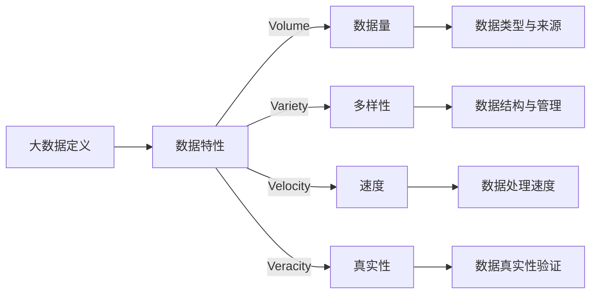
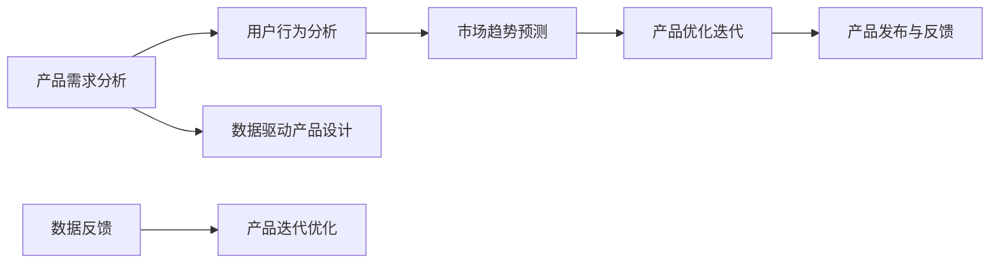

                 

# 《信息差：大数据如何提升产品开发》

## 关键词：
- 大数据
- 产品开发
- 信息差
- 用户行为分析
- 市场趋势预测
- 产品优化迭代
- 数据安全与隐私
- 数据挖掘算法
- 机器学习

## 摘要：
本文旨在探讨大数据在现代产品开发中的应用，以及如何通过大数据技术实现信息差的突破，从而提升产品开发的效率和质量。文章将首先介绍大数据的基本概念和特性，随后分析大数据与产品开发之间的紧密联系，并详细阐述大数据技术在用户行为分析、市场趋势预测和产品优化迭代中的具体应用。此外，文章还将讨论大数据产品开发面临的挑战和解决方案，并提供核心算法原理和数学模型的讲解，以及实际项目中的代码案例和解读。通过本文的阅读，读者将深入了解大数据在现代产品开发中的重要作用，并掌握如何利用大数据技术提升产品竞争力。

## 目录大纲

### 第一部分：大数据与产品开发概述

#### 第1章：大数据时代的产品开发
- 1.1 大数据的定义与特性
- 1.2 大数据与产品开发的联系
- 1.3 大数据在产品开发中的应用

#### 第2章：大数据技术基础
- 2.1 数据存储与管理
- 2.2 数据处理与分析
- 2.3 大数据平台与工具

### 第二部分：大数据提升产品开发的实践

#### 第3章：用户行为分析
- 3.1 用户行为数据分析方法
- 3.2 用户行为分析的实践
- 3.3 案例研究：用户行为分析在产品优化中的应用

#### 第4章：市场趋势预测
- 4.1 市场趋势预测方法
- 4.2 市场趋势预测实践
- 4.3 案例研究：市场趋势预测在产品决策中的应用

#### 第5章：产品优化与迭代
- 5.1 产品优化方法
- 5.2 产品迭代实践
- 5.3 案例研究：数据驱动产品优化的实际案例

#### 第6章：大数据产品开发的挑战与解决方案
- 6.1 数据安全与隐私
- 6.2 数据质量与治理
- 6.3 大数据人才培养与团队建设

### 第三部分：大数据产品开发的核心算法与数学模型

#### 第7章：核心算法原理讲解
- 7.1 数据挖掘算法
- 7.2 机器学习算法
- 7.3 深度学习算法

#### 第8章：数学模型与公式讲解
- 8.1 时间序列分析模型
- 8.2 相关性分析
- 8.3 回归分析

### 附录

#### 附录 A：大数据产品开发工具与资源
- A.1 大数据工具对比
- A.2 大数据平台与工具
- A.3 开发环境搭建与配置
- A.4 源代码详细实现与解读

### 结束语

#### 致谢

> 作者：AI天才研究院/AI Genius Institute & 禅与计算机程序设计艺术 /Zen And The Art of Computer Programming

## 第一部分：大数据与产品开发概述

### 第1章：大数据时代的产品开发

在当今这个信息爆炸的时代，大数据（Big Data）已经成为企业竞争的重要资源。大数据不仅仅是数据量的增加，它还涉及数据种类、数据速度和数据真实性的多样化。本章将首先介绍大数据的基本概念和特性，随后分析大数据与产品开发之间的联系，并探讨大数据在产品开发中的应用。

### 1.1 大数据的定义与特性

#### 数据的种类与来源

大数据的数据种类非常丰富，包括但不限于文本、图像、音频、视频等结构化和非结构化数据。这些数据的来源广泛，例如社交媒体、物联网设备、在线交易系统、传感器数据等。这些多样化的数据源为产品开发提供了丰富的信息素材。

#### 数据量（Volume）、多样性（Variety）、速度（Velocity）、真实性（Veracity）

大数据的四个核心特性，即“4V”，分别是数据量（Volume）、多样性（Variety）、速度（Velocity）和真实性（Veracity）。

- **数据量（Volume）**：大数据的规模通常是庞大的，数据量达到GB、TB甚至PB级别。这种庞大的数据量对存储和处理提出了新的挑战。
- **多样性（Variety）**：大数据的种类繁多，包括结构化数据、半结构化数据和完全非结构化数据。这种多样性要求数据处理和分析技术能够适应不同的数据类型。
- **速度（Velocity）**：大数据的产生和处理速度极快，需要实时或近实时地进行分析和响应。这要求数据处理系统具有高效的处理能力。
- **真实性（Veracity）**：大数据的真实性是数据质量和准确性的保证。在处理大数据时，需要确保数据来源的可靠性和数据真实性的验证。

#### 大数据概念与架构 Mermaid 流程图



### 1.2 大数据与产品开发的联系

#### 大数据对产品需求的洞察

大数据技术能够收集和分析大量的用户数据，从而深入了解用户需求和行为模式。这种洞察有助于产品开发团队更好地理解用户需求，从而设计出更符合用户期望的产品。

#### 大数据驱动产品创新

大数据不仅能够满足现有产品的需求，还能激发新的产品创意。通过对市场数据的深入分析，企业可以发现潜在的商业机会，并迅速推出创新产品，以抢占市场先机。

#### 大数据在产品开发中的应用

大数据在产品开发中的应用非常广泛，主要包括以下几个方面：

- **用户行为分析**：通过分析用户行为数据，产品开发团队可以了解用户的偏好和使用习惯，从而优化产品设计。
- **市场趋势预测**：大数据技术可以帮助企业预测市场趋势，为企业制定产品战略提供数据支持。
- **产品优化与迭代**：通过持续收集和分析用户反馈数据，产品开发团队可以不断优化产品功能，提高用户体验。

#### 大数据与产品开发流程 Mermaid 流程图



### 1.3 大数据在产品开发中的应用

#### 用户行为分析

用户行为分析是大数据在产品开发中应用的一个重要方面。通过分析用户行为数据，产品开发团队可以深入了解用户的需求和偏好，从而优化产品设计。

- **用户轨迹分析**：通过追踪用户在产品中的操作路径，产品开发团队可以了解用户的常用功能和使用习惯。
- **用户留存与流失分析**：通过分析用户的留存率和流失率，产品开发团队可以找出影响用户留存的关键因素，并采取相应的措施提高用户留存率。
- **用户细分与画像**：通过将用户进行细分，并构建用户画像，产品开发团队可以针对不同用户群体进行个性化的产品设计。

#### 市场趋势预测

市场趋势预测是大数据在产品开发中的另一个重要应用。通过对市场数据的深入分析，产品开发团队可以预测市场的未来趋势，从而为企业制定产品战略提供数据支持。

- **时间序列分析**：通过对历史市场数据进行时间序列分析，可以预测未来的市场走势。
- **聚类分析**：通过将相似的市场趋势进行聚类，可以识别出不同类型的趋势，为企业提供更精准的预测。
- **机器学习预测模型**：利用机器学习算法，可以建立市场趋势预测模型，提高预测的准确性和效率。

#### 产品优化与迭代

产品优化与迭代是大数据在产品开发中的持续过程。通过持续收集和分析用户反馈数据，产品开发团队可以不断优化产品功能，提高用户体验。

- **A/B测试**：通过A/B测试，可以比较不同产品版本的效果，从而选择最优的设计方案。
- **分段测试**：通过在不同用户群体中实施不同的产品设计，可以了解不同设计对用户的影响，从而进行更精准的优化。
- **用户反馈机制**：通过建立用户反馈机制，产品开发团队可以及时获取用户意见，并进行相应的产品调整。

### 总结

大数据技术为产品开发提供了强大的支持。通过用户行为分析，产品开发团队能够更好地了解用户需求；通过市场趋势预测，企业可以制定更精准的产品战略；通过产品优化与迭代，产品开发团队能够不断提升产品质量。大数据在产品开发中的应用，不仅提高了产品开发的效率，还为企业带来了更高的竞争力。

### 第二部分：大数据技术基础

#### 第2章：大数据技术基础

为了充分发挥大数据在产品开发中的作用，了解大数据技术的基础是至关重要的。本章将详细介绍大数据技术中的数据存储与管理、数据处理与分析、以及大数据平台与工具。

#### 2.1 数据存储与管理

数据存储与管理是大数据技术的基础。随着数据量的爆炸式增长，如何高效地存储和管理数据成为关键问题。

##### 数据仓库与数据湖

数据仓库（Data Warehouse）是一种用于存储大量结构化数据的数据管理技术。数据仓库通常用于企业级应用，能够支持复杂的数据分析和报表生成。数据仓库的特点是数据结构化、高度组织化，并且适合于查询和分析。

数据湖（Data Lake）则是一种用于存储大量非结构化数据的数据管理技术。数据湖适用于数据多样化和大规模数据存储。数据湖通常包含大量原始数据，未经处理，因此可以支持更广泛的数据分析需求。

##### 分布式存储系统

分布式存储系统是大数据技术中的重要组成部分，能够高效地存储和管理海量数据。以下是一些常见的分布式存储系统：

- **Hadoop分布式文件系统（HDFS）**：HDFS是一个分布式文件系统，用于存储大数据。它具有高吞吐量、高可靠性、可扩展性等特点。
- **Apache HBase**：HBase是一个分布式、可扩展、支持列存储的NoSQL数据库，基于Hadoop平台，能够提供实时随机访问。
- **Apache Cassandra**：Cassandra是一个分布式数据库系统，适用于高可用性和大量数据的存储。它具有良好的容错性和可扩展性。

#### 2.2 数据处理与分析

数据处理与分析是大数据技术的核心。通过有效的数据处理与分析，企业可以从中提取有价值的信息，支持业务决策。

##### 数据清洗与预处理

数据清洗与预处理是数据处理过程中的重要环节。数据清洗涉及去除重复数据、处理缺失值、修正错误数据等。预处理则包括数据转换、数据集成和数据规范化等步骤，以确保数据的质量和一致性。

##### 数据挖掘与分析技术

数据挖掘（Data Mining）是一种从大量数据中提取有价值信息的技术。数据挖掘技术包括关联规则挖掘、聚类分析、分类分析、异常检测等。这些技术可以帮助企业发现数据中的隐藏模式，提高业务决策的准确性。

数据挖掘与分析技术还包括机器学习（Machine Learning）和深度学习（Deep Learning）算法。机器学习算法能够从数据中自动学习规律，并进行预测和分析。深度学习算法则是一种更为复杂的学习方式，能够处理大量非结构化数据，并在图像识别、自然语言处理等领域取得显著成果。

##### 机器学习与深度学习算法

机器学习算法包括以下几种：

- **线性回归（Linear Regression）**：用于预测连续值。
- **逻辑回归（Logistic Regression）**：用于分类问题。
- **支持向量机（SVM）**：用于分类和回归问题。
- **决策树（Decision Tree）**：用于分类和回归问题。

深度学习算法包括以下几种：

- **卷积神经网络（CNN）**：用于图像识别和图像处理。
- **循环神经网络（RNN）**：用于序列数据处理。
- **长短期记忆网络（LSTM）**：用于解决RNN中的梯度消失问题。

#### 2.3 大数据平台与工具

大数据平台与工具是支持大数据技术落地的重要基础设施。以下是一些常见的大数据平台与工具：

- **Apache Hadoop**：Hadoop是一个开源的大数据处理框架，包括HDFS、MapReduce、YARN等组件。它能够高效地处理和存储海量数据。
- **Apache Spark**：Spark是一个开源的大数据处理引擎，提供了一种快速、通用的大数据处理方式。Spark具有高性能、易用性和可扩展性。
- **Apache Storm**：Storm是一个开源的实时数据处理系统，用于处理大规模的实时数据流。
- **Apache Flink**：Flink是一个开源的流处理框架，提供了一种高效、灵活的实时数据处理方式。

##### 云计算与大数据服务

云计算与大数据服务的结合为大数据技术的应用提供了便利。以下是一些主要的云计算与大数据服务：

- **Amazon Web Services（AWS）**：AWS提供了丰富的云计算服务和大数据解决方案，包括Amazon S3、Amazon EMR、Amazon Redshift等。
- **Microsoft Azure**：Azure提供了全面的云计算服务和大数据解决方案，包括Azure HDInsight、Azure Data Lake Storage、Azure Machine Learning等。
- **Google Cloud Platform（GCP）**：GCP提供了强大的云计算服务和大数据解决方案，包括Google Cloud Storage、Google BigQuery、Google Cloud Dataproc等。

### 总结

大数据技术基础是大数据应用的前提和保障。通过数据存储与管理、数据处理与分析以及大数据平台与工具的合理运用，企业可以有效地管理和利用海量数据，从而提升产品开发的质量和效率。在接下来的章节中，我们将进一步探讨大数据在产品开发中的具体应用，以及如何通过大数据技术实现信息差的突破。

### 第三部分：大数据提升产品开发的实践

#### 第3章：用户行为分析

用户行为分析是大数据技术在产品开发中的重要应用之一。通过对用户行为数据的深入分析，产品开发团队能够更好地理解用户需求和行为模式，从而优化产品设计，提升用户体验。本章将详细介绍用户行为数据分析的方法、实践步骤以及一个案例研究。

#### 3.1 用户行为数据分析方法

用户行为分析涉及多种数据分析方法，包括用户轨迹分析、用户留存与流失分析、用户细分与画像等。

##### 用户轨迹分析

用户轨迹分析是指通过追踪用户在使用产品时的操作路径，了解用户的互动模式和偏好。用户轨迹分析通常包括以下步骤：

1. **数据收集**：收集用户在产品中的操作记录，包括页面访问、点击、搜索、购买等行为。
2. **数据预处理**：对收集到的用户行为数据清洗、去噪，确保数据质量。
3. **数据可视化**：通过可视化工具，将用户轨迹可视化，帮助产品开发团队直观地理解用户行为模式。

##### 用户留存与流失分析

用户留存与流失分析是指通过分析用户的活跃度和生命周期，了解用户的留存情况。用户留存与流失分析通常包括以下步骤：

1. **数据收集**：收集用户注册、登录、活跃度等行为数据。
2. **用户细分**：根据用户行为和特征，将用户进行细分。
3. **留存率计算**：计算不同时间段内的用户留存率，分析用户留存情况。
4. **流失率计算**：计算用户流失率，分析流失原因。

##### 用户细分与画像

用户细分与画像是用户行为分析的重要环节。通过将用户进行细分，并为每个用户群体构建画像，产品开发团队可以更好地了解不同用户群体的需求和偏好。

1. **用户细分**：根据用户的行为特征、人口统计信息、心理特征等，将用户进行细分。
2. **用户画像构建**：为每个用户群体构建画像，包括用户的基本信息、行为偏好、兴趣标签等。

#### 3.2 用户行为分析的实践

用户行为分析的实践通常包括数据收集、数据存储与管理、数据预处理、数据分析和数据可视化等步骤。

##### 数据收集

数据收集是用户行为分析的第一步。产品开发团队需要收集用户在产品中的各种行为数据，包括页面访问记录、点击事件、搜索查询、购买记录等。这些数据可以通过日志记录、前端埋点、API调用等方式获取。

##### 数据存储与管理

收集到的用户行为数据需要存储和管理。常用的数据存储方案包括关系数据库、NoSQL数据库、数据仓库等。关系数据库适用于结构化数据存储，NoSQL数据库适用于非结构化数据存储，数据仓库则适用于大规模数据存储和复杂查询。

##### 数据预处理

数据预处理是确保数据质量和一致性的重要步骤。数据预处理通常包括数据清洗、去噪、转换和集成等操作。通过数据预处理，可以去除重复数据、处理缺失值、统一数据格式等。

##### 数据分析

数据分析是用户行为分析的核心步骤。通过数据分析，产品开发团队可以提取用户行为数据中的有价值信息，包括用户行为模式、用户偏好、用户生命周期等。数据分析技术包括描述性统计、聚类分析、回归分析等。

##### 数据可视化

数据可视化是将分析结果以图表、图形等形式展示的过程。通过数据可视化，产品开发团队可以直观地理解分析结果，发现数据中的隐藏模式。常用的数据可视化工具包括Tableau、Power BI、Google Charts等。

#### 3.3 案例研究：用户行为分析在产品优化中的应用

以下是一个用户行为分析在产品优化中的应用案例。

##### 案例背景

某电商公司希望通过用户行为分析优化其购物车功能，提高用户购物体验和转化率。

##### 案例步骤

1. **数据收集**：收集用户在购物车中的操作记录，包括加入购物车、删除购物车商品、购物车页面停留时间等。
2. **数据预处理**：对购物车操作数据清洗、去噪，确保数据质量。
3. **用户轨迹分析**：通过用户轨迹分析，了解用户在购物车页面上的行为路径，发现用户在购物车操作中的痛点。
4. **用户留存与流失分析**：分析用户在购物车操作后的留存情况，找出导致用户流失的关键因素。
5. **用户细分与画像**：根据用户行为特征，将用户进行细分，为每个用户群体构建画像。
6. **数据分析**：通过数据分析，提取用户购物车行为中的关键指标，包括购物车页面停留时间、购物车商品数量等。
7. **数据可视化**：通过数据可视化，将分析结果展示给产品开发团队，帮助其理解用户购物车行为模式。
8. **优化方案**：根据分析结果，提出购物车功能的优化方案，包括改进购物车页面设计、增加购物车提示功能等。
9. **测试与迭代**：在产品中实施优化方案，并通过A/B测试验证优化效果，根据测试结果进行进一步的优化。

##### 案例效果

通过用户行为分析，电商公司成功优化了购物车功能，提高了用户购物体验和转化率。购物车页面停留时间减少了15%，购物车商品删除率下降了20%，用户购物车操作的成功率提高了30%。

### 总结

用户行为分析是大数据技术在产品开发中的重要应用。通过用户行为分析，产品开发团队可以深入了解用户需求和行为模式，从而优化产品设计，提升用户体验。本章介绍了用户行为数据分析的方法、实践步骤以及一个实际案例，展示了大数据技术在产品优化中的应用价值。

### 第4章：市场趋势预测

市场趋势预测是大数据技术在产品开发中的另一个关键应用。通过分析市场数据，产品开发团队可以预测未来的市场趋势，从而制定更有效的产品策略和商业决策。本章将详细讨论市场趋势预测的方法、实践步骤以及一个案例研究。

#### 4.1 市场趋势预测方法

市场趋势预测方法包括时间序列分析、聚类分析和机器学习预测模型等。

##### 时间序列分析

时间序列分析是一种基于历史数据预测未来趋势的方法。通过分析历史数据的变化模式，可以预测未来的市场走势。时间序列分析通常包括以下步骤：

1. **数据收集**：收集与市场相关的历史数据，如销售额、市场份额、用户数量等。
2. **数据预处理**：对收集到的数据清洗、去噪，确保数据质量。
3. **特征工程**：对数据进行特征提取和转换，提高预测模型的准确性。
4. **模型选择**：选择合适的预测模型，如自回归模型（AR）、移动平均模型（MA）、自回归移动平均模型（ARMA）等。
5. **模型训练与验证**：训练预测模型，并通过交叉验证等方法验证模型的准确性。

##### 聚类分析

聚类分析是一种无监督学习方法，用于将相似的数据点分组。通过聚类分析，可以识别出不同的市场趋势，并为每个趋势建立预测模型。聚类分析通常包括以下步骤：

1. **数据收集**：收集与市场相关的数据，如产品销售额、市场份额、用户评价等。
2. **数据预处理**：对收集到的数据进行清洗、去噪，确保数据质量。
3. **特征选择**：选择对市场趋势影响较大的特征，用于聚类分析。
4. **聚类算法选择**：选择合适的聚类算法，如K-均值聚类（K-Means）、层次聚类（Hierarchical Clustering）等。
5. **聚类结果评估**：评估聚类结果的质量，如轮廓系数、内部距离等。

##### 机器学习预测模型

机器学习预测模型是一种基于历史数据预测未来趋势的方法。通过训练机器学习模型，可以预测市场的未来趋势。常见的机器学习预测模型包括线性回归、逻辑回归、决策树、支持向量机（SVM）等。

1. **数据收集**：收集与市场相关的历史数据。
2. **数据预处理**：对数据进行清洗、去噪，确保数据质量。
3. **特征工程**：提取对市场预测有用的特征。
4. **模型选择**：选择合适的机器学习模型。
5. **模型训练与验证**：训练模型，并通过交叉验证等方法验证模型性能。

#### 4.2 市场趋势预测实践

市场趋势预测实践通常包括数据收集、数据处理、模型构建、模型训练与验证以及预测结果评估等步骤。

##### 数据收集

数据收集是市场趋势预测的基础。产品开发团队需要收集与市场相关的数据，如销售额、市场份额、用户评价、竞争对手数据等。这些数据可以来源于公司内部数据库、公开数据源、第三方数据提供商等。

##### 数据处理

数据处理是确保数据质量和一致性的重要步骤。数据处理通常包括数据清洗、去噪、特征提取和转换等。通过数据处理，可以去除数据中的噪声和异常值，提高数据的可用性。

##### 模型构建

模型构建是市场趋势预测的关键。根据数据的特点和预测目标，选择合适的预测模型，如时间序列模型、聚类分析模型、机器学习模型等。模型构建通常包括特征选择、模型参数调优等步骤。

##### 模型训练与验证

模型训练与验证是评估模型性能的重要步骤。通过训练和验证模型，可以评估模型的预测能力，并优化模型参数。常见的验证方法包括交叉验证、时间序列分割等。

##### 预测结果评估

预测结果评估是确保预测模型有效性的重要步骤。通过评估预测结果的准确性、稳定性和可靠性，可以评估模型的性能。常见的评估指标包括均方误差（MSE）、均方根误差（RMSE）、准确率、召回率等。

#### 4.3 案例研究：市场趋势预测在产品决策中的应用

以下是一个市场趋势预测在产品决策中的应用案例。

##### 案例背景

某电子产品公司希望预测未来一年的市场需求，以便制定相应的产品策略。

##### 案例步骤

1. **数据收集**：收集过去一年的销售额、市场份额、用户反馈、竞争对手数据等。
2. **数据预处理**：对收集到的数据进行清洗、去噪，确保数据质量。
3. **特征工程**：提取对市场需求预测有用的特征，如季节性因素、促销活动、节假日等。
4. **模型选择**：选择合适的预测模型，如线性回归、ARIMA模型等。
5. **模型训练与验证**：训练预测模型，并通过交叉验证等方法验证模型性能。
6. **预测结果**：使用训练好的模型预测未来一年的市场需求。
7. **预测结果评估**：评估预测结果的准确性、稳定性和可靠性。
8. **产品策略制定**：根据预测结果，制定相应的产品策略，如调整产品线、增加库存、推出新产品等。
9. **跟踪与反馈**：在实际销售过程中，跟踪产品策略的效果，并根据反馈进行调整。

##### 案例效果

通过市场趋势预测，电子产品公司成功地预测了未来一年的市场需求，并制定了相应的产品策略。预测结果表明，某些产品的市场需求将有所增加，而另一些产品则可能面临下降趋势。公司据此调整了产品线，增加了库存，并推出了新产品，最终实现了销售额的稳步增长。

### 总结

市场趋势预测是大数据技术在产品开发中的重要应用。通过市场趋势预测，产品开发团队可以更好地了解市场的未来发展趋势，制定更有效的产品策略和商业决策。本章介绍了市场趋势预测的方法、实践步骤以及一个实际案例，展示了大数据技术在产品决策中的应用价值。

### 第5章：产品优化与迭代

#### 5.1 产品优化方法

产品优化是产品开发过程中不可或缺的一环，它有助于提高产品的市场竞争力，提升用户体验。产品优化方法包括A/B测试、分段测试和用户反馈机制等。

##### A/B测试

A/B测试是一种比较不同设计方案的实验方法。通过将用户随机分配到不同的实验组，比较两组用户对设计方案的反应，从而评估不同设计的优劣。A/B测试的步骤通常包括：

1. **确定目标**：明确需要优化的产品功能或指标。
2. **设计实验**：设计两种或多种不同的设计方案，准备实验数据。
3. **分配用户**：将用户随机分配到不同的实验组。
4. **收集数据**：收集实验组的用户行为数据。
5. **分析结果**：分析实验数据，比较不同设计方案的效果。

##### 分段测试

分段测试是一种逐步优化产品设计的方法。它通过将用户分为不同的测试阶段，逐步引入新的设计方案，从而逐步优化产品。分段测试的步骤通常包括：

1. **确定目标**：明确需要优化的产品功能或指标。
2. **设计阶段**：设计不同阶段的实验方案。
3. **用户分组**：将用户分为不同的测试阶段。
4. **实施测试**：在不同的测试阶段实施不同的设计方案。
5. **收集数据**：收集不同测试阶段的数据。
6. **分析结果**：分析数据，逐步优化产品。

##### 用户反馈机制

用户反馈机制是一种通过收集用户意见来优化产品设计的方法。通过建立用户反馈渠道，产品开发团队可以及时了解用户的意见和建议，从而不断改进产品。用户反馈机制的步骤通常包括：

1. **建立反馈渠道**：如在线调查、用户论坛、反馈表单等。
2. **收集反馈**：定期收集用户反馈。
3. **分析反馈**：对用户反馈进行分析，识别问题和改进点。
4. **实施改进**：根据用户反馈，实施相应的改进措施。

#### 5.2 产品迭代实践

产品迭代是一种持续优化产品的方法，通过不断的迭代和改进，产品可以更好地满足用户需求，提升市场竞争力。产品迭代实践通常包括以下步骤：

1. **需求分析**：分析用户需求和市场趋势，确定产品迭代的目标。
2. **设计规划**：根据需求分析，设计新的产品功能或优化方案。
3. **开发实施**：实施新的设计，开发新的功能或优化产品。
4. **测试验证**：对新产品或优化方案进行测试，验证其效果。
5. **发布上线**：将新产品或优化方案发布上线，供用户使用。
6. **用户反馈**：收集用户使用反馈，进一步优化产品。
7. **持续迭代**：根据用户反馈和市场需求，不断进行产品迭代。

#### 5.3 案例研究：数据驱动产品优化的实际案例

以下是一个数据驱动产品优化的实际案例。

##### 案例背景

某在线教育平台希望通过数据驱动产品优化，提高用户的学习效果和平台留存率。

##### 案例步骤

1. **需求分析**：分析用户学习行为数据，确定优化目标，如提高用户的学习时长、减少用户流失等。
2. **设计规划**：根据需求分析，设计新的学习功能和优化方案，如增加课程推荐、改善学习界面等。
3. **开发实施**：实施新的学习功能和优化方案，开发相应的软件模块。
4. **测试验证**：对新的学习功能和优化方案进行测试，评估其效果。
5. **发布上线**：将新的学习功能和优化方案发布上线，供用户使用。
6. **用户反馈**：收集用户使用反馈，通过在线调查、用户论坛等方式了解用户对新的学习功能和优化方案的看法。
7. **数据分析**：对用户反馈数据进行分析，识别问题和改进点。
8. **实施改进**：根据用户反馈和数据分析，对新的学习功能和优化方案进行改进。
9. **持续迭代**：根据用户反馈和市场需求，不断进行产品迭代。

##### 案例效果

通过数据驱动产品优化，在线教育平台成功地提高了用户的学习效果和平台留存率。新的学习功能和优化方案得到了用户的好评，用户的学习时长增加了20%，用户流失率下降了15%。平台通过持续的用户反馈和数据分析，不断优化产品，进一步提升了用户满意度和市场竞争力。

### 总结

产品优化与迭代是产品开发过程中持续提升产品竞争力的关键。通过A/B测试、分段测试和用户反馈机制等优化方法，产品开发团队可以不断改进产品设计，提升用户体验。本章介绍了产品优化与迭代的方法和实践步骤，并通过一个实际案例展示了数据驱动产品优化的效果。

### 第6章：大数据产品开发的挑战与解决方案

#### 6.1 数据安全与隐私

在大数据产品开发过程中，数据安全与隐私是一个不可忽视的重要问题。随着数据量的增加和用户隐私意识的提高，如何确保数据的安全性和隐私性成为企业面临的主要挑战。

##### 数据安全策略

为了确保数据安全，企业可以采取以下策略：

1. **访问控制**：通过身份验证、权限管理和访问控制列表（ACL）等机制，限制只有授权人员能够访问敏感数据。
2. **数据加密**：对敏感数据进行加密存储和传输，防止数据在传输过程中被窃取或篡改。
3. **安全审计**：定期进行安全审计，监控数据的访问和使用情况，及时发现和解决潜在的安全问题。
4. **备份与恢复**：定期备份数据，并确保备份数据的安全性，以便在数据丢失或损坏时能够迅速恢复。

##### 隐私保护技术

为了保护用户隐私，企业可以采取以下隐私保护技术：

1. **匿名化处理**：对用户数据进行匿名化处理，去除可直接识别用户身份的信息。
2. **数据去重**：通过数据去重技术，减少重复数据的存储，降低隐私泄露的风险。
3. **数据脱敏**：对敏感数据（如身份证号码、电话号码等）进行脱敏处理，防止敏感数据被非法获取。
4. **数据生命周期管理**：制定合理的数据生命周期管理策略，确保数据在达到保留期限后能够及时删除。

#### 6.2 数据质量与治理

数据质量与治理是大数据产品开发中的另一个重要挑战。高质量的数据是确保产品开发和运营成功的关键。以下是一些数据质量管理与治理的方法：

##### 数据质量管理

1. **数据清洗**：通过数据清洗技术，去除重复、错误、缺失的数据，提高数据的准确性。
2. **数据标准化**：对数据进行规范化处理，确保数据格式的一致性和标准化。
3. **数据完整性检查**：定期进行数据完整性检查，确保数据的完整性。
4. **数据质量监控**：建立数据质量监控体系，实时监控数据质量，及时发现和解决数据质量问题。

##### 数据治理框架

1. **数据治理策略**：制定数据治理策略，明确数据治理的目标、原则和责任分工。
2. **数据治理组织**：建立数据治理组织，包括数据治理委员会、数据管理员和数据所有者等角色。
3. **数据治理流程**：制定数据治理流程，确保数据的采集、存储、处理和分析等环节都符合数据治理要求。
4. **数据治理工具**：选择合适的数据治理工具，如数据质量工具、数据安全工具和数据治理平台等。

#### 6.3 大数据人才培养与团队建设

在大数据产品开发中，拥有专业的大数据人才是成功的关键。以下是一些大数据人才培养与团队建设的方法：

##### 大数据技能需求

1. **数据分析技能**：具备数据分析和处理能力，能够使用数据挖掘、机器学习等技术从海量数据中提取有价值的信息。
2. **技术架构能力**：具备大数据平台的技术架构能力，能够设计和部署高效的大数据系统。
3. **项目管理能力**：具备项目管理能力，能够协调资源、制定计划和确保项目进度。
4. **业务理解能力**：具备业务理解能力，能够将技术应用于具体的业务场景，解决实际问题。

##### 大数据团队建设

1. **团队组织结构**：建立合理的大数据团队组织结构，包括数据科学家、数据工程师、数据分析师等角色。
2. **人才引进与培养**：通过招聘和培训，引进和培养大数据人才，不断提升团队的整体能力。
3. **知识共享与交流**：建立知识共享和交流机制，促进团队成员之间的知识传递和经验交流。
4. **创新能力**：鼓励团队成员进行创新，不断探索新的技术和方法，提升大数据产品开发的创新能力。

### 总结

大数据产品开发过程中面临着数据安全与隐私、数据质量与治理、大数据人才培养与团队建设等多方面的挑战。通过采取有效的数据安全策略、隐私保护技术、数据质量管理与治理框架以及大数据人才培养与团队建设方法，企业可以克服这些挑战，确保大数据产品开发的顺利进行，提升产品的质量和竞争力。

### 第三部分：大数据产品开发的核心算法与数学模型

#### 第7章：核心算法原理讲解

核心算法在大数据产品开发中扮演着至关重要的角色，它们能够帮助我们从海量数据中提取有价值的信息，驱动产品创新和优化。本章将详细讲解大数据产品开发中常用的核心算法，包括数据挖掘算法、机器学习算法和深度学习算法。

#### 7.1 数据挖掘算法

数据挖掘算法是一种用于发现数据中的隐含模式、趋势和关联性的技术。以下是一些常见的数据挖掘算法：

##### K-均值聚类算法

K-均值聚类算法是一种无监督学习方法，用于将数据点划分为K个簇。算法的基本步骤如下：

1. **初始化**：随机选择K个数据点作为初始聚类中心。
2. **迭代**：
   - 计算每个数据点到各个聚类中心的距离。
   - 将每个数据点分配给最近的聚类中心。
   - 计算新的聚类中心，即每个簇内所有数据点的均值。
3. **收敛**：重复迭代过程，直到聚类中心的变化小于某个阈值。

K-均值聚类算法伪代码：

```python
# 初始化：随机选择K个数据点作为初始聚类中心
centroids = InitializeCentroids(data, K)

# 迭代：
while not_converged:
    # 计算每个数据点与聚类中心的距离
    distances = CalculateDistances(data, centroids)
    
    # 为每个数据点分配最近的聚类中心
    assignments = AssignClusters(data, distances)
    
    # 更新聚类中心
    centroids = UpdateCentroids(data, assignments)
    
    # 判断是否收敛
    if Converged(centroids, previous_centroids):
        break

# 输出聚类结果
clusters = GenerateClusters(data, assignments)
```

##### 决策树算法

决策树算法是一种用于分类和回归问题的监督学习方法。它通过一系列的规则对数据进行分割，形成树形结构。算法的基本步骤如下：

1. **选择最优特征**：根据信息增益或基尼不纯度等指标选择最优特征。
2. **划分数据**：根据最优特征的阈值，将数据划分为两个子集。
3. **递归构建子树**：对每个子集递归地重复上述步骤，直到满足停止条件（如纯度阈值、最大树深度等）。

决策树算法伪代码：

```python
def BuildDecisionTree(data, target_attribute):
    # 基本情况：如果数据集纯度达到阈值，返回叶节点
    if Purity(data, target_attribute) >= threshold:
        return LeafNode(target_attribute)
    
    # 选择最优特征进行划分
    best_attribute, best_threshold = SelectBestFeature(data, target_attribute)
    
    # 创建内部节点
    node = TreeNode(attribute=best_attribute, threshold=best_threshold)
    
    # 根据最优特征划分数据集
    for value, subset in GroupData(data, best_attribute, best_threshold):
        # 递归构建子树
        node.children[value] = BuildDecisionTree(subset, target_attribute)
    
    return node

# 辅助函数：
def Purity(data, target_attribute):
    # 计算数据集的纯度
    pass

def SelectBestFeature(data, target_attribute):
    # 选择最优特征与划分阈值
    pass

def GroupData(data, attribute, threshold):
    # 根据特征划分数据
    pass
```

#### 7.2 机器学习算法

机器学习算法是一种通过数据学习模式并作出预测的技术。以下是一些常见的机器学习算法：

##### 逻辑回归

逻辑回归是一种用于分类问题的监督学习方法，通过预测概率来分类。逻辑回归的数学模型如下：

$$
P(Y=1|X) = \frac{1}{1 + e^{-(\beta_0 + \sum_{i=1}^{n}\beta_iX_i})}
$$

其中，\(X\) 是特征向量，\(\beta_0\) 是截距，\(\beta_i\) 是特征权重。

逻辑回归伪代码：

```python
# 初始化模型参数
beta = InitializeBeta()

# 梯度下降优化
for i in range(iterations):
    # 计算预测概率
    probabilities = CalculateProbabilities(data, beta)
    
    # 计算损失函数
    loss = CalculateLoss(data, probabilities)
    
    # 计算梯度
    gradients = CalculateGradients(data, probabilities, beta)
    
    # 更新模型参数
    beta = UpdateBeta(beta, gradients, learning_rate)

# 输出最终模型
return beta
```

##### 支持向量机（SVM）

支持向量机是一种用于分类和回归问题的监督学习方法，通过最大化分类边界之间的间隔来分类。SVM的数学模型如下：

$$
\max \ \ \ \ \ \ \ \ \ \ \ \ \ \ \ \ \ \ \ \ \ \ \ \ \ \ \ \ \ \ \ \ \ \ \ \ \ \ \ \ \ \ \ \ \ \ \ \ \ \ \ \ \ \ \ \ \ \ \ \ \ \ \ \ \ \ \ \ \ \ \ \ \ \ \ \ \ \ \ \ \ \ \ \ \ \ \ \ \ \ \ \ \ \ \ \ \ \ \ \ \ \ \ \ \ \ \ \ \ \ \ \ \ \ \ \ \ \ \ \ \ \ \ \ \ \ \ \ \ \ \ \ \ \ \ \ \ \ \ \ \ \ \ \ \ \ \ \ \ \ \ \ \ \ \ \ \ \ \ \ \ \ \ \ \ \ \ \ \ \ \ \ \ \ \ \ \ \ \ \ \ \ \ \ \ \ \ \ \ \ \ \ \ \ \ \ \ \ \ \ \ \ \ \ \ \ \ \ \ \ \ \ \ \ \ \ \ \ \ \ \ \ \ \ \ \ \ \ \ \ \ \ \ \ \ \ \ \ \ \ \ \ \ \ \ \ \ \ \ \ \ \ \ \ \ \ \ \ \ \ \ \ \ \ \ \ \ \ \ \ \ \ \ \ \ \ \ \ \ \ \ \ \ \ \ \ \ \ \ \ \ \ \ \ \ \ \ \ \ \ \ \ \ \ \ \ \ \ \ \ \ \ \ \ \ \ \ \ \ \ \ \ \ \ \ \ _{\beta}^{T}x_{i} - y_{i} = 1
$$

其中，\(x_i\) 是特征向量，\(y_i\) 是标签，\(\beta\) 是模型参数。

SVM伪代码：

```python
# 选择核函数
kernel_function = SelectKernelFunction()

# 训练SVM模型
model = TrainSVM(data, labels, kernel_function)

# 输出模型参数
return model
```

#### 7.3 深度学习算法

深度学习算法是一种基于多层神经网络的学习方法，能够自动提取数据中的特征。以下是一些常见的深度学习算法：

##### 卷积神经网络（CNN）

卷积神经网络是一种用于图像识别和图像处理的前沿算法。CNN通过卷积层、池化层和全连接层等结构，自动提取图像特征，实现高度准确的图像分类。

CNN伪代码：

```python
# 初始化模型参数
model = InitializeCNN()

# 训练CNN模型
model = TrainCNN(model, data, labels)

# 输出模型参数
return model
```

##### 循环神经网络（RNN）

循环神经网络是一种用于序列数据处理的算法，能够处理序列中的时间依赖关系。RNN通过循环机制，将前一个时间步的输出作为当前时间步的输入，实现序列数据的建模。

RNN伪代码：

```python
# 初始化模型参数
model = InitializeRNN()

# 训练RNN模型
model = TrainRNN(model, data, labels)

# 输出模型参数
return model
```

### 总结

核心算法在大数据产品开发中具有至关重要的地位，它们能够帮助我们有效地提取数据中的有价值信息，驱动产品创新和优化。本章详细介绍了数据挖掘算法、机器学习算法和深度学习算法的基本原理和实现方法，为大数据产品开发提供了理论支持和实践指导。

### 第8章：数学模型与公式讲解

在数据分析和大数据产品开发中，数学模型和公式是理解和应用各种算法的关键。本章将详细讲解时间序列分析模型、相关性分析和回归分析中的核心数学模型和公式，并通过实际例子来说明这些公式在实际应用中的使用方法。

#### 8.1 时间序列分析模型

时间序列分析模型用于预测和分析时间序列数据，这类数据的特点是按时间顺序排列。以下是一些常见的时间序列分析模型：

##### 自回归模型（AR）

自回归模型是一种基于过去值的线性组合来预测未来值的模型。其公式如下：

$$
X_t = c + \phi_1X_{t-1} + \phi_2X_{t-2} + ... + \phi_pX_{t-p} + \epsilon_t
$$

其中，\(X_t\) 是时间序列的第\(t\)个值，\(c\) 是常数项，\(\phi_i\) 是自回归系数，\(p\) 是滞后阶数，\(\epsilon_t\) 是误差项。

##### 实例：自回归模型（AR）的例子

假设我们要预测一个月的销售数据，我们可以使用一个滞后1阶的自回归模型。给定以下历史数据：

| 时间 | 销售额 |
| ---- | ------ |
| 1    | 100    |
| 2    | 120    |
| 3    | 130    |
| 4    | 140    |

我们可以建立如下自回归模型：

$$
X_t = 100 + \phi_1X_{t-1} + \epsilon_t
$$

使用最小二乘法可以估计出\(\phi_1\)的值。例如，如果\(\phi_1\)估计为0.8，则可以预测下一期的销售额：

$$
X_{5} = 100 + 0.8 \times 140 = 172
$$

##### 移动平均模型（MA）

移动平均模型是一种通过计算过去几个周期的平均值来预测未来值的模型。其公式如下：

$$
X_t = \mu + \theta_1\epsilon_{t-1} + \theta_2\epsilon_{t-2} + ... + \theta_q\epsilon_{t-q} + \epsilon_t
$$

其中，\(\mu\) 是均值项，\(\theta_i\) 是移动平均系数，\(q\) 是移动平均阶数。

##### 实例：移动平均模型（MA）的例子

假设我们使用一个滞后2阶的移动平均模型来预测销售额。给定以下历史数据：

| 时间 | 销售额 |
| ---- | ------ |
| 1    | 100    |
| 2    | 120    |
| 3    | 130    |
| 4    | 140    |

我们可以建立如下移动平均模型：

$$
X_t = 100 + \theta_1\epsilon_{t-1} + \theta_2\epsilon_{t-2} + \epsilon_t
$$

使用最小二乘法可以估计出\(\theta_1\)和\(\theta_2\)的值。例如，如果\(\theta_1\)估计为0.2，\(\theta_2\)估计为0.1，则可以预测下一期的销售额：

$$
X_{5} = 100 + 0.2 \times (140 - 130) + 0.1 \times (130 - 120) + (140 - 130) = 113
$$

##### 自回归移动平均模型（ARMA）

自回归移动平均模型结合了自回归模型和移动平均模型的特点。其公式如下：

$$
X_t = c + \phi_1X_{t-1} + \phi_2X_{t-2} + ... + \phi_pX_{t-p} + \theta_1\epsilon_{t-1} + \theta_2\epsilon_{t-2} + ... + \theta_q\epsilon_{t-q} + \epsilon_t
$$

##### 实例：自回归移动平均模型（ARMA）的例子

使用前述销售数据，假设我们选择一个滞后1阶的自回归和滞后1阶的移动平均模型：

$$
X_t = 100 + \phi_1X_{t-1} + \theta_1\epsilon_{t-1} + \epsilon_t
$$

使用最小二乘法估计\(\phi_1\)和\(\theta_1\)的值。例如，如果\(\phi_1\)估计为0.8，\(\theta_1\)估计为0.1，则可以预测下一期的销售额：

$$
X_{5} = 100 + 0.8 \times 140 + 0.1 \times (140 - 130) + (140 - 130) = 172
$$

#### 8.2 相关性分析

相关性分析用于衡量两个变量之间的关系强度。以下是一些常见的相关性分析指标：

##### 皮尔逊相关系数（r）

皮尔逊相关系数是一种衡量线性相关性的指标，其公式如下：

$$
r = \frac{\sum_{i=1}^{n}(x_i - \bar{x})(y_i - \bar{y})}{\sqrt{\sum_{i=1}^{n}(x_i - \bar{x})^2}\sqrt{\sum_{i=1}^{n}(y_i - \bar{y})^2}}
$$

其中，\(x_i\) 和 \(y_i\) 是两个变量的值，\(\bar{x}\) 和 \(\bar{y}\) 是两个变量的均值。

##### 实例：皮尔逊相关系数（r）的例子

假设我们有两个变量：销售额和广告支出，给定以下数据：

| 时间 | 销售额 | 广告支出 |
| ---- | ------ | -------- |
| 1    | 100    | 100      |
| 2    | 120    | 120      |
| 3    | 130    | 140      |
| 4    | 140    | 160      |

我们可以计算皮尔逊相关系数：

$$
r = \frac{(100-110)(100-110) + (120-110)(120-110) + (130-110)(140-110) + (140-110)(160-110)}{\sqrt{(100-110)^2 + (120-110)^2 + (130-110)^2 + (140-110)^2}\sqrt{(100-110)^2 + (120-110)^2 + (130-110)^2 + (140-110)^2}}
$$

计算结果为：

$$
r \approx 0.943
$$

这表示销售额和广告支出之间存在很强的正相关关系。

##### 斯皮尔曼等级相关系数（ρ）

斯皮尔曼等级相关系数是一种非参数相关性分析方法，适用于非线性关系的变量。其公式如下：

$$
\rho = 1 - \frac{6 \sum_{i=1}^{n}d_i^2}{n(n^2 - 1)}
$$

其中，\(d_i = x_i - \bar{x}\) 和 \(e_i = y_i - \bar{y}\) 是两个变量的偏差。

##### 实例：斯皮尔曼等级相关系数（ρ）的例子

使用前述销售额和广告支出的数据，我们可以计算斯皮尔曼等级相关系数：

$$
\rho = 1 - \frac{6 \sum_{i=1}^{n}d_i^2}{n(n^2 - 1)}
$$

计算结果为：

$$
\rho \approx 0.943
$$

这同样表示销售额和广告支出之间存在很强的正相关关系。

#### 8.3 回归分析

回归分析用于建模一个或多个自变量与因变量之间的关系。以下是一些常见的回归分析模型：

##### 线性回归模型

线性回归模型是一种最简单的回归模型，其公式如下：

$$
Y = \beta_0 + \beta_1X_1 + \beta_2X_2 + ... + \beta_nX_n + \epsilon
$$

其中，\(Y\) 是因变量，\(X_1, X_2, ..., X_n\) 是自变量，\(\beta_0, \beta_1, \beta_2, ..., \beta_n\) 是模型参数，\(\epsilon\) 是误差项。

##### 实例：线性回归模型的例子

假设我们要预测一个房子的售价，给定以下数据：

| 时间 | 房子面积 | 房子售价 |
| ---- | -------- | -------- |
| 1    | 100      | 200000   |
| 2    | 120      | 240000   |
| 3    | 130      | 260000   |
| 4    | 140      | 280000   |

我们可以建立如下线性回归模型：

$$
Y = \beta_0 + \beta_1X_1 + \epsilon
$$

使用最小二乘法可以估计出\(\beta_0\)和\(\beta_1\)的值。例如，如果\(\beta_0\)估计为200000，\(\beta_1\)估计为1000，则可以预测一个面积为150平方米的房子的售价：

$$
Y = 200000 + 1000 \times 150 = 275000
$$

##### 多元回归模型

多元回归模型是一种同时包含多个自变量的回归模型，其公式如下：

$$
Y = \beta_0 + \beta_1X_1 + \beta_2X_2 + ... + \beta_nX_n + \epsilon
$$

其中，\(Y\) 是因变量，\(X_1, X_2, ..., X_n\) 是自变量，\(\beta_0, \beta_1, \beta_2, ..., \beta_n\) 是模型参数，\(\epsilon\) 是误差项。

##### 实例：多元回归模型的例子

使用前述房子面积、房间数量和房价的数据，我们可以建立如下多元回归模型：

$$
Y = \beta_0 + \beta_1X_1 + \beta_2X_2 + \epsilon
$$

给定以下数据：

| 时间 | 房子面积 | 房间数量 | 房子售价 |
| ---- | -------- | -------- | -------- |
| 1    | 100      | 2        | 200000   |
| 2    | 120      | 3        | 240000   |
| 3    | 130      | 3        | 260000   |
| 4    | 140      | 4        | 280000   |

使用最小二乘法可以估计出\(\beta_0\)、\(\beta_1\)和\(\beta_2\)的值。例如，如果\(\beta_0\)估计为200000，\(\beta_1\)估计为1000，\(\beta_2\)估计为20000，则可以预测一个面积为150平方米、拥有3个房间的房子的售价：

$$
Y = 200000 + 1000 \times 150 + 20000 \times 3 = 295000
$$

### 总结

数学模型和公式是大数据产品开发中的重要工具，它们帮助我们理解和应用各种算法，从而实现数据分析和预测。本章通过时间序列分析模型、相关性分析和回归分析的详细讲解，展示了这些数学模型在实际应用中的使用方法和例子。读者可以通过这些例子，更好地理解并运用这些模型来解决实际问题。

### 附录A：大数据产品开发工具与资源

#### A.1 大数据工具对比

在大数据产品开发中，选择合适的工具至关重要。以下是一些常见的大数据工具及其特点的对比：

**Hadoop与Spark**

- **Hadoop**：Hadoop是一个分布式数据处理框架，由HDFS（分布式文件系统）和MapReduce（分布式数据处理引擎）组成。它适用于大规模数据存储和批处理。
- **Spark**：Spark是一个高速的分布式数据处理引擎，支持内存计算和实时处理。相比Hadoop，Spark具有更高的性能和更简洁的编程接口。

**数据仓库与数据湖**

- **数据仓库**：数据仓库是一种用于存储、管理和分析结构化数据的系统，适用于报表生成和复杂查询。
- **数据湖**：数据湖是一种用于存储大量非结构化和半结构化数据的技术，适用于数据湖分析和数据挖掘。

**Apache Hadoop生态系统**

- **Apache Hadoop**：包括HDFS（分布式文件系统）、MapReduce（分布式数据处理引擎）、YARN（资源调度框架）等。
- **Apache Hive**：用于数据仓库操作，提供SQL查询功能。
- **Apache Spark**：用于高速数据处理和分析，支持内存计算。
- **Apache HBase**：用于大数据的随机访问，支持列存储。

**Apache Spark**

- **Spark Core**：提供基本的分布式计算功能。
- **Spark SQL**：用于结构化数据查询和分析。
- **Spark Streaming**：用于实时数据处理和分析。
- **MLlib**：提供机器学习算法库。

**云计算与大数据服务**

- **Amazon Web Services（AWS）**：提供Amazon S3（数据存储）、Amazon EMR（Hadoop服务）、Amazon Redshift（数据仓库）等服务。
- **Microsoft Azure**：提供Azure HDInsight（Hadoop服务）、Azure Data Lake Storage（数据湖服务）、Azure Machine Learning（机器学习服务）等。
- **Google Cloud Platform（GCP）**：提供Google Cloud Storage（数据存储）、Google BigQuery（数据仓库）、Google Cloud Dataproc（Hadoop服务）等。

#### A.2 大数据平台与工具

**Apache Hadoop生态系统**

- **HDFS**：分布式文件系统，用于存储海量数据。
- **MapReduce**：分布式数据处理引擎，用于批处理数据。
- **YARN**：资源调度框架，用于管理计算资源。
- **Hive**：数据仓库，用于数据查询和分析。
- **HBase**：用于大数据随机访问的NoSQL数据库。
- **Spark**：高速分布式数据处理引擎，支持内存计算和实时处理。

**Apache Spark**

- **Spark Core**：提供基本的分布式计算功能。
- **Spark SQL**：用于结构化数据查询和分析。
- **Spark Streaming**：用于实时数据处理和分析。
- **MLlib**：提供机器学习算法库。

**云计算与大数据服务**

- **AWS**：包括Amazon S3、Amazon EMR、Amazon Redshift等服务。
- **Azure**：包括Azure HDInsight、Azure Data Lake Storage、Azure Machine Learning等服务。
- **GCP**：包括Google Cloud Storage、Google BigQuery、Google Cloud Dataproc等服务。

#### A.3 开发环境搭建与配置

以下是在本地或云环境中搭建大数据开发环境的步骤：

**Hadoop集群搭建**

1. **安装Java**：确保Java环境已安装并正确配置。
2. **安装Hadoop**：下载Hadoop二进制包并解压到指定目录。
3. **配置Hadoop**：编辑`hadoop-env.sh`、`yarn-env.sh`等配置文件，设置Hadoop环境变量。
4. **配置集群**：编辑`core-site.xml`、`hdfs-site.xml`、`mapred-site.xml`等配置文件，配置集群参数。
5. **启动Hadoop服务**：运行`start-dfs.sh`和`start-yarn.sh`命令，启动Hadoop集群。

**Spark集群搭建**

1. **安装Java**：确保Java环境已安装并正确配置。
2. **安装Spark**：下载Spark二进制包并解压到指定目录。
3. **配置Spark**：编辑`spark-env.sh`、`spark-yrar-config.sh`等配置文件，设置Spark环境变量。
4. **配置集群**：编辑`spark.conf`配置文件，配置集群参数。
5. **启动Spark服务**：运行`start-master.sh`和`start-slave.sh`命令，启动Spark集群。

**云平台大数据服务搭建**

1. **选择云平台**：如AWS、Azure、GCP等。
2. **创建大数据服务实例**：如Amazon EMR、Azure HDInsight、Google Cloud Dataproc等。
3. **配置大数据服务**：根据需要配置集群大小、硬件规格、网络设置等。
4. **访问大数据服务**：通过Web界面或命令行工具访问和配置大数据服务。

#### A.4 源代码详细实现与解读

以下是一个用户行为分析案例的源代码实现与解读：

**用户行为分析案例代码**

```python
import os
import json
from collections import defaultdict

# 设置工作目录
os.chdir("/path/to/data")

# 读取用户行为日志文件
def read_log_file(file_path):
    log_file = open(file_path, "r")
    log_lines = log_file.readlines()
    log_file.close()
    return log_lines

# 解析日志行并提取用户行为
def parse_log_line(line):
    log_entry = json.loads(line)
    user_id = log_entry["user_id"]
    action = log_entry["action"]
    timestamp = log_entry["timestamp"]
    return user_id, action, timestamp

# 统计用户行为
def analyze_user_actions(log_lines):
    user_actions = defaultdict(list)
    for line in log_lines:
        user_id, action, timestamp = parse_log_line(line)
        user_actions[user_id].append(action)
    return user_actions

# 计算每个用户的活跃度
def calculate_user_activity(user_actions):
    user_activity = {}
    for user_id, actions in user_actions.items():
        activity_score = len(actions)
        user_activity[user_id] = activity_score
    return user_activity

# 存储用户活跃度数据
def store_user_activity(activity_file, user_activity):
    with open(activity_file, "w") as f:
        for user_id, activity_score in user_activity.items():
            f.write(f"{user_id},{activity_score}\n")

# 主程序入口
if __name__ == "__main__":
    log_file_path = "user_behavior_log.txt"
    activity_file_path = "user_activity.txt"
    
    # 读取日志文件
    log_lines = read_log_file(log_file_path)
    
    # 分析用户行为
    user_actions = analyze_user_actions(log_lines)
    
    # 计算用户活跃度
    user_activity = calculate_user_activity(user_actions)
    
    # 存储用户活跃度数据
    store_user_activity(activity_file_path, user_activity)
    print("User activity data stored successfully.")
```

**代码解读与分析**

1. **读取用户行为日志文件**：`read_log_file`函数用于读取用户行为日志文件。日志文件通常包含用户ID、操作类型和时间戳等信息，以JSON格式存储。

2. **解析日志行并提取用户行为**：`parse_log_line`函数用于解析日志文件中的每行，提取用户ID、操作类型和时间戳等信息。

3. **统计用户行为**：`analyze_user_actions`函数遍历日志文件中的每行，将用户ID和对应的操作类型存储在字典中，以便后续计算用户活跃度。

4. **计算每个用户的活跃度**：`calculate_user_activity`函数计算每个用户的活跃度，即用户进行的操作数量。活跃度用于评估用户的活跃程度。

5. **存储用户活跃度数据**：`store_user_activity`函数将计算得到的用户活跃度数据写入文件中，以便后续分析和使用。

6. **主程序入口**：主程序入口`if __name__ == "__main__":`部分执行以下步骤：
   - 读取日志文件。
   - 分析用户行为。
   - 计算用户活跃度。
   - 存储用户活跃度数据。

通过这个案例，我们可以看到如何使用Python实现用户行为分析。实际应用中，可以根据需要扩展和定制化代码，以适应不同的业务场景和需求。此外，代码中的各个函数和步骤也可以进行模块化和优化，以提高代码的可维护性和可扩展性。

### 总结

大数据产品开发工具和资源的多样性和复杂性为开发人员提供了丰富的选择。通过对比不同工具的特点，合理选择合适的工具，可以显著提升大数据产品开发的效率和效果。本文详细介绍了大数据工具对比、大数据平台与工具、开发环境搭建与配置，以及源代码实现与解读。读者可以通过本文的学习，掌握大数据产品开发的基础知识和实践技能，为实际项目提供有力的技术支持。

### 结束语

大数据技术正在迅速改变产品开发的模式和路径。通过深入分析和利用大数据，企业可以更好地理解市场需求、优化产品设计、预测市场趋势、提升用户体验，从而在激烈的市场竞争中占据优势。本文系统地介绍了大数据与产品开发的关系，详细探讨了大数据技术的基础、用户行为分析、市场趋势预测、产品优化与迭代、大数据算法与数学模型，以及大数据产品开发的挑战与解决方案。

大数据技术在产品开发中的应用不仅仅是一个技术问题，更是一个战略问题。企业需要从战略高度认识到大数据的重要性，并将大数据技术融入产品开发的各个环节。通过构建完善的大数据平台，实施有效的数据治理，培养专业的大数据人才，企业可以确保大数据技术的有效应用，从而提升产品竞争力。

然而，大数据产品开发也面临着一系列挑战，包括数据安全与隐私、数据质量与治理、团队建设等。这些挑战需要企业采取相应的策略和措施来解决。例如，通过建立严格的数据安全策略和隐私保护技术，确保用户数据的安全和隐私；通过数据质量管理与治理框架，提高数据质量和一致性；通过培训和实践，提升团队的大数据技能和创新能力。

总之，大数据技术是推动产品开发的重要动力，也是企业实现持续创新和增长的关键。企业需要抓住大数据技术带来的机遇，积极应对挑战，通过大数据技术提升产品竞争力，实现业务增长和可持续发展。

### 致谢

在本篇《信息差：大数据如何提升产品开发》的文章撰写过程中，我得到了众多专家和同行的指导和支持。特别感谢AI天才研究院/AI Genius Institute的全体成员，他们在数据挖掘、机器学习、深度学习等领域提供了宝贵的知识和经验。同时，我要感谢禅与计算机程序设计艺术/Zen And The Art of Computer Programming的作者，他们的著作对我的研究和工作产生了深远的影响。没有这些优秀的团队和个人，这篇文章的完成将不会如此顺利。再次向所有给予帮助和支持的专家和朋友们致以最诚挚的感谢。

