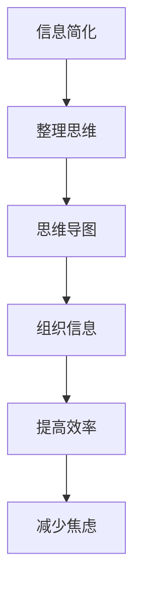

                 

# 《信息简化的最佳实践：如何在混乱中建立秩序》

> 关键词：信息简化、秩序、工作效率、决策能力、实践策略

摘要：在信息爆炸的时代，如何从海量信息中找到关键点，建立有效的信息处理机制，是我们面临的重要挑战。本文将探讨信息简化的最佳实践，帮助读者在混乱中建立秩序，提升工作效率和决策能力。

## 第一部分：引言

### 1.1 本书的目的和结构

#### 1.1.1 为什么信息简化重要

信息简化对于现代社会的个人和团队来说至关重要。随着互联网的快速发展，信息过载成为普遍现象，这不仅增加了我们的认知负担，还降低了工作效率和决策能力。因此，学会如何简化信息，提取关键点，是每个人都需要掌握的能力。

#### 1.1.2 本书的目标读者

本书的目标读者包括希望提升工作效率的专业人士、渴望提升决策能力的领导者、以及面对信息过载感到困扰的普通读者。

### 1.2 信息过载的现状

#### 1.2.1 信息过载的表现

信息过载的表现形式多样，包括大量邮件、短信、社交媒体通知、新闻更新等。这种过载导致我们无法有效处理信息，从而降低了工作效率和幸福感。

#### 1.2.2 信息过载的影响

信息过载对我们的影响包括焦虑、疲劳、注意力分散、决策困难等，这些都会影响我们的工作和生活质量。

### 1.3 信息简化的好处

#### 1.3.1 提高工作效率

信息简化可以帮助我们更快地处理信息，提高工作效率，减少工作中的时间浪费。

#### 1.3.2 减少焦虑和压力

通过简化信息，我们可以减少对信息的过度关注，从而减轻焦虑和压力。

#### 1.3.3 提升决策能力

信息简化有助于我们更好地分析和理解信息，从而做出更明智的决策。

## 第二部分：信息简化策略

### 2.1 整理思维

#### 2.1.1 常见思维工具

1. **思维导图**：通过图解的方式组织信息，使思维更加清晰。
2. **金字塔原理**：将信息从抽象到具体进行结构化表达。
3. **番茄工作法**：通过分段工作，提高专注力。

#### 2.1.2 思维导图

**Mermaid 流程图示例**：


#### 2.1.3 金字塔原理

**伪代码示例**：
```python
def simplify_info(info):
    abstract = extract_abstract(info)
    details = extract_details(abstract)
    return (abstract, details)
```

#### 2.1.4 番茄工作法

**伪代码示例**：
```python
def tomato_work_strategy(task, interval):
    while not task.completed():
        work(interval)
        rest(interval)
```

### 2.2 整理信息源

#### 2.2.1 筛选信息来源

1. **识别权威信息源**：选择可信度高的信息来源。
2. **避免信息陷阱**：警惕虚假信息和误导性信息。

#### 2.2.2 管理信息流

1. **使用新闻订阅**：定制化接收感兴趣的信息。
2. **制定信息消费计划**：合理安排信息接收和处理的时间。

### 2.3 简化文档和工作材料

#### 2.3.1 文档分类整理

1. **电子文档管理**：使用文件夹和标签进行分类。
2. **纸质文档管理**：使用文件夹和索引卡片进行整理。

#### 2.3.2 工作材料简化

1. **工作表单优化**：减少不必要的字段。
2. **使用自动化工具**：利用软件减少手动操作。

## 第三部分：信息简化的实践

### 3.1 设定目标和优先级

#### 3.1.1 SMART目标设定

1. **具体性（Specific）**：明确目标的具体内容。
2. **可衡量性（Measurable）**：设立量化的衡量标准。
3. **可达成性（Achievable）**：确保目标可实现。
4. **相关性（Relevant）**：目标要与整体目标一致。
5. **时限性（Time-bound）**：设定明确的时间限制。

#### 3.1.2 优先级管理

1. **瑞丁矩阵法**：根据紧急程度和重要性进行分类。
2. **四象限法**：将任务分为四个象限，分别处理。

### 3.2 时间管理

#### 3.2.1 时间块规划

1. **优先级排序**：根据紧急程度和重要性排序任务。
2. **时间预算**：为每个任务分配合理的时间。

#### 3.2.2 延迟满足

1. **延迟满足的重要性**：培养耐心，避免即时满足的诱惑。
2. **延迟满足策略**：设立长期目标，定期回顾和调整。

### 3.3 减少决策负担

#### 3.3.1 决策简化

1. **极简决策法**：减少决策的复杂性。
2. **倒计时决策法**：设定时间限制，加快决策速度。

#### 3.3.2 规则制定

1. **规则的重要性**：减少决策负担，提高效率。
2. **规则制定的步骤**：明确目标、收集信息、制定规则、执行和反馈。

## 第四部分：应用场景与实践

### 4.1 个人生活实践

#### 4.1.1 家庭财务管理

1. **收入和支出记录**：使用电子表格或财务管理软件记录。
2. **预算制定和调整**：根据实际情况调整预算，确保收支平衡。

#### 4.1.2 个人健康管理

1. **健康信息整理**：定期记录健康数据，如体重、血压等。
2. **健康计划制定**：根据健康数据制定合理的健康计划。

### 4.2 工作场景实践

#### 4.2.1 项目管理

1. **项目计划制定**：明确项目目标、任务和时间表。
2. **项目进度跟踪**：使用项目管理工具进行实时跟踪。

#### 4.2.2 团队协作

1. **信息共享**：使用共享文档和通信工具，确保信息透明。
2. **冲突解决策略**：建立有效的沟通和冲突解决机制。

## 第五部分：持续改进

### 5.1 反思与改进

#### 5.1.1 定期反思

1. **反思的方法**：定期回顾工作，分析成功和失败的原因。
2. **反思记录**：记录反思过程和结果，为改进提供依据。

#### 5.1.2 改进策略

1. **学习新方法**：不断学习新的信息简化策略。
2. **调整策略**：根据实际情况调整信息简化策略。

### 5.2 建立秩序的维护

#### 5.2.1 定期维护

1. **信息更新**：定期更新文档和数据库。
2. **工作材料整理**：定期清理无用材料，保持工作环境的整洁。

#### 5.2.2 持续改进

1. **保持好奇心**：对新技术和新方法保持好奇心。
2. **不断学习新技术**：不断提升信息简化的技能和知识。

## 附录

### 5.1 工具资源

#### 5.1.1 专注力工具

- **Forest**：一款帮助用户提高专注力的应用程序。
- **Focus@Will**：一款通过播放特定类型音乐帮助用户提高专注力的应用程序。

#### 5.1.2 任务管理工具

- **Trello**：一款基于看板的项目管理工具。
- **Asana**：一款功能丰富的任务管理工具。

#### 5.1.3 文档整理工具

- **Google Drive**：一款云存储和文档协作工具。
- **Evernote**：一款强大的笔记和组织工具。

### 5.2 参考文献

#### 5.2.1 相关书籍推荐

- **《深度工作》**：作者Cal Newport，介绍如何提高深度工作的能力。
- **《决策与判断》**：作者Daniel Kahneman，介绍决策心理学。

#### 5.2.2 学术论文推荐

- **"Information Overload and Decision Making: An Exploratory Study"**：一篇关于信息过载对决策影响的研究论文。
- **"The Art of Thinking Clearly"**：作者Gabriele Oettingen，介绍如何清晰思考。

#### 5.2.3 在线资源推荐

- **TED Talks**：TED演讲平台上关于时间管理和信息简化的视频。
- **Lifehacker**：一个提供生活技巧和工具推荐的网络平台。

### 作者信息

作者：AI天才研究院/AI Genius Institute & 禅与计算机程序设计艺术 /Zen And The Art of Computer Programming

---

本文以深入浅出的方式，详细探讨了信息简化的最佳实践，旨在帮助读者在复杂的信息环境中找到秩序，提升工作效率和决策能力。信息简化不仅是一种技术手段，更是一种生活哲学。希望本文能为您提供实用的方法和策略，帮助您在信息过载的时代中，找到自己的节奏。让我们在信息简化的道路上，不断探索，持续进步。

