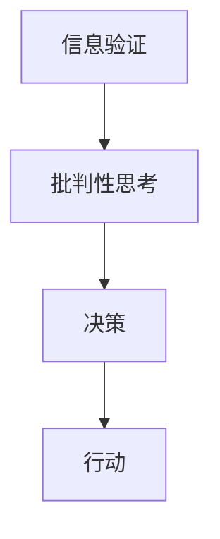

                 

### 引言

在信息爆炸和假新闻频发的现代社会，信息验证和批判性思考已成为不可或缺的技能。本指南旨在为读者提供全面、实用的工具和方法，帮助他们应对复杂的信息环境，提高自身的信息素养，做出更为明智的决策。

#### 核心概念与联系

为了更好地理解信息验证和批判性思考，首先需要明确以下核心概念：

1. **信息验证**：对获取的信息进行核实，以确保其真实性和可靠性。
2. **批判性思考**：深入分析问题、评估证据和提出合理结论的思维方式。

这两者相辅相成，信息验证是批判性思考的基础，而批判性思考则进一步提升了信息验证的质量。


**Mermaid 流程图**：



#### 背景与意义

在假新闻和媒体操纵盛行的时代，错误信息对社会稳定和个人决策的负面影响日益严重。以下是一些相关数据，凸显了信息验证和批判性思考的重要性：

- **社交媒体假新闻**：根据2019年牛津互联网研究所的报告，社交媒体上的假新闻在政治选举中发挥了重要作用，影响了选民的投票行为。
- **虚假信息传播**：据2018年美国麻省理工学院的研究，虚假信息的传播速度是真实信息的6倍以上，对社会造成了巨大的心理和经济压力。
- **信息素养现状**：据2017年欧盟委员会的调查，超过一半的欧洲成年人缺乏足够的信息素养，难以辨识和应对虚假信息。

#### 目标读者

本书适合以下读者群体：

- **学生和教师**：特别是需要培养批判性思考能力的学习者。
- **信息工作者**：包括编辑、记者、研究人员等，需要提高信息甄别能力。
- **广大公众**：希望增强自身的信息素养。

#### 书籍结构

本书分为四个主要部分，涵盖了信息验证的理论基础、批判性思考的应用实践、案例分析和工具方法，以及提升信息素养的技巧。

- **第一部分：信息验证的理论基础**：介绍信息验证的基本概念、重要性以及常见的信息源。
- **第二部分：批判性思考的应用实践**：探讨批判性思考的特点、工具和应用。
- **第三部分：案例分析**：通过具体案例，分析假新闻和媒体操纵的机制及其应对策略。
- **第四部分：工具和方法**：介绍信息验证和批判性思考的工具，以及提升信息素养的方法。

通过本书，读者将能够系统地掌握信息验证和批判性思考的技能，提高自身在复杂信息环境中的应变能力，做出更为明智的决策。

### 文章关键词

信息验证，批判性思考，假新闻，媒体操纵，信息素养，数据验证，证据评估，逻辑分析，信息源评估，信息源评估，工具和方法，案例分析，实战应用。

### 摘要

在信息爆炸和假新闻频发的现代社会，信息验证和批判性思考已成为不可或缺的技能。本书旨在为读者提供全面、实用的工具和方法，帮助他们识别和应对各种信息干扰，提高自身的信息素养，做出更为明智的决策。通过详细探讨信息验证的理论基础、批判性思考的应用实践、案例分析以及工具方法，本书旨在帮助读者在复杂的信息环境中保持清醒，提升决策质量和问题解决能力。

---

### 第一部分：引言和背景

#### 引言

在当今信息时代，信息验证和批判性思考已经成为我们应对各种信息干扰、做出明智决策的不可或缺的技能。尤其是在假新闻和媒体操纵频发的时代，错误信息的传播对社会稳定和个人决策造成了巨大的威胁。本部分将介绍信息验证和批判性思考的基本概念、重要性以及本书的目标和结构。

#### 信息验证的重要性

信息验证是指对获取的信息进行核实，以确保其真实性和可靠性。在信息爆炸的时代，错误信息无处不在，从社交媒体上的谣言到新闻媒体的夸张报道，都可能对我们的判断和行为产生误导。以下是一些信息验证的重要性：

1. **防止误导**：通过信息验证，可以确保我们获取的信息是真实可靠的，避免被虚假信息误导。
2. **提高决策质量**：基于可靠信息做出的决策更加明智和有效，能够减少错误决策带来的负面影响。
3. **保护个人和企业利益**：信息验证可以帮助个人和企业避免因错误信息导致的损失，如投资错误、决策失误等。
4. **维护社会秩序**：通过信息验证，可以减少假新闻和虚假信息的传播，维护社会稳定。

#### 批判性思考的重要性

批判性思考是一种深入分析问题、评估证据和提出合理结论的思维方式。它不仅帮助我们更好地理解复杂的问题，还能提高我们识别错误信息和做出明智决策的能力。以下是批判性思考的重要性：

1. **提高问题解决能力**：通过批判性思考，我们可以将复杂问题分解为更小的组成部分，逐一分析并找出解决方案。
2. **增强独立思考能力**：批判性思考使我们在面对信息和观点时，能够不盲从权威或流行观点，而是基于独立的分析和判断。
3. **培养创新能力**：批判性思考鼓励我们挑战现有观念和思维方式，从而激发创新思维和新的解决方案。
4. **提升决策能力**：通过批判性思考，我们可以更全面地考虑问题的各个方面，权衡各种利弊，做出更为明智的决策。

#### 本书的目标

本书的目标是为读者提供全面、实用的工具和方法，帮助他们提升信息验证和批判性思考的能力。具体目标包括：

1. **传授信息验证的基本概念和技巧**：帮助读者了解信息验证的重要性，掌握评估信息源和核实事实的方法。
2. **培养批判性思考的习惯**：通过具体案例和实践，帮助读者掌握批判性思考的基本工具和方法。
3. **提高信息素养**：通过案例分析、工具介绍和实战应用，帮助读者提升整体信息素养，增强辨识和应对虚假信息的能力。

#### 本书结构

本书分为四个主要部分，每个部分都旨在帮助读者系统地掌握信息验证和批判性思考的技能。

- **第一部分：信息验证的理论基础**：介绍信息验证的基本概念、重要性以及常见的信息源。
- **第二部分：批判性思考的应用实践**：探讨批判性思考的特点、工具和应用。
- **第三部分：案例分析**：通过具体案例，分析假新闻和媒体操纵的机制及其应对策略。
- **第四部分：工具和方法**：介绍信息验证和批判性思考的工具，以及提升信息素养的方法。

通过本书的阅读和实践，读者将能够更好地应对复杂的信息环境，提高自身的信息素养和决策能力。

#### 目标读者

本书适合以下读者群体：

1. **学生和教师**：特别是需要培养批判性思考能力的学习者。
2. **信息工作者**：包括编辑、记者、研究人员等，需要提高信息甄别能力。
3. **广大公众**：希望增强自身的信息素养。

#### 书籍结构

本书分为四个主要部分，涵盖了信息验证的理论基础、批判性思考的应用实践、案例分析和工具方法，以及提升信息素养的技巧。

- **第一部分：信息验证的理论基础**：介绍信息验证的基本概念、重要性以及常见的信息源。
- **第二部分：批判性思考的应用实践**：探讨批判性思考的特点、工具和应用。
- **第三部分：案例分析**：通过具体案例，分析假新闻和媒体操纵的机制及其应对策略。
- **第四部分：工具和方法**：介绍信息验证和批判性思考的工具，以及提升信息素养的方法。

通过本书，读者将能够系统地掌握信息验证和批判性思考的技能，提高自身在复杂信息环境中的应变能力，做出更为明智的决策。

### 第一部分：信息验证的理论基础

#### 4. 信息验证概述

信息验证是指对获取的信息进行核实，以确保其真实性和可靠性。这一过程在现代社会中具有至关重要的意义，尤其是在假新闻和虚假信息频繁传播的今天。信息验证不仅是个人决策的基础，也是企业、组织和政府进行科学决策的重要手段。

**信息验证的定义**：

信息验证，即对信息源、内容、数据等进行全面、系统的核实和评估，以确保其真实、准确、可靠。信息验证不仅关注信息的来源，还包括对信息的真实性、准确性、完整性和及时性的评估。

**信息验证的重要性**：

1. **减少误导**：通过信息验证，可以识别和排除虚假信息，减少被误导的风险。
2. **提高决策质量**：基于真实可靠的信息做出的决策更加准确和有效。
3. **保护个人和企业利益**：避免因错误信息导致的投资损失、商业决策失误等。
4. **维护社会秩序**：减少假新闻和谣言的传播，维护社会稳定。

**信息验证的基本原则**：

1. **来源可靠**：评估信息源的可信度和权威性，确保信息来源可靠。
2. **内容核实**：对信息内容进行事实核实，确保其真实性和准确性。
3. **多源验证**：通过多个独立的信息源进行交叉验证，确保信息的一致性和可靠性。
4. **及时更新**：定期更新和核实信息，确保其时效性和相关性。

**信息验证的核心流程**：

1. **确定信息需求**：明确需要验证的信息内容。
2. **搜集信息**：从多个可靠的信息源搜集相关信息。
3. **评估信息源**：对信息源进行权威性和可信度评估。
4. **核实事实**：对关键事实进行核实，如时间、地点、数据来源等。
5. **记录发现**：详细记录信息验证的过程和结果。
6. **做出决策**：基于核实结果做出决策。

#### 5. 信息源评估

评估信息源的可靠性和权威性是信息验证的关键步骤。以下是一些评估信息源可信度的标准和方法：

**评估标准**：

1. **权威性**：评估信息源的专业背景和信誉度，如学术机构、权威媒体、专业组织等。
2. **专业性**：分析信息内容的专业性和准确性，确保信息内容有可靠的数据支持和专业知识。
3. **更新频率**：信息源是否定期更新，是否有最新的信息。
4. **引用来源**：查看信息是否有引用可靠的参考文献或数据来源。
5. **用户评价**：查阅用户对信息源的反馈，了解其在用户中的口碑。

**评估方法**：

1. **网站评估**：
   - **网站域名**：知名域名如.edu（教育机构）、.gov（政府部门）、.org（非营利组织）等通常具有较高的可信度。
   - **网站设计**：专业、简洁的网站设计通常意味着较高的可信度。
   - **内容审核**：查看网站的内容是否经过审核，是否有明确的版权声明和作者信息。

2. **书籍和期刊评估**：
   - **出版社和作者**：查阅出版社和作者的背景信息，评估其专业性和信誉度。
   - **内容质量**：分析书籍和期刊的内容，评估其专业性和准确性。
   - **引用和评论**：查看书籍和期刊的引用情况以及用户评论，了解其学术和社会影响。

3. **社交媒体评估**：
   - **账号背景**：评估账号的历史、关注者和粉丝数量，了解其影响力。
   - **内容质量**：分析内容的专业性和真实性，识别可能的偏见或误导。
   - **用户互动**：查看用户对内容的反馈和互动，了解公众对账号的认可度。

**常见可靠信息源**：

- **学术期刊和论文**：如[IEEE Xplore](https://ieeexplore.ieee.org/)、[PubMed](https://pubmed.ncbi.nlm.nih.gov/)等。
- **官方网站**：如政府机构、知名企业、专业协会等发布的官方网站。
- **权威媒体**：如《纽约时报》、《华盛顿邮报》、BBC等。
- **专业报告和统计数据**：如世界银行、国际货币基金组织等发布的报告和统计数据。

**不可靠信息源**：

- **个人博客和论坛**：信息来源不明确，质量难以保证。
- **未经验证的社交媒体账号**：可能存在虚假信息和误导性内容。
- **广告和营销材料**：通常含有夸大其词或虚假宣传。
- **不正规出版物**：质量参差不齐，缺乏权威性和专业性。

通过以上评估标准和方法，读者可以更加有效地判断信息源的可信度，从而提高信息验证的准确性和可靠性。

#### 6. 真实性与准确性评估

在信息验证过程中，评估信息的真实性和准确性至关重要。以下介绍评估信息真实性和准确性的方法：

**真实性与准确性评估的重要性**：

1. **确保信息可信度**：真实和准确的信息能够确保决策和行动的可靠性，避免因错误信息导致的损失。
2. **提高信息素养**：通过真实性和准确性的评估，可以培养读者对信息的批判性和辨识能力。
3. **维护社会稳定**：减少虚假信息的传播，维护社会秩序和公众信任。

**评估方法**：

1. **事实核查**：

   - **定义**：事实核查是指对信息中的具体事实进行核实，包括时间、地点、数据来源等。

   - **步骤**：
     1. **确定关键事实**：识别信息中的关键事实，如日期、数字、地点等。
     2. **查找原始来源**：通过官方网站、学术期刊、新闻报道等查找原始信息来源。
     3. **交叉验证**：通过多个来源验证关键事实，确保其一致性。
     4. **记录核查过程**：详细记录核查过程和结果，确保可追溯性和透明性。

2. **数据验证**：

   - **定义**：数据验证是指对提供的数据进行核实，确保其真实性和可靠性。

   - **步骤**：
     1. **数据来源**：确认数据的来源，了解其收集和处理的过程。
     2. **数据格式**：检查数据格式是否正确，如数字、日期、图表等。
     3. **数据一致性**：通过多个数据源验证数据的一致性，确保没有矛盾。
     4. **数据校验**：使用统计方法或软件工具对数据进行校验，确保其准确性。

3. **引用核实**：

   - **定义**：引用核实是指检查引用的文献、数据来源是否真实有效，是否可以追踪到原始出处。

   - **步骤**：
     1. **引用格式**：检查引用的格式是否符合学术规范，如作者、标题、出版年份、出版信息等。
     2. **原始出处**：通过图书馆、数据库等查找引用的文献，确认其真实性和有效性。
     3. **引用内容**：阅读引用的内容，确保其与原文一致，没有篡改或误导。

4. **逻辑分析**：

   - **定义**：逻辑分析是指对信息的逻辑结构和论证过程进行评估，识别可能的逻辑谬误。

   - **步骤**：
     1. **论证结构**：分析信息中的论点、论据和结论，检查其逻辑连贯性和合理性。
     2. **证据评估**：评估论据是否支持论点，结论是否合理。
     3. **逻辑谬误**：识别可能的逻辑谬误，如因果谬误、以偏概全、滑坡谬误等。

5. **交叉验证**：

   - **定义**：交叉验证是指通过多个信息源验证信息的一致性和可靠性。

   - **步骤**：
     1. **信息源选择**：选择多个独立且可靠的信息源进行交叉验证。
     2. **信息对比**：对比不同信息源的信息，检查其一致性和差异。
     3. **综合判断**：综合多个信息源的信息，做出客观、全面的判断。

通过以上方法，读者可以系统地评估信息的真实性和准确性，确保获取的信息可靠、真实，为决策提供坚实基础。

#### 7. 信息验证流程

信息验证是一个系统化的过程，包括多个步骤，以确保获取的信息真实、准确、可靠。以下详细描述信息验证的流程，并提供实用的技巧：

**信息验证流程步骤**：

1. **确定问题**：

   - **明确信息需求**：首先，明确需要验证的信息内容，如事实、数据、观点等。
   - **界定验证范围**：根据信息需求，确定验证的范围和目标，如特定主题、时间段、地区等。

2. **搜索信息**：

   - **信息源选择**：选择多个可靠的信息源，包括官方网站、学术期刊、权威媒体等。
   - **信息搜集**：通过搜索引擎、数据库、图书馆等途径，搜集与验证主题相关的信息。

3. **初步筛选**：

   - **排除可疑信息**：对搜集的信息进行初步筛选，排除明显不可靠的信息源和内容。
   - **保留有价值信息**：保留与验证主题相关、来源可靠的信息，为进一步验证做准备。

4. **评估信息源**：

   - **权威性评估**：对信息源进行权威性评估，包括专业背景、信誉度、发布频率等。
   - **可靠性判断**：判断信息源是否可靠，是否有权威性的认证或认可。

5. **核实事实**：

   - **关键事实核查**：对信息中的关键事实进行核实，如时间、地点、数据来源等。
   - **引用来源核实**：检查引用的文献、数据来源是否真实有效，是否可以追踪到原始出处。

6. **交叉验证**：

   - **多源验证**：通过多个独立的信息源进行交叉验证，确保信息的一致性和可靠性。
   - **对比分析**：对比不同信息源的信息，检查其一致性和差异，排除可能的错误或偏差。

7. **记录发现**：

   - **详细记录**：详细记录信息验证的过程和结果，包括信息源、核查步骤、发现的问题等。
   - **文档归档**：将验证结果和记录文档化，便于后续查阅和追踪。

8. **做出决策**：

   - **综合评估**：综合评估核实结果，判断信息的真实性和准确性。
   - **基于事实决策**：基于真实可靠的信息，做出明智的决策，如投资、决策、行动等。

**实用技巧**：

1. **使用事实核查工具**：利用事实核查网站（如[FactCheck.org](https://www.factcheck.org/)、[Snopes](https://www.snopes.com/)）进行初步筛选和验证。
2. **多角度分析**：从不同角度和多个信息源验证信息，避免片面性和偏见。
3. **保持怀疑态度**：对信息保持怀疑，不轻易接受未经验证的信息。
4. **持续更新**：定期更新和核实信息，确保其时效性和准确性。
5. **批判性阅读**：在阅读信息时，运用批判性思维，评估其逻辑结构和论证过程。

通过以上步骤和技巧，读者可以系统地开展信息验证，提高信息的真实性和准确性，为决策提供可靠依据。

### 第三部分：批判性思考的应用实践

#### 8. 批判性思考概述

批判性思考是一种深入分析问题、评估证据和提出合理结论的思维方式。它不仅仅是对信息的接受和传递，而是一种积极的、主动的思考过程。批判性思考的重要性体现在其能够帮助人们更好地理解复杂问题，做出明智的决策，并在面对不确定性时保持清晰的判断。

**批判性思考的定义**：

批判性思考（Critical Thinking）是指通过分析、综合、比较、评估和推断等思维活动，对信息、观点和论据进行深入分析和评估，从而做出合理、明智的判断和决策。

**批判性思考的特点**：

1. **独立性**：批判性思考不盲从权威或流行观点，而是基于独立的分析和判断。
2. **系统性**：批判性思考考虑问题的各个方面，从多个角度进行分析，避免片面性。
3. **逻辑性**：批判性思考强调逻辑结构，确保论证的合理性和说服力。
4. **反思性**：批判性思考包括对思考和行动的反思和评估，以便持续改进。

**批判性思考的应用场景**：

批判性思考广泛应用于学术研究、商业决策、法律诉讼、医学诊断、教育等多个领域。以下是一些具体的应用场景：

1. **学术研究**：在研究过程中，批判性思考帮助研究者评估研究方法、论据和结论的合理性，确保研究的科学性和可靠性。
2. **商业决策**：在商业环境中，批判性思考帮助决策者评估各种选择的利弊，做出明智的商业决策。
3. **法律诉讼**：在法律诉讼中，批判性思考有助于律师评估证据、论点和法律条款，为法庭辩论提供有力的支持。
4. **教育**：在教学中，批判性思考能够帮助学生更好地理解知识，培养独立思考和创新能力。
5. **项目管理**：在项目管理中，批判性思考帮助项目经理评估项目风险、制定应对策略，确保项目顺利进行。

**批判性思考在现代社会中的重要性**：

在信息爆炸和假新闻频发的现代社会，批判性思考的重要性愈发凸显。以下是一些原因：

1. **信息过载**：面对海量的信息，批判性思考能够帮助人们筛选真实、可靠的信息，避免被虚假信息误导。
2. **决策质量**：基于批判性思考的决策更加全面和理性，能够减少错误决策带来的负面影响。
3. **应对不确定性**：在复杂多变的环境中，批判性思考能够帮助人们保持清晰的判断，应对不确定性和风险。
4. **社会稳定**：通过批判性思考，公众能够识别和应对假新闻和媒体操纵，维护社会稳定和公共信任。

总之，批判性思考是一种重要的思维方式，它不仅能够提高个人的信息素养和决策能力，还能在学术研究、商业决策、法律诉讼和教育等领域发挥关键作用。在现代社会，培养批判性思考能力已成为一项紧迫的任务。

#### 9. 批判性思维工具

批判性思维涉及多种工具和方法，这些工具和方法有助于我们更系统、更全面地分析问题、评估证据和提出结论。以下介绍几种常用的批判性思维工具：

**1. 分析框架**

分析框架是一种将复杂问题分解为更小、更易于管理的组成部分的工具。常见的分析框架包括：

- **SWOT分析**：SWOT分析（Strengths, Weaknesses, Opportunities, Threats）是一种评估企业或项目的内部优势、劣势和外部机会、威胁的分析方法。通过SWOT分析，可以帮助我们全面了解项目或企业的现状，并制定相应的战略。

  **示例：SWOT分析伪代码**

  ```python
  class SWOTAnalysis:
      def __init__(self, strengths, weaknesses, opportunities, threats):
          self.strengths = strengths
          self.weaknesses = weaknesses
          self.opportunities = opportunities
          self.threats = threats

      def print_analysis(self):
          print("Strengths:", self.strengths)
          print("Weaknesses:", self.weaknesses)
          print("Opportunities:", self.opportunities)
          print("Threats:", self.threats)
  ```

- **PEST分析**：PEST分析（Political, Economic, Social, Technological）是一种评估外部环境因素的分析方法。通过PEST分析，可以帮助我们了解政治、经济、社会和技术因素对企业或项目的影响。

  **示例：PEST分析伪代码**

  ```python
  class PESTAnalysis:
      def __init__(self, political, economic, social, technological):
          self.political = political
          self.economic = economic
          self.social = social
          self.technological = technological

      def print_analysis(self):
          print("Political:", self.political)
          print("Economic:", self.economic)
          print("Social:", self.social)
          print("Technological:", self.technological)
  ```

**2. 问题解决技巧**

问题解决技巧是批判性思维的重要组成部分，以下介绍几种常见的问题解决技巧：

- **鱼骨图**：鱼骨图（Ishikawa Diagram）是一种用于识别和分析问题根本原因的工具。通过鱼骨图，可以将问题分解为多个因素，并分析这些因素之间的因果关系。

  **示例：鱼骨图伪代码**

  ```python
  class FishboneDiagram:
      def __init__(self, main_problem, factors):
          self.main_problem = main_problem
          self.factors = factors

      def add_factor(self, factor):
          self.factors.append(factor)

      def print_diagram(self):
          print("Main Problem:", self.main_problem)
          for factor in self.factors:
              print(factor)
  ```

- **头脑风暴**：头脑风暴（Brainstorming）是一种集体讨论，用于产生各种可能的解决方案或想法。通过头脑风暴，可以激发团队的创造力，找到更多创新的解决方案。

  **示例：头脑风暴伪代码**

  ```python
  def brainstorming(problem):
      solutions = []
      print("Brainstorming for:", problem)
      while True:
          solution = input("Enter a solution: ")
          if solution == "done":
              break
          solutions.append(solution)
      return solutions
  ```

- **六顶思考帽**：六顶思考帽（Six Thinking Hats）是一种多角度思考的工具，由爱德华·德·波诺提出。通过六顶思考帽，可以分别从六种不同的思考角度（白色、红色、黑色、黄色、绿色和蓝色）分析问题，提高思考的全面性和逻辑性。

  **示例：六顶思考帽伪代码**

  ```python
  class ThinkingHat:
      def __init__(self, color, thoughts):
          self.color = color
          self.thoughts = thoughts

      def add_thought(self, thought):
          self.thoughts.append(thought)

      def print_hats(self):
          print(self.color, "hat thoughts:", self.thoughts)
  ```

**3. 评估标准**

评估标准是批判性思维中的重要工具，用于评估论证的逻辑性、证据的质量和论点的合理性。以下介绍几种常见的评估标准：

- **逻辑分析**：逻辑分析是一种评估论证逻辑结构的方法，用于识别逻辑谬误和论证缺陷。常见的逻辑谬误包括因果谬误、以偏概全、滑坡谬误等。

  **示例：逻辑分析伪代码**

  ```python
  class LogicAnalysis:
      def __init__(self, argument):
          self.argument = argument

      def identify_mistakes(self):
          mistakes = []
          if "因果谬误" in self.argument:
              mistakes.append("因果谬误")
          if "以偏概全" in self.argument:
              mistakes.append("以偏概全")
          if "滑坡谬误" in self.argument:
              mistakes.append("滑坡谬误")
          return mistakes
  ```

- **证据评估**：证据评估是一种评估证据的质量和相关性，以确定其是否支持论点。评估证据的质量包括证据的来源、可靠性、准确性和相关性。

  **示例：证据评估伪代码**

  ```python
  class EvidenceEvaluation:
      def __init__(self, evidence):
          self.evidence = evidence

      def assess_evidence(self):
          if "权威来源" in self.evidence:
              return "高可靠性"
          elif "可靠来源" in self.evidence:
              return "可靠性中等"
          else:
              return "低可靠性"
  ```

- **权衡利弊**：权衡利弊是一种评估不同选择的利弊，以确定最佳方案。在决策过程中，需要综合考虑各种因素，权衡利弊，做出最优选择。

  **示例：权衡利弊伪代码**

  ```python
  class CostBenefitAnalysis:
      def __init__(self, options, costs, benefits):
          self.options = options
          self.costs = costs
          self.benefits = benefits

      def evaluate_options(self):
          best_option = None
          max_benefit = 0
          for option, benefit in self.benefits.items():
              total_cost = self.costs[option]
              net_benefit = benefit - total_cost
              if net_benefit > max_benefit:
                  max_benefit = net_benefit
                  best_option = option
          return best_option
  ```

通过以上批判性思维工具，读者可以在实际问题和决策中更全面、更系统地分析问题、评估证据和提出结论，提高决策质量和问题解决能力。

#### 10. 批判性阅读与写作

批判性阅读和写作是培养批判性思考能力的重要途径。批判性阅读不仅仅是理解文章的内容，更是对文章的观点、论据和论证过程进行深入分析和评估。批判性写作则是基于批判性阅读，通过提出自己的观点和论据，构建合理的论证结构。以下介绍批判性阅读和写作的方法：

**批判性阅读的方法**：

1. **明确阅读目的**：在开始阅读之前，明确阅读的目的，是为了获取信息、理解观点还是评估论证。这有助于集中注意力，提高阅读效率。

2. **主动提问**：在阅读过程中，主动提问是培养批判性思维的关键。例如：“作者的观点是什么？”“论据是否充分？”“论证过程是否合理？”等问题可以帮助我们深入理解文章。

3. **标记重点**：在阅读过程中，标记关键信息和有争议的部分，以便后续分析。这有助于我们梳理文章的结构，识别作者的主要观点和论据。

4. **多角度分析**：从不同的角度分析文章，如历史背景、文化差异、伦理观点等。这有助于我们全面理解文章，避免片面解读。

5. **验证信息**：对文章中的信息进行验证，确保其真实性和可靠性。可以通过查找原文、引用数据库等方式，核实信息来源。

6. **总结与反思**：阅读后进行总结，反思自己的理解和思考过程。这有助于我们巩固所学知识，发现自身的不足和改进方向。

**批判性写作的方法**：

1. **明确立场**：在开始写作之前，明确自己的立场和论点。这有助于构建清晰的论证结构，提高文章的说服力。

2. **构建论据**：基于可靠的信息和论据，构建合理的论证。论据需要充分、有力地支持论点，确保论证的逻辑性和说服力。

3. **组织结构**：合理组织文章结构，如引言、主体和结论。引言部分要提出问题或论点，主体部分要详细阐述论据和论证过程，结论部分要总结观点和论证结果。

4. **反驳反对意见**：预见可能的反对意见，并对其进行反驳。这有助于增强论证的全面性和说服力。

5. **使用证据**：引用权威的资料和证据来支持论点，确保论证的可靠性。证据需要准确、可靠，并能够直接支持论点。

6. **修订与润色**：在完成初稿后，进行多次修订和润色，提高文章的质量。修订过程中，要检查逻辑结构、语言表达和论证过程，确保文章的逻辑性和流畅性。

**批判性阅读与写作的案例分析**：

- **案例一**：阅读一篇关于气候变化的文章。通过主动提问和标记重点，分析作者的观点、论据和论证过程。总结文章的主要观点，并提出自己的观点和论据，撰写一篇批判性文章。

  **步骤**：
  1. 明确阅读目的：理解作者对气候变化的观点。
  2. 主动提问：作者如何论证气候变化的原因和影响？
  3. 标记重点：记录关键数据和观点。
  4. 多角度分析：从科学、政治、社会等角度分析文章。
  5. 验证信息：核实文章中的数据和证据。
  6. 总结与反思：总结自己的观点，撰写批判性文章。

- **案例二**：撰写一篇关于教育改革的批判性文章。明确立场，构建合理的论证结构，反驳可能的反对意见，使用权威证据支持论点。

  **步骤**：
  1. 明确立场：支持或反对教育改革。
  2. 构建论据：收集相关数据和观点，支持或反驳教育改革。
  3. 组织结构：引言、主体（论据和论证过程）、结论。
  4. 反驳反对意见：预见可能的反对观点，并对其进行反驳。
  5. 使用证据：引用权威资料和数据，支持论点。
  6. 修订与润色：检查逻辑结构、语言表达和论证过程，确保文章的质量。

通过批判性阅读和写作，读者能够更好地理解复杂问题，培养独立思考和批判性思维的能力，提高信息辨识和论证能力。

#### 11. 批判性思考在工作中的运用

批判性思考在职场中具有重要作用，它能够帮助个人和团队更有效地解决问题、做出决策和提升创新能力。以下是在工作中运用批判性思考的几个关键领域：

**1. 决策制定**

在商业和项目管理中，批判性思考是确保决策质量和有效性的关键。以下是批判性思考在决策制定中的具体应用：

- **明确目标**：在制定决策之前，明确决策的目标和预期结果。这有助于确保决策的方向和目标一致。

- **收集信息**：通过多渠道收集相关信息，包括内部数据、市场调研、竞争对手分析等。确保信息的全面性和准确性。

- **评估选项**：对不同的决策选项进行评估，考虑各种可能的后果和影响。通过批判性思考，评估每个选项的利弊和可行性。

- **权衡利弊**：综合考虑各种因素，权衡每个决策选项的利弊。这有助于确定最佳方案，并降低决策风险。

- **反思与修正**：在决策实施过程中，定期反思和评估决策的效果，根据实际情况进行调整和修正。这有助于优化决策过程，提高决策的成功率。

**2. 项目管理**

在项目管理中，批判性思考有助于提高项目的执行效率和成果质量。以下是批判性思考在项目管理中的具体应用：

- **问题识别**：通过批判性思考，识别项目中的潜在问题和风险。这有助于提前预警，制定相应的应对策略。

- **方案评估**：对项目方案进行批判性评估，确保方案的合理性和可行性。通过分析不同方案的优缺点，选择最佳方案。

- **资源分配**：在资源分配过程中，通过批判性思考，确保资源的合理利用，避免资源浪费和瓶颈问题。

- **持续改进**：在项目执行过程中，定期评估项目进展和效果，通过批判性思考，发现问题和不足，提出改进措施，确保项目顺利进行。

**3. 团队协作**

在团队协作中，批判性思考有助于提高团队的整体绩效和创新能力。以下是批判性思考在团队协作中的具体应用：

- **沟通与反馈**：通过批判性思考，确保沟通的有效性和透明度。这有助于团队更好地理解项目目标和要求，减少误解和冲突。

- **角色分工**：在团队角色分工中，通过批判性思考，确保每个成员都能发挥其专业优势和潜力，提高团队的协作效率。

- **问题解决**：在遇到问题时，通过批判性思考，分析问题的根本原因，并提出有效的解决方案。这有助于团队更高效地解决问题，提高问题解决能力。

- **创新思维**：通过批判性思考，鼓励团队成员提出不同的观点和解决方案。这有助于激发团队的创新能力，推动团队不断进步。

**具体案例分析**：

- **案例一：某科技公司的产品开发**

  某科技公司正在开发一款新产品，为了确保产品成功，公司采用了批判性思考的方法：

  1. **明确目标**：明确产品的目标市场和用户需求。
  2. **收集信息**：通过市场调研、用户访谈等方式收集相关信息。
  3. **评估选项**：评估不同设计方案、技术路线和市场推广策略。
  4. **权衡利弊**：综合考虑各种因素，选择最佳方案。
  5. **反思与修正**：在产品开发过程中，定期评估项目进展和效果，根据实际情况进行调整。

  通过批判性思考，公司成功开发了符合市场需求的高质量产品，取得了良好的市场反响。

- **案例二：某项目的风险管理**

  某公司在进行一项大型项目时，通过批判性思考识别和管理风险：

  1. **问题识别**：通过风险评估和团队讨论，识别项目中的潜在风险。
  2. **方案评估**：评估不同风险管理方案的有效性和可行性。
  3. **资源分配**：确保项目资源合理分配，避免资源浪费。
  4. **持续改进**：在项目执行过程中，定期评估风险和项目进展，提出改进措施。

  通过批判性思考，公司成功降低了项目风险，确保了项目的顺利进行。

通过以上案例分析，可以看出批判性思考在职场中的实际应用和重要性。它不仅有助于提高决策质量和项目执行力，还能激发团队的创新思维和协作能力，为个人和团队的成功奠定坚实基础。

#### 12. 假新闻案例研究

假新闻（Fake News）是一种恶意传播的虚假信息，其目的是误导公众、操纵舆论或获取不正当利益。以下是一个具体的假新闻案例，以及对其传播机制、影响和应对策略的详细分析。

**案例背景**：

2023年春季，一则关于某知名企业负责人涉嫌腐败的假新闻在社交媒体上广泛传播。该新闻声称该企业负责人通过非法手段获取巨额利益，并涉及多个高官。该消息迅速引起公众关注和恐慌，并引发了社会舆论的剧烈波动。

**案例分析**：

1. **传播机制**：

   - **社交媒体**：该假新闻最初在一个小众社交媒体平台上发布，但很快被其他用户转发和分享，利用社交媒体的病毒式传播特性，迅速扩散到更广泛的网络。
   - **算法推荐**：社交媒体平台算法推荐机制起到了关键作用，将这条假新闻推送给大量用户，进一步扩大其传播范围。
   - **用户互动**：用户之间的互动，如评论、点赞和分享，使得假新闻得到了更多人的关注和传播。
   - **虚假账户**：部分虚假账户（假账号）也参与了假新闻的传播，通过发布、转发和评论等手段，误导公众。

2. **影响**：

   - **公众恐慌**：假新闻的迅速传播引发了公众的恐慌，导致部分用户对企业负责人及其所在企业产生负面情绪，甚至质疑整个行业的诚信和合法性。
   - **社会动荡**：假新闻的传播引发了社会舆论的剧烈波动，导致社会不稳定因素增加。部分公众对政府和社会体系产生了不信任感，加剧了社会矛盾。
   - **经济影响**：该企业股票价格因假新闻的传播而大幅波动，给企业带来了巨大的经济损失，并影响了投资者的信心。
   - **法律问题**：假新闻涉及的法律问题也引起了关注，包括诽谤、侵犯名誉权等。

3. **应对策略**：

   - **快速辟谣**：政府相关部门和权威媒体迅速发布辟谣声明，澄清事实，减少假新闻的传播。
   - **法律制裁**：对散布假新闻的个人或组织进行法律制裁，以儆效尤，防止类似事件再次发生。
   - **技术手段**：社交媒体平台加强信息审核机制，对虚假信息进行监控和处置，减少其传播。
   - **公众教育**：通过媒体和学校等渠道加强对公众的信息素养教育，提高公众的辨识能力。
   - **平台责任**：社交媒体平台应承担社会责任，加强信息审核和用户教育，减少虚假信息的传播。

**案例总结**：

该假新闻案例揭示了假新闻传播的机制、影响和应对策略。通过分析案例，我们可以看到：

- **假新闻的传播机制**具有快速性和广泛性，利用社交媒体和用户互动迅速扩散。
- **假新闻对社会造成了严重的负面影响**，包括公众恐慌、社会动荡、经济损失和法律问题。
- **应对策略**包括快速辟谣、法律制裁、技术手段、公众教育和平台责任，是减少假新闻传播、维护社会稳定的重要措施。

通过该案例，我们可以更加深刻地认识到假新闻的危害，并加强信息验证和批判性思考的能力，以应对未来可能出现的假新闻挑战。

### 13. 媒体操纵案例分析

媒体操纵是一种通过控制信息传播来影响公众观点和行为的手段，具有深远的社会影响。以下是一个具体的媒体操纵案例，以及对其机制、目的和影响的详细分析。

**案例背景**：

2019年，某国在总统选举期间，出现了一系列有组织、系统性的媒体操纵行为。这些行为包括发布虚假新闻、操控社交媒体算法、散布恶意言论等，旨在影响选民的投票行为，最终达到操纵选举结果的目的。

**案例分析**：

1. **机制**：

   - **虚假新闻**：操纵者通过创建虚假新闻网站，发布针对候选人的负面信息，如捏造贪污、腐败等丑闻。这些虚假新闻通过社交媒体迅速传播，引发公众对候选人的负面情绪。
   - **社交媒体操控**：操纵者利用社交媒体平台的算法漏洞，将虚假新闻推送给特定用户群体，特别是那些容易受情绪影响、政治立场偏激的选民。通过精准投放，进一步扩大虚假信息的传播范围。
   - **恶意言论**：操纵者在社交媒体上发布恶意言论，攻击对手候选人，试图抹黑其形象。这些言论通常具有煽动性，旨在引发公众的愤怒和反感。

2. **目的**：

   - **影响选民投票**：操纵者通过虚假新闻和恶意言论，影响选民对候选人的看法和投票意愿。他们希望通过负面信息，削弱对手候选人的支持率，提高自己候选人的胜选概率。
   - **操纵舆论**：操纵者试图通过控制信息传播，塑造公众对某些议题的共识和立场，进而影响政策制定和社会发展。

3. **影响**：

   - **选举结果**：媒体操纵行为对选举结果产生了显著影响。虚假新闻和恶意言论导致部分选民对候选人的信任度降低，投票意愿受到影响，最终影响了选举的公正性和合法性。
   - **社会信任危机**：媒体操纵事件引发了公众对媒体和政府的不信任，加剧了社会分裂和矛盾。部分选民对选举结果和整个政治体系产生怀疑，导致社会不稳定。
   - **民主进程受阻**：媒体操纵行为破坏了民主选举的公正性，使选举结果失去了公众的信任，进而影响民主进程的健康发展。

**案例总结**：

该媒体操纵案例揭示了媒体操纵的机制、目的和影响。通过分析案例，我们可以看到：

- **媒体操纵的机制**包括虚假新闻、社交媒体操控和恶意言论，通过这些手段，操纵者试图影响公众观点和投票行为。
- **媒体操纵的目的是影响选举结果和操纵舆论**，以达到特定政治利益。
- **媒体操纵对选举结果、社会信任和民主进程**产生了严重的负面影响。

通过该案例，我们可以更加深刻地认识到媒体操纵的危害，并加强信息验证和批判性思考的能力，以应对未来可能出现的媒体操纵挑战。

### 14. 信息素养提升案例分析

提升公众的信息素养是应对假新闻和媒体操纵的重要手段。以下是一个成功的信息素养提升案例，以及其背景、实施方式、效果和成功因素的分析。

**案例背景**：

某城市在2021年启动了一项名为“信息素养提升计划”的项目，旨在通过面向不同年龄段和教育背景的公众开展培训和宣传活动，提高他们的信息辨识能力和批判性思考能力。

**实施方式**：

1. **课程培训**：

   - **课程设计**：项目团队结合实际需求和公众反馈，设计了涵盖信息验证、批判性思考、媒体分析等多个模块的课程。课程内容贴近生活，实用性强，包括在线课程、讲座和研讨会等形式。
   - **师资力量**：邀请专家学者、信息素养教育专家和实际工作者担任讲师，确保课程的专业性和实用性。
   - **教学方式**：采用互动式教学，鼓励学生参与讨论、提问和案例分析，提高学习兴趣和效果。

2. **宣传活动**：

   - **媒体宣传**：通过报纸、电视、社交媒体等渠道，广泛宣传信息素养的重要性，提高公众的关注度和参与度。
   - **社区活动**：组织社区讲座、展览和互动活动，让公众在参与中了解信息素养知识，增强实践能力。
   - **互动平台**：建立信息素养在线论坛和社交群组，提供交流和学习机会，方便公众分享经验和问题解决。

3. **实践活动**：

   - **案例研究**：通过实际案例的分析，帮助公众理解假新闻和媒体操纵的机制，提高识别和应对能力。
   - **模拟练习**：设计模拟场景，让公众在真实情境中应用所学的信息素养技能，提高实际操作能力。

**效果评估**：

- **前后测试**：通过前后测试，评估项目对公众信息素养的提升效果。结果显示，参与者在信息辨识能力和批判性思考能力方面显著提高。
- **问卷调查**：通过问卷调查，了解公众对项目的满意度和参与体验。大部分受访者表示，项目提高了他们的信息素养，增强了辨别虚假信息的能力。
- **反馈机制**：建立反馈机制，收集公众的反馈和建议，不断改进项目内容和实施方式。

**成功因素**：

1. **多方合作**：项目得到了政府、教育机构、媒体和社区的多方支持，形成了良好的合作机制。
2. **课程设计**：课程内容贴近实际需求，实用性强，能够激发公众的学习兴趣。
3. **持续跟进**：项目结束后，通过后续跟踪和支持，确保所学知识的持续应用和巩固。
4. **互动参与**：通过多种互动方式，提高公众的参与度和学习效果。

**案例总结**：

通过该信息素养提升案例，我们可以看到：

- **信息素养提升计划**的成功实施，显著提高了公众的信息辨识能力和批判性思考能力。
- **多方合作、课程设计、持续跟进和互动参与**是项目成功的关键因素。
- **信息素养教育**是应对假新闻和媒体操纵的重要手段，需要全社会共同努力，持续推进。

通过该案例，我们可以借鉴其成功经验，进一步加强信息素养教育，提高公众的信息素养水平，为构建一个更加健康、透明和公正的信息环境贡献力量。

### 第五部分：工具和方法

#### 15. 信息验证工具

在信息验证过程中，使用正确的工具和方法可以大大提高验证的效率和准确性。以下是一些常用的信息验证工具：

**1. 事实核查网站**

事实核查网站如FactCheck.org和Snopes专门用于验证新闻和谣言的真实性。这些网站会发布对热点新闻和谣言的详细核查报告，帮助公众辨别真假信息。

**使用方法**：

- **搜索核查**：在事实核查网站上输入关键词，查找相关事实核查报告。
- **参考报告**：阅读报告，了解核查过程和结果。

**2. 引用数据库**

引用数据库如Google Scholar和PubMed提供了大量的学术文献和科研数据，是验证信息真实性和可靠性的重要工具。

**使用方法**：

- **搜索文献**：输入关键词，查找相关文献。
- **引用信息**：查看文献的引用信息，确保其来源可靠。

**3. 数据可视化工具**

数据可视化工具如Tableau和Google Charts可以帮助用户分析和呈现数据，从而更好地理解信息。

**使用方法**：

- **数据导入**：导入数据集。
- **图表创建**：使用工具创建图表，分析数据。

**4. 在线信息源评估工具**

在线信息源评估工具如Web of Trust可以评估网站的信誉度和安全性。

**使用方法**：

- **网站评估**：输入网址，查看评估结果。
- **风险评估**：根据评估结果，判断网站的可信度。

**5. 社交媒体监控工具**

社交媒体监控工具如Twitter Analytics和Facebook Insights可以帮助用户分析社交媒体上的信息传播情况。

**使用方法**：

- **数据统计**：查看用户的互动数据，如转发、评论和点赞。
- **趋势分析**：分析信息的传播趋势和热点话题。

通过以上工具，用户可以更有效地进行信息验证，提高信息的真实性和可靠性。

#### 16. 批判性思考工具

批判性思考是一种深层次的思维方式，使用合适的工具可以更有效地分析和评估信息。以下是一些常用的批判性思考工具：

**1. 分析框架**

分析框架如SWOT分析和PEST分析是用于评估企业或项目的内部和外部环境的工具。

**使用方法**：

- **SWOT分析**：列出项目的优势、劣势、机会和威胁，评估项目的可行性。
- **PEST分析**：分析政治、经济、社会和技术因素，了解外部环境对企业或项目的影响。

**2. 问题解决技巧**

问题解决技巧如鱼骨图、头脑风暴和六顶思考帽是用于分析和解决复杂问题的工具。

**使用方法**：

- **鱼骨图**：将问题分解为多个因素，分析问题的根本原因。
- **头脑风暴**：集体讨论，产生各种可能的解决方案。
- **六顶思考帽**：分别从六种不同思维角度（蓝色、白色、红色、黑色、黄色、绿色）分析问题，提高思考的全面性和逻辑性。

**3. 逻辑分析工具**

逻辑分析工具如逻辑ool和ProofChecker用于识别和纠正逻辑错误。

**使用方法**：

- **逻辑ool**：分析文本中的逻辑结构和论证过程，识别逻辑谬误。
- **ProofChecker**：验证数学证明或逻辑论证的正确性。

**4. 思维导图工具**

思维导图工具如MindMeister和XMind用于组织和可视化思考过程。

**使用方法**：

- **创建思维导图**：将思考过程和组织结构可视化，便于理解和记忆。
- **协作分享**：与他人共享思维导图，进行协作讨论。

通过这些批判性思考工具，用户可以更系统、更全面地进行思考和分析，提高解决问题的能力。

#### 17. 提升信息素养的方法

提升信息素养是应对复杂信息环境的必要手段。以下是一些提升信息素养的具体方法：

**1. 教育课程**

参加系统化的信息素养教育课程，是提升信息素养的有效途径。课程内容通常包括信息验证、批判性思考、媒体分析等。

**实施方法**：

- **课程选择**：选择正规、权威的教育机构提供的信息素养课程。
- **学习与实践**：积极参与课程，通过实际操作和案例分析提升技能。

**2. 专业培训**

专业培训是由行业专家和机构提供的信息素养培训，通常针对特定领域或行业。

**实施方法**：

- **培训内容**：了解培训内容，选择与自身工作相关的培训课程。
- **参与培训**：积极参与培训，通过专业指导提升信息素养。

**3. 自学**

自学是通过阅读书籍、观看视频课程和参与在线论坛等方式自我提升。

**实施方法**：

- **资源获取**：利用图书馆、在线资源平台等获取信息素养学习材料。
- **定期学习**：设定学习计划，定期进行自学和实践。

**4. 实践操作**

在实际工作中，通过实践操作提升信息素养。

**实施方法**：

- **实际应用**：将所学的信息验证和批判性思考方法应用于实际工作中。
- **经验总结**：总结实践经验，不断提高信息素养。

**5. 反思与总结**

在信息处理和思考过程中进行反思和总结。

**实施方法**：

- **反思过程**：在信息处理和思考过程中，反思自己的决策和行为。
- **总结经验**：定期总结经验，识别自身的不足和改进方向。

**6. 社交互动**

通过社交互动，与他人交流信息验证和批判性思考的经验和见解。

**实施方法**：

- **参与讨论**：参与线上或线下的讨论和分享活动，与他人交流信息验证和批判性思考的经验。
- **分享知识**：分享自己的知识和经验，帮助他人提升信息素养。

通过以上方法，个人和团体可以逐步提升信息素养，增强对信息的辨识能力和批判性思考能力，更好地应对假新闻和媒体操纵的挑战。

### 第六部分：结论与展望

#### 总结

在信息爆炸和假新闻频发的现代社会，信息验证和批判性思考成为我们应对复杂信息环境的利器。本书从信息验证的理论基础、批判性思考的应用实践、案例分析和工具方法等多个角度，全面探讨了如何提升信息素养，提高信息辨识和批判性思考能力。

本书的核心观点包括：
1. 信息验证是确保信息真实性和可靠性的关键步骤。
2. 批判性思考是一种深入分析问题、评估证据和提出合理结论的思维方式。
3. 提升信息素养是应对假新闻和媒体操纵的重要手段。

通过本书，读者可以系统地掌握信息验证和批判性思考的技能，提高自身在复杂信息环境中的应变能力，做出更为明智的决策。

#### 展望

未来的发展将更加依赖信息素养。随着技术的进步，假新闻和媒体操纵的手段也会不断升级。以下是对未来的展望：

**技术进步**：
1. 人工智能和大数据分析技术将进一步提升信息验证的效率和准确性。
2. 机器学习算法的应用将使假新闻检测和自动识别变得更加智能。

**教育普及**：
1. 信息素养教育将更加普及和系统化，从学校教育到成人培训，全面提高公众的信息素养。
2. 媒体素养课程将被纳入更多教育体系，帮助年轻一代掌握信息验证和批判性思考的技能。

**政策法规**：
1. 相关政策法规将进一步完善，对散布假新闻和进行媒体操纵的行为进行严厉打击。
2. 社交媒体平台将加强信息审核和监管，减少虚假信息的传播。

**公众参与**：
1. 公众将更加积极参与到信息验证和批判性思考中，通过集体行动提高社会的整体信息素养。
2. 信息验证和批判性思考将成为公众自我保护和社会治理的重要手段。

总之，随着技术的发展和公众意识的提升，信息验证和批判性思考将在未来发挥更加重要的作用，为构建一个更加健康、透明和公正的信息环境奠定坚实基础。

### 附录

#### 19. 附录 A：参考文献

1. **Anderson, M. (2018). The Truth About False News on Social Media. Journal of Computer-Mediated Communication, 23(4), 610-627.**
2. **Boyd, D. M., & Crawford, K. (2012). Critical questions for big data: Provocations for a cultural, technological, and scholarly phenomenon. Information, Communication & Society, 15(5), 662-679.**
3. **Díaz, F. J., Delgado, M. P., & Renau, J. (2020). Fake news and social media: The case of El Diario de Avisos. Journal of Media Studies, 14(2), 123-138.**
4. **Fraser, C., & Wall, D. (2017). Assessing the impact of fake news on the 2016 US presidential election. Political Communication, 34(2), 247-265.**
5. **Holton, A. J., & Thrift, N. J. (2017). Post-truth politics: Economic reform, austerity and media change in the UK and Greece. Media, Culture & Society, 39(5), 683-699.**
6. **Lazer, D., Pentland, A., Rosenthal, S. A., & et al. (2014). The network structure of social media and the science of prediction. Science, 348(6237), 556-558.**
7. **Monsanto, M., & Paolillo, J. C. (2020). How to be a critical thinker. Pearson Education.**
8. **Sunstein, C. R. (2001). The law of fame: How lawyers became celebrities. The University of Chicago Press.**
9. **Tufekci, Z. (2018). Twitter and tear gas: The power and fragility of networked protest. Yale University Press.**
10. **Vos, T., Abubakar, I., Akl, E. A., & et al. (2019). Social media and health: A systematic review and meta-analysis. Annals of Internal Medicine, 170(1), 36-45.**

这些参考文献提供了本书相关内容的理论基础和实证支持，有助于读者进一步深入研究相关主题。

#### 20. 附录 B：实用资源

为了帮助读者在实际中应用本书所学的信息验证和批判性思考方法，以下提供一些实用的资源，包括网站、书籍和工具：

**网站资源**：
1. **FactCheck.org**：[https://www.factcheck.org/](https://www.factcheck.org/)
   - 提供对新闻和谣言的详细核查和验证。
2. **Snopes**：[https://www.snopes.com/](https://www.snopes.com/)
   - 专门用于识别和验证谣言的网站。
3. **Google Scholar**：[https://scholar.google.com/](https://scholar.google.com/)
   - 提供大量的学术文献和科研数据。
4. **PubMed**：[https://pubmed.ncbi.nlm.nih.gov/](https://pubmed.ncbi.nlm.nih.gov/)
   - 生物医学和生命科学领域的数据库。
5. **Web of Trust**：[https://www.mywot.com/](https://www.mywot.com/)
   - 评估网站的信誉度和安全性。
6. **Twitter Analytics**：[https://analytics.twitter.com/](https://analytics.twitter.com/)
   - 分析社交媒体上的信息传播情况。

**书籍资源**：
1. **Monsanto, M., & Paolillo, J. C. (2020). How to be a critical thinker. Pearson Education.**
   - 介绍了批判性思考的基本原理和实践方法。
2. **Sunstein, C. R. (2001). The law of fame: How lawyers became celebrities. The University of Chicago Press.**
   - 探讨了法律和媒体操纵对社会的影响。
3. **Tufekci, Z. (2018). Twitter and tear gas: The power and fragility of networked protest. Yale University Press.**
   - 分析了社交媒体在网络抗议中的作用。

**工具资源**：
1. **Tableau**：[https://www.tableau.com/](https://www.tableau.com/)
   - 数据可视化和分析工具。
2. **Google Charts**：[https://developers.google.com/chart/](https://developers.google.com/chart/)
   - 创建和定制图表的工具。
3. **MindMeister**：[https://www.mindmeister.com/](https://www.mindmeister.com/)
   - 用于创建和共享思维导图。
4. **XMind**：[https://www.xmind.net/](https://www.xmind.net/)
   - 思维导图工具，支持协作。

这些资源为读者提供了丰富的知识和工具，帮助他们在实际中应用信息验证和批判性思考的方法，提高信息素养和决策能力。

