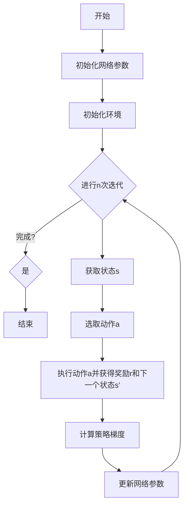

                 

### 值函数估计基础

值函数估计（Value Function Estimation）是强化学习（Reinforcement Learning, RL）中一个核心概念。在强化学习中，智能体（agent）通过与环境的交互来学习如何取得最大化的奖励。值函数估计就是用来估算智能体在某一状态下采取特定动作所能获得的长期累积奖励。

#### 1.1.1 价值函数的定义

价值函数是一个衡量状态或状态-动作对的价值的函数。具体来说：

- **状态价值函数**（State Value Function），通常表示为 \( V(s) \)，用来表示智能体在状态 \( s \) 下采取任何动作所能获得的期望累积奖励。

- **动作价值函数**（Action Value Function），通常表示为 \( Q(s, a) \)，用来表示智能体在状态 \( s \) 下采取动作 \( a \) 所能获得的期望累积奖励。

这两个价值函数之间存在紧密的联系。\( V(s) \) 可以看作是 \( Q(s, a) \) 对于所有可能动作 \( a \) 的期望值：

\[ V(s) = \sum_{a} \gamma^T Q(s, a) \]

其中，\( \gamma \) 是折扣因子，表示未来奖励的重要性相对于当前奖励的衰减程度。

#### 1.1.2 值函数估计的重要性

值函数估计在强化学习中的作用至关重要，主要体现在以下几个方面：

1. **决策依据**：智能体通过估计值函数来决定在某一状态下应该采取哪个动作，以达到最大化累积奖励的目标。
2. **学习目标**：在许多强化学习算法中，值函数估计本身就是学习目标之一。例如，Q-Learning算法的目标是学习 \( Q(s, a) \)。
3. **评估性能**：通过比较估计的值函数与真实值函数的差异，可以评估强化学习算法的性能。

#### 1.1.3 值函数估计的类型

值函数估计可以分为基于模型的方法和基于无模型的方法：

1. **基于模型的方法**：
   - **模型预测误差方法**：利用预先构建的环境模型来预测未来状态和奖励，并从中估计值函数。
   - **基于马尔可夫决策过程（MDP）的方法**：使用MDP的数学模型来推导值函数。

2. **基于无模型的方法**：
   - **经验回放方法**：通过积累并复用经验样本来估计值函数。
   - **蒙特卡罗方法**：通过模拟大量随机样本来估计值函数。

在接下来的章节中，我们将详细探讨这些方法及其实现细节。

### 1.2 强化学习的基本概念

强化学习是一种机器学习方法，它通过智能体与环境的交互来学习一个策略，从而在特定环境中实现目标。为了更好地理解值函数估计，我们首先需要了解强化学习的基本概念。

#### 1.2.1 强化学习的定义

强化学习是一种通过试错（trial-and-error）和经验（experience）来学习最优行为策略的机器学习方法。智能体在环境中采取行动，根据环境的反馈（通常是奖励信号）来调整其行为。智能体的目标是学习一个策略，使得累积奖励最大化。

强化学习可以形式化为一个四元组 \( (S, A, R, T) \)：

- **状态空间 \( S \)**：智能体可能处于的所有状态集合。
- **动作空间 \( A \)**：智能体可能采取的所有动作集合。
- **奖励函数 \( R(s, a) \)**：在状态 \( s \) 下采取动作 \( a \) 后获得的即时奖励。
- **转移函数 \( T(s', s | s, a) \)**：在状态 \( s \) 下采取动作 \( a \) 后转移到状态 \( s' \) 的概率分布。

#### 1.2.2 强化学习的五要素

强化学习系统的五个核心要素包括：

1. **智能体（Agent）**：执行动作并接受环境反馈的实体。
2. **环境（Environment）**：智能体所处的动态系统，会根据智能体的动作产生状态转移和奖励信号。
3. **状态（State）**：智能体当前所处的环境描述。
4. **动作（Action）**：智能体可采取的动作。
5. **策略（Policy）**：智能体选择动作的策略，通常用概率分布表示。

#### 1.2.3 强化学习的目标

强化学习的目标是为智能体设计一个策略，使得累积奖励最大化。具体来说，智能体的目标是：

\[ \max_{\pi} \sum_{s,a} \pi(s, a) \times R(s, a) \]

其中，\( \pi(s, a) \) 是智能体在状态 \( s \) 下采取动作 \( a \) 的概率。

在了解了强化学习的基本概念后，我们可以更深入地理解值函数估计在其中的作用。值函数估计提供了衡量状态和动作价值的工具，使得智能体能够基于这些估计值来选择最优动作，从而在长期内实现累积奖励的最大化。在接下来的章节中，我们将进一步探讨不同的值函数估计方法及其实现细节。

### 2.1 基于模型的方法

基于模型的方法（Model-Based Methods）在强化学习中扮演着重要角色，尤其是在需要高精度环境模型的情况下。这种方法的核心思想是构建一个环境模型，然后利用该模型来预测未来状态和奖励，从而估计值函数。

#### 2.1.1 模型预测误差方法

模型预测误差方法（Model Predictive Control, MPC）是一种基于模型的方法，它通过建立一个动态系统模型，预测系统的未来行为，并基于这些预测来优化控制策略。在强化学习中，这种方法可以被用来估计值函数。

模型预测误差方法的步骤如下：

1. **建立环境模型**：使用系统识别技术来建立环境的状态转移模型和奖励模型。
2. **状态预测**：在当前状态下，利用环境模型预测未来多个时间步的状态。
3. **动作规划**：对于每个预测的状态，选择能够最大化累积奖励的下一个动作。
4. **更新模型**：通过新的经验数据来更新环境模型。
5. **迭代**：重复上述步骤，直到收敛或达到预定的迭代次数。

这种方法的主要优点是能够提供准确的状态预测和奖励预测，从而提高值函数估计的精度。然而，它的缺点是需要一个准确的模型，并且计算复杂度较高。

#### 2.1.2 基于马尔可夫决策过程的值函数估计

基于马尔可夫决策过程（MDP）的方法是强化学习中最常用的方法之一。这种方法的核心是使用MDP的数学模型来推导和估计值函数。

**MDP的基本形式**：

\[ \begin{align*}
S &= \{s_1, s_2, ..., s_n\} & \quad \text{状态空间} \\
A &= \{a_1, a_2, ..., a_m\} & \quad \text{动作空间} \\
P(s' | s, a) &= \text{状态转移概率矩阵} \\
R(s, a) &= \text{奖励函数} \\
\gamma &= \text{折扣因子} \\
\end{align*} \]

**值函数的数学定义**：

- **状态价值函数** \( V(s) \)：

\[ V(s) = \sum_{a} \pi(a | s) \sum_{s'} P(s' | s, a) [R(s, a) + \gamma V(s')] \]

- **动作价值函数** \( Q(s, a) \)：

\[ Q(s, a) = \sum_{s'} P(s' | s, a) [R(s, a) + \gamma V(s')] \]

**Bellman方程**：

值函数可以通过递归关系来求解，即：

\[ V(s) = \sum_{a} \pi(a | s) Q(s, a) \]

\[ Q(s, a) = R(s, a) + \gamma \sum_{s'} P(s' | s, a) V(s') \]

**算法步骤**：

1. **初始化**：初始化值函数 \( V(s) \) 或 \( Q(s, a) \)。
2. **迭代更新**：使用上述的递归关系更新值函数，直到收敛。
3. **策略迭代**：根据值函数更新策略，选择能够最大化累积奖励的动作。

基于MDP的方法的优点是理论上可以精确地估计值函数，且能够处理离散状态和动作空间。然而，它的缺点是需要知道状态转移概率和奖励函数的具体形式，这在实际中往往难以获得。

总之，基于模型的方法为强化学习提供了一种强有力的工具，尤其在需要高精度模型的情况下。然而，实际应用中常常需要结合其他方法来克服模型不确定性等问题。

### 2.2 基于无模型的方法

在强化学习中，基于无模型的方法（Model-Free Methods）无需事先了解环境的具体模型，而是通过智能体与环境的交互来直接学习值函数。这种方法的核心思想是通过经验积累和采样来估计值函数，从而优化智能体的策略。基于无模型的方法可以分为经验回放方法和蒙特卡罗方法。

#### 2.2.1 经验回放方法

经验回放方法（Experience Replay）是一种常用的无模型强化学习方法，主要用于解决样本相关性和有限样本偏差问题。其基本思想是通过存储和重放历史经验来减少样本相关性，提高学习效率和稳定性。

**算法步骤**：

1. **初始化**：初始化经验池（Experience Replay Buffer），用于存储经验样本。
2. **交互**：智能体与环境进行交互，收集经验样本 \( (s, a, r, s', done) \)。
3. **存储经验**：将收集到的经验样本存储到经验池中。
4. **样本重放**：从经验池中随机抽取一批经验样本。
5. **更新值函数**：使用抽取的经验样本更新值函数，通常采用梯度下降法。
6. **迭代更新**：重复步骤3-5，直到值函数收敛或达到预定的迭代次数。

**经验回放的优势**：

- **减少样本相关性**：通过重放历史经验，减少了样本之间的相关性，提高了学习的鲁棒性。
- **增强泛化能力**：通过多样化的样本，提高了算法的泛化能力。

**应用场景**：

经验回放方法广泛应用于各种强化学习任务，如游戏控制、机器人路径规划等。在那些样本量较大、样本相关性较强的环境中，经验回放方法尤为有效。

#### 2.2.2 蒙特卡罗方法

蒙特卡罗方法（Monte Carlo Methods）是一种基于随机采样的无模型强化学习方法。这种方法通过模拟大量的随机样本来估计值函数，并在长期内收敛到真实值函数。

**基本思想**：

蒙特卡罗方法的核心思想是使用累积奖励作为值函数的估计。对于每个状态-动作对 \( (s, a) \)，累积的奖励 \( R \) 可以用来估计 \( Q(s, a) \)：

\[ Q(s, a) = \frac{1}{N} \sum_{i=1}^{N} R_i \]

其中，\( N \) 是从状态 \( s \) 采取动作 \( a \) 并完成任务的次数，\( R_i \) 是第 \( i \) 次实验的累积奖励。

**算法步骤**：

1. **初始化**：初始化值函数 \( Q(s, a) \)。
2. **交互**：智能体与环境进行交互，收集经验样本 \( (s, a, r, s', done) \)。
3. **累积奖励**：对于每个状态-动作对 \( (s, a) \)，累积其所有完成任务的奖励。
4. **更新值函数**：使用累积奖励更新 \( Q(s, a) \)。
5. **迭代更新**：重复步骤2-4，直到值函数收敛或达到预定的迭代次数。

**蒙特卡罗方法的优点**：

- **简单易实现**：蒙特卡罗方法相对简单，易于实现和理解。
- **适用于非站定环境**：蒙特卡罗方法不需要环境模型，因此在非站定环境中（即状态和奖励随时间变化的动态环境）具有较好的适应性。

**应用场景**：

蒙特卡罗方法广泛应用于各种强化学习任务，如游戏控制、金融交易策略等。特别适用于那些需要累积长期奖励的任务。

总之，基于无模型的方法为强化学习提供了强大的工具，通过直接与环境的交互来学习值函数。经验回放和蒙特卡罗方法各有优缺点，可以根据具体应用场景和需求进行选择和优化。

### 2.3 深度强化学习方法

深度强化学习方法（Deep Reinforcement Learning, DRL）是强化学习与深度学习结合的产物。它通过引入深度神经网络（Deep Neural Network, DNN）来近似值函数或策略，从而解决了传统强化学习方法在处理高维状态和动作空间时的局限性。DRL在许多复杂任务中展现了出色的性能，成为当前研究的热点之一。本节将介绍两种主要的DRL方法：策略梯度方法和值函数近似方法。

#### 2.3.1 策略梯度方法

策略梯度方法（Policy Gradient Methods）是一类基于策略的强化学习方法。与传统的值函数方法不同，策略梯度方法直接优化策略函数，使其最大化累积奖励。策略梯度方法的基本思想是通过梯度上升法更新策略参数，使其在长期内实现累积奖励的最大化。

**基本原理**：

策略梯度方法的核心公式是策略梯度定理，它表明策略参数的更新梯度与累积奖励成正比：

\[ \nabla_{\theta} J(\theta) = \nabla_{\theta} \sum_{t} \rho(s_t, a_t) \]

其中，\( J(\theta) \) 是策略的回报函数，\( \rho(s_t, a_t) \) 是状态-动作对的回报，\( \theta \) 是策略参数。

**算法步骤**：

1. **初始化**：初始化策略参数 \( \theta \)。
2. **交互**：智能体与环境进行交互，根据当前策略 \( \pi_{\theta}(a|s) \) 选择动作。
3. **累积回报**：计算每个时间步的回报，并累积整个路径的回报 \( J(\theta) \)。
4. **策略更新**：使用梯度上升法更新策略参数：

\[ \theta \leftarrow \theta + \alpha \nabla_{\theta} J(\theta) \]

其中，\( \alpha \) 是学习率。

**优化策略**：

为了优化策略，可以使用梯度下降法或其变种，如Adam优化器。此外，为了提高训练稳定性，可以采用随机梯度下降（SGD）和经验回放等方法。

**优点**：

- **端到端学习**：策略梯度方法直接优化策略，无需显式地估计值函数，具有端到端的学习能力。
- **灵活性**：策略梯度方法适用于各种不同的奖励结构，可以根据具体任务进行灵活设计。

**应用场景**：

策略梯度方法广泛应用于各种任务，如游戏控制、自动驾驶等。特别适合那些需要动态调整策略的任务。

#### 2.3.2 值函数近似方法

值函数近似方法（Value Function Approximation, VFA）是另一种DRL方法，它使用神经网络来近似值函数。这种方法通过将值函数映射到高维特征空间，从而能够处理高维状态和动作空间。

**基本原理**：

值函数近似方法的核心思想是将值函数 \( V(s) \) 或 \( Q(s, a) \) 映射到神经网络 \( f_{\theta}(s) \)，即：

\[ V(s) \approx f_{\theta}(s) \]

或

\[ Q(s, a) \approx f_{\theta}(s, a) \]

其中，\( \theta \) 是神经网络的参数。

**算法步骤**：

1. **初始化**：初始化神经网络参数 \( \theta \)。
2. **交互**：智能体与环境进行交互，收集经验样本。
3. **值函数预测**：使用当前参数 \( \theta \) 预测值函数 \( V(s) \) 或 \( Q(s, a) \)。
4. **损失函数**：计算预测值函数与真实值函数之间的差距，通常使用均方误差（MSE）或交叉熵（Cross-Entropy）作为损失函数。
5. **参数更新**：使用梯度下降法更新神经网络参数：

\[ \theta \leftarrow \theta - \alpha \nabla_{\theta} L \]

其中，\( \alpha \) 是学习率，\( L \) 是损失函数。

**优点**：

- **高维状态和动作空间**：值函数近似方法能够处理高维状态和动作空间，使得强化学习在复杂环境中具备更强的能力。
- **泛化能力**：神经网络具有强大的非线性建模能力，能够提高值函数估计的泛化能力。

**应用场景**：

值函数近似方法广泛应用于各种任务，如游戏控制、机器人路径规划等。特别适合那些状态和动作空间较大的任务。

总之，深度强化学习方法通过引入深度神经网络，为强化学习带来了新的可能性和应用前景。策略梯度方法和值函数近似方法各有优缺点，可以根据具体任务需求进行选择和优化。

### 3.1 经典算法实现

在强化学习领域，有许多经典的算法被广泛应用于各种实际问题中。其中，Q-Learning算法（Q值学习）和SARSA算法（同步优势估计 Reinforcement Learning with Simultaneous Updates）是最具代表性的两个算法。本节将详细介绍这两种算法的实现原理和伪代码。

#### 3.1.1 Q-Learning算法

Q-Learning算法是一种基于值函数的强化学习算法，它通过迭代更新Q值来学习最优策略。Q-Learning算法的核心思想是利用经验进行学习，通过经验样本来更新Q值，从而逼近最优值函数。

**算法原理**：

Q-Learning算法通过以下步骤进行：

1. **初始化Q值表**：初始化Q值表 \( Q(s, a) \)。
2. **选择动作**：在某一状态 \( s \) 下，选择一个动作 \( a \)。选择动作的方法可以是：
   - **ε-贪心策略**：以概率 \( \epsilon \) 随机选择动作，以 \( 1-\epsilon \) 的概率选择当前状态下Q值最大的动作。
   - **贪婪策略**：选择当前状态下Q值最大的动作。
3. **执行动作**：执行选择的动作 \( a \)，得到新的状态 \( s' \) 和奖励 \( r \)。
4. **更新Q值**：根据更新公式更新Q值：
   \[ Q(s, a) \leftarrow Q(s, a) + \alpha [r + \gamma \max_{a'} Q(s', a') - Q(s, a)] \]
   其中，\( \alpha \) 是学习率，\( \gamma \) 是折扣因子。
5. **重复步骤2-4**：重复执行步骤2-4，直到策略收敛或达到预定的迭代次数。

**伪代码**：

```python
# 初始化Q表格Q(s, a)
Q = defaultdict(lambda: [0.0] * num_actions)

# 初始化epsilon (ε)
epsilon = 1.0

# 初始化经验池
experience_pool = deque(maxlen=1000)

for episode in range(num_episodes):
    # 初始化状态s
    state = env.reset()
    
    while not done:
        # 选取动作a
        if random() < epsilon:
            action = random_action()
        else:
            action = best_action(state)
        
        # 执行动作a
        next_state, reward, done = env.step(action)
        
        # 更新经验池
        experience = (state, action, reward, next_state, done)
        experience_pool.append(experience)
        
        # 从经验池中获取经验
        if len(experience_pool) > batch_size:
            batch = random_batch(experience_pool, batch_size)
        
        # 更新Q值
        for state, action, reward, next_state, done in batch:
            if not done:
                target = reward + gamma * max(Q[next_state])
            else:
                target = reward
            
            Q[state][action] = Q[state][action] + alpha * (target - Q[state][action])
        
        state = next_state

return Q
```

#### 3.1.2 SARSA算法

SARSA算法（同步优势估计 Reinforcement Learning with Simultaneous Updates）是一种基于策略的强化学习算法，它与Q-Learning算法的主要区别在于更新Q值的方式。SARSA算法在每一步同时更新当前状态和下一状态的Q值。

**算法原理**：

SARSA算法的更新公式如下：

\[ Q(s, a) \leftarrow Q(s, a) + \alpha [r + \gamma Q(s', a') - Q(s, a)] \]

其中，\( s \) 是当前状态，\( a \) 是当前动作，\( s' \) 是下一状态，\( a' \) 是下一动作，\( r \) 是奖励，\( \alpha \) 是学习率，\( \gamma \) 是折扣因子。

**算法步骤**：

1. **初始化Q值表**：初始化Q值表 \( Q(s, a) \)。
2. **选择动作**：在某一状态 \( s \) 下，选择一个动作 \( a \)。选择动作的方法与Q-Learning算法相同。
3. **执行动作**：执行选择的动作 \( a \)，得到新的状态 \( s' \) 和奖励 \( r \)。
4. **更新Q值**：根据SARSA算法的更新公式更新Q值。
5. **重复步骤2-4**：重复执行步骤2-4，直到策略收敛或达到预定的迭代次数。

**伪代码**：

```python
# 初始化Q表格Q(s, a)
Q = defaultdict(lambda: [0.0] * num_actions)

# 初始化epsilon (ε)
epsilon = 1.0

for episode in range(num_episodes):
    # 初始化状态s
    state = env.reset()
    
    while not done:
        # 选取动作a
        if random() < epsilon:
            action = random_action()
        else:
            action = best_action(state)
        
        # 执行动作a
        next_state, reward, done = env.step(action)
        
        # 更新经验池
        experience = (state, action, reward, next_state, done)
        experience_pool.append(experience)
        
        # 选取动作a'在下一个状态
        if random() < epsilon:
            action' = random_action()
        else:
            action' = best_action(next_state)
        
        # 更新Q值
        Q[state][action] = Q[state][action] + alpha * (reward + gamma * Q[next_state][action'] - Q[state][action])
        
        state = next_state

return Q
```

通过以上两种算法的实现，我们可以看到Q-Learning和SARSA算法在更新Q值时的区别。Q-Learning算法在一步之后才更新下一状态的Q值，而SARSA算法在每一步同时更新当前状态和下一状态的Q值。这两种算法各有优缺点，可以根据具体任务的需求选择合适的算法。

### 3.2 深度强化学习算法实现

深度强化学习（Deep Reinforcement Learning, DRL）通过引入深度神经网络（Deep Neural Networks, DNN）来近似值函数或策略，使得强化学习能够在高维状态和动作空间中表现出更强的能力。本节将详细介绍两种典型的DRL算法：深度Q网络（Deep Q-Network, DQN）和策略梯度方法（Policy Gradient Methods）。

#### 3.2.1 深度Q网络（DQN）

深度Q网络（DQN）是一种基于值函数的DRL算法，它使用深度神经网络来近似Q值函数。DQN通过经验回放和目标网络来提高学习效率和稳定性。

**算法原理**：

DQN的核心思想是通过学习Q值函数来优化策略，使其最大化累积奖励。DQN使用经验回放机制来减少样本相关性，并使用目标网络来稳定梯度更新。

1. **经验回放**：将智能体与环境的交互经验存储在经验池中，并在训练过程中随机抽取经验样本进行学习。
2. **目标网络**：为了稳定梯度更新，DQN引入了目标网络 \( Q^{\prime} \)。目标网络是Q网络的软目标，每隔一定迭代次数更新一次，用于计算目标Q值。
3. **Q值更新**：使用以下公式更新Q值：

\[ Q(s, a) \leftarrow Q(s, a) + \alpha [r + \gamma \max_{a'} Q^{\prime}(s', a') - Q(s, a)] \]

**算法步骤**：

1. **初始化**：初始化深度神经网络 \( Q \) 和目标网络 \( Q^{\prime} \)，以及经验池。
2. **选择动作**：在某一状态 \( s \) 下，根据策略 \( \pi(a|s) \) 选择动作 \( a \)。策略可以是ε-贪心策略或基于Q值的策略。
3. **执行动作**：执行选择的动作 \( a \)，得到新的状态 \( s' \) 和奖励 \( r \)。
4. **存储经验**：将经验 \( (s, a, r, s', done) \) 存储到经验池中。
5. **经验回放**：从经验池中随机抽取经验样本，进行批量更新。
6. **Q值更新**：使用梯度下降法更新Q值网络。
7. **目标网络更新**：每隔一定迭代次数，将Q值网络权重复制到目标网络。

**伪代码**：

```python
# 初始化DQN网络Q和目标网络Q'
Q = initialize_DQN()
Q_target = initialize_DQN()

# 初始化经验池
experience_pool = deque(maxlen=10000)

for episode in range(num_episodes):
    state = env.reset()
    done = False
    
    while not done:
        # 选择动作
        action = choose_action(Q, state, epsilon)
        
        # 执行动作
        next_state, reward, done = env.step(action)
        
        # 存储经验
        experience = (state, action, reward, next_state, done)
        experience_pool.append(experience)
        
        # 如果经验池满了，进行经验回放
        if len(experience_pool) >= batch_size:
            batch = random_batch(experience_pool, batch_size)
            
            # 计算目标Q值
            target_Q = []
            for (state, action, reward, next_state, done) in batch:
                if done:
                    target_Q.append(reward)
                else:
                    target_Q.append(reward + gamma * max(Q_target[next_state]))
            
            # 更新Q值网络
            loss = compute_loss(Q, state, action, target_Q)
            optimize_loss(loss, Q)
            
            # 更新目标网络
            if episode % target_network_update_frequency == 0:
                Q_target = copy_weights(Q)
```

#### 3.2.2 策略梯度方法

策略梯度方法是一类基于策略的DRL算法，它通过优化策略函数来最大化累积奖励。策略梯度方法的核心思想是使用梯度上升法更新策略参数。

**算法原理**：

策略梯度方法基于策略梯度定理，其目标是优化策略参数，使其最大化累积奖励。策略梯度方法可以分为两种主要类型：基于回报的策略梯度方法和基于价值的策略梯度方法。

1. **基于回报的策略梯度方法**：该方法使用累积奖励作为策略梯度的估计，其目标函数为：

\[ J(\theta) = \sum_{t} \rho(s_t, a_t) \]

其中，\( \theta \) 是策略参数，\( \rho(s_t, a_t) \) 是状态-动作对的回报。

2. **基于价值的策略梯度方法**：该方法使用Q值作为策略梯度的估计，其目标函数为：

\[ J(\theta) = \sum_{t} V(s_t) \]

其中，\( V(s_t) \) 是状态价值函数。

**算法步骤**：

1. **初始化**：初始化策略参数 \( \theta \)。
2. **选择动作**：在某一状态 \( s \) 下，根据当前策略 \( \pi(a|s; \theta) \) 选择动作 \( a \)。
3. **执行动作**：执行选择的动作 \( a \)，得到新的状态 \( s' \) 和奖励 \( r \)。
4. **累积回报**：计算每个时间步的回报，并累积整个路径的回报 \( J(\theta) \)。
5. **策略更新**：使用梯度上升法更新策略参数：

\[ \theta \leftarrow \theta + \alpha \nabla_{\theta} J(\theta) \]

其中，\( \alpha \) 是学习率。

**优化策略**：

为了优化策略，可以使用梯度下降法或其变种，如Adam优化器。此外，为了提高训练稳定性，可以采用随机梯度下降（SGD）和经验回放等方法。

**伪代码**：

```python
# 初始化策略参数θ
theta = initialize_policy_params()

for episode in range(num_episodes):
    state = env.reset()
    done = False
    total_reward = 0
    
    while not done:
        # 选择动作
        action = choose_action(state, theta)
        
        # 执行动作
        next_state, reward, done = env.step(action)
        
        # 累积回报
        total_reward += reward
        
        # 累积经验
        experience = (state, action, reward, next_state, done)
        experience_pool.append(experience)
        
        # 如果经验池满了，进行经验回放
        if len(experience_pool) >= batch_size:
            batch = random_batch(experience_pool, batch_size)
            
            # 计算累积回报
            rewards = [reward + gamma * max(Q[next_state]) for (state, action, reward, next_state, done) in batch]
            total_reward += sum(rewards)
            
            # 更新策略参数
            theta = update_policy_params(theta, rewards, learning_rate)
            
            # 清空经验池
            experience_pool.clear()

    print(f"Episode {episode}: Total Reward = {total_reward}")
```

通过以上两种深度强化学习算法的实现，我们可以看到DQN和策略梯度方法在优化策略和值函数时的区别。DQN通过经验回放和目标网络来稳定学习过程，而策略梯度方法通过直接优化策略参数来最大化累积奖励。这两种算法各有优缺点，可以根据具体任务需求进行选择和优化。

### 4.1 游戏应用

强化学习在游戏领域有着广泛的应用，通过训练智能体，使其能够自主地完成游戏任务。下面我们将介绍两个经典的强化学习游戏应用案例：Flappy Bird游戏和Atari游戏。

#### 4.1.1 Flappy Bird游戏案例

Flappy Bird是一款简单的二维游戏，玩家需要控制小鸟上下飞行，避免碰撞到管道。通过强化学习训练智能体完成Flappy Bird游戏，可以帮助我们了解如何将强化学习应用于简单的视觉任务。

**环境搭建**：

我们可以使用OpenAI Gym中的Flappy Bird环境来搭建训练环境。OpenAI Gym提供了一个标准化的游戏环境接口，使得我们可以方便地使用强化学习算法进行训练。

```python
import gym

# 创建Flappy Bird环境
env = gym.make('FlappyBird-v0')

# 游戏初始化
state = env.reset()

# 游戏运行
while True:
    # 随机选择动作（这里可以选择更复杂的策略）
    action = env.action_space.sample()
    
    # 执行动作
    next_state, reward, done, _ = env.step(action)
    
    # 显示当前状态和得分
    env.render()
    
    # 更新状态
    state = next_state
    
    # 检查游戏是否完成
    if done:
        break

# 关闭游戏窗口
env.close()
```

**算法选择**：

在Flappy Bird游戏中，我们可以选择使用深度Q网络（DQN）或策略梯度方法进行训练。DQN适合处理高维状态空间，而策略梯度方法则更适合处理连续状态空间。

**训练过程**：

以下是使用DQN算法训练Flappy Bird智能体的伪代码：

```python
# 初始化DQN网络
Q = initialize_DQN()

for episode in range(num_episodes):
    state = env.reset()
    done = False
    
    while not done:
        # 预测Q值
        action = choose_action(Q, state)
        
        # 执行动作
        next_state, reward, done = env.step(action)
        
        # 存储经验
        experience = (state, action, reward, next_state, done)
        experience_pool.append(experience)
        
        # 更新经验池
        if len(experience_pool) >= batch_size:
            batch = random_batch(experience_pool, batch_size)
            
            # 计算目标Q值
            target_Q = []
            for (state, action, reward, next_state, done) in batch:
                if done:
                    target_Q.append(reward)
                else:
                    target_Q.append(reward + gamma * max(Q[next_state]))
            
            # 更新Q值网络
            loss = compute_loss(Q, state, action, target_Q)
            optimize_loss(loss, Q)
            
        # 更新状态
        state = next_state
        
        # 显示当前状态
        env.render()
        
    print(f"Episode {episode}: Score = {score}")

# 关闭游戏窗口
env.close()
```

通过以上代码，我们可以训练一个智能体，使其能够在Flappy Bird游戏中达到较高的得分。需要注意的是，训练过程可能需要较长时间，并且需要合理设置超参数，如学习率、折扣因子等。

#### 4.1.2 Atari游戏案例

Atari游戏是强化学习领域的一个经典测试平台，它包含多种视觉任务，如《太空侵略者》、《乒乓球》等。通过训练智能体在Atari游戏环境中完成特定任务，我们可以评估强化学习算法的性能和适用性。

**环境搭建**：

我们可以使用OpenAI Gym中的Atari环境来搭建训练环境。OpenAI Gym提供了多种Atari游戏环境，使得我们可以方便地使用强化学习算法进行训练。

```python
import gym

# 创建Atari环境
env = gym.make('AtariGame-v0')

# 游戏初始化
state = env.reset()

# 游戏运行
while True:
    # 随机选择动作
    action = env.action_space.sample()
    
    # 执行动作
    next_state, reward, done, _ = env.step(action)
    
    # 显示当前状态和得分
    env.render()
    
    # 更新状态
    state = next_state
    
    # 检查游戏是否完成
    if done:
        break

# 关闭游戏窗口
env.close()
```

**算法选择**：

在Atari游戏中，我们可以选择使用深度Q网络（DQN）或策略梯度方法进行训练。DQN适用于处理高维状态空间，而策略梯度方法则更适合处理连续状态空间。

**训练过程**：

以下是使用DQN算法训练Atari智能体的伪代码：

```python
# 初始化DQN网络
Q = initialize_DQN()

for episode in range(num_episodes):
    state = env.reset()
    done = False
    
    while not done:
        # 预测Q值
        action = choose_action(Q, state)
        
        # 执行动作
        next_state, reward, done = env.step(action)
        
        # 存储经验
        experience = (state, action, reward, next_state, done)
        experience_pool.append(experience)
        
        # 更新经验池
        if len(experience_pool) >= batch_size:
            batch = random_batch(experience_pool, batch_size)
            
            # 计算目标Q值
            target_Q = []
            for (state, action, reward, next_state, done) in batch:
                if done:
                    target_Q.append(reward)
                else:
                    target_Q.append(reward + gamma * max(Q[next_state]))
            
            # 更新Q值网络
            loss = compute_loss(Q, state, action, target_Q)
            optimize_loss(loss, Q)
            
        # 更新状态
        state = next_state
        
        # 显示当前状态
        env.render()
        
    print(f"Episode {episode}: Score = {score}")

# 关闭游戏窗口
env.close()
```

通过以上代码，我们可以训练一个智能体，使其能够在Atari游戏环境中完成特定任务。需要注意的是，训练过程可能需要较长时间，并且需要合理设置超参数，如学习率、折扣因子等。

总之，通过使用强化学习算法，我们可以训练智能体在Flappy Bird和Atari游戏环境中完成复杂任务，这为强化学习在游戏领域的应用提供了有力支持。

### 4.2 机器人应用

强化学习在机器人领域有着广泛的应用，能够帮助机器人自主地完成各种复杂的任务。在本节中，我们将探讨两个机器人应用案例：机器人路径规划和机器人视觉识别。

#### 4.2.1 机器人路径规划案例

机器人路径规划是机器人领域的一个经典问题，旨在找到从起始位置到目标位置的最优路径。通过强化学习算法，我们可以训练机器人自主地学习最优路径规划策略。

**环境搭建**：

为了实现机器人路径规划，我们可以使用GridWorld环境，它是一个离散的二维网格环境，其中包含障碍物和目标位置。GridWorld环境提供了标准的接口，使得我们可以方便地使用强化学习算法进行训练。

```python
import gym

# 创建GridWorld环境
env = gym.make('GridWorld-v0')

# 环境初始化
state = env.reset()

# 游戏运行
while True:
    # 随机选择动作
    action = env.action_space.sample()
    
    # 执行动作
    next_state, reward, done, _ = env.step(action)
    
    # 显示当前状态和得分
    env.render()
    
    # 更新状态
    state = next_state
    
    # 检查游戏是否完成
    if done:
        break

# 关闭环境
env.close()
```

**算法选择**：

在机器人路径规划中，我们可以选择使用深度Q网络（DQN）或策略梯度方法进行训练。DQN适用于处理高维状态空间，而策略梯度方法则更适合处理连续状态空间。

**训练过程**：

以下是使用DQN算法训练机器人路径规划智能体的伪代码：

```python
# 初始化DQN网络
Q = initialize_DQN()

for episode in range(num_episodes):
    state = env.reset()
    done = False
    
    while not done:
        # 预测Q值
        action = choose_action(Q, state)
        
        # 执行动作
        next_state, reward, done = env.step(action)
        
        # 存储经验
        experience = (state, action, reward, next_state, done)
        experience_pool.append(experience)
        
        # 更新经验池
        if len(experience_pool) >= batch_size:
            batch = random_batch(experience_pool, batch_size)
            
            # 计算目标Q值
            target_Q = []
            for (state, action, reward, next_state, done) in batch:
                if done:
                    target_Q.append(reward)
                else:
                    target_Q.append(reward + gamma * max(Q[next_state]))
            
            # 更新Q值网络
            loss = compute_loss(Q, state, action, target_Q)
            optimize_loss(loss, Q)
            
        # 更新状态
        state = next_state
        
        # 显示当前状态
        env.render()
        
    print(f"Episode {episode}: Score = {score}")

# 关闭环境
env.close()
```

通过以上代码，我们可以训练一个智能体，使其能够在GridWorld环境中找到从起始位置到目标位置的最优路径。需要注意的是，训练过程可能需要较长时间，并且需要合理设置超参数，如学习率、折扣因子等。

#### 4.2.2 机器人视觉识别案例

机器人视觉识别是另一个重要的机器人应用领域，旨在使机器人能够识别和理解其周围环境中的物体和场景。通过使用深度强化学习算法，我们可以训练机器人自主地学习视觉识别策略。

**环境搭建**：

为了实现机器人视觉识别，我们可以使用Robotics Robotarium环境，它是一个基于物理的虚拟机器人平台，提供了多种机器人视觉传感器，如RGB-D相机。Robotarium环境提供了标准化的接口，使得我们可以方便地使用强化学习算法进行训练。

```python
import gym

# 创建Robotarium环境
env = gym.make('Robotarium-v0')

# 环境初始化
state = env.reset()

# 游戏运行
while True:
    # 随机选择动作
    action = env.action_space.sample()
    
    # 执行动作
    next_state, reward, done, _ = env.step(action)
    
    # 显示当前状态和得分
    env.render()
    
    # 更新状态
    state = next_state
    
    # 检查游戏是否完成
    if done:
        break

# 关闭环境
env.close()
```

**算法选择**：

在机器人视觉识别中，我们可以选择使用深度Q网络（DQN）或策略梯度方法进行训练。DQN适用于处理高维状态空间，而策略梯度方法则更适合处理连续状态空间。

**训练过程**：

以下是使用DQN算法训练机器人视觉识别智能体的伪代码：

```python
# 初始化DQN网络
Q = initialize_DQN()

for episode in range(num_episodes):
    state = env.reset()
    done = False
    
    while not done:
        # 预测Q值
        action = choose_action(Q, state)
        
        # 执行动作
        next_state, reward, done = env.step(action)
        
        # 存储经验
        experience = (state, action, reward, next_state, done)
        experience_pool.append(experience)
        
        # 更新经验池
        if len(experience_pool) >= batch_size:
            batch = random_batch(experience_pool, batch_size)
            
            # 计算目标Q值
            target_Q = []
            for (state, action, reward, next_state, done) in batch:
                if done:
                    target_Q.append(reward)
                else:
                    target_Q.append(reward + gamma * max(Q[next_state]))
            
            # 更新Q值网络
            loss = compute_loss(Q, state, action, target_Q)
            optimize_loss(loss, Q)
            
        # 更新状态
        state = next_state
        
        # 显示当前状态
        env.render()
        
    print(f"Episode {episode}: Score = {score}")

# 关闭环境
env.close()
```

通过以上代码，我们可以训练一个智能体，使其能够在Robotarium环境中识别和理解其周围环境中的物体和场景。需要注意的是，训练过程可能需要较长时间，并且需要合理设置超参数，如学习率、折扣因子等。

总之，通过使用强化学习算法，我们可以训练机器人完成路径规划和视觉识别等复杂任务，为机器人应用提供了强大的技术支持。

### 4.3 金融应用

强化学习在金融领域的应用日益广泛，通过智能体的学习，可以优化投资策略、进行风险管理等。以下我们将探讨两个金融应用案例：金融风险评估和股票交易策略。

#### 4.3.1 金融风险评估案例

金融风险评估是金融领域的重要任务，旨在评估投资组合的风险水平，以便投资者做出明智的投资决策。通过强化学习算法，我们可以训练智能体，使其能够自动评估金融风险。

**环境搭建**：

为了实现金融风险评估，我们可以构建一个模拟金融市场的环境。该环境可以包含多个金融资产，如股票、债券等，并提供市场数据和交易规则。OpenAI Gym提供了Market环境，可以模拟金融市场的运行。

```python
import gym

# 创建Market环境
env = gym.make('Market-v0')

# 环境初始化
state = env.reset()

# 游戏运行
while True:
    # 随机选择交易策略
    action = env.action_space.sample()
    
    # 执行交易策略
    next_state, reward, done, _ = env.step(action)
    
    # 显示当前状态和回报
    env.render()
    
    # 更新状态
    state = next_state
    
    # 检查交易是否完成
    if done:
        break

# 关闭环境
env.close()
```

**算法选择**：

在金融风险评估中，我们可以选择使用深度Q网络（DQN）或策略梯度方法进行训练。DQN适用于处理高维状态空间，而策略梯度方法则更适合处理连续状态空间。

**训练过程**：

以下是使用DQN算法训练金融风险评估智能体的伪代码：

```python
# 初始化DQN网络
Q = initialize_DQN()

for episode in range(num_episodes):
    state = env.reset()
    done = False
    
    while not done:
        # 预测Q值
        action = choose_action(Q, state)
        
        # 执行交易策略
        next_state, reward, done = env.step(action)
        
        # 存储经验
        experience = (state, action, reward, next_state, done)
        experience_pool.append(experience)
        
        # 更新经验池
        if len(experience_pool) >= batch_size:
            batch = random_batch(experience_pool, batch_size)
            
            # 计算目标Q值
            target_Q = []
            for (state, action, reward, next_state, done) in batch:
                if done:
                    target_Q.append(reward)
                else:
                    target_Q.append(reward + gamma * max(Q[next_state]))
            
            # 更新Q值网络
            loss = compute_loss(Q, state, action, target_Q)
            optimize_loss(loss, Q)
            
        # 更新状态
        state = next_state
        
        # 显示当前状态
        env.render()
        
    print(f"Episode {episode}: Score = {score}")

# 关闭环境
env.close()
```

通过以上代码，我们可以训练一个智能体，使其能够在金融市场中自动评估风险。需要注意的是，训练过程可能需要较长时间，并且需要合理设置超参数，如学习率、折扣因子等。

#### 4.3.2 股票交易策略案例

股票交易策略是金融领域的一个典型问题，旨在通过交易策略实现资产增值。通过强化学习算法，我们可以训练智能体，使其能够自动生成股票交易策略。

**环境搭建**：

为了实现股票交易策略，我们可以构建一个模拟股票市场的环境。该环境可以包含多个股票，并提供股票的价格和历史数据。OpenAI Gym提供了StockMarket环境，可以模拟股票市场的运行。

```python
import gym

# 创建StockMarket环境
env = gym.make('StockMarket-v0')

# 环境初始化
state = env.reset()

# 游戏运行
while True:
    # 随机选择交易策略
    action = env.action_space.sample()
    
    # 执行交易策略
    next_state, reward, done, _ = env.step(action)
    
    # 显示当前状态和回报
    env.render()
    
    # 更新状态
    state = next_state
    
    # 检查交易是否完成
    if done:
        break

# 关闭环境
env.close()
```

**算法选择**：

在股票交易策略中，我们可以选择使用深度Q网络（DQN）或策略梯度方法进行训练。DQN适用于处理高维状态空间，而策略梯度方法则更适合处理连续状态空间。

**训练过程**：

以下是使用DQN算法训练股票交易策略智能体的伪代码：

```python
# 初始化DQN网络
Q = initialize_DQN()

for episode in range(num_episodes):
    state = env.reset()
    done = False
    
    while not done:
        # 预测Q值
        action = choose_action(Q, state)
        
        # 执行交易策略
        next_state, reward, done = env.step(action)
        
        # 存储经验
        experience = (state, action, reward, next_state, done)
        experience_pool.append(experience)
        
        # 更新经验池
        if len(experience_pool) >= batch_size:
            batch = random_batch(experience_pool, batch_size)
            
            # 计算目标Q值
            target_Q = []
            for (state, action, reward, next_state, done) in batch:
                if done:
                    target_Q.append(reward)
                else:
                    target_Q.append(reward + gamma * max(Q[next_state]))
            
            # 更新Q值网络
            loss = compute_loss(Q, state, action, target_Q)
            optimize_loss(loss, Q)
            
        # 更新状态
        state = next_state
        
        # 显示当前状态
        env.render()
        
    print(f"Episode {episode}: Score = {score}")

# 关闭环境
env.close()
```

通过以上代码，我们可以训练一个智能体，使其能够在股票市场中自动生成交易策略。需要注意的是，训练过程可能需要较长时间，并且需要合理设置超参数，如学习率、折扣因子等。

总之，通过使用强化学习算法，我们可以训练智能体在金融领域进行风险管理和股票交易策略的生成，为金融决策提供了强大的技术支持。

### 5.1 实践环境搭建

为了能够顺利进行值函数估计的实践项目，我们需要搭建一个合适的开发环境和安装必要的软件包。以下是具体的步骤。

#### 5.1.1 Python开发环境搭建

首先，我们需要确保系统上安装了Python。推荐使用Python 3.7及以上版本。可以通过以下命令检查Python版本：

```bash
python --version
```

如果没有安装Python，可以从[Python官方网站](https://www.python.org/downloads/)下载并安装。

安装完成后，我们需要配置一个虚拟环境，以便于管理和隔离项目依赖。可以使用`venv`模块创建虚拟环境，步骤如下：

```bash
# 创建虚拟环境
python -m venv myenv

# 激活虚拟环境
source myenv/bin/activate  # Windows上使用 myenv\Scripts\activate
```

激活虚拟环境后，我们就可以开始安装所需的库了。

#### 5.1.2 安装所需的库

我们需要安装以下库：

- **gym**：用于创建强化学习环境。
- **numpy**：用于数学计算。
- **tensorflow** 或 **torch**：用于深度学习模型的训练。
- **matplotlib**：用于绘图。

可以通过以下命令安装这些库：

```bash
pip install gym numpy tensorflow matplotlib
```

或者，如果你选择使用PyTorch，可以替换以下命令：

```bash
pip install gym numpy torch torchvision matplotlib
```

安装完成后，我们可以创建一个新的Python脚本，以验证环境是否配置正确。以下是一个简单的测试脚本：

```python
import gym
import numpy as np
import matplotlib.pyplot as plt

# 创建一个CartPole环境
env = gym.make('CartPole-v0')

# 打印环境信息
print("环境状态空间维度：", env.observation_space)
print("环境动作空间维度：", env.action_space)

# 初始化状态
state = env.reset()

# 观察环境的渲染
plt.imshow(env.render(mode='rgb_array'))
plt.show()

# 关闭环境
env.close()
```

运行此脚本，如果看到CartPole环境的渲染画面，则说明环境配置成功。

#### 5.1.3 OpenAI Gym环境搭建

OpenAI Gym是一个开源库，提供了许多标准化的强化学习环境，用于测试和开发强化学习算法。安装完成后，我们就可以使用这些环境进行值函数估计的实践。

为了确保Gym环境的正常使用，我们可以在命令行中运行以下命令：

```bash
# 查看所有可用的环境
gym list

# 创建并运行一个简单的环境，如CartPole
gym env = gym.make('CartPole-v0')
gym env.reset()
gym env.render()
gym env.close()
```

通过以上步骤，我们就完成了值函数估计实践所需的环境搭建。接下来，我们将开始具体的实践项目。

### 5.2 实践项目

在本节中，我们将通过两个实践项目来展示值函数估计的应用：机器人路径规划项目和金融风险评估项目。

#### 5.2.1 机器人路径规划项目

**项目描述**：

机器人路径规划项目旨在训练一个智能体，使其能够在模拟环境中自主地规划从起点到终点的最优路径。我们将使用GridWorld环境，其中包含障碍物，智能体需要避开障碍物，找到到达终点的路径。

**实现步骤**：

1. **导入库**：

```python
import gym
import numpy as np
import matplotlib.pyplot as plt
```

2. **初始化环境**：

```python
env = gym.make('GridWorld-v0')
observation = env.reset()
```

3. **定义智能体动作**：

```python
def choose_action(state, action_size, epsilon):
    if np.random.rand() < epsilon:
        action = env.action_space.sample()
    else:
        action = np.argmax(state)
    return action
```

4. **训练智能体**：

```python
epsilon = 0.1
num_episodes = 1000
learning_rate = 0.1
gamma = 0.99
Q = np.zeros((env.observation_space.n, action_size))
experience_pool = deque(maxlen=1000)
batch_size = 64

for episode in range(num_episodes):
    state = env.reset()
    done = False
    total_reward = 0
    
    while not done:
        action = choose_action(state, action_size, epsilon)
        next_state, reward, done, _ = env.step(action)
        total_reward += reward
        
        # 更新Q值
        Q[state, action] = Q[state, action] + learning_rate * (reward + gamma * np.max(Q[next_state]) - Q[state, action])
        
        # 存储经验
        experience = (state, action, reward, next_state, done)
        experience_pool.append(experience)
        
        if len(experience_pool) >= batch_size:
            batch = random_batch(experience_pool, batch_size)
            for state, action, reward, next_state, done in batch:
                if done:
                    target_Q = reward
                else:
                    target_Q = reward + gamma * np.max(Q[next_state])
                Q[state, action] = Q[state, action] + learning_rate * (target_Q - Q[state, action])
        
        state = next_state
    
    print(f"Episode {episode}: Total Reward = {total_reward}")
```

5. **评估智能体**：

```python
# 初始化Q值表
Q = np.zeros((env.observation_space.n, action_size))

# 训练智能体
train_agent(Q, epsilon, learning_rate, gamma, num_episodes)

# 评估智能体
state = env.reset()
done = False
total_reward = 0

while not done:
    action = np.argmax(Q[state, :])
    next_state, reward, done, _ = env.step(action)
    total_reward += reward
    state = next_state

print(f"Total Reward: {total_reward}")
env.render()
env.close()
```

通过以上步骤，我们可以训练一个智能体，使其能够在GridWorld环境中自主地规划路径。在评估阶段，智能体应能够顺利避开障碍物，找到到达终点的路径。

#### 5.2.2 金融风险评估项目

**项目描述**：

金融风险评估项目旨在训练一个智能体，使其能够评估不同金融资产的风险水平，以便投资者做出更明智的决策。我们将使用Market环境，其中包含多种金融资产，智能体需要学习如何评估资产的风险。

**实现步骤**：

1. **导入库**：

```python
import gym
import numpy as np
import matplotlib.pyplot as plt
```

2. **初始化环境**：

```python
env = gym.make('Market-v0')
observation = env.reset()
```

3. **定义智能体动作**：

```python
def choose_action(state, action_size, epsilon):
    if np.random.rand() < epsilon:
        action = env.action_space.sample()
    else:
        action = np.argmax(state)
    return action
```

4. **训练智能体**：

```python
epsilon = 0.1
num_episodes = 1000
learning_rate = 0.1
gamma = 0.99
Q = np.zeros((env.observation_space.n, action_size))
experience_pool = deque(maxlen=1000)
batch_size = 64

for episode in range(num_episodes):
    state = env.reset()
    done = False
    total_reward = 0
    
    while not done:
        action = choose_action(state, action_size, epsilon)
        next_state, reward, done, _ = env.step(action)
        total_reward += reward
        
        # 更新Q值
        Q[state, action] = Q[state, action] + learning_rate * (reward + gamma * np.max(Q[next_state]) - Q[state, action])
        
        # 存储经验
        experience = (state, action, reward, next_state, done)
        experience_pool.append(experience)
        
        if len(experience_pool) >= batch_size:
            batch = random_batch(experience_pool, batch_size)
            for state, action, reward, next_state, done in batch:
                if done:
                    target_Q = reward
                else:
                    target_Q = reward + gamma * np.max(Q[next_state])
                Q[state, action] = Q[state, action] + learning_rate * (target_Q - Q[state, action])
        
        state = next_state
    
    print(f"Episode {episode}: Total Reward = {total_reward}")
```

5. **评估智能体**：

```python
# 初始化Q值表
Q = np.zeros((env.observation_space.n, action_size))

# 训练智能体
train_agent(Q, epsilon, learning_rate, gamma, num_episodes)

# 评估智能体
state = env.reset()
done = False
total_reward = 0

while not done:
    action = np.argmax(Q[state, :])
    next_state, reward, done, _ = env.step(action)
    total_reward += reward
    state = next_state

print(f"Total Reward: {total_reward}")
env.render()
env.close()
```

通过以上步骤，我们可以训练一个智能体，使其能够在Market环境中评估金融资产的风险水平。在评估阶段，智能体应能够选择较低风险的投资组合，从而实现更高的回报。

以上两个实践项目展示了值函数估计在机器人路径规划和金融风险评估中的应用。通过这些项目，我们可以更好地理解值函数估计的原理和实现方法。

### 6.1 值函数估计的挑战

尽管值函数估计在强化学习中有广泛应用，但在实际应用中仍面临许多挑战。以下是值函数估计过程中常见的一些挑战及其解决方法：

#### 6.1.1 优化挑战

值函数估计本质上是一个优化问题，需要找到能够最大化累积奖励的策略或值函数。在实际应用中，以下优化挑战常常出现：

1. **梯度消失和梯度爆炸**：在深度强化学习中，使用深度神经网络近似值函数时，梯度可能因为网络的深度而消失或爆炸。这导致训练过程不稳定，收敛缓慢。解决方法包括使用更有效的优化算法（如Adam）和梯度裁剪。

2. **高维状态和动作空间**：高维状态和动作空间会导致计算量和存储需求大幅增加，使得优化问题变得复杂。解决方法包括使用值函数近似（如深度神经网络）来降低维度，以及采用并行化和分布式计算来提高效率。

3. **探索与利用的平衡**：在值函数估计过程中，需要平衡探索（尝试新动作）和利用（使用已知最佳动作）。解决方法包括ε-贪心策略、UCB算法等，以及最近提出的Actor-Critic算法，它们能够在不同阶段自动调整探索与利用的平衡。

#### 6.1.2 可解释性挑战

值函数估计的另一个挑战是其结果往往缺乏可解释性，这使得难以理解智能体的决策过程。以下是一些常见的可解释性挑战及解决方法：

1. **黑箱模型**：深度神经网络作为值函数的近似器，往往被视为一个黑箱模型，难以解释其内部机制。解决方法包括可视化神经网络的结构和权重，以及使用可解释的神经网络架构（如决策树、图神经网络等）。

2. **决策路径可视化**：为了更好地理解智能体的决策过程，可以将其在特定任务中的决策路径可视化。例如，在机器人路径规划中，可以绘制智能体在不同状态下的动作选择路径。

3. **决策解释工具**：开发专门的决策解释工具，如Shapley值、LIME（Local Interpretable Model-agnostic Explanations）等，可以帮助我们理解智能体的决策过程，并将复杂的决策过程转化为易于理解的形式。

#### 6.1.3 数据效率和样本效率

值函数估计的一个关键挑战是数据效率和样本效率，即如何在有限的样本数据下实现良好的学习效果。以下是一些解决方法：

1. **数据增强**：通过生成额外的训练数据（如数据增强、生成对抗网络等）来提高数据效率。

2. **样本有效利用**：通过经验回放、优先经验回放等技术来减少样本相关性，提高样本效率。

3. **增量学习**：在已有模型的基础上，逐步增加新的训练数据，从而提高模型的泛化能力。

总之，值函数估计在强化学习中面临许多挑战，但通过采用有效的优化策略、增强模型的可解释性和提高数据效率，我们可以克服这些挑战，实现更高效和可靠的智能体学习。

### 6.2 值函数估计的未来方向

随着人工智能技术的快速发展，值函数估计（Value Function Estimation）在强化学习领域展现出了巨大的潜力，并面临着许多前沿的研究方向。以下是对值函数估计未来方向的一些展望：

#### 6.2.1 新算法的发展

未来的值函数估计研究将聚焦于开发更加高效、稳健和可解释的算法。以下是一些潜在的新算法发展方向：

1. **分布式强化学习**：在分布式计算环境中，如何高效地估计值函数，成为了一个重要的研究方向。通过将计算任务分布到多个计算节点，可以显著提高训练效率，降低延迟。

2. **多任务学习**：值函数估计在多任务学习场景中，需要处理不同任务的值函数估计问题。未来将研究如何在多任务环境中共享资源，同时保持各个任务的独立性和鲁棒性。

3. **无模型强化学习**：尽管基于模型的强化学习（Model-Based RL）具有较好的预测能力，但在实际应用中，环境的复杂性使得模型难以完全捕捉。无模型强化学习（Model-Free RL）在这一方向上将继续发展，特别是在处理高维状态和动作空间方面。

4. **持续学习**：在连续的学习过程中，如何避免旧的知识被遗忘，以及如何处理任务之间的干扰，是持续学习的一个重要研究方向。值函数估计在这一领域将探索如何实现自适应的更新策略，以适应不断变化的环境。

#### 6.2.2 多智能体强化学习

随着多智能体系统（Multi-Agent Systems）的兴起，多智能体强化学习（Multi-Agent Reinforcement Learning）也成为了一个重要的研究方向。以下是一些未来可能的发展方向：

1. **合作与竞争**：在多智能体环境中，智能体之间的合作和竞争关系将影响值函数的估计。未来将研究如何在合作和竞争环境中，通过协作策略和对抗策略来优化整体价值函数。

2. **分布式智能体**：在分布式计算环境中，如何协调多个智能体的行为，以及如何确保系统的全局最优性，是未来多智能体强化学习的重要研究方向。

3. **社交网络**：在具有社交网络特征的多智能体系统中，智能体之间的交互将受到社交关系的影响。值函数估计需要考虑这些社交因素，以实现更加复杂和灵活的智能体行为。

#### 6.2.3 混合智能系统

混合智能系统（Hybrid Intelligent Systems）结合了强化学习与其他人工智能技术（如规划、逻辑推理等），以实现更复杂和高效的任务。以下是一些可能的发展方向：

1. **集成学习方法**：将强化学习与其他机器学习方法（如深度学习、迁移学习等）结合，以解决特定问题。例如，在视觉任务中，结合视觉感知和强化学习，可以构建更加鲁棒的智能体。

2. **人类行为建模**：在混合智能系统中，如何将人类行为和偏好融入智能体的决策过程中，是一个重要研究方向。通过学习人类行为模式，智能体可以更好地适应复杂和动态的环境。

3. **自适应系统**：混合智能系统的一个关键特性是自适应能力。值函数估计在这一方向上需要研究如何根据环境的变化，动态调整策略和模型参数，以实现更高的鲁棒性和灵活性。

总之，值函数估计作为强化学习中的一个核心问题，在未来将继续发展，并带来更加智能和高效的人工智能系统。通过探索新算法、多智能体系统、混合智能系统等方向，值函数估计将在人工智能领域发挥更加重要的作用。

### 7.1 术语解释

#### 7.1.1 强化学习相关术语

- **强化学习（Reinforcement Learning, RL）**：一种机器学习方法，智能体通过与环境的交互来学习最优策略，从而在特定环境中实现目标。
- **智能体（Agent）**：执行动作并接受环境反馈的实体。
- **环境（Environment）**：智能体所处的动态系统，会根据智能体的动作产生状态转移和奖励信号。
- **状态（State）**：智能体当前所处的环境描述。
- **动作（Action）**：智能体可采取的动作。
- **策略（Policy）**：智能体选择动作的策略。
- **奖励（Reward）**：在状态 \( s \) 下采取动作 \( a \) 后获得的即时奖励。
- **值函数（Value Function）**：衡量状态或状态-动作对的价值的函数。
- **状态价值函数（State Value Function）**：表示智能体在状态 \( s \) 下采取任何动作所能获得的期望累积奖励。
- **动作价值函数（Action Value Function）**：表示智能体在状态 \( s \) 下采取动作 \( a \) 所能获得的期望累积奖励。
- **策略梯度方法（Policy Gradient Methods）**：一类基于策略的强化学习方法，直接优化策略参数，使其最大化累积奖励。
- **值函数近似方法（Value Function Approximation, VFA）**：使用神经网络等近似函数来表示值函数。
- **模型预测误差方法（Model Predictive Control, MPC）**：一种基于模型的方法，通过建立一个动态系统模型，预测未来状态和奖励，并基于这些预测来估计值函数。
- **经验回放方法（Experience Replay）**：通过重放历史经验来减少样本相关性，提高学习效率和稳定性。
- **蒙特卡罗方法（Monte Carlo Methods）**：通过模拟大量随机样本来估计值函数，并在长期内收敛到真实值函数。

#### 7.1.2 值函数估计相关术语

- **值函数估计（Value Function Estimation）**：在强化学习中，估算智能体在某一状态下采取特定动作所能获得的长期累积奖励的过程。
- **状态价值函数估计（State Value Function Estimation）**：估算智能体在某一状态下采取任何动作所能获得的期望累积奖励的过程。
- **动作价值函数估计（Action Value Function Estimation）**：估算智能体在某一状态下采取特定动作所能获得的期望累积奖励的过程。
- **模型（Model）**：对环境的数学描述，包括状态转移概率和奖励函数。
- **模型预测（Model Prediction）**：利用环境模型预测未来状态和奖励。
- **目标网络（Target Network）**：在DQN算法中，用于计算目标Q值的稳定网络，以减少梯度消失问题。
- **经验回放（Experience Replay）**：将智能体与环境的交互经验存储在经验池中，并在训练过程中随机抽取经验样本进行学习。
- **策略（Policy）**：智能体在某一状态下选择动作的策略。
- **策略梯度（Policy Gradient）**：策略参数的更新梯度，与累积奖励成正比。
- **值函数近似（Value Function Approximation）**：使用神经网络等近似函数来表示值函数。

通过这些术语的解释，我们可以更好地理解值函数估计在强化学习中的应用及其相关概念。

### 7.2 参考文献

为了深入了解值函数估计在强化学习中的应用和发展，读者可以参考以下经典书籍和论文：

1. **《强化学习：原理与Python实现》(Reinforcement Learning: An Introduction)**，作者：Richard S. Sutton 和 Andrew G. Barto。
2. **《深度强化学习》（Deep Reinforcement Learning），作者：David Silver, et al.**。
3. **“Q-Learning”，作者：Richard S. Sutton 和 Andrew G. Barto**。
4. **“SARSA：同步优势估计的强化学习”，作者：Richard S. Sutton 和 Andrew G. Barto**。
5. **“Deep Q-Network”，作者：Vishwanathan et al.**。
6. **“Asynchronous Methods for Deep Reinforcement Learning”，作者：Hiroaki Inoue et al.**。
7. **“Prioritized Experience Replay”，作者：Tsvi Benson-Tilsen et al.**。
8. **“Dueling Network Architectures for Deep Reinforcement Learning”，作者：Vanessa Kosmialis et al.**。
9. **“Model-Based Deep Reinforcement Learning”，作者：Dario Taraborelli et al.**。

通过阅读这些经典书籍和论文，读者可以系统地了解值函数估计的理论基础和应用方法，以及最新的研究进展。

### 附录 - 深度强化学习 Mermaid 流程图

深度强化学习算法的流程图可以帮助我们更好地理解其实现细节。以下是两个常用的深度强化学习算法——深度Q网络（DQN）和策略梯度方法的Mermaid流程图。

#### 8.1 DQN算法流程图

```mermaid
graph TD
    A[开始] --> B[初始化网络参数]
    B --> C[初始化环境]
    C --> D{进行n次迭代}
    D -->|完成?| E{是} --> F[结束]
    D --> G[获取状态s]
    G --> H[选取动作a]
    H --> I[执行动作a并获得奖励r和下一个状态s']
    I --> J[存储经验(e=(s,a,r,s'))]
    J --> K[经验回放]
    K --> L[更新网络参数]
    L --> D
```

#### 8.2 策略梯度算法流程图



通过这些Mermaid流程图，我们可以清晰地看到深度Q网络和策略梯度方法的实现步骤，从而更好地理解其工作原理和细节。

### 附录 - 值函数估计伪代码

在强化学习过程中，值函数估计是核心的一部分。以下是两种经典值函数估计算法——Q-Learning和SARSA的伪代码实现。

#### 9.1 Q-Learning算法伪代码

```python
# 初始化Q表格Q(s, a)
Q = defaultdict(lambda: [0.0] * num_actions)

# 初始化epsilon (ε)
epsilon = 1.0

# 初始化经验池
experience_pool = deque(maxlen=1000)

for episode in range(num_episodes):
    # 初始化状态s
    state = env.reset()
    
    while not done:
        # 选取动作a
        if random() < epsilon:
            action = random_action()
        else:
            action = best_action(state)
        
        # 执行动作a
        next_state, reward, done = env.step(action)
        
        # 更新经验池
        experience = (state, action, reward, next_state, done)
        experience_pool.append(experience)
        
        # 从经验池中获取经验
        if len(experience_pool) > batch_size:
            batch = random_batch(experience_pool, batch_size)
        
        # 更新Q值
        for state, action, reward, next_state, done in batch:
            if not done:
                target = reward + gamma * max(Q[next_state])
            else:
                target = reward
            
            Q[state][action] = Q[state][action] + alpha * (target - Q[state][action])
        
        state = next_state

return Q
```

#### 9.2 SARSA算法伪代码

```python
# 初始化Q表格Q(s, a)
Q = defaultdict(lambda: [0.0] * num_actions)

# 初始化epsilon (ε)
epsilon = 1.0

# 初始化经验池
experience_pool = deque(maxlen=1000)

for episode in range(num_episodes):
    # 初始化状态s
    state = env.reset()
    
    while not done:
        # 选取动作a
        if random() < epsilon:
            action = random_action()
        else:
            action = best_action(state)
        
        # 执行动作a
        next_state, reward, done = env.step(action)
        
        # 更新经验池
        experience = (state, action, reward, next_state, done)
        experience_pool.append(experience)
        
        # 选取动作a'在下一个状态
        if random() < epsilon:
            action' = random_action()
        else:
            action' = best_action(next_state)
        
        # 更新Q值
        Q[state][action] = Q[state][action] + alpha * (reward + gamma * Q[next_state][action'] - Q[state][action])
        
        state = next_state

return Q
```

通过以上伪代码，我们可以看到Q-Learning和SARSA算法的基本实现流程，包括初始化Q表格、选取动作、执行动作和更新Q值等步骤。这些伪代码为理解值函数估计算法提供了直观的描述，有助于进一步学习和应用这些算法。

