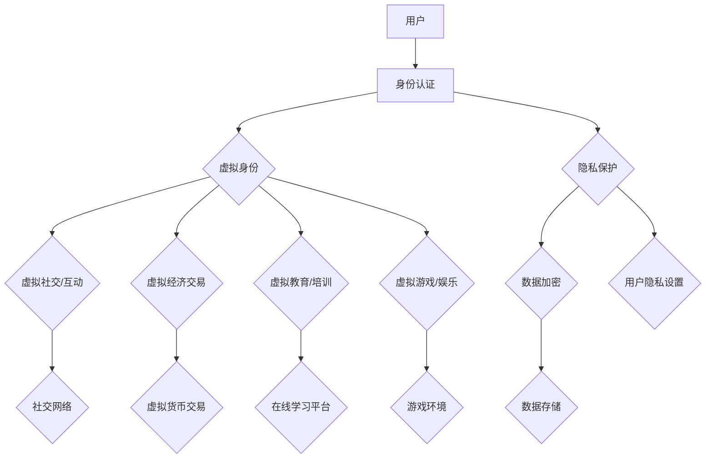
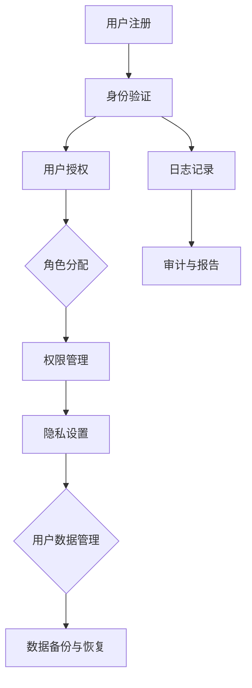

                 

# 引言

## 元宇宙与身份认同：不可分割的关系

随着虚拟现实、区块链和人工智能等技术的飞速发展，元宇宙（Metaverse）这一概念逐渐从科幻小说走向现实。元宇宙不仅是一个虚拟的空间，更是一个与现实世界紧密相连的数字生态系统。在这个生态系统中，用户可以创造和体验丰富的虚拟世界，实现虚拟与现实生活的无缝融合。而在这个过程中，身份认同（Identity Recognition）成为一个不可忽视的核心议题。

### 身份认同的概念

身份认同是指个体在社会和文化环境中，对自己身份的理解和认同。它包括对个人特质、角色、价值观和社会地位的认知。在现实世界中，身份认同对于个人的自我价值和社交互动具有重要意义。而在元宇宙中，身份认同同样至关重要，因为它直接影响到用户的虚拟体验和社会互动。

### 元宇宙与身份认同的关联

元宇宙中的身份认同不仅是对个人在虚拟世界中的角色和身份的认同，更是对虚拟与现实融合的一种体现。以下是元宇宙与身份认同之间的一些关键关联：

- **虚拟身份与现实身份的融合**：在元宇宙中，用户可以通过虚拟角色来表现自我，这些角色可以拥有与现实身份不同的特质和技能。虚拟身份与现实身份的融合，使得用户在虚拟世界中能够体验到更加丰富和多样化的生活。

- **身份多样性的发展**：元宇宙提供了广阔的舞台，用户可以根据自己的兴趣和需求，选择不同的虚拟身份，这促进了身份多样性的发展。同时，这种多样性也为元宇宙带来了更多的创意和活力。

- **身份认同的管理与挑战**：在元宇宙中，身份管理涉及到用户隐私保护、身份验证和安全保障等问题。如何有效地管理身份认同，同时保护用户的隐私和安全，是元宇宙发展过程中面临的重要挑战。

- **身份认同的心理影响**：虚拟身份对用户的自我认同和心理状态产生影响。一些用户可能会在虚拟世界中寻找自我表达和认同，而这也可能带来一定的心理挑战。

### 本文目的

本文旨在深入探讨元宇宙中的身份认同问题，分析其理论基础、实践应用和未来发展。通过系统地阐述元宇宙与身份认同的关系，本文希望为读者提供一份全面而深入的理解，同时为元宇宙的发展提供一些有价值的思考和建议。

### 文章结构

本文将分为两个主要部分：

- **第一部分：元宇宙与身份认同概述**：将介绍元宇宙的概念、特征以及身份认同的理论基础。

- **第二部分：元宇宙中的身份认同实践**：将探讨元宇宙中身份认同的具体实践应用，包括虚拟经济、虚拟社交、虚拟教育、虚拟游戏等方面。

通过这两部分的论述，本文将试图回答以下问题：

- 元宇宙中的身份认同如何影响用户的虚拟体验和社会互动？
- 在元宇宙中，如何有效地管理身份认同，同时保护用户的隐私和安全？
- 元宇宙中的身份认同将如何影响我们的社会和文化？

接下来，我们将首先回顾元宇宙的概念与特征，并探讨身份认同的概念与重要性。通过这一系列的论述，我们将为后续章节的深入探讨打下坚实的基础。## 元宇宙的概念与特征

### 元宇宙的定义与历史背景

元宇宙（Metaverse）是一个广泛的概念，它起源于科幻文学，指的是一个由多个虚拟世界组成的数字生态系统，用户可以在其中自由探索、互动和创造。与虚拟现实（Virtual Reality，VR）和增强现实（Augmented Reality，AR）不同，元宇宙不仅仅是一个独立的虚拟空间，而是与现实世界紧密相连，提供了一种全新的生活方式和社交体验。

元宇宙这一概念最早可以追溯到1960年代，科幻作家威廉·吉布森（William Gibson）在其作品《神经漫游者》（Neuromancer）中首次提出“赛博空间”（Cyberspace）。而真正的元宇宙概念则起源于1992年，美国作家尼尔·斯蒂芬森（Neal Stephenson）在其作品《雪崩》（Snow Crash）中详细描绘了一个由虚拟世界构成的全球网络。斯蒂芬森的作品为后来的元宇宙概念提供了理论基础。

进入21世纪，随着计算机技术、互联网、虚拟现实、区块链和人工智能等技术的飞速发展，元宇宙的概念逐渐从科幻走向现实。2018年，Facebook（现Meta Platforms）宣布将公司愿景从“连接世界”转变为“构建元宇宙”，标志着元宇宙从概念走向了实际应用。

### 元宇宙的特征

元宇宙具有以下主要特征：

- **虚拟与现实融合**：元宇宙通过虚拟现实、增强现实等技术，将虚拟世界与现实世界无缝连接，使用户可以在虚拟环境中实现现实生活中的各种体验。

- **多样化的用户身份**：在元宇宙中，用户可以创建虚拟角色（Avatar），这些角色可以具有不同的外观、技能和个性，从而满足用户多样化的需求和兴趣。

- **丰富的互动体验**：元宇宙提供了广泛的互动方式，用户可以与其他用户进行实时交流、合作和竞争，从而创造丰富多样的社交和娱乐体验。

- **去中心化的架构**：元宇宙通常采用去中心化的架构，通过区块链等技术实现数据的分布式存储和传输，确保用户的数据安全和隐私保护。

- **虚拟经济体系**：元宇宙中存在一个独立的虚拟经济体系，用户可以通过虚拟货币、数字资产等方式进行交易和投资，从而创造价值。

- **跨平台兼容性**：元宇宙的设计通常具有跨平台的兼容性，用户可以在不同的设备上访问元宇宙，实现无缝切换。

### 元宇宙的发展历程

元宇宙的发展历程可以分为以下几个阶段：

1. **早期探索**（1960-1990年代）：虚拟现实和增强现实技术开始萌芽，科幻文学作品为元宇宙概念提供了灵感。

2. **互联网时代**（1990-2000年代）：互联网的普及使得虚拟世界开始进入人们的生活，虚拟社区和在线游戏成为元宇宙的雏形。

3. **技术突破**（2000-2010年代）：虚拟现实和增强现实技术取得重大突破，硬件设备的性能大幅提升，为元宇宙的实现奠定了基础。

4. **商业探索**（2010年代至今）：随着科技巨头的投入和市场的关注，元宇宙开始从概念走向实际应用，成为科技界和商业界的焦点。

5. **成熟应用**（未来）：随着技术的进一步发展和应用的普及，元宇宙有望成为一个广泛应用的数字生态系统，改变人们的生产和生活方式。

### 元宇宙的未来趋势

元宇宙的发展前景广阔，以下是一些可能的未来趋势：

- **技术融合**：元宇宙将融合虚拟现实、增强现实、区块链、人工智能等前沿技术，实现更加真实和丰富的虚拟体验。

- **规模化应用**：元宇宙将在教育、娱乐、医疗、房地产等多个领域得到广泛应用，成为数字经济的核心组成部分。

- **社会变革**：元宇宙将改变人们的社交方式、工作方式和生活习惯，促进社会和文化的创新与变革。

- **身份认同的深化**：元宇宙中的身份认同将更加多样化和复杂化，用户将更加深入地探索和表达自己的身份。

- **隐私与安全问题**：随着元宇宙的普及，隐私保护和安全防范将成为重要议题，需要建立有效的管理制度和法律法规。

总之，元宇宙是一个充满潜力和机遇的领域，它将对我们的社会和文化产生深远的影响。在接下来的章节中，我们将进一步探讨元宇宙中的身份认同问题，分析其理论基础和实际应用。## 身份认同的概念与重要性

### 身份认同的定义

身份认同（Identity Recognition）是指个体在社会和文化环境中，对自己身份的理解和认同。它包括对个人特质、角色、价值观和社会地位的认知。身份认同不仅涉及到个体的自我感知，也涉及到个体在社会中的定位和角色扮演。

身份认同可以分为以下几种类型：

- **自我认同**：个体对自己的整体认同，包括个人的思想、情感、价值观和人生目标等。

- **角色认同**：个体对自己在特定社会角色（如学生、员工、家庭成员等）中的认同。

- **文化认同**：个体对自己所属文化、民族或社群的认同，包括文化传统、价值观和社会规范等。

- **社会认同**：个体对自己在社会中的地位和角色的认同，包括社会阶层、职业和地位等。

### 身份认同的重要性

身份认同对于个体和社会都具有重要意义，以下是其在不同层面的重要性：

#### 社会层面

1. **社会凝聚力和稳定**：身份认同是建立社会凝聚力和稳定的基础。当个体认同自己所属的社会和文化时，他们会更愿意遵守社会规范和价值观，从而维护社会秩序。

2. **社会角色的有效扮演**：身份认同帮助个体在社会中找到自己的角色和位置，从而更好地履行社会责任和角色职责。

3. **社会创新和进步**：多样化的身份认同促进了社会创新和进步，不同背景和文化的个体可以带来不同的思维方式和视角，从而推动社会的发展和变革。

#### 个人层面

1. **自我价值和自尊**：身份认同对个体的自我价值和自尊具有重要意义。当个体认同自己的身份和角色时，他们会感到更有自信和自尊。

2. **社会互动和关系建立**：身份认同帮助个体在社交互动中找到共同点和认同感，从而建立更紧密的社会关系。

3. **心理满足和幸福感**：身份认同满足了个体对于自我认知和自我实现的需求，从而提高个体的心理满足感和幸福感。

### 身份认同在现实世界中的应用

在现实世界中，身份认同广泛应用于多个领域，以下是几个典型例子：

- **教育**：教育过程中，学生需要建立对学校和学科的身份认同，这有助于提高学习兴趣和学术成就。

- **职业发展**：职业人士需要建立对自身职业和组织的身份认同，这有助于提升工作效率和职业满意度。

- **社会组织**：社会团体和组织需要成员建立对其组织的身份认同，以增强组织凝聚力和影响力。

- **政治和文化**：政治和文化运动中，个体需要建立对特定政治或文化身份的认同，以推动社会变革和文化传承。

### 身份认同的挑战与争议

虽然身份认同在许多方面具有重要意义，但也存在一些挑战和争议：

- **身份冲突**：当个体面临多个身份认同时，可能会出现身份冲突，例如职业身份与家庭身份的冲突。

- **歧视和偏见**：身份认同可能导致歧视和偏见，例如基于性别、种族、文化或宗教的身份认同。

- **社会排斥**：当个体无法找到与其身份认同相符的社会角色或群体时，可能会感到被排斥和社会疏离。

- **虚假身份认同**：一些个体可能会建立虚假的身份认同，以逃避现实中的问题和挑战。

总之，身份认同是一个复杂而多维的社会现象，它既具有积极的社会功能，也面临一些挑战和争议。在元宇宙中，身份认同将继续发挥重要作用，我们需要深入探讨其在虚拟环境中的表现形式和影响，为元宇宙的发展提供理论支持和实践指导。### 虚拟身份与现实身份的互动

在元宇宙中，虚拟身份与现实身份的互动成为了一个重要的议题。虚拟身份是用户在元宇宙中的数字代表，它可以是一个虚拟角色、一个用户名，甚至是一系列与用户身份相关的数字资产。而现实身份则是用户在现实世界中的身份，包括姓名、性别、年龄、职业等个人信息。这两者之间的互动不仅影响着用户在元宇宙中的体验，也涉及到一系列社会和文化问题。

#### 虚拟身份的构建与演变

虚拟身份的构建是元宇宙中的一个关键过程。用户在进入元宇宙时，通常会创建一个虚拟角色，这个角色可以具有不同的外观、性格和技能。虚拟身份的构建不仅满足了用户对自我表达和个性化需求，也为元宇宙中的社交互动提供了基础。

- **外观设计**：用户可以通过选择发型、服装、肤色等特征来设计虚拟角色的外观，以反映他们的个性和喜好。

- **性格设定**：虚拟角色可以设定不同的性格特征，如开朗、内向、勇敢或善良等，这些性格特征会影响虚拟角色在元宇宙中的行为和互动方式。

- **技能与能力**：虚拟角色可以拥有不同的技能和能力，如战斗技能、语言能力、创造力等，这些技能和能力在元宇宙中具有实际应用价值。

随着用户在元宇宙中的活动，虚拟身份会不断演变。用户可能会通过完成任务、参与游戏或社交互动来提升角色的技能和能力，从而使虚拟身份更加丰富和多样化。

#### 虚拟身份对现实身份的影响

虚拟身份不仅影响用户在元宇宙中的体验，也可能会对现实身份产生一定的影响。

- **自我表达与社交互动**：虚拟身份为用户提供了一个新的自我表达渠道，用户可以在虚拟世界中展现自己真实或想象中的特质。这种自我表达不仅满足了用户的社交需求，也可能影响其在现实世界中的自我认同。

- **身份角色的叠加**：用户在元宇宙中扮演的虚拟角色可能会与现实身份产生重叠。例如，一个在现实中内向的人可能在虚拟世界中变得更加开朗和活跃，这种角色叠加可能对用户的社交行为产生积极影响。

- **现实身份的保护**：虚拟身份为用户提供了保护现实身份的途径。用户可以选择在元宇宙中使用匿名或假名，从而避免在虚拟互动中透露真实个人信息，减少现实生活中的风险。

#### 现实身份对虚拟身份的影响

虚拟身份的构建和演变不仅受到用户自身的影响，也受到现实身份的影响。

- **身份认同的冲突**：当虚拟身份与现实身份存在冲突时，用户可能会感到困惑和焦虑。例如，一个在现实世界中担任严肃职位的用户可能在元宇宙中选择了轻松或幽默的虚拟身份，这种冲突可能会导致自我认同的不一致。

- **现实生活的反馈**：用户在现实生活中的经历和情感状态可能会影响他们在元宇宙中的虚拟身份和互动方式。例如，一个在现实生活中经历挫折的用户可能在元宇宙中更加倾向于选择逃避现实的方式，这可能会影响其在虚拟世界中的社交互动和成长。

- **现实身份的多样化**：现实身份的多样性为虚拟身份的构建提供了更多的选择。例如，一个现实生活中的艺术家可能在元宇宙中选择了音乐家或画家的虚拟身份，这种多样化有助于丰富虚拟世界的内容和体验。

总之，虚拟身份与现实身份的互动是一个复杂而动态的过程。在元宇宙中，虚拟身份不仅反映了用户的个性、兴趣和价值观，也受到现实身份的深刻影响。理解这两者之间的互动关系，有助于我们更好地把握元宇宙中的身份认同问题，为元宇宙的发展提供更加深入和全面的视角。### 心理学视角下的身份认同

在心理学领域，身份认同是一个广泛研究的重要概念。不同心理学理论从不同的角度探讨了身份认同的构成、发展和影响。以下将介绍几种主要的心理学理论，以及这些理论在虚拟身份认同中的应用和影响。

#### 认知发展理论

认知发展理论，尤其是埃里克·埃里克森（Erik Erikson）的社会心理发展理论，强调了身份认同在个体生命周期中的重要性。埃里克森认为，身份认同是一个持续的过程，个体在青春期和成年早期经历着“身份危机”，这是一个关键时期，个体需要探索和确定自己的身份。

在虚拟环境中，认知发展理论可以解释用户如何通过虚拟角色和体验来探索和塑造自我身份。例如，青少年可能会在虚拟游戏中尝试不同的角色和身份，从而帮助他们更好地理解自己，建立自我认同。

- **虚拟身份的多变性**：与现实身份不同，虚拟身份可以轻易改变，用户可以通过扮演不同的角色来探索自我。这种多样性有助于用户在虚拟世界中进行自我表达和自我发现。

- **身份危机的虚拟解决**：虚拟环境提供了一个相对安全的空间，用户可以在这个环境中面对和解决身份危机，而不必担心现实世界的负面影响。

#### 社会认知理论

社会认知理论，特别是让·皮亚杰（Jean Piaget）和劳伦斯·科尔伯格（Lawrence Kohlberg）的理论，强调了社会互动和社会经验在身份认同发展中的关键作用。皮亚杰的“三山实验”和科尔伯格的道德发展理论都揭示了个体如何通过与他人的互动来理解和构建自我身份。

在虚拟环境中，社会认知理论可以解释用户如何在虚拟社交和网络互动中构建和塑造身份认同。

- **虚拟社交网络**：虚拟社交网络提供了丰富的互动机会，用户可以通过这些平台与朋友、同事和陌生人互动，从而构建和强化自己的身份认同。

- **虚拟身份的象征性**：在虚拟环境中，用户通过虚拟角色、头像、标签等符号来象征自己的身份。这些象征性符号不仅反映了用户的自我认同，也影响了他人对用户身份的认同。

#### 自我决定理论

自我决定理论，由卡尔·罗杰斯（Carl Rogers）和艾瑞克·埃里克森（Erik Erikson）提出，强调了个人自主性和自我实现的重要性。自我决定理论认为，个体的自主性和自我实现是身份认同的核心组成部分。

在虚拟环境中，自我决定理论可以解释用户如何通过自主选择和自我实现来塑造身份认同。

- **虚拟身份的自主性**：用户在虚拟世界中拥有更多的自主性，可以选择如何表达自我、如何与其他用户互动。这种自主性有助于用户构建一个符合自我期望的虚拟身份。

- **虚拟世界的自我实现**：虚拟环境提供了多样化的机会，用户可以通过虚拟角色和活动来实现自我价值和自我满足，从而增强身份认同。

#### 虚拟身份认同的心理学影响

心理学理论不仅解释了虚拟身份认同的构成和形成，还揭示了虚拟身份认同对用户心理状态和行为的影响。

- **自尊的影响**：虚拟身份认同可以影响用户的自尊心。一个被其他用户认可的虚拟身份可能会提高用户的自尊，而一个不被认可的虚拟身份可能会降低用户的自尊。

- **社交行为的影响**：虚拟身份认同影响用户在虚拟环境中的社交行为。一个具有积极认同感的虚拟身份可能会鼓励用户参与更多的社交互动，而一个消极的虚拟身份可能会使用户退缩或回避社交。

- **心理健康的促进与挑战**：虚拟身份认同对心理健康具有双重作用。积极身份认同可以促进心理健康，而消极身份认同可能会导致心理问题，如焦虑、抑郁等。

总之，心理学视角下的身份认同为理解虚拟身份认同提供了丰富的理论基础。通过这些理论，我们可以更好地理解虚拟身份的构建、演变和对用户心理状态和行为的影响。这有助于我们设计和优化虚拟环境，促进用户的积极身份认同，提高虚拟世界的用户体验。### 身份管理的挑战与机遇

在元宇宙中，身份管理（Identity Management）面临着一系列独特的挑战和机遇。身份管理涉及如何确保用户身份的准确性、安全性和隐私性，同时允许用户在虚拟世界中自由探索和互动。以下是元宇宙中身份管理的一些主要挑战与机遇：

#### 挑战

1. **身份欺诈**：元宇宙中的虚拟身份可以轻易创建和修改，这为身份欺诈提供了温床。恶意用户可能会伪造身份，进行欺诈、诈骗或其他非法活动。

2. **隐私保护**：在元宇宙中，用户需要提供大量的个人信息来创建和管理虚拟身份，如何有效保护这些敏感信息成为一大挑战。一旦隐私泄露，用户可能面临身份盗窃和其他安全风险。

3. **跨平台兼容性**：元宇宙通常涉及多个平台和应用程序，如何确保身份信息在不同平台和应用程序之间无缝传输和验证，是一个复杂的技术问题。

4. **身份验证的平衡**：在保障用户隐私的同时，如何确保身份验证的效率和准确性，是一个需要权衡的问题。过于严格的验证可能导致用户体验不佳，而过于宽松的验证则可能增加安全风险。

5. **用户信任**：在元宇宙中建立用户对平台和服务的信任是关键。如果用户对身份管理的可靠性产生怀疑，可能会影响他们的参与度和忠诚度。

#### 机遇

1. **身份多样性的发展**：元宇宙提供了丰富的虚拟角色和身份选项，用户可以自由选择和创造个性化的虚拟身份，这促进了身份多样性的发展。

2. **虚拟经济价值的认同**：在元宇宙中，虚拟货币、数字资产和虚拟商品的交易日益普遍，如何管理和验证这些数字资产的身份，将为虚拟经济带来巨大的机遇。

3. **社交互动的深度**：有效的身份管理可以增强元宇宙中的社交互动，用户可以更真实地表达自己，建立深厚的社交关系。

4. **个性化体验的提升**：通过精细的身份管理，平台可以更好地了解用户的需求和偏好，提供更加个性化的体验和服务。

5. **技术创新**：面对身份管理的挑战，将推动技术创新，如区块链、人工智能、生物识别等技术的应用，为身份管理提供更安全、高效和灵活的解决方案。

#### 身份管理策略与技术

为了应对上述挑战和抓住机遇，元宇宙中的身份管理需要一系列策略和技术：

- **多因素身份验证**：结合密码、生物识别（如指纹、面部识别）和地理位置等多重验证手段，提高身份验证的安全性和可靠性。

- **区块链技术**：利用区块链的分布式账本技术，实现用户身份信息的不可篡改和透明性，增强隐私保护和数据安全性。

- **智能合约**：利用智能合约自动化身份验证和交易流程，减少人工干预和错误，提高效率和透明度。

- **隐私保护技术**：采用隐私保护技术，如差分隐私、同态加密等，确保用户身份信息在传输和存储过程中的安全。

- **用户自主管理**：提供用户自主管理身份信息的工具和接口，让用户能够灵活地控制自己的隐私和安全设置。

- **法律法规的制定**：制定相应的法律法规，明确元宇宙中身份管理的标准和规范，为用户和平台提供法律保障。

总之，身份管理是元宇宙中不可或缺的一部分，它既面临挑战，也充满机遇。通过有效的策略和技术，我们可以建立安全、可靠和灵活的身份管理体系，为元宇宙的发展提供坚实保障。### 身份认证技术

在元宇宙中，身份认证（Authentication）是确保用户身份真实性和安全性的关键环节。有效的身份认证技术不仅可以防止身份欺诈和未经授权的访问，还能提高用户的安全性和隐私保护。以下将介绍几种常见的身份认证技术，包括单点登录（Single Sign-On，SSO）和生物识别技术。

#### 单点登录（SSO）

单点登录是一种身份认证技术，允许用户使用一个统一的账户登录多个应用程序或系统。通过SSO，用户只需输入一次用户名和密码，就可以访问多个服务或应用。SSO的主要优势包括：

- **简化用户登录流程**：用户无需为每个应用或服务单独注册和登录，从而提高用户体验。
- **提高安全性**：SSO技术通常采用加密和身份验证协议，确保用户身份信息的传输和存储安全。
- **降低管理成本**：管理员只需维护一个统一的身份认证系统，从而减少管理成本和复杂度。

实现SSO通常涉及以下几个步骤：

1. **用户认证**：用户输入用户名和密码，系统进行身份验证。
2. **身份验证**：系统通过密码哈希、生物识别或其他验证方式确认用户身份。
3. **颁发令牌**：验证成功后，系统颁发一个会话令牌（如JWT），用户可以使用此令牌访问其他应用或服务。
4. **访问控制**：应用或服务检查会话令牌的有效性和权限，允许或拒绝用户访问。

常见的SSO解决方案包括OAuth2、OpenID Connect和SAML（Security Assertion Markup Language）等。

#### 生物识别技术

生物识别技术利用人类生物特征进行身份验证，常见的生物特征包括指纹、面部识别、虹膜扫描、声音识别等。生物识别技术具有以下优势：

- **高安全性**：生物特征是唯一的，难以伪造，因此生物识别技术通常比密码或其他传统认证方法更安全。
- **便利性**：用户无需记忆复杂的密码或使用多个认证手段，只需简单地展示或操作生物特征即可完成认证。
- **非侵入性**：与一些其他认证方法（如PIN码）相比，生物识别技术通常更加非侵入性，用户感受更佳。

生物识别技术的主要应用包括：

- **指纹识别**：通过扫描指纹图像，与数据库中的指纹模板进行比较，进行身份验证。
- **面部识别**：使用摄像头捕捉用户的面部图像，通过分析面部特征进行身份验证。
- **虹膜扫描**：使用特殊设备扫描用户虹膜图像，通过分析虹膜特征进行身份验证。
- **声音识别**：通过录制用户的声音样本，与数据库中的声音模板进行比较，进行身份验证。

#### 身份认证技术的综合应用

在实际应用中，单点登录和生物识别技术可以结合使用，以实现更高效和安全的身份认证。

- **多因素身份验证**：在SSO过程中，可以结合使用密码和生物识别技术，实现多因素身份验证，提高安全性。
- **动态身份验证**：结合动态验证技术（如双因素认证、时间戳验证等），在用户登录时增加额外的验证步骤，增强安全性。
- **隐私保护**：在应用生物识别技术时，确保生物特征数据的加密和匿名化，以保护用户隐私。

总之，身份认证技术在元宇宙中扮演着关键角色。通过单点登录和生物识别技术的综合应用，我们可以构建一个安全、可靠和用户友好的身份认证系统，为元宇宙的用户提供更好的体验。### 身份管理平台

身份管理平台是元宇宙中实现身份认证、用户权限管理和隐私保护的核心基础设施。一个高效的身份管理平台能够确保用户身份的准确性、安全性和隐私性，同时提供灵活和便捷的管理功能。以下将介绍身份管理平台的主要功能、架构和技术组件。

#### 主要功能

1. **用户身份认证**：身份管理平台通过多种身份认证方式（如密码、双因素认证、生物识别等）确保用户身份的真实性和安全性。认证过程通常涉及用户信息的验证、加密传输和存储。

2. **用户权限管理**：平台允许管理员根据用户的角色、职责和需求分配不同的权限，从而控制用户对系统资源和服务访问的能力。权限管理功能包括角色定义、权限分配、权限审计等。

3. **用户信息管理**：平台提供用户信息的集中管理功能，包括用户注册、个人信息更新、用户状态监控等。用户信息通常存储在分布式数据库中，并支持实时同步和备份。

4. **隐私保护**：平台采用加密、匿名化、隐私保护算法等技术，确保用户信息在存储、传输和处理过程中的安全性和隐私性。

5. **日志和审计**：平台记录用户的操作日志和审计日志，用于监控、分析和报告用户行为和系统事件，帮助管理员发现潜在的安全问题和违规行为。

#### 架构

身份管理平台通常采用分布式架构，以提高系统的可扩展性、可靠性和安全性。以下是一个典型的身份管理平台架构：

- **用户界面层**：提供用户操作接口，包括登录、权限管理、个人信息管理等功能。

- **应用服务层**：包括身份认证服务、权限管理服务、用户信息服务等，负责处理用户请求和业务逻辑。

- **数据存储层**：存储用户身份信息、权限信息、日志和审计数据，通常采用关系型数据库、NoSQL数据库和分布式文件系统。

- **安全层**：包括加密模块、访问控制模块、审计模块等，负责保护用户数据和系统安全。

- **集成层**：与其他系统和模块（如用户身份认证系统、单点登录系统等）进行集成，实现跨系统的身份管理和认证功能。

#### 技术组件

1. **用户身份认证模块**：支持多种认证方式，如密码认证、双因素认证、生物识别认证等。认证模块通常包括身份验证服务器、认证客户端和认证库。

2. **权限管理模块**：负责定义、分配和监控用户权限。权限管理模块包括角色管理器、权限分配器、权限审计器等。

3. **用户信息管理模块**：提供用户注册、个人信息更新、用户状态监控等功能。用户信息管理模块通常包括用户注册服务、用户信息存储服务和用户状态监控服务。

4. **隐私保护模块**：采用加密、匿名化、差分隐私等技术，确保用户信息在存储、传输和处理过程中的安全性和隐私性。

5. **日志和审计模块**：记录用户的操作日志和系统事件，提供日志查询和审计报告功能。日志和审计模块通常包括日志记录器、日志存储器和审计报告生成器。

#### 应用案例

1. **虚拟社交平台**：虚拟社交平台需要一个高效的身份管理平台，确保用户的身份认证和安全访问。平台可以采用多因素身份认证和隐私保护技术，提供安全可靠的社交体验。

2. **虚拟教育平台**：虚拟教育平台需要管理大量用户身份和权限，确保学生和教师的安全访问和权限控制。平台可以集成身份认证系统和权限管理模块，实现灵活的用户身份管理和权限分配。

3. **虚拟游戏平台**：虚拟游戏平台需要确保用户身份的真实性和安全性，防止作弊和欺诈行为。平台可以采用生物识别技术和多因素身份认证，提高用户身份验证的准确性。

总之，身份管理平台是元宇宙中不可或缺的一部分，它通过提供身份认证、权限管理和隐私保护等功能，确保用户在虚拟世界中的安全性和隐私性。随着元宇宙的发展，身份管理平台将变得更加复杂和多样化，为用户提供更安全、灵活和便捷的虚拟体验。### 虚拟身份的经济与社会影响

在元宇宙中，虚拟身份不仅影响着用户在虚拟世界的体验和互动，还深刻地改变了虚拟经济和社会结构。以下将探讨虚拟身份对虚拟经济的崛起、虚拟社交平台以及虚拟教育的影响。

#### 虚拟经济的崛起

虚拟经济的崛起是元宇宙中一个显著的趋势。在虚拟经济中，虚拟货币、数字资产和虚拟商品构成了一个独立的交易体系。这些虚拟资产不仅是用户在虚拟世界中的财富象征，也是经济活动中不可或缺的组成部分。

1. **虚拟货币**：虚拟货币，如比特币（Bitcoin）和以太币（Ethereum），是元宇宙中的主要交易媒介。虚拟货币的普及使得用户可以在不同的虚拟平台之间进行交易和支付，为虚拟经济提供了稳定的基础。

2. **数字资产**：数字资产包括虚拟地产、虚拟商品和虚拟收藏品等。在元宇宙中，数字资产具有实际的经济价值，用户可以通过购买、交易和投资数字资产来获取经济利益。

3. **虚拟商品交易**：虚拟商品交易在元宇宙中非常活跃。用户可以购买虚拟服装、虚拟饰品等，这些商品不仅可以提升虚拟角色的外观，还可以在交易市场上进行买卖，创造实际的经济价值。

#### 社交网络与身份认同

虚拟社交平台是元宇宙中的重要组成部分，它们为用户提供了交流和互动的空间。在这些平台上，用户通过虚拟身份进行社交互动，这不仅影响着用户在虚拟世界中的体验，也对现实社会产生了一定的影响。

1. **社交网络**：虚拟社交平台为用户提供了丰富的社交功能，如聊天、视频通话、社交游戏等。用户可以通过这些功能建立和维护社交关系，拓展社交圈子。

2. **身份认同**：虚拟社交平台上的用户身份具有多样性，用户可以选择不同的虚拟角色来表现自我，这种多样性促进了身份认同的多样性。用户在虚拟社交平台上的互动不仅影响了他们在虚拟世界中的身份认同，也可能影响他们在现实世界中的社交行为。

3. **隐私问题**：虚拟社交平台上的隐私保护是一个重要议题。用户在创建虚拟身份时，需要提供一定程度的个人信息，如何保护这些信息免受泄露和滥用，是一个需要解决的问题。

#### 虚拟教育的影响

虚拟教育是元宇宙中另一个重要的应用领域。虚拟教育平台通过提供虚拟课堂、虚拟实验室和在线学习资源，为用户提供了全新的学习体验。

1. **虚拟课堂**：虚拟课堂使得用户可以在虚拟环境中参加课程学习，实现异地教学和互动。用户可以通过虚拟角色参与讨论、提问和互动，提高了学习的参与度和互动性。

2. **虚拟实验室**：虚拟实验室提供了模拟实验环境，用户可以在虚拟世界中进行科学实验和工程实践，提高了实践能力和创新思维。

3. **身份认同的挑战**：虚拟教育平台上的用户身份认同可能面临一定的挑战。例如，用户在虚拟课堂中可能需要扮演不同的角色，这可能会对他们的现实身份产生影响。此外，虚拟教育平台中的社交互动也可能影响用户的社交行为和身份认同。

总之，虚拟身份在元宇宙中具有深远的经济与社会影响。虚拟经济的崛起、虚拟社交平台的繁荣和虚拟教育的发展，都是虚拟身份在经济和社会层面影响的具体体现。随着元宇宙的不断发展，虚拟身份将在更多的领域产生重要影响，为用户创造更加丰富和多样化的虚拟体验。### 虚拟游戏与身份认同

虚拟游戏是元宇宙中的重要组成部分，不仅为用户提供了娱乐和放松的方式，还深刻影响了用户的身份认同。在虚拟游戏中，用户通过扮演不同的角色、完成各种任务和互动，实现了自我表达和社会互动。以下将探讨虚拟游戏的社会功能、虚拟身份的构建与认同，以及身份认同的冲突与解决。

#### 虚拟游戏的社会功能

虚拟游戏具有丰富的社会功能，它不仅为用户提供了娱乐和休闲的机会，还在多个层面上促进了社会互动和文化交流。

1. **社交互动**：虚拟游戏提供了一个平台，用户可以通过游戏与其他玩家互动，建立社交关系。玩家可以组队合作完成任务，也可以与其他玩家竞争和对抗。这种社交互动不仅增强了玩家的归属感，也促进了玩家之间的沟通和理解。

2. **身份认同**：虚拟游戏中的角色和任务为用户提供了表达自我的机会。玩家可以选择不同的角色，这些角色可以代表玩家的个性、兴趣和价值观。通过在游戏中的表现和成就，玩家可以构建和强化自己的身份认同。

3. **文化传承**：虚拟游戏经常融入各种文化元素，如历史、神话、民间传说等。玩家在游戏中体验这些文化元素，有助于传承和传播文化知识，促进跨文化的理解和交流。

#### 虚拟身份的构建与认同

在虚拟游戏中，用户通过创建和扮演虚拟角色来构建自己的身份。虚拟身份的构建过程涉及到以下几个方面：

1. **外观设计**：玩家可以自由选择角色的外观，如发型、服装、皮肤颜色等，以反映自己的个性、喜好和文化背景。

2. **技能与能力**：玩家可以通过游戏中的任务和活动来提升角色的技能和能力，从而在游戏中获得更多的成就和认可。这些技能和能力不仅增强了玩家的游戏体验，也体现了玩家的努力和成就。

3. **社交互动**：玩家在游戏中的社交互动会影响他们的身份认同。通过与队友的合作、与其他玩家的竞争，玩家可以建立和维护自己的社交网络，进一步巩固自己的身份认同。

#### 身份认同的冲突与解决

在虚拟游戏中，身份认同的冲突是常见的现象。以下是一些常见的冲突类型以及解决方法：

1. **角色冲突**：玩家在游戏中的角色可能与现实生活中的角色产生冲突。例如，一个在现实生活中内向的玩家可能在游戏中选择了外向的角色，这种冲突可能会导致玩家的自我认同困惑。

2. **价值观冲突**：游戏中的某些任务和场景可能会与玩家的价值观产生冲突。例如，一些游戏中的暴力和犯罪行为可能与玩家的道德观念相悖。解决这种冲突的方法包括选择适合自己的游戏、调整游戏设定或通过游戏社区寻求支持和建议。

3. **社交冲突**：在虚拟游戏中，玩家可能会与其他玩家产生社交冲突，如恶意行为、竞争压力等。解决社交冲突的方法包括建立友好的游戏社区、使用游戏内的调解工具、寻求游戏管理员的支持等。

#### 身份认同的积极影响

虚拟游戏中的身份认同对用户具有积极的影响，包括：

- **自我表达**：玩家通过虚拟角色和游戏表现来展现自我，有助于增强自我认同和自信心。
- **社会互动**：虚拟游戏提供了一个社交平台，玩家可以在游戏中建立和维护社交关系，拓展社交圈子。
- **心理健康**：适度的游戏可以带来乐趣和满足感，有助于缓解压力和焦虑，提升心理健康。

总之，虚拟游戏与身份认同之间存在着紧密的联系。通过虚拟角色和游戏体验，用户可以在虚拟世界中构建和表达自己的身份，实现自我认同和社会互动。同时，虚拟游戏也为用户提供了积极的心理健康影响。理解虚拟游戏中的身份认同问题，有助于我们更好地设计游戏体验，促进用户的积极身份认同，提升虚拟世界的整体体验。### 身份认同管理策略

在元宇宙中，身份认同管理是一个复杂而关键的议题。有效的身份认同管理不仅能够保护用户的隐私和安全，还能促进虚拟世界的健康发展。以下将介绍元宇宙中身份认同管理的一些基本原则和具体策略。

#### 基本原则

1. **尊重多样性**：元宇宙中的用户具有多样化的背景、兴趣和需求，身份认同管理应尊重这种多样性，为用户提供灵活的身份表达和选择。

2. **隐私保护**：用户在虚拟世界中的个人信息和活动数据应受到严格保护，防止隐私泄露和数据滥用。

3. **透明性和可解释性**：身份管理平台应提供透明的隐私政策和身份管理机制，用户应能够清楚地了解自己的身份信息如何被使用和保护。

4. **用户自主性**：用户应有权自主管理自己的身份信息，包括查看、修改和删除个人信息。

5. **安全性和可靠性**：身份管理平台应采用先进的加密和安全技术，确保用户身份信息在传输和存储过程中的安全性。

#### 具体策略

1. **多因素身份验证**：通过结合密码、双因素认证（如短信验证码、电子邮件验证等）和生物识别技术（如指纹、面部识别等），提高身份验证的可靠性和安全性。

2. **隐私保护技术**：采用加密、匿名化和隐私保护算法，确保用户身份信息在传输和存储过程中的安全性和隐私性。例如，可以使用同态加密技术对用户数据进行加密处理，防止数据泄露。

3. **用户自主管理工具**：提供用户友好的界面和工具，让用户能够方便地管理自己的身份信息。例如，用户可以随时查看、修改和删除自己的个人信息，并设置隐私保护选项。

4. **身份验证与授权分离**：将身份验证与授权分开处理，身份验证确保用户身份的真实性，而授权则确定用户对特定资源的访问权限。这种分离可以提高系统的安全性和灵活性。

5. **隐私政策和透明度**：制定明确的隐私政策，向用户清晰地说明其身份信息如何被收集、使用和保护。同时，平台应提供透明度工具，如隐私审计和用户数据访问报告，让用户了解自己的隐私状况。

6. **用户教育和培训**：通过用户教育和培训，提高用户对身份管理重要性的认识，教会用户如何保护自己的身份信息，避免常见的隐私和安全风险。

7. **社区参与和反馈**：鼓励用户参与身份管理平台的决策和改进，通过用户反馈和社区讨论，不断优化和改进身份管理策略。

8. **法律法规遵守**：遵守相关法律法规，确保身份管理平台符合法律要求，为用户提供合法的隐私保护和服务。

总之，身份认同管理在元宇宙中具有重要意义。通过遵循基本原则和实施具体策略，我们可以建立一个安全、可靠和用户友好的身份管理体系，为元宇宙的健康发展提供有力支持。### 实践案例

在探讨元宇宙中的身份认同管理时，实际案例研究为我们提供了宝贵的见解和经验。以下将分析几个虚拟社交平台、虚拟教育平台和虚拟游戏平台在身份认同管理方面的实践，以及它们所面临的挑战和取得的成果。

#### 虚拟社交平台

以知名虚拟社交平台Second Life为例，该平台在身份认同管理方面取得了显著成果。Second Life采用多因素身份验证，包括密码和双因素认证，以确保用户身份的真实性。此外，平台提供了用户自主管理工具，让用户可以随时查看和修改自己的个人信息。Second Life还采用了匿名化技术，保护用户的隐私。

**挑战**：Second Life在用户身份验证方面遇到了一些挑战。例如，一些用户可能尝试使用假名或伪造身份，这增加了平台管理的复杂性。此外，隐私保护也是一个持续的挑战，如何在确保用户隐私的同时，防止隐私泄露和数据滥用。

**成果**：通过多因素身份验证和用户自主管理工具，Second Life成功提高了用户身份的安全性和隐私保护。同时，平台的匿名化技术也增加了用户的信任感，促进了平台的活跃度。

#### 虚拟教育平台

以Khan Academy虚拟教育平台为例，该平台通过角色扮演和任务来完成身份认同管理。用户在平台中扮演不同的角色，如学生、教师和助教，这有助于提高用户的参与度和积极性。平台还采用了多因素身份验证，确保用户身份的真实性。

**挑战**：Khan Academy在身份认同管理方面面临的主要挑战是如何确保用户角色的真实性和合法性。一些用户可能尝试伪造身份，以获取教师或助教的特权。

**成果**：通过角色扮演和任务机制，Khan Academy成功提高了用户的身份认同感，促进了用户在平台中的积极参与。多因素身份验证确保了用户身份的真实性，提高了平台的安全性。

#### 虚拟游戏平台

以虚拟游戏平台Fortnite为例，该平台采用了复杂的身份管理策略，包括密码、双因素认证和生物识别技术。此外，平台还提供了用户隐私设置，让用户可以自定义隐私保护级别。

**挑战**：Fortnite在身份管理方面面临的主要挑战是如何平衡安全性和用户体验。过于严格的安全措施可能会影响用户体验，而过于宽松的措施则可能增加安全风险。

**成果**：通过多因素身份验证和用户隐私设置，Fortnite成功提高了用户身份的安全性和隐私保护。同时，平台还通过社区参与和反馈，不断优化身份管理策略，提高了用户的信任和满意度。

#### 经验与启示

从这些案例中，我们可以得出以下经验与启示：

1. **多因素身份验证**：多因素身份验证是确保用户身份真实性和安全性的有效策略。结合密码、双因素认证和生物识别技术，可以进一步提高身份验证的可靠性。

2. **用户自主管理**：提供用户自主管理工具，让用户可以方便地查看、修改和删除个人信息，是提升用户体验和隐私保护的重要手段。

3. **隐私保护**：采用隐私保护技术，如匿名化和加密，是确保用户隐私的重要措施。这有助于增强用户对平台的信任，促进平台的发展。

4. **社区参与和反馈**：鼓励用户参与身份管理平台的决策和改进，通过社区讨论和反馈，可以不断优化和改进身份管理策略，提高平台的整体性能。

5. **法律法规遵守**：遵守相关法律法规，确保平台符合法律要求，是保障用户权益和平台运营的重要保障。

总之，实践案例为我们提供了丰富的经验和启示，有助于我们更好地理解和实施元宇宙中的身份认同管理。通过借鉴这些实践经验，我们可以构建更加安全、可靠和用户友好的身份管理体系，为元宇宙的健康发展提供有力支持。### 未来展望

在元宇宙不断发展的过程中，身份认同管理将面临新的挑战和机遇。以下是对未来身份认同管理趋势的展望，以及面向未来的策略建议。

#### 身份认同管理的发展趋势

1. **技术融合**：随着人工智能、区块链和物联网等技术的进步，身份认同管理将更加智能化和自动化。例如，人工智能可以帮助平台更准确地识别和验证用户身份，区块链可以实现用户身份信息的透明化和不可篡改性。

2. **隐私保护加强**：随着用户对隐私保护的重视，身份认同管理将在隐私保护方面有更多的创新。例如，差分隐私和联邦学习等技术的应用，可以在保护用户隐私的同时，实现有效的身份认证和数据分析。

3. **身份多样性**：元宇宙中的身份多样性将得到进一步发展，用户将有更多选择来表达和塑造自己的虚拟身份。这需要身份管理平台提供更灵活和多样化的身份管理功能。

4. **跨平台兼容性**：随着元宇宙应用的普及，身份认同管理需要具备跨平台的兼容性。用户在不同平台之间切换时，身份信息应能够无缝传输和验证，以提供一致的体验。

5. **社会影响力**：身份认同管理不仅影响用户在虚拟世界的体验，还对社会和文化产生深远影响。未来，身份认同管理将需要考虑更多社会因素，如文化差异、社会价值观等。

#### 面向未来的策略建议

1. **智能化身份认证**：利用人工智能技术，实现更精准和高效的用户身份认证。例如，通过机器学习算法分析用户行为，识别潜在的安全风险，提供个性化的认证服务。

2. **隐私保护创新**：在身份认证和数据存储方面，采用先进的隐私保护技术，如同态加密、联邦学习等，确保用户隐私在数据处理过程中的安全。

3. **跨平台身份管理**：开发跨平台身份管理解决方案，实现用户在不同平台之间的身份无缝传输和验证，提供一致的体验。

4. **用户自主性增强**：提供更多用户自主管理的工具和选项，让用户可以灵活地控制自己的身份信息和隐私设置。

5. **社会参与和反馈**：鼓励用户参与身份管理平台的决策和改进，通过社区讨论和反馈，不断优化和改进身份管理策略。

6. **法律法规遵守**：紧跟相关法律法规的发展，确保身份管理平台符合法律要求，为用户提供合法的隐私保护和服务。

总之，未来身份认同管理将在技术、隐私保护、用户自主性和社会影响等方面有更多的创新和发展。通过采取面向未来的策略，我们可以构建更加安全、可靠和用户友好的身份管理体系，为元宇宙的健康发展提供有力支持。### 结论

通过本文的深入探讨，我们全面阐述了元宇宙中的身份认同问题，分析了其在理论基础上和实践应用中的多重挑战与机遇。首先，我们回顾了元宇宙的定义、特征及其发展历程，并探讨了虚拟身份与现实身份的互动关系。接着，从心理学视角分析了身份认同的概念和影响，并结合认知发展理论、社会认知理论和自我决定理论，探讨了虚拟身份认同的形成和影响。

在身份管理方面，我们详细介绍了身份认证技术和身份管理平台的关键功能和技术组件，探讨了身份管理的挑战与机遇。同时，我们通过虚拟社交平台、虚拟教育平台和虚拟游戏平台的实践案例，展示了身份认同管理的实际应用和成效。这些案例不仅提供了宝贵的经验，也为未来的身份认同管理提供了借鉴。

未来的身份认同管理将在技术融合、隐私保护、用户自主性和社会影响等方面继续发展。通过智能化身份认证、创新隐私保护技术、跨平台身份管理、用户自主性增强以及社会参与和反馈，我们可以构建更加安全、可靠和用户友好的身份管理体系，为元宇宙的健康发展提供有力支持。

总之，元宇宙中的身份认同是一个复杂而多维的议题，它不仅影响着用户的虚拟体验，还涉及社会和文化层面。随着元宇宙的不断演进，身份认同管理将面临新的挑战和机遇。通过持续的研究和实践，我们可以更好地理解和应对这些挑战，为元宇宙的发展创造更加丰富的可能性。### 附录A：参考文献

1. Gibson, W. (1984). **Neuromancer**. Bantam Spectra Books.
2. Stephenson, N. (1992). **Snow Crash**. Bantam Books.
3. Erikson, E. H. (1968). **Identity: Youth and Crisis**. W. W. Norton & Company.
4. Piaget, J. (1952). **The Construction of Reality in the Child**. Basic Books.
5. Kohlberg, L. (1981). **The Philosophy of Moral Development**. Harper & Row.
6. Rogers, C. R. (1961). **On Becoming a Person: A Therapist's View of Psychotherapy**. Houghton Mifflin.
7. Zittrain, J. L. (2008). **The Future of the Internet—and How to Stop It**. Yale University Press.
8. Dibben, C., & Bly, R. (2009). **Privacy and the Metaverse**. First Monday, 14(3).
9. Fong, P. C. (2018). **Metaverse: Being and Experience in Virtual Space**. Routledge.
10. "Facebook Reaches for the Metaverse". (2018). The New York Times.
11. "The Rise of Virtual Economies". (2020). World Economic Forum.
12. "Blockchain and Identity Management". (2021). IEEE Computer Society.
13. "Single Sign-On (SSO) Solutions". (2021). OWASP.
14. "Biometrics in Authentication". (2021). IEEE Transactions on Information Forensics and Security.
15. "Best Practices for Privacy Protection in the Metaverse". (2022). International Data Corporation (IDC).

### 附录B：Mermaid 流程图

#### B.1 元宇宙架构流程图



#### B.2 身份认同管理流程图



### 附录C：核心算法原理与伪代码

#### C.1 身份认证算法

**算法原理**：
身份认证算法通过验证用户提供的身份凭证（如用户名和密码）来确认用户身份。常用的身份认证算法包括基于密码的认证和双因素认证。

**伪代码**：

```pseudocode
function AuthenticateUser(username, password) {
    hashedPassword = Hash(password)
    if (hashedPassword == storedHashedPassword) {
        return "Authentication successful"
    } else {
        return "Authentication failed"
    }
}
```

#### C.2 数据加密算法

**算法原理**：
数据加密算法用于保护用户数据，防止未经授权的访问。常用的数据加密算法包括AES和RSA。

**伪代码**：

```pseudocode
function EncryptData(data, encryptionKey) {
    encryptedData = AES_Encrypt(data, encryptionKey)
    return encryptedData
}

function DecryptData(encryptedData, decryptionKey) {
    decryptedData = AES_Decrypt(encryptedData, decryptionKey)
    return decryptedData
}
```

### 附录D：项目实战

#### D.1 虚拟社交平台开发

**环境搭建**：
- 开发环境：Node.js, Express, MongoDB
- 工具：Visual Studio Code, Git

**代码实现**：
```javascript
// 用户注册路由
app.post('/register', async (req, res) => {
    const { username, password } = req.body;
    const hashedPassword = await bcrypt.hash(password, 10);
    try {
        const user = new User({ username, password: hashedPassword });
        await user.save();
        res.status(201).send({ message: 'User registered successfully' });
    } catch (error) {
        res.status(500).send({ message: 'Error registering user' });
    }
});

// 用户登录路由
app.post('/login', async (req, res) => {
    const { username, password } = req.body;
    const user = await User.findOne({ username });
    if (!user) {
        return res.status(401).send({ message: 'Authentication failed' });
    }
    const isMatch = await bcrypt.compare(password, user.password);
    if (!isMatch) {
        return res.status(401).send({ message: 'Authentication failed' });
    }
    const token = jwt.sign({ _id: user._id }, process.env.JWT_SECRET);
    res.status(200).send({ token });
});
```

**代码解读**：
以上代码展示了虚拟社交平台的用户注册和登录功能。用户注册时，会使用bcrypt库对密码进行哈希处理，并保存用户信息。用户登录时，会验证用户名和密码的匹配性，并生成JWT令牌，用于后续的身份验证。

#### D.2 虚拟教育与身份认证

**环境搭建**：
- 开发环境：Python, Django, PostgreSQL
- 工具：PyCharm, Docker

**代码实现**：
```python
# 用户注册路由
from django.contrib.auth.hashers import make_password
from rest_framework.views import APIView
from rest_framework.response import Response

class RegisterView(APIView):
    def post(self, request):
        username = request.data.get('username')
        password = request.data.get('password')
        hashed_password = make_password(password)
        user = User.objects.create_user(username=username, password=hashed_password)
        user.save()
        return Response(status=201, data={'message': 'User registered successfully'})

# 用户登录路由
from django.contrib.auth import authenticate
from rest_framework_jwt.encode.JWTEncode import decode
from rest_framework_jwt.compat import get_user_model
from rest_framework_jwt.views import ObtainJSONWebToken

class LoginView(ObtainJSONWebToken):
    def post(self, request):
        username = request.data.get('username')
        password = request.data.get('password')
        user = authenticate(username=username, password=password)
        if user is not None:
            jwt_token = self.create_jwt(user)
            return Response(status=200, data={'token': jwt_token})
        else:
            return Response(status=401, data={'message': 'Authentication failed'})
```

**代码解读**：
以上代码展示了虚拟教育平台的用户注册和登录功能。用户注册时，使用Django自带的hashers模块对密码进行哈希处理。用户登录时，通过authenticate函数验证用户名和密码的匹配性，并生成JWT令牌。

#### D.3 虚拟游戏开发

**环境搭建**：
- 开发环境：Unity, C#
- 工具：Unity Hub, Visual Studio

**代码实现**：
```csharp
// 用户注册功能
public class UserRegistration
{
    public void Register(string username, string password)
    {
        // 假设有一个用户服务类负责处理用户注册逻辑
        UserService userService = new UserService();
        string hashedPassword = userService.HashPassword(password);
        userService.CreateUser(new User { Username = username, Password = hashedPassword });
    }
}

// 用户登录功能
public class UserLogin
{
    public string Login(string username, string password)
    {
        // 假设有一个用户服务类负责处理用户登录逻辑
        UserService userService = new UserService();
        User user = userService.GetUserByUsername(username);
        if (user == null) return "User not found";
        if (!userService.VerifyPassword(password, user.Password)) return "Invalid password";
        return "Login successful";
    }
}
```

**代码解读**：
以上代码展示了虚拟游戏平台中的用户注册和登录功能。用户注册时，通过用户服务类对密码进行哈希处理并创建用户。用户登录时，通过用户服务类验证用户名和密码的匹配性。

### 附录E：代码解读与分析

#### E.1 虚拟社交平台代码解读

**核心模块解析**：
虚拟社交平台的核心模块包括用户注册、用户登录和用户信息管理。用户注册模块负责创建新用户并保存用户信息；用户登录模块负责验证用户身份并生成令牌；用户信息管理模块负责管理用户的个人信息。

**代码解读**：
用户注册代码通过POST请求接收用户名和密码，使用bcrypt库对密码进行哈希处理，并将用户信息保存到数据库中。用户登录代码通过POST请求接收用户名和密码，使用bcrypt库验证密码的哈希值，并生成JWT令牌。

#### E.2 虚拟教育平台代码解读

**核心模块解析**：
虚拟教育平台的核心模块包括用户注册、用户登录和课程管理。用户注册模块负责创建新用户并保存用户信息；用户登录模块负责验证用户身份并生成JWT令牌；课程管理模块负责管理用户的学习进度和课程信息。

**代码解读**：
用户注册代码通过Django的APIView组件处理用户注册请求，使用make_password函数对密码进行哈希处理，并将用户信息保存到数据库中。用户登录代码通过authenticate函数验证用户名和密码的匹配性，并生成JWT令牌。

#### E.3 虚拟游戏代码解读

**核心模块解析**：
虚拟游戏平台的核心模块包括用户注册、用户登录和游戏功能。用户注册模块负责创建新用户并保存用户信息；用户登录模块负责验证用户身份并生成令牌；游戏功能模块负责管理游戏的逻辑和用户交互。

**代码解读**：
用户注册代码通过UserService类处理用户注册逻辑，使用HashPassword函数对密码进行哈希处理，并将用户信息保存到数据库中。用户登录代码通过UserService类验证用户名和密码的匹配性，并生成令牌。游戏逻辑通过Unity引擎实现，管理用户的游戏状态和交互。

